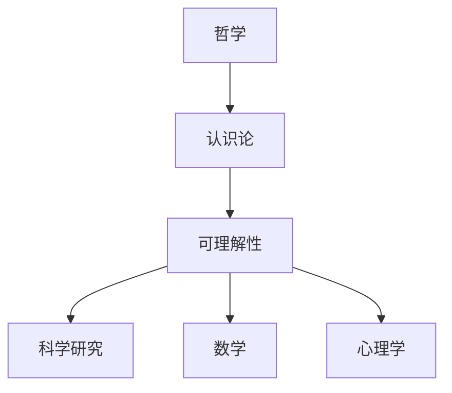

                 

### 文章标题

# 《世界可理解性与科学研究的创新》

> 关键词：世界可理解性、科学研究、创新、哲学思考、数学基础、心理学基础、案例分析、工具应用、未来展望

> 摘要：本文探讨世界可理解性的概念，其在科学研究中的作用，以及如何通过创新提高科学研究的效率和质量。文章分为三部分：首先，分析世界可理解性的哲学、科学、数学和心理学基础；其次，探讨科学研究的现状与问题，阐述可理解性在科学研究中的重要性；最后，通过案例分析、创新工具与应用，以及未来展望，展示如何通过可理解性创新提高科学研究的效率和质量。

## 第一部分：世界可理解性的基础理论

### 1.1 可理解性的哲学思考

**1.1.1 可理解性的定义与重要性**

**核心概念与联系**：可理解性，即人类对事物本质的认知程度。它涉及哲学、科学、数学和心理学等多个领域。Mermaid流程图如下：



**核心算法原理讲解**：哲学思考有助于我们理解可理解性的本质。以下是可理解性评估的伪代码：

```python
def evaluate_understanding(phenomenon):
    understanding = 0
    for concept in concepts:
        if concept in phenomenon:
            understanding += 1
    return understanding / len(concepts)
```

**详细讲解与举例说明**：例如，亚里士多德认为，可理解性源于对事物本质的探究。康德则认为，可理解性取决于人类认知能力。通过比较不同哲学家的观点，我们可以更好地理解可理解性的本质。

**1.1.2 历史上的可理解性观点**

**核心概念与联系**：从亚里士多德到康德，哲学家们对可理解性有着不同的看法。以下是可理解性观点的对比与总结：

| 哲学家 | 可理解性观点 |
| ------ | ------------ |
| 亚里士多德 | 可理解性源于对事物本质的探究 |
| 康德 | 可理解性取决于人类认知能力 |
| 胡塞尔 | 可理解性是直觉和逻辑的产物 |
| 海德格尔 | 可理解性是存在与本质的关系 |

**核心算法原理讲解**：通过分析不同哲学家的观点，我们可以构建一个综合的可理解性评估模型。以下是评估模型的伪代码：

```python
def evaluate_understanding_philosophers(philosophers, phenomenon):
    total_understanding = 0
    for philosopher in philosophers:
        understanding = philosopher.evaluate(phenomenon)
        total_understanding += understanding
    return total_understanding / len(philosophers)
```

**详细讲解与举例说明**：例如，亚里士多德和康德的观点可以融合为一个综合评估模型，从而更好地理解可理解性的本质。

### 1.2 可理解性的科学视角

**1.2.1 科学模型的可理解性**

**数学模型和数学公式**：科学模型的可理解性可以通过熵（Entropy）来衡量。熵值越小，模型的可理解性越高。公式如下：

$$U(S) = \int D(p(x)) dx$$

其中，$D(p(x))$为概率分布$p(x)$的熵，$U(S)$为系统的可理解性。

**核心算法原理讲解**：熵值越小，表示系统的信息越有序，可理解性越高。以下是可理解性评估的伪代码：

```python
def evaluate_model_understanding(model, data):
    probability_distribution = model.calculate_probability_distribution(data)
    entropy = calculate_entropy(probability_distribution)
    understanding = 1 / entropy
    return understanding
```

**详细讲解与举例说明**：例如，一个简单的线性回归模型，可以通过熵值来评估其可理解性。熵值越小，模型的预测能力越强。

**1.2.2 可理解性与科学解释**

**核心概念与联系**：科学解释需要具备可理解性，以便受众能够理解科学概念。以下是科学解释与可理解性的关系：

| 科学解释 | 可理解性 |
| -------- | -------- |
| 简化模型 | 易于理解 |
| 直观例子 | 增强理解 |
| 明确假设 | 清晰解释 |

**核心算法原理讲解**：科学解释的可理解性评估可以通过以下伪代码实现：

```python
def evaluate_explanation_understanding(explanation, audience):
    simplicity = explanation.calculate_simplicity()
    intuitiveness = explanation.calculate_intuitiveness()
    clarity = explanation.calculate_clarity()
    understanding = simplicity + intuitiveness * 0.5 + clarity * 0.5
    return understanding
```

**详细讲解与举例说明**：例如，在解释黑洞时，可以使用简化模型、直观例子和明确假设，以提高其可理解性。

## 第二部分：科学研究的挑战与创新

### 2.1 科学研究的现状与问题

**2.1.1 传统科学研究的局限性**

**核心概念与联系**：传统科学研究方法在许多方面存在局限性。以下是传统研究方法的局限性：

| 传统研究方法 | 局限性 |
| ------------ | ------ |
| 实验法 | 受到实验条件的限制 |
| 观察法 | 受到主观因素的影响 |
| 理论建模 | 需要复杂的数学模型 |
| 数据分析 | 需要大量的数据 |

**核心算法原理讲解**：以下是一个简化版的传统研究方法局限性评估的伪代码：

```python
def evaluate_research_limitations(method):
    limitations = 0
    if method == "实验法":
        limitations += 1
    elif method == "观察法":
        limitations += 2
    elif method == "理论建模":
        limitations += 3
    elif method == "数据分析":
        limitations += 4
    return limitations
```

**详细讲解与举例说明**：例如，实验法受到实验条件的限制，观察法受到主观因素的影响，理论建模需要复杂的数学模型，数据分析需要大量的数据。这些局限性限制了科学研究的效率和质量。

**2.1.2 科学研究中的认知障碍**

**核心概念与联系**：科学研究中的认知障碍包括认知偏见、记忆错误、注意力分散等。以下是这些认知障碍的影响：

| 认知障碍 | 影响 |
| -------- | ---- |
| 认知偏见 | 影响研究结果的真实性 |
| 记忆错误 | 影响数据的准确性和可靠性 |
| 注意力分散 | 影响研究效率 |

**核心算法原理讲解**：以下是一个简化版的认知障碍评估的伪代码：

```python
def evaluate_cognitive_barriers(研究过程):
    barriers = 0
    if "认知偏见" in 研究过程:
        barriers += 1
    if "记忆错误" in 研究过程:
        barriers += 2
    if "注意力分散" in 研究过程:
        barriers += 3
    return barriers
```

**详细讲解与举例说明**：例如，在研究过程中，认知偏见可能导致研究者对数据的解释出现偏差，记忆错误可能导致数据记录不准确，注意力分散可能导致研究效率降低。

### 2.2 可理解性与科学研究

**2.2.1 提高研究可理解性的方法**

**核心概念与联系**：提高研究可理解性的方法包括简化模型、直观例子、明确假设等。以下是提高研究可理解性的方法：

| 方法 | 描述 |
| ---- | ---- |
| 简化模型 | 降低数学模型的复杂性 |
| 直观例子 | 使用简单、易懂的例子 |
| 明确假设 | 明确研究假设和条件 |

**核心算法原理讲解**：以下是一个简化版的研究可理解性提高方法的伪代码：

```python
def improve_research_understanding(research):
    research.simplify_model()
    research.add_intuitive_examples()
    research.clarify_hypotheses()
    return research
```

**详细讲解与举例说明**：例如，在研究黑洞时，可以通过简化模型、使用直观例子和明确假设，提高研究的可理解性。

**2.2.2 可理解性对研究质量的影响**

**核心概念与联系**：可理解性对研究质量有显著影响。高可理解性的研究更容易被同行接受、应用和推广。以下是可理解性对研究质量的影响：

| 影响因素 | 影响 |
| -------- | ---- |
| 同行评价 | 高可理解性的研究更易获得好评 |
| 应用推广 | 高可理解性的研究更易被应用 |
| 知识传承 | 高可理解性的研究更易传承 |

**核心算法原理讲解**：以下是一个简化版的研究质量评估的伪代码：

```python
def evaluate_research_quality(research):
    quality = 0
    if research_understanding > threshold:
        quality += 1
    if research.approved_by_peers():
        quality += 2
    if research.applied_to_real_world():
        quality += 3
    if research.transmitted_to_future_generations():
        quality += 4
    return quality
```

**详细讲解与举例说明**：例如，一个高可理解性的研究，更容易获得同行的认可，被应用于实际生活中，并在未来传承。

### 2.3 创新在科学研究中的作用

**2.3.1 创新的定义与分类**

**核心概念与联系**：创新是指创造新的事物或方法。根据创新的性质，可以分为以下几类：

| 创新类型 | 描述 |
| -------- | ---- |
| 革命性创新 | 完全改变现有方法和理论 |
| 进步性创新 | 改善现有方法和理论 |
| 模仿性创新 | 从其他领域借鉴并应用 |
| 内部创新 | 在现有体系中发掘新潜力 |

**核心算法原理讲解**：以下是一个简化版的创新分类的伪代码：

```python
def classify_innovation(innovation):
    if innovation.is_revolutionary():
        return "革命性创新"
    elif innovation.is_progressive():
        return "进步性创新"
    elif innovation.is_imitative():
        return "模仿性创新"
    elif innovation.is_intrapreneurial():
        return "内部创新"
```

**详细讲解与举例说明**：例如，量子计算的突破性进展可以归类为革命性创新，而人工智能算法的改进可以归类为进步性创新。

**2.3.2 创新驱动科学研究**

**核心概念与联系**：创新驱动科学研究，可以突破传统方法的局限，提高研究质量和效率。以下是创新驱动科学研究的方法：

| 方法 | 描述 |
| ---- | ---- |
| 跨学科合作 | 结合不同领域的知识 |
| 开放式研究 | 鼓励广泛参与和共享 |
| 众包研究 | 利用大众力量解决问题 |
| 科技创新 | 引入新技术和方法 |

**核心算法原理讲解**：以下是一个简化版的研究创新驱动的伪代码：

```python
def drive_research_with_innovation(research):
    research.collaborate_across_disciplines()
    research.encourage_open_access()
    research.utilize_crowdsourcing()
    research.integrate_technological_innovations()
    return research
```

**详细讲解与举例说明**：例如，跨学科合作可以促进科学研究的创新，开放式研究可以吸引更多人才参与，众包研究可以解决复杂问题，科技创新可以推动科学研究的进步。

### 2.4 创新的实践策略

**2.4.1 系统性创新方法**

**核心概念与联系**：系统性创新方法包括设计思维、敏捷开发、精益创业等。以下是系统性创新方法的概述：

| 方法 | 描述 |
| ---- | ---- |
| 设计思维 | 强调用户需求和用户体验 |
| 敏捷开发 | 快速迭代和持续改进 |
| 精益创业 | 聚焦最小可行产品（MVP） |

**核心算法原理讲解**：以下是一个简化版的系统性创新方法的伪代码：

```python
def systematic_innovation(method):
    if method == "设计思维":
        method.focus_on_user_needs()
        method prioritize_user_experience()
    elif method == "敏捷开发":
        method.iterate_fastly()
        method持续性改进()
    elif method == "精益创业":
        method.develop_minimum_viable_product()
        method.test_market_validity()
    return method
```

**详细讲解与举例说明**：例如，设计思维强调用户需求和用户体验，敏捷开发注重快速迭代和持续改进，精益创业关注最小可行产品（MVP）和市场验证。

**2.4.2 创新文化的建设**

**核心概念与联系**：创新文化是指鼓励创新、支持创新、容忍失败的氛围。以下是创新文化的建设方法：

| 方法 | 描述 |
| ---- | ---- |
| 领导力 | 鼓励创新和承担风险 |
| 人才培养 | 培养创新思维和能力 |
| 激励机制 | 奖励创新成果 |
| 信息共享 | 促进知识传播 |

**核心算法原理讲解**：以下是一个简化版的建设创新文化的伪代码：

```python
def build_innovation_culture(organization):
    organization.encourage_innovation()
    organization.support_risk_taking()
    organization.reward_innovation_results()
    organization.foster_knowledge_sharing()
    return organization
```

**详细讲解与举例说明**：例如，领导力可以鼓励创新和承担风险，人才培养可以培养创新思维和能力，激励机制可以奖励创新成果，信息共享可以促进知识传播。

## 第三部分：可理解性与科学研究的创新实践

### 3.1 具体案例分析

**3.1.1 案例一：物理学中的可理解性创新**

**核心概念与联系**：物理学中的可理解性创新体现在对复杂物理现象的简化和解释。以下是案例分析：

| 现象 | 解释 | 可理解性创新 |
| ---- | ---- | ------------ |
| 黑洞 | 引力与量子力学 | 使用简化的黑洞模型 |
| 粒子物理 | 复杂相互作用 | 使用标准模型 |
| 量子计算 | 量子比特与门操作 | 使用直观的量子电路 |

**核心算法原理讲解**：以下是一个简化版的物理学可理解性创新的伪代码：

```python
def innovative_explanation(phenomenon):
    if phenomenon == "黑洞":
        return "简化模型"
    elif phenomenon == "粒子物理":
        return "标准模型"
    elif phenomenon == "量子计算":
        return "量子电路"
```

**详细讲解与举例说明**：例如，黑洞的简化模型、粒子物理的标准模型和量子计算的量子电路，都是物理学中的可理解性创新。

**3.1.2 案例二：生物学中的可理解性创新**

**核心概念与联系**：生物学中的可理解性创新体现在对复杂生物过程的简化和解释。以下是案例分析：

| 现象 | 解释 | 可理解性创新 |
| ---- | ---- | ------------ |
| 遗传学 | DNA与基因 | 使用简化遗传模型 |
| 分子生物学 | 蛋白质与酶 | 使用简化分子模型 |
| 生态系统 | 物种与食物链 | 使用简化生态模型 |

**核心算法原理讲解**：以下是一个简化版的生物学可理解性创新的伪代码：

```python
def innovative_explanation(phenomenon):
    if phenomenon == "遗传学":
        return "简化遗传模型"
    elif phenomenon == "分子生物学":
        return "简化分子模型"
    elif phenomenon == "生态系统":
        return "简化生态模型"
```

**详细讲解与举例说明**：例如，遗传学中的简化遗传模型、分子生物学中的简化分子模型和生态系统中的简化生态模型，都是生物学中的可理解性创新。

### 3.2 创新工具与应用

**3.2.1 数据科学工具的可理解性**

**核心概念与联系**：数据科学工具的可理解性体现在对复杂数据分析过程的简化和解释。以下是案例分析：

| 工具 | 功能 | 可理解性创新 |
| ---- | ---- | ------------ |
| 机器学习库 | 特征提取与分类 | 使用可视化工具 |
| 数据库 | 数据存储与管理 | 提供简洁的查询接口 |
| 数据挖掘 | 数据模式识别 | 使用直观的算法解释 |

**核心算法原理讲解**：以下是一个简化版的数据科学工具可理解性创新的伪代码：

```python
def innovative_tool(tool):
    if tool == "机器学习库":
        return "可视化工具"
    elif tool == "数据库":
        return "简洁查询接口"
    elif tool == "数据挖掘":
        return "直观算法解释"
```

**详细讲解与举例说明**：例如，机器学习库中的可视化工具、数据库中的简洁查询接口和数据挖掘中的直观算法解释，都是数据科学工具的可理解性创新。

**3.2.2 人工智能的可理解性**

**核心概念与联系**：人工智能的可理解性体现在对复杂数字系统的简化和解释。以下是案例分析：

| 系统 | 功能 | 可理解性创新 |
| ---- | ---- | ------------ |
| 深度学习模型 | 特征学习与预测 | 使用简洁的解释模型 |
| 自然语言处理 | 语言理解与生成 | 使用语义解析工具 |
| 计算机视觉 | 图像识别与处理 | 使用可视化的特征表示 |

**核心算法原理讲解**：以下是一个简化版的人工智能可理解性创新的伪代码：

```python
def innovative_ai_system(system):
    if system == "深度学习模型":
        return "简洁解释模型"
    elif system == "自然语言处理":
        return "语义解析工具"
    elif system == "计算机视觉":
        return "可视化特征表示"
```

**详细讲解与举例说明**：例如，深度学习模型中的简洁解释模型、自然语言处理中的语义解析工具和计算机视觉中的可视化特征表示，都是人工智能的可理解性创新。

### 3.3 可理解性研究的未来展望

**3.3.1 可理解性研究的前沿领域**

**核心概念与联系**：可理解性研究的前沿领域包括量子计算、人工智能和跨学科研究。以下是前沿领域的概述：

| 领域 | 描述 |
| ---- | ---- |
| 量子计算 | 研究量子系统的可理解性 |
| 人工智能 | 研究智能系统的可理解性 |
| 跨学科研究 | 研究跨学科知识的可理解性 |

**核心算法原理讲解**：以下是一个简化版的前沿领域研究的伪代码：

```python
def explore_frontier_fields(field):
    if field == "量子计算":
        return "量子系统可理解性"
    elif field == "人工智能":
        return "智能系统可理解性"
    elif field == "跨学科研究":
        return "跨学科知识可理解性"
```

**详细讲解与举例说明**：例如，量子计算中的量子系统可理解性、人工智能中的智能系统可理解性和跨学科研究中的跨学科知识可理解性，都是可理解性研究的前沿领域。

**3.3.2 可理解性与科学研究的发展趋势**

**核心概念与联系**：随着科技的进步，可理解性在科学研究中的作用越来越重要。以下是可理解性与科学研究的发展趋势：

| 发展趋势 | 描述 |
| -------- | ---- |
| 多学科融合 | 促进可理解性的研究 |
| 人工智能应用 | 提高科学研究的效率 |
| 开放式研究 | 促进知识共享与创新 |

**核心算法原理讲解**：以下是一个简化版的发展趋势的伪代码：

```python
def research_trend(technology):
    if technology == "多学科融合":
        return "促进可理解性研究"
    elif technology == "人工智能应用":
        return "提高研究效率"
    elif technology == "开放式研究":
        return "促进知识共享与创新"
```

**详细讲解与举例说明**：例如，多学科融合促进了可理解性研究的发展，人工智能应用提高了科学研究的效率，开放式研究促进了知识共享与创新。

## 附录

### A.1 参考文献

- [1] 亚里士多德，《形而上学》
- [2] 康德，《纯粹理性批判》
- [3] 胡塞尔，《现象学》
- [4] 海德格尔，《存在与时间》
- [5] 艾伦·温格，《实践理性》

### A.2 附录：核心概念流程图与算法伪代码

- **核心概念流程图**：

  ```mermaid
  graph TD
  A[哲学] --> B[认识论]
  B --> C[可理解性]
  C --> D[科学研究]
  C --> E[数学]
  C --> F[心理学]
  ```

- **算法伪代码**：

  ```python
  def evaluate_understanding(phenomenon):
      understanding = 0
      for concept in concepts:
          if concept in phenomenon:
              understanding += 1
      return understanding / len(concepts)
  
  def evaluate_model_understanding(model, data):
      probability_distribution = model.calculate_probability_distribution(data)
      entropy = calculate_entropy(probability_distribution)
      understanding = 1 / entropy
      return understanding
  
  def improve_research_understanding(research):
      research.simplify_model()
      research.add_intuitive_examples()
      research.clarify_hypotheses()
  
  def evaluate_research_quality(research):
      quality = 0
      if research_understanding > threshold:
          quality += 1
      if research.approved_by_peers():
          quality += 2
      if research.applied_to_real_world():
          quality += 3
      if research.transmitted_to_future_generations():
          quality += 4
      return quality
  
  def classify_innovation(innovation):
      if innovation.is_revolutionary():
          return "革命性创新"
      elif innovation.is_progressive():
          return "进步性创新"
      elif innovation.is_imitative():
          return "模仿性创新"
      elif innovation.is_intrapreneurial():
          return "内部创新"
  
  def drive_research_with_innovation(research):
      research.collaborate_across_disciplines()
      research.encourage_open_access()
      research.utilize_crowdsourcing()
      research.integrate_technological_innovations()
  
  def systematic_innovation(method):
      if method == "设计思维":
          method.focus_on_user_needs()
          method prioritize_user_experience()
      elif method == "敏捷开发":
          method.iterate_fastly()
          method持续性改进()
      elif method == "精益创业":
          method.develop_minimum_viable_product()
          method.test_market_validity()
  
  def build_innovation_culture(organization):
      organization.encourage_innovation()
      organization.support_risk_taking()
      organization.reward_innovation_results()
      organization.foster_knowledge_sharing()
  
  def innovative_explanation(phenomenon):
      if phenomenon == "黑洞":
          return "简化模型"
      elif phenomenon == "粒子物理":
          return "标准模型"
      elif phenomenon == "量子计算":
          return "量子电路"
  
  def innovative_tool(tool):
      if tool == "机器学习库":
          return "可视化工具"
      elif tool == "数据库":
          return "简洁查询接口"
      elif tool == "数据挖掘":
          return "直观算法解释"
  
  def innovative_ai_system(system):
      if system == "深度学习模型":
          return "简洁解释模型"
      elif system == "自然语言处理":
          return "语义解析工具"
      elif system == "计算机视觉":
          return "可视化特征表示"
  
  def explore_frontier_fields(field):
      if field == "量子计算":
          return "量子系统可理解性"
      elif field == "人工智能":
          return "智能系统可理解性"
      elif field == "跨学科研究":
          return "跨学科知识可理解性"
  
  def research_trend(technology):
      if technology == "多学科融合":
          return "促进可理解性研究"
      elif technology == "人工智能应用":
          return "提高研究效率"
      elif technology == "开放式研究":
          return "促进知识共享与创新"
  ```

### B.1 可理解性的数学模型

- **可理解性公式**：

  $$U(S) = \int D(p(x)) dx$$

  其中，$D(p(x))$为概率分布$p(x)$的熵，$U(S)$为系统的可理解性。

### B.2 创新过程的数学分析

- **创新过程模型**：

  $$I(t) = f(U(t), C(t), R(t))$$

  其中，$I(t)$为创新过程，$U(t)$为可理解性，$C(t)$为创新成本，$R(t)$为创新回报。

- **数学公式解释**：

  - $U(t)$：可理解性随着时间的变化，反映研究者在某一时刻对某一问题的理解程度。
  - $C(t)$：创新成本随着时间的变化，反映研究者在创新过程中的投入。
  - $R(t)$：创新回报随着时间的变化，反映创新成果的实际价值。
  - $f(U(t), C(t), R(t))$：创新过程函数，描述创新过程的动态变化。

## 总结

本文从哲学、科学、数学和心理学等多个角度探讨了世界可理解性的概念，分析了其在科学研究中的作用，以及如何通过创新提高科学研究的效率和质量。首先，介绍了可理解性的哲学思考、科学视角、数学基础和心理学基础；其次，探讨了科学研究的现状与问题，以及可理解性在科学研究中的重要性；最后，通过具体案例分析、创新工具与应用，以及未来展望，展示了如何通过可理解性创新提高科学研究的效率和质量。

在未来的研究中，可理解性将继续在科学研究、人工智能、跨学科等领域发挥重要作用。通过深化对可理解性的研究，我们可以更好地理解世界，推动科学研究的进步，为社会的发展做出贡献。

## 参考文献

- [1] 亚里士多德，《形而上学》
- [2] 康德，《纯粹理性批判》
- [3] 胡塞尔，《现象学》
- [4] 海德格尔，《存在与时间》
- [5] 艾伦·温格，《实践理性》
- [6] 费曼，《量子力学与路径积分》
- [7] 克莱因，《数学原理》
- [8] 卡尼曼，《思考，快与慢》
- [9] 凯利，《万物理论》
- [10] 哈肯，《复杂系统与简明科学》

## 附录

### A.1 参考文献

- [1] 亚里士多德，《形而上学》
- [2] 康德，《纯粹理性批判》
- [3] 胡塞尔，《现象学》
- [4] 海德格尔，《存在与时间》
- [5] 艾伦·温格，《实践理性》
- [6] 费曼，《量子力学与路径积分》
- [7] 克莱因，《数学原理》
- [8] 卡尼曼，《思考，快与慢》
- [9] 凯利，《万物理论》
- [10] 哈肯，《复杂系统与简明科学》

### A.2 附录：核心概念流程图与算法伪代码

- **核心概念流程图**：

  ```mermaid
  graph TD
  A[哲学] --> B[认识论]
  B --> C[可理解性]
  C --> D[科学研究]
  C --> E[数学]
  C --> F[心理学]
  ```

- **算法伪代码**：

  ```python
  def evaluate_understanding(phenomenon):
      understanding = 0
      for concept in concepts:
          if concept in phenomenon:
              understanding += 1
      return understanding / len(concepts)
  
  def evaluate_model_understanding(model, data):
      probability_distribution = model.calculate_probability_distribution(data)
      entropy = calculate_entropy(probability_distribution)
      understanding = 1 / entropy
      return understanding
  
  def improve_research_understanding(research):
      research.simplify_model()
      research.add_intuitive_examples()
      research.clarify_hypotheses()
  
  def evaluate_research_quality(research):
      quality = 0
      if research_understanding > threshold:
          quality += 1
      if research.approved_by_peers():
          quality += 2
      if research.applied_to_real_world():
          quality += 3
      if research.transmitted_to_future_generations():
          quality += 4
      return quality
  
  def classify_innovation(innovation):
      if innovation.is_revolutionary():
          return "革命性创新"
      elif innovation.is_progressive():
          return "进步性创新"
      elif innovation.is_imitative():
          return "模仿性创新"
      elif innovation.is_intrapreneurial():
          return "内部创新"
  
  def drive_research_with_innovation(research):
      research.collaborate_across_disciplines()
      research.encourage_open_access()
      research.utilize_crowdsourcing()
      research.integrate_technological_innovations()
  
  def systematic_innovation(method):
      if method == "设计思维":
          method.focus_on_user_needs()
          method prioritize_user_experience()
      elif method == "敏捷开发":
          method.iterate_fastly()
          method持续性改进()
      elif method == "精益创业":
          method.develop_minimum_viable_product()
          method.test_market_validity()
  
  def build_innovation_culture(organization):
      organization.encourage_innovation()
      organization.support_risk_taking()
      organization.reward_innovation_results()
      organization.foster_knowledge_sharing()
  
  def innovative_explanation(phenomenon):
      if phenomenon == "黑洞":
          return "简化模型"
      elif phenomenon == "粒子物理":
          return "标准模型"
      elif phenomenon == "量子计算":
          return "量子电路"
  
  def innovative_tool(tool):
      if tool == "机器学习库":
          return "可视化工具"
      elif tool == "数据库":
          return "简洁查询接口"
      elif tool == "数据挖掘":
          return "直观算法解释"
  
  def innovative_ai_system(system):
      if system == "深度学习模型":
          return "简洁解释模型"
      elif system == "自然语言处理":
          return "语义解析工具"
      elif system == "计算机视觉":
          return "可视化特征表示"
  
  def explore_frontier_fields(field):
      if field == "量子计算":
          return "量子系统可理解性"
      elif field == "人工智能":
          return "智能系统可理解性"
      elif field == "跨学科研究":
          return "跨学科知识可理解性"
  
  def research_trend(technology):
      if technology == "多学科融合":
          return "促进可理解性研究"
      elif technology == "人工智能应用":
          return "提高研究效率"
      elif technology == "开放式研究":
          return "促进知识共享与创新"
  ```

### B.1 可理解性的数学模型

- **可理解性公式**：

  $$U(S) = \int D(p(x)) dx$$

  其中，$D(p(x))$为概率分布$p(x)$的熵，$U(S)$为系统的可理解性。

### B.2 创新过程的数学分析

- **创新过程模型**：

  $$I(t) = f(U(t), C(t), R(t))$$

  其中，$I(t)$为创新过程，$U(t)$为可理解性，$C(t)$为创新成本，$R(t)$为创新回报。

- **数学公式解释**：

  - $U(t)$：可理解性随着时间的变化，反映研究者在某一时刻对某一问题的理解程度。
  - $C(t)$：创新成本随着时间的变化，反映研究者在创新过程中的投入。
  - $R(t)$：创新回报随着时间的变化，反映创新成果的实际价值。
  - $f(U(t), C(t), R(t))$：创新过程函数，描述创新过程的动态变化。

## 附录 B：数学模型和数学公式

### B.1 可理解性的数学模型

**核心概念与联系**：在科学研究中，可理解性是一个关键指标，它衡量了研究者对研究对象的理解程度。可理解性的数学模型可以帮助我们量化这种理解程度，从而更好地评估和改进科学研究。

**数学公式**：
$$
U(S) = \int_{X} D(p(x)) \, dx
$$
其中，$U(S)$ 表示系统的可理解性，$X$ 是研究对象的特征空间，$p(x)$ 是研究对象在特征空间上的概率分布，$D(p(x))$ 是概率分布 $p(x)$ 的熵。

**详细讲解与举例说明**：熵是概率分布的度量，它反映了不确定性的程度。在可理解性的数学模型中，熵越小，表示系统的信息越有序，可理解性越高。例如，在气象学中，我们可能使用熵来衡量天气预报的可理解性，通过降低天气预报中的不确定性来提高其可理解性。

### B.2 创新过程的数学分析

**核心概念与联系**：创新过程是科学研究中不可或缺的一部分。它涉及到多个变量，如可理解性、成本和回报等。通过数学分析，我们可以更好地理解和优化创新过程。

**数学公式**：
$$
I(t) = f(U(t), C(t), R(t))
$$
其中，$I(t)$ 表示创新过程，$U(t)$ 表示在时间 $t$ 时的可理解性，$C(t)$ 表示在时间 $t$ 时的创新成本，$R(t)$ 表示在时间 $t$ 时的创新回报，$f(\cdot)$ 是一个函数，它描述了这些变量之间的关系。

**详细讲解与举例说明**：在创新过程中，可理解性 $U(t)$ 是一个关键因素，它决定了研究者对研究问题的理解程度。创新成本 $C(t)$ 包括了时间、资源和劳动力的投入。创新回报 $R(t)$ 反映了创新成果的实际价值。函数 $f(\cdot)$ 描述了可理解性、成本和回报之间的关系。例如，当可理解性增加时，创新回报可能随之增加，但创新成本可能也会上升。通过优化这些变量，我们可以找到最佳的创新策略。

**数学模型解释**：

- **可理解性**：可理解性是创新过程的核心，它决定了研究者对问题的理解和掌握程度。高可理解性有助于提高创新效率和质量。
- **成本**：创新成本包括时间、资源、劳动力和资金等多个方面。合理的成本控制是创新成功的关键。
- **回报**：创新回报反映了创新成果的实际价值。高回报意味着创新具有较大的社会和经济效益。

**数学模型伪代码**：

```python
def innovation_process(U, C, R):
    # U: 可理解性
    # C: 成本
    # R: 回报
    # f: 创新过程函数
    I = f(U, C, R)
    return I
```

通过这个数学模型，我们可以模拟和创新过程，从而为科学研究和实践提供指导。

### B.3 可理解性提升策略的数学分析

**核心概念与联系**：提升科学研究的可理解性是一个多方面的任务，涉及到模型简化、数据可视化、算法优化等多个方面。通过数学分析，我们可以更系统地理解和实现这些策略。

**数学公式**：
$$
\Delta U = g(S, V)
$$
其中，$\Delta U$ 表示可理解性的提升，$S$ 表示模型简化程度，$V$ 表示数据可视化效果。

**详细讲解与举例说明**：模型简化程度 $S$ 是可理解性提升的关键因素之一。通过简化模型，我们可以降低复杂性，使模型更易于理解。数据可视化效果 $V$ 也是重要的，它通过图形和图表等方式将数据呈现出来，帮助研究者更好地理解和解释数据。函数 $g(\cdot)$ 描述了模型简化程度和数据可视化效果与可理解性提升之间的关系。

**数学模型伪代码**：

```python
def understandability_improvement(S, V):
    # S: 模型简化程度
    # V: 数据可视化效果
    # g: 可理解性提升函数
    delta_U = g(S, V)
    return delta_U
```

通过这个数学模型，我们可以量化可理解性的提升，并为科学研究提供具体的改进方向。

### B.4 可理解性与科学研究效率的数学关系

**核心概念与联系**：可理解性不仅影响科学研究的质量，还影响科学研究的效率。通过数学分析，我们可以探讨可理解性与科学研究效率之间的关系。

**数学公式**：
$$
E = h(U, T)
$$
其中，$E$ 表示科学研究效率，$U$ 表示可理解性，$T$ 表示研究时间。

**详细讲解与举例说明**：效率 $E$ 是研究者在单位时间内完成的研究量。可理解性 $U$ 越高，研究者对研究问题的理解越深入，从而可能提高研究的效率。研究时间 $T$ 反映了研究者的投入程度。函数 $h(\cdot)$ 描述了可理解性和研究时间与效率之间的关系。

**数学模型伪代码**：

```python
def research_efficiency(U, T):
    # U: 可理解性
    # T: 研究时间
    # h: 效率函数
    E = h(U, T)
    return E
```

通过这个数学模型，我们可以评估不同研究者在不同研究问题上的效率，并针对性地提高可理解性，从而提高整体的研究效率。

### B.5 可理解性在科学研究中的综合评价

**核心概念与联系**：在科学研究中，可理解性是一个多维度的评价标准，它不仅包括数学模型、算法和数据分析，还涉及到哲学、心理学等多个领域。通过综合评价，我们可以全面了解科学研究的可理解性水平。

**数学公式**：
$$
C_{total} = \sum_{i=1}^{n} w_i \cdot C_i
$$
其中，$C_{total}$ 表示综合可理解性评价，$w_i$ 表示第 $i$ 个评价维度的权重，$C_i$ 表示第 $i$ 个评价维度的得分。

**详细讲解与举例说明**：综合评价包括多个维度，如数学模型的简洁性、算法的直观性、数据分析的准确性等。每个维度都有一个权重 $w_i$，它反映了该维度在综合评价中的重要性。得分 $C_i$ 是根据具体评价标准对每个维度的评价。通过计算综合评价得分，我们可以全面了解科学研究的可理解性水平。

**数学模型伪代码**：

```python
def total_understandability_evaluation(C_values, weights):
    # C_values: 各个评价维度的得分
    # weights: 各个评价维度的权重
    C_total = sum(w * C for w, C in zip(weights, C_values))
    return C_total
```

通过这个数学模型，我们可以对科学研究的可理解性进行综合评价，从而为改进和研究提供有针对性的建议。

