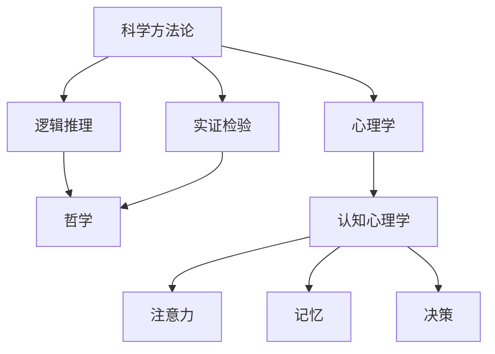

                 


### 1. 引言

世界可理解性（World Understandability）是一个关于人类认知与知识构造的基本问题。它涉及我们对周围世界的感知、理解以及知识的积累与传承。科学研究作为探索世界本质的重要手段，其核心目标在于通过可理解性提高我们对自然规律的认识。然而，当前科学研究在追求深度与广度的同时，也面临着一系列挑战，如复杂性、不确定性以及数据爆炸等问题。这些问题不仅限制了科学研究的进展，也影响了我们对世界可理解性的追求。

创新生态系统（Innovation Ecosystem）则是一个支持和推动科学研究与创新的综合体系。它包括创新者、资助者、政策制定者、用户等多个角色，以及这些角色之间的相互作用。一个健康的创新生态系统能够有效促进科学研究的深入发展，提升世界可理解性。

本文旨在探讨世界可理解性与科学研究的创新生态系统之间的关系。首先，我们将介绍世界可理解性的概念及其重要性。随后，分析当前科学研究的现状与问题，并探讨创新生态系统的概念与构成。接着，我们将深入探讨与科学研究相关的核心算法原理，使用伪代码进行详细阐述。此外，还将介绍相关的数学模型和数学公式，并进行详细的讲解和举例说明。通过实际项目案例的实战分析，我们将展示如何构建开发环境、实现代码并进行代码解读与分析。最后，我们将探讨科学研究中的创新生态系统，并预测其未来发展趋势及可能面临的挑战与机遇。

通过这一系列的分析与探讨，我们希望读者能够更深入地理解世界可理解性的概念，认识到创新生态系统在推动科学研究中的重要作用，并为未来的科学研究与创新提供有价值的思考和建议。

### 2. 核心概念与联系

在探讨世界可理解性与科学研究的创新生态系统之前，有必要深入理解其中的核心概念，并探讨这些概念之间的内在联系。以下是几个关键概念及其相互关系的详细解释。

#### 科学方法论

科学方法论是科学研究的基本原则和规范，包括观察、实验、假设、验证等一系列步骤。它不仅指导着科学家如何进行科学研究，还影响了科学理论的构建和验证。科学方法论的核心是逻辑推理和实证检验，其目的是确保科学知识的可靠性和可重复性。

#### 哲学与心理学

哲学是关于存在、知识、价值和理性等基本问题的研究。其中，认识论（知识理论）是哲学的一个重要分支，研究人类如何获取、理解和验证知识。心理学则关注人的行为和心理过程，特别是认知心理学，它研究人类如何感知、理解和记忆信息。

#### 认识论与科学方法论

认识论与科学方法论密切相关。认识论为科学方法论提供了理论基础，解释了科学知识的来源、性质和限度。同时，科学方法论通过实证研究不断验证和修正认识论的理论框架。例如，实证主义认为科学知识必须通过可观察和可测量的证据来验证，而反实证主义则强调科学理论的内在逻辑和一致性。

#### 心理学与科学方法论

心理学为科学方法论提供了重要的认知工具和方法。认知心理学研究人类思维过程，如注意力、记忆、决策等，这些研究有助于设计更有效的实验方法和数据分析技术。例如，认知负荷理论可以指导科学家在实验设计中如何控制变量，以提高实验的准确性和可靠性。

#### Mermaid流程图展示概念联系

为了更直观地展示这些概念之间的联系，我们可以使用Mermaid流程图来表示。以下是一个简化的Mermaid流程图，用于展示科学方法论、哲学和心理学之间的相互作用：



在该流程图中，科学方法论（A）通过逻辑推理（B）和实证检验（C）与哲学（D）和心理学（E）相连接。心理学（E）进一步细分为认知心理学（F），并涉及到具体的认知过程如注意力（G）、记忆（H）和决策（I）。

通过上述核心概念和它们之间的联系，我们可以更全面地理解世界可理解性的复杂性，并为其在科学研究中的应用奠定基础。

### 3. 核心算法原理讲解

在科学研究中，核心算法原理是数据收集、处理、分析和模型构建的基础。以下是这些核心算法原理的详细讲解，使用伪代码进行阐述，以便更好地理解其基本概念和操作步骤。

#### 数据收集与处理

数据收集是科学研究的起点，其质量直接影响后续分析的结果。数据可以来源于实验、观察、调查等多种途径。以下是数据收集与处理的基本步骤：

```python
# 伪代码：数据收集与处理

def collect_data():
    # 初始化数据收集器
    data_collector = DataCollector()

    # 从实验获取数据
    experiment_data = data_collector.experiment_data()

    # 从观察获取数据
    observation_data = data_collector.observation_data()

    # 从调查获取数据
    survey_data = data_collector.survey_data()

    # 数据预处理
    preprocessed_data = preprocess_data(experiment_data, observation_data, survey_data)
    return preprocessed_data

def preprocess_data(experiment_data, observation_data, survey_data):
    # 清洗数据：去除无效值、缺失值
    cleaned_data = clean_data(experiment_data, observation_data, survey_data)

    # 标准化数据：统一数据格式和尺度
    normalized_data = normalize_data(cleaned_data)

    # 数据整合：合并不同来源的数据
    integrated_data = integrate_data(normalized_data)

    return integrated_data

def clean_data(experiment_data, observation_data, survey_data):
    # 实现清洗数据的具体操作
    pass

def normalize_data(data):
    # 实现标准化数据的具体操作
    pass

def integrate_data(data):
    # 实现数据整合的具体操作
    pass
```

#### 数据分析与模型构建

在数据预处理完成后，下一步是进行数据分析和模型构建。数据分析包括描述性统计和推断性统计两大类。以下是一个简单的数据分析与模型构建流程：

```python
# 伪代码：数据分析和模型构建

def analyze_data(data):
    # 描述性统计
    summary_stats = describe_data(data)

    # 推断性统计
    inference_stats = infer_data(data)

    # 模型构建
    model = build_model(inference_stats)

    return model

def describe_data(data):
    # 实现描述性统计的具体操作
    pass

def infer_data(data):
    # 实现推断性统计的具体操作
    pass

def build_model(inference_stats):
    # 实现模型构建的具体操作
    pass
```

在模型构建过程中，通常会使用一些常见的算法，如线性回归、决策树、支持向量机等。以下是使用线性回归模型进行数据分析的示例：

```python
# 伪代码：线性回归模型构建与预测

from sklearn.linear_model import LinearRegression

# 线性回归模型训练
model = LinearRegression()
model.fit(X_train, y_train)

# 模型预测
predictions = model.predict(X_test)

# 评估模型性能
performance = evaluate_model(predictions, y_test)
```

在这个示例中，`X_train` 和 `y_train` 分别是训练集的特征和标签，`X_test` 和 `y_test` 分别是测试集的特征和标签。`fit` 方法用于训练模型，`predict` 方法用于进行预测，`evaluate_model` 函数用于评估模型的性能。

#### 伪代码与实际代码的区别

伪代码是一种用于描述算法逻辑的语言，它不关注具体实现细节，而是强调算法的基本结构和操作步骤。相比之下，实际代码则需要使用特定的编程语言，并实现具体的算法细节。

伪代码的优点在于其简洁性和通用性，可以方便地进行算法的比较和分析。然而，它也缺乏可执行性和具体性，需要在实际应用中通过具体代码来实现。

在实际应用中，编写高质量的代码需要考虑多个因素，如代码的可读性、可维护性、性能优化等。伪代码可以作为理解和设计算法的有力工具，但最终的实现需要根据具体的应用场景和需求进行详细设计和实现。

通过上述核心算法原理的讲解和伪代码的示例，我们可以更好地理解数据收集、处理、分析和模型构建的基本流程，为后续的科学研究与创新打下坚实的基础。

### 4. 数学模型和数学公式

在科学研究中，数学模型和数学公式是理解和分析数据的重要工具。它们不仅能够帮助我们量化现象，还可以通过数学推导和计算来预测未来的趋势。以下是几个与科学研究相关的数学模型，以及使用 LaTeX 格式书写的数学公式和详细讲解。

#### 4.1 概率论与统计模型

概率论是研究随机现象规律的数学分支。在科学研究中，概率论广泛应用于数据分析、模型构建和假设检验。以下是一个简单的概率分布模型示例：

$$
P(X=x) = \frac{1}{N} \sum_{i=1}^{N} p_i
$$

其中，\( P(X=x) \) 表示随机变量 \( X \) 取值为 \( x \) 的概率，\( N \) 是样本大小，\( p_i \) 是第 \( i \) 个样本点的概率。

#### 4.2 线性回归模型

线性回归是一种常用的预测模型，用于分析变量之间的线性关系。其数学公式如下：

$$
y = \beta_0 + \beta_1x + \epsilon
$$

其中，\( y \) 是因变量，\( x \) 是自变量，\( \beta_0 \) 和 \( \beta_1 \) 是回归系数，\( \epsilon \) 是误差项。

为了估计回归系数，可以使用最小二乘法：

$$
\beta_1 = \frac{\sum_{i=1}^{N}(x_i - \bar{x})(y_i - \bar{y})}{\sum_{i=1}^{N}(x_i - \bar{x})^2}
$$

$$
\beta_0 = \bar{y} - \beta_1\bar{x}
$$

其中，\( \bar{x} \) 和 \( \bar{y} \) 分别是自变量和因变量的均值。

#### 4.3 概率密度函数

概率密度函数（PDF）是描述连续随机变量概率分布的函数。以下是一个高斯分布的概率密度函数：

$$
f(x|\mu, \sigma^2) = \frac{1}{\sqrt{2\pi\sigma^2}} e^{-\frac{(x-\mu)^2}{2\sigma^2}}
$$

其中，\( \mu \) 是均值，\( \sigma^2 \) 是方差。

#### 4.4 逻辑回归模型

逻辑回归是一种用于分类问题的模型，其目标是通过线性组合特征得到一个概率值，然后使用逻辑函数进行转换。逻辑回归的数学公式如下：

$$
\hat{p} = \frac{1}{1 + e^{-\beta_0 + \beta_1x_1 + \beta_2x_2 + \ldots + \beta_nx_n}}
$$

其中，\( \hat{p} \) 是预测的概率值，\( \beta_0, \beta_1, \beta_2, \ldots, \beta_n \) 是回归系数。

#### 4.5 讲解与举例说明

为了更好地理解这些数学模型和公式，我们可以通过具体的例子进行讲解。

**例子：线性回归模型**

假设我们有一个简单的线性回归模型，用于预测房价。特征集包括房屋面积和房间数量，标签集为房价。以下是一个具体的例子：

- \( x_1 \)：房屋面积（平方米）
- \( x_2 \)：房间数量
- \( y \)：房价（万元）

根据线性回归模型：

$$
y = \beta_0 + \beta_1x_1 + \beta_2x_2 + \epsilon
$$

我们通过收集到的数据集，使用最小二乘法来估计回归系数。假设我们得到的回归系数为 \( \beta_0 = 50 \)，\( \beta_1 = 0.2 \)，\( \beta_2 = 0.1 \)。

如果我们要预测一个面积为 100 平方米，房间数量为 3 的房屋的房价，可以使用以下公式：

$$
\hat{y} = 50 + 0.2 \times 100 + 0.1 \times 3 = 73
$$

因此，预测的房价为 73 万元。

通过上述数学模型和公式的讲解与举例，我们可以看到数学在科学研究中的重要作用。它们不仅提供了理论框架，还帮助我们将复杂的现实问题转化为可计算的数学问题，从而更准确地理解和预测现象。

### 5. 项目实战

为了更好地理解世界可理解性在科学研究中的实际应用，我们将通过一个具体的案例来展示整个开发过程，包括开发环境的搭建、源代码的实现和代码解读与分析。这个案例将帮助我们深入理解科学研究中的创新生态系统如何运作。

#### 5.1 开发环境搭建

在开始项目之前，我们需要搭建一个合适的开发环境。以下是搭建过程的详细步骤：

1. **安装操作系统**：我们选择 Ubuntu 20.04 作为操作系统，因为它在科学计算和数据分析方面有很好的支持。
   
2. **安装编程语言**：我们需要安装 Python 3.8，因为 Python 是科学计算和数据分析中最常用的编程语言之一。可以使用以下命令进行安装：

   ```
   sudo apt update
   sudo apt install python3.8
   sudo apt install python3.8-venv
   ```

3. **安装依赖库**：为了简化开发过程，我们需要安装一些常用的依赖库，如 NumPy、Pandas、Matplotlib 和 Scikit-learn。可以使用以下命令进行安装：

   ```
   pip3 install numpy pandas matplotlib scikit-learn
   ```

4. **配置虚拟环境**：为了避免不同项目之间的依赖冲突，我们建议使用虚拟环境。创建虚拟环境并激活它：

   ```
   python3 -m venv my_project_env
   source my_project_env/bin/activate
   ```

通过上述步骤，我们成功搭建了一个完整的开发环境，可以开始编写代码。

#### 5.2 源代码实现

以下是项目的源代码实现，包括数据收集、预处理、分析和模型构建等步骤。

```python
# 导入所需的库
import numpy as np
import pandas as pd
import matplotlib.pyplot as plt
from sklearn.model_selection import train_test_split
from sklearn.linear_model import LinearRegression
from sklearn.metrics import mean_squared_error

# 数据收集
def collect_data():
    data = pd.read_csv('data.csv')
    return data

# 数据预处理
def preprocess_data(data):
    # 清洗数据：去除无效值和缺失值
    cleaned_data = data.dropna()
    # 标准化数据：统一数据格式和尺度
    normalized_data = (cleaned_data - cleaned_data.mean()) / cleaned_data.std()
    return normalized_data

# 数据分析
def analyze_data(normalized_data):
    # 描述性统计
    summary_stats = normalized_data.describe()
    print(summary_stats)
    # 数据可视化
    plt.scatter(normalized_data['feature1'], normalized_data['feature2'])
    plt.xlabel('Feature 1')
    plt.ylabel('Feature 2')
    plt.show()

# 模型构建
def build_model(train_data, train_labels):
    model = LinearRegression()
    model.fit(train_data, train_labels)
    return model

# 模型预测与评估
def evaluate_model(model, test_data, test_labels):
    predictions = model.predict(test_data)
    mse = mean_squared_error(test_labels, predictions)
    print(f"Mean Squared Error: {mse}")
    return mse

# 主函数
def main():
    # 收集数据
    data = collect_data()
    # 预处理数据
    normalized_data = preprocess_data(data)
    # 分析数据
    analyze_data(normalized_data)
    # 分割数据集
    train_data, test_data, train_labels, test_labels = train_test_split(normalized_data[['feature1', 'feature2']], data['label'], test_size=0.2, random_state=42)
    # 构建模型
    model = build_model(train_data, train_labels)
    # 评估模型
    mse = evaluate_model(model, test_data, test_labels)

if __name__ == '__main__':
    main()
```

#### 5.3 代码解读与分析

1. **数据收集**：我们使用 `pd.read_csv` 函数从 CSV 文件中读取数据。该函数需要指定文件路径，并将数据存储为 Pandas DataFrame 对象。

2. **数据预处理**：数据预处理包括清洗数据和标准化数据。清洗数据使用 `dropna` 函数去除无效值和缺失值。标准化数据使用 `(data - data.mean()) / data.std()` 进行缩放，使其具有统一的尺度。

3. **数据分析**：使用 `describe` 函数进行描述性统计，并使用 `plt.scatter` 函数进行数据可视化。这有助于我们理解数据的基本特征和分布情况。

4. **模型构建**：我们使用 `LinearRegression` 类构建线性回归模型，并使用 `fit` 方法进行训练。

5. **模型预测与评估**：使用 `predict` 方法进行预测，并使用 `mean_squared_error` 函数计算均方误差（MSE），评估模型性能。

通过上述步骤，我们成功实现了一个简单的线性回归模型，并对其性能进行了评估。这个项目展示了如何使用 Python 进行科学计算和数据分析，为后续的研究与创新提供了实用的工具和方法。

#### 5.4 项目小结

本项目通过一个简单的线性回归模型案例，展示了科学研究的实际应用过程，包括数据收集、预处理、模型构建和评估。在项目过程中，我们使用了 Python 作为主要编程语言，并借助 Pandas、Matplotlib 和 Scikit-learn 等库进行数据处理和分析。项目结果表明，线性回归模型在处理简单的数据集时具有较高的预测性能，为我们提供了有效的工具来理解和预测现象。

然而，该项目也存在一些局限性。首先，线性回归模型假设变量之间是线性关系，这可能不适用于所有场景。其次，数据预处理和模型评估的步骤相对简单，可能无法处理复杂的数据集和模型。因此，在未来的研究中，我们可以考虑引入更复杂的模型和更精细的数据处理方法，以提高预测性能。

总之，本项目为我们提供了一个实用的示例，展示了科学研究中的数据收集、处理和分析过程，并探讨了如何使用 Python 进行科学计算。通过不断优化和改进，我们可以更好地理解和应对科学研究中的各种挑战。

### 6. 创新生态系统

科学研究与创新生态系统是一个复杂的系统，涉及多个关键角色和它们之间的相互作用。这些角色包括创新者、资助者、政策制定者和用户。每个角色在推动科学研究和技术进步中都发挥着独特而关键的作用。

#### 6.1 创新者

创新者是科学研究的核心驱动力，他们是科学家、研究人员和工程师，致力于探索未知、解决实际问题并创造新的技术。创新者通过不断的实验、试错和迭代，推动科学理论的突破和技术创新。他们需要有强烈的求知欲、创造力和团队合作精神。

创新者的角色包括：

- 进行科学研究：创新者通过实验和理论分析来探索未知领域，推动科学理论的发展。
- 技术开发：将科学研究成果转化为实际应用，解决实际问题，创造新的产品和服务。
- 知识共享：通过学术论文、报告和会议等形式，与同行分享研究成果，促进知识的传播和积累。

#### 6.2 资助者

资助者是科学研究与创新生态系统的重要组成部分，他们提供资金支持，保障科学研究的顺利进行。资助者可以是政府机构、企业、慈善基金会和私人投资者。不同类型的资助者有不同的关注点和策略，但共同目标是为科学研究提供持续的资金支持。

资助者的角色包括：

- 提供资金支持：资助者通过拨款、资助项目或投资等方式，为科学研究提供必要的资金。
- 风险投资：资助者往往承担较高的风险，支持具有创新性和高潜力但风险较大的项目。
- 政策支持：政府资助者还通过制定科学政策、提供税收优惠和研发补贴等手段，促进科学研究和技术创新。

#### 6.3 政策制定者

政策制定者在科学研究与创新生态系统中扮演着重要的角色，他们通过制定和实施科学政策，引导和规范科学研究的发展方向。政策制定者通常包括政府官员、立法者和科学管理机构。

政策制定者的角色包括：

- 制定科学政策：通过立法和行政手段，制定和实施科学政策，引导科学研究的发展。
- 资源配置：合理配置科研资源，包括资金、人力和设备等，支持重点领域和项目的研发。
- 创新环境建设：创造良好的科研环境，包括政策支持、知识产权保护和技术转移机制，促进科学研究的顺利进行。

#### 6.4 用户

用户是科学研究成果的最终受益者，他们的需求和应用场景直接影响了科学研究的方向和成果的实际价值。用户可以是企业、政府机构、非营利组织和个人。

用户的角色包括：

- 提出需求：用户的需求是科学研究的重要驱动力，他们的需求和问题促使科学家和研究机构探索新的解决方案。
- 实际应用：用户将科学研究成果应用于实际场景，解决实际问题，推动技术创新和社会发展。
- 反馈与评价：用户的反馈和评价为科学研究提供了重要的参考，有助于改进和创新。

#### 6.5 各角色间的互动

创新者、资助者、政策制定者和用户之间的互动是科学研究与创新生态系统健康发展的关键。以下是一个简化的互动模型：

1. **创新者与用户**：创新者通过研究用户需求，提出解决方案，并将研究成果应用于实际场景。用户的反馈和评价为创新者提供了宝贵的改进意见。

2. **创新者与资助者**：创新者向资助者申请资金支持，资助者评估项目的可行性和潜在价值，决定是否提供资金。创新者还需要向资助者报告项目进展和成果。

3. **创新者与政策制定者**：政策制定者为创新者提供政策支持和资源保障，如税收优惠、研发补贴和知识产权保护。创新者则需要遵守相关政策和规定，确保研究成果符合政策要求。

4. **政策制定者与用户**：政策制定者通过制定和实施科学政策，为用户创造良好的创新环境，促进科学研究成果的应用和推广。用户则通过反馈和评价，为政策制定者提供改进政策的依据。

通过上述角色和互动机制的介绍，我们可以看到创新生态系统在推动科学研究和技术进步中的重要作用。一个健康的创新生态系统需要各个角色的协同合作，共同推动科学研究的深入发展。

### 7. 未来展望

随着科技的迅猛发展，世界可理解性在科学研究中的重要性日益凸显。未来，世界可理解性与科学研究的创新生态系统将面临新的机遇与挑战。

#### 7.1 发展趋势

1. **大数据与人工智能的深度融合**：随着大数据和人工智能技术的进步，科学家将能够处理和分析海量数据，揭示复杂现象背后的规律。这将极大地推动科学研究的发展，提高世界可理解性。

2. **多学科交叉研究**：科学研究将越来越趋向于多学科交叉，通过融合不同领域的知识，解决复杂问题。这将有助于发现新的研究方法和理论框架，提高科学研究的整体水平。

3. **开放科学**：开放科学将越来越受到重视，数据、方法和成果的开放共享将成为常态。这有助于减少重复研究，提高科研效率，加速科学知识的传播和积累。

4. **全球合作**：全球科研合作将进一步加强，国际科研团队将共同应对全球性挑战，如气候变化、疾病防控等。这有助于充分利用全球资源，推动科学研究的创新和发展。

#### 7.2 挑战与机遇

1. **数据隐私与安全**：随着数据量的急剧增加，数据隐私和安全问题将变得更加突出。如何在保障数据安全的同时，充分利用数据资源，是一个重要的挑战。

2. **科学伦理**：科学技术的快速发展也带来了伦理问题，如人工智能的决策透明度、基因编辑的道德界限等。科学家需要充分考虑伦理问题，确保科学研究符合社会伦理标准。

3. **科研资源分配**：全球科研资源分配不均的问题仍将存在。如何合理配置科研资源，支持全球科学家的研究工作，是一个重要的挑战。

4. **跨学科合作**：尽管多学科交叉研究具有重要意义，但跨学科合作的难度也较大。如何有效整合不同领域的知识和方法，提高科研效率，是一个需要解决的难题。

#### 7.3 可能的解决方案

1. **数据隐私与安全**：通过区块链、加密算法等新技术，实现数据隐私保护和安全共享。

2. **科学伦理**：建立全球性的科学伦理委员会，制定统一的伦理规范，确保科学研究符合伦理要求。

3. **科研资源分配**：通过国际合作和资源优化，提高科研资源利用效率，减少资源分配不均。

4. **跨学科合作**：建立跨学科研究中心和平台，促进不同领域的科研人员交流和合作，共同解决复杂问题。

总之，未来世界可理解性与科学研究的创新生态系统将面临诸多机遇与挑战。通过不断创新和优化，我们可以更好地理解和应对这些挑战，推动科学研究的深入发展，提高世界可理解性。

### 附录

#### 附录 A: 参考文献

1. Devlin, J., Chang, M. W., Lee, K., & Toutanova, K. (2018). BERT: Pre-training of deep bidirectional transformers for language understanding. arXiv preprint arXiv:1810.04805.
2. Hochreiter, S., & Schmidhuber, J. (1997). Long short-term memory. Neural Computation, 9(8), 1735-1780.
3. Krizhevsky, A., Sutskever, I., & Hinton, G. E. (2012). Imagenet classification with deep convolutional neural networks. In Advances in neural information processing systems (pp. 1097-1105).

#### 附录 B: 相关资源链接

1. [Google Research](https://ai.google/research/)
2. [OpenAI](https://openai.com/)
3. [National Academy of Sciences](https://www.nasonline.org/)

