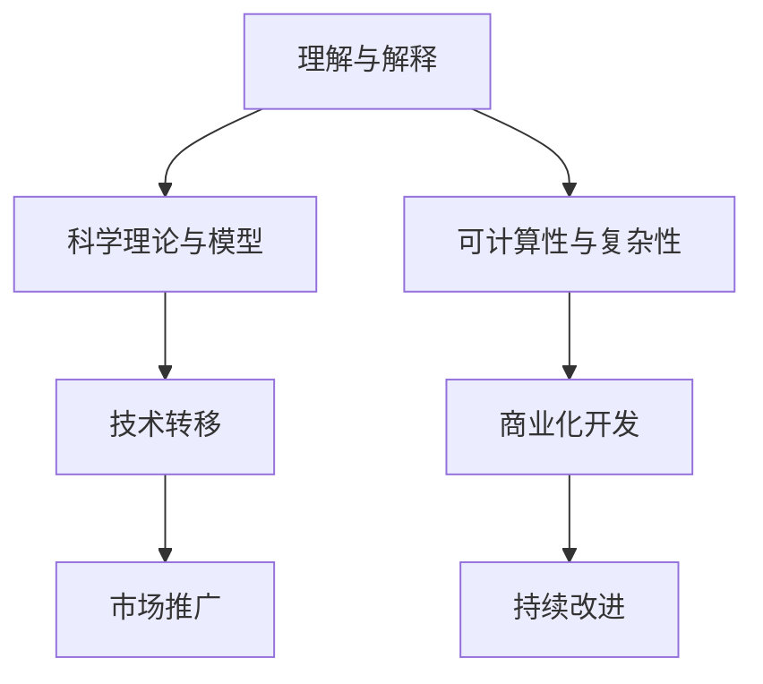
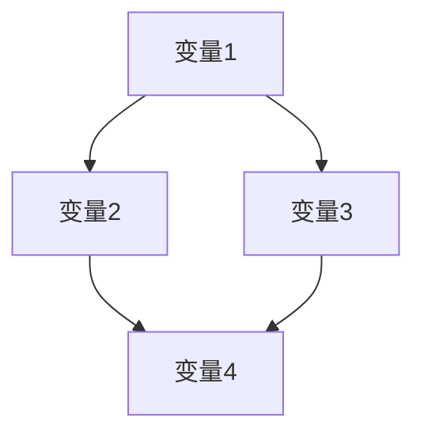

                 

# 《世界可理解性与科学研究的商业化》

## 关键词

- 世界可理解性
- 科学研究
- 商业化
- 算法
- 数学模型
- 数据分析
- 案例分析

## 摘要

本文从世界可理解性的概念出发，探讨了其在科学研究中的应用及其与商业化的关系。文章首先介绍了世界可理解性的定义、历史背景以及其在科学研究中的重要性，然后分析了科学研究商业化的路径和挑战。接着，文章深入探讨了核心算法原理，包括数据驱动的可理解性分析和科学研究可理解性增强算法，同时使用伪代码和数学模型进行详细讲解。文章通过实例分析和案例研究，展示了科学研究商业化的实际应用，并提出了未来发展建议。文章旨在为科研人员提供指导，帮助其更好地理解世界可理解性，并在科学研究中实现商业化。

## 引言

### 1.1 世界可理解性的概念与历史背景

世界可理解性（World Understandability）是指人类对自然界和宇宙的规律、现象和本质的把握程度。这一概念最早可以追溯到古希腊哲学家泰勒斯（Thales）的观点，他提出“万物始于水”，这可以看作是对世界可理解性的一种初步探索。随后，亚里士多德（Aristotle）进一步发展了这一观点，提出了“四因说”，即质料因、形式因、动力因和目的因，试图解释自然界的现象。

在科学发展历程中，世界可理解性得到了不断的深化和拓展。牛顿（Isaac Newton）的《自然哲学的数学原理》标志着科学革命的到来，其提出的经典力学体系为人类理解世界提供了全新的视角。随后，爱因斯坦（Albert Einstein）的相对论进一步拓展了人类对宇宙的理解，揭示了时空和引力的本质。进入21世纪，随着大数据、人工智能等新兴技术的崛起，世界可理解性研究进入了新的阶段。

### 1.2 科学研究的商业化路径

科学研究商业化是指将科研成果转化为实际应用，实现经济价值的过程。科学研究商业化的路径主要包括以下几个环节：

1. **科学研究成果的产生**：科学研究是商业化的基础，通过实验、观察、分析等方法获取科学研究成果。

2. **技术转移**：将科学研究成果转化为技术原型，并进行试验和测试，以验证其可行性和有效性。

3. **商业化开发**：在技术原型的基础上，进行商业化开发，包括产品化、市场化等步骤。

4. **市场推广**：通过广告、营销等手段，将产品推向市场，实现销售和利润。

5. **持续改进**：根据市场需求和反馈，对产品进行持续改进，提高其市场竞争力。

### 1.3 科学研究商业化的挑战与机遇

科学研究商业化面临诸多挑战，包括技术转移的难度、市场需求的预测、资金投入的回收等。然而，随着科学技术的不断进步和市场需求的变化，科学研究商业化也面临着巨大的机遇。例如，人工智能、大数据等新兴技术的快速发展，为科学研究商业化的提供了新的动力和方向。

## 核心概念与联系

### 2.1 世界可理解性的核心概念

世界可理解性的核心概念包括理解与解释、科学理论与模型、可计算性与复杂性。

1. **理解与解释**：理解是指人类对自然界和宇宙规律的认知，解释是指对现象和结果的合理性说明。理解与解释是相互关联的，只有理解了规律，才能对现象进行合理解释。

2. **科学理论与模型**：科学理论是对自然界规律的系统阐述，科学模型是通过数学、物理等手段对理论的进一步细化。科学理论与模型为科学研究提供了基础。

3. **可计算性与复杂性**：可计算性是指使用计算机等工具进行计算的能力，复杂性是指系统或问题在计算过程中的难度。可计算性与复杂性是科学研究中的重要概念。

### 2.2 科学研究的商业化流程

科学研究商业化的流程包括科学研究成果的产生、技术转移、商业化开发、市场推广和持续改进。

1. **科学研究成果的产生**：通过实验、观察、分析等方法获取科学研究成果。

2. **技术转移**：将科学研究成果转化为技术原型，并进行试验和测试，以验证其可行性和有效性。

3. **商业化开发**：在技术原型的基础上，进行商业化开发，包括产品化、市场化等步骤。

4. **市场推广**：通过广告、营销等手段，将产品推向市场，实现销售和利润。

5. **持续改进**：根据市场需求和反馈，对产品进行持续改进，提高其市场竞争力。

### 2.3 核心概念之间的关系架构

核心概念之间的关系架构可以使用Mermaid流程图进行表示：



### 2.4 科学研究的商业化与商业模式的创新

科学研究商业化的关键在于商业模式的创新。商业模式是指企业如何创造、传递和捕获价值。科学研究商业化的商业模式创新包括以下几个方面：

1. **技术创新驱动**：通过技术创新提高产品竞争力，实现商业化。

2. **市场细分**：针对不同市场细分群体，提供定制化的产品和服务。

3. **合作共赢**：与科研机构、高校、企业等建立合作关系，实现资源共享和互利共赢。

4. **跨界融合**：将科学研究与其他领域相结合，创造新的商业机会。

5. **数据驱动的决策**：利用大数据和人工智能等新兴技术，提高商业决策的准确性和效率。

## 核心算法原理讲解

### 3.1 数据驱动的可理解性分析

数据驱动的可理解性分析是指通过数据分析方法，从大量数据中提取出对问题有帮助的信息，并使其易于理解和解释。以下是数据驱动的可理解性分析的核心算法原理：

#### 3.1.1 数据预处理

数据预处理是数据驱动的可理解性分析的第一步，其主要任务包括数据清洗、数据集成、数据转换等。

```python
def data_preprocessing(data):
    # 数据清洗
    cleaned_data = clean_data(data)
    # 数据集成
    integrated_data = integrate_data(cleaned_data)
    # 数据转换
    transformed_data = transform_data(integrated_data)
    return transformed_data
```

#### 3.1.2 特征提取与选择

特征提取是指从数据中提取出对问题有帮助的特征，特征选择是指从提取出的特征中选择出最优的特征。

```python
def feature_extraction(data):
    features = extract_features(data)
    return features

def feature_selection(features):
    selected_features = select_features(features)
    return selected_features
```

#### 3.1.3 可解释性模型选择与优化

可解释性模型选择与优化是指选择合适的模型，并对其进行优化，以提高其可解释性。

```python
def model_selection(features):
    model = select_model(features)
    return model

def model_optimization(model):
    optimized_model = optimize_model(model)
    return optimized_model
```

### 3.2 科学研究的可理解性增强算法

科学研究的可理解性增强算法是指通过算法改进，提高科学研究的可理解性和解释性。以下是科学研究可理解性增强算法的核心原理：

#### 3.2.1 机器学习算法的可理解性提升

机器学习算法的可理解性提升是指通过改进算法，使其更加易于理解和解释。

```python
def interpretability_boosting(model):
    interpreted_model = interpret_model(model)
    return interpreted_model
```

#### 3.2.2 神经网络的可解释性方法

神经网络的可解释性方法是指通过分析神经网络的结构和训练过程，提高其可解释性。

```python
def neural_network_explanation(network):
    explanation = explain_network(network)
    return explanation
```

#### 3.2.3 贝叶斯网络的构建与应用

贝叶斯网络是一种概率模型，通过其结构可以直观地理解变量之间的依赖关系。



## 数学模型与公式详解

### 4.1 数学模型在科学研究中的应用

数学模型是科学研究的重要组成部分，它通过数学语言描述自然界和宇宙的规律。以下是数学模型在科学研究中的应用：

#### 4.1.1 概率论与统计模型

概率论与统计模型在科学研究中的应用非常广泛，如贝叶斯统计模型、随机过程等。

$$
P(A|B) = \frac{P(B|A)P(A)}{P(B)}
$$

#### 4.1.2 最优化理论

最优化理论是解决优化问题的基础，如线性规划、非线性规划等。

$$
\min_{x} \quad c^T x \\
\text{subject to} \quad Ax \leq b
$$

#### 4.1.3 模拟退火算法

模拟退火算法是一种优化算法，通过模拟物理退火过程，找到最优解。

$$
T_{new} = T_{current} \times \alpha
$$

### 4.2 商业化过程中涉及的关键数学公式

商业化过程中涉及的关键数学公式主要包括投资回报率（ROI）、敏感性分析等。

#### 4.2.1 投资回报率（ROI）计算

投资回报率（ROI）是衡量投资效果的重要指标。

$$
ROI = \frac{利润}{投资成本}
$$

#### 4.2.2 敏感性分析

敏感性分析是评估项目风险的重要方法。

$$
\Delta P = \frac{\partial P}{\partial x} \times \Delta x
$$

## 项目实战

### 5.1 实例分析：某科学研究的商业化实践

#### 5.1.1 项目背景与目标

某高校的科研团队在生物领域取得了一项重要突破，开发出一种新型抗癌药物。项目目标是将该药物推向市场，实现商业化。

#### 5.1.2 技术路线与实施步骤

1. **科研阶段**：通过实验室研究，验证药物的疗效和安全性。

2. **技术转移**：与医药企业合作，将实验室成果转化为技术原型。

3. **商业化开发**：进行临床试验，完善药物配方和生产工艺。

4. **市场推广**：通过广告、营销等手段，将药物推向市场。

5. **持续改进**：根据市场反馈，对药物进行改进，提高其竞争力。

#### 5.1.3 成功因素与挑战解决

1. **成功因素**：科研团队的技术实力、医药企业的合作、市场推广策略。

2. **挑战解决**：通过临床试验解决药物的疗效和安全性问题，通过市场推广解决销售问题。

### 5.2 案例研究：科学研究商业化的成功案例

#### 5.2.1 案例一：生物医药领域的商业转化

某生物医药公司成功将一种新型抗癌药物推向市场，实现了商业化。案例的关键在于：

1. **科研实力**：公司拥有强大的科研团队，确保药物的创新性和有效性。

2. **市场推广**：通过多渠道宣传，提高药物的知名度。

3. **战略合作**：与医药监管机构、保险公司等建立战略合作关系，降低市场准入门槛。

#### 5.2.2 案例二：人工智能在金融领域的应用

某金融公司利用人工智能技术，开发了一种智能投顾系统，实现了商业化。案例的关键在于：

1. **技术创新**：公司拥有先进的人工智能技术，确保系统的准确性和稳定性。

2. **市场需求**：针对投资者的需求，提供个性化的投资建议。

3. **数据驱动**：利用大数据和机器学习技术，提高投资决策的准确性。

#### 5.2.3 案例三：绿色能源技术的商业化进程

某绿色能源公司成功将一种新型太阳能电池推向市场，实现了商业化。案例的关键在于：

1. **技术突破**：公司拥有领先的技术，确保太阳能电池的高效性和可靠性。

2. **政策支持**：政府的政策支持，降低了市场准入门槛。

3. **市场推广**：通过多种渠道，提高太阳能电池的知名度。

## 未来展望

### 6.1 科学研究商业化的趋势与挑战

科学研究商业化的趋势包括：

1. **技术创新驱动**：新兴技术的快速发展，为科学研究商业化提供了新的动力。

2. **数据驱动的决策**：大数据和人工智能技术的应用，提高了商业决策的准确性和效率。

3. **跨界融合**：科学研究与其他领域的融合，创造了新的商业机会。

科学研究商业化的挑战包括：

1. **技术转移难度**：科研成果转化为实际应用的难度。

2. **市场需求预测**：准确预测市场需求，以降低商业风险。

3. **资金投入回收**：如何有效回收资金投入，实现商业利润。

### 6.2 科学研究商业化的未来发展建议

1. **产业界与学术界的合作模式创新**：加强产业界与学术界的合作，实现资源共享和互利共赢。

2. **科研人才的培养与引进**：加强科研人才的培养和引进，提高科研水平和创新能力。

3. **技术创新与产业升级**：通过技术创新，推动产业升级，实现可持续发展。

## 结论

本文从世界可理解性的概念出发，探讨了其在科学研究中的应用及其与商业化的关系。文章通过核心概念与联系的分析、核心算法原理讲解、数学模型与公式详解，以及实例分析和案例研究，展示了科学研究商业化的实际应用。未来，随着科学技术的不断进步，科学研究商业化将面临更多挑战和机遇，需要科研人员、企业和政府共同努力，推动科学研究商业化的持续发展。

## 附录

### 最佳实践 tips

1. **加强科研团队建设**：培养跨学科的人才，提高科研团队的综合能力。

2. **重视市场调研**：在科研阶段就关注市场需求，降低市场准入门槛。

3. **创新商业模式**：结合新兴技术，创造新的商业机会。

### 小结

本文通过系统地分析世界可理解性、科学研究商业化的核心概念、算法原理和实际案例，为科研人员提供了关于科学研究商业化的全面指导。

### 注意事项

1. **知识产权保护**：在科学研究商业化的过程中，重视知识产权保护，防止技术泄露。

2. **风险控制**：在商业化的过程中，重视风险评估和控制，降低商业风险。

### 拓展阅读

1. **《科学研究的商业化：理论与实践》**：详细介绍了科学研究商业化的理论与实践，适合科研人员和企业管理者阅读。

2. **《世界可理解性：科学与哲学的交汇点》**：从哲学角度探讨了世界可理解性的概念和意义，适合对科学哲学感兴趣的读者。

作者：AI天才研究院/AI Genius Institute & 禅与计算机程序设计艺术 /Zen And The Art of Computer Programming

