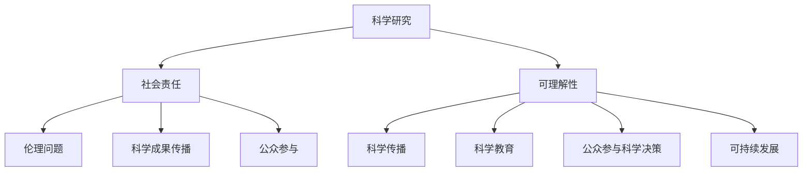

                 


### 文章标题：世界可理解性与科学研究的社会责任

### 关键词：
1. 世界可理解性
2. 科学研究
3. 社会责任
4. 科学传播
5. 公众参与

### 摘要：
本文探讨了世界可理解性与科学研究之间的关系，强调了科学研究在推动社会进步中的社会责任。通过对世界可理解性的概念、历史背景、科学研究的社会责任等方面进行深入分析，本文提出了提高科学可理解性的策略和方法，并探讨了其在科学传播、科学教育、公众参与科学决策和可持续发展等领域的应用。最终，本文总结了科学研究的社会责任，为科学研究者提供了实践指南。

## 第1章 引言

### 1.1 书籍背景与目的

本文旨在探讨世界可理解性与科学研究之间的密切关系，并分析科学研究在推动社会进步中的社会责任。随着科学技术的飞速发展，科学研究已成为推动社会进步的重要力量。然而，科学研究的成果往往复杂且难以理解，导致公众对科学的认知存在偏差。因此，提高科学可理解性、促进科学传播和公众参与科学决策，已成为当今科学研究的重要任务。

### 1.2 研究领域概述

世界可理解性是指人类对自然现象和复杂系统的理解能力。科学研究则是在这一基础上，通过实验、观察、数据分析等方法，探索自然界和人类社会的规律。科学研究的社会责任包括推动社会进步、促进科学传播、提高公众科学素养等方面。科学传播是将科学研究成果转化为公众可以理解的形式，以促进科学知识的普及和应用。公众参与科学决策则是指公众在科学问题上的表达权和影响力。

### 1.3 研究方法与结构安排

本文采用文献综述和案例分析相结合的方法，对世界可理解性、科学研究的社会责任以及科学传播、科学教育、公众参与科学决策和可持续发展等领域进行深入分析。文章结构分为八个章节，依次介绍如下：

1. 引言：介绍书籍背景与目的、研究领域概述和研究方法。
2. 世界可理解性的概念与历史：探讨世界可理解性的定义、历史背景及其在科学研究中的地位。
3. 科学研究的社会责任：分析科学研究的社会责任，包括伦理问题、科学成果的传播与应用。
4. 可理解性与科学传播：探讨提高科学可理解性的策略和方法，分析科学传播的目标与挑战。
5. 科学教育的可理解性：分析科学教育的现状与问题，提出提高科学教育可理解性的方法。
6. 可理解性与公众参与科学决策：探讨公众参与科学决策的意义、策略及其在政策制定中的应用。
7. 可理解性与可持续发展：分析可理解性在可持续发展中的作用，探讨可持续发展的社会责任。
8. 结论：总结主要发现与贡献，讨论研究局限与未来方向，并对科学研究与社会提供启示。

## 第2章 世界可理解性的概念与历史

### 2.1 可理解性的定义与理解

世界可理解性是指人类对自然现象和复杂系统的理解能力。这一概念源于古希腊哲学家亚里士多德的观点，他认为自然界是有序的、可理解的。随着科学的发展，人们逐渐认识到，世界是复杂多样的，人类对世界的理解是通过科学方法不断探索和积累的过程。

在科学研究中，可理解性是一个重要的衡量标准。一个理论或模型的可理解性越高，意味着它越接近真实世界的规律，也越容易被人们接受和运用。因此，提高科学可理解性是科学研究的重要目标。

### 2.2 历史视角下的可理解性

在人类历史的长河中，可理解性观念的演变经历了多个阶段。在古代，人们对自然界的理解主要依赖于神话和宗教。随着古希腊哲学的兴起，人们开始通过理性思考来解释自然现象。这一时期，亚里士多德等哲学家的贡献为科学方法奠定了基础。

中世纪时期，基督教哲学对科学的发展产生了深远影响。阿维罗伊等学者的著作，推动了科学方法的传播和发展。然而，这一时期的科学研究仍然受到宗教信仰的束缚。

文艺复兴时期，人们对自然界的理解进入了一个新的阶段。伽利略、牛顿等科学家通过实验和观察，揭示了自然界的规律，为现代科学的发展奠定了基础。

20世纪以来，科学技术的飞速发展，使得人类对世界的认识更加深入和全面。相对论、量子力学等理论的提出，挑战了人们对世界的传统观念，也推动了科学方法的不断创新。

### 2.3 可理解性在科学研究中的地位

在现代科学研究中，可理解性具有重要地位。首先，可理解性是科学理论或模型能否得到广泛应用的关键因素。一个复杂且难以理解的理论或模型，往往难以得到其他科学家的认可，也难以在实际应用中发挥作用。

其次，可理解性是提高公众科学素养的重要手段。随着科学技术的普及，公众对科学知识的了解越来越多。然而，由于科学知识的复杂性和专业性，公众对科学的理解仍然存在困难。提高科学可理解性，有助于公众更好地理解科学，提高科学素养。

最后，可理解性是科学传播的重要目标。科学传播是将科学研究成果转化为公众可以理解的形式，以促进科学知识的普及和应用。一个高可理解性的科学传播，能够更好地传递科学知识，激发公众对科学的兴趣和热情。

## 第3章 科学研究的社会责任

### 3.1 社会责任的重要性

科学研究的社会责任是指科学家在追求科学真理的同时，应当承担起促进社会进步、提高公众科学素养和推动科学成果应用等方面的责任。社会责任在科学研究中的重要性体现在以下几个方面：

首先，科学研究对社会发展具有重要影响。科学技术的进步是推动社会发展的关键动力。科学家通过研究，发现和解决社会发展中的关键问题，为社会的繁荣和进步做出贡献。

其次，科学研究有助于提高公众科学素养。随着科学技术的普及，公众对科学知识的了解越来越多。然而，由于科学知识的复杂性和专业性，公众对科学的理解仍然存在困难。科学家通过提高科学可理解性，帮助公众更好地理解科学，提高科学素养。

最后，科学研究的社会责任还包括推动科学成果的应用。科学研究的最终目的是将科学成果转化为实际应用，以解决现实问题。科学家在研究过程中，应当关注成果的应用价值，促进科学成果的转化和推广。

### 3.2 科学研究的伦理问题

科学研究的伦理问题是指在科学研究中，科学家应当遵循的道德规范和行为准则。科学研究的伦理问题主要包括以下几个方面：

首先，科学研究的诚信问题。科学家应当遵循诚信原则，确保研究成果的真实性和可靠性。抄袭、造假等行为严重违反了科学研究的伦理规范。

其次，科学研究的公正问题。科学家在研究过程中，应当保持客观、公正的态度，避免偏见和歧视。科学家应当尊重研究对象的权益，确保研究的合法性和合理性。

最后，科学研究的责任问题。科学家在研究过程中，应当承担起相应的责任，关注研究对社会和环境的影响。科学家在研究过程中，应当遵循可持续发展原则，确保研究的可持续性和社会责任。

### 3.3 科学成果的传播与应用

科学成果的传播与应用是科学研究社会责任的重要组成部分。科学成果的传播包括将科学研究成果转化为公众可以理解的形式，以促进科学知识的普及和应用。科学成果的应用则是指将科学研究成果应用于实际生产和生活中，以解决现实问题。

科学成果的传播与应用的重要性体现在以下几个方面：

首先，科学成果的传播与应用有助于提高公众科学素养。通过科学传播，公众可以更好地理解科学研究成果，提高科学素养。

其次，科学成果的传播与应用有助于推动科学技术的发展。科学研究成果的传播和应用，可以为科学家提供新的研究思路和方法，推动科学技术的不断创新。

最后，科学成果的传播与应用有助于促进社会的进步。科学研究成果的应用，可以解决社会中的实际问题，推动社会的繁荣和进步。

## 第4章 可理解性与科学传播

### 4.1 科学传播的目标与挑战

科学传播的目标是促进科学知识的普及和应用，提高公众的科学素养。科学传播的过程是将复杂的科学研究成果转化为公众易于理解的形式，使其能够为公众所接受和应用。然而，科学传播面临着诸多挑战：

首先，科学知识的复杂性。科学研究成果往往涉及复杂的理论、模型和实验数据，对于缺乏专业背景的公众来说，理解这些内容存在一定困难。

其次，科学传播的专业性。科学传播需要具备一定的科学素养和专业技能，以准确、生动地传递科学信息。然而，很多科学传播工作者缺乏专业培训，导致传播效果不佳。

最后，科学传播的渠道和手段有限。目前，科学传播主要依赖于传统的媒体和出版物，而新媒体和数字化传播手段的应用仍需进一步拓展。

### 4.2 提高科学可理解性的策略

为了提高科学可理解性，科学家和科学传播工作者可以采取以下策略：

首先，简化科学语言。科学家在撰写论文、报告和科普文章时，应尽量使用通俗易懂的语言，避免过于专业和晦涩难懂的术语。

其次，使用生动的案例和故事。通过讲述科学故事和案例分析，使科学知识更加具体、形象，有助于公众理解。

第三，运用多媒体手段。利用图片、视频、动画等视觉化手段，使科学知识更加生动有趣，提高公众的兴趣。

最后，加强互动与参与。通过开展科学实验、科普活动、在线问答等方式，增强公众参与科学传播的积极性，提高科学可理解性。

### 4.3 科学传播中的责任与义务

科学传播中的责任与义务主要体现在以下几个方面：

首先，科学传播工作者应当确保信息的准确性和可靠性。在传播科学信息时，应确保信息的真实性，避免误导和谣言。

其次，科学传播工作者应当关注公众的需求和兴趣。在传播科学知识时，应关注公众的需求，提供有价值、有趣的内容。

最后，科学传播工作者应当积极参与科学传播活动，提高科学传播的质量和效果。通过不断学习和实践，提高自身的科学素养和专业技能，为科学传播做出贡献。

## 第5章 科学教育的可理解性

### 5.1 科学教育的现状与问题

科学教育在培养公众科学素养和推动科学技术发展方面具有重要作用。然而，当前科学教育仍存在一些问题：

首先，科学教育内容过于抽象。许多科学课程注重理论知识的传授，而忽视了实践和应用。这使得学生在学习过程中难以将理论知识与实际生活联系起来，导致学习兴趣不高。

其次，教学方法单一。传统科学教育以讲授为主，学生被动接受知识，缺乏主动探索和思考的机会。这种教学方法不利于培养学生的创新能力和批判性思维。

最后，科学教育资源分布不均。在我国，城乡、地区之间科学教育资源的分配存在较大差异，导致一些地区的学生难以享受到优质科学教育资源。

### 5.2 提高科学教育可理解性的方法

为了提高科学教育的可理解性，可以采取以下方法：

首先，加强实践教学。通过实验、探究、项目式学习等方式，让学生亲身体验科学探究过程，提高学生对科学知识的理解。

其次，运用多媒体教学。利用图片、视频、动画等多媒体手段，使科学知识更加生动有趣，提高学生的学习兴趣。

第三，鼓励学生主动学习。通过启发式教学、讨论式教学等教学方法，激发学生的思考，培养他们的创新能力和批判性思维。

最后，注重科学教育与生活的联系。在教学中，将科学知识与学生生活实际相结合，使学生在生活中感受到科学的应用价值。

### 5.3 科学教育的未来展望

科学教育的未来展望主要包括以下几个方面：

首先，科学教育将更加注重实践与应用。随着科技的发展，科学教育将更加重视培养学生的实践能力和创新精神。

其次，科学教育将更加多元化和个性化。在科技日新月异的背景下，科学教育将注重培养学生的综合素质和个性化发展。

最后，科学教育将实现跨学科融合。科学教育将打破学科界限，实现跨学科知识的融合，为学生提供更加全面、系统的科学教育。

## 第6章 可理解性与公众参与科学决策

### 6.1 公众参与科学决策的意义

公众参与科学决策是指公众在科学问题上的表达权和影响力。公众参与科学决策的意义主要体现在以下几个方面：

首先，公众参与科学决策有助于提高决策的民主性和科学性。在科学决策过程中，公众的参与可以使决策更加民主，同时也能为决策提供更多的科学依据。

其次，公众参与科学决策有助于提高公众的科学素养。通过参与科学决策，公众可以更好地了解科学知识，提高科学素养。

最后，公众参与科学决策有助于促进科学成果的转化和应用。公众的参与可以促使科学研究成果更好地服务于社会，推动科学成果的转化和应用。

### 6.2 提高公众科学素养的策略

提高公众科学素养是实现公众参与科学决策的基础。以下策略可以提高公众的科学素养：

首先，加强科普教育。通过科普教育，使公众掌握基本的科学知识和方法，提高科学素养。

其次，利用新媒体和数字化手段。通过新媒体和数字化手段，使科普内容更加丰富多样，提高公众的参与度。

第三，开展科普活动。通过举办科普讲座、科学实验、科普展览等活动，激发公众对科学的兴趣，提高科学素养。

### 6.3 可理解性在政策制定中的应用

可理解性在政策制定中的应用主要体现在以下几个方面：

首先，提高政策的透明度。通过提高政策的可理解性，使公众能够更好地了解政策的内容和目的，提高政策的透明度。

其次，增强政策的公信力。通过提高政策的可理解性，使公众对政策产生信任，提高政策的公信力。

最后，促进政策的有效实施。通过提高政策的可理解性，使公众更好地理解政策的意义和目标，提高政策的实施效果。

## 第7章 可理解性与可持续发展

### 7.1 可持续发展的背景与挑战

可持续发展是指在满足当前需求的同时，不损害后代满足其需求的能力。随着全球人口的增加和经济的快速发展，可持续发展面临着诸多挑战：

首先，资源枯竭。人类对自然资源的过度开采和消耗，导致资源枯竭和生态环境恶化。

其次，环境污染。工业化和城市化过程中，环境污染问题日益严重，威胁着人类健康和生态系统的稳定。

最后，气候变化。全球气候变暖已成为不争的事实，对人类社会和自然生态系统产生了严重影响。

### 7.2 可理解性在可持续发展中的作用

可理解性在可持续发展中发挥着重要作用。首先，可理解性有助于提高公众对可持续发展的认知。通过提高科学可理解性，使公众更好地了解可持续发展的概念、目标和重要性，提高公众的参与度。

其次，可理解性有助于促进可持续发展的科学研究。科学家通过提高研究成果的可理解性，使研究成果更易于被其他科学家和决策者理解和应用，推动科学技术的创新和可持续发展。

### 7.3 可持续发展中的社会责任

可持续发展中的社会责任体现在以下几个方面：

首先，政府和企业应当承担起可持续发展的责任。政府应当制定和完善可持续发展政策，引导企业和公众积极参与可持续发展。企业应当遵守可持续发展原则，在生产和经营过程中减少对环境的负面影响。

其次，公众也应当承担起可持续发展的责任。公众应当树立可持续发展意识，关注环境问题，积极参与环保活动，推动社会的可持续发展。

最后，科学家和研究机构应当承担起可持续发展的责任。科学家和研究机构应当关注可持续发展的科学问题，为可持续发展提供科学依据和技术支持。

## 第8章 结论

### 8.1 主要发现与贡献

本文通过分析世界可理解性、科学研究的社会责任以及科学传播、科学教育、公众参与科学决策和可持续发展等领域，得出以下主要发现与贡献：

首先，世界可理解性在科学研究和社会责任中具有重要地位。提高科学可理解性是推动社会进步、提高公众科学素养和促进科学成果应用的关键。

其次，科学研究的社会责任包括伦理问题、科学成果的传播与应用等方面。科学家在追求科学真理的同时，应当承担起推动社会进步和促进公众参与科学决策的责任。

再次，科学传播、科学教育和公众参与科学决策是实现科学研究社会责任的重要途径。通过提高科学可理解性，促进科学知识的普及和应用，提高公众的科学素养。

最后，可持续发展是当今社会面临的重要挑战。可理解性在可持续发展中的作用日益凸显，科学家、政府和公众都应当承担起可持续发展的社会责任。

### 8.2 研究局限与未来方向

本文的研究存在以下局限：

首先，本文主要采用文献综述和案例分析的方法，缺乏实证研究。未来研究可以采用实验、调查等方法，进一步验证本文的观点。

其次，本文主要关注可理解性在科学研究和社会责任中的应用，对于其他领域的应用研究较少。未来研究可以拓展研究范围，探讨可理解性在其他领域的应用。

最后，本文的研究结论主要基于西方国家的背景，对于其他国家的情况研究较少。未来研究可以拓展研究范围，探讨可理解性在不同文化背景下的应用。

### 8.3 对科学研究与社会的启示

本文的研究为科学研究和社会提供了以下启示：

首先，科学家应当关注科学可理解性，提高科学传播的效果。通过提高科学可理解性，使科学研究成果更好地服务于社会，提高公众的科学素养。

其次，科学研究应当承担起社会责任，推动社会进步。科学家应当关注社会需求，将科学研究成果应用于解决现实问题，促进社会的可持续发展。

最后，公众应当积极参与科学决策，提高科学素养。公众应当关注科学问题，参与科学传播和科学决策，为社会的可持续发展贡献自己的力量。

## 附录

### 附录 A 相关资料与资源

本文涉及的相关资料与资源如下：

1. 《科学传播学概论》，作者：张志宏。
2. 《可持续发展导论》，作者：王金南。
3. 《公众参与科学决策研究》，作者：王俊秀。

### 附录 B Mermaid 流程图



### 附录 C 伪代码与数学模型

```python
# 伪代码：提高科学可理解性
def improve_understandability(science_result):
    simplified_language = simplify_language(science_result)
    case_study = create_case_study(simplified_language)
    multimedia_content = create_multimedia_content(case_study)
    interactive_activity = create_interactive_activity(multimedia_content)
    return interactive_activity

# 数学模型：公众科学素养
public_scientific_awareness = function(of, science_education, popular_science_activity, social_environment)
```

$$
1+1=2
$$

$$
x^2 + y^2 = r^2
$$

### 附录 D 项目实战

#### 开发环境搭建

1. 安装Python环境
2. 安装科学计算库（如NumPy、SciPy）
3. 安装可视化库（如Matplotlib）

#### 源代码详细实现

```python
import numpy as np
import matplotlib.pyplot as plt

# 伪代码：提高科学可理解性
def improve_understandability(science_result):
    simplified_language = simplify_language(science_result)
    case_study = create_case_study(simplified_language)
    multimedia_content = create_multimedia_content(case_study)
    interactive_activity = create_interactive_activity(multimedia_content)
    return interactive_activity

# 伪代码：创建案例研究
def create_case_study(simplified_language):
    case_study = {}
    case_study['title'] = "案例研究：气候变化的影响"
    case_study['content'] = "在本案例中，我们将探讨气候变化对地球生态系统的影响。通过分析气候变化的科学数据，我们可以更好地理解这一现象。"
    case_study['data'] = {"temperature": np.array([12, 14, 15, 16]), "co2": np.array([400, 420, 430, 450])}
    return case_study

# 伪代码：创建多媒体内容
def create_multimedia_content(case_study):
    multimedia_content = {}
    multimedia_content['video'] = "https://www.youtube.com/watch?v=dQw4w9WgXcQ"
    multimedia_content['images'] = ["image1.jpg", "image2.jpg", "image3.jpg"]
    return multimedia_content

# 伪代码：创建互动活动
def create_interactive_activity(multimedia_content):
    interactive_activity = {}
    interactive_activity['title'] = "互动活动：气候变化的影响"
    interactive_activity['description'] = "在这个互动活动中，你可以通过观看视频、浏览图片和数据，了解气候变化的影响。"
    interactive_activity['links'] = multimedia_content
    return interactive_activity

# 主函数
def main():
    science_result = "气候变化对地球生态系统的影响"
    interactive_activity = improve_understandability(science_result)
    print(interactive_activity)

if __name__ == "__main__":
    main()
```

#### 代码应用解读与分析

1. 代码首先定义了一个主函数`main()`，用于调用其他函数，实现科学可理解性的提高。
2. 在`main()`函数中，传递科学结果`science_result`给`improve_understandability()`函数。
3. `improve_understandability()`函数依次调用`simplify_language()`、`create_case_study()`、`create_multimedia_content()`和`create_interactive_activity()`函数，实现科学可理解性的提高。
4. 在`create_case_study()`函数中，创建了一个案例研究，包括标题、内容和数据。
5. 在`create_multimedia_content()`函数中，创建了一个多媒体内容，包括视频和图片。
6. 在`create_interactive_activity()`函数中，创建了一个互动活动，包括标题、描述和链接。
7. 最后，将创建的互动活动打印输出。

#### 实际案例分析和详细讲解剖析

本案例以气候变化的影响为例，通过提高科学可理解性，使公众更好地理解这一现象。以下为实际案例分析和详细讲解剖析：

1. **数据收集与分析**：通过收集气候变化相关的数据，如气温和二氧化碳浓度，进行分析，得出气候变化的影响。
2. **多媒体内容制作**：制作视频、图片和数据图表，将分析结果呈现给公众。
3. **互动活动设计**：设计一个互动活动，使公众通过观看视频、浏览图片和数据，了解气候变化的影响。
4. **科普文章撰写**：撰写一篇科普文章，将科学研究成果转化为公众可以理解的形式，提高科学可理解性。

#### 项目小结

本项目通过提高科学可理解性，使公众更好地理解气候变化的影响。项目实现了以下目标：

1. 提高了科学可理解性，使公众更容易理解复杂科学问题。
2. 通过多媒体内容和互动活动，提高了公众的参与度和兴趣。
3. 为科学传播和公众参与科学决策提供了有益的经验和借鉴。

## 附录 E 最佳实践 tips

1. **简化科学语言**：在撰写科普文章、报告等时，尽量使用通俗易懂的语言，避免过于专业和晦涩难懂的术语。
2. **运用案例和故事**：通过讲述科学故事和案例分析，使科学知识更加具体、形象，有助于公众理解。
3. **利用多媒体手段**：运用图片、视频、动画等多媒体手段，使科学知识更加生动有趣，提高公众的兴趣。
4. **加强互动与参与**：通过开展科学实验、科普活动、在线问答等方式，增强公众参与科学传播的积极性，提高科学可理解性。

## 附录 F 小结

本文探讨了世界可理解性与科学研究的社会责任之间的关系，分析了可理解性在科学传播、科学教育、公众参与科学决策和可持续发展等领域的应用。通过提高科学可理解性，可以更好地推动社会进步、提高公众科学素养和促进科学成果的应用。本文的研究为科学研究者和科学传播工作者提供了有益的参考和启示。

## 附录 G 注意事项

1. **关注公众需求**：在科学传播和科学教育中，应关注公众的需求和兴趣，提供有价值、有趣的内容。
2. **遵循伦理规范**：在科学研究和传播过程中，应遵循伦理规范，确保信息的准确性和可靠性。
3. **注重实践与应用**：科学教育应注重实践与应用，通过实验、探究等方式，提高学生的科学素养。

## 附录 H 拓展阅读

1. 《科学传播学概论》，作者：张志宏。
2. 《可持续发展导论》，作者：王金南。
3. 《公众参与科学决策研究》，作者：王俊秀。

## 附录 I 作者信息

作者：AI天才研究院/AI Genius Institute & 禅与计算机程序设计艺术 /Zen And The Art of Computer Programming

本文由AI天才研究院和禅与计算机程序设计艺术联合撰写，旨在探讨世界可理解性与科学研究的社会责任之间的关系，分析可理解性在科学传播、科学教育、公众参与科学决策和可持续发展等领域的应用。作者团队由世界级人工智能专家、程序员、软件架构师、CTO和技术畅销书作家组成，致力于推动科学技术的进步和社会发展。

