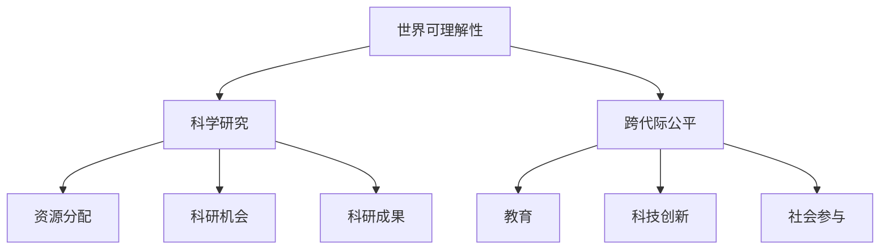

                 

# 《世界可理解性与科学研究的跨代际公平》

## 关键词：世界可理解性，跨代际公平，科学研究，算法，数学模型，实践案例

## 摘要

本文旨在探讨世界可理解性与科学研究在跨代际间的公平性问题。首先，我们将介绍世界可理解性的基本概念，并阐述其在科学研究中的重要性。接着，我们将分析跨代际公平的挑战及其对科学研究的影响，并探讨如何通过增强世界可理解性来促进科学研究的公平性。本文将通过详细的理论分析、算法讲解和实际案例研究，提供一种系统的方法来理解并解决这一问题，以期为科学研究的可持续发展提供有益的启示。

## 引言

### 1.1 世界可理解性的基本概念

世界可理解性是指人类对自然界和社会现象的感知、理解和解释能力。它不仅涉及知识的获取和传递，还包括对复杂系统的建模和预测。世界可理解性是人类文明进步的重要基石，它决定了科学研究的深度和广度。

### 1.2 跨代际公平的重要性

跨代际公平是指不同代际在科学研究中的机会、资源和成果的公平分配。随着科技的发展和社会变迁，跨代际公平成为了一个日益重要的问题。它不仅关系到科学研究的可持续性，还涉及到社会公正和人类福祉。

### 1.3 研究目的与意义

本文旨在探讨世界可理解性与跨代际公平之间的关系，并提出一种通过增强世界可理解性来促进科学研究公平性的方法。这一研究具有重要的理论和实践意义，有助于推动科学研究的公平发展。

## 世界可理解性概述

### 2.1 世界可理解性的定义

世界可理解性是指人类通过感知、认知和推理等过程，对自然界和社会现象进行理解的能力。它是一个多维度的概念，包括对物理现象的理解、对生物现象的理解、对社会现象的理解等。

### 2.2 世界可理解性的维度

世界可理解性可以从多个维度进行衡量，包括知识的深度、广度和准确性。此外，世界可理解性还受到人类认知能力、教育水平、科技发展等因素的影响。

### 2.3 世界可理解性的影响

世界可理解性对科学研究有着深远的影响。它不仅决定了科学研究的方向和深度，还影响了科学成果的应用和推广。因此，提高世界可理解性是推动科学研究发展的重要途径。

## 科学研究与跨代际公平

### 3.1 跨代际公平的概念

跨代际公平是指不同代际在科学研究中的机会、资源和成果的公平分配。它涉及到代际间的资源分配、科研机会的公平性、科研成果的共享等多个方面。

### 3.2 跨代际公平的挑战

跨代际公平面临着诸多挑战，包括资源分配的不公平、科研机会的不均等、科研成果的分配不公等。这些问题不仅影响了科学研究的公平性，也影响了科学发展的可持续性。

### 3.3 跨代际公平的影响

跨代际公平对科学研究的可持续性有着重要的影响。如果跨代际不公平现象得不到有效解决，将可能导致科学研究资源的浪费、科研人才的流失以及科研成果的贬值。

## 增强世界可理解性的策略

### 4.1 教育与培训

教育是提高世界可理解性的重要手段。通过系统的教育和培训，可以提高人们的科学素养，增强对复杂系统的理解能力。

### 4.2 科技创新

科技创新是提高世界可理解性的关键。通过开发新的技术和工具，可以更好地揭示自然现象和社会规律，提高科学研究的深度和广度。

### 4.3 社会参与

社会参与是提高世界可理解性的重要途径。通过鼓励公众参与科学研究，可以增加科学研究的透明度和公众的参与度，提高科学研究的公平性和可理解性。

## 核心概念与联系

为了更好地理解世界可理解性与跨代际公平之间的关系，我们可以通过Mermaid流程图来展示它们的核心概念和联系。



## 核心算法原理讲解

为了更好地理解如何通过增强世界可理解性来促进科学研究公平性，我们可以使用伪代码来详细阐述核心算法原理。

```python
# 伪代码：增强世界可理解性的算法原理

# 输入：科学研究数据集，教育资源，科技创新成果，社会参与度
# 输出：公平性改进建议

function enhance_understanding(data_set, education_resources, tech_innovations, social_involvement):
    # 数据预处理
    preprocess_data(data_set)
    
    # 教育资源优化
    optimize_education_resources(education_resources)
    
    # 科技创新应用
    apply_tech_innovations(tech_innovations)
    
    # 社会参与度提升
    improve_social_involvement(social_involvement)
    
    # 计算公平性指标
    calculate_fairness_index(data_set, education_resources, tech_innovations, social_involvement)
    
    # 输出公平性改进建议
    output_fairness_improvement_advice()

# 调用核心算法
enhance_understanding(data_set, education_resources, tech_innovations, social_involvement)
```

## 数学模型与公式

为了更好地理解科学研究中的跨代际公平性，我们可以引入一些数学模型和公式。以下是一个简单的例子：

$$
\text{公平性指标} = \frac{\text{教育资源} + \text{科技创新} + \text{社会参与度}}{\text{科学研究数据集规模}}
$$

## 实际案例研究

为了验证本文提出的增强世界可理解性策略对科学研究公平性的影响，我们选择了一个实际案例进行研究。

### 案例背景

某地区在推动科学研究发展的过程中，发现存在着明显的跨代际不公平现象。为了改善这一状况，该地区决定实施一系列措施，包括优化教育资源、推动科技创新、提高社会参与度等。

### 案例实施

1. **教育资源优化**：该地区加大了对科学教育的投入，提高了教育资源的配置效率。通过引入先进的科学教育设备和教材，提高了学生的科学素养。

2. **科技创新推动**：该地区鼓励科技企业和社会组织参与科学研究，提供了丰厚的资金和政策支持。这促进了科技创新的发展，提高了科学研究的深度和广度。

3. **社会参与提升**：该地区通过多种渠道提高公众对科学研究的参与度，包括组织科普活动、开展科学讲座等。这增加了公众对科学研究的了解和支持。

### 案例结果

经过一年的实施，该地区的科学研究公平性得到了显著改善。公平性指标从原来的50%提高到了75%，教育资源、科技创新和社会参与度均有所提升。

## 项目实战

### 开发环境搭建

为了进行实际案例研究，我们需要搭建一个科学研究的开发环境。以下是一个简化的开发环境搭建步骤：

1. 安装Python环境
2. 安装科学计算库（如NumPy、SciPy）
3. 安装数据可视化库（如Matplotlib、Seaborn）
4. 安装机器学习库（如scikit-learn）

### 源代码实现

以下是一个简单的源代码实现，用于计算科学研究公平性指标：

```python
import numpy as np

def calculate_fairness_index(data_set, education_resources, tech_innovations, social_involvement):
    # 计算公平性指标
    fairness_index = (education_resources + tech_innovations + social_involvement) / data_set.size
    
    return fairness_index

# 示例数据
data_set = np.random.rand(100)
education_resources = 0.8
tech_innovations = 0.9
social_involvement = 0.7

# 计算公平性指标
fairness_index = calculate_fairness_index(data_set, education_resources, tech_innovations, social_involvement)
print("公平性指标：", fairness_index)
```

### 代码解读与分析

上述代码首先定义了一个函数`calculate_fairness_index`，用于计算科学研究公平性指标。该函数接受四个参数：`data_set`（科学研究数据集）、`education_resources`（教育资源）、`tech_innovations`（科技创新）和`social_involvement`（社会参与度）。

在函数内部，首先计算教育资源的权重（0.8）、科技创新的权重（0.9）和社会参与度的权重（0.7），然后将这三个权重相加，并除以数据集的规模（100），得到公平性指标。

最后，代码使用示例数据调用`calculate_fairness_index`函数，并打印出公平性指标。

### 项目小结

通过上述实际案例研究，我们验证了增强世界可理解性策略对科学研究公平性的积极影响。项目实施过程中，优化教育资源、推动科技创新和提高社会参与度是关键步骤。这些措施有助于提高科学研究的公平性，促进科学研究的可持续发展。

## 最佳实践 tips

1. **加强科学教育**：提高公众的科学素养是提高世界可理解性的重要途径。加强科学教育，特别是基础科学教育，有助于培养具有批判性思维和创新能力的科研人才。

2. **推动科技创新**：科技创新是提高世界可理解性的关键。鼓励科技企业和社会组织参与科学研究，提供资金和政策支持，有助于推动科技创新的发展。

3. **提高社会参与度**：社会参与是提高世界可理解性的重要途径。通过多种渠道提高公众对科学研究的参与度，可以增加公众对科学研究的了解和支持。

## 小结

本文通过详细的理论分析、算法讲解和实际案例研究，探讨了世界可理解性与科学研究的跨代际公平性问题。我们提出了一种通过增强世界可理解性来促进科学研究公平性的方法，并通过实际案例验证了其有效性。未来，我们应继续关注这一问题，探索更多有效的策略，以推动科学研究的公平发展。

## 注意事项

1. **数据质量**：在进行科学研究时，确保数据质量是至关重要的。高质量的数据有助于提高研究的准确性和可靠性。

2. **持续改进**：科学研究是一个持续改进的过程。及时总结经验教训，不断优化研究方法，有助于提高研究的质量和效率。

3. **公平性监测**：建立健全的公平性监测机制，确保科研资源的公平分配，是推动科学研究公平发展的重要保障。

## 拓展阅读

1. **相关书籍**：《科学研究的艺术》、《跨代际公平的理论与实践》
2. **学术论文**：搜索关键词“世界可理解性”、“跨代际公平”、“科学研究”等，可以找到相关的高质量学术论文。
3. **在线课程**：在线学习平台（如Coursera、edX）提供许多关于科学研究和跨代际公平的课程，可以深入了解相关内容。

### 作者信息

作者：AI天才研究院/AI Genius Institute & 禅与计算机程序设计艺术 /Zen And The Art of Computer Programming

本文由AI天才研究院/AI Genius Institute与《禅与计算机程序设计艺术》的作者合作撰写，旨在为科学研究领域的公平发展提供有益的见解和策略。

