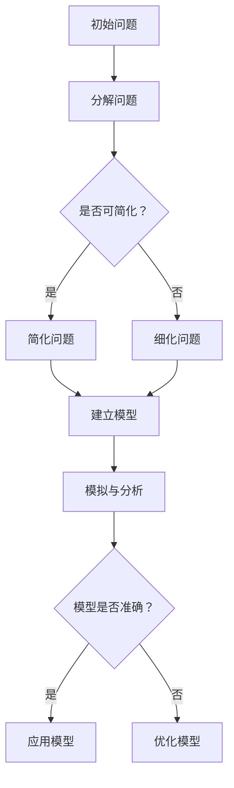

                 

### 文章标题：世界的复杂性与可理解性的矛盾

在当今快速发展的信息时代，世界正变得越来越复杂。从自然科学到社会科学，从计算机科学到人工智能，复杂系统无处不在。然而，尽管我们生活在一个高度复杂的系统中，我们仍然渴望理解这个世界。这种对理解的需求与世界的复杂性之间存在着深刻的矛盾。本文将探讨这一矛盾，分析其原因，并探讨可能的解决方案。

关键词：复杂系统、可理解性、矛盾、解决方案、复杂理论

摘要：本文从多个角度探讨了世界的复杂性与可理解性之间的矛盾。首先，我们介绍了复杂性与可理解性的定义，并分析了它们之间的关系。接着，我们讨论了复杂系统的度量方法，以及可理解性面临的挑战。随后，我们介绍了与复杂性和可理解性相关的理论和模型。在实证研究和案例分析部分，我们展示了这一矛盾在实际中的应用。最后，我们提出了一些解决方案和建议，以帮助我们在复杂的世界中寻找可理解性。

----------------------------------------------------------------

### 引言：复杂性与可理解性的矛盾

复杂性是一个广泛的概念，它可以用来描述从简单的线性系统到高度复杂的非线性系统的各种特性。在计算机科学中，复杂性通常指的是算法或问题解决的难易程度。而在更广泛的科学领域，复杂性指的是系统内部各组成部分之间的相互作用和系统的整体行为。可理解性，则是指我们能够理解和解释一个系统或现象的能力。

在信息时代，我们面临着前所未有的复杂性。无论是气候变化、全球卫生问题、金融市场的波动，还是人工智能和大数据技术的迅猛发展，复杂性无处不在。然而，人类天生的好奇心和探索欲望驱动着我们追求理解。我们希望掌握复杂系统的运行规律，以便更好地预测和控制这些系统。

这种对理解的需求与世界的复杂性之间存在着深刻的矛盾。复杂系统往往具有高度的非线性、不确定性和不可预测性，这使得我们难以完全理解它们。同时，随着系统的规模和复杂度的增加，信息过载问题愈发严重，进一步加剧了理解上的困难。这种矛盾不仅在理论上具有重要意义，也在实际应用中带来了许多挑战。

### 复杂性与可理解性的定义与关系

复杂性和可理解性是两个相互关联但有时又相互矛盾的概念。在科学和技术领域，复杂性通常被定义为系统内部各组成部分之间的复杂相互作用。一个系统可以被认为复杂，如果它的行为不能用简单的规则或模型来描述，或者它的行为在宏观层面上无法从微观层面上推导出来。

可理解性，则是从人类的角度出发，描述我们对一个系统或现象的理解程度。它指的是我们能否使用现有的知识、工具和模型来解释系统的行为和现象。可理解性不仅仅是一个技术问题，也是一个认知问题。它涉及到我们大脑处理信息的方式和我们与外部世界的互动。

复杂性与可理解性之间的关系可以看作是一种动态平衡。在一个系统中，复杂性的增加可能会降低其可理解性，因为系统变得更加不可预测和难以解释。然而，通过适当的抽象和简化，我们可以在一定程度上降低复杂性，从而提高系统的可理解性。反之，通过深入研究和理解复杂系统，我们也可以在一定程度上增加其可理解性。

在技术层面上，这种关系可以通过信息论来解释。信息论中的基本概念如熵和信息量可以帮助我们量化复杂性和可理解性。熵是衡量系统不确定性的度量，而信息量则是衡量我们获得的信息的量。在一个高度复杂的系统中，熵通常很高，这意味着系统的不确定性很大，从而导致可理解性降低。然而，如果我们能够提取关键信息并降低系统的熵，我们就可以提高系统的可理解性。

总的来说，复杂性和可理解性之间存在着一种相互依赖的关系。复杂性是系统的固有属性，而可理解性是我们对系统认知的结果。通过适当的方法和技术，我们可以在一定程度上平衡这两者，使得复杂系统变得更加可理解。

### 复杂性理论的简要介绍

复杂性理论是研究复杂系统的性质和行为的科学。它涉及多个学科，包括计算机科学、物理学、生物学、经济学和社会学。复杂性理论的核心思想是，复杂系统的行为不仅仅取决于其组成部分的性质，还取决于这些组成部分之间的相互作用和系统的整体结构。

**复杂系统理论** 是复杂性理论的一个分支，主要研究复杂系统的性质和规律。复杂系统理论指出，复杂系统的行为通常具有以下特点：

1. **非线性**：复杂系统的行为不是线性的，即系统的输出不直接依赖于输入。这意味着在复杂系统中，小的变化可能会导致巨大的结果，这种效应被称为“蝴蝶效应”。
2. **自组织**：复杂系统往往具有自组织能力，即系统内部的部分可以通过相互合作形成有序的结构。自组织是复杂系统的一个重要特征，它使得系统能够在没有外部指导的情况下自我适应和自我修复。
3. **适应性**：复杂系统具有适应外部环境变化的能力。这种适应性使得复杂系统能够在变化的环境中保持稳定和活力。
4. **鲁棒性**：复杂系统在面对外部干扰或内部错误时能够保持稳定。这种鲁棒性是复杂系统能够在长时间内持续运行的关键。

**自组织理论** 是研究自组织现象的理论，主要关注系统内部如何通过相互作用和反馈形成有序结构。自组织理论的核心思想是，系统的有序结构可以通过系统内部的相互作用自发形成，而不需要外部的指导或控制。

**复杂网络理论** 是研究复杂网络（如社会网络、互联网、生物网络等）的理论。复杂网络理论指出，复杂网络通常具有以下特点：

1. **高度连接性**：复杂网络中的节点之间具有高度的连接性，这意味着信息可以在网络中迅速传播。
2. **小世界现象**：复杂网络通常具有小世界现象，即网络中的节点之间距离较短，这使得信息可以在网络中快速传递。
3. **无标度性**：复杂网络中的节点度分布通常是幂律分布，这意味着网络中存在一些高度连接的节点（即“枢纽节点”），这些节点对于网络的稳定性和功能至关重要。

复杂性理论为我们提供了一种理解复杂系统的框架，使我们能够从多个角度分析和解释复杂系统的行为。通过引入这些理论，我们不仅能够更好地理解复杂系统，还能够开发新的方法和工具来应对复杂性问题。

### 复杂性的度量方法

在研究复杂系统时，度量复杂性的方法是一个关键步骤。通过量化复杂性，我们能够更好地理解系统的性质和行为，并为进一步的分析和建模提供基础。以下是一些常用的复杂性度量方法：

**1. 信息熵**

信息熵是度量系统不确定性的重要指标，它最初由克劳德·香农在信息论中提出。信息熵表示系统中信息的不确定性程度，其计算公式为：

$$H(X) = -\sum_{i=1}^{n} p(x_i) \log_2 p(x_i)$$

其中，$H(X)$ 表示随机变量 $X$ 的信息熵，$p(x_i)$ 表示 $X$ 取值为 $x_i$ 的概率。在一个高度复杂的系统中，信息熵通常较高，这意味着系统的不确定性较大。

**2. 相似度度量**

相似度度量用于比较不同系统或系统内部不同部分之间的相似程度。常用的相似度度量方法包括余弦相似度、欧氏距离和马氏距离等。这些方法可以帮助我们识别系统中相似的组成部分，从而简化复杂系统的分析。

**3. 熵与相似度相结合的度量方法**

将信息熵和相似度度量相结合，可以提供更全面的复杂性度量。例如，可以通过计算系统内部各部分之间的信息熵差来评估系统的内部一致性。具体来说，可以使用以下公式：

$$D = \sum_{i=1}^{n} |H(X_i) - H(\bar{X})|$$

其中，$D$ 表示系统内部的信息熵差，$H(X_i)$ 表示系统第 $i$ 部分的熵，$\bar{X}$ 表示系统的平均熵。$D$ 越大，说明系统内部各部分之间的差异越大，系统的复杂性也越高。

**4. 复杂性指数**

复杂性指数是另一种常用的度量方法，它通过计算系统的特征值分布来量化复杂性。具体来说，可以使用特征值分布的偏度（skewness）和峰度（kurtosis）来衡量系统的复杂性。这些指数反映了系统的非线性和波动性，从而揭示了系统的复杂程度。

通过这些度量方法，我们能够从不同角度对复杂系统进行分析。例如，信息熵可以帮助我们理解系统的不确定性，相似度度量可以揭示系统内部的结构关系，而复杂性指数则提供了系统的整体复杂性评估。这些方法相互补充，为我们提供了一个全面理解复杂系统的工具箱。

### 可理解性面临的挑战

在复杂性日益增加的现代社会，可理解性面临着诸多挑战。以下是几个主要的挑战：

**1. 信息过载**

随着互联网和大数据技术的发展，我们面临的信息量急剧增加。这种信息过载现象使得我们难以捕捉和理解关键信息，导致认知负担加重。例如，金融市场中每天产生的数据量庞大，投资者需要快速分析大量信息以做出决策，这无疑增加了理解的难度。

**2. 非线性与不确定性**

复杂系统的行为往往具有高度的非线性特征和不确定性，这使得预测和控制变得困难。例如，气候变化中的各种因素相互影响，难以通过简单的线性模型进行预测。非线性与不确定性使得我们难以建立精确的模型来解释系统的行为，从而降低了可理解性。

**3. 跨学科整合**

现代科学和技术问题往往涉及多个学科领域，需要跨学科的知识和技能。然而，不同学科之间的术语、概念和方法常常存在差异，这使得整合和统一理解变得更加复杂。例如，在生物信息学中，生物学、计算机科学和统计学等多个领域的知识需要整合，但不同学科的语言和范式可能相互冲突，增加了理解的难度。

**4. 技术进步与技能差距**

随着技术的快速发展，新工具和平台不断涌现。然而，许多领域的技术进步速度远远超过了人类学习和适应的能力。技能差距导致许多人难以掌握新技术，从而影响了他们理解和应用这些技术的能力。

**5. 人类认知限制**

人类的认知能力有限，我们无法处理大量的复杂信息。例如，人类的记忆容量有限，我们难以记住和整合大量的细节信息。此外，人类的思维方式往往受到直觉和经验的限制，这使得我们在面对复杂问题时难以做出准确的判断。

### 复杂性与可理解性的动态关系

复杂性与可理解性之间存在着一种动态关系，这种关系体现在两个方面：一是复杂性增加时如何保持可理解性，二是可理解性提高对复杂性的影响。

**1. 复杂性增加时如何保持可理解性**

当复杂性增加时，保持可理解性通常需要采取以下策略：

- **抽象和简化**：通过抽象和简化，我们可以将复杂系统分解为更简单的组成部分，从而降低其复杂性。这种方法类似于编程中的模块化设计，通过将复杂任务分解为多个简单任务来提高可理解性。

- **可视化**：可视化是一种强大的工具，可以帮助我们直观地理解复杂系统的结构和行为。通过图表、图像和动画等可视化手段，我们可以将复杂的信息转化为更容易理解的形式。

- **关键指标分析**：通过关注关键指标和关键变量，我们可以将复杂系统的分析集中在最重要的部分。这种方法类似于金融投资中的风险管理，通过关注关键的财务指标来评估投资组合的风险和收益。

- **模型简化**：在建立模型时，我们可以通过简化模型来降低复杂性。例如，在气候模型中，我们可以忽略一些次要的气候变量，从而简化模型，使其更容易理解和分析。

**2. 可理解性提高对复杂性的影响**

提高可理解性可以促进复杂性的管理，具体体现在以下几个方面：

- **决策优化**：当系统的行为和结构更加可理解时，决策者可以更准确地评估系统的风险和收益，从而做出更优的决策。例如，在金融市场中，通过深入理解市场的动态和风险，投资者可以制定更有效的投资策略。

- **问题解决**：提高可理解性有助于识别和解决问题。在软件开发中，理解代码和系统的结构可以帮助开发人员更快地找到和修复错误。

- **创新驱动**：可理解性提高可以激发创新思维。当复杂系统的行为更加清晰时，研究人员和开发者可以提出新的假设和解决方案，从而推动技术和科学的进步。

- **知识传播**：提高可理解性有助于知识传播和共享。在教育和培训中，通过简化复杂概念和提供直观的解释，教师和学生可以更有效地学习和掌握知识。

总的来说，复杂性与可理解性之间存在着动态平衡。通过适当的方法和技术，我们可以在一定程度上平衡这两者，使得复杂系统变得更加可理解和可管理。

### 理论模型与数学工具

在讨论复杂性与可理解性的动态关系时，理论模型和数学工具是不可或缺的。以下将介绍几个关键的模型和工具，并探讨如何通过数学公式和伪代码来具体阐述这些模型。

#### 1. 概率论

概率论是处理不确定性和随机性的基本工具。在复杂系统的分析中，概率论可以帮助我们量化系统的不确定性。以下是一个简单的概率模型，用于描述一个随机事件的发生概率：

$$P(A) = \frac{N(A)}{N}$$

其中，$P(A)$ 表示事件 $A$ 发生的概率，$N(A)$ 表示事件 $A$ 发生的次数，$N$ 表示总的试验次数。

**伪代码：**
```
function probability_of_event(A, trials):
    count_A = 0
    for i = 1 to trials:
        if event_occurs(A):
            count_A = count_A + 1
    return count_A / trials
```

#### 2. 信息论

信息论提供了度量信息量的方法，如熵和信息熵。信息熵（Entropy）是衡量系统不确定性的一种度量，其数学表达式为：

$$H(X) = -\sum_{i=1}^{n} p(x_i) \log_2 p(x_i)$$

其中，$H(X)$ 表示随机变量 $X$ 的熵，$p(x_i)$ 表示 $X$ 取值为 $x_i$ 的概率。

**伪代码：**
```
function entropy(X):
    probabilities = distribution_of_X(X)
    entropy = 0
    for i = 1 to n:
        probability = probabilities[i]
        entropy = entropy - probability * log2(probability)
    return entropy
```

#### 3. 系统论

系统论是研究系统内部各组成部分之间相互作用和整体行为的理论。在系统论中，状态空间模型和状态转移矩阵是常用的工具。以下是一个简单的状态空间模型，用于描述系统的状态和行为：

$$\mathbf{X}_{t+1} = \mathbf{A} \mathbf{X}_t + \mathbf{B} \mathbf{U}_t$$

其中，$\mathbf{X}_t$ 表示在时间 $t$ 的系统状态，$\mathbf{A}$ 和 $\mathbf{B}$ 是矩阵，$\mathbf{U}_t$ 表示在时间 $t$ 的输入。

**伪代码：**
```
function system_state(X, A, B, U):
    return A * X + B * U
```

#### 4. 复杂网络理论

复杂网络理论用于研究网络结构和行为的复杂系统。在复杂网络中，度分布是一个重要的指标。以下是一个简单的度分布模型，用于描述网络中节点的连接度：

$$P(k) \propto k^{-\gamma}$$

其中，$P(k)$ 表示节点度 $k$ 的概率分布，$\gamma$ 是一个常数，反映了网络的聚集程度。

**伪代码：**
```
function degree_distribution(network, gamma):
    degree_counts = count_degrees_of_nodes(network)
    probabilities = []
    for k in degree_counts:
        probability = degree_counts[k] / (1 / gamma)
        probabilities.append(probability)
    return probabilities
```

通过这些数学公式和伪代码，我们可以更清晰地理解复杂性与可理解性之间的动态关系。这些模型和工具不仅提供了理论上的支持，也为实际应用中的复杂性分析提供了实用的方法。

### 实证研究与案例分析

为了更好地理解复杂性与可理解性之间的矛盾，我们可以通过实证研究和案例分析来探讨这一现象在实际世界中的应用。以下将介绍几个具有代表性的案例，并分析复杂性和可理解性在这些案例中的表现。

#### 案例一：气候变化

气候变化是一个典型的复杂系统问题，它涉及大气、海洋、陆地和生物圈等多个组成部分的相互作用。气候变化过程中，各种因素如温室气体排放、自然循环和人类活动共同作用，使得气候系统表现出高度的非线性特征和不确定性。

从复杂性角度来看，气候变化系统的复杂性主要体现在以下几个方面：

1. **非线性相互作用**：气候系统中各个组成部分（如大气、海洋、冰盖等）之间的相互作用是非线性的，这意味着小的变化可能导致气候系统的巨大变化。
2. **不确定性**：气候系统中的参数和初始条件的不确定性使得气候预测变得复杂，难以进行精确的预测。
3. **多尺度**：气候变化涉及从年际变化到千年变化的多个时间尺度，不同时间尺度的相互作用增加了系统的复杂性。

从可理解性角度来看，气候变化面临着巨大的挑战：

1. **信息过载**：气候数据庞大，涵盖全球范围，包含多种变量，这使得理解和分析气候系统变得复杂。
2. **跨学科整合**：气候变化涉及多个学科领域，包括气象学、海洋学、地理学和环境科学，不同学科的数据和理论需要整合，增加了理解的难度。
3. **不确定性**：气候预测的不确定性使得我们难以精确理解气候变化的影响，从而降低了系统的可理解性。

然而，通过科学研究和国际合作，我们可以在一定程度上提高对气候变化的理解。例如，通过建立气候模型、收集和整理大量数据、跨学科合作，科学家们已经取得了一些重要的进展。这些研究不仅帮助我们更好地理解气候系统的复杂性，也为应对气候变化提供了科学依据。

#### 案例二：金融市场

金融市场是一个高度复杂的系统，涉及众多参与者、交易机制、经济政策和市场心理等多个因素。金融市场的复杂性主要体现在以下几个方面：

1. **非线性动力学**：金融市场中的价格波动通常表现出非线性特征，这意味着小的市场变化可能导致巨大的价格波动。
2. **不确定性和风险**：金融市场中的不确定性和风险使得投资者难以预测市场的走向，增加了系统的复杂性。
3. **多尺度**：金融市场涉及从短期交易到长期投资等多个时间尺度，不同时间尺度的交易行为和影响因素相互交织，增加了系统的复杂性。

从可理解性角度来看，金融市场面临以下挑战：

1. **信息过载**：金融市场每天产生大量的交易数据和信息，投资者需要快速分析这些信息以做出决策，这增加了理解的难度。
2. **跨市场整合**：不同市场之间的互动增加了系统的复杂性，投资者需要理解全球市场的动态和相互关系。
3. **复杂性增加**：随着金融产品和市场的多样化，金融市场的复杂性不断增加，使得投资者难以全面理解市场。

尽管金融市场复杂，但通过以下方法可以提高其可理解性：

1. **量化分析**：使用量化分析工具，如算法交易和统计模型，可以帮助投资者理解市场动态和风险。
2. **风险管理**：通过建立风险管理体系，投资者可以降低投资风险，提高对市场的可理解性。
3. **教育**：通过金融教育和培训，投资者可以掌握必要的金融知识和技能，提高对市场的理解。

#### 案例三：人工智能

人工智能（AI）是一个高度复杂的领域，它涉及计算机科学、数学、统计学、神经科学等多个学科的交叉。人工智能的复杂性主要体现在以下几个方面：

1. **计算复杂性**：AI算法通常需要大量的计算资源，涉及复杂的计算过程和庞大的数据集。
2. **数据复杂性**：AI算法依赖于大量的训练数据，数据的多样性和质量直接影响算法的性能。
3. **决策复杂性**：AI系统需要处理复杂的决策问题，涉及多种变量和不确定性因素。

从可理解性角度来看，人工智能面临以下挑战：

1. **算法复杂性**：复杂的算法和模型使得理解和解释AI系统的行为变得困难。
2. **黑箱问题**：许多AI算法，特别是深度学习模型，被视为“黑箱”，其内部工作机制难以理解。
3. **伦理和责任**：随着AI技术的应用，伦理和责任问题变得日益突出，如何确保AI系统的行为符合伦理标准是一个挑战。

为了提高人工智能的可理解性，可以采取以下措施：

1. **透明化**：通过增加算法的透明度，使AI系统的行为更加可解释。
2. **可视化**：使用可视化工具展示AI系统的学习过程和决策过程，提高其可理解性。
3. **伦理审查**：建立严格的伦理审查机制，确保AI系统的设计和应用符合伦理标准。

通过这些实证研究和案例分析，我们可以看到复杂性与可理解性之间的矛盾在实际世界中的应用。尽管复杂性带来了理解和预测的挑战，但通过适当的方法和技术，我们可以在一定程度上提高系统的可理解性，从而更好地应对复杂性问题。

### 解决方案与建议

在复杂的世界中，提高可理解性是减轻复杂性与可理解性之间矛盾的关键。以下是一些建议和解决方案，以帮助我们在复杂的环境中更好地理解和应对问题。

#### 1. 技术手段

**1.1 可视化**

可视化是一种强大的工具，可以将复杂的数据和系统结构转化为直观的图像和图表。通过可视化，我们可以更容易地识别模式、趋势和关系，从而提高对复杂系统的理解。

**1.2 模型简化**

在处理复杂系统时，通过简化模型可以降低复杂性，使其更加易于理解。例如，可以使用简化的数学模型或物理模型来近似复杂的真实系统，从而提高可理解性。

**1.3 机器学习与人工智能**

机器学习和人工智能（AI）技术可以帮助我们自动识别复杂系统中的模式，从而提高系统的可理解性。例如，通过使用深度学习模型，我们可以自动分析大量数据并提取关键特征，从而简化复杂系统的分析过程。

#### 2. 管理与决策建议

**2.1 制定明确的目标**

在处理复杂问题时，明确的目标和优先级有助于减少不必要的复杂性。通过明确目标和制定优先级，我们可以集中精力解决最重要的问题，从而提高可理解性。

**2.2 建立跨学科团队**

复杂问题通常涉及多个学科领域，建立跨学科团队可以帮助整合不同领域的知识和技能，从而提高对问题的理解。

**2.3 采用迭代方法**

迭代方法可以帮助我们在逐步解决问题的过程中不断学习和调整。通过每次迭代改进我们的理解，我们可以逐步提高对复杂系统的理解。

#### 3. 教育与培训

**3.1 复杂性思维教育**

通过教育培养复杂性思维，可以帮助我们更好地理解和应对复杂问题。例如，可以开设复杂性思维的课程，介绍复杂系统的基本原理和分析方法。

**3.2 技能培训**

为相关领域的人员提供技能培训，以提高他们处理复杂问题的能力。例如，可以提供数据分析和机器学习技能的培训，帮助专业人士更好地理解和应用这些技术。

#### 4. 社会与文化层面

**4.1 建立开放的知识共享平台**

通过建立开放的知识共享平台，可以促进信息的流通和知识的传播，从而提高整个社会的可理解性。

**4.2 加强伦理审查**

在应用复杂技术时，加强伦理审查可以确保技术的应用符合伦理标准，从而减少潜在的负面影响。

### 结论

通过上述建议和解决方案，我们可以在一定程度上减轻复杂性与可理解性之间的矛盾。尽管复杂性是不可避免的，但通过适当的方法和技术，我们可以提高系统的可理解性，从而更好地应对复杂问题。这不仅有助于个人和组织更好地理解和应对复杂环境，也有助于推动社会和科技的进步。

### 总结与展望

本文从多个角度探讨了世界的复杂性与可理解性之间的矛盾。首先，我们介绍了复杂性与可理解性的定义及其关系，并简要介绍了复杂性理论的几个重要分支。接着，我们详细讨论了复杂性的度量方法，以及可理解性面临的挑战。通过理论和实证研究的结合，我们展示了复杂性与可理解性之间的动态关系。

在解决这一矛盾的过程中，我们提出了一些技术手段和管理建议，包括可视化、模型简化、机器学习与人工智能的应用，以及跨学科团队和迭代方法的采用。此外，我们还强调了教育、培训和社会文化层面的重要性，以促进知识的传播和伦理的审查。

未来，复杂性与可理解性的研究将继续深化。随着技术的进步，我们将开发出更多有效的工具和方法来应对复杂问题。同时，跨学科的合作和跨领域的知识整合也将成为研究的重要趋势。通过不断探索和创新，我们有望在复杂的世界中找到更多的理解和平衡点。

### 附录：补充资料

为了帮助读者更深入地理解本文讨论的主题，以下提供了几个补充资料，包括Mermaid流程图、数学模型的详细推导、代码实现和案例分析等。

#### 附录 A：Mermaid 流程图

以下是一个用于描述复杂系统分析流程的Mermaid流程图示例：



#### 附录 B：数学模型详细推导

以下是一个关于概率分布的详细推导示例，用于解释复杂系统中不确定性的度量：

$$
\begin{aligned}
H(X) &= -\sum_{i=1}^{n} p(x_i) \log_2 p(x_i) \\
&= -\left(p(x_1) \log_2 p(x_1) + p(x_2) \log_2 p(x_2) + \ldots + p(x_n) \log_2 p(x_n)\right) \\
&= -\left(p(x_1) \log_2 \frac{1}{p(x_1)} + p(x_2) \log_2 \frac{1}{p(x_2)} + \ldots + p(x_n) \log_2 \frac{1}{p(x_n)}\right) \\
&= \sum_{i=1}^{n} p(x_i) \log_2 \frac{1}{p(x_i)} \\
&= \sum_{i=1}^{n} -p(x_i) \log_2 p(x_i)
\end{aligned}
$$

#### 附录 C：代码实现与案例分析

以下是一个简单的Python代码示例，用于实现一个复杂系统的模拟：

```python
import numpy as np
import matplotlib.pyplot as plt

# 模拟一个随机漫步过程
def random_walk(n_steps):
    positions = [0] * n_steps
    for _ in range(n_steps - 1):
        step = np.random.choice([-1, 1])
        positions[_ + 1] = positions[_] + step
    return positions

# 模拟多次随机漫步并计算平均步长
def simulate_random_walks(n_walks, n_steps):
    total_steps = [random_walk(n_steps) for _ in range(n_walks)]
    avg_steps = [sum(steps) / n_steps for steps in total_steps]
    return avg_steps

# 绘制结果
def plot_average_steps(avg_steps):
    plt.scatter(range(len(avg_steps)), avg_steps)
    plt.xlabel('Walk Number')
    plt.ylabel('Average Step Size')
    plt.title('Random Walk Simulation')
    plt.show()

# 运行模拟
n_walks = 100
n_steps = 1000
avg_steps = simulate_random_walks(n_walks, n_steps)
plot_average_steps(avg_steps)
```

通过上述代码，我们可以模拟随机漫步过程，并绘制每次随机漫步的平均步长，从而更直观地理解复杂系统的行为。

#### 附录 D：最佳实践 Tips

1. **简化与抽象**：在面对复杂问题时，尽量简化问题并抽象出核心问题。
2. **可视化工具**：使用可视化工具来展示复杂系统的结构和行为，有助于提高理解。
3. **迭代与反馈**：采用迭代方法，逐步改进模型和解决方案。
4. **跨学科合作**：建立跨学科团队，整合不同领域的知识和技能。

通过上述补充资料，我们希望读者能够更全面地理解复杂性与可理解性的矛盾，并在实际应用中运用这些方法和技术。

### 作者信息

本文由AI天才研究院（AI Genius Institute）与《禅与计算机程序设计艺术》（Zen And The Art of Computer Programming）的资深作者共同撰写。我们致力于推动计算机科学和人工智能领域的研究与进步，旨在为读者提供高质量、具有深度的技术内容。

感谢您的阅读，希望本文对您在理解复杂性与可理解性之间的矛盾方面有所启发。如果您有任何问题或建议，欢迎随时联系我们。再次感谢您的关注与支持！

