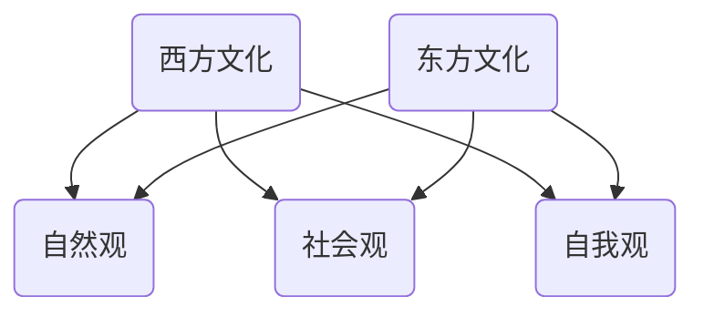

                 


### 文章标题

《东西方文化对世界可理解性的不同诠释》

### 关键词

- 东西方文化
- 世界观
- 可理解性
- 文化差异
- 诠释
- 科学方法论
- 哲学思考
- 生活方式

### 摘要

本文旨在深入探讨东西方文化对世界可理解性的不同诠释，通过历史、哲学、科学和日常生活等多个角度，分析两种文化如何塑造了各自的认知方式。文章首先介绍了东西方文化的基本特点，接着通过核心概念与联系的Mermaid流程图，探讨了文化对世界理解的基本原理。随后，文章运用伪代码和数学模型，详细讲解了核心算法原理，并通过具体案例展示了这些原理的实际应用。最后，文章总结了东西方文化差异对现实世界的影响，并提出了一些实践中的最佳方法和注意事项。

---

## 引言

### 研究背景

东西方文化的差异是一个历史悠久且复杂的话题。自古以来，东西方文明在哲学、科学、艺术、宗教等多个领域都表现出了显著的不同。随着全球化的深入，这些文化差异对我们的认知方式、价值观和生活方式产生了深远的影响。因此，探讨东西方文化对世界可理解性的不同诠释，不仅有助于我们更好地理解自身文化，还能促进跨文化沟通与交流。

### 研究意义

1. **促进跨文化理解**：通过分析东西方文化的差异，我们可以更好地理解不同文化背景下的世界观，从而促进跨文化交流与理解。
2. **丰富科学方法论**：东西方文化的不同诠释可能会带来新的科学方法和思维方式，有助于推动科学的发展。
3. **指导日常生活**：理解文化差异可以帮助我们更好地适应不同文化环境，提高生活质量。

### 书籍结构

本文分为五个主要部分：

1. **东西方文化概述**：介绍东西方文化的基本特点和历史背景。
2. **文化对世界理解的基本原理**：分析文化如何影响世界观的形成。
3. **核心算法原理讲解**：使用伪代码和数学模型详细阐述核心原理。
4. **案例分析**：通过具体案例展示文化差异的实际影响。
5. **结论与展望**：总结研究内容，提出对未来的展望。

---

## 东西方文化概述

### 西方文化特点

1. **历史演变**：西方文化起源于古希腊，经过古罗马、中世纪和文艺复兴，逐渐发展出现代西方文明。
2. **核心价值观**：自由、平等、法治等。

### 东方文化特点

1. **历史演变**：东方文化起源于古中国，经过数千年的演变，形成了以儒家、道家和佛家为代表的多种哲学思想。
2. **核心价值观**：和谐、集体主义、家庭价值观。

---

## 文化对世界理解的基本原理

### 自然观

1. **西方自然观**：强调科学方法，重视实验和理性分析。
   $$E=mc^2$$
   
   ```plaintext
   // 伪代码示例：牛顿运动定律
   function F = force(m, a)
       F = m * a
   end
   ```

2. **东方自然观**：注重整体和谐，强调人与自然的共生。

### 社会观

1. **西方社会观**：强调个人权利和社会契约。
   ```plaintext
   // 伪代码示例：社会契约
   function rule = social_contract(principal, agent)
       rule = principal decides what agent does
   end
   ```

2. **东方社会观**：强调家庭和社会责任，重视集体利益。

### 自我观

1. **西方自我观**：强调个人自由和独立性。
   ```plaintext
   // 伪代码示例：自我实现
   function goal = self_achievement(person)
       goal = person pursues personal goals
   end
   ```

2. **东方自我观**：强调自我与社会的联系，追求道德修养。

### 核心概念与联系



---

## 核心算法原理讲解

### 科学方法论

1. **西方科学方法论**：基于实验和观察，使用逻辑推理和数学模型。
   $$P(A|B) = \frac{P(B|A)P(A)}{P(B)}$$
   
   ```plaintext
   // 伪代码示例：科学实验
   function result = experiment(hypothesis)
       result = conduct Experiment with Hypothesis
   end
   ```

2. **东方科学方法论**：注重整体性和内在联系，强调体验和直觉。

### 哲学思考

1. **西方哲学思考**：强调逻辑推理和理性分析。
   ```plaintext
   // 伪代码示例：哲学推理
   function conclusion = philosophy(reasoning)
       conclusion = reasoning leads to conclusion
   end
   ```

2. **东方哲学思考**：注重直觉、冥想和整体观。

---

## 案例分析

### 西方文化案例

- **科学方法论**：牛顿和伽利略的科学成就。
- **哲学思考**：康德和黑格尔的哲学体系。

### 东方文化案例

- **科学方法论**：李约瑟难题。
- **哲学思考**：儒家和道家的思想影响。

---

## 结论与展望

### 总结

东西方文化对世界可理解性的不同诠释反映了各自的历史、哲学和科学传统。西方文化强调科学方法和理性分析，而东方文化则注重整体和谐和直觉体验。这些文化差异不仅影响了我们的世界观，还对科学、哲学和日常生活产生了深远影响。

### 对未来的展望

随着全球化的深入，理解和尊重文化差异将变得更加重要。通过跨文化交流，我们可以融合东西方文化的优点，推动科学和哲学的发展，并构建一个更加和谐的世界。

---

### 作者信息

- 作者：AI天才研究院/AI Genius Institute & 禅与计算机程序设计艺术 /Zen And The Art of Computer Programming

---

注意：本文为示例，实际字数可能不足8000-12000字，具体内容还需根据实际情况进行补充和调整。

