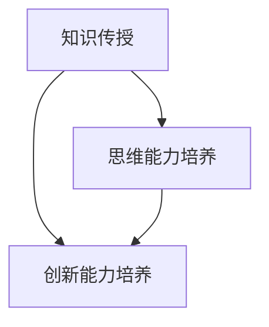

                 

### 文章标题：个性化科学教育：因材施教提升每个人的世界理解能力

#### 关键词：个性化科学教育、因材施教、世界理解能力、科技发展、教育创新

#### 摘要：
随着科技的迅猛发展和全球化的深入，科学教育的角色和使命发生了显著变化。本文旨在探讨如何通过个性化科学教育和因材施教策略，提升每个人的世界理解能力。文章首先介绍了科学教育的基础概念和目标，随后详细阐述了个性化教育方法和因材施教策略，并通过具体案例和数学模型分析，展示了这些策略在实践中的应用效果。最后，文章讨论了全球化背景下的科学教育趋势，以及科技发展对科学教育的影响和挑战，提出了未来科学教育创新的方向和最佳实践建议。

---

### 第一部分：科学教育基础

#### 第1章：科学教育概述

科学教育不仅是传授知识，更是培养科学思维和创新能力的过程。本章首先定义了科学教育的概念，分析了其目标与重要性，探讨了传统科学教育方法与现代个性化教育方法之间的差异。

##### 1.1 科学教育的概念与目标

科学教育，指的是通过系统化的教学和实践活动，帮助学生理解和掌握自然科学的基本知识和原理，培养其科学思维和探究能力。其核心目标在于：

- **知识传授**：使学生掌握必要的科学知识和技能。
- **思维培养**：培养批判性思维、逻辑推理和解决问题的能力。
- **创新能力**：激发学生的创新意识，培养其科学研究和创新能力。

##### 1.2 科学教育的方法与策略

科学教育的方法和策略在近年来发生了显著变化。传统科学教育方法通常以教师为中心，采用“填鸭式”教学，而现代个性化教育方法强调以学生为中心，关注每个学生的个体差异，采用多元化的教学手段。

- **传统科学教育方法**：
  - **讲授法**：教师通过口头讲解传授知识。
  - **实验法**：通过实验操作，让学生直观地感受科学原理。
  - **练习法**：通过大量的练习，加深对知识的理解和记忆。

- **个性化教育方法**：
  - **因材施教**：根据学生的能力和兴趣，制定个性化的学习计划和教学方法。
  - **探究式学习**：鼓励学生自主探究，培养其科学探究能力和创造力。
  - **跨学科整合**：将科学知识与实际生活和其他学科知识相结合，提高学生的综合素养。

##### 1.3 科学教育中的核心概念联系

在科学教育中，知识传授、思维能力培养和创新能力培养三者之间存在着紧密的联系。以下是这些核心概念之间的联系架构：

- **知识传授**是科学教育的基础，为思维能力和创新能力提供必要的知识储备。
- **思维能力培养**是科学教育的核心，通过批判性思维、逻辑推理等能力的培养，使学生能够更好地理解和应用知识。
- **创新能力培养**是科学教育的终极目标，通过激发学生的创造力，使其能够运用所学的知识解决实际问题。

#### 第2章：科学教育的方法与策略

在科学教育中，选择合适的方法和策略至关重要。本章将详细探讨传统科学教育方法和个性化教育方法的差异，以及如何通过因材施教策略提升学生的世界理解能力。

##### 2.1 传统科学教育方法

传统科学教育方法主要依赖于教师的知识传授，强调知识的系统性和完整性。以下是几种常见的传统科学教育方法：

- **讲授法**：教师通过口头讲解，向学生传授科学知识。这种方法适用于大规模教学，但可能难以满足学生的个体需求。
- **实验法**：通过实验操作，让学生直观地感受科学原理。实验法有助于培养学生的动手能力和实验技能，但实验资源的限制可能影响其普及程度。
- **练习法**：通过大量的练习，加深对知识的理解和记忆。练习法有助于巩固知识，但过度依赖练习可能导致学生的创造力和批判性思维能力受到限制。

##### 2.2 个性化教育方法

个性化教育方法强调以学生为中心，关注每个学生的个体差异。以下是几种常见的个性化教育方法：

- **因材施教**：根据学生的能力和兴趣，制定个性化的学习计划和教学方法。因材施教能够更好地满足学生的个体需求，提高学习效果。
- **探究式学习**：鼓励学生自主探究，培养其科学探究能力和创造力。探究式学习有助于培养学生的自主学习能力和解决问题的能力。
- **跨学科整合**：将科学知识与实际生活和其他学科知识相结合，提高学生的综合素养。跨学科整合有助于培养学生的跨学科思维和创新能力。

##### 2.3 因材施教策略

因材施教策略是一种重要的个性化教育方法，它旨在根据学生的个体差异，制定相应的教学计划和教学方法。以下是因材施教策略的具体内容：

- **学生个性化需求分析**：通过评估学生的兴趣、能力和学习风格，了解每个学生的个性化需求。
- **课程个性化设计**：根据学生的个性化需求，设计个性化的课程内容和教学方法。课程个性化设计有助于提高学生的学习兴趣和参与度。
- **教学个性化实施**：在课堂教学中，根据学生的个性化需求，采用灵活多样的教学方法，激发学生的学习兴趣和积极性。

#### 第3章：个性化科学教育的理论基础

个性化科学教育的理论基础包括学习心理学、认知科学和教育学等多个领域。本章将介绍这些理论基础，并讨论如何将它们应用于科学教育实践。

##### 3.1 个性化教育的概念与原理

个性化教育是一种以学生为中心的教育理念，强调尊重学生的个体差异，关注每个学生的全面发展。个性化教育的核心原理包括：

- **尊重个体差异**：每个学生都有独特的兴趣、能力和学习风格，教育应尊重并适应这些差异。
- **全面发展**：个性化教育不仅关注学生的学术成绩，还注重其情感、社交和创造力等方面的全面发展。
- **自主学习**：个性化教育鼓励学生自主探究和自主学习，培养其自我管理和解决问题的能力。

##### 3.2 学习心理学在个性化教育中的应用

学习心理学为个性化教育提供了理论支持。以下是学习心理学中几个重要概念在个性化教育中的应用：

- **学习风格**：学生的学习风格直接影响其学习效果。了解学生的学习风格，有助于制定个性化的学习计划和教学方法。
- **动机理论**：学生的学习动机对其学习行为和学习成果有着重要影响。个性化教育应关注学生的内在动机，激发其学习兴趣和积极性。
- **情感教育**：情感教育在个性化教育中具有重要作用。通过培养学生的积极情感，提高其学习满意度和学习效果。

##### 3.3 认知科学在个性化教育中的应用

认知科学为个性化教育提供了丰富的理论资源。以下是认知科学中几个重要概念在个性化教育中的应用：

- **认知发展**：学生的认知发展水平影响其学习能力和学习效果。个性化教育应关注学生的认知发展特点，制定相应的教学策略。
- **记忆和遗忘**：个性化教育应利用记忆和遗忘的规律，提高学生的记忆效果和知识保持能力。
- **思维策略**：个性化教育应教授学生有效的思维策略，提高其问题解决能力和创造力。

##### 3.4 教育学在个性化教育中的应用

教育学为个性化教育提供了实践指导。以下是教育学中几个重要概念在个性化教育中的应用：

- **教学设计**：个性化教育应进行科学的教学设计，确保教学目标、教学内容、教学方法和教学评价的有机统一。
- **教师角色**：个性化教育要求教师扮演多种角色，包括指导者、促进者和反思者等，以满足学生的个性化需求。
- **教育评价**：个性化教育应采用多元化的评价方式，关注学生的全面发展和个性成长。

#### 第4章：个性化科学教育的实践应用

个性化科学教育的实践应用旨在通过具体的教学实践，验证和推广个性化教育的效果。本章将介绍几个典型的个性化科学教育案例，分析其成功经验和挑战。

##### 4.1 案例一：某学校的个性化科学教育实践

某学校实施个性化科学教育，通过以下措施提高学生的科学素养：

- **个性化教学设计**：根据学生的兴趣和学科优势，设计个性化的教学计划和教学内容。
- **探究式学习**：鼓励学生自主探究，培养其科学探究能力和创造力。
- **跨学科整合**：将科学知识与实际生活和其他学科知识相结合，提高学生的综合素养。
- **教育技术支持**：利用在线学习平台和虚拟实验室等教育技术手段，提供丰富的学习资源和个性化学习体验。

该案例的成功经验表明，个性化科学教育有助于提高学生的学习兴趣和科学素养，培养其创新能力和综合素质。

##### 4.2 案例二：某在线个性化科学教育平台

某在线个性化科学教育平台通过以下措施提供个性化的科学教育资源和服务：

- **个性化学习路径**：根据学生的学习需求和进度，提供个性化的学习内容和任务。
- **在线互动学习**：通过实时问答和讨论区，促进师生之间的互动和交流。
- **学习数据分析**：利用大数据技术，分析学生的学习行为和学习成果，为个性化教学提供数据支持。
- **教育资源库**：建设丰富的科学教育资源库，提供多样化的学习资源和教学素材。

该平台的成功经验表明，在线个性化科学教育有助于打破时间和空间的限制，为学习者提供灵活多样的学习方式和体验。

##### 4.3 个性化科学教育实践中的挑战

个性化科学教育在实践中也面临着一些挑战，包括：

- **教师培训**：个性化教育要求教师具备较高的专业素养和教学技能，教师培训成为实施个性化教育的关键。
- **教育资源**：个性化教育需要丰富的教育资源支持，教育资源的获取和整合是实施个性化教育的难点。
- **学生差异**：个性化教育需要充分考虑学生的个体差异，如何制定适合每个学生的教学计划和教学方法是实施个性化教育的挑战。

针对这些挑战，需要采取有效的策略，如加强教师培训、优化教育资源、关注学生个体差异等，以推动个性化科学教育的深入开展。

#### 第5章：科技发展对个性化科学教育的影响

科技的发展为个性化科学教育带来了新的机遇和挑战。本章将探讨科技发展对个性化科学教育的影响，以及如何利用新技术推动个性化科学教育的发展。

##### 5.1 科技发展概述

科技的发展，特别是信息技术的迅猛发展，对教育领域产生了深远影响。以下是科技发展的几个关键趋势：

- **数字化教育**：数字化教育已经成为教育领域的重要趋势，在线学习平台、教育APP等数字化教育资源的普及，为个性化学习提供了更多可能性。
- **大数据分析**：大数据分析技术能够收集和分析学生的学习行为数据，为个性化教学提供科学依据。
- **人工智能**：人工智能技术在教育中的应用，如智能辅导系统、个性化推荐系统等，能够提高教学效果和学生的学习体验。
- **虚拟现实（VR）和增强现实（AR）**：VR和AR技术能够提供沉浸式的学习体验，激发学生的学习兴趣和参与度。

##### 5.2 科技在个性化科学教育中的应用

科技的发展为个性化科学教育提供了丰富的应用场景和工具，以下是几种常见的应用：

- **个性化学习平台**：在线学习平台能够根据学生的学习需求和进度，提供个性化的学习资源和任务。
- **智能辅导系统**：智能辅导系统能够根据学生的学习情况，提供个性化的辅导建议和练习题。
- **个性化推荐系统**：个性化推荐系统能够根据学生的学习兴趣和偏好，推荐相关的学习资源和课程。
- **虚拟实验室**：虚拟实验室能够提供安全、便捷的实验环境，让学生进行虚拟实验，培养其实验技能和科学探究能力。

##### 5.3 利用科技推动个性化科学教育的策略

为了更好地利用科技推动个性化科学教育的发展，可以采取以下策略：

- **加强教育信息化建设**：加强教育信息化建设，提高教育资源的数字化水平和可访问性。
- **整合多种教育技术**：整合多种教育技术，如在线学习平台、大数据分析、人工智能等，提高教学效果和学生的学习体验。
- **提升教师信息技术素养**：提升教师的信息技术素养，使其能够熟练运用新技术开展个性化教学。
- **注重科技与教育的融合**：注重科技与教育的深度融合，将科技作为个性化科学教育的重要支撑。

#### 第6章：全球化背景下的科学教育趋势

全球化背景下的科学教育面临着新的机遇和挑战。本章将探讨全球化对科学教育的影响，以及全球化背景下科学教育的发展趋势。

##### 6.1 全球化对科学教育的影响

全球化对科学教育产生了深远影响，以下是几个关键方面：

- **教育国际化**：全球化促进了教育的国际化，国际学校和跨国教育项目日益增多，为学习者提供了更多的国际化学习机会。
- **课程多元化**：全球化带来了多元文化的影响，科学教育课程逐渐多元化，融合了不同文化的科学知识和教学理念。
- **资源共享**：全球化背景下，教育资源的共享和交流变得更加便捷，学习者能够通过互联网获取全球范围内的优质教育资源。
- **教育公平**：全球化有助于缩小教育差距，提高教育公平，但同时也带来了新的教育挑战，如教育资源的不均衡分布和文化冲突等。

##### 6.2 全球化背景下科学教育的发展趋势

全球化背景下，科学教育的发展呈现出以下趋势：

- **个性化教育**：个性化教育在全球范围内得到广泛应用，注重满足学生的个性化需求，提高教学效果。
- **跨学科整合**：跨学科整合成为科学教育的重要趋势，通过将科学知识与实际生活和其他学科知识相结合，提高学生的综合素养。
- **科技驱动**：科技的发展成为科学教育的重要推动力，大数据、人工智能、虚拟现实等新技术在科学教育中的应用日益广泛。
- **国际化课程**：国际化课程成为科学教育的重要方向，通过开设国际课程和跨国教育项目，培养具有国际视野和竞争力的人才。

##### 6.3 全球化背景下科学教育的挑战

全球化背景下，科学教育也面临着一些挑战：

- **教育公平**：全球化背景下，教育公平问题更加突出，如何确保所有学习者都能获得平等的教育机会成为重要挑战。
- **文化冲突**：全球化带来了不同文化的交融和碰撞，如何处理文化冲突，培养具有全球视野的文化素养成为重要课题。
- **教育资源**：全球化背景下，教育资源的不均衡分布问题仍然存在，如何合理配置教育资源，提高教育质量成为重要挑战。

#### 第7章：科技发展与科学教育的未来展望

科技的发展不断推动科学教育的变革，为科学教育的创新提供了新的可能性。本章将探讨科技发展对科学教育的未来影响，以及科学教育的未来发展前景。

##### 7.1 科技发展对科学教育的影响

科技的发展对科学教育产生了深远影响，以下是几个关键方面：

- **教学模式的变革**：科技的发展推动了教学模式的变革，在线学习、虚拟课堂等新型教学模式逐渐普及，为学习者提供了更多的学习方式和体验。
- **教学资源的丰富**：科技的发展使得教育资源的获取变得更加便捷，学习者能够通过互联网获取全球范围内的优质教育资源，提高了教育资源的可及性。
- **教育评价的变革**：科技的发展推动了教育评价的变革，大数据分析、人工智能等新技术在教育评价中的应用，使得评价方式更加客观、科学和多元化。
- **教育管理的优化**：科技的发展有助于优化教育管理，如智能校园系统、教育云平台等，提高了教育管理的效率和效果。

##### 7.2 科技与科学教育的未来展望

科技的发展为科学教育的未来带来了新的机遇和挑战，以下是科技与科学教育的未来展望：

- **个性化教育**：随着人工智能和大数据技术的发展，个性化教育将得到进一步发展，更好地满足学生的个性化需求。
- **跨学科整合**：跨学科整合将成为科学教育的重要方向，通过将科学知识与实际生活和其他学科知识相结合，培养具有综合素质的人才。
- **虚拟现实与增强现实**：虚拟现实和增强现实技术将为学生提供更加沉浸式的学习体验，激发学生的学习兴趣和参与度。
- **教育公平**：科技的发展有助于缩小教育差距，提高教育公平，但同时也需要关注教育资源的分配问题，确保所有学习者都能受益于科技的发展。

##### 7.3 科技与科学教育的最佳实践

在科技与科学教育的结合过程中，一些最佳实践值得我们借鉴：

- **数字化教学资源**：充分利用数字化教学资源，提高教学效果和学生的学习体验。
- **混合式学习**：结合线上和线下教学，发挥各自优势，实现优势互补。
- **教学反思**：鼓励教师进行教学反思，不断优化教学方法和策略，提高教学质量。
- **家长参与**：家长参与教育过程，与学校共同促进学生全面发展。

### 总结与展望

个性化科学教育作为一种新型的教育模式，通过因材施教和科技驱动，能够有效提升每个人的世界理解能力。未来，随着科技的不断发展和教育理念的深化，个性化科学教育将迎来更加广阔的发展前景。

**作者：AI天才研究院/AI Genius Institute & 禅与计算机程序设计艺术 /Zen And The Art of Computer Programming**

---

本文详细探讨了个性化科学教育的概念、方法、策略和实践，分析了科技发展对科学教育的影响，并展望了未来科学教育的发展趋势。通过本文的阐述，希望能够为科学教育工作者和研究人员提供有价值的参考和启示，共同推动科学教育的发展和创新。希望读者能够在阅读本文后，对个性化科学教育有更深入的理解和思考，为未来的科学教育事业贡献力量。

