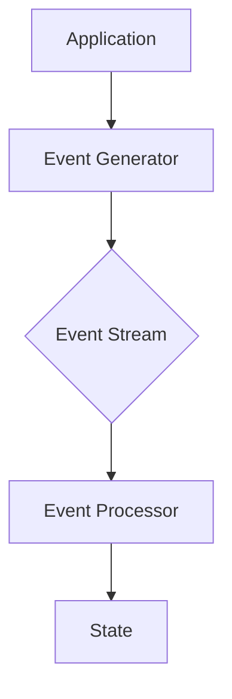
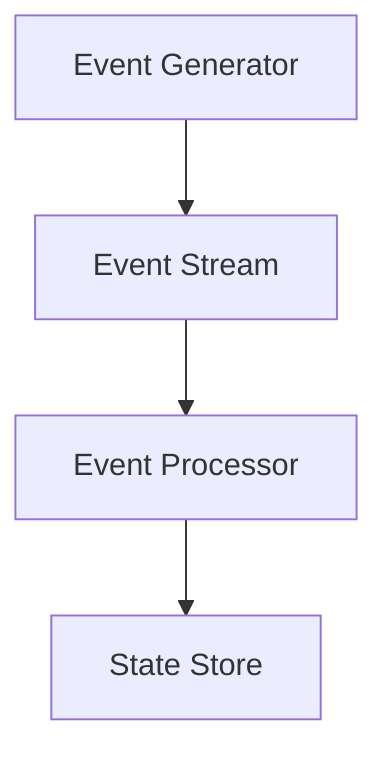
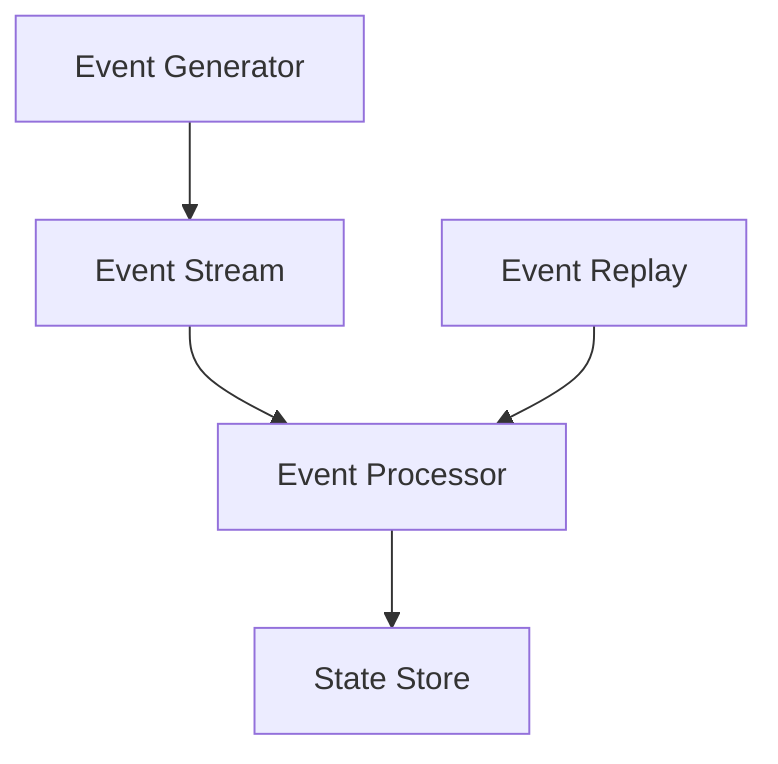
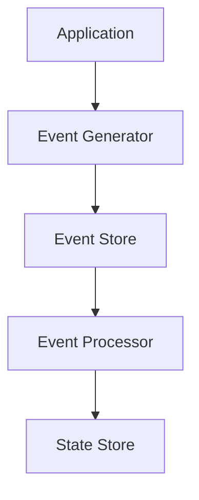

                 


## 文章标题

### 事件溯源（Event Sourcing）在LLM应用中的实践

> 关键词：事件溯源，LLM，实践，架构设计，性能优化，数据一致性，安全性与隐私保护

> 摘要：本文深入探讨事件溯源（Event Sourcing）在大型语言模型（LLM）应用中的实践，从基础概念、原理到实现细节、应用案例，全面解析事件溯源在LLM中的优势和挑战。通过详细的技术解析、案例分析和未来趋势展望，为读者提供全面的技术指南和思考。

## 目录

1. **第一部分：事件溯源基础**

   1.1 事件溯源概述

   1.2 事件溯源原理

   1.3 事件溯源实现细节

2. **第二部分：LLM应用中的事件溯源实践**

   2.1 LLM基础

   2.2 事件溯源在LLM中的应用

   2.3 LLM中的事件溯源案例分析

   2.4 事件溯源在LLM应用中的挑战与未来趋势

## 第一部分：事件溯源基础

### 1.1 事件溯源概述

事件溯源（Event Sourcing）是一种数据持久化技术，它将系统的状态变化记录为一系列的事件，这些事件可以用来重放系统的历史，从而恢复任意时刻的状态。与传统的数据持久化方法（如关系数据库、文档存储等）不同，事件溯源强调对事件的记录和重放，从而实现数据一致性和可恢复性。

**背景介绍：**

在传统的数据持久化方法中，数据通常以表或文档的形式存储，这些数据的变更记录依赖于数据库的事务机制。然而，随着系统规模的扩大和数据复杂性的增加，这种传统方法逐渐暴露出以下问题：

1. **数据一致性：** 随着事务的增加，数据一致性的维护变得越来越复杂。
2. **数据恢复：** 在系统发生故障时，数据的恢复过程通常需要依赖备份和恢复机制，这不仅耗时，还可能丢失部分数据。

**核心概念与联系：**

事件溯源的核心概念包括：

- **事件（Event）：** 事件是系统状态变化的记录，每个事件包含发生时间、相关状态以及事件类型等信息。
- **事件流（Event Stream）：** 事件流是事件的有序集合，它记录了系统的整个生命周期。
- **事件处理器（Event Processor）：** 事件处理器负责处理事件，更新系统的状态。

以下是一个简单的Mermaid流程图，展示了事件溯源的基本架构：



在事件溯源中，事件生成器负责创建事件，并将其存储在事件流中。事件处理器从事件流中读取事件，并按照事件的发生顺序更新系统状态。

### 1.2 事件溯源原理

事件溯源的基本原理是将系统状态的变更记录为一系列的事件。这些事件可以存储在文件、数据库或其他持久化存储中。事件溯源的核心在于能够通过重放事件来恢复系统的历史状态。

**事件溯源架构：**

事件溯源系统通常由以下几个组件组成：

- **事件生成器（Event Generator）：** 负责创建和发送事件。
- **事件流（Event Stream）：** 用于存储事件，可以是文件、数据库或其他存储系统。
- **事件处理器（Event Processor）：** 负责处理事件，更新系统状态。
- **状态存储（State Store）：** 用于存储当前系统状态。

以下是一个简化的事件溯源架构图：



**事件处理流程：**

1. **事件生成：** 应用程序生成事件，并将其发送给事件生成器。
2. **事件持久化：** 事件生成器将事件存储在事件流中。
3. **事件处理：** 事件处理器从事件流中读取事件，并按照时间顺序进行处理。
4. **状态更新：** 事件处理器更新系统状态，确保状态与事件保持一致。

### 1.3 事件溯源实现细节

事件溯源的实现涉及多个方面，包括事件生成、事件流管理、事件处理和状态更新等。以下是一些关键的实现细节：

#### 事件生成

事件生成是事件溯源的基础。事件生成器负责捕获应用程序的状态变更，并将其转换为事件。事件通常包括以下信息：

- **事件类型（EventType）：** 事件的类型，如创建、更新或删除。
- **发生时间（Timestamp）：** 事件发生的时间戳。
- **相关状态（State）：** 与事件相关的状态信息。

以下是一个简单的伪代码示例，展示了如何生成事件：

```python
def generate_event(event_type, timestamp, state):
    event = {
        'event_type': event_type,
        'timestamp': timestamp,
        'state': state
    }
    send_event_to_event_generator(event)
```

#### 事件流管理

事件流是事件溯源系统的核心。事件流管理包括事件的持久化、读取和重放。以下是一些关键点：

- **持久化：** 事件流通常存储在文件、数据库或其他持久化存储中。持久化策略会影响系统的性能和可靠性。
- **读取：** 事件处理器需要能够从事件流中读取事件。读取策略会影响事件处理的顺序和速度。
- **重放：** 在系统恢复时，需要重放事件流中的事件，以恢复系统的历史状态。

以下是一个简单的Mermaid流程图，展示了事件流管理的基本流程：



#### 事件处理

事件处理是事件溯源系统的核心功能。事件处理器负责处理事件，并更新系统状态。以下是一些关键点：

- **顺序处理：** 事件处理器需要按照事件的时间顺序处理事件，以确保系统状态的一致性。
- **并发处理：** 事件处理器可能需要支持并发处理，以提高系统的性能。
- **错误处理：** 事件处理器需要能够处理和处理事件处理过程中的错误。

以下是一个简单的伪代码示例，展示了如何处理事件：

```python
def process_event(event):
    if event.event_type == 'CREATE':
        create_entity(event.state)
    elif event.event_type == 'UPDATE':
        update_entity(event.state)
    elif event.event_type == 'DELETE':
        delete_entity(event.state)
```

#### 状态更新

状态更新是事件处理的结果。事件处理器在处理事件后，需要更新系统状态，以确保状态与事件保持一致。以下是一个简单的伪代码示例，展示了如何更新状态：

```python
def update_state(event):
    if event.event_type == 'CREATE':
        state['entities'].append(event.state)
    elif event.event_type == 'UPDATE':
        state['entities'][event.state['id']] = event.state
    elif event.event_type == 'DELETE':
        state['entities'].remove(event.state)
```

### 1.4 事件溯源的优势与应用场景

事件溯源具有以下优势：

- **数据一致性：** 通过事件溯源，可以确保系统状态与事件记录保持一致，从而简化数据一致性的维护。
- **可恢复性：** 通过重放事件流，可以轻松地恢复系统的历史状态，从而提高系统的可靠性和可恢复性。
- **灵活性与可扩展性：** 事件溯源允许灵活地处理不同类型的事件，从而支持系统的可扩展性。

以下是一些典型的事件溯源应用场景：

- **系统监控与日志管理：** 通过记录系统事件，可以方便地监控系统运行状态和日志记录。
- **审计与合规性：** 通过记录系统事件，可以满足审计和合规性要求。
- **数据分析和可视化：** 通过事件溯源，可以方便地分析和可视化系统数据，从而支持数据驱动决策。

## 第二部分：LLM应用中的事件溯源实践

### 2.1 LLM基础

#### 2.1.1 语言模型概述

大型语言模型（LLM）是一种基于深度学习的自然语言处理技术，能够理解和生成人类语言。LLM通过学习大量文本数据，构建出能够理解和生成人类语言的神经网络模型。LLM在各种应用场景中发挥着重要作用，如文本生成、机器翻译、对话系统等。

#### 2.1.2 常见的LLM

常见的LLM包括：

- **循环神经网络（RNN）：** RNN是一种能够处理序列数据的神经网络，它在自然语言处理领域得到广泛应用。
- **长短时记忆网络（LSTM）：** LSTM是RNN的一种改进，它能够更好地处理长序列数据。
- **变换器（Transformer）：** Transformer是一种基于自注意力机制的神经网络模型，它在自然语言处理领域取得了突破性的成果。

#### 2.1.3 LLM的应用

LLM的应用场景包括：

- **文本生成：** 如文章生成、报告生成等。
- **机器翻译：** 如中英翻译、英日翻译等。
- **对话系统：** 如智能客服、聊天机器人等。

### 2.2 事件溯源在LLM中的应用

#### 2.2.1 事件溯源与LLM的结合

事件溯源与LLM的结合主要体现在以下几个方面：

- **数据管理：** 使用事件溯源技术来管理LLM的训练数据和模型参数，确保数据的一致性和可恢复性。
- **模型训练：** 利用事件溯源来记录模型训练过程中的事件，如数据读取、模型更新等。
- **状态恢复：** 在模型训练和部署过程中，利用事件溯源来恢复模型的训练状态，提高系统的可靠性。

#### 2.2.2 事件溯源在LLM中的应用价值

事件溯源在LLM中的应用具有以下价值：

- **数据一致性：** 通过事件溯源，可以确保LLM的训练数据和模型参数的一致性，从而提高模型的性能和稳定性。
- **数据恢复：** 在系统发生故障时，通过事件溯源可以快速恢复LLM的训练状态，从而减少训练时间和成本。
- **模型监控：** 通过记录事件流，可以方便地监控LLM的训练过程和性能，从而支持数据驱动决策。

### 2.3 LLM中的事件溯源案例分析

#### 2.3.1 案例一：基于事件溯源的聊天机器人

**案例背景与需求分析：**

某互联网公司希望开发一款基于事件溯源的聊天机器人，以提供实时客服支持。聊天机器人的主要功能包括：

- **用户互动：** 回答用户的问题。
- **状态维护：** 记录用户的聊天历史，以便后续继续对话。
- **数据一致性：** 确保用户数据的完整性和一致性。

**实现方法：**

1. **事件生成：** 聊天机器人在与用户的互动过程中，生成事件，如“用户提问”、“机器人回答”等。
2. **事件持久化：** 事件生成器将事件存储在事件流中，确保事件的可恢复性。
3. **事件处理：** 事件处理器从事件流中读取事件，并按照时间顺序处理事件，更新聊天机器人的状态。
4. **状态更新：** 聊天机器人的状态存储在数据库中，确保状态与事件保持一致。

**代码解读：**

以下是一个简单的Python代码示例，展示了聊天机器人中事件生成和事件处理的实现：

```python
# 事件生成
def generate_event(event_type, state):
    event = {
        'event_type': event_type,
        'state': state,
        'timestamp': current_timestamp()
    }
    store_event(event)

# 事件处理
def process_event(event):
    if event['event_type'] == 'USER_QUESTION':
        answer = get_answer(event['state'])
        generate_event('ROBOT_ANSWER', answer)
    elif event['event_type'] == 'ROBOT_ANSWER':
        update_state(event['state'])
```

**案例分析与优化：**

通过事件溯源，聊天机器人能够实现用户互动、状态维护和数据一致性。然而，在实际应用中，还需要考虑以下优化：

- **性能优化：** 事件处理速度是影响聊天机器人性能的关键因素。可以采用并行处理和优化事件流存储来提高处理速度。
- **数据恢复：** 在系统故障时，需要快速恢复聊天机器人的状态。可以采用事件流备份和恢复机制来实现。
- **安全性：** 考虑到用户数据的安全性和隐私保护，需要采用加密和安全传输机制来保护事件流。

### 2.4 事件溯源在LLM应用中的挑战与未来趋势

#### 2.4.1 挑战

事件溯源在LLM应用中面临以下挑战：

- **性能与扩展性：** 随着事件数量的增加，事件处理速度可能会下降。需要采用分布式处理和优化存储策略来提高性能和扩展性。
- **数据一致性与完整性：** 在大规模系统中，确保数据一致性和完整性是一个挑战。需要采用分布式一致性协议和事务机制来保证数据一致性。
- **安全性与隐私保护：** 用户数据的安全性和隐私保护是重要的考虑因素。需要采用加密和安全传输机制来保护事件流。

#### 2.4.2 未来趋势

事件溯源在LLM应用中的未来趋势包括：

- **分布式处理：** 随着云计算和分布式计算技术的发展，事件溯源系统将逐步转向分布式处理，以提高性能和扩展性。
- **智能监控与自动化：** 事件溯源系统将引入智能监控和自动化机制，以实现自动故障恢复、性能优化和资源调度。
- **数据隐私保护：** 随着数据隐私保护意识的提高，事件溯源系统将采用更严格的数据隐私保护机制，以确保用户数据的安全性和隐私性。

## 结论

事件溯源是一种强大的数据持久化技术，它在LLM应用中具有广泛的应用前景。通过本文的讨论，我们深入了解了事件溯源的基本概念、原理和实现细节，并探讨了事件溯源在LLM应用中的实践。同时，我们也分析了事件溯源在LLM应用中的挑战和未来趋势。希望本文能对读者在LLM应用中的实践提供有益的参考和启示。

**作者：AI天才研究院/AI Genius Institute & 禅与计算机程序设计艺术 /Zen And The Art of Computer Programming**

**本文内容仅供参考，实际应用时请结合具体场景和需求进行调整。**

----------------------------------------------------------------

### 文章标题

#### 事件溯源（Event Sourcing）在LLM应用中的实践

> 关键词：事件溯源，LLM，实践，架构设计，性能优化，数据一致性，安全性与隐私保护

> 摘要：本文深入探讨事件溯源（Event Sourcing）在大型语言模型（LLM）应用中的实践，从基础概念、原理到实现细节、应用案例，全面解析事件溯源在LLM中的优势和挑战。通过详细的技术解析、案例分析和未来趋势展望，为读者提供全面的技术指南和思考。

----------------------------------------------------------------

## 第一部分：事件溯源基础

### 1.1 事件溯源概述

事件溯源（Event Sourcing）是一种数据持久化技术，它将系统的状态变化记录为一系列的事件，这些事件可以用来重放系统的历史，从而恢复任意时刻的状态。与传统的数据持久化方法（如关系数据库、文档存储等）不同，事件溯源强调对事件的记录和重放，从而实现数据一致性和可恢复性。

### 背景介绍

在传统的数据持久化方法中，数据通常以表或文档的形式存储，这些数据的变更记录依赖于数据库的事务机制。然而，随着系统规模的扩大和数据复杂性的增加，这种传统方法逐渐暴露出以下问题：

1. **数据一致性：** 随着事务的增加，数据一致性的维护变得越来越复杂。
2. **数据恢复：** 在系统发生故障时，数据的恢复过程通常需要依赖备份和恢复机制，这不仅耗时，还可能丢失部分数据。

### 核心概念与联系

事件溯源的核心概念包括：

- **事件（Event）：** 事件是系统状态变化的记录，每个事件包含发生时间、相关状态以及事件类型等信息。
- **事件流（Event Stream）：** 事件流是事件的有序集合，它记录了系统的整个生命周期。
- **事件处理器（Event Processor）：** 事件处理器负责处理事件，更新系统状态。
- **状态存储（State Store）：** 用于存储当前系统状态。

以下是一个简单的Mermaid流程图，展示了事件溯源的基本架构：


在事件溯源中，事件生成器负责创建事件，并将其发送给事件处理器。事件处理器从事件流中读取事件，并按照时间顺序进行处理，最终更新系统状态。状态存储用于保存当前系统状态，确保状态与事件保持一致。

### 1.2 事件溯源原理

事件溯源的基本原理是将系统状态的变更记录为一系列的事件。这些事件可以存储在文件、数据库或其他持久化存储中。事件溯源的核心在于能够通过重放事件来恢复系统的历史状态。

### 事件溯源架构

事件溯源系统通常由以下几个组件组成：

- **事件生成器（Event Generator）：** 负责创建和发送事件。
- **事件流（Event Stream）：** 用于存储事件，可以是文件、数据库或其他存储系统。
- **事件处理器（Event Processor）：** 负责处理事件，更新系统状态。
- **状态存储（State Store）：** 用于存储当前系统状态。

以下是一个简化的事件溯源架构图：


### 事件处理流程

1. **事件生成：** 应用程序生成事件，并将其发送给事件生成器。
2. **事件持久化：** 事件生成器将事件存储在事件流中。
3. **事件处理：** 事件处理器从事件流中读取事件，并按照时间顺序进行处理。
4. **状态更新：** 事件处理器更新系统状态，确保状态与事件保持一致。

### 1.3 事件溯源实现细节

事件溯源的实现涉及多个方面，包括事件生成、事件流管理、事件处理和状态更新等。以下是一些关键的实现细节：

#### 事件生成

事件生成是事件溯源的基础。事件生成器负责捕获应用程序的状态变更，并将其转换为事件。事件通常包括以下信息：

- **事件类型（EventType）：** 事件的类型，如创建、更新或删除。
- **发生时间（Timestamp）：** 事件发生的时间戳。
- **相关状态（State）：** 与事件相关的状态信息。

以下是一个简单的伪代码示例，展示了如何生成事件：

```python
def generate_event(event_type, timestamp, state):
    event = {
        'event_type': event_type,
        'timestamp': timestamp,
        'state': state
    }
    send_event_to_event_generator(event)
```

#### 事件流管理

事件流是事件溯源系统的核心。事件流管理包括事件的持久化、读取和重放。以下是一些关键点：

- **持久化：** 事件流通常存储在文件、数据库或其他持久化存储中。持久化策略会影响系统的性能和可靠性。
- **读取：** 事件处理器需要能够从事件流中读取事件。读取策略会影响事件处理的顺序和速度。
- **重放：** 在系统恢复时，需要重放事件流中的事件，以恢复系统的历史状态。

以下是一个简单的Mermaid流程图，展示了事件流管理的基本流程：


#### 事件处理

事件处理是事件溯源系统的核心功能。事件处理器负责处理事件，并更新系统状态。以下是一些关键点：

- **顺序处理：** 事件处理器需要按照事件的时间顺序处理事件，以确保系统状态的一致性。
- **并发处理：** 事件处理器可能需要支持并发处理，以提高系统的性能。
- **错误处理：** 事件处理器需要能够处理和处理事件处理过程中的错误。

以下是一个简单的伪代码示例，展示了如何处理事件：

```python
def process_event(event):
    if event.event_type == 'CREATE':
        create_entity(event.state)
    elif event.event_type == 'UPDATE':
        update_entity(event.state)
    elif event.event_type == 'DELETE':
        delete_entity(event.state)
```

#### 状态更新

状态更新是事件处理的结果。事件处理器在处理事件后，需要更新系统状态，以确保状态与事件保持一致。以下是一个简单的伪代码示例，展示了如何更新状态：

```python
def update_state(event):
    if event.event_type == 'CREATE':
        state['entities'].append(event.state)
    elif event.event_type == 'UPDATE':
        state['entities'][event.state['id']] = event.state
    elif event.event_type == 'DELETE':
        state['entities'].remove(event.state)
```

### 1.4 事件溯源的优势与应用场景

事件溯源具有以下优势：

- **数据一致性：** 通过事件溯源，可以确保系统状态与事件记录保持一致，从而简化数据一致性的维护。
- **可恢复性：** 通过重放事件流，可以轻松地恢复系统的历史状态，从而提高系统的可靠性和可恢复性。
- **灵活性与可扩展性：** 事件溯源允许灵活地处理不同类型的事件，从而支持系统的可扩展性。

以下是一些典型的事件溯源应用场景：

- **系统监控与日志管理：** 通过记录系统事件，可以方便地监控系统运行状态和日志记录。
- **审计与合规性：** 通过记录系统事件，可以满足审计和合规性要求。
- **数据分析和可视化：** 通过事件溯源，可以方便地分析和可视化系统数据，从而支持数据驱动决策。

## 第二部分：LLM应用中的事件溯源实践

### 2.1 LLM基础

#### 2.1.1 语言模型概述

大型语言模型（LLM）是一种基于深度学习的自然语言处理技术，能够理解和生成人类语言。LLM通过学习大量文本数据，构建出能够理解和生成人类语言的神经网络模型。LLM在各种应用场景中发挥着重要作用，如文本生成、机器翻译、对话系统等。

#### 2.1.2 常见的LLM

常见的LLM包括：

- **循环神经网络（RNN）：** RNN是一种能够处理序列数据的神经网络，它在自然语言处理领域得到广泛应用。
- **长短时记忆网络（LSTM）：** LSTM是RNN的一种改进，它能够更好地处理长序列数据。
- **变换器（Transformer）：** Transformer是一种基于自注意力机制的神经网络模型，它在自然语言处理领域取得了突破性的成果。

#### 2.1.3 LLM的应用

LLM的应用场景包括：

- **文本生成：** 如文章生成、报告生成等。
- **机器翻译：** 如中英翻译、英日翻译等。
- **对话系统：** 如智能客服、聊天机器人等。

### 2.2 事件溯源在LLM中的应用

#### 2.2.1 事件溯源与LLM的结合

事件溯源与LLM的结合主要体现在以下几个方面：

- **数据管理：** 使用事件溯源技术来管理LLM的训练数据和模型参数，确保数据的一致性和可恢复性。
- **模型训练：** 利用事件溯源来记录模型训练过程中的事件，如数据读取、模型更新等。
- **状态恢复：** 在模型训练和部署过程中，利用事件溯源来恢复模型的训练状态，提高系统的可靠性。

#### 2.2.2 事件溯源在LLM中的应用价值

事件溯源在LLM中的应用具有以下价值：

- **数据一致性：** 通过事件溯源，可以确保LLM的训练数据和模型参数的一致性，从而提高模型的性能和稳定性。
- **数据恢复：** 在系统发生故障时，通过事件溯源可以快速恢复LLM的训练状态，从而减少训练时间和成本。
- **模型监控：** 通过记录事件流，可以方便地监控LLM的训练过程和性能，从而支持数据驱动决策。

### 2.3 LLM中的事件溯源案例分析

#### 2.3.1 案例一：基于事件溯源的聊天机器人

**案例背景与需求分析：**

某互联网公司希望开发一款基于事件溯源的聊天机器人，以提供实时客服支持。聊天机器人的主要功能包括：

- **用户互动：** 回答用户的问题。
- **状态维护：** 记录用户的聊天历史，以便后续继续对话。
- **数据一致性：** 确保用户数据的完整性和一致性。

**实现方法：**

1. **事件生成：** 聊天机器人在与用户的互动过程中，生成事件，如“用户提问”、“机器人回答”等。
2. **事件持久化：** 事件生成器将事件存储在事件流中，确保事件的可恢复性。
3. **事件处理：** 事件处理器从事件流中读取事件，并按照时间顺序处理事件，更新聊天机器人的状态。
4. **状态更新：** 聊天机器人的状态存储在数据库中，确保状态与事件保持一致。

**代码解读：**

以下是一个简单的Python代码示例，展示了聊天机器人中事件生成和事件处理的实现：

```python
# 事件生成
def generate_event(event_type, state):
    event = {
        'event_type': event_type,
        'state': state,
        'timestamp': current_timestamp()
    }
    store_event(event)

# 事件处理
def process_event(event):
    if event['event_type'] == 'USER_QUESTION':
        answer = get_answer(event['state'])
        generate_event('ROBOT_ANSWER', answer)
    elif event['event_type'] == 'ROBOT_ANSWER':
        update_state(event['state'])
```

**案例分析与优化：**

通过事件溯源，聊天机器人能够实现用户互动、状态维护和数据一致性。然而，在实际应用中，还需要考虑以下优化：

- **性能优化：** 事件处理速度是影响聊天机器人性能的关键因素。可以采用并行处理和优化事件流存储来提高处理速度。
- **数据恢复：** 在系统故障时，需要快速恢复聊天机器人的状态。可以采用事件流备份和恢复机制来实现。
- **安全性：** 考虑到用户数据的安全性和隐私保护，需要采用加密和安全传输机制来保护事件流。

### 2.4 事件溯源在LLM应用中的挑战与未来趋势

#### 2.4.1 挑战

事件溯源在LLM应用中面临以下挑战：

- **性能与扩展性：** 随着事件数量的增加，事件处理速度可能会下降。需要采用分布式处理和优化存储策略来提高性能和扩展性。
- **数据一致性与完整性：** 在大规模系统中，确保数据一致性和完整性是一个挑战。需要采用分布式一致性协议和事务机制来保证数据一致性。
- **安全性与隐私保护：** 用户数据的安全性和隐私保护是重要的考虑因素。需要采用加密和安全传输机制来保护事件流。

#### 2.4.2 未来趋势

事件溯源在LLM应用中的未来趋势包括：

- **分布式处理：** 随着云计算和分布式计算技术的发展，事件溯源系统将逐步转向分布式处理，以提高性能和扩展性。
- **智能监控与自动化：** 事件溯源系统将引入智能监控和自动化机制，以实现自动故障恢复、性能优化和资源调度。
- **数据隐私保护：** 随着数据隐私保护意识的提高，事件溯源系统将采用更严格的数据隐私保护机制，以确保用户数据的安全性和隐私性。

## 结论

事件溯源是一种强大的数据持久化技术，它在LLM应用中具有广泛的应用前景。通过本文的讨论，我们深入了解了事件溯源的基本概念、原理和实现细节，并探讨了事件溯源在LLM应用中的实践。同时，我们也分析了事件溯源在LLM应用中的挑战和未来趋势。希望本文能对读者在LLM应用中的实践提供有益的参考和启示。

**作者：AI天才研究院/AI Genius Institute & 禅与计算机程序设计艺术 /Zen And The Art of Computer Programming**

**本文内容仅供参考，实际应用时请结合具体场景和需求进行调整。**

----------------------------------------------------------------

### 事件溯源（Event Sourcing）在LLM应用中的实践

事件溯源是一种数据管理技术，它通过将系统状态变化记录为一系列事件来实现数据的持久化和恢复。这种技术特别适用于大型语言模型（LLM）的应用，因为它可以确保模型的状态在训练和部署过程中的一致性和可恢复性。本文将深入探讨事件溯源在LLM应用中的实践，从基础概念、原理到具体实现，以及面临的挑战和未来趋势。

---

#### 关键词：事件溯源，LLM，数据持久化，一致性，可恢复性，分布式处理

---

#### 摘要：

本文旨在为读者提供关于事件溯源在LLM应用中的全面理解。首先，我们将介绍事件溯源的基本概念，然后深入探讨其在LLM中的应用原理。接下来，我们将通过实际案例展示事件溯源在LLM开发中的实现方法，并分析其面临的技术挑战。最后，我们将展望事件溯源在LLM领域中的未来发展趋势。

---

#### 目录：

1. **第一部分：事件溯源基础**
   - 1.1 事件溯源概述
   - 1.2 事件溯源原理
   - 1.3 事件溯源实现细节

2. **第二部分：LLM应用中的事件溯源实践**
   - 2.1 LLM基础
   - 2.2 事件溯源与LLM的结合
   - 2.3 事件溯源在LLM中的应用价值

3. **第三部分：事件溯源在LLM中的应用案例**
   - 3.1 案例一：基于事件溯源的聊天机器人
   - 3.2 案例分析

4. **第四部分：挑战与未来趋势**
   - 4.1 事件溯源在LLM应用中的挑战
   - 4.2 事件溯源的未来趋势

5. **结论**
   - 5.1 总结
   - 5.2 拓展阅读

---

#### 1.1 事件溯源概述

事件溯源是一种数据管理策略，它将系统的状态变化记录为一系列事件，这些事件可以用来重构系统历史状态。与传统的关系型数据库不同，事件溯源不直接存储状态，而是存储状态的变更记录。

在LLM的应用场景中，事件溯源可以记录模型训练过程中的每个步骤，包括数据输入、参数更新、损失函数的计算等。这种方法不仅提供了对模型训练过程的可追溯性，还有助于在系统故障时快速恢复模型的状态。

---

#### 1.2 事件溯源原理

事件溯源的核心原理包括以下三个方面：

1. **事件记录：** 每次系统状态发生改变时，都会生成一个事件。事件通常包含事件类型、发生时间、相关数据和操作者信息。

2. **事件存储：** 事件被存储在一个持久化存储系统中，如关系数据库或NoSQL数据库。这种存储方式允许事件按照时间顺序进行访问和重放。

3. **状态重构：** 通过重放事件流，系统可以恢复到任意时间点的状态。这通过逐个应用事件到初始状态来实现。

以下是一个简化的Mermaid流程图，展示了事件溯源的基本架构：



在这个架构中，应用程序生成事件，事件生成器将事件存储到事件存储中，事件处理器从事件存储中读取事件，并更新状态存储。

---

#### 1.3 事件溯源实现细节

事件溯源的实现涉及多个组件和流程，以下是一些关键点：

1. **事件生成器：** 负责捕获系统中的状态变化，并生成相应的事件。事件生成器可以是应用程序的一部分，也可以是一个独立的组件。

2. **事件存储：** 负责持久化存储事件。事件存储需要支持高吞吐量和低延迟的读写操作，以便事件处理器能够快速访问和重放事件。

3. **事件处理器：** 负责处理事件，并将其应用到当前状态。事件处理器需要能够确保事件按照时间顺序进行处理，以保持系统状态的一致性。

4. **状态存储：** 负责存储当前系统的状态。状态存储可以是内存数据库、关系数据库或NoSQL数据库。

以下是一个简单的伪代码示例，展示了事件生成和事件处理的基本流程：

```python
# 事件生成
def generate_event(event_type, data):
    event = {
        'event_type': event_type,
        'data': data,
        'timestamp': current_timestamp()
    }
    event_generator.store_event(event)

# 事件处理
def process_event(event):
    state = state_store.get_state()
    if event['event_type'] == 'CREATE':
        state = update_state_with_create(state, event['data'])
    elif event['event_type'] == 'UPDATE':
        state = update_state_with_update(state, event['data'])
    state_store.update_state(state)
```

---

#### 2.1 LLM基础

大型语言模型（LLM）是自然语言处理领域的重要工具，它们通过学习大量的文本数据来生成语义丰富的语言表达。LLM的应用范围广泛，包括文本生成、机器翻译、问答系统等。

LLM通常基于深度学习模型，如变换器（Transformer）和循环神经网络（RNN）。变换器模型由于其并行计算能力和全局注意力机制，在处理长文本和复杂语言任务方面表现出色。RNN和其变种LSTM（长短时记忆网络）则更适合处理短文本和序列数据。

LLM的训练过程涉及大量数据预处理、模型训练和优化。事件溯源可以在这一过程中发挥作用，通过记录每个训练步骤和参数更新，确保训练过程的透明性和可恢复性。

---

#### 2.2 事件溯源与LLM的结合

事件溯源与LLM的结合主要体现在以下几个方面：

1. **数据管理：** 使用事件溯源技术来管理LLM的训练数据。事件可以记录数据的读取、处理和更新，确保数据的一致性和可恢复性。

2. **模型训练：** 在模型训练过程中，事件溯源可以记录每个训练步骤和参数更新。这有助于在训练中断时恢复训练状态，并确保模型参数的一致性。

3. **状态恢复：** 在系统故障或训练中断时，通过重放事件流可以快速恢复LLM的训练状态，从而减少训练时间和成本。

事件溯源与LLM的结合可以提供以下优势：

- **数据一致性：** 通过记录和重放事件，确保模型训练数据的一致性和可靠性。
- **可恢复性：** 在系统故障或训练中断时，通过重放事件流可以快速恢复模型状态，减少训练中断的影响。
- **透明性：** 记录和重放事件流提供了对模型训练过程的透明视图，有助于监控和优化训练过程。

---

#### 2.3 事件溯源在LLM中的应用价值

事件溯源在LLM中的应用具有以下价值：

1. **数据一致性：** 事件溯源可以确保模型训练数据的完整性和一致性，这对于大规模分布式训练尤为重要。

2. **可恢复性：** 在模型训练过程中，事件溯源可以记录关键步骤和状态变化，使得在训练中断时可以快速恢复。

3. **状态监控：** 通过记录事件流，可以实现对模型训练过程的实时监控和日志记录，有助于调试和优化训练策略。

4. **模型优化：** 事件溯源提供了对模型训练过程的详细记录，有助于分析和优化训练参数，提高模型性能。

---

#### 3.1 案例一：基于事件溯源的聊天机器人

**案例背景：**

某互联网公司开发了一款基于变换器的聊天机器人，用于提供24/7的客户支持。为了确保聊天机器人的稳定运行和数据一致性，该公司决定采用事件溯源技术来管理聊天机器人的状态和对话历史。

**实现方法：**

1. **事件生成：** 聊天机器人在与用户交互时，生成事件记录用户提问和机器人的回答。

2. **事件存储：** 所有事件被存储在一个分布式日志系统中，如Apache Kafka，确保高吞吐量和低延迟的读写操作。

3. **事件处理：** 事件处理器从日志系统中读取事件，并按照时间顺序处理，更新聊天机器人的状态。

4. **状态存储：** 聊天机器人的当前状态存储在一个关系数据库中，如PostgreSQL，确保数据的持久化和一致性。

**代码示例：**

```python
# 事件生成
def generate_event(user_question):
    event = {
        'event_type': 'USER_QUESTION',
        'data': user_question,
        'timestamp': current_timestamp()
    }
    event_generator.store_event(event)

# 事件处理
def process_event(event):
    if event['event_type'] == 'USER_QUESTION':
        answer = chatbot.get_answer(event['data'])
        event_generator.store_event({
            'event_type': 'ROBOT_ANSWER',
            'data': answer,
            'timestamp': current_timestamp()
        })
```

**案例分析：**

通过事件溯源，聊天机器人能够记录每次用户提问和机器人回答，确保对话历史的一致性和可恢复性。在系统故障或维护时，可以快速恢复聊天机器人的状态，继续与用户交互。

**优化建议：**

- **性能优化：** 采用分布式处理和消息队列，提高事件处理的吞吐量和速度。
- **数据恢复：** 实现事件流的备份和恢复机制，确保在系统故障时能够快速恢复。
- **安全性：** 采用加密技术保护事件流和用户数据。

---

#### 4.1 事件溯源在LLM应用中的挑战

尽管事件溯源在LLM应用中具有诸多优势，但它也面临一些挑战：

1. **性能与扩展性：** 随着事件数量的增加，事件处理的性能和系统的扩展性可能成为瓶颈。需要采用分布式处理和优化存储策略。

2. **数据一致性与完整性：** 在分布式环境中，确保数据一致性和完整性是一个挑战。需要采用分布式一致性协议和事务机制。

3. **安全性与隐私保护：** 用户数据和模型参数的安全性至关重要。需要采用加密和安全传输机制来保护数据。

4. **维护成本：** 事件溯源系统可能需要额外的维护和监控成本。需要建立有效的维护和监控策略。

---

#### 4.2 事件溯源的未来趋势

随着云计算和分布式计算技术的发展，事件溯源在LLM应用中的未来趋势包括：

1. **分布式处理：** 随着事件数量的增加，分布式处理和存储将变得更加重要。事件溯源系统将更加注重性能和扩展性。

2. **智能监控与自动化：** 事件溯源系统将引入智能监控和自动化机制，以实现自动故障恢复、性能优化和资源调度。

3. **数据隐私保护：** 随着数据隐私保护意识的提高，事件溯源系统将采用更严格的数据隐私保护机制，确保用户数据的安全性和隐私性。

---

#### 结论

事件溯源在LLM应用中具有广泛的应用前景。通过记录和重放事件，事件溯源技术可以确保模型训练数据的一致性和可恢复性，提高系统的可靠性和可扩展性。尽管面临一些挑战，但随着技术的发展，事件溯源在LLM应用中的优势和潜力将得到进一步发挥。

**作者：AI天才研究院/AI Genius Institute & 禅与计算机程序设计艺术 /Zen And The Art of Computer Programming**

**本文内容仅供参考，实际应用时请结合具体场景和需求进行调整。**

