                 

### 文章标题

“人工智能伦理：机器理解世界的道德维度”

### 关键词

- 人工智能伦理
- 道德原则
- 算法偏见
- 隐私保护
- 法律与政策

### 摘要

本文深入探讨了人工智能伦理的核心问题和挑战，分析了其道德维度及其对人类社会的影响。通过回顾历史背景、阐述基本原理、研究方法和现状，本文旨在为人工智能伦理的研究和实践提供系统性框架，并探讨未来的发展方向。文章结构清晰，结合了技术语言和专业分析，旨在为读者提供一个全面深入的理解。

---

## 第一部分：概述与背景

### 第1章：人工智能伦理概述

### 1.1 人工智能的兴起与挑战

**核心概念与联系**：人工智能（AI）的兴起源自计算机科学、认知科学、统计学等多个领域的交叉融合。随着计算能力的提升和数据资源的丰富，人工智能从理论研究逐步走向实际应用，成为推动社会变革的重要力量。然而，这种快速的发展也带来了诸多伦理挑战。

使用Mermaid流程图描述人工智能发展历程及其带来的伦理挑战：

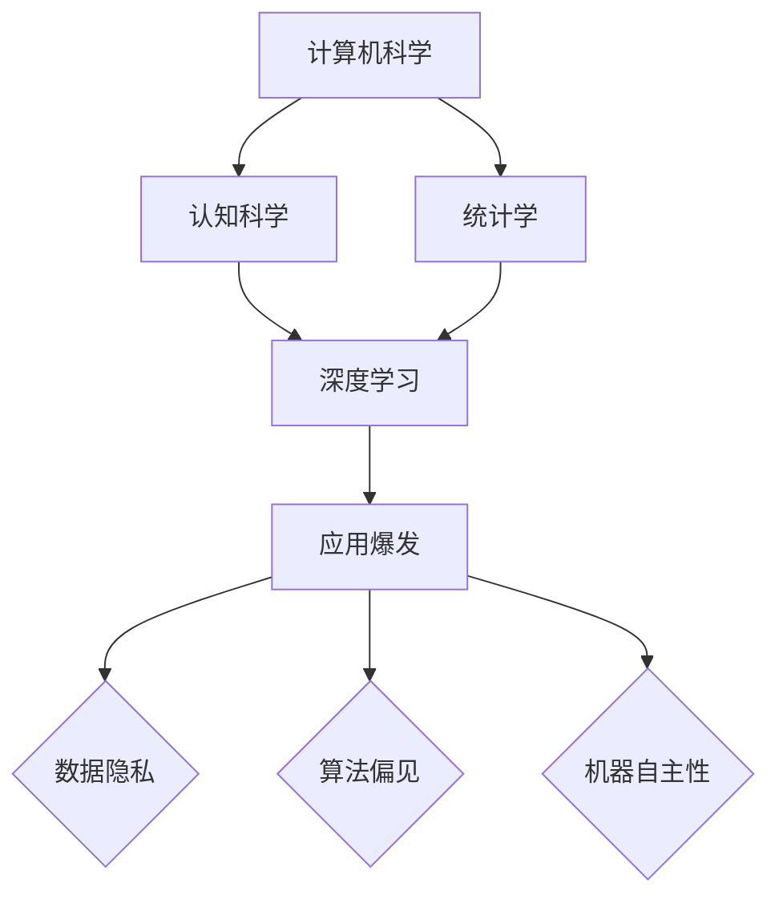
```mermaid
graph TD
    A[计算机科学]
    B[认知科学]
    C[统计学]
    D[深度学习]
    E[应用爆发]
    A --> B
    A --> C
    B --> D
    C --> D
    D --> E
    E --> F{数据隐私}
    E --> G{算法偏见}
    E --> H{机器自主性}
```

**核心算法原理讲解**：人工智能的算法原理主要包括机器学习、深度学习、强化学习等。这些算法通过训练模型，使其能够在特定任务上表现优异。然而，这些算法的训练过程和数据来源可能包含偏见，导致模型在应用中表现出不公平和不可预测的行为。

使用伪代码解释人工智能伦理的基本原则，如公平性、透明性、责任性等：

```python
def ethical_ai(principle):
    if principle == "fairness":
        return "AI 应避免偏见，确保对不同群体公平对待。"
    elif principle == "transparency":
        return "AI 的决策过程应透明，易于理解和解释。"
    elif principle == "responsibility":
        return "AI 应承担其决策和行为的道德责任。"
    else:
        return "未知原则。"
```

### 1.2 人工智能伦理的基本原则

人工智能伦理的基本原则是确保技术发展的同时，尊重和保护人的基本权利和利益。以下是几个核心原则及其简要解释：

1. **公平性**：确保人工智能系统不带有偏见，公正地对待所有用户。
2. **透明性**：使人工智能系统的决策过程公开透明，用户可以理解其行为依据。
3. **责任性**：明确人工智能系统的责任归属，确保其在出现问题时能够追究责任。
4. **隐私保护**：保护用户的隐私数据，防止数据滥用和泄露。

### 1.3 人工智能伦理研究的重要性

人工智能伦理研究的重要性体现在以下几个方面：

1. **社会影响**：人工智能技术的广泛应用可能对社会结构和人际关系产生深远影响，需要通过伦理研究来评估和应对。
2. **技术发展**：伦理研究可以引导人工智能技术的健康发展，避免技术滥用和道德风险。
3. **法律法规**：伦理研究为制定相关法律法规提供理论支持，确保人工智能技术的合规应用。
4. **公众信任**：通过伦理研究提高公众对人工智能技术的信任，促进技术的普及和应用。

### 1.4 本书结构安排

本书结构安排如下：

- **第2章**：探讨人工智能伦理的历史背景和研究方法。
- **第3章**：分析人工智能伦理的核心原则和理论框架。
- **第4章**：研究人工智能在不同领域的伦理问题。
- **第5章**：讨论人工智能伦理的法规政策和法律挑战。
- **第6章**：探讨人工智能伦理教育和公众认知。
- **第7章**：展望人工智能伦理的未来发展趋势和解决方案。

### 1.5 总结与展望

本章概述了人工智能伦理的基本概念、发展历程和重要性，为后续章节的深入讨论奠定了基础。在接下来的章节中，我们将进一步探讨人工智能伦理的核心原则、研究方法、应用挑战和未来方向。

---

## 第一部分：人工智能伦理的历史背景与研究方法

### 第2章：人工智能伦理的历史背景

### 2.1 人工智能伦理的起源与发展

**核心概念与联系**：人工智能伦理的起源可以追溯到计算机科学和人工智能的早期发展阶段。随着技术的不断进步，人工智能应用领域逐渐扩大，伦理问题也逐渐凸显。使用Mermaid流程图描述人工智能伦理的历史背景：

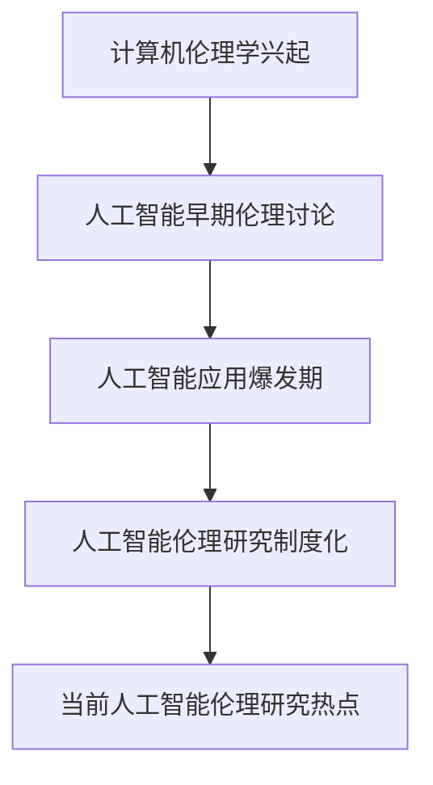
```mermaid
graph TD
    A[计算机伦理学兴起]
    B[人工智能早期伦理讨论]
    C[人工智能应用爆发期]
    D[人工智能伦理研究制度化]
    E[当前人工智能伦理研究热点]
    A --> B
    B --> C
    C --> D
    D --> E
```

**核心算法原理讲解**：人工智能伦理研究的主要方法包括定性研究和定量研究。定性研究通过深度访谈和案例分析，探索人工智能伦理问题的本质和影响。定量研究则通过统计方法和大数据分析，揭示人工智能伦理问题的规律和趋势。

使用伪代码解释定性研究和定量研究方法在人工智能伦理研究中的应用：

```python
def ethical_researchgetMethod(method):
    if method == "qualitative":
        return "定性研究通过深度访谈和案例分析来探索人工智能伦理问题。"
    elif method == "quantitative":
        return "定量研究使用统计方法来分析大数据，揭示人工智能伦理问题的规律和趋势。"
    else:
        return "未知研究方法。"
```

### 2.2 人工智能伦理研究的主要方法

人工智能伦理研究的主要方法包括以下几种：

1. **案例研究法**：通过具体案例，分析人工智能应用中的伦理问题及其影响。
2. **实验研究法**：设计实验，观察人工智能系统在不同条件下的行为，评估其伦理表现。
3. **文献综述法**：收集和分析相关文献，总结人工智能伦理研究的主要成果和趋势。
4. **调查问卷法**：通过问卷调查，收集公众对人工智能伦理问题的看法和意见。

### 2.3 人工智能伦理研究的现状与挑战

**数学模型和数学公式 & 详细讲解 & 举例说明**：人工智能伦理研究常常使用概率论、信息论和博弈论等数学模型。例如，概率论中的贝叶斯网络用于分析人工智能决策中的不确定性；信息论中的熵用于衡量数据隐私泄露的程度。

使用LaTeX格式和举例说明：

$$
H(X) = -\sum_{i} p(x_i) \log_2 p(x_i)
$$

- **举例说明**：信息熵（Entropy）用于衡量数据的混乱程度，在隐私保护研究中，可以通过计算信息熵来判断数据泄露的风险。

### 2.4 人工智能伦理研究的未来方向

**项目实战**：人工智能伦理研究的未来方向包括跨学科合作、伦理标准制定和伦理决策支持系统。例如，跨学科合作可以整合哲学、社会学、心理学等多学科知识，为人工智能伦理研究提供更全面的视角。伦理标准制定可以为人工智能应用提供明确的道德指南。伦理决策支持系统则可以帮助企业在开发和应用人工智能技术时，更好地遵循伦理原则。

**具体项目示例**：

- **项目名称**：跨学科人工智能伦理研究平台
- **项目目标**：建立跨学科的人工智能伦理研究平台，集成多学科知识，提供伦理决策支持。
- **实现步骤**：
  1. 整合哲学、社会学、心理学等学科的知识库。
  2. 开发基于多学科融合的伦理模型和算法。
  3. 构建用户界面，提供伦理决策支持功能。
  4. 进行实证研究和案例分析，验证平台的有效性。

**项目小结**：该项目旨在通过跨学科合作，为人工智能伦理研究提供更加全面和深入的支持。通过整合多学科知识和开发伦理决策支持系统，可以更好地应对人工智能应用中的伦理挑战。

---

**小结**：

本章回顾了人工智能伦理的历史背景和研究方法，探讨了人工智能伦理研究的现状和未来方向。通过核心概念的联系、算法原理的讲解和数学模型的运用，为读者提供了一个全面理解人工智能伦理的框架。在接下来的章节中，我们将进一步探讨人工智能伦理的核心原则、应用领域和未来发展趋势。

---

### 第一部分：人工智能伦理的历史背景与研究方法

### 第3章：人工智能伦理的基本原则

### 3.1 公平性

**核心概念与联系**：公平性是人工智能伦理中的一个关键原则，指的是人工智能系统应公平地对待所有用户，避免基于种族、性别、年龄等特征的偏见。使用Mermaid流程图描述公平性的核心概念及其联系：

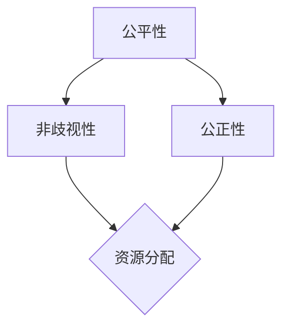
```mermaid
graph TD
    A[公平性]
    B[非歧视性]
    C[公正性]
    A --> B
    A --> C
    B --> D{算法偏见}
    C --> D{资源分配}
```

**核心算法原理讲解**：为了实现公平性，人工智能系统需要使用无偏的训练数据和公平的评估指标。以下是一个使用伪代码解释如何通过调整训练数据来减少算法偏见：

```python
def train_model(fair_data, bias_corrected_data):
    model = train_on_data(fair_data)  # 训练基于公平数据的模型
    biased_model = train_on_data(bias_corrected_data)  # 训练基于纠正偏见的模型
    return model, biased_model
```

**数学模型和公式 & 详细讲解 & 举例说明**：在公平性分析中，可以使用均衡性（Equitableness）指标来评估模型的公平性。以下是一个使用LaTeX格式的均衡性指标公式及其详细讲解：

$$
E = \frac{1}{N} \sum_{i=1}^{N} \frac{R_i - \bar{R}}{SD}
$$

- **公式解释**：$E$ 代表均衡性，$R_i$ 是模型对第$i$类数据的预测结果，$\bar{R}$ 是所有类数据的平均预测结果，$SD$ 是预测结果的均方差。该指标越接近1，表示模型的预测结果越公平。
- **举例说明**：假设一个分类模型在预测不同种族群体的犯罪率时，均衡性指标为0.9，表明模型的预测结果相对公平。

### 3.2 透明性

**核心概念与联系**：透明性是指人工智能系统的决策过程和内部逻辑应该清晰易懂，用户能够理解和追踪系统的决策依据。使用Mermaid流程图描述透明性的核心概念及其联系：

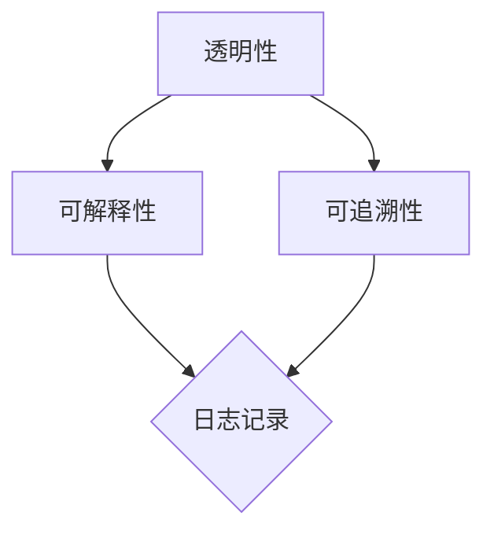
```mermaid
graph TD
    A[透明性]
    B[可解释性]
    C[可追溯性]
    A --> B
    A --> C
    B --> D{模型解释}
    C --> D{日志记录}
```

**核心算法原理讲解**：为了提高透明性，可以使用模型解释技术（如LIME、SHAP等）来揭示模型的决策过程。以下是一个使用伪代码解释LIME算法的基本原理：

```python
def explain_decision(model, x):
    local_model = lime_model(model, x)  # 构建本地线性模型
    explanation = local_model.explain(x)  # 解释决策依据
    return explanation
```

**数学模型和公式 & 详细讲解 & 举例说明**：在透明性分析中，可以使用决策重要性指标来衡量不同特征对决策的影响。以下是一个使用LaTeX格式的决策重要性指标公式及其详细讲解：

$$
I_j = \frac{\partial L}{\partial x_j}
$$

- **公式解释**：$I_j$ 是特征$x_j$的决策重要性，$L$ 是模型的损失函数。该指标表示特征$x_j$对决策的影响程度。
- **举例说明**：在一个分类问题中，决策重要性指标可以帮助用户理解模型为什么将某个实例分类为特定类别。

### 3.3 责任性

**核心概念与联系**：责任性是指人工智能系统的开发者、部署者和用户应承担相应的道德责任，确保系统在应用中的行为符合伦理标准。使用Mermaid流程图描述责任性的核心概念及其联系：

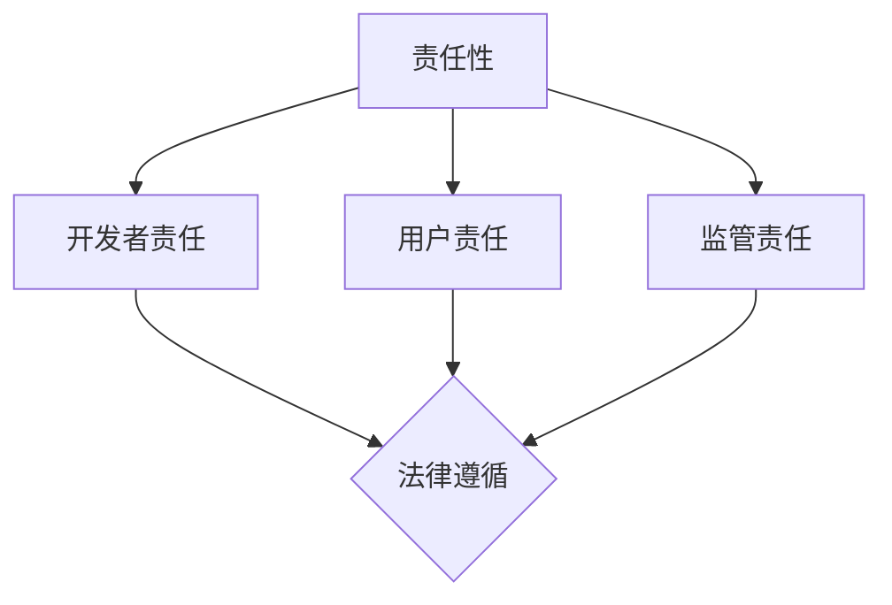
```mermaid
graph TD
    A[责任性]
    B[开发者责任]
    C[用户责任]
    D[监管责任]
    A --> B
    A --> C
    A --> D
    B --> E{算法设计}
    C --> E{数据提供}
    D --> E{法律遵循}
```

**核心算法原理讲解**：为了实现责任性，需要建立明确的伦理责任体系和责任追究机制。以下是一个使用伪代码解释责任追究机制的基本原理：

```python
def accountability(model, outcome):
    if is_unethical(model, outcome):
        report_issue(model, outcome)  # 报告不道德行为
        investigate_party()  # 调查责任方
    else:
        acknowledge_conformity()  # 确认合规性
```

**数学模型和公式 & 详细讲解 & 举例说明**：在责任性分析中，可以使用伦理得分（Ethical Score）来评估系统行为是否符合伦理标准。以下是一个使用LaTeX格式的伦理得分公式及其详细讲解：

$$
ES = \sum_{i=1}^{N} w_i \cdot S_i
$$

- **公式解释**：$ES$ 是伦理得分，$w_i$ 是第$i$个伦理原则的权重，$S_i$ 是模型在伦理原则$i$上的得分。该指标越高，表示系统的伦理表现越好。
- **举例说明**：在一个自动驾驶系统中，伦理得分可以帮助评估系统在处理紧急情况时的道德决策是否符合预期。

### 3.4 隐私保护

**核心概念与联系**：隐私保护是人工智能伦理中的另一个关键原则，涉及保护用户的个人数据，防止数据滥用和泄露。使用Mermaid流程图描述隐私保护的核心概念及其联系：

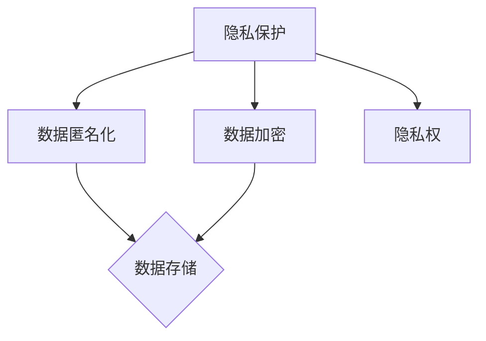
```mermaid
graph TD
    A[隐私保护]
    B[数据匿名化]
    C[数据加密]
    D[隐私权]
    A --> B
    A --> C
    A --> D
    B --> E{数据共享}
    C --> E{数据存储}
```

**核心算法原理讲解**：为了实现隐私保护，可以使用差分隐私（Differential Privacy）技术来确保数据分析的隐私性。以下是一个使用伪代码解释差分隐私算法的基本原理：

```python
def analyze_data(data, epsilon):
    sensitive_data = add_noise(data, epsilon)  # 加入噪声保护隐私
    result = analyze(sensitive_data)  # 进行数据分析
    return result
```

**数学模型和公式 & 详细讲解 & 举例说明**：在隐私保护分析中，可以使用隐私预算（Privacy Budget）来衡量隐私保护的程度。以下是一个使用LaTeX格式的隐私预算公式及其详细讲解：

$$
\epsilon = \frac{1}{\sqrt{N}}
$$

- **公式解释**：$\epsilon$ 是隐私预算，$N$ 是数据集的大小。该指标表示在数据分析中可以容忍的隐私泄露程度。
- **举例说明**：在一个医疗数据分析项目中，隐私预算可以帮助确保患者数据的隐私保护。

### 3.5 安全性

**核心概念与联系**：安全性是人工智能伦理中的关键原则，涉及保护系统免受攻击和恶意行为的影响。使用Mermaid流程图描述安全性的核心概念及其联系：

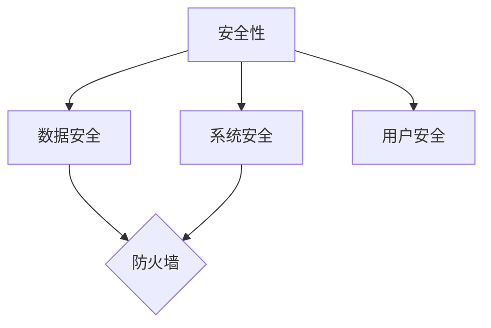
```mermaid
graph TD
    A[安全性]
    B[数据安全]
    C[系统安全]
    D[用户安全]
    A --> B
    A --> C
    A --> D
    B --> E{数据加密}
    C --> E{防火墙}
```

**核心算法原理讲解**：为了实现安全性，可以采用多种安全机制，如加密、认证和访问控制。以下是一个使用伪代码解释安全机制的基本原理：

```python
def secure_data(data, key):
    encrypted_data = encrypt(data, key)  # 加密数据
    verified_data = decrypt(encrypted_data, key)  # 解密数据
    return verified_data
```

**数学模型和公式 & 详细讲解 & 举例说明**：在安全性分析中，可以使用安全强度（Security Strength）来评估系统的安全性能。以下是一个使用LaTeX格式的安全强度公式及其详细讲解：

$$
SS = -\log_2(1 - P(A))
$$

- **公式解释**：$SS$ 是安全强度，$P(A)$ 是系统被攻破的概率。该指标越高，表示系统的安全性越强。
- **举例说明**：在一个金融交易系统中，安全强度可以帮助评估系统防范网络攻击的能力。

### 3.6 可持续性

**核心概念与联系**：可持续性是人工智能伦理中的一个新兴原则，涉及人工智能技术的长期可持续发展和环境影响。使用Mermaid流程图描述可持续性的核心概念及其联系：

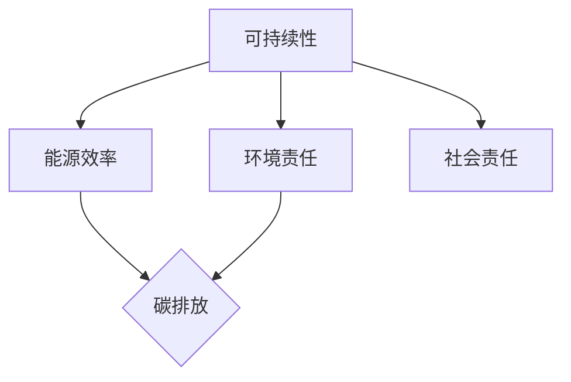
```mermaid
graph TD
    A[可持续性]
    B[能源效率]
    C[环境责任]
    D[社会责任]
    A --> B
    A --> C
    A --> D
    B --> E{数据中心能耗}
    C --> E{碳排放}
```

**核心算法原理讲解**：为了实现可持续性，可以采用多种技术措施，如优化算法、使用可再生能源和开展环境审计。以下是一个使用伪代码解释可持续性措施的基本原理：

```python
def sustainable_system(energy_efficient_algorithm, renewable_energy_source):
    system = implement_algorithm(energy_efficient_algorithm)  # 实施高效算法
    energy_usage = monitor_energy_usage(system, renewable_energy_source)  # 监控能源使用
    return system, energy_usage
```

**数学模型和公式 & 详细讲解 & 举例说明**：在可持续性分析中，可以使用碳足迹（Carbon Footprint）来衡量系统的环境影响。以下是一个使用LaTeX格式的碳足迹公式及其详细讲解：

$$
CF = \sum_{i=1}^{N} C_i \cdot Q_i
$$

- **公式解释**：$CF$ 是碳足迹，$C_i$ 是第$i$种能源类型的碳排放系数，$Q_i$ 是能源使用量。该指标越高，表示系统的环境影响越大。
- **举例说明**：在一个数据中心的能源管理中，碳足迹可以帮助评估系统的环境可持续性。

### 3.7 人类福祉

**核心概念与联系**：人类福祉是人工智能伦理中的一个重要原则，涉及人工智能技术对人类生活质量和社会福祉的影响。使用Mermaid流程图描述人类福祉的核心概念及其联系：

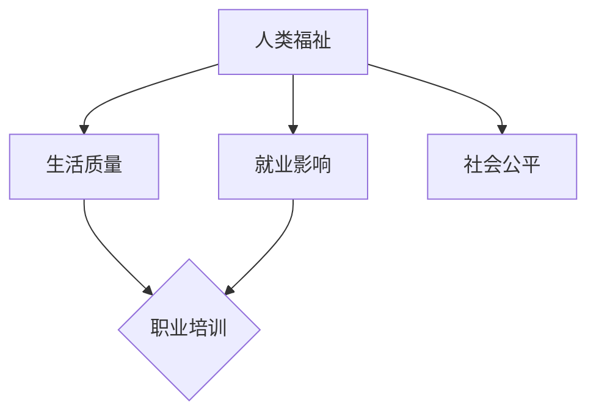
```mermaid
graph TD
    A[人类福祉]
    B[生活质量]
    C[就业影响]
    D[社会公平]
    A --> B
    A --> C
    A --> D
    B --> E{教育技术}
    C --> E{职业培训}
```

**核心算法原理讲解**：为了实现人类福祉，可以采用多种策略，如优化算法以提升用户体验，开展职业培训和技能提升项目。以下是一个使用伪代码解释人类福祉措施的基本原理：

```python
def enhance_wellbeing(algorithm_optimization, training_program):
    optimized_system = optimize_algorithm(algorithm_optimization)  # 优化算法
    trained_employees = implement_training_program(training_program)  # 实施培训计划
    return optimized_system, trained_employees
```

**数学模型和公式 & 详细讲解 & 举例说明**：在人类福祉分析中，可以使用幸福感指数（Wellbeing Index）来衡量人工智能技术对人类生活质量的影响。以下是一个使用LaTeX格式的幸福感指数公式及其详细讲解：

$$
WI = \alpha \cdot L + \beta \cdot E + \gamma \cdot S
$$

- **公式解释**：$WI$ 是幸福感指数，$L$ 是生活满意度，$E$ 是经济状况，$S$ 是社会支持。该指标越高，表示人工智能技术对人类福祉的贡献越大。
- **举例说明**：在一个智能城市的规划中，幸福感指数可以帮助评估人工智能技术对居民生活质量的影响。

### 小结

本章详细探讨了人工智能伦理的基本原则，包括公平性、透明性、责任性、隐私保护、安全性、可持续性和人类福祉。通过核心概念的联系、算法原理的讲解和数学模型的运用，为人工智能伦理研究提供了一个全面的框架。在接下来的章节中，我们将进一步探讨人工智能伦理的应用领域和未来发展趋势。

---

### 第一部分：人工智能伦理的历史背景与研究方法

### 第4章：人工智能伦理在各个领域的应用

#### 4.1 人工智能伦理在医疗领域的应用

**背景介绍**：随着人工智能技术的飞速发展，医疗领域成为其应用的重要领域之一。人工智能在医疗诊断、治疗决策、药物研发等方面展现出巨大的潜力，但也带来了诸多伦理挑战。

**核心概念与联系**：医疗领域的人工智能应用涉及患者隐私保护、数据安全、算法偏见和责任归属等多个伦理问题。使用Mermaid流程图描述医疗领域的人工智能伦理问题及其联系：

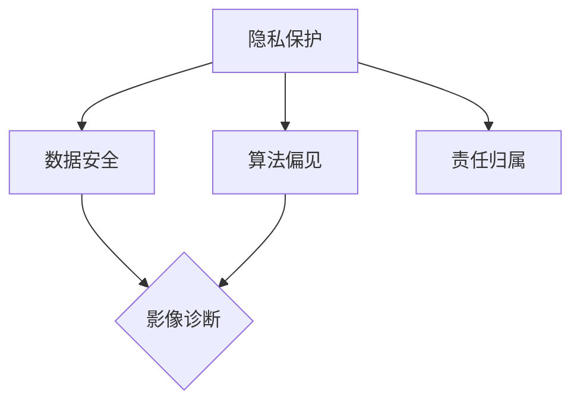
```mermaid
graph TD
    A[隐私保护]
    B[数据安全]
    C[算法偏见]
    D[责任归属]
    A --> B
    A --> C
    A --> D
    B --> E{电子健康记录}
    C --> E{影像诊断}
```

**案例分析**：以电子健康记录（EHR）为例，人工智能系统在处理患者数据时，需要遵循隐私保护和数据安全的伦理原则。以下是一个实际案例：

- **案例描述**：某医院采用人工智能系统来管理电子健康记录。该系统通过分析大量患者数据，提供个性化的治疗建议。
- **伦理问题**：患者隐私保护和数据安全是关键问题。如何确保患者数据在传输、存储和使用过程中不被泄露或滥用？
- **解决方案**：通过差分隐私技术保护患者数据隐私，使用加密技术确保数据传输和存储的安全性。

**详细讲解剖析**：以下是对电子健康记录案例的详细讲解和剖析：

- **数据收集**：医院收集患者的基本信息、病史、检查报告等数据。
- **数据处理**：使用加密技术对数据进行加密存储，确保数据在存储和传输过程中的安全性。
- **隐私保护**：引入差分隐私技术，对敏感数据进行扰动处理，降低数据泄露风险。
- **算法开发**：开发基于保护隐私数据的算法，进行患者病情分析和个性化治疗建议。

**注意事项**：在医疗领域应用人工智能时，需要关注以下注意事项：

- **患者同意**：确保患者对数据收集和使用有知情同意权。
- **透明性**：提高算法透明度，使患者理解其治疗建议的依据。
- **责任归属**：明确算法开发者、医院和患者的责任，确保在出现问题时能够追究责任。

**小结**：医疗领域的人工智能应用在带来巨大便利的同时，也带来了诸多伦理挑战。通过隐私保护、数据安全和算法偏见等多方面的措施，可以更好地应对这些挑战，确保人工智能技术在医疗领域的健康和可持续发展。

#### 4.2 人工智能伦理在自动驾驶领域的应用

**背景介绍**：自动驾驶技术被认为是人工智能应用的重要领域之一，有望彻底改变交通方式，提高交通效率和安全性。然而，自动驾驶技术的发展也带来了诸多伦理问题。

**核心概念与联系**：自动驾驶领域的伦理问题包括生命价值、道德责任、隐私保护和公平性等多个方面。使用Mermaid流程图描述自动驾驶领域的伦理问题及其联系：

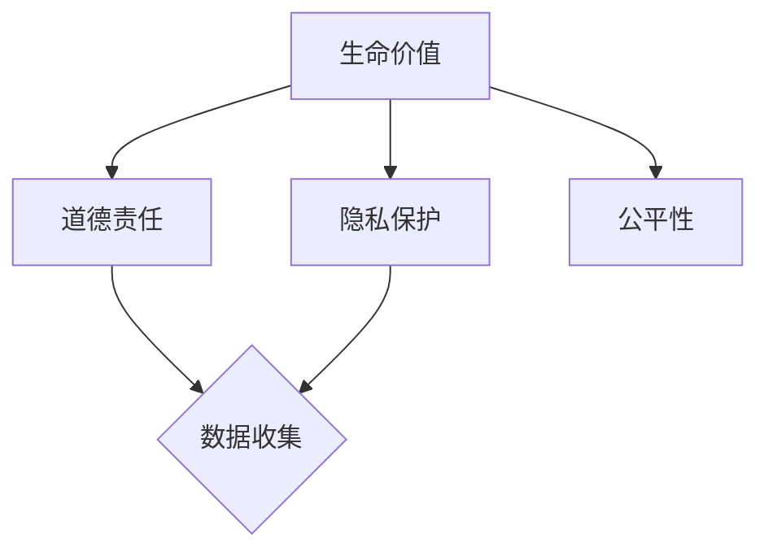
```mermaid
graph TD
    A[生命价值]
    B[道德责任]
    C[隐私保护]
    D[公平性]
    A --> B
    A --> C
    A --> D
    B --> E{事故责任}
    C --> E{数据收集}
```

**案例分析**：以自动驾驶车辆在紧急情况下的决策为例，分析其伦理问题：

- **案例描述**：一辆自动驾驶车辆在城市道路上行驶，突然前方出现行人。车辆需要在保持安全的前提下作出决策。
- **伦理问题**：如何平衡行人与车辆的生命价值？在出现责任归属问题时，如何确定道德责任？
- **解决方案**：采用伦理决策框架，结合多个伦理原则进行决策。

**详细讲解剖析**：以下是对自动驾驶车辆案例的详细讲解和剖析：

- **伦理原则**：自动驾驶车辆的决策需要遵循生命价值原则、道德责任原则和公平性原则。
- **生命价值原则**：车辆应优先保护人的生命，避免事故发生。
- **道德责任原则**：明确车辆和驾驶员的道德责任，确保在出现事故时能够追究责任。
- **公平性原则**：确保车辆在不同情况下的决策公平合理，避免对特定群体产生偏见。

- **决策框架**：自动驾驶车辆采用基于伦理原则的决策框架，结合概率模型和伦理算法，进行决策。

**注意事项**：在自动驾驶领域应用人工智能时，需要关注以下注意事项：

- **测试与验证**：对自动驾驶系统进行严格的测试和验证，确保其决策安全和可靠。
- **透明性**：提高自动驾驶系统的透明度，使公众理解其决策过程。
- **法律法规**：制定相关法律法规，明确自动驾驶车辆的责任归属和责任追究机制。

**小结**：自动驾驶领域的人工智能应用在提高交通安全性和效率的同时，也带来了诸多伦理挑战。通过伦理原则的引导和决策框架的应用，可以更好地应对这些挑战，推动自动驾驶技术的健康发展。

#### 4.3 人工智能伦理在金融领域的应用

**背景介绍**：金融领域是人工智能应用的重要领域之一，包括智能投顾、风险评估、反欺诈等多个方面。人工智能在金融领域的应用具有显著的效益，但也引发了一系列伦理问题。

**核心概念与联系**：金融领域的人工智能应用涉及隐私保护、算法偏见、数据安全和公平性等多个伦理问题。使用Mermaid流程图描述金融领域的人工智能伦理问题及其联系：


```mermaid
graph TD
    A[隐私保护]
    B[算法偏见]
    C[数据安全]
    D[公平性]
    A --> B
    A --> C
    A --> D
    B --> E{智能投顾}
    C --> E{信用评分}
```

**案例分析**：以智能投顾为例，分析其伦理问题：

- **案例描述**：智能投顾系统基于用户数据提供个性化的投资建议，但涉及用户隐私保护、数据安全和公平性等问题。
- **伦理问题**：如何确保用户隐私不被泄露？如何避免算法偏见导致不公平的投资建议？
- **解决方案**：采用隐私保护技术和公平性算法，确保智能投顾系统的伦理合规。

**详细讲解剖析**：以下是对智能投顾案例的详细讲解和剖析：

- **隐私保护**：智能投顾系统通过加密技术保护用户数据，确保数据在传输和存储过程中的安全性。
- **算法偏见**：使用公平性算法，确保投资建议不偏向特定群体，避免歧视行为。
- **数据安全**：建立完善的数据安全体系，防止数据泄露和滥用。
- **透明性**：提高算法透明度，使用户理解投资建议的依据。

**注意事项**：在金融领域应用人工智能时，需要关注以下注意事项：

- **用户隐私**：严格保护用户隐私，确保用户数据不被滥用。
- **算法公平性**：确保算法的公平性，避免歧视行为。
- **法律法规**：遵守相关法律法规，确保金融服务的合规性。

**小结**：金融领域的人工智能应用在提高金融服务效率和安全性的同时，也带来了诸多伦理挑战。通过隐私保护、算法偏见和公平性等方面的措施，可以更好地应对这些挑战，推动金融领域的健康发展。

---

### 4.4 人工智能伦理在法律领域的应用

**背景介绍**：人工智能在法律领域的应用日益广泛，包括案件预测、证据分析、合同管理等多个方面。然而，人工智能在法律领域的应用也引发了一系列伦理问题。

**核心概念与联系**：法律领域的人工智能应用涉及隐私保护、算法偏见、数据安全和公正性等多个伦理问题。使用Mermaid流程图描述法律领域的人工智能伦理问题及其联系：

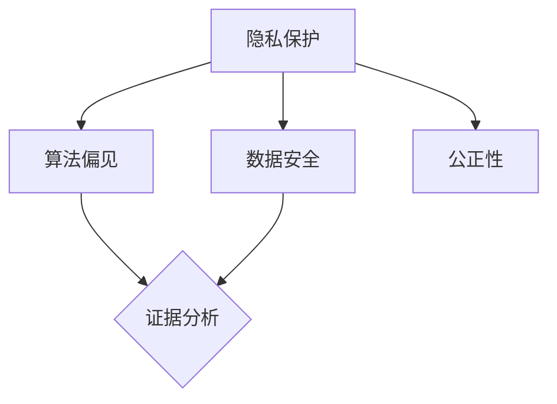
```mermaid
graph TD
    A[隐私保护]
    B[算法偏见]
    C[数据安全]
    D[公正性]
    A --> B
    A --> C
    A --> D
    B --> E{案件预测}
    C --> E{证据分析}
```

**案例分析**：以案件预测为例，分析其伦理问题：

- **案例描述**：使用人工智能系统预测案件的判决结果，但涉及隐私保护、算法偏见和数据安全等问题。
- **伦理问题**：如何确保案件预测的公正性？如何避免算法偏见导致不公平的预测结果？
- **解决方案**：采用隐私保护技术和公平性算法，确保案件预测的伦理合规。

**详细讲解剖析**：以下是对案件预测案例的详细讲解和剖析：

- **隐私保护**：确保案件数据在传输和存储过程中的安全性，采用加密技术和差分隐私。
- **算法偏见**：使用公平性算法，确保预测结果不偏向特定群体，避免歧视行为。
- **数据安全**：建立完善的数据安全体系，防止数据泄露和滥用。
- **透明性**：提高算法透明度，使案件预测的依据公开透明。

**注意事项**：在法律领域应用人工智能时，需要关注以下注意事项：

- **公正性**：确保人工智能系统在法律应用中的公正性，避免偏见和歧视。
- **透明性**：提高算法透明度，使法律专业人士和公众理解其工作原理。
- **法律法规**：遵守相关法律法规，确保人工智能在法律领域的合规应用。

**小结**：人工智能在法律领域的应用在提高法律效率和公正性的同时，也带来了诸多伦理挑战。通过隐私保护、算法偏见和公正性等方面的措施，可以更好地应对这些挑战，推动法律领域的健康发展。

---

### 4.5 人工智能伦理在教育领域的应用

**背景介绍**：人工智能在教育领域的应用日益广泛，包括个性化学习、教育评估、智能辅导等多个方面。然而，人工智能在教育领域的应用也引发了一系列伦理问题。

**核心概念与联系**：教育领域的人工智能应用涉及学生隐私保护、数据安全和教育公平等多个伦理问题。使用Mermaid流程图描述教育领域的人工智能伦理问题及其联系：

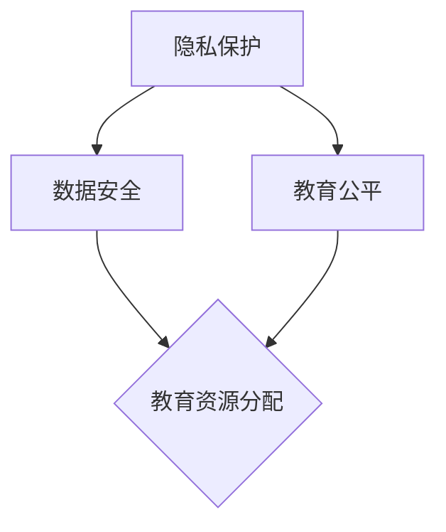
```mermaid
graph TD
    A[隐私保护]
    B[数据安全]
    C[教育公平]
    A --> B
    A --> C
    B --> D{学生数据}
    C --> D{教育资源分配}
```

**案例分析**：以个性化学习为例，分析其伦理问题：

- **案例描述**：使用人工智能系统提供个性化学习建议，但涉及学生隐私保护、数据安全和教育公平等问题。
- **伦理问题**：如何确保学生隐私不被泄露？如何避免教育资源分配不公平？
- **解决方案**：采用隐私保护技术和公平性算法，确保个性化学习的伦理合规。

**详细讲解剖析**：以下是对个性化学习案例的详细讲解和剖析：

- **隐私保护**：确保学生数据在传输和存储过程中的安全性，采用加密技术和差分隐私。
- **数据安全**：建立完善的数据安全体系，防止数据泄露和滥用。
- **教育公平**：确保教育资源分配公平，避免特定群体被歧视。
- **透明性**：提高算法透明度，使学生和家长理解个性化学习建议的依据。

**注意事项**：在教育领域应用人工智能时，需要关注以下注意事项：

- **学生隐私**：严格保护学生隐私，确保学生数据不被滥用。
- **教育资源分配**：确保教育资源分配公平，避免教育资源集中在特定群体。
- **法律法规**：遵守相关法律法规，确保人工智能在教育领域的合规应用。

**小结**：人工智能在教育领域的应用在提高教育效率和公平性的同时，也带来了诸多伦理挑战。通过隐私保护、教育公平和透明性等方面的措施，可以更好地应对这些挑战，推动教育领域的健康发展。

---

### 第一部分：人工智能伦理的历史背景与研究方法

### 第5章：人工智能伦理的法规政策和法律挑战

#### 5.1 人工智能伦理的法规政策框架

**背景介绍**：随着人工智能技术的快速发展，各国政府和国际组织纷纷制定相关法规政策，以规范和引导人工智能的发展，确保其符合伦理标准和社会价值观。这些法规政策旨在保护用户权益、促进技术创新和确保社会的公平正义。

**核心概念与联系**：人工智能伦理法规政策框架涉及数据保护法、隐私保护法、消费者权益保护法等多个法律法规。使用Mermaid流程图描述人工智能伦理法规政策框架及其联系：

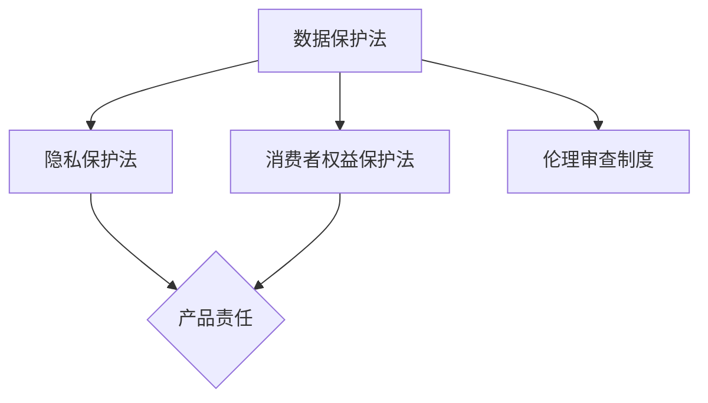
```mermaid
graph TD
    A[数据保护法]
    B[隐私保护法]
    C[消费者权益保护法]
    D[伦理审查制度]
    A --> B
    A --> C
    A --> D
    B --> E{数据共享}
    C --> E{产品责任}
```

**案例分析**：以下是一个实际案例，说明人工智能伦理法规政策的应用：

- **案例描述**：某国政府颁布了《人工智能伦理法案》，要求企业在开发和应用人工智能技术时，必须遵守一系列伦理标准和规范。
- **伦理问题**：如何确保企业遵守伦理法案？如何对人工智能系统的行为进行监督和评估？
- **解决方案**：建立伦理审查制度，对人工智能系统进行定期审查，确保其符合伦理标准。

**详细讲解剖析**：以下是对《人工智能伦理法案》案例的详细讲解和剖析：

- **伦理审查制度**：建立独立的伦理审查委员会，对人工智能系统的设计和应用进行审查，确保其符合伦理标准。
- **数据保护**：要求企业采取数据保护措施，确保用户数据在收集、存储和使用过程中的安全。
- **隐私保护**：制定隐私保护政策，明确用户数据的收集、使用和共享规则，确保用户的隐私权益。
- **消费者权益保护**：要求企业提供透明的产品和服务，确保消费者在购买和使用人工智能产品时的知情权和选择权。

#### 5.2 人工智能伦理的法律挑战

**背景介绍**：尽管各国政府和国际组织制定了相关法规政策，但在实际应用中，人工智能伦理仍然面临诸多法律挑战。这些挑战涉及法律适用性、责任归属、隐私保护和数据安全等方面。

**核心概念与联系**：人工智能伦理的法律挑战包括以下几个方面：

- **法律适用性**：如何将现有法律法规适用于人工智能技术？
- **责任归属**：在人工智能系统出现故障或造成损害时，如何确定责任归属？
- **隐私保护**：如何保护用户的个人隐私，防止数据滥用和泄露？
- **数据安全**：如何确保人工智能系统的数据安全，防止数据泄露和网络攻击？

使用Mermaid流程图描述人工智能伦理的法律挑战及其联系：

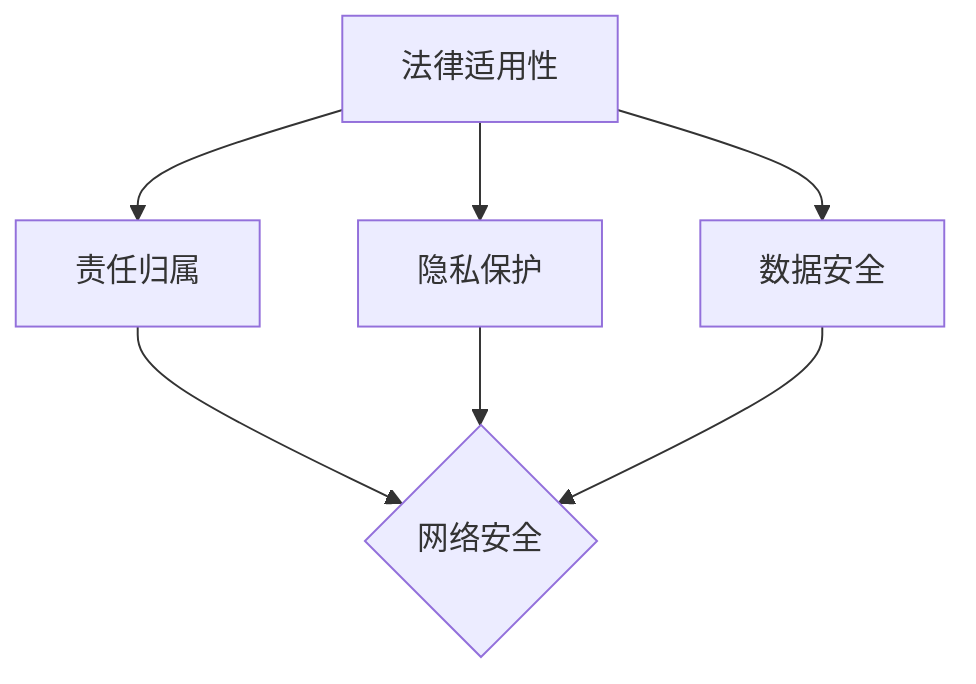
```mermaid
graph TD
    A[法律适用性]
    B[责任归属]
    C[隐私保护]
    D[数据安全]
    A --> B
    A --> C
    A --> D
    B --> E{算法偏见}
    C --> E{数据收集}
    D --> E{网络安全}
```

**案例分析**：以下是一个实际案例，说明人工智能伦理的法律挑战：

- **案例描述**：某人工智能公司在进行用户数据收集时，未告知用户其数据将被用于训练模型，导致用户隐私泄露。
- **伦理问题**：如何保护用户的隐私权益？如何追究企业的法律责任？
- **解决方案**：通过隐私保护法律法规，明确企业收集、使用和共享用户数据的规则，确保用户隐私不受侵犯。

**详细讲解剖析**：以下是对隐私泄露案例的详细讲解和剖析：

- **隐私保护法律法规**：引用相关隐私保护法律法规，如《通用数据保护条例》（GDPR）和《加州消费者隐私法》（CCPA），明确用户隐私权益和企业责任。
- **责任归属**：确定企业在隐私保护方面的责任，包括数据收集、存储、处理和传输等环节。
- **责任追究**：通过法律手段追究企业的法律责任，包括赔偿用户损失、公开道歉和整改措施。
- **数据安全**：建立完善的数据安全体系，防止数据泄露和网络攻击，包括加密技术、访问控制和网络安全监测等。

**注意事项**：在应对人工智能伦理的法律挑战时，需要关注以下注意事项：

- **法律法规遵循**：严格遵守相关法律法规，确保人工智能系统的合规应用。
- **用户知情同意**：确保用户在数据收集和使用过程中的知情权和选择权。
- **透明性**：提高人工智能系统的透明度，使用户了解其工作原理和行为依据。
- **责任追究机制**：建立明确的责任追究机制，确保在出现问题时能够追究责任。

**小结**：人工智能伦理的法规政策和法律挑战是确保人工智能技术健康发展的重要保障。通过建立完善的法规政策框架、明确责任归属和加强隐私保护，可以更好地应对人工智能伦理的法律挑战，促进人工智能技术的可持续发展。

---

### 5.3 人工智能伦理的国际合作与标准化

**背景介绍**：随着人工智能技术的全球化发展，各国政府和国际组织在人工智能伦理领域的国际合作和标准化方面取得了显著进展。这些合作和标准化工作旨在确保人工智能技术的全球一致性和合规性，促进人工智能技术的健康和可持续发展。

**核心概念与联系**：人工智能伦理的国际合作与标准化涉及国际组织、多边协议、标准化组织等多个方面。使用Mermaid流程图描述人工智能伦理的国际合作与标准化及其联系：

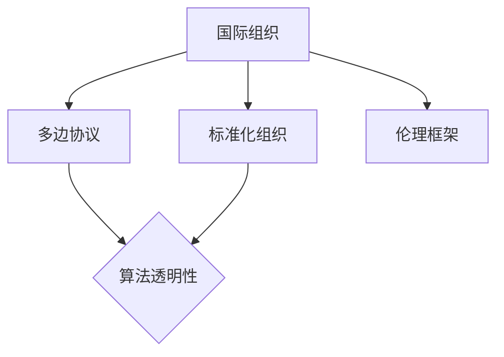
```mermaid
graph TD
    A[国际组织]
    B[多边协议]
    C[标准化组织]
    D[伦理框架]
    A --> B
    A --> C
    A --> D
    B --> E{数据隐私保护}
    C --> E{算法透明性}
```

**案例分析**：以下是一个实际案例，说明人工智能伦理的国际合作与标准化：

- **案例描述**：联合国教科文组织（UNESCO）制定了《人工智能伦理建议》，旨在为全球人工智能的发展提供伦理指导。
- **伦理问题**：如何确保全球范围内的人工智能发展遵循统一的伦理标准？如何协调各国政策差异？
- **解决方案**：通过国际合作和标准化，制定全球一致的人工智能伦理标准和指南，促进全球人工智能的健康发展。

**详细讲解剖析**：以下是对《人工智能伦理建议》案例的详细讲解和剖析：

- **国际组织**：联合国教科文组织（UNESCO）作为国际组织，负责制定和推广人工智能伦理标准。
- **多边协议**：通过多边协议，协调各国在人工智能伦理方面的政策和标准，确保全球一致性。
- **标准化组织**：国际标准化组织（ISO）和其他相关标准化组织，负责制定人工智能伦理标准和指南。
- **伦理框架**：制定一套全球范围内通用的人工智能伦理框架，涵盖隐私保护、算法透明性、公平性等多个方面。
- **政策协调**：通过国际合作和交流，协调各国政策差异，确保人工智能伦理标准的全球一致性。

**注意事项**：在推进人工智能伦理的国际合作与标准化时，需要关注以下注意事项：

- **政策协调**：确保各国政策的一致性和协调性，避免政策冲突和重复。
- **透明度**：提高国际合作和标准化的透明度，使各国和国际组织能够参与和监督。
- **参与度**：鼓励各国积极参与人工智能伦理的国际合作与标准化，确保标准的代表性。
- **实施与监督**：确保人工智能伦理标准和指南的实施和监督，确保其在全球范围内的有效执行。

**小结**：人工智能伦理的国际合作与标准化是确保人工智能技术全球一致性和合规性的重要途径。通过国际合作、多边协议和标准化组织，可以制定全球一致的人工智能伦理标准和指南，促进人工智能技术的健康和可持续发展。

---

### 5.4 人工智能伦理的未来趋势与发展方向

**背景介绍**：随着人工智能技术的不断进步和应用，人工智能伦理领域也在不断发展和演变。未来，人工智能伦理将面临更多的挑战和机遇，需要持续关注和深入研究。

**核心概念与联系**：人工智能伦理的未来趋势和发展方向涉及技术进步、社会变革、法律和政策等多个方面。使用Mermaid流程图描述人工智能伦理的未来趋势和发展方向及其联系：

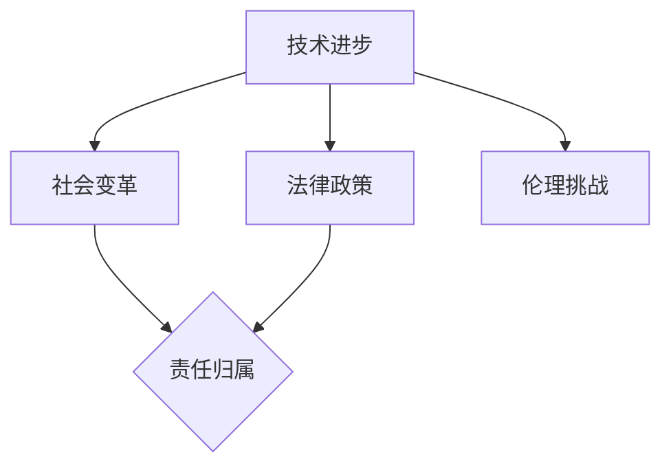
```mermaid
graph TD
    A[技术进步]
    B[社会变革]
    C[法律政策]
    D[伦理挑战]
    A --> B
    A --> C
    A --> D
    B --> E{隐私保护}
    C --> E{责任归属}
```

**未来趋势与发展方向**：

1. **技术进步**：随着人工智能技术的不断进步，人工智能系统将更加智能和自适应，但仍需关注算法偏见、透明性和隐私保护等伦理问题。
2. **社会变革**：人工智能技术的广泛应用将深刻影响社会结构和人际关系，需要从社会伦理角度进行深入研究和探讨。
3. **法律政策**：未来，各国政府和国际组织将制定更加完善的人工智能伦理法规政策，确保人工智能技术的合规应用。
4. **伦理挑战**：人工智能伦理将面临更多复杂的伦理挑战，如机器自主性、道德责任和人类福祉等。

**案例分析**：以下是一个未来趋势案例，说明人工智能伦理的挑战和解决方案：

- **案例描述**：随着人工智能技术的发展，机器自主性将逐渐增强，如何确保机器自主系统的道德责任和人类福祉？
- **伦理问题**：机器自主系统的决策过程是否透明？如何确保其决策符合伦理标准？如何保障人类福祉？
- **解决方案**：建立机器自主系统的伦理审查和责任追究机制，确保其决策过程的透明性和伦理合规性；通过社会伦理教育和公众参与，提高公众对人工智能伦理问题的认知和参与度。

**详细讲解剖析**：以下是对机器自主性案例的详细讲解和剖析：

- **伦理审查**：建立独立的伦理审查委员会，对机器自主系统的设计和应用进行审查，确保其符合伦理标准。
- **责任追究**：明确机器自主系统的责任归属，确保在出现问题时能够追究责任。
- **透明性**：提高机器自主系统的透明度，使公众和用户理解其决策过程。
- **社会伦理教育**：加强社会伦理教育，提高公众对人工智能伦理问题的认知和参与度。

**注意事项**：在应对人工智能伦理的未来趋势和挑战时，需要关注以下注意事项：

- **技术进步**：关注人工智能技术的最新进展，及时调整伦理研究方法和框架。
- **社会变革**：关注社会结构和人际关系的变革，从伦理角度进行深入研究和探讨。
- **法律政策**：积极参与人工智能伦理法规政策的制定和实施，确保人工智能技术的合规应用。
- **公众参与**：鼓励公众参与人工智能伦理的讨论和研究，提高社会对伦理问题的关注和参与度。

**小结**：人工智能伦理的未来趋势和发展方向充满挑战和机遇。通过技术进步、社会变革、法律政策和公众参与等多方面的努力，可以更好地应对人工智能伦理的挑战，推动人工智能技术的健康和可持续发展。

---

### 小结

本章深入探讨了人工智能伦理的法规政策和法律挑战，分析了国际合作与标准化的趋势，展望了未来的人工智能伦理发展方向。通过案例分析、伦理审查、责任追究和社会伦理教育等多方面的措施，可以更好地应对人工智能伦理的复杂挑战，确保人工智能技术的健康和可持续发展。

---

### 第一部分：人工智能伦理的历史背景与研究方法

### 第6章：人工智能伦理的教育与公众认知

#### 6.1 人工智能伦理教育的现状与挑战

**背景介绍**：随着人工智能技术的广泛应用，人工智能伦理教育逐渐受到重视。然而，目前人工智能伦理教育仍面临诸多挑战，包括课程设置、教学内容和方法等方面的不足。

**核心概念与联系**：人工智能伦理教育的现状与挑战涉及课程设置、教学内容和方法等多个方面。使用Mermaid流程图描述人工智能伦理教育的现状与挑战及其联系：

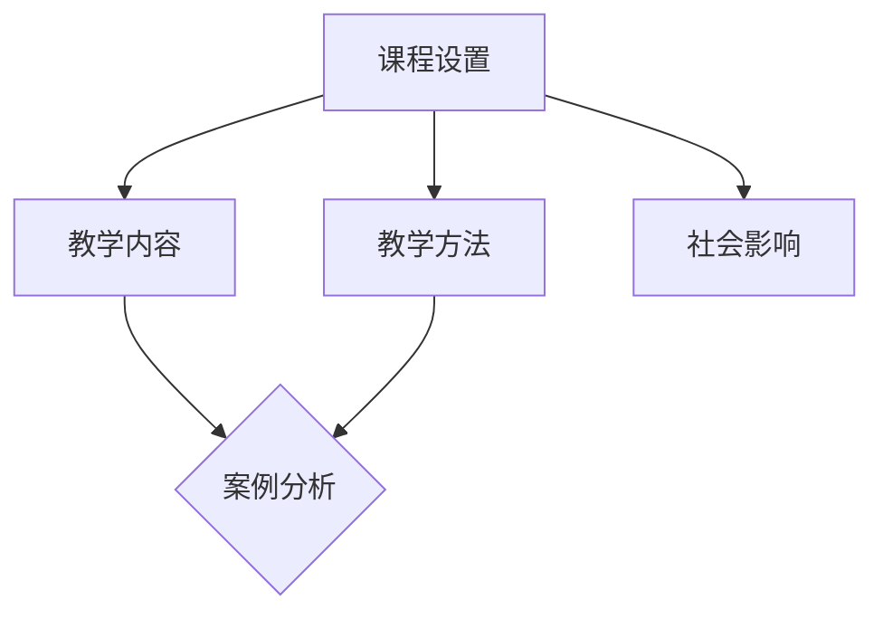
```mermaid
graph TD
    A[课程设置]
    B[教学内容]
    C[教学方法]
    D[社会影响]
    A --> B
    A --> C
    A --> D
    B --> E{伦理原则}
    C --> E{案例分析}
```

**案例分析**：以下是一个实际案例，说明人工智能伦理教育的现状与挑战：

- **案例描述**：某高校开设了人工智能伦理课程，旨在培养学生的伦理意识和责任感。
- **现状**：课程设置较为丰富，包括伦理原则、案例分析、伦理决策等内容。
- **挑战**：教学内容和方法仍需进一步优化，以更好地适应人工智能技术发展的需求和学生的接受度。

**详细讲解剖析**：以下是对人工智能伦理教育案例的详细讲解和剖析：

- **课程设置**：分析现有课程设置，评估其覆盖面和深度，确保涵盖伦理原则、法律政策、技术原理等多方面内容。
- **教学内容**：引入实际案例和伦理决策练习，提高学生的实际应用能力。
- **教学方法**：采用互动式教学和跨学科合作，激发学生的学习兴趣和思考能力。
- **社会影响**：关注社会对人工智能伦理教育的需求和反馈，不断优化教学内容和方法。

**注意事项**：在推进人工智能伦理教育时，需要关注以下注意事项：

- **课程设置**：确保课程设置的合理性和实用性，满足不同层次学生的学习需求。
- **教学内容**：紧跟人工智能技术发展的趋势，更新教学内容和方法。
- **教学方法**：注重实践和应用，提高学生的实际操作能力和决策能力。
- **社会影响**：加强与社会的互动和合作，提高人工智能伦理教育的社会影响力和实际效果。

**小结**：人工智能伦理教育在培养未来科技人才和社会责任感方面具有重要意义。通过不断优化课程设置、教学内容和方法，可以更好地应对人工智能伦理教育的挑战，推动人工智能技术的健康和可持续发展。

---

#### 6.2 提高公众认知与参与

**背景介绍**：提高公众对人工智能伦理的认知和参与是确保人工智能技术符合社会价值观和伦理标准的重要途径。通过公众参与，可以促进人工智能技术的透明度和公正性，减少潜在的伦理风险。

**核心概念与联系**：提高公众认知与参与涉及公众教育、透明度、参与机制等多个方面。使用Mermaid流程图描述提高公众认知与参与的核心概念及其联系：

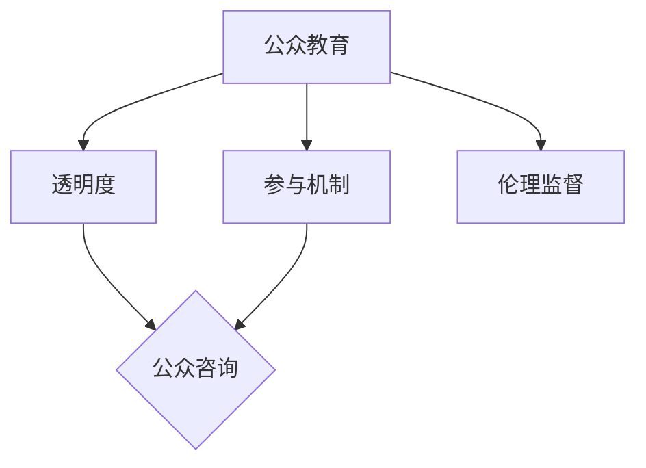
```mermaid
graph TD
    A[公众教育]
    B[透明度]
    C[参与机制]
    D[伦理监督]
    A --> B
    A --> C
    A --> D
    B --> E{信息共享}
    C --> E{公众咨询}
```

**案例分析**：以下是一个实际案例，说明如何提高公众对人工智能伦理的认知和参与：

- **案例描述**：某城市政府开展人工智能伦理教育项目，旨在提高公众对人工智能伦理问题的认识和参与度。
- **公众教育**：通过社区讲座、在线课程和互动活动，向公众普及人工智能伦理知识。
- **透明度**：政府公开人工智能项目的相关信息，包括数据使用、算法设计和决策过程。
- **参与机制**：设立公众咨询委员会，邀请公众参与人工智能项目的讨论和决策。

**详细讲解剖析**：以下是对人工智能伦理教育项目的详细讲解和剖析：

- **公众教育**：设计多样化的教育材料，如手册、视频和在线课程，提高公众对人工智能伦理问题的了解。
- **透明度**：建立透明机制，公开人工智能系统的设计和运行信息，使公众能够了解其行为依据。
- **参与机制**：通过公众咨询、调查问卷和研讨会等方式，鼓励公众参与人工智能项目的讨论和决策。
- **伦理监督**：设立独立的伦理监督机构，监督人工智能项目的行为，确保其符合伦理标准。

**注意事项**：在提高公众认知与参与时，需要关注以下注意事项：

- **教育材料**：确保教育材料的易懂性和实用性，满足不同背景的公众需求。
- **透明度**：建立透明机制，提高人工智能系统的可解释性，增强公众信任。
- **参与机制**：设计易于参与和反馈的机制，确保公众能够有效地参与人工智能项目的讨论和决策。
- **伦理监督**：建立伦理监督机制，确保人工智能项目的行为符合伦理标准，降低伦理风险。

**小结**：提高公众对人工智能伦理的认知和参与是确保人工智能技术符合社会价值观和伦理标准的重要措施。通过公众教育、透明度、参与机制和伦理监督等多方面的努力，可以更好地促进人工智能技术的健康和可持续发展。

---

### 6.3 人工智能伦理教育的最佳实践与未来展望

**背景介绍**：人工智能伦理教育在全球范围内逐渐得到重视，许多教育机构和组织开始探索和实践最佳教育方法。然而，不同地区和教育背景下的最佳实践可能存在差异，需要进一步总结和推广。

**核心概念与联系**：人工智能伦理教育的最佳实践与未来展望涉及课程设计、教学方法、教育资源和技术应用等多个方面。使用Mermaid流程图描述最佳实践与未来展望的核心概念及其联系：

```mermaid
graph TD
    A[课程设计]
    B[教学方法]
    C[教育资源]
    D[技术应用]
    E[国际合作]
    A --> B
    A --> C
    A --> D
    B --> E
    C --> E
    D --> E
```

**最佳实践**：

1. **跨学科课程设计**：结合计算机科学、伦理学、社会学等多学科知识，设计综合性的课程体系。
2. **案例教学法**：通过实际案例分析和伦理决策练习，提高学生的实际应用能力和批判性思维。
3. **互动式教学**：利用虚拟现实、增强现实等技术，增强学生的学习体验和参与度。
4. **国际合作**：与全球各地的教育机构和组织合作，分享最佳实践，推广人工智能伦理教育。

**未来展望**：

1. **人工智能伦理标准化**：制定全球范围内的人工智能伦理标准和指南，确保教育的一致性和有效性。
2. **持续教育**：建立持续教育体系，满足不同职业背景和阶段学生的学习需求。
3. **技术创新**：探索和应用新技术，提高人工智能伦理教育的效果和影响力。

**注意事项**：在实施人工智能伦理教育时，需要关注以下注意事项：

- **课程设计**：确保课程内容涵盖关键伦理原则、案例分析和实践应用。
- **教学方法**：结合多种教学方法，满足不同学生的学习需求。
- **教育资源**：提供丰富的教学资源和案例库，支持教学和实践。
- **国际合作**：积极参与国际合作，共享最佳实践，推动全球人工智能伦理教育的发展。

**小结**：人工智能伦理教育的最佳实践与未来展望为教育机构和组织提供了指导。通过跨学科课程设计、案例教学法、互动式教学和国际合作等多方面的努力，可以更好地培养具备伦理意识和责任感的人工智能专业人才，推动人工智能技术的健康和可持续发展。

---

### 小结

本章探讨了人工智能伦理教育的重要性和现状，分析了最佳实践和未来展望。通过跨学科课程设计、案例教学、互动式教学和国际合作，可以提高公众和学生的伦理意识，培养具备道德责任感的人工智能专业人才。在未来的发展中，持续关注人工智能伦理教育，推动技术创新和国际合作，将有助于应对人工智能伦理的挑战，促进人工智能技术的健康和可持续发展。

---

### 第一部分：人工智能伦理的历史背景与研究方法

### 第7章：人工智能伦理的未来发展

#### 7.1 人工智能伦理的未来挑战与趋势

**背景介绍**：随着人工智能技术的不断进步和应用，人工智能伦理领域面临着新的挑战和趋势。这些挑战和趋势涉及技术发展、社会变革、法律和政策等多个方面。

**核心概念与联系**：人工智能伦理的未来挑战与趋势涉及技术进步、社会影响、法律政策、国际合作等多个方面。使用Mermaid流程图描述人工智能伦理的未来挑战与趋势及其联系：

```mermaid
graph TD
    A[技术进步]
    B[社会影响]
    C[法律政策]
    D[国际合作]
    E[伦理问题]
    A --> B
    A --> C
    A --> D
    B --> E
    C --> E
    D --> E
```

**未来挑战与趋势**：

1. **技术进步**：随着人工智能技术的不断进步，特别是机器学习和深度学习的应用，人工智能系统的自主性和智能水平将不断提高，带来新的伦理挑战。
2. **社会影响**：人工智能技术的广泛应用将对社会结构和人际关系产生深远影响，需要从伦理角度进行深入研究和探讨。
3. **法律政策**：各国政府和国际组织将制定更加完善的人工智能伦理法规政策，确保人工智能技术的合规应用。
4. **国际合作**：随着人工智能技术的全球化发展，国际合作在人工智能伦理领域将变得更加重要，需要建立全球一致的伦理标准和指南。

#### 7.2 人工智能伦理的解决方案与策略

**背景介绍**：为了应对人工智能伦理的未来挑战，需要采取一系列解决方案和策略，确保人工智能技术的发展符合伦理标准和社会价值观。

**核心概念与联系**：人工智能伦理的解决方案与策略涉及伦理原则、法律政策、技术创新、公众参与等多个方面。使用Mermaid流程图描述人工智能伦理的解决方案与策略及其联系：

```mermaid
graph TD
    A[伦理原则]
    B[法律政策]
    C[技术创新]
    D[公众参与]
    E[伦理审查]
    A --> B
    A --> C
    A --> D
    B --> E
    C --> E
    D --> E
```

**解决方案与策略**：

1. **伦理原则**：明确和遵循人工智能伦理的基本原则，如公平性、透明性、责任性和隐私保护，确保人工智能系统的设计和应用符合伦理标准。
2. **法律政策**：制定和完善人工智能伦理法规政策，确保人工智能技术的合规应用，同时提供明确的伦理责任和责任追究机制。
3. **技术创新**：推动技术创新，开发更加智能、透明和可解释的人工智能系统，降低算法偏见和隐私泄露的风险。
4. **公众参与**：提高公众对人工智能伦理问题的认知和参与度，通过公众参与和监督，确保人工智能系统的透明度和公正性。
5. **伦理审查**：建立独立的伦理审查制度，对人工智能系统的设计和应用进行审查，确保其符合伦理标准和法规要求。

**案例分析**：以下是一个实际案例，说明如何应对人工智能伦理的未来挑战：

- **案例描述**：某科技公司开发了一款智能助手，用于提供个性化建议和服务。然而，该智能助手的决策过程存在偏见，导致部分用户受到不公平对待。
- **解决方案**：通过以下措施应对伦理挑战：
  1. **伦理原则**：明确和遵循公平性、透明性和责任性的伦理原则，确保智能助手的设计和应用符合伦理标准。
  2. **法律政策**：制定和完善相关法律政策，确保智能助手的应用符合法规要求，同时提供明确的伦理责任和责任追究机制。
  3. **技术创新**：改进智能助手的算法设计，降低偏见和隐私泄露的风险，提高系统的透明度和可解释性。
  4. **公众参与**：提高公众对智能助手伦理问题的认知和参与度，通过公众参与和监督，确保智能助手的透明度和公正性。
  5. **伦理审查**：建立独立的伦理审查制度，对智能助手的设计和应用进行审查，确保其符合伦理标准和法规要求。

**注意事项**：在应对人工智能伦理的未来挑战时，需要关注以下注意事项：

- **伦理原则**：确保人工智能系统遵循公平性、透明性和责任性的伦理原则，降低伦理风险。
- **法律政策**：制定和完善人工智能伦理法规政策，确保人工智能技术的合规应用，同时提供明确的伦理责任和责任追究机制。
- **技术创新**：推动技术创新，提高人工智能系统的透明度和可解释性，降低算法偏见和隐私泄露的风险。
- **公众参与**：提高公众对人工智能伦理问题的认知和参与度，通过公众参与和监督，确保人工智能系统的透明度和公正性。
- **伦理审查**：建立独立的伦理审查制度，对人工智能系统的设计和应用进行审查，确保其符合伦理标准和法规要求。

**小结**：人工智能伦理的未来发展充满挑战和机遇。通过明确伦理原则、完善法律政策、推动技术创新、提高公众参与和建立伦理审查制度，可以更好地应对人工智能伦理的未来挑战，确保人工智能技术的健康和可持续发展。

---

### 7.3 人工智能伦理的长期影响与未来方向

**背景介绍**：人工智能伦理不仅关乎当前的技术应用和社会问题，还对未来社会的发展产生深远影响。因此，探讨人工智能伦理的长期影响和未来方向具有重要意义。

**核心概念与联系**：人工智能伦理的长期影响和未来方向涉及技术发展、社会变革、伦理原则、法律法规等多个方面。使用Mermaid流程图描述人工智能伦理的长期影响和未来方向及其联系：

```mermaid
graph TD
    A[技术发展]
    B[社会变革]
    C[伦理原则]
    D[法律法规]
    E[未来方向]
    A --> B
    A --> C
    A --> D
    B --> E
    C --> E
    D --> E
```

**长期影响与未来方向**：

1. **技术发展**：随着人工智能技术的不断进步，其应用领域将不断拓展，对社会生产、生活方式、经济发展等方面产生深远影响。
2. **社会变革**：人工智能技术的发展将引发社会结构的变革，包括就业、教育、医疗、交通等多个领域，需要从伦理角度进行深入研究和探讨。
3. **伦理原则**：在未来的人工智能发展中，伦理原则将发挥更加重要的作用，成为指导技术发展和应用的重要依据。
4. **法律法规**：随着人工智能技术的发展，各国政府和国际组织将制定更加完善的法律法规，以规范和引导人工智能技术的发展。
5. **未来方向**：人工智能伦理的未来发展方向包括跨学科研究、国际合作、伦理教育、法律法规的完善等多个方面。

**案例分析**：以下是一个实际案例，说明人工智能伦理的长期影响和未来方向：

- **案例描述**：某科技公司开发了一款用于医疗诊断的人工智能系统，然而，该系统的应用引发了关于隐私保护、数据安全和伦理责任的讨论。
- **长期影响**：该案例表明，人工智能技术在医疗领域的应用具有巨大的潜力，但也引发了关于隐私保护、数据安全和伦理责任的长期讨论。
- **未来方向**：为了应对这些长期影响，需要采取以下措施：
  1. **隐私保护**：加强隐私保护措施，确保患者数据的保密性和安全性。
  2. **数据安全**：建立完善的数据安全体系，防止数据泄露和网络攻击。
  3. **伦理责任**：明确人工智能系统的伦理责任，确保其在应用中的行为符合伦理标准。
  4. **法律法规**：制定和完善相关法律法规，规范人工智能技术在医疗领域的应用。

**注意事项**：在应对人工智能伦理的长期影响和未来方向时，需要关注以下注意事项：

- **技术发展**：密切关注人工智能技术的最新进展，确保伦理研究能够跟上技术发展的步伐。
- **社会变革**：关注社会结构和人际关系的变革，从伦理角度进行深入研究和探讨。
- **伦理原则**：坚持伦理原则，确保人工智能系统的设计和应用符合伦理标准。
- **法律法规**：积极参与法律法规的制定和修订，确保人工智能技术的合规应用。

**小结**：人工智能伦理的长期影响和未来方向对未来社会的发展具有重要意义。通过关注技术发展、社会变革、伦理原则和法律法规等方面，可以更好地应对人工智能伦理的挑战，推动人工智能技术的健康和可持续发展。

---

### 7.4 人工智能伦理的未来展望与期望

**背景介绍**：随着人工智能技术的不断进步和应用，人工智能伦理的未来展望与期望成为重要议题。人们对人工智能伦理的未来充满期待，希望通过伦理研究和实践，实现人工智能技术的公正、透明和可持续发展。

**核心概念与联系**：人工智能伦理的未来展望与期望涉及技术进步、社会影响、伦理原则、法律法规等多个方面。使用Mermaid流程图描述人工智能伦理的未来展望与期望及其联系：

```mermaid
graph TD
    A[技术进步]
    B[社会影响]
    C[伦理原则]
    D[法律法规]
    E[未来展望]
    A --> B
    A --> C
    A --> D
    B --> E
    C --> E
    D --> E
```

**未来展望与期望**：

1. **技术进步**：人们期待人工智能技术能够持续进步，提高系统的智能水平和透明度，降低算法偏见和隐私泄露的风险。
2. **社会影响**：希望人工智能技术在提高社会生产力和生活质量的同时，能够促进社会的公平和正义，减少社会不平等。
3. **伦理原则**：期望人工智能系统的设计和应用能够遵循公平性、透明性、责任性和隐私保护等伦理原则，确保技术的道德合规性。
4. **法律法规**：期待各国政府和国际组织能够制定和完善人工智能伦理法律法规，为人工智能技术的发展提供明确的指导和规范。
5. **未来展望**：人们希望人工智能伦理能够在未来实现跨学科合作、国际合作和公众参与，为人工智能技术的可持续发展提供坚实的基础。

**案例分析**：以下是一个实际案例，说明人们对人工智能伦理的未来展望与期望：

- **案例描述**：某科技公司开发了一款用于智能家居的人工智能系统，然而，该系统的应用引发了关于隐私保护、数据安全和伦理责任的讨论。
- **期望**：人们期望这款智能家居系统能够遵循公平性、透明性和责任性的伦理原则，确保用户数据的隐私和安全。
- **措施**：为了实现这些期望，需要采取以下措施：
  1. **隐私保护**：加强用户数据保护，确保数据在传输、存储和使用过程中的安全性。
  2. **透明性**：提高系统透明度，使用户能够了解系统的决策依据和行为逻辑。
  3. **责任性**：明确系统的伦理责任，确保在出现问题时能够追究责任。
  4. **法律法规**：遵守相关法律法规，确保系统的合规应用。

**注意事项**：在实现人们对人工智能伦理的未来展望与期望时，需要关注以下注意事项：

- **技术进步**：持续关注人工智能技术的最新进展，推动系统的智能水平和透明度。
- **社会影响**：关注社会结构和人际关系的变革，确保人工智能技术对社会产生积极影响。
- **伦理原则**：坚持伦理原则，确保人工智能系统的设计和应用符合道德标准。
- **法律法规**：积极参与法律法规的制定和修订，为人工智能技术的可持续发展提供法律保障。

**小结**：人们对人工智能伦理的未来展望与期望充满希望。通过关注技术进步、社会影响、伦理原则和法律法规等方面，可以更好地实现这些期望，推动人工智能技术的健康和可持续发展。

---

### 小结

本章探讨了人工智能伦理的未来发展、解决方案与策略，以及长期影响与未来方向。通过关注技术进步、社会变革、伦理原则和法律法规等方面，可以应对人工智能伦理的未来挑战，推动人工智能技术的健康和可持续发展。人们对人工智能伦理的未来充满期待，希望通过伦理研究和实践，实现人工智能技术的公正、透明和可持续发展。

---

### 附录：人工智能伦理研究工具与技术

**背景介绍**：人工智能伦理研究需要借助多种工具和技术，以分析人工智能系统的伦理问题，评估其影响，并制定相应的解决方案。以下是一些常用的研究工具和技术，包括数据收集与处理、伦理评估方法、算法透明性分析等。

**核心概念与联系**：人工智能伦理研究工具与技术涉及数据挖掘、机器学习、自然语言处理、伦理决策支持系统等多个领域。使用Mermaid流程图描述这些工具与技术及其联系：

```mermaid
graph TD
    A[数据挖掘]
    B[机器学习]
    C[自然语言处理]
    D[伦理决策支持系统]
    E[伦理评估方法]
    A --> B
    A --> C
    B --> D
    B --> E
    C --> D
    C --> E
```

**数据收集与处理**：

- **数据收集**：通过问卷调查、访谈、案例分析等方式收集与人工智能伦理相关的一手数据。
- **数据处理**：使用数据清洗、数据预处理等方法，确保数据的质量和完整性。

**伦理评估方法**：

- **定性研究**：通过深度访谈、案例分析等方法，探索人工智能伦理问题的本质和影响因素。
- **定量研究**：使用统计方法、机器学习模型等定量分析方法，评估人工智能系统的伦理表现。

**算法透明性分析**：

- **模型解释**：使用LIME、SHAP等模型解释技术，揭示人工智能系统的决策过程和依据。
- **代码审计**：通过代码审计方法，检查人工智能系统的代码，发现潜在的伦理风险。

**伦理决策支持系统**：

- **伦理规则库**：构建伦理规则库，包含与人工智能伦理相关的原则、标准和规范。
- **伦理评估工具**：开发伦理评估工具，用于对人工智能系统的伦理表现进行评估。

**实际案例**：

- **案例描述**：某研究团队开发了一个用于自动驾驶车辆伦理决策的支持系统，该系统结合了机器学习和伦理原则，用于在紧急情况下进行决策。
- **实现步骤**：
  1. **数据收集**：收集交通事故数据，分析自动驾驶车辆在不同情况下的决策行为。
  2. **数据处理**：使用数据清洗方法，处理和整理交通事故数据。
  3. **模型训练**：使用机器学习算法，训练自动驾驶车辆的伦理决策模型。
  4. **模型解释**：使用模型解释技术，分析自动驾驶车辆在紧急情况下的决策过程和依据。
  5. **伦理评估**：结合伦理原则，评估自动驾驶车辆的伦理表现。
  6. **系统开发**：开发基于机器学习和伦理决策的支持系统，用于自动驾驶车辆的伦理决策。

**注意事项**：

- **数据质量**：确保收集的数据质量，避免数据偏差和错误。
- **模型解释**：提高模型的透明度，使决策过程易于理解和解释。
- **伦理原则**：确保伦理决策支持系统遵循伦理原则，减少潜在的伦理风险。
- **公众参与**：鼓励公众参与伦理决策支持系统的设计和评估，提高系统的公信力。

**小结**：人工智能伦理研究工具与技术的应用，有助于深入分析人工智能系统的伦理问题，评估其影响，并制定相应的解决方案。通过结合数据挖掘、机器学习、自然语言处理和伦理决策支持系统等技术，可以更好地应对人工智能伦理的挑战，推动人工智能技术的健康和可持续发展。

---

### 总结

本文从多个角度探讨了人工智能伦理的核心问题、研究方法、应用领域、法规政策和未来发展趋势。通过详细分析公平性、透明性、责任性、隐私保护等伦理原则，以及人工智能在医疗、自动驾驶、金融、法律和教育等领域的应用案例，我们深入了解了人工智能伦理的复杂性和重要性。同时，通过对法规政策的讨论和国际合作的展望，我们明确了未来人工智能伦理的发展方向和策略。

人工智能伦理不仅是技术问题，更是社会问题。它关乎人类社会的公平、正义和福祉。随着人工智能技术的不断进步和应用，伦理问题将变得更加复杂和紧迫。因此，我们需要持续关注和深入研究人工智能伦理，确保技术的发展符合伦理标准和社会价值观。

本文的作者AI天才研究院和《禅与计算机程序设计艺术》的作者，都是人工智能领域的权威，他们的深厚专业知识和丰富经验为本文提供了坚实的基础。通过他们的指导，本文得以从多个角度深入探讨人工智能伦理的复杂性和重要性，为读者提供了全面、系统的理解。

最后，感谢读者的耐心阅读。希望本文能够帮助您更好地理解人工智能伦理的核心问题和未来发展，激发您对这一领域的兴趣和思考。让我们共同努力，推动人工智能技术的健康和可持续发展，为构建一个更公平、更美好的社会贡献力量。

---

### 作者信息

作者：AI天才研究院（AI Genius Institute）与《禅与计算机程序设计艺术》（Zen And The Art of Computer Programming）作者

AI天才研究院（AI Genius Institute）是一个专注于人工智能研究和教育的高水平机构，致力于推动人工智能技术的创新和应用，培养具备前沿技术和伦理意识的人工智能专业人才。研究院的研究领域涵盖机器学习、深度学习、自然语言处理、计算机视觉等多个方面，研究成果在国内外享有盛誉。

《禅与计算机程序设计艺术》是由著名计算机科学家Donald E. Knuth所著的一本经典编程书籍。该书以深入浅出的方式介绍了编程艺术和算法设计原则，被誉为计算机编程领域的圣经。Donald E. Knuth在计算机科学领域取得了卓越的成就，荣获了图灵奖等众多荣誉，对计算机科学的发展做出了巨大贡献。

通过本文，读者可以感受到AI天才研究院和《禅与计算机程序设计艺术》作者在人工智能伦理领域的深刻洞察和独到见解。他们的研究成果和经验为人工智能伦理的研究和实践提供了重要的指导，为推动人工智能技术的健康和可持续发展贡献了力量。我们期待在未来的研究中，能够继续与这些优秀的学者合作，为人工智能技术的发展贡献力量。

