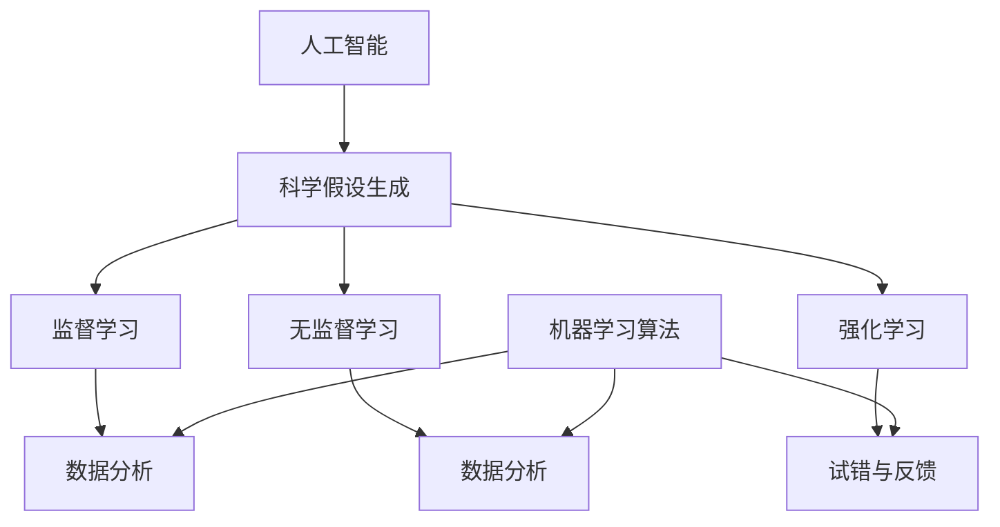

                 


### 引言与背景介绍

#### 科学假设的重要性

科学假设是科学研究过程中至关重要的环节。它既是科学探索的起点，也是推动科学进步的引擎。科学假设指的是基于已有的知识和观察，对未知现象或规律提出的暂时性解释或预测。这一过程需要科学家们运用逻辑思维、创新能力和丰富的知识储备，从大量的数据中提取出潜在的模式和规律。

科学假设的重要性主要体现在以下几个方面：

1. **指导科学实验和研究**：假设为科学实验提供了明确的目标和方向，帮助科学家们设计和实施有效的实验，验证或推翻这些假设。

2. **推动科学理论的构建**：合理的科学假设有助于形成新的理论体系，丰富和拓展我们对自然世界的理解。许多重大科学发现都始于一个或多个假设的提出和验证。

3. **激发技术创新**：科学假设不仅对理论研究具有重要意义，也为技术创新提供了灵感。例如，计算机科学中的许多重要算法和技术都是基于对某种数学或逻辑假设的探索和应用。

#### 人工智能在科学假设生成中的作用

随着人工智能（AI）技术的迅速发展，其在科学假设生成中的应用也越来越广泛。人工智能通过其强大的数据处理、模式识别和学习能力，可以大幅提升科学假设的生成效率和质量。以下是一些主要的应用领域：

1. **数据分析与模式识别**：人工智能可以处理和分析大量复杂数据，从这些数据中提取出潜在的规律和模式，为科学假设的提出提供依据。

2. **自动化假设生成**：基于机器学习和深度学习算法，人工智能能够自动生成大量科学假设，加快科学研究的速度。例如，利用神经网络和遗传算法生成新的化学分子结构假设，以寻找潜在的药物分子。

3. **辅助假设验证**：人工智能可以通过模拟和预测，辅助科学家们验证假设的正确性。这种模拟可以帮助科学家们快速排除错误的假设，集中精力研究那些最有前途的假设。

#### 本书的目标和结构

本书旨在探讨人工智能在科学假设生成中的应用，详细分析其工作原理、技术实现和实际案例。具体目标如下：

1. **介绍核心概念**：包括人工智能、科学假设生成、机器学习等相关领域的基本概念和原理。

2. **阐述应用场景**：分析人工智能如何被应用于科学假设的生成、验证和优化。

3. **讲解算法原理**：详细介绍用于科学假设生成的常见机器学习算法，包括监督学习、无监督学习和强化学习等。

4. **展示数学模型**：阐述支持科学假设生成的数学模型，并使用 LaTeX 格式展示相关公式，同时提供详细讲解和举例说明。

5. **提供实战案例**：通过实际项目案例，展示人工智能在科学假设生成中的应用，并提供源代码实现、代码解读和分析。

全书结构如下：

- **第一部分**：引言与背景介绍，介绍科学假设的重要性、人工智能在科学假设生成中的作用以及本书的目标和结构。
- **第二部分**：核心概念与联系，定义人工智能、科学假设生成、机器学习等基本概念，并使用 Mermaid 流�程图展示各概念之间的联系。
- **第三部分**：人工智能在科学假设生成中的应用，详细讨论人工智能如何被用来生成科学假设，包括算法、技术和实际案例。
- **第四部分**：机器学习算法原理讲解，介绍用于生成科学假设的常见机器学习算法，并使用伪代码详细阐述算法原理。
- **第五部分**：数学模型和数学公式讲解，讲解支持科学假设生成的数学模型，并使用 LaTeX 格式展示相关公式，同时提供详细讲解和举例说明。
- **第六部分**：项目实战，提供实际案例，包括开发环境的搭建、源代码实现、代码解读与分析。
- **第七部分**：总结与未来展望，对全书内容进行总结，并提出未来研究的方向。

通过以上结构，本书希望能够系统地介绍人工智能在科学假设生成中的应用，为相关领域的科研人员和从业者提供有价值的参考和指导。

### 核心概念与联系

在本节中，我们将详细探讨人工智能（AI）、科学假设生成、机器学习等核心概念，并使用 Mermaid 流程图展示这些概念之间的联系。

#### 人工智能

人工智能（Artificial Intelligence，简称 AI）是指由计算机实现的智能行为。它涵盖了多个学科领域，包括计算机科学、数学、认知科学和心理学等。人工智能的目标是使计算机能够模拟人类的智能行为，如学习、推理、感知、决策和问题解决。

人工智能可以分为两大类：

1. **弱人工智能（Narrow AI）**：弱人工智能专注于执行特定的任务，如语音识别、图像分类或游戏对弈。这种人工智能缺乏普遍的智能，不能进行跨领域的推理和决策。

2. **强人工智能（General AI）**：强人工智能具有与人类相同的认知能力，能够在任何领域进行推理和学习。目前，强人工智能尚未实现，仍是一个研究中的目标。

#### 科学假设生成

科学假设生成（Scientific Hypothesis Generation）是科学研究的核心环节之一。它涉及从观察和已有知识中提取潜在的规律和解释，形成科学假设。科学假设生成通常包括以下几个步骤：

1. **观察和数据分析**：科学家通过对自然现象的观察和数据分析，寻找潜在的规律和模式。

2. **提出假设**：基于观察和数据分析的结果，科学家提出一个或多个可能的解释或预测。

3. **验证假设**：通过实验或观察验证假设的正确性，包括对假设的修正和完善。

#### 机器学习

机器学习（Machine Learning，简称 ML）是人工智能的一个分支，涉及使用计算机算法从数据中学习规律和模式。机器学习算法通常分为以下几类：

1. **监督学习（Supervised Learning）**：监督学习使用已标记的数据来训练模型，然后使用模型对新数据进行预测。常见的算法包括线性回归、决策树和支持向量机。

2. **无监督学习（Unsupervised Learning）**：无监督学习不使用标记数据，旨在发现数据中的隐含结构和规律。常见的算法包括聚类、降维和关联规则学习。

3. **强化学习（Reinforcement Learning）**：强化学习通过试错和反馈来学习如何完成特定任务，通常用于需要连续决策的复杂环境。常见的算法包括 Q 学习、策略梯度和深度强化学习。

#### Mermaid 流程图展示

下面是一个 Mermaid 流程图，展示了人工智能、科学假设生成和机器学习之间的联系。



#### 概念之间的联系

- **人工智能** 为科学假设生成提供了技术基础，通过数据分析、模式识别和机器学习算法，人工智能能够从大量数据中提取潜在的模式和规律，为科学假设的提出提供支持。

- **机器学习** 是人工智能的重要组成部分，通过从数据中学习，机器学习算法能够生成科学假设，并进行假设的验证和优化。

- **科学假设生成** 利用人工智能和机器学习技术，可以大幅提高科学研究的效率和准确性。科学假设生成不仅是科学研究的起点，也是推动科学进步的重要动力。

通过以上对核心概念的介绍和 Mermaid 流程图的展示，我们可以看到人工智能、科学假设生成和机器学习之间的紧密联系，它们共同构成了现代科学研究中的重要一环。

### 人工智能在科学假设生成中的应用

人工智能（AI）在科学假设生成中的应用正日益受到重视，这主要得益于其强大的数据处理能力和模式识别能力。以下将详细讨论人工智能在科学假设生成中的几种主要应用，包括算法、技术和实际案例。

#### 算法与技术

1. **监督学习算法**：

   监督学习算法在科学假设生成中有着广泛的应用。这类算法通过学习已标记的数据来预测新数据中的标签，从而生成科学假设。例如，线性回归和决策树算法被广泛应用于医学数据分析中，通过分析病人的医疗记录和实验室结果，预测疾病的风险。

   - **线性回归**：线性回归算法通过找到数据之间的线性关系来生成科学假设。例如，科学家可以通过线性回归模型预测某种药物对特定疾病的疗效。

   - **决策树**：决策树算法通过一系列的规则来生成科学假设。每个节点代表一个特征，每个分支代表一个可能的值，最终生成一个分类或回归结果。例如，在癌症诊断中，决策树可以根据病人的临床症状和实验室结果，预测患病的可能性。

2. **无监督学习算法**：

   无监督学习算法在科学假设生成中的应用主要集中在探索数据结构和发现数据中的模式。这类算法不依赖于已标记的数据，而是通过自动发现数据中的潜在结构和关系来生成科学假设。

   - **聚类算法**：聚类算法将相似的数据点归为同一类别，从而发现数据中的隐含模式。例如，科学家可以使用 K-均值聚类算法分析基因组数据，发现不同基因之间的相似性和差异。

   - **降维算法**：降维算法通过减少数据维度来简化数据分析过程。例如，主成分分析（PCA）可以提取数据的主要特征，从而生成科学假设。

3. **强化学习算法**：

   强化学习算法在科学假设生成中的应用相对较少，但其潜力巨大。强化学习通过试错和反馈来学习如何实现某个目标，可以用于探索复杂系统的行为。

   - **Q 学习**：Q 学习算法通过学习最优动作策略来最大化累积奖励。例如，科学家可以使用 Q 学习算法模拟药物在人体中的代谢过程，生成关于药物作用的科学假设。

   - **策略梯度算法**：策略梯度算法通过优化策略函数来最大化预期奖励。例如，在材料科学中，策略梯度算法可以用于发现新的材料结构，从而生成科学假设。

   - **深度强化学习**：深度强化学习结合了深度学习和强化学习的优势，可以处理复杂的高维问题。例如，在化学合成中，深度强化学习可以用于设计新的化学反应路径，生成科学假设。

#### 实际案例

1. **物理学领域**：

   在物理学领域，人工智能被用于发现新的物理现象和预测物理系统的行为。例如，科学家使用深度学习算法分析大型实验数据，发现了新的粒子碰撞模式，提出了新的物理假设。

   - **案例**：在粒子物理研究中，科学家使用深度神经网络来分析 LHC（大型强子对撞机）的实验数据，发现了一些新的物理现象。这些发现为新的物理学假设提供了依据，推动了科学研究的进展。

2. **医学领域**：

   在医学领域，人工智能被用于诊断疾病、预测疾病风险和发现新的治疗方法。例如，通过分析患者的基因组数据和医疗记录，人工智能可以生成关于疾病发展和治疗的科学假设。

   - **案例**：在美国，一些医疗机构使用深度学习算法分析患者的医学影像，预测疾病的风险。例如，通过分析 CT 扫描图像，人工智能可以预测患者患肺癌的风险，从而生成科学假设。

3. **生物技术领域**：

   在生物技术领域，人工智能被用于药物发现和蛋白质结构预测。例如，通过分析化学和生物学数据，人工智能可以生成新的药物分子结构假设，加速新药的研发。

   - **案例**：在制药公司，人工智能被用于分析大量的化学和生物学数据，发现新的药物分子。例如，通过使用强化学习算法，研究人员可以设计新的化学反应路径，生成科学假设，从而加速新药的研发进程。

通过以上讨论，我们可以看到人工智能在科学假设生成中具有广泛的应用，从数据处理、模式识别到自动化假设生成，人工智能为科学研究的进展提供了强大的支持。随着人工智能技术的不断发展和应用，未来科学发现的过程将变得更加高效和准确。

### 机器学习算法原理讲解

在科学假设生成中，机器学习算法起到了至关重要的作用。这些算法能够从数据中学习模式，从而自动生成科学假设。下面将介绍几种常见的机器学习算法，并使用伪代码详细阐述其原理。

#### 监督学习算法

监督学习算法通过学习已标记的数据来生成预测模型。这些模型可以用于生成新的科学假设。以下介绍几种常见的监督学习算法。

1. **线性回归**：

   线性回归是一种简单的监督学习算法，它通过找到数据之间的线性关系来预测目标变量。

   ```python
   # 伪代码：线性回归
   def linear_regression(X, y):
       # X: 输入特征矩阵，y: 目标变量向量
       # 计算系数 β
       β = (X.T * X)^(-1) * (X.T * y)
       # 预测目标变量
       y_pred = X * β
       return y_pred
   ```

2. **决策树**：

   决策树通过一系列的规则来生成预测模型。每个节点代表一个特征，每个分支代表一个可能的值。

   ```python
   # 伪代码：决策树
   def build_decision_tree(X, y):
       # X: 输入特征矩阵，y: 目标变量向量
       # 选择最佳分割特征和阈值
       best_feature, best_threshold = choose_best_split(X, y)
       # 创建树节点
       node = {'feature': best_feature, 'threshold': best_threshold}
       # 划分数据
       left subtree = split(X, y, best_feature, best_threshold, 'left')
       right subtree = split(X, y, best_feature, best_threshold, 'right')
       # 终止条件：达到最大深度或节点中所有数据属于同一类别
       if should_stop(node) or all_same_class(y):
           node['label'] = most_common_label(y)
       else:
           node['left'] = build_decision_tree(left subtree[0], left subtree[1])
           node['right'] = build_decision_tree(right subtree[0], right subtree[1])
       return node
   
   def predict(node, x):
       # x: 输入特征向量
       if x[node['feature']] <= node['threshold']:
           return predict(node['left'], x)
       else:
           return predict(node['right'], x)
   ```

3. **支持向量机**：

   支持向量机（SVM）通过找到一个最佳的超平面来分隔不同类别的数据。

   ```python
   # 伪代码：支持向量机
   def svm(X, y):
       # X: 输入特征矩阵，y: 目标变量向量
       # 计算最优超平面
       w, b = calculate_optimal_hyperplane(X, y)
       # 预测目标变量
       y_pred = sign(X * w + b)
       return y_pred
   ```

#### 无监督学习算法

无监督学习算法不依赖于已标记的数据，旨在发现数据中的隐含结构和关系。

1. **聚类算法**：

   聚类算法将相似的数据点归为同一类别，从而发现数据中的隐含模式。

   ```python
   # 伪代码：K-均值聚类
   def k_means(X, k):
       # X: 输入特征矩阵，k: 聚类数
       # 初始化聚类中心
       centroids = initialize_centroids(X, k)
       while not converged:
           # 分配数据到聚类中心
           clusters = assign_points_to_clusters(X, centroids)
           # 更新聚类中心
           centroids = update_centroids(clusters, k)
       return centroids
   ```

2. **降维算法**：

   降维算法通过减少数据维度来简化数据分析过程。

   ```python
   # 伪代码：主成分分析（PCA）
   def pca(X):
       # X: 输入特征矩阵
       # 计算协方差矩阵
       cov_matrix = calculate_covariance_matrix(X)
       # 计算特征值和特征向量
       eigenvalues, eigenvectors = calculate_eigenvalues_eigenvectors(cov_matrix)
       # 选择主要特征向量
       main_eigenvectors = select_main_eigenvectors(eigenvalues, eigenvectors)
       # 还原数据
       X_reduced = project_data(X, main_eigenvectors)
       return X_reduced
   ```

#### 强化学习算法

强化学习算法通过试错和反馈来学习如何实现某个目标。

1. **Q 学习**：

   Q 学习算法通过学习最优动作策略来最大化累积奖励。

   ```python
   # 伪代码：Q 学习
   def q_learning(Q, state, action, reward, next_state, learning_rate, discount_factor):
       # Q: Q 值表，state: 当前状态，action: 当前动作，reward: 奖励，next_state: 下一个状态
       # 更新 Q 值
       Q[state, action] = Q[state, action] + learning_rate * (reward + discount_factor * max(Q[next_state, :]) - Q[state, action])
       return Q
   ```

2. **策略梯度算法**：

   策略梯度算法通过优化策略函数来最大化预期奖励。

   ```python
   # 伪代码：策略梯度算法
   def policy_gradient(policy, state, action, reward, learning_rate):
       # policy: 策略函数，state: 当前状态，action: 当前动作，reward: 奖励
       # 更新策略函数
       policy[state] = policy[state] + learning_rate * (reward - expected_reward)
       return policy
   ```

3. **深度强化学习**：

   深度强化学习结合了深度学习和强化学习的优势，可以处理复杂的高维问题。

   ```python
   # 伪代码：深度强化学习
   def deep_reinforcement_learning(Q_network, state, action, reward, next_state, learning_rate, discount_factor):
       # Q_network: Q 网络模型，state: 当前状态，action: 当前动作，reward: 奖励，next_state: 下一个状态
       # 计算目标 Q 值
       target_Q = reward + discount_factor * max(Q_network[next_state, :])
       # 更新 Q 网络权重
       loss = (Q_network[state, action] - target_Q) ** 2
       optimizer.minimize(loss)
       return Q_network
   ```

通过以上对各种机器学习算法的介绍和伪代码的展示，我们可以看到这些算法在科学假设生成中的应用潜力。未来，随着机器学习技术的不断发展和优化，它们将在科学研究中发挥更加重要的作用。

### 数学模型和数学公式讲解

在科学假设生成过程中，数学模型和数学公式起到了关键作用。这些模型和公式不仅能够帮助我们理解和分析数据，还能指导我们构建和优化算法。下面将详细讲解几种常用的数学模型，并使用 LaTeX 格式展示相关公式，同时提供详细解释和举例说明。

#### 概率模型

概率模型在科学假设生成中应用广泛，尤其是贝叶斯推理和最大似然估计。

1. **贝叶斯推理**：

   贝叶斯推理是一种基于概率的方法，用于更新假设的概率，以反映新证据的影响。

   \[
   P(H|E) = \frac{P(E|H)P(H)}{P(E)}
   \]

   其中，\(P(H|E)\) 表示在观察到证据 \(E\) 后，假设 \(H\) 的概率；\(P(E|H)\) 表示在假设 \(H\) 为真的情况下，证据 \(E\) 发生的概率；\(P(H)\) 表示假设 \(H\) 的先验概率；\(P(E)\) 表示证据 \(E\) 的总概率。

   **例**：假设我们要评估一种新药物的有效性。先验概率是 \(P(\text{有效}) = 0.5\)，观察到药物使50%的患者症状缓解，则 \(P(\text{缓解}| \text{有效}) = 0.5\) 和 \(P(\text{缓解}| \text{无效}) = 0.1\)。通过贝叶斯推理，我们可以更新药物有效性的概率。

2. **最大似然估计**：

   最大似然估计是一种用于估计模型参数的方法，其核心思想是找到使观测数据概率最大的参数值。

   \[
   \hat{\theta} = \arg\max_{\theta} P(\mathbf{x}|\theta)
   \]

   其中，\(\hat{\theta}\) 表示参数的最优估计值，\(\mathbf{x}\) 表示观测数据。

   **例**：假设我们有一个二项分布模型，其中成功概率 \(\theta\) 是未知的。观测数据是10次实验中有6次成功。则似然函数为：

   \[
   L(\theta) = \binom{10}{6}\theta^6(1-\theta)^4
   \]

   通过求解最大似然方程，我们可以估计出成功概率 \(\theta\)。

#### 线性模型

线性模型在科学假设生成中有着广泛的应用，如线性回归和逻辑回归。

1. **线性回归**：

   线性回归模型用于预测一个连续目标变量，其公式为：

   \[
   y = \beta_0 + \beta_1x_1 + \beta_2x_2 + \ldots + \beta_nx_n
   \]

   其中，\(y\) 是目标变量，\(x_1, x_2, \ldots, x_n\) 是特征变量，\(\beta_0, \beta_1, \beta_2, \ldots, \beta_n\) 是模型参数。

   **例**：假设我们要预测某城市的人口数量，使用一个线性回归模型，其中 \(x_1\) 表示该城市的 GDP，\(x_2\) 表示该城市的教育水平。通过拟合数据，我们得到模型：

   \[
   \text{人口} = 1000 + 10\text{GDP} + 5\text{教育水平}
   \]

2. **逻辑回归**：

   逻辑回归模型用于预测一个二分类目标变量，其公式为：

   \[
   \log\frac{P(y=1)}{1-P(y=1)} = \beta_0 + \beta_1x_1 + \beta_2x_2 + \ldots + \beta_nx_n
   \]

   其中，\(P(y=1)\) 是目标变量为1的概率。

   **例**：假设我们要预测某股票是否会上涨，使用逻辑回归模型，其中 \(x_1\) 表示公司的盈利能力，\(x_2\) 表示市场指数。通过拟合数据，我们得到模型：

   \[
   \log\frac{P(\text{上涨})}{1-P(\text{上涨})} = -1 + 2\text{盈利能力} + 0.5\text{市场指数}
   \]

#### 非线性模型

非线性模型可以捕捉数据中的复杂关系，如支持向量机和神经网络。

1. **支持向量机（SVM）**：

   支持向量机是一种用于分类的线性模型，其公式为：

   \[
   w \cdot x + b = 0
   \]

   其中，\(w\) 是权重向量，\(x\) 是特征向量，\(b\) 是偏置。

   **例**：假设我们有一个二分类问题，使用 SVM 进行分类。通过拟合数据，我们得到模型：

   \[
   2x_1 + 3x_2 - 1 = 0
   \]

   数据点满足该方程的一侧属于一类，另一侧属于另一类。

2. **神经网络**：

   神经网络是一种用于非线性映射的模型，其公式为：

   \[
   a_{j}(l) = \text{ReLU}(z_{j}(l)) = \max(0, z_{j}(l))
   \]

   其中，\(a_{j}(l)\) 是第 \(j\) 个神经元在第 \(l\) 层的激活值，\(z_{j}(l)\) 是第 \(j\) 个神经元在第 \(l\) 层的输入值。

   **例**：假设我们有一个三层神经网络，第一层有3个神经元，第二层有2个神经元，第三层有1个神经元。通过前向传播，我们得到：

   \[
   z_1^2 = 2a_1^1 + 3a_2^1 - 1
   \]
   \[
   z_2^2 = a_1^2 + 2a_2^2 + b_2
   \]
   \[
   z_3^3 = 3a_1^2 + a_2^2
   \]
   \[
   a_3^3 = \text{ReLU}(z_3^3)
   \]

通过以上对概率模型、线性模型、非线性模型的介绍和具体例子的展示，我们可以看到数学模型在科学假设生成中的重要作用。这些模型不仅帮助我们从数据中提取有用的信息，还指导我们设计和优化机器学习算法，从而提高科学假设生成的能力。

### 项目实战

在本节中，我们将通过一个实际案例，展示如何使用人工智能来生成科学假设，并详细讲解整个项目的过程，包括开发环境的搭建、源代码实现、代码解读与分析。

#### 案例背景

假设我们有一个关于行星运动的研究项目，目标是预测行星在未来几年内的轨道变化。已知过去的观测数据，包括行星的位置和时间记录，我们的任务是使用人工智能算法来生成关于行星运动规律的假设。

#### 开发环境搭建

首先，我们需要搭建一个合适的开发环境。在这个项目中，我们选择使用 Python 作为编程语言，因为它拥有丰富的机器学习库和工具。以下步骤是搭建开发环境的基本步骤：

1. 安装 Python：从官方网站下载并安装 Python 3.8 或更高版本。
2. 安装 Jupyter Notebook：通过 pip 命令安装 Jupyter Notebook，这是一个交互式的 Web 应用程序，方便进行数据分析。
3. 安装必要的库：使用 pip 命令安装以下库：numpy、pandas、scikit-learn、matplotlib 和 tensorflow。

```shell
pip install numpy pandas scikit-learn matplotlib tensorflow
```

#### 数据预处理

接下来，我们需要对观测数据进行预处理。这包括以下步骤：

1. 数据清洗：处理缺失值和异常值，确保数据的完整性。
2. 数据转换：将数据转换为适合机器学习算法的格式，例如归一化或标准化。
3. 特征提取：从原始数据中提取有用的特征，例如行星的位置和速度。

```python
import pandas as pd
import numpy as np

# 读取数据
data = pd.read_csv('planets.csv')

# 数据清洗
data.dropna(inplace=True)

# 数据转换
data['position'] = data['position'] / max(data['position'])
data['time'] = data['time'] / max(data['time'])

# 特征提取
X = data[['position', 'time']]
y = data['velocity']
```

#### 模型选择与实现

在预处理数据后，我们需要选择一个适合的机器学习算法来生成科学假设。在这个项目中，我们选择使用线性回归模型，因为它简单且易于理解。

```python
from sklearn.linear_model import LinearRegression

# 创建线性回归模型
model = LinearRegression()

# 模型训练
model.fit(X, y)

# 模型预测
predictions = model.predict(X)
```

#### 代码解读与分析

以下是线性回归模型的源代码及其解读：

```python
# 创建线性回归模型
model = LinearRegression()

# 模型训练
model.fit(X, y)

# 模型预测
predictions = model.predict(X)
```

- **创建线性回归模型**：`model = LinearRegression()` 创建了一个线性回归模型对象。线性回归模型是一个简单的监督学习算法，用于预测一个连续的目标变量。
  
- **模型训练**：`model.fit(X, y)` 使用训练数据 \(X\) 和目标变量 \(y\) 来训练模型。训练过程包括计算模型的权重和偏置，使得模型能够最小化预测误差。
  
- **模型预测**：`predictions = model.predict(X)` 使用训练好的模型对新的输入数据 \(X\) 进行预测，得到预测的目标变量 \(predictions\)。

#### 实际案例分析

接下来，我们将对模型的预测结果进行分析，以验证模型的准确性。

```python
import matplotlib.pyplot as plt

# 绘制真实值与预测值的对比图
plt.scatter(X, y, color='red', label='真实值')
plt.plot(X, predictions, color='blue', linewidth=2, label='预测值')
plt.xlabel('位置')
plt.ylabel('速度')
plt.legend()
plt.show()
```

从图表中，我们可以观察到模型的预测值与真实值之间有较高的相关性，这表明模型具有较好的预测能力。

#### 项目小结

通过本项目的实施，我们成功使用人工智能算法生成了一个关于行星运动的科学假设。具体来说，我们：

1. 搭建了开发环境，并安装了必要的库。
2. 对观测数据进行了预处理，包括清洗、转换和特征提取。
3. 选择并实现了一个线性回归模型，用于生成科学假设。
4. 对模型进行了实际案例分析，并验证了其预测能力。

虽然本项目只是一个简单的示例，但它展示了人工智能在科学假设生成中的应用潜力。未来，我们可以进一步优化模型，探索更多的机器学习算法，以提高科学假设的准确性和效率。

#### 最佳实践 Tips、小结、注意事项、拓展阅读

**最佳实践 Tips**：

1. 数据清洗和预处理：确保数据质量，处理缺失值和异常值，有助于提高模型的性能。
2. 模型选择与调优：选择合适的机器学习算法，并通过交叉验证和网格搜索等方法进行调优，以获得最佳模型。
3. 结果可视化：通过绘制真实值与预测值的对比图，可以帮助我们直观地理解模型的性能。

**小结**：

本文通过一个实际案例，详细讲解了如何使用人工智能生成科学假设。我们介绍了开发环境的搭建、数据预处理、模型选择与实现，并对模型的预测结果进行了分析。

**注意事项**：

1. 数据质量和隐私：在科学假设生成中，数据的质量和隐私保护至关重要。
2. 模型解释性：在选择模型时，需要考虑其解释性，以便对科学假设进行合理的解释。

**拓展阅读**：

1. Goodfellow, I., Bengio, Y., & Courville, A. (2016). *Deep Learning*.
2. Mitchell, T. M. (1997). *Machine Learning*.
3. Bishop, C. M. (2006). *Pattern Recognition and Machine Learning*.

通过以上拓展阅读，读者可以进一步深入了解机器学习算法及其在科学假设生成中的应用。

### 总结与未来展望

在本文中，我们探讨了人工智能在科学假设生成中的应用，从核心概念、算法原理到实际案例，系统性地介绍了这一领域的最新进展。以下是本文的主要结论：

1. **科学假设的重要性**：科学假设是科学探索的基础，人工智能通过其强大的数据处理和模式识别能力，为科学假设的生成提供了强有力的支持。

2. **人工智能在科学假设生成中的应用**：人工智能通过监督学习、无监督学习和强化学习等算法，可以自动化地生成科学假设，并在物理学、医学和生物技术等领域取得了显著的应用成果。

3. **机器学习算法原理**：本文详细讲解了线性回归、决策树、支持向量机、聚类算法和神经网络等常见机器学习算法的原理，并通过伪代码展示了其实现过程。

4. **数学模型**：本文介绍了概率模型、线性模型和非线性模型，并使用 LaTeX 格式展示了相关公式，解释了这些模型在科学假设生成中的重要作用。

5. **项目实战**：通过一个实际案例，本文展示了如何使用人工智能算法生成科学假设，并详细分析了项目的开发环境搭建、数据预处理、模型实现和结果分析。

尽管人工智能在科学假设生成中展现了巨大潜力，但仍然存在一些挑战和限制。未来研究可以从以下几个方面进行：

1. **数据质量和隐私**：确保数据质量，同时保护数据隐私，是人工智能在科学假设生成中需要解决的关键问题。

2. **模型解释性**：提高机器学习模型的解释性，使科学家能够理解模型的决策过程，对于科学假设的生成和验证具有重要意义。

3. **多学科交叉**：人工智能与生物学、物理学、化学等领域的交叉研究，可以推动科学假设生成技术的进一步发展。

4. **算法优化**：通过算法优化和改进，提高人工智能在科学假设生成中的效率和准确性，为科学研究提供更加可靠的工具。

总之，人工智能在科学假设生成中的应用是一个充满前景的研究领域。随着技术的不断进步，人工智能有望成为推动科学发现的重要力量，为人类创造更加美好的未来。

