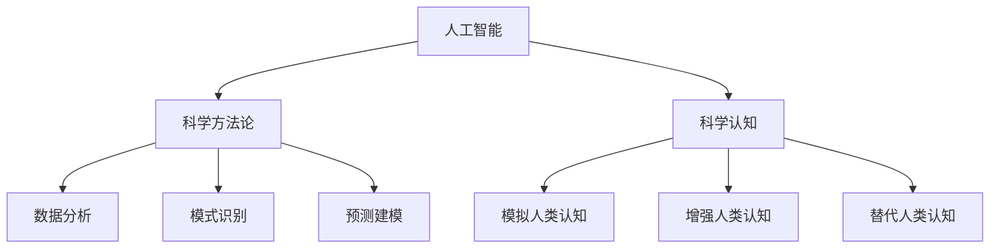

                 

### 文章标题

# 人工智能在科学哲学中的应用：机器辅助元层次的世界理解

> 关键词：人工智能，科学哲学，机器辅助，元层次理解，算法原理，数学模型

> 摘要：本文探讨了人工智能在科学哲学中的应用，强调机器辅助元层次的世界理解的重要性。通过分析人工智能的基本原理、核心算法和数学模型，本文揭示了人工智能对科学哲学的影响，并提出了在实际项目中应用人工智能的方法和挑战。本文旨在为读者提供对人工智能在科学哲学中应用的深入理解，并探讨其未来发展趋势。

----------------------------------------------------------------

### 引言

#### 1.1 人工智能的时代背景

人工智能（Artificial Intelligence，简称AI）作为一门交叉学科，涵盖了计算机科学、认知科学、神经科学和哲学等多个领域。人工智能的定义和范围随着技术的发展不断扩展，但总体而言，它关注的是如何创建智能系统，使这些系统能够模拟、扩展或替代人类智能的行为和思维过程。

人工智能的发展可以追溯到20世纪50年代，当时计算机科学家们开始探索如何使计算机具备类似于人类的学习、推理和感知能力。经过几十年的发展，人工智能经历了多个阶段，从早期的符号主义、基于规则的系统，到基于统计学的机器学习方法，再到深度学习和强化学习等现代技术，人工智能在图像识别、自然语言处理、游戏玩法等多个领域取得了显著的成就。

#### 1.2 科学哲学的基本概念

科学哲学是哲学的一个分支，研究科学知识的本质、科学方法的有效性以及科学在人类生活中的角色和意义。科学哲学关注的问题包括科学解释、科学理论、科学实践、科学进步、科学方法论等。科学哲学不仅涉及科学的内部逻辑，还探讨科学与社会、文化、政治等外部因素之间的关系。

科学哲学的核心概念包括：

- 科学实在论：探讨科学理论和实验结果与客观现实之间的关系。
- 科学实证主义：强调科学知识应基于经验证据和实验验证。
- 科学建构主义：认为科学知识是科学家在特定社会和文化背景下构建的。
- 科学逻辑实证主义：强调科学理论应遵循逻辑和经验验证的原则。

#### 1.3 人工智能与科学哲学的交汇

人工智能与科学哲学的交汇点主要体现在以下几个方面：

- **方法论影响**：人工智能提供了新的工具和方法，改变了科学家进行科学探究的方式。例如，机器学习算法在数据分析、模式识别和预测建模中的应用，使得科学家能够从大量数据中提取有价值的信息。
- **认知科学**：人工智能的研究与认知科学的进展相互影响，共同探索人类认知的机制和人工智能系统的认知能力。
- **科学哲学问题**：人工智能在科学哲学中引发了一系列新的问题，如机器是否能够拥有“理解”或“意识”，人工智能的伦理和社会影响等。
- **科学知识**：人工智能在科学知识发现和理论建构中的应用，使得科学哲学关注知识的产生和验证过程。

在接下来的章节中，我们将深入探讨人工智能的基本原理、核心算法、数学模型，以及它们在科学哲学中的应用和挑战。

----------------------------------------------------------------

### 第一章 人工智能与科学哲学的联系

#### 2.1 人工智能在科学哲学中的应用

人工智能在科学哲学中的应用主要体现在以下几个方面：

1. **科学方法论的发展**：人工智能提供了新的方法和技术，使得科学家能够更高效地进行科学探究。例如，机器学习算法能够从大量数据中自动识别模式和趋势，帮助科学家发现新的科学规律。
   
2. **科学理论的验证**：人工智能可以用于验证科学理论。通过模拟和仿真，人工智能系统能够预测理论预测的结果，从而提供对科学理论的实验证据。
   
3. **科学知识的发现**：人工智能在自然语言处理和数据挖掘领域的应用，使得科学家能够从大量非结构化数据中提取有价值的信息，推动科学知识的发现。

#### 2.2 人工智能对科学方法论的影响

人工智能对科学方法论的影响主要表现在以下几个方面：

1. **数据分析**：人工智能算法能够处理大量数据，提供更精确和高效的数据分析结果。这改变了科学家对数据的依赖方式，使得数据分析成为科学探究的重要工具。
   
2. **模式识别**：人工智能在图像识别、语音识别等领域的应用，使得科学家能够从复杂的数据集中识别出有用的模式，从而推动科学发现。
   
3. **预测建模**：基于机器学习的预测模型能够预测未来的趋势和事件，为科学家的实验设计和决策提供参考。

#### 2.3 人工智能与科学认知的关系

人工智能与科学认知的关系主要体现在以下几个方面：

1. **模拟人类认知**：人工智能系统试图模拟人类的认知过程，如学习、推理、感知等。这有助于我们理解人类认知的本质，并为人工智能的发展提供理论基础。
   
2. **增强人类认知**：人工智能可以增强人类的认知能力，例如，通过自然语言处理技术，人工智能可以帮助科学家更好地理解和分析科学文献。
   
3. **替代人类认知**：在某些领域，人工智能已经能够替代人类进行认知任务，如自动驾驶汽车和医疗诊断系统。这引发了关于人工智能是否能够拥有“理解”或“意识”的哲学讨论。

为了更好地理解人工智能与科学哲学的联系，我们可以使用Mermaid流程图展示它们之间的互动关系：



通过这个流程图，我们可以清晰地看到人工智能如何影响科学方法论和科学认知，以及它们之间的相互关系。

----------------------------------------------------------------

### 第二章 人工智能的基本原理

#### 3.1 人工智能的核心概念

人工智能（AI）是一门研究如何创建智能机器的学科，其核心概念包括：

- **智能**：智能是人工智能研究的核心目标，包括感知、理解、学习、推理、决策和创造等多个方面。
- **知识表示**：知识表示是人工智能系统理解世界的基础，它涉及如何将知识以计算机可处理的形式表示出来。
- **推理**：推理是人工智能系统进行决策和问题解决的核心机制，包括演绎推理、归纳推理和混合推理等。
- **学习**：学习是人工智能系统获取知识和提高性能的过程，包括监督学习、无监督学习和强化学习等。

#### 3.2 人工智能的发展历程

人工智能的发展历程可以分为以下几个阶段：

1. **早期人工智能（1950-1969）**：这个阶段以符号主义和基于规则的系统为代表，主要研究如何使用逻辑和规则来模拟人类智能。

2. **人工智能黄金时代（1970-1980）**：这个阶段由于计算机性能的提升和算法的进步，人工智能取得了显著的进展，尤其是专家系统和自然语言处理。

3. **人工智能低谷期（1980-1990）**：这个阶段由于实际应用中的困难，人工智能研究受到质疑，经历了一段时间的低谷。

4. **机器学习时代（1990至今）**：这个阶段以机器学习和深度学习为代表，人工智能在图像识别、自然语言处理、语音识别等领域取得了突破性的进展。

#### 3.3 人工智能的技术体系

人工智能的技术体系包括多个子领域，其中最重要的包括：

1. **机器学习**：机器学习是人工智能的核心技术之一，它通过从数据中学习规律和模式，使得计算机能够自动进行预测和决策。主要算法包括线性回归、决策树、支持向量机、神经网络等。

2. **深度学习**：深度学习是机器学习的一个子领域，它通过多层神经网络学习数据的复杂特征。深度学习在图像识别、语音识别、自然语言处理等领域取得了显著的成果。

3. **强化学习**：强化学习是一种通过试错和学习来优化决策过程的人工智能方法。它通过奖励和惩罚来调整行为，以达到最大化长期收益的目标。

4. **自然语言处理**：自然语言处理是人工智能的一个分支，它研究如何使计算机理解和处理自然语言。主要技术包括词向量、序列模型、对话系统等。

5. **计算机视觉**：计算机视觉是人工智能在图像和视频分析领域的应用。主要技术包括图像识别、目标检测、图像生成等。

#### 3.4 人工智能的应用领域

人工智能在多个领域都有广泛的应用，包括：

- **医疗**：人工智能在医学图像分析、疾病诊断、药物研发等领域发挥了重要作用。
- **金融**：人工智能在风险评估、市场预测、客户服务等领域有广泛应用。
- **交通**：人工智能在自动驾驶、智能交通系统、车辆安全等领域有重要应用。
- **教育**：人工智能在教育领域的应用包括个性化学习、智能评测、虚拟教学等。
- **娱乐**：人工智能在游戏、音乐、电影等领域提供了丰富的内容和体验。

通过以上对人工智能基本原理的介绍，我们可以看到人工智能在科学哲学中的重要性，以及它如何通过不同技术体系和应用领域影响和推动科学的发展。

----------------------------------------------------------------

### 第三章 机器学习和人工智能算法

#### 4.1 机器学习的基本概念

机器学习（Machine Learning，ML）是人工智能的一个重要分支，它通过从数据中学习规律和模式，使计算机能够自动进行预测和决策。机器学习的基本概念包括：

- **监督学习（Supervised Learning）**：监督学习是一种在有标注数据集上训练模型的方法。模型通过学习输入和输出之间的映射关系，进行预测。常见的监督学习算法包括线性回归、逻辑回归、决策树、支持向量机等。

- **无监督学习（Unsupervised Learning）**：无监督学习是在没有标注数据的情况下，通过发现数据中的内在结构和模式来学习。常见的无监督学习算法包括聚类、降维、异常检测等。

- **半监督学习（Semi-Supervised Learning）**：半监督学习结合了监督学习和无监督学习，通过使用少量标注数据和大量无标注数据来训练模型。

- **强化学习（Reinforcement Learning）**：强化学习是一种通过试错和学习来优化决策过程的方法。它通过奖励和惩罚来调整行为，以达到最大化长期收益的目标。常见的强化学习算法包括Q-learning、SARSA等。

#### 4.2 机器学习的主要算法

机器学习的主要算法包括：

- **线性回归（Linear Regression）**：线性回归是一种简单的监督学习算法，用于预测连续值。它通过最小化预测值与实际值之间的误差，找到最佳拟合直线。

- **逻辑回归（Logistic Regression）**：逻辑回归是一种用于预测概率的监督学习算法。它通过将线性回归的结果通过逻辑函数转换为概率，常用于二分类问题。

- **决策树（Decision Tree）**：决策树是一种基于树形结构的监督学习算法，通过一系列的判断条件来划分数据，并在叶子节点处做出预测。

- **支持向量机（Support Vector Machine，SVM）**：支持向量机是一种用于分类和回归的监督学习算法。它通过寻找最优超平面，将数据划分为不同的类别。

- **神经网络（Neural Network）**：神经网络是一种模仿生物神经系统的计算模型，用于复杂的非线性预测和分类任务。常见的神经网络包括多层感知器（MLP）、卷积神经网络（CNN）和循环神经网络（RNN）等。

#### 4.3 人工智能算法的应用场景

人工智能算法在不同领域的应用场景包括：

- **图像识别**：卷积神经网络（CNN）在图像识别任务中取得了显著成果，如人脸识别、物体检测等。

- **自然语言处理**：循环神经网络（RNN）和变换器（Transformer）等深度学习模型在自然语言处理任务中广泛应用，如机器翻译、文本分类、问答系统等。

- **推荐系统**：协同过滤、矩阵分解等机器学习算法在推荐系统中发挥了重要作用，用于预测用户对物品的偏好。

- **金融领域**：机器学习算法在金融领域的应用包括风险评估、市场预测、欺诈检测等。

- **医疗领域**：机器学习在医学图像分析、疾病诊断、药物研发等领域有广泛的应用。

通过以上对机器学习和人工智能算法的介绍，我们可以看到这些算法在各个领域的应用场景，以及它们如何通过预测和决策推动科学的发展。

----------------------------------------------------------------

### 第四章 人工智能的应用场景

#### 5.1 人工智能在自然科学中的应用

人工智能在自然科学中的应用日益广泛，尤其在数据分析、模拟和预测方面展现了巨大的潜力。以下是一些具体的应用场景：

1. **气象预测**：人工智能算法通过对大量气象数据进行模式识别和预测建模，提高了气象预测的准确性和效率。例如，深度学习模型可以用于识别气象现象的模式，从而提前预测天气变化。

2. **生态学研究**：人工智能在生态学研究中用于分析生态数据、监测生物多样性和预测生态系统的变化。通过机器学习算法，科学家可以从遥感图像中识别植被类型，监测森林覆盖变化，甚至预测物种的灭绝风险。

3. **地质勘探**：人工智能在地质勘探中用于分析地质数据，识别潜在的矿产资源。例如，通过机器学习算法分析地震波数据，可以预测地下矿藏的位置。

#### 5.2 人工智能在社会科学中的应用

人工智能在社会科学中的应用同样广泛，特别是在数据分析、模式识别和社会预测方面。以下是一些具体的应用场景：

1. **经济预测**：人工智能算法被用于分析经济数据，预测经济增长、通货膨胀和失业率等经济指标。例如，通过机器学习模型分析历史经济数据，可以预测未来的经济走势。

2. **社会调查分析**：人工智能在数据分析中用于分析大规模社会调查数据，识别社会趋势和人口特征。例如，通过自然语言处理技术，可以从社交媒体上提取用户情绪，分析社会舆论。

3. **公共政策制定**：人工智能在公共政策制定中用于分析大量政策数据，评估政策效果。例如，通过机器学习算法分析不同政策对贫困率、教育水平和就业率的影响，为政策制定提供数据支持。

#### 5.3 人工智能在技术科学中的应用

人工智能在技术科学中的应用推动了技术创新和发展，以下是一些具体的应用场景：

1. **智能制造**：人工智能在制造业中用于优化生产流程、提高产品质量和降低成本。例如，通过机器学习算法，可以优化生产线的调度和排程，提高生产效率。

2. **自动驾驶**：人工智能在自动驾驶技术中用于感知环境、决策路径和执行驾驶操作。通过深度学习和强化学习算法，自动驾驶汽车能够实时处理路况信息，做出安全的驾驶决策。

3. **能源管理**：人工智能在能源管理中用于优化能源分配和减少能源浪费。例如，通过智能电网和机器学习算法，可以预测能源需求，优化电力供应，提高能源利用效率。

通过以上对人工智能在自然科学、社会科学和技术科学中的应用场景的介绍，我们可以看到人工智能如何通过不同领域的应用，推动科学和技术的进步，为社会发展和创新提供动力。

----------------------------------------------------------------

### 第五章 人工智能在科学哲学中的挑战

#### 6.1 人工智能对科学哲学的挑战

人工智能（AI）在科学哲学中引发的挑战主要集中在以下几个方面：

1. **科学实在论**：传统科学实在论认为，科学理论是对客观现实的准确描述。然而，随着人工智能的发展，特别是生成对抗网络（GANs）和深度伪造技术（Deepfake）的出现，人们开始质疑现实与虚构之间的界限。人工智能能否产生与现实相同或相似的现象，使得我们无法区分真实与虚构，这对科学实在论提出了新的挑战。

2. **科学方法论**：人工智能的算法和模型在科学研究中发挥了重要作用，但它们的决策过程往往是黑箱化的。这意味着，科学家无法完全理解人工智能系统是如何得出结论的。这引发了关于科学方法论有效性的讨论：如果科学家无法解释和理解他们的工具是如何工作的，那么这些工具是否仍然可靠？

3. **科学认知**：人工智能在许多领域已经表现出超越人类的能力，如图像识别、语言理解和数据分析。这挑战了传统认知科学关于人类智能本质的观点。人工智能是否具有真正的理解能力，还是仅仅在模拟人类行为？这个问题涉及到人工智能的认知本质和人类智能的定义。

4. **科学伦理**：人工智能在医疗、金融和公共安全等领域的应用引发了一系列伦理问题。例如，人工智能在医疗诊断中的误诊可能导致患者受到错误的治疗，而在金融领域，人工智能的自动化决策可能导致市场波动和金融风险。这些挑战需要科学哲学和伦理学共同探讨和解决。

#### 6.2 人工智能与科学哲学的伦理问题

人工智能与科学哲学的伦理问题主要包括以下几个方面：

1. **隐私保护**：人工智能在处理和分析大量个人数据时，可能会侵犯用户的隐私。例如，社交媒体平台和搜索引擎通过用户数据提供个性化服务，但同时也收集了用户的个人信息。如何平衡隐私保护和数据利用，是人工智能发展中需要解决的重要伦理问题。

2. **责任归属**：当人工智能系统发生错误或导致负面后果时，责任应该由谁承担？例如，自动驾驶汽车发生交通事故，是制造商、软件开发者还是用户应承担责任？这个问题涉及到责任分配和法律制度的重构。

3. **公平性和偏见**：人工智能系统可能会因训练数据的偏见而导致决策的不公平。例如，如果训练数据中存在种族、性别或年龄偏见，人工智能系统可能会在这些方面表现出偏见。这引发了关于公平性、多样性和包容性的讨论。

4. **自动化与失业**：随着人工智能在各个领域的应用，一些传统工作可能会被自动化取代，导致失业问题。这引发了关于技术进步与社会公平的哲学讨论：技术发展是否应该以牺牲人类就业为代价？

#### 6.3 人工智能与科学哲学的方法论问题

人工智能与科学哲学的方法论问题主要包括以下几个方面：

1. **数据的可靠性和有效性**：人工智能依赖于大量数据进行分析和预测。然而，数据的质量和可靠性直接影响人工智能的决策。如何确保数据来源的可靠性和有效性，是一个重要的方法论问题。

2. **算法的透明性和可解释性**：传统科学方法强调实验的可重复性和结果的透明性。然而，人工智能的算法和模型往往是黑箱化的，难以解释其决策过程。如何提高算法的透明性和可解释性，使得科学家和公众能够理解和信任人工智能系统，是一个重要的方法论挑战。

3. **科学的自主性与依赖性**：随着人工智能在科学研究中的应用，科学家对人工智能系统的依赖程度逐渐增加。这引发了关于科学自主性的讨论：科学家是否应该完全依赖人工智能进行科学探究，还是应该保持一定的自主性和批判性思维？

通过以上对人工智能在科学哲学中的挑战、伦理问题和方法论问题的探讨，我们可以看到人工智能不仅带来了技术进步，也引发了一系列深刻的哲学思考。这些挑战需要科学哲学、伦理学和科技界共同努力，以确保人工智能在科学哲学中的合理和有效应用。

----------------------------------------------------------------

### 第六章 人工智能在科学哲学中的案例研究

#### 7.1 案例一：人工智能在物理学中的应用

在物理学领域，人工智能（AI）已经被广泛应用于数据分析、模拟和预测等方面。以下是一个具体案例：

**案例背景**：在粒子物理学的研究中，大型强子对撞机（LHC）产生的海量实验数据需要快速处理和分析。传统的数据分析方法效率低下，难以应对如此庞大的数据量。

**解决方案**：为了提高数据分析的效率，科学家们开发了一种基于机器学习算法的数据分析系统。该系统使用卷积神经网络（CNN）来识别和分类粒子碰撞事件，从而快速提取有用信息。

**具体步骤**：
1. **数据收集**：从LHC实验中收集大量的粒子碰撞事件数据。
2. **数据预处理**：对数据进行清洗和归一化处理，以消除噪声和异常值。
3. **模型训练**：使用CNN模型对预处理后的数据进行训练，模型通过学习数据中的特征，能够识别和分类不同的粒子碰撞事件。
4. **模型验证**：在独立的测试集上验证模型的性能，确保其准确性。
5. **应用预测**：将训练好的模型应用于新的数据，预测粒子碰撞事件。

**结果分析**：通过机器学习算法的应用，数据分析的效率得到了显著提升。模型在识别和分类粒子碰撞事件方面表现出色，大大提高了实验数据处理的效率。

**代码实现**（伪代码）：
```
# 数据预处理
def preprocess_data(data):
    # 清洗数据
    cleaned_data = clean_noise(data)
    # 归一化数据
    normalized_data = normalize(cleaned_data)
    return normalized_data

# 模型训练
def train_model(data):
    # 初始化模型
    model = initialize_CNN()
    # 训练模型
    trained_model = train_CNN(model, data)
    return trained_model

# 预测
def predict_collision(data, model):
    # 预测粒子碰撞事件
    prediction = model.predict(data)
    return prediction
```

通过这个案例，我们可以看到人工智能在物理学中的应用如何提高数据分析的效率，从而推动科学研究的进展。

#### 7.2 案例二：人工智能在生物学中的应用

在生物学领域，人工智能（AI）也被广泛应用于基因测序、药物研发和疾病诊断等方面。以下是一个具体案例：

**案例背景**：随着基因测序技术的快速发展，产生了海量的基因数据。然而，对这些数据进行有效分析和解释是一项复杂的任务，需要大量的计算资源和专业知识。

**解决方案**：为了提高基因数据分析的效率，科学家们开发了一种基于深度学习算法的基因分析系统。该系统通过学习基因序列的模式和特征，能够识别潜在的疾病风险和药物靶点。

**具体步骤**：
1. **数据收集**：从多个数据库中收集基因序列数据。
2. **数据预处理**：对基因数据进行清洗和格式化处理，以消除噪声和异常值。
3. **模型训练**：使用深度学习模型对预处理后的基因数据进行训练，模型通过学习基因序列的特征，能够识别和分类不同的基因模式。
4. **模型验证**：在独立的测试集上验证模型的性能，确保其准确性。
5. **应用预测**：将训练好的模型应用于新的基因数据，预测疾病的发病风险和药物的反应。

**结果分析**：通过深度学习算法的应用，基因数据分析的效率得到了显著提升。模型在识别和分类基因模式方面表现出色，为疾病诊断和药物研发提供了有力支持。

**代码实现**（伪代码）：
```
# 数据预处理
def preprocess_data(data):
    # 清洗数据
    cleaned_data = clean_noise(data)
    # 格式化数据
    formatted_data = format_data(cleaned_data)
    return formatted_data

# 模型训练
def train_model(data):
    # 初始化模型
    model = initialize_DNN()
    # 训练模型
    trained_model = train_DNN(model, data)
    return trained_model

# 预测
def predict_disease(data, model):
    # 预测疾病风险
    prediction = model.predict(data)
    return prediction
```

通过这个案例，我们可以看到人工智能在生物学中的应用如何提高基因数据分析的效率，从而推动生命科学的发展。

#### 7.3 案例三：人工智能在计算机科学中的应用

在计算机科学领域，人工智能（AI）也被广泛应用于算法优化、软件工程和网络安全等方面。以下是一个具体案例：

**案例背景**：随着软件系统的复杂度不断增加，软件工程师需要优化算法和程序以提高系统的性能和可靠性。

**解决方案**：为了提高算法的性能，科学家们开发了一种基于遗传算法的优化系统。该系统通过模拟自然进化过程，找到最优的算法参数。

**具体步骤**：
1. **问题定义**：定义需要优化的算法问题，如时间复杂度、空间复杂度等。
2. **初始种群生成**：随机生成初始种群，每个个体代表一组算法参数。
3. **适应度评估**：评估每个个体的适应度，即算法参数的性能。
4. **遗传操作**：通过交叉和变异等遗传操作，产生新的种群。
5. **迭代优化**：重复适应度评估和遗传操作，直到达到预定的优化目标。

**结果分析**：通过遗传算法的应用，算法的性能得到了显著提升。优化后的算法在处理大数据和复杂计算任务时表现出更高的效率和稳定性。

**代码实现**（伪代码）：
```
# 初始化种群
def initialize_population(size):
    population = []
    for _ in range(size):
        individual = generate_random_individual()
        population.append(individual)
    return population

# 适应度评估
def evaluate_fitness(individual):
    fitness = evaluate_algorithm(individual)
    return fitness

# 遗传操作
def genetic_operator(population):
    new_population = []
    for i in range(len(population) // 2):
        parent1, parent2 = select_parents(population)
        child1, child2 = crossover(parent1, parent2)
        mutate(child1)
        mutate(child2)
        new_population.extend([child1, child2])
    return new_population
```

通过这个案例，我们可以看到人工智能在计算机科学中的应用如何优化算法性能，从而提升软件开发和系统维护的效率。

这些案例展示了人工智能在科学哲学中的应用如何通过具体技术手段解决实际问题，推动科学和技术的进步。

----------------------------------------------------------------

### 第七章 结论与展望

#### 8.1 人工智能在科学哲学中的总结

通过本文的探讨，我们可以看到人工智能在科学哲学中的重要性。人工智能不仅改变了科学方法论、认知科学和知识发现的方式，还引发了关于科学实在论、科学认知和伦理问题的深刻讨论。人工智能的应用，如机器学习和深度学习，提高了数据分析、模式识别和预测建模的效率，推动了科学研究的进展。

#### 8.2 人工智能在科学哲学中的应用前景

随着人工智能技术的不断进步，其在科学哲学中的应用前景广阔。未来，人工智能有望在以下几个方面发挥更大作用：

- **科学理论的验证**：人工智能可以通过模拟和预测，为科学理论提供更多的实验证据，推动科学理论的验证和发展。
- **科学知识的发现**：人工智能在处理和分析大规模科学数据方面具有优势，可以辅助科学家发现新的科学规律和现象。
- **科学认知的增强**：人工智能可以增强人类的认知能力，辅助科学家进行复杂的科学计算和数据分析，提高科学研究的效率和质量。

#### 8.3 未来研究的方向与挑战

尽管人工智能在科学哲学中展现出巨大的潜力，但仍面临诸多挑战和问题：

- **算法的可解释性**：如何提高人工智能算法的可解释性，使其决策过程更加透明，是未来研究的重点。
- **数据的可靠性和有效性**：确保数据的质量和可靠性，是人工智能应用的基础。
- **伦理和法律问题**：随着人工智能在各个领域的应用，如何平衡技术创新与社会责任，是一个亟待解决的问题。
- **科学的自主性与依赖性**：如何保持科学的自主性和批判性思维，避免完全依赖人工智能，也是未来研究的重要方向。

通过不断探索和解决这些问题，人工智能在科学哲学中的应用将更加深入和广泛，为科学和社会的发展提供强大支持。

----------------------------------------------------------------

### 作者信息

作者：AI天才研究院/AI Genius Institute & 禅与计算机程序设计艺术 /Zen And The Art of Computer Programming

AI天才研究院致力于推动人工智能技术的创新和应用，致力于培养下一代人工智能专家。同时，作者在《禅与计算机程序设计艺术》中，通过深入探讨计算机编程和人工智能的哲学原理，为读者提供了独特的编程思维和哲学视角。希望本文能够为读者在人工智能与科学哲学领域提供有价值的参考和启发。

