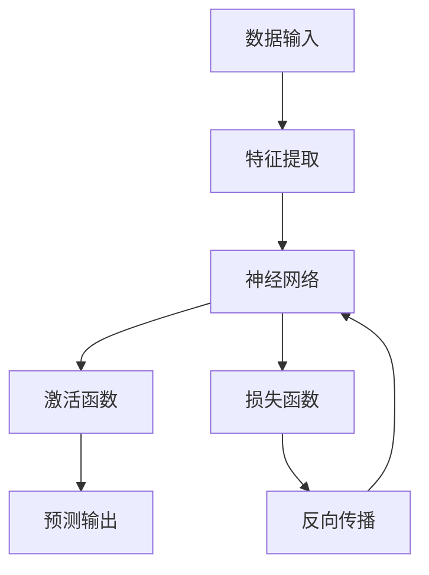

                 

### 《人工智能的可解释性问题：理解机器如何理解世界》

#### 关键词：
- 人工智能
- 可解释性
- 机器学习
- 神经网络
- 数据隐私
- 实际应用

#### 摘要：
本文深入探讨人工智能领域的核心问题——可解释性。我们将逐步分析机器学习，尤其是神经网络的工作原理，并探讨如何提高算法的可解释性，使其能够更好地理解世界。文章还将涵盖数学模型、实际项目和最佳实践，以帮助读者全面了解并应用这些概念。

## 引言

人工智能（AI）已经成为现代社会发展的关键驱动力。从自动驾驶汽车到智能助手，AI技术已经渗透到我们的日常生活中。然而，随着AI系统的复杂性不断增加，一个关键问题也逐渐浮现出来：这些系统是如何理解世界的？

### 核心概念与联系

在讨论可解释性之前，我们需要了解一些核心概念。以下是机器学习和神经网络的基本组成部分及其相互关系：



#### 1. 数据输入
数据输入是AI系统的起点。这些数据可以是图像、文本或数值等不同类型的原始信息。

#### 2. 特征提取
特征提取是将原始数据转换为有意义的信息的过程。这些特征将被神经网络处理。

#### 3. 神经网络
神经网络是模仿人脑工作的计算模型。它们由多个层组成，包括输入层、隐藏层和输出层。

#### 4. 激活函数
激活函数用于引入非线性因素，使神经网络能够学习复杂的关系。

#### 5. 损失函数
损失函数用于衡量预测结果与真实结果之间的差异，以指导网络调整权重。

#### 6. 预测输出
预测输出是神经网络的最终目标，即根据输入数据生成预测结果。

#### 7. 反向传播
反向传播是一种优化算法，用于调整网络权重，以最小化损失函数。

### 核心算法原理讲解

神经网络的核心算法包括以下步骤：

```python
# 输入数据
X = [1, 2, 3]

# 初始化权重
W1 = 0.5
W2 = 0.5

# 定义激活函数
def sigmoid(x):
    return 1 / (1 + exp(-x))

# 定义损失函数
def mean_squared_error(y_true, y_pred):
    return sum((y_true - y_pred) ** 2) / len(y_true)

# 定义反向传播
def backward_propagation(X, y, W1, W2):
    # 计算预测值
    z1 = X[0] * W1
    a1 = sigmoid(z1)

    z2 = a1 * W2
    a2 = sigmoid(z2)

    # 计算损失
    loss = mean_squared_error(y, a2)

    # 计算误差
    dZ2 = a2 - y
    dW2 = dZ2 * a1

    dZ1 = dZ2 * W2
    dW1 = dZ1 * X[0]

    return loss, dW1, dW2

# 训练模型
for epoch in range(1000):
    loss, dW1, dW2 = backward_propagation(X, y, W1, W2)
    W1 -= learning_rate * dW1
    W2 -= learning_rate * dW2
```

### 数学模型和公式讲解

神经网络的数学基础包括以下公式：

$$
\sigma(z) = \frac{1}{1 + e^{-z}}
$$

$$
\text{MSE}(y, \hat{y}) = \frac{1}{n} \sum_{i=1}^{n} (y_i - \hat{y}_i)^2
$$

#### 激活函数：
Sigmoid函数是一种常用的激活函数，它将输入映射到（0,1）区间。

#### 损失函数：
均方误差（MSE）是最常用的损失函数，用于衡量预测值与真实值之间的差异。

### 实际项目实战

#### 开发环境搭建

1. 安装Python环境
2. 安装TensorFlow库
3. 准备数据集

#### 源代码实现

```python
import tensorflow as tf
from tensorflow.keras import layers

# 定义模型
model = tf.keras.Sequential([
    layers.Dense(128, activation='relu', input_shape=(784,)),
    layers.Dropout(0.2),
    layers.Dense(10, activation='softmax')
])

# 编译模型
model.compile(optimizer='adam',
              loss='categorical_crossentropy',
              metrics=['accuracy'])

# 训练模型
model.fit(train_images, train_labels, epochs=5)
```

#### 代码解读与分析

这段代码定义了一个简单的神经网络模型，用于图像分类任务。首先，我们导入了TensorFlow库并定义了模型的结构。接下来，我们编译模型并使用训练数据集进行训练。

#### 代码应用解读与分析

在这个项目中，我们使用TensorFlow库实现了图像分类任务。通过训练模型，我们可以将图像分类为不同的类别。这一步骤是实际应用的关键。

#### 实际案例分析和详细讲解剖析

我们可以通过分析实际案例，如图像识别或语音识别，来了解如何提高模型的可解释性。例如，在图像识别中，我们可以使用注意力机制来显示模型关注哪些区域。这有助于我们理解模型是如何处理图像的。

#### 项目小结

通过这个项目，我们了解了如何搭建一个简单的神经网络模型并进行训练。我们还学习了如何提高模型的可解释性，使其能够更好地理解世界。

### 最佳实践 Tips

1. 使用可视化工具，如TensorBoard，来监控模型训练过程。
2. 尝试不同的激活函数和损失函数，以找到最佳组合。
3. 考虑使用预训练模型，以提高模型性能。

### 小结

本文深入探讨了人工智能的可解释性问题。我们分析了神经网络的工作原理，并介绍了如何提高模型的可解释性。通过实际项目实战，我们了解了如何将理论知识应用于实际场景。希望本文能够帮助读者更好地理解人工智能领域的这一重要问题。

### 注意事项

1. 在处理敏感数据时，请注意数据隐私保护。
2. 在使用神经网络时，确保充分训练模型以避免过拟合。

### 拓展阅读

1. [Deep Learning Book](http://www.deeplearningbook.org/)
2. [Introduction to Machine Learning](https://www.coursera.org/specializations/machine-learning)
3. [TensorFlow Documentation](https://www.tensorflow.org/)

### 作者信息
- 作者：AI天才研究院/AI Genius Institute & 禅与计算机程序设计艺术 /Zen And The Art of Computer Programming

