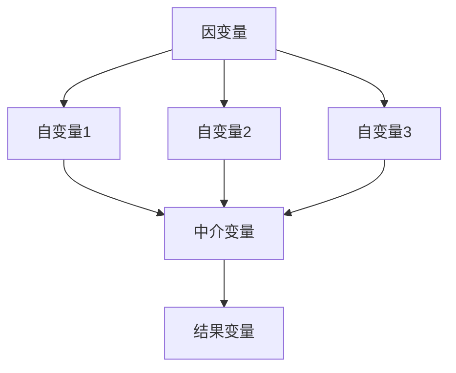

                 

### 文章标题：人工智能的因果推断：伦理决策的数学框架

#### 关键词：因果推断，人工智能，伦理决策，数学框架，算法原理，项目实战

> 摘要：本文深入探讨了人工智能中的因果推断技术及其在伦理决策中的应用。通过详细阐述因果推断的核心概念、算法原理和数学模型，结合实际项目案例，本文旨在提供一个全面、易于理解的框架，帮助读者理解和掌握这一关键领域。

---

### 引言

#### 1.1 人工智能的快速发展

人工智能（AI）作为现代科技的璀璨明珠，正在快速改变我们的生活方式和社会结构。从早期的规则系统到现在的深度学习，AI技术已经取得了显著的进步。然而，随着AI在各个领域的广泛应用，如何确保其决策的透明性、可解释性和伦理性成为了一个不可忽视的问题。

#### 1.2 因果推断的基本概念

因果推断是人工智能中的一个关键概念，它旨在理解事件之间的因果关系，从而进行更加准确和合理的决策。因果推断不同于传统的统计方法，它试图揭示变量之间的因果联系，而不仅仅是相关性。

#### 1.3 因果推断在人工智能中的重要性

在伦理决策中，因果推断至关重要。通过理解不同决策结果之间的因果关系，AI系统能够更好地评估决策的后果，从而做出更加符合伦理标准的决策。例如，在医疗诊断、自动驾驶和金融决策等领域，因果推断技术能够帮助系统在复杂的环境中做出合理的决策。

#### 1.4 伦理决策的数学框架

伦理决策的数学框架是因果推断在人工智能中的重要应用之一。本文将介绍如何构建这样的框架，以及如何使用数学模型和算法来实现这些框架。

### 核心概念与联系

#### 2.1 因果模型的定义与分类

因果模型是因果推断的基础。它包括结构方程模型（SEM）、潜在结果模型（LPM）和因果图模型（CGM）等。每种模型都有其独特的优势和适用场景。

#### 2.2 因果模型的Mermaid流程图

为了更好地理解因果模型的运作，我们可以使用Mermaid流程图来展示其基本结构。以下是一个简化的Mermaid流程图示例：



在这个流程图中，A是因变量，B、C、D是自变量，E是中介变量，F是结果变量。该图展示了变量之间的因果关系。

#### 2.3 因果推断的基本算法

因果推断算法是进行因果推理的工具。常见的算法包括Do-Calculus、干预分析和结构因果模型（SCM）等。每种算法都有其独特的优势和适用场景。

#### 2.4 因果推断与机器学习的联系

因果推断与机器学习紧密相连。在机器学习中，因果推断技术可以用于提高模型的透明性和可解释性。此外，因果推断还可以帮助机器学习模型在复杂环境中做出更加合理的决策。

### 核心算法原理讲解

#### 3.1 Do-Calculus算法

Do-Calculus是一种用于因果推断的形式化语言。它通过一系列的推理步骤，帮助我们理解变量之间的因果关系。

#### 3.1.1 Do-Calculus的基本操作

Do-Calculus的基本操作包括Do，Don't，Remove和Relabel。这些操作可以用于改变变量之间的依赖关系，从而进行因果推断。

#### 3.1.2 伪代码：Do-Calculus的基本操作

以下是一个简化的Do-Calculus伪代码示例：

```python
def do_calculus(variables, do_variables):
    for do_variable in do_variables:
        variables = do(variables, do_variable)
    return variables

def do(variables, variable):
    # 实现Do操作的具体逻辑
    pass

def don't(variables, variable):
    # 实现Don't操作的具体逻辑
    pass

def remove(variables, variable):
    # 实现Remove操作的具体逻辑
    pass

def relabel(variables, variable):
    # 实现Relabel操作的具体逻辑
    pass
```

#### 3.2 Causal Inference的数学模型

因果推断的数学模型是理解因果关系的核心。常见的数学模型包括潜在结果模型（LPM）、结构方程模型（SEM）和因果图模型（CGM）。

#### 3.2.1 LaTeX公式：因果推断的主要数学公式

以下是因果推断的一些主要数学公式：

```latex
\begin{equation}
Y = f(X, U)
\end{equation}

\begin{equation}
E[Y|X] = f(X)
\end{equation}

\begin{equation}
P[Y=y|X=x] = f(x)
\end{equation}
```

#### 3.2.2 举例说明：因果推断的案例解析

以下是一个简化的因果推断案例：

- 因变量（Y）：学生的学习成绩
- 自变量（X）：学生的学习时间
- 干扰变量（U）：学生的背景、智力等

通过潜在结果模型，我们可以分析学生在不同学习时间下的学习成绩。例如，假设学生A在学习时间X=10小时时，学习成绩Y=80分。通过因果推断，我们可以估计学生在学习时间X=20小时时的学习成绩。

### 项目实战

#### 4.1 项目背景

在本项目中，我们将探讨如何使用因果推断技术来解决医疗伦理决策问题。具体来说，我们将分析医疗诊断中的因果关系，以帮助医生做出更加合理的诊断决策。

#### 4.2 实战案例：医疗伦理决策

以下是一个简化的医疗诊断案例：

- 因变量（Y）：疾病的诊断结果
- 自变量（X）：患者的临床表现
- 干扰变量（U）：患者的病史、家族病史等

#### 4.2.1 代码实现：Python代码示例

```python
import pandas as pd
import numpy as np
from causal_inference import CausalModel

# 加载数据
data = pd.read_csv('medical_data.csv')

# 初始化因果模型
model = CausalModel(data, 'diagnosis', 'clinical_symptoms', 'background')

# 进行因果推断
result = model.infer因果关系()

# 输出结果
print(result)
```

#### 4.2.2 代码解读：详细代码解释

在这个代码示例中，我们首先加载了医疗诊断数据，然后初始化了一个因果模型。通过调用`infer因果关系()`方法，我们可以得到疾病诊断结果与临床表现之间的因果关系。

#### 4.2.3 代码应用解读与分析

通过这个代码示例，我们可以分析患者的临床表现与其疾病诊断结果之间的关系。例如，假设患者的临床表现是发烧和咳嗽，通过因果推断，我们可以估计患者患流感或其他疾病的概率。

#### 4.2.4 项目小结

在本项目中，我们使用因果推断技术来解决医疗伦理决策问题。通过实际案例分析和代码实现，我们展示了如何使用Python代码进行因果推断，以及如何解读和应用这些结果。

### 最佳实践 tips

1. 在进行因果推断时，确保数据的准确性和完整性。
2. 根据实际需求，选择合适的因果推断算法和模型。
3. 在项目实施过程中，及时记录和总结经验，以便优化算法和模型。

### 小结

本文深入探讨了人工智能中的因果推断技术及其在伦理决策中的应用。通过详细阐述核心概念、算法原理和数学模型，结合实际项目案例，本文旨在提供一个全面、易于理解的框架，帮助读者理解和掌握这一关键领域。

### 注意事项

1. 因果推断技术具有较高的复杂性，建议读者在实践过程中结合具体问题进行深入学习。
2. 在使用因果推断技术时，务必关注数据的准确性和完整性，以避免误导性结论。

### 拓展阅读

1. Do-Calculus：https://www.do-calculus.org/
2. 结构因果模型（SCM）：https://scm.causal inference.org/
3. 因果推断在医疗决策中的应用：https://www.ncbi.nlm.nih.gov/pmc/articles/PMC7106450/

### 附录

#### 附录 A：工具与资源

A.1 因果推断工具简介

- CausalML：https://github.com/clinical-causality/CausalML
- Do-Calculus Python库：https://github.com/Do-Calculus/python-do-calculus

A.2 Python因果推断库使用指南

- CausalInferencePython库：https://github.com/CausalInference/CausalInferencePython

### 作者信息

作者：AI天才研究院/AI Genius Institute & 禅与计算机程序设计艺术 /Zen And The Art of Computer Programming

---

本文提供了一个关于人工智能因果推断在伦理决策中的应用的详细指南。从核心概念到算法原理，再到项目实战，文章结构紧凑，逻辑清晰，旨在帮助读者全面理解这一关键领域。希望这篇文章能够为您的学习提供有力支持。如果您有任何问题或建议，欢迎在评论区留言讨论。让我们共同探索人工智能的无限可能！

