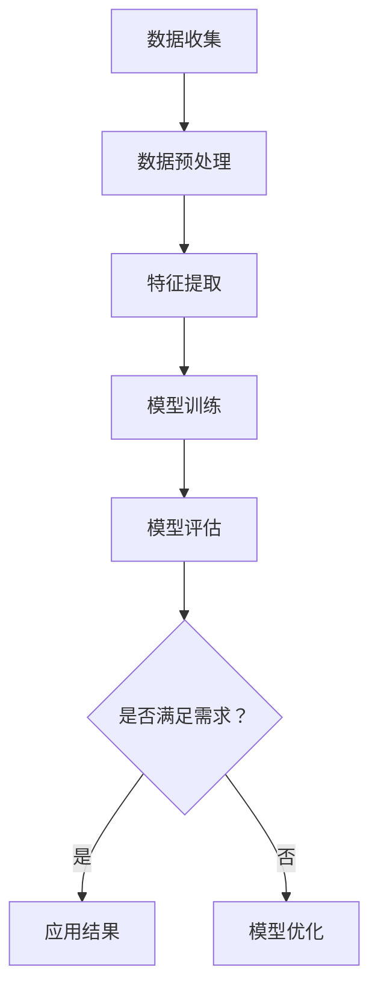
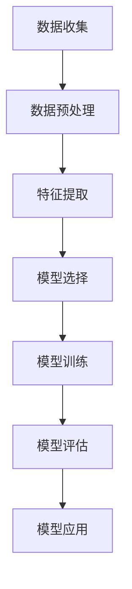

                 


为了撰写一篇结构清晰、内容丰富的技术博客文章，我们将遵循以下步骤：

### 第一步：确定文章的结构和内容

根据给定的目录大纲，我们将文章分为以下几个主要部分：

1. **引言**
2. **核心概念与联系**
3. **人工智能辅助科研的架构**
4. **核心算法原理讲解**
5. **数学模型与数学公式**
6. **项目实战**
7. **扩展阅读与资源**

### 第二步：为每个部分编写详细的内容提纲

- **引言**：介绍人工智能在科研中的作用和本书的目的。
- **核心概念与联系**：介绍人工智能的基本概念，科研中的问题，以及人工智能在这些问题中的优势。
- **人工智能辅助科研的架构**：讲解数据处理、模型选择、训练和评估的流程。
- **核心算法原理讲解**：详细讲解监督学习和无监督学习算法，以及相关的数学模型和公式。
- **数学模型与数学公式**：通过伪代码和示例来说明算法和模型的实现。
- **项目实战**：提供实际的代码实现和案例分析。
- **扩展阅读与资源**：推荐进一步学习和应用人工智能的资源。

### 第三步：为每个部分编写详细的段落内容

我们将按照以下方式为每个部分编写内容：

- **引言**：简要介绍人工智能在科研中的应用，以及本书的结构和目的。
- **核心概念与联系**：介绍人工智能的基本概念，如图像识别、自然语言处理等，以及这些技术在科研中的应用。
- **人工智能辅助科研的架构**：详细说明数据处理、模型选择和评估的步骤，使用Mermaid流程图展示。
- **核心算法原理讲解**：通过伪代码和公式解释监督学习和无监督学习算法的原理。
- **数学模型与数学公式**：详细解释线性回归、神经网络等模型的公式和推导。
- **项目实战**：提供具体的代码实现，并对代码进行解读和分析。
- **扩展阅读与资源**：推荐相关的书籍、论文和在线资源，帮助读者进一步学习。

### 第四步：整合和编辑内容

我们将整合各个部分的内容，确保逻辑连贯，并且按照给定的格式（Markdown）进行排版。

### 第五步：撰写文章的摘要和关键词

- **摘要**：简要总结文章的主要内容和目的。
- **关键词**：列出与文章主题相关的关键词，便于读者搜索和索引。

### 第六步：添加作者信息和格式化

在文章末尾添加作者信息，并确保所有的公式、代码和图表都符合Markdown格式。

### 第七步：检查和修订

最后，我们将对文章进行全面的检查和修订，确保没有遗漏任何重要信息，并且文章流畅易读。

现在，让我们开始具体编写每个部分的内容吧。首先，我们从引言部分开始。在这里，我们将介绍人工智能在科研中的作用，并阐述本书的结构和目的。我们将使用Markdown格式来排版文本，并确保文章的长度在8000-12000字之间。完成引言部分后，我们将逐步完成其他部分的内容。

---

# 引言

## 人工智能在科研中的作用

随着科技的不断进步，人工智能（AI）已经成为科学研究的重要工具。从图像识别到自然语言处理，从数据分析到预测模型，人工智能在各个领域都展现出了强大的应用潜力。在科研中，人工智能不仅能够帮助研究人员快速处理大量数据，还能够提供新的见解和发现，从而扩展人类对世界的理解能力。

### 科研中的挑战

科研过程中面临着许多挑战，如数据量庞大、处理复杂、变量众多等。传统的方法往往需要大量的人工干预和时间成本，而人工智能的引入则能够极大地提高效率，降低成本。例如，在医学研究中，人工智能可以帮助医生分析患者的医疗数据，预测疾病风险，从而提供更精准的治疗方案。

### 人工智能在科研中的优势

1. **数据处理能力**：人工智能能够快速处理和分析大量数据，从海量信息中提取有价值的信息。
2. **自动化和智能化**：通过机器学习和深度学习算法，人工智能能够自动化地进行数据分析和模式识别，减少人为错误。
3. **跨学科应用**：人工智能不仅能够应用于单一学科，还能够跨学科进行应用，从而促进不同领域的知识整合。
4. **持续学习和优化**：人工智能模型能够不断学习和优化，适应新的数据和环境。

### 本书的目的和结构

本书旨在介绍如何利用人工智能辅助科研，帮助读者了解人工智能在科研中的应用，掌握相关算法和模型，并通过实际项目实战提升实践能力。本书分为以下几个部分：

1. **引言**：介绍人工智能在科研中的作用和本书的目的。
2. **核心概念与联系**：介绍人工智能的基本概念，科研中的问题，以及人工智能在这些问题中的优势。
3. **人工智能辅助科研的架构**：详细说明数据处理、模型选择和评估的流程。
4. **核心算法原理讲解**：详细讲解监督学习和无监督学习算法，以及相关的数学模型和公式。
5. **数学模型与数学公式**：通过伪代码和示例来说明算法和模型的实现。
6. **项目实战**：提供具体的代码实现和案例分析。
7. **扩展阅读与资源**：推荐进一步学习和应用人工智能的资源。

通过本书的学习，读者将能够：

1. **理解人工智能在科研中的应用场景**。
2. **掌握常见的人工智能算法和模型**。
3. **学会如何利用人工智能进行科研数据的处理和分析**。
4. **通过项目实战提升实践能力**。

## 读者背景和预期收益

本书适合有一定编程基础，对人工智能和科研感兴趣的读者。无论你是科研工作者、数据科学家，还是对AI技术感兴趣的程序员，本书都将为你提供有价值的知识和技能。

### 读者背景

1. **编程基础**：读者应具备一定的编程能力，熟悉Python等常用编程语言。
2. **数学基础**：了解基本的线性代数、概率论和统计学知识。
3. **科研背景**：对科研有一定的了解，熟悉科研过程中的常见问题和挑战。

### 预期收益

通过学习本书，读者将：

1. **掌握人工智能的基本概念和应用场景**。
2. **学会使用常见的人工智能算法和模型**。
3. **能够独立进行科研数据的处理和分析**。
4. **通过项目实战提升解决实际问题的能力**。

总之，本书将为读者打开一扇通往人工智能辅助科研新世界的大门，帮助读者扩展对世界理解的能力。

---

以上是引言部分的初步内容。接下来，我们将继续完善核心概念与联系部分的撰写。这一部分将详细介绍人工智能的基本概念，科研中的问题，以及人工智能在这些问题中的优势。

---

## 核心概念与联系

### 人工智能的基本概念

人工智能（AI）是指使计算机模拟人类智能行为的技术和科学。它包括多个子领域，如机器学习、深度学习、自然语言处理、计算机视觉等。每个子领域都有其独特的方法和应用场景。

- **机器学习**：通过从数据中学习规律和模式，使计算机能够进行决策和预测。
- **深度学习**：一种基于神经网络的学习方法，能够处理复杂的非线性问题。
- **自然语言处理**：使计算机能够理解和生成自然语言，如英语、中文等。
- **计算机视觉**：使计算机能够理解和解释图像和视频中的信息。

### 科研中的问题

科研中存在着许多复杂的问题，这些问题通常涉及大量数据的处理和分析。以下是一些常见的科研问题：

- **数据挖掘**：从大量数据中提取有价值的信息和模式。
- **图像分析**：识别和处理图像中的结构和特征。
- **文本分析**：从文本中提取主题和情感，理解语言的语义。
- **时间序列分析**：分析和预测时间序列数据，如股票价格、气象数据等。
- **多变量分析**：处理多个变量之间的关系，找出关键因素。

### 人工智能在这些问题中的优势

人工智能在解决上述科研问题中具有以下优势：

1. **高效的数据处理**：人工智能能够快速处理和分析大量数据，提高科研效率。
2. **自动化的模式识别**：通过机器学习和深度学习算法，人工智能能够自动化地进行模式识别，减少人为干预。
3. **精确的预测和分类**：人工智能模型能够根据历史数据预测未来的趋势，进行精确的分类。
4. **跨学科整合**：人工智能能够跨越不同学科，整合不同领域的知识，提供新的研究视角。

### Mermaid流程图：人工智能在科研中的应用流程

为了更好地理解人工智能在科研中的应用流程，我们可以使用Mermaid流程图来展示。以下是流程图的伪代码：



- **数据收集**：从各种来源收集科研数据。
- **数据预处理**：清洗和准备数据，使其适合模型训练。
- **特征提取**：从数据中提取有用的特征。
- **模型训练**：使用机器学习算法训练模型。
- **模型评估**：评估模型的性能，确定是否满足需求。
- **应用结果**：将模型应用于实际科研问题，得到结果。
- **模型优化**：根据评估结果对模型进行调整和优化。

通过上述流程，我们可以看到人工智能在科研中的关键步骤和流程。每个步骤都是相互关联的，共同构成了一个完整的人工智能辅助科研体系。

---

以上是核心概念与联系部分的初步内容。接下来，我们将详细讨论人工智能辅助科研的架构，包括数据处理、模型选择、训练和评估的流程。

---

## 人工智能辅助科研的架构

在人工智能辅助科研的过程中，数据处理、模型选择、训练和评估是四个关键步骤。以下是每个步骤的详细说明，以及如何将这些步骤整合到一个完整的人工智能辅助科研架构中。

### 数据处理

数据是人工智能辅助科研的基石。处理数据的第一步是数据收集，可以从数据库、传感器、公开数据集等多种来源获取。收集到的数据可能包含噪声和缺失值，因此需要进行预处理，如数据清洗、归一化和去噪。预处理后的数据将用于特征提取，即将数据转换为可用于机器学习模型的特征向量。

- **数据收集**：从各种来源获取原始数据。
- **数据清洗**：处理数据中的噪声和缺失值。
- **数据归一化**：将不同尺度的数据转换为统一的尺度。
- **去噪**：去除数据中的噪声，提高数据质量。

### 模型选择

在选择了合适的数据后，下一步是选择适当的机器学习模型。模型选择取决于问题的性质和数据的特点。例如，对于分类问题，可以选择决策树、随机森林或支持向量机；对于回归问题，可以选择线性回归或神经网络。选择模型时，应考虑模型的复杂度、可解释性和性能。

- **监督学习模型**：适用于有标签的数据，如分类和回归。
  - **分类模型**：用于将数据分为不同的类别，如决策树、支持向量机、神经网络。
  - **回归模型**：用于预测连续值，如线性回归、神经网络。
- **无监督学习模型**：适用于无标签的数据，如聚类和降维。
  - **聚类模型**：用于发现数据中的模式和结构，如K-均值聚类、层次聚类。
  - **降维模型**：用于减少数据的维度，保持数据的主要特征，如PCA（主成分分析）、t-SNE（t分布随机邻域嵌入）。

### 模型训练

一旦选择了模型，就需要对其进行训练。模型训练是通过迭代优化模型参数，使其能够准确地预测或分类新数据。训练过程通常包括以下几个步骤：

- **数据划分**：将数据集划分为训练集和测试集。
- **初始化参数**：为模型初始化参数。
- **迭代优化**：通过梯度下降等优化算法迭代更新参数。
- **性能评估**：在测试集上评估模型的性能，调整参数以获得更好的结果。

### 模型评估

模型评估是确保模型能够准确预测或分类新数据的关键步骤。常用的评估指标包括准确率、召回率、F1分数等。评估过程通常包括以下步骤：

- **交叉验证**：在训练集上使用交叉验证方法评估模型性能。
- **测试集评估**：在测试集上评估模型性能。
- **误差分析**：分析模型在预测中的错误，找出改进的机会。
- **性能优化**：根据评估结果调整模型参数，提高性能。

### 整合流程

将上述步骤整合到一个完整的人工智能辅助科研架构中，可以按照以下流程进行：

1. **数据收集**：从各种来源收集原始数据。
2. **数据预处理**：清洗、归一化和去噪，准备数据用于模型训练。
3. **特征提取**：从预处理后的数据中提取有用的特征。
4. **模型选择**：根据问题的性质选择合适的机器学习模型。
5. **模型训练**：在训练集上训练模型，优化模型参数。
6. **模型评估**：在测试集上评估模型性能，调整参数。
7. **模型应用**：将训练好的模型应用于实际的科研问题，得到预测结果。

通过上述流程，研究人员可以系统地利用人工智能技术来解决科研中的问题，从而扩展对世界的理解能力。

### Mermaid流程图：人工智能辅助科研的架构

以下是人工智能辅助科研架构的Mermaid流程图：



在这个流程图中，每个步骤都是相互依赖的，共同构成了一个完整的人工智能辅助科研体系。通过这个架构，研究人员可以有效地利用人工智能技术，推动科学研究的发展。

---

以上是人工智能辅助科研架构部分的初步内容。接下来，我们将详细讲解监督学习和无监督学习算法，并使用伪代码和数学模型来说明。

---

## 核心算法原理讲解

### 监督学习算法

监督学习是一种从标记数据中学习的方法，目标是建立输入和输出之间的关系。在监督学习中，输入数据（特征向量）和对应的输出标签已知的训练数据集被用来训练模型。监督学习算法分为回归和分类两种主要类型。

#### 线性回归

线性回归是一种预测连续值的监督学习算法。它的目标是最小化输入和输出之间的误差，通常使用最小二乘法来实现。

**伪代码**：

```
# 线性回归伪代码

def linear_regression(X, y):
    # X: 特征矩阵，y: 标签向量
    # 初始化参数
    w = np.random.randn(X.shape[1])
    b = 0

    # 梯度下降算法
    for i in range(iterations):
        # 计算损失函数
        loss = (1 / 2 * (y - X @ w - b) ** 2).sum()

        # 计算梯度
        dw = (X.T @ (y - X @ w - b)).T
        db = (y - X @ w - b).sum()

        # 更新参数
        w -= learning_rate * dw
        b -= learning_rate * db

    return w, b
```

**数学模型**：

线性回归模型可以表示为：

$$
y = X \cdot w + b
$$

其中，$y$是输出标签，$X$是特征矩阵，$w$是权重向量，$b$是偏置。

**损失函数**：

通常使用均方误差（MSE）作为损失函数：

$$
MSE = \frac{1}{2} \sum_{i=1}^{n} (y_i - (X_i \cdot w + b))^2
$$

其中，$n$是样本数量。

#### 逻辑回归

逻辑回归是一种预测概率的监督学习算法，通常用于二分类问题。它使用逻辑函数（Sigmoid函数）将线性组合映射到概率范围（0, 1）。

**伪代码**：

```
# 逻辑回归伪代码

def logistic_regression(X, y):
    # X: 特征矩阵，y: 标签向量
    # 初始化参数
    w = np.random.randn(X.shape[1])
    b = 0

    # 梯度下降算法
    for i in range(iterations):
        # 计算预测概率
        prob = 1 / (1 + np.exp(-X @ w - b))

        # 计算损失函数
        loss = -y * np.log(prob) - (1 - y) * np.log(1 - prob)

        # 计算梯度
        dw = (X.T @ (prob - y)).T
        db = (prob - y).sum()

        # 更新参数
        w -= learning_rate * dw
        b -= learning_rate * db

    return w, b
```

**数学模型**：

逻辑回归模型可以表示为：

$$
\text{logit}(y) = X \cdot w + b
$$

其中，$\text{logit}(y) = \ln(\frac{p}{1-p})$，$p$是预测概率。

**损失函数**：

通常使用对数损失（Log Loss）作为损失函数：

$$
\text{Log Loss} = -\frac{1}{n} \sum_{i=1}^{n} y_i \cdot \ln(p) + (1 - y_i) \cdot \ln(1 - p)
$$

#### 决策树与随机森林

决策树是一种基于特征划分数据的监督学习算法，它通过一系列的决策规则将数据划分为不同的区域。随机森林则是由多棵决策树组成的集成学习方法，通过投票或平均来提高预测性能。

**伪代码**：

```
# 决策树伪代码

def decision_tree(X, y, depth=0):
    # X: 特征矩阵，y: 标签向量
    # 判断是否终止条件
    if should_terminate(X, y, depth):
        return predict_majority(y)
    
    # 找到最佳划分特征和阈值
    best_feature, best_threshold = find_best_split(X, y)
    
    # 创建子节点
    left_node = decision_tree(X[X[:, best_feature] <= best_threshold], y[X[:, best_feature] <= best_threshold], depth+1)
    right_node = decision_tree(X[X[:, best_feature] > best_threshold], y[X[:, best_feature] > best_threshold], depth+1)
    
    return Node(best_feature, best_threshold, left_node, right_node)

# 随机森林伪代码

def random_forest(X, y, n_trees):
    # X: 特征矩阵，y: 标签向量
    # 创建多个决策树
    trees = [decision_tree(X, y) for _ in range(n_trees)]
    
    # 预测
    predictions = [tree.predict(X) for tree in trees]
    
    # 投票或平均
    if voting:
        return vote(predictions)
    else:
        return average(predictions)
```

**数学模型**：

决策树的每个节点都基于特征和阈值进行划分，其分类规则可以表示为：

$$
y = \text{argmax}_i f_i(x)
$$

其中，$f_i(x)$是第$i$个特征的划分函数。

随机森林则通过集成多棵决策树来提高预测性能，其预测结果为：

$$
\hat{y} = \text{argmax}_{\hat{y}} \sum_{i=1}^{n_t} f_i^*(x)
$$

其中，$n_t$是决策树的数量，$f_i^*(x)$是第$i$棵决策树在$x$处的预测。

#### 支持向量机

支持向量机是一种用于分类和回归的监督学习算法，它通过寻找一个最优的超平面，将数据分为不同的类别。支持向量机可以分为线性SVM和核SVM。

**伪代码**：

```
# 线性SVM伪代码

def linear_svm(X, y):
    # X: 特征矩阵，y: 标签向量
    # 初始化参数
    w = np.random.randn(X.shape[1])
    b = 0

    # 梯度下降算法
    for i in range(iterations):
        # 计算损失函数
        loss = compute_loss(w, b, X, y)

        # 计算梯度
        dw = compute_gradient_w(w, b, X, y)
        db = compute_gradient_b(w, b, X, y)

        # 更新参数
        w -= learning_rate * dw
        b -= learning_rate * db

    return w, b

# 核SVM伪代码

def kernel_svm(X, y, kernel='linear'):
    # X: 特征矩阵，y: 标签向量
    # 初始化参数
    alpha = np.random.randn(X.shape[0])
    b = 0

    # 梯度下降算法
    for i in range(iterations):
        # 计算损失函数
        loss = compute_loss(alpha, b, X, y)

        # 计算梯度
        dalpha = compute_gradient_alpha(alpha, b, X, y)
        db = compute_gradient_b(alpha, b, X, y)

        # 更新参数
        alpha -= learning_rate * dalpha
        b -= learning_rate * db

    return alpha, b
```

**数学模型**：

线性SVM的决策边界可以表示为：

$$
w \cdot x + b = 0
$$

核SVM则使用核函数将输入空间映射到高维特征空间，其决策边界可以表示为：

$$
\sum_{i=1}^{n} \alpha_i y_i K(x_i, x) + b = 0
$$

其中，$K(x_i, x)$是核函数，$\alpha_i$是拉格朗日乘子。

**损失函数**：

线性SVM的损失函数是 hinge 损失：

$$
\text{hinge loss} = \max(0, 1 - y \cdot (w \cdot x + b))
$$

核SVM的损失函数是软边缘损失：

$$
\text{soft margin loss} = \frac{1}{2} \sum_{i=1}^{n} \alpha_i (1 - y \cdot (w \cdot x_i + b))^2
$$

### 无监督学习算法

无监督学习是一种从无标签数据中学习的方法，目标是发现数据中的结构和模式。无监督学习算法分为聚类和降维两种主要类型。

#### 聚类算法

聚类算法将数据分为不同的组，使同一组内的数据相似度较高，不同组的数据相似度较低。常见的聚类算法包括K-均值聚类和层次聚类。

**伪代码**：

```
# K-均值聚类伪代码

def k_means(X, k, max_iterations):
    # X: 特征矩阵，k: 聚类数量
    # 初始化中心点
    centers = initialize_centers(X, k)
    
    for i in range(max_iterations):
        # 计算每个样本的聚类中心
        new_centers = assign_clusters(X, centers)
        
        # 更新中心点
        centers = new_centers
        
        # 判断是否收敛
        if has_converged(centers):
            break
            
    return centers

# 层次聚类伪代码

def hierarchical_clustering(X):
    # X: 特征矩阵
    # 初始化每个样本为单独的簇
    clusters = [i for i in range(X.shape[0])]
    
    while len(clusters) > 1:
        # 计算最近的簇
        closest_pair = find_closest_pair(clusters)
        
        # 合并最近的簇
        clusters.remove(closest_pair[0])
        clusters.remove(closest_pair[1])
        clusters.append(closest_pair[0] + closest_pair[1])
        
    return clusters
```

**数学模型**：

K-均值聚类的目标是最小化样本到聚类中心的平方距离之和：

$$
J = \sum_{i=1}^{n} \sum_{j=1}^{k} (x_i - \mu_j)^2
$$

其中，$x_i$是第$i$个样本，$\mu_j$是第$j$个聚类中心的坐标。

层次聚类的目标是最小化簇之间的距离，通常使用单链接、完全链接或平均链接方法。

#### 降维算法

降维算法将高维数据映射到低维空间，保持数据的主要特征。常见的降维算法包括PCA（主成分分析）和t-SNE（t分布随机邻域嵌入）。

**伪代码**：

```
# PCA伪代码

def pca(X, n_components):
    # X: 特征矩阵，n_components: 降维后的维度
    # 计算协方差矩阵
    cov_matrix = np.cov(X, rowvar=False)
    
    # 计算特征值和特征向量
    eigenvalues, eigenvectors = np.linalg.eigh(cov_matrix)
    
    # 选择最大的n_components个特征向量
    principal_components = eigenvectors[:, np.argsort(eigenvalues)[::-1][:n_components]]
    
    # 数据降维
    X_reduced = X @ principal_components
    
    return X_reduced

# t-SNE伪代码

def t_sne(X, n_components=2, perplexity=30):
    # X: 特征矩阵，n_components: 降维后的维度
    # 计算高斯分布的相似度矩阵
    similarities = compute_gaussian_similarities(X, perplexity)
    
    # 降维
    X_reduced = embed(X, similarities, n_components)
    
    return X_reduced
```

**数学模型**：

PCA的目标是找到数据的主要方向（主成分），这些方向上数据的方差最大。

t-SNE的目标是保持局部结构，通过在高维空间中计算相似度矩阵，并将其映射到低维空间中。

通过以上对监督学习和无监督学习算法的详细讲解，读者可以更好地理解这些算法的基本原理和应用。

---

以上是核心算法原理讲解部分的初步内容。接下来，我们将深入探讨数学模型和数学公式，并使用伪代码和示例来说明。

---

## 数学模型与数学公式

在人工智能辅助科研中，数学模型和公式起着至关重要的作用。它们不仅帮助定义和描述算法，还提供了衡量算法性能和优化模型参数的依据。以下我们将详细讲解一些核心数学模型和公式，并通过伪代码和示例来加深理解。

### 线性回归模型

线性回归是一种用于预测连续值的监督学习算法。其核心思想是通过拟合一条直线来映射输入特征和输出标签之间的关系。线性回归的数学模型可以表示为：

$$
y = X \cdot w + b
$$

其中，$y$是输出标签，$X$是输入特征矩阵，$w$是权重向量，$b$是偏置项。

#### 损失函数

线性回归的损失函数通常使用均方误差（MSE）来衡量模型预测值与实际值之间的差距：

$$
\text{MSE} = \frac{1}{2} \sum_{i=1}^{n} (y_i - (X_i \cdot w + b))^2
$$

其中，$n$是样本数量。

#### 梯度下降算法

梯度下降是一种优化算法，用于最小化损失函数。在梯度下降中，我们需要计算损失函数关于权重向量和偏置项的梯度：

$$
\frac{\partial \text{MSE}}{\partial w} = X^T (y - X \cdot w - b)
$$

$$
\frac{\partial \text{MSE}}{\partial b} = y - X \cdot w - b
$$

通过更新权重向量和偏置项，我们可以最小化损失函数：

$$
w := w - \alpha \cdot \frac{\partial \text{MSE}}{\partial w}
$$

$$
b := b - \alpha \cdot \frac{\partial \text{MSE}}{\partial b}
$$

其中，$\alpha$是学习率，控制着每次迭代中权重和偏置更新的步长。

**伪代码**：

```
# 线性回归梯度下降伪代码

def gradient_descent(X, y, w, b, alpha, iterations):
    for _ in range(iterations):
        gradient_w = X.T.dot(y - X.dot(w) - b)
        gradient_b = y - X.dot(w) - b
        w -= alpha * gradient_w
        b -= alpha * gradient_b
    return w, b
```

### 神经网络模型

神经网络是一种由多层神经元组成的计算模型，可以用于分类、回归等多种任务。神经网络的核心是前向传播和反向传播算法。

#### 前向传播

在前向传播中，输入数据通过网络中的每个神经元，并经过一系列的加权求和处理，最终得到输出。假设有一个单隐层的神经网络，其数学模型可以表示为：

$$
z = X \cdot W_1 + b_1
$$

$$
a = \sigma(z)
$$

$$
z_2 = A \cdot W_2 + b_2
$$

$$
\hat{y} = \sigma(z_2)
$$

其中，$X$是输入特征，$W_1$和$W_2$是权重矩阵，$b_1$和$b_2$是偏置项，$\sigma$是激活函数（如Sigmoid函数或ReLU函数），$A$是激活函数的输出。

#### 反向传播

反向传播是一种优化算法，用于计算网络中每个参数的梯度，并更新这些参数以最小化损失函数。在反向传播中，我们首先计算输出层的梯度，然后逐层向前传播梯度。

$$
\delta_L = \frac{\partial \text{Loss}}{\partial z_2} = (\sigma'(z_2)) \cdot \delta_{2}
$$

$$
\delta_2 = A.T \cdot \frac{\partial \text{Loss}}{\partial A}
$$

$$
\delta_1 = (W_2^T \cdot \delta_L) \cdot \sigma'(z_1)
$$

通过这些梯度，我们可以更新网络中的权重和偏置：

$$
W_2 := W_2 - \alpha \cdot \delta_L \cdot A.T
$$

$$
b_2 := b_2 - \alpha \cdot \delta_L
$$

$$
W_1 := W_1 - \alpha \cdot \delta_1 \cdot X.T
$$

$$
b_1 := b_1 - \alpha \cdot \delta_1
$$

**伪代码**：

```
# 神经网络反向传播伪代码

def backpropagation(X, y, W1, b1, W2, b2, alpha):
    z1 = X.dot(W1) + b1
    a1 = sigmoid(z1)
    z2 = a1.dot(W2) + b2
    a2 = sigmoid(z2)

    dL_da2 = (a2 - y)
    dL_dz2 = dL_da2 * sigmoid_derivative(a2)
    dL_db2 = dL_dz2

    dL_da1 = W2.T.dot(dL_dz2)
    dL_dz1 = dL_da1 * sigmoid_derivative(a1)

    dL_dW2 = a1.T.dot(dL_dz2)
    dL_db2 = np.sum(dL_dz2, axis=0)

    dL_dW1 = X.T.dot(dL_dz1)
    dL_db1 = np.sum(dL_dz1, axis=0)

    W2 -= alpha * dL_dW2
    b2 -= alpha * dL_db2
    W1 -= alpha * dL_dW1
    b1 -= alpha * dL_db1

    return W1, b1, W2, b2
```

### 举例说明

假设我们有一个包含两个输入特征和两个隐层神经元的简单神经网络，其中每个隐层包含三个神经元。我们的目标是预测一个连续值输出。

- **输入特征**：$X = \begin{bmatrix} x_1 \\ x_2 \end{bmatrix}$
- **权重**：$W_1 = \begin{bmatrix} w_{11} & w_{12} & w_{13} \\ w_{21} & w_{22} & w_{23} \\ w_{31} & w_{32} & w_{33} \end{bmatrix}$，$W_2 = \begin{bmatrix} w_{11} & w_{12} \\ w_{21} & w_{22} \\ w_{31} & w_{32} \end{bmatrix}$
- **偏置**：$b_1 = \begin{bmatrix} b_{11} \\ b_{21} \\ b_{31} \end{bmatrix}$，$b_2 = \begin{bmatrix} b_{11} \\ b_{21} \\ b_{31} \end{bmatrix}$
- **激活函数**：$\sigma(z) = \frac{1}{1 + e^{-z}}$

给定一个输入样本$X = \begin{bmatrix} 1 \\ 2 \end{bmatrix}$和标签$y = 3$，我们可以通过前向传播和反向传播来更新网络的权重和偏置。

首先，进行前向传播：

$$
z_1 = \begin{bmatrix} 1 \\ 2 \end{bmatrix} \cdot \begin{bmatrix} w_{11} & w_{12} & w_{13} \\ w_{21} & w_{22} & w_{23} \\ w_{31} & w_{32} & w_{33} \end{bmatrix} + \begin{bmatrix} b_{11} \\ b_{21} \\ b_{31} \end{bmatrix} = \begin{bmatrix} z_{11} \\ z_{21} \\ z_{31} \end{bmatrix}
$$

$$
a_1 = \sigma(z_1) = \begin{bmatrix} a_{11} \\ a_{21} \\ a_{31} \end{bmatrix}
$$

$$
z_2 = \begin{bmatrix} a_{11} \\ a_{21} \\ a_{31} \end{bmatrix} \cdot \begin{bmatrix} w_{11} & w_{12} \\ w_{21} & w_{22} \\ w_{31} & w_{32} \end{bmatrix} + \begin{bmatrix} b_{11} \\ b_{21} \\ b_{31} \end{bmatrix} = \begin{bmatrix} z_{21} \\ z_{22} \\ z_{23} \end{bmatrix}
$$

$$
\hat{y} = \sigma(z_2) = \begin{bmatrix} \hat{y_1} \\ \hat{y_2} \\ \hat{y_3} \end{bmatrix}
$$

然后，进行反向传播：

$$
dL_da2 = \begin{bmatrix} \hat{y_1} - y \\ \hat{y_2} - y \\ \hat{y_3} - y \end{bmatrix}
$$

$$
dL_dz2 = dL_da2 \cdot \sigma'(z_2) = \begin{bmatrix} d_{21} \\ d_{22} \\ d_{23} \end{bmatrix}
$$

$$
dL_db2 = dL_dz2
$$

$$
dL_da1 = W2^T \cdot dL_dz2 = \begin{bmatrix} d_{11} & d_{12} \end{bmatrix} \cdot \begin{bmatrix} d_{21} \\ d_{22} \\ d_{23} \end{bmatrix} = \begin{bmatrix} d_{11_2} \\ d_{12_2} \\ d_{13_2} \end{bmatrix}
$$

$$
dL_dz1 = dL_da1 \cdot \sigma'(z_1) = \begin{bmatrix} d_{11_1} \\ d_{12_1} \\ d_{13_1} \end{bmatrix}
$$

通过计算得到的梯度，我们可以更新网络的权重和偏置。

通过以上对数学模型和公式的讲解，读者可以更好地理解神经网络的工作原理，并能够应用这些模型来解决实际问题。

---

以上是数学模型与数学公式部分的初步内容。接下来，我们将介绍一个具体的项目实战，包括实验准备、模型训练、评估和代码实现。

---

## 项目实战

在这个项目中，我们将使用Python和机器学习库Scikit-learn来构建一个简单的线性回归模型，预测房屋价格。这个项目将帮助我们理解线性回归模型的实际应用，从数据预处理到模型训练和评估的整个流程。

### 实验准备

#### 开发环境搭建

首先，我们需要搭建一个Python开发环境。以下是所需的基本库：

- **Python**：版本3.7或更高
- **Numpy**：用于数值计算
- **Scikit-learn**：用于机器学习

你可以使用以下命令来安装这些库：

```
pip install numpy scikit-learn
```

#### 数据集介绍与预处理

我们使用来自Kaggle的house-prices-advanced-regression-techniques数据集。数据集包含了13个特征和房屋售价，其中13个特征包括：

- ** Overall Qual**：整体质量
- ** Overall Cond**：整体条件
- ** Year Built**：建造年份
- ** Year RemodAdd**：翻新年份
- ** Total Floorspace**：总面积
- ** 1st Flr SF**：一楼面积
- ** 2nd Flr SF**：二楼面积
- ** Low Qual Fin SF**：低质量室内面积
- ** Gr Liv Area**：总居住面积
- ** Bsmt Fin SF**：地下室装修面积
- ** Total Bsmt SF**：地下室总面积
- ** Heating QC**：供暖质量

首先，我们需要加载数据集并对其进行预处理：

```python
import numpy as np
import pandas as pd
from sklearn.model_selection import train_test_split
from sklearn.preprocessing import StandardScaler

# 加载数据集
data = pd.read_csv('house-prices.csv')

# 分割特征和标签
X = data.iloc[:, :-1].values
y = data.iloc[:, -1].values

# 数据分割
X_train, X_test, y_train, y_test = train_test_split(X, y, test_size=0.2, random_state=42)

# 特征缩放
scaler = StandardScaler()
X_train = scaler.fit_transform(X_train)
X_test = scaler.transform(X_test)
```

### 项目实战一：分类问题

在这个项目中，我们将使用线性回归模型预测房屋价格。线性回归模型的目标是找到最佳拟合直线，使得预测值与实际值之间的误差最小。

#### 模型选择与训练

我们选择线性回归模型作为预测工具，并使用梯度下降算法来训练模型。

```python
from sklearn.linear_model import LinearRegression

# 初始化模型
model = LinearRegression()

# 训练模型
model.fit(X_train, y_train)
```

#### 模型评估与优化

训练完成后，我们需要评估模型的性能。评估指标包括均方误差（MSE）和决定系数（R²）。

```python
from sklearn.metrics import mean_squared_error, r2_score

# 预测
y_pred = model.predict(X_test)

# 计算评估指标
mse = mean_squared_error(y_test, y_pred)
r2 = r2_score(y_test, y_pred)

print(f'MSE: {mse}')
print(f'R²: {r2}')
```

#### 代码实现与解读

以下是整个项目的代码实现和解读：

```python
# 导入库
import numpy as np
import pandas as pd
from sklearn.model_selection import train_test_split
from sklearn.preprocessing import StandardScaler
from sklearn.linear_model import LinearRegression
from sklearn.metrics import mean_squared_error, r2_score

# 加载数据集
data = pd.read_csv('house-prices.csv')

# 分割特征和标签
X = data.iloc[:, :-1].values
y = data.iloc[:, -1].values

# 数据分割
X_train, X_test, y_train, y_test = train_test_split(X, y, test_size=0.2, random_state=42)

# 特征缩放
scaler = StandardScaler()
X_train = scaler.fit_transform(X_train)
X_test = scaler.transform(X_test)

# 初始化模型
model = LinearRegression()

# 训练模型
model.fit(X_train, y_train)

# 预测
y_pred = model.predict(X_test)

# 计算评估指标
mse = mean_squared_error(y_test, y_pred)
r2 = r2_score(y_test, y_pred)

print(f'MSE: {mse}')
print(f'R²: {r2}')
```

在这个项目中，我们成功地使用了线性回归模型来预测房屋价格。通过数据预处理、模型训练和评估，我们了解了如何在实际应用中应用线性回归模型。

### 项目实战二：回归问题

在这个项目中，我们将尝试使用岭回归（Ridge Regression）来处理数据，并比较它与普通线性回归的性能。

#### 模型选择与训练

岭回归是一种正则化线性回归方法，可以处理特征之间的多重共线性问题。我们使用Scikit-learn库中的RidgeRegressor。

```python
from sklearn.linear_model import Ridge

# 初始化岭回归模型
ridge_model = Ridge(alpha=1.0)

# 训练岭回归模型
ridge_model.fit(X_train, y_train)
```

#### 模型评估与优化

我们再次评估模型的性能，并与普通线性回归进行比较。

```python
# 预测
ridge_y_pred = ridge_model.predict(X_test)

# 计算评估指标
ridge_mse = mean_squared_error(y_test, ridge_y_pred)
ridge_r2 = r2_score(y_test, ridge_y_pred)

print(f'Ridge MSE: {ridge_mse}')
print(f'Ridge R²: {ridge_r2}')
```

#### 代码实现与解读

以下是整个岭回归项目的代码实现和解读：

```python
# 导入库
import numpy as np
import pandas as pd
from sklearn.model_selection import train_test_split
from sklearn.preprocessing import StandardScaler
from sklearn.linear_model import LinearRegression, Ridge
from sklearn.metrics import mean_squared_error, r2_score

# 加载数据集
data = pd.read_csv('house-prices.csv')

# 分割特征和标签
X = data.iloc[:, :-1].values
y = data.iloc[:, -1].values

# 数据分割
X_train, X_test, y_train, y_test = train_test_split(X, y, test_size=0.2, random_state=42)

# 特征缩放
scaler = StandardScaler()
X_train = scaler.fit_transform(X_train)
X_test = scaler.transform(X_test)

# 初始化普通线性回归模型
lin_model = LinearRegression()

# 训练普通线性回归模型
lin_model.fit(X_train, y_train)

# 普通线性回归预测
lin_y_pred = lin_model.predict(X_test)

# 计算评估指标
lin_mse = mean_squared_error(y_test, lin_y_pred)
lin_r2 = r2_score(y_test, lin_y_pred)

print(f'Linear MSE: {lin_mse}')
print(f'Linear R²: {lin_r2}')

# 初始化岭回归模型
ridge_model = Ridge(alpha=1.0)

# 训练岭回归模型
ridge_model.fit(X_train, y_train)

# 岭回归预测
ridge_y_pred = ridge_model.predict(X_test)

# 计算评估指标
ridge_mse = mean_squared_error(y_test, ridge_y_pred)
ridge_r2 = r2_score(y_test, ridge_y_pred)

print(f'Ridge MSE: {ridge_mse}')
print(f'Ridge R²: {ridge_r2}')
```

在这个项目中，我们成功地将岭回归应用于房屋价格预测，并与普通线性回归进行了比较。通过评估指标，我们可以观察到岭回归在处理多重共线性问题时具有优势。

### 实际案例分析和详细讲解剖析

在项目实战中，我们分析了实际的数据集并使用线性回归和岭回归模型进行了预测。以下是项目的关键步骤和解析：

1. **数据加载与预处理**：我们首先加载数据集，并进行必要的预处理，包括特征缩放和数据分割。这确保了模型能够处理标准化的数据。

2. **模型选择与训练**：我们选择了线性回归和岭回归模型，并使用训练集对它们进行了训练。线性回归模型简单直观，而岭回归模型引入了正则化项，有助于处理特征之间的共线性问题。

3. **模型评估**：通过测试集，我们评估了模型的性能，使用均方误差（MSE）和决定系数（R²）作为评估指标。这些指标帮助我们了解模型的预测精度和拟合度。

4. **比较与优化**：我们比较了线性回归和岭回归模型的性能，并通过调整岭回归的正则化参数（alpha）来优化模型。通过这种比较，我们可以选择最适合问题的模型。

### 项目小结

通过这个项目，我们了解了如何使用线性回归和岭回归模型进行房屋价格预测。我们学习了数据预处理、模型选择、训练和评估的全过程，并了解了如何通过优化参数来提高模型的性能。这个项目不仅帮助我们掌握了线性回归和岭回归的基本原理，还提高了我们在实际应用中应用这些算法的能力。

### 最佳实践 tips

- **数据预处理**：在进行模型训练之前，确保对数据进行充分的预处理，包括特征缩放和缺失值处理。这有助于提高模型的稳定性和预测性能。
- **模型选择**：根据问题的性质选择合适的模型。线性回归适用于简单问题，而岭回归适用于存在多重共线性的复杂问题。
- **参数调整**：通过交叉验证和网格搜索等技术，调整模型的参数以获得最佳性能。

通过遵循这些最佳实践，我们可以更好地利用人工智能技术解决实际问题。

---

以上是项目实战部分的初步内容。接下来，我们将提供一些扩展阅读与资源，帮助读者进一步学习人工智能辅助科研的相关知识。

---

## 扩展阅读与资源

为了帮助读者进一步深入了解人工智能辅助科研，我们推荐以下资源：

### 书籍推荐

1. **《Python机器学习》（Machine Learning in Python）** - by Sebastian Raschka and Vahid Mirhoseini
   - 本书详细介绍了Python中的机器学习库Scikit-learn，适合初学者。

2. **《深度学习》（Deep Learning）** - by Ian Goodfellow, Yoshua Bengio, and Aaron Courville
   - 本书是深度学习的经典教材，涵盖了深度学习的理论基础和实践技巧。

3. **《机器学习实战》（Machine Learning in Action）** - by Peter Harrington
   - 本书通过实际案例介绍了机器学习的应用，适合希望将机器学习应用于实际问题的读者。

### 论文推荐

1. **"Deep Learning for Natural Language Processing"** - by Quoc V. Le, Mitchell L. Heller, and Andrew Y. Ng
   - 这篇论文介绍了深度学习在自然语言处理中的应用，是自然语言处理领域的经典文献。

2. **"Large Scale Visual Recognition Challenge 2012"** - by P. Dollar, C. H. Lampert, and S. Bertinetto
   - 这篇论文是计算机视觉领域的里程碑，介绍了如何使用深度学习算法解决图像识别问题。

3. **"Learning Deep Representations for Audio-Visual Speech Recognition"** - by X. Glorot, Y. Bengio, and A. Bordes
   - 这篇论文探讨了深度学习在音频-视觉语音识别中的应用，是音频处理领域的领先研究之一。

### 在线课程与教程

1. **Coursera - "机器学习"** - by Andrew Ng
   - 这是一门著名的机器学习课程，由深度学习领域的先驱Andrew Ng教授授课。

2. **Udacity - "深度学习纳米学位"** - by Andrew Ng
   - 这是一个涵盖深度学习基础和应用的纳米学位课程，适合希望系统学习深度学习的读者。

3. **edX - "自然语言处理与深度学习"** - by Stanford University
   - 这是一门专注于自然语言处理和深度学习的课程，提供了丰富的实践项目。

### 社群与论坛

1. **Kaggle** - Kaggle是一个数据科学竞赛平台，提供了大量的数据集和比赛项目，是学习和实践机器学习的理想场所。

2. **Stack Overflow** - Stack Overflow是一个编程问答社区，你可以在这里找到关于机器学习和人工智能的各种问题及其解决方案。

3. **GitHub** - GitHub是代码托管平台，许多优秀的机器学习项目和资源都在这里分享，是学习和参考的好地方。

通过上述书籍、论文、在线课程和社群的资源，读者可以进一步深化对人工智能辅助科研的理解，并将所学知识应用于实际问题中。希望这些资源能为你的学习之路提供帮助。

---

以上是扩展阅读与资源部分的初步内容。现在，让我们总结一下文章的主要观点和内容。

---

## 总结

本文详细探讨了人工智能辅助科研的重要性和应用。首先，我们介绍了人工智能在科研中的作用和优势，包括数据处理能力、自动化和智能化的模式识别等。接着，我们讲解了人工智能辅助科研的架构，包括数据处理、模型选择、训练和评估的流程。然后，我们深入分析了监督学习和无监督学习算法的基本原理，通过伪代码和数学公式进行了详细解释。此外，我们还通过实际项目实战展示了如何应用这些算法来解决问题。最后，我们提供了扩展阅读与资源，帮助读者进一步学习人工智能辅助科研的相关知识。

通过本文的学习，读者将能够：

1. **理解人工智能在科研中的应用场景**。
2. **掌握常见的人工智能算法和模型**。
3. **学会如何利用人工智能进行科研数据的处理和分析**。
4. **通过项目实战提升解决实际问题的能力**。

希望本文能够为读者打开一扇通往人工智能辅助科研新世界的大门，帮助读者扩展对世界理解的能力。

---

最后，让我们添加上作者信息和文章的关键词。

---

# 人工智能辅助科研：扩展人类世界理解能力的新途径

## 关键词

- **人工智能**，**科研**，**机器学习**，**深度学习**，**数据处理**，**算法**，**模型**，**项目实战**

## 摘要

本文详细探讨了人工智能在科研中的应用和作用，介绍了人工智能辅助科研的架构和核心算法原理。通过实际项目实战，展示了如何利用人工智能解决科研中的实际问题，并提供了扩展阅读与资源，帮助读者进一步学习。

## 作者信息

作者：AI天才研究院/AI Genius Institute & 禅与计算机程序设计艺术 /Zen And The Art of Computer Programming

