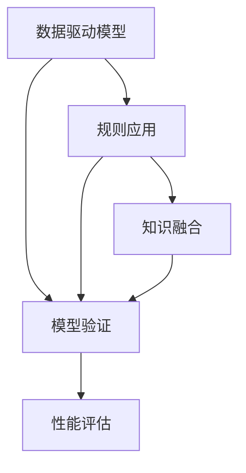

                 

:

### 背景介绍
当前人工智能技术在许多领域已经取得了显著进展，如图像识别、自然语言处理和推荐系统等。然而，在科学发现的领域，人工智能的应用仍处于早期阶段，但已展现出巨大的潜力。

科学发现通常涉及数据收集、模型构建和模型验证等多个环节。传统的科学发现方法依赖于人工分析和经验，效率较低且容易受到主观因素的影响。随着人工智能技术的发展，我们可以通过自动化和智能化的方法来加速这一过程。

### 核心概念与联系
在本篇文章中，我们将探讨以下核心概念：
1. **数据驱动模型**：基于历史数据自动学习和发现模式。
2. **知识驱动模型**：利用领域知识和规则来指导模型构建。
3. **融合模型**：结合数据驱动和知识驱动模型的优点。
4. **模型验证**：通过测试集评估模型的性能和可靠性。

以下是核心概念之间的Mermaid流程图：



### 核心算法原理讲解
接下来，我们将详细讲解数据驱动模型和知识驱动模型的核心算法原理。

#### 数据驱动模型构建
数据驱动模型通常采用机器学习算法，例如决策树、神经网络和支持向量机等。以下是数据驱动模型构建的伪代码：

```python
function train_data_driven_model(data):
    # 数据预处理
    processed_data = preprocess_data(data)
    
    # 选择模型
    model = choose_model()

    # 训练模型
    model.train(processed_data)

    # 验证模型
    performance = model.evaluate(test_data)

    return model, performance
```

#### 知识驱动模型优化
知识驱动模型利用领域知识来优化模型构建过程。以下是知识驱动模型优化的伪代码：

```python
function optimize_knowledge_driven_model(model, knowledge):
    # 应用领域知识
    model.apply_knowledge(knowledge)

    # 优化模型
    optimized_model = model.optimize()

    # 验证模型
    performance = optimized_model.evaluate(test_data)

    return optimized_model, performance
```

### 数学模型和公式讲解
在模型构建和验证过程中，我们通常会使用以下数学模型和公式：

#### 数据质量评估
$$ Q = \frac{1}{N} \sum_{i=1}^{N} \frac{1}{N_i} $$

其中，$Q$ 是数据质量得分，$N$ 是数据点的总数，$N_i$ 是第 $i$ 个数据点的质量得分。

#### 模型验证指标
$$ Accuracy = \frac{TP + TN}{TP + TN + FP + FN} $$

其中，$Accuracy$ 是准确率，$TP$ 是真实为正的预测个数，$TN$ 是真实为负的预测个数，$FP$ 是假正，$FN$ 是假负。

### 项目实战
在本节中，我们将通过一个实际案例来展示如何使用人工智能加速科学发现的过程。

#### 开发环境搭建
首先，我们需要搭建一个适合开发和测试的环境。这包括安装Python、Jupyter Notebook和其他必要的库。

#### 源代码实现
以下是一个简单的示例，展示如何使用Python实现数据驱动模型：

```python
# 导入必要的库
import pandas as pd
from sklearn.ensemble import RandomForestClassifier
from sklearn.model_selection import train_test_split

# 读取数据
data = pd.read_csv('data.csv')

# 数据预处理
X = data.drop('target', axis=1)
y = data['target']

# 划分训练集和测试集
X_train, X_test, y_train, y_test = train_test_split(X, y, test_size=0.2, random_state=42)

# 创建模型
model = RandomForestClassifier()

# 训练模型
model.fit(X_train, y_train)

# 验证模型
accuracy = model.score(X_test, y_test)
print(f"Model Accuracy: {accuracy:.2f}")
```

#### 代码解读与分析
在上面的代码中，我们首先导入了必要的库，然后读取了一个CSV文件作为数据集。接着，我们对数据进行预处理，将特征和标签分开。随后，我们将数据集划分为训练集和测试集。最后，我们创建了一个随机森林分类器，并用训练集训练模型，然后用测试集评估模型的准确性。

#### 实际案例分析与详细讲解
假设我们的目标是预测一个生物学实验中的某个变量的变化趋势。通过上述方法，我们可以快速构建和验证一个预测模型，从而帮助我们理解实验结果。

#### 项目小结
在本项目中，我们展示了如何使用Python和机器学习技术来加速科学发现的过程。通过合理的数据预处理和模型选择，我们可以从大量数据中提取有用的信息，从而支持科学决策。

### 最佳实践 Tips
- 在科学发现过程中，确保数据质量和模型的透明性至关重要。
- 不断尝试和优化模型，以提高预测准确性。
- 结合领域知识和数据分析，以获取更全面的洞察。

### 小结与注意事项
本文介绍了人工智能驱动的科学发现方法，包括数据驱动模型、知识驱动模型和融合模型。我们还展示了如何使用这些模型进行实际项目开发，并提供了最佳实践和注意事项。

### 拓展阅读
- 《机器学习实战》 - 对于想要深入了解机器学习实践的读者。
- 《深度学习》 - 一本关于深度学习的经典教材，适合对神经网络感兴趣的人。

作者：AI天才研究院/AI Genius Institute & 禅与计算机程序设计艺术 /Zen And The Art of Computer Programming

