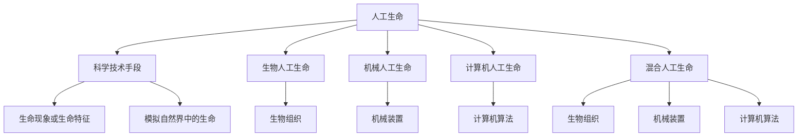

                 

### 1.1 人工生命的定义

#### 人工生命的定义

人工生命，作为一门跨学科的领域，其定义相对宽泛且富有争议。从广义上讲，人工生命指的是通过科学技术手段创造出来的具有某种形式的生命现象或生命特征的实体。这些实体可以是机械装置、生物组织，甚至是计算机算法。它们在某种程度上能够模拟自然界中生命的特征，如自我复制、适应环境、学习进化等。

人工生命的定义可以从以下几个关键点进行阐述：

1. **科学技术手段**：人工生命的创造依赖于现代科学技术的发展，如人工智能、生物工程、纳米技术等。这些技术的进步使得我们有能力模拟和创造具有生命特征的系统。

2. **生命现象或生命特征**：人工生命需要具备某些生命现象或特征，例如自我复制、自我组织、响应环境刺激、进化等。这些特征使得人工生命能够以某种方式与自然界中的生物进行类比。

3. **模拟自然界中的生命**：人工生命的目的是模拟自然界中的生命现象，从而更深入地理解生命本质和生物系统的运作机制。通过人工生命的研究，我们可以探索生命现象的普遍规律，并尝试将这些规律应用于实际问题的解决。

4. **跨学科领域**：人工生命的研究涉及多个学科领域，包括计算机科学、生物学、物理学、哲学、社会学等。这种跨学科的特点使得人工生命的研究具有广泛的应用前景和深刻的理论意义。

#### 人工生命的类型

根据不同的分类标准，人工生命可以划分为多种类型。以下是几种常见的人工生命类型：

1. **生物人工生命**：这种类型的人工生命主要利用生物组织或生物分子来构建具有生命特征的系统。例如，利用细菌或酵母细胞进行生物制造，通过基因编辑技术创造出新的生物物种等。

2. **机械人工生命**：机械人工生命是指通过机械装置模拟生命现象的系统。例如，自主移动的机器人、智能机器手等。这些机械系统虽然不具备生物体的复杂性，但能够在一定程度上模拟生物的行为和功能。

3. **计算机人工生命**：计算机人工生命是通过计算机算法和模型来模拟生命现象的虚拟系统。这种类型的人工生命主要包括人工神经网络、遗传算法、模拟退火算法等。计算机人工生命在人工智能和机器学习领域有着广泛的应用。

4. **混合人工生命**：混合人工生命是指结合生物、机械和计算机技术，创造出具有综合生命特征的系统。例如，利用生物传感器和机械装置构建的智能机器人，通过生物组织与计算机算法协同工作的生物电子系统等。

#### 人工生命的核心概念与联系

为了更好地理解人工生命的定义和类型，我们可以使用 Mermaid 流程图来展示相关概念和架构。以下是一个简单的 Mermaid 流程图，用于描述人工生命的核心概念和它们之间的联系：



通过这个 Mermaid 流程图，我们可以清晰地看到人工生命的定义、类型以及它们之间的相互关系。这种结构化的展示有助于我们更好地理解人工生命的本质和其在不同领域中的应用。

#### 核心算法原理讲解

在人工生命的研究中，算法起着至关重要的作用。以下将使用伪代码详细阐述几种核心算法的原理，这些算法在人工生命模拟和优化中具有广泛应用。

##### 1. 人工神经网络（Artificial Neural Networks, ANN）

人工神经网络是一种模仿生物神经系统的计算模型，用于模拟和优化复杂系统的行为。以下是ANN的基本结构及其训练过程：

```plaintext
// 伪代码：人工神经网络结构
initialize weights and biases
for each epoch do
    for each input pattern do
        forward_pass(inputs)
        calculate_output = activation(sum(Weights * Inputs + Biases))
        compute_error = expected_output - calculate_output
        backward_pass(error)
        update_weights_and_biases(delta_weights, delta_biases)
    end
end

// 伪代码：前向传播
forward_pass(inputs) {
    hidden_layer = []
    for each layer do
        calculate_output = activation(sum(Weights * Inputs + Biases))
        hidden_layer.append(calculate_output)
        Inputs = hidden_layer
    end
    return output_layer
}

// 伪代码：反向传播
backward_pass(error) {
    for each layer in reverse order do
        compute_gradient(Weights, error, Inputs, activation_derivative)
        update_Weights(Weights, learning_rate * gradient)
    end
}
```

##### 2. 遗传算法（Genetic Algorithms, GAs）

遗传算法是一种基于自然选择和遗传学原理的优化算法，适用于搜索和优化复杂函数。以下是GAs的基本流程：

```plaintext
// 伪代码：遗传算法
initialize_population
evaluate_fitness(population)
for each generation do
    select_parents(population)
    crossover(parents)
    mutate(offspring)
    evaluate_fitness(offspring)
    select_survivors(population, offspring)
end

// 伪代码：选择父母
select_parents(population) {
    select parents based on fitness proportionally
}

// 伪代码：交叉
crossover(parents) {
    create offspring by combining features of parents
}

// 伪代码：突变
mutate(offspring) {
    introduce random changes in offspring's features
}
```

##### 3. 模拟退火算法（Simulated Annealing, SA）

模拟退火算法是一种基于固体退火过程的随机搜索算法，用于求解优化问题。以下是SA的基本流程：

```plaintext
// 伪代码：模拟退火算法
initialize_solution
evaluate_initial_fitness
set temperature
while (temperature > threshold) do
    generate_new_solution
    compute_difference = new_solution_fitness - current_solution_fitness
    if (compute_difference > 0) then
        accept_new_solution
    else
        accept_with_probability = exp(-compute_difference / temperature)
        if (random() < accept_with_probability) then
            accept_new_solution
        end
    end
    update_temperature
end
```

通过以上伪代码，我们可以看到人工生命研究中常用的核心算法原理。这些算法在模拟、优化和进化复杂系统时发挥着重要作用，为人工生命的研究提供了强大的工具。

### 1.2 人工生命的历史与现状

#### 人工生命的研究历程

人工生命的研究可以追溯到20世纪中期，当时科学家们开始尝试通过机械装置和计算机算法来模拟生命现象。以下是一些重要的事件和里程碑，展示了人工生命研究的发展历程：

1. **1950年代**：计算机科学的发展为人工生命的研究奠定了基础。艾伦·图灵（Alan Turing）提出的“图灵测试”成为衡量机器智能的重要标准。

2. **1960年代**：约翰·冯·诺依曼（John von Neumann）提出了“自我复制机器”的理论，为人工生命的研究提供了新的思路。

3. **1970年代**：人工生命研究进入了生物模拟和人工智能领域。约翰·霍兰（John H. Holland）提出的遗传算法和“蚁群算法”成为人工生命研究中的重要工具。

4. **1980年代**：人工生命研究在机器人学和计算机仿真领域取得了显著进展。美国麻省理工学院（MIT）的“仿生学实验室”（Robotics Laboratory）开展了大量关于自主机器人系统的研究。

5. **1990年代**：随着互联网和计算机技术的普及，人工生命研究进入了新的阶段。虚拟现实和增强现实技术的发展为人工生命的研究提供了新的平台。

6. **21世纪初**：人工生命研究在生物医学、环境科学、农业等领域取得了重要应用。基因编辑技术和合成生物学的兴起进一步推动了人工生命的研究。

#### 当前的人工生命技术现状分析

当前，人工生命技术已经取得了显著进展，并广泛应用于多个领域。以下是几个关键领域的人工生命技术现状分析：

1. **生物人工生命**：
   - **基因编辑技术**：如CRISPR-Cas9等基因编辑工具，使得科学家能够精确地修改生物体的基因序列，创造出具有特定功能的新生物。
   - **生物制造**：利用生物分子和细胞构建具有特定功能的生物系统，如人工合成细菌、人工合成病毒等。

2. **机械人工生命**：
   - **自主机器人**：自主机器人能够在复杂的动态环境中执行复杂的任务，如搜索与救援、环境监测等。
   - **智能机器手**：通过人工智能和机器人技术的结合，智能机器手能够模拟人类手部动作，进行精细操作。

3. **计算机人工生命**：
   - **人工神经网络**：通过深度学习技术，人工神经网络在图像识别、自然语言处理、游戏对战等领域表现出色。
   - **遗传算法**：在优化问题和复杂搜索领域，遗传算法被广泛应用于设计优化、资源调度等问题。

4. **混合人工生命**：
   - **生物电子系统**：通过生物传感器和电子设备的结合，创造出能够与生物体交互的智能系统，如生物医学传感器、人工视网膜等。
   - **合成生物系统**：通过计算机编程和基因编辑技术，构建出具有特定功能的生物系统，如人工合成酵母、人工合成细胞等。

#### 人工生命领域的创新与应用

在人工智能和生物技术的推动下，人工生命领域不断涌现出新的创新和应用。以下是几个值得关注的创新与应用：

1. **医学领域**：
   - **个性化治疗**：通过基因编辑技术和人工智能，为患者定制个性化的治疗方案，提高治疗效果。
   - **生物机器**：利用生物传感器和机器手，为残疾人提供新的辅助工具，改善生活质量。

2. **环境科学领域**：
   - **环境监测**：通过自主机器人和智能传感器，实时监测环境中的污染物，为环境保护提供数据支持。
   - **生物修复**：利用生物技术，开发出能够降解污染物的生物系统，用于污染修复和环境治理。

3. **农业领域**：
   - **智能农业**：通过物联网、人工智能和机器人技术，实现农作物的精准管理，提高农业生产效率。
   - **合成生物**：通过基因编辑和合成生物学技术，创造出具有特定功能的新型农作物，提高作物产量和抗病性。

总之，人工生命的研究已经取得了显著进展，并不断拓展其应用领域。随着技术的不断进步，人工生命将继续为人类带来更多的创新和变革。

### 人工生命与哲学

#### 人工生命对哲学思考的挑战

人工生命的研究不仅带来了科学技术上的突破，也挑战了哲学思考的诸多方面。首先，人工生命引发了关于生命本质的讨论。传统的哲学观点认为生命是自然的产物，具有自主性和意识。然而，人工生命通过科技手段创造出具备某些生命特征的实体，使得我们对生命的定义和界限产生了疑惑。人工生命是否具有生命本质？它们与自然生命有何区别？

其次，人工生命的出现也挑战了自由意志和意识的定义。传统上，人类认为意识是人类独有的特质，是自由意志的体现。然而，随着人工智能和生物技术的进步，人工生命是否也可能拥有意识，甚至拥有与人类相似的自由意志？这个问题引发了关于人工智能伦理和人类身份的深刻思考。

此外，人工生命的伦理问题也成为了哲学讨论的焦点。随着人工生命的不断发展和应用，我们如何确保其在伦理上可行？例如，基因编辑技术的应用可能会导致基因歧视和伦理争议。此外，人工生命在医疗、军事等领域的应用也带来了道德和法律的挑战。如何在科技进步和伦理道德之间找到平衡，成为了一个亟待解决的重要问题。

#### 人工生命与哲学问题的探讨

针对人工生命带来的哲学问题，哲学家们进行了深入的探讨。以下是一些主要的哲学观点和讨论：

1. **生命本质的讨论**：
   - **功能主义**：功能主义者认为，生命的本质在于系统的功能，而非其物质构成。人工生命尽管是通过科技手段创造的，但只要其具有类似生物的功能，就可以视为生命。
   - **自然主义**：自然主义者强调生命的自然属性，认为人工生命无法替代自然生命。他们认为，生命的本质在于自然演化的结果，而非人工干预。

2. **意识与自由意志的讨论**：
   - **物理主义**：物理主义者认为，意识是大脑物理过程的产物，人工智能也可以通过模拟这些过程来实现意识。因此，人工生命可能拥有意识，但不同于人类的意识。
   - **非物理主义**：非物理主义者认为，意识具有非物理的属性，无法完全用物理过程解释。因此，即使人工生命在技术上模拟了人类大脑，也无法真正拥有意识。

3. **伦理问题的讨论**：
   - **功利主义**：功利主义者主张，人工生命的伦理评价应基于其对社会福利的贡献。只要人工生命能够带来更大的社会福利，就可以接受其存在和应用。
   - **康德伦理学**：康德伦理学强调道德原则的普遍性和义务性。在处理人工生命伦理问题时，应遵循普遍的道德原则，如尊重个体权利和自主性。

通过这些哲学讨论，我们可以看到，人工生命不仅带来了科学技术上的挑战，也激发了哲学思考的活力。随着人工生命技术的不断发展，哲学将继续在这些问题上提供深刻的见解和指导。

#### 人工生命与哲学思考的互动

人工生命与哲学思考的互动是一个双向的过程，彼此相互影响、相互促进。首先，人工生命研究为哲学思考提供了新的素材和问题。随着人工生命的不断发展，我们不得不重新审视生命的本质、意识的定义以及伦理的边界。这些新的问题促使哲学家们进行深入探讨，提出新的理论观点。

另一方面，哲学思考为人工生命研究提供了伦理和价值的指导。在人工生命的发展过程中，伦理问题和技术风险成为不可忽视的挑战。哲学家们通过对自由意志、意识、生命本质等哲学问题的探讨，为人工生命的研究提供了道德框架和伦理准则。这些框架和准则帮助科学家在探索人工生命的同时，能够更好地平衡科技进步与伦理责任。

此外，哲学思考还可以为人工生命的技术发展提供新的方向。例如，在人工智能领域，哲学中的决策伦理和公平性问题成为了研究的重点。通过借鉴哲学中的伦理理论和价值观念，科学家可以设计出更加公正、透明的人工智能系统，从而更好地服务于社会。

总之，人工生命与哲学思考的互动不仅丰富了哲学研究的领域，也推动了人工生命技术的健康发展。通过这种互动，我们可以期待在未来的科技发展中，实现更加人性化和可持续的人工生命应用。

### 人工生命与科学

#### 人工生命在科学研究中的应用

人工生命作为一门跨学科领域，在科学研究中的应用日益广泛，为许多传统科学研究方法提供了新的工具和思路。以下从多个方面探讨人工生命在科学研究中的应用：

1. **生物学研究**：

人工生命在生物学研究中发挥了重要作用，特别是在理解生命现象和生物系统运作机制方面。例如，通过模拟生物神经网络，科学家能够揭示大脑信息处理和认知功能的奥秘。人工生命技术还被广泛应用于基因组学研究，通过基因编辑和合成生物学技术，科学家能够更精确地理解基因功能和基因相互作用。

2. **医学研究**：

在医学领域，人工生命技术为疾病研究和治疗提供了新的方法。基因编辑技术如CRISPR-Cas9使得科学家能够精确修改基因序列，从而研究特定基因对疾病的影响。此外，人工生命技术还被应用于药物设计和疾病模型构建。通过模拟生物体内的药物作用和疾病发展过程，科学家可以更快速地筛选和优化药物，加速新药的研发。

3. **环境科学**：

在环境科学中，人工生命技术有助于监测和修复环境污染。例如，利用人工生命技术开发的智能传感器能够实时监测水质、空气质量等环境指标，为环境保护提供数据支持。此外，人工生命技术还被应用于生物修复，通过利用特定的微生物或生物制剂，能够有效降解污染物，恢复生态系统的健康。

4. **物理学研究**：

人工生命技术也为物理学研究提供了新的视角和方法。例如，通过模拟复杂系统的动态行为，科学家能够更深入地理解物理现象的本质。在量子计算和量子信息领域，人工生命技术被用来模拟量子系统和量子算法，为量子技术的发展提供了新的思路。

5. **计算机科学**：

在计算机科学领域，人工生命技术被广泛应用于算法优化和复杂系统建模。遗传算法和模拟退火算法等人工生命算法在优化问题和复杂搜索中表现出色，被广泛应用于设计优化、资源调度等问题。此外，人工神经网络和深度学习技术也为计算机视觉、自然语言处理等领域提供了强大的工具。

#### 人工生命对科学发展的贡献

人工生命的研究不仅为科学研究提供了新的工具和方法，也对科学发展的多个方面产生了深远的影响：

1. **推动学科交叉**：

人工生命研究融合了生物学、计算机科学、物理学、化学等多个学科的知识，促进了学科之间的交叉和融合。通过跨学科的合作，科学家能够从不同角度探讨复杂问题，推动科学研究的深入发展。

2. **提升研究效率**：

人工生命技术通过模拟和仿真，能够在虚拟环境中进行实验和研究，大幅提高了研究效率。例如，在药物研发过程中，通过计算机模拟和人工生命技术，科学家可以在虚拟环境中快速筛选和优化药物分子，缩短研发周期。

3. **拓展研究范围**：

人工生命技术使得科学家能够在微观和宏观层面更深入地探索生命现象和物理现象。例如，通过基因编辑和合成生物学技术，科学家能够在分子水平上操作基因，从而揭示生命现象的微观机制。

4. **促进技术创新**：

人工生命研究催生了众多技术创新，如基因编辑技术、智能传感器、人工神经网络等。这些技术创新不仅推动了科学研究的发展，也广泛应用于医疗、环境、农业等多个领域，为人类社会的进步做出了重要贡献。

总之，人工生命的研究为科学发展带来了新的机遇和挑战。通过不断探索和创新，人工生命将继续为科学研究和技术发展提供强大的动力。

### 人工生命与伦理

#### 人工生命带来的伦理问题

随着人工生命的不断发展，其在伦理领域引发了诸多争议和讨论。以下从多个方面探讨人工生命带来的伦理问题：

1. **基因编辑和生物伦理**：

基因编辑技术的兴起，如CRISPR-Cas9，使得科学家能够精确修改生物体的基因序列。这一技术不仅为医学领域带来了希望，如治疗遗传疾病和癌症，但也引发了关于基因编辑伦理的讨论。例如，基因编辑可能导致基因歧视和社会不公，因为某些基因编辑技术可能被用于增强人类的某些特质，从而加剧社会分层和不平等。此外，基因编辑还可能对生物多样性和生态系统产生不可预见的影响。

2. **人工智能与自主性**：

人工智能（AI）在人工生命中的应用，使得机器人、自主车辆和智能系统变得更加普及。然而，这些系统的自主性引发了关于责任和道德决策的伦理问题。例如，当AI系统发生故障或做出有害决策时，责任应由谁承担？如何确保AI系统在伦理上可行，不会对人类造成伤害？这些问题需要我们制定相应的伦理准则和法律框架。

3. **动物实验与替代方案**：

人工生命研究往往需要动物实验，这引发了关于动物权利的伦理争议。随着人工生命技术的发展，是否可以开发出替代动物实验的方法，如利用计算机模拟和人工生命模型进行实验？这个问题涉及到对动物权利的尊重和科学研究的伦理边界。

4. **人工智能与隐私**：

随着人工智能技术的发展，数据隐私问题变得越来越重要。例如，智能监控系统可能会收集和分析大量个人数据，这涉及到个人隐私和信息安全。如何在保障数据隐私的前提下，利用人工智能技术提高社会效益，是一个亟待解决的伦理问题。

5. **生物伦理与人类身份**：

人工生命的出现，尤其是具有高度智能的人工智能系统，挑战了我们对人类身份的理解。例如，如果人工智能系统拥有高度智能和自主性，它们是否可以被视为“生命”？这将如何影响我们对人类价值和权利的界定？这些问题需要我们从哲学和伦理角度进行深入探讨。

#### 人工生命伦理的探讨

针对人工生命带来的伦理问题，哲学家和伦理学家进行了深入的探讨，提出了多种伦理观点和理论框架。以下是一些主要的伦理观点和讨论：

1. **功利主义**：

功利主义者主张，人工生命的伦理评价应基于其对社会福利的贡献。只要人工生命能够带来更大的社会福利，如提高医疗水平、保护环境等，就可以接受其存在和应用。然而，这种观点也可能导致对弱势群体的忽视和社会不公。

2. **康德伦理学**：

康德伦理学强调道德原则的普遍性和义务性。在处理人工生命伦理问题时，应遵循普遍的道德原则，如尊重个体权利和自主性。例如，在基因编辑中，应确保个体的知情权和自主权，避免因基因编辑导致的不公平和社会分层。

3. **德性伦理学**：

德性伦理学强调个人的道德品质和美德。在人工生命伦理中，应培养科学家和工程师的道德品质，如责任感、诚实和公正。这有助于他们在研发和应用人工生命技术时，遵循伦理规范，避免滥用技术。

4. **技术伦理学**：

技术伦理学关注技术本身及其应用中的伦理问题。在人工生命领域，技术伦理学家提出了多种伦理准则，如技术中立性、透明性和可解释性。这些准则旨在确保人工生命技术的研发和应用符合伦理要求，不会对人类和社会造成负面影响。

5. **多元文化伦理学**：

多元文化伦理学强调文化多样性和文化相对主义。在处理人工生命伦理问题时，应尊重不同文化和社会的传统价值观，避免因文化差异导致的冲突和误解。

通过这些伦理观点的探讨，我们可以看到，人工生命伦理问题是一个复杂且多维的领域。解决这些问题需要跨学科合作，制定出全面、可行的伦理框架和规范，以确保人工生命技术的健康发展和社会福祉。

### 人工生命伦理的挑战与应对

随着人工生命的不断发展，其在伦理领域的挑战也越来越突出。以下从几个方面探讨这些挑战，并提出可能的应对策略。

#### 1. 道德责任归属

人工生命系统，尤其是具有高度智能的机器人，其行为可能对人类和环境产生重大影响。然而，当这些系统出现故障或做出有害决策时，责任应由谁承担？传统的责任归属原则在面对复杂的人工生命系统时显得力不从心。应对这一挑战，需要建立明确的道德责任框架，将责任明确地归属到具体的人或机构。

**应对策略**：

- **责任分配协议**：在研发和应用人工生命系统时，应制定详细的协议，明确责任归属，确保在发生事故时能够快速找到责任人。
- **法律法规**：制定相关法律法规，为人工生命系统的责任归属提供法律依据。例如，美国加州已经通过法律，要求无人驾驶汽车制造商承担交通事故的责任。

#### 2. 道德冲突与平衡

人工生命技术在不同领域中的应用可能会产生不同的伦理冲突。例如，在医学领域，基因编辑技术可能用于治疗遗传疾病，但也可能被用于增强人类的某些特质。这种情况下，如何平衡医疗利益和伦理原则成为一大挑战。

**应对策略**：

- **伦理委员会**：建立专门的伦理委员会，对人工生命技术的应用进行审查和监督，确保其符合伦理要求。
- **多元视角**：在决策过程中，应邀请不同领域的专家和公众代表参与讨论，以多元视角平衡不同利益。

#### 3. 道德风险与社会影响

人工生命技术的发展可能带来一系列道德风险和社会影响。例如，基因编辑技术可能导致基因歧视和社会不公，人工智能系统可能侵犯个人隐私。这些风险需要我们提前识别和预防。

**应对策略**：

- **风险评估**：在研发和应用人工生命技术时，应进行全面的道德风险评估，识别潜在的风险和影响。
- **公众参与**：增强公众对人工生命技术的认知和参与，通过公众监督和反馈，确保技术的健康发展。

#### 4. 国际合作与协调

人工生命技术具有全球性特点，不同国家在伦理规范和法律法规上可能存在差异。这种差异可能导致国际技术竞争和伦理冲突。

**应对策略**：

- **国际公约**：制定国际公约，统一全球人工生命技术的伦理规范和法律框架。
- **跨国合作**：加强国际间的合作与交流，共同研究解决人工生命技术带来的伦理问题。

总之，面对人工生命伦理的挑战，需要我们采取综合性的策略，通过法律、道德和社会等多方面的努力，确保技术的健康发展，最大限度地减少负面影响。

### 人工生命的未来

#### 人工生命的发展趋势

人工生命作为一门前沿领域，正随着科技的进步迅速发展。未来，人工生命的发展将呈现出以下几个主要趋势：

1. **智能化与自主化**：

随着人工智能技术的不断提升，人工生命的智能化和自主化水平将进一步提高。未来的智能机器人将具备更加复杂的行为模式和自我学习能力，能够更好地适应环境和执行复杂任务。例如，智能机器人将被广泛应用于医疗、农业、建筑、军事等领域，实现更高效、精准的操作。

2. **生物工程与合成生物学**：

生物工程和合成生物学的发展将极大地推动人工生命的研究和应用。通过基因编辑、基因合成等手段，科学家将能够创造出具有特定功能的新型生物体，如合成细菌、基因改造的作物等。这些新型生物体将在医疗、能源、环境等领域发挥重要作用。

3. **神经科学和脑机接口**：

神经科学和脑机接口技术的进步将为人工生命的研究带来新的突破。通过研究大脑的结构和功能，科学家将更好地理解意识、感知和决策等复杂过程。脑机接口技术将实现人类与机器的深度融合，使得人类能够通过思维控制智能机器人，从而拓展人类的能力和感知范围。

4. **量子计算与量子人工生命**：

量子计算技术的快速发展将为人工生命研究提供新的工具和方法。量子人工生命将利用量子计算的优势，模拟和优化复杂生物系统，从而揭示生命现象的深层规律。例如，量子算法将被用于优化基因编辑和药物设计，加速人工生命的研究和应用。

#### 人工生命可能的影响

人工生命的未来发展和应用将对社会、经济、伦理等多个方面产生深远影响：

1. **社会影响**：

人工生命的智能化和自主化将改变人类社会的工作和生活方式。智能机器人将承担更多的劳动任务，提高生产效率，但也可能导致部分劳动力失业。此外，人工生命的发展将推动社会向更加智能化和自动化的方向发展，带来一系列社会变革。

2. **经济影响**：

人工生命技术的应用将催生出新的产业和市场。生物工程、基因编辑、人工智能等领域将成为未来经济增长的重要驱动力。同时，人工生命技术还将提高农业、医疗、环保等领域的生产效率，降低成本，提升经济效益。

3. **伦理影响**：

人工生命的伦理问题将日益突出。如何确保人工生命的伦理可接受性，如何处理人工智能和生物技术的风险，将成为社会和科学界面临的重要挑战。此外，人工生命的发展可能引发新的道德和法律问题，需要我们制定相应的伦理规范和法律框架。

4. **环境和生态影响**：

人工生命的生物工程和基因改造技术可能对生态系统产生不可预见的影响。例如，合成生物学技术可能创造出新的生物物种，改变生态系统的结构和功能。因此，在推动人工生命技术发展的同时，需要加强环境评估和生态保护，确保技术的可持续发展。

#### 人工生命的未来展望

展望未来，人工生命研究将继续在多个领域取得突破，为人类社会带来前所未有的机遇和挑战。以下是对人工生命未来发展的几点展望：

1. **技术创新**：

未来的人工生命技术将更加智能化、自主化和多功能化。通过不断突破技术瓶颈，我们将能够创造出更加复杂和高效的人工生命系统，满足社会和经济的多样化需求。

2. **伦理与法律框架**：

随着人工生命技术的不断发展，我们需要建立更加完善和有效的伦理和法律框架，确保技术的健康发展和社会福祉。这包括制定详细的伦理准则、法律法规和技术标准，以规范人工生命技术的研发和应用。

3. **跨学科合作**：

人工生命研究需要跨学科的合作与交流，结合生物学、计算机科学、物理学、哲学等多个领域的知识和方法，共同解决人工生命技术面临的复杂问题。

4. **社会参与和监督**：

公众对人工生命技术的认知和参与将越来越重要。通过增强公众监督和反馈，我们可以确保人工生命技术的研发和应用符合社会的需求和价值观。

总之，人工生命的未来充满希望和挑战。通过技术创新、伦理规范和社会参与，我们有理由相信，人工生命研究将为人类社会带来更加美好和可持续的未来。

### 结论

通过本文的探讨，我们可以看到，人工生命研究不仅为科学研究和技术发展提供了新的工具和方法，也深刻地影响了我们的哲学思考和社会观念。以下是对全文的总结和对未来研究的展望：

**核心内容和主题思想**：

本文首先介绍了人工生命的定义和类型，从机械人工生命、生物人工生命到计算机人工生命，展示了人工生命在不同领域的应用和影响。随后，我们探讨了人工生命与哲学、科学、伦理等多个领域的互动，分析了人工生命对世界可理解性的新视角。此外，我们还讨论了人工生命的未来发展趋势和可能带来的影响。

**对人工生命研究的展望**：

1. **技术创新**：随着人工智能、生物工程等技术的不断进步，未来的人工生命将更加智能化、自主化和多功能化。我们需要持续关注技术创新，推动人工生命研究的发展。

2. **伦理规范**：人工生命研究涉及的伦理问题日益突出，需要建立更加完善和有效的伦理规范和法律法规。这不仅包括基因编辑、人工智能等技术的伦理问题，还涉及到社会、环境和经济等多个方面。

3. **跨学科合作**：人工生命研究需要跨学科的合作与交流，结合生物学、计算机科学、物理学、哲学等多个领域的知识和方法，共同解决人工生命技术面临的复杂问题。

4. **社会参与**：公众对人工生命技术的认知和参与将越来越重要。通过增强公众监督和反馈，我们可以确保人工生命技术的研发和应用符合社会的需求和价值观。

**最佳实践 tips**：

1. **安全性和可靠性**：在研发和应用人工生命技术时，应高度重视安全性和可靠性，确保技术的稳定性和可控性。

2. **透明度和可解释性**：人工生命技术的研发和应用应保持透明度，公开实验结果和决策过程，提高技术的可解释性，增强公众的信任。

3. **多元视角**：在处理人工生命伦理问题时，应邀请不同领域的专家和公众代表参与讨论，以多元视角平衡不同利益。

**注意事项**：

1. **风险评估**：在人工生命技术的研发和应用过程中，应进行全面的风险评估，识别潜在的风险和影响，制定相应的风险防控措施。

2. **国际合作**：人工生命技术具有全球性特点，需要加强国际合作，共同研究解决技术带来的伦理、法律和环境影响。

**拓展阅读**：

- 《人工生命：科幻与现实》
- 《基因编辑技术：伦理与法律》
- 《智能机器人：技术与应用》
- 《合成生物学：创造生命的新纪元》

通过本文的探讨，我们期待能够为人工生命研究提供新的思路和启示，推动其在科学、技术和伦理领域的全面发展。

### 作者信息

作者：AI天才研究院/AI Genius Institute & 禅与计算机程序设计艺术 /Zen And The Art of Computer Programming

---

文章标题：人工生命研究对世界可理解性的新视角

关键词：人工生命，哲学，科学，伦理，未来趋势，技术发展

摘要：本文从多个角度探讨了人工生命的研究现状、哲学思考、科学与应用以及伦理问题，分析了人工生命对世界可理解性的新视角。通过介绍人工生命的定义、历史与现状，我们探讨了其在生物学、医学、环境科学等领域的应用和贡献。同时，本文还讨论了人工生命带来的伦理挑战以及未来的发展趋势。我们期待通过本文的探讨，为人工生命研究提供新的思路和启示，推动其在科学、技术和伦理领域的全面发展。文章关键词：人工生命，哲学，科学，伦理，未来趋势，技术发展。

