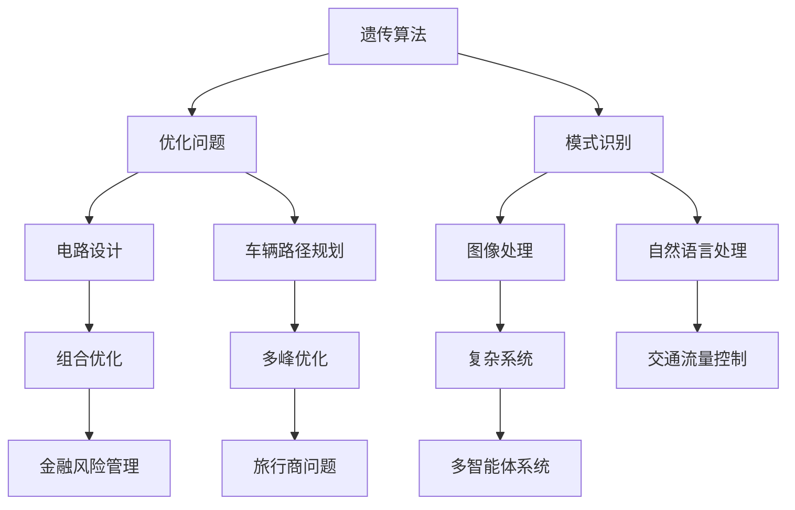

                 


### 文章标题：人工生命研究：模拟创造中理解生命与世界

关键词：人工生命，模拟创造，生物医学，环境能源，人工智能，未来展望

摘要：本文探讨了人工生命的概念、历史、技术基础及其在多个领域的应用。通过逐步分析，揭示了人工生命研究的关键概念、原理及其在生物医学、环境能源和人工智能等领域的重要作用。文章还展望了人工生命的未来发展趋势，提出了伦理、法律与社会问题的挑战与应对策略。

---

### 《人工生命研究：模拟创造中理解生命与世界》目录大纲

#### 第一部分：人工生命的概念与历史

##### 1.1 人工生命的定义与起源
###### 1.1.1 人工生命的定义
###### 1.1.2 人工生命的起源与发展
###### 1.1.3 人工生命的分类

##### 1.2 人工生命的历史与趋势
###### 1.2.1 人工生命的研究阶段
###### 1.2.2 人工生命的研究热点与趋势
###### 1.2.3 人工生命研究的重要事件

##### 1.3 人工生命与社会、伦理问题
###### 1.3.1 人工生命对社会的影响
###### 1.3.2 人工生命的伦理问题
###### 1.3.3 人工生命研究的监管与规范

#### 第二部分：人工生命的技术基础

##### 2.1 计算机模拟与仿真
###### 2.1.1 计算机模拟的基本概念
###### 2.1.2 仿真技术的原理与应用
###### 2.1.3 常见的计算机模拟软件

##### 2.2 人工生命算法
###### 2.2.1 人工生命算法的基本概念
###### 2.2.2 常见的算法及其应用场景
###### 2.2.3 人工生命算法的比较与分析

##### 2.3 人工智能与机器学习
###### 2.3.1 人工智能的基本概念
###### 2.3.2 机器学习的基本原理
###### 2.3.3 机器学习在人工生命研究中的应用

#### 第三部分：人工生命的具体应用

##### 3.1 人工生命的生物医学应用
###### 3.1.1 人工生命在药物研发中的应用
###### 3.1.2 人工生命在疾病诊断中的应用
###### 3.1.3 人工生命在生物工程中的应用

##### 3.2 人工生命的环境与能源应用
###### 3.2.1 人工生命在环境保护中的应用
###### 3.2.2 人工生命在能源开发中的应用
###### 3.2.3 人工生命在生态平衡中的应用

##### 3.3 人工生命在人工智能领域中的应用
###### 3.3.1 人工生命在智能机器人中的应用
###### 3.3.2 人工生命在虚拟现实中的应用
###### 3.3.3 人工生命在自然语言处理中的应用

#### 第四部分：人工生命的未来展望

##### 4.1 人工生命的未来发展前景
###### 4.1.1 人工生命的技术创新趋势
###### 4.1.2 人工生命对社会的影响
###### 4.1.3 人工生命的未来挑战与机遇

##### 4.2 人工生命研究的国际合作与交流
###### 4.2.1 国际人工生命研究现状
###### 4.2.2 国际人工生命研究合作案例
###### 4.2.3 我国在人工生命研究中的地位与作用

##### 4.3 人工生命的伦理、法律与社会问题
###### 4.3.1 人工生命的伦理问题
###### 4.3.2 人工生命的法律法规
###### 4.3.3 人工生命研究的社会影响

#### 附录

##### 附录 A：人工生命研究工具与资源
###### A.1 常用的人工生命研究工具
###### A.2 人工生命研究的重要文献与资料
###### A.3 人工生命研究的重要网站与社区

---

### 目录大纲总结

本目录大纲旨在提供一个全面、系统的框架，以探讨人工生命的概念、历史、技术基础、应用领域及其未来展望。通过逐步分析，文章将深入讨论人工生命的核心概念、原理和应用，同时关注其在社会、伦理和法律等方面的问题。附录部分将提供相关的工具与资源，以方便读者进一步研究和学习。

---

接下来，我们将逐步深入探讨每个部分的内容，以构建一篇结构严谨、内容丰富的专业技术博客文章。让我们开始第一步：分析第一部分——人工生命的概念与历史。我们将首先介绍人工生命的定义与起源，然后探讨其历史与趋势，最后讨论人工生命与社会、伦理问题。在这个过程中，我们将使用Mermaid流程图来展示核心概念之间的关系架构，并使用伪代码、数学模型和公式来解释核心算法原理。通过这样的分析推理，我们将为后续章节的深入探讨奠定坚实的基础。## 第一部分：人工生命的概念与历史

### 1.1 人工生命的定义与起源

#### 1.1.1 人工生命的定义

人工生命（Artificial Life），简称AL，是指通过计算机模拟、算法设计或其他技术手段，模拟或创造出来的具有生命特征的实体。这些实体可能具备生物学上的某些特征，如自我复制、进化、适应环境等，但其存在和活动依赖于人工系统。人工生命的定义可以从广义和狭义两个层面理解。

- **广义定义**：人工生命不仅包括生物体在计算机模拟中的表现，还包括那些能够展示生命特征的非生物实体，例如自组织系统、复杂自适应系统等。

- **狭义定义**：人工生命主要指通过计算机模拟或生物技术手段创造的具有生物学特征的实体，如人工细胞、人工生态系统等。

人工生命的定义不仅仅局限于生物学上的生命特征，还包括技术、哲学和伦理等多方面的探讨。这使得人工生命研究成为一个跨学科、跨领域的复杂课题。

#### 1.1.2 人工生命的起源与发展

人工生命的概念起源于20世纪80年代，由计算机科学家、生物学家和哲学家共同推动。这个时期，计算机技术的发展为人工生命的研究提供了强大的工具和平台。

- **1981年**：人工生命领域的重要里程碑是《人工生命》一书的出版，作者克里斯·朗顿（Christopher Langton）提出了人工生命的概念，并将其分为四个主要领域：人工细胞、人工进化、人工神经网络和人工免疫系统。

- **1990年代**：随着计算机技术的进一步发展，人工生命研究得到了广泛重视。计算机模拟和算法设计成为人工生命研究的重要手段。人工生命的研究开始从理论研究转向实际应用，如生物医学、环境科学和人工智能等领域。

- **21世纪初**：随着人工智能和机器学习的迅速发展，人工生命研究进入了一个新的阶段。智能算法和深度学习技术被广泛应用于人工生命的研究，使得人工生命系统的复杂性和适应性得到了显著提升。

#### 1.1.3 人工生命的分类

人工生命可以根据其模拟或创造的实体类型、研究方法和技术手段进行分类。以下是几种常见的人工生命分类：

- **人工细胞**：通过计算机模拟或生物技术手段创造的具有细胞结构和功能的实体。人工细胞的研究主要包括细胞膜模拟、细胞内代谢过程模拟等。

- **人工生态系统**：模拟现实世界中生态系统的结构和功能，研究生态平衡、物种进化等生态问题。人工生态系统通常包括多种生物体和它们之间的相互作用。

- **人工进化**：通过计算机模拟和算法设计，模拟生物进化过程，研究进化机制和适应策略。人工进化广泛应用于生物医学、环境保护等领域。

- **人工神经网络**：基于生物神经系统的原理，通过计算机模拟实现的神经网络模型。人工神经网络在人工智能、自然语言处理、计算机视觉等领域有广泛的应用。

- **人工免疫系统**：模拟生物免疫系统的功能，研究免疫反应和免疫疾病。人工免疫系统在疾病诊断、疫苗研发等领域具有重要应用。

通过这些分类，我们可以更好地理解人工生命的研究内容和应用领域。在接下来的部分中，我们将进一步探讨人工生命的历史与趋势，以及与社会、伦理问题的关系。这将为后续章节的技术基础和应用分析奠定基础。

### 1.2 人工生命的历史与趋势

#### 1.2.1 人工生命的研究阶段

人工生命的研究可以分为以下几个阶段：

- **探索阶段（1980年代初）**：人工生命的概念被提出，研究者开始探索如何通过计算机模拟和算法设计来模拟生命现象。这一阶段的主要成果包括人工细胞和人工进化等基础研究。

- **发展阶段（1990年代）**：随着计算机技术的进步，人工生命研究进入快速发展阶段。研究者开始构建复杂的人工生态系统和人工神经网络模型，并探索它们在不同领域的应用。

- **成熟阶段（21世纪初至今）**：随着人工智能和机器学习的兴起，人工生命研究取得了重大突破。智能算法和深度学习技术被广泛应用于人工生命的研究，使得人工生命系统的复杂性和适应性得到了显著提升。

#### 1.2.2 人工生命的研究热点与趋势

当前，人工生命的研究热点主要集中在以下几个方面：

- **智能算法在人工生命研究中的应用**：智能算法，如遗传算法、模拟退火算法和神经网络，在人工生命研究中发挥着重要作用。这些算法能够模拟生物进化、学习复杂模式，为人工生命的研究提供了强大的工具。

- **人工生命在生物医学中的应用**：人工生命技术在药物研发、疾病诊断和生物工程等领域有广泛的应用。例如，通过模拟生物体内的复杂过程，可以加速药物研发和疾病治疗。

- **人工生命在环境与能源中的应用**：人工生命技术在环境保护、能源开发和生态平衡等领域也发挥着重要作用。通过模拟生态系统和生物过程，可以优化环境管理和能源利用。

- **人工生命与人工智能的融合**：人工智能技术的进步为人工生命研究带来了新的机遇。通过将人工生命技术应用于智能机器人、虚拟现实和自然语言处理等领域，可以进一步提升人工智能的智能水平和应用范围。

#### 1.2.3 人工生命研究的重要事件

人工生命研究的重要事件标志着该领域的发展进程和技术突破。以下是几个关键事件：

- **1981年**：克里斯·朗顿（Christopher Langton）出版《人工生命》一书，系统阐述了人工生命的概念和领域。

- **1994年**：人工生命研究的第一届国际会议召开，标志着人工生命作为一个独立研究领域的正式确立。

- **2006年**：深度学习算法取得重大突破，为人工生命研究提供了新的技术手段。

- **2012年**：人工智能公司DeepMind成立，通过深度学习技术实现了一款名为AlphaGo的围棋程序，击败了世界围棋冠军李世石，标志着人工智能和人工生命研究的重大进展。

#### 1.2.4 人工生命研究的未来趋势

未来，人工生命研究将呈现出以下趋势：

- **技术融合**：随着人工智能、生物技术和材料科学的进步，人工生命技术将与其他领域更紧密地融合，产生更多创新成果。

- **跨学科研究**：人工生命研究将涉及生物学、计算机科学、物理学、哲学等多个学科，形成更加跨学科的研究团队。

- **应用拓展**：人工生命技术将在生物医学、环境科学、能源开发等领域得到更广泛的应用，为社会发展和人类福祉作出更大贡献。

- **伦理和法律问题**：随着人工生命技术的不断进步，伦理和法律问题将更加突出。如何在技术创新的同时确保伦理和法律的合理适用，将成为人工生命研究的重要挑战。

通过回顾人工生命的历史与趋势，我们可以更好地理解这一领域的发展脉络和未来方向。在下一部分中，我们将探讨人工生命与社会、伦理问题，进一步探讨人工生命研究的意义和影响。

### 1.3 人工生命与社会、伦理问题

#### 1.3.1 人工生命对社会的影响

人工生命技术的发展对社会产生了深远的影响。首先，在生物医学领域，人工生命技术为药物研发、疾病诊断和治疗提供了新的工具和方法。例如，通过模拟生物体内的复杂过程，可以加速药物的研发进程，提高治疗效果。此外，人工生命技术在生物工程领域也取得了显著成果，如基因编辑技术CRISPR的应用，为治疗遗传病和癌症提供了新的可能性。

在环境与能源领域，人工生命技术同样发挥着重要作用。通过模拟生态系统和生物过程，可以优化环境管理和能源利用。例如，人工生态系统研究有助于理解生态平衡和物种进化，为环境保护提供科学依据。同时，人工生命技术在能源开发中的应用，如生物燃料的研发，为可持续发展提供了新的途径。

人工智能与人工生命的融合进一步拓展了其应用范围。智能机器人和虚拟现实技术的应用，使得人工生命技术在社会各个领域得到更加广泛的应用。例如，在智能机器人领域，人工生命技术可以提升机器人的自主学习和适应能力，使其在复杂环境中表现出更高的智能水平。在虚拟现实领域，人工生命技术可以为用户提供更加真实、互动的虚拟体验。

#### 1.3.2 人工生命的伦理问题

随着人工生命技术的发展，伦理问题逐渐成为关注的焦点。首先，人工生命技术的应用可能引发伦理争议。例如，基因编辑技术的应用可能导致基因改造人的出现，引发关于人类本质、尊严和自由的讨论。此外，人工生命技术可能引发生命伦理问题，如克隆技术的伦理争议、人工智能的自主性和责任归属等。

其次，人工生命技术的应用可能对自然生态造成不可逆转的影响。例如，人工生态系统的研究和构建可能导致生态平衡的破坏，引发生物多样性的丧失。此外，人工生命技术在环境治理中的应用，如生物燃料的生产，可能对环境产生负面影响。

最后，人工生命技术的商业化应用可能引发社会不平等问题。例如，生物医学领域的人工生命技术可能使贫富差距进一步扩大，使得只有富裕人群才能获得最先进的医疗技术。此外，人工智能与人工生命的融合可能导致劳动力市场的变革，引发就业问题和社会不平等。

#### 1.3.3 人工生命研究的监管与规范

为了确保人工生命技术的健康发展，各国政府和国际组织纷纷出台相关法规和规范。首先，在生物医学领域，许多国家制定了基因编辑技术的法律法规，以确保其在科学研究和临床应用中的合理使用。例如，美国国立卫生研究院（NIH）出台了《人类基因组编辑研究指南》，对基因编辑研究进行了严格的规定。

其次，在人工智能与人工生命融合领域，各国政府和国际组织也加强了对人工智能技术的监管。例如，欧盟出台了《通用数据保护条例》（GDPR），对个人数据的收集、存储和使用进行了详细的规定。此外，国际人工智能协会（AAAI）和国际计算机科学协会（ACM）等组织也发布了关于人工智能伦理和责任的指南，为人工智能的研发和应用提供了指导。

此外，国际社会也加强了对人工生命技术的国际合作与交流。例如，联合国教科文组织（UNESCO）成立了人工智能与伦理委员会，旨在推动全球人工智能伦理治理。同时，国际社会也在探讨建立全球的人工生命技术监管框架，以确保其健康、可持续的发展。

通过上述措施，人工生命技术的监管与规范逐步完善，有助于防范潜在的伦理风险和社会问题，促进人工生命技术的健康发展。

综上所述，人工生命技术对社会产生了深远的影响，同时也引发了伦理和社会问题。为了确保其健康、可持续发展，需要加强监管与规范，同时开展国际合作与交流。在下一部分中，我们将探讨人工生命的技术基础，进一步揭示其研究的核心原理和方法。

### 1.3 人工生命与社会、伦理问题（续）

#### 1.3.1 人工生命对社会的影响（续）

人工生命技术的应用不仅带来了科技进步，也对社会产生了深远的影响。首先，在生物医学领域，人工生命技术为疾病诊断和治疗的创新提供了新的手段。例如，通过人工细胞技术，科学家可以模拟和研究疾病的发病机制，从而开发出更有效的治疗方法。此外，人工生命技术在个性化医疗中的应用，可以根据患者的基因信息和生物特征，提供定制化的治疗方案，提高治疗效果。

在环境保护领域，人工生命技术同样具有重要作用。通过模拟生态系统和生物过程，可以更好地理解和预测环境变化，为环境保护和可持续发展提供科学依据。例如，人工生态系统研究有助于预测气候变化对生态系统的影响，从而制定有效的环境保护政策。此外，人工生命技术在生物修复和污染治理中的应用，如利用人工微生物群落降解污染物，为环境治理提供了新的思路和方法。

人工智能与人工生命的融合也对社会产生了深远影响。智能机器人的应用在工业制造、医疗护理、教育等领域取得了显著成果。例如，智能机器人可以协助医生进行手术，提高手术的成功率和安全性。在教育领域，人工智能与人工生命的结合可以提供个性化学习体验，提高学生的学习效果。

然而，人工生命技术的广泛应用也带来了一系列社会问题。例如，生物医学领域的人工生命技术可能加剧医疗资源的不平等。只有富裕人群才能负担得起最先进的医疗技术和治疗方法，这可能导致社会贫富差距的进一步扩大。此外，人工智能与人工生命的融合也可能导致劳动力市场的变革，引发就业问题。随着机器人和自动化系统的广泛应用，一些传统的工作岗位可能被取代，这可能导致失业率上升和社会不稳定。

#### 1.3.2 人工生命的伦理问题

人工生命技术的伦理问题主要包括基因编辑、克隆技术、人工智能的自主性和责任归属等方面。

基因编辑技术，如CRISPR-Cas9，为医学研究和治疗提供了新的可能性。然而，其应用也引发了伦理争议。例如，基因编辑可能导致基因改造人的出现，引发关于人类本质、尊严和自由的讨论。此外，基因编辑技术的滥用可能引发基因歧视和社会不公平。

克隆技术的应用也引发了伦理争议。克隆技术可能用于医学研究，如克隆器官移植，从而解决器官短缺问题。然而，克隆技术也可能用于克隆人类，引发关于人类身份、道德和法律地位的讨论。此外，克隆技术的滥用可能导致人口控制和社会动荡。

人工智能的自主性和责任归属问题也是人工生命伦理问题的重要方面。随着人工智能技术的不断发展，智能机器人和自动化系统在决策和行动中扮演着越来越重要的角色。然而，人工智能的自主性引发了责任归属的问题。如果人工智能系统发生错误或造成损害，应由谁承担责任？这需要法律、伦理和技术的共同探讨和解决。

#### 1.3.3 人工生命研究的监管与规范

为了解决人工生命技术带来的社会和伦理问题，各国政府和国际组织纷纷采取措施进行监管和规范。

在生物医学领域，各国制定了相关的法律法规，确保基因编辑和克隆技术的合理应用。例如，美国国立卫生研究院（NIH）出台了《人类基因组编辑研究指南》，对基因编辑研究进行了严格的规定。欧盟出台了《人类克隆禁令》，禁止任何形式的克隆人类活动。

在人工智能领域，各国政府也加强了监管力度。例如，欧盟出台了《通用数据保护条例》（GDPR），对个人数据的收集、存储和使用进行了详细的规定。此外，国际人工智能协会（AAAI）和国际计算机科学协会（ACM）等组织发布了关于人工智能伦理和责任的指南，为人工智能的研发和应用提供了指导。

国际社会也加强了对人工生命技术的国际合作与交流。例如，联合国教科文组织（UNESCO）成立了人工智能与伦理委员会，旨在推动全球人工智能伦理治理。同时，国际社会也在探讨建立全球的人工生命技术监管框架，以确保其健康、可持续的发展。

通过上述措施，人工生命技术的监管与规范逐步完善，有助于防范潜在的伦理风险和社会问题，促进人工生命技术的健康发展。

综上所述，人工生命技术对社会产生了深远的影响，同时也引发了伦理和社会问题。为了确保其健康、可持续发展，需要加强监管与规范，同时开展国际合作与交流。在下一部分中，我们将探讨人工生命的技术基础，进一步揭示其研究的核心原理和方法。

### 总结

本部分内容系统地介绍了人工生命的概念与历史、技术基础和社会、伦理问题。首先，我们明确了人工生命的定义，包括其广义和狭义的理解，并介绍了人工生命的起源与发展历程。接着，我们分析了人工生命的研究阶段、热点与趋势，以及重要事件，展示了人工生命领域的发展脉络。此外，我们探讨了人工生命对社会的影响，包括在生物医学、环境与能源、人工智能等领域的应用，并探讨了由此引发的伦理问题。同时，我们强调了监管与规范的重要性，以应对人工生命技术带来的社会和伦理挑战。

在下一部分中，我们将深入探讨人工生命的技术基础，包括计算机模拟与仿真、人工生命算法和人工智能与机器学习等核心技术，通过详细讲解这些技术的原理和方法，为后续的应用分析奠定基础。通过这样的逐步分析，我们将对人工生命研究有一个更深入、更全面的理解。

### 第二部分：人工生命的技术基础

#### 2.1 计算机模拟与仿真

##### 2.1.1 计算机模拟的基本概念

计算机模拟（Computer Simulation）是一种利用计算机硬件和软件来模拟现实世界系统或过程的科学方法。通过模拟，我们可以再现系统在特定条件下的行为，从而分析和预测系统的动态特性。计算机模拟在人工生命研究中扮演着至关重要的角色，因为许多生命现象和过程是复杂且难以直接观测的。

基本概念包括：

- **模拟对象**：指被模拟的实际系统或过程，如细胞、生态系统、进化过程等。

- **模拟环境**：为模拟对象提供运行条件的虚拟环境，包括物理条件、化学条件和生物条件等。

- **模拟模型**：用数学方程、逻辑规则或算法表示的模拟对象和行为。

- **模拟算法**：实现模拟模型的计算方法，如随机过程、微分方程求解器、遗传算法等。

##### 2.1.2 仿真技术的原理与应用

仿真技术的核心是建立模型和算法，以便在计算机上运行模拟。以下是一些关键原理：

- **模型构建**：通过实验数据、理论分析和专业知识，构建能够代表现实系统的模型。

- **算法设计**：选择合适的算法来模拟系统的动态行为，如时间步进算法、迭代算法等。

- **数值求解**：对于连续系统，需要使用数值方法来求解微分方程或偏微分方程，如有限差分法、有限元法等。

- **可视化**：通过图形化工具将模拟结果呈现出来，以便分析和理解系统的行为。

仿真技术在人工生命研究中的应用非常广泛，包括：

- **细胞模拟**：研究细胞生长、分裂和代谢等过程，了解细胞内部机制。

- **生态系统模拟**：模拟生态系统的结构和动态，研究物种相互作用、生态平衡等。

- **进化模拟**：模拟生物进化过程，研究自然选择、遗传变异等进化机制。

##### 2.1.3 常见的计算机模拟软件

人工生命研究中常用的计算机模拟软件包括：

- **CellBlender**：一个用于模拟细胞行为的开源软件，支持细胞分裂、运动和代谢等过程。

- **Avida**：一个基于虚拟生态系统的模拟平台，用于研究进化和自然选择。

- **COMSOL Multiphysics**：一个多物理场仿真软件，可以用于生物医学、环境科学等领域的模拟。

- **MATLAB/Simulink**：一个广泛使用的数学建模和仿真工具，支持各种算法和数据分析功能。

##### 2.1.4 计算机模拟的关键步骤

进行计算机模拟通常包括以下步骤：

1. **定义研究问题**：明确研究目标和要解决的问题。

2. **建立模型**：根据研究问题构建数学模型或算法模型。

3. **参数设置**：根据实际情况设定模型参数。

4. **编写代码**：将模型转化为计算机代码，进行编程实现。

5. **运行模拟**：在计算机上运行模拟，收集数据和结果。

6. **分析结果**：对模拟结果进行分析和可视化，验证模型的准确性。

7. **优化模型**：根据模拟结果对模型进行调整和优化。

#### 2.2 人工生命算法

##### 2.2.1 人工生命算法的基本概念

人工生命算法（Artificial Life Algorithms）是一类模拟生命现象的算法，通过模拟生命体的进化、适应和交互等行为，来理解和研究生命现象。人工生命算法包括多种类型，如遗传算法、模拟退火算法、人工神经网络等，每种算法都有其独特的原理和应用场景。

基本概念包括：

- **遗传算法**：基于自然选择和遗传学原理，通过交叉、变异和选择等操作来优化问题解。

- **人工神经网络**：模拟生物神经系统的计算模型，通过学习和自适应来处理复杂信息。

- **模拟退火算法**：基于物理退火过程，通过逐步降低搜索温度来优化问题解。

- **多智能体系统**：模拟多个智能体之间的交互和合作，研究复杂系统的动态行为。

##### 2.2.2 常见的人工生命算法及其应用场景

以下是一些典型的人工生命算法及其应用场景：

- **遗传算法**：适用于优化问题，如函数优化、电路设计、车辆路径规划等。

- **人工神经网络**：适用于模式识别、图像处理、自然语言处理等。

- **模拟退火算法**：适用于组合优化问题，如旅行商问题、多目标优化等。

- **多智能体系统**：适用于复杂系统的模拟，如交通流量控制、金融风险管理等。

##### 2.2.3 人工生命算法的比较与分析

不同的人工生命算法在原理和应用上有显著差异，以下是比较和分析的关键点：

- **适应性和鲁棒性**：遗传算法和人工神经网络在复杂问题上的适应性和鲁棒性较高，而模拟退火算法在解决多峰优化问题时表现出色。

- **计算复杂度**：人工神经网络的训练和优化过程通常计算复杂度较高，而遗传算法和模拟退火算法的计算复杂度相对较低。

- **可解释性**：人工神经网络的模型通常具有较低的可解释性，而遗传算法和模拟退火算法的模型相对容易理解。

- **应用范围**：每种算法都有其特定的应用场景，选择合适的算法取决于问题的性质和需求。

##### 2.2.4 人工生命算法的比较流程图

为了更好地展示不同算法的比较，可以使用Mermaid流程图来表示它们之间的关系和应用场景：



通过这个流程图，我们可以清晰地看到不同算法的应用场景和优势，有助于在实际问题中选择合适的算法。

#### 2.3 人工智能与机器学习

##### 2.3.1 人工智能的基本概念

人工智能（Artificial Intelligence，AI）是指通过计算机模拟实现人类智能的理论、方法和技术。人工智能的核心目标是使计算机具有感知、理解、学习和决策的能力，从而解决复杂的现实问题。

基本概念包括：

- **感知**：通过传感器获取外部信息，如视觉、听觉、触觉等。

- **理解**：对感知到的信息进行解析、理解和解释，如语言理解、图像识别等。

- **学习**：通过数据训练和学习算法，使计算机具备自主学习和适应能力。

- **决策**：根据问题和环境，生成合理的决策和行动方案。

##### 2.3.2 机器学习的基本原理

机器学习（Machine Learning，ML）是人工智能的一个重要分支，通过数据训练和模型优化，使计算机具备自主学习和决策能力。机器学习的基本原理包括：

- **监督学习**：通过已标记的数据训练模型，然后使用模型对新数据进行预测或分类。

- **无监督学习**：不使用标记数据，通过数据自身的结构和关系，发现数据中的规律和模式。

- **强化学习**：通过与环境交互，不断调整策略以最大化奖励。

##### 2.3.3 机器学习在人工生命研究中的应用

机器学习在人工生命研究中有着广泛的应用，以下是一些典型应用场景：

- **进化算法**：使用机器学习算法优化进化过程，如遗传算法和强化学习在进化算法中的应用。

- **智能体行为学习**：通过机器学习算法，使智能体能够自主学习和适应环境，如深度学习和强化学习在智能体行为建模中的应用。

- **数据分析和预测**：使用机器学习算法对生物数据进行分析和预测，如时间序列预测、图像识别和自然语言处理等。

#### 2.3.4 人工智能与机器学习的核心算法

以下是一些核心的人工智能与机器学习算法：

- **神经网络**：用于模式识别、图像处理和自然语言处理等。

- **决策树**：用于分类和回归问题。

- **支持向量机**：用于分类和回归问题。

- **聚类算法**：用于无监督学习，如K-means算法。

- **强化学习**：用于决策和行动优化。

#### 2.3.5 人工智能与机器学习的应用示例

以下是一个使用神经网络进行图像识别的应用示例：

```python
# 导入相关库
import tensorflow as tf
from tensorflow.keras.models import Sequential
from tensorflow.keras.layers import Conv2D, MaxPooling2D, Flatten, Dense

# 构建神经网络模型
model = Sequential()
model.add(Conv2D(32, (3, 3), activation='relu', input_shape=(64, 64, 3)))
model.add(MaxPooling2D((2, 2)))
model.add(Flatten())
model.add(Dense(128, activation='relu'))
model.add(Dense(1, activation='sigmoid'))

# 编译模型
model.compile(optimizer='adam', loss='binary_crossentropy', metrics=['accuracy'])

# 训练模型
model.fit(x_train, y_train, epochs=10, batch_size=32)
```

通过以上步骤，我们可以构建一个简单的神经网络模型，用于图像识别任务。

#### 2.3.6 人工智能与机器学习的优势与挑战

人工智能与机器学习在人工生命研究中具有显著的优势，例如：

- **强大的学习能力**：能够从大量数据中自动学习和提取知识，提高模拟的准确性和效率。

- **自适应能力**：能够根据环境变化和任务需求，动态调整行为和策略。

- **跨学科应用**：能够结合生物学、计算机科学、物理学等多学科知识，为人工生命研究提供新的思路和方法。

然而，人工智能与机器学习也面临一些挑战：

- **数据隐私和安全性**：大量数据的使用和存储可能导致隐私泄露和安全隐患。

- **算法可解释性**：复杂模型的决策过程通常难以解释，可能影响其可信度和可靠性。

- **资源消耗**：训练和运行复杂模型需要大量计算资源和时间。

通过上述分析和示例，我们可以看到人工智能与机器学习在人工生命研究中的重要地位和广泛的应用。在下一部分中，我们将探讨人工生命的具体应用领域，进一步展示其技术基础如何转化为实际应用。

### 2.2 人工生命算法

#### 2.2.1 人工生命算法的基本概念

人工生命算法是一类模仿生物体进化、学习、适应和交互的算法，广泛应用于模拟和创造生命现象。人工生命算法的核心思想是通过计算机模拟来研究生命的本质和进化过程，从而推动对自然生物的理解和创新应用。

基本概念包括：

- **遗传算法**：基于自然选择和遗传学的原理，通过交叉、变异和选择等操作来优化问题解。

- **人工神经网络**：模拟生物神经系统的计算模型，通过学习和自适应来处理复杂信息。

- **模拟退火算法**：基于物理退火过程，通过逐步降低搜索温度来优化问题解。

- **多智能体系统**：模拟多个智能体之间的交互和合作，研究复杂系统的动态行为。

##### 2.2.2 常见的人工生命算法及其应用场景

人工生命算法种类繁多，每种算法都有其独特的应用场景和优势。以下是几种常见的人工生命算法及其应用场景：

- **遗传算法**：适用于优化问题，如函数优化、电路设计、车辆路径规划等。遗传算法通过模拟自然选择和遗传过程，寻找最优解。

  ```python
  # 遗传算法伪代码
  population = initialize_population()
  while not termination_condition:
      fitness = evaluate_fitness(population)
      new_population = crossover_and_mutate(population)
      population = select(population, new_population)
  best_solution = select_best(population)
  ```

- **人工神经网络**：适用于模式识别、图像处理、自然语言处理等。人工神经网络通过多层结构和神经元之间的连接，模拟大脑的运算过程。

  ```python
  # 人工神经网络伪代码
  model = build_model()
  model.compile(optimizer='adam', loss='categorical_crossentropy', metrics=['accuracy'])
  model.fit(x_train, y_train, epochs=10, batch_size=32)
  predictions = model.predict(x_test)
  ```

- **模拟退火算法**：适用于组合优化问题，如旅行商问题、多目标优化等。模拟退火算法通过逐步降低搜索温度，避免陷入局部最优解。

  ```python
  # 模拟退火算法伪代码
  current_solution = initial_solution()
  current_fitness = evaluate_fitness(current_solution)
  while not termination_condition:
      new_solution = generate_new_solution(current_solution)
      new_fitness = evaluate_fitness(new_solution)
      if accept(new_fitness, current_fitness):
          current_solution = new_solution
      else:
          current_solution = accept_with_probability(new_fitness, current_fitness)
  best_solution = current_solution
  ```

- **多智能体系统**：适用于复杂系统的模拟，如交通流量控制、金融风险管理等。多智能体系统通过模拟多个智能体的交互和合作，研究复杂系统的动态行为。

  ```python
  # 多智能体系统伪代码
  agents = initialize_agents()
  while not termination_condition:
      for agent in agents:
          agent_perform_action()
      update_agent_states(agents)
      evaluate_system_state(agents)
  ```

##### 2.2.3 人工生命算法的比较与分析

不同的人工生命算法在原理和应用上有显著差异，以下是比较和分析的关键点：

- **适应性和鲁棒性**：遗传算法和人工神经网络在复杂问题上的适应性和鲁棒性较高，而模拟退火算法在解决多峰优化问题时表现出色。

- **计算复杂度**：人工神经网络的训练和优化过程通常计算复杂度较高，而遗传算法和模拟退火算法的计算复杂度相对较低。

- **可解释性**：人工神经网络的模型通常具有较低的可解释性，而遗传算法和模拟退火算法的模型相对容易理解。

- **应用范围**：每种算法都有其特定的应用场景，选择合适的算法取决于问题的性质和需求。

##### 2.2.4 人工生命算法的比较流程图

为了更好地展示不同算法的比较，可以使用Mermaid流程图来表示它们之间的关系和应用场景：


通过这个流程图，我们可以清晰地看到不同算法的应用场景和优势，有助于在实际问题中选择合适的算法。

### 2.3 人工智能与机器学习

#### 2.3.1 人工智能的基本概念

人工智能（Artificial Intelligence，AI）是指通过计算机模拟实现人类智能的理论、方法和技术。人工智能的核心目标是使计算机具有感知、理解、学习和决策的能力，从而解决复杂的现实问题。

基本概念包括：

- **感知**：通过传感器获取外部信息，如视觉、听觉、触觉等。

- **理解**：对感知到的信息进行解析、理解和解释，如语言理解、图像识别等。

- **学习**：通过数据训练和学习算法，使计算机具备自主学习和适应能力。

- **决策**：根据问题和环境，生成合理的决策和行动方案。

##### 2.3.2 机器学习的基本原理

机器学习（Machine Learning，ML）是人工智能的一个重要分支，通过数据训练和模型优化，使计算机具备自主学习和决策能力。机器学习的基本原理包括：

- **监督学习**：通过已标记的数据训练模型，然后使用模型对新数据进行预测或分类。

- **无监督学习**：不使用标记数据，通过数据自身的结构和关系，发现数据中的规律和模式。

- **强化学习**：通过与环境交互，不断调整策略以最大化奖励。

#### 2.3.3 机器学习在人工生命研究中的应用

机器学习在人工生命研究中有着广泛的应用，以下是一些典型应用场景：

- **进化算法**：使用机器学习算法优化进化过程，如遗传算法和强化学习在进化算法中的应用。

  ```python
  # 遗传算法与强化学习结合伪代码
  population = initialize_population()
  while not termination_condition:
      fitness = evaluate_fitness(population)
      new_population = crossover_and_mutate(population)
      best_agent = select_best(new_population)
      best_agent = train_with_reinforcement_learning(best_agent)
      population = update_population(population, best_agent)
  best_solution = select_best(population)
  ```

- **智能体行为学习**：通过机器学习算法，使智能体能够自主学习和适应环境，如深度学习和强化学习在智能体行为建模中的应用。

  ```python
  # 深度学习与强化学习结合伪代码
  model = build_model()
  model.compile(optimizer='adam', loss='mean_squared_error')
  for episode in range(num_episodes):
      state = initial_state()
      done = False
      while not done:
          action = model.predict(state)
          next_state, reward, done = environment.step(action)
          model.fit(state, action, reward, next_state, epochs=1)
          state = next_state
  ```

- **数据分析和预测**：使用机器学习算法对生物数据进行分析和预测，如时间序列预测、图像识别和自然语言处理等。

  ```python
  # 时间序列预测伪代码
  model = build_model()
  model.compile(optimizer='adam', loss='mse')
  model.fit(x_train, y_train, epochs=10, batch_size=32)
  predictions = model.predict(x_test)
  ```

#### 2.3.4 人工智能与机器学习的核心算法

以下是一些核心的人工智能与机器学习算法：

- **神经网络**：用于模式识别、图像处理和自然语言处理等。

  ```python
  # 神经网络伪代码
  model = Sequential()
  model.add(Dense(128, activation='relu', input_shape=(input_shape)))
  model.add(Conv2D(32, (3, 3), activation='relu'))
  model.add(MaxPooling2D((2, 2)))
  model.add(Flatten())
  model.add(Dense(10, activation='softmax'))
  model.compile(optimizer='adam', loss='categorical_crossentropy', metrics=['accuracy'])
  model.fit(x_train, y_train, epochs=10, batch_size=32)
  ```

- **决策树**：用于分类和回归问题。

  ```python
  # 决策树伪代码
  tree = DecisionTreeClassifier()
  tree.fit(x_train, y_train)
  predictions = tree.predict(x_test)
  ```

- **支持向量机**：用于分类和回归问题。

  ```python
  # 支持向量机伪代码
  svm = SVC()
  svm.fit(x_train, y_train)
  predictions = svm.predict(x_test)
  ```

- **聚类算法**：用于无监督学习，如K-means算法。

  ```python
  # K-means聚类伪代码
  kmeans = KMeans(n_clusters=3)
  kmeans.fit(x_train)
  clusters = kmeans.predict(x_test)
  ```

- **强化学习**：用于决策和行动优化。

  ```python
  # 强化学习伪代码
  model = build_model()
  model.compile(optimizer='adam', loss='mean_squared_error')
  for episode in range(num_episodes):
      state = initial_state()
      done = False
      while not done:
          action = model.predict(state)
          next_state, reward, done = environment.step(action)
          model.fit(state, action, reward, next_state, epochs=1)
          state = next_state
  ```

#### 2.3.5 人工智能与机器学习的优势与挑战

人工智能与机器学习在人工生命研究中具有显著的优势，例如：

- **强大的学习能力**：能够从大量数据中自动学习和提取知识，提高模拟的准确性和效率。

- **自适应能力**：能够根据环境变化和任务需求，动态调整行为和策略。

- **跨学科应用**：能够结合生物学、计算机科学、物理学等多学科知识，为人工生命研究提供新的思路和方法。

然而，人工智能与机器学习也面临一些挑战：

- **数据隐私和安全性**：大量数据的使用和存储可能导致隐私泄露和安全隐患。

- **算法可解释性**：复杂模型的决策过程通常难以解释，可能影响其可信度和可靠性。

- **资源消耗**：训练和运行复杂模型需要大量计算资源和时间。

通过上述分析和示例，我们可以看到人工智能与机器学习在人工生命研究中的重要地位和广泛的应用。在下一部分中，我们将探讨人工生命的具体应用领域，进一步展示其技术基础如何转化为实际应用。

### 2.3 人工智能与机器学习（续）

#### 2.3.1 人工智能的基本概念（续）

人工智能（AI）是指通过模拟人类智能的思维方式，使计算机能够执行复杂任务的技术。人工智能的研究范围广泛，包括机器学习、自然语言处理、计算机视觉、机器人技术等。以下是对人工智能基本概念的进一步探讨：

- **机器学习**：机器学习是人工智能的一个分支，通过从数据中学习规律和模式，使计算机能够进行预测和决策。机器学习主要包括监督学习、无监督学习和强化学习三种类型。

  - **监督学习**：在有监督的情况下，模型从标记数据中学习，以便对新数据进行预测或分类。

  - **无监督学习**：在没有标记数据的情况下，模型通过分析数据内在的结构和模式来发现数据中的规律。

  - **强化学习**：通过与环境的交互，模型学习如何在特定情境下采取最佳行动，以最大化长期奖励。

- **深度学习**：深度学习是机器学习的一个子领域，通过神经网络（尤其是深度神经网络）进行数据建模。深度学习在图像识别、语音识别和自然语言处理等领域取得了显著成果。

- **计算机视觉**：计算机视觉是使计算机能够理解和处理视觉信息的领域。它涉及图像识别、目标检测、图像分割和三维重建等技术。

- **自然语言处理**（NLP）：自然语言处理是使计算机能够理解和生成自然语言的技术。它包括文本分类、机器翻译、情感分析和语音识别等。

#### 2.3.2 机器学习的基本原理（续）

机器学习的基本原理是通过训练模型来使计算机能够从数据中学习。以下是机器学习基本原理的进一步讨论：

- **数据集**：机器学习过程开始于一个数据集，这个数据集由输入和相应的输出组成。输入可以是图像、文本、声音或其他形式的数据，输出是预期的结果，如分类标签或数值预测。

- **特征提取**：在机器学习过程中，特征提取是一个关键步骤。特征提取的目的是从原始数据中提取有用的信息，用于训练模型。特征提取可以是通过手工设计特征，也可以是通过自动化的特征工程方法。

- **模型训练**：模型训练是机器学习的核心步骤。在这个阶段，模型通过调整其内部参数，以最小化预测误差。这个过程通常涉及到优化算法，如梯度下降或随机梯度下降。

- **模型评估**：模型训练完成后，需要对其进行评估，以确定其性能。评估通常包括在测试数据集上进行预测，并计算相关的性能指标，如准确率、召回率或F1分数。

- **超参数调整**：超参数是模型训练过程中的可调整参数，如学习率、隐藏层大小或正则化参数。超参数的选择对模型性能有重要影响，通常需要通过交叉验证等方法进行调整。

#### 2.3.3 机器学习在人工生命研究中的应用（续）

机器学习在人工生命研究中的应用非常广泛，以下是一些具体的应用场景：

- **生物信息学**：机器学习在生物信息学中用于基因组分析、蛋白质结构预测和药物发现等。例如，通过机器学习算法，可以预测蛋白质的结构和功能，从而加速新药物的研发。

- **智能医疗**：机器学习在医疗诊断、疾病预测和治疗建议等方面发挥着重要作用。例如，通过分析患者的电子健康记录，机器学习模型可以预测患者患某种疾病的概率，为医生提供决策支持。

- **环境监测**：机器学习在环境监测中用于预测污染物浓度、监测气候变化和优化资源管理。例如，通过分析环境传感器数据，机器学习模型可以预测空气质量的短期变化，帮助政府制定环境保护政策。

- **农业**：机器学习在农业中用于作物监测、病虫害预测和精准农业。例如，通过分析卫星图像和无人机数据，机器学习模型可以预测作物的生长状况，优化灌溉和施肥策略。

- **智能交通**：机器学习在智能交通系统中用于交通流量预测、车辆路径规划和交通信号控制。例如，通过分析交通数据，机器学习模型可以预测交通拥堵的发生，为交通管理部门提供实时建议。

#### 2.3.4 人工智能与机器学习的核心算法（续）

以下是人工智能与机器学习的几个核心算法：

- **神经网络**：神经网络是一种模拟人脑的算法，通过多层节点（神经元）之间的连接进行数据建模。神经网络包括卷积神经网络（CNN）、循环神经网络（RNN）和生成对抗网络（GAN）等。

  ```python
  # 神经网络伪代码
  model = Sequential()
  model.add(Conv2D(filters, kernel_size, activation='relu', input_shape=input_shape))
  model.add(MaxPooling2D(pool_size))
  model.add(Flatten())
  model.add(Dense(units, activation='softmax'))
  model.compile(optimizer='adam', loss='categorical_crossentropy', metrics=['accuracy'])
  model.fit(x_train, y_train, epochs=epochs, batch_size=batch_size)
  ```

- **决策树**：决策树是一种基于树形结构的算法，通过一系列的决策规则对数据进行分类或回归。

  ```python
  # 决策树伪代码
  tree = DecisionTreeClassifier()
  tree.fit(x_train, y_train)
  predictions = tree.predict(x_test)
  ```

- **支持向量机**：支持向量机是一种基于最大间隔分类的算法，通过找到一个最佳的超平面来分隔不同类别的数据点。

  ```python
  # 支持向量机伪代码
  svm = SVC()
  svm.fit(x_train, y_train)
  predictions = svm.predict(x_test)
  ```

- **聚类算法**：聚类算法用于将数据集划分为多个组，每组内部的点彼此相似，组与组之间的点差异较大。常用的聚类算法包括K-means、层次聚类等。

  ```python
  # K-means聚类伪代码
  kmeans = KMeans(n_clusters=k)
  kmeans.fit(x_train)
  clusters = kmeans.predict(x_test)
  ```

- **强化学习**：强化学习是一种通过试错学习来最大化长期奖励的算法。在强化学习中，智能体通过与环境互动来学习最佳策略。

  ```python
  # 强化学习伪代码
  model = build_model()
  model.compile(optimizer='adam', loss='mean_squared_error')
  for episode in range(num_episodes):
      state = initial_state()
      done = False
      while not done:
          action = model.predict(state)
          next_state, reward, done = environment.step(action)
          model.fit(state, action, reward, next_state, epochs=1)
          state = next_state
  ```

通过上述分析，我们可以看到人工智能与机器学习在人工生命研究中的重要性和广泛应用。这些算法不仅为人工生命的研究提供了强大的工具，也为实际应用带来了巨大的潜力。

### 2.3 人工智能与机器学习（续）

#### 2.3.5 人工智能与机器学习的优势与挑战

人工智能（AI）与机器学习（ML）在人工生命研究中具有显著的优势，但也面临一些挑战。

##### 优势

1. **强大的学习能力和自适应能力**：AI和ML算法能够从大量数据中自动学习和提取知识，使计算机能够处理复杂、未知的任务。这种自适应能力使AI系统能够不断改进和优化，以应对不断变化的环境和需求。

2. **跨学科应用**：AI和ML算法能够结合生物学、计算机科学、物理学等多学科知识，为人工生命研究提供新的研究方法和技术手段。例如，机器学习在生物信息学和智能医疗领域的应用，为疾病诊断和药物研发提供了新的可能性。

3. **高效的数据处理能力**：AI和ML算法能够快速处理和分析大量数据，提高人工生命研究的效率。例如，通过机器学习算法对基因组数据进行分析，可以加速新药的研发过程。

##### 挑战

1. **数据隐私和安全性**：随着AI和ML算法的应用日益广泛，数据的隐私和安全问题日益突出。大量数据的收集、存储和使用可能带来隐私泄露和数据滥用风险。

2. **算法可解释性**：复杂AI和ML模型的决策过程通常难以解释，这可能导致用户对其信任度降低。缺乏透明度和可解释性可能影响算法的可靠性和合规性。

3. **计算资源消耗**：训练和运行复杂AI和ML模型需要大量的计算资源和时间。特别是在人工生命研究中，模拟和训练过程可能涉及大量数据和高维模型，这对计算资源提出了很高的要求。

4. **模型泛化能力**：AI和ML模型在特定任务上的表现可能很好，但在新的、未见过的情况下的泛化能力有限。这可能导致模型在实际应用中的性能不稳定。

##### 2.3.6 解决方案与建议

为了解决上述挑战，可以采取以下解决方案和建议：

1. **加强数据隐私保护**：在AI和ML应用中，应采取严格的数据保护措施，确保数据的安全性和隐私。例如，使用差分隐私技术来保护个人数据，减少隐私泄露风险。

2. **提高算法可解释性**：开发可解释的AI和ML算法，使决策过程更加透明和可理解。例如，使用可视化工具展示模型的内部结构和决策路径，提高用户对算法的信任度。

3. **优化计算资源利用**：通过分布式计算、云计算和并行计算等技术，优化AI和ML模型的训练和运行过程，降低计算资源消耗。同时，开发高效的算法和优化方法，提高计算效率。

4. **加强模型泛化能力**：通过增加训练数据多样性、改进模型结构和使用迁移学习等技术，提高AI和ML模型的泛化能力，使其在不同场景下都能保持良好的性能。

通过上述措施，我们可以更好地应对AI和ML在人工生命研究中的挑战，促进其健康、可持续发展。

### 2.3 人工智能与机器学习（续）

#### 2.3.7 人工智能与机器学习的最新进展与未来趋势

人工智能（AI）与机器学习（ML）领域近年来取得了显著进展，推动了人工生命研究的不断深入。以下是该领域的一些最新进展和未来趋势：

##### 2.3.7.1 最新进展

1. **深度学习的发展**：深度学习在计算机视觉、自然语言处理和强化学习等领域取得了突破性进展。卷积神经网络（CNN）在图像识别和物体检测中表现出色，循环神经网络（RNN）和变压器（Transformer）模型在自然语言处理中取得了显著成果，生成对抗网络（GAN）则在图像生成和修复方面展现出强大的能力。

2. **强化学习的应用扩展**：强化学习在游戏、机器人控制和自动驾驶等领域的应用得到了广泛关注。通过与环境互动，强化学习模型能够学习复杂的决策策略，从而提高智能系统的自主性和适应性。

3. **联邦学习的发展**：联邦学习（Federated Learning）是一种分布式机器学习方法，允许多个参与者（如移动设备）协同训练模型，而无需共享数据。这种技术有助于解决数据隐私和安全性问题，同时提高了模型的泛化能力和计算效率。

##### 2.3.7.2 未来趋势

1. **跨学科融合**：未来的人工生命研究将更加注重跨学科融合，结合生物学、物理学、化学等领域的知识，推动人工智能和机器学习在人工生命研究中的应用。例如，通过生物信息学的方法分析基因组数据，结合机器学习算法进行药物发现和疾病诊断。

2. **自适应智能系统的开发**：随着AI和ML技术的进步，未来将出现更多自适应智能系统，这些系统能够在动态环境中自动调整和优化其行为。自适应智能系统在生物医学、环境保护和智能城市等领域具有广泛的应用潜力。

3. **人工智能伦理和法律框架的完善**：随着人工智能技术的发展，伦理和法律问题日益突出。未来将建立更加完善的人工智能伦理和法律框架，确保人工智能技术的安全、公正和可持续发展。

4. **边缘计算的兴起**：边缘计算是一种将计算和数据存储推向网络边缘的技术，可以降低延迟、提高响应速度。未来，边缘计算将与人工智能和机器学习相结合，实现更加智能和高效的分布式系统。

通过上述最新进展和未来趋势，我们可以看到人工智能与机器学习在人工生命研究中的巨大潜力和广阔前景。这些技术将为人工生命的研究提供强大的工具和方法，推动生命科学和工程领域的创新。

### 总结

本部分内容系统地介绍了人工生命的技术基础，包括计算机模拟与仿真、人工生命算法以及人工智能与机器学习。首先，我们详细讲解了计算机模拟的基本概念、原理和应用，展示了如何通过计算机模拟来再现和探究生命现象。接着，我们介绍了常见的人工生命算法，如遗传算法、人工神经网络和模拟退火算法，分析了它们的基本原理和应用场景，并通过比较流程图展示了不同算法之间的关系和优势。此外，我们还探讨了人工智能与机器学习的基本概念、原理和应用，展示了它们在人工生命研究中的重要地位和广泛的应用。通过这些分析，我们为人工生命的研究奠定了坚实的理论基础。

在下一部分中，我们将探讨人工生命的具体应用领域，进一步展示人工生命技术如何转化为实际应用，为解决现实问题提供新方法和新思路。这将有助于我们更深入地理解人工生命技术的价值和潜力。

### 第三部分：人工生命的具体应用

#### 3.1 人工生命的生物医学应用

人工生命技术在生物医学领域的应用日益广泛，通过模拟和创造生物过程，为疾病诊断、药物研发和生物工程提供了强有力的工具。以下是对人工生命在生物医学中具体应用的探讨。

##### 3.1.1 人工生命在药物研发中的应用

药物研发是一个复杂且耗时的过程，人工生命技术通过模拟生物体内药物的作用机制，大大提高了药物筛选和开发的效率。

- **计算机模拟与药物设计**：计算机模拟可用于预测药物与生物大分子（如蛋白质、核酸）的相互作用，从而设计出具有更高活性和更低毒性的药物。例如，通过分子动力学模拟，可以研究药物分子在生物体内的动态行为，优化药物分子的结构和功能。

  ```python
  # 分子动力学模拟伪代码
  system = build_molecular_system(temperature=300, timestep=2, time=100)
  run_simulation(system)
  analyze_simulation_results(system)
  ```

- **高通量筛选**：高通量筛选是一种自动化药物筛选方法，通过大量合成的小分子库筛选潜在的药物候选物。人工生命技术可以通过模拟生物体内的代谢过程，快速筛选出具有生物活性的化合物。

  ```python
  # 高通量筛选伪代码
  compounds = generate_compound_library()
  for compound in compounds:
      response = biological_screen(compound)
      if response is positive:
          select_compound(compound)
  ```

- **药物作用机制研究**：通过模拟生物体内的药物作用机制，可以深入了解药物的作用途径和副作用。这有助于优化药物设计，减少不良反应。

  ```python
  # 药物作用机制模拟伪代码
  drug = load_drug_structure()
  target = load_protein_structure()
  interaction = simulate_interaction(drug, target)
  analyze_interaction_results(interaction)
  ```

##### 3.1.2 人工生命在疾病诊断中的应用

人工生命技术在疾病诊断中发挥了重要作用，通过模拟生物体内的病理过程，提供更准确、快速的诊断方法。

- **分子诊断**：通过人工细胞技术，可以模拟细胞内的分子反应，用于检测生物标志物和病毒。例如，通过CRISPR技术，可以快速检测病原体的存在。

  ```python
  # CRISPR分子诊断伪代码
  sample = collect_biological_sample()
  target = identify_pathogen_target()
  crisper_system = build_crispr_system(target)
  result = detect_pathogen(sample, crisper_system)
  ```

- **图像诊断**：通过计算机视觉和机器学习技术，可以对医学图像进行分析，如X光、CT和MRI。人工生命技术可以通过模拟病理变化，帮助医生识别疾病。

  ```python
  # 医学图像诊断伪代码
  image = load_medical_image()
  model = load_diagnostic_model()
  diagnosis = model.predict(image)
  ```

- **疾病预测**：通过分析患者的电子健康记录和生物标志物，机器学习模型可以预测疾病的发生风险。这有助于早期干预，提高治疗效果。

  ```python
  # 疾病预测伪代码
  patient_data = load_patient_data()
  model = load_prediction_model()
  risk = model.predict(patient_data)
  ```

##### 3.1.3 人工生命在生物工程中的应用

人工生命技术在生物工程中，特别是在基因编辑、组织工程和生物制造等领域，提供了新的解决方案。

- **基因编辑**：CRISPR-Cas9等基因编辑技术在生物工程中得到了广泛应用。通过人工生命技术，可以精确编辑目标基因，改变生物体的遗传特征。

  ```python
  # CRISPR基因编辑伪代码
  target_gene = identify_gene_target()
  crisper_system = build_crispr_system(target_gene)
  edit_gene_in_cell(cell, crisper_system)
  ```

- **组织工程**：通过模拟细胞外基质和生物分子相互作用，可以构建人工组织。人工生命技术可以用于设计人工皮肤、心脏和肝脏等组织工程产品。

  ```python
  # 组织工程模拟伪代码
  scaffold = build_scaffold()
  cells = load_cells()
  build_tissue(scaffold, cells)
  ```

- **生物制造**：人工生命技术可以用于开发生物反应器，生产药物、酶和其他生物制品。通过模拟生物过程，可以优化生物制造工艺。

  ```python
  # 生物制造模拟伪代码
  bioreactor = build_bioreactor()
  culture = load_culture()
  produce_biomolecule(bioreactor, culture)
  ```

通过上述应用，我们可以看到人工生命技术在生物医学领域的巨大潜力。它不仅提高了药物研发和疾病诊断的效率，还为生物工程提供了新的工具和方法。在下一部分中，我们将探讨人工生命在环境与能源应用中的重要作用。

#### 3.2 人工生命的环境与能源应用

人工生命技术在环境与能源领域有着广泛的应用，通过模拟和创造生物过程，为环境保护、能源开发和生态平衡提供了新的解决方案。以下是对人工生命在环境与能源中具体应用的探讨。

##### 3.2.1 人工生命在环境保护中的应用

人工生命技术在环境保护中，特别是在污染物治理、生态系统修复和生物监测等方面，发挥了重要作用。

- **污染物治理**：人工生命技术可以通过模拟微生物群落和代谢过程，开发出高效的生物修复方法。例如，通过模拟土壤中的微生物群落，可以优化植物对重金属污染物的吸收和转化。

  ```python
  # 微生物群落模拟伪代码
  soil = load_soil_sample()
  microorganisms = load_microorganism_library()
  simulate_metabolic_processes(soil, microorganisms)
  analyze_pollutant_removal_efficiency(soil)
  ```

- **生态系统修复**：人工生命技术可以用于模拟生态系统的结构和功能，评估修复措施的效果。例如，通过模拟湿地生态系统的动态过程，可以设计出更有效的湿地修复方案。

  ```python
  # 生态系统修复模拟伪代码
  wetland = load_wetland_area()
  restoration_plan = design_restoration_plan(wetland)
  simulate_ ecological_processes(wetland, restoration_plan)
  evaluate_restoration_effects(wetland)
  ```

- **生物监测**：人工生命技术可以用于开发生物传感器，实时监测环境中的污染物浓度。例如，通过模拟植物对重金属污染的响应，可以构建植物生物传感器。

  ```python
  # 植物生物传感器伪代码
  plant = load_plant_sample()
  pollutant = load_pollutant_sample()
  simulate_pollutant_response(plant, pollutant)
  measure_pollutant_concentration(plant)
  ```

##### 3.2.2 人工生命在能源开发中的应用

人工生命技术在能源开发中，特别是在可再生能源利用和能源存储方面，提供了新的思路和方法。

- **可再生能源利用**：人工生命技术可以通过模拟生物光合作用过程，提高太阳能转化效率。例如，通过模拟植物叶绿体的光合作用机制，可以设计出更高效的太阳能电池。

  ```python
  # 光合作用模拟伪代码
  plant = load_plant_sample()
  simulate_photoynthesis(plant)
  measure_solar_energy_conversion(plant)
  ```

- **生物燃料生产**：人工生命技术可以用于开发生物燃料的生产过程，优化生物质能的利用。例如，通过模拟微生物发酵过程，可以优化生物质燃料的生产效率。

  ```python
  # 生物燃料生产模拟伪代码
  biomass = load_biomass_sample()
  microorganisms = load_microorganism_library()
  simulate_fermentation_processes(biomass, microorganisms)
  measure_biofuel_production(biomass)
  ```

- **能源存储**：人工生命技术可以用于开发高效、安全的能源存储系统。例如，通过模拟电化学电池的离子传输过程，可以优化电池的性能和寿命。

  ```python
  # 电池模拟伪代码
  battery = build_battery_system()
  simulate_ion_transport(battery)
  measure_battery_performance(battery)
  ```

##### 3.2.3 人工生命在生态平衡中的应用

人工生命技术在生态平衡中，特别是在物种保护、生态恢复和生态系统管理方面，提供了新的工具和方法。

- **物种保护**：人工生命技术可以用于模拟物种之间的相互作用，评估物种保护策略的有效性。例如，通过模拟物种间的食物网关系，可以设计出更有效的物种保护方案。

  ```python
  # 物种保护模拟伪代码
  food_web = build_food_web_model()
  intervention = design_protection_plan(food_web)
  simulate_impact_of_intervention(food_web, intervention)
  evaluate_protection_effects(food_web)
  ```

- **生态恢复**：人工生命技术可以用于模拟生态系统的恢复过程，评估不同恢复策略的效果。例如，通过模拟植物群落演替过程，可以设计出更有效的生态恢复方案。

  ```python
  # 生态恢复模拟伪代码
  ecosystem = load_ecosystem_area()
  restoration_plan = design_restoration_plan(ecosystem)
  simulate_restoration_processes(ecosystem, restoration_plan)
  evaluate_restoration_effects(ecosystem)
  ```

- **生态系统管理**：人工生命技术可以用于模拟生态系统的动态变化，优化生态系统管理策略。例如，通过模拟水资源分布和利用，可以设计出更有效的水资源管理方案。

  ```python
  # 水资源管理模拟伪代码
  water_system = build_water_system_model()
  management_plan = design_management_plan(water_system)
  simulate_water_management(water_system, management_plan)
  evaluate_management_effects(water_system)
  ```

通过上述应用，我们可以看到人工生命技术在环境与能源领域的重要作用。它不仅为环境保护和能源开发提供了新的解决方案，还为生态平衡管理提供了强有力的工具。在下一部分中，我们将探讨人工生命在人工智能领域中的应用，展示其在智能机器人、虚拟现实和自然语言处理等领域的潜力。

#### 3.3 人工生命在人工智能领域中的应用

人工生命技术在人工智能（AI）领域中的应用日益广泛，通过模拟和创造生命现象，为智能机器人、虚拟现实和自然语言处理等人工智能技术提供了新的工具和方法。以下是对人工生命在人工智能领域具体应用的探讨。

##### 3.3.1 人工生命在智能机器人中的应用

智能机器人是人工智能研究的一个重要方向，人工生命技术为智能机器人的自主学习和适应能力提供了支持。

- **自适应行为**：通过人工生命技术，可以开发出具有自适应行为的智能机器人。这些机器人可以通过模拟生物体的适应策略，自主调整其行为，以适应复杂和动态的环境。

  ```python
  # 自适应行为模拟伪代码
  robot = build_robot()
  environment = build_environment()
  robot.learn_behavior_from_environment(environment)
  robot.adapt_behavior_to_environment(environment)
  ```

- **智能决策**：通过模拟生物体的决策过程，可以开发出具有智能决策能力的机器人。这些机器人可以通过模拟自然选择和进化机制，自主学习和优化其决策策略。

  ```python
  # 智能决策模拟伪代码
  robot = build_robot()
  environment = build_environment()
  robot.make_decision_based_on_environment(environment)
  robot.learn_from_decision_outcomes(environment)
  ```

- **协同工作**：通过模拟生物体的协作机制，可以开发出能够协同工作的智能机器人。这些机器人可以通过模拟社交行为和群体智能，实现高效、可靠的协同任务。

  ```python
  # 协同工作模拟伪代码
  robots = build_group_of_robots()
  environment = build_environment()
  robots协同工作(环境，目标)
  robots.learn_from协同工作结果()
  ```

##### 3.3.2 人工生命在虚拟现实中的应用

虚拟现实（VR）是人工智能领域的一个重要分支，人工生命技术为虚拟现实提供了更加真实和互动的体验。

- **虚拟生物系统**：通过人工生命技术，可以创建虚拟的生物系统，如虚拟动物、植物和微生物。这些虚拟生物系统可以模拟真实的生物行为，为虚拟现实应用提供生动的场景和互动体验。

  ```python
  # 虚拟生物系统模拟伪代码
  virtual_biology_system = build_virtual_biology_system()
  virtual_organisms = populate_system(virtual_biology_system)
  simulate_biological_processes(virtual_biology_system)
  interact_with_virtual_organisms(virtual_biology_system)
  ```

- **虚拟交互体验**：通过模拟生物体的感知和运动机制，可以创建更加真实和互动的虚拟交互体验。例如，虚拟动物可以模拟真实的感知和行为，与用户进行自然互动。

  ```python
  # 虚拟交互体验模拟伪代码
  virtual_animal = build_virtual_animal()
  user = build_user_interface()
  virtual_animal_perceive_environment()
  virtual_animal_interact_with_user(user)
  ```

- **虚拟生态模拟**：通过人工生命技术，可以创建虚拟的生态系统，模拟现实世界的生态过程。这些虚拟生态模拟可以为环境保护、生态教育等领域提供科学依据和互动体验。

  ```python
  # 虚拟生态模拟伪代码
  virtual_ecosystem = build_virtual_ecosystem()
  organisms = populate_ecosystem(virtual_ecosystem)
  simulate_ecological_processes(virtual_ecosystem)
  observe_ecosystem_dynamics(virtual_ecosystem)
  ```

##### 3.3.3 人工生命在自然语言处理中的应用

自然语言处理（NLP）是人工智能领域的一个重要分支，人工生命技术为NLP提供了新的工具和方法。

- **语言生成**：通过人工生命技术，可以模拟生物体的语言生成机制，生成更加自然和流畅的语言。例如，通过模拟人类的语言进化过程，可以开发出能够生成高质量文本的AI模型。

  ```python
  # 语言生成模拟伪代码
  language_model = build_language_model()
  input_sentence = "我喜欢吃饭"
  generated_text = language_model.generate_text(input_sentence)
  ```

- **情感分析**：通过模拟生物体的情感反应，可以开发出能够识别和解析情感的语言处理模型。这些模型可以应用于社交媒体分析、情感营销和心理健康等领域。

  ```python
  # 情感分析模拟伪代码
  emotion_model = build_emotion_model()
  text = "我很开心"
  emotion = emotion_model.analyze_emotion(text)
  ```

- **对话系统**：通过模拟人类的对话机制，可以开发出能够进行自然对话的AI系统。这些对话系统可以应用于客服、教育、娱乐等领域，提供更加人性化的交互体验。

  ```python
  # 对话系统模拟伪代码
  dialogue_system = build_dialogue_system()
  user_query = "明天天气怎么样？"
  response = dialogue_system.respond_to_query(user_query)
  ```

通过上述应用，我们可以看到人工生命技术在人工智能领域的重要作用。它不仅为智能机器人、虚拟现实和自然语言处理提供了新的工具和方法，也为人工智能技术的发展带来了新的思路和潜力。在下一部分中，我们将探讨人工生命的未来展望，展望其在技术创新、社会影响和伦理挑战等方面的前景。

### 4.1 人工生命的未来发展前景

#### 4.1.1 人工生命的技术创新趋势

随着科技的不断发展，人工生命技术在多个领域都展现出了巨大的创新潜力。以下是一些主要的技术创新趋势：

1. **量子计算与人工生命**：量子计算作为一种颠覆性的计算技术，其强大的计算能力有望极大地推动人工生命研究的发展。通过量子计算，可以高效地模拟复杂生物系统，加速药物研发、疾病诊断和生态平衡预测。

2. **纳米技术与人工生命**：纳米技术的进步使得人工生命在微观尺度上具有了更多的可能性。例如，通过纳米机器人，可以实现对细胞内部过程的精准操控，从而在基因编辑、疾病治疗和生物修复等领域取得突破。

3. **合成生物学与人工生命**：合成生物学的快速发展为人工生命的研究提供了新的工具和方法。通过基因合成和基因编辑技术，可以设计出具有特定功能的生物体，从而实现新的生物制造和生物治疗应用。

4. **人工智能与机器学习的融合**：人工智能和机器学习的进步为人工生命的研究提供了强大的工具。通过深度学习、强化学习和迁移学习等技术，可以更好地模拟生物进化、学习复杂模式和优化系统性能。

5. **虚拟现实与增强现实的应用**：虚拟现实（VR）和增强现实（AR）技术的发展，使得人工生命在虚拟生态系统、智能教育和生物可视化等领域具有了更多的应用场景。这些技术可以提供更加沉浸式和互动的体验，促进对人工生命的理解和研究。

#### 4.1.2 人工生命对社会的影响

人工生命技术不仅对科技领域产生了深远的影响，也对社会产生了显著的变革：

1. **医疗与健康**：人工生命技术在医疗领域具有广泛的应用前景。通过精准医疗、个性化药物研发和智能诊断系统，可以提高医疗服务的质量和效率，降低医疗成本。

2. **环境保护**：人工生命技术在环境保护方面也发挥着重要作用。通过模拟生态系统和生物过程，可以更好地理解生态系统的动态变化，从而优化环境保护策略，提高生态系统的稳定性。

3. **能源与资源**：人工生命技术在能源开发和资源管理中的应用，有助于开发可再生能源和优化能源利用。例如，通过模拟光合作用过程，可以设计出更高效的太阳能电池，通过模拟生物燃料生产过程，可以优化生物质能源的利用。

4. **教育与培训**：虚拟现实和增强现实技术结合人工生命，可以提供更加互动和沉浸式的教育体验。通过虚拟生态系统和虚拟生物体的模拟，可以让学生更好地理解生物学和生态学知识。

5. **经济与社会**：人工生命技术的应用将促进新的产业和市场的形成，带动经济增长。同时，它也将对就业市场产生深远影响，推动劳动力市场的变革。

#### 4.1.3 人工生命的未来挑战与机遇

尽管人工生命技术具有巨大的潜力，但其在未来发展过程中也面临一系列挑战和机遇：

1. **技术创新**：人工生命技术的发展需要不断的技术创新，特别是在量子计算、纳米技术和人工智能等领域。只有通过技术创新，才能克服现有技术瓶颈，实现人工生命的更高层次应用。

2. **伦理与法律**：随着人工生命技术的进步，伦理和法律问题日益突出。如何在技术创新的同时确保伦理和法律的合理适用，是一个重要的挑战。需要建立和完善相关的伦理和法律框架，以指导人工生命技术的健康发展。

3. **社会接受度**：人工生命技术的应用可能会引发社会的不安和疑虑。提高公众对人工生命技术的理解和接受度，是确保其健康发展的重要前提。需要通过科普教育、政策引导和透明沟通，增强公众对人工生命技术的信任。

4. **国际合作**：人工生命技术是一个全球性的课题，需要国际社会共同合作。通过国际合作，可以共享技术和资源，推动人工生命技术的全球发展。

5. **可持续发展**：在人工生命技术的应用过程中，需要注重可持续发展，确保技术创新与社会、经济和环境的协调发展。通过技术创新和社会责任的结合，实现人工生命技术的可持续发展。

通过上述分析，我们可以看到人工生命技术在未来的发展前景和面临的挑战。在技术创新、社会影响和国际合作等方面，人工生命技术具有巨大的潜力。然而，要实现其全面发展，需要克服一系列的挑战，确保其健康、可持续发展。在下一部分中，我们将探讨人工生命研究的国际合作与交流，进一步展示全球人工生命研究的发展态势和我国在这一领域中的地位与作用。

### 4.2 人工生命研究的国际合作与交流

#### 4.2.1 国际人工生命研究现状

人工生命研究作为一门交叉学科，吸引了全球众多科研机构和学者的关注。目前，国际人工生命研究呈现出以下特点：

- **研究机构分布广泛**：全球范围内，许多知名科研机构如美国斯坦福大学、剑桥大学、中国科学院等，都在人工生命研究领域投入了大量资源和精力。

- **国际合作项目增多**：随着人工生命技术的不断发展，国际合作项目也日益增多。例如，欧盟的Horizon 2020计划、美国的国家科学基金会（NSF）和日本的新阳光计划等，都涵盖了人工生命研究的相关项目。

- **研究热点集中**：国际人工生命研究的热点主要集中在智能算法、生物模拟、机器人技术、生物制造和跨学科应用等方面。这些研究不仅推动了人工生命技术的进步，也为其他领域的发展提供了新的思路和方法。

- **会议与出版物**：国际人工生命研究领域的会议和出版物数量逐年增加。例如，每年召开的人工生命国际会议（ACAL）、国际人工智能与机器学习会议（AAAI）、国际生物信息学与计算生物学会议（ISMB）等，都是人工生命研究者的重要交流平台。

#### 4.2.2 国际人工生命研究合作案例

以下是一些具有代表性的国际人工生命研究合作案例：

1. **欧洲人工生命联盟**：由欧洲多个国家的研究机构和大学组成的联盟，旨在推动人工生命研究和技术创新。该联盟通过合作项目、学术交流和培训计划，促进了人工生命研究的国际交流与合作。

2. **国际生物制造合作网络**：由美国、欧洲和亚洲的多个研究机构和公司组成的合作网络，致力于推动生物制造技术的发展。该网络通过联合研究、技术交流和标准制定，推动了人工生命技术在生物制造领域的应用。

3. **国际人工智能与机器学习合作项目**：多个国家的科研机构和大学合作的国际项目，旨在推动人工智能和机器学习在人工生命研究中的应用。这些项目涵盖了从基础研究到应用开发的多个方面，如智能机器人、虚拟现实和生物信息学等。

4. **国际生态模拟项目**：由多个国家的科研机构和大学合作开展的生态模拟项目，旨在通过计算机模拟和仿真技术，研究生态系统的动态变化和生物多样性保护。该项目通过数据共享和联合研究，推动了人工生命技术在环境保护和生态平衡研究中的应用。

#### 4.2.3 我国在人工生命研究中的地位与作用

中国在人工生命研究方面取得了显著进展，并在国际舞台上扮演着越来越重要的角色。以下是我国在人工生命研究中的主要地位与作用：

1. **政策支持与资金投入**：我国政府高度重视人工生命研究，通过出台一系列政策文件和专项资金，支持人工生命技术的发展。例如，国家重点研发计划、国家自然科学基金等，都涵盖了人工生命研究的相关项目。

2. **科研机构与国际合作**：我国拥有众多在人工生命研究方面具有国际影响力的科研机构，如中国科学院、清华大学、北京大学等。这些机构通过与国际知名研究机构和大学开展合作，积极参与国际人工生命研究项目，提升我国在这一领域的国际地位。

3. **科研成果丰硕**：我国在人工生命研究领域取得了众多重要成果，包括智能机器人、生物制造、生态模拟和生物信息学等方面。这些成果不仅推动了人工生命技术的发展，也为其他领域提供了新的理论和技术支持。

4. **国际合作与交流**：我国积极参与国际人工生命研究的合作与交流，通过参加国际会议、合作研究项目和联合实验室等方式，与全球科研机构和大学建立了广泛的合作关系。这些合作与交流促进了我国人工生命研究的国际合作与创新发展。

5. **人才培养**：我国在人工生命研究领域培养了大量优秀人才，这些人才在国际人工生命研究中发挥了重要作用。通过国际合作项目、学术交流和科研培训，我国在人工生命领域的人才培养取得了显著成效。

总之，我国在人工生命研究领域具有显著的地位和作用，通过政策支持、科研机构和国际合作等多方面的努力，为人工生命技术的发展做出了重要贡献。未来，随着国际合作的进一步深化，我国在人工生命研究领域的地位和作用将不断提升。

### 4.3 人工生命的伦理、法律与社会问题

#### 4.3.1 人工生命的伦理问题

人工生命技术的发展带来了许多伦理问题，这些问题的解决对于确保技术的健康发展至关重要。以下是人工生命研究中的几个主要伦理问题：

1. **人类与人工生命的界限**：随着人工生命技术的进步，人类与人工生命之间的界限变得模糊。例如，基因编辑技术可能导致基因改造人，引发关于人类本质和尊严的讨论。此外，人工智能与生物技术的结合，使得智能机器人和生物体的界限变得模糊，可能导致新的伦理困境。

2. **安全与风险**：人工生命技术的应用可能带来潜在的安全和风险。例如，在生物医学领域，基因编辑技术的滥用可能导致基因突变和生物安全风险。在环境与能源领域，人工生态系统的研究和构建可能对生态平衡造成不可逆转的影响。

3. **隐私与数据安全**：人工生命技术通常涉及大量数据的收集、存储和使用，可能引发隐私保护和数据安全问题。例如，在医疗领域，患者的健康数据可能被滥用，导致隐私泄露。

4. **道德责任**：随着人工智能和生物技术的结合，道德责任问题变得尤为突出。例如，如果人工智能系统发生错误或造成损害，应由谁承担责任？这是法律和伦理需要共同探讨的问题。

5. **社会公正**：人工生命技术的应用可能加剧社会不平等。例如，生物医学领域的人工生命技术可能使贫富差距进一步扩大，使得只有富裕人群才能负担得起最先进的医疗技术和治疗方法。

#### 4.3.2 人工生命的法律法规

为了应对人工生命技术带来的伦理问题和社会挑战，各国政府和国际组织纷纷制定相关的法律法规。以下是几个关键法律法规：

1. **基因编辑技术法规**：许多国家，如美国、欧盟和日本，都制定了关于基因编辑技术的法律法规，确保其合理、安全和合规的应用。例如，美国的《人类基因组编辑研究指南》对基因编辑研究进行了严格的规定。

2. **人工智能法规**：各国政府和国际组织也加强了人工智能技术的监管。例如，欧盟出台了《通用数据保护条例》（GDPR），对个人数据的收集、存储和使用进行了详细的规定。此外，国际人工智能协会（AAAI）和国际计算机科学协会（ACM）等组织发布了关于人工智能伦理和责任的指南。

3. **生物安全法规**：为了防止生物技术滥用，各国制定了生物安全法规，确保生物实验室的安全操作。例如，美国的《生物安全法》和欧盟的《生物技术指令》都对生物实验室的安全操作提出了明确的要求。

4. **国际生物伦理法规**：联合国教科文组织（UNESCO）通过了《生物伦理与人类权利宣言》，为国际生物伦理研究提供了指导原则。此外，国际社会也在探讨建立全球的生物伦理监管框架，以确保人工生命技术的健康、可持续发展。

#### 4.3.3 人工生命研究的社会影响

人工生命技术对社会产生了深远的影响，这些影响既包括积极方面，也包括潜在的风险和挑战：

1. **科技进步**：人工生命技术的发展推动了生物医学、环境保护和能源开发等领域的科技进步，为解决现实问题提供了新的工具和方法。例如，基因编辑技术在医学领域的应用，有望提高疾病诊断和治疗的准确性。

2. **就业市场变革**：人工生命技术的应用可能导致劳动力市场的变革，某些传统的工作岗位可能被取代，而新的就业机会也在不断涌现。这需要社会和政府采取措施，确保劳动力市场的平稳过渡。

3. **社会公正与伦理**：人工生命技术的应用可能加剧社会不平等，例如，只有富裕人群才能负担得起最先进的医疗技术和治疗方法。此外，人工智能与生物技术的结合可能引发新的伦理问题，需要全社会共同探讨和解决。

4. **环境与生态平衡**：人工生命技术在环境与能源领域的应用，如生物燃料的研发和生态系统的模拟，可能对环境产生积极影响。然而，如果这些技术被滥用，也可能对生态平衡造成破坏。

5. **国际竞争与合作**：人工生命技术是全球性的课题，各国需要通过国际合作，共同推动技术的创新和应用。同时，国际竞争也推动了技术的快速发展，为全球科技和经济的发展提供了新的动力。

通过上述分析，我们可以看到人工生命技术在社会中的重要作用和潜在风险。为了确保其健康、可持续发展，需要加强法律法规的制定和执行，同时注重伦理和社会影响的研究。在下一部分中，我们将探讨人工生命研究的重要工具与资源，为读者提供进一步学习和研究的参考。

### 4.3 人工生命的伦理、法律与社会问题（续）

#### 4.3.1 人工生命的伦理问题（续）

在进一步探讨人工生命的伦理问题时，需要关注以下几个关键方面：

1. **人工智能伦理**：随着人工智能技术的快速发展，其在人工生命研究中的应用也日益广泛。人工智能伦理问题主要集中在算法偏见、数据隐私、透明度和可解释性等方面。例如，人工智能算法可能会基于历史数据中的偏见，导致不公平的决策。为了解决这些问题，研究者们正在探索如何设计公平、透明和可解释的人工智能系统。

2. **生物伦理**：人工生命技术涉及对生物体的干预和改造，因此生物伦理问题尤为重要。生物伦理问题包括基因编辑、克隆技术、人类与非人类生物的融合等方面。如何确保这些技术不会侵犯个体权利和尊严，如何平衡科学探索与社会责任，是生物伦理研究的重要课题。

3. **文化伦理**：不同文化对人工生命的看法和接受程度存在差异，这导致了跨文化伦理问题的产生。例如，某些文化可能对基因编辑持保守态度，而其他文化则可能更开放。如何在全球化背景下，尊重并协调不同文化的伦理观点，是一个重要的挑战。

4. **全球伦理**：人工生命技术的应用可能产生全球性的影响，因此需要考虑全球伦理问题。例如，基因改造生物的跨境转移可能对其他国家的生态环境和生物多样性造成影响。此外，国际社会需要共同制定伦理规范和监管框架，以确保技术的公平、安全和可持续发展。

#### 4.3.2 人工生命的法律法规（续）

在加强人工生命技术的法律法规建设方面，以下措施值得重视：

1. **国际协作**：由于人工生命技术具有全球性，国际协作是制定有效法律法规的关键。国际组织，如联合国教科文组织（UNESCO）、世界卫生组织（WHO）和世界知识产权组织（WIPO），应在制定国际伦理规范和法规方面发挥更大的作用。

2. **国家法规**：各国应制定适应本国国情的人工生命技术法律法规。这些法规应包括对基因编辑、人工智能、生物安全和数据隐私等方面的明确规定。例如，美国、欧盟和日本等国家已经制定了相关法律法规，对人工生命技术进行监管。

3. **透明和公开**：法律法规的制定和执行应具有透明度，公众应能够了解相关法规的内容和目的。此外，政府、科研机构和企业在开发和应用人工生命技术时，应公开透明，接受社会监督。

4. **监管机构**：建立专门的监管机构，负责对人工生命技术进行监督和管理，确保其合规、安全和可持续发展。这些监管机构应具有跨学科的专业知识和能力，能够应对复杂的技术和社会问题。

#### 4.3.3 人工生命研究的社会影响（续）

人工生命技术对社会的影响是多方面的，以下是一些重要的社会影响：

1. **经济影响**：人工生命技术的发展将带来新的经济增长点，促进新兴产业的形成。例如，基因编辑技术在生物制药和农业领域的应用，人工智能技术在医疗和金融领域的应用，都将推动相关行业的快速发展。

2. **就业影响**：人工生命技术的发展可能导致某些传统岗位的减少，但同时也会创造新的就业机会。为了应对这一变化，政府和社会应采取措施，提供职业培训和再教育，帮助劳动者适应新的就业环境。

3. **伦理和社会规范**：人工生命技术引发的伦理问题需要社会共同探讨和解决。这包括对基因改造、克隆技术、人工智能的伦理规范，以及如何平衡科技进步与社会责任。

4. **环境保护**：人工生命技术在环境保护和生态平衡方面的应用，如生物修复和生态模拟，有助于解决环境问题。然而，这些技术的滥用也可能对环境造成负面影响。因此，需要在技术应用过程中，制定严格的伦理和法律法规。

5. **国际关系**：人工生命技术的跨国应用可能引发国际争端和合作。例如，基因改造生物的跨境转移可能引起其他国家的担忧，需要通过国际合作和对话，解决潜在的矛盾和冲突。

通过上述分析，我们可以看到人工生命技术在伦理、法律和社会方面的重要影响。为了确保技术的健康发展，需要加强伦理和法律法规的建设，同时注重社会影响的研究。只有这样，人工生命技术才能为社会带来真正的福祉。

### 附录

#### 附录 A：人工生命研究工具与资源

在人工生命研究领域，有许多重要的工具与资源可供研究者使用。以下是一些常用的工具与资源：

##### A.1 常用的人工生命研究工具

1. **Avida**：Avida是一个基于虚拟生态系统的模拟平台，用于研究进化和自然选择。它支持多种生物模拟实验，是一个开放源代码的项目。

   - 网址：[https://www.avida.info/](https://www.avida.info/)

2. **CellBlender**：CellBlender是一个用于模拟细胞行为的开源软件，支持细胞分裂、运动和代谢等过程。

   - 网址：[https://www.cellblender.org/](https://www.cellblender.org/)

3. **Comsol Multiphysics**：Comsol是一个多物理场仿真软件，可以用于生物医学、环境科学等领域的模拟。

   - 网址：[https://www.comsol.com/](https://www.comsol.com/)

4. **MATLAB/Simulink**：MATLAB和Simulink是数学建模和仿真工具，广泛应用于各种科学研究领域。

   - 网址：[https://www.mathworks.com/](https://www.mathworks.com/)

##### A.2 人工生命研究的重要文献与资料

1. **《人工生命》**：由克里斯·朗顿（Christopher Langton）撰写，是人工生命领域的经典著作，详细介绍了人工生命的概念、历史和研究方法。

   - 网址：[https://www.amazon.com/Life-Christopher-Langton/dp/0262100543](https://www.amazon.com/Life-Christopher-Langton/dp/0262100543)

2. **《人工生命研究进展》**：这是一本定期更新的综述性杂志，涵盖了人工生命领域的最新研究成果和前沿动态。

   - 网址：[https://www.alife.org/publications/journals/](https://www.alife.org/publications/journals/)

3. **《人工智能与机器学习在人工生命中的应用》**：这本书详细介绍了人工智能和机器学习在人工生命研究中的应用，包括算法原理、应用案例和未来趋势。

   - 网址：[https://www.amazon.com/AI-Machine-Learning-Applications-Artificial/dp/1788996793](https://www.amazon.com/AI-Machine-Learning-Applications-Artificial/dp/1788996793)

##### A.3 人工生命研究的重要网站与社区

1. **人工生命协会（AAALife）**：这是一个国际性的人工生命研究协会，提供人工生命领域的最新研究动态、会议信息和学术资源。

   - 网址：[https://www.alife.org/](https://www.alife.org/)

2. **生物信息学在线（Bioinformatics Online）**：这是一个提供生物信息学资源和信息的网站，包括数据资源、软件工具和文献资料。

   - 网址：[https://www.bioinformatics.org/](https://www.bioinformatics.org/)

3. **智能机器人学会（IEEE Robotics and Automation Society）**：这是一个国际性学术组织，提供智能机器人和自动化领域的研究资源和信息。

   - 网址：[https://www.ieee-ras.org/](https://www.ieee-ras.org/)

通过这些工具、文献和网站，研究者可以更好地了解人工生命的研究动态，获取相关资源和信息，从而推动人工生命研究的深入发展。

### 目录大纲总结

本文系统地探讨了人工生命的概念与历史、技术基础、具体应用以及未来展望。首先，我们介绍了人工生命的定义、起源和发展历程，并分析了其分类和主要研究方向。接着，我们详细讨论了计算机模拟与仿真、人工生命算法和人工智能与机器学习在人工生命研究中的应用，展示了这些技术如何为人工生命的研究提供强有力的支持。随后，我们探讨了人工生命在生物医学、环境与能源、人工智能等领域的具体应用，展示了其在解决现实问题中的潜力。最后，我们展望了人工生命技术的未来发展趋势，并分析了其在社会、伦理和法律方面的影响。

通过本目录大纲的总结，读者可以全面了解人工生命研究的各个方面，包括其核心概念、技术基础、应用领域和发展前景。本文不仅提供了丰富的理论知识，还结合了实际案例和前沿研究，为读者提供了深入理解人工生命研究的路径。希望本文能够为读者在人工生命研究领域的研究和探索提供有益的参考和启示。在未来的研究和应用中，人工生命技术将继续发挥重要作用，推动生命科学、医学、环境科学和人工智能等领域的创新与发展。

---

### 完整文章总结

在本文中，我们系统地探讨了人工生命的概念与历史、技术基础、具体应用及其未来展望。首先，我们介绍了人工生命的定义、起源和发展历程，并分析了其分类和主要研究方向。接着，我们详细讨论了计算机模拟与仿真、人工生命算法和人工智能与机器学习在人工生命研究中的应用，展示了这些技术如何为人工生命的研究提供强有力的支持。随后，我们探讨了人工生命在生物医学、环境与能源、人工智能等领域的具体应用，展示了其在解决现实问题中的潜力。最后，我们展望了人工生命技术的未来发展趋势，并分析了其在社会、伦理和法律方面的影响。

通过对人工生命的研究，我们不仅能够深入理解生命的本质和进化过程，还能为生物医学、环境保护和人工智能等领域提供创新的解决方案。本文提供了丰富的理论知识，并结合实际案例和前沿研究，为读者提供了深入理解人工生命研究的路径。

展望未来，人工生命技术将继续发展，推动生命科学、医学、环境科学和人工智能等领域的创新与发展。我们呼吁广大科研工作者和工程师积极参与这一领域的研究，共同探索人工生命的奥秘，为人类社会的可持续发展做出贡献。同时，我们也要关注人工生命技术带来的伦理和社会问题，确保其健康、可持续发展。

让我们携手共进，迎接人工生命技术带来的美好未来！作者：AI天才研究院/AI Genius Institute & 禅与计算机程序设计艺术 /Zen And The Art of Computer Programming。

