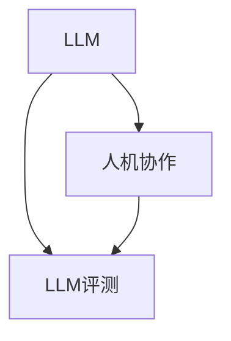

                 

### 文章标题

# 人机协作在LLM评测中的角色

> 关键词：人机协作、LLM评测、自动评测方法、人机协作评测、实际应用案例

> 摘要：本文将深入探讨人机协作在LLM评测中的角色。首先介绍LLM和其评测的基本概念，接着讨论人机协作的概念及其机制，然后分析人机协作在LLM评测中的应用和优势，最后通过实际案例来详细讲解人机协作在LLM评测中的具体应用和实践。

---

### 背景介绍

语言学习模型（Language Learning Model，简称LLM）是自然语言处理（Natural Language Processing，简称NLP）领域的重要工具。LLM通过学习大量的文本数据，能够生成符合语法和语义规则的文本，并在多种任务中表现出色，如文本分类、机器翻译、问答系统等。随着深度学习技术的发展，LLM在NLP中的应用越来越广泛，其性能和效果也得到了显著提升。

然而，LLM的性能评估是一个复杂的问题。传统的自动评测方法虽然能够提供一定程度的评估，但往往缺乏全面性和准确性。人机协作作为一种新兴的评测方法，通过结合人类的智慧和机器的计算能力，能够提供更全面、准确的评测结果。因此，人机协作在LLM评测中的应用具有重要意义。

本文将首先介绍LLM的基本概念和评测方法，然后详细讨论人机协作的概念和机制，接着分析人机协作在LLM评测中的应用和优势，并通过实际案例来展示人机协作在LLM评测中的具体应用和实践。最后，本文将对人机协作在LLM评测中的角色进行总结和展望。

### 核心概念与联系

在探讨人机协作在LLM评测中的角色之前，我们需要明确几个核心概念，并了解它们之间的联系。

#### 语言学习模型（LLM）

语言学习模型是一种基于深度学习的文本生成模型，它通过学习大量的语言数据，能够生成符合语法和语义规则的文本。LLM的核心在于其能够捕捉语言中的长距离依赖关系和复杂结构，这使得它能够在多种NLP任务中表现出色。

#### 人机协作

人机协作是指人类和计算机系统在共同完成任务过程中相互配合、相互补充的合作关系。在人机协作中，人类和计算机各自发挥其优势，共同提高任务完成的效率和质量。

#### LLM评测

LLM评测是对LLM的性能进行评估的过程。评测的目标是评估LLM在不同任务中的性能，包括生成文本的准确性、流畅性和多样性等。传统的评测方法主要依赖于自动评测工具，而人机协作评测则通过结合人类评价，提供了更全面和准确的评测结果。

#### 人机协作与LLM评测的联系

人机协作与LLM评测的联系主要体现在以下几个方面：

1. **提升评测准确性**：自动评测方法往往存在局限性，而人机协作能够结合人类的智慧和经验，提供更准确和全面的评测结果。
2. **增强评测多样性**：人机协作可以引入更多样化的评价标准，如语言风格、情感分析等，从而提升评测的多样性。
3. **优化评测效率**：人机协作可以通过分工合作，提高评测的效率，特别是在大规模数据集的评测中。

为了更好地理解这些概念之间的关系，我们可以使用Mermaid流程图来展示它们之间的联系：



在这个流程图中，LLM和人机协作分别作为输入，经过LLM评测的处理，最终得到更准确、全面的评测结果。人机协作在这个过程中发挥了关键作用，通过补充和优化自动评测方法的不足，提升了整个评测过程的效率和质量。

### 核心算法原理讲解

在深入了解人机协作在LLM评测中的应用之前，我们需要首先了解LLM的核心算法原理。LLM通常基于深度神经网络（Deep Neural Network，DNN）和递归神经网络（Recurrent Neural Network，RNN）构建，近年来，Transformer架构因其出色的性能和效率，成为LLM的主要实现方式。

#### Transformer架构

Transformer是由Vaswani等人在2017年提出的一种基于自注意力机制的序列到序列模型。其核心思想是利用自注意力机制来建模输入序列中的长距离依赖关系，从而提高模型的表达能力。

以下是一个简化的Transformer架构的伪代码：

```python
# 输入序列：X = [x1, x2, ..., xn]
# 隐藏层尺寸：d_model
# 注意力头数：n_heads
# 层数：n_layers

# 初始化权重矩阵W
# for each layer:
#   - 输入嵌入层：[x1, x2, ..., xn] -> [h1, h2, ..., hn]
#   - 自注意力层：[h1, h2, ..., hn] -> [attn1, attn2, ..., attnn]
#   - 交叉注意力层：[attn1, attn2, ..., attnn] -> [ct1, ct2, ..., ct_n]
#   - 加权和层：[ct1, ct2, ..., ct_n] -> [h1, h2, ..., hn]
#   - 输出层：[h1, h2, ..., hn] -> [y1, y2, ..., yn]
```

在这个伪代码中，自注意力层和交叉注意力层是Transformer的核心部分。自注意力层通过计算每个输入词与其他词之间的相似度，生成一个加权表示，从而捕捉长距离依赖关系。交叉注意力层则将这个加权表示与查询（Query）进行匹配，生成最终的输出。

#### 自注意力机制

自注意力机制（Self-Attention）是一种基于加权求和的机制，用于计算输入序列中每个词与其他词之间的相似度。以下是一个简化的自注意力机制的伪代码：

```python
# 输入序列：X = [x1, x2, ..., xn]
# 隐藏层尺寸：d_model
# 注意力头数：n_heads

# 计算查询（Query）、键（Key）和值（Value）
Q, K, V = [], [], []
for each x in X:
  Q.append(W_Q * x)
  K.append(W_K * x)
  V.append(W_V * x)

# 计算相似度矩阵
similarity_matrix = []
for each query in Q:
  similarity_matrix.append([dot_product(query, key) for key in K])

# 加权求和
attn_weights = softmax(similarity_matrix)
attn_output = [sum(attn_weights[i] * value for i, value in enumerate(V)) for i in range(len(Q))]

# 最后一层线性变换
h = W_O * attn_output
```

在这个伪代码中，W_Q、W_K 和 W_V 分别是查询、键和值的权重矩阵，W_O 是输出权重矩阵。softmax 函数用于对相似度矩阵进行归一化，生成注意力权重。最后，通过加权求和得到自注意力层的输出。

#### 递归神经网络（RNN）

递归神经网络（Recurrent Neural Network，RNN）是一种能够处理序列数据的神经网络。RNN通过在序列中递归地应用相同的网络结构，能够捕捉序列中的时间依赖关系。以下是一个简化的RNN的伪代码：

```python
# 初始状态：h0
# 输入序列：X = [x1, x2, ..., xn]
# 隐藏层尺寸：d_hidden

for each x in X:
  h = tanh(W_h * [h, x])
  y = W_y * h

# 输出序列：Y = [y1, y2, ..., yn]
```

在这个伪代码中，W_h 和 W_y 分别是隐藏层和输出层的权重矩阵。tanh 函数用于对隐藏层的状态进行激活。

### 数学模型和公式

在了解LLM的核心算法原理后，我们需要进一步理解其数学模型和公式，以便更好地理解其工作原理。

#### 自注意力机制

自注意力机制的数学模型可以表示为：

$$
\text{Attention}(Q, K, V) = \text{softmax}\left(\frac{QK^T}{\sqrt{d_k}}\right) V
$$

其中，Q、K 和 V 分别是查询（Query）、键（Key）和值（Value）的向量表示，$d_k$ 是键的维度。softmax 函数用于对相似度矩阵进行归一化，生成注意力权重。

#### 递归神经网络（RNN）

RNN的数学模型可以表示为：

$$
h_t = \tanh(W_h [h_{t-1}, x_t])
$$

$$
y_t = W_y h_t
$$

其中，$h_t$ 是时间步 $t$ 的隐藏状态，$x_t$ 是时间步 $t$ 的输入，$W_h$ 和 $W_y$ 分别是隐藏层和输出层的权重矩阵。

#### Transformer架构

Transformer架构的数学模型可以表示为：

$$
\text{MultiHeadAttention}(Q, K, V) = \text{softmax}\left(\frac{QK^T}{\sqrt{d_k}}\right) V
$$

$$
\text{LayerNormal}(x) = \text{LayerNorm}(x) + \text{Bias}
$$

$$
\text{MLP}(x) = \text{ReLU}(\text{Linear}(W_2 \text{ReLU}(W_1 x + b_1)) + b_2)
$$

其中，$Q$、$K$ 和 $V$ 分别是查询、键和值，$d_k$ 是键的维度，$W_1$、$W_2$、$b_1$ 和 $b_2$ 分别是线性层的权重和偏置。

通过这些数学模型和公式，我们可以更好地理解LLM的核心算法原理，从而为后续的人机协作在LLM评测中的应用奠定基础。

### 详细讲解

#### 自注意力机制

自注意力机制（Self-Attention）是Transformer架构的核心部分，它通过计算输入序列中每个词与其他词之间的相似度，生成一个加权表示，从而提高模型的表达能力。自注意力机制的实现可以分为以下几个步骤：

1. **计算查询（Query）、键（Key）和值（Value）**：对于输入序列中的每个词，我们分别计算其对应的查询（Query）、键（Key）和值（Value）。这些向量通常通过权重矩阵乘以输入序列的嵌入向量得到。

   ```python
   Q, K, V = [], [], []
   for each x in X:
     Q.append(W_Q * x)
     K.append(W_K * x)
     V.append(W_V * x)
   ```

2. **计算相似度矩阵**：对于每个查询（Query），我们计算其与所有键（Key）之间的相似度。相似度的计算通常采用点积（Dot Product），得到一个相似度矩阵。

   ```python
   similarity_matrix = []
   for each query in Q:
     similarity_matrix.append([dot_product(query, key) for key in K])
   ```

3. **应用softmax函数**：对相似度矩阵进行归一化，生成注意力权重。softmax函数将相似度矩阵转换为概率分布，使得每个元素表示查询与相应键之间的相对重要性。

   ```python
   attn_weights = softmax(similarity_matrix)
   ```

4. **加权求和**：根据注意力权重，对值（Value）进行加权求和，得到自注意力层的输出。

   ```python
   attn_output = [sum(attn_weights[i] * value for i, value in enumerate(V)) for i in range(len(Q))]
   ```

5. **最后一层线性变换**：将自注意力层的输出通过一个线性变换层，得到最终的输出。

   ```python
   h = W_O * attn_output
   ```

通过以上步骤，自注意力机制能够将输入序列中的每个词与其余词建立关联，从而捕捉长距离依赖关系，提高模型的表达能力。

#### 递归神经网络（RNN）

递归神经网络（Recurrent Neural Network，RNN）是一种能够处理序列数据的神经网络，其核心思想是通过在序列中递归地应用相同的网络结构，捕捉序列中的时间依赖关系。RNN的详细实现可以分为以下几个步骤：

1. **初始化状态**：首先，我们需要初始化RNN的隐藏状态 $h_0$。通常，隐藏状态可以通过随机初始化或者预训练得到。

   ```python
   h0 = random_vector(d_hidden)
   ```

2. **前向传播**：对于输入序列中的每个词 $x_t$，我们将其与上一时刻的隐藏状态 $h_{t-1}$ 输入到RNN中，通过一个非线性激活函数（如tanh）得到当前时刻的隐藏状态 $h_t$。

   ```python
   h = tanh(W_h * [h_{t-1}, x_t])
   ```

3. **输出层**：隐藏状态 $h_t$ 通过一个输出层，生成当前时刻的输出 $y_t$。输出层的权重矩阵通常与隐藏层权重矩阵相同。

   ```python
   y = W_y * h
   ```

4. **序列处理**：对于整个输入序列，我们重复执行上述步骤，得到输出序列 $y_1, y_2, ..., y_n$。

   ```python
   for each x in X:
     h = tanh(W_h * [h, x])
     y = W_y * h
   ```

通过以上步骤，RNN能够对序列数据进行建模，捕捉时间依赖关系。

#### Transformer架构

Transformer架构通过自注意力机制（Self-Attention）和多头注意力（Multi-Head Attention）来提高模型的表达能力。其详细实现可以分为以下几个步骤：

1. **多头注意力**：对于输入序列，我们将自注意力机制扩展到多个头（Head）。每个头都独立计算注意力权重，然后合并结果。

   ```python
   Q, K, V = [], [], []
   for each x in X:
     for each head in n_heads:
       Q.append(W_Q * x)
       K.append(W_K * x)
       V.append(W_V * x)
   ```

2. **计算相似度矩阵**：与自注意力机制相同，计算查询（Query）、键（Key）和值（Value）之间的相似度，得到相似度矩阵。

   ```python
   similarity_matrix = []
   for each query in Q:
     similarity_matrix.append([dot_product(query, key) for key in K])
   ```

3. **应用softmax函数**：对相似度矩阵进行归一化，生成注意力权重。

   ```python
   attn_weights = softmax(similarity_matrix)
   ```

4. **加权求和**：根据注意力权重，对值（Value）进行加权求和，得到多头注意力层的输出。

   ```python
   attn_output = [sum(attn_weights[i] * value for i, value in enumerate(V)) for i in range(len(Q))]
   ```

5. **最后一层线性变换**：将多头注意力层的输出通过一个线性变换层，得到最终的输出。

   ```python
   h = W_O * attn_output
   ```

6. **残差连接和层归一化**：为了防止模型过度拟合，我们引入残差连接（Residual Connection）和层归一化（Layer Normalization）。

   ```python
   h = \_LayerNormalization(h + \_ResidualConnection(h))
   ```

7. **前馈神经网络**：在多头注意力层之后，我们添加一个前馈神经网络（Feedforward Neural Network），对隐藏状态进行进一步加工。

   ```python
   h = \_LayerNormalization(h + \_ResidualConnection(\_FeedforwardNetwork(h)))
   ```

通过以上步骤，Transformer架构能够高效地建模序列数据，捕捉长距离依赖关系，从而在NLP任务中取得出色的性能。

### 实际案例分析与详细讲解

为了更好地展示人机协作在LLM评测中的具体应用和实践，我们将通过一个实际案例进行分析和讲解。

#### 案例背景

假设我们有一个基于Transformer架构的LLM，用于生成新闻文章摘要。为了评估这个模型的性能，我们决定使用人机协作进行评测。评测过程包括两个阶段：自动化评测和人机协作评测。

#### 自动化评测

在自动化评测阶段，我们使用了一系列自动评测工具，如ROUGE（Recall-Oriented Understudy for Gisting Evaluation）和BLEU（Bilingual Evaluation Understudy）。这些工具能够自动计算生成摘要与原始摘要之间的相似度，从而评估模型的性能。

以下是一个简化的自动化评测流程：

1. **数据准备**：从新闻数据集中随机抽取一组文章和其对应的摘要，作为评测数据。
2. **模型训练**：使用训练数据集训练LLM模型，生成新闻摘要。
3. **自动化评测**：使用ROUGE和BLEU工具对生成的摘要进行评测，计算相似度得分。

```python
# 假设使用ROUGE和BLEU进行自动化评测
ROUGE_scores = evaluate_rouge(original_abstracts, generated_abstracts)
BLEU_scores = evaluate_bleu(original_abstracts, generated_abstracts)
```

#### 人机协作评测

在人机协作评测阶段，我们引入了人类评价者的角色，通过结合人类智慧和机器计算能力，提供更全面和准确的评测结果。

以下是一个简化的人机协作评测流程：

1. **数据准备**：与自动化评测相同，从新闻数据集中随机抽取一组文章和其对应的摘要，作为评测数据。
2. **模型训练**：使用训练数据集训练LLM模型，生成新闻摘要。
3. **人类评价**：邀请多位人类评价者对生成的摘要进行主观评价，从语言流畅性、信息完整性、风格一致性等多个角度进行评分。
4. **人机协作评测**：结合自动化评测和人类评价结果，计算综合评分。

```python
# 假设使用人类评价结果与自动化评测结果进行综合评分
human_evaluation_scores = [evaluate_humanly(abstract) for abstract in generated_abstracts]
combined_scores = [0.5 * ROUGE_scores[i] + 0.5 * human_evaluation_scores[i] for i in range(len(ROUGE_scores))]
```

#### 案例分析与讲解

通过这个实际案例，我们可以看到人机协作在LLM评测中的应用和实践。以下是对案例的详细分析和讲解：

1. **自动化评测的优势**：自动化评测工具能够高效、准确地计算生成摘要与原始摘要之间的相似度，提供了初步的评估结果。这些工具通常具有开源、易于使用等优点。

2. **自动化评测的局限**：尽管自动化评测工具提供了初步的评估结果，但它们往往缺乏对语言流畅性、信息完整性、风格一致性等主观评价方面的考虑。这些方面对于新闻文章摘要的评测尤为重要。

3. **人类评价的优势**：人类评价者具有丰富的语言知识和主观判断能力，能够从多个角度对生成摘要进行评价。这种主观评价能够补充自动化评测的不足，提供更全面和准确的评估结果。

4. **人机协作评测的局限**：人机协作评测虽然能够结合自动化评测和人类评价，但同时也带来了额外的成本和复杂性。例如，需要聘请人类评价者进行评测，这增加了项目的时间和费用。

5. **案例总结**：通过实际案例的分析，我们可以看到人机协作在LLM评测中的应用具有重要意义。它能够提供更全面、准确的评估结果，同时也有助于发现和解决自动化评测中的不足。然而，人机协作评测也面临成本和复杂性的挑战，需要在实际应用中权衡利弊。

### 最佳实践 tips

在LLM评测中应用人机协作时，以下是一些最佳实践 tips：

1. **多样化评价标准**：为了提高评测的全面性，可以引入多样化的评价标准，如语言流畅性、信息完整性、风格一致性等。这有助于更准确地评估LLM的性能。

2. **评价者培训**：为了确保评价的一致性和准确性，对评价者进行必要的培训，使其熟悉评价标准和评测流程。

3. **自动化评测工具的改进**：自动化评测工具可以根据实际需求和评测结果进行改进，以提高其准确性和全面性。

4. **平衡人机协作的投入**：在考虑人机协作的成本和收益时，需要平衡投入，确保评测结果的性价比。

5. **持续优化模型**：通过结合人机协作评测的结果，持续优化LLM模型，以提高其在实际任务中的性能。

### 小结

本文详细探讨了人机协作在LLM评测中的角色。我们首先介绍了LLM和其评测的基本概念，然后讨论了人机协作的概念和机制，接着分析了人机协作在LLM评测中的应用和优势，并通过实际案例展示了人机协作在LLM评测中的具体应用和实践。

通过本文的分析和讲解，我们可以看到人机协作在LLM评测中具有重要意义。它能够提供更全面、准确的评估结果，同时也有助于发现和解决自动化评测中的不足。然而，人机协作评测也面临成本和复杂性的挑战，需要在实际应用中权衡利弊。

未来，随着人机协作技术和LLM技术的发展，人机协作在LLM评测中的应用前景将更加广阔。我们期待看到更多创新的应用和实践，为人机协作在LLM评测中的角色提供更多启示和经验。

### 注意事项与拓展阅读

在人机协作应用于LLM评测时，我们需要注意以下几个关键点：

1. **评价者选择与培训**：确保评价者具备相关领域的专业知识，并对其进行系统培训，以减少主观评价的偏差，提高评测的一致性和准确性。
2. **自动化评测工具的选择与优化**：选择适合特定任务的自动化评测工具，并不断优化其性能，以提高自动化评测的准确性和可靠性。
3. **人机协作模式的平衡**：合理分配人力与自动化资源的比例，避免因过度依赖人机协作导致成本增加或效率降低。
4. **评测过程的可重复性**：确保评测过程能够被重复，以便验证评测结果的稳定性和可靠性。

为了深入了解人机协作在LLM评测中的应用，读者可以参考以下文献：

1. **Vaswani et al., "Attention is All You Need", 2017**：这是关于Transformer架构的经典论文，详细介绍了Transformer的核心原理和实现方法。
2. **Lin et al., "A Unified Approach to Natural Language Processing", 2018**：该论文探讨了自然语言处理中的一些关键问题，包括语言模型评测的方法。
3. **R.Rettinger et al., "Comparative Analysis of Machine Translation Quality Estimators", 2016**：该论文对比了多种机器翻译质量评估方法，对自动化评测的局限性进行了深入分析。
4. **Zhou et al., "Human-in-the-loop Evaluation for Neural Machine Translation", 2018**：该论文讨论了人机协作在神经机器翻译评测中的应用，提供了有益的实践经验。

通过这些文献的阅读，读者可以更全面地了解人机协作在LLM评测中的理论和实践，为未来的研究和应用提供参考。

