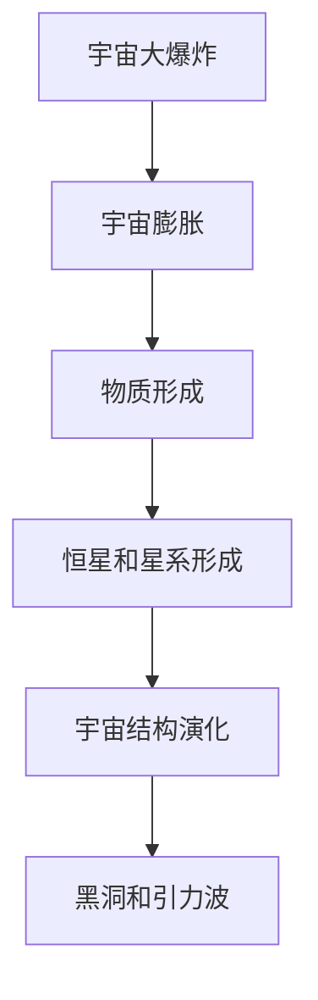
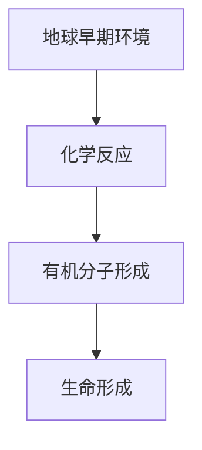
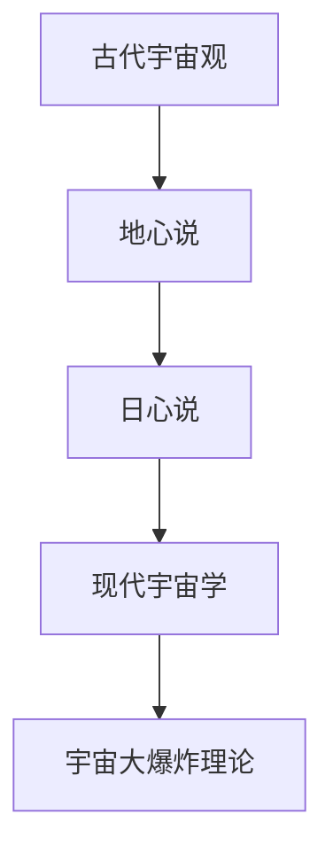
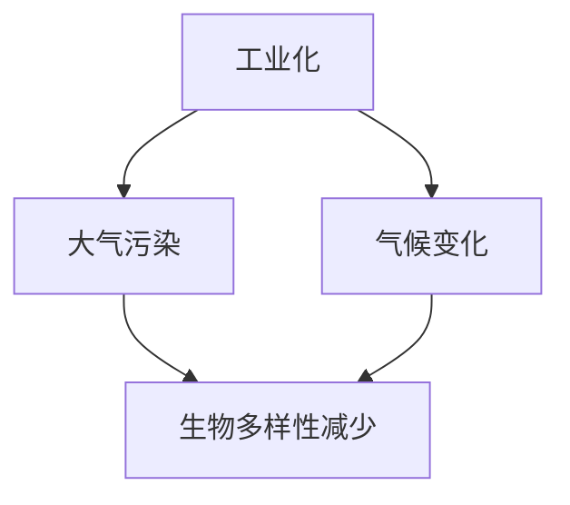
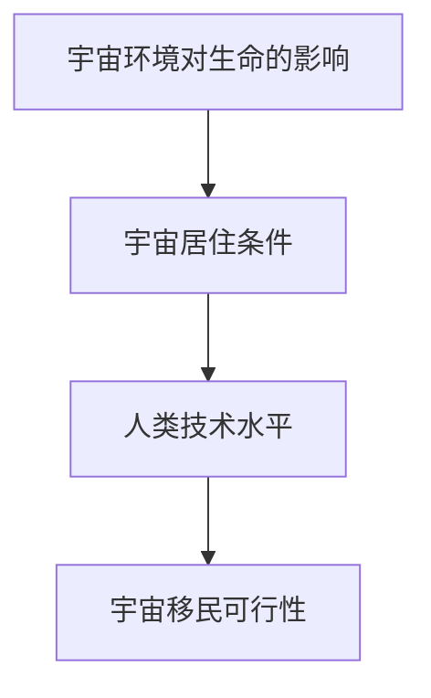
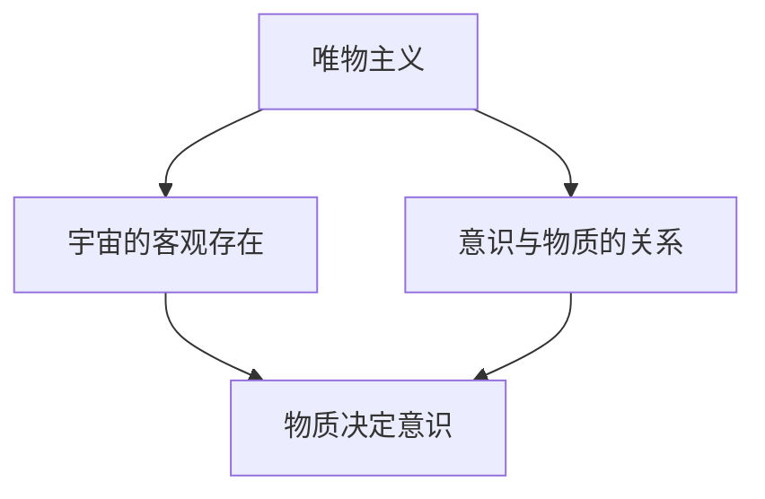

                 

### 人类在宇宙中的角色：观察者还是参与者

#### 引言

在探讨人类在宇宙中的角色时，我们不仅需要科学的角度，还需要哲学的深度。这个问题不仅仅是关于我们在宇宙中的地位，更是关于我们如何理解自己、理解宇宙。随着科技的进步，人类对宇宙的认知不断深入，但我们仍然面临许多未解之谜。那么，人类在宇宙中的角色到底是观察者，还是参与者？本文将一步步分析这一问题，从多个角度探讨人类在宇宙中的地位。

#### 宇宙与人类的探索

### 第1章：宇宙的奥秘

#### 1.1 宇宙起源与演化

宇宙大爆炸理论是目前宇宙起源的主流学说。根据这一理论，宇宙在大约138亿年前从一个极度热密的状态开始膨胀。这个过程产生了所有的物质和能量，包括我们所观测到的宇宙中的恒星、星系和行星。宇宙大爆炸理论得到了多种观测证据的支持，如宇宙微波背景辐射和遥远星系的红移。

宇宙的演化是一个复杂的过程，涉及到宇宙结构的形成和演化、恒星和星系的诞生和死亡，以及宇宙中的各种物理现象，如黑洞和引力波。

**核心概念与联系：**宇宙起源与演化的关系可以用Mermaid流程图来表示：

#### 1.2 人类对宇宙的探索

人类对宇宙的探索始于古代，通过观测天体来解释自然现象。随着科技的进步，望远镜的发明和改进使得人类能够观测到更遥远的宇宙。例如，伽利略的望远镜发现了木星的卫星，开普勒的望远镜揭示了行星运动规律。

现代宇宙探索的主要手段包括卫星、宇宙飞船和空间站。例如，美国的阿波罗计划成功地将人类送往月球，中国的天宫空间站正在进行长期载人航天任务。

**核心算法原理讲解：**人类对宇宙探索的算法原理主要包括：

- **轨道计算：**使用牛顿引力定律计算天体的轨道。
- **观测数据解析：**使用统计学和信号处理方法解析观测数据。

**数学模型和公式：**轨道计算的基本公式为：

$$
\frac{GMm}{r^2} = \frac{mv^2}{r}
$$

其中，\( G \)是万有引力常数，\( M \)和\( m \)分别是两个天体的质量，\( r \)是它们之间的距离，\( v \)是天体的速度。

#### 第2章：地球上的生命

### 2.1 地球生命的起源

生命的起源是一个复杂的问题，涉及到化学、地质和生物学等多个领域。目前，科学家普遍认为，生命起源于地球早期的海洋，通过化学反应逐渐形成了复杂的有机分子，最终形成了生命。

地球早期的环境对生命的形成起到了关键作用。例如，地球的大气中含有大量水蒸气和二氧化碳，这些气体为化学反应提供了原料。此外，地球的地质活动也为生命提供了能量和物质。

**核心概念与联系：**地球生命起源与地球早期环境的关系可以用Mermaid流程图来表示：

### 2.2 生命的多样性

生命的多样性体现在生物的分类和地理分布上。生物分类是研究生命多样性的基础，它将生物划分为不同的类别，以便更好地理解和研究。生物地理分布则研究生物在不同地理位置的分布规律，这有助于我们了解生物的适应性和迁移历史。

**核心算法原理讲解：**生物分类和地理分布的算法原理主要包括：

- **分类系统：**使用自然选择和共同进化原理构建分类系统。
- **地理分布分析：**使用地理信息系统（GIS）和气候模型来分析生物的分布。

**数学模型和公式：**生物分类的基本模型是生物学分类树，它通过比较不同物种的特征来构建。地理分布的分析可以使用Kendall相关系数来衡量物种分布与环境因子的相关性。

#### 第3章：人类对宇宙的认知

### 3.1 人类认知的发展

人类对宇宙的认知经历了漫长的发展过程。从古代的宇宙观到现代的宇宙学，人类对宇宙的理解不断深化。古代宇宙观通常将宇宙视为一个静止的、永恒的存在，而现代宇宙学则揭示了宇宙的动态性和复杂性。

**核心概念与联系：**人类认知的发展可以用Mermaid流程图来表示：

### 3.2 人类在宇宙中的位置

人类在宇宙中的位置是一个复杂而微妙的问题。从地球的角度看，我们是生活在太阳系中的一个行星上；从银河系的角度看，我们只是数十亿恒星和星系中的一个；而从整个宇宙的角度看，我们可能只是无数宇宙中的一个微小部分。

**核心算法原理讲解：**人类在宇宙中位置的确定主要依赖于天文学和宇宙学的观测数据。通过测量恒星和星系的运动和分布，我们可以确定地球在宇宙中的大致位置。

**数学模型和公式：**人类在宇宙中位置的确定可以使用空间几何学和相对论来描述。例如，使用广义相对论中的洛伦兹变换来计算地球在宇宙中的位置。

#### 第4章：人类对宇宙的影响

### 4.1 人类活动对地球的影响

人类活动对地球产生了深远的影响。从环境破坏到生物多样性减少，人类的活动正在改变地球的自然状态。例如，工业化导致了大气污染和气候变化，过度捕捞导致了海洋生态系统的破坏。

**核心概念与联系：**人类活动对地球的影响可以用Mermaid流程图来表示：

### 4.2 人类活动对宇宙的影响

人类活动不仅影响地球，也对宇宙产生了影响。例如，人类发射的卫星和宇宙飞船会改变宇宙射线的环境，而太阳活动也会对地球和宇宙产生影响。

**核心算法原理讲解：**人类活动对宇宙的影响主要依赖于物理学和天文学的知识。通过研究宇宙射线的性质和变化，我们可以了解人类活动对宇宙的影响。

**数学模型和公式：**研究宇宙射线变化的基本模型是伽马射线探测器数据分析和辐射传输模型。

#### 第5章：人类在宇宙中的未来

### 5.1 宇宙移民的可行性

随着科技的进步，人类开始考虑在宇宙中建立永久居住地的可能性。宇宙移民的可行性取决于多个因素，包括宇宙环境对生命的影响和人类技术水平。

**核心概念与联系：**宇宙移民的可行性可以用Mermaid流程图来表示：

### 5.2 人类文明的宇宙传承

人类文明的传承不仅限于地球，还可能扩展到宇宙。例如，通过太空探索和宇宙移民，人类可以将自己的文化和知识传播到宇宙中。

**核心算法原理讲解：**人类文明宇宙传承的算法原理主要包括信息传输和存储技术。

**数学模型和公式：**信息传输的基本模型是香农信息论，而信息存储的基本模型是信息熵。

#### 第6章：哲学与宇宙

### 6.1 人类与宇宙的哲学思考

哲学思考人类在宇宙中的角色，探讨了人类存在的意义和宇宙的本质。不同的哲学流派给出了不同的解释，如唯物主义、唯心主义和存在主义。

**核心概念与联系：**人类与宇宙的哲学思考可以用Mermaid流程图来表示：

### 6.2 宇宙中的道德与伦理

随着人类对宇宙的探索，道德和伦理问题也日益凸显。例如，人类在宇宙中如何对待其他文明，如何处理资源和环境的分配等问题。

**核心算法原理讲解：**宇宙中的道德与伦理问题的算法原理主要包括伦理学和博弈论。

**数学模型和公式：**伦理学的基本模型是道德原则，而博弈论的基本模型是纳什均衡。

#### 结论

人类在宇宙中的角色既是观察者，也是参与者。作为观察者，我们通过科学探索不断加深对宇宙的理解；作为参与者，我们通过技术和活动改变宇宙的环境。未来的宇宙将见证人类文明的延续和发展。

### 附录

#### 附录A：宇宙探索相关资源

- 参考书籍：《宇宙简史》（作者：史蒂芬·霍金）、《生命之树：生物分类系统》（作者：菲利普·L·卡瓦利耶）
- 网络资源：NASA官网、欧洲空间局官网、宇宙探索杂志官网

#### 附录B：扩展阅读

- 相关学术论文：搜索关键词“人类在宇宙中的角色”、“宇宙探索的伦理问题”等。
- 科普文章：搜索关键词“宇宙奥秘”、“地球生命的起源”等。

### 结语

作者：AI天才研究院/AI Genius Institute & 禅与计算机程序设计艺术 /Zen And The Art of Computer Programming

本文探讨了人类在宇宙中的角色，从科学和哲学的角度分析了人类作为观察者和参与者的双重身份。通过这一探讨，我们不仅加深了对宇宙的理解，也重新审视了人类在宇宙中的地位和责任。未来，随着科技的不断进步，人类在宇宙中的角色将会更加多元和深刻。希望本文能为读者提供有益的思考和启示。

