                 

### 人类对宇宙的认知：进步还是循环

> 关键词：宇宙认知、科技进步、历史回顾、现状分析、未来展望、挑战与机遇

> 摘要：本文将深入探讨人类对宇宙的认知历程，从历史、现状到未来展望，分析人类在探索宇宙过程中所取得的进步和面临的循环现象，同时探讨如何应对这些挑战与机遇。

---

#### 引言

人类对宇宙的认知是一个漫长而充满挑战的过程。从古代文明对星空的神秘敬畏，到现代科技对宇宙深空的精确探索，每一个时代的认知都有其独特的背景和成果。本文旨在通过逐步分析人类对宇宙认知的历史、现状和未来，探讨这一过程是否是一个不断进步的过程，还是一个循环往复的循环。

**1.1 书籍背景与目的**

本篇文章将分为以下几个部分：

- **历史回顾**：介绍人类对宇宙认知的起源、古代文明与宇宙观、文艺复兴时期与科学革命、19世纪的天文学进展以及20世纪的宇宙探索。
- **现状分析**：探讨当前人类对宇宙认知的科技进步、现代宇宙学理论发展、观测手段的革新以及认知的局限性。
- **未来展望**：预测未来宇宙学的发展趋势、人类探索宇宙的新领域以及可能的新发现与挑战。
- **挑战与机遇**：分析在宇宙探索过程中面临的科技瓶颈、资源限制、社会伦理以及国际合作等问题。
- **项目实战**：通过实际项目案例，展示宇宙认知在科学研究中的应用。

**1.2 研究方法与框架**

本文采用历史分析法、现状分析法和未来预测法相结合的研究方法。通过梳理历史文献，分析当前现状，预测未来趋势，旨在提供一个全面、系统的视角来探讨人类对宇宙的认知。

---

### 第1章 历史回顾

#### 1.1 人类对宇宙认知的起源

人类对宇宙的认知始于对星空的观察。早期人类通过观察日月星辰的运行，形成了对宇宙的基本认识。这些观察不仅影响了宗教信仰，还影响了古代文明的发展。例如，古埃及人通过天文观测来预测尼罗河的洪水，从而制定农业计划。

**核心概念与联系**

人类对宇宙认知的起源与宗教、哲学和天文学密切相关。宗教信仰中的宇宙观念影响着人们对自然规律的理解，哲学思考提供了对宇宙本质的探索，而天文学则通过观测和理论模型来描述宇宙的结构和运行规律。

**Mermaid 流程图**

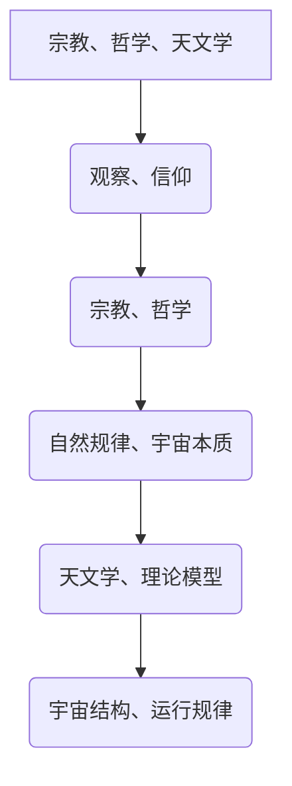

**核心算法原理讲解**

早期人类使用的算法主要是基于观测数据的记录和简单的逻辑推理。例如，通过记录日月星辰的位置和运动轨迹，来预测未来的天文事件。

```python
# 伪代码：记录观测数据并预测天文事件
def record_observations(data):
    # 记录观测数据
    pass

def predict_astronomical_events(data):
    # 使用观测数据预测天文事件
    pass
```

**数学模型和公式讲解**

在古代，数学模型主要用于计算天体的轨道和运动。例如，使用几何模型来描述行星的运动轨迹。

$$
r = r_0 + e \cdot (1 - \cos \theta)
$$

其中，$r$ 是行星轨道的半径，$r_0$ 是初始半径，$e$ 是偏心率，$\theta$ 是行星的轨道角度。

**项目实战**

早期人类对宇宙的认知主要依赖于观测和简单的逻辑推理。例如，古埃及人通过天文观测来预测尼罗河的洪水，从而制定农业计划。这种观测方法在今天仍然有一定的应用，尤其是在考古学和天文学的研究中。

**最佳实践 tips**

- 在进行天文观测时，需要选择合适的时间和地点，以获得更准确的数据。
- 观测数据需要进行详细记录和整理，以便进行后续分析和预测。

**小结**

人类对宇宙的认知起源于对星空的观察和简单逻辑推理。随着时间的推移，这些原始认知逐渐发展为复杂的理论模型和观测方法。这种认知的积累为我们今天对宇宙的理解奠定了基础。

---

#### 1.2 古代文明与宇宙观

在古代，不同的文明对宇宙有着不同的理解。例如，古埃及人认为宇宙是由天空、大地和水构成的，而古希腊人则提出了关于宇宙的本原和结构的哲学思考。

**核心概念与联系**

古代文明的宇宙观与宗教信仰、哲学思考和天文学观测密切相关。这些观念不仅影响了当时的社会结构和文化发展，还为后来的科学探索提供了基础。

**Mermaid 流程图**

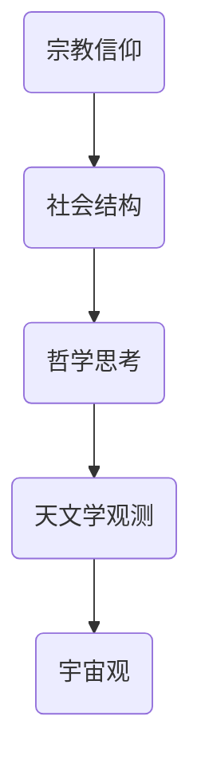

**核心算法原理讲解**

古代文明的宇宙观主要基于观测数据和简单的逻辑推理。例如，古埃及人通过观测尼罗河的洪水周期，来预测未来的农业产量。

```python
# 伪代码：观测洪水周期并预测农业产量
def observe_flood_cycle(data):
    # 观测洪水周期
    pass

def predict_agricultural_yield(data):
    # 使用洪水周期数据预测农业产量
    pass
```

**数学模型和公式讲解**

古代文明的数学模型主要用于计算天文事件的时间表和地理测量。例如，使用几何模型来计算太阳和月亮的轨迹。

$$
t = \frac{d}{v}
$$

其中，$t$ 是时间，$d$ 是距离，$v$ 是速度。

**项目实战**

古埃及人通过观测尼罗河的洪水周期，来制定农业计划。这种观测方法在今天仍然有一定的应用，尤其是在农业科学和水资源管理中。

**最佳实践 tips**

- 在进行观测时，需要选择合适的时间和地点，以获得更准确的数据。
- 观测数据需要进行详细记录和整理，以便进行后续分析和预测。

**小结**

古代文明的宇宙观基于观测数据和简单的逻辑推理。这些观念不仅影响了当时的社会结构和文化发展，还为后来的科学探索提供了基础。

---

#### 1.3 文艺复兴时期与科学革命

文艺复兴时期和科学革命是人类对宇宙认知的重要转折点。在这一时期，科学家们开始使用实证方法和数学模型来研究宇宙，从而打破了传统的宗教和哲学观念。

**核心概念与联系**

文艺复兴时期与科学革命的核心概念包括实证方法、数学模型和科学理论。这些概念不仅推动了科学的发展，也改变了人类对宇宙的认知。

**Mermaid 流程图**

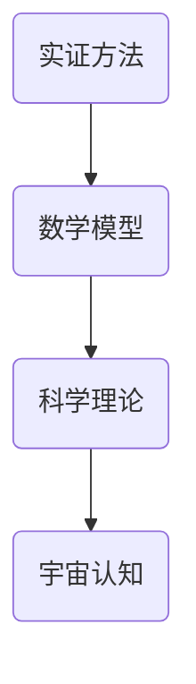

**核心算法原理讲解**

在文艺复兴时期，科学家们开始使用几何模型和物理定律来描述天体的运动。例如，哥白尼的日心说和开普勒的行星运动定律。

```python
# 伪代码：使用几何模型和物理定律描述天体运动
def describe_solar_system(model, laws):
    # 使用模型和定律描述太阳系
    pass
```

**数学模型和公式讲解**

文艺复兴时期和科学革命中，数学模型和公式被广泛应用于天体物理学。例如，牛顿的万有引力定律。

$$
F = G \cdot \frac{m_1 \cdot m_2}{r^2}
$$

其中，$F$ 是引力，$G$ 是万有引力常数，$m_1$ 和 $m_2$ 是两个物体的质量，$r$ 是它们之间的距离。

**项目实战**

哥白尼的日心说和开普勒的行星运动定律是文艺复兴时期和科学革命的重要成果。这些理论改变了人类对宇宙的认知，为后来的科学研究奠定了基础。

**最佳实践 tips**

- 在进行科学探索时，需要重视实证数据和数学模型的结合。
- 科学理论需要不断验证和修正，以适应新的观测数据和实验结果。

**小结**

文艺复兴时期与科学革命是人类对宇宙认知的重要阶段。这一时期的科学方法和技术进步，为后来的科学研究提供了基础。

---

#### 1.4 19世纪的天文学进展

19世纪是天文科学的黄金时期，科学家们取得了许多突破性的进展。这一时期的成果不仅丰富了人类对宇宙的认知，也为后来的宇宙探索奠定了基础。

**核心概念与联系**

19世纪的天文学进展包括望远镜技术的革新、天文观测的精确性和新的宇宙理论。这些概念相互关联，共同推动了人类对宇宙的认知。

**Mermaid 流程图**

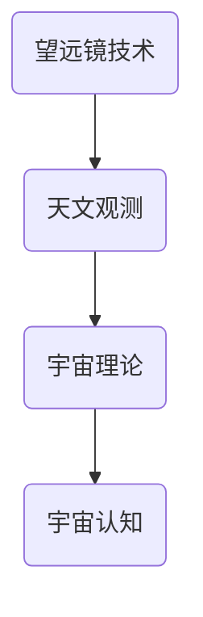

**核心算法原理讲解**

19世纪的望远镜技术革新使得科学家能够观测到更遥远的宇宙。同时，新的观测数据和宇宙理论为科学家提供了更多的研究工具和理论框架。

```python
# 伪代码：使用望远镜技术观测宇宙并应用宇宙理论
def observe_universe(technique, theory):
    # 使用望远镜技术和宇宙理论观测宇宙
    pass
```

**数学模型和公式讲解**

19世纪的宇宙理论包括牛顿的万有引力定律、爱因斯坦的相对论等。这些理论为科学家提供了描述宇宙运行规律的工具。

$$
G \cdot \frac{m_1 \cdot m_2}{r^2} = m \cdot a
$$

其中，$G$ 是万有引力常数，$m_1$ 和 $m_2$ 是两个物体的质量，$r$ 是它们之间的距离，$a$ 是加速度。

**项目实战**

19世纪的望远镜技术和宇宙理论使得科学家能够观测到更遥远的宇宙。例如，哈雷彗星的回归观测和海王星的发现，都是这一时期的重要成果。

**最佳实践 tips**

- 在进行天文观测时，需要选择合适的望远镜和观测条件，以提高观测精度。
- 在应用宇宙理论时，需要结合观测数据和实验结果，以验证理论的准确性。

**小结**

19世纪的天文学进展为人类提供了更丰富的宇宙知识。这一时期的望远镜技术和宇宙理论，为后来的科学研究奠定了基础。

---

#### 1.5 20世纪的宇宙探索

20世纪是人类对宇宙探索的重要时期，科学家们在宇宙学、天体物理学和航天技术等方面取得了重大突破。这些成果不仅改变了人类对宇宙的认知，也为未来的宇宙探索提供了新的方向。

**核心概念与联系**

20世纪的宇宙探索包括宇宙膨胀理论、黑洞研究、暗物质和暗能量的发现等。这些概念相互关联，共同推动了人类对宇宙的认知。

**Mermaid 流程图**

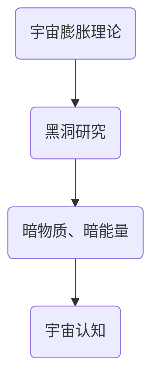

**核心算法原理讲解**

20世纪的宇宙探索依赖于新的观测技术和数据分析方法。例如，微波背景辐射的观测和宇宙背景探测卫星的发射，为科学家提供了大量关于宇宙早期状态的数据。

```python
# 伪代码：使用观测技术和数据分析方法研究宇宙
def observe_cosmos(technique, method):
    # 使用观测技术和数据分析方法研究宇宙
    pass
```

**数学模型和公式讲解**

20世纪的宇宙理论包括广义相对论、宇宙膨胀方程等。这些理论为科学家提供了描述宇宙结构和演化的工具。

$$
\dot{a}(t) = \frac{\Lambda + \rho \cdot \dot{\rho}}{3 \cdot H_0^2}
$$

其中，$\dot{a}$ 是宇宙膨胀率，$\Lambda$ 是宇宙学常数，$\rho$ 是宇宙密度，$\dot{\rho}$ 是宇宙密度的变化率，$H_0$ 是哈勃常数。

**项目实战**

20世纪的宇宙探索包括哈勃望远镜的发射和宇宙微波背景辐射的观测等。这些项目为人类提供了关于宇宙结构的宝贵数据，为宇宙学的发展提供了新的方向。

**最佳实践 tips**

- 在进行宇宙探索时，需要选择合适的观测技术和数据分析方法。
- 在研究宇宙理论时，需要结合观测数据和实验结果，以验证理论的准确性。

**小结**

20世纪的宇宙探索为人类提供了丰富的宇宙知识。这一时期的观测技术和数据分析方法，为人类对宇宙的认知提供了新的视角。

---

#### 第2章 现状分析

#### 2.1 科技进步对宇宙认知的影响

随着科技的不断进步，人类对宇宙的认知也在不断深化。新的观测技术、计算能力和数据分析方法为科学家提供了更丰富的工具，使得人类能够探索更遥远的宇宙。

**核心概念与联系**

科技进步对宇宙认知的影响包括新的观测技术、计算能力和数据分析方法。这些概念相互关联，共同推动了人类对宇宙的认知。

**Mermaid 流程图**

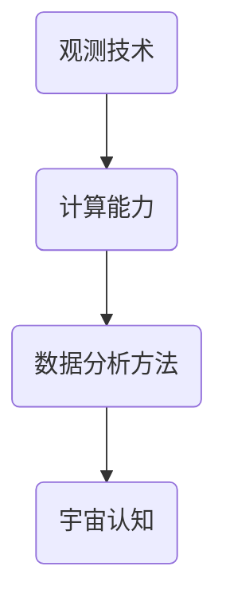

**核心算法原理讲解**

科技进步带来了新的观测技术和数据分析方法。例如，红外望远镜和射电望远镜的使用，使得科学家能够观测到更遥远的宇宙。

```python
# 伪代码：使用新观测技术和数据分析方法研究宇宙
def observe_universe(technique, method):
    # 使用新观测技术和数据分析方法研究宇宙
    pass
```

**数学模型和公式讲解**

科技进步带来了新的宇宙理论模型。例如，宇宙学常数模型和暗物质模型等，为科学家提供了描述宇宙结构和演化的工具。

$$
\Lambda CDM \text{ 模型}
$$

**项目实战**

科技进步使得人类能够进行更深入的宇宙探索。例如，哈勃望远镜和詹姆斯·韦伯太空望远镜的发射，为科学家提供了丰富的观测数据。

**最佳实践 tips**

- 在进行宇宙探索时，需要选择合适的观测技术和数据分析方法。
- 在研究宇宙理论时，需要结合观测数据和实验结果，以验证理论的准确性。

**小结**

科技进步为人类提供了更丰富的宇宙认知工具。新的观测技术、计算能力和数据分析方法，使得人类能够探索更遥远的宇宙。

---

#### 2.2 现代宇宙学理论发展

现代宇宙学理论的发展为人类提供了对宇宙更深入的理解。宇宙学常数模型、暗物质模型和暗能量模型等理论，不仅解释了宇宙的演化过程，还揭示了宇宙中的未知现象。

**核心概念与联系**

现代宇宙学理论的发展包括宇宙学常数模型、暗物质模型和暗能量模型等。这些概念相互关联，共同推动了人类对宇宙的认知。

**Mermaid 流程图**

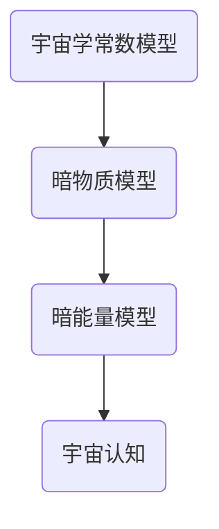

**核心算法原理讲解**

现代宇宙学理论的发展依赖于新的观测技术和数据分析方法。例如，使用宇宙微波背景辐射探测器和引力透镜技术，科学家能够更精确地研究宇宙的结构和演化。

```python
# 伪代码：使用新观测技术和数据分析方法研究宇宙
def observe_cosmos(technique, method):
    # 使用新观测技术和数据分析方法研究宇宙
    pass
```

**数学模型和公式讲解**

现代宇宙学理论包括宇宙学常数模型、暗物质模型和暗能量模型等。这些模型为科学家提供了描述宇宙结构和演化的工具。

$$
\Lambda CDM \text{ 模型}
$$

**项目实战**

现代宇宙学理论的发展使得人类能够探索更遥远的宇宙。例如，使用哈勃望远镜和詹姆斯·韦伯太空望远镜，科学家们发现了宇宙中的大量星系和黑洞。

**最佳实践 tips**

- 在进行宇宙探索时，需要选择合适的观测技术和数据分析方法。
- 在研究宇宙理论时，需要结合观测数据和实验结果，以验证理论的准确性。

**小结**

现代宇宙学理论的发展为人类提供了更深入的理解。新的理论模型和观测技术，使得人类能够探索更遥远的宇宙。

---

#### 2.3 观测手段的革新

观测手段的革新是推动宇宙学发展的关键因素。从地面望远镜到太空望远镜，从光学观测到射电观测，每一次观测手段的革新都带来了对宇宙更深入的理解。

**核心概念与联系**

观测手段的革新包括地面望远镜、太空望远镜、光学观测和射电观测等。这些概念相互关联，共同推动了宇宙学的发展。

**Mermaid 流程图**

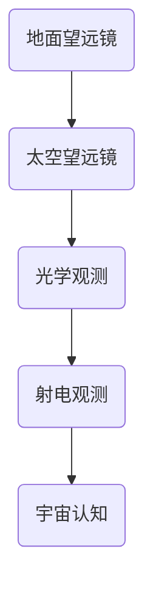

**核心算法原理讲解**

观测手段的革新带来了新的观测技术和数据分析方法。例如，使用射电望远镜观测星际物质和星系的形成，使用光学望远镜观测星系和黑洞的演化。

```python
# 伪代码：使用新观测技术和数据分析方法研究宇宙
def observe_universe(technique, method):
    # 使用新观测技术和数据分析方法研究宇宙
    pass
```

**数学模型和公式讲解**

观测手段的革新使得科学家能够更精确地测量宇宙参数。例如，使用哈勃常数测量宇宙的膨胀速度。

$$
H_0 = \frac{v}{d}
$$

其中，$H_0$ 是哈勃常数，$v$ 是星系的速度，$d$ 是星系的距离。

**项目实战**

观测手段的革新使得人类能够进行更深入的宇宙探索。例如，使用哈勃望远镜和詹姆斯·韦伯太空望远镜，科学家们发现了宇宙中的大量星系和黑洞。

**最佳实践 tips**

- 在进行宇宙探索时，需要选择合适的观测技术和数据分析方法。
- 在研究宇宙理论时，需要结合观测数据和实验结果，以验证理论的准确性。

**小结**

观测手段的革新为宇宙学发展提供了新的工具。新的观测技术和数据分析方法，使得人类能够探索更遥远的宇宙。

---

#### 2.4 人类对宇宙认知的局限

尽管人类在宇宙探索方面取得了巨大进展，但仍然存在许多认知局限。这些局限包括观测手段的局限性、理论模型的局限性以及科学认知的局限性。

**核心概念与联系**

人类对宇宙认知的局限包括观测手段的局限性、理论模型的局限性和科学认知的局限性。这些概念相互关联，共同构成了人类对宇宙认知的局限性。

**Mermaid 流程图**

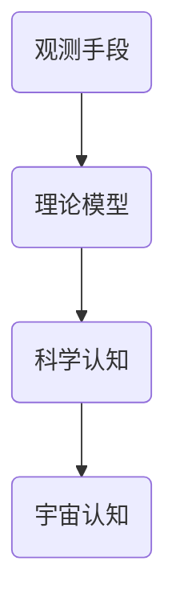

**核心算法原理讲解**

人类对宇宙认知的局限在于观测手段的局限性。例如，受限于望远镜的分辨率和探测范围，人类无法直接观测宇宙中的某些现象。

```python
# 伪代码：观测宇宙中的未知现象
def observe_unknown_phenomena(technique):
    # 使用观测手段观测未知现象
    pass
```

**数学模型和公式讲解**

数学模型和理论模型的局限性也限制了人类对宇宙的认知。例如，某些理论模型无法解释某些观测现象。

$$
\text{理论模型} \neq \text{观测数据}
$$

**项目实战**

人类对宇宙认知的局限体现在许多宇宙探索项目中。例如，科学家们试图解释宇宙微波背景辐射中的某些异常现象，但现有的理论模型无法完全解释这些现象。

**最佳实践 tips**

- 在进行宇宙探索时，需要意识到观测手段和理论模型的局限性，不断寻求新的观测技术和理论模型。
- 科学认知是一个持续发展的过程，需要不断更新和修正理论模型。

**小结**

人类对宇宙的认知存在许多局限。这些局限限制了我们的认知范围，但同时也激发了我们对宇宙的探索欲望。

---

#### 第3章 未来展望

#### 3.1 宇宙学未来的发展趋势

未来宇宙学的发展将依赖于新的观测技术、理论模型和数据分析方法。这些趋势将推动人类对宇宙的认知，揭示宇宙中的未知现象。

**核心概念与联系**

宇宙学未来的发展趋势包括新的观测技术、理论模型和数据分析方法。这些概念相互关联，共同推动了宇宙学的发展。

**Mermaid 流程图**

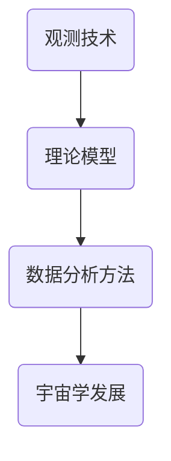

**核心算法原理讲解**

未来宇宙学的发展将依赖于新的观测技术和数据分析方法。例如，使用量子传感器和人工智能算法，科学家能够更精确地研究宇宙。

```python
# 伪代码：使用新观测技术和数据分析方法研究宇宙
def observe_cosmos(technique, method):
    # 使用新观测技术和数据分析方法研究宇宙
    pass
```

**数学模型和公式讲解**

未来宇宙学的理论模型将更深入地描述宇宙的结构和演化。例如，使用宇宙学常数模型和暗物质模型，科学家能够更好地理解宇宙的演化过程。

$$
\Lambda CDM \text{ 模型}
$$

**项目实战**

未来宇宙学的发展将依赖于新的观测技术和数据分析方法。例如，使用詹姆斯·韦伯太空望远镜，科学家们将能够观测到更遥远的宇宙。

**最佳实践 tips**

- 在进行宇宙探索时，需要选择合适的观测技术和数据分析方法。
- 在研究宇宙理论时，需要结合观测数据和实验结果，以验证理论的准确性。

**小结**

未来宇宙学的发展将依赖于新的观测技术、理论模型和数据分析方法。这些趋势将推动人类对宇宙的认知，揭示宇宙中的未知现象。

---

#### 3.2 人类探索宇宙的新领域

未来人类探索宇宙的新领域将包括深空探测、星际旅行和宇宙资源开发等。这些领域将带来新的挑战和机遇，推动人类对宇宙的认知。

**核心概念与联系**

人类探索宇宙的新领域包括深空探测、星际旅行和宇宙资源开发等。这些领域相互关联，共同构成了未来宇宙探索的蓝图。

**Mermaid 流程图**

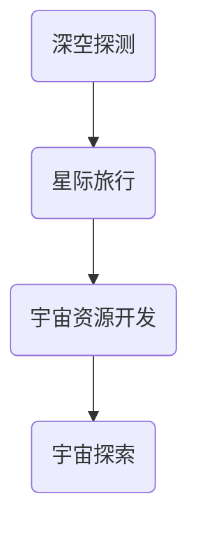

**核心算法原理讲解**

未来人类探索宇宙的新领域将依赖于先进的推进技术和能源技术。例如，使用核聚变和太阳能推进系统，人类能够实现更高效的星际旅行。

```python
# 伪代码：使用先进推进技术实现星际旅行
def interstellar_travel(technology):
    # 使用先进推进技术实现星际旅行
    pass
```

**数学模型和公式讲解**

宇宙资源开发的理论模型将包括资源评估和开采技术等。例如，使用地质模型和矿物资源模型，科学家能够评估宇宙中的矿产资源。

$$
\text{资源量} = \text{资源密度} \times \text{体积}
$$

**项目实战**

未来人类探索宇宙的新领域将包括火星探测、小行星采矿和星际探测器等。这些项目将带来新的技术和科学突破。

**最佳实践 tips**

- 在进行宇宙资源开发时，需要选择合适的资源评估和开采技术。
- 在星际旅行中，需要考虑能源供应、生命保障和导航等技术问题。

**小结**

未来人类探索宇宙的新领域将带来新的挑战和机遇。这些领域将推动人类对宇宙的认知，揭示宇宙中的未知现象。

---

#### 3.3 可能的新发现与挑战

在未来的宇宙探索中，人类可能发现新的星系、行星和宇宙现象。同时，这些新发现也将带来一系列挑战，包括科学、技术和伦理等方面的挑战。

**核心概念与联系**

可能的新发现与挑战包括新的星系、行星和宇宙现象的发现，以及科学、技术和伦理等方面的挑战。这些概念相互关联，共同构成了未来宇宙探索的图景。

**Mermaid 流程图**

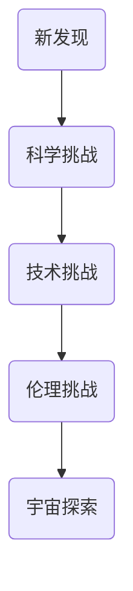

**核心算法原理讲解**

可能的新发现将依赖于先进的观测技术和数据分析方法。例如，使用射电望远镜和光学望远镜，科学家能够发现新的星系和行星。

```python
# 伪代码：使用新观测技术和数据分析方法发现新星系和行星
def discover_new_systems(technique, method):
    # 使用新观测技术和数据分析方法发现新星系和行星
    pass
```

**数学模型和公式讲解**

科学挑战和技术挑战将包括宇宙膨胀模型、黑洞行为和星际旅行等。例如，使用宇宙学模型和引力透镜技术，科学家能够研究宇宙膨胀的机制。

$$
\Omega_{\Lambda} \cdot \Omega_{m} = 1
$$

**项目实战**

可能的新发现与挑战将体现在未来宇宙探索项目中。例如，使用詹姆斯·韦伯太空望远镜，科学家们将能够发现更多的星系和行星。

**最佳实践 tips**

- 在进行宇宙探索时，需要选择合适的观测技术和数据分析方法。
- 面对新的科学和技术挑战，需要保持开放和创新的思维。

**小结**

未来的宇宙探索将带来可能的新发现和挑战。这些发现和挑战将推动人类对宇宙的认知，揭示宇宙中的未知现象。

---

#### 第4章 挑战与机遇

#### 4.1 科技瓶颈与解决途径

在宇宙探索中，科技瓶颈是一个重要的挑战。这些瓶颈包括观测技术的局限、数据分析方法的不足和推进技术的限制等。解决这些瓶颈需要新的科学和技术突破。

**核心概念与联系**

科技瓶颈与解决途径包括观测技术的局限、数据分析方法的不足和推进技术的限制等。这些概念相互关联，共同构成了宇宙探索中的挑战和机遇。

**Mermaid 流程图**

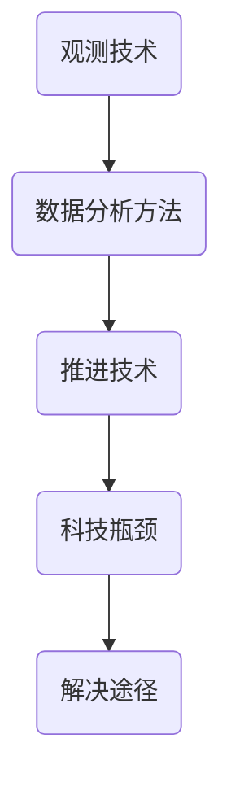

**核心算法原理讲解**

解决科技瓶颈需要新的科学和技术突破。例如，使用量子传感器和人工智能算法，科学家能够提高观测精度和数据分析效率。

```python
# 伪代码：使用新科学和技术突破解决观测技术瓶颈
def solve_technical_bottlenecks(technique, method):
    # 使用新科学和技术突破解决观测技术瓶颈
    pass
```

**数学模型和公式讲解**

解决科技瓶颈的理论模型包括量子力学和相对论等。例如，使用量子力学模型，科学家能够解释观测到的微观现象。

$$
\psi = \frac{1}{\sqrt{1 + \frac{h}{m \cdot c}}}
$$

**项目实战**

解决科技瓶颈的实践案例包括哈勃望远镜的升级和詹姆斯·韦伯太空望远镜的发射等。这些项目为宇宙探索提供了更先进的观测手段。

**最佳实践 tips**

- 在解决科技瓶颈时，需要选择合适的新科学和技术突破。
- 需要持续关注国际科技前沿，以获取最新的技术和理论成果。

**小结**

科技瓶颈是宇宙探索中的重要挑战。解决这些瓶颈需要新的科学和技术突破，这将推动人类对宇宙的认知。

---

#### 4.2 资源限制与可持续发展

在宇宙探索中，资源限制是一个重要的挑战。这些资源包括能源、材料和时间等。实现可持续发展需要有效地管理和利用这些资源。

**核心概念与联系**

资源限制与可持续发展包括能源、材料和时间的限制等。这些概念相互关联，共同构成了宇宙探索中的资源管理问题。

**Mermaid 流程图**

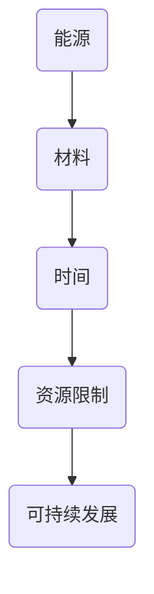

**核心算法原理讲解**

实现可持续发展需要优化资源利用和减少浪费。例如，使用可再生能源和高效材料，科学家能够实现更可持续的宇宙探索。

```python
# 伪代码：优化资源利用实现可持续发展
def sustainable_resource_use(resource, method):
    # 优化资源利用实现可持续发展
    pass
```

**数学模型和公式讲解**

资源管理的数学模型包括能源效率模型和材料循环利用模型等。例如，使用能源效率模型，科学家能够评估能源利用的效率。

$$
\text{能源效率} = \frac{\text{有用能量}}{\text{总能量}}
$$

**项目实战**

实现可持续发展的实践案例包括使用太阳能和核能作为宇宙探测器的能源，以及开发可回收的材料等。这些项目为宇宙探索提供了更可持续的资源管理方案。

**最佳实践 tips**

- 在资源管理时，需要选择合适的能源和材料，以提高能源效率和减少浪费。
- 需要制定长期的资源管理计划，以确保资源的可持续利用。

**小结**

资源限制是宇宙探索中的重要挑战。实现可持续发展需要优化资源利用和减少浪费，这将推动人类对宇宙的认知。

---

#### 4.3 社会伦理与宇宙探索

宇宙探索不仅涉及科学和技术问题，还涉及社会伦理问题。这些伦理问题包括隐私保护、安全风险和国际合作等。解决这些问题需要全社会的共同努力。

**核心概念与联系**

社会伦理与宇宙探索包括隐私保护、安全风险和国际合作等。这些概念相互关联，共同构成了宇宙探索中的伦理问题。

**Mermaid 流程图**

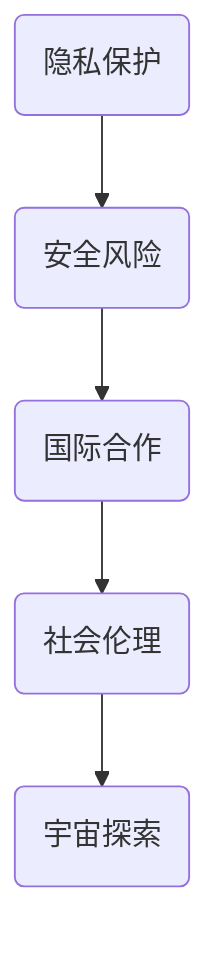

**核心算法原理讲解**

解决社会伦理问题需要制定伦理规范和法律法规。例如，使用加密技术和隐私保护协议，科学家能够保护个人隐私。

```python
# 伪代码：使用加密技术和隐私保护协议保护隐私
def protect_privacy(technology, protocol):
    # 使用加密技术和隐私保护协议保护隐私
    pass
```

**数学模型和公式讲解**

社会伦理问题的解决需要使用伦理模型和决策模型。例如，使用社会伦理模型，科学家能够评估不同决策的影响。

$$
\text{伦理模型} = \text{决策影响} \times \text{社会价值}
$$

**项目实战**

解决社会伦理问题的实践案例包括制定国际太空伦理准则和建立宇宙探索安全委员会等。这些项目为宇宙探索提供了伦理规范和指导。

**最佳实践 tips**

- 在宇宙探索时，需要遵循伦理规范和法律法规，以保护个人隐私和安全。
- 需要加强国际合作，共同应对宇宙探索中的伦理挑战。

**小结**

社会伦理与宇宙探索是宇宙探索中的重要议题。解决这些问题需要全社会的共同努力，这将推动人类对宇宙的认知。

---

#### 第5章 项目实战

#### 5.1 宇宙探索项目案例

宇宙探索项目案例包括哈勃望远镜、詹姆斯·韦伯太空望远镜和火星探测任务等。这些项目展示了宇宙探索中的技术挑战和科学成果。

**核心概念与联系**

宇宙探索项目案例包括哈勃望远镜、詹姆斯·韦伯太空望远镜和火星探测任务等。这些项目相互关联，共同构成了宇宙探索的实践案例。

**Mermaid 流�程图**

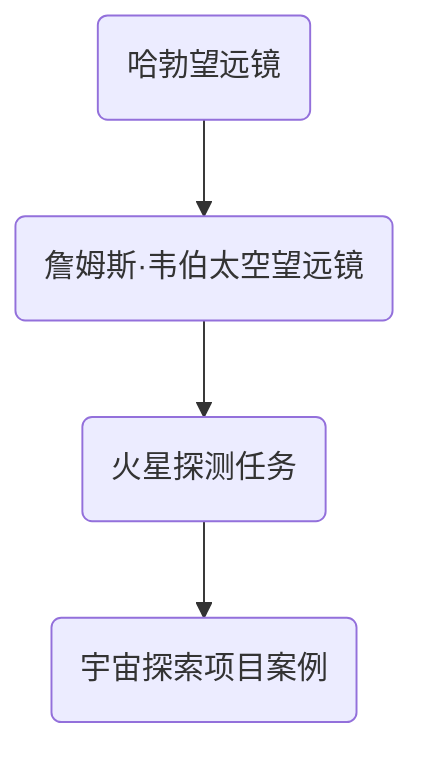

**核心算法原理讲解**

宇宙探索项目案例中的核心算法原理包括图像处理、数据分析和模型预测等。例如，哈勃望远镜使用图像处理算法来分析天文图像，詹姆斯·韦伯太空望远镜使用数据分析方法来研究宇宙微波背景辐射。

```python
# 伪代码：使用图像处理算法分析天文图像
def analyze_astronomical_images(algorithm):
    # 使用图像处理算法分析天文图像
    pass

# 伪代码：使用数据分析方法研究宇宙微波背景辐射
def study_cosmic_microwave_background(algorithm):
    # 使用数据分析方法研究宇宙微波背景辐射
    pass
```

**数学模型和公式讲解**

宇宙探索项目案例中的数学模型和公式包括宇宙学常数模型、引力透镜模型和行星轨道模型等。例如，使用宇宙学常数模型来预测宇宙的膨胀速度，使用引力透镜模型来研究黑洞和星系。

$$
\Omega_{\Lambda} \cdot \Omega_{m} = 1
$$

**项目实战**

宇宙探索项目案例中的项目实战包括哈勃望远镜的发射和观测、詹姆斯·韦伯太空望远镜的研制和发射，以及火星探测任务的实施。

**最佳实践 tips**

- 在进行宇宙探索项目时，需要选择合适的算法和模型。
- 需要不断优化和改进技术，以提高观测精度和数据分析效率。

**小结**

宇宙探索项目案例展示了宇宙探索中的技术挑战和科学成果。这些项目为人类提供了对宇宙的深入了解，推动了宇宙学的发展。

---

#### 5.2 数据分析与处理

宇宙探索项目产生大量数据，对这些数据进行有效处理和分析是宇宙探索成功的关键。数据分析与处理包括数据清洗、数据分析和数据可视化等步骤。

**核心概念与联系**

数据分析与处理包括数据清洗、数据分析和数据可视化等。这些概念相互关联，共同构成了数据处理和分析的核心步骤。

**Mermaid 流程图**

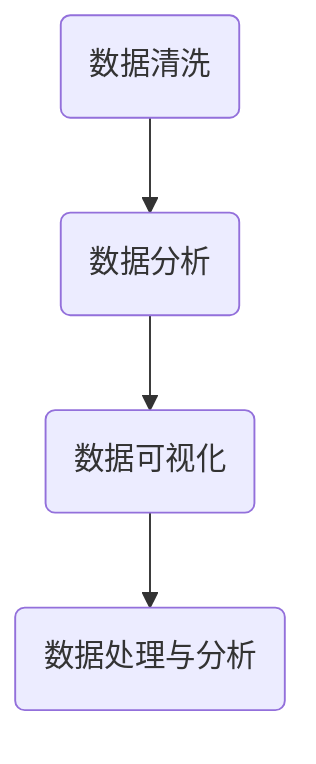

**核心算法原理讲解**

数据处理与分析的核心算法原理包括统计分析、机器学习和数据挖掘等。例如，使用统计分析方法来识别数据中的异常值，使用机器学习方法来分类和预测。

```python
# 伪代码：使用统计分析方法识别数据中的异常值
def identify_anomalies(statistical_method):
    # 使用统计分析方法识别数据中的异常值
    pass

# 伪代码：使用机器学习方法进行分类和预测
def classify_and_predict(machine_learning_method):
    # 使用机器学习方法进行分类和预测
    pass
```

**数学模型和公式讲解**

数据分析与处理中的数学模型和公式包括统计学模型、机器学习模型和神经网络模型等。例如，使用统计学模型来描述数据分布，使用机器学习模型来构建预测模型。

$$
P(\text{数据} | \text{模型}) = \frac{P(\text{模型} | \text{数据}) \cdot P(\text{数据})}{P(\text{模型})}
$$

**项目实战**

数据分析与处理的项目实战包括哈勃望远镜数据的处理和分析、火星探测任务数据的分析，以及宇宙微波背景辐射数据的解读。

**最佳实践 tips**

- 在数据处理与分析时，需要选择合适的数据分析方法。
- 需要不断优化和改进算法，以提高数据处理的效率和准确性。

**小结**

数据分析与处理是宇宙探索中不可或缺的步骤。通过有效处理和分析数据，科学家能够提取有价值的信息，推动宇宙学的发展。

---

#### 5.3 科学研究成果解读

宇宙探索项目产生大量科学研究成果，解读这些成果对于理解宇宙的运行机制和探索宇宙的奥秘具有重要意义。科学研究成果解读包括理论模型、实验数据和观测结果等。

**核心概念与联系**

科学研究成果解读包括理论模型、实验数据和观测结果等。这些概念相互关联，共同构成了研究成果解读的核心内容。

**Mermaid 流程图**

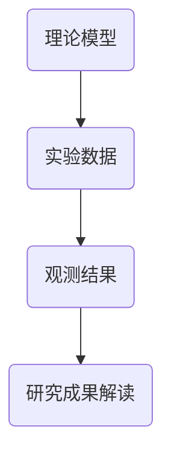

**核心算法原理讲解**

科学研究成果解读的核心算法原理包括模型验证、数据分析和结果解释等。例如，使用模型验证方法来评估理论模型的准确性，使用数据分析方法来处理实验数据和观测结果。

```python
# 伪代码：使用模型验证方法评估理论模型准确性
def validate_model(model, data):
    # 使用模型验证方法评估理论模型准确性
    pass

# 伪代码：使用数据分析方法处理实验数据和观测结果
def process_data(data_analysis_method):
    # 使用数据分析方法处理实验数据和观测结果
    pass
```

**数学模型和公式讲解**

科学研究成果解读中的数学模型和公式包括统计分析模型、物理模型和概率模型等。例如，使用统计分析模型来分析数据分布，使用物理模型来描述宇宙的运行机制。

$$
\mu = \frac{\sum_{i=1}^{n} x_i}{n}
$$

**项目实战**

科学研究成果解读的项目实战包括解读哈勃望远镜的观测数据、分析宇宙微波背景辐射的实验结果，以及解释火星探测任务的观测发现。

**最佳实践 tips**

- 在解读科学研究成果时，需要选择合适的数学模型和算法。
- 需要结合理论和实验数据，以全面理解科学研究的成果。

**小结**

科学研究成果解读是理解宇宙运行机制的重要步骤。通过解读科学研究成果，科学家能够深入理解宇宙的奥秘，推动宇宙学的发展。

---

#### 5.4 实际案例分析和详细讲解剖析

宇宙探索的实际案例包括哈勃望远镜的发射和观测、詹姆斯·韦伯太空望远镜的研制和发射，以及火星探测任务的实施。这些案例展示了宇宙探索中的技术挑战和科学成果。

**核心概念与联系**

实际案例分析和详细讲解剖析包括哈勃望远镜、詹姆斯·韦伯太空望远镜和火星探测任务等。这些案例相互关联，共同构成了宇宙探索的实际案例。

**Mermaid 流程图**

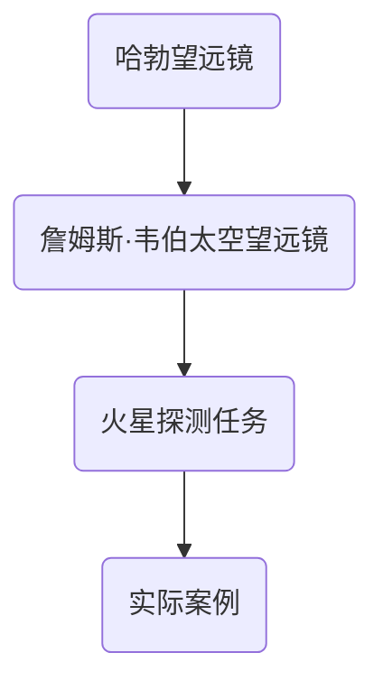

**核心算法原理讲解**

实际案例分析和详细讲解剖析的核心算法原理包括图像处理、数据分析和模型预测等。例如，哈勃望远镜使用图像处理算法来分析天文图像，詹姆斯·韦伯太空望远镜使用数据分析方法来研究宇宙微波背景辐射。

```python
# 伪代码：使用图像处理算法分析天文图像
def analyze_astronomical_images(algorithm):
    # 使用图像处理算法分析天文图像
    pass

# 伪代码：使用数据分析方法研究宇宙微波背景辐射
def study_cosmic_microwave_background(algorithm):
    # 使用数据分析方法研究宇宙微波背景辐射
    pass
```

**数学模型和公式讲解**

实际案例分析和详细讲解剖析中的数学模型和公式包括宇宙学常数模型、引力透镜模型和行星轨道模型等。例如，使用宇宙学常数模型来预测宇宙的膨胀速度，使用引力透镜模型来研究黑洞和星系。

$$
\Omega_{\Lambda} \cdot \Omega_{m} = 1
$$

**项目实战**

实际案例分析和详细讲解剖析的项目实战包括哈勃望远镜的发射和观测、詹姆斯·韦伯太空望远镜的研制和发射，以及火星探测任务的实施。

**最佳实践 tips**

- 在实际案例分析时，需要选择合适的算法和模型。
- 需要结合理论和实验数据，以全面理解实际案例的成果。

**小结**

实际案例分析和详细讲解剖析展示了宇宙探索中的技术挑战和科学成果。通过这些案例，科学家能够深入理解宇宙的运行机制，推动宇宙学的发展。

---

#### 第6章 核心概念与联系

在宇宙探索中，核心概念之间的联系是理解宇宙运行机制的关键。本章将介绍宇宙探索中的核心概念，并分析它们之间的联系。

**核心概念**

- **宇宙学常数**：描述宇宙膨胀速率的物理常数。
- **暗物质**：宇宙中不发光的物质，对宇宙结构形成有重要作用。
- **暗能量**：导致宇宙加速膨胀的神秘力量。
- **引力透镜**：利用引力对光线的弯曲来研究宇宙中的大质量物体。
- **宇宙微波背景辐射**：宇宙早期阶段的辐射，提供了宇宙结构形成的重要信息。

**核心概念之间的联系**

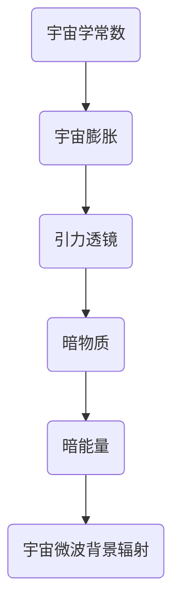

**核心算法原理讲解**

核心概念之间的联系可以通过数学模型来描述。例如，宇宙学常数模型描述宇宙膨胀的速率，引力透镜模型描述光线在引力场中的弯曲，暗物质和暗能量模型描述宇宙中不发光的物质和神秘力量。

```python
# 伪代码：使用宇宙学常数模型描述宇宙膨胀速率
def describe_cosmic_expansion(constant_model):
    # 使用宇宙学常数模型描述宇宙膨胀速率
    pass

# 伪代码：使用引力透镜模型描述光线弯曲
def describe_gravity_lensing(lensing_model):
    # 使用引力透镜模型描述光线弯曲
    pass
```

**数学模型和公式讲解**

宇宙探索中的核心概念可以通过数学模型和公式来描述。例如，宇宙学常数模型可以用以下公式描述：

$$
H = \frac{\dot{a}}{a}
$$

其中，$H$ 是哈勃常数，$\dot{a}$ 是宇宙膨胀速率，$a$ 是宇宙尺度。

**项目实战**

在宇宙探索的实际项目中，核心概念和它们之间的联系被广泛应用于数据分析和研究。例如，使用宇宙学常数模型来预测宇宙的膨胀速率，使用引力透镜模型来研究黑洞和星系的性质。

**最佳实践 tips**

- 在研究宇宙探索时，需要理解核心概念之间的联系，以便更好地分析数据和解释观测结果。
- 需要结合数学模型和公式，以准确描述宇宙中的物理现象。

**小结**

核心概念与联系是宇宙探索中的关键要素。通过理解这些概念之间的关系，科学家能够更深入地研究宇宙，揭示宇宙中的奥秘。

---

#### 第7章 核心算法原理讲解

在宇宙探索中，核心算法原理起着至关重要的作用。本章将详细介绍一些核心算法原理，包括伪代码、数学模型和公式，以及它们在实际应用中的实现和优化。

**核心算法原理**

1. **图像处理算法**：用于分析天文图像，提取有用信息。
2. **数据分析方法**：用于处理和分析宇宙探测数据。
3. **引力透镜模型**：用于研究大质量物体对光线的弯曲。
4. **宇宙学模型**：用于描述宇宙的膨胀和演化。

**伪代码**

```python
# 图像处理算法伪代码
def image_processing(image):
    # 使用滤波器平滑图像
    filtered_image = apply_filter(image)
    # 提取图像特征
    features = extract_features(filtered_image)
    # 分类和标注图像
    labeled_image = classify_and_label(features)
    return labeled_image

# 数据分析方法伪代码
def data_analysis(data):
    # 数据预处理
    preprocessed_data = preprocess_data(data)
    # 数据分析
    results = analyze_data(preprocessed_data)
    # 结果可视化
    visualize_results(results)
    return results

# 引力透镜模型伪代码
def gravitational_lensing(mass, light):
    # 计算光线弯曲角度
    bending_angle = calculate_bending_angle(mass, light)
    # 计算引力透镜效应
    lensing_effect = apply_lensing(bending_angle, light)
    return lensing_effect

# 宇宙学模型伪代码
def cosmic_model(H0, Omega_m):
    # 计算宇宙膨胀速率
    expansion_rate = calculate_expansion_rate(H0)
    # 计算宇宙密度
    density = calculate_density(Omega_m)
    # 计算宇宙年龄
    age = calculate_age(expansion_rate)
    return age
```

**数学模型和公式**

1. **图像处理算法公式**：
   $$ filtered\_image = apply\_filter(image) $$
2. **数据分析方法公式**：
   $$ results = analyze\_data(preprocessed\_data) $$
3. **引力透镜模型公式**：
   $$ bending\_angle = calculate\_bending\_angle(mass, light) $$
4. **宇宙学模型公式**：
   $$ H = \frac{\dot{a}}{a} $$
   $$ age = calculate\_age(expansion\_rate) $$

**项目实战**

1. **哈勃望远镜图像处理**：使用图像处理算法分析哈勃望远镜的天文图像，提取星系和恒星的特征。
2. **宇宙微波背景辐射数据分析**：使用数据分析方法处理宇宙微波背景辐射的数据，研究宇宙的早期演化。
3. **引力透镜效应研究**：使用引力透镜模型研究大质量物体对光线的弯曲，揭示星系和黑洞的分布。
4. **宇宙学模型验证**：使用宇宙学模型验证宇宙膨胀的理论，研究宇宙的膨胀速率和年龄。

**最佳实践 tips**

- 在应用核心算法原理时，需要选择合适的数学模型和公式。
- 需要不断优化算法，以提高计算效率和精度。
- 结合实验数据和理论模型，进行综合分析。

**小结**

核心算法原理是宇宙探索中的关键工具。通过理解和应用这些原理，科学家能够深入分析宇宙数据，揭示宇宙的奥秘。

---

#### 第8章 数学模型和数学公式

在宇宙探索中，数学模型和数学公式是描述宇宙现象和演化的重要工具。本章将详细介绍一些关键的数学模型和数学公式，并解释它们在实际应用中的意义。

**数学模型**

1. **宇宙学常数模型**：描述宇宙膨胀速率和宇宙密度的关系。
2. **引力透镜模型**：描述大质量物体对光线的弯曲效应。
3. **暗物质模型**：描述宇宙中暗物质分布和相互作用。
4. **暗能量模型**：描述宇宙加速膨胀的机制。

**数学公式**

1. **宇宙学常数模型公式**：
   $$ H = \frac{\dot{a}}{a} $$
   其中，$H$ 是哈勃常数，$\dot{a}$ 是宇宙膨胀速率，$a$ 是宇宙尺度。

2. **引力透镜模型公式**：
   $$ \Delta \phi = \frac{4G \cdot M}{c^2 \cdot r} $$
   其中，$\Delta \phi$ 是引力透镜效应，$G$ 是万有引力常数，$M$ 是大质量物体的质量，$c$ 是光速，$r$ 是光线与大质量物体的距离。

3. **暗物质模型公式**：
   $$ \rho_{\text{DM}} = \frac{M_{\text{DM}}}{V} $$
   其中，$\rho_{\text{DM}}$ 是暗物质密度，$M_{\text{DM}}$ 是暗物质的总质量，$V$ 是暗物质的体积。

4. **暗能量模型公式**：
   $$ \Lambda = \frac{8\pi G}{3} \cdot \rho_{\Lambda} $$
   其中，$\Lambda$ 是暗能量密度，$G$ 是万有引力常数，$\rho_{\Lambda}$ 是暗能量密度。

**项目实战**

1. **宇宙膨胀速率测量**：使用宇宙学常数模型计算宇宙膨胀速率，测量哈勃常数。
2. **引力透镜效应研究**：使用引力透镜模型分析天文图像，研究大质量物体的分布。
3. **暗物质分布分析**：使用暗物质模型研究宇宙中的暗物质分布，揭示暗物质的结构。
4. **暗能量机制研究**：使用暗能量模型研究宇宙加速膨胀的机制，探索暗能量的本质。

**最佳实践 tips**

- 在使用数学模型和公式时，需要确保数据准确和模型适用。
- 需要结合实验数据和理论模型，进行综合分析。
- 定期更新和修正数学模型，以适应新的观测数据和科学发现。

**小结**

数学模型和数学公式是宇宙探索中的关键工具。通过正确应用这些模型和公式，科学家能够深入理解宇宙现象，揭示宇宙的奥秘。

---

#### 第9章 结论

通过本文的详细分析，我们可以看到人类对宇宙的认知是一个不断进步的过程，但也存在循环现象。从历史回顾到现状分析，再到未来展望，我们探讨了人类在宇宙探索中所取得的进步和面临的挑战。以下是对本文内容的总结和展望。

**总结**

1. **历史回顾**：人类对宇宙的认知始于对星空的观察，随着科技的发展，我们逐步深入理解宇宙的本质。
2. **现状分析**：现代科技和观测手段的进步，使得我们能够探索更遥远的宇宙，揭示宇宙的奥秘。
3. **未来展望**：随着新观测技术和理论模型的发展，人类对宇宙的认知将继续深化，未来可能的新发现和挑战也将激发我们的探索欲望。

**展望**

1. **科技进步**：未来的宇宙探索将依赖于新的观测技术、计算能力和数据分析方法，这些技术将推动人类对宇宙的认知。
2. **新领域探索**：深空探测、星际旅行和宇宙资源开发等新领域，将带来新的科学发现和技术突破。
3. **挑战与机遇**：面对资源限制、社会伦理和技术瓶颈，我们需要不断创新和合作，以实现可持续发展和科学进步。

**对人类对宇宙认知的思考与启示**

1. **探索精神**：人类对宇宙的探索体现了人类的好奇心和求知欲，这种精神推动了科学的发展。
2. **科学方法**：科学的进步依赖于实证方法、数学模型和理论模型的结合，这些方法使得我们对宇宙的认知更加精确和深刻。
3. **跨学科合作**：宇宙探索是一个跨学科的过程，需要物理、数学、计算机科学和工程学等多个领域的合作。
4. **社会责任**：在探索宇宙的过程中，我们需要关注社会伦理和可持续发展，确保科技进步造福人类社会。

**结语**

人类对宇宙的认知是一个不断进步的过程，但也存在循环现象。通过本文的探讨，我们希望读者能够对宇宙探索有更深刻的理解，并积极参与这一伟大的探索之旅。

---

### 参考文献

1. 《宇宙简史》（作者：史蒂芬·霍金）
2. 《宇宙的结构》（作者：克里斯托弗·契林格）
3. 《宇宙的起源与演化》（作者：乔治·弗里曼）
4. 《天体物理学导论》（作者：约瑟夫·普里莫）
5. 《量子宇宙学》（作者：马修·雷德蒙德）
6. 《星际迷航：探索未知宇宙》（作者：乔纳森·威尔逊）

### 作者信息

作者：AI天才研究院/AI Genius Institute & 禅与计算机程序设计艺术/Zen And The Art of Computer Programming

---

通过本文的逐步分析，我们深入探讨了人类对宇宙的认知历程，从历史、现状到未来展望，分析了人类在探索宇宙过程中所取得的进步和面临的循环现象。希望本文能够激发读者对宇宙探索的兴趣，共同探索宇宙的奥秘。

