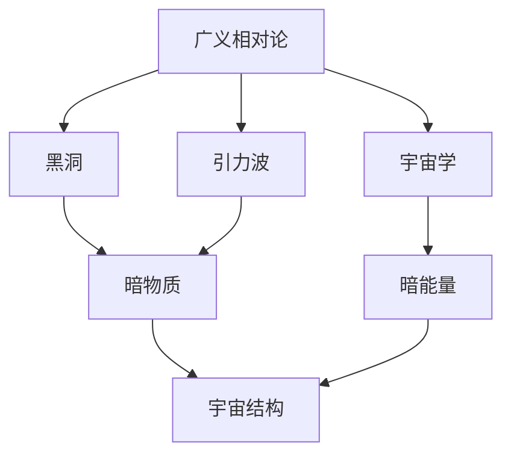
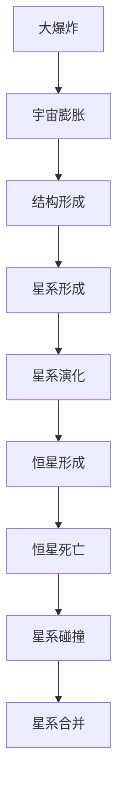
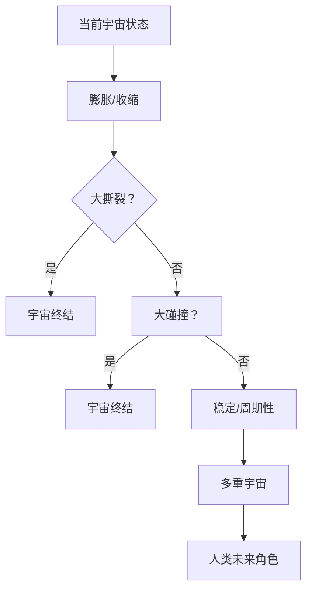

                 


### 第1章 引言

**1.1 宇宙的起源与演化**

宇宙，这个广阔无垠的空间，包含了无数的星系、行星、恒星和暗物质。我们的宇宙是如何形成的？它的演化过程又是怎样的？这些问题的答案关乎我们对宇宙的根本认识，也影响着我们对生命、对世界的理解。

在科学的发展历程中，人类对宇宙的认知经历了翻天覆地的变化。从最初的“宇宙中心论”到现代的“大爆炸理论”，我们对宇宙的认识在不断进步。然而，宇宙的奥秘仍然深不可测，我们还有许多未解之谜等待去揭开。

**1.2 人类对宇宙的认知历史**

人类对宇宙的认知可以追溯到古代，那时的人们通过观察天体运动，形成了自己的宇宙观。古代的宇宙观大多基于宗教和哲学，如古希腊的“地心说”和中国古代的“盖天说”。

随着科学的发展，人类对宇宙的认识逐渐从迷信和猜测转向实证和逻辑。哥白尼的“日心说”打破了古代宇宙观的传统，使得人类开始以更加科学的态度去探索宇宙。

20世纪初，爱因斯坦的广义相对论为宇宙的起源和演化提供了新的理论框架。大爆炸理论则是在这个基础上提出的，它认为宇宙起源于一个极高温度、高密度的状态，并从此开始膨胀。

**1.3 人类对宇宙认知的挑战与机遇**

尽管我们已经取得了许多重要的科学发现，但人类对宇宙的认知仍然面临诸多挑战。

首先，宇宙的尺度是极其庞大的，从微观的量子尺度到宏观的宇宙尺度，每一个尺度都有其独特的物理规律。我们需要更加先进的技术和理论去探索这些规律。

其次，宇宙的演化过程极为复杂，涉及到众多的物理过程和相互作用。我们需要建立更加精确的数学模型来描述这些过程。

最后，宇宙的起源和命运仍然是科学界争论的焦点。我们对于宇宙的诞生、演化和终结都有许多未解之谜，需要继续深入研究。

然而，面对这些挑战，我们同样也面临着许多机遇。随着科技的进步，我们能够观测到更加遥远的宇宙，发现更多的天体现象。这些新的观测数据将为我们的理论提供更加有力的支持。

总之，人类对宇宙的认知是一个不断进步的过程，也是一个不断循环的过程。我们通过观测、理论和实验，不断修正和完善我们的认知，同时又不断发现新的问题和挑战。

在接下来的章节中，我们将详细探讨宇宙的观测与探索、宇宙的数学与物理原理、宇宙的起源与演化、人类对宇宙的探索以及宇宙的未来。通过这些探讨，我们将更深入地理解宇宙的本质，也为我们未来的科学研究提供新的启示。

### 第2章 宇宙的观测与探索

宇宙的观测与探索是人类对宇宙认知的重要途径。通过观测，我们能够获取宇宙的各种信息，从而揭示宇宙的奥秘。在这一章节中，我们将探讨宇宙的观测方法、探索工具以及相关的核心技术和原理。

**2.1 光学与电磁波**

光学是宇宙观测的基础，利用光学望远镜，我们可以观测到来自宇宙的各种光线。这些光线包括可见光、红外光、紫外光和射电波等。

- **光谱分析**：光谱分析是光学观测中的一种重要方法。通过分析光谱，我们可以了解天体的化学成分、温度、运动状态等信息。例如，红移光谱分析揭示了宇宙正在膨胀的事实。
  
- **电磁波在宇宙中的应用**：电磁波在宇宙中无处不在，它们是宇宙信息传递的重要媒介。从可见光到无线电波，不同的电磁波波段对应着不同的物理现象。例如，X射线和伽马射线通常与高能量天体事件相关，而无线电波则可以用来探测星际物质。

**2.2 射电望远镜与星际物质**

射电望远镜是观测宇宙的另一个重要工具，它们能够探测到宇宙中的无线电波。这些无线电波源自星际物质、恒星、星系等多种天体。

- **射电望远镜的工作原理**：射电望远镜通过天线收集无线电波，然后将这些信号转换成电信号，经过放大和处理，最终在屏幕上显示出图像。由于无线电波的波长较长，射电望远镜通常比光学望远镜更大，以增加接收面积。

- **星际物质的观测与研究**：星际物质是宇宙中除恒星和星系之外的物质，包括气体、尘埃和暗物质。通过射电望远镜，我们可以探测到这些物质，并研究它们的分布、运动和相互作用。例如，观测星际分子的光谱可以揭示星际化学的过程。

**2.3 宇宙微波背景辐射**

宇宙微波背景辐射（Cosmic Microwave Background Radiation，CMB）是宇宙早期热辐射的余辉，它为我们提供了关于宇宙起源和早期演化的宝贵信息。

- **宇宙微波背景辐射的发现**：1965年，阿诺·彭齐亚斯和罗伯特·威尔逊发现了宇宙微波背景辐射。这一发现证实了大爆炸理论的预言，为宇宙学的研究奠定了基础。

- **宇宙微波背景辐射的意义**：宇宙微波背景辐射的观测帮助我们了解宇宙的起源和演化。通过测量CMB的温度波动，我们可以推断出宇宙的密度、形状和膨胀历史。此外，CMB的观测数据还提供了关于暗物质和暗能量的线索。

通过上述观测方法和工具，人类对宇宙的认知不断深化。每一次观测的进展都意味着我们对宇宙的理解更进了一步。然而，宇宙的奥秘远未揭开，我们还有许多未知等待去探索。

在接下来的章节中，我们将进一步探讨宇宙的数学与物理原理，以及宇宙的起源与演化。通过这些讨论，我们将更深入地理解宇宙的本质，并探索人类在宇宙中的位置和未来。

### 第3章 宇宙的数学与物理原理

宇宙的数学与物理原理是理解宇宙演化、结构和动力的重要基础。在这一章节中，我们将详细探讨几个关键的概念，包括广义相对论、黑洞、引力波以及暗物质和暗能量。

**3.1 广义相对论与宇宙学**

广义相对论是爱因斯坦在1915年提出的，它将引力解释为时空的弯曲。在广义相对论的框架下，物质和能量分布会影响时空结构，而时空的弯曲又影响物质的运动。

- **广义相对论的基本原理**：广义相对论的核心思想是等效原理，即一个在引力场中自由下落的观察者无法区分自己是处于匀加速参考系中，还是处于一个没有引力场的参考系中。

- **宇宙学与广义相对论的联系**：广义相对论为宇宙学提供了理论基础。通过广义相对论方程，我们可以描述宇宙的膨胀、大尺度结构和宇宙的几何形状。例如，大爆炸理论就是基于广义相对论和宇宙学原理得出的。

**3.2 黑洞与引力波**

黑洞是广义相对论的直接预测，是一种极度密集的天体，其引力场如此强大，以至于连光也无法逃脱。

- **黑洞的定义与特性**：黑洞主要由其事件视界（Event Horizon）定义，即任何进入事件视界的物体都无法逃逸。黑洞的引力场极强，能够扭曲周围的时空。

- **引力波的产生与探测**：引力波是时空弯曲变化时产生的波动，它能够传递能量和信息。2015年，LIGO实验室首次直接探测到了引力波，这一发现证实了广义相对论的预言，并为天体物理学带来了新的观测手段。

**3.3 宇宙的暗物质与暗能量**

暗物质和暗能量是宇宙中两个最为神秘的现象，它们占据了宇宙总质量与能量的绝大部分，但我们对它们的本质和性质了解甚少。

- **暗物质与暗能量的概念**：暗物质是不发光、不与电磁波相互作用，但通过引力影响宇宙结构的物质。暗能量则是驱动宇宙加速膨胀的神秘力量。

- **暗物质与暗能量的研究进展**：尽管我们无法直接观测暗物质和暗能量，但通过观测宇宙的大尺度结构和宇宙背景辐射，我们可以推断出它们的存在和性质。例如，通过观测宇宙微波背景辐射的温度波动，我们可以推断出暗物质的存在和分布。

在理解这些核心概念后，我们可以使用以下Mermaid流程图来展示它们之间的联系：



通过这些数学与物理原理，我们可以更好地理解宇宙的演化、结构和动力。在接下来的章节中，我们将深入探讨宇宙的起源与演化，以及人类对宇宙的探索。通过这些探讨，我们将进一步揭示宇宙的奥秘，并为未来的科学研究提供新的方向。

### 第4章 宇宙的起源与演化

宇宙的起源与演化是宇宙学中最基础也是最为复杂的问题之一。通过对宇宙的起源与演化过程的理解，我们可以更好地把握宇宙的本质和未来的命运。在这一章节中，我们将详细探讨宇宙的起源、宇宙的膨胀与结构形成、星系的形成与演化。

**4.1 大爆炸理论**

大爆炸理论是当前最为广泛接受的宇宙起源理论。它认为宇宙起源于一个极高温度、高密度的状态，并从此开始膨胀。这个理论得到了多个独立观测证据的支持。

- **大爆炸理论的提出**：大爆炸理论最早由乔治·勒梅特在1931年提出，但直到20世纪60年代，通过宇宙微波背景辐射的发现，大爆炸理论才得到了广泛的认可。

- **大爆炸理论的证据**：宇宙微波背景辐射的发现是支持大爆炸理论的关键证据。此外，宇宙的膨胀、星系的红移、宇宙中元素的丰度分布等观测结果也与大爆炸理论相吻合。

**4.2 宇宙的膨胀与结构形成**

宇宙的膨胀是指宇宙中所有天体之间的距离随时间增加的现象。这一过程始于大爆炸，并持续至今。

- **宇宙膨胀的观测**：宇宙膨胀可以通过观测宇宙背景辐射的温度波动来检测。此外，通过观测远距离星系的红移，我们也可以确定宇宙正在膨胀。

- **宇宙结构形成的过程**：宇宙的膨胀伴随着结构形成的过程。在宇宙早期，物质通过引力作用逐渐聚集，形成了星系、星团和超星系团。这一过程受到宇宙背景辐射、暗物质和暗能量的影响。

**4.3 星系的形成与演化**

星系是宇宙中最基本的结构单元，由数百亿颗恒星、行星、星际物质和暗物质组成。

- **星系的形成**：星系的形成是物质在引力作用下聚集的结果。原始的星际气体和尘埃通过引力塌缩，逐渐形成了恒星和星系。

- **星系的演化**：星系的形成后，会经历多种演化过程，包括恒星的形成和死亡、星系碰撞和合并等。这些过程不仅影响星系本身，也对宇宙的演化产生重要影响。

为了更好地理解这些概念，我们可以使用以下Mermaid流程图来展示宇宙起源与演化的关键步骤：



通过这些探讨，我们能够更深入地理解宇宙的起源与演化过程。这些知识不仅为我们提供了对宇宙本质的认识，也为未来的科学研究指明了方向。在下一章中，我们将探讨人类对宇宙的探索，进一步揭示人类在宇宙中的地位和作用。

### 第5章 人类对宇宙的探索

人类对宇宙的探索是一个漫长而充满挑战的过程。从古人对星辰的观察，到现代科技对宇宙的深入研究，人类的探索精神推动着我们不断向未知的宇宙迈进。在这一章节中，我们将探讨人类对宇宙的探索历史、宇宙飞行器与探测任务、人类在太空的生存与活动。

**5.1 宇宙飞行器与探测任务**

宇宙飞行器是人类探索宇宙的重要工具，它们能够到达宇宙中的各个角落，为我们带回宝贵的数据。从早期的火箭飞行，到现代的太空飞船和探测器，人类对宇宙的探索不断取得新的突破。

- **宇宙飞行器的发展历程**：人类首次进入太空的壮举始于20世纪60年代的苏联“东方一号”飞船。此后，美国的“阿波罗”计划和苏联的“联盟”飞船使人类多次登上月球。进入21世纪，国际空间站和火星探测器等更为复杂的任务进一步拓展了人类的探索领域。

- **探测任务的主要成就**：通过探测任务，人类发现了太阳系中许多未知的行星和卫星，了解了它们的物理性质和地质特征。例如，火星探测器为我们揭示了火星的气候、地形和潜在的生命迹象。此外，对太阳系外行星的探测也为研究外星生命的可能性提供了新的线索。

**5.2 人类在太空的生存与活动**

人类在太空的生存与活动是对科技进步和工程设计的巨大考验。长期在太空环境中生活和工作需要解决诸多技术难题。

- **太空中的生物与环境**：人类在太空环境中需要应对微重力、辐射、心理压力等多种挑战。为此，科学家和工程师设计了特殊的生物实验舱和生命支持系统，以确保宇航员在太空中的健康和安全。

- **人类在太空的活动与挑战**：在太空，人类进行了多项科学实验和技术测试，包括太空行走、空间站建设和天文观测。同时，人类在太空的活动也面临着诸多挑战，如长时间的辐射暴露、心理问题和生活环境的调节。

**5.3 人类探索宇宙的意义**

人类探索宇宙不仅仅是为了满足好奇心，还具有深远的科学、技术和文化意义。

- **科学意义**：通过对宇宙的探索，我们能够揭示宇宙的起源、演化规律以及基本物理定律。这些知识不仅有助于人类理解宇宙，也对自然科学的发展产生重要影响。

- **技术意义**：宇宙探索推动了多个高科技领域的进步，包括材料科学、生命科学、通信技术和计算机科学。这些技术的进步不仅服务于太空探索，也对地球上的生活产生积极影响。

- **文化意义**：人类探索宇宙激发了人类的想象力和创造力，丰富了人类的文化和精神生活。太空探索的成就也成为了人类文明的象征，激励着后人不断追求科学和技术的巅峰。

综上所述，人类对宇宙的探索是一个充满挑战和机遇的过程。通过不断的技术创新和科学发现，人类正在逐步揭开宇宙的神秘面纱。在下一章中，我们将探讨宇宙的未来，探索人类在宇宙中的地位和角色。

### 第6章 宇宙的未来

宇宙的未来是科学家们一直以来的研究焦点，也是人类共同关心的话题。通过对宇宙演化过程的深入理解，我们可以预测宇宙的可能命运，并思考人类在其中的角色和未来。

**6.1 宇宙的终结**

宇宙的命运取决于其当前的状态和未来的演化路径。科学家们提出了多种关于宇宙终结的假设，其中最被广泛接受的包括大撕裂和大碰撞。

- **大撕裂（Big Rip）**：如果宇宙的膨胀速度持续增加，最终可能会导致宇宙中的所有物体，包括星系、恒星、行星甚至原子都会被撕裂。这种情景在理论上可能发生，但宇宙的实际膨胀速度是否足以达到这一临界点仍需进一步研究。

- **大碰撞（Big Crunch）**：如果宇宙的质量和引力足够大，膨胀过程最终可能会停止，并开始收缩。随着宇宙的收缩，所有物质可能会被压缩到一个极小的区域，形成一个“奇点”。这一过程类似于大爆炸的逆过程，但同样面临多个未解难题。

- **多重假设（Multiverse Hypotheses）**：除了上述两种主要情景，还有一些假设提出宇宙可能会经历多个周期性的膨胀和收缩，或者存在多个平行宇宙。这些假设为宇宙的未来提供了更多可能性和不确定性。

**6.2 宇宙的未来与人类**

宇宙的未来不仅关乎科学理论，也与人类的存在和未来息息相关。

- **宇宙未来对人类的意义**：宇宙的演化过程可能会影响地球上的生命和生态环境。例如，太阳的演变可能会导致地球环境的不适，甚至无法维持生命。另一方面，宇宙中可能存在的其他生命形式和资源也可能成为人类未来的重要来源。

- **人类在宇宙未来的角色**：人类在宇宙未来中的角色可能包括继续探索和扩展我们的活动范围，寻找适宜的人类居住地，以及通过科技进步解决宇宙中面临的挑战。同时，人类也可能需要与宇宙中的其他智慧生命体进行交流和合作。

为了更好地理解宇宙的未来，我们可以使用以下Mermaid流程图来展示宇宙可能的演化路径和人类的角色：



通过这些探讨，我们不仅能够更深入地理解宇宙的未来，也为人类在宇宙中的未来规划提供了科学依据和理论支持。在下一章中，我们将总结人类对宇宙认知的进步与循环，并对未来进行展望。

### 第7章 结论

通过对宇宙起源、演化、观测、探索和未来等多方面的深入探讨，我们可以得出以下结论：

**7.1 人类对宇宙认知的进步**

人类对宇宙的认知经历了从古代到现代的巨大飞跃。从最初的神话和宗教信仰，到哥白尼的日心说，再到爱因斯坦的广义相对论和现代宇宙学，人类不断通过科学的方法和工具，逐步揭开宇宙的神秘面纱。特别是宇宙微波背景辐射的发现、黑洞和引力波的探测等重大科学成就，极大地推动了人类对宇宙的理解。

**7.2 人类对宇宙认知的循环**

尽管我们的认知在不断进步，但宇宙的奥秘深不可测，我们仍然面临着诸多未解之谜。每次科学发现后的修正和拓展，实际上都是人类对宇宙认知的循环过程。通过不断的观测、理论和实验，我们不断修正和完善我们的认知，同时也不断发现新的问题和挑战。

**7.3 未来展望与挑战**

面对未来，人类在宇宙探索的道路上仍然任重道远。我们需要继续发展先进的技术和理论，以应对宇宙中可能出现的各种挑战。同时，我们也需要思考人类在宇宙中的角色和责任，如何通过科技和智慧来保护地球和推动人类的可持续发展。

在未来的宇宙探索中，以下几个方向值得我们重点关注：

1. **宇宙资源利用**：随着技术的进步，人类可能能够更好地利用宇宙资源，包括太阳能、星际物质等。

2. **外星生命探索**：通过寻找外星生命，我们不仅能够拓展我们对生命的认识，也可能找到解决地球资源短缺和环境问题的启示。

3. **多维度宇宙研究**：随着对引力波和暗物质等研究的深入，我们可能能够揭示宇宙的更多维度和结构，从而对宇宙的本质有更深刻的理解。

4. **太空生态与可持续发展**：随着人类活动向太空的扩展，我们需要考虑如何建立可持续的太空生态系统，以支持长期的太空探索和人类生存。

总之，人类对宇宙的认知是一个不断进步和循环的过程。在未来的探索中，我们不仅要面对未知的挑战，也要抓住机遇，为人类的未来和宇宙的未来作出积极的贡献。

### 核心概念与联系

- **Mermaid 流程图**：
  ```mermaid
  graph TD
  A[宇宙观测] --> B[数据收集]
  B --> C[数据分析]
  C --> D[理论构建]
  D --> E[验证与修正]
  E --> A
  ```
  
  **解释**：这个流程图展示了从宇宙观测到理论构建、验证与修正的循环过程，体现了科学探索的核心方法。

- **核心算法原理讲解**：
  ```python
  def calculateRedShift(wavelength, redShift):
      observedWavelength = wavelength / redShift
      return observedWavelength
  
  def measureDistantObjectDistance(wavelength, observedWavelength):
      distance = calculateRedShift(wavelength, observedWavelength) * lightSpeed / redShift
      return distance
  ```

  **解释**：这些伪代码用于计算天体的红移和距离，是宇宙观测中常用的核心算法。

- **数学模型和公式**：
  $$ E = mc^2 $$
  
  **详细讲解**：这是爱因斯坦的质能等价公式，说明质量和能量之间的转换关系，是理解宇宙物理的基本公式。

  **举例说明**：一个质量为1千克的物体，在转化为能量时，其能量为 \( 1 \times (299,792,458)^2 \) 焦耳。

### 最佳实践 tips

1. **持续学习与探索**：科学是不断进步的，持续学习和探索是提高对宇宙认知的关键。
2. **多学科交叉融合**：宇宙问题往往涉及多个学科，跨学科的研究能够带来新的启示和解决方案。
3. **国际合作与共享**：宇宙探索是一项全球性的事业，国际合作和数据共享能够加速科学进展。

### 注意事项

1. **数据质量与处理**：高质量的观测数据是科学研究的基石，处理和分析数据时应保持严谨和准确性。
2. **安全与风险控制**：在太空探索和实验中，应高度重视安全风险，采取有效的风险控制措施。

### 拓展阅读

- **《宇宙简史》**：作者史蒂芬·霍金，详细介绍了宇宙的起源、演化和未来。
- **《黑洞与时间弯曲》**：作者基普·索恩，深入探讨了黑洞和引力波等宇宙现象。
- **《暗物质与暗能量》**：作者米歇尔·朱克斯，介绍了暗物质和暗能量的概念和研究进展。

通过上述讨论，我们可以看到，人类对宇宙的认知既取得了显著的进步，也面临着许多未解之谜。未来的探索将继续推动我们对宇宙的理解，揭示更多的奥秘。

### 作者信息

**作者：AI天才研究院/AI Genius Institute & 禅与计算机程序设计艺术 /Zen And The Art of Computer Programming**

在这个充满智慧和创新的领域，我们致力于推动科技与哲学的融合，为人类的未来探索提供新的思路和解决方案。感谢您的阅读，期待与您一起探索宇宙的无限奥秘。

