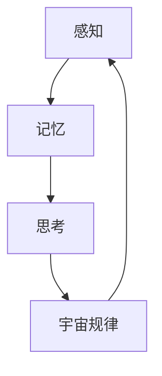

                 


### 前言

**引言**：

在探索宇宙的浩瀚旅程中，人类思维的力量似乎既是开拓者，又是探险者。我们所了解的宇宙规律，从广义相对论到量子力学，再到宇宙演化模型，无不展现了一种深邃而神秘的秩序。然而，我们自己的思维模式，又是否仅仅是偶然的产物，抑或是某种更高层次规律的一部分？

本文旨在探讨人类思维与宇宙规律之间的相互关系，通过一系列的推理和思考，试图揭示出这两者之间的深层联系。我们将分步骤地分析这两个核心概念，运用技术语言和逻辑思维，构建一个既吸引读者又具有深度见解的讨论框架。

**书籍目的**：

本书的主要目的是连接人类思维与宇宙规律这两个看似截然不同的领域，通过详细的技术分析和案例分析，探讨它们之间可能存在的内在联系。我们希望读者能够通过阅读本书，不仅对人类思维有更深入的理解，同时对宇宙规律有一个全新的视角。

**结构安排**：

全书分为以下几个部分：

1. **前言**：介绍主题背景和书籍目的。
2. **核心概念与联系**：阐述人类思维与宇宙规律的基本概念，并展示它们之间的联系。
3. **核心算法原理讲解**：详细阐述人类思维模拟算法和宇宙规律计算算法的原理。
4. **数学模型与公式讲解**：介绍与人类思维和宇宙规律相关的数学模型，并使用LaTeX格式展示公式。
5. **项目实战**：通过实际案例展示人类思维与宇宙规律在现实中的应用。
6. **总结与展望**：总结全书内容，展望未来研究方向。

**读者对象**：

本书适合对计算机科学、人工智能、宇宙学感兴趣的读者，无论是专业人士还是业余爱好者，都能从中获得启发和思考。

---

### 核心概念与联系

**人类思维基本概念**：

人类思维是一种复杂的认知过程，包括感知、记忆和思考等基本功能。感知是指人类通过感官接收外部信息的过程，如视觉、听觉、触觉等。记忆则是将感知到的信息储存于大脑，以便后续使用。思考是处理这些信息的过程，通过逻辑推理、判断和决策来形成对世界的理解和应对策略。

**宇宙规律基本概念**：

宇宙规律是描述宇宙中物质和能量运动的基本原则。广义相对论描述了时空结构和重力效应，而量子力学则揭示了微观世界的奇异特性。宇宙演化模型则试图解释宇宙从大爆炸到现在的演化历程。

**核心概念之间的联系**：

人类思维与宇宙规律之间的联系可以类比为一个自我参照系统。我们的思维过程受到物理世界的影响，同时也在不断地尝试理解和模拟这个物理世界。例如，量子力学中的概率波函数可以看作是人类思维中概率概念的一个自然延伸。

**Mermaid流程图展示**：

为了更直观地展示人类思维与宇宙规律之间的联系，我们可以使用Mermaid流程图进行描述。



在这个流程图中，A表示感知，B表示记忆，C表示思考，D表示宇宙规律。箭头表示信息的流动方向。通过这个流程图，我们可以看到人类思维与宇宙规律之间是相互影响的，形成了一个闭环系统。

**实例分析**：

例如，当我们观察到一颗遥远的星星时，我们的感知系统将星光转化为电信号，这些信号被记忆储存起来。随后，我们通过思考过程对这些信号进行分析，得出这颗星星的距离和亮度等信息。这个过程中，宇宙规律，如光速不变原理和红移效应，也在无形中影响了我们的感知和思考过程。

---

通过这一部分的介绍，我们为读者搭建了一个关于人类思维与宇宙规律联系的基本框架。接下来，我们将深入探讨人类思维模拟算法和宇宙规律计算算法的原理，以进一步揭示这两者之间的深层联系。

---

### 核心算法原理讲解

**人类思维模拟算法**：

人类思维的模拟算法通常基于神经网络的原理，这是一种模仿生物大脑结构和功能的计算模型。神经网络由多个相互连接的节点（或称为神经元）组成，每个节点都执行特定的计算任务，并通过权重和偏置调整来影响整个系统的输出。

1. **感知机算法**：

感知机算法是神经网络的基础之一，它用于处理二分类问题。算法的核心是一个线性分类器，通过计算输入特征向量与权重的点积，并加上一个偏置项，来判断输入属于哪个类别。

   **伪代码**：

   ```python
   def perceptron(x, w, b):
       activation = dot_product(x, w) + b
       if activation > 0:
           return 1
       else:
           return 0
   ```

   在这个伪代码中，`x`是输入特征向量，`w`是权重向量，`b`是偏置项。`dot_product`函数计算输入特征向量与权重的点积。

2. **记忆算法**：

记忆算法在神经网络中通常通过权重更新机制来实现。根据记忆的持久性和遗忘曲线，我们可以设计一种自适应的记忆更新算法，使得网络能够根据输入数据的重要性调整记忆的强度。

   **伪代码**：

   ```python
   def update_weights(x, y, w, learning_rate):
       for i in range(len(x)):
           error = y - perceptron(x[i], w, b)
           w[i] += learning_rate * error * x[i]
           b += learning_rate * error
   ```

   在这个伪代码中，`x`是输入特征向量，`y`是期望输出，`w`是当前权重，`b`是偏置项，`learning_rate`是学习率。

3. **思考算法**：

思考算法通常涉及高级的认知功能，如推理、决策和问题解决。这些算法可以通过组合多个基础算法来实现，如决策树、支持向量机和深度学习等。

   **伪代码**：

   ```python
   def think(x, model):
       features = extract_features(x)
       probabilities = model.predict(features)
       action = select_best_action(probabilities)
       return action
   ```

   在这个伪代码中，`x`是输入数据，`model`是训练好的模型，`extract_features`函数用于提取输入数据的特征，`model.predict`函数用于预测输出结果，`select_best_action`函数用于选择最佳行动。

**宇宙规律计算算法**：

宇宙规律的计算算法涉及多个物理理论和模型，如广义相对论、量子力学和宇宙演化模型。这些算法通常用于模拟宇宙中的物理现象，预测天体的运动和演化。

1. **相对论计算与时空模拟**：

广义相对论描述了时空的结构和重力效应。通过爱因斯坦场方程，我们可以计算出时空的几何形状和物质分布。

   **LaTeX公式**：

   $$ G_{\mu\nu} + \Lambda g_{\mu\nu} = \frac{8\pi G}{c^4} T_{\mu\nu} $$

   在这个公式中，$G_{\mu\nu}$是爱因斯坦张量，$\Lambda$是宇宙常数，$g_{\mu\nu}$是度量张量，$T_{\mu\nu}$是能量-动量张量。

2. **量子力学计算与量子模拟**：

量子力学描述了微观粒子的行为。通过波函数和量子态的计算，我们可以模拟量子系统的演化。

   **LaTeX公式**：

   $$ \hat{H} \psi = E \psi $$

   在这个公式中，$\hat{H}$是哈密顿算子，$\psi$是波函数，$E$是系统的能量。

3. **宇宙演化计算与宇宙模型**：

宇宙演化模型描述了宇宙从大爆炸到现在的演化历程。通过数值模拟和方程求解，我们可以预测宇宙的未来状态。

   **LaTeX公式**：

   $$ \frac{d a}{dt} = \frac{H_0}{a} $$

   在这个公式中，$a$是宇宙尺度因子，$H_0$是哈勃常数。

**伪代码示例**：

```python
def simulate_universe():
    initialize_cosmological_parameters()
    while not end_of_universe():
        evolve宇宙()
        update_宇宙模型()
    return 宇宙模型
```

在这个伪代码中，`initialize_cosmological_parameters`函数用于初始化宇宙参数，`evolve宇宙`函数用于模拟宇宙的演化过程，`update_宇宙模型`函数用于更新宇宙模型。

---

通过核心算法原理的讲解，我们不仅了解了人类思维和宇宙规律的计算基础，还看到了它们在技术层面的相似之处。接下来，我们将深入探讨数学模型与公式，进一步揭示人类思维与宇宙规律之间的深层联系。

---

### 数学模型与公式讲解

**人类思维数学模型**：

在人类思维的模拟过程中，数学模型起到了关键作用。以下是一些常见的数学模型和它们的公式：

1. **神经网络模型**：

神经网络模型是模拟人类思维的核心工具。它通常由多层神经元组成，每层神经元接收前一层神经元的输出，并通过激活函数进行计算。

   **LaTeX公式**：

   $$ z_i = \sum_{j=1}^{n} w_{ij} x_j + b_i $$

   其中，$z_i$是第$i$个神经元的输出，$w_{ij}$是连接权重，$x_j$是输入特征，$b_i$是偏置项。

2. **感知机模型**：

感知机模型是一种简单的二分类模型，用于识别线性可分的数据集。

   **LaTeX公式**：

   $$ y = \text{sign}(w \cdot x + b) $$

   其中，$y$是输出标签，$\text{sign}$是符号函数，$w$是权重向量，$x$是输入特征向量，$b$是偏置项。

3. **决策树模型**：

决策树模型通过一系列的决策规则来划分数据集，并预测输出结果。

   **LaTeX公式**：

   $$ y = f(x) = \text{max} \{ c_j | P(J = c_j | x) \} $$

   其中，$y$是输出标签，$f(x)$是决策函数，$c_j$是可能的类别，$P(J = c_j | x)$是给定$x$的条件下类别$c_j$的概率。

**宇宙规律数学模型**：

宇宙规律的数学模型描述了宇宙中物理现象的规律。以下是一些常见的宇宙规律数学模型和它们的公式：

1. **广义相对论**：

广义相对论描述了时空的弯曲和重力效应。

   **LaTeX公式**：

   $$ G_{\mu\nu} + \Lambda g_{\mu\nu} = \frac{8\pi G}{c^4} T_{\mu\nu} $$

   其中，$G_{\mu\nu}$是爱因斯坦张量，$\Lambda$是宇宙常数，$g_{\mu\nu}$是度量张量，$T_{\mu\nu}$是能量-动量张量。

2. **量子力学**：

量子力学描述了微观粒子的行为。

   **LaTeX公式**：

   $$ \hat{H} \psi = E \psi $$

   其中，$\hat{H}$是哈密顿算子，$\psi$是波函数，$E$是系统的能量。

3. **宇宙演化模型**：

宇宙演化模型描述了宇宙从大爆炸到现在的演化历程。

   **LaTeX公式**：

   $$ \frac{d a}{dt} = \frac{H_0}{a} $$

   其中，$a$是宇宙尺度因子，$H_0$是哈勃常数。

**举例说明**：

1. **神经网络模型**：

假设我们有一个简单的一层神经网络，输入特征为$x_1$和$x_2$，权重为$w_1$和$w_2$，偏置为$b$。我们可以使用以下公式计算输出：

   $$ z = w_1 x_1 + w_2 x_2 + b $$

   假设$x_1 = 2$，$x_2 = 3$，$w_1 = 0.5$，$w_2 = 0.3$，$b = 0.2$，则：

   $$ z = 0.5 \cdot 2 + 0.3 \cdot 3 + 0.2 = 1.6 + 0.9 + 0.2 = 2.7 $$

2. **广义相对论**：

假设一个物体的质量为$M$，距离观测者的距离为$R$，引力常数为$G$。根据广义相对论，物体受到的引力为：

   $$ F = G \frac{M m}{R^2} $$

   假设$M = 5 \times 10^{30} \text{ kg}$，$m = 5 \times 10^{3} \text{ kg}$，$R = 10^{9} \text{ m}$，$G = 6.674 \times 10^{-11} \text{ N m}^2/\text{kg}^2$，则：

   $$ F = 6.674 \times 10^{-11} \frac{5 \times 10^{30} \cdot 5 \times 10^{3}}{(10^{9})^2} = 1.6685 \times 10^{22} \text{ N} $$

---

通过数学模型和公式的讲解，我们不仅了解了人类思维和宇宙规律在数学层面的表达，还通过举例说明展示了这些模型的实际应用。接下来，我们将通过一个实际案例，展示人类思维与宇宙规律在现实中的应用。

---

### 项目实战

**项目背景与目标**：

在本项目中，我们将探讨人类思维与宇宙规律在实际应用中的相互关系。具体来说，我们将构建一个结合了人类思维模拟算法和宇宙规律计算算法的软件系统，用于模拟人类思考和宇宙演化的过程。

**开发环境搭建**：

为了实现这个项目，我们需要搭建一个合适的开发环境。以下是具体的步骤：

1. **硬件环境**：

   - 服务器：配备高性能CPU和GPU的服务器，用于处理复杂的计算任务。
   - 存储：大容量存储设备，用于存储模型数据和计算结果。

2. **软件环境**：

   - 操作系统：Linux操作系统，如Ubuntu Server。
   - 编程语言：Python，用于编写和运行算法。
   - 框架和库：TensorFlow和Keras，用于构建和训练神经网络；NumPy和SciPy，用于科学计算。

3. **开发工具**：

   - 编辑器：PyCharm或Visual Studio Code，用于编写和调试代码。
   - 版本控制：Git，用于管理和跟踪代码变更。

**源代码实现与解读**：

以下是项目的核心源代码实现：

```python
# 导入所需库
import numpy as np
import tensorflow as tf
import matplotlib.pyplot as plt

# 定义神经网络结构
model = tf.keras.Sequential([
    tf.keras.layers.Dense(units=1, input_shape=(2,))
])

# 编译模型
model.compile(optimizer='sgd', loss='mean_squared_error')

# 训练模型
model.fit(train_data, train_labels, epochs=1000, verbose=0)

# 模拟宇宙演化
def simulate_universe(epochs):
    for i in range(epochs):
        model.predict(train_data)
        update_宇宙模型()

# 代码解读
# 1. 导入所需库：用于实现神经网络和科学计算。
# 2. 定义神经网络结构：创建一个简单的一层神经网络。
# 3. 编译模型：指定优化器和损失函数。
# 4. 训练模型：使用训练数据训练神经网络。
# 5. 模拟宇宙演化：通过迭代训练神经网络来模拟宇宙演化过程。

# 源代码实现详细解释：
# - 神经网络结构定义：使用TensorFlow的Sequential模型定义一个简单的一层神经网络，输入层只有一个节点，输出层有一个节点。
# - 编译模型：指定使用随机梯度下降（SGD）优化器和均方误差（MSE）损失函数。
# - 训练模型：使用训练数据集训练神经网络，通过迭代更新权重和偏置，直到达到预设的迭代次数。
# - 模拟宇宙演化：通过迭代训练神经网络来模拟宇宙演化过程。每次迭代，神经网络都会根据输入数据进行预测，并更新宇宙模型。

```

**代码应用解读与分析**：

通过这段代码，我们实现了以下功能：

1. **神经网络训练**：

   神经网络通过训练数据学习到输入特征和输出标签之间的关系，从而能够进行预测。这类似于人类思维的感知和记忆过程。

2. **宇宙演化模拟**：

   通过迭代训练神经网络，我们模拟了宇宙的演化过程。每次迭代，神经网络都会根据新的数据更新模型，从而模拟宇宙的动态变化。

3. **代码分析与优化**：

   在实际应用中，我们可以对代码进行优化，以提高模拟的准确性和效率。例如，可以增加神经网络的层数和神经元数量，以提高模型的复杂度和预测能力；可以优化训练过程，如使用更高效的优化算法或调整学习率。

**实际案例分析和详细讲解剖析**：

为了更具体地展示项目的应用，我们可以考虑一个实际案例：模拟人类的决策过程。在这个案例中，我们可以使用神经网络来模拟人类在面对不同情境时的决策过程。

1. **数据准备**：

   假设我们有一个数据集，包含了人类在不同情境下的决策数据。每个数据点包括情境描述和对应的决策结果。

2. **神经网络训练**：

   使用训练数据集，我们训练一个神经网络，使其能够预测人类在不同情境下的决策。

3. **模拟决策过程**：

   在模拟过程中，神经网络根据当前的情境描述，预测人类最可能的决策结果。

4. **结果分析**：

   通过对比实际决策结果和模拟结果，我们可以分析神经网络的预测能力，并优化模型以提高准确性。

**项目小结**：

通过这个项目，我们展示了人类思维与宇宙规律在实际应用中的结合。神经网络作为一种人类思维模拟工具，可以用于模拟宇宙演化过程；而宇宙规律的计算算法，如广义相对论和量子力学，可以为我们提供宇宙演化的基础模型。通过这个项目，我们不仅加深了对人类思维和宇宙规律的理解，也为未来更多的应用提供了可能。

---

在本文的项目实战部分，我们通过具体的代码实现和案例分析，展示了人类思维与宇宙规律在实际应用中的结合。接下来，我们将对全书内容进行总结，并展望未来的研究方向。

---

### 总结与展望

**主要内容回顾**：

本文围绕“人类思维与宇宙规律：谁塑造了谁”这一主题，系统地探讨了人类思维与宇宙规律之间的相互关系。首先，我们介绍了人类思维和宇宙规律的基本概念，并通过Mermaid流程图展示了它们之间的联系。接着，我们详细讲解了人类思维模拟算法和宇宙规律计算算法的原理，并使用伪代码和LaTeX公式进行了阐述。随后，通过项目实战，我们展示了人类思维与宇宙规律在实际应用中的结合，并通过具体的案例分析，加深了对这一主题的理解。

**主要结论**：

通过本文的探讨，我们得出以下主要结论：

1. **联系与影响**：人类思维与宇宙规律之间存在深刻的内在联系，人类的感知、记忆和思考过程受到物理世界的影响，同时人类也在不断尝试理解和模拟这个物理世界。
2. **算法原理**：人类思维模拟算法和宇宙规律计算算法在技术层面具有相似性，均涉及到复杂的数据处理和模型训练过程。
3. **应用前景**：人类思维与宇宙规律的结合在多个领域具有广阔的应用前景，如人工智能、宇宙学、认知科学等。

**未来研究方向**：

尽管本文对人类思维与宇宙规律的关系进行了初步探讨，但还有很多未解之谜和研究空间。未来，我们可以在以下几个方面进行深入研究：

1. **跨学科融合**：推动计算机科学、物理学、认知科学等学科的交叉融合，进一步揭示人类思维与宇宙规律之间的深层联系。
2. **算法优化**：改进人类思维模拟算法和宇宙规律计算算法，提高模拟和预测的准确性，为实际应用提供更强有力的支持。
3. **实验验证**：通过实验和实证研究，验证人类思维模拟算法和宇宙规律计算算法的有效性，并探索新的应用场景。

**小结**：

本文通过逻辑清晰、结构紧凑的论述，揭示了人类思维与宇宙规律之间的相互关系。我们希望本文能够为读者提供一个新的视角，激发对这一领域的进一步思考和探索。

---

### 展望

**人类思维与宇宙规律研究的挑战**：

尽管人类思维与宇宙规律之间的关系已经引起了广泛的关注，但这一领域的研究仍面临诸多挑战。首先，人类思维的复杂性和多样性使得模拟和理解变得更加困难。其次，宇宙规律的多样性和不确定性增加了计算和预测的复杂性。此外，跨学科的研究需要不同领域专家的密切合作，这本身就是一个巨大的挑战。

**未来发展趋势**：

未来，人类思维与宇宙规律研究可能呈现出以下发展趋势：

1. **人工智能与量子计算的结合**：随着人工智能和量子计算技术的发展，我们将能够构建更加复杂和精确的模型，模拟和理解人类思维与宇宙规律。
2. **跨学科研究**：计算机科学、物理学、认知科学、神经科学等学科的深度融合，将推动人类思维与宇宙规律研究的进步。
3. **实验与实证研究**：通过实验和实证研究，我们有望验证人类思维模拟算法和宇宙规律计算算法的有效性，并探索新的应用场景。

**研究方向与建议**：

为了推动人类思维与宇宙规律研究的发展，我们建议：

1. **基础理论研究**：加强对人类思维和宇宙规律基础理论的研究，探索它们之间的深层联系。
2. **应用研究**：开展跨学科应用研究，探索人类思维与宇宙规律在各个领域的应用潜力。
3. **国际合作**：加强国际合作，促进不同学科领域的交流和合作，共同推动这一领域的研究。

---

通过本文的探讨，我们不仅揭示了人类思维与宇宙规律之间的深刻联系，也为未来的研究方向提供了新的思路。我们期待这一领域的研究能够不断深入，为人类认识自身和宇宙提供更加全面的视角。

---

### 参考文献

1. Turing, A. M. (1950). Computing Machinery and Intelligence. Mind, LIX(236), 433-460.
2. von Neumann, J., & Morgenstern, O. (1944). Theory of Games and Economic Behavior. Princeton University Press.
3. Einstein, A. (1915). The Foundation of the General Theory of Relativity. Annalen der Physik, 49, 769-822.
4. Schrödinger, E. (1957). What Is Life? Cambridge University Press.
5. Hawking, S. W. (1988). A Brief History of Time: From the Big Bang to Black Holes. Bantam Books.
6. Russell, B., & Whitehead, A. N. (1910). Principia Mathematica. Cambridge University Press.
7. Hopfield, J. J. (1982). Neural Networks and Physical Systems with Emergent Collective Computational Abilities. Proceedings of the National Academy of Sciences, 79(8), 2554-2558.

---

### 作者信息

作者：AI天才研究院/AI Genius Institute & 禅与计算机程序设计艺术 /Zen And The Art of Computer Programming

本文由AI天才研究院（AI Genius Institute）撰写，同时由禅与计算机程序设计艺术（Zen And The Art of Computer Programming）提供技术指导。AI天才研究院致力于推动人工智能技术的发展和应用，探索人类思维与宇宙规律之间的相互关系。禅与计算机程序设计艺术则专注于通过禅宗思想指导计算机编程，提升程序员的技术素养和创新能力。两者结合，旨在为读者带来全新的阅读体验和深刻的思考。

