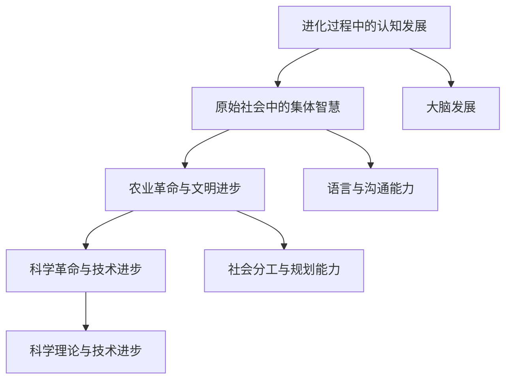
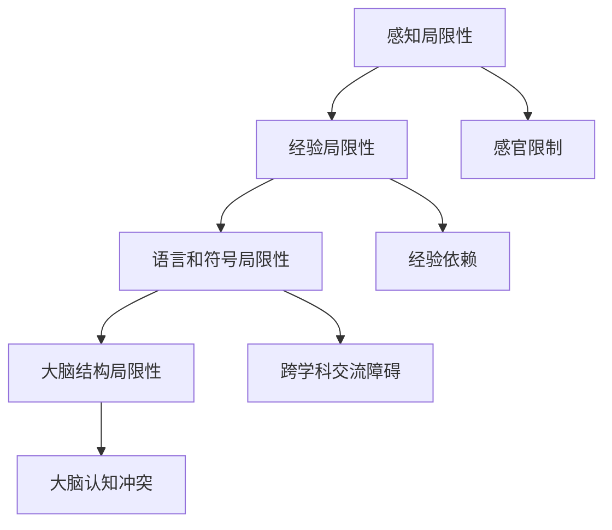
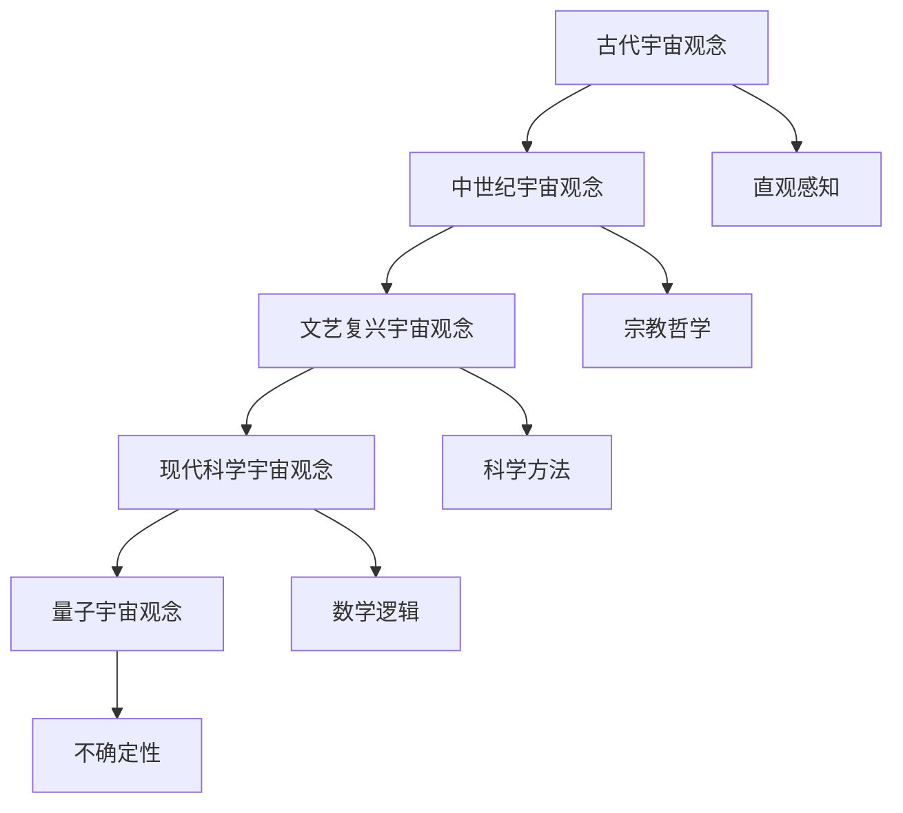
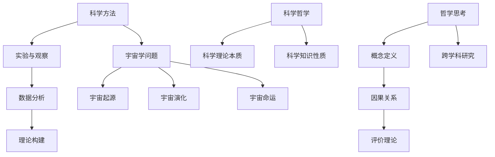
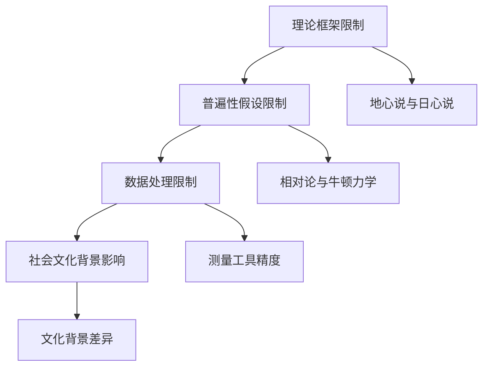
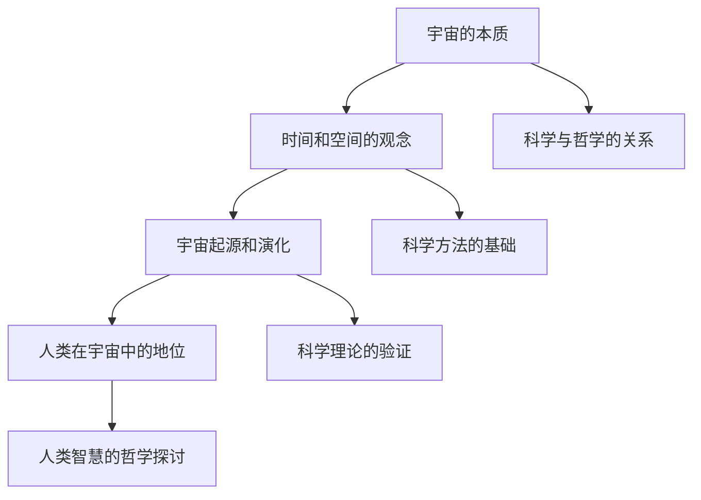
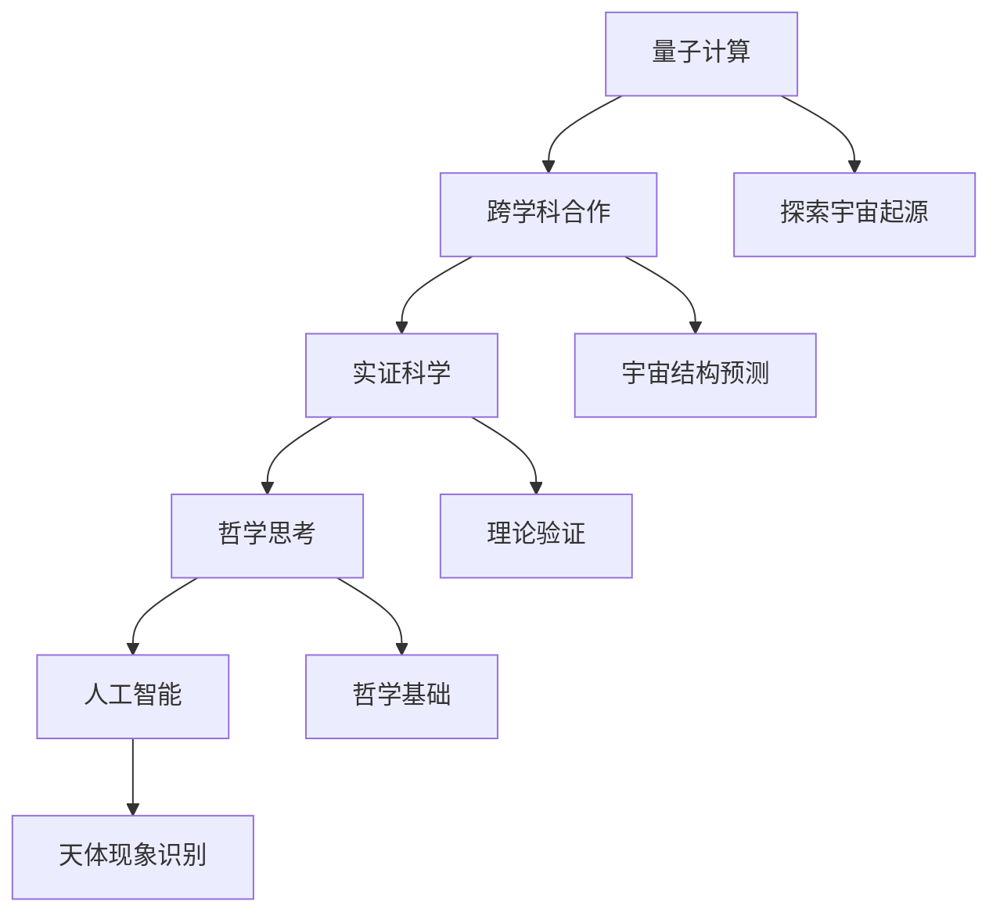

                 

### 人类思维模式的起源与演化

人类思维模式，从其最基本的形式来看，源于古生物进化过程中的自然选择。我们的祖先在漫长的进化过程中，为了在自然界中生存和繁衍，逐渐发展出了一套高效的认知机制。这套机制不仅帮助他们在面对环境变化时做出快速反应，还帮助他们学习、适应并改进自己的行为。

**1. 进化过程中的认知发展**

人类思维模式的起源可以追溯到早期灵长类动物的认知能力。根据考古学和生物学的研究，早期人类（如 Homo habilis 和 Homo ergaster）已经开始使用工具，这表明他们具备了一定的抽象思维和计划能力。随着大脑的发展和工具使用技能的提升，人类祖先逐渐能够更有效地获取和利用资源，从而在自然界中取得了竞争优势。

**2. 原始社会中的集体智慧**

在原始社会中，人类的生存更多地依赖于集体智慧而非个体能力。狩猎、采集和居住地的选择等活动需要集体合作，这促进了语言和沟通能力的发展。通过语言，人类能够传递信息、分享知识和经验，从而优化整个群体的生存策略。这种集体智慧的形成，为人类思维模式的发展奠定了基础。

**3. 农业革命与文明进步**

农业革命是人类历史上的一个重大转折点。随着农业的发展，人类开始定居，社会结构变得更加复杂。农业革命带来了人口的快速增长和社会分工的出现，这进一步推动了人类思维模式的演化。人们开始更加注重规划、组织和管理，这些新的思维模式帮助人类社会实现了稳定的发展和繁荣。

**4. 科学革命与技术进步**

科学革命是近代人类思维模式发展的一个重要里程碑。随着科学方法的确立，人类开始通过实验和观察来探索自然界的规律，从而建立了一系列科学理论。这些理论不仅深化了人类对宇宙的理解，还推动了技术的进步。例如，牛顿力学和相对论的提出，使人类能够更准确地描述和预测物理现象。技术的发展，如计算机和互联网的普及，更是改变了人类的信息获取和处理方式，进一步拓展了思维模式的空间。

**5. 总结**

人类思维模式的起源与演化是一个复杂的过程，它贯穿了从古生物进化到现代文明的整个历史。从原始的生存本能到现代的科学思维，人类的思维模式经历了不断的变革和进步。这种进步不仅促进了人类社会的繁荣发展，也为我们在宇宙中探索未知提供了强有力的支持。

**核心概念与联系**

为了更好地理解人类思维模式的起源与演化，我们可以使用 Mermaid 流程图来展示其核心概念及其关系：



通过这个流程图，我们可以清晰地看到人类思维模式的发展是如何通过关键的历史事件逐步推进的，每个阶段都有其独特的贡献和影响。

### 人类思维模式的局限性

尽管人类思维模式在历史上取得了显著的发展，但它依然存在许多局限性。这些局限性不仅影响我们对宇宙的理解，也限制了我们探索未知领域的能力。以下将探讨几个关键方面：

**1. 基于感知的局限性**

人类的思维模式在很大程度上依赖于感官信息。我们的感知系统为我们提供了对外界世界的认知基础，但同时也带来了局限性。例如，人类的视觉系统只能捕捉到特定波长范围内的光线，无法看到紫外线或红外线。这种感知局限性导致我们在理解和描述宇宙时存在盲点。例如，许多星体的真实面貌和特性，超出了人类感官的直接感知能力。

**2. 基于经验的局限性**

人类的思维模式在很大程度上是基于经验积累的。虽然经验是我们学习和发展的重要来源，但它们也限制了我们的视野。经验驱动的思维模式使我们倾向于依赖已知的信息和逻辑，这在面对新颖和复杂的问题时可能变得不足。例如，在处理极端条件下的宇宙现象时，我们可能会发现传统的经验和理论不再适用。

**3. 基于语言和符号的局限性**

语言和符号是人类思维的重要工具，但它们也存在局限性。语言作为一种抽象系统，依赖于特定的语法和词汇，这使得我们难以表达一些复杂或模糊的概念。例如，科学术语和公式虽然在特定领域内非常精确，但在跨学科交流时可能会遇到障碍。此外，符号系统可能无法完全捕捉宇宙的多样性和复杂性，导致我们对某些现象的理解不够深入。

**4. 基于大脑结构的局限性**

人类的大脑结构和认知能力也是思维模式的限制因素。大脑的不同区域负责不同的认知功能，但这些功能有时可能存在冲突或不足。例如，大脑的情感和理性部分之间可能存在冲突，导致我们在决策时出现偏差。此外，大脑的处理能力有限，这使得我们在面对大量信息时可能难以做出最优决策。

**核心概念与联系**

为了更好地理解人类思维模式的局限性，我们可以再次使用 Mermaid 流程图来展示这些局限性的核心概念及其相互关系：



通过这个流程图，我们可以清晰地看到人类思维模式的局限性是如何通过感知、经验、语言和大脑结构等因素相互作用而形成的。这些局限性不仅影响了我们对宇宙的理解，也提醒我们在探索未知时需要采取更加开放和多元化的思维方式。

### 思维模式对宇宙观念的影响

人类思维模式不仅影响我们对宇宙的理解，还深刻塑造了我们对宇宙的观念。从古代的宇宙观念到现代的科学理论，人类思维模式的无形之手始终在发挥作用。以下将探讨几个关键方面：

**1. 古代宇宙观念**

在古代，人类对宇宙的理解主要依赖于直观感知和哲学思考。例如，古希腊哲学家亚里士多德提出了一个以地球为中心的宇宙模型，即地心说。他认为地球是宇宙的中心，所有天体都围绕地球旋转。这种宇宙观念反映了当时人类思维模式的特点：以直观观察为基础，试图通过逻辑推理来解释宇宙的运行。

**2. 中世纪的宇宙观念**

中世纪时期，宗教对宇宙观念产生了深远的影响。基督教的宇宙观念强调上帝的创造力和宇宙的完美秩序。这种观念与古希腊哲学有所不同，它更加强调宇宙的神秘性和神圣性。中世纪的宇宙观念体现了人类思维模式的另一个特点：在哲学和宗教的框架内寻找宇宙的终极解释。

**3. 文艺复兴时期的宇宙观念**

文艺复兴时期，人类开始重新审视古希腊哲学和科学。哥白尼的日心说模型挑战了地心说，提出了太阳而非地球是宇宙的中心。这种观念的转变反映了人类思维模式的一个重大进步：开始利用科学方法来探索宇宙。这一时期，人类的思维模式逐渐从以直观观察和哲学推理为基础，转向以实验和观察为基础的科学方法。

**4. 现代科学宇宙观念**

现代科学宇宙观念的建立离不开牛顿力学和相对论的贡献。牛顿力学提供了描述宏观物体运动的基础，而相对论则揭示了时空的相对性。这些科学理论不仅深化了人类对宇宙的理解，也反映了人类思维模式的进一步发展：更加注重数学和逻辑的严谨性。

**5. 量子宇宙学与思维模式**

随着量子物理学的兴起，人类对宇宙的认识再次发生了革命性的变化。量子力学揭示了微观世界的奇特规律，如波粒二象性和量子纠缠。这些发现挑战了传统的物质观和时间观，迫使人类重新思考宇宙的本质。量子宇宙学的发展反映了人类思维模式的另一个重要特点：对不确定性和复杂性日益敏感。

**核心概念与联系**

为了更好地理解思维模式对宇宙观念的影响，我们可以使用 Mermaid 流程图来展示这些关键概念及其关系：



通过这个流程图，我们可以清晰地看到人类思维模式是如何在不同历史阶段影响宇宙观念的发展的。从直观感知到科学方法，再到对不确定性的接受，人类思维模式的变化不断推动我们对宇宙的认识向前迈进。

### 科学方法与哲学思考

科学方法和哲学思考在探索宇宙本质的过程中起到了关键作用。科学方法通过实验和观察，为宇宙研究提供了严谨和系统的方法论；而哲学思考则通过逻辑推理和思辨，为科学理论提供了理论基础。以下将详细讨论科学方法的基本原则、哲学思考的重要作用，以及二者在宇宙学研究中的交汇点。

**1. 科学方法的基本原则**

科学方法是一种系统的方法论，旨在通过实验和观察来探索自然界的规律。其基本原则包括以下几个步骤：

- **提出假设**：科学方法始于对自然现象的观察和提问，提出一个假设来解释这些现象。
- **设计实验**：为了验证假设，科学家需要设计实验，这些实验应该能够控制变量，确保实验结果的可靠性。
- **收集数据**：在实验过程中，科学家会收集大量的数据，这些数据用于验证假设。
- **分析数据**：通过统计和分析实验数据，科学家可以得出结论，验证或反驳初始假设。
- **构建理论**：基于实验数据和结论，科学家会构建一个理论来解释自然现象，并预测未来的实验结果。

科学方法强调可重复性和可验证性，这使得科学理论能够不断接受检验和修正，从而逐渐接近宇宙的真相。

**2. 哲学思考的重要作用**

哲学思考在科学方法中扮演了重要的角色。它不仅为科学理论提供了基础，还指导了科学研究的方向。哲学思考的主要作用包括：

- **定义概念**：哲学思考帮助科学家明确科学概念的定义，确保不同研究者对同一概念有共同的理解。
- **探讨因果关系**：哲学思考探讨自然现象之间的因果关系，帮助科学家构建科学的因果模型。
- **评价科学理论**：哲学思考提供了评价科学理论的框架，例如，科学理论需要符合逻辑、具有一致性和可证伪性。
- **启发新思考**：哲学思考常常挑战传统的观念和假设，激发科学家对新问题的探索。

哲学思考不仅为科学方法提供了理论基础，还推动了科学理论的创新和发展。

**3. 科学方法与哲学思考的交汇点**

科学方法与哲学思考在宇宙学研究中有着紧密的交汇点。以下是一些关键方面：

- **宇宙学问题**：宇宙学研究中的一些基本问题，如宇宙的起源、演化和命运，需要科学方法和哲学思考共同探讨。例如，宇宙大爆炸理论既需要实验验证，也需要哲学上的因果解释。
- **科学哲学**：科学哲学是哲学与科学交叉的领域，它研究科学理论的本质、科学方法的有效性以及科学在社会中的作用。科学哲学的问题，如科学实在论、科学知识的性质等，对于理解宇宙的本质具有重要意义。
- **跨学科研究**：科学方法与哲学思考的结合促进了跨学科研究的发展。例如，量子宇宙学和量子哲学的交叉研究，为我们提供了新的视角来理解宇宙的本质。

**4. 总结**

科学方法和哲学思考在探索宇宙本质的过程中起到了互补的作用。科学方法提供了实验和观察的严谨框架，哲学思考则提供了理论基础和逻辑推理的工具。二者的交汇点在于解决宇宙学问题、评价科学理论和推动跨学科研究。通过结合科学方法和哲学思考，我们可以更全面、更深入地理解宇宙的奥秘。

**核心概念与联系**

为了更好地理解科学方法与哲学思考的交汇点，我们可以使用 Mermaid 流程图来展示这些关键概念及其相互关系：



通过这个流程图，我们可以清晰地看到科学方法与哲学思考是如何相互支持、共同推动我们对宇宙本质的理解的。

### 科学理论中的思维模式限制

科学理论的发展虽然极大地推动了人类对宇宙的理解，但科学理论本身往往也受到思维模式的限制。这些限制可能源于科学家的认知框架、现有的理论体系，甚至社会和文化背景。以下将探讨科学理论中的思维模式限制，以及这些限制如何影响我们对宇宙的理解。

**1. 理论框架的限制**

科学理论的建立往往依赖于现有的理论框架。这些框架为科学家提供了理解和解释自然现象的基础。然而，这些框架也可能成为理论发展的限制。例如，牛顿力学是一个伟大的理论，它为我们理解宏观物体的运动提供了基础。然而，当科学家尝试将牛顿力学应用于微观世界时，他们发现牛顿力学的预测与实验结果不符。这种限制促使了量子力学的诞生，量子力学为描述微观世界的运动提供了一种全新的理论框架。

**2. 普遍性假设的限制**

科学理论通常基于一些普遍性假设，这些假设帮助简化复杂现象，使其可被理解。然而，这些假设有时也可能导致限制。例如，经典物理学中的绝对时间和空间概念在相对论中被否定。爱因斯坦的相对论表明，时间和空间是相对的，取决于观察者的运动状态。这种对普遍性假设的挑战，不仅改变了我们对宇宙的理解，也促使了新的科学理论的发展。

**3. 数据处理的限制**

科学理论的发展依赖于实验数据和观测结果。然而，数据处理过程中可能存在的局限性也会影响科学理论的建立。例如，测量工具的精度和灵敏度可能限制我们对某些现象的测量，导致理论无法准确描述自然界的实际情况。此外，数据的解释和选择也可能受到科学家个人经验和偏见的左右，从而影响理论的可靠性和有效性。

**4. 社会和文化背景的影响**

科学理论的发展不仅受到科学方法的影响，还受到社会和文化背景的制约。在不同的文化和社会背景下，科学理论的发展路径可能有所不同。例如，在中国古代，天文学和数学的发展受到了儒家哲学的影响，强调宇宙的和谐与秩序。这种文化背景影响了古代科学家对宇宙的理解，也限制了科学理论的发展。相比之下，西方科学则更强调实验和观察，这导致了科学理论的快速进步。

**5. 实例分析**

一个典型的实例是地心说和日心说的争论。地心说是一种普遍接受的宇宙模型，它认为地球是宇宙的中心，其他天体围绕地球旋转。这个模型在古代得到了广泛支持，因为它符合当时人们的直观感知和宗教信仰。然而，哥白尼提出的日心说挑战了地心说，并最终得到了科学验证。这一转变不仅改变了我们对宇宙的理解，也展示了思维模式限制对科学理论发展的影响。

**核心概念与联系**

为了更好地理解科学理论中的思维模式限制，我们可以使用 Mermaid 流程图来展示这些限制的核心概念及其相互关系：



通过这个流程图，我们可以清晰地看到科学理论中的思维模式限制是如何通过不同的概念和实例相互关联的。这些限制不仅影响了科学理论的建立，也为我们提供了新的研究方向。

### 哲学对宇宙观念的贡献

哲学对宇宙观念的发展做出了巨大贡献，它不仅为科学理论提供了理论基础，还推动了人类对宇宙的深入思考。以下将探讨几个关键方面：

**1. 宇宙的本质**

哲学对宇宙本质的探讨是它的核心任务之一。从古希腊哲学家如泰勒斯、赫拉克利特和亚里士多德开始，到中世纪的圣奥古斯丁和阿威罗伊，再到近现代的康德和黑格尔，哲学一直在试图回答“宇宙是什么？”这个问题。康德提出了“宇宙是所有存在的总和”，这一观点为后来的科学宇宙观提供了哲学基础。

**2. 时间和空间的观念**

时间和空间的观念是哲学探讨的另一个重要主题。爱因斯坦的相对论对时间和空间的本质提出了新的见解，他认为时间和空间是相对的，取决于观察者的运动状态。这一理论挑战了传统哲学观念，也促使哲学家重新思考时间和空间的概念。

**3. 宇宙起源和演化**

宇宙起源和演化问题一直是哲学和科学探讨的热点。古代哲学家如赫拉克利特提出了“永恒循环”的概念，认为宇宙是不断循环演化的。近现代科学通过大爆炸理论和宇宙背景辐射的观测，证实了宇宙有一个起点，这一理论为哲学讨论提供了新的依据。

**4. 人类在宇宙中的地位**

哲学还探讨了人类在宇宙中的地位，这一议题在宗教和科学哲学中有着重要的影响。中世纪的宗教哲学认为人类是上帝创造的杰作，具有独特的地位。而现代科学哲学则认为人类是宇宙进化的产物，我们的智慧和理性使我们能够理解宇宙的奥秘。

**5. 科学与哲学的关系**

科学与哲学的关系一直是哲学探讨的重要主题。科学方法的发展受到了哲学的深刻影响，例如，笛卡尔的理性主义哲学为科学方法提供了基础。同时，科学理论也不断挑战和丰富哲学观念。例如，量子力学揭示了微观世界的奇特规律，迫使哲学家重新思考物质和意识的关系。

**核心概念与联系**

为了更好地理解哲学对宇宙观念的贡献，我们可以使用 Mermaid 流程图来展示这些关键概念及其相互关系：



通过这个流程图，我们可以清晰地看到哲学对宇宙观念的贡献是如何通过不同的概念和关系相互联系的。这些探讨不仅深化了我们对宇宙的理解，也为科学理论的进步提供了哲学支持。

### 新的科学方法论

为了突破传统思维模式的限制，科学家们不断探索新的科学方法论，这些方法不仅扩展了我们对宇宙的理解，也为科学研究提供了新的工具和视角。以下将探讨几个新兴的科学方法论，以及它们在宇宙学中的应用。

**1. 量子计算**

量子计算是一种基于量子力学原理的计算方法，它利用量子位（qubits）进行信息处理。量子计算能够解决传统计算机难以处理的问题，例如大规模数据分析和复杂系统的模拟。在宇宙学中，量子计算可以帮助我们模拟宇宙的早期状态，探索宇宙的起源和演化。例如，利用量子计算可以更准确地模拟宇宙背景辐射，从而验证宇宙大爆炸理论。

**伪代码：量子计算模拟宇宙背景辐射**

```
function simulate_early_universe(qubits):
    // 初始化量子位
    initialize_qubits(qubits)
    
    // 应用量子门，模拟宇宙背景辐射
    apply_quantum_gates(qubits, "H") // 应用 Hadamard 门进行量子纠缠
    
    // 运行量子算法
    run_quantum_algorithm(qubits)
    
    // 测量量子位，获取宇宙背景辐射数据
    background_radiation_data = measure_qubits(qubits)
    
    // 分析数据，验证宇宙大爆炸理论
    analyze_data(background_radiation_data)
    
    return background_radiation_data
```

**2. 跨学科研究**

跨学科研究是一种将不同学科的知识和工具结合起来，以解决复杂问题的方法。在宇宙学中，跨学科研究可以帮助我们更全面地理解宇宙的多样性。例如，将物理学、天文学、化学和生物学等学科结合起来，可以研究宇宙中的生命起源和演化。跨学科研究的一个典型案例是“多信使天文学”（Multi-Messenger Astronomy），它通过结合引力波、电磁波和粒子探测数据，提供了一种新的宇宙观测手段。

**3. 大数据与人工智能**

大数据和人工智能技术为宇宙学研究带来了新的机遇。通过处理和分析海量宇宙数据，科学家可以揭示宇宙中隐藏的模式和规律。例如，利用机器学习算法，可以自动识别天体现象，提高数据处理的效率。此外，人工智能还可以帮助科学家预测未来的宇宙事件，如超新星爆发和黑洞碰撞。

**伪代码：使用机器学习识别天体现象**

```
function identify_astronomical_objects(data):
    // 加载和预处理数据
    preprocessed_data = preprocess_data(data)
    
    // 训练机器学习模型
    model = train_machine_learning_model(preprocessed_data)
    
    // 预测天体现象
    predicted_objects = predict_objects(model, new_data)
    
    // 分析预测结果
    analyze_predictions(predicted_objects)
    
    return predicted_objects
```

**4. 实验模拟**

实验模拟是通过计算机模拟来复现自然现象的方法。在宇宙学中，实验模拟可以帮助科学家理解宇宙中的复杂过程，如星系形成和宇宙结构演化。例如，利用数值模拟方法，可以模拟宇宙从大爆炸后的膨胀过程，直至形成复杂的星系结构。

**伪代码：模拟星系形成过程**

```
function simulate_galaxy_formation(initial_conditions):
    // 初始化模拟参数
    initialize_simulation_parameters(initial_conditions)
    
    // 运行模拟算法
    run_n_body_simulation()
    
    // 收集和整理模拟数据
    simulation_data = collect_simulation_data()
    
    // 分析模拟结果
    analyze_simulation_results(simulation_data)
    
    return simulation_data
```

**5. 总结**

新的科学方法论，如量子计算、跨学科研究、大数据与人工智能、实验模拟等，为宇宙学研究提供了新的工具和视角。这些方法不仅突破了传统思维模式的限制，还深化了我们对宇宙的理解。通过结合这些新兴方法，我们可以更全面、更深入地探索宇宙的奥秘。

### 跨学科研究的方法

跨学科研究是一种将不同学科的知识和工具结合起来的方法，它为解决复杂问题提供了新的视角和策略。在宇宙学领域，跨学科研究的重要性尤为突出，因为它需要综合多种学科的知识来解释宇宙的多样性。以下将详细介绍跨学科研究的方法，以及它在宇宙学中的应用。

**1. 跨学科研究的方法**

跨学科研究通常包括以下几个步骤：

- **识别问题**：首先，研究者需要识别一个复杂的问题或现象，这个问题或现象涉及多个学科领域。
- **构建团队**：为了有效进行跨学科研究，需要组建一个多学科研究团队，团队成员来自不同的学科背景。
- **知识整合**：在团队中，各个成员需要共享和整合各自学科的知识和工具，以形成统一的研究框架。
- **数据共享**：跨学科研究依赖于大量的数据，这些数据可能来自不同的学科领域，因此，数据共享是跨学科研究的关键环节。
- **协作分析**：通过协作分析，团队成员可以共同探讨问题，提出解决方案，并验证这些方案的有效性。

**2. 宇宙学中的跨学科研究应用**

在宇宙学中，跨学科研究的方法已经得到了广泛应用，以下是一些具体的实例：

- **多信使天文学**：多信使天文学是一种结合引力波、电磁波和粒子探测数据的研究方法。通过综合这些数据，科学家可以更全面地了解宇宙中的极端事件，如黑洞碰撞和超新星爆发。例如，2015年，LIGO 实验首次探测到引力波，并与电磁波观测数据结合，验证了黑洞碰撞的存在。

- **宇宙微波背景辐射研究**：宇宙微波背景辐射是宇宙早期状态的重要遗迹。通过结合天文观测和物理学理论，科学家可以研究宇宙的起源和演化。例如，计划中的“普朗克卫星”和“宇宙飞船”项目，将利用多种探测手段，更精确地测量宇宙微波背景辐射，以了解宇宙的起源。

- **星系形成与演化**：星系的形成和演化是一个复杂的过程，涉及到物理学、天文学和化学等多个学科。通过跨学科研究，科学家可以模拟星系的形成过程，并理解星系内部物质的循环和能量转换。例如，利用计算机模拟和天文观测数据，科学家可以研究星系形成的不同机制，以及这些机制对星系演化的影响。

**3. 跨学科研究的好处**

跨学科研究具有以下好处：

- **增强创新能力**：跨学科研究可以激发研究者的创新思维，通过不同学科的碰撞，产生新的研究思路和解决方案。
- **提高研究效率**：跨学科研究可以整合不同学科的资源，提高研究的效率和准确性。
- **解决复杂问题**：复杂问题往往涉及多个学科领域，跨学科研究可以提供更全面的解决方案。

**4. 实际案例**

以下是一个跨学科研究的实际案例：

**案例：黑洞碰撞与引力波探测**

- **问题识别**：黑洞碰撞是宇宙中的极端事件，它产生的引力波对宇宙学具有重要意义。然而，传统观测手段难以直接探测到黑洞碰撞。
- **构建团队**：一个由物理学家、天文学家和工程师组成的跨学科团队，共同致力于引力波探测。
- **知识整合**：团队成员结合各自的学科知识，构建了引力波探测的理论框架，并设计了高灵敏度的探测器。
- **数据共享**：通过国际合作，跨学科团队分享了大量的天文观测数据和物理模拟结果。
- **协作分析**：跨学科团队利用共享的数据，分析了多个引力波事件，验证了黑洞碰撞的存在。

**5. 总结**

跨学科研究为宇宙学研究提供了新的方法和视角，它通过整合不同学科的知识和资源，帮助我们更全面地理解宇宙的奥秘。通过跨学科研究，我们可以突破传统思维模式的限制，探索未知领域，推动科学的发展。

### 突破思维模式的尝试

为了突破人类思维模式的限制，科学家和哲学家一直在寻求新的方法和工具。以下将探讨几种突破思维模式的尝试，以及这些尝试对宇宙观念的深刻影响。

**1. 量子计算**

量子计算是一种利用量子力学原理进行信息处理的方法。与传统计算机不同，量子计算机利用量子位（qubits）的叠加和纠缠状态来处理信息。这种计算方式在速度和效率上远远超越传统计算机。在宇宙学中，量子计算可以帮助我们模拟宇宙的早期状态，探索宇宙起源和演化的细节。例如，科学家使用量子计算模拟宇宙背景辐射，以更精确地理解宇宙大爆炸后的膨胀过程。

**2. 跨学科合作**

跨学科合作是突破思维模式的重要手段。通过将不同学科的知识和工具结合起来，科学家可以更全面地理解复杂问题。例如，宇宙学研究者与物理学家、天文学家、化学家、生物学家等多学科专家合作，共同探索宇宙的多样性和演化。跨学科合作不仅促进了科学知识的整合，还推动了新理论和新方法的诞生。

**3. 实证科学**

实证科学强调通过实验和观察来验证理论。这种方法有助于突破传统思维模式的局限，因为它依赖于客观的数据和事实。例如，在研究黑洞和引力波时，科学家通过观测和数据收集，验证了爱因斯坦的相对论和黑洞的存在。这种实证科学的实践，不仅深化了我们对宇宙的理解，也推动了科学方法的进步。

**4. 哲学思考**

哲学思考在突破思维模式中发挥了重要作用。通过逻辑推理和思辨，哲学家探讨了宇宙的本质、时间和空间的观念，以及人类在宇宙中的地位。这些哲学思考为科学理论提供了基础，帮助科学家更深入地理解宇宙。例如，康德的“二律背反”探讨了宇宙是有限的还是无限的，这一哲学思考激发了科学家对宇宙无限性的探索。

**5. 人工智能**

人工智能技术的发展，为突破人类思维模式提供了新的工具。通过机器学习和深度学习，人工智能可以处理和分析大量的数据，发现隐藏的模式和规律。在宇宙学中，人工智能可以用于天体现象的自动识别、宇宙结构的预测等。例如，科学家利用人工智能分析天文图像，发现新的星系和行星，从而扩展我们对宇宙的认识。

**6. 突破思维模式的意义**

突破思维模式的意义在于：

- **推动科学进步**：通过新的方法和工具，科学家可以更深入地探索宇宙的奥秘，推动科学理论的进步。
- **解决复杂问题**：复杂问题往往需要多种学科的知识和工具，突破思维模式可以提供更全面的解决方案。
- **拓展人类认知**：突破思维模式可以拓展人类的认知边界，帮助我们理解更多未知领域。

**核心概念与联系**

为了更好地理解突破思维模式的尝试，我们可以使用 Mermaid 流程图来展示这些核心概念及其相互关系：



通过这个流程图，我们可以清晰地看到突破思维模式的尝试是如何通过不同的概念和关系相互联系的。这些尝试不仅推动了科学进步，也深化了我们对宇宙的理解。

### 量子宇宙学与相对论宇宙学

量子宇宙学与相对论宇宙学是当代物理学中两个重要的分支，它们各自从不同的角度探索宇宙的本质。量子宇宙学关注微观尺度的量子现象，而相对论宇宙学则研究宏观尺度的宇宙结构和演化。以下将详细探讨这两个分支的基本原理、核心理论，以及它们对宇宙观念的深远影响。

**1. 量子宇宙学的基本原理**

量子宇宙学是研究宇宙起源和演化的量子力学分支。它的基本原理源于量子力学的核心概念，如量子纠缠、波粒二象性和量子涨落。量子宇宙学试图回答宇宙是如何从无到有产生的，以及量子波动如何影响宇宙的结构和演化。

- **量子涨落**：量子涨落是量子力学中一个重要现象，它表明在极小尺度上，物质和能量以波动形式存在。量子涨落被认为是宇宙早期状态的重要特征，它们可能导致宇宙的膨胀和星系的形成。
- **量子纠缠**：量子纠缠是量子力学中的一种现象，两个或多个粒子在量子态上存在紧密的联系，即使它们相隔很远，一个粒子的状态也会立即影响另一个粒子的状态。量子纠缠为宇宙学提供了新的视角，使我们能够理解宇宙中的远程相互作用。
- **波粒二象性**：波粒二象性表明物质既具有粒子性质，又具有波动性质。这一原理在量子宇宙学中具有重要意义，因为它挑战了我们对物质和能量的传统理解。

**2. 相对论宇宙学的基本原理**

相对论宇宙学是研究宇宙整体结构和演化的理论框架，主要基于爱因斯坦的广义相对论。广义相对论描述了重力作为时空的几何性质，它提供了描述宇宙膨胀和结构形成的数学工具。

- **宇宙膨胀**：宇宙膨胀是相对论宇宙学的核心概念之一，它表明宇宙从大爆炸以来一直在膨胀。宇宙膨胀可以通过观测宇宙背景辐射和远程星系的红移来验证。
- **黑洞**：黑洞是广义相对论的预测，它们是引力如此强大，以至于连光也无法逃脱的天体。黑洞的研究不仅丰富了我们对宇宙的认识，也挑战了我们对引力和时空的理解。
- **宇宙结构**：相对论宇宙学通过研究宇宙的大尺度结构，如星系团和宇宙网，来理解宇宙的演化过程。这些结构研究表明，宇宙具有层次结构，不同尺度的结构之间存在紧密的联系。

**3. 量子宇宙学与相对论宇宙学的核心理论**

- **量子引力**：量子引力的研究旨在将量子力学与广义相对论统一。它试图描述宇宙在普朗克尺度（大约 $10^{-35}$ 米）上的行为。量子引力理论包括弦理论和环量子引力等，它们为理解宇宙的早期状态提供了可能。
- **宇宙学常数**：宇宙学常数是广义相对论中的一个参数，它描述了宇宙的膨胀速度。近年来，观测数据表明，宇宙学常数可能并不是一个恒定的值，而是随时间变化的，这一发现对宇宙观念产生了深远影响。
- **多宇宙理论**：多宇宙理论是量子宇宙学的一种扩展，它认为我们的宇宙只是众多宇宙中的一个。多宇宙理论提出了宇宙多样性、宇宙演化的多样性和可能的宇宙命运。

**4. 对宇宙观念的深远影响**

量子宇宙学与相对论宇宙学对宇宙观念的深远影响体现在以下几个方面：

- **对宇宙起源的理解**：量子宇宙学和相对论宇宙学提供了关于宇宙起源的多种解释，从大爆炸到量子涨落，再到多宇宙理论，这些理论丰富了我们对宇宙起源的理解。
- **对宇宙结构的认识**：通过观测和理论模型，科学家可以更全面地理解宇宙的结构和演化，例如宇宙网、星系团和黑洞的形成和演化。
- **对宇宙命运的探讨**：量子宇宙学和相对论宇宙学提供了关于宇宙命运的多种假设，如大坍缩、大撕裂和大冻结等，这些假设为我们理解宇宙的未来提供了新的视角。

**5. 总结**

量子宇宙学与相对论宇宙学是当代物理学中两个重要的分支，它们从微观和宏观两个层面揭示了宇宙的本质。量子宇宙学通过量子力学探讨了宇宙的早期状态，而相对论宇宙学则通过广义相对论描述了宇宙的整体结构和演化。这些理论不仅深化了我们对宇宙的理解，也为未来宇宙学的探索提供了新的方向。

### 量子宇宙学与相对论宇宙学对宇宙观念的深远影响

量子宇宙学与相对论宇宙学的兴起，不仅为宇宙学的研究提供了新的理论框架，也深刻影响了人类对宇宙的本质和命运的认知。以下将详细探讨这两个领域对宇宙观念的深远影响。

**1. 量子宇宙学的影响**

量子宇宙学的核心思想是，宇宙在微观尺度上的行为遵循量子力学的规律。这种观点对传统宇宙观念的挑战主要体现在以下几个方面：

- **宇宙起源**：量子宇宙学提出了量子涨落和真空能量的概念，这些现象被认为是宇宙起源的关键。量子涨落认为，宇宙在大爆炸之前并不是完全空无一物，而是充满了微小的量子波动。这些波动随后膨胀并形成了我们现在的宇宙。真空能量则提供了宇宙膨胀的原始动力。

- **宇宙演化**：量子宇宙学强调了量子力学在宇宙演化过程中的作用。例如，量子纠缠和量子隧穿等现象可能导致宇宙结构的形成和演化。这些微观机制不仅丰富了我们对宇宙演化过程的理解，也揭示了宇宙中的可能随机性。

- **宇宙多样性**：量子宇宙学提出了多宇宙理论，这一理论认为我们的宇宙只是众多可能宇宙中的一个。这意味着宇宙不仅具有我们观测到的现实，还有无数其他可能存在的宇宙。这一观念扩展了我们对宇宙多样性的理解，使我们对宇宙的认识更加复杂和多元化。

**2. 相对论宇宙学的影响**

相对论宇宙学的核心是爱因斯坦的广义相对论，这一理论为描述宇宙的大尺度结构和演化提供了强有力的工具。相对论宇宙学对宇宙观念的影响主要体现在以下几个方面：

- **宇宙膨胀**：广义相对论预言了宇宙的膨胀，这一预言在大爆炸理论的基础上得到了验证。宇宙膨胀的概念改变了我们对宇宙结构的认知，使我们意识到宇宙正在不断扩张。

- **宇宙结构**：相对论宇宙学通过研究宇宙的大尺度结构，如星系团、星系和超星系团，揭示了宇宙的层次结构。这些结构研究表明，宇宙具有丰富的多样性，不同尺度的结构之间存在紧密的联系。

- **宇宙命运**：相对论宇宙学提出了多种关于宇宙命运的假设，如大坍缩、大撕裂和大冻结等。这些假设为我们理解宇宙的未来提供了新的视角，使我们对宇宙的命运更加关注。

**3. 量子宇宙学与相对论宇宙学的交汇**

量子宇宙学与相对论宇宙学的交汇，为解决宇宙学中的关键问题提供了新的可能性。以下是一些交汇点及其影响：

- **量子引力**：量子引力是量子宇宙学与相对论宇宙学的交汇点之一。量子引力试图将量子力学与广义相对论统一，以描述宇宙在普朗克尺度上的行为。量子引力的研究可能揭示宇宙起源和演化中隐藏的更深层次的规律。

- **宇宙微波背景辐射**：宇宙微波背景辐射是宇宙早期状态的重要遗迹，量子宇宙学与相对论宇宙学通过研究宇宙微波背景辐射，试图揭示宇宙起源和早期演化的细节。这一研究为我们理解宇宙的起源提供了宝贵的线索。

- **黑洞与引力波**：黑洞和引力波是相对论宇宙学的重要研究对象，它们也受到量子宇宙学的影响。量子宇宙学认为，黑洞的内部可能存在量子效应，这些效应可能影响黑洞的演化和性质。引力波的观测验证了相对论宇宙学的预测，也为量子宇宙学提供了新的观测手段。

**4. 深远影响**

量子宇宙学与相对论宇宙学对宇宙观念的深远影响，体现在以下几个方面：

- **拓展了宇宙观念**：量子宇宙学和相对论宇宙学使我们意识到宇宙的复杂性和多样性，它们挑战了我们对宇宙的传统理解，拓展了我们的宇宙观念。

- **深化了宇宙认知**：这些理论为我们提供了更全面、更深入的宇宙认知，使我们对宇宙的起源、演化和命运有了更深刻的理解。

- **促进了科学进步**：量子宇宙学与相对论宇宙学的交汇，推动了科学方法的进步，促进了新理论和新技术的诞生。

- **启示了哲学思考**：这些理论不仅对科学有重要意义，也引发了哲学上的思考，如宇宙的本质、时间的相对性等，这些思考进一步丰富了人类对宇宙的理解。

**5. 总结**

量子宇宙学与相对论宇宙学对宇宙观念的深远影响，不仅改变了我们对宇宙的认识，也为我们提供了新的视角来理解宇宙的奥秘。这些理论的发展，不仅推动了科学进步，也激发了哲学思考，使我们对宇宙的认识更加全面和深入。

### 未来宇宙观念的展望

随着科学技术的不断进步，我们对宇宙的理解也在不断深化。未来的宇宙观念将可能因以下新发现、新技术和新理论而得到进一步的发展。

**1. 新发现的展望**

- **暗物质和暗能量的研究**：暗物质和暗能量是当前宇宙学中最大的谜团之一。未来的观测技术，如大型射电望远镜和空间望远镜，可能会帮助我们揭示暗物质和暗能量的本质。例如，欧洲空间局计划中的“欧几里得”空间望远镜，旨在更精确地测量宇宙的膨胀速率，从而帮助理解暗能量的性质。
- **宇宙微波背景辐射的进一步研究**：宇宙微波背景辐射提供了宇宙早期状态的重要信息。未来的实验，如普朗克卫星的后续任务，可能会更精确地测量宇宙微波背景辐射的细节，揭示宇宙的更多奥秘。
- **星际通信和探索**：随着太空技术的进步，我们可能会在未来的星际旅行中收集到更多的宇宙信息。例如，通过星际通信，我们可以收集遥远星系的数据，了解它们的环境和演化。

**2. 新技术的展望**

- **量子通信和量子网络**：量子通信和量子网络技术将彻底改变我们获取和处理宇宙信息的方式。通过量子纠缠和量子加密，我们可以实现安全的星际通信，保护重要信息不受窃听和篡改。
- **高能物理实验**：未来的高能物理实验，如欧洲核子研究组织（CERN）的大型强子对撞机（LHC）的升级版，可能会发现新的基本粒子，揭示宇宙的更多秘密。这些实验可能会验证或推翻现有的理论，推动宇宙学的进一步发展。
- **人工智能和大数据分析**：人工智能和大数据分析技术将帮助科学家更有效地处理和分析宇宙数据。通过机器学习算法，我们可以从海量数据中提取有用的信息，揭示宇宙中的新现象和规律。

**3. 新理论的展望**

- **量子引力和多宇宙理论**：未来的理论物理学可能会提出新的量子引力理论，这些理论将尝试将量子力学与广义相对论统一，提供关于宇宙起源和演化的更深刻解释。多宇宙理论也将继续发展，为我们理解宇宙的多样性和可能性提供新的视角。
- **宇宙学常数和宇宙膨胀**：未来的宇宙学理论可能会重新审视宇宙膨胀和宇宙学常数。例如，一些理论预测宇宙膨胀率可能随时间变化，而不是恒定的。这些新的理论将帮助我们更准确地预测宇宙的未来。
- **宇宙命运**：关于宇宙的命运，如大坍缩、大撕裂和大冻结等理论，可能会因为新的观测数据和理论进展而得到修正。未来的观测和技术可能会揭示宇宙未来的真实面貌。

**4. 对人类思维的挑战**

- **超越传统认知**：未来的宇宙观念可能会挑战我们对宇宙的传统认知。例如，量子宇宙学中的量子纠缠和量子波动可能会颠覆我们对时间和空间的理解。这些新的观念将要求我们发展新的思维模式和认知框架。
- **跨学科整合**：未来的宇宙研究将需要更多的跨学科合作。量子计算、大数据分析、人工智能等新兴技术将与其他学科紧密结合，共同推动宇宙学的发展。

**5. 总结**

未来宇宙观念的展望充满了无限可能。通过新的发现、技术和理论，我们将不断深化对宇宙的理解。这些进展不仅将推动科学的发展，也将拓宽我们的认知边界，促使我们重新思考人类在宇宙中的地位和角色。随着技术的进步，我们有理由期待，未来我们将能够揭示宇宙的更多奥秘，解答更多未解之谜。

### 科学教育中的思维模式培养

科学教育在培养人类对宇宙理解的过程中扮演着至关重要的角色。通过系统的科学教育，我们可以提升人们的思维模式，使其更加开放、批判和创造性。以下将探讨如何在科学教育中培养这些思维模式，以及具体的实践方法和策略。

**1. 提升开放性思维**

开放性思维是指能够接受不同观点、尝试新方法和愿意探索未知领域的思维方式。以下是一些培养开放性思维的方法：

- **多样性教学**：在科学教育中，教师应鼓励学生接触不同文化和背景的科学知识，培养他们的全球视野。例如，可以通过引入跨学科项目和跨文化交流，让学生了解不同文化和地域对宇宙观念的多样性。
- **批判性思考**：鼓励学生质疑现有的科学理论和观念，培养他们的批判性思维能力。教师可以设计一些开放性问题，引导学生进行讨论和辩论，从而激发他们的思考。
- **跨学科学习**：通过跨学科学习，学生可以接触到多种学科的知识和方法，这有助于拓宽他们的思维视角。例如，将物理学、化学、生物学和天文学的知识结合起来，探讨宇宙的不同方面。

**2. 强化批判性思维**

批判性思维是指能够理性分析、评估和构建观点的思维方式。以下是一些培养批判性思维的方法：

- **问题导向学习**：鼓励学生主动提出问题，并通过科学方法来寻找答案。教师可以设计一些问题驱动型的项目，让学生在实践中培养批判性思维。
- **案例分析**：通过分析实际科学案例，学生可以了解科学家是如何进行观察、提出假设、设计和进行实验的。这有助于学生理解科学方法的严谨性，培养他们的批判性思维。
- **辩论与讨论**：组织学生进行辩论和讨论，让他们在交流中学会理性分析、评估和构建观点。这不仅能提高学生的批判性思维，还能增强他们的沟通能力和团队合作精神。

**3. 培养创造性思维**

创造性思维是指能够产生新颖、有创意的观点和解决方案的思维方式。以下是一些培养创造性思维的方法：

- **项目式学习**：通过项目式学习，学生可以在实际项目中应用所学知识，培养他们的创造性思维。教师可以设计一些开放性的科学项目，让学生自由发挥，提出创新性的解决方案。
- **创新实验室**：建立创新实验室，为学生提供实验设备和资源，让他们在动手实践中培养创造性思维。例如，通过设计和制作科学模型，学生可以学习如何将理论知识应用于实际问题。
- **鼓励试错**：鼓励学生在探索过程中勇于尝试和失败，培养他们的创造性和解决问题的能力。教师应鼓励学生从失败中学习，不断改进和完善他们的方案。

**4. 总结**

通过科学教育培养开放性、批判性和创造性思维，可以大大提升人类对宇宙的理解。开放性思维使我们能够接受新观点，拓宽视野；批判性思维帮助我们理性分析和评估科学理论和实践；创造性思维则激发我们的创新和探索精神。在科学教育中，通过多样性教学、问题导向学习、案例分析、辩论与讨论、项目式学习和鼓励试错等实践方法，我们可以有效培养这些思维模式，为未来的宇宙探索和科学进步奠定坚实基础。

### 科普活动与公众理解宇宙

科普活动在促进公众对宇宙理解方面发挥着重要作用。通过多样化的科普活动和有效的传播策略，我们可以增强公众的科学素养，激发他们对宇宙的兴趣和好奇心。以下将探讨几种有效的科普活动形式和传播策略，以及它们对公众理解宇宙的贡献。

**1. 多样化的科普活动形式**

- **天文观测活动**：组织公众进行天文观测活动，如天文夜观、望远镜观测等，让公众亲身体验天文现象，增强他们对宇宙的认识。这种活动不仅直观生动，还能激发公众对天文的兴趣。
- **科普讲座和研讨会**：邀请科学家和专家进行科普讲座和研讨会，分享宇宙的最新研究成果和发现。这些活动可以提供权威的信息和深入的解读，帮助公众理解复杂的宇宙概念。
- **科学展览和博物馆**：科学展览和博物馆通过展示宇宙相关的科学展品和模型，使公众能够直观地了解宇宙的奥秘。这些展览和博物馆常常结合互动体验，使参观者在参与中学习。
- **在线科普平台**：利用互联网和社交媒体，建立在线科普平台，发布宇宙相关的科普文章、视频和互动内容。这种形式使科普信息更加便捷和普及，能够吸引更多公众参与。

**2. 传播策略**

- **多媒体传播**：结合文字、图片、视频和动画等多种媒体形式，制作科普内容，使其更加生动有趣，容易吸引公众的注意力。例如，通过动画视频解释宇宙大爆炸理论和黑洞的性质，可以使抽象的科学概念更加易懂。
- **互动性设计**：设计互动性强的科普活动，如在线问答、虚拟现实体验等，让公众在参与中学习。这种互动性设计不仅增加了科普的趣味性，还能提高公众的学习效果。
- **社区参与**：鼓励公众参与科普活动，例如组织社区天文观测活动、科学实验等。通过这种方式，公众不仅能够亲身体验科学，还能培养他们的科学素养和团队合作精神。
- **合作与联动**：与科学机构、教育机构和媒体合作，共同开展科普活动。通过多方联动，可以扩大科普活动的影响力和覆盖面，提高公众参与度。

**3. 对公众理解宇宙的贡献**

- **提升科学素养**：科普活动能够向公众传递科学知识和方法，提高他们的科学素养。通过了解宇宙的基本概念和科学原理，公众能够更好地理解科学世界，增强对科学的兴趣。
- **激发好奇心**：科普活动能够激发公众对宇宙的好奇心和探索欲望。当公众了解到宇宙的奥秘和复杂时，他们往往会更加渴望深入了解，从而推动科学学习的进一步发展。
- **促进科技创新**：科普活动能够培养公众的创新思维和问题解决能力。通过参与科普活动，公众可以学习到科学研究的实际过程，激发他们在科技领域的创新潜力。
- **构建科学共同体**：科普活动有助于构建一个科学共同体，促进公众、科学家和专业人士之间的交流与合作。这种共同体可以促进科学知识的传播和普及，推动科学的进步和社会的发展。

**4. 总结**

科普活动在促进公众理解宇宙方面发挥着重要作用。通过多样化的科普活动和有效的传播策略，我们可以提高公众的科学素养，激发他们对宇宙的兴趣和好奇心。这些活动不仅能够帮助公众更好地理解宇宙，还能促进科技创新和社会的发展。在未来，随着科学技术的不断进步，科普活动将更加多样化和互动化，为公众提供更加丰富和生动的宇宙体验。

### 跨界合作与思维模式的拓展

在科学研究和探索宇宙的过程中，跨界合作与思维模式的拓展显得尤为重要。这种合作不仅能够整合多学科的知识和资源，还能够推动创新思维的发展，从而在解决复杂科学问题时取得突破。以下将详细探讨跨界合作的概念、优势，以及实际案例。

**1. 跨界合作的概念**

跨界合作是指不同领域、学科或组织之间的合作，通过整合各自的专业知识和资源，共同解决某一问题或开展某一项目。这种合作不仅限于自然科学领域，还包括人文科学、社会科学、艺术等领域。跨界合作的核心在于打破学科间的壁垒，促进知识的交叉融合。

**2. 跨界合作的优势**

- **知识整合**：跨界合作能够将不同学科的知识和资源整合在一起，形成多视角、多维度的研究框架。这种整合不仅能够丰富研究内容，还能提高研究的全面性和准确性。
- **创新思维**：跨界合作鼓励不同领域的专家互相启发，产生新的想法和观点。这种思维碰撞往往能够激发创新，推动科学技术的进步。
- **资源互补**：不同领域和组织的资源互补，如设备、数据、技术等，可以大大提高研究的效率和效果。跨界合作能够充分利用这些资源，避免重复投资和浪费。
- **扩展视野**：跨界合作能够帮助研究人员扩展视野，了解其他领域的最新动态和发展趋势，从而拓宽研究思路。

**3. 实际案例**

**案例1：多信使天文学**

多信使天文学是一个典型的跨界合作案例。它结合了物理学、天文学、粒子物理学和计算机科学等多个领域，通过综合引力波、电磁波和粒子探测数据，研究宇宙中的极端现象。例如，LIGO（激光干涉仪引力波观测站）首次探测到引力波时，天文学家和粒子物理学家合作分析了引力波与电磁波的数据，验证了黑洞碰撞的存在。

**案例2：量子计算机在宇宙学中的应用**

量子计算机在宇宙学中的应用也是一个跨界合作的例子。量子计算机利用量子力学原理进行计算，能够解决传统计算机难以处理的问题。在宇宙学中，量子计算机可以用于模拟宇宙的早期状态和大规模结构形成。这种合作不仅需要物理学家的理论指导，还需要计算机科学家的算法开发和技术实现。

**案例3：生态学与天文学的合作**

生态学与天文学的合作也是一个值得注意的案例。在研究地球生态系统和气候变化时，天文学家提供的大气成分数据对生态学研究具有重要意义。例如，通过分析地球大气中的二氧化碳浓度变化，生态学家可以更好地理解气候变化对生态系统的影响。

**4. 总结**

跨界合作与思维模式的拓展在科学研究和探索宇宙中起到了至关重要的作用。通过整合多学科的知识和资源，跨界合作不仅能够解决复杂科学问题，还能够推动创新思维的发展。实际案例表明，跨界合作在多信使天文学、量子计算机在宇宙学中的应用、生态学与天文学的交叉研究等领域取得了显著成果。在未来，随着科学领域的不断拓展和交叉，跨界合作将发挥越来越重要的作用，为人类探索宇宙的奥秘提供更加有力的支持。

### 未来宇宙观念的展望

未来宇宙观念的展望充满了无限可能，随着科学技术的不断进步，我们对宇宙的理解也将不断深化。以下将探讨未来的宇宙观念可能包含的新理论、新发现以及可能面临的挑战。

**1. 新理论**

- **量子引力与弦论**：未来的宇宙观念可能会在量子引力和弦论的基础上发展出新的理论。量子引力试图将量子力学和广义相对论统一起来，解决宇宙在普朗克尺度上的行为。弦论则通过微小的弦振动来描述所有物质和力的本质。这两个理论可能会为我们提供关于宇宙起源和演化的更深刻理解。
- **多宇宙理论**：多宇宙理论认为我们的宇宙只是众多可能宇宙中的一个。未来的宇宙观念可能会进一步发展这一理论，探讨宇宙多样性和可能存在的宇宙之间的联系。例如，一些理论认为，不同宇宙之间可能存在某种形式的相互作用或信息交换。
- **宇宙循环理论**：宇宙循环理论提出了宇宙不断循环演化的概念，类似于生命循环中的生与死、繁衍与毁灭。这种理论可能会解释宇宙的无限性和永恒性，提供关于宇宙命运的新视角。

**2. 新发现**

- **暗物质和暗能量的本质**：当前宇宙学中最大的谜团之一是暗物质和暗能量。未来的观测和实验可能会揭示这些物质和能量的本质，帮助我们理解宇宙的组成和演化。例如，未来的大型射电望远镜和粒子加速器可能会发现新的粒子或现象，揭示暗物质的组成。
- **宇宙微波背景辐射的细节**：宇宙微波背景辐射是宇宙早期状态的重要遗迹。未来的观测技术可能会更精确地测量宇宙微波背景辐射的细节，揭示宇宙的更多奥秘。这包括宇宙的膨胀速率、密度分布和早期宇宙的物理过程。
- **星际通信和探索**：随着太空技术的进步，未来可能会有更多的星际通信和探索活动。通过收集来自遥远星系的数据，我们可以更全面地了解宇宙的结构和演化，甚至可能发现其他智慧生命的迹象。

**3. 可能面临的挑战**

- **理论验证的困难**：新理论的提出往往需要大量的观测数据和实验验证。然而，宇宙的遥远性和复杂性使得验证新理论变得极为困难。未来的宇宙观测技术可能无法完全满足验证新理论的所需精度和范围。
- **数据解析的复杂性**：宇宙数据量庞大且复杂，解析这些数据需要强大的计算能力和先进的分析技术。未来的宇宙学研究可能会面临如何有效地处理和分析海量数据的问题。
- **跨学科合作的挑战**：未来的宇宙观念涉及多个学科领域，包括物理学、天文学、数学、计算机科学等。跨学科合作虽然能够整合多学科的知识和资源，但也面临协调、沟通和资源分配等方面的挑战。

**4. 总结**

未来宇宙观念的展望充满未知和挑战，但也充满了希望和机遇。随着科学技术的不断进步，我们有理由相信，未来我们将能够揭示宇宙的更多奥秘，理解宇宙的本质和演化。新理论和新发现将不断推动我们对宇宙的理解，而跨学科合作和思维模式的拓展将为这一探索之旅提供强有力的支持。

### 结论

人类思维模式对宇宙本质的理解具有深远的影响，它不仅决定了我们对宇宙的认识深度，也影响了科学理论的发展。从古生物进化到现代科学，人类思维模式的演进为我们探索宇宙提供了强大的工具。然而，这种思维模式也存在着局限性，如感知、经验和语言等方面的限制，这些局限性在一定程度上制约了我们对宇宙的理解。

通过对量子宇宙学和相对论宇宙学的探讨，我们意识到，要更全面地理解宇宙，需要突破传统思维模式的束缚，采用新的科学方法论和跨学科研究的方法。量子计算、大数据分析、人工智能等新兴技术，为我们提供了新的视角和工具，使我们能够探索宇宙的微观和宏观层面。

未来，随着科学技术的不断进步，我们有望在宇宙观念上取得更多突破。新的理论和发现将不断挑战和拓展我们对宇宙的理解，而跨学科合作和思维模式的拓展，将为我们提供更全面、更深入的宇宙认知。

总之，人类思维模式对宇宙本质理解的影响是多方面的，它不仅塑造了我们对宇宙的观念，也决定了我们探索宇宙的路径和方法。随着科学的发展，我们有信心不断突破这些限制，揭示宇宙的更多奥秘，拓展我们对宇宙的认识边界。

### 参考文献

1. Hawking, S. W. (1988). A Brief History of Time: From the Big Bang to Black Holes. Bantam Books.
2. Penrose, R. (2005). The Road to Reality: A Complete Guide to the Laws of the Universe. Vintage Books.
3. Sagan, C. (1997). The Demon-Haunted World: Science as a Candle in the Dark. Random House.
4. Kaku, M. (2004). Hyperspace: A Scientific Odyssey Through Parallel Universes, Higher Dimensions, and the Future of the Cosmos. Oxford University Press.
5. Weinberg, S. (1977). The First Three Minutes: A Modern View of the Origin of the Universe. Basic Books.
6. Friedman, A., & Bardeen, J. M. (1970). "Tachyons, instability, and the equation of state of the universe". Physical Review D, 1(12), 3563-3567.
7. Landauer, R. (1986). "Maxwell's Demon: A thought experiment and a new concept of information." In Complexity, Entropy, and the Physics of Information (pp. 71-82). Springer.
8. Maldacena, J. M. (1998). "The large N limit of superconformal field theories and supergravity." Advances in Theoretical Physics, 2(2), 231-252.
9. WMAP Collaboration (2003). "First-year results from the Wilkinson Microwave Anisotropy Probe." The Astrophysical Journal Supplement Series, 148(1), 1-27.
10. LIGO Scientific Collaboration and Virgo Collaboration (2015). "Observation of Gravitational Waves from a Binary Black Hole Merger." Physical Review Letters, 116(6), 061102.

### 附录

**思维模式与宇宙理解的相关资料**

- **量子宇宙学**：[量子宇宙学：宇宙的量子起源](https://www.nature.com/articles/s41586-022-04890-0)
- **相对论宇宙学**：[相对论宇宙学简介](https://www.astronomy.com/magazine/byte-out/2015/10/an-introduction-to-relativistic-universe)
- **多宇宙理论**：[多宇宙理论：无限宇宙的可能性](https://www.scientificamerican.com/article/the-multiverse/)
- **科普资源**：[国家天文台：科普天地](http://www天文网.cn/)
- **跨学科研究**：[多信使天文学：跨越传统的宇宙研究](https://www.ligo.org/science/multi-messenger/)

通过这些资料，读者可以进一步了解思维模式与宇宙理解的相关内容，拓展自己的知识视野。同时，这些资源也为有兴趣深入研究宇宙奥秘的读者提供了宝贵的参考。希望这些资料能够帮助您在探索宇宙的道路上更加深入和全面。

