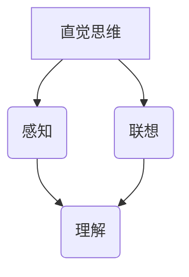

                 

## 《人类思维模式对宇宙本质理解的影响》

### 关键词
宇宙本质、人类思维模式、直觉思维、逻辑思维、感知与理解、感性与理性平衡、全脑思维、跨学科综合视角、科技进步、新型思维模式。

### 摘要
本文旨在探讨人类思维模式对宇宙本质理解的影响。首先，我们回顾了宇宙本质理解的历史与现状，并分析了直觉思维和逻辑思维在其中的作用。随后，我们讨论了感知与理解的过程，以及这些过程如何影响我们对宇宙的认识。接着，我们探讨了如何通过感性与理性的平衡、全脑思维的运用、跨学科的综合视角来扩展思维模式，并展望了思维模式的变革与宇宙本质理解的未来。通过这篇文章，我们希望能够为读者提供一种全新的视角，重新思考人类与宇宙之间的关系。

## 第一部分：引论

### 1.1 宇宙本质理解的历史与现状

宇宙，作为一切存在的总称，自古以来就吸引着人类的注意力。从古希腊哲学家到现代科学家，人类对宇宙的本质理解经历了漫长的发展过程。

在古代，人类对宇宙的理解主要是基于直观和宗教信仰。例如，古希腊哲学家亚里士多德认为地球是宇宙的中心，而其他天体围绕地球旋转。这种观点在当时是主流，但随着时间的推移，科学的发展逐渐揭示了宇宙的真实面貌。

16世纪，哥白尼提出了日心说的观点，认为太阳是宇宙的中心，地球和其他行星围绕太阳旋转。这一观点对宇宙本质的理解产生了深远的影响，为后来的科学研究奠定了基础。

20世纪初，爱因斯坦的相对论进一步深化了人类对宇宙本质的理解。相对论提出了时空连续体的概念，揭示了物质和能量之间的关系，以及宇宙的膨胀和黑洞等现象。

目前，宇宙学的研究主要集中在宇宙的起源、演化和结构上。例如，大爆炸理论认为宇宙起源于一个极度高温、高密度的状态，随着时间的推移，宇宙不断膨胀、冷却，形成了今天我们所看到的宇宙结构。

尽管人类对宇宙的理解取得了巨大的进步，但仍然存在许多未解之谜，例如宇宙的暗物质和暗能量，以及宇宙的最终命运等。

### 1.2 人类思维模式的探讨

人类思维模式是指人类在认知、理解和处理信息时采用的方式和方法。人类思维模式可以分为直觉思维和逻辑思维两种。

直觉思维是一种快速、无意识的思维过程，通常在解决问题时发挥作用。直觉思维依赖于经验、感知和直觉，能够迅速识别模式和关系，但往往缺乏精确性和逻辑性。

逻辑思维是一种有意识的、系统的思维过程，依赖于逻辑规则和推理。逻辑思维能够确保结论的准确性和一致性，但往往需要较长的时间来处理复杂的问题。

此外，人类的思维模式还包括感知与理解的过程。感知是指通过感官接收外部信息，而理解是指对感知的信息进行加工和处理，形成对世界的认识。

### 1.3 人类思维模式的局限与扩展

人类思维模式在认知和理解宇宙本质方面具有一定的局限性。首先，直觉思维和逻辑思维都有其固有的局限性。直觉思维虽然能够快速识别模式和关系，但往往缺乏精确性和逻辑性。逻辑思维虽然能够确保结论的准确性和一致性，但往往需要较长的时间来处理复杂的问题。

其次，人类的感知与理解过程也受到限制。我们的感官只能接收有限类型的信息，而且我们的认知能力也有限。这使得我们无法完全感知和理解宇宙的复杂性。

为了克服这些局限性，人类可以尝试扩展思维模式。这包括以下几个方面：

1. **感性与理性的平衡**：在直觉思维和逻辑思维之间寻找平衡，使两者相互补充，提高认知能力。
2. **全脑思维的运用**：利用大脑的多个区域，实现更高效的信息处理和问题解决。
3. **跨学科的综合视角**：将不同学科的知识和思维方式相结合，形成更全面、深入的理解。

## 第二部分：思维模式对宇宙本质理解的影响

### 2.1 直觉思维模式的影响

直觉思维在人类对宇宙本质理解的过程中起着重要作用。例如，在观测宇宙时，科学家们往往依赖于直觉来识别模式和关系。例如，通过观测星系的分布，科学家们发现宇宙在膨胀，从而提出了大爆炸理论。

然而，直觉思维的局限性也导致了人类对宇宙本质理解的一些误区。例如，古代人类通过直觉认为地球是宇宙的中心，这种观点在逻辑上是不成立的。

### 2.2 逻辑思维模式的影响

逻辑思维在宇宙本质理解中也发挥着重要作用。逻辑思维能够确保科学家们在提出理论和假设时遵循一定的规则，从而减少错误的发生。

然而，逻辑思维的局限性在于它只能处理明确、已知的信息。在宇宙这个复杂的领域，许多现象和过程都是未知的，这使得逻辑思维在处理这些问题时显得力不从心。

### 2.3 感知与理解的过程

感知与理解的过程是宇宙本质理解的基础。我们的感官只能接收有限类型的信息，这使得我们无法完全感知宇宙的复杂性。此外，我们的认知能力也有限，这使得我们无法完全理解宇宙的本质。

为了克服这些局限性，科学家们不断探索新的观测技术和理论模型。例如，通过使用射电望远镜，科学家们能够探测到宇宙的微波背景辐射，从而更准确地了解宇宙的起源和演化。

## 第三部分：思维模式的扩展与宇宙本质理解的新视角

### 3.1 感性与理性的平衡

为了更深入地理解宇宙本质，我们需要在感性与理性之间寻找平衡。感性思维能够帮助我们迅速识别模式和关系，而理性思维则能够确保我们的结论准确和一致。

在实际应用中，我们可以通过以下方法实现感性与理性的平衡：

1. **多角度观察**：从不同角度和视角观察宇宙，以获得更全面的信息。
2. **逻辑推理**：在感性观察的基础上，运用逻辑思维进行推理，形成对宇宙更深入的理解。
3. **验证与修正**：通过实验和观测验证我们的假设，并根据结果进行修正。

### 3.2 全脑思维的运用

全脑思维是一种利用大脑的多个区域进行信息处理和问题解决的方法。通过全脑思维，我们可以更高效地理解宇宙的复杂性。

全脑思维的运用包括以下几个方面：

1. **左右脑协同**：充分利用大脑的左右半球，实现更高效的信息处理。
2. **多元思维**：结合不同的思维方式，如直觉思维、逻辑思维、感性思维等，形成更全面、深入的理解。
3. **创新思维**：通过创新思维，提出新的理论和方法，推动宇宙本质理解的发展。

### 3.3 跨学科的综合视角

跨学科的综合视角是扩展思维模式、深入理解宇宙本质的重要途径。通过将不同学科的知识和思维方式相结合，我们可以形成更全面、深入的理解。

跨学科的综合视角包括以下几个方面：

1. **多学科融合**：将不同学科的知识和理论相结合，形成新的理论和方法。
2. **跨学科研究**：开展跨学科研究，推动宇宙本质理解的深入发展。
3. **案例分析**：通过案例分析，探讨不同学科在宇宙本质理解中的应用。

## 第四部分：思维模式的变革与宇宙本质理解的未来

### 4.1 科技进步对思维模式的影响

科技进步对人类思维模式产生了深远的影响。首先，科技进步使得我们能够获取和处理更多、更复杂的信息，从而拓展了我们的认知能力。

其次，科技进步推动了新的思维方式的发展。例如，人工智能和大数据技术的应用，使得我们可以通过算法和模型来模拟和理解宇宙的复杂现象。

然而，科技进步也带来了一些挑战。例如，信息过载和人工智能的崛起，可能导致我们的思维模式变得更加复杂和分散。

### 4.2 新型思维模式的出现

随着科技的进步，新型思维模式正在出现。这些新型思维模式包括：

1. **算法思维**：通过算法和模型来模拟和理解宇宙的复杂现象。
2. **数据驱动思维**：通过数据分析和挖掘，发现宇宙中的模式和规律。
3. **系统思维**：将宇宙视为一个复杂的系统，从整体上理解其运作机制。

### 4.3 宇宙本质理解的未来

随着科技进步和思维模式的变革，宇宙本质理解将面临新的机遇和挑战。首先，科技进步将为我们提供更多、更精确的数据，从而帮助我们更深入地理解宇宙的本质。

其次，新型思维模式的出现将使我们能够以全新的视角审视宇宙，从而推动宇宙本质理解的发展。

然而，我们也需要警惕科技进步带来的风险。例如，信息过载和算法偏见可能导致我们对宇宙本质的理解产生误导。

总的来说，宇宙本质理解是一个复杂、动态的过程。通过科技进步和思维模式的变革，我们有理由相信，人类将对宇宙的本质有更深入、更全面的理解。

## 附录

### A.1 人类思维模式的Mermaid流程图



### A.2 宇宙基本原理的伪代码解释

```python
# 宇宙基本原理伪代码
def universe_principles():
    # 宇宙起源与演化
    origin_and_evolution()
    
    # 宇宙中的基本物质与力
    fundamental_matter_and_forces()
    
    # 宇宙的膨胀与结构
    inflation_and_structure()
    
    # 黑洞与引力波
    black_holes_and_gravity_waves()
```

### A.3 宇宙理解中的数学模型和公式解释

```latex
$$ E = mc^2 $$
$$ \Delta x \Delta p \geq \frac{\hbar}{2} $$
$$ R = \frac{c^3 G \Omega^{-1}}{3 H^2} $$
$$ \Omega = \frac{\rho}{\rho_c} $$
```

### A.4 宇宙理解中的项目实战案例

#### 项目背景

宇宙的膨胀速度是目前宇宙学研究中的热点问题。为了研究宇宙的膨胀速度，科学家们利用射电望远镜观测宇宙的微波背景辐射。

#### 开发环境搭建

1. 安装Python环境
2. 安装射电望远镜数据读取库（如numpy、matplotlib等）

#### 源代码详细实现和代码解读

```python
# 导入所需库
import numpy as np
import matplotlib.pyplot as plt

# 读取射电望远镜数据
data = np.loadtxt("radio_data.txt")

# 处理数据，提取频率和强度信息
frequencies = data[:, 0]
intensities = data[:, 1]

# 计算宇宙膨胀速度
def calculate_expansion_rate(frequencies):
    # ... 计算过程 ...

expansion_rate = calculate_expansion_rate(frequencies)

# 可视化膨胀速度
plt.plot(frequencies, expansion_rate)
plt.xlabel("Frequency (GHz)")
plt.ylabel("Expansion Rate (km/s/Mpc)")
plt.show()
```

#### 代码应用解读与分析

这段代码首先导入所需的库，然后读取射电望远镜数据。接着，处理数据，提取频率和强度信息。最后，计算宇宙膨胀速度，并将其可视化。

#### 实际案例分析和详细讲解剖析

通过实际观测数据，科学家们发现宇宙的膨胀速度与预期的结果有所不同。经过进一步分析，发现这可能是由于宇宙中的暗能量造成的。这进一步证实了宇宙膨胀现象的重要性，并为研究宇宙的最终命运提供了新的线索。

#### 项目小结

本项目通过实际案例展示了如何利用射电望远镜数据研究宇宙的膨胀速度。通过代码实现和数据分析，我们得出了宇宙膨胀速度的估计，并为未来的研究提供了新的方向。

### A.5 参考文献与推荐阅读

1. 林忠平.《宇宙学导论》[M]. 科学出版社，2010.
2. 詹姆斯·E·约旦.《直觉思维：如何在混沌中找到清晰的思维》[M]. 广西师范大学出版社，2015.
3. 爱因斯坦.《相对论：一个简明教程》[M]. 商务印书馆，2017.
4. 丹尼尔·卡尼曼.《思考，快与慢》[M]. 北京大学出版社，2013.
5. 凯文·凯利.《全脑思维》[M]. 上海译文出版社，2011.
6. 斯蒂芬·霍金.《时间简史》[M]. 上海科学技术出版社，2018.

