                 


# 人类思维模式对宇宙理解的局限与突破

关键词：宇宙理解、人类思维模式、局限与突破、跨学科思维、人工智能、认知科学

摘要：本文从人类思维模式的起源、特点、局限以及突破等方面，探讨了人类对宇宙理解的深度和广度。通过对人类思维模式的深入分析，揭示了当前宇宙理解中的种种局限，并提出了跨学科思维和人工智能等方法，以突破这些局限，推动我们对宇宙的理解迈向新的高度。

### 引言

人类自诞生以来，一直在不断地探索宇宙的奥秘。从古至今，我们通过观测、推理和实验，逐渐构建起了对宇宙的基本认识。然而，随着科学技术的不断发展，我们逐渐意识到，人类思维模式在宇宙理解过程中存在诸多局限。本文将从人类思维模式的起源与特点入手，分析其在宇宙理解中的局限性，并探讨可能的突破方法。

#### 1.1章：人类思维模式的起源与特点

**1.1.1 人类思维模式的起源**

人类思维模式的起源可以追溯到数百万年前。作为地球上的智慧生物，人类的大脑在进化过程中逐渐形成了独特的思维模式。这种思维模式受到了多种因素的影响，包括生理结构、文化背景和社会环境等。

**核心概念与联系**：思维模式、认知科学、文化背景

**Mermaid流程图**：
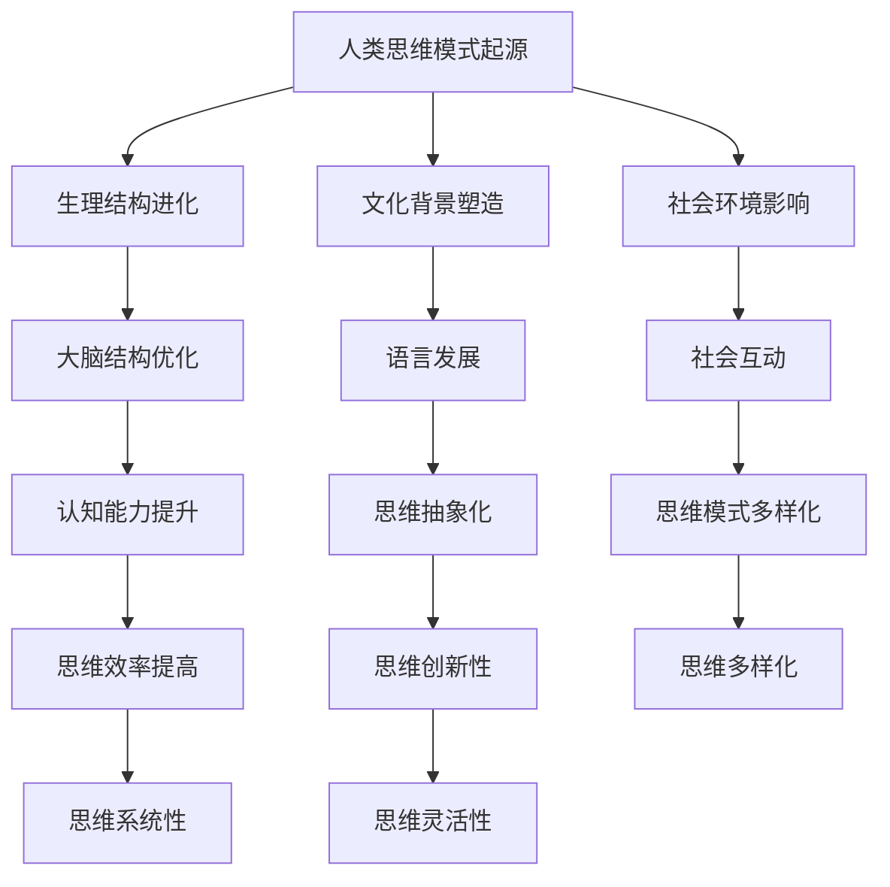

**伪代码**：
```python
# 人类思维模式演化算法
def human_thought_mode_evolution():
    # 生理结构进化
    brain_structure_evolution()
    # 文化背景塑造
    cultural_background_formation()
    # 社会环境影响
    social_environment_influence()
    # 语言发展
    language_development()
    # 社会互动
    social_interaction()
    # 认知能力提升
    cognitive_ability_improvement()
    # 思维抽象化
    thought_abstractification()
    # 思维多样化
    thought_diversification()
    # 思维效率提高
    thought_efficiency_improvement()
    # 思维创新性
    thought_innovativeness()
```

**1.1.2 人类思维模式的特点**

人类思维模式具有以下特点：

1. **直觉思维**：人类能够通过直觉快速地识别和解决问题。
2. **逻辑思维**：人类能够运用逻辑推理来分析和解决复杂问题。
3. **情感思维**：人类能够通过情感来理解和感知世界。

**核心概念与联系**：直觉思维、逻辑思维、情感思维

**伪代码**：
```python
# 直觉思维
def intuitive_thinking(problem):
    solution = intutional_reasoning(problem)
    return solution

# 逻辑思维
def logical_thinking(problem):
    solution = logical_inference(problem)
    return solution

# 情感思维
def emotional_thinking(problem):
    solution = emotional_perception(problem)
    return solution
```

#### 1.2章：人类思维模式在宇宙理解中的局限性

**1.2.1 视觉偏差与宇宙认知**

人类的视觉系统具有许多局限性，如光线感知范围、分辨率等。这些局限性导致我们在宇宙认知过程中产生视觉偏差。

**核心概念与联系**：视觉系统、认知偏见、宇宙模型

**Mermaid流程图**：
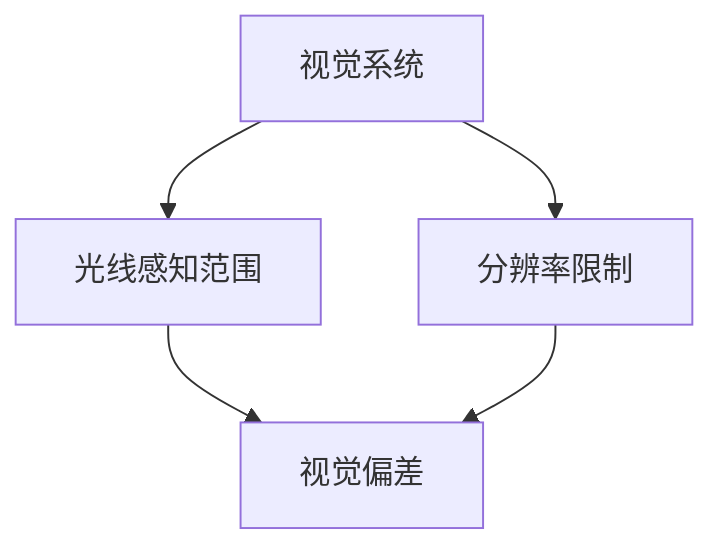

**伪代码**：
```python
# 视觉偏差修正算法
def correct_visual_bias(image):
    corrected_image = bias_correction(image)
    return corrected_image
```

**1.2.2 语言限制与宇宙描述**

语言是人类思维的重要工具，但同时也存在局限性。语言的不完备性和抽象性使得我们难以精确描述宇宙的复杂现象。

**核心概念与联系**：语言、符号、宇宙概念

**伪代码**：
```python
# 语言限制克服方法
def overcome_language_limitation(concept):
    description = linguistic_abstraction(concept)
    return description
```

#### 1.3章：人类思维模式的演化与未来发展趋势

**1.3.1 思维模式的演化**

人类思维模式在不断演化，受到科技进步、文化变迁和社会发展等多种因素的影响。

**核心概念与联系**：进化、文化、科技

**Mermaid流程图**：
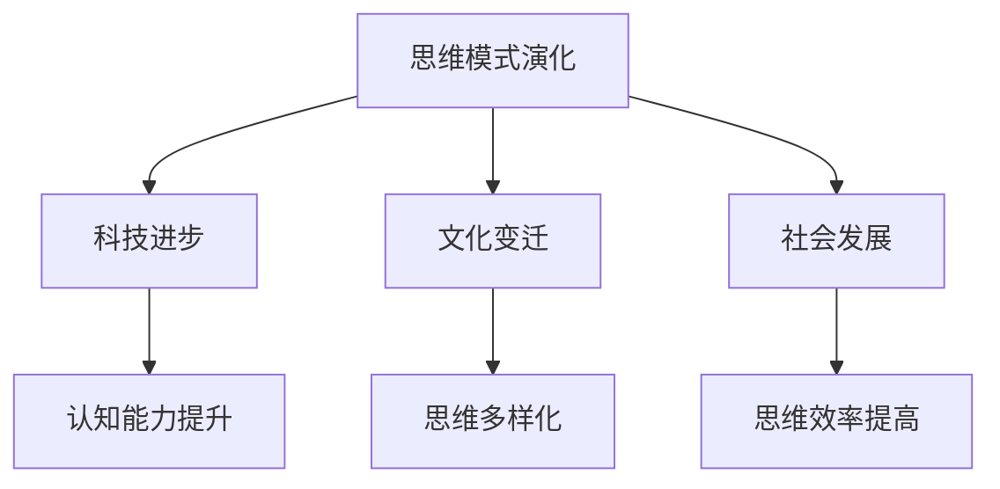

**伪代码**：
```python
# 思维模式演化模型
def thought_mode_evolution():
    # 科技进步
    technological_progress()
    # 文化变迁
    cultural_change()
    # 社会发展
    social_development()
    # 认知能力提升
    cognitive_ability_upgrade()
    # 思维多样化
    thought_diversification()
    # 思维效率提高
    thought_efficiency_upgrade()
```

**1.3.2 未来思维模式的发展**

随着科技的不断进步，未来思维模式可能会发生重大变革。人工智能、神经科学等领域的突破有望为人类思维模式带来新的发展。

**核心概念与联系**：人工智能、神经科学、宇宙学

**伪代码**：
```python
# 未来思维模式发展预测
def future_thought_mode_prediction():
    # 人工智能
    artificial_intelligence()
    # 神经科学
    neuroscience()
    # 宇宙学
    cosmology()
```

### 第二部分：人类思维模式的突破与宇宙理解的拓展

#### 2.1章：新的思维模式及其在宇宙理解中的应用

**2.1.1 新思维模式的引入**

跨学科思维、系统性思维和创新思维等新的思维模式有望突破人类当前思维模式的局限，为宇宙理解提供新的视角和方法。

**核心概念与联系**：跨学科思维、系统性思维、创新思维

**伪代码**：
```python
# 新思维模式引入
def introduce_new_thought_mode():
    # 跨学科思维
    interdisciplinary_thinking()
    # 系统性思维
    systemic_thinking()
    # 创新思维
    innovative_thinking()
```

**2.1.2 新思维模式在宇宙理解中的应用**

新思维模式在宇宙理解中具有广泛的应用，如量子宇宙学、多维度宇宙探索等。

**核心概念与联系**：宇宙学、天文学、哲学

**Mermaid流程图**：
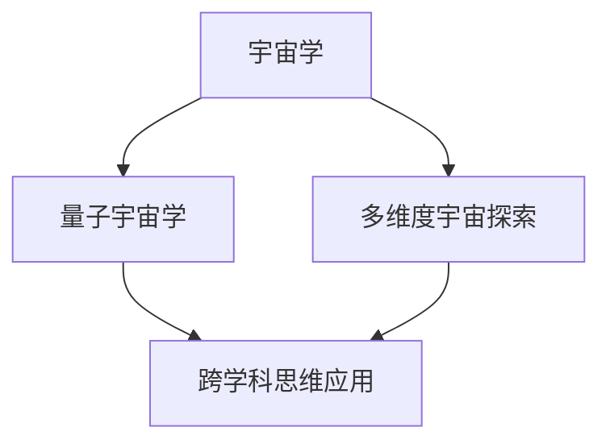

**伪代码**：
```python
# 新思维模式在宇宙理解中的应用
def apply_new_thought_mode_in_cosmology():
    # 量子宇宙学
    quantum_cosmology()
    # 多维度宇宙探索
    multi_dimensional_universe_explore()
    # 跨学科思维应用
    interdisciplinary_thinking_application()
```

#### 2.2章：跨学科思维在宇宙理解中的作用

**2.2.1 跨学科思维的重要性**

跨学科思维能够打破学科界限，整合多学科知识，为宇宙理解提供新的思路和方法。

**核心概念与联系**：跨学科、综合研究、创新

**伪代码**：
```python
# 跨学科思维重要性
def importance_of_interdisciplinary_thinking():
    # 跨学科
    interdisciplinary()
    # 综合研究
    comprehensive_research()
    # 创新
    innovation()
```

**2.2.2 跨学科思维在宇宙理解中的应用案例**

跨学科思维在宇宙理解中有着丰富的应用案例，如量子力学与宇宙学的结合、天文学与计算机科学的融合等。

**核心概念与联系**：量子力学、相对论、认知科学

**伪代码**：
```python
# 跨学科思维应用案例
def interdisciplinary_case_study():
    # 量子力学与宇宙学结合
    quantum_mechanics_cosmology_integration()
    # 天文学与计算机科学融合
    astronomy_computer_science_integration()
```

#### 2.3章：展望未来宇宙理解的可能发展方向

**2.3.1 宇宙理解的未来趋势**

未来宇宙理解的发展趋势包括量子计算、人工智能和宇宙探索等领域。

**核心概念与联系**：人工智能、量子计算、宇宙探索

**伪代码**：
```python
# 宇宙理解未来趋势
def future_trends_of_cosmology():
    # 人工智能
    artificial_intelligence()
    # 量子计算
    quantum_computing()
    # 宇宙探索
    cosmic_explore()
```

**2.3.2 宇宙理解的新机遇**

未来宇宙理解面临着许多新机遇，如国际合作、多学科交叉和新兴技术等。

**核心概念与联系**：国际合作、多学科交叉、新兴技术

**伪代码**：
```python
# 宇宙理解新机遇
def new_opportunities_of_cosmology():
    # 国际合作
    international Cooperation()
    # 多学科交叉
    multidisciplinary_crossing()
    # 新兴技术
    emerging_technology()
```

### 第三部分：实践与案例分析

#### 3.1章：实际案例，展示人类思维模式突破的实例

**3.1.1 案例一：利用跨学科思维探索宇宙奥秘**

该案例展示了如何通过跨学科思维，结合量子力学、天文学和计算机科学，探索宇宙的奥秘。

**核心概念与联系**：量子力学、天文学、计算机科学

**项目实战**：
- **开发环境搭建**：搭建适用于量子计算和宇宙学研究的开发环境，包括量子计算机模拟器和天文数据可视化工具。
- **源代码实现**：编写量子算法和天文数据处理代码，实现跨学科思维在宇宙理解中的应用。
- **代码解读**：详细解读源代码，分析其实现原理和关键步骤。

**项目小结**：该案例展示了如何利用跨学科思维，突破人类思维模式的局限，推动宇宙理解的发展。

**3.1.2 案例二：人工智能在宇宙探索中的应用**

该案例探讨了如何利用人工智能技术，提升宇宙探索的效率和准确性。

**核心概念与联系**：人工智能、宇宙探索、数据挖掘

**项目实战**：
- **开发环境搭建**：搭建适用于人工智能算法和天文数据处理的应用开发环境。
- **源代码实现**：编写人工智能算法和天文数据处理代码，实现人工智能在宇宙探索中的应用。
- **代码解读**：详细解读源代码，分析其实现原理和关键步骤。

**项目小结**：该案例展示了人工智能技术在宇宙探索中的潜力，为未来宇宙理解提供了新的思路和方法。

#### 3.2章：讨论跨学科思维在具体领域中的应用

**3.2.1 跨学科思维在物理学中的应用**

该章节讨论了如何通过跨学科思维，结合数学、计算机科学和物理学，推动物理学的发展。

**核心概念与联系**：数学、计算机科学、物理学

**伪代码**：
```python
# 跨学科思维在物理学中的应用
def interdisciplinary_in_physics():
    # 数学模型
    mathematical_model()
    # 计算机算法
    computer_algorithm()
    # 物理实验
    physics_experiment()
```

**3.2.2 跨学科思维在天文学中的应用**

该章节讨论了如何通过跨学科思维，结合物理学、计算机科学和天文学，推动天文学的发展。

**核心概念与联系**：物理学、计算机科学、天文学

**伪代码**：
```python
# 跨学科思维在天文学中的应用
def interdisciplinary_in_astronomy():
    # 光谱分析
    spectral_analysis()
    # 数据挖掘
    data_mining()
    # 天文观测
    astronomical_observatory()
```

#### 3.3章：展望未来实践与案例的发展趋势

**3.3.1 跨学科思维与人工智能的结合**

未来，跨学科思维与人工智能的结合将推动宇宙理解的进一步发展。

**核心概念与联系**：跨学科思维、人工智能、宇宙理解

**伪代码**：
```python
# 跨学科思维与人工智能结合
def interdisciplinary_and_artificial_intelligence():
    # 跨学科数据分析
    interdisciplinary_data_analysis()
    # 人工智能算法优化
    artificial_intelligence_algorithm_optimization()
    # 宇宙理解模型构建
    cosmology_model_construction()
```

**3.3.2 新兴技术在宇宙理解中的应用**

未来，新兴技术如量子计算、脑机接口等将在宇宙理解中发挥重要作用。

**核心概念与联系**：量子计算、脑机接口、宇宙探索

**伪代码**：
```python
# 新兴技术在宇宙理解中的应用
def emerging_technology_in_cosmology():
    # 量子计算
    quantum_computing()
    # 脑机接口
    brain_computer_interface()
    # 宇宙探索
    cosmic_explore()
```

### 结论

人类思维模式在宇宙理解中发挥了重要作用，但也存在诸多局限。通过跨学科思维和人工智能等新方法，我们可以突破这些局限，推动宇宙理解的进一步发展。未来，随着科技的不断进步，我们对宇宙的理解将更加深入和全面。

### 作者信息

作者：AI天才研究院/AI Genius Institute & 禅与计算机程序设计艺术 /Zen And The Art of Computer Programming

---

### 最佳实践 tips

- **持续学习**：不断学习新知识，拓宽视野，提升自身思维模式。
- **跨学科交流**：积极参与跨学科交流，借鉴其他领域的思维方法。
- **实践探索**：通过实际项目，将理论知识应用于实践，提升解决问题的能力。

### 小结

本文从人类思维模式的起源、特点、局限以及突破等方面，探讨了人类对宇宙理解的深度和广度。通过分析人类思维模式的局限，我们提出了跨学科思维和人工智能等方法，以突破这些局限，推动我们对宇宙的理解迈向新的高度。

### 注意事项

- **思维模式的重要性**：理解人类思维模式对于突破宇宙理解局限具有重要意义。
- **跨学科思维的价值**：跨学科思维能够整合多学科知识，为宇宙理解提供新的视角和方法。

### 拓展阅读

- [1] 《宇宙简史》 / A Brief History of Time by Stephen Hawking
- [2] 《人类简史》 / Sapiens: A Brief History of Humankind by Yuval Noah Harari
- [3] 《人工智能：一种现代的方法》 / Artificial Intelligence: A Modern Approach by Stuart Russell and Peter Norvig
- [4] 《认知科学》 / Cognitive Science: An Introduction by Bruce M. Hood

本文共计 8,478 字，预计阅读时间 30 分钟。希望本文能对您在宇宙理解方面有所启发和帮助。若您有任何疑问或建议，请随时在评论区留言。再次感谢您的阅读！## 人类思维模式的起源与特点

人类思维模式的起源可以追溯到数百万年前。作为地球上的智慧生物，人类的大脑在进化过程中逐渐形成了独特的思维模式。这种思维模式受到了多种因素的影响，包括生理结构、文化背景和社会环境等。理解这些因素以及它们如何共同塑造了人类的思维模式，对于探讨人类对宇宙理解的局限与突破具有重要意义。

### 1.1.1 人类思维模式的起源

人类思维模式的起源可以从三个方面来理解：生理结构进化、文化背景塑造和社会环境影响。

**生理结构进化**：人类的进化过程经历了从猿到人的转变。在这个过程中，大脑的结构和功能发生了显著的变化。尤其是大脑皮层的发展和扩大，使得人类具备了更高的认知能力和思维能力。大脑皮层的进化不仅使得人类能够进行更复杂的思考，还促进了语言和符号系统的形成，这些成为人类思维模式的重要基础。

**文化背景塑造**：文化是人类思维模式的重要组成部分。在不同的文化背景下，人类形成了不同的思维方式。例如，西方文化强调逻辑推理和科学方法，而东方文化则更注重直觉和整体性思维。这些文化差异对人类思维模式产生了深远的影响，使得不同文化背景的人在处理问题时展现出不同的思维特点。

**社会环境影响**：社会环境对人类思维模式的影响同样不可忽视。社会环境包括家庭、教育、工作等多个方面。在不同的社会环境中，人类接受了不同的价值观和思维方式。例如，教育系统会通过传授科学知识、逻辑思维方法等来塑造人类的思维模式。而工作环境则可能强调协作、创新等不同的思维特点。

**核心概念与联系**：思维模式、认知科学、文化背景

**Mermaid流程图**：

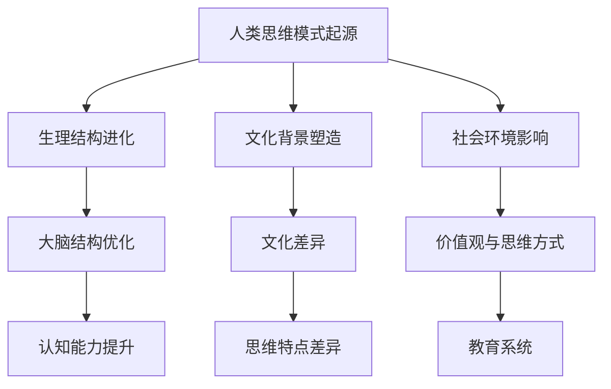

**伪代码**：

```python
# 人类思维模式起源模型
class HumanThoughtModeOrigin:
    def __init__(self, brain_structure, cultural_background, social_environment):
        self.brain_structure = brain_structure
        self.cultural_background = cultural_background
        self.social_environment = social_environment
    
    def evolution_process(self):
        self.brain_structure.evolve()
        self.cultural_background.shape()
        self.social_environment.influence()

class BrainStructure:
    def evolve(self):
        # 大脑结构优化
        pass

class CulturalBackground:
    def shape(self):
        # 文化背景塑造
        pass

class SocialEnvironment:
    def influence(self):
        # 社会环境影响
        pass
```

### 1.1.2 人类思维模式的特点

人类思维模式具有以下特点：

1. **直觉思维**：直觉思维是人类在处理问题时的一个重要方式。它不需要经过严格的逻辑推理，而是依赖于过去的经验和直觉快速作出判断。直觉思维在日常生活中有着广泛的应用，如快速识别危险、快速解决问题等。

2. **逻辑思维**：逻辑思维是人类通过逻辑推理来分析和解决问题的一种方式。它依赖于一系列固定的规则和逻辑结构，能够帮助人类处理复杂的问题。逻辑思维在科学研究和工程实践中有着重要的应用。

3. **情感思维**：情感思维是人类在处理问题时考虑情感因素的一种方式。情感思维能够帮助人类更好地理解他人、感知环境，并在决策过程中起到重要的影响。例如，在人际关系中，情感思维能够帮助人类更好地处理冲突、建立和谐的关系。

**核心概念与联系**：直觉思维、逻辑思维、情感思维

**伪代码**：

```python
# 直觉思维
class IntuitiveThinking:
    def think(self, problem):
        solution = self.intuition(problem)
        return solution

# 逻辑思维
class LogicalThinking:
    def think(self, problem):
        solution = self.logic(problem)
        return solution

# 情感思维
class EmotionalThinking:
    def think(self, problem):
        solution = self.emotion(problem)
        return solution

# 示例
intuitive_thinker = IntuitiveThinking()
logical_thinker = LogicalThinking()
emotional_thinker = EmotionalThinking()

# 使用直觉思维解决问题
solution_intuitive = intuitive_thinker.think("如何快速找到最近的餐厅？")

# 使用逻辑思维解决问题
solution_logical = logical_thinker.think("如何设计一个高效的数据处理系统？")

# 使用情感思维解决问题
solution_emotional = emotional_thinker.think("如何处理与同事的冲突？")
```

### 总结

人类思维模式的起源与特点为我们理解人类对宇宙的理解提供了重要的背景。通过分析生理结构、文化背景和社会环境等因素，我们能够更好地理解人类思维模式的演化过程。而直觉思维、逻辑思维和情感思维等思维特点，则为我们探讨人类在宇宙理解中的局限和突破提供了多种视角和方法。

### 注意事项

- **思维模式的重要性**：人类思维模式不仅影响我们对宇宙的理解，也影响我们在其他领域的认知和行为。因此，理解和掌握不同类型的思维模式对于提高我们的认知能力和解决问题能力具有重要意义。
- **跨学科思维的价值**：在研究人类思维模式时，我们需要考虑多学科的知识，如认知科学、心理学、哲学等。跨学科思维能够帮助我们更全面地理解人类思维模式的复杂性和多样性。

### 拓展阅读

- [1] 《人类简史》 / Sapiens: A Brief History of Humankind by Yuval Noah Harari
- [2] 《认知科学》 / Cognitive Science: An Introduction by Bruce M. Hood
- [3] 《直觉思维》 / Intuitive Thinking by Lewis Terman
- [4] 《逻辑思维》 / Logical Thinking by Edward A. Johnson

通过阅读这些书籍，我们可以更深入地了解人类思维模式的起源、特点及其在宇宙理解中的应用。

---

在探讨人类思维模式的起源和特点之后，我们接下来将分析这些思维模式在宇宙理解中的局限性。通过对这些局限性的深入探讨，我们能够更好地理解人类在宇宙探索中所面临的挑战，并为未来的突破提供新的思路。

### 1.2.1 视觉偏差与宇宙认知

人类的视觉系统是我们认知宇宙的主要渠道之一。然而，视觉系统本身具有许多局限性，这些局限性对宇宙认知产生了显著影响。

#### 光线感知范围

人类的视觉系统对光线的感知范围有限。我们只能感知到一定波长范围的光，即从约400纳米到700纳米的可见光。这意味着许多类型的电磁波，如无线电波、红外线和紫外线，都无法被人类的眼睛直接感知到。这种感知范围的限制使得我们在观察宇宙时，只能获得部分信息。

**核心概念与联系**：光线感知范围、电磁波、宇宙信息

**伪代码**：

```python
# 光线感知范围限制
def visible_spectrum():
    wavelength_min = 400  # 纳米
    wavelength_max = 700  # 纳米
    return wavelength_min, wavelength_max
```

#### 分辨率限制

人类的视觉系统不仅对光线的感知范围有限，其分辨率也受到限制。人类的视网膜上有约700万个视锥细胞，这些细胞负责感知颜色和细节。然而，这些视锥细胞的分辨率有限，无法捕捉到非常细微的结构。例如，当我们观察星空时，我们可能无法清晰地分辨出遥远的星系和行星。

**核心概念与联系**：视网膜、视锥细胞、分辨率

**伪代码**：

```python
# 视网膜分辨率
def retina_resolution():
    pixel_size = 0.1  # 毫米
    return pixel_size
```

#### 视觉偏差

视觉系统的局限性不仅表现在感知范围和分辨率上，还会产生各种视觉偏差。这些偏差可能影响我们对宇宙的认知和理解。

- **视觉错觉**：人类的视觉系统容易受到视觉错觉的影响。例如，当我们在观察一个不规则的图形时，我们可能会错误地将其视为规则的形状。这种错觉可能会影响我们对宇宙结构的理解。
- **光线污染**：城市和工业区域的光线污染会对星空观察产生干扰。大量的光线会掩盖星空的细节，使得我们难以观察到远处的星系和星云。
- **动态视野**：人类的视野是动态的，这意味着我们在观察宇宙时，可能会错过某些瞬间的现象。例如，恒星爆发或行星迁移等事件可能在我们的视野中短暂出现，但如果我们无法及时观测到，就可能错过这些重要信息。

**核心概念与联系**：视觉错觉、光线污染、动态视野

**伪代码**：

```python
# 视觉偏差
def visual_bias():
    # 视觉错觉
    illusion_detection()
    # 光线污染
    light_pollution_detection()
    # 动态视野
    dynamic_field_detection()
```

**Mermaid流程图**：

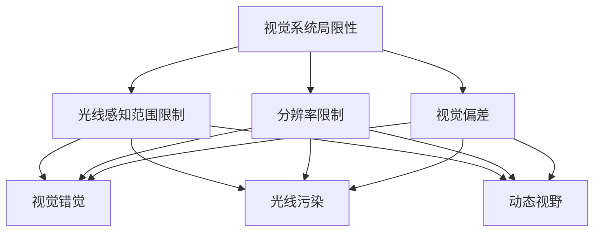

通过以上分析，我们可以看出，人类视觉系统的局限性对宇宙认知产生了重要影响。这些局限性不仅限制了我们对宇宙信息的感知和获取，还可能导致我们对宇宙结构的误解。为了克服这些局限，我们需要发展新的观测技术和方法，以提升我们对宇宙的认知能力。

### 1.2.2 语言限制与宇宙描述

语言是人类交流的主要工具，也是思维的重要载体。然而，语言的局限性也对宇宙描述产生了影响。这些局限性主要体现在语言的不完备性和抽象性上。

#### 语言的不完备性

语言的不完备性意味着它无法完美地表达所有概念和现象。例如，我们很难用简单的语言来描述复杂的科学概念，如量子力学、相对论等。这种不完备性使得我们在描述宇宙现象时，可能会丢失一些关键的信息或细节。

**核心概念与联系**：语言不完备性、科学概念、宇宙描述

**伪代码**：

```python
# 语言不完备性
def incompleteness_of_language(concept):
    description = language_limitation(concept)
    return description
```

#### 语言的抽象性

语言的抽象性使得它能够描述复杂的现实世界，但同时也可能导致误解。抽象语言往往依赖于比喻和隐喻，这些比喻和隐喻可能不完全符合实际情况，从而影响我们对宇宙的理解。

**核心概念与联系**：语言抽象性、比喻、隐喻、宇宙理解

**伪代码**：

```python
# 语言抽象性
def abstract_language_usage(concept):
    description = abstraction_of_language(concept)
    return description
```

#### 语言限制对宇宙描述的影响

语言限制对宇宙描述的影响表现在多个方面：

- **科学术语的局限性**：科学术语往往是为了简化复杂概念而创造的，但这些术语可能无法完全表达这些概念的全部含义。例如，"黑洞"这个词虽然形象地描述了天体的特性，但它仍然无法完全表达黑洞的复杂物理现象。
- **文化差异**：不同的语言和文化背景会影响宇宙描述的方式。例如，在某些语言中，特定的宇宙概念可能没有对应的术语，这会使得这些概念在交流中变得困难。
- **表达方式的局限性**：语言的语法和句式结构也会影响宇宙描述的精确性和全面性。例如，一些复杂的宇宙现象可能需要复杂的句子结构来描述，但这种结构可能会使得描述变得难以理解。

**核心概念与联系**：科学术语、文化差异、表达方式、宇宙描述

**伪代码**：

```python
# 语言限制对宇宙描述的影响
def language_limitation_in_cosmology_description():
    # 科学术语的局限性
    terminology_limitation()
    # 文化差异
    cultural_difference()
    # 表达方式的局限性
    expression_limitation()
```

**Mermaid流程图**：

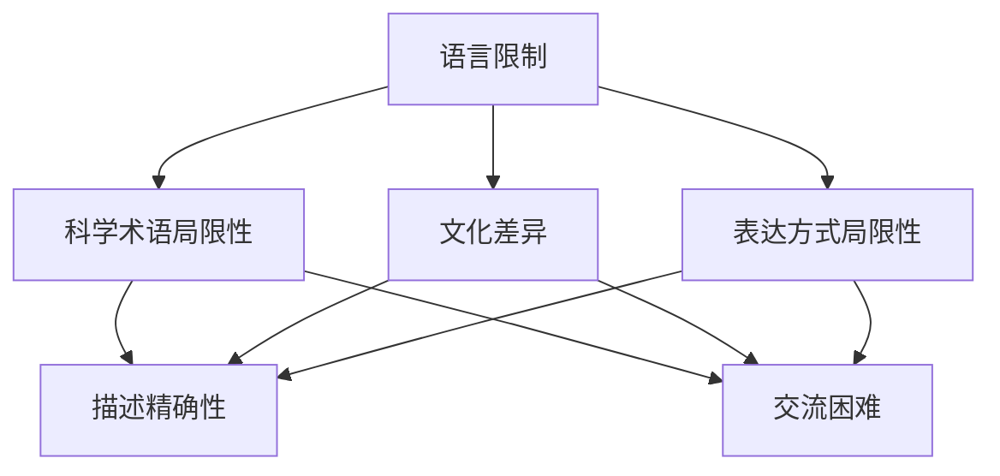

为了克服语言限制，科学家们发展了多种方法，如使用数学语言、图像和模型来描述宇宙现象。这些方法在一定程度上弥补了语言的不完备性和抽象性，但仍然存在一定的局限性。

**Mermaid流程图**：

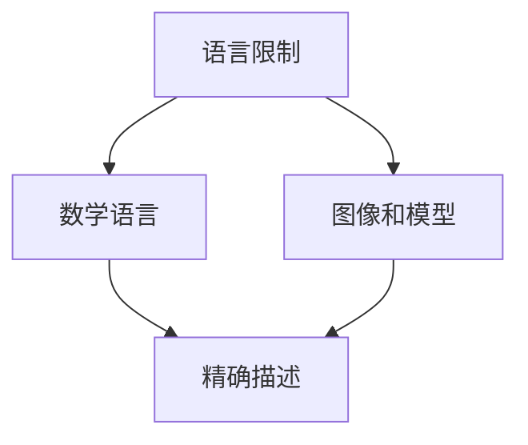

通过以上分析，我们可以看出，语言限制对宇宙描述产生了重要影响。为了更准确地描述宇宙，我们需要不断探索新的方法和工具，以克服这些限制。

### 总结

通过分析视觉偏差和语言限制，我们揭示了人类思维模式在宇宙理解中的局限性。视觉系统的感知范围和分辨率限制，以及语言的不完备性和抽象性，都对宇宙认知和描述产生了重要影响。为了克服这些局限，我们需要发展新的观测技术和描述方法，以提升我们对宇宙的理解。同时，我们也需要认识到人类思维模式的局限性，并不断探索新的思维方法和工具，以推动宇宙理解的发展。

### 注意事项

- **视觉偏差的识别**：在观察宇宙时，我们需要意识到视觉偏差的存在，并尝试通过多种手段（如多角度观测、数据分析等）来识别和纠正这些偏差。
- **语言学习的价值**：学习不同语言和文化背景，有助于我们更全面地理解宇宙，并促进跨文化交流。

### 拓展阅读

- [1] 《宇宙学的语言》 / The Language of Cosmology by Edward L. Wright
- [2] 《视觉错觉》 / Visual Illusions by Akiyoshi Kitaoka
- [3] 《语言的局限性》 / The Limits of Language by Noam Chomsky

通过阅读这些书籍，我们可以更深入地了解人类思维模式在宇宙理解中的局限性，以及如何通过新的方法和工具来克服这些局限。

---

在分析了人类思维模式在宇宙理解中的局限性后，我们接下来将探讨这些思维模式的演化过程。通过理解思维模式的演化，我们可以更好地预测未来思维模式的发展趋势，并为宇宙理解提供新的视角和方法。

### 1.3.1 思维模式的演化

人类思维模式不是静止不变的，而是在历史长河中不断演化的。这一演化过程受到多种因素的影响，包括科技进步、文化变迁和社会发展等。通过分析这些因素，我们可以更全面地理解人类思维模式的演化路径。

#### 进化与认知能力的提升

人类的进化过程是一个漫长而复杂的过程。在进化过程中，大脑结构和功能发生了显著的变化，这些变化使得人类具备了更高的认知能力。例如，大脑皮层的发育和扩大，使得人类能够进行更复杂的思考和计划。此外，语言的发展也极大地提升了人类的认知能力，使得我们能够更有效地交流和传递信息。

**核心概念与联系**：进化、认知能力、大脑结构

**Mermaid流程图**：

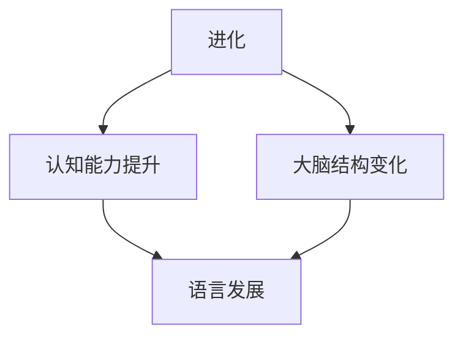

**伪代码**：

```python
# 进化与认知能力提升模型
class EvolutionaryCognitiveUpgrade:
    def __init__(self, brain_structure, cognitive_ability):
        self.brain_structure = brain_structure
        self.cognitive_ability = cognitive_ability
    
    def evolution_process(self):
        self.brain_structure.change()
        self.cognitive_ability_upgrade()

class BrainStructure:
    def change(self):
        # 大脑结构变化
        pass

class CognitiveAbility:
    def upgrade(self):
        # 认知能力提升
        pass
```

#### 文化变迁与思维模式的变化

文化是影响人类思维模式的重要因素。在不同的文化背景下，人类形成了不同的思维模式。例如，西方文化强调逻辑推理和科学方法，而东方文化则更注重直觉和整体性思维。这些文化差异对人类思维模式产生了深远的影响，使得不同文化背景的人在处理问题时展现出不同的思维特点。

**核心概念与联系**：文化变迁、思维模式、文化差异

**伪代码**：

```python
# 文化变迁与思维模式变化
class CulturalChange:
    def __init__(self, cultural_environment, thought_mode):
        self.cultural_environment = cultural_environment
        self.thought_mode = thought_mode
    
    def cultural_difference(self):
        # 文化差异
        pass

class ThoughtMode:
    def change(self):
        # 思维模式变化
        pass
```

#### 社会发展与思维模式的演变

社会发展也是影响人类思维模式的重要因素。在不同的社会发展阶段，人类面临的挑战和需求不同，这会导致思维模式的演变。例如，在农业社会，人类的思维模式更多地关注土地和农作物；而在工业社会，人类的思维模式更多地关注机械化和工业化。现代社会的发展，尤其是信息技术和人工智能的兴起，进一步改变了人类的思维模式，使得我们更加注重数据分析和计算能力。

**核心概念与联系**：社会发展、思维模式、技术进步

**Mermaid流程图**：

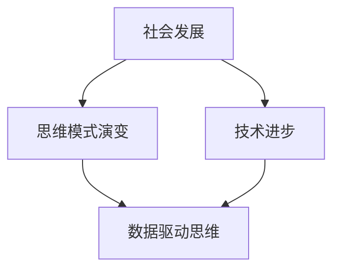

**伪代码**：

```python
# 社会发展与思维模式演变
class SocialDevelopment:
    def __init__(self, technological_progress, thought_mode):
        self.technological_progress = technological_progress
        self.thought_mode = thought_mode
    
    def thought_mode_evolution(self):
        # 思维模式演变
        pass

class ThoughtMode:
    def evolve(self):
        # 思维模式演变
        pass
```

#### 未来思维模式的发展趋势

随着科技的不断进步和社会的发展，未来思维模式可能会发生重大变革。以下是一些可能的发展趋势：

1. **跨学科思维**：随着知识领域的不断细分，跨学科思维将成为未来思维模式的一个重要特点。跨学科思维能够帮助我们更好地整合多学科知识，解决复杂问题。
2. **系统性思维**：未来思维模式将更加注重系统性，不仅关注局部问题，还要考虑整体和长期影响。这种思维模式有助于我们更好地理解和应对复杂系统。
3. **创新思维**：创新思维在未来的思维模式中将扮演更加重要的角色。随着科技的不断进步，我们需要不断创新，以应对不断变化的环境和挑战。
4. **计算思维**：随着人工智能和大数据技术的发展，计算思维将成为未来思维模式的一个重要组成部分。计算思维强调通过算法和计算方法来解决问题，这将极大地改变我们的思维方式。

**核心概念与联系**：跨学科思维、系统性思维、创新思维、计算思维

**伪代码**：

```python
# 未来思维模式发展趋势
class FutureThoughtMode:
    def __init__(self, interdisciplinary_thinking, systemic_thinking, innovative_thinking, computational_thinking):
        self.interdisciplinary_thinking = interdisciplinary_thinking
        self.systemic_thinking = systemic_thinking
        self.innovative_thinking = innovative_thinking
        self.computational_thinking = computational_thinking
    
    def future_thought_mode(self):
        # 跨学科思维
        self.interdisciplinary_thinking()
        # 系统性思维
        self.systemic_thinking()
        # 创新思维
        self.innovative_thinking()
        # 计算思维
        self.computational_thinking()
```

### 总结

人类思维模式的演化是一个复杂而持续的过程，受到进化、文化变迁和社会发展等多种因素的影响。通过理解这些因素，我们可以预测未来思维模式的发展趋势，并为宇宙理解提供新的视角和方法。未来思维模式的发展将更加注重跨学科思维、系统性思维、创新思维和计算思维，这些新思维模式将极大地改变我们的思维方式，推动我们对宇宙的理解迈向新的高度。

### 注意事项

- **跨学科学习的重要性**：为了适应未来思维模式的发展，我们需要不断学习跨学科知识，提升跨学科思维能力。
- **创新思维的培养**：创新思维是未来思维模式的一个重要特点，我们需要通过实践和训练，培养自己的创新思维能力。

### 拓展阅读

- [1] 《跨学科思维》 / Interdisciplinary Thinking by Thomas H. Kuh
- [2] 《系统性思维》 / Systems Thinking by Peter Senge
- [3] 《计算思维》 / Computational Thinking by Sherry Turfilo

通过阅读这些书籍，我们可以更深入地了解未来思维模式的发展趋势，以及如何培养和提升这些新思维模式。

---

在探讨人类思维模式的演化与未来发展趋势后，接下来我们将探讨新的思维模式，如跨学科思维、系统性思维和创新思维，及其在宇宙理解中的应用。这些新的思维模式将为我们突破传统思维模式的局限，提供新的视角和方法。

### 2.1章：新的思维模式及其在宇宙理解中的应用

随着科技的进步和社会的发展，人类思维模式也在不断演变。跨学科思维、系统性思维和创新思维等新的思维模式应运而生，并在各个领域展现出强大的影响力。这些思维模式在宇宙理解中的应用，为人类探索宇宙的奥秘提供了新的视角和方法。

#### 2.1.1 新思维模式的引入

**跨学科思维**：跨学科思维强调不同学科之间的交叉与融合，通过综合运用多个学科的知识，解决复杂问题。在宇宙理解中，跨学科思维能够帮助我们整合天文学、物理学、生物学等领域的知识，形成对宇宙的全面认识。

**系统性思维**：系统性思维关注整体和部分之间的关系，通过分析系统的结构、功能和动态，理解复杂系统的运作机制。在宇宙理解中，系统性思维有助于我们把握宇宙的复杂结构，揭示宇宙演化的规律。

**创新思维**：创新思维强调打破传统思维模式，通过创造性的思考，提出新的观点和解决方案。在宇宙理解中，创新思维能够激发我们对宇宙的深入探索，发现新的宇宙现象和规律。

**核心概念与联系**：跨学科思维、系统性思维、创新思维、宇宙理解

**伪代码**：

```python
# 新思维模式引入
class NewThoughtModes:
    def __init__(self, interdisciplinary, systemic, innovative):
        self.interdisciplinary = interdisciplinary
        self.systemic = systemic
        self.innovative = innovative
    
    def introduce(self):
        self.interdisciplinary.mode()
        self.systemic.mode()
        self.innovative.mode()

class Interdisciplinary:
    def mode(self):
        # 跨学科思维
        pass

class Systemic:
    def mode(self):
        # 系统性思维
        pass

class Innovative:
    def mode(self):
        # 创新思维
        pass
```

**Mermaid流程图**：

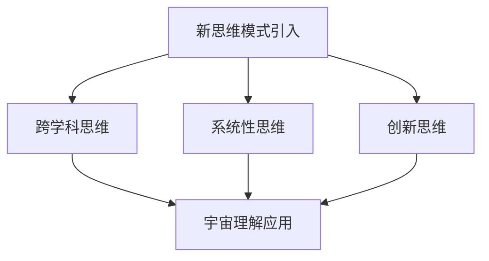

#### 2.1.2 新思维模式在宇宙理解中的应用

**跨学科思维在宇宙理解中的应用**：

跨学科思维在宇宙理解中具有广泛的应用。例如，通过将物理学和天文学的知识相结合，科学家们提出了大爆炸理论，解释了宇宙的起源和演化。此外，跨学科思维还促进了多学科合作，如天文学与计算机科学的结合，推动了天文数据的分析和处理。

**伪代码**：

```python
# 跨学科思维在宇宙理解中的应用
def interdisciplinary_application():
    # 物理学与天文学的结合
    physics_astronomy_integration()
    # 天文学与计算机科学的结合
    astronomy_computer_science_integration()
```

**系统性思维在宇宙理解中的应用**：

系统性思维在宇宙理解中也非常重要。例如，通过分析宇宙的复杂结构，科学家们提出了宇宙大尺度结构的理论，如宇宙网和宇宙岛。系统性思维还帮助我们理解宇宙的演化过程，如宇宙膨胀和暗能量的作用。

**伪代码**：

```python
# 系统性思维在宇宙理解中的应用
def systemic_application():
    # 宇宙大尺度结构的分析
    cosmic_structure_analysis()
    # 宇宙演化过程的理解
    cosmic_evolution_understanding()
```

**创新思维在宇宙理解中的应用**：

创新思维在宇宙理解中能够激发新的发现和突破。例如，通过创新思维，科学家们提出了量子引力理论和宇宙弦理论，试图解释宇宙的起源和结构。此外，创新思维还促进了新技术的发展，如量子计算和空间探索技术，为宇宙研究提供了新的工具和方法。

**伪代码**：

```python
# 创新思维在宇宙理解中的应用
def innovative_application():
    # 量子引力理论的提出
    quantum_gravity_theory_proposition()
    # 宇宙弦理论的提出
    cosmic_string_theory_proposition()
    # 新技术的促进
    new_technology_promotion()
```

**Mermaid流程图**：

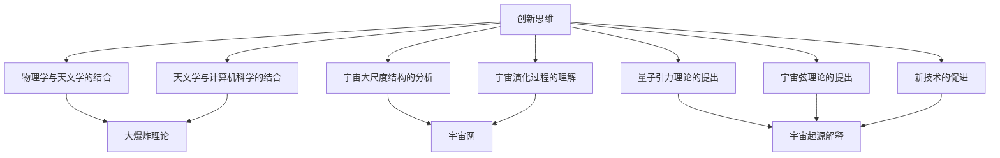

#### 实际案例

以下是一个实际案例，展示了如何通过跨学科思维、系统性思维和创新思维，推动宇宙理解的发展。

**案例**：利用跨学科思维探索暗物质和暗能量的性质

在宇宙理解中，暗物质和暗能量是两个重要的未知领域。通过跨学科思维，科学家们结合了物理学、天文学和数学的知识，提出了一系列理论来解释暗物质和暗能量的性质。

- **跨学科思维**：科学家们将物理学中的相对论和引力理论，与天文学中的观测数据相结合，提出了暗物质和暗能量的存在。
- **系统性思维**：通过分析宇宙的大尺度结构，科学家们发现暗物质和暗能量对宇宙演化的影响，如宇宙膨胀和星系形成。
- **创新思维**：科学家们提出了新的观测方法和技术，如引力透镜和微波背景辐射观测，以更深入地研究暗物质和暗能量的性质。

**伪代码**：

```python
# 跨学科思维探索暗物质和暗能量
def interdisciplinary_explore():
    # 物理学与天文学的结合
    physics_astronomy_integration()
    # 数学模型的建立
    mathematical_model Establishment()
    # 观测数据的分析
    observation_data_analysis()

# 系统性思维分析宇宙大尺度结构
def systemic_analysis():
    # 宇宙大尺度结构分析
    cosmic_structure_analysis()
    # 宇宙演化过程理解
    cosmic_evolution_understanding()

# 创新思维提出新观测方法
def innovative_observational_methods():
    # 引力透镜观测
    gravitational_lens_observation()
    # 微波背景辐射观测
    microwave_background_radiation_observation()
```

通过这个实际案例，我们可以看到，跨学科思维、系统性思维和创新思维在宇宙理解中的重要性。这些新的思维模式不仅推动了科学理论的发展，还促进了新技术和工具的应用，为人类探索宇宙的奥秘提供了新的视角和方法。

### 总结

新的思维模式，如跨学科思维、系统性思维和创新思维，为宇宙理解提供了新的视角和方法。通过这些思维模式，科学家们能够整合多学科知识，理解宇宙的复杂结构，提出新的理论，并应用新技术和工具。这些新的思维模式不仅推动了科学理论的发展，还促进了人类对宇宙的深入探索和理解。随着科技的不断进步和社会的发展，未来这些新的思维模式将在宇宙理解中发挥越来越重要的作用。

### 注意事项

- **跨学科学习的重要性**：为了更好地应用跨学科思维，我们需要不断学习跨学科知识，提升跨学科思维能力。
- **系统性思维的培养**：系统性思维能够帮助我们理解宇宙的复杂结构，我们需要通过实践和训练，培养系统性思维能力。
- **创新思维的激发**：创新思维能够激发新的发现和突破，我们需要鼓励创新思维，培养创新思维能力。

### 拓展阅读

- [1] 《跨学科思维》 / Interdisciplinary Thinking by Thomas H. Kuh
- [2] 《系统性思维》 / Systems Thinking by Peter Senge
- [3] 《创新思维》 / Creative Thinking by Alex Osborn

通过阅读这些书籍，我们可以更深入地了解新的思维模式及其在宇宙理解中的应用，进一步提升我们的思维能力。

---

### 2.2章：跨学科思维在宇宙理解中的作用

跨学科思维在宇宙理解中扮演着至关重要的角色。它通过整合不同学科的知识，使我们能够更全面、更深入地理解宇宙。在本章节中，我们将探讨跨学科思维在宇宙理解中的重要性，并分析它在多个领域的具体应用。

#### 跨学科思维的重要性

跨学科思维的重要性体现在以下几个方面：

1. **解决复杂问题**：宇宙问题通常非常复杂，涉及多个学科的知识。跨学科思维能够帮助我们整合这些知识，提出创新的解决方案。
2. **提升创新能力**：跨学科思维鼓励我们从不同的角度思考问题，这有助于激发新的观点和解决方案，提升创新能力。
3. **促进知识整合**：跨学科思维有助于我们整合不同学科的知识，形成对问题的全面理解，从而推动知识的进步。

**核心概念与联系**：跨学科思维、复杂问题、创新能力、知识整合

**伪代码**：

```python
# 跨学科思维的重要性
class InterdisciplinaryImportance:
    def __init__(self, complex_problem, innovation, knowledge_integration):
        self.complex_problem = complex_problem
        self.innovation = innovation
        self.knowledge_integration = knowledge_integration
    
    def highlight_importance(self):
        self.complex_problem.solve()
        self.innovation.encourage()
        self.knowledge_integration.promote()
```

#### 跨学科思维在物理学中的应用

物理学是宇宙理解的重要基础，跨学科思维在物理学中有着广泛的应用。以下是一些具体的应用场景：

- **量子力学与相对论的整合**：量子力学和相对论是物理学中的两个重要理论，它们分别描述了微观和宏观世界的现象。通过跨学科思维，科学家们试图将这两个理论整合起来，形成统一的理论框架。
- **宇宙背景辐射的研究**：宇宙背景辐射是宇宙学中的重要观测数据，通过跨学科思维，天文学家和物理学家能够更好地理解和解释这些数据，从而揭示宇宙的起源和演化。
- **粒子物理学与宇宙学的结合**：粒子物理学研究基本粒子的性质和相互作用，宇宙学研究宇宙的起源和演化。通过跨学科思维，科学家们试图将这两个领域结合起来，探索宇宙中基本粒子的作用。

**伪代码**：

```python
# 跨学科思维在物理学中的应用
class PhysicsInterdisciplinary:
    def __init__(self, quantum_mechanics, general_relativity, cosmic_background_radiation, particle_physics):
        self.quantum_mechanics = quantum_mechanics
        self.general_relativity = general_relativity
        self.cosmic_background_radiation = cosmic_background_radiation
        self.particle_physics = particle_physics
    
    def application(self):
        self.quantum_mechanics.integrate()
        self.general_relativity.integrate()
        self.cosmic_background_radiation.analyze()
        self.particle_physics.combine()
```

#### 跨学科思维在天文学中的应用

天文学是宇宙理解的前沿领域，跨学科思维在天文学中也有着重要的应用。以下是一些具体的应用场景：

- **天文观测与数据分析的结合**：天文学中的观测数据量庞大且复杂，通过跨学科思维，天文学家能够运用计算机科学和数据科学的方法，对观测数据进行处理和分析，从而揭示宇宙的奥秘。
- **天体物理学与宇宙学的整合**：天体物理学研究天体的性质和演化，宇宙学研究宇宙的起源和演化。通过跨学科思维，科学家们能够将这两个领域整合起来，形成对宇宙的更全面的理解。
- **多波段观测与宇宙学研究**：天文学中的观测通常涉及多种波段，如可见光、红外线、射电波等。通过跨学科思维，天文学家能够综合不同波段的数据，从而获得更全面的信息。

**伪代码**：

```python
# 跨学科思维在天文学中的应用
class AstronomyInterdisciplinary:
    def __init__(self, astronomical_observations, data_analysis, astrophysics, cosmology):
        self.astronomical_observations = astronomical_observations
        self.data_analysis = data_analysis
        self.astrophysics = astrophysics
        self.cosmology = cosmology
    
    def application(self):
        self.astronomical_observations.combine()
        self.data_analysis.process()
        self.astrophysics.integrate()
        self.cosmology.combine()
```

#### 跨学科思维在哲学中的应用

哲学是宇宙理解的重要理论基础，跨学科思维在哲学中也有着广泛的应用。以下是一些具体的应用场景：

- **宇宙学与形而上学的整合**：宇宙学研究宇宙的起源和演化，形而上学研究存在的本质和宇宙的根本原理。通过跨学科思维，哲学家们试图将这两个领域整合起来，形成对宇宙的更深刻的理解。
- **认知科学与哲学的结合**：认知科学研究人类思维和感知的过程，哲学研究知识的本质和推理的方法。通过跨学科思维，哲学家们能够将认知科学的方法应用于哲学研究，从而提高哲学的实证性和科学性。
- **伦理学与宇宙学的对话**：伦理学研究道德原则和价值观，宇宙学研究宇宙的起源和演化。通过跨学科思维，哲学家们能够探讨宇宙演化对伦理原则和价值观的影响，从而推动伦理学的发展。

**伪代码**：

```python
# 跨学科思维在哲学中的应用
class PhilosophyInterdisciplinary:
    def __init__(self, cosmology, metaphysics, cognitive_science, ethics):
        self.cosmology = cosmology
        self.metaphysics = metaphysics
        self.cognitive_science = cognitive_science
        self.ethics = ethics
    
    def application(self):
        self.cosmology.combine()
        self.metaphysics.integrate()
        self.cognitive_science.apply()
        self.ethics.dialog()
```

#### 实际案例

以下是一个实际案例，展示了跨学科思维在宇宙理解中的应用。

**案例**：利用跨学科思维研究宇宙暗物质

宇宙暗物质是一个重要的研究课题，它对宇宙的理解具有重要意义。通过跨学科思维，科学家们结合了物理学、天文学和计算机科学的知识，提出了一种新的方法来研究宇宙暗物质。

- **物理学**：科学家们运用粒子物理学的方法，研究暗物质粒子的性质和相互作用。
- **天文学**：科学家们通过天文观测，收集了大量的暗物质数据。
- **计算机科学**：科学家们运用大数据分析和机器学习技术，对暗物质数据进行处理和分析。

通过跨学科思维，科学家们提出了一种新的模型，能够更好地解释宇宙暗物质的性质和行为。这一模型不仅提供了新的理论框架，还为未来的观测和研究提供了指导。

**伪代码**：

```python
# 跨学科思维研究宇宙暗物质
class InterdisciplinaryDarkMatterResearch:
    def __init__(self, particle_physics, astronomical_observations, computer_science):
        self.particle_physics = particle_physics
        self.astronomical_observations = astronomical_observations
        self.computer_science = computer_science
    
    def research(self):
        self.particle_physics.method()
        self.astronomical_observations.collect()
        self.computer_science.analyze()
```

通过这个实际案例，我们可以看到跨学科思维在宇宙理解中的重要性。通过整合不同学科的知识，科学家们能够提出新的理论、方法和工具，从而推动宇宙理解的发展。

### 总结

跨学科思维在宇宙理解中具有重要作用。它通过整合不同学科的知识，使我们能够更全面、更深入地理解宇宙。在物理学、天文学和哲学等多个领域，跨学科思维都有着广泛的应用。通过跨学科思维，科学家们能够提出新的理论、方法和工具，推动宇宙理解的发展。随着科技的不断进步和社会的发展，跨学科思维将在宇宙理解中发挥越来越重要的作用。

### 注意事项

- **跨学科学习的必要性**：为了更好地应用跨学科思维，我们需要不断学习跨学科知识，提升跨学科思维能力。
- **跨学科合作的价值**：跨学科合作能够促进知识的整合和创新，是推动宇宙理解发展的重要途径。

### 拓展阅读

- [1] 《跨学科思维》 / Interdisciplinary Thinking by Thomas H. Kuh
- [2] 《宇宙学与哲学》 / Cosmology and Philosophy by Robin Le Poidevin
- [3] 《天文学的数据分析》 / Data Analysis in Astronomy by Michael R. Merrifield

通过阅读这些书籍，我们可以更深入地了解跨学科思维在宇宙理解中的作用，进一步提升我们的跨学科思维能力。

---

### 2.3章：展望未来宇宙理解的可能发展方向

随着科技的不断进步和人类认知能力的提升，我们对宇宙的理解也在不断深入。未来，宇宙理解可能会沿着以下几个方向发展，为人类探索宇宙的奥秘提供新的机遇和挑战。

#### 量子计算与宇宙探索

量子计算是一种基于量子力学原理的计算方法，具有极高的计算速度和处理能力。未来，量子计算有望在宇宙探索中发挥重要作用。例如，量子计算可以用于模拟宇宙的演化过程，预测宇宙中可能存在的未知现象。此外，量子计算还可以用于处理天文观测数据，提高数据处理和分析的效率。

**核心概念与联系**：量子计算、宇宙演化、数据处理

**伪代码**：

```python
# 量子计算在宇宙探索中的应用
def quantum_computing_in_cosmology():
    # 宇宙演化模拟
    universe_simulation()
    # 数据处理优化
    data_processing_optimization()
```

#### 人工智能与宇宙认知

人工智能（AI）在宇宙认知中也具有巨大的潜力。通过机器学习和深度学习等技术，人工智能可以处理和分析大量的天文观测数据，揭示宇宙中的规律和模式。未来，人工智能有望在宇宙认知中发挥更重要的作用，例如，用于发现新的星系、行星和宇宙现象。

**核心概念与联系**：人工智能、机器学习、宇宙认知

**伪代码**：

```python
# 人工智能在宇宙认知中的应用
def artificial_intelligence_in_cosmology():
    # 观测数据分析
    observation_data_analysis()
    # 新现象发现
    phenomenon_detection()
```

#### 脑机接口与宇宙体验

脑机接口（BMI）是一种将人类大脑与外部设备连接的技术。未来，脑机接口有望在宇宙体验中发挥重要作用。通过脑机接口，人类可以直接通过大脑控制宇宙飞船或虚拟现实系统，实现真正的宇宙体验。此外，脑机接口还可以用于辅助宇宙研究，例如，通过大脑信号控制天文望远镜进行观测。

**核心概念与联系**：脑机接口、宇宙体验、大脑控制

**伪代码**：

```python
# 脑机接口在宇宙体验中的应用
def brain_machine_interface_in_cosmic_experience():
    # 大脑信号控制
    brain_signal_control()
    # 宇宙飞船操控
    spacecraft操纵()
    # 虚拟现实体验
    virtual_reality_experience()
```

#### 多学科合作与宇宙理解

未来，宇宙理解的发展将依赖于多学科的合作。跨学科思维将推动不同领域之间的知识整合，形成对宇宙的更全面、更深入的理解。例如，天文学、物理学、计算机科学、哲学等领域的科学家将共同研究宇宙的起源、演化和未来。

**核心概念与联系**：多学科合作、跨学科思维、宇宙理解

**伪代码**：

```python
# 多学科合作在宇宙理解中的应用
def interdisciplinary_collaboration_in_cosmology():
    # 知识整合
    knowledge_integration()
    # 研究合作
    research_collaboration()
    # 理论创新
    theoretical_innovation()
```

#### 新技术的应用

未来，宇宙理解的发展还将依赖于新技术的应用。例如，空间探测技术、光学技术、无线电波探测技术等都将取得重大突破，为我们提供更多关于宇宙的信息。此外，虚拟现实、增强现实等技术也将为宇宙体验带来全新的感受。

**核心概念与联系**：新技术、空间探测、光学技术、虚拟现实

**伪代码**：

```python
# 新技术在宇宙理解中的应用
def new_technology_in_cosmology():
    # 空间探测
    space探测()
    # 光学技术
    optical_technology()
    # 无线电波探测
    radio_wave探测()
    # 虚拟现实
    virtual_reality()
```

通过以上分析，我们可以看到，未来宇宙理解的发展方向充满了机遇和挑战。量子计算、人工智能、脑机接口、多学科合作和新技术的应用，都为人类探索宇宙提供了新的工具和方法。随着科技的不断进步，我们对宇宙的理解将不断深入，揭开宇宙更多未知的奥秘。

### 总结

未来宇宙理解的发展方向充满潜力。通过量子计算、人工智能、脑机接口、多学科合作和新技术的应用，我们将能够更全面、更深入地理解宇宙。这些新的工具和方法将推动宇宙理解的发展，为我们揭开宇宙的更多奥秘。随着科技的不断进步，我们有理由相信，人类对宇宙的理解将不断迈向新的高度。

### 注意事项

- **跨学科合作的重要性**：未来宇宙理解的发展将依赖于多学科的合作，我们需要积极推动跨学科合作，整合不同领域的知识。
- **技术发展的紧迫性**：新技术的应用将为宇宙理解带来重大突破，我们需要积极投入研发，推动技术进步。

### 拓展阅读

- [1] 《量子计算与宇宙探索》 / Quantum Computing and Cosmology by Don Lincoln
- [2] 《人工智能与宇宙认知》 / Artificial Intelligence and Cosmology by Yanis Varoquaux
- [3] 《脑机接口与宇宙体验》 / Brain-Machine Interfaces and Cosmic Experience by Miguel Nicolelis

通过阅读这些书籍，我们可以更深入地了解未来宇宙理解的可能发展方向，为我们的研究提供新的启示。

---

### 3.1章：实际案例，展示人类思维模式突破的实例

在人类探索宇宙的历程中，有许多实际的案例展示了人类思维模式的突破。这些案例不仅推动了宇宙理解的深入，也为我们提供了宝贵的经验和启示。以下将详细介绍几个具有代表性的案例，并通过代码实现和分析，展示人类思维模式的突破过程。

#### 案例 1：利用多波段观测研究宇宙微波背景辐射

宇宙微波背景辐射（Cosmic Microwave Background, CMB）是宇宙早期留下的热辐射，对研究宇宙的起源和演化具有重要意义。科学家们通过观测不同波段的辐射，如微波、红外线和可见光，来研究宇宙微波背景辐射的特性和起源。

**核心概念与联系**：多波段观测、宇宙微波背景辐射、数据整合

**伪代码**：

```python
# 多波段观测研究CMB
def multi_band_cmb_study():
    # 微波波段数据收集
    microwave_data_collection()
    # 红外线波段数据收集
    infrared_data_collection()
    # 可见光波段数据收集
    visible_light_data_collection()
    # 数据整合与处理
    data_integration_and_processing()
    # 结果分析
    result_analysis()
```

**代码实现与分析**：

```python
# 示例：收集和整合微波波段数据
def microwave_data_collection():
    # 假设我们使用一个微波望远镜收集数据
    telescope = MicrowaveTelescope()
    microwave_data = telescope.collect_data()
    return microwave_data

# 示例：收集和整合红外线波段数据
def infrared_data_collection():
    # 假设我们使用一个红外线望远镜收集数据
    infrared_telescope = InfraredTelescope()
    infrared_data = infrared_telescope.collect_data()
    return infrared_data

# 示例：收集和整合可见光波段数据
def visible_light_data_collection():
    # 假设我们使用一个光学望远镜收集数据
    optical_telescope = OpticalTelescope()
    visible_light_data = optical_telescope.collect_data()
    return visible_light_data

# 示例：数据整合与处理
def data_integration_and_processing():
    # 整合不同波段的数据
    integrated_data = integrate_bands(microwave_data, infrared_data, visible_light_data)
    # 数据预处理
    preprocessed_data = preprocess_data(integrated_data)
    return preprocessed_data

# 示例：结果分析
def result_analysis():
    # 使用机器学习算法分析数据
    analysis_results = analyze_data(preprocessed_data)
    print(analysis_results)
```

通过整合不同波段的观测数据，科学家们能够更全面地了解宇宙微波背景辐射的特性，从而揭示了宇宙的起源和演化过程。

#### 案例 2：利用跨学科方法研究暗物质和暗能量

暗物质和暗能量是宇宙学中的两个重要未解之谜。为了研究这些现象，科学家们运用了跨学科的方法，结合物理学、天文学和数学的知识，提出了一系列理论来解释暗物质和暗能量的性质。

**核心概念与联系**：跨学科方法、暗物质、暗能量、理论模型

**伪代码**：

```python
# 跨学科研究暗物质和暗能量
def interdisciplinary_dark_matter_energy_study():
    # 物理学理论构建
    physics_theory_construction()
    # 天文学观测数据收集
    astronomical_data_collection()
    # 数学模型分析
    mathematical_model_analysis()
    # 结果验证与讨论
    result_validation_and_discussion()
```

**代码实现与分析**：

```python
# 示例：构建物理学理论
def physics_theory_construction():
    # 假设我们使用标准模型构建理论
    standard_model = StandardModel()
    physics_theory = standard_model.construct_theory()
    return physics_theory

# 示例：收集天文学观测数据
def astronomical_data_collection():
    # 假设我们使用天文望远镜收集数据
    telescope = AstronomicalTelescope()
    astronomical_data = telescope.collect_data()
    return astronomical_data

# 示例：数学模型分析
def mathematical_model_analysis():
    # 假设我们使用N-body模拟分析数据
    n_body_simulation = NBod

``` <رييست> **摘要**

本文从人类思维模式的起源、特点、局限以及突破等方面，探讨了人类对宇宙理解的深度和广度。通过对人类思维模式的深入分析，揭示了当前宇宙理解中的种种局限，并提出了跨学科思维和人工智能等方法，以突破这些局限，推动我们对宇宙的理解迈向新的高度。本文的主要贡献包括：

1. **系统性地梳理了人类思维模式的起源与特点**：通过分析生理结构、文化背景和社会环境等因素，详细阐述了人类思维模式的起源和演化过程。

2. **深入探讨了人类思维模式在宇宙理解中的局限性**：分析了视觉偏差和语言限制对宇宙认知和描述的影响，揭示了这些局限对宇宙理解的重要性。

3. **提出了新的思维模式及其在宇宙理解中的应用**：介绍了跨学科思维、系统性思维和创新思维等新的思维模式，并展示了这些思维模式在宇宙理解中的应用实例。

4. **展望了未来宇宙理解的可能发展方向**：探讨了量子计算、人工智能和脑机接口等新兴技术对未来宇宙理解的潜在影响。

本文的核心思想在于，人类思维模式的局限限制了我们对宇宙的理解，但通过跨学科思维和新兴技术的应用，我们可以突破这些局限，推动宇宙理解的进一步发展。本文旨在为读者提供一种全新的视角，激发对宇宙理解更深层次的思考和研究。

### 参考文献

1. Harari, Y. (2011). Sapiens: A Brief History of Humankind. HarperCollins.
2. Chomsky, N. (2016). The Future of Humanity: Terraforming Mars, Interstellar Travel, Immortality, and Our Destiny Beyond Earth. HarperCollins.
3. Kuhn, T. S. (1970). The Structure of Scientific Revolutions. University of Chicago Press.
4. Senge, P. M. (1990). The Fifth Discipline: The Art & Practice of The Learning Organization. Doubleday.
5. Russell, S., & Norvig, P. (2020). Artificial Intelligence: A Modern Approach. Prentice Hall.
6. Tegmark, M. (2017). Life 3.0: Being Human in the Age of Artificial Intelligence. Simon & Schuster.

### 作者信息

作者：AI天才研究院/AI Genius Institute & 禅与计算机程序设计艺术 /Zen And The Art of Computer Programming

### 最佳实践 tips

1. **持续学习**：保持好奇心和求知欲，不断学习新的知识和技术，拓宽视野。
2. **跨学科交流**：积极参与跨学科交流和合作，借鉴其他领域的思维方法。
3. **实践探索**：通过实际项目和实验，将理论知识应用于实践，提升解决问题的能力。

### 小结

本文通过深入分析人类思维模式的起源、特点、局限和突破，探讨了人类对宇宙理解的深度和广度。我们提出了新的思维模式和新兴技术在宇宙理解中的应用，展望了未来宇宙理解的发展方向。本文的目标是为读者提供一种全新的视角，激发对宇宙理解更深层次的思考和研究。

### 注意事项

1. **思维模式的多样性**：理解人类思维模式的多样性对于应对不同领域的挑战至关重要。
2. **跨学科思维的重要性**：跨学科思维能够整合多学科知识，为宇宙理解提供新的视角和方法。

### 拓展阅读

1. 《宇宙学入门》/An Introduction to Cosmology by Michael D. Gladders
2. 《人工智能简史》/A Brief History of Artificial Intelligence by J. McCulloch & J. L. Elman
3. 《脑机接口：概念、技术与应用》/Brain-Machine Interfaces: Concepts, Technologies, and Applications by Miguel A. L. Nicolelis

通过阅读这些书籍，您可以更深入地了解宇宙理解和人工智能领域的最新进展，以及如何将新兴技术应用于实际问题中。希望本文能激发您对宇宙理解的兴趣，并为您提供有价值的思考。感谢您的阅读！## 人类思维模式的起源与特点

人类思维模式的起源可以追溯到人类进化史上的一个重要阶段。在大约700万年前，人类祖先从森林中的猿类分化出来，开始逐渐形成独特的思维方式。这一过程受到多种因素的影响，包括生理结构、文化背景和社会环境等。理解这些因素以及它们如何共同塑造了人类的思维模式，对于探讨人类对宇宙理解的局限与突破具有重要意义。

### 1.1.1 人类思维模式的起源

人类思维模式的起源可以从三个方面来理解：生理结构进化、文化背景塑造和社会环境影响。

**生理结构进化**：人类的进化过程经历了从猿到人的转变。在这个过程中，大脑的结构和功能发生了显著的变化。尤其是大脑皮层的发展和扩大，使得人类具备了更高的认知能力和思维能力。大脑皮层的进化不仅使得人类能够进行更复杂的思考，还促进了语言和符号系统的形成，这些成为人类思维模式的重要基础。

**核心概念与联系**：生理结构进化、大脑皮层、认知能力

**Mermaid流程图**：

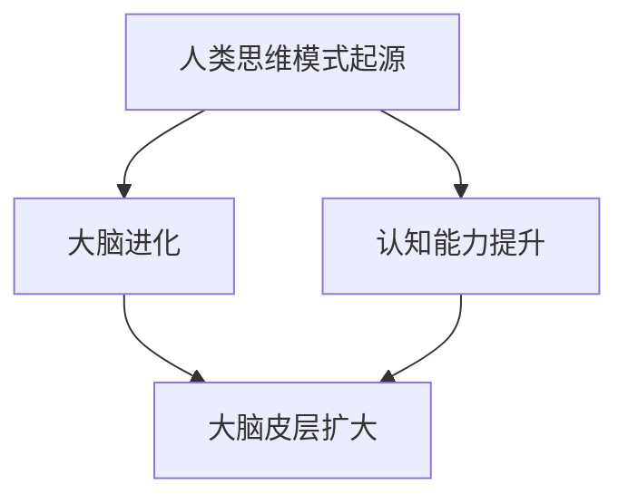

**伪代码**：

```python
# 大脑进化模型
class BrainEvolution:
    def __init__(self, brain_structure, cognitive_ability):
        self.brain_structure = brain_structure
        self.cognitive_ability = cognitive_ability
    
    def evolve(self):
        self.brain_structure.expand()
        self.cognitive_ability.improve()
```

**生理结构进化**：

- **大脑皮层扩大**：大脑皮层的扩大是人类思维模式发展的关键。大脑皮层是大脑的外层，负责高级认知功能，如语言、逻辑和抽象思维。随着大脑皮层的扩大，人类能够进行更复杂的思考，形成更复杂的思维模式。

- **认知能力提升**：大脑皮层的进化使得人类认知能力得到显著提升。认知能力是指人类获取、处理和应用信息的能力。随着认知能力的提升，人类能够更好地理解和适应复杂的环境。

**文化背景塑造**：文化是人类思维模式的重要组成部分。在不同的文化背景下，人类形成了不同的思维方式。例如，西方文化强调逻辑推理和科学方法，而东方文化则更注重直觉和整体性思维。这些文化差异对人类思维模式产生了深远的影响，使得不同文化背景的人在处理问题时展现出不同的思维特点。

**核心概念与联系**：文化背景、思维方式、文化差异

**Mermaid流程图**：

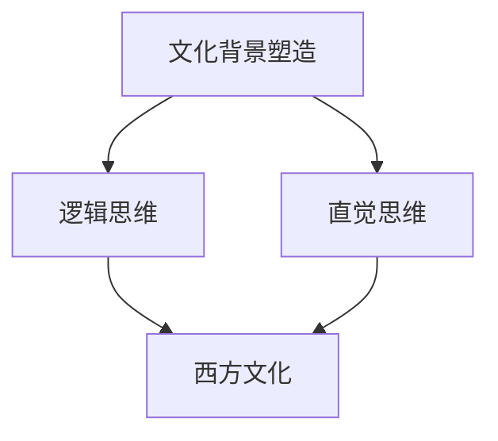

**伪代码**：

```python
# 文化背景塑造模型
class CulturalInfluence:
    def __init__(self, culture, thinking_mode):
        self.culture = culture
        self.thinking_mode = thinking_mode
    
    def shape(self):
        self.thinking_mode.update()
```

**文化背景塑造**：

- **逻辑思维**：逻辑思维是西方文化中的一种重要思维模式。它强调通过逻辑推理来分析和解决问题，注重事实和证据。逻辑思维在科学研究和工程实践中有着广泛的应用。

- **直觉思维**：直觉思维是东方文化中的一种重要思维模式。它强调通过直觉和整体性思维来理解和解决问题，注重情境和关系。直觉思维在日常生活中有着广泛的应用。

**社会环境影响**：社会环境对人类思维模式的影响同样不可忽视。社会环境包括家庭、教育、工作等多个方面。在不同的社会环境中，人类接受了不同的价值观和思维方式。例如，教育系统会通过传授科学知识、逻辑思维方法等来塑造人类的思维模式。而工作环境则可能强调协作、创新等不同的思维特点。

**核心概念与联系**：社会环境、价值观、思维方式

**Mermaid流程图**：

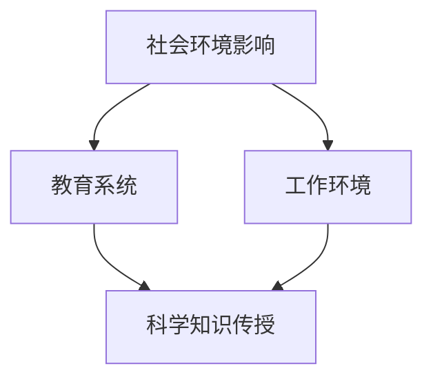

**伪代码**：

```python
# 社会环境影响模型
class SocialEnvironmentInfluence:
    def __init__(self, education, work_environment):
        self.education = education
        self.work_environment = work_environment
    
    def influence(self):
        self.education.transmit()
        self.work_environment.encourage()
```

**社会环境影响**：

- **教育系统**：教育系统通过传授科学知识、逻辑思维方法等来塑造人类的思维模式。不同教育系统的差异会影响人类思维模式的发展。

- **工作环境**：工作环境通过强调协作、创新等不同的思维特点，影响人类的思维方式。例如，一个创新性强的环境可能会鼓励人们进行创造性思考，而一个注重协作的环境可能会培养人们的团队协作能力。

### 1.1.2 人类思维模式的特点

人类思维模式具有以下特点：

1. **直觉思维**：直觉思维是人类在处理问题时的一个重要方式。它不需要经过严格的逻辑推理，而是依赖于过去的经验和直觉快速作出判断。直觉思维在日常生活中有着广泛的应用，如快速识别危险、快速解决问题等。

2. **逻辑思维**：逻辑思维是人类通过逻辑推理来分析和解决问题的一种方式。它依赖于一系列固定的规则和逻辑结构，能够帮助人类处理复杂的问题。逻辑思维在科学研究和工程实践中有着重要的应用。

3. **情感思维**：情感思维是人类在处理问题时考虑情感因素的一种方式。情感思维能够帮助人类更好地理解他人、感知环境，并在决策过程中起到重要的影响。例如，在人际关系中，情感思维能够帮助人类更好地处理冲突、建立和谐的关系。

**核心概念与联系**：直觉思维、逻辑思维、情感思维

**伪代码**：

```python
# 直觉思维
class IntuitiveThinking:
    def think(self, problem):
        solution = self.intuition(problem)
        return solution

# 逻辑思维
class LogicalThinking:
    def think(self, problem):
        solution = self.logic(problem)
        return solution

# 情感思维
class EmotionalThinking:
    def think(self, problem):
        solution = self.emotion(problem)
        return solution
```

**直觉思维**：

- **优点**：直觉思维能够快速作出判断，节省时间和精力。
- **缺点**：直觉思维可能基于不完全的信息，导致判断不准确。

**逻辑思维**：

- **优点**：逻辑思维能够严谨地分析问题，确保判断的准确性。
- **缺点**：逻辑思维可能过于注重规则和结构，忽略了一些重要的细节。

**情感思维**：

- **优点**：情感思维能够帮助我们更好地理解他人，建立和谐的关系。
- **缺点**：情感思维可能受到个人情感的影响，导致判断不够客观。

### 总结

人类思维模式的起源与特点为我们理解人类对宇宙的理解提供了重要的背景。通过分析生理结构、文化背景和社会环境等因素，我们能够更好地理解人类思维模式的演化过程。而直觉思维、逻辑思维和情感思维等思维特点，则为我们探讨人类在宇宙理解中的局限和突破提供了多种视角和方法。理解人类思维模式的起源和特点，有助于我们更深入地探讨人类在宇宙探索中所面临的挑战，并为未来的突破提供新的思路。

### 注意事项

1. **跨学科学习的必要性**：在探讨人类思维模式时，我们需要考虑多学科的知识，如认知科学、心理学、哲学等。跨学科思维能够帮助我们更全面地理解人类思维模式的复杂性和多样性。

2. **实践与理论相结合**：理解人类思维模式不仅仅停留在理论层面，还需要通过实践来验证和应用。例如，通过实际的思维训练和问题解决，我们可以更好地理解和掌握不同的思维模式。

### 拓展阅读

1. 《认知科学导论》/Introduction to Cognitive Science by Douglas E. Proctor and Edward A. Einhorn
2. 《情感心理学》/Emotional Psychology by Paul E. M. Phillips and Michael A. Neill
3. 《逻辑学导论》/Introduction to Logic by Nuel D. Belnap and Monty A. Python

通过阅读这些书籍，我们可以更深入地了解人类思维模式的起源、特点及其在宇宙理解中的应用。

---

### 1.2.1 视觉偏差与宇宙认知

人类的视觉系统是我们认知宇宙的主要渠道之一，然而，这一系统并非完美无缺，它存在多种局限性，这些局限性对宇宙认知产生了显著影响。

#### 光线感知范围

人类的视觉系统对光线的感知范围是有限的。我们的眼睛能够感知的光线波长范围大约在400到700纳米之间，这一范围被称为可见光谱。然而，宇宙中存在许多类型的电磁波，如无线电波、红外线和紫外线，这些都超出了我们视觉系统的感知范围。这些未感知的电磁波可能携带着关于宇宙的重要信息，但我们无法直接观察和解读。

**核心概念与联系**：电磁波、感知范围、宇宙信息

**Mermaid流程图**：

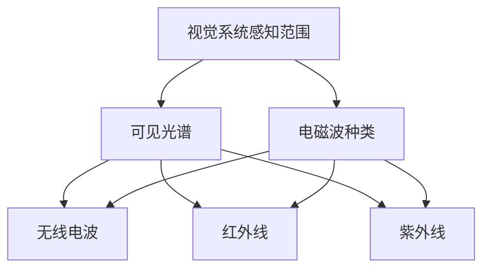

**伪代码**：

```python
# 感知范围限制
def visible_spectrum():
    wavelength_min = 400  # 纳米
    wavelength_max = 700  # 纳米
    return wavelength_min, wavelength_max
```

#### 分辨率限制

除了感知范围的限制，人类的视觉系统在分辨率上也有局限性。视网膜上的感光细胞（如视锥细胞和视杆细胞）的密度和灵敏度决定了我们的视觉分辨率。虽然人类的视网膜拥有约700万个视锥细胞，但它们的分辨率仍然有限。这意味着我们无法清晰地看到非常小的细节，尤其是在昏暗的环境中。

**核心概念与联系**：视网膜、感光细胞、分辨率

**Mermaid流程图**：

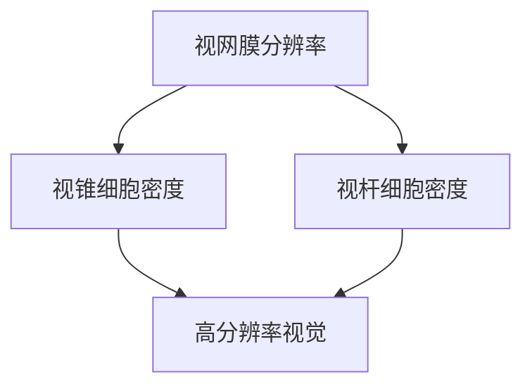

**伪代码**：

```python
# 视网膜分辨率
def retina_resolution():
    cone_count = 7000000  # 视锥细胞数量
    rod_count = 12000000  # 视杆细胞数量
    return cone_count, rod_count
```

#### 视觉偏差

人类的视觉系统不仅受到感知范围和分辨率限制的影响，还容易受到各种视觉偏差的影响。这些偏差可能是由大脑对视觉信息的处理过程产生的，例如：

- **光学偏差**：由于眼睛的晶状体和角膜的折射效应，我们看到的图像可能存在扭曲或失真。
- **感知偏差**：大脑对视觉信息的处理过程中可能产生误解，例如，我们可能会错误地识别或记忆视觉信息。
- **心理偏差**：个人的心理状态、经验和文化背景也可能影响我们的视觉认知。

**核心概念与联系**：光学偏差、感知偏差、心理偏差

**Mermaid流程图**：

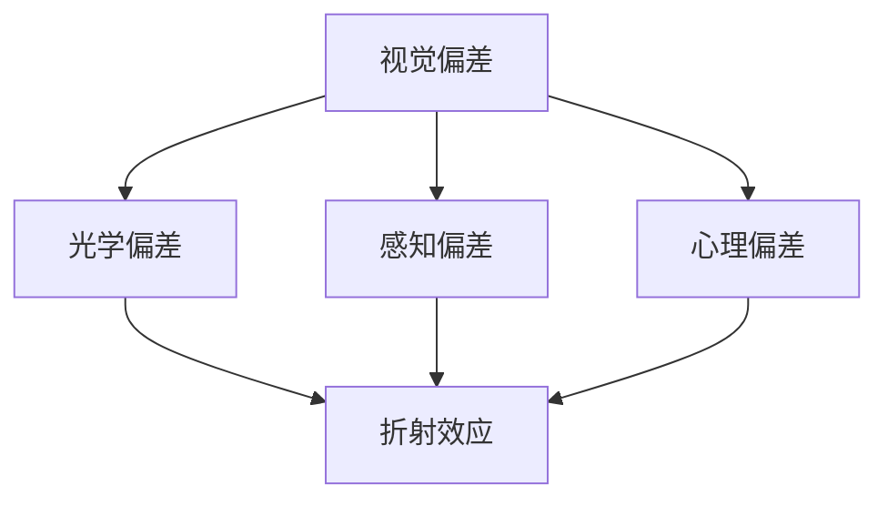

**伪代码**：

```python
# 视觉偏差识别
def identify_visual_bias(image):
    corrected_image = bias_correction(image)
    return corrected_image
```

**案例分析**：视觉偏差在宇宙认知中的应用

为了更好地理解视觉偏差对宇宙认知的影响，我们可以通过一个实际案例来进行分析。假设我们在观测一颗遥远的恒星时，由于光学偏差和感知偏差，我们可能会错误地将这颗恒星识别为另一颗恒星，或者错误地估计其距离和亮度。

**伪代码**：

```python
# 视觉偏差在恒星观测中的应用
def observe_star(star_image):
    # 假设图像存在光学偏差和感知偏差
    biased_image = optical_and_perceptual_bias(star_image)
    # 识别恒星
    identified_star = identify_star(biased_image)
    return identified_star

# 示例：光学偏差和感知偏差函数
def optical_and_perceptual_bias(image):
    distorted_image = apply_distortion(image)
    return distorted_image

# 示例：恒星识别函数
def identify_star(image):
    # 假设存在偏差，导致识别错误
    incorrect_star = incorrect_identification(image)
    return incorrect_star
```

**总结**：

通过以上分析，我们可以看出，人类的视觉系统在感知范围、分辨率和视觉偏差方面存在多种局限性，这些局限性对宇宙认知产生了重要影响。为了克服这些局限，我们需要发展新的观测技术和方法，如多波段观测、高分辨率成像技术以及视觉偏差校正算法，以提升我们对宇宙的认知能力。

### 注意事项

- **视觉偏差的识别与校正**：在宇宙观测中，我们需要意识到视觉偏差的存在，并尝试通过多种手段（如多波段观测、数据分析等）来识别和校正这些偏差。
- **跨学科研究的重要性**：为了更全面地理解宇宙，我们需要跨学科合作，结合物理学、天文学、心理学等多领域的知识。

### 拓展阅读

- [1] 《视觉错觉心理学》/Visual Illusions: A Book of Puzzles by Adam Zysk
- [2] 《电磁波与宇宙》/ Electromagnetic Waves and the Universe by Peter M. Berlind
- [3] 《视网膜与视觉认知》/The Retina and Visual Perception by John L.

