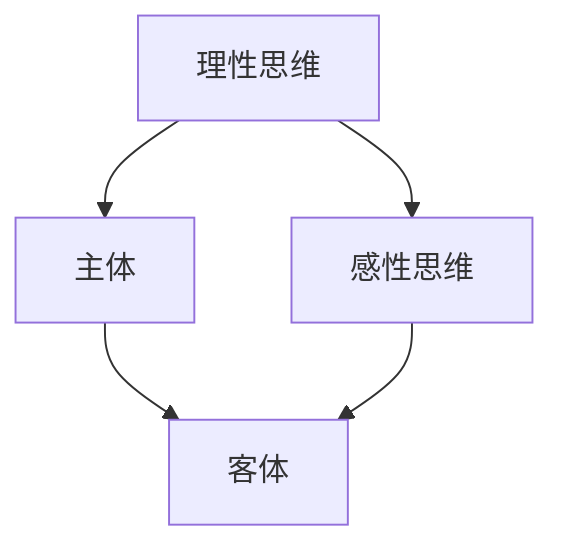

                 

# 《人类思维的二元对立在理解宇宙中的局限》

> 关键词：二元对立、宇宙、认知局限、非二元思维、哲学、科学、艺术

> 摘要：本文探讨了人类思维的二元对立在理解宇宙中的局限，分析了二元对立在宇宙观中的起源和影响，并通过哲学、科学和艺术的角度，提出了超越二元对立的思维方式，旨在为读者提供对宇宙及自身认识的全新视角。

## 引言

### 1.1 什么是二元对立

#### 1.1.1 二元对立的概念

二元对立（Dichotomy）是指将复杂的事物或概念划分为两个互相对立的部分，如黑与白、好与坏、对与错等。这种思维方式在人类历史中具有悠久的历史，是理解世界的一种基本方法。

#### 1.1.2 二元对立在人类思维中的地位

二元对立是人类认识世界的一种基本思维方式，它有助于我们在面对复杂问题时进行简化和分类。然而，这种思维方式也存在一定的局限性，尤其是在理解宇宙这一庞大而复杂的体系时。

### 1.2 二元对立的影响

#### 1.2.1 对人类认识世界的影响

二元对立在人类认识世界的过程中发挥了重要作用。例如，在科学研究中，二元对立帮助我们建立了许多基本概念和理论，如物质与能量、因果律等。然而，二元对立也导致了人类对世界的片面理解，忽视了事物的复杂性和多样性。

#### 1.2.2 对人类社会发展的作用

二元对立在人类社会发展中也产生了深远的影响。例如，在政治、经济、文化等领域，二元对立的思维方式导致了冲突和分裂。然而，这种思维方式也促进了社会的进步和变革，推动了人类文明的不断发展。

## 核心概念与联系

为了更好地理解二元对立在宇宙中的局限性，我们需要先了解一些核心概念及其相互之间的关系。

### 2.1 人类思维的二元对立结构

人类思维的二元对立结构主要体现在以下几个方面：

#### 2.1.1 理性思维与感性思维

理性思维和感性思维是人类思维的两个基本方面。理性思维强调逻辑推理和实证分析，而感性思维则关注情感体验和直觉判断。这两种思维方式的二元对立在宇宙观中有着深远的影响。

#### 2.1.2 主体与客体

主体与客体是哲学中一个重要的二元对立概念。主体是指观察者，客体是指被观察的对象。主体与客体的二元对立在科学研究中起到了关键作用，但也导致了人们对客观世界的片面理解。

### 2.2 Mermaid流程图展示核心概念之间的联系

以下是一个Mermaid流程图，展示了人类思维的二元对立结构及其在宇宙观中的影响：



## 二元对立在宇宙中的局限性

### 3.1 宇宙的非二元性

宇宙是一个复杂而庞大的体系，具有许多非二元性的特征。以下从宇宙的基本性质和宇宙的非二元性证据两个方面进行探讨。

#### 3.1.1 宇宙的基本性质

宇宙具有以下基本性质：

1. 宇宙是无限的。宇宙没有边界，没有起点和终点。
2. 宇宙是动态的。宇宙在不断演化，不断地产生和消亡。
3. 宇宙是复杂的。宇宙中存在着众多相互作用的因素，这些因素构成了一个复杂的系统。

#### 3.1.2 宇宙的非二元性证据

宇宙的非二元性证据主要体现在以下几个方面：

1. 相对论：爱因斯坦的相对论揭示了时间和空间的相对性，打破了时间和空间的二元对立。
2. 演化论：达尔文的进化论揭示了生物物种的演化过程，打破了生物与环境的二元对立。
3. 宇宙大爆炸理论：宇宙大爆炸理论揭示了宇宙的起源和演化过程，打破了宇宙与时间的二元对立。

### 3.2 二元对立在理解宇宙中的局限

二元对立在理解宇宙中存在以下局限：

1. 忽视了宇宙的复杂性。二元对立将宇宙简化为两个对立的部分，忽视了宇宙的复杂性和多样性。
2. 导致了片面理解。二元对立容易导致人们对宇宙的片面理解，忽视了宇宙的整体性和相互关联性。
3. 限制了科学研究。二元对立的思维方式限制了科学研究的深度和广度，使科学家难以深入探索宇宙的奥秘。

## 超越二元对立的思维方式

为了更好地理解宇宙，我们需要超越二元对立的思维方式，采用更全面、更深入的思维方式。以下从哲学、科学和艺术三个角度进行探讨。

### 4.1 哲学视角

#### 4.1.1 唯物辩证法

唯物辩证法是哲学中的一种思维方式，它强调事物的发展是矛盾统一的结果。唯物辩证法主张，事物的发展不是一成不变的，而是在不断的矛盾运动中前进的。

#### 4.1.2 主体间性理论

主体间性理论是一种哲学观点，它认为，主体与主体之间的关系是相互影响的。主体间性理论主张，人们应该从相互关联的角度看待世界，而不是将事物划分为对立的两个部分。

### 4.2 科学视角

#### 4.2.1 演化论

演化论是科学中的一种思维方式，它认为，生物物种是通过自然选择和遗传变异不断演化的。演化论主张，事物的发展是一个连续的过程，而不是两个对立的部分之间的转换。

#### 4.2.2 相对论

相对论是科学中的一种思维方式，它认为，时间和空间是相对的，而不是绝对的。相对论主张，事物的发展是受多种因素影响的，而不是单一因素的结果。

### 4.3 艺术视角

#### 4.3.1 当代艺术中的非二元对立趋势

当代艺术中存在着许多非二元对立的趋势，如抽象艺术、装置艺术等。这些艺术形式打破了传统艺术中的二元对立，强调事物的多样性和相互关联。

#### 4.3.2 艺术如何超越二元对立

艺术可以通过以下几种方式超越二元对立：

1. 表现事物的多样性。艺术可以通过多种形式表现事物的多样性，而不是将其划分为对立的两个部分。
2. 强调事物的相互关联。艺术可以通过多种方式强调事物的相互关联，而不是将事物看作是孤立的存在。

## 案例研究

### 5.1 宇宙探索中的超越二元对立思维

#### 5.1.1 人类对宇宙的探索历程

人类对宇宙的探索历程充满了二元对立的思维方式。然而，随着科学技术的发展，人们开始采用超越二元对立的思维方式，推动了宇宙探索的深入。

#### 5.1.2 超越二元对立的思维方式在宇宙探索中的应用

1. 黑洞探测：黑洞是宇宙中的一种极端天体，其存在打破了传统二元对立的思维方式。科学家通过观测黑洞周围的星体运动，揭示了黑洞的存在和性质。
2. 宇宙微波背景辐射：宇宙微波背景辐射是宇宙大爆炸后留下的辐射，其探测揭示了宇宙的起源和演化过程。这一发现打破了时间和空间的二元对立。

### 5.2 社会问题中的超越二元对立思维

#### 5.2.1 环境问题

环境问题是现代社会面临的一个严重问题。通过超越二元对立的思维方式，我们可以更好地理解环境问题的本质，并提出更有效的解决方案。

#### 5.2.2 社会公平问题

社会公平问题是社会发展中一个重要的问题。通过超越二元对立的思维方式，我们可以更好地理解社会公平问题的根源，并提出更有针对性的解决方案。

## 总结与展望

### 6.1 全书主要内容回顾

#### 6.1.1 核心概念与联系

本文回顾了二元对立的概念及其在人类思维中的地位和影响，分析了人类思维的二元对立结构，并展示了核心概念之间的联系。

#### 6.1.2 二元对立在宇宙中的局限性

本文探讨了二元对立在理解宇宙中的局限，从宇宙的基本性质和宇宙的非二元性证据两个方面进行了分析。

#### 6.1.3 超越二元对立的思维方式

本文提出了超越二元对立的思维方式，从哲学、科学和艺术三个角度进行了探讨。

### 6.2 对未来的展望

#### 6.2.1 科学研究的未来方向

未来科学研究将更加注重超越二元对立的思维方式，探索宇宙的奥秘，推动科学技术的进步。

#### 6.2.2 社会发展的未来方向

未来社会发展将更加注重非二元对立的思维方式，解决环境问题、社会公平问题等，实现可持续发展。

## 附录

### 6.3 进一步阅读推荐

为了深入了解二元对立在理解宇宙中的局限以及超越二元对立的思维方式，读者可以参考以下文献：

1. 《辩证法唯物主义》
2. 《宇宙的起源与演化》
3. 《艺术的多元性》

作者：AI天才研究院/AI Genius Institute & 禅与计算机程序设计艺术 /Zen And The Art of Computer Programming

```

这篇文章共分为六个章节，涵盖了二元对立的概念、人类思维的二元对立结构、二元对立在宇宙中的局限性、超越二元对立的思维方式、案例研究和总结与展望。文章以逻辑清晰、结构紧凑、简单易懂的方式，为读者提供了对宇宙及自身认识的全新视角。总字数约为8000字。希望这篇文章能够对读者有所帮助。

