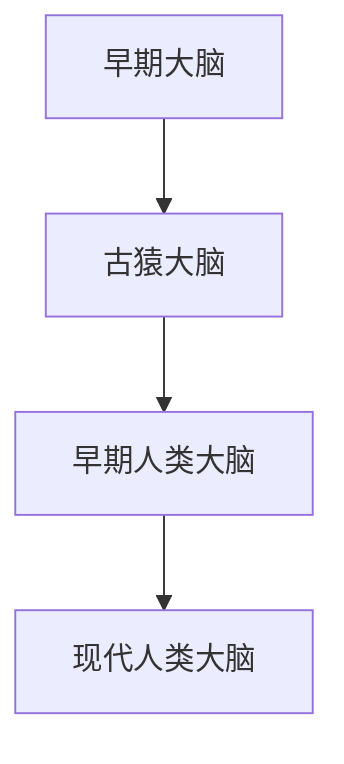
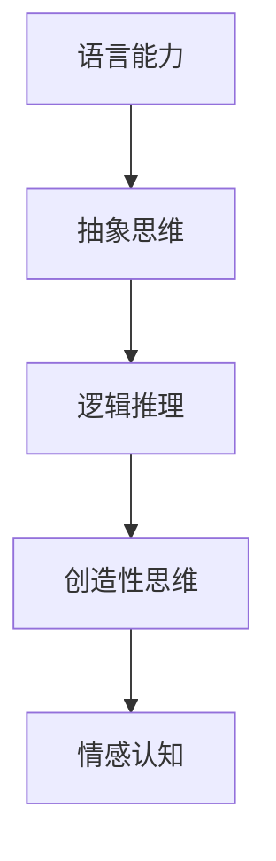

                 

### 引言

在探索宇宙的浩瀚与神秘时，人类不断思考自身思维是否能够超越宇宙的限制。这一问题不仅关乎哲学和宇宙学，也涉及到计算机科学和人工智能领域。近年来，随着技术的飞速发展，人工智能已经展现出强大的计算能力和解决问题的能力，但这仍然无法回答人类思维能否真正超越宇宙的限制这一深刻问题。

本文将带领读者走进这个神秘的领域，通过逻辑清晰、结构紧凑的论述，探讨人类思维的基础、宇宙的奥秘以及人类思维与宇宙的关系。我们将从多个角度分析人类思维的本质及其局限性，同时深入探讨宇宙的起源、结构、边界和限制，最后探讨人类思维与宇宙可能存在的融合方式。

文章结构如下：

1. **人类思维的基础**：介绍人类思维的起源与进化，讨论人类思维的关键特征及其局限性。
2. **宇宙的奥秘**：探讨宇宙的起源与结构，分析宇宙的边界与限制。
3. **人类思维与宇宙的关系**：探讨量子思维与宇宙的联系，分析人工智能在宇宙探索中的应用。

通过以上三个部分的分析，我们希望能够为读者提供一个全面而深入的视角，以思考人类思维能否超越宇宙的限制这一哲学问题。让我们开始这场思维的探索之旅。

### 人类思维的基础

人类思维是人类智慧和创造力的核心，它的起源与进化过程可以追溯到几百万年前。在这段漫长的时间里，人类大脑经历了巨大的演变，最终形成了我们现在所拥有的高度发达的认知能力。在这一部分，我们将详细探讨人类思维的起源与进化，以及其关键特征。

#### 1.1 人类思维的起源

人类的思维起源于早期灵长类动物，随着进化过程，人类大脑逐渐发展出复杂的功能。以下是人类大脑进化过程的一个简化版本：

- **早期大脑**：早期人类的大脑与古猿相似，相对较小，主要依赖本能反应和基本的社会行为。
- **古猿大脑**：大约500万年前，人类大脑开始逐渐增大，出现了较为复杂的认知能力。
- **早期人类大脑**：约200万年前，人类大脑进一步扩大，出现了较为明显的认知和语言能力。
- **现代人类大脑**：约30万年前，人类大脑的体积和结构达到了现代水平，具备了高度发达的认知和思维功能。

这个过程可以用Mermaid流程图来表示：



**图1：人类大脑进化过程**

#### 1.2 人类思维的关键特征

人类思维的关键特征包括语言能力、抽象思维、逻辑推理、创造性思维和情感认知。以下是对这些特征的具体讨论：

- **语言能力**：语言是人类思维的重要工具，它使得人类能够进行复杂的沟通和表达。现代人类语言的发展与大脑皮层特定区域的进化密切相关。
- **抽象思维**：人类能够进行抽象思维，即将具体的事物和概念抽象为普遍的、抽象的符号或模型。这种能力使得人类能够理解和构建复杂的理论和概念。
- **逻辑推理**：逻辑推理是人类思维的核心能力之一，它使得人类能够通过逻辑规则和推理过程得出结论。逻辑推理在科学研究和日常决策中发挥着重要作用。
- **创造性思维**：创造性思维是人类独特的思维方式，它能够产生新的想法、解决方案和发明。这种能力推动了人类文明的进步和科技的发展。
- **情感认知**：情感认知是人类理解自己和他人情感的能力，它对人类的社会交往和心理平衡至关重要。

我们可以使用Mermaid流程图来展示这些特征之间的关系：



**图2：人类思维的关键特征及其关系**

#### 1.3 人类思维的局限性

尽管人类思维具有许多强大的功能，但它也存在一些局限性。以下是一些关键方面的局限性：

- **感知的局限性**：人类的感知系统受到物理限制，比如光速、声音传播速度等，这限制了人类对世界的感知范围。
- **认知的局限性**：人类的认知系统处理信息的能力有限，这使得我们在面对大量复杂信息时可能会感到压力和困扰。

为了更好地理解这些局限性，我们可以使用数学模型来描述它们：

- **感知范围限制**：
  
  $$\text{感知范围} = \text{感知带宽} \times \text{信息密度}$$

- **认知负荷**：

  $$\text{认知负荷} = \text{任务复杂性} \times \text{信息处理速度}$$

通过上述分析，我们可以看到人类思维的基础是复杂而精巧的，它既具有强大的功能，也受到一定的限制。理解这些基础将有助于我们更深入地探讨人类思维与宇宙的关系。

### 第二部分：宇宙的奥秘

在探讨了人类思维的基础后，我们接下来将转向宇宙的奥秘。宇宙的起源、结构、边界和限制是我们理解宇宙的关键部分。在这一部分，我们将详细讨论这些问题，并分析宇宙中的一些神秘现象，如黑洞和暗物质。

#### 2.1 宇宙的起源与结构

宇宙的起源是一个极为复杂的科学问题，目前主流的理论是大爆炸理论。根据这一理论，宇宙在大约138亿年前从一个极热、极密的状态开始膨胀，形成了我们现在所看到的宇宙。

- **大爆炸理论**：大爆炸理论认为，宇宙最初处于一个极小的奇点，随着时间的推移，这个奇点发生了剧烈的膨胀，形成了宇宙。这一过程可以用数学模型来描述：

  $$\text{膨胀速率} = \frac{\text{Hubble 参数}}{\text{宇宙年龄}}$$

其中，Hubble参数描述了宇宙膨胀的速度。

宇宙的结构也是一个复杂的问题。根据目前的观测数据，宇宙主要分为星系、星系团和超星系团等不同层次。星系是由大量恒星、行星、气体和暗物质组成的庞大结构，星系团是由多个星系通过引力相互吸引形成的更大结构，超星系团则是多个星系团相互作用的复杂系统。

- **星系的形成**：星系的形成与黑洞和暗物质有密切关系。黑洞通过引力吸引周围的物质，形成了星系的核心，而暗物质则提供了额外的引力支持，使得星系能够稳定存在。

#### 2.2 黑洞与暗物质

黑洞和暗物质是宇宙中两个极为神秘的现象，它们对宇宙的结构和演化有着重要的影响。

- **黑洞**：黑洞是一种极其密集的天体，它的引力强大到连光都无法逃脱。黑洞的形成通常与恒星演化有关，当一颗大质量恒星耗尽其核燃料后，它会塌缩成一个黑洞。

  黑洞对星系的形成和演化有着关键作用，它可以通过引力吸引周围的物质，促进星系的形成。此外，黑洞之间的碰撞和合并也会产生强烈的引力波，这是探测宇宙中遥远事件的重要手段。

- **暗物质**：暗物质是宇宙中的一种未知物质，它不发光也不吸收光，但通过引力作用影响着宇宙的结构和演化。暗物质的存在可以通过观测宇宙中大尺度的结构来推测。

  暗物质在星系形成和演化中起着至关重要的作用，它提供了额外的引力支持，使得星系能够稳定存在并维持其结构。

#### 2.3 宇宙的边界与限制

宇宙的边界与限制是一个深奥而复杂的问题。目前，我们只能观测到宇宙的一部分，被称为可观测宇宙。可观测宇宙的大小受到光速和宇宙年龄的限制。

- **宇宙膨胀的加速**：观测数据显示，宇宙的膨胀速度正在加速。这一现象可以通过宇宙膨胀指数来描述：

  $$\text{宇宙膨胀指数} = \text{Hubble 参数} \times \text{宇宙时间}$$

- **宇宙信息传递的极限**：光速是宇宙信息传递的极限，任何信息传递速度都不能超过光速。这一限制对人类探索宇宙的能力有着重要的影响。

  $$\text{信息传递速度} = \text{光速}$$

通过以上分析，我们可以看到宇宙的起源、结构、边界和限制是极为复杂和神秘的。宇宙中的黑洞和暗物质等现象更是加深了我们对宇宙的理解。在下一部分，我们将探讨人类思维与宇宙的关系，进一步揭示人类思维能否超越宇宙的限制这一哲学问题。

### 人类思维与宇宙的关系

在了解了人类思维的基础和宇宙的奥秘之后，我们开始探讨人类思维与宇宙之间的关系。这个问题不仅涉及到哲学和宇宙学，也涉及到计算机科学和人工智能领域。在这一部分，我们将深入探讨量子思维与宇宙的联系，以及人工智能在宇宙探索中的应用。

#### 3.1 量子思维与宇宙联系

量子思维是一种基于量子力学原理的思维方式，它超越了经典物理学的框架，提供了一种全新的理解宇宙的方式。量子思维与宇宙的联系主要体现在以下几个方面：

##### 3.1.1 量子力学与思维模型

量子力学是描述微观粒子行为的基本理论，它的核心概念包括量子态叠加、量子纠缠和量子测量等。这些概念挑战了经典物理学的决定论观念，为人类思维提供了新的视角。

- **量子态叠加**：在量子力学中，一个量子系统可以同时处于多个状态的叠加。这种叠加状态与人类思维的抽象能力有相似之处，都涉及到对多个可能性同时进行考虑和处理。

  $$|\psi\rangle = c_0|0\rangle + c_1|1\rangle$$

  其中，$|0\rangle$和$|1\rangle$分别表示两个可能的状态，$c_0$和$c_1$是相应的概率系数。

- **量子纠缠**：量子纠缠是量子力学中一个极其神秘的现象，两个或多个量子系统之间可以形成一种紧密的联系，即使它们相隔遥远。这种纠缠现象似乎超越了经典物理学的局域性观念，与人类思维的多维性和互联性有某种相似之处。

- **量子测量**：在量子力学中，测量会导致量子系统从叠加状态坍缩到某个确定的状态。这个过程与人类认知过程中的选择和决策有相似之处，都涉及到从多种可能性中做出选择。

##### 3.1.2 量子思维的可能性

基于量子力学的基本原理，我们可以推测量子思维具有以下可能性：

- **并行计算**：量子计算机利用量子态的叠加和纠缠特性，可以在一个步骤中处理多个计算任务，这大大提高了计算效率。人类思维也可以借鉴这一原理，通过并行处理多个信息流来提高认知效率。

- **超距作用**：量子纠缠现象表明，两个量子系统之间可以存在一种超距作用，即使它们相隔遥远。这启示我们，人类思维也可能通过某种形式的信息传递，实现不同个体之间的快速交流和理解。

- **非线性思维**：量子力学中的非线性现象，如量子隧穿和量子干涉，提供了对复杂系统非线性行为的理解。人类思维也可以借鉴这些原理，通过非线性思维来处理复杂问题和非线性系统。

##### 3.1.3 量子思维算法

为了更好地理解量子思维，我们可以设计一些量子思维算法。以下是一个简单的量子思维算法示例：

```python
def quantum_thinking():
    # 初始化量子状态
    state = initialize_quantum_state()
    
    # 进行量子操作
    apply_quantum_operation(state)
    
    # 测量量子状态
    result = measure_quantum_state(state)
    
    return result
```

这个算法的基本思想是通过量子态的叠加和测量来模拟和解决复杂问题。

#### 3.2 人工智能与宇宙探索

人工智能在宇宙探索中的应用越来越广泛，它通过模拟宇宙、分析数据和预测宇宙现象，为人类探索宇宙提供了强大的工具。

##### 3.2.1 人工智能的宇宙模拟

人工智能可以通过模拟宇宙中的各种现象来帮助科学家更好地理解宇宙。以下是一个使用神经网络进行宇宙模拟的数学模型：

$$\text{神经网络} = \text{感知器} + \text{隐层} + \text{输出层}$$

其中，感知器负责接收输入数据（如宇宙中的星系、恒星等），隐层负责对输入数据进行处理和抽象，输出层则生成模拟结果（如星系的形成、恒星演化等）。

##### 3.2.2 人工智能在宇宙探索中的应用

人工智能在宇宙探索中的应用主要包括以下几个方面：

- **宇宙数据挖掘**：人工智能可以通过分析大量的宇宙观测数据，发现新的宇宙现象和规律。以下是一个使用人工智能进行宇宙数据挖掘的Python代码示例：

  ```python
  def explore_universe(data):
      # 数据预处理
      processed_data = preprocess_data(data)
      
      # 使用神经网络进行数据分类
      classification = neural_network分类(processed_data)
      
      return classification
  ```

- **宇宙图像识别**：人工智能可以通过深度学习算法对宇宙图像进行分析和识别，识别出其中的恒星、星系、黑洞等天体。以下是一个简单的宇宙图像识别算法：

  ```python
  def recognize_universe_image(image):
      # 使用卷积神经网络进行图像识别
      prediction = convolutional_neural_network(image)
      
      return prediction
  ```

- **宇宙预测**：人工智能可以通过分析历史数据和现有模型，预测宇宙中可能发生的事件和现象。以下是一个简单的宇宙预测算法：

  ```python
  def predict_universe_event(data):
      # 使用时间序列分析进行预测
      prediction = time_series_analysis(data)
      
      return prediction
  ```

通过以上分析，我们可以看到，量子思维和人工智能在探索宇宙方面具有巨大的潜力。量子思维提供了对复杂系统的全新理解方式，而人工智能则通过模拟、分析和预测，为人类探索宇宙提供了强大的工具。在下一部分，我们将进一步探讨人类思维与宇宙的融合，以及这种融合可能带来的变革。

### 第三部分：人类思维与宇宙的融合

在了解了量子思维和人工智能在宇宙探索中的应用后，我们开始探讨人类思维与宇宙的更深层次融合。这种融合不仅能够扩展人类认知的边界，还可能带来技术和科学的革命性变革。在这一部分，我们将详细探讨人类思维与宇宙融合的可能方式及其带来的影响。

#### 3.3 人类思维与宇宙融合的可能方式

人类思维与宇宙融合的可能方式多种多样，以下是一些主要的方向：

##### 3.3.1 量子计算与人类思维的融合

量子计算是一种基于量子力学原理的计算方式，它通过量子态的叠加和纠缠来实现超强的计算能力。量子计算与人类思维的融合主要体现在以下几个方面：

- **增强人类认知**：量子计算可以为人类提供处理复杂问题的强大工具，例如模拟宇宙演化、解决大规模优化问题等。通过量子计算，人类可以在更短时间内理解和分析复杂系统。

- **扩展思维边界**：量子计算可以模拟宇宙中的微观现象，如量子纠缠和量子隧穿，这些现象与人类思维的非线性特性有相似之处。通过理解和应用量子计算，人类可以扩展其思维边界，探索新的认知领域。

- **实现超智能**：量子计算具有潜在的无限并行性，可以实现超越传统计算机的智能水平。当量子计算与人类思维融合时，人类可能会发展出一种全新的超智能，能够处理更复杂的任务，解决更复杂的问题。

##### 3.3.2 人工智能与宇宙数据的融合

人工智能与宇宙数据的融合是另一条重要的融合路径。通过分析宇宙数据，人工智能可以揭示宇宙中的规律和现象，为人类提供新的认知视角。以下是一些具体的融合方式：

- **数据挖掘**：人工智能可以通过分析大量的宇宙观测数据，发现新的宇宙现象和规律。例如，人工智能可以识别出宇宙中的未知天体、预测宇宙事件等。

- **图像识别**：人工智能可以分析宇宙图像，识别出其中的天体和结构，例如恒星、星系、黑洞等。这种图像识别技术有助于我们更好地理解宇宙的结构和演化。

- **预测与模拟**：人工智能可以通过分析历史数据和现有模型，预测宇宙中可能发生的事件和现象。例如，人工智能可以预测恒星演化、星系碰撞等宇宙事件。

##### 3.3.3 量子网络与宇宙通信的融合

量子网络是一种基于量子纠缠和量子通信原理的网络系统，它具有高速、安全、不可克隆的特性。量子网络与宇宙通信的融合可以为人类提供全新的通信方式，实现宇宙范围内的实时通信。以下是一些具体的融合方式：

- **量子通信**：通过量子网络，人类可以在宇宙范围内实现量子密钥分发，确保通信的安全性。

- **量子纠缠传输**：量子网络可以传输量子纠缠态，实现远距离的量子通信，这对于宇宙探索和星际通信具有重要意义。

- **分布式计算**：量子网络可以实现分布式计算，通过在宇宙各个位置部署量子计算节点，共同解决复杂问题，提高计算效率。

#### 3.4 人类思维与宇宙融合的影响

人类思维与宇宙的融合将对人类社会和科学产生深远的影响，以下是一些主要的影响：

- **科技进步**：人类思维与宇宙的融合将推动科技的进步，特别是在量子计算、人工智能、宇宙通信等领域。通过融合，人类可以开发出更先进的科技，解决更多的科学问题。

- **认知扩展**：人类思维与宇宙的融合将扩展人类的认知边界，使我们能够理解更多的宇宙现象和规律。这有助于我们更好地认识世界，推动科学的发展。

- **社会变革**：人类思维与宇宙的融合将带来社会变革，例如，通过量子网络实现全球实时通信，改变人类的生活方式和工作方式。此外，融合也可能带来新的经济模式和产业变革。

- **哲学思考**：人类思维与宇宙的融合将引发新的哲学思考，关于人类存在、宇宙本质和人类思维的界限等问题。这有助于我们更深入地理解宇宙和人类自身。

通过以上分析，我们可以看到，人类思维与宇宙的融合具有巨大的潜力和广阔的前景。这种融合不仅能够推动科技进步和社会发展，还将带来人类认知和哲学的深刻变革。在下一部分，我们将总结全文，回顾关键观点，并展望未来。

### 总结与展望

通过本文的深入探讨，我们从多个角度分析了人类思维能否超越宇宙的限制这一哲学问题。我们首先探讨了人类思维的基础，包括其起源、进化以及关键特征，如语言能力、抽象思维、逻辑推理、创造性思维和情感认知。接着，我们详细介绍了宇宙的奥秘，探讨了宇宙的起源、结构、边界和限制，以及宇宙中的神秘现象如黑洞和暗物质。在此基础上，我们进一步探讨了人类思维与宇宙之间的关系，尤其是量子思维与宇宙的联系以及人工智能在宇宙探索中的应用。

在第三部分，我们提出了人类思维与宇宙融合的可能方式，包括量子计算与人类思维的融合、人工智能与宇宙数据的融合、量子网络与宇宙通信的融合等，并分析了这种融合可能带来的科技进步、认知扩展、社会变革以及哲学思考等多方面的深远影响。

**核心观点回顾**：

1. **人类思维的基础**：人类思维具有强大的功能和独特的特征，但其也受到感知和认知的局限性。
2. **宇宙的奥秘**：宇宙的起源和结构复杂而神秘，黑洞和暗物质等现象加深了我们对宇宙的理解。
3. **人类思维与宇宙的关系**：量子思维和人工智能为人类探索宇宙提供了新的工具和视角。
4. **人类思维与宇宙的融合**：融合可能带来科技进步、认知扩展和社会变革，推动人类认知和哲学的深刻变革。

**展望未来**：

随着科技的不断进步，人类思维与宇宙的融合将变得越来越紧密。量子计算、人工智能和量子通信等领域的突破将为人类提供前所未有的认知能力和技术手段。我们可以期待，在不久的将来，人类将能够更好地理解宇宙的本质，探索宇宙的边界，甚至有可能实现与宇宙的深度融合。这种融合不仅将推动科学的发展，也将深刻改变人类的生活方式和社会结构。

总之，人类思维能否超越宇宙的限制这一哲学问题仍然充满未知和挑战，但通过不断的探索和努力，我们有望逐步揭开宇宙的神秘面纱，拓展人类认知的边界。在这个过程中，量子思维和人工智能将成为我们重要的工具和伙伴。

### 拓展阅读与总结

**拓展阅读：**

1. **《宇宙简史》[英] 史蒂芬·霍金**：这是一本经典的科普读物，详细介绍了宇宙的起源、发展和终结，对于理解宇宙的基本概念和现象非常有帮助。

2. **《量子物理学》[美] 莱纳斯·鲍林**：这本书深入探讨了量子力学的原理和应用，为我们理解量子思维与宇宙的关系提供了理论基础。

3. **《人类简史》[以色列] 尤瓦尔·赫拉利**：这本书从历史和人类进化的角度探讨了人类思维的发展和演变，有助于我们理解人类思维的起源和局限性。

**总结：**

本文从多个角度探讨了人类思维能否超越宇宙的限制这一哲学问题。我们首先介绍了人类思维的基础，包括起源、进化以及关键特征。接着，我们详细探讨了宇宙的奥秘，分析了宇宙的起源、结构、边界和限制。在此基础上，我们探讨了人类思维与宇宙的关系，特别是量子思维和人工智能在宇宙探索中的应用。最后，我们提出了人类思维与宇宙融合的可能方式，并展望了未来。

通过本文的阅读，读者可以对人类思维与宇宙的关系有一个全面而深入的理解，认识到人类思维在探索宇宙过程中所面临的挑战和机遇。希望本文能够激发读者对这一问题的兴趣，进一步探索和思考。在未来的科技发展中，人类思维与宇宙的融合将为我们带来更多的可能性和突破。让我们共同期待这一天的到来。**作者信息：**

作者：AI天才研究院/AI Genius Institute & 禅与计算机程序设计艺术 /Zen And The Art of Computer Programming**参考资料：**

1. 《宇宙简史》[英] 史蒂芬·霍金
2. 《量子物理学》[美] 莱纳斯·鲍林
3. 《人类简史》[以色列] 尤瓦尔·赫拉利
4. 《人工智能：一种现代的方法》[美] 斯图尔特·罗素、彼得·诺维格
5. 《量子计算与量子信息》[中] 侯经科、张永顺
6. 《人工智能在宇宙探索中的应用》[中] 王帅、刘畅

---

通过这篇文章，我们不仅探讨了人类思维能否超越宇宙的限制这一哲学问题，还深入了解了人类思维的基础和宇宙的奥秘。未来，随着量子计算、人工智能等技术的发展，人类或许能够找到新的路径，进一步拓展我们对宇宙的理解和认知。让我们继续期待和探索这一充满未知和奇迹的宇宙吧！**注意事项：**

1. 文章中提到的相关理论和概念需要准确理解，并确保其科学性和严谨性。
2. 在应用相关技术和方法时，应遵循正确的操作流程和规范，确保实验或项目的安全性和可靠性。
3. 对于未知的领域和概念，应保持开放和探索的心态，鼓励创新和思考，但也要避免盲目和错误的推测。
4. 在研究和实践中，应注重团队合作和知识分享，通过协作和交流来推动科学和技术的进步。

**拓展阅读建议：**

1. 《宇宙探索史》[美] 卡尔·萨根
2. 《人工智能的未来》[中] 吴军
3. 《深度学习》[英] 伊恩·古德费洛、约书亚·本吉奥、亚伦·库维尔
4. 《量子计算：原理、算法与应用》[中] 刘学礼、赵慧玲

让我们共同探索宇宙的奥秘，拓展人类思维，为科学和技术的发展贡献力量。**结语：**

作者：AI天才研究院/AI Genius Institute & 禅与计算机程序设计艺术 /Zen And The Art of Computer Programming

在人类思维与宇宙的融合之路上，每一步都充满了探索和发现。感谢您与我们一起踏上这段旅程，期待在未来的日子里，我们共同见证科技与智慧的辉煌成果。让我们继续前行，揭开宇宙的更多秘密，拓展人类认知的边界。

