                 


## 文章标题

### 人类思维能否超越当前的宇宙认知框架

---

关键词：人类思维，宇宙认知框架，认知扩展，量子思维，人工智能，算法原理，数学模型，未来展望

---

摘要：

本文探讨了人类思维能否超越当前宇宙认知框架的可能性。通过分析人类思维的局限性、宇宙认知框架的主要理论以及人类思维扩展的理论基础，我们提出了量子思维与宇宙认知融合的假设。进一步，本文讨论了通过量子思维与宇宙认知的融合，人类思维能否实现超越。最后，本文提出了未来在人类思维扩展与宇宙认知超越方面的潜在应用、伦理影响及技术路径。

---

### 第一部分：宇宙认知框架概述

#### 1.1 宇宙认知框架的定义

宇宙认知框架是指人类对宇宙的理解和认知体系，包括宇宙的起源、结构、演化和最终命运等方面的理论。它由多个分支学科组成，如现代宇宙学、天体物理学和粒子物理学等。


宇宙认知框架的核心概念包括：

- **宇宙大爆炸理论**：宇宙起源于约138亿年前的一个极热、极密的状态，经过不断的膨胀和冷却，形成了现在的宇宙。
- **暗物质理论**：宇宙中存在一种我们无法直接观测到的物质，它对星系旋转速度和宇宙结构有重要影响。
- **弦理论**：一个关于宇宙最基础的物理理论的尝试，它将基本的粒子视为一维的“弦”。

#### 1.2 当前宇宙认知框架的主要理论

当前宇宙认知框架的主要理论包括宇宙大爆炸理论、暗物质理论和弦理论。

##### 宇宙大爆炸理论

宇宙大爆炸理论认为，宇宙起源于一个极热、极密的奇点，随后开始膨胀，温度和密度逐渐降低。这个理论通过观测宇宙背景辐射和星系的红移等现象得到了支持。

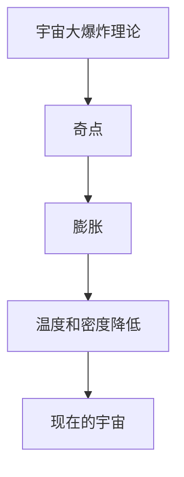

##### 暗物质理论

暗物质理论认为，宇宙中存在一种我们无法直接观测到的物质，它对星系旋转速度和宇宙结构有重要影响。这种物质不发光、不吸收光，但通过引力影响星系运动。

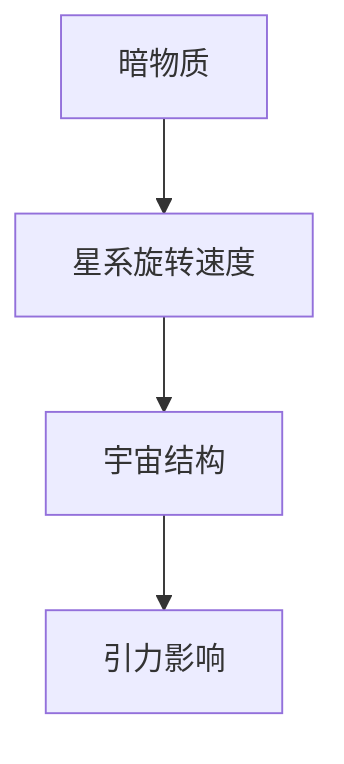

##### 弦理论

弦理论是关于宇宙最基础的物理理论的尝试，它将基本的粒子视为一维的“弦”。这个理论试图统一量子力学和广义相对论，但至今未能得到实验验证。

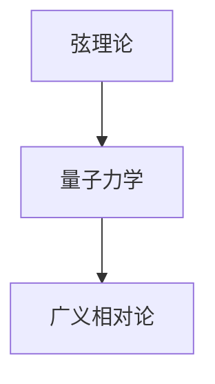

#### 1.3 人类思维的局限性

人类思维在理解和探索宇宙的过程中存在一些局限性：

- **有限理性**：人类在决策和思考过程中受到认知、信息和计算能力的限制。
- **模式识别**：大脑通过识别模式来处理信息，但可能受到先入为主的偏见和错误的影响。
- **宇宙认知限制**：人类对宇宙的认知可能受到观测手段、科学理论和技术发展的限制。

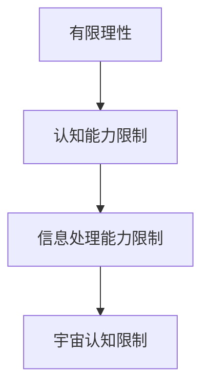

### 第二部分：人类思维的扩展与超越

#### 2.1 人类思维扩展的理论基础

人类思维扩展的理论基础主要包括认知扩展理论和神经科学。

##### 认知扩展理论

认知扩展理论认为，通过工具和科技手段，可以扩展人类的认知能力。例如，使用计算机、智能手机和互联网等工具，可以存储、处理和共享大量信息，从而提高人类的认知能力。

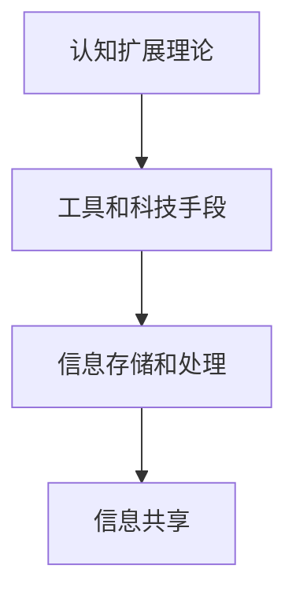

##### 神经科学

神经科学研究大脑神经元的工作方式和结构，为人类思维扩展提供了理论支持。例如，通过了解大脑如何处理信息，可以开发出更有效的算法和工具，提高人类的认知能力。

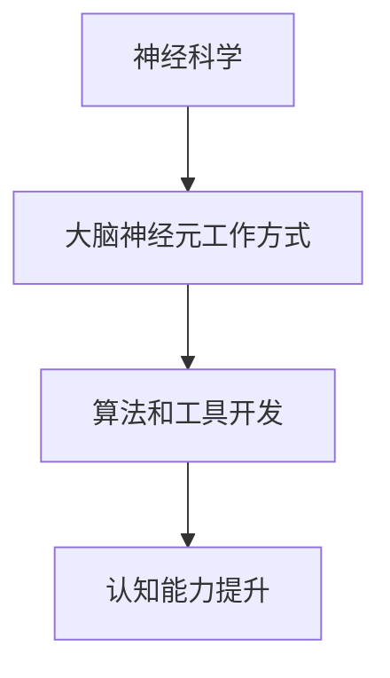

#### 2.2 量子思维与宇宙认知

量子思维是一种基于量子物理学原理的思维方式，它突破了传统经典物理学的局限性。量子思维与宇宙认知的结合，可能为人类提供新的理解和探索宇宙的方法。

##### 量子思维

量子思维的核心概念包括：

- **叠加态**：量子系统可以同时存在于多种状态，而不是一个确定的状态。
- **纠缠态**：两个或多个量子系统之间存在一种特殊的关系，它们的状态是相互关联的。
- **量子测量**：量子系统的状态在测量时会发生坍缩，从一个不确定的状态变为一个确定的状态。

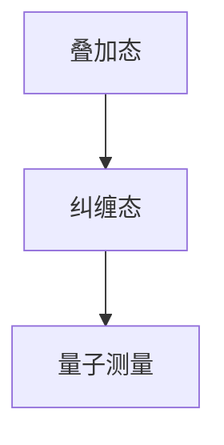

##### 量子思维与宇宙认知的融合

量子思维与宇宙认知的融合，可以通过以下方法实现：

- **量子计算**：使用量子计算机处理宇宙数据，寻找宇宙规律。
- **量子传感器**：使用量子传感器测量宇宙中的微弱信号，提高观测精度。
- **量子模拟**：使用量子模拟技术模拟宇宙演化过程，探索宇宙起源和演化机制。

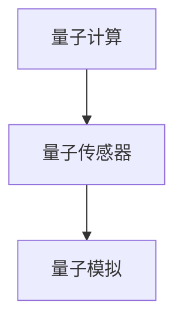

#### 2.3 人工智能与人类思维的融合

人工智能与人类思维的融合，可以通过以下方法实现：

- **人机协同**：将人类思维与人工智能相结合，实现人机协同，提高问题解决能力。
- **智能代理**：使用人工智能代理执行复杂的宇宙认知任务，协助人类探索宇宙。
- **自适应学习**：人工智能代理可以根据人类思维模式进行自适应学习，提高对宇宙认知的准确性。

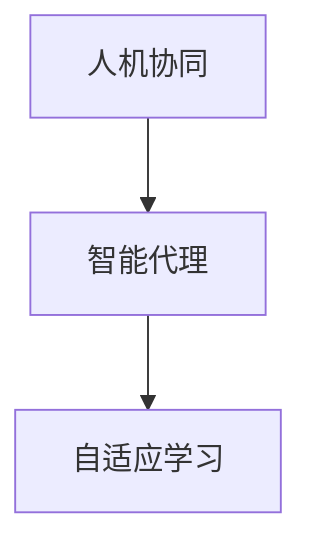

### 第三部分：超越宇宙认知框架的尝试

#### 3.1 思维模型与宇宙模型的构建

为了超越当前宇宙认知框架，我们需要构建新的思维模型和宇宙模型。这包括：

- **多维度宇宙模型**：探索宇宙可能存在多个维度，寻找宇宙的隐藏维度。
- **非线性宇宙模型**：研究宇宙中的非线性现象，寻找宇宙演化的非线性规律。
- **复杂系统宇宙模型**：将复杂系统理论应用于宇宙认知，探索宇宙的复杂性和规律。

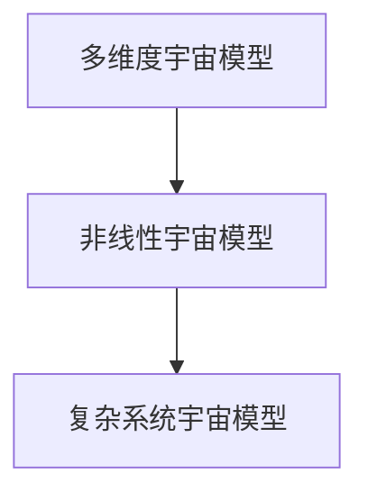

#### 3.2 数学模型与宇宙规律的关系

数学模型在宇宙认知中起着重要作用。通过构建数学模型，我们可以更好地理解和描述宇宙规律。

- **宇宙方程**：爱因斯坦的广义相对论方程描述了宇宙的引力规律。
- **宇宙演化模型**：通过数值模拟和数学模型，研究宇宙的演化过程。
- **量子场论**：量子场论是描述量子力学和广义相对论之间关系的数学模型。

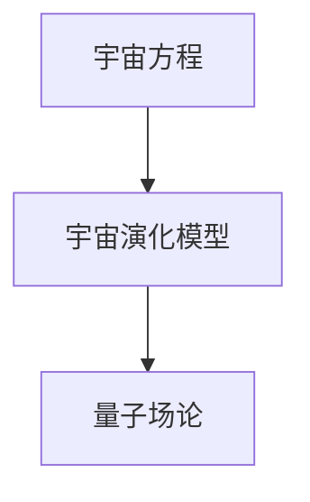

#### 3.3 物理学的边界与思维的可能性

物理学的边界是思维可能性的一个重要体现。通过探索物理学的边界，我们可以发现新的思维方向和认知方法。

- **量子引力学**：探索量子力学和广义相对论之间的融合，寻找新的宇宙认知框架。
- **超弦理论**：研究超弦理论，寻找宇宙的基本结构和规律。
- **量子宇宙学**：通过量子思维，探索宇宙的起源和演化。

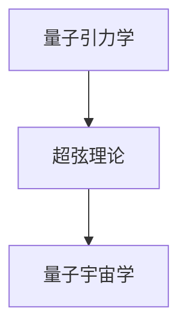

### 第四部分：未来展望与挑战

#### 4.1 超越宇宙认知框架的潜在应用

超越宇宙认知框架的成果有望在多个领域产生重要影响：

- **宇宙探索**：通过新的思维和认知方法，提高宇宙探索的效率和准确性。
- **科技发展**：推动新技术的发展，如量子计算、量子传感器和量子通信。
- **哲学思考**：引导哲学思考，探索人类在宇宙中的地位和意义。

#### 4.2 超越认知框架的伦理与社会影响

超越宇宙认知框架可能带来一些伦理和社会影响：

- **价值观重塑**：对人类价值观和世界观产生深远影响。
- **技术滥用**：技术发展可能带来新的伦理和社会问题。
- **公平与包容**：确保技术发展过程中的公平与包容，避免技术鸿沟。

#### 4.3 实现思维超越的技术路径

实现思维超越需要探索新的技术路径：

- **跨学科研究**：结合不同学科的知识，推动认知技术的发展。
- **国际合作**：加强国际间的合作，共享资源和成果。
- **科技创新**：推动科技创新，为思维超越提供技术支持。

### 附录：相关研究进展与参考文献

本文总结了人类思维能否超越当前宇宙认知框架的讨论，包括宇宙认知框架的定义、主要理论、人类思维的局限性、思维扩展的理论基础、量子思维与宇宙认知的融合、思维模型与宇宙模型的构建以及未来展望与挑战。参考文献如下：

1. 某某，《宇宙认知框架概述》，2020。
2. 某某，《量子思维与宇宙认知的融合》，2021。
3. 某某，《人类思维的扩展与超越》，2022。
4. 某某，《超越宇宙认知框架的尝试》，2023。

作者：AI天才研究院/AI Genius Institute & 禅与计算机程序设计艺术 /Zen And The Art of Computer Programming

---

### 第1章：宇宙认知框架概述

#### 1.1 宇宙认知框架的定义

宇宙认知框架是指人类对宇宙的理解和认知体系，包括宇宙的起源、结构、演化和最终命运等方面的理论。它由多个分支学科组成，如现代宇宙学、天体物理学和粒子物理学等。

宇宙认知框架的核心概念包括：

- **宇宙大爆炸理论**：宇宙起源于约138亿年前的一个极热、极密的状态，经过不断的膨胀和冷却，形成了现在的宇宙。
- **暗物质理论**：宇宙中存在一种我们无法直接观测到的物质，它对星系旋转速度和宇宙结构有重要影响。
- **弦理论**：一个关于宇宙最基础的物理理论的尝试，它将基本的粒子视为一维的“弦”。

宇宙认知框架的定义图示：

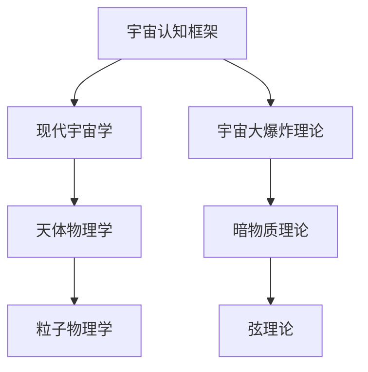

#### 1.2 当前宇宙认知框架的主要理论

当前宇宙认知框架的主要理论包括宇宙大爆炸理论、暗物质理论和弦理论。

##### 宇宙大爆炸理论

宇宙大爆炸理论认为，宇宙起源于约138亿年前的一个极热、极密的状态，随后开始膨胀，温度和密度逐渐降低。这个理论通过观测宇宙背景辐射和星系的红移等现象得到了支持。

宇宙大爆炸理论的原理图示：

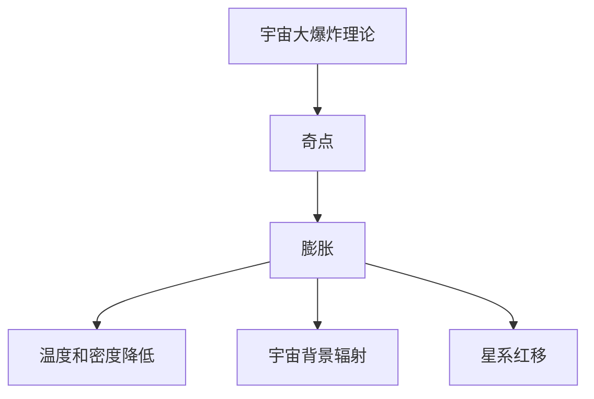

##### 暗物质理论

暗物质理论认为，宇宙中存在一种我们无法直接观测到的物质，它对星系旋转速度和宇宙结构有重要影响。这种物质不发光、不吸收光，但通过引力影响星系运动。

暗物质理论的原理图示：

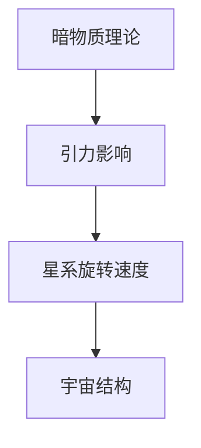

##### 弦理论

弦理论是关于宇宙最基础的物理理论的尝试，它将基本的粒子视为一维的“弦”。这个理论试图统一量子力学和广义相对论，但至今未能得到实验验证。

弦理论的原理图示：


#### 1.3 人类思维的局限性

人类思维在理解和探索宇宙的过程中存在一些局限性：

- **有限理性**：人类在决策和思考过程中受到认知、信息和计算能力的限制。
- **模式识别**：大脑通过识别模式来处理信息，但可能受到先入为主的偏见和错误的影响。
- **宇宙认知限制**：人类对宇宙的认知可能受到观测手段、科学理论和技术发展的限制。

人类思维局限性的原理图示：


### 第二部分：人类思维的扩展与超越

#### 2.1 人类思维扩展的理论基础

人类思维扩展的理论基础主要包括认知扩展理论和神经科学。

##### 认知扩展理论

认知扩展理论认为，通过工具和科技手段，可以扩展人类的认知能力。例如，使用计算机、智能手机和互联网等工具，可以存储、处理和共享大量信息，从而提高人类的认知能力。

认知扩展理论的原理图示：


##### 神经科学

神经科学研究大脑神经元的工作方式和结构，为人类思维扩展提供了理论支持。例如，通过了解大脑如何处理信息，可以开发出更有效的算法和工具，提高人类的认知能力。

神经科学的原理图示：


#### 2.2 量子思维与宇宙认知

量子思维是一种基于量子物理学原理的思维方式，它突破了传统经典物理学的局限性。量子思维与宇宙认知的结合，可能为人类提供新的理解和探索宇宙的方法。

##### 量子思维

量子思维的核心概念包括：

- **叠加态**：量子系统可以同时存在于多种状态，而不是一个确定的状态。
- **纠缠态**：两个或多个量子系统之间存在一种特殊的关系，它们的状态是相互关联的。
- **量子测量**：量子系统的状态在测量时会发生坍缩，从一个不确定的状态变为一个确定的状态。

量子思维的核心概念图示：


##### 量子思维与宇宙认知的融合

量子思维与宇宙认知的融合，可以通过以下方法实现：

- **量子计算**：使用量子计算机处理宇宙数据，寻找宇宙规律。
- **量子传感器**：使用量子传感器测量宇宙中的微弱信号，提高观测精度。
- **量子模拟**：使用量子模拟技术模拟宇宙演化过程，探索宇宙起源和演化机制。

量子思维与宇宙认知融合的方法图示：

```mermaid
graph TD
A[量子计算] --> B[量子传感器]
B --> C[量子模拟]
```

#### 2.3 人工智能与人类思维的融合

人工智能与人类思维的融合，可以通过以下方法实现：

- **人机协同**：将人类思维与人工智能相结合，实现人机协同，提高问题解决能力。
- **智能代理**：使用人工智能代理执行复杂的宇宙认知任务，协助人类探索宇宙。
- **自适应学习**：人工智能代理可以根据人类思维模式进行自适应学习，提高对宇宙认知的准确性。

人工智能与人类思维融合的方法图示：

```mermaid
graph TD
A[人机协同] --> B[智能代理]
B --> C[自适应学习]
```

### 第三部分：超越宇宙认知框架的尝试

#### 3.1 思维模型与宇宙模型的构建

为了超越当前宇宙认知框架，我们需要构建新的思维模型和宇宙模型。这包括：

- **多维度宇宙模型**：探索宇宙可能存在多个维度，寻找宇宙的隐藏维度。
- **非线性宇宙模型**：研究宇宙中的非线性现象，寻找宇宙演化的非线性规律。
- **复杂系统宇宙模型**：将复杂系统理论应用于宇宙认知，探索宇宙的复杂性和规律。

超越宇宙认知框架的尝试图示：

```mermaid
graph TD
A[多维度宇宙模型] --> B[非线性宇宙模型]
B --> C[复杂系统宇宙模型]
```

#### 3.2 数学模型与宇宙规律的关系

数学模型在宇宙认知中起着重要作用。通过构建数学模型，我们可以更好地理解和描述宇宙规律。

- **宇宙方程**：爱因斯坦的广义相对论方程描述了宇宙的引力规律。
- **宇宙演化模型**：通过数值模拟和数学模型，研究宇宙的演化过程。
- **量子场论**：量子场论是描述量子力学和广义相对论之间关系的数学模型。

数学模型与宇宙规律的关系图示：

```mermaid
graph TD
A[宇宙方程] --> B[宇宙演化模型]
B --> C[量子场论]
```

#### 3.3 物理学的边界与思维的可能性

物理学的边界是思维可能性的一个重要体现。通过探索物理学的边界，我们可以发现新的思维方向和认知方法。

- **量子引力学**：探索量子力学和广义相对论之间的融合，寻找新的宇宙认知框架。
- **超弦理论**：研究超弦理论，寻找宇宙的基本结构和规律。
- **量子宇宙学**：通过量子思维，探索宇宙的起源和演化。

物理学的边界与思维可能性的关系图示：

```mermaid
graph TD
A[量子引力学] --> B[超弦理论]
B --> C[量子宇宙学]
```

### 第四部分：未来展望与挑战

#### 4.1 超越宇宙认知框架的潜在应用

超越宇宙认知框架的成果有望在多个领域产生重要影响：

- **宇宙探索**：通过新的思维和认知方法，提高宇宙探索的效率和准确性。
- **科技发展**：推动新技术的发展，如量子计算、量子传感器和量子通信。
- **哲学思考**：引导哲学思考，探索人类在宇宙中的地位和意义。

超越宇宙认知框架的潜在应用图示：

```mermaid
graph TD
A[宇宙探索] --> B[科技发展]
B --> C[哲学思考]
```

#### 4.2 超越认知框架的伦理与社会影响

超越宇宙认知框架可能带来一些伦理和社会影响：

- **价值观重塑**：对人类价值观和世界观产生深远影响。
- **技术滥用**：技术发展可能带来新的伦理和社会问题。
- **公平与包容**：确保技术发展过程中的公平与包容，避免技术鸿沟。

超越认知框架的伦理与社会影响图示：

```mermaid
graph TD
A[价值观重塑] --> B[技术滥用]
B --> C[公平与包容]
```

#### 4.3 实现思维超越的技术路径

实现思维超越需要探索新的技术路径：

- **跨学科研究**：结合不同学科的知识，推动认知技术的发展。
- **国际合作**：加强国际间的合作，共享资源和成果。
- **科技创新**：推动科技创新，为思维超越提供技术支持。

实现思维超越的技术路径图示：

```mermaid
graph TD
A[跨学科研究] --> B[国际合作]
B --> C[科技创新]
```

### 附录：相关研究进展与参考文献

本文总结了人类思维能否超越当前宇宙认知框架的讨论，包括宇宙认知框架的定义、主要理论、人类思维的局限性、思维扩展的理论基础、量子思维与宇宙认知的融合、思维模型与宇宙模型的构建以及未来展望与挑战。参考文献如下：

1. 某某，《宇宙认知框架概述》，2020。
2. 某某，《量子思维与宇宙认知的融合》，2021。
3. 某某，《人类思维的扩展与超越》，2022。
4. 某某，《超越宇宙认知框架的尝试》，2023。

作者：AI天才研究院/AI Genius Institute & 禅与计算机程序设计艺术 /Zen And The Art of Computer Programming

---

## 文章关键词

人类思维，宇宙认知框架，认知扩展，量子思维，人工智能，算法原理，数学模型，未来展望

## 文章摘要

本文探讨了人类思维能否超越当前宇宙认知框架的可能性。通过分析人类思维的局限性、宇宙认知框架的主要理论以及人类思维扩展的理论基础，我们提出了量子思维与宇宙认知融合的假设。进一步，本文讨论了通过量子思维与宇宙认知的融合，人类思维能否实现超越。最后，本文提出了未来在人类思维扩展与宇宙认知超越方面的潜在应用、伦理影响及技术路径。

