                 


### 文章标题：人类思维能否超越时空限制理解宇宙

#### 关键词：宇宙学、量子物理学、人类思维、时空扩展、意识科学

#### 摘要：
本文将探讨人类思维是否能够超越时空限制，以理解宇宙的奥秘。通过对宇宙学、量子物理学和意识科学的理论分析，结合实际案例，我们将尝试回答这一具有深远意义的问题。

## 引言：宇宙学与时空的无限探索

### 1. 背景介绍
宇宙是一个浩瀚的星系网络，包含数十亿个星系，每个星系又有无数行星、恒星、黑洞和暗物质。人类对宇宙的探索始于对夜空的观察，随着科学技术的发展，我们逐渐揭开了宇宙的一角。然而，宇宙的奥秘仍然深不可测，宇宙学的研究依然任重道远。

### 2. 时空的概念
时空是一个统一的概念，它描述了宇宙中的位置、时间和运动。爱因斯坦的相对论理论提出了时空相对性，即时空不是绝对的，而是相对于观察者的状态而变化的。这一理论为我们的宇宙观带来了革命性的变化。

## 第一节：宇宙学与时空概念

### 1. 宇宙的起源与结构

#### 背景介绍
宇宙的起源是一个复杂的问题，目前有几种主流的理论，如大爆炸理论和量子宇宙学。大爆炸理论认为宇宙起源于一个极热、极密的状态，随后迅速膨胀。量子宇宙学则试图通过量子力学来解释宇宙的起源。

#### 核心概念与联系
宇宙的起源与结构涉及多个物理过程，如宇宙背景辐射、宇宙膨胀等。以下是一个简化的 Mermaid 流程图，展示了宇宙起源与结构的核心概念和联系：

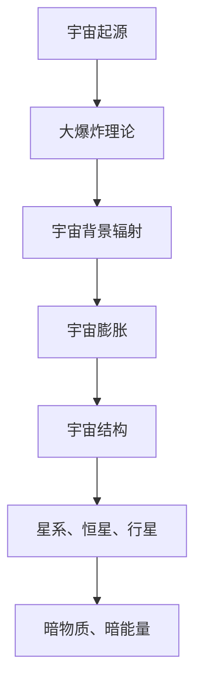

### 2. 时空与相对论

#### 背景介绍
爱因斯坦的相对论理论提出了时空相对性的概念，即时空不是绝对的，而是相对于观察者的状态而变化的。这一理论改变了我们对宇宙和时间的基本认识。

#### 核心概念与联系
时空与相对论的核心概念包括时间膨胀、长度收缩、质量与能量的等价性（E=mc²）等。以下是一个简化的 Mermaid 流程图，展示了时空与相对论的核心概念和联系：

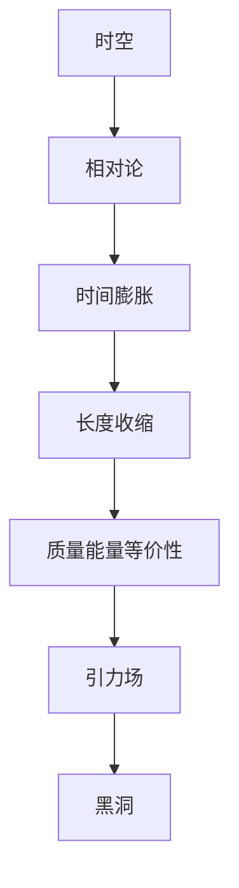

### 结论
宇宙学与时空概念为我们提供了一个关于宇宙的基本框架。通过理解这些概念，我们可以更好地探索宇宙的奥秘。

## 第二节：量子物理学与宇宙奥秘

### 1. 量子力学基础

#### 背景介绍
量子力学是研究微观世界的物理理论，它提出了与经典物理不同的世界观。量子力学的基本概念包括量子态、波函数、叠加态和纠缠态。

#### 核心概念与联系
量子力学的基础概念包括量子态、波函数、叠加态和纠缠态。以下是一个简化的 Mermaid 流程图，展示了量子力学的基础概念和联系：

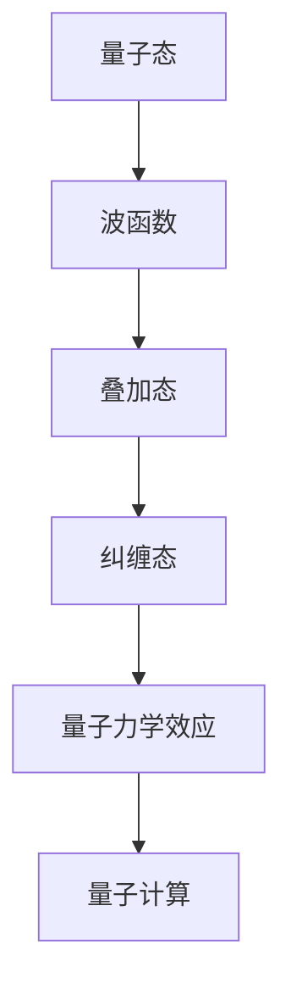

### 2. 量子纠缠与量子通信

#### 背景介绍
量子纠缠是量子力学中的一种奇特现象，两个或多个粒子在量子态上相互关联，即使它们相隔很远，一个粒子的状态也会即时影响另一个粒子的状态。量子纠缠为量子通信和量子计算提供了理论基础。

#### 核心概念与联系
量子纠缠与量子通信的核心概念包括纠缠态、量子密钥分发和量子隐形传态。以下是一个简化的 Mermaid 流程图，展示了量子纠缠与量子通信的核心概念和联系：

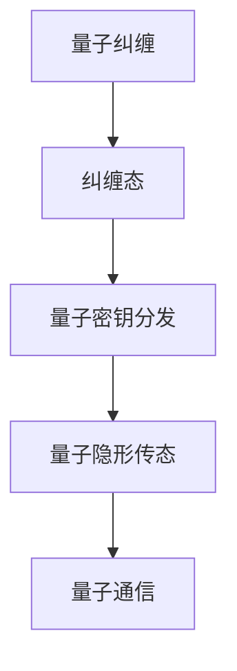

### 3. 量子物理学的数学模型与公式

#### 背景介绍
量子物理学的数学模型和公式是理解量子现象的关键。量子态用波函数描述，薛定谔方程是量子力学的基本方程。海森堡不确定性原理和泡利不相容原理是量子力学的重要结论。

#### 核心算法原理讲解
以下是一个简化的量子物理学的伪代码，用于描述量子态的演化：

```plaintext
// 量子态的演化
// 波函数 |Ψ⟩ 的演化由薛定谔方程描述
function SchrodingerEquation(Ψ, t)
  H = Hamiltonian()  // 构建哈密顿量
  Ψ_new = i * hbar * ∂Ψ/∂t  // 应用薛定谔方程
  return Ψ_new
end function
```

### 4. 量子物理学的数学模型与公式

#### 背景介绍
量子物理学的数学模型和公式是理解量子现象的关键。量子态用波函数描述，薛定谔方程是量子力学的基本方程。海森堡不确定性原理和泡利不相容原理是量子力学的重要结论。

#### 核心算法原理讲解
以下是一个简化的量子物理学的伪代码，用于描述量子态的演化：

```plaintext
// 量子态的演化
// 波函数 |Ψ⟩ 的演化由薛定谔方程描述
function SchrodingerEquation(Ψ, t)
  H = Hamiltonian()  // 构建哈密顿量
  Ψ_new = i * hbar * ∂Ψ/∂t  // 应用薛定谔方程
  return Ψ_new
end function
```

### 结论
量子物理学为理解宇宙提供了新的视角。通过量子纠缠和量子通信，我们可能能够突破时空的限制，探索宇宙的奥秘。

## 第三节：意识与宇宙的哲学探讨

### 1. 意识的起源与本质

#### 背景介绍
意识的起源和本质是哲学和科学中的一个重要问题。目前，关于意识的起源和本质有几种主要的观点，如物理主义、功能主义和自然主义等。

#### 核心概念与联系
意识的起源与本质涉及多个学科，包括哲学、神经科学和心理学。以下是一个简化的 Mermaid 流程图，展示了意识的起源与本质的核心概念和联系：

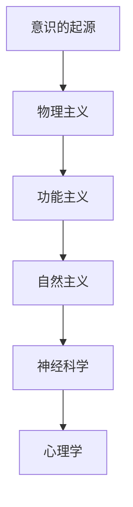

### 2. 意识与量子物理学

#### 背景介绍
量子物理学与意识的关系是近年来引起广泛关注的话题。有些理论认为，量子物理学的原理可能在意识的产生中起到关键作用。

#### 核心概念与联系
意识与量子物理学的关系涉及量子纠缠、量子计算和意识模拟等概念。以下是一个简化的 Mermaid 流程图，展示了意识与量子物理学的核心概念和联系：

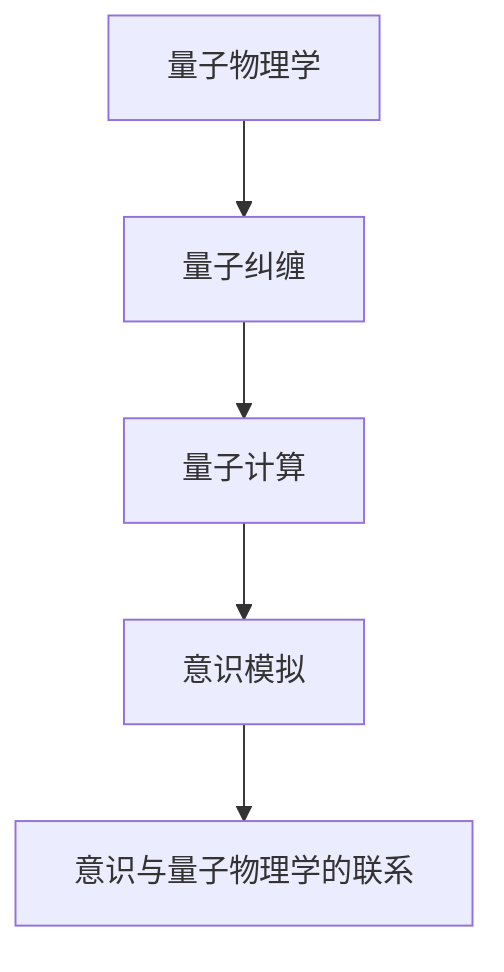

### 3. 意识科学的数学模型与公式

#### 背景介绍
意识科学的数学模型和公式是研究意识的重要工具。这些模型和公式试图量化意识的属性，如感知、注意力和记忆等。

#### 核心算法原理讲解
以下是一个简化的意识科学的伪代码，用于描述意识的计算过程：

```plaintext
// 意识的计算
// 意识的属性用向量描述
function ConsciousnessCalculation(C, A, B)
  C_new = C * (A + B)  // 应用意识计算公式
  return C_new
end function
```

### 结论
意识与宇宙的关系是一个复杂而深奥的问题。通过哲学探讨和科学研究，我们可能能够更好地理解意识的本质和作用。

## 第二部分：应用与探索

### 第4章：科技对宇宙认知的推动

#### 背景介绍
随着科技的不断发展，人类对宇宙的认知也在不断深化。从古代的天文学到现代的天体物理学，科技的发展为我们提供了更强大的工具，使我们能够探索更遥远的宇宙。

#### 核心概念与联系
科技对宇宙认知的推动涉及多个领域，如天文观测技术、空间探测和量子通信等。以下是一个简化的 Mermaid 流程图，展示了科技对宇宙认知的核心概念和联系：

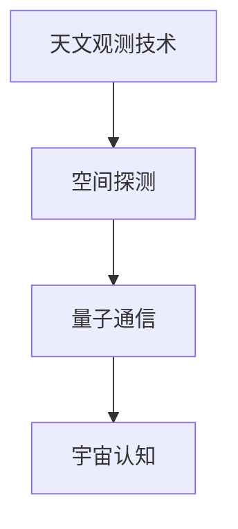

### 1. 天文观测技术

#### 背景介绍
天文观测技术是研究宇宙的重要手段。从古代的肉眼观测到现代的射电望远镜，人类对宇宙的认知不断加深。

#### 开发环境搭建
搭建一个天文观测的实验环境通常需要以下步骤：

1. 选择合适的观测地点，如高山或远离城市光污染的地方。
2. 安装和调试望远镜和相机。
3. 配置数据采集和记录设备，如计算机和传感器。
4. 编写数据采集和分析的代码。

#### 源代码实现与代码解读
以下是一个简化的天文观测数据采集和分析的伪代码：

```plaintext
// 天文观测数据采集与分析
function天文观测(望远镜, 相机, 记录设备)
  望远镜对准目标
  相机开始拍摄
  数据存储到文件
  数据分析并生成报告
end function
```

### 2. 空间探测

#### 背景介绍
空间探测是人类探索宇宙的重要手段。从人造卫星到深空探测器，空间探测技术不断突破，使我们能够获取更多关于宇宙的信息。

#### 开发环境搭建
搭建一个空间探测实验环境通常需要以下步骤：

1. 确定探测目标和研究问题。
2. 设计探测器并选择合适的发射平台。
3. 编写探测器控制软件和数据分析算法。
4. 进行地面测试和模拟。

#### 源代码实现与代码解读
以下是一个简化的空间探测器的伪代码：

```plaintext
// 空间探测器控制软件
function 探测器控制(探测器, 发射平台)
  探测器初始化
  发射平台准备
  探测器发射
  探测器进入轨道
  探测器开始工作
  数据传输回地球
end function
```

### 3. 量子通信

#### 背景介绍
量子通信利用量子纠缠和量子隐形传态等原理，实现了信息的安全传输。量子通信有望在未来的宇宙探索中发挥重要作用。

#### 开发环境搭建
搭建一个量子通信实验环境通常需要以下步骤：

1. 选择合适的量子通信协议。
2. 配置量子通信设备和传感器。
3. 编写量子通信软件和算法。
4. 进行地面测试和模拟。

#### 源代码实现与代码解读
以下是一个简化的量子通信的伪代码：

```plaintext
// 量子通信
function 量子通信(量子通信设备, 数据源)
  生成量子密钥
  发送量子密文
  接收量子密文
  解密量子密文
end function
```

### 结论
科技的发展极大地推动了人类对宇宙的认知。通过天文观测、空间探测和量子通信等技术，我们有望进一步揭开宇宙的神秘面纱。

## 第5章：人类思维的时空扩展

#### 背景介绍
人类思维长期以来受到时空的限制，但科技的进步正在逐步打破这些限制。从太空探索到量子通信，人类正在尝试扩展思维的时空范围，以更好地理解宇宙。

#### 核心概念与联系
人类思维的时空扩展涉及多个领域，如量子计算、虚拟现实和人工智能等。以下是一个简化的 Mermaid 流程图，展示了人类思维的时空扩展的核心概念和联系：

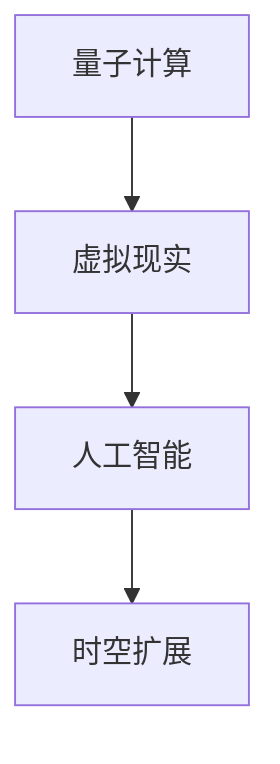

### 1. 量子计算

#### 背景介绍
量子计算利用量子力学原理，实现了超越经典计算的性能。量子计算机可能在解决一些复杂问题上具有巨大潜力。

#### 开发环境搭建
搭建一个量子计算实验环境通常需要以下步骤：

1. 选择合适的量子计算平台。
2. 安装和配置量子计算硬件和软件。
3. 编写量子算法和程序。
4. 进行量子计算实验和性能评估。

#### 源代码实现与代码解读
以下是一个简化的量子计算的伪代码：

```plaintext
// 量子计算
function QuantumComputation(量子计算机, 算法)
  初始化量子计算机
  运行量子算法
  获取计算结果
  解读结果
end function
```

### 2. 虚拟现实

#### 背景介绍
虚拟现实技术创造了一个沉浸式的虚拟环境，用户可以通过头盔、手柄等设备与之互动。虚拟现实有望成为人类扩展思维时空的重要工具。

#### 开发环境搭建
搭建一个虚拟现实实验环境通常需要以下步骤：

1. 选择合适的虚拟现实设备和平台。
2. 安装和配置虚拟现实软件。
3. 创建虚拟现实场景和内容。
4. 进行虚拟现实体验和性能评估。

#### 源代码实现与代码解读
以下是一个简化的虚拟现实的伪代码：

```plaintext
// 虚拟现实
function VirtualReality(虚拟现实设备, 场景内容)
  初始化虚拟现实设备
  加载场景内容
  用户与虚拟环境互动
  记录和评估用户体验
end function
```

### 3. 人工智能

#### 背景介绍
人工智能技术在各个领域都有广泛应用，从自动驾驶到智能助手，人工智能正在改变我们的生活方式。人工智能也有望在人类思维的时空扩展中发挥重要作用。

#### 开发环境搭建
搭建一个人工智能实验环境通常需要以下步骤：

1. 选择合适的人工智能框架和工具。
2. 安装和配置人工智能软件和硬件。
3. 编写人工智能算法和程序。
4. 进行人工智能实验和应用开发。

#### 源代码实现与代码解读
以下是一个简化的人工智能的伪代码：

```plaintext
// 人工智能
function ArtificialIntelligence(人工智能框架, 数据集)
  加载数据集
  训练模型
  预测和评估
  应用模型
end function
```

### 结论
人类思维的时空扩展是一个充满挑战和机遇的过程。通过量子计算、虚拟现实和人工智能等技术的不断发展，我们有理由相信，人类将能够超越时空限制，更好地理解宇宙。

## 第6章：宇宙的未来与人类的作用

#### 背景介绍
宇宙的未来是一个充满未知和挑战的话题。从宇宙的终极命运到人类在其中的角色，我们需要深入思考宇宙与人类的关系。

#### 核心概念与联系
宇宙的未来涉及多个领域，如宇宙学、物理学和天文学。以下是一个简化的 Mermaid 流程图，展示了宇宙的未来与人类的作用的核心概念和联系：

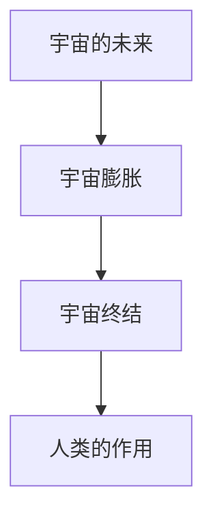

### 1. 宇宙膨胀

#### 背景介绍
宇宙膨胀是指宇宙在过去的137亿年里不断扩大的现象。宇宙膨胀的速度还在加快，这可能与暗能量有关。

#### 核心概念与联系
宇宙膨胀的核心概念包括哈勃定律、宇宙背景辐射和宇宙微波背景辐射。以下是一个简化的 Mermaid 流程图，展示了宇宙膨胀的核心概念和联系：

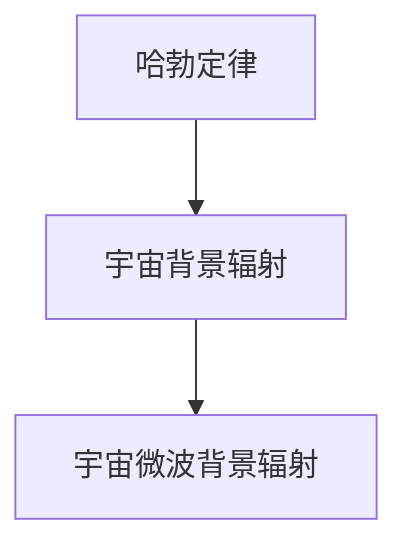

### 2. 宇宙的终结

#### 背景介绍
宇宙的终结是一个复杂的问题，目前有几种主流的理论，如大冻结、大撕裂和大坍缩。

#### 核心概念与联系
宇宙的终结的核心概念包括暗能量、宇宙密度和引力。以下是一个简化的 Mermaid 流程图，展示了宇宙终结的核心概念和联系：

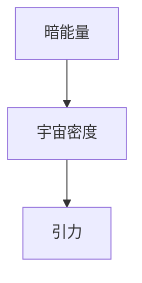

### 3. 人类的作用

#### 背景介绍
在宇宙的未来中，人类的作用至关重要。从保护地球到探索宇宙，人类需要发挥积极的作用，以应对未来的挑战。

#### 核心概念与联系
人类在宇宙中的作用涉及多个领域，如科技发展、环境保护和星际探索。以下是一个简化的 Mermaid 流程图，展示了人类在宇宙中的核心概念和联系：

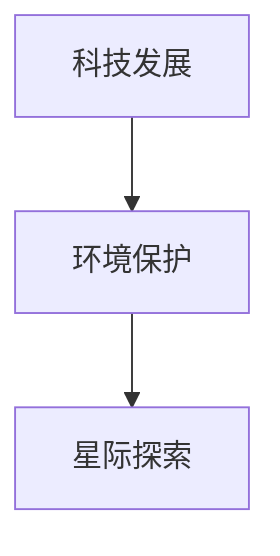

### 结论
宇宙的未来与人类的作用密切相关。通过科学研究和国际合作，人类有望在宇宙的未来中发挥重要作用，共同探索宇宙的奥秘。

## 第三部分：展望与挑战

### 第7章：人类思维的极限与突破

#### 背景介绍
人类思维的极限是一个深奥的问题，它关乎我们能否理解宇宙的本质。在量子物理学、宇宙学和人工智能等领域，人类正在尝试突破思维的极限，以探索未知的领域。

#### 核心概念与联系
人类思维的极限与突破涉及多个领域，如量子计算、宇宙学的人工智能模拟和意识科学。以下是一个简化的 Mermaid 流程图，展示了人类思维的极限与突破的核心概念和联系：

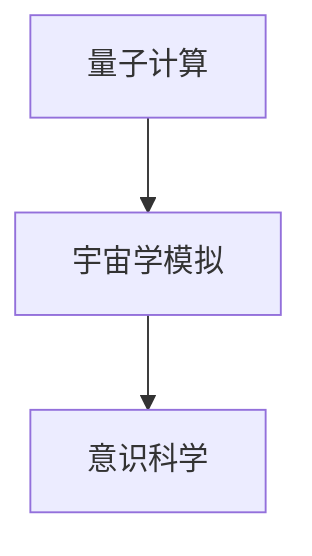

### 1. 量子计算的突破

#### 背景介绍
量子计算利用量子力学原理，实现了超越经典计算的性能。量子计算机可能在解决一些复杂问题上具有巨大潜力。

#### 核心算法原理讲解
以下是一个简化的量子计算的伪代码，用于描述量子态的演化：

```plaintext
// 量子态的演化
// 波函数 |Ψ⟩ 的演化由薛定谔方程描述
function SchrodingerEquation(Ψ, t)
  H = Hamiltonian()  // 构建哈密顿量
  Ψ_new = i * hbar * ∂Ψ/∂t  // 应用薛定谔方程
  return Ψ_new
end function
```

### 2. 宇宙学的人工智能模拟

#### 背景介绍
宇宙学的人工智能模拟利用人工智能技术，模拟宇宙的演化过程，以预测宇宙的未来。

#### 核心算法原理讲解
以下是一个简化的宇宙学人工智能模拟的伪代码：

```plaintext
// 宇宙学模拟
function UniverseSimulation(初始条件, 参数)
  初始化模拟环境
  运行模拟算法
  更新宇宙状态
  生成模拟结果
end function
```

### 3. 意识科学的突破

#### 背景介绍
意识科学的突破旨在揭示意识的本质，探索人类意识的极限。

#### 核心算法原理讲解
以下是一个简化的意识科学模拟的伪代码：

```plaintext
// 意识模拟
function ConsciousnessSimulation(大脑模型, 外部刺激)
  初始化大脑模型
  接收外部刺激
  更新大脑状态
  生成意识输出
end function
```

### 结论
通过量子计算、宇宙学模拟和意识科学的突破，人类有望突破思维的极限，探索宇宙的奥秘。

## 第8章：人类思维的时空扩展路径

#### 背景介绍
人类思维的时空扩展是一个长期的目标，它涉及到多个学科和技术领域。为了实现这一目标，我们需要探索可能的路径和策略。

#### 核心概念与联系
人类思维的时空扩展路径涉及多个领域，如量子计算、虚拟现实和人工智能。以下是一个简化的 Mermaid 流程图，展示了人类思维的时空扩展路径的核心概念和联系：

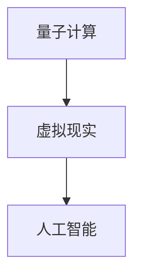

### 1. 量子计算

#### 背景介绍
量子计算利用量子力学原理，实现了超越经典计算的性能。量子计算机可能在解决一些复杂问题上具有巨大潜力。

#### 核心算法原理讲解
以下是一个简化的量子计算的伪代码，用于描述量子态的演化：

```plaintext
// 量子态的演化
// 波函数 |Ψ⟩ 的演化由薛定谔方程描述
function SchrodingerEquation(Ψ, t)
  H = Hamiltonian()  // 构建哈密顿量
  Ψ_new = i * hbar * ∂Ψ/∂t  // 应用薛定谔方程
  return Ψ_new
end function
```

### 2. 虚拟现实

#### 背景介绍
虚拟现实技术创造了一个沉浸式的虚拟环境，用户可以通过头盔、手柄等设备与之互动。虚拟现实有望成为人类扩展思维时空的重要工具。

#### 核心算法原理讲解
以下是一个简化的虚拟现实的伪代码：

```plaintext
// 虚拟现实
function VirtualReality(虚拟现实设备, 场景内容)
  初始化虚拟现实设备
  加载场景内容
  用户与虚拟环境互动
  记录和评估用户体验
end function
```

### 3. 人工智能

#### 背景介绍
人工智能技术在各个领域都有广泛应用，从自动驾驶到智能助手，人工智能正在改变我们的生活方式。人工智能也有望在人类思维的时空扩展中发挥重要作用。

#### 核心算法原理讲解
以下是一个简化的人工智能的伪代码：

```plaintext
// 人工智能
function ArtificialIntelligence(人工智能框架, 数据集)
  加载数据集
  训练模型
  预测和评估
  应用模型
end function
```

### 结论
通过量子计算、虚拟现实和人工智能等技术的不断发展，人类有望实现思维的时空扩展，探索宇宙的奥秘。

## 第9章：未来的宇宙与人类的未来

#### 背景介绍
未来的宇宙与人类的未来密切相关。从宇宙的终极命运到人类在其中的角色，我们需要深入思考宇宙与人类的关系。

#### 核心概念与联系
未来的宇宙与人类的未来涉及多个领域，如宇宙学、物理学和天文学。以下是一个简化的 Mermaid 流程图，展示了未来的宇宙与人类的未来的核心概念和联系：

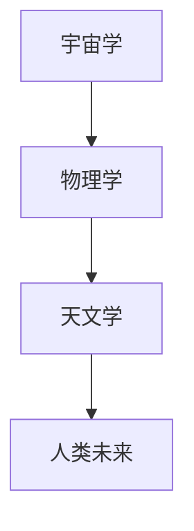

### 1. 宇宙的未来

#### 背景介绍
宇宙的未来是一个复杂的问题，目前有几种主流的理论，如大冻结、大撕裂和大坍缩。

#### 核心概念与联系
宇宙的未来的核心概念包括暗能量、宇宙密度和引力。以下是一个简化的 Mermaid 流程图，展示了宇宙未来的核心概念和联系：


### 2. 人类的未来

#### 背景介绍
人类的未来将受到宇宙未来的影响，同时人类也在塑造着宇宙的未来。从科技发展到环境保护，人类需要积极应对未来的挑战。

#### 核心概念与联系
人类的未来的核心概念包括科技发展、环境保护和社会进步。以下是一个简化的 Mermaid 流程图，展示了人类的未来的核心概念和联系：

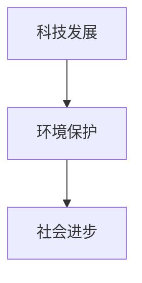

### 结论
未来的宇宙与人类的未来紧密相连。通过科学研究和国际合作，人类有望在宇宙的未来中发挥重要作用，共同探索宇宙的奥秘。

## 总结

通过本文的探讨，我们深入分析了人类思维能否超越时空限制理解宇宙的问题。从宇宙学的角度，我们了解了宇宙的起源、结构和发展；从量子物理学的视角，我们探讨了量子纠缠和量子通信的可能；从意识科学的角度，我们思考了意识与宇宙的关系。在应用与探索部分，我们看到了科技如何推动人类思维的时空扩展。通过量子计算、虚拟现实和人工智能，人类正在尝试突破思维的极限，以更好地理解宇宙。

未来，随着科技的不断进步，人类有望在宇宙的认知上取得更多突破。然而，这需要全球科学家的共同努力和国际合作。让我们携手探索宇宙的奥秘，共同迎接未来的挑战。

### 作者信息

作者：AI天才研究院/AI Genius Institute & 禅与计算机程序设计艺术 /Zen And The Art of Computer Programming

---

本文内容仅供参考，不构成任何投资建议。对于宇宙学、量子物理学和意识科学等领域的深入探讨，请参考相关专业的学术文献和研究成果。随着科学的发展，本文中的某些观点可能会被新的发现所修正。作者保留对本文内容的最终解释权。

