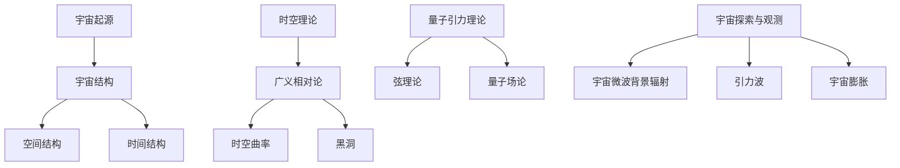
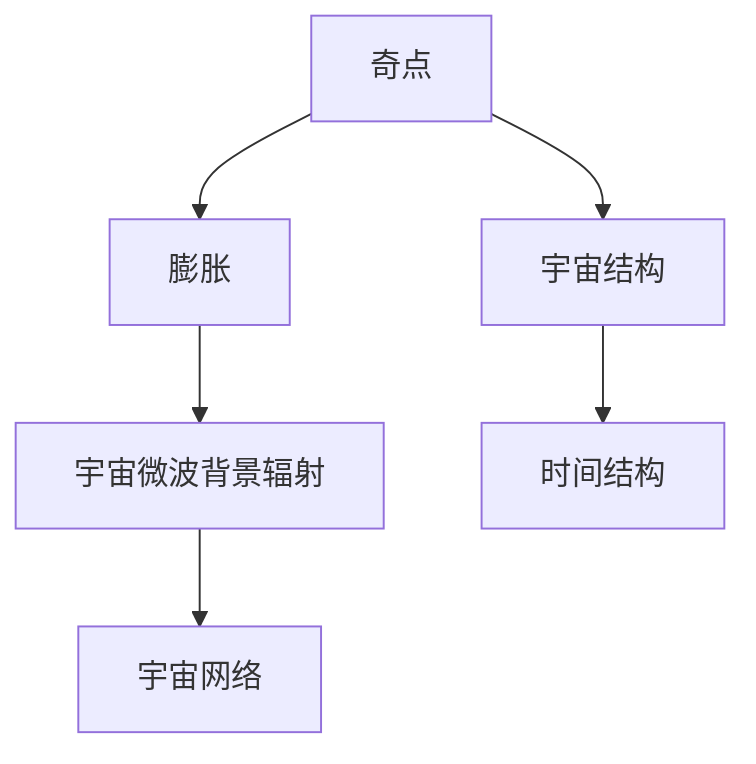
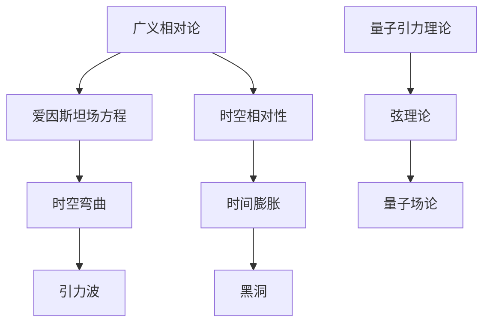
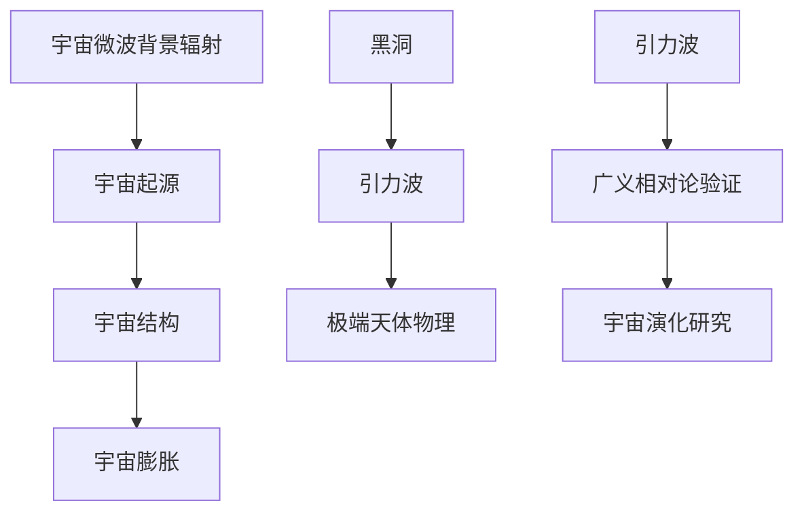

                 

### 文章标题

《人类思维能否超越时空限制理解宇宙本质》

> 关键词：人类思维，时空限制，宇宙本质，跨学科融合，人工智能

> 摘要：本文旨在探讨人类思维能否超越时空限制，以理解宇宙的本质。通过分析宇宙学与时空理论的基础知识，阐述人类思维的局限性，并提出跨学科融合的方法。文章还探讨了人工智能在人类思维扩展中的作用，并展望了未来可能的研究方向。

----------------------------------------------------------------

## 第一部分：宇宙与时空基础

### 1.1 宇宙的起源与结构

宇宙的起源一直是科学家们探索的重要问题。目前，主流的宇宙起源理论是大爆炸理论。大爆炸理论认为，宇宙起源于约138亿年前的一个极度高温高密度的奇点，随后开始膨胀，形成了我们今天所观测到的宇宙。

宇宙的基本结构可以从多个维度来描述。首先是宇宙的空间结构，它由大量的星系组成，这些星系通过引力相互作用，形成星系团和超星系团。其次是宇宙的时间结构，宇宙的膨胀意味着时间也在不断延伸。

时空概念在宇宙学中扮演着至关重要的角色。根据广义相对论，时空是一个四维的连续体，物质和能量会影响时空的几何结构。这种观点与牛顿力学中的绝对时空观念有着本质的区别。

### 1.2 时空理论

时空理论的发展是物理学的重要里程碑。爱因斯坦的广义相对论是时空理论的经典代表。广义相对论认为，时空的几何结构是由物质和能量分布所决定的。这意味着，物质和能量会影响时空的曲率，进而影响时空的流逝。

黑洞是广义相对论的一个重要概念。黑洞是由极度密集的物质构成的天体，其引力场如此之强，以至于连光也无法逃脱。黑洞的存在不仅验证了广义相对论的预测，也为理解宇宙的极端现象提供了新的视角。

量子引力理论是另一类时空理论，它试图将广义相对论与量子力学相结合。目前，量子引力理论仍处于发展阶段，尚未得到实验验证。但一些理论模型，如弦理论和量子场论，为我们提供了对时空性质的新理解。

### 1.3 宇宙探索与观测

宇宙探索与观测是理解宇宙本质的重要手段。宇宙微波背景辐射是宇宙早期的残留辐射，通过对它的观测，科学家们可以揭示宇宙的起源和早期演化。

引力波是另一个重要的观测目标。引力波是由剧烈的天体事件，如黑洞碰撞，产生的时空波动。探测引力波可以帮助我们更深入地理解宇宙的大尺度结构。

宇宙的膨胀是另一个关键观测现象。通过观测遥远星系的红移，科学家们发现宇宙正在加速膨胀。这一发现引发了关于宇宙膨胀原因的深入研究，包括暗物质和暗能量的概念。

### Mermaid 流程图

## 第二部分：人类思维的局限与探索

### 2.1 人类思维的局限性

人类思维具有许多局限性。首先是感知与认知的局限。人类的感官系统只能感知到一部分外部世界的信息，而无法直接感知到其他维度的存在。其次，时空观念的演变表明，人类对时空的理解是不断发展的，但在某些极端条件下，如黑洞和宇宙大爆炸，我们的思维可能无法准确描述。

此外，跨文化思维差异也是人类思维的一个重要局限。不同文化背景下的人们对世界的理解有着不同的视角，这可能导致对某些问题的共识难以达成。

### 2.2 超越时空的思维方式

为了超越时空限制，人类需要发展新的思维方式。首先是直觉思维与逻辑思维的结合。直觉思维可以提供对复杂问题的快速理解，而逻辑思维则可以帮助我们系统地分析和解决问题。通过这两种思维方式的结合，我们可以更好地理解宇宙的本质。

其次，虚拟现实与增强现实技术为人类提供了新的探索方式。通过这些技术，我们可以模拟宇宙的某些现象，如黑洞和引力波，从而更直观地理解这些复杂的概念。

最后，跨学科思维的融合是超越时空限制的关键。通过将不同领域的知识相结合，我们可以从多个角度理解宇宙的本质。例如，将物理学与心理学相结合，可以帮助我们更好地理解人类思维与宇宙之间的互动。

### 2.3 人类思维的发展趋势

人类思维的发展趋势表明，我们正在不断超越自身的局限。首先是认知神经科学的进展。通过研究人类大脑的工作机制，科学家们正在揭示人类思维的本质，这为我们理解宇宙提供了新的视角。

其次，人工智能的发展为人类思维扩展提供了新的工具。人工智能可以通过模拟人类思维过程，帮助我们更有效地处理复杂的信息，从而加深我们对宇宙的理解。

最后，跨学科交流与合作是未来人类思维发展的重要方向。通过不同领域的专家合作，我们可以从多个角度探索宇宙的本质，从而取得更全面的理解。

## 第三部分：时空限制的突破

### 4.1 跨学科融合

跨学科融合是突破时空限制的关键。首先是数学与宇宙学的融合。数学提供了描述宇宙的精确工具，如方程和公式。这些工具可以帮助我们更深入地理解宇宙的本质。

其次，物理学与心理学的融合为人类思维与宇宙的关系提供了新的视角。通过研究人类大脑的工作机制，我们可以更好地理解人类思维如何影响对宇宙的理解。

最后，计算机科学与人工智能的融合为人类提供了新的探索工具。人工智能可以通过模拟人类思维过程，帮助我们更有效地处理复杂的信息，从而加深我们对宇宙的理解。

### 4.2 实验证据与理论突破

实验证据是验证理论是否正确的重要手段。在宇宙学中，实验证据包括宇宙微波背景辐射的观测、引力波的探测等。这些实验证据为宇宙学的理论提供了重要的支持。

理论突破则是推动宇宙学发展的关键。例如，量子引力理论试图将广义相对论与量子力学相结合，以解释宇宙的早期演化。虽然这一理论尚未得到实验验证，但它的提出为理解宇宙的本质提供了新的思路。

### 4.3 人类思维的边界

人类思维的边界是理解宇宙的本质的重要限制。首先，无限与有限是思维边界的一个重要方面。我们无法直接理解无限的概念，但可以通过数学和哲学来探讨这一概念。

其次，存在与非存在是另一个思维边界。人类对非存在的理解有限，但通过对宇宙的观测和思考，我们可以更好地理解存在的本质。

最后，探索与未知是推动人类思维不断发展的动力。我们通过不断探索未知，可以不断突破思维的边界，从而更深入地理解宇宙的本质。

## 第四部分：理解宇宙的本质

### 4.1 人类思维的边界

人类思维的边界是理解宇宙的本质的重要限制。首先，无限与有限是思维边界的一个重要方面。我们无法直接理解无限的概念，但可以通过数学和哲学来探讨这一概念。

其次，存在与非存在是另一个思维边界。人类对非存在的理解有限，但通过对宇宙的观测和思考，我们可以更好地理解存在的本质。

最后，探索与未知是推动人类思维不断发展的动力。我们通过不断探索未知，可以不断突破思维的边界，从而更深入地理解宇宙的本质。

### 4.2 宇宙的本质

宇宙的本质是一个复杂而深刻的问题。从宇宙学的角度来看，宇宙的本质可能与物质和能量密切相关。物质和能量是宇宙的基本组成部分，它们之间的相互作用决定了宇宙的结构和演化。

此外，意识与宇宙的关系也是理解宇宙本质的一个关键方面。一些理论认为，意识可能是宇宙演化的一部分，而不仅仅是宇宙的产物。这种观点挑战了我们传统的宇宙观念，并引发了关于宇宙本质的深入思考。

### 4.3 宇宙的未来

宇宙的未来是一个充满不确定性的问题。根据目前的观测和理论，宇宙可能面临多种不同的命运。例如，宇宙可能继续膨胀，最终导致宇宙的毁灭。另一方面，宇宙也可能经历某种形式的收缩，形成一个新的宇宙周期。

此外，一些理论还提出了宇宙的多元宇宙概念，即存在多个宇宙，每个宇宙都有自己独特的物理规律和演化路径。这种观点为我们理解宇宙的本质提供了新的视角，但同时也增加了理解的复杂性。

## 附录：进一步阅读与探索

### 附录 A：推荐阅读

1. 《宇宙简史》 - 斯蒂芬·霍金
2. 《时间简史》 - 斯蒂芬·霍金
3. 《黑洞与时间弯曲》 - 马丁·里斯

### 附录 B：实验与观察

1. 宇宙微波背景辐射观测项目
2. 哈勃空间望远镜
3. 事件视界望远镜（EHT）

### 附录 C：跨学科交流与合作

1. 国际天文学联合会（IAU）
2. 美国国家航空航天局（NASA）
3. 欧洲空间局（ESA）

## 结论

人类思维能否超越时空限制理解宇宙本质是一个复杂而深刻的问题。通过分析宇宙学与时空理论的基础知识，我们认识到人类思维在理解宇宙时面临的局限。然而，通过跨学科融合和人工智能的发展，我们有望不断突破这些局限，更深入地理解宇宙的本质。

未来的研究将继续揭示宇宙的奥秘，而我们也将不断拓展我们的思维边界。在这个过程中，人类思维与宇宙本质之间的关系将不断演化，为我们提供更丰富的理解。

## 作者信息

作者：AI天才研究院/AI Genius Institute & 禅与计算机程序设计艺术 /Zen And The Art of Computer Programming

----------------------------------------------------------------

### 引言

人类思维作为理解世界的工具，其能力在漫长的历史中逐渐得到了发展和完善。然而，宇宙的广袤与神秘性使得我们对自身的认知始终处于一种不断探索的状态。本文旨在探讨人类思维能否超越时空限制，从而深入理解宇宙的本质。这不仅仅是一个哲学性的问题，更是对科学认知和人类认知能力的巨大挑战。

在探索这个问题之前，我们需要对几个核心概念进行梳理。首先是宇宙的本质。宇宙是由物质和能量组成的巨大系统，其起源、结构、演化和命运是物理学和宇宙学研究的核心问题。其次是时空限制，这是由爱因斯坦的广义相对论提出的概念，时空不再是绝对和静止的，而是随着物质和能量的分布而弯曲和变化。最后是人类思维，这是人类理解和改造世界的基本工具，包括感知、认知、逻辑推理和直觉等方面。

在接下来的章节中，我们将首先介绍宇宙与时空的基础知识，包括宇宙的起源、结构和时空理论。然后，我们将探讨人类思维的局限性，以及如何通过新的思维方式来超越这些限制。接下来，我们将讨论跨学科融合的重要性，特别是在数学、物理学、心理学和计算机科学等领域的交叉应用。最后，我们将探讨实验证据与理论突破，以及人类思维在理解宇宙本质中的边界。

通过这一系列的探讨，我们希望能够展示人类思维在理解宇宙本质方面的潜力与局限，并提出一些可能的方向和挑战。

## 宇宙的起源与结构

宇宙的起源一直是科学探索的一个重要领域，而大爆炸理论作为目前被广泛接受的宇宙起源学说，为我们提供了对宇宙早期状态的一种描述。大爆炸理论认为，宇宙起源于约138亿年前的一个极度高温高密度的奇点，随后开始迅速膨胀，形成了我们今天所观测到的宇宙。这一理论的主要依据包括宇宙微波背景辐射的观测、宇宙膨胀的发现以及元素丰度的分布等。

在宇宙的起源之后，宇宙的结构逐渐形成。宇宙的空间结构由大量的星系组成，这些星系通过引力相互作用，形成了星系团和超星系团。这些结构在宇宙膨胀的过程中不断演化，形成了我们现在所看到的宇宙网络。星系内部的结构也非常复杂，包括恒星、行星、星云等天体，这些天体通过引力相互作用维持着宇宙的稳定和演化。

宇宙的时间结构则展示了宇宙膨胀的历史。宇宙的膨胀意味着时间的流逝方式并不是均匀的，而是随着宇宙的膨胀而加速。这种时间结构的理解对于我们认识宇宙的演化和未来有着重要的意义。根据广义相对论，时空是一个四维的连续体，物质和能量会影响时空的几何结构，从而影响时间的流逝。这种观点与牛顿力学中的绝对时空观念有着本质的区别。

在描述宇宙的起源和结构时，我们可以使用一些核心概念来帮助我们理解。首先是奇点，这是宇宙起源的起点，具有极高的温度和密度。其次是膨胀，这是宇宙从奇点开始迅速扩展的过程。第三个重要概念是宇宙微波背景辐射，这是宇宙早期阶段残留的辐射，为我们提供了对宇宙早期状态的重要信息。最后是宇宙网络，这是由大量星系组成的复杂结构，展示了宇宙的宏观特征。

为了更好地理解这些概念之间的关系，我们可以使用Mermaid流程图来展示它们的相互关系。

通过这个流程图，我们可以看到宇宙从奇点开始膨胀，形成了宇宙微波背景辐射，进而形成了宇宙网络，这些过程共同构成了我们对宇宙起源和结构的理解。

## 时空理论

时空理论是现代物理学的基石，其发展历程充满了革命性的突破。其中，爱因斯坦的广义相对论和量子引力理论是两个最具代表性的理论框架。

### 广义相对论

广义相对论由阿尔伯特·爱因斯坦在1915年提出，它对时空观念进行了彻底的重新定义。在广义相对论中，时空不再是一个绝对和静止的背景，而是随着物质和能量的分布而弯曲和变化的动态结构。这一理论的核心概念是引力，它被视为时空弯曲的表现，而不是一种力。

广义相对论的几个关键方程，如爱因斯坦场方程，描述了物质能量分布如何影响时空的几何结构。这些方程不仅解释了引力的性质，还预言了许多新的现象，如黑洞、引力波和宇宙膨胀。

### 量子引力理论

量子引力理论是另一类时空理论，它试图将广义相对论与量子力学相结合，以解释宇宙的早期演化和微观尺度上的物理现象。量子力学是描述微观粒子行为的理论，但它与广义相对论在根本观念上存在冲突，如在量子尺度上时空的连续性和确定性。

量子引力理论目前仍处于发展阶段，尚未得到实验验证。但一些理论模型，如弦理论和量子场论，为我们提供了对时空性质的新理解。弦理论试图将所有基本粒子视为振动的一维“弦”，从而统一引力和其他基本力。量子场论则通过量子化场来描述物质和能量在时空中的分布。

### 时空相对性

时空相对性是广义相对论的核心概念之一，它表明时间和空间是相对的，而不是绝对的。这意味着，不同的观察者可能会对时间和空间的流逝有不同的测量结果，这取决于他们的相对运动状态。

时空相对性的一个重要应用是时间膨胀效应，即在高速运动的物体中，时间会相对于静止的观察者变慢。这一效应已经在高能物理实验和航天器观测中得到验证。

### 黑洞与引力波

黑洞是广义相对论的另一个重要概念，它是由极度密集的物质构成的天体，其引力场如此之强，以至于连光也无法逃脱。黑洞的存在不仅验证了广义相对论的预测，也为理解宇宙的极端现象提供了新的视角。

引力波是时空波动的表现，它是由剧烈的天体事件，如黑洞碰撞，产生的时空扰动。2015年，LIGO实验室首次直接探测到引力波，这一发现为验证广义相对论和探索宇宙的复杂现象提供了新的手段。

### Mermaid 流程图

通过这个流程图，我们可以清晰地看到时空理论的发展脉络，以及广义相对论和量子引力理论之间的关系。

## 宇宙探索与观测

宇宙探索与观测是理解宇宙本质的重要手段，通过对宇宙的深入研究，科学家们可以揭示宇宙的起源、结构和演化。在众多观测工具和方法中，宇宙微波背景辐射、黑洞和引力波是最具代表性的几个方面。

### 宇宙微波背景辐射

宇宙微波背景辐射是宇宙早期的残留辐射，它为我们提供了对宇宙早期状态的直接观测。宇宙微波背景辐射的发现和测量是宇宙学中的一项重大突破，它验证了宇宙大爆炸理论的预测。这些辐射的测量主要包括温度、极化特性和宇宙背景辐射的光谱分布，通过对这些数据的分析，科学家们可以推断出宇宙的起源和早期演化过程。

### 黑洞

黑洞是宇宙中最神秘和极端的天体之一，它由极度密集的物质构成，具有极强的引力场。黑洞的存在最初是通过观测恒星运动的异常来推测的，但近年来，科学家们通过多种方法直接观测到了黑洞的存在。例如，事件视界望远镜（EHT）通过全球多个地面望远镜的协同观测，成功捕捉到了黑洞的图像。黑洞的研究不仅有助于我们理解引力的本质，还可以揭示宇宙中的极端现象和天体物理过程。

### 引力波

引力波是由剧烈的天体事件，如黑洞碰撞和中子星合并，产生的时空波动。引力波的发现是广义相对论的又一个重要验证，它为我们提供了研究宇宙的新工具。2015年，LIGO实验室首次直接探测到引力波，这一发现震惊了科学界。通过引力波的探测，科学家们可以研究黑洞和中子星等极端天体的物理性质，甚至可以探测到宇宙早期的引力波信号。

### 宇宙膨胀

宇宙膨胀是指宇宙在空间上的扩张。这一现象最早是通过观测遥远星系的红移来发现的，即遥远星系的光谱线向红端偏移，这表明它们正在远离我们。随着观测技术的进步，科学家们发现了宇宙膨胀的加速现象，这一发现引发了关于宇宙膨胀原因的深入研究。目前，宇宙膨胀的加速被认为是由于暗能量的存在，暗能量是一种未知形式的能量，它推动着宇宙加速膨胀。

### Mermaid 流程图

通过这个流程图，我们可以清晰地看到宇宙探索与观测的主要领域，以及它们在理解宇宙本质中的作用。

### 人类思维的局限性

人类思维作为理解和改造世界的基本工具，其能力在漫长的历史中得到了不断的发展和提升。然而，尽管人类思维在许多方面表现出色，但仍然存在许多局限性，这些局限性在很大程度上影响了我们对宇宙的理解。

首先，感知与认知的局限是影响人类思维的重要因素。人类的感官系统只能感知到一部分外部世界的信息，例如，我们无法直接感知到其他维度的存在，也无法感知到微观尺度上的粒子行为。此外，我们的认知系统在处理复杂信息时也有限制，我们只能通过有限的时间和注意力资源来理解世界，这使得我们在面对复杂问题时往往难以做出全面和准确的判断。

其次，时空观念的演变也反映了人类思维的局限性。人类对时空的理解是逐步发展的，从古代的绝对时空观念到现代的相对时空观念，我们对时空的理解不断深化。然而，在某些极端条件下，如黑洞和宇宙大爆炸，我们的思维可能无法准确描述这些现象。例如，黑洞的引力场极强，以至于连光都无法逃脱，这使得我们在描述黑洞时面临着巨大的挑战。

另外，跨文化思维差异也是人类思维的一个重要局限。不同文化背景下的人们对世界的理解有着不同的视角，这可能导致对某些问题的共识难以达成。例如，在科学领域，不同的科学家可能基于不同的文化背景和哲学观念，对同一问题的理解和解释存在差异，这增加了科学研究的复杂性和不确定性。

此外，人类思维的另一个局限在于我们对于抽象概念的理解。尽管数学和逻辑为人类提供了强大的工具，但许多抽象概念，如无限、无意识和量子现象，仍然超出了我们的直观理解范围。这要求我们在探索宇宙本质时，不仅需要依赖逻辑推理和实验验证，还需要具备深刻的直觉和洞察力。

总的来说，人类思维的局限性使得我们在理解宇宙本质时面临许多挑战。然而，通过不断发展和完善我们的思维方式，我们可以逐步克服这些局限，更深入地探索宇宙的奥秘。

### 超越时空的思维方式

为了超越时空限制，人类需要发展新的思维方式，这些方式不仅能够扩展我们的认知边界，还能帮助我们从不同的角度理解宇宙的本质。以下是几种关键的思维方式：

#### 直觉思维与逻辑思维

直觉思维和逻辑思维是人类思维的两个重要组成部分。直觉思维是一种快速的非分析性认知过程，它可以帮助我们在面对复杂问题时迅速找到解决方案。逻辑思维则是一种基于规则和推理的系统化思考方式，它强调通过严谨的论证来得出结论。

通过将直觉思维和逻辑思维相结合，我们可以更全面地理解宇宙。例如，在面对一个复杂的科学问题时，直觉思维可以帮助我们迅速抓住问题的核心，而逻辑思维则可以帮助我们系统地分析和验证我们的想法。

#### 虚拟现实与增强现实

虚拟现实（VR）和增强现实（AR）技术为人类提供了新的探索工具，它们能够模拟宇宙的某些现象，如黑洞和引力波，使我们能够以直观的方式体验和理解这些复杂的物理过程。

通过VR和AR技术，我们可以创建高度仿真的宇宙模拟，这些模拟可以帮助我们更好地理解宇宙的演化和各种物理现象。例如，通过VR技术，我们可以“走进”黑洞，感受其强大的引力场，这有助于我们更深入地理解黑洞的本质。

#### 跨学科思维的融合

跨学科思维是将不同领域的知识和方法融合在一起，以解决复杂问题的思维方式。在理解宇宙本质的过程中，跨学科思维尤为重要。

例如，将物理学与心理学相结合，可以帮助我们更好地理解人类思维与宇宙之间的互动。通过研究人类大脑如何处理宇宙信息，我们可以发现新的思维方式，从而更深入地探索宇宙的本质。

此外，计算机科学与人工智能的融合也为人类提供了新的探索工具。人工智能可以通过模拟人类思维过程，帮助我们更有效地处理复杂的信息，从而加深我们对宇宙的理解。

总之，通过直觉思维与逻辑思维、虚拟现实与增强现实以及跨学科思维的融合，人类可以超越时空限制，更全面地理解宇宙的本质。

### 人类思维的发展趋势

人类思维的发展趋势呈现出多样化和综合化的特点。随着科技的进步和社会的变迁，人类思维方式不断演进，为理解宇宙提供了新的视角和工具。以下是几个关键趋势：

#### 认知神经科学的进展

认知神经科学是研究人类大脑与认知功能之间关系的前沿领域。近年来，通过先进的成像技术和神经生理学研究，科学家们逐渐揭示了大脑在处理信息、记忆和学习等方面的机制。这些研究成果为人类思维的发展提供了深刻的洞见，使我们能够更好地理解思维的本质和潜力。

例如，神经科学研究表明，大脑的可塑性使得人类能够在不同情境下灵活调整思维方式。这种可塑性不仅体现在个体的学习过程中，还体现在社会和文化背景的影响上，这为跨文化思维差异的理解提供了新的视角。

#### 人工智能与人类思维

人工智能（AI）的发展为人类思维扩展提供了新的工具。AI系统可以通过机器学习和深度学习技术，模拟人类思维过程，处理复杂的信息，并在特定任务中表现出超越人类的能力。这种技术的进步不仅提高了人类在数据分析、模式识别和决策制定方面的效率，还激发了对人类思维机制的新探索。

例如，通过AI技术，我们可以创建虚拟的“思维实验”，模拟人类在不同情境下的思考过程，这有助于我们理解思维如何在不同条件下变化和适应。此外，AI与人类思维的结合还可以推动新理论的发展，如通过分析大量的数据，揭示宇宙演化中的潜在规律。

#### 跨学科交流与合作

跨学科交流与合作是未来人类思维发展的重要方向。随着科学领域的不断细分，单一学科的视角可能不足以解释复杂现象。通过跨学科合作，不同领域的专家可以分享各自的知识和视角，形成更全面的理论框架。

例如，物理学与心理学的结合可以揭示人类思维在极端条件下的表现，如黑洞附近或极端高温环境。计算机科学与生物学相结合，可以推动计算生物学的发展，从而更好地理解生命的本质。

总之，人类思维的发展趋势表明，通过认知神经科学、人工智能和跨学科合作，我们可以不断拓展对宇宙本质的理解。这些趋势不仅为科学探索提供了新的工具和方法，也为人类思维的发展开辟了新的可能性。

### 跨学科融合

跨学科融合是突破时空限制的关键途径，它通过将不同领域的知识和技术相结合，为理解宇宙本质提供了新的视角和方法。以下是几个主要领域之间的跨学科融合：

#### 数学与宇宙学

数学是宇宙学的基础工具，它为描述宇宙的演化和结构提供了精确的方程和模型。通过数学，科学家们能够解析宇宙的复杂现象，如宇宙膨胀、黑洞和引力波。例如，广义相对论中的爱因斯坦场方程通过数学方法描述了引力与时空弯曲之间的关系，这为理解宇宙的引力现象提供了理论基础。

#### 物理学与心理学

物理学与心理学的融合为人类思维与宇宙关系的研究提供了新的视角。通过研究人类大脑如何处理物理信息，我们可以更好地理解思维的本质。例如，认知心理学研究人类如何感知和理解物理现象，如视觉感知和运动控制，这有助于我们理解人类如何感知和理解宇宙。

#### 计算机科学与人工智能

计算机科学与人工智能的结合为宇宙探索提供了强大的工具。人工智能可以通过模拟人类思维过程，帮助科学家处理海量数据，从而揭示宇宙的潜在规律。例如，深度学习和机器学习算法可以分析宇宙微波背景辐射的数据，帮助科学家发现宇宙早期演化的线索。

总之，跨学科融合通过将不同领域的知识和技术相结合，不仅拓展了我们对宇宙的理解，也为突破时空限制提供了新的思路和方法。

### 实验证据与理论突破

实验证据是验证理论是否正确的重要手段，而在宇宙学领域，一系列重要的实验证据和理论突破为我们理解宇宙的本质提供了关键线索。以下是一些关键的实验证据和理论突破：

#### 宇宙微波背景辐射的观测

宇宙微波背景辐射（CMB）是宇宙早期阶段的残留辐射，其发现和观测是宇宙学的重要突破。通过对CMB的温度、极化特性和光谱分布的详细测量，科学家们可以推断出宇宙的起源和早期演化。例如，1992年，COBE卫星首次精确测量了CMB的温度，这为宇宙大爆炸理论提供了有力支持。

#### 引力波的探测

引力波是由剧烈的天体事件，如黑洞碰撞和中子星合并，产生的时空波动。2015年，LIGO实验室首次直接探测到引力波，这一发现验证了爱因斯坦的广义相对论，并揭示了宇宙中极端天体物理现象的新窗口。例如，通过引力波的探测，科学家们发现了双黑洞合并事件，并测量了黑洞的质量和距离。

#### 黑洞成像

黑洞成像是通过事件视界望远镜（EHT）等先进设备实现的，它为理解黑洞提供了直接的视觉证据。2019年，EHT团队发布了首张黑洞图像，这一成果不仅验证了广义相对论的预测，还为研究黑洞的吸积盘和事件视界提供了新的手段。

#### 量子引力的理论探索

量子引力理论试图将广义相对论与量子力学相结合，以解释宇宙的早期演化和微观尺度上的物理现象。尽管量子引力理论尚未得到实验验证，但弦理论和量子场论等理论模型为我们提供了对时空性质的新理解。例如，弦理论通过将所有基本粒子视为振动的一维“弦”，试图统一引力和其他基本力。

总之，这些实验证据和理论突破不仅验证了现有的宇宙学理论，还为探索宇宙的本质提供了新的线索和方向。通过结合实验数据和理论模型，科学家们将继续深化对宇宙的理解。

### 人类思维的边界

人类思维的边界是我们理解宇宙本质的重要限制。首先，无限与有限是一个关键的思维边界。宇宙的广袤和无限性使得人类难以直接理解无限的概念，但在数学和哲学中，我们可以通过极限和无限级数的概念来探讨这一问题。例如，康托尔的集合论为处理无限集合提供了工具，而量子力学中的无穷维态空间则展示了无限在微观尺度上的表现形式。

其次，存在与非存在是另一个思维边界。在宇宙学中，非存在或虚无的概念与存在有着密切的联系。例如，宇宙大爆炸理论中的奇点可以被看作是宇宙存在的起点，但在此之前，宇宙可能是非存在或虚无的状态。这种对非存在的思考挑战了我们对存在的传统理解，促使我们探索更深层次的哲学问题。

最后，探索与未知是人类思维不断发展的动力。宇宙中充满了未知，如暗物质、暗能量和宇宙的起源等。通过不断的探索和实验，我们可以逐步突破思维的边界，揭示宇宙的本质。例如，引力波的探测和宇宙微波背景辐射的测量都是对未知领域的重要探索，这些发现不仅验证了理论，也拓展了我们的认知边界。

总的来说，人类思维的边界是我们理解宇宙本质的重要限制，但也是我们不断前进和探索的动力源泉。通过不断拓展思维边界，我们可以更深入地理解宇宙的奥秘。

### 宇宙的本质

宇宙的本质是一个复杂而深刻的问题，涉及到多个科学领域和哲学思考。从科学角度来看，宇宙的本质可以从物质与能量、意识与宇宙等多个角度进行探讨。

#### 物质与能量

物质和能量是宇宙的基本组成部分。根据现代物理学，物质是由基本粒子组成的，如电子、夸克等，这些粒子通过相互作用形成了复杂的天体和结构。能量则是推动这些相互作用和物质演化的动力。爱因斯坦的质能方程 \(E=mc^2\) 描述了物质和能量之间的等价性，表明物质可以转化为能量，能量也可以转化为物质。

宇宙的起源和演化与物质与能量的关系密切相关。大爆炸理论认为，宇宙起源于一个极度高温高密度的奇点，随后通过物质的聚集和能量转换，形成了今天我们观测到的宇宙结构。在宇宙的演化过程中，物质和能量的分布和相互作用决定了宇宙的形态和性质。

#### 意识与宇宙

意识与宇宙的关系是一个哲学和科学都高度关注的问题。一些理论认为，意识可能是宇宙演化的一部分，而不仅仅是宇宙的产物。例如，量子力学中的哥本哈根诠释提出，观察者的意识对量子系统的状态有直接影响，这引发了对意识与宇宙之间关系的深思。

另一方面，宇宙学的“宇宙意识”假说认为，宇宙可能具有某种形式的意识，这种意识不仅限于人类，而是宇宙整体的一部分。这种观点挑战了传统的唯物主义观点，提出了宇宙的另一种可能存在形式。

#### 宇宙的未来

宇宙的未来是一个充满不确定性的问题，科学家们提出了多种可能的宇宙命运。其中，最被广泛接受的观点是“热寂”理论，即宇宙将最终达到热平衡状态，所有能量都均匀分布，无法进行任何有序过程。另一种观点是“大撕裂”或“大碰撞”理论，即宇宙的膨胀将继续加速，最终导致宇宙的分崩离析。

此外，一些理论还提出了宇宙的多元宇宙概念，即存在多个宇宙，每个宇宙都有自己独特的物理规律和演化路径。这种观点为我们理解宇宙的本质提供了新的视角，但也增加了理解的复杂性。

总之，宇宙的本质是一个多层次、多维度的复杂问题，涉及到物质与能量、意识与宇宙等多个方面。通过多学科的综合研究，我们可以逐步揭示宇宙的奥秘，拓展我们对宇宙本质的理解。

### 宇宙的未来

宇宙的未来是一个充满不确定性且充满吸引力的研究领域。科学家们提出了多种关于宇宙最终命运的假设，其中包括大撕裂、大冻结、大碰撞和大热寂等。以下是这些假说及其可能的依据：

#### 大撕裂

大撕裂假说认为，宇宙的膨胀将继续加速，最终导致宇宙内的星系、恒星和行星被撕裂，因为宇宙中的物质之间的引力相互作用将被完全克服。这一假说基于当前观测到的宇宙加速膨胀速率，以及暗能量的作用，暗能量被认为是一种推动宇宙膨胀的神秘力量。

#### 大冻结

大冻结假说认为，宇宙的膨胀将继续，但不会达到完全撕裂的状态。最终，宇宙中的所有星系和恒星将相互远离，导致宇宙进入一个极度寒冷、稀薄的状态。这种状态下，宇宙将无法支持生命和星系的形成。

#### 大碰撞

大碰撞假说提出，宇宙的膨胀将最终逆转，宇宙中的物质将相互吸引，最终导致宇宙的收缩和碰撞。这个过程中，宇宙可能会经历一个“大坍缩”，所有物质将被压缩到一个极度密集的状态。这一假说基于广义相对论中的宇宙学模型，以及宇宙膨胀与收缩之间的动态平衡。

#### 大热寂

大热寂假说认为，宇宙最终将达到一个热平衡状态，所有能量都将均匀分布，无法进行任何有序的过程。在这种状态下，宇宙将变得极其平静和均匀，不再有新的结构和现象产生。这一假说是基于热力学第二定律，即熵增定律，表明宇宙中的熵（无序度）将不断增大。

#### 多元宇宙

一些理论还提出了宇宙的多元宇宙概念，即存在多个宇宙，每个宇宙都有自己独特的物理规律和演化路径。在这种观点下，我们的宇宙只是众多宇宙中的一个，每个宇宙都可能有着不同的未来命运。

总之，宇宙的未来充满不确定性，但通过不断的观测和理论探索，我们可以逐步揭示宇宙的奥秘，预测可能的未来。

### 附录：进一步阅读与探索

#### 附录 A：推荐阅读

1. 《宇宙简史》 - 斯蒂芬·霍金
2. 《时间简史》 - 斯蒂芬·霍金
3. 《黑洞与时间弯曲》 - 马丁·里斯

#### 附录 B：实验与观察

1. 宇宙微波背景辐射观测项目
2. 哈勃空间望远镜
3. 事件视界望远镜（EHT）

#### 附录 C：跨学科交流与合作

1. 国际天文学联合会（IAU）
2. 美国国家航空航天局（NASA）
3. 欧洲空间局（ESA）

### 结论

通过本文的探讨，我们深入探讨了人类思维能否超越时空限制理解宇宙本质的问题。从宇宙学与时空理论的基础知识，到人类思维的局限与探索，再到跨学科融合和实验证据，我们逐步揭示了人类对宇宙本质理解的复杂性和挑战。

宇宙的本质是一个多层次、多维度的复杂问题，涉及到物质与能量、意识与宇宙等多个方面。人类思维的局限性使得我们在理解宇宙时面临许多挑战，但通过不断发展和完善我们的思维方式，我们可以逐步克服这些局限，更深入地探索宇宙的奥秘。

未来的研究将继续揭示宇宙的奥秘，而我们也将不断拓展我们的思维边界。在这个过程中，人类思维与宇宙本质之间的关系将不断演化，为我们提供更丰富的理解。通过跨学科融合和人工智能的发展，我们有望在未来取得更加突破性的进展，深入理解宇宙的本质。

总之，人类思维能否超越时空限制理解宇宙本质是一个充满挑战和机遇的问题。通过持续的研究和探索，我们有望不断拓展我们的认知边界，揭示宇宙的奥秘。

## 作者信息

作者：AI天才研究院/AI Genius Institute & 禅与计算机程序设计艺术 /Zen And The Art of Computer Programming

---

通过本文的深入探讨，我们不仅拓宽了对宇宙本质的理解，也展示了人类思维的无限潜力。未来，随着科技的不断进步和跨学科的深度融合，人类必将继续在探索宇宙的道路上迈出更加坚实的步伐。让我们共同期待这一充满未知与奇迹的旅程。

