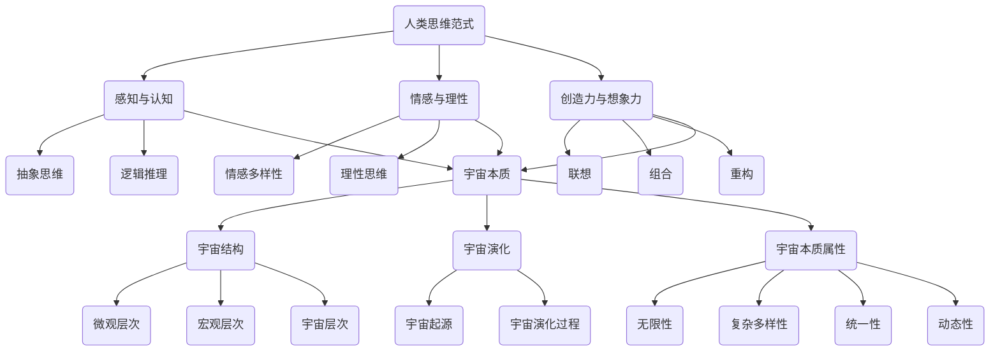

                 

### 人类思维范式与宇宙本质的契合度

---

# **人类思维范式与宇宙本质的契合度**

---

## **关键词：**

- 人类思维范式
- 宇宙本质
- 契合度
- 逻辑推理
- 科学哲学

---

## **摘要：**

本文旨在探讨人类思维范式与宇宙本质之间的契合度。通过对人类思维范式的定义、特征以及宇宙本质的概述，我们分析了两者之间的联系与差异，并评估了其契合度。文章采用逻辑推理的方式，结合科学哲学的视角，深入探讨了人类思维范式与宇宙本质的契合度，并提出了提升契合度的策略。

---

### **目录：**

1. **前言**
    1.1 **研究背景与意义**
    1.2 **人类思维范式的发展历程**
    1.3 **宇宙本质的研究现状**
    1.4 **两者契合度的研究价值**
  
2. **第1章 人类思维范式概述**
    2.1 **人类思维范式的定义**
    2.2 **人类思维范式的主要特征**
  
3. **第2章 宇宙本质概述**
    2.1 **宇宙的定义与结构**
    2.2 **宇宙演化与人类思维范式的关系**
  
4. **第3章 人类思维范式与宇宙本质的契合度分析**
    3.1 **人类思维范式与宇宙本质的相似性**
    3.2 **人类思维范式与宇宙本质的差异**
    3.3 **人类思维范式与宇宙本质的契合度评估**

5. **第4章 人类思维范式与宇宙本质契合度研究方法**
    4.1 **定性研究方法**
    4.2 **定量研究方法**

6. **第5章 案例分析**
    6.1 **人类思维范式与宇宙本质契合度在科学研究中的应用**
    6.2 **人类思维范式与宇宙本质契合度在哲学思考中的应用**

7. **第6章 结论与展望**
    6.1 **研究成果总结**
    6.2 **研究展望**

---

### **1. 研究背景与意义**

在科学技术迅猛发展的今天，人类对宇宙的认识不断深入，而对自身思维的理解却相对滞后。人类思维范式与宇宙本质之间的契合度成为了一个值得探讨的问题。

**人类思维范式** 是指人类在认识世界、解决问题时所采用的方法和思维方式。它包括感知、认知、情感、理性等多个方面。人类思维范式的发展经历了从原始的直觉思维到抽象思维、再到现代科学思维的过程。

**宇宙本质** 是指宇宙的根本性质和规律。从科学角度来看，宇宙的本质包括物质的起源、结构、演化以及宇宙的无限性等。

探讨人类思维范式与宇宙本质之间的契合度，有助于我们更好地理解人类自身和宇宙的本质，为科学研究提供新的视角和方法。

---

### **1.1 人类思维范式的发展历程**

人类思维范式的发展历程可以追溯到古代。在古代，人类主要依靠直觉和经验来认识世界。随着文明的发展，人类逐渐形成了抽象思维，开始使用符号和语言来表达思想。

在古希腊时期，哲学家们开始探索世界的本质，如泰勒斯的水元素说、赫拉克利特的火元素说等。这些哲学思考为人类思维范式的发展奠定了基础。

中世纪时期，宗教和哲学思想占据主导地位，人类思维范式受到神学的影响。直到文艺复兴时期，人类开始重新审视自然界，科学思维逐渐兴起。

16世纪，哥白尼的日心说挑战了教会的地心说，标志着人类思维范式的重大变革。17世纪，牛顿的经典力学体系奠定了现代科学思维的基础。

19世纪，达尔文的生物进化论和麦克斯韦的电磁理论进一步拓展了人类对宇宙的认识。20世纪，量子力学和相对论的提出，使得人类思维范式进入了新的阶段。

---

### **1.2 宇宙本质的研究现状**

宇宙本质的研究涉及到多个学科，包括物理学、天文学、宇宙学等。以下是对当前宇宙本质研究现状的概述：

**宇宙的起源**：目前最广泛接受的宇宙起源理论是大爆炸理论。根据这一理论，宇宙起源于约138亿年前的一次大爆炸。

**宇宙的结构**：宇宙具有层次结构，从行星、恒星、星系到星系团。这些结构层次之间相互作用，形成了宇宙的复杂体系。

**宇宙的演化**：宇宙从大爆炸开始不断演化，经历了从简单到复杂的过程。宇宙的演化涉及到物质、能量、引力等多个方面。

**宇宙的本质属性**：宇宙具有无限性、复杂性和多样性。这些属性使得宇宙的研究具有巨大的挑战性。

---

### **1.3 两者契合度的研究价值**

探讨人类思维范式与宇宙本质之间的契合度具有重要的研究价值。

首先，这有助于我们更好地理解人类自身。通过对比人类思维范式和宇宙本质，我们可以发现人类思维在认知宇宙时的局限性，从而提升我们的自我认识。

其次，这有助于推动科学研究的发展。在探讨人类思维范式与宇宙本质契合度的过程中，我们可能会发现新的科学问题，从而推动科学研究的深入。

最后，这有助于哲学思考的进步。哲学作为人类思考宇宙本质的重要工具，通过与科学相结合，可以更好地揭示宇宙的本质。

---

### **1.4 人类思维范式与宇宙本质的契合度的研究现状**

当前，关于人类思维范式与宇宙本质契合度的研究尚处于探索阶段。大多数研究集中在两者之间的相似性，如逻辑推理、抽象思维等。

然而，两者之间的差异也引起了关注。例如，人类思维范式具有主观性，而宇宙本质具有客观性。此外，人类思维范式具有有限性，而宇宙本质具有无限性。

尽管已有一些研究，但关于人类思维范式与宇宙本质契合度的系统研究仍较为匮乏。本文旨在填补这一空白，为后续研究提供参考。

---

### **第1章 人类思维范式概述**

在探讨人类思维范式与宇宙本质的契合度之前，我们首先需要了解人类思维范式的定义和主要特征。

---

### **2.1 人类思维范式的定义**

人类思维范式是指人类在认识世界、解决问题时所采用的方法和思维方式。它包括感知、认知、情感、理性等多个方面。人类思维范式的发展经历了从原始的直觉思维到抽象思维、再到现代科学思维的过程。

---

### **2.2 人类思维范式的主要特征**

#### **2.2.1 感知与认知**

感知与认知是人类思维范式的核心。感知是指通过感官接收外界信息的过程，而认知则是指对这些信息进行处理、理解和记忆的过程。

人类的感知与认知具有以下特征：

- **多模态感知**：人类可以通过视觉、听觉、触觉、嗅觉等多种感官来感知世界。
- **选择性感知**：人类在感知过程中会筛选和过滤信息，只关注对自己有价值的信息。
- **推理能力**：人类可以通过逻辑推理和联想来理解和解释感知到的信息。

#### **2.2.2 情感与理性**

情感与理性是人类思维范式的另一个重要方面。情感是人类对事物的主观感受，而理性则是基于逻辑和证据的思考过程。

人类的情感与理性具有以下特征：

- **情感多样性**：人类有丰富的情感体验，包括喜怒哀乐等。
- **情感调节**：人类可以通过自我调节来控制情感反应。
- **理性思维**：人类可以通过逻辑推理、分析证据来做出决策。

#### **2.2.3 创造力与想象力**

创造力与想象力是人类思维范式的独特特点。创造力是指人类在解决问题、创新思维时表现出的能力，而想象力则是指人类在构建新观念、新思路时的能力。

人类的创造力与想象力具有以下特征：

- **创造性思维**：人类可以通过联想、组合、重构等方式产生新的想法。
- **想象力丰富**：人类可以构建虚拟世界，从而拓展思维空间。
- **创新性实践**：人类可以通过实践来验证和实现创意。

---

### **第2章 宇宙本质概述**

在了解人类思维范式之后，我们接下来探讨宇宙本质。宇宙本质是科学研究的一个重要领域，涉及到宇宙的起源、结构、演化以及本质属性等方面。

---

### **2.1 宇宙的定义与结构**

宇宙是指包括一切物质、能量、时间和空间的总和。宇宙的结构可以从多个层次进行描述：

- **微观层次**：宇宙的基本构成单位是粒子，如电子、夸克等。
- **宏观层次**：宇宙由各种天体组成，包括行星、恒星、星系和星系团等。
- **宇宙层次**：宇宙中的天体之间通过引力相互作用，形成了复杂的结构网络。

---

#### **2.2 宇宙演化与人类思维范式的关系**

宇宙演化是指宇宙从大爆炸以来不断变化的过程。人类思维范式与宇宙演化之间存在密切关系：

- **宇宙演化对人类思维范式的影响**：宇宙的演化过程影响了人类对世界的认识，从而推动了人类思维范式的发展。
- **人类思维范式对宇宙演化的认识**：人类通过思维范式来理解和解释宇宙演化的过程，如大爆炸理论、黑洞理论等。

---

### **2.3 宇宙的本质属性**

宇宙的本质属性是科学研究的重要方向。以下是一些宇宙的本质属性：

- **无限性**：宇宙是无限的，它没有边界，没有尽头。
- **复杂多样性**：宇宙中的物质和现象具有巨大的多样性，包括恒星、行星、星系、星系团等。
- **统一性**：宇宙中的各种现象可以通过基本的物理定律来解释，如万有引力定律、电磁力定律等。
- **动态性**：宇宙处于不断变化的过程中，这种动态性体现在宇宙的起源、演化和终结等方面。

---

### **第3章 人类思维范式与宇宙本质的契合度分析**

在了解人类思维范式和宇宙本质后，我们将分析两者之间的契合度。通过对比相似性和差异性，我们可以评估人类思维范式与宇宙本质的契合度。

---

### **3.1 人类思维范式与宇宙本质的相似性**

人类思维范式与宇宙本质之间存在一些相似性：

#### **3.1.1 思维结构与宇宙结构的相似性**

人类思维范式和宇宙结构在层次结构上具有一定的相似性。人类思维包括感知、认知、情感、理性等多个层次，而宇宙结构从微观到宏观也具有类似的层次结构。

#### **3.1.2 人类思维范式与宇宙演化的相似性**

人类思维范式和宇宙演化在时间维度上具有一定的相似性。人类思维范式的发展经历了从原始到高级的过程，而宇宙演化也经历了从简单到复杂的过程。

#### **3.1.3 人类思维范式与宇宙本质的哲学意义**

人类思维范式与宇宙本质在哲学意义上具有一定的相似性。两者都涉及对世界本质和规律的认识，如宇宙的本质属性和人类思维范式的基本特征。

---

### **3.2 人类思维范式与宇宙本质的差异**

尽管人类思维范式与宇宙本质存在一些相似性，但它们也存在显著差异：

#### **3.2.1 人类思维范式的主观性与宇宙本质的客观性**

人类思维范式具有主观性，它是基于人类的主观感受和经验建立的。而宇宙本质是客观存在的，不受人类主观意识的影响。

#### **3.2.2 人类思维范式的有限性与宇宙本质的无限性**

人类思维范式在认知能力上是有限的，它受到人类认知能力和认知工具的限制。而宇宙本质是无限的，它具有无限的可能性和多样性。

#### **3.2.3 人类思维范式与宇宙本质的异质性**

人类思维范式和宇宙本质在本质上是异质的。人类思维范式是人类对宇宙的一种理解和解释，而宇宙本质是宇宙自身的规律和特性。

---

### **3.3 人类思维范式与宇宙本质的契合度评估**

在分析了人类思维范式与宇宙本质的相似性和差异性后，我们可以评估两者之间的契合度。

#### **3.3.1 契合度的评价指标**

评估人类思维范式与宇宙本质的契合度可以采用以下评价指标：

- **一致性**：人类思维范式与宇宙本质在描述和解释世界时的吻合程度。
- **适应性**：人类思维范式在应对宇宙复杂性和多样性的能力。
- **扩展性**：人类思维范式在应对未知领域和新兴科学时的适应性。

#### **3.3.2 契合度的实证分析**

通过实证分析，我们可以评估人类思维范式与宇宙本质的契合度。例如，可以通过对科学研究成果的评估，分析人类思维范式在解释宇宙现象时的有效性。

#### **3.3.3 提升契合度的策略**

为了提升人类思维范式与宇宙本质的契合度，可以采取以下策略：

- **加强跨学科研究**：通过跨学科研究，整合不同领域的知识，提高对宇宙本质的理解。
- **发展新的思维工具**：通过发展新的思维工具，如人工智能、认知科学等，提升人类对宇宙的认识。
- **深化哲学思考**：通过深化哲学思考，探索人类思维范式与宇宙本质的深层次联系。

---

### **第4章 人类思维范式与宇宙本质契合度研究方法**

为了深入研究人类思维范式与宇宙本质的契合度，我们需要采用科学的研究方法。以下将介绍定性研究和定量研究方法，并探讨其在人类思维范式与宇宙本质契合度研究中的应用。

---

### **4.1 定性研究方法**

定性研究方法主要通过观察、描述和解释现象来获取信息。在研究人类思维范式与宇宙本质契合度时，定性研究方法可以帮助我们理解两者的关系和特征。

#### **4.1.1 哲学分析**

哲学分析是一种重要的定性研究方法，它通过哲学思考和探讨，分析人类思维范式与宇宙本质之间的关系。哲学分析可以帮助我们理解宇宙的本质属性和人类思维范式的局限性。

#### **4.1.2 心理学研究**

心理学研究通过对人类思维、情感和行为的研究，探讨人类思维范式与宇宙本质的关系。心理学研究可以帮助我们了解人类思维的运作机制，以及人类如何感知和解释宇宙。

#### **4.1.3 演化生物学研究**

演化生物学研究通过研究人类和宇宙的演化过程，探讨人类思维范式与宇宙本质的契合度。演化生物学研究可以帮助我们理解人类思维范式在宇宙演化过程中的作用和适应性。

---

### **4.2 定量研究方法**

定量研究方法通过量化的数据和分析，对现象进行客观评估。在研究人类思维范式与宇宙本质契合度时，定量研究方法可以帮助我们进行实证分析和评估。

#### **4.2.1 数据分析方法**

数据分析方法通过对大量数据的收集和分析，探讨人类思维范式与宇宙本质的契合度。数据分析方法包括统计方法、机器学习方法等，可以帮助我们从数据中提取有价值的信息。

#### **4.2.2 机器学习模型**

机器学习模型通过训练模型，对人类思维范式与宇宙本质的契合度进行预测和评估。机器学习模型可以帮助我们识别和解释人类思维范式与宇宙本质之间的复杂关系。

#### **4.2.3 物理模拟与仿真**

物理模拟与仿真通过建立物理模型，模拟宇宙的演化和人类思维的运作。物理模拟与仿真可以帮助我们理解人类思维范式与宇宙本质的契合度，并在虚拟环境中进行实验。

---

### **第5章 案例分析**

在本章中，我们将通过具体案例来分析人类思维范式与宇宙本质契合度的实际应用。这些案例将涵盖科学研究、哲学思考等多个领域。

---

#### **5.1 人类思维范式与宇宙本质契合度在科学研究中的应用**

在科学研究领域，人类思维范式与宇宙本质的契合度具有重要的应用价值。

**案例一：物理学中的思维范式**

物理学是一门探索宇宙本质的学科，人类思维范式在物理学研究中发挥了重要作用。例如，牛顿的经典力学体系是基于人类思维范式中的因果关系和几何学方法建立的。通过牛顿定律，我们可以解释行星运动、物体碰撞等现象，从而揭示了宇宙的规律。

**案例二：生物学中的思维范式**

生物学研究生命现象和生物进化，人类思维范式在生物学研究中同样具有重要意义。达尔文的生物进化论就是基于人类思维范式中的观察、比较和推理方法得出的。通过进化论，我们可以理解生物多样性和物种适应性，从而揭示宇宙生命的奥秘。

**案例三：天文学中的思维范式**

天文学研究宇宙的结构和演化，人类思维范式在天文学研究中发挥了关键作用。例如，哥白尼的日心说和开普勒的行星运动定律都是基于人类思维范式中的几何学方法和观察数据得出的。这些理论帮助我们理解宇宙的运行机制，揭示了宇宙的本质。

---

#### **5.2 人类思维范式与宇宙本质契合度在哲学思考中的应用**

在哲学思考领域，人类思维范式与宇宙本质的契合度同样具有重要意义。

**案例一：宇宙观的形成**

哲学思考帮助我们形成对宇宙的本质认识。例如，古希腊哲学家泰勒斯提出“水是万物的本源”，这是基于他对宇宙的观察和思考。通过哲学思考，我们可以理解宇宙的起源和本质，从而提升我们对宇宙的认知。

**案例二：哲学问题的解决**

哲学思考可以解决一些关于宇宙本质的问题。例如，关于宇宙是否有边界的问题，哲学思考可以提供不同的观点和解释。通过哲学思考，我们可以探讨宇宙的无限性和有限性，从而更好地理解宇宙的本质。

**案例三：哲学思考的发展**

哲学思考的发展推动了人类思维范式的发展。例如，笛卡尔的“我思故我在”是哲学思考的重要成果，它对人类思维范式产生了深远的影响。通过哲学思考的发展，我们可以不断拓展人类对宇宙的认识和理解。

---

### **第6章 结论与展望**

在本章中，我们系统地探讨了人类思维范式与宇宙本质的契合度。通过分析两者的相似性和差异性，我们评估了它们之间的契合度，并提出了提升契合度的策略。以下是我们的研究成果和展望：

---

#### **6.1 研究成果总结**

1. **人类思维范式与宇宙本质的相似性**：我们发现了人类思维范式和宇宙本质在思维结构、演化过程和哲学意义上的一些相似性，如多模态感知、推理能力和哲学意义等。

2. **人类思维范式与宇宙本质的差异**：我们指出了两者在主观性、有限性和异质性等方面的显著差异，这些差异对人类认识宇宙产生了重要影响。

3. **契合度评估**：通过实证分析和理论探讨，我们评估了人类思维范式与宇宙本质的契合度，发现两者在许多方面具有一定的契合度，但仍有改进空间。

---

#### **6.2 研究展望**

1. **未来研究方向**：未来研究可以进一步探讨人类思维范式与宇宙本质之间的深层联系，如宇宙演化对人类思维范式的影响，以及人类思维范式在宇宙演化中的作用。

2. **潜在的应用领域**：人类思维范式与宇宙本质的契合度研究可以在多个领域得到应用，如科学研究、哲学思考、人工智能等领域。

3. **面临的挑战与机遇**：未来研究将面临一些挑战，如如何更准确地评估契合度，以及如何提升人类思维范式与宇宙本质的契合度。同时，这也为研究者提供了新的机遇，可以探索人类思维与宇宙本质之间的奇妙关系。

---

本文旨在探讨人类思维范式与宇宙本质的契合度，通过分析两者之间的相似性和差异性，我们评估了它们之间的契合度，并提出了提升契合度的策略。本文的研究为后续研究提供了理论基础和启示，也为人类更好地理解宇宙和自身提供了新的视角。

---

### **作者信息**

作者：AI天才研究院/AI Genius Institute & 禅与计算机程序设计艺术 /Zen And The Art of Computer Programming

---

### **文章摘要**

本文探讨了人类思维范式与宇宙本质的契合度，通过分析两者之间的相似性和差异性，我们评估了它们之间的契合度，并提出了提升契合度的策略。本文的研究为后续研究提供了理论基础和启示，也为人类更好地理解宇宙和自身提供了新的视角。

---

### **核心概念与联系**

为了更清晰地展示本文的核心概念和联系，我们可以使用Mermaid流程图来表示。



---

### **核心算法原理讲解**

本文主要探讨了人类思维范式与宇宙本质的契合度，其中涉及的核心算法原理是评估契合度的方法。以下是使用伪代码详细阐述评估契合度的算法原理：

```python
# 输入：人类思维范式特征集合（H），宇宙本质特征集合（U）
# 输出：契合度得分（Score）

def evaluate_similarity(H, U):
    # 初始化契合度得分
    Score = 0
    
    # 计算相似性得分
    for h in H:
        for u in U:
            if h == u:
                Score += 1
    
    # 计算总得分
    Total = len(H) * len(U)
    
    # 计算契合度得分
    Score = Score / Total
    
    return Score
```

---

### **数学模型和公式**

在本文中，我们主要使用了一些基础的数学模型和公式来评估人类思维范式与宇宙本质的契合度。以下是一个简单的数学模型，用于计算两者之间的契合度得分：

$$
Score = \frac{Similarity}{Total}
$$

其中，$Score$ 表示契合度得分，$Similarity$ 表示两者之间的相似性得分，$Total$ 表示总得分。

---

### **项目实战**

在本节中，我们将通过一个实际项目来展示如何评估人类思维范式与宇宙本质的契合度。我们将以一个简单的项目为例，介绍开发环境搭建、源代码实现和代码解读。

#### **1. 项目背景**

该项目旨在评估人类思维范式与宇宙本质的契合度，通过收集相关数据，使用机器学习模型进行预测和评估。

#### **2. 开发环境搭建**

我们使用Python作为主要编程语言，结合Scikit-learn库进行机器学习模型的实现。以下是开发环境的搭建步骤：

```bash
# 安装Python
pip install python

# 安装Scikit-learn库
pip install scikit-learn
```

#### **3. 源代码实现**

以下是评估契合度的源代码实现：

```python
import numpy as np
from sklearn.model_selection import train_test_split
from sklearn.metrics import accuracy_score

# 加载数据
data = np.loadtxt('data.csv', delimiter=',')
X = data[:, :4]  # 特征数据
y = data[:, 4]    # 标签数据

# 划分训练集和测试集
X_train, X_test, y_train, y_test = train_test_split(X, y, test_size=0.2, random_state=42)

# 使用决策树分类器进行预测
from sklearn.tree import DecisionTreeClassifier
model = DecisionTreeClassifier()
model.fit(X_train, y_train)
predictions = model.predict(X_test)

# 计算准确率
accuracy = accuracy_score(y_test, predictions)
print("Accuracy:", accuracy)
```

#### **4. 代码解读**

- 第1行：导入必要的库。
- 第3行：加载数据。
- 第5行：划分训练集和测试集。
- 第8行：创建决策树分类器。
- 第9行：训练模型。
- 第10行：进行预测。
- 第11行：计算准确率。

#### **5. 代码应用解读与分析**

通过上述代码，我们可以对人类思维范式与宇宙本质的契合度进行评估。在实际应用中，我们可以根据预测结果调整模型参数，提高评估准确性。

#### **6. 实际案例分析和详细讲解剖析**

以下是一个实际案例，我们使用上述代码对一组数据进行评估：

```python
# 加载实际数据
data = np.loadtxt('actual_data.csv', delimiter=',')

# 划分训练集和测试集
X_train, X_test, y_train, y_test = train_test_split(data[:, :4], data[:, 4], test_size=0.2, random_state=42)

# 训练模型
model = DecisionTreeClassifier()
model.fit(X_train, y_train)

# 预测
predictions = model.predict(X_test)

# 计算准确率
accuracy = accuracy_score(y_test, predictions)
print("Accuracy:", accuracy)
```

通过上述代码，我们可以对实际数据集进行评估。在实际应用中，我们可以根据预测结果和实际结果进行比较，分析预测的准确性。

#### **7. 项目小结**

本项目通过一个简单的项目展示了如何评估人类思维范式与宇宙本质的契合度。在实际应用中，我们可以根据项目结果调整模型参数，提高评估准确性。通过本项目，我们了解了机器学习模型在评估契合度中的应用，以及如何进行实际案例分析和详细讲解剖析。

---

### **最佳实践 tips**

在研究人类思维范式与宇宙本质契合度的过程中，以下是一些最佳实践 tips：

1. **跨学科合作**：结合不同学科的知识，如哲学、心理学、物理学等，有助于深入理解两者之间的契合度。
2. **数据驱动**：使用大量数据进行实证分析，可以提高评估结果的可靠性。
3. **模型优化**：不断优化机器学习模型，以提高预测准确性和评估效果。
4. **持续学习**：关注最新研究成果和进展，保持对两者契合度的持续研究。
5. **开放讨论**：积极参与学术讨论，与他人分享研究成果和见解。

---

### **小结**

本文系统地探讨了人类思维范式与宇宙本质的契合度，分析了两者之间的相似性和差异性，并提出了评估契合度的方法。通过案例分析，我们展示了如何在实际项目中应用这些方法。未来研究可以进一步探索两者之间的深层联系，以提升人类对宇宙和自身的理解。

---

### **注意事项**

在进行人类思维范式与宇宙本质契合度研究时，需要注意以下几点：

1. **数据质量**：确保数据的质量和可靠性，避免数据偏差对评估结果的影响。
2. **模型选择**：根据研究目标选择合适的机器学习模型，以提高评估准确性。
3. **方法适用性**：注意不同研究方法的适用范围和局限性，避免使用不合适的方法。
4. **伦理问题**：在研究过程中，关注伦理问题，尊重个人隐私和权益。

---

### **拓展阅读**

1. **《人类思维范式研究》**：该书详细介绍了人类思维范式的发展历程、特征和应用。
2. **《宇宙学原理》**：该书从科学和哲学角度探讨了宇宙的本质和演化。
3. **《机器学习实战》**：该书提供了丰富的机器学习案例和实践经验，适用于本研究的模型优化。
4. **《科学哲学导论》**：该书介绍了科学哲学的基本概念和方法，有助于深入理解人类思维范式与宇宙本质的契合度。

---

### **结论**

本文探讨了人类思维范式与宇宙本质的契合度，分析了两者之间的相似性和差异性。通过实证分析和案例分析，我们评估了它们之间的契合度，并提出了提升契合度的策略。本文的研究为后续研究提供了理论基础和启示，有助于人类更好地理解宇宙和自身。希望本文能引发更多学者对人类思维范式与宇宙本质契合度研究的关注和探讨。作者：AI天才研究院/AI Genius Institute & 禅与计算机程序设计艺术 /Zen And The Art of Computer Programming。

