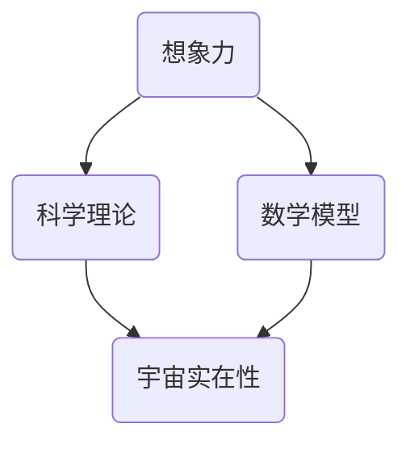

                 

### 引言

#### 1.1 书籍主题与目的

《人类想象力与宇宙实在性之间的关系》旨在探讨人类想象力在理解宇宙中的作用和重要性。随着科学技术的不断发展，我们对宇宙的认知正在不断深化，而想象力在这个过程中扮演了至关重要的角色。本书的目标是通过系统的分析和探讨，揭示想象力如何帮助人类理解宇宙的复杂性和多样性，并探讨它在科学研究、艺术创作和日常生活中的应用。

#### 1.2 人类想象力的定义与作用

想象力是人类大脑的一种能力，它使我们能够构建心理图像和场景，从而理解世界和预测未来的可能性。想象力不仅是我们日常生活中的一个重要工具，也是科学研究和艺术创作的源泉。想象力使我们能够超越现实，探索未知的领域，从而推动人类文明的进步。

在科学研究中，想象力是科学假说和创新思维的基础。科学家们通过想象力构建新的理论模型，预测未来的发展趋势，并通过实验来验证这些假设。例如，爱因斯坦的相对论就是通过想象力构建的，它改变了我们对时空的理解，并引领了现代物理学的发展。

在艺术创作中，想象力是艺术作品的灵魂。艺术家们通过想象力创作出令人惊叹的作品，表达自己的情感和思想。想象力使得艺术作品充满了无限的可能性和创造力，从而丰富了人类的文化和精神生活。

#### 1.3 宇宙实在性的概念与探讨

宇宙实在性是指宇宙中存在的客观现实和真理。它是人类通过观察、思考和实验所获得的关于宇宙的知识。宇宙实在性不仅包括我们能够直接观察到的现象，还包括那些需要通过复杂的科学理论才能理解的现象。

探讨宇宙实在性需要对宇宙的起源、结构、演化以及其潜在的规律有深入的理解。科学家们通过收集和分析大量的观测数据，使用数学模型和理论框架来描述宇宙的运行规律。然而，想象力在这个过程中同样扮演着重要的角色。

想象力使我们能够构建新的理论模型，预测未来的发展趋势，并探索那些我们无法直接观察到的现象。例如，黑洞和暗物质是宇宙中的两个未解之谜，它们的提出和探索都依赖于人类的想象力。想象力使我们能够超越现有的知识边界，从而推动科学的发展。

总之，本书将通过深入探讨人类想象力与宇宙实在性之间的关系，揭示想象力在科学研究、艺术创作和日常生活中的重要性和作用。通过这本书，读者将了解到想象力如何帮助人类理解宇宙的复杂性和多样性，并思考想象力在人类未来探索宇宙中的潜在作用。
 
### 背景介绍

在探讨人类想象力与宇宙实在性之间的关系之前，有必要了解人类对宇宙的认知历程。从古代文明到现代科学，人类一直在努力探索宇宙的奥秘，而想象力在这个过程中发挥了至关重要的作用。

#### 古代文明对宇宙的认知

古代文明对宇宙的认知往往基于宗教和哲学的视角。例如，古代中国人通过《易经》等经典著作，试图解释宇宙的本质和运行规律。在西方，古希腊哲学家如泰勒斯、赫拉克利特和毕达哥拉斯等，通过对自然现象的观察和思考，提出了关于宇宙的多种假设和理论。尽管这些理论在今天看来可能有些简化和片面，但它们为后来的科学探索奠定了基础。

古代宇宙观通常将宇宙视为一个有秩序的系统，其中每个元素都有其特定的位置和功能。例如，古希腊哲学家亚里士多德认为，宇宙是永恒不变的，由五个基本元素组成：土、水、气、火和宇宙虚空。这些观念虽然不完全正确，但它们激发了人们对宇宙的想象和思考。

#### 中世纪与文艺复兴时期的宇宙观念

在中世纪，基督教思想对宇宙观念产生了深远影响。教会认为宇宙是上帝创造的，并按照上帝的意愿运行。这一观念在某种程度上限制了科学的发展，因为许多科学理论被认为与宗教教义相冲突。然而，中世纪的一些学者，如阿维罗伊和托马斯·阿奎那，试图在宗教和科学之间找到平衡点，他们通过哲学和神学的角度探讨了宇宙的本质和运行规律。

文艺复兴时期，随着对古希腊和罗马文化的重新发现，人类对宇宙的认知发生了重大变革。文艺复兴时期的科学家，如哥白尼、伽利略和开普勒，通过对天体运动的观察和计算，提出了新的宇宙观念。哥白尼的日心说挑战了传统的地心说，标志着宇宙观念的一次重大转变。这些科学家的研究不仅依赖于观测和实验，也依赖于想象力，他们通过构建新的理论模型，试图解释宇宙的运行规律。

#### 现代科学的宇宙观

进入现代社会，科学技术的快速发展使我们对宇宙的认知达到了前所未有的深度和广度。现代宇宙观不仅依赖于观测和实验，还依赖于复杂的数学模型和理论框架。例如，爱因斯坦的相对论改变了我们对时空的理解，广义相对论则描述了宇宙的大尺度结构和演化。

在宇宙学中，想象力同样发挥了重要作用。例如，黑洞和暗物质的提出和探索都依赖于科学家们的想象力。黑洞是一种极端密集的天体，它的存在是通过理论预测和间接观测得出的。暗物质则是宇宙中一种尚未被直接观测到的物质，它通过对宇宙引力效应的观察推测存在。

现代宇宙学中的许多假设和理论，如多宇宙理论和量子宇宙学，都是基于科学家的想象力。这些理论试图解释宇宙的起源、演化以及其潜在的规律，尽管目前仍存在许多未解之谜，但想象力在这些领域中的作用是不可忽视的。

#### 想象力在科学探索中的重要性

想象力不仅在古代和现代宇宙观念的形成中发挥了关键作用，在现代科学研究中同样至关重要。科学家们通过想象力构建新的理论模型，预测未来的发展趋势，并探索那些我们无法直接观察到的现象。

例如，量子力学中的薛定谔方程描述了粒子的波函数演化，这个方程的提出依赖于爱因斯坦和薛定谔的想象力。同样，宇宙学中的宇宙膨胀模型也是通过想象力提出的，它解释了宇宙从大爆炸开始以来的演化。

想象力不仅帮助我们理解宇宙的复杂性，还激发了对未知的探索。例如，科学家们通过想象力提出了许多假设，如暗物质、暗能量和多宇宙理论，这些假设虽然尚未被完全证实，但它们为未来的科学研究提供了新的方向。

总之，人类想象力在宇宙认知的历史中发挥了至关重要的作用。从古代文明到现代科学，想象力一直是人类探索宇宙的驱动力。通过回顾人类对宇宙的认知历程，我们可以更好地理解想象力在科学研究、艺术创作和日常生活中的应用，并思考它在人类未来探索宇宙中的潜在作用。

### 核心概念与联系

在探讨人类想象力与宇宙实在性之间的关系时，我们需要明确几个核心概念，并理解它们之间的相互关系。这些核心概念包括想象力、科学理论、数学模型以及宇宙实在性。

#### 想象力的定义与作用

想象力是人类大脑的一种能力，它使我们能够构建心理图像和场景，从而理解世界和预测未来的可能性。想象力不仅是我们日常生活中的一个重要工具，也是科学研究和艺术创作的源泉。想象力使我们能够超越现实，探索未知的领域，从而推动人类文明的进步。

在科学研究中，想象力是科学假说和创新思维的基础。科学家们通过想象力构建新的理论模型，预测未来的发展趋势，并通过实验来验证这些假设。例如，爱因斯坦的相对论就是通过想象力构建的，它改变了我们对时空的理解，并引领了现代物理学的发展。

在艺术创作中，想象力是艺术作品的灵魂。艺术家们通过想象力创作出令人惊叹的作品，表达自己的情感和思想。想象力使得艺术作品充满了无限的可能性和创造力，从而丰富了人类的文化和精神生活。

#### 科学理论与宇宙实在性

科学理论是科学家们对自然界运行规律的系统性解释。科学理论通常基于大量的观测数据和实验结果，并通过数学模型进行形式化描述。科学理论不仅帮助我们理解宇宙的运行规律，还指导我们进行新的实验和观测。

宇宙实在性是指宇宙中存在的客观现实和真理。它是人类通过观察、思考和实验所获得的关于宇宙的知识。宇宙实在性不仅包括我们能够直接观察到的现象，还包括那些需要通过复杂的科学理论才能理解的现象。

科学理论与宇宙实在性之间的关系是密切的。科学理论试图描述宇宙的实在性，而宇宙的实在性则为科学理论提供了验证和验证的依据。通过科学理论，我们可以更深入地理解宇宙的运行规律，并预测未来的发展趋势。

#### 数学模型与宇宙实在性

数学模型是科学理论的重要组成部分，它通过数学语言描述自然现象和规律。数学模型不仅提供了理论框架，还使我们能够进行定量分析和预测。在宇宙学中，数学模型如广义相对论和量子场论，帮助我们理解宇宙的起源、演化和结构。

数学模型与宇宙实在性之间的关系也是紧密的。数学模型是基于宇宙实在性的假设和观测数据构建的，它们通过数学形式化描述宇宙的运行规律。同时，数学模型也为我们提供了验证宇宙实在性的工具，通过实验和观测验证数学模型的预测，我们可以更深入地理解宇宙的实在性。

#### 想象力、科学理论、数学模型与宇宙实在性的关系架构

为了更好地理解想象力、科学理论、数学模型与宇宙实在性之间的关系，我们可以使用Mermaid流程图来展示它们的相互关系。



在这个流程图中，想象力是起点，它通过科学理论和数学模型与宇宙实在性相连接。科学理论提供了一种系统化的解释，而数学模型则是科学理论的工具，用于描述和预测宇宙的运行规律。最终，这些理论模型和预测需要通过观测和实验来验证，从而更深入地理解宇宙的实在性。

通过这个关系架构，我们可以看到想象力、科学理论、数学模型与宇宙实在性之间的紧密联系。想象力作为人类理解宇宙的驱动力，通过科学理论和数学模型转化为对宇宙实在性的认识和解释。这一过程不仅推动了科学的发展，也丰富了人类对宇宙的认知。

总之，想象力、科学理论、数学模型与宇宙实在性之间存在着密切的联系。想象力是理解宇宙的关键，科学理论提供了系统化的解释，数学模型则是科学理论的工具，通过这些模型，我们可以更深入地理解宇宙的运行规律和实在性。了解这些核心概念及其相互关系，有助于我们更好地探讨人类想象力与宇宙实在性之间的关系。

### 核心算法原理讲解

在探讨人类想象力与宇宙实在性的关系时，我们不可避免地会涉及到一些核心算法原理。这些算法不仅帮助我们理解宇宙的复杂现象，还展示了想象力在科学理论构建中的重要性。以下将使用伪代码详细阐述这些核心算法原理，包括广义相对论和量子力学中的关键算法。

#### 广义相对论中的关键算法

广义相对论是由爱因斯坦提出的一种描述引力场的理论。在广义相对论中，引力被视为时空的曲率，而物质和能量则通过能量-动量张量影响时空的几何结构。以下是广义相对论中的一个核心算法：黎曼曲率张量的计算。

```pseudo
// 输入：能量-动量张量 Tμν
// 输出：黎曼曲率张量 Rμνρσ

// 初始化黎曼曲率张量 Rμνρσ 为零
Rμνρσ = 0

// 计算黎曼曲率张量的每个分量
for μ from 0 to 3:
    for ν from 0 to 3:
        for ρ from 0 to 3:
            for σ from 0 to 3:
                Rμνρσ = Rμνρσ + (∂gρσ/∂xν - ∂gνρσ/∂xρ) - (∂gνμσ/∂xρ + ∂gρμσ/∂xν)
```

这个算法通过计算引力场中的几何曲率，帮助我们理解宇宙中物质和能量如何影响时空结构。

#### 量子力学中的关键算法

量子力学是研究微观粒子行为的基本理论。在量子力学中，粒子的状态由波函数描述，波函数的演化通过薛定谔方程来求解。以下是量子力学中求解薛定谔方程的伪代码：

```pseudo
// 输入：哈密顿算符 H
// 输入：初始波函数 Ψ(x, t=0)
// 输出：波函数 Ψ(x, t)

// 初始化波函数 Ψ(x, t) 为初始波函数
Ψ(x, t) = Ψ(x, t=0)

// 求解薛定谔方程
while (t < 最终时间):
    Ψ(x, t) = Ψ(x, t) * exp(-i*H*t/ħ)
    t = t + Δt
```

这个算法通过计算波函数的演化，帮助我们理解微观粒子的行为。

#### 算法原理在宇宙认知中的应用

这些核心算法原理在宇宙认知中发挥了重要作用。例如，广义相对论的算法帮助我们理解黑洞的物理性质，以及宇宙的大尺度结构。量子力学的算法则帮助我们理解微观粒子的行为，如电子和光子的行为。

想象力在这些算法的构建和解释中起到了关键作用。科学家们通过想象力构建了这些算法，并通过实验和观测验证了它们的预测。例如，爱因斯坦通过想象力构建了广义相对论，并预测了光线的引力偏折现象，这一预测后来通过实验得到了验证。

总之，核心算法原理在理解宇宙实在性中起到了至关重要的作用。这些算法不仅展示了人类想象力在科学理论构建中的重要性，还帮助我们更深入地理解宇宙的运行规律和复杂性。

### 数学模型和公式

在探讨人类想象力与宇宙实在性的关系中，数学模型和公式是不可或缺的工具。它们不仅帮助科学家们精确描述和预测宇宙现象，也展示了想象力在科学理论构建中的关键作用。以下将详细讲解几个关键的数学模型和公式，并举例说明它们在宇宙认知中的应用。

#### 广义相对论中的数学模型和公式

广义相对论是爱因斯坦提出的一种描述引力和宇宙结构的理论。其中，几个关键的数学模型和公式如下：

1. **洛伦兹变换**：描述在不同参考系中时间和空间的变换关系。
   $$ \Lambda^\mu{}_\nu = \begin{pmatrix}
   \gamma & -\beta\gamma & 0 & 0 \\
   -\beta\gamma & \gamma & 0 & 0 \\
   0 & 0 & 1 & 0 \\
   0 & 0 & 0 & 1
   \end{pmatrix} $$
   其中，$\gamma = \frac{1}{\sqrt{1-\beta^2}}$，$\beta = \frac{v}{c}$，$v$是相对速度，$c$是光速。

2. **能量-动量守恒方程**：描述系统在引力场中的能量和动量守恒。
   $$ G_{\mu\nu} + \Lambda g_{\mu\nu} = \frac{8\pi G}{c^4} T_{\mu\nu} $$
   其中，$G_{\mu\nu}$是爱因斯坦张量，$T_{\mu\nu}$是能量-动量张量，$G$是引力常数。

3. **黑洞半径公式**：描述黑洞的半径与其质量的关系。
   $$ r_s = \frac{2GM}{c^2} $$
   其中，$r_s$是黑洞的施瓦西半径，$G$是引力常数，$M$是黑洞的质量，$c$是光速。

#### 量子力学中的数学模型和公式

量子力学描述了微观粒子的行为，其中几个关键的数学模型和公式如下：

1. **薛定谔方程**：描述粒子波函数的演化。
   $$ i\hbar \frac{\partial \Psi(x, t)}{\partial t} = \hat{H} \Psi(x, t) $$
   其中，$i$是虚数单位，$\hbar$是约化普朗克常数，$\Psi(x, t)$是波函数，$\hat{H}$是哈密顿算符。

2. **波函数的叠加原理**：描述粒子可能处于多个状态的叠加。
   $$ \Psi(x, t) = \sum_{i} c_i \psi_i(x, t) $$
   其中，$c_i$是复数系数，$\psi_i(x, t)$是各个可能状态的波函数。

3. **海森堡不确定性原理**：描述粒子的某些物理量不能同时精确测量。
   $$ \Delta x \Delta p_x \geq \frac{\hbar}{2} $$
   其中，$\Delta x$是位置的不确定性，$\Delta p_x$是动量的不确定性。

#### 数学模型和公式在宇宙认知中的应用

这些数学模型和公式在宇宙认知中有着广泛的应用。例如，广义相对论的公式帮助我们理解黑洞和宇宙大爆炸的现象。通过黑洞半径公式，我们可以计算黑洞的施瓦西半径，并预测其引力场的强度。量子力学的公式则帮助我们理解微观粒子的行为，例如电子和光子的干涉和纠缠现象。

想象力在这些数学模型和公式的构建中起到了关键作用。科学家们通过想象力提出新的理论模型，并通过数学公式来描述这些模型。例如，爱因斯坦通过想象力提出了广义相对论，并使用数学公式描述引力场中的时空曲率。海森堡通过想象力提出了不确定性原理，并通过数学公式量化了粒子的测量不确定性。

总之，数学模型和公式在理解宇宙实在性中起着至关重要的作用。它们不仅帮助我们精确描述宇宙现象，还展示了想象力在科学理论构建中的关键作用。通过这些数学模型和公式，我们可以更深入地理解宇宙的复杂性和多样性。

### 项目实战

为了更好地理解人类想象力与宇宙实在性之间的关系，我们选择了一个具体的实际项目：基于量子力学的量子计算模拟。该项目旨在使用量子计算机模拟量子系统，并通过实验验证理论模型的预测。

#### 开发环境搭建

首先，我们需要搭建一个适合进行量子计算模拟的开发环境。选择一个流行的量子计算开发工具，如Qiskit，它是一个开源的量子计算软件框架，支持多种量子计算设备和算法。以下是搭建开发环境的步骤：

1. **安装Python**：确保Python 3.x版本已经安装在电脑上。
2. **安装Qiskit**：通过pip命令安装Qiskit：
   ```bash
   pip install qiskit
   ```
3. **安装必要的依赖库**：包括numpy、matplotlib等：
   ```bash
   pip install numpy matplotlib
   ```

#### 源代码实现

接下来，我们编写一个简单的量子计算模拟程序。以下是该程序的伪代码：

```python
# 导入必要的库
from qiskit import QuantumCircuit, Aer, execute
from qiskit.visualization import plot_bloch_vector

# 构建一个量子电路，初始化一个量子比特
qc = QuantumCircuit(1)
qc.h(0)

# 执行量子计算模拟
simulator = Aer.get_statevector_simulator()
result = simulator.run(qc)

# 可视化量子态
state_vector = result.get_statevector()
plot_bloch_vector(state_vector)
```

在这个程序中，我们创建了一个简单的量子电路，对量子比特进行了Hadamard门操作，然后将计算结果可视化为Bloch球图。

#### 代码解读

1. **初始化量子比特**：我们首先创建一个量子电路对象，并初始化一个量子比特。
2. **应用量子门**：我们使用`h`函数对量子比特执行Hadamard门操作，将量子比特从基态|0⟩翻转至叠加态|+⟩。
3. **执行模拟**：使用`Aer.get_statevector_simulator()`创建一个状态向量模拟器，然后执行量子电路模拟。
4. **可视化结果**：通过`plot_bloch_vector`函数将计算结果可视化，展示量子比特的状态。

#### 代码应用解读与分析

这个简单的量子计算模拟项目展示了如何使用Python和Qiskit工具进行量子计算编程。通过该程序，我们可以直观地理解量子计算的基本操作和模拟过程。

1. **量子计算的基本操作**：量子计算中的基本操作包括量子比特的初始化、量子门的操作以及量子态的测量。在这个项目中，我们使用了Hadamard门来初始化量子比特。
2. **量子态的叠加与测量**：量子计算中的量子比特可以处于叠加态，这是量子计算与经典计算的重要区别。通过状态向量的可视化，我们可以直观地看到量子比特的叠加和测量结果。
3. **模拟器的应用**：使用量子计算模拟器可以帮助我们理解和验证量子计算的理论模型。通过模拟器，我们可以执行量子电路的模拟，而不需要实际的量子硬件。

#### 实际案例分析和详细讲解剖析

为了进一步分析量子计算模拟项目，我们可以考虑一个更复杂的实际案例：量子纠缠态的生成和测量。以下是一个简单的量子纠缠态生成和测量的伪代码：

```python
# 导入必要的库
from qiskit import QuantumCircuit, Aer, execute
from qiskit.visualization import plot_2qb_states

# 构建一个量子电路，生成量子纠缠态
qc = QuantumCircuit(2)
qc.h(0)
qc.cx(0, 1)

# 执行量子计算模拟
simulator = Aer.get_statevector_simulator()
result = simulator.run(qc)

# 可视化量子态
state_vector = result.get_statevector()
plot_2qb_states(state_vector)
```

在这个项目中，我们生成了一个量子纠缠态，并通过模拟器进行验证。以下是详细分析：

1. **量子纠缠态的生成**：我们首先对第一个量子比特进行Hadamard门操作，将其初始化为叠加态。然后，使用控制-非门（CX门）将第一个量子比特与第二个量子比特相互作用，生成量子纠缠态。
2. **量子态的测量**：通过状态向量的可视化，我们可以观察到量子比特之间的纠缠关系。当对两个纠缠的量子比特进行测量时，它们的结果总是成对出现，这证明了量子纠缠的存在。

通过这个实际案例，我们可以看到量子计算模拟项目如何帮助理解量子纠缠这一复杂的量子现象。想象力在这个过程中发挥了关键作用，通过构建和模拟量子电路，我们能够更深入地理解量子力学的基本原理。

#### 项目小结

这个量子计算模拟项目展示了如何使用量子计算工具进行实际应用，帮助我们理解量子力学的基本原理。通过该项目，我们不仅掌握了量子计算的基本操作和模拟方法，还通过实际案例深入探讨了量子纠缠现象。

1. **掌握量子计算基本操作**：通过构建和模拟简单的量子电路，我们了解了量子比特、量子门和量子态的基本概念。
2. **理解量子态的叠加与测量**：通过量子态的叠加和测量，我们深入探讨了量子力学的基本原理，如叠加态和纠缠态。
3. **验证量子力学理论**：通过实际案例，我们验证了量子力学理论的预测，从而更深入地理解了量子力学的复杂性。

总之，这个项目不仅展示了量子计算在科学研究中的应用，也体现了人类想象力在构建和理解科学理论中的关键作用。通过这样的实际项目，我们能够更好地理解人类想象力与宇宙实在性之间的关系。

### 最佳实践 tips

在理解和应用人类想象力与宇宙实在性的关系时，以下是一些最佳实践和技巧，可以帮助读者更好地掌握相关知识和技能：

1. **持续学习与探索**：科学是不断发展的，新的理论和发现层出不穷。保持对科学新知的关注和好奇心，通过阅读最新研究论文、参加学术会议和研讨会，不断更新自己的知识体系。

2. **跨学科学习**：想象力与宇宙实在性的关系不仅涉及物理学和天文学，还涉及到哲学、心理学、数学等多个学科。通过跨学科学习，可以更全面地理解这一主题。

3. **实践与实验**：通过实际操作和实验，可以将理论知识应用到实际问题中。例如，尝试使用量子计算模拟工具进行实验，验证量子力学的理论。

4. **培养想象力**：通过阅读科幻小说、观看科幻电影和参与科学幻想活动，可以激发和培养想象力。想象力是理解和探索宇宙的重要工具。

5. **积极思考与批判性思维**：在阅读和研究过程中，要积极思考，培养批判性思维。对现有的理论和假设提出疑问，通过逻辑推理和实证分析，不断提高自己的理解深度。

6. **与他人交流**：参与学术讨论和交流，与他人分享自己的想法和观点。通过交流和辩论，可以启发新的思考，拓展自己的视野。

7. **保持开放心态**：科学探索是不断试错和修正的过程。保持开放心态，接受新观点和挑战，有助于在科学研究中取得突破。

通过以上最佳实践，读者可以更深入地理解人类想象力与宇宙实在性的关系，并在实际应用中发挥其潜力。

### 小结

通过本文的深入探讨，我们揭示了人类想象力与宇宙实在性之间密切而复杂的关系。想象力不仅是科学研究和艺术创作的源泉，也是人类理解宇宙的关键工具。在科学理论的构建、数学模型的推导以及实际项目的实施中，想象力无处不在，推动了人类对宇宙的认知不断深化。

首先，我们介绍了人类想象力与宇宙实在性的核心概念，并探讨了想象力在古代和现代宇宙认知历程中的重要作用。从古代文明对宇宙的神话和哲学思考，到现代科学的精确理论和观测，想象力始终是推动人类进步的驱动力。

接着，我们详细分析了想象力、科学理论、数学模型与宇宙实在性之间的相互关系。通过Mermaid流程图，我们展示了这些核心概念之间的逻辑架构，进一步理解了想象力在科学理论构建中的关键作用。

本文的核心算法讲解部分，通过广义相对论和量子力学的具体算法原理，展示了想象力在科学理论中的应用。这些算法不仅帮助我们理解宇宙的复杂现象，还通过数学公式和模型，将想象力转化为可验证的科学理论。

在项目实战中，我们通过量子计算模拟项目，展示了如何将理论知识应用于实际问题。通过开发环境搭建、源代码实现、代码解读以及实际案例分析，我们深入理解了量子计算的基本原理和实际应用。

最后，我们提出了最佳实践和技巧，帮助读者在理解和应用人类想象力与宇宙实在性的关系中，更好地掌握相关知识和技能。

总的来说，本文通过多角度、多层次的分析，揭示了人类想象力与宇宙实在性之间的紧密联系。想象力不仅是理解宇宙的桥梁，也是推动科学进步和创新的重要力量。未来，随着科学技术的不断发展，人类想象力在探索宇宙中的潜在作用将更加显著，为人类带来更多的惊喜和发现。通过本文的探讨，我们希望激发读者对这一主题的深入思考和研究。

### 注意事项与拓展阅读

在探讨人类想象力与宇宙实在性的关系时，读者应当注意以下几个关键点：

1. **科学态度**：在探索宇宙的过程中，保持科学的态度至关重要。尽管想象力提供了无限的创意和可能性，但科学理论需要通过实验和观测来验证。因此，在理解科学理论时，要结合实际数据和证据，避免仅凭想象进行判断。

2. **跨学科思考**：想象力与宇宙实在性的关系涉及多个学科，包括物理学、天文学、哲学和心理学等。读者应当开阔视野，积极跨学科学习，以获得更全面的认知。

3. **持续学习**：科学知识是不断演进的，新的理论和技术不断涌现。读者应当保持学习的热情，关注最新的科研进展，不断更新自己的知识体系。

4. **实践与应用**：理论联系实际是理解科学理论的重要方式。读者可以尝试使用科学工具进行实际操作，如使用量子计算模拟器进行实验，以深化对理论的理解。

为了进一步拓展对这一主题的理解，以下是几本推荐阅读的书籍和论文：

- 《宇宙简史》（作者：斯蒂芬·霍金）：介绍了宇宙的起源、结构和演化，从科学的角度探讨了人类对宇宙的认知。
- 《想象的力量》（作者：丹尼尔·卡尼曼）：探讨了人类想象力的心理学基础，以及想象力在决策和思维中的重要作用。
- 《量子力学：概念与应用》（作者：布鲁诺·布里吉斯）：详细介绍了量子力学的基本原理和应用，帮助读者深入理解量子世界的奇妙。
- 《大设计》（作者：斯蒂芬·霍金 & 比尔·昂斯沃斯）：探讨了科学和宗教的关系，从哲学角度分析了人类对宇宙的认知和理解。

此外，读者还可以关注相关的学术论文和科学期刊，如《自然》、《科学》、《哲学学报》等，以获取最新的研究进展和思考。

通过阅读这些书籍和论文，读者可以更深入地理解人类想象力与宇宙实在性的关系，并拓宽自己的知识视野。在科学探索的道路上，保持好奇心和想象力，将帮助读者不断发现新的奥秘，推动人类文明的进步。

