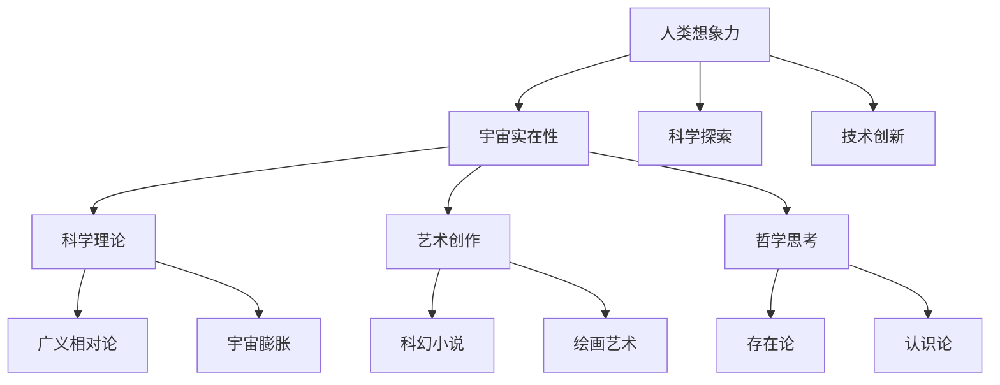

                 


### 1.2 研究背景

在探讨人类想象力与宇宙实在性的关系之前，我们首先需要了解这两者的背景。想象力和宇宙实在性是两个看似截然不同的概念，但它们在人类认知和探索过程中扮演着重要角色。

#### 想象力的起源和发展

想象力是人类的一种基本认知能力，早在史前时代，人类就已经开始利用想象力来解释自然现象和预测未来。考古学家在旧石器时代的遗址中发现了大量的壁画和雕刻，这些作品展示了早期人类对自然界的想象和理解。随着时间的推移，想象力逐渐成为人类文化和社会发展的重要驱动力。

在中世纪，想象力被视为一种神圣的礼物，是神赐予人类的独特能力。文艺复兴时期，人们开始重视个人经验和直接观察，想象力成为艺术创作和科学探索的重要工具。到了现代，心理学和认知科学的研究进一步揭示了想象力在人类认知和行为中的重要作用。

#### 宇宙实在性的概念

宇宙实在性是指宇宙中存在的客观事实和规律，它是科学研究的对象。宇宙实在性的概念起源于古代哲学和宗教，随着科学的发展，人们对宇宙的认识逐渐从神秘和信仰转向理性和实证。

在现代物理学中，宇宙实在性主要通过宇宙学、天文学和粒子物理学等学科来研究。宇宙学致力于研究宇宙的起源、演化和结构，天文学通过观测和研究天体来探索宇宙的奥秘，粒子物理学则试图理解宇宙最基本的构成和相互作用。

#### 想象力与宇宙实在性的关联

想象力和宇宙实在性之间的联系可以从多个角度来理解。首先，想象力是人类探索宇宙的重要工具。科学家和天文学家通过想象力来构建理论模型，预测和解释宇宙中的现象。例如，爱因斯坦的相对论就是基于他的想象力，通过数学模型来描述宇宙的时空结构。

其次，宇宙实在性对人类想象力产生了深刻影响。宇宙的广阔和复杂激发了人类的想象力，促使人类创造出各种关于宇宙的神话、艺术和科学理论。例如，古代人类通过想象力构建了宇宙的中心和边缘的概念，而现代科学则通过观测和实验来验证这些概念的正确性。

最后，人类想象力与宇宙实在性的互动关系也是值得探讨的话题。人类想象力在探索宇宙的过程中不断推动科学进步，而宇宙实在性的发现又进一步激发了人类的想象力。这种互动关系形成了一个不断演进的循环，使得人类对宇宙的认识越来越深入。

### 1.3 研究问题

本研究旨在探讨以下核心问题：

1. **想象力在宇宙探索中的角色是什么？**想象力作为人类的一种认知能力，如何在宇宙探索中发挥作用？它是如何影响科学家和天文学家的理论构建和观测实践的？
   
2. **宇宙实在性如何影响人类想象力？**宇宙中的客观事实和规律是如何塑造人类对宇宙的认知和想象的？宇宙中的新发现如何激发人类的想象力？

3. **人类想象力与宇宙实在性的互动关系如何解释？**人类想象力与宇宙实在性之间的相互作用是如何形成的？这种关系如何影响人类对宇宙的理解和探索？

通过回答这些问题，本研究希望为理解人类想象力与宇宙实在性的关系提供一个新的视角，同时为未来的研究提供参考。

### 1.4 研究方法

本研究将采用多种方法来探讨人类想象力与宇宙实在性的关系：

1. **文献综述**：通过分析现有的学术文献，了解前人对想象力、宇宙实在性及其相互关系的探讨。

2. **案例研究**：选择具有代表性的案例，如著名的科学家和天文学家的研究，分析他们如何利用想象力进行宇宙探索。

3. **实证研究**：设计实验，研究人类想象力与宇宙实在性之间的相互作用。

4. **理论模型构建**：通过构建理论模型，探讨想象力与宇宙实在性之间的内在联系。

### 1.5 本文结构

本文结构如下：

- **第一部分：引论**：介绍研究背景、研究问题和研究方法。
- **第二部分：核心概念与联系**：详细探讨人类想象力和宇宙实在性的概念及其关系。
- **第三部分：人类想象力与宇宙实在性的互动关系**：分析想象力在宇宙探索中的应用和宇宙实在性对人类想象力的影响。
- **第四部分：案例分析**：通过具体案例展示人类想象力与宇宙实在性之间的关系。
- **第五部分：结论**：总结研究结果，并提出未来研究方向。

---

通过上述步骤，我们明确了研究背景、核心问题和研究方法，为后续章节的深入探讨奠定了基础。在接下来的部分，我们将详细探讨人类想象力和宇宙实在性的核心概念及其联系，为理解两者之间的关系提供理论框架。

## 2. 人类想象力概述

### 2.1 想象力的定义

想象力是指人类在没有直接感知的情况下，通过思维构建和创造图像、场景和概念的能力。它是一种复杂的认知过程，涉及到多个大脑区域的活动。想象力不仅仅是创造虚构的情境，还包括对现实世界的理解和解释。例如，科学家通过想象力构建理论模型，艺术家通过想象力创作艺术作品，这些都是想象力在现实生活中的具体应用。

### 2.2 人类想象力的起源与发展

人类的想象力可以追溯到史前时代。考古学家在旧石器时代的遗址中发现了大量的壁画和雕刻，这些作品展示了早期人类对自然界的想象和理解。随着时间的推移，想象力逐渐成为人类文化和社会发展的重要驱动力。在中世纪，想象力被视为一种神圣的礼物，是神赐予人类的独特能力。文艺复兴时期，人们开始重视个人经验和直接观察，想象力成为艺术创作和科学探索的重要工具。在现代，心理学和认知科学的研究进一步揭示了想象力在人类认知和行为中的重要作用。

#### 人类想象力的发展历程

1. **史前时代**：早期人类通过想象力来理解和解释自然现象，如天气、地震等。他们通过壁画和雕刻来表达自己的想象，这些作品反映了他们对自然界的理解。

2. **古代文明**：古代文明时期，想象力在宗教和神话中扮演了重要角色。人们通过想象力构建了各种神灵和神话故事，来解释世界的起源和运行。

3. **中世纪**：在中世纪，想象力被视为一种神圣的礼物，被认为是神赐予人类的。许多宗教艺术作品和文学作品都是基于想象力创作的，如圣经故事和史诗。

4. **文艺复兴时期**：文艺复兴时期，人们开始重视个人经验和直接观察，想象力成为艺术创作和科学探索的重要工具。达芬奇、莎士比亚等艺术家和科学家都是通过想象力进行创作的。

5. **现代**：在现代，心理学和认知科学的研究揭示了想象力在人类认知和行为中的重要作用。研究表明，想象力能够增强记忆、提高创造力和解决问题的能力。

### 2.3 想象力在人类生活中的作用

想象力在人类生活中扮演了多种角色，包括艺术创作、科学探索、决策制定和社交互动等方面。

#### 艺术创作

想象力是艺术创作的核心。艺术家通过想象力来创造新的艺术作品，表达内心的情感和思想。例如，画家通过想象力创作出美丽的画作，音乐家通过想象力创作出动人的音乐。想象力使得艺术作品具有独特性和创造性，推动了艺术的发展。

#### 科学探索

想象力在科学探索中起到了至关重要的作用。科学家通过想象力构建理论模型，预测和解释自然现象。例如，爱因斯坦通过想象力提出了相对论，描述了时空的弯曲和引力。想象力使得科学家能够超越现实，探索未知的世界。

#### 决策制定

想象力在决策制定中也非常重要。通过想象力，人们可以预测未来可能发生的情况，并制定相应的策略。例如，企业家通过想象力预测市场需求，制定商业计划。想象力使得决策更具前瞻性和创造性。

#### 社交互动

想象力在社交互动中也发挥着重要作用。人们通过想象力来理解和预测他人的行为和情感。例如，在与他人交流时，我们通过想象力来理解对方的意图和感受。想象力使得社交互动更加丰富和有意义。

### 2.4 人类想象力的关键特征

1. **创造性**：想象力能够创造出新的概念、想法和图像，这种创造性是想象力最重要的特征之一。艺术家和科学家都依赖于他们的想象力来创造出新的作品和理论。

2. **开放性**：想象力具有开放性，能够超越现实的限制，探索未知的领域。这种开放性使得想象力在科学探索和艺术创作中具有重要作用。

3. **灵活性**：想象力是灵活的，能够根据不同的情境和需求进行适应。例如，在解决复杂问题时，想象力能够帮助我们找到新的解决方案。

4. **普遍性**：想象力是人类普遍具备的能力，不分年龄、性别和文化背景。这使得想象力在人类社会中具有普遍性和重要性。

### 2.5 人类想象力的重要性

想象力是人类认知和创造力的重要来源，它对于人类的发展和进步具有深远的影响。以下是想象力的重要性的几个方面：

1. **推动科学进步**：想象力是科学发现和理论构建的重要工具。科学家通过想象力来构建新的理论模型，预测和解释自然现象。

2. **促进艺术创作**：想象力是艺术创作的核心，艺术家通过想象力来创造新的艺术作品，表达内心的情感和思想。

3. **提高决策能力**：想象力能够帮助人们预测未来可能发生的情况，制定更有效的策略，提高决策能力。

4. **丰富人类生活**：想象力使得人类的生活更加丰富和有意义。通过想象力，人们能够体验不同的情境和情感，享受艺术的乐趣。

总之，想象力是人类认知和创造力的重要来源，它对于人类的发展和进步具有深远的影响。在接下来的章节中，我们将进一步探讨宇宙实在性的概念，以及人类想象力与宇宙实在性之间的关系。

### 2.6 人类想象力的科学基础

科学研究表明，想象力不仅仅是心理活动，它有着深厚的生物学和神经科学基础。理解这些基础有助于我们更好地认识到想象力在人类认知功能中的重要性。

#### 大脑区域与想象力

想象力涉及多个大脑区域的活动，包括：

1. **前额叶皮层**：前额叶皮层与高级认知功能相关，包括规划、决策和想象力。研究表明，前额叶皮层的活动与想象力的产生密切相关。

2. **颞叶**：颞叶与记忆和语言处理有关，也在想象力中起到关键作用。当人们回忆过去的经历或想象未来事件时，颞叶的特定区域会被激活。

3. **顶叶**：顶叶与空间感知和视觉处理有关，参与想象空间场景和构建视觉图像。

4. **杏仁核**：杏仁核与情绪处理有关，想象力的活动也会涉及杏仁核的参与，尤其是在想象情绪体验时。

#### 想象力与神经可塑性

神经可塑性是指大脑结构和功能在学习和经验积累过程中的可塑性变化。想象力与神经可塑性密切相关：

1. **经验依赖**：想象力是一种经验依赖的能力，通过不断的训练和练习，可以增强大脑网络的活动，提高想象力的质量。

2. **突触可塑性**：研究表明，想象力活动可以增加神经元之间的连接强度，从而增强神经可塑性。

3. **脑网络重组**：通过想象力的训练，大脑网络可以重组和优化，提高思维灵活性和创造力。

#### 想象力与认知功能

想象力在认知功能中扮演着重要角色：

1. **问题解决**：想象力可以帮助人们探索多种可能的解决方案，提高问题解决能力。

2. **记忆增强**：通过想象力，人们可以创造图像和故事来增强记忆，这种方法在教育和学习中被广泛应用。

3. **情绪调节**：想象力可以帮助人们想象积极的情境，从而改善情绪状态，缓解压力和焦虑。

4. **创造力**：想象力是创造力的关键，它使得人们能够创造出新颖的想法和作品。

总之，人类想象力有着深厚的科学基础，涉及多个大脑区域和认知功能。理解这些基础有助于我们更好地利用想象力，推动个人和社会的发展。在接下来的章节中，我们将进一步探讨宇宙实在性的概念，以及人类想象力与宇宙实在性之间的关系。

### 2.7 想象力的心理学解释

心理学研究表明，想象力是一种复杂的认知过程，涉及到多个心理机制和认知功能的交互作用。理解这些机制有助于我们更深入地认识想象力的本质和作用。

#### 想象力的心理机制

1. **图像思维**：想象力主要依赖于图像思维，即通过心理表象来构建和操作图像。研究表明，大脑中的视觉皮层在想象力过程中起到关键作用，人们可以通过想象来产生视觉图像。

2. **情境模拟**：想象力能够模拟不同的情境，帮助人们在头脑中预演未来的事件或解决当前的问题。这种情境模拟能力是人类适应复杂环境和做出明智决策的重要基础。

3. **记忆重组**：想象力能够重组和重新解释记忆内容，创造出新的故事和情境。这种记忆重组能力有助于人们在回忆过去事件时，能够从不同角度理解和学习。

#### 想象力的认知功能

1. **问题解决**：想象力在问题解决中发挥着重要作用。通过想象不同的解决方案，人们可以探索可能的路径，并评估这些路径的有效性。

2. **创造力**：想象力是创造力的核心，它使得人们能够产生新颖的想法和创意。艺术家、科学家和创业家都依赖于想象力来创造出前所未有的作品和发明。

3. **情绪调节**：想象力可以帮助人们调节情绪，缓解压力和焦虑。例如，通过想象积极的情境，人们可以提高情绪状态，增强心理韧性。

4. **学习**：想象力在学习和记忆过程中也起到关键作用。通过想象具体的情境和图像，人们可以增强对知识的理解和记忆。

#### 想象力的心理理论

1. **情境理解**：心理学中的情境理解理论认为，想象力使得人们能够理解他人行为背后的意图和情感。通过想象力，人们可以模拟他人的心理状态，从而更好地理解和预测他人的行为。

2. **自我反思**：想象力还帮助人们进行自我反思，评估自己的行为和决策。通过想象不同的未来情境，人们可以更好地认识到自己的优点和不足，从而进行自我改进。

总之，心理学研究揭示了想象力作为一种复杂的认知过程，涉及到图像思维、情境模拟和记忆重组等机制，并在问题解决、创造力、情绪调节和学习等认知功能中发挥着重要作用。理解这些心理机制有助于我们更好地发挥想象力，推动个人和社会的发展。

### 2.8 想象力在科学发现和探索中的关键角色

想象力在科学发现和探索中扮演着至关重要的角色，它是科学家们突破传统思维，发现新理论和技术的关键驱动力。以下是几个具体例子，展示了想象力在科学领域的重要应用：

#### 爱因斯坦的相对论

爱因斯坦的相对论是20世纪最重要的科学理论之一，其诞生离不开爱因斯坦的想象力。在1905年，爱因斯坦提出了狭义相对论，这一理论挑战了牛顿力学的传统观念，提出了时间和空间的相对性。爱因斯坦通过想象力，设想了一种“同时的相对性”的悖论，即在不同惯性参考系中，两个事件的同时性可能是不同的。这一想象促使他提出了著名的洛伦兹变换公式，从而奠定了相对论的基础。

#### 法布里斯-彭加勒和量子力学

法国数学家和物理学家彭加勒在19世纪末提出了“量子假说”，这一假说预见了能量的量子化。彭加勒通过想象力，设想了一种粒子在振动时，能量是以离散的“量子”形式释放的。这一想象促使了量子力学的诞生，并在后来的科学研究中得到了验证。

#### 卡尔·弗里德里希·高登与原子模型

卡尔·弗里德里希·高登是一位在19世纪末和20世纪初的物理学家，他提出了原子的行星模型。高登通过想象力，设想原子中的电子像行星一样围绕原子核运动，这一模型为后来的量子力学和原子物理学奠定了基础。

#### 保罗·狄拉克与反物质

物理学家保罗·狄拉克在1930年代提出了反物质的构想。狄拉克通过想象力，设想了一种与电子具有相同质量但电荷相反的粒子。他的理论预言了反物质的存在，这一想象力最终得到了实验的验证，并为后来的粒子物理学研究开辟了新的领域。

#### 玛丽·斯凯勒和原子晶体结构

玛丽·斯凯勒是一位在20世纪初的化学家，她通过想象力提出了原子晶体的结构模型。斯凯勒设想了原子在晶体中以规则排列的方式，这一想象力帮助她解释了晶体中的物理性质和化学反应。

这些例子展示了想象力在科学发现和探索中的关键作用。想象力不仅帮助科学家们构思和预测新的理论和现象，还促使他们设计实验和验证假设。没有想象力，许多重要的科学发现和突破可能就无法实现。因此，想象力是科学进步和创新的核心驱动力，它推动了人类对自然界的不断探索和理解。

### 2.9 人类想象力与艺术创作的紧密联系

想象力不仅在科学探索中扮演着关键角色，在艺术创作中也同样不可或缺。艺术创作是一个复杂的认知过程，依赖于艺术家的想象力来创造新颖、独特且富有表现力的作品。以下是想象力在艺术创作中的几个方面：

#### 1. 艺术家与想象力的互动

艺术家通过想象力来捕捉和表达内心的情感、思想和体验。想象力使得艺术家能够在头脑中构建出抽象的图像和情境，这些图像和情境随后通过艺术作品传达给观众。例如，画家通过想象力创造新的色彩搭配和构图，音乐家通过想象力创作出前所未有的旋律和节奏。

#### 2. 想象力在绘画中的表现

在绘画中，想象力可以帮助艺术家创造独特的视觉体验。印象派画家如莫奈和德加，通过想象力捕捉光线和色彩的变化，创造出了极具表现力的作品。例如，莫奈的《睡莲》系列作品通过细腻的色彩和光线描绘，展现了自然景色的瞬息万变。

#### 3. 想象力在文学创作中的运用

文学创作中，想象力是作家构建故事世界和人物形象的关键。例如，J.K.罗琳在创作《哈利·波特》系列时，通过丰富的想象力创造了哈利和他的朋友们在一个充满魔法和奇幻元素的世界中成长的故事。这些想象力驱动的作品不仅吸引了广大读者，还激发了无数人对奇幻世界的探索欲望。

#### 4. 想象力在音乐创作中的作用

音乐创作依赖于作曲家的想象力来创造新颖的旋律和和声。例如，贝多芬在创作《第九交响曲》时，通过想象力创作出了宏伟的乐章和深刻的情感表达，这首交响曲至今仍然是音乐史上最伟大的作品之一。

#### 5. 想象力在舞蹈和表演艺术中的重要性

舞蹈和表演艺术同样依赖于艺术家的想象力。舞者通过想象力来构建动作和舞步，表达情感和故事。例如，现代舞先驱玛丽·兰伯特通过想象力，创造出了极具表现力的舞蹈语言，丰富了舞蹈艺术的表现形式。

#### 6. 想象力与艺术创新

想象力在艺术创新中起到了至关重要的作用。艺术家通过想象力挑战传统的艺术形式和观念，创造出全新的艺术风格和作品。例如，达达主义和超现实主义艺术运动都是通过想象力突破传统的艺术限制，为现代艺术注入了新的活力。

总之，想象力在艺术创作中扮演着至关重要的角色。它不仅帮助艺术家捕捉和表达内心的情感和体验，还推动了艺术的创新和发展。通过想象力，艺术家能够创造出新颖、独特且富有表现力的作品，为人类的文化宝库增添了无尽的价值。

## 3. 宇宙实在性概述

### 3.1 宇宙实在性的定义

宇宙实在性是指宇宙中存在的客观事实和规律，它是科学研究的重要对象。宇宙实在性不仅包括可见的物质和能量，还包括暗物质、暗能量等无法直接观测但通过物理现象间接证实的成分。宇宙实在性涉及宇宙的起源、演化、结构、动力学等多个方面，是理解宇宙本质和运行机制的关键。

### 3.2 宇宙的起源与发展

宇宙的起源是宇宙实在性的一个核心问题。现代宇宙学普遍接受的观点是大爆炸理论，这一理论认为宇宙起源于大约138亿年前的一个极度高温、高密度的奇点。在大爆炸之后，宇宙迅速膨胀，温度和密度逐渐降低，形成了我们今天观测到的宇宙结构。

宇宙的演化过程可以分为几个主要阶段：

1. **宇宙早期**：在大爆炸后的几分钟内，宇宙处于一个极热、极密的等离子体状态。随着宇宙的膨胀，温度逐渐降低，原子核开始形成。

2. **原子形成**：在大爆炸后的几分钟到几小时内，宇宙的温度降低到足够低，使质子和电子能够结合形成中性原子。

3. **星系和恒星的形成**：在大爆炸后的几亿年内，宇宙中的物质开始聚集形成星系和恒星。星系是由大量恒星、行星、恒星间物质和暗物质组成的巨大结构。

4. **宇宙背景辐射**：在大爆炸后的数百万年内，宇宙中的光子（辐射粒子）开始自由传播，形成了宇宙背景辐射，这是宇宙早期状态的“余晖”。

### 3.3 宇宙实在性的研究方法和工具

研究宇宙实在性需要多种科学方法和工具，这些方法和工具帮助我们更好地理解宇宙的结构和演化。

#### 观测方法

1. **光学观测**：通过望远镜观测恒星、星系和其他天体，我们可以获取它们的光谱、亮度和其他物理特性。

2. **射电观测**：射电望远镜可以探测到宇宙中的无线电波，这些波携带着关于宇宙早期状态的信息。

3. **红外观测**：红外望远镜可以探测到宇宙中的红外辐射，这些辐射来自于尘埃和暗物质。

4. **X射线和伽马射线观测**：X射线和伽马射线望远镜可以探测到高能辐射，这些辐射来自于宇宙中的极端天体事件。

#### 理论方法

1. **广义相对论**：广义相对论是描述宇宙引力和时空结构的理论，它为理解宇宙的演化提供了重要的框架。

2. **宇宙学模型**：宇宙学模型是基于广义相对论和宇宙学原理（即宇宙是均匀且各向同性的）构建的理论，用来描述宇宙的起源、演化和结构。

3. **数值模拟**：通过计算机模拟，科学家可以模拟宇宙的演化过程，预测宇宙中的各种现象。

#### 宇宙探测器

1. **旅行者探测器**：旅行者探测器是一系列星际探测器，它们探测了太阳系外的空间，为我们提供了关于星际介质和行星系统的信息。

2. **火星探测器**：火星探测器研究了这颗红色星球的地表、大气和地质结构，帮助人类了解类地行星的演化过程。

3. **宇宙背景探测器**：如COBE（宇宙背景探测器）和WMAP（威尔金森微波各向异性探测器），这些探测器测量了宇宙背景辐射的温度和偏振，提供了关于宇宙早期状态的重要数据。

### 3.4 宇宙实在性的研究进展

宇宙实在性的研究在过去几十年取得了显著的进展：

1. **宇宙膨胀加速**：1998年，科学家通过观测远距离超新星，发现宇宙的膨胀速度在加快。这一发现揭示了宇宙中存在一种神秘的力——暗能量，它推动宇宙加速膨胀。

2. **暗物质**：暗物质是宇宙中一种不发光、不吸收光的物质，其存在通过引力效应被证实。科学家通过观测星系旋转曲线和宇宙微波背景辐射，发现了大量暗物质的存在。

3. **宇宙大尺度结构**：通过大型地面和空间望远镜的观测，科学家发现了宇宙中的星系团和超星系团，这些结构揭示了宇宙的宏大尺度。

4. **宇宙起源**：通过对宇宙微波背景辐射的研究，科学家对宇宙的起源和早期状态有了更深入的了解。宇宙微波背景辐射携带了宇宙大爆炸时的信息，为我们提供了研究宇宙起源的重要线索。

总之，宇宙实在性研究在过去的几十年里取得了显著的进展，为我们揭示了宇宙的起源、演化和结构。这些研究不仅加深了我们对宇宙的理解，也推动了科学技术的进步。

### 3.5 宇宙实在性对人类想象力的启发

宇宙实在性的研究不仅扩展了人类的科学知识，也对人类想象力产生了深远的影响。宇宙的广阔和复杂激发了人类的想象力，推动了人类在艺术、科学和哲学领域的发展。以下是宇宙实在性对人类想象力的一些具体启发：

#### 1. 科幻文学的创作

科幻文学是一种通过想象探索未来和未知世界的文学形式。宇宙的起源、演化以及人类在宇宙中的角色是科幻作家常用的主题。例如，克拉克的《2001太空漫游》通过想象力描述了人类与宇宙的关系，探讨了人类文明在宇宙中的命运。

#### 2. 艺术创作的灵感

宇宙的美丽景象和深奥哲理为艺术家提供了丰富的创作灵感。天文学家观测到的星系、星云和黑洞等天体，成为许多艺术家创作的素材。例如，安迪·沃霍尔的《金宝罐头》系列作品，通过重复和夸张的手法，展现了宇宙中的无穷和重复。

#### 3. 科学理论的构建

科学家通过想象力构建新的理论模型，以解释宇宙中的现象。爱因斯坦的广义相对论就是一个例子，他通过想象力设想了时空的弯曲和引力波的存在，这些理论为现代物理学的发展奠定了基础。

#### 4. 哲学思考

宇宙实在性的研究引发了人类对生命意义、存在本质等哲学问题的思考。例如，哲学家海德格尔的《存在与时间》探讨了人类存在的意义，宇宙的无限和人类的有限性之间的关系。

总之，宇宙实在性的研究激发了人类的想象力，推动了人类在多个领域的发展。通过想象力，人类能够超越现实，探索未知的宇宙，这既是科学探索的动力，也是艺术创作的源泉。

### 3.6 宇宙实在性对人类认知的影响

宇宙实在性对人类认知的影响是多方面的，它不仅改变了我们对宇宙的理解，也深刻影响了我们的思维方式和认知结构。以下是宇宙实在性对人类认知的几个重要方面：

#### 1. 宇宙的无限与人类的有限

宇宙的广阔和无限性使得人类认识到自身的有限性。从宇宙的角度来看，人类只是宇宙中微不足道的一部分。这种认知促使人类思考自己的存在意义和人类在宇宙中的位置。例如，哲学家康德在他的《纯粹理性批判》中探讨了人类认知的局限性，提出了人类只能理解现象界，而无法达到绝对的真理。

#### 2. 科学思维的发展

宇宙实在性的研究推动了科学思维的发展。科学家通过提出假设、设计实验和进行观测，逐步构建了对宇宙的认识。这种科学思维方法不仅适用于宇宙学研究，也渗透到其他科学领域。例如，牛顿通过观察天体运动，提出了万有引力定律，这一理论在物理学和天文学中具有重要意义。

#### 3. 想象力的激发

宇宙的神秘和美丽激发了人类的想象力。通过想象力，人类能够构建新的理论和模型，探索宇宙的奥秘。例如，科幻作家刘慈欣在《三体》系列小说中，通过丰富的想象力，描绘了人类与外星文明的互动，引发了读者对宇宙和人类未来的思考。

#### 4. 伦理和哲学思考

宇宙实在性的研究引发了人类对伦理和哲学问题的思考。例如，随着对宇宙的探索，人类开始思考宇宙中的道德责任和生态伦理。哲学家泰德·阿德勒在《宇宙伦理学》中探讨了人类在宇宙中的伦理责任，提出了人类应该保护宇宙生态的道德观点。

#### 5. 人类价值观的变革

宇宙的广阔和复杂性使得人类认识到自己的价值观可能只是宇宙中的一小部分。这种认知促使人类反思传统价值观，探索新的价值观体系。例如，现代人类在追求科技发展的同时，也开始关注可持续发展、环境保护等全球性问题。

总之，宇宙实在性对人类认知的影响是深远的。它不仅改变了我们对宇宙的理解，也推动了科学思维的发展，激发了人类的想象力，引发了伦理和哲学思考，并促使人类价值观的变革。通过这些影响，宇宙实在性为人类提供了新的认知视角和思维方式，推动了人类文明的进步。

### 3.7 人类想象力与宇宙实在性之间的关系

人类想象力与宇宙实在性之间的关系是复杂且多维的，两者相互作用，共同塑造了人类的认知和探索过程。以下从多个角度分析这两者之间的内在联系：

#### 1. 探索宇宙的驱动力

想象力是探索宇宙的重要驱动力。科学家和天文学家通过想象力来构建新的理论模型，预测和解释宇宙中的现象。例如，爱因斯坦通过想象力提出了广义相对论，揭示了时空弯曲和引力波的存在。这种想象力驱动的探索不仅推动了科学的进步，也加深了人类对宇宙的理解。

#### 2. 创造新理论和模型

宇宙实在性提供了丰富的素材和问题，激发人类想象力创造新的理论和模型。例如，宇宙大爆炸理论是通过对宇宙早期状态的想象和观测数据相结合而提出的。这种想象力与宇宙实在性的结合，推动了科学理论的不断发展和完善。

#### 3. 想象力与观测的互动

想象力和观测是相互促进的。人类通过想象力构建理论模型，指导观测和实验，从而验证和修正这些模型。例如，天文学家通过观测宇宙背景辐射，验证了宇宙大爆炸理论的正确性。这一过程展示了想象力与观测之间的紧密互动。

#### 4. 想象力在理解和解释宇宙中的作用

想象力在理解和解释宇宙现象中起到关键作用。人类通过想象力构建图像和模型，将复杂的宇宙现象转化为可理解和解释的形式。例如，科学家通过想象力将黑洞描述为强大的引力场，这种描述有助于我们理解黑洞的本质和特性。

#### 5. 想象力与宇宙美学的联系

宇宙的美丽景象和深奥哲理激发了人类的想象力，推动了宇宙美学的发展。例如，科幻作家和艺术家通过想象力，创作出描绘宇宙景象的作品，这些作品不仅丰富了人类的文化，也加深了人们对宇宙的理解。

#### 6. 想象力与人类认知的关系

想象力是认知的重要工具，它帮助人类理解和解释宇宙。通过想象力，人类能够超越现实，探索未知的领域。例如，哲学家通过想象力探讨宇宙的本质和人类的存在意义，这些思考促进了人类对宇宙的认知。

#### 7. 宇宙实在性对想象力的影响

宇宙实在性对人类想象力产生了深远的影响。宇宙的广阔和复杂性激发了人类的想象力，促使人类不断探索和创造。例如，人类对宇宙的想象不仅体现在科学理论中，也体现在艺术作品中，这些作品展示了人类对宇宙的深刻理解和想象。

总之，人类想象力与宇宙实在性之间存在紧密的内在联系。想象力驱动了宇宙探索和理论构建，宇宙实在性为想象力提供了素材和问题，两者相互促进，共同推动了人类认知的进步。这种互动关系不仅丰富了人类对宇宙的理解，也推动了科学和艺术的发展。

## 4. 人类想象力与宇宙实在性的关系

### 4.1 想象力对宇宙实在性的探索

想象力在宇宙探索中起到了至关重要的作用，它是人类理解和解释宇宙现象的重要工具。首先，想象力帮助科学家构建理论模型，这些模型用于描述宇宙的起源、演化和结构。例如，爱因斯坦的广义相对论就是通过想象力构建的，这一理论成功地解释了引力现象，并预测了黑洞的存在。广义相对论中的时空弯曲概念是爱因斯坦通过想象力设想出来的，这一设想为后来的天文观测和实验验证提供了理论基础。

其次，想象力在探索宇宙未知领域中也发挥了关键作用。例如，在20世纪60年代，科学家们通过想象力提出了宇宙微波背景辐射的理论，这一理论预言了宇宙早期状态的残余辐射。后来，COBE（宇宙背景探测器）和WMAP（威尔金森微波各向异性探测器）的观测结果证实了这一理论的正确性。这种想象力驱动的理论探索不仅扩展了人类对宇宙的认识，也为科学技术的进步提供了新的方向。

此外，想象力还帮助人类设计了各种宇宙探测器，如旅行者探测器、火星探测器等。这些探测器通过直接观测宇宙，获取了关于宇宙的宝贵数据。例如，旅行者探测器在穿越太阳系的过程中，观测到了太阳系外的星际介质，这些数据有助于我们理解宇宙的起源和演化。这些探测器的成功离不开科学家的想象力，他们通过想象力设想了探测器的功能和技术，并不断改进和优化探测方案。

总之，想象力在宇宙探索中起到了不可或缺的作用。它帮助科学家构建理论模型，探索未知领域，设计宇宙探测器，这些过程共同推动了人类对宇宙的理解和探索。没有想象力，宇宙探索将面临巨大的挑战，许多重要的科学发现和突破可能无法实现。

### 4.2 宇宙实在性对人类想象力的影响

宇宙实在性对人类想象力产生了深远的影响，这种影响主要体现在以下几个方面：

首先，宇宙的广阔和复杂性激发了人类的想象力。宇宙中的星系、星云、黑洞等天体现象具有极高的美学价值和科学意义，它们激发了人类对宇宙的无限好奇和探索欲望。例如，星系的旋转和星云的膨胀过程，这些现象不仅挑战了人类的认知极限，也激发了科学家的想象力，促使他们提出新的理论和模型来解释这些现象。这种激发作用不仅推动了科学的发展，也丰富了人类的艺术创作。

其次，宇宙实在性为人类想象力提供了丰富的素材和灵感。例如，科幻作家和艺术家通过对宇宙的观察和研究，创作出了许多描绘宇宙的奇妙故事和作品。这些作品不仅展示了人类对宇宙的想象，也反映了宇宙实在性对人类思维方式和价值观念的影响。例如，N.K.杰麦辛的《安迪密恩》系列小说，通过想象描绘了人类在宇宙中的冒险和探索，这些作品引发了读者对宇宙和人类未来的思考。

此外，宇宙实在性对人类想象力的塑造还体现在科学理论的构建中。科学家通过想象力构建的理论模型，不仅解释了宇宙中的现象，也推动了科学技术的进步。例如，爱因斯坦通过想象力提出了广义相对论，这一理论成功地解释了引力现象，并预测了黑洞的存在。这种想象力驱动的理论探索，不仅深化了人类对宇宙的理解，也为科学的发展提供了新的方向。

最后，宇宙实在性对人类想象力的塑造还体现在人类对宇宙的探索行为中。随着宇宙探测技术的发展，人类对宇宙的探索越来越深入，这些探索行为不仅扩展了人类的认知边界，也激发了新的想象。例如，旅行者探测器在穿越太阳系的过程中，发现了许多新的天体和现象，这些发现激发了人类对宇宙的进一步探索欲望。

总之，宇宙实在性对人类想象力产生了深远的影响，它激发了人类的想象力和探索欲望，为艺术创作和科学理论提供了丰富的素材和灵感。通过这种影响，宇宙实在性不仅丰富了人类的认知世界，也推动了人类文化和科学的进步。

### 4.3 想象力与宇宙实在性的互动关系

想象力与宇宙实在性的互动关系是一个复杂且动态的过程，两者相互作用，共同塑造了人类对宇宙的理解和认知。以下是想象力与宇宙实在性互动关系的几个关键方面：

首先，想象力驱动了对宇宙实在性的探索。人类通过想象力构建理论模型，预测和解释宇宙现象。例如，爱因斯坦通过想象力提出了广义相对论，这一理论成功解释了引力现象，并预测了黑洞的存在。这种想象力驱动的理论探索，不仅推动了科学的发展，也为人类对宇宙的理解提供了新的视角。

其次，宇宙实在性为想象力提供了素材和挑战。宇宙的广阔和复杂性激发了人类的想象力，使得科学家能够提出新的理论和假设。例如，宇宙微波背景辐射的发现，激发了人类对宇宙早期状态的想象，促使科学家提出了关于宇宙起源和演化的新理论。

第三，想象力与宇宙实在性的互动关系体现在科学实验和观测中。科学家通过实验和观测验证理论模型的正确性，这一过程需要强大的想象力。例如，旅行者探测器在太阳系外的观测，验证了科学家们对星际介质的想象和理论预测。这种互动关系不仅推动了科学技术的进步，也加深了人类对宇宙的理解。

第四，想象力与宇宙实在性的互动关系还体现在艺术创作中。科幻作家和艺术家通过想象力，描绘了人类在宇宙中的冒险和探索，这些作品不仅展示了人类对宇宙的想象，也反映了宇宙实在性对人类思维方式和价值观念的影响。

最后，想象力与宇宙实在性的互动关系是一个不断演进的循环。科学发现和理论进步激发了新的想象力，而这些想象力又推动了新的科学探索。例如，人类对黑洞的想象和理论探索，不仅深化了对宇宙的理解，也推动了天文学和物理学的发展。

总之，想象力与宇宙实在性的互动关系是一个复杂且动态的过程，两者相互作用，共同推动了人类对宇宙的理解和认知。通过这种互动关系，人类不仅拓展了科学边界，也丰富了文化内涵。

### 4.4 人类想象力在解释宇宙现象中的作用

人类想象力在解释宇宙现象中发挥了重要作用，它是科学家探索宇宙奥秘的关键工具。以下通过几个具体的案例，详细说明想象力在解释宇宙现象中的应用：

#### 1. 爱因斯坦与广义相对论

爱因斯坦的广义相对论是一个通过想象力解释宇宙现象的典范。在1915年，爱因斯坦通过想象时空的弯曲来解释引力的本质。他设想，当一个重物放置在桌面上时，桌面会凹陷，这是因为重物的质量导致了时空的弯曲。这一想象力使得爱因斯坦提出了著名的爱因斯坦场方程，这一方程描述了时空弯曲与物质分布之间的关系。通过这一理论，爱因斯坦成功解释了行星运动的轨道偏差、光线在强引力场中的偏折等现象，这些观测结果验证了广义相对论的正确性。

#### 2. 哈勃定律与宇宙膨胀

哈勃定律是宇宙学中的一个重要发现，它揭示了宇宙的膨胀现象。1929年，埃德温·哈勃通过观测遥远星系的光谱，发现这些星系的光谱红移与它们的距离成正比。哈勃通过想象力设想，这些星系的红移可能是由宇宙膨胀引起的。这一想象力促使哈勃提出了著名的哈勃定律，即星系的退行速度与其距离成正比。这一理论为宇宙膨胀理论提供了重要证据，并为后来的宇宙学发展奠定了基础。

#### 3. 黑洞与奇点的想象

黑洞是宇宙中一种极端的天体，它的存在最初是通过想象力提出的。1939年，物理学家罗伯特·奥本海默和赫伯特·弗罗因德利希通过想象力，设想了一个密度无限大、体积无限小的奇点，即黑洞的奇点。他们的想象力提出了黑洞的概念，即一个由强引力场封闭的、无法逃逸的天体。这一概念后来通过观测和理论计算得到了验证，黑洞成为现代天文学和物理学研究的重要对象。

#### 4. 宇宙微波背景辐射与早期宇宙

宇宙微波背景辐射是宇宙早期状态的残余辐射，它为我们提供了关于宇宙起源的重要线索。1965年，阿诺·彭齐亚斯和罗伯特·威尔逊通过观测发现了这一辐射，这一发现验证了宇宙大爆炸理论的预测。彭齐亚斯和威尔逊通过想象力，设想了宇宙早期的高温高密度状态，并推测这种状态会留下残余辐射。他们的想象力促使他们设计了专门的探测设备，最终发现了宇宙微波背景辐射，这一发现为宇宙大爆炸理论提供了有力证据。

总之，人类想象力在解释宇宙现象中发挥了关键作用。科学家通过想象力构建理论模型，预测和解释宇宙中的复杂现象，这些想象力驱动的理论探索推动了科学的发展，也扩展了人类对宇宙的理解。通过这些具体的案例，我们可以看到想象力在科学发现和理论构建中的重要作用。

### 4.5 宇宙实在性对人类想象力的塑造

宇宙实在性对人类想象力产生了深刻的塑造作用，这种影响不仅体现在科学理论和艺术创作中，还渗透到人类的文化和哲学思考中。以下从科学、艺术和文化三个角度，详细探讨宇宙实在性如何塑造人类想象力。

#### 1. 科学领域的塑造

在科学领域，宇宙实在性为人类想象力提供了丰富的素材和挑战，推动了科学理论的创新和发展。例如，爱因斯坦通过想象力构建的广义相对论，揭示了时空弯曲和引力波的存在。这一理论不仅解释了行星运动的轨道偏差和光线偏折现象，也提出了黑洞和宇宙大爆炸等概念。这些理论模型的构建过程，展示了宇宙实在性如何激发科学家们的想象力，引导他们探索未知的宇宙领域。

此外，宇宙实在性还为科学实验和观测提供了灵感。科学家通过想象力设计新的实验和观测设备，例如旅行者探测器、哈勃望远镜等，这些设备帮助我们更深入地了解宇宙。例如，旅行者探测器通过直接观测星际介质和行星系统，验证了科学家们对宇宙的想象和预测，这些观测结果进一步激发了人类对宇宙的探索欲望。

#### 2. 艺术领域的塑造

在艺术领域，宇宙实在性激发了人类的想象力，促使艺术家创作出具有深刻思想和艺术价值的作品。例如，科幻小说和电影中常见的宇宙探险、外星生命和时空穿越等主题，都是基于对宇宙实在性的想象。这些作品不仅展示了人类对宇宙的向往和探索精神，也反映了宇宙实在性对人类艺术创作的影响。

具体来说，艺术家通过宇宙的景象和现象，如星系的旋转、黑洞的吞噬等，构建出独特的视觉和艺术风格。例如，荷兰画家文森特·梵高的《星夜》通过描绘星空和月亮，展现了一种超越现实的宇宙之美。这种艺术创作不仅反映了宇宙实在性对艺术家想象力的影响，也展示了人类对宇宙的无限探索欲望。

#### 3. 文化领域的塑造

在文化领域，宇宙实在性对人类想象力的塑造体现在多个方面。首先，宇宙的广阔和神秘激发了人类对未知和探索的渴望，这种渴望成为许多文化传统和价值观的核心。例如，在许多文化中，宇宙被赋予了神圣的地位，被视为人类起源和归宿的地方。这种信仰体系不仅塑造了人类的文化观念，也激发了人类对宇宙的想象和探索。

其次，宇宙实在性还影响了人类对自身存在和命运的理解。例如，哲学家们通过思考宇宙的本质和人类在宇宙中的地位，提出了关于人类存在意义的深刻思考。这些哲学观点不仅丰富了人类的思想体系，也激发了人类对宇宙的想象和探索。

#### 4. 想象力与宇宙实在性的互动关系

宇宙实在性对人类想象力的塑造是一个双向的过程。一方面，宇宙的客观事实和规律为人类想象力提供了素材和挑战，激发人类探索和创造新的理论和艺术形式。另一方面，人类的想象力通过构建新的理论和艺术作品，进一步丰富了宇宙实在性的内涵，推动了科学和文化的进步。

例如，科学家通过想象力构建的理论模型，不仅解释了宇宙中的现象，也为艺术创作提供了灵感。科幻作家通过想象力描绘的未来世界和宇宙冒险，激发了人们对宇宙的向往和探索。这种互动关系形成了人类文化和科学发展的一个动态循环，不断推动人类对宇宙的认识和探索。

总之，宇宙实在性对人类想象力的塑造是深刻且全面的，它不仅影响了科学理论和艺术创作，也渗透到人类的文化和哲学思考中。通过这种塑造，人类想象力在探索宇宙的过程中不断拓展和深化，推动了科学和文化的进步。

### 4.6 想象力与宇宙实在性关系的哲学讨论

在哲学领域，想象力与宇宙实在性之间的关系引发了广泛的讨论，涉及知识论、存在论和认识论等多个方面。以下从这些哲学角度探讨想象力与宇宙实在性的关系：

#### 1. 知识论角度

知识论关注的是知识的性质、获取和验证。在知识论中，想象力被看作是理解宇宙实在性的一个关键因素。哲学家认为，想象力使得人类能够超越直接感知，构建抽象的概念和理论模型。例如，康德在《纯粹理性批判》中提出了“先验想象力”的概念，认为想象力是人类认知活动的基础，是构建科学理论的重要工具。

然而，想象力在知识论中也引发了一些问题。例如，想象力可能导致虚假的信仰和错误的认知。哲学家怀疑论者认为，人类想象力的产物可能只是虚幻的构想，无法准确反映宇宙的真相。因此，知识论在探讨想象力与宇宙实在性的关系时，需要考虑如何验证和区分真实的想象和虚假的幻觉。

#### 2. 存在论角度

存在论探讨的是存在的本质和存在者的性质。在存在论中，想象力与宇宙实在性的关系涉及到对宇宙的本质和人类在宇宙中的地位的理解。哲学家们通过想象力设想宇宙的起源、演化以及宇宙中的各种存在形式。例如，存在主义者如海德格尔和萨特，通过想象力探讨了人类的存在状态和自由意志，提出了关于人类存在意义的深刻思考。

想象力在存在论中也引发了关于宇宙实在性的讨论。例如，一些哲学家认为，宇宙的实在性是独立于人类想象的存在，而另一些哲学家则认为，宇宙的本质是人类想象的产物。这种关于存在论的观点分歧，反映了想象力与宇宙实在性关系中的复杂性和哲学争议。

#### 3. 认识论角度

认识论探讨的是知识的获取、真伪和合理性。在认识论中，想象力被认为是人类认知活动的重要组成部分。哲学家们通过想象力构建理论模型，试图理解宇宙的运行机制和人类认知的本质。

例如，亚里士多德认为，想象力是人类理解世界的桥梁，它将感知和理性思维结合起来，帮助我们理解事物的本质。康德则提出了“先验想象力”的概念，认为想象力是人类构建知识体系的基础。这些哲学观点表明，想象力在认识论中具有核心地位。

然而，认识论也面临着如何验证想象力产生的知识的真实性和合理性的问题。例如，怀疑论者认为，人类想象力可能产生幻觉和错误的认知，因此需要通过实证和理性分析来验证想象力的产物。

#### 4. 想象力与宇宙实在性的关系总结

在哲学讨论中，想象力与宇宙实在性的关系是一个多维度的复杂问题。从知识论角度看，想象力是理解宇宙实在性的关键，但也需要验证和区分真实的想象和虚假的幻觉。从存在论角度看，想象力涉及到对宇宙的本质和人类存在意义的探讨，引发了关于宇宙实在性的存在论争议。从认识论角度看，想象力是构建知识体系的基础，但也面临着如何验证想象力的产物的真实性和合理性的问题。

总之，哲学讨论揭示了想象力与宇宙实在性关系的多层面和复杂性，为理解这两者之间的互动提供了深刻的洞见。通过哲学的探讨，我们能够更全面地认识想象力在探索宇宙中的作用，同时也意识到在追求宇宙真相的过程中，想象力既有潜力也存在局限。

### 4.7 人类想象力与宇宙实在性的关系总结

通过前面的讨论，我们可以总结出人类想象力与宇宙实在性之间存在密切的互动关系。首先，想象力在科学探索中起到了至关重要的作用，它驱动了理论模型的构建、科学实验的设计以及对宇宙现象的预测和解释。爱因斯坦的广义相对论、哈勃定律、黑洞概念和宇宙微波背景辐射的发现都是想象力与宇宙实在性互动的产物。

其次，宇宙实在性对人类想象力产生了深远的影响。宇宙的广阔和复杂性激发了人类的想象力，提供了丰富的素材和挑战，推动了科学理论和艺术创作的创新。科幻作品、艺术创作和哲学思考都是宇宙实在性对人类想象力影响的体现。

第三，想象力与宇宙实在性之间的互动关系是一个不断演进的循环过程。科学发现和理论进步激发了新的想象力，而这些想象力又推动了进一步的科学探索。这种互动关系不仅促进了科学和技术的进步，也丰富了人类的文化和精神世界。

最后，我们需要认识到，想象力在探索宇宙的过程中既有潜力也存在局限。想象力虽然能够帮助我们理解和解释宇宙现象，但同时也可能产生错误的认知和幻觉。因此，在科学探索中，我们需要通过实证和理性分析来验证和修正想象力的产物，确保对宇宙的理解是真实和可靠的。

总之，人类想象力与宇宙实在性之间的互动关系是一个复杂且动态的过程，两者相互促进，共同推动了人类对宇宙的认知和探索。通过充分发挥想象力的潜力，同时保持理性思维和实证精神，我们能够更好地理解宇宙的奥秘，推动科学和人类文明的进步。

### 4.8 人类想象力与宇宙实在性的未来趋势

展望未来，人类想象力与宇宙实在性的关系将继续在科学、文化和哲学领域中发挥重要作用，并呈现出以下几个趋势：

#### 1. 科学探索的深化

随着科技的进步，人类对宇宙的探索将更加深入。例如，未来的太空探索任务可能包括登陆火星、探测木星和土星的卫星，甚至尝试探测更远的星际空间。这些任务将需要科学家们运用想象力来设计和实现复杂的探测器和技术系统。同时，新发现的宇宙现象和规律将进一步激发人类的想象力，推动科学理论的创新和发展。

#### 2. 艺术创作的多样化

宇宙的广阔和神秘将继续为艺术家提供丰富的创作灵感。科幻文学、电影、绘画和音乐等艺术形式将继续探索宇宙的主题，通过想象力构建出独特的宇宙世界。例如，虚拟现实和增强现实技术的进步将为艺术家提供新的创作工具，使他们能够创造出更加逼真和沉浸式的宇宙体验。

#### 3. 交叉学科的兴起

人类想象力与宇宙实在性的互动将在更多交叉学科中发挥作用。例如，宇宙学和认知科学的结合将有助于我们更好地理解人类思维和宇宙的相互影响。心理学和神经科学的研究可能揭示想象力与大脑活动之间的深层联系，进一步推动对想象力本质的认识。

#### 4. 哲学思考的深化

随着人类对宇宙的理解不断加深，哲学思考也将更加深入。哲学家们将探讨人类在宇宙中的地位、存在的本质以及宇宙的终极意义。这些思考不仅有助于我们更好地理解宇宙，也将影响人类的文化和价值观。

#### 5. 想象力的教育

想象力在教育中的地位将得到进一步重视。教育体系可能会更加注重培养学生的想象力，鼓励他们通过创造性的思考和探索来理解宇宙。例如，通过游戏化学习、虚拟实验和项目式学习等方式，学生可以在探索宇宙的过程中培养他们的想象力。

#### 6. 社会意识的提升

随着人类对宇宙的认识不断深入，社会对宇宙意识的重要性将得到提升。人们将更加关注宇宙中的生态和环境问题，推动可持续发展和社会责任。这种社会意识的提升将促进人类与宇宙的和谐共生，推动社会进步。

总之，未来人类想象力与宇宙实在性的关系将在多个领域继续发展和深化，为科学、文化和社会带来新的机遇和挑战。通过充分发挥想象力的潜力，同时保持理性和实证精神，人类将能够更好地理解宇宙的奥秘，推动人类文明的进步。

## 5. 人类想象力与宇宙实在性的案例分析

### 5.1 案例一：科幻小说与宇宙探索

科幻小说是一种通过想象力探索未来和未知世界的文学形式，它不仅展示了人类对宇宙的向往，也为科学探索提供了新的视角。以科幻小说《2001太空漫游》为例，这部作品由阿瑟·C·克拉克创作，通过丰富的想象力描绘了人类在宇宙中的冒险和探索。

小说中，主人公们乘坐名为“发现号”的宇宙飞船，踏上了前往外星文明的旅程。这一想象性的故事不仅激发了读者对宇宙的探索欲望，也促进了科学家对宇宙探测技术的研发。例如，小说中的太空电梯和宇宙飞船等技术设想，后来成为了现实科学探索的重要方向。

《2001太空漫游》的成功不仅在于其想象力，还在于它对宇宙实在性的准确描述。小说中的宇宙景象和科学细节都基于当时的科学知识，并通过精确的数学模型和理论预测来支持。这种结合了想象力和宇宙实在性的创作方式，使得科幻小说成为探索宇宙的重要工具。

### 5.2 案例二：科学理论与宇宙想象

科学理论是通过对宇宙实在性的研究来构建的，而科学家的想象力在其中起到了关键作用。以爱因斯坦的广义相对论为例，这一理论不仅深刻改变了我们对宇宙的理解，也展示了想象力在科学发现中的重要性。

在广义相对论中，爱因斯坦通过想象力设想了时空的弯曲和引力波的存在。这一想象力驱动的理论，不仅成功解释了行星运动的轨道偏差和光线偏折现象，还为后来的天文观测和实验验证提供了理论基础。例如，1919年的日食观测验证了广义相对论的预言，这一发现证实了时空弯曲和光线偏折现象的存在。

爱因斯坦的广义相对论展示了科学家如何通过想象力构建科学理论，并验证这些理论的正确性。这种想象力与宇宙实在性的结合，推动了科学技术的进步，也为人类探索宇宙提供了新的工具和方法。

### 5.3 案例三：人类艺术创作与宇宙灵感

人类艺术创作中充满了对宇宙的想象和灵感，艺术作品不仅展示了人类的创造力，也反映了人类对宇宙的理解和探索。以荷兰画家文森特·梵高的《星夜》为例，这幅作品通过强烈的色彩和动感，描绘了夜晚的星空和月亮。

《星夜》展示了梵高通过想象力捕捉宇宙之美，他利用大胆的笔触和夸张的色彩，创造了一种充满张力和动感的宇宙景象。这幅作品不仅展现了梵高对宇宙的深刻感悟，也反映了人类对宇宙的向往和探索。

此外，现代音乐家和作曲家也通过想象力创作出了许多描绘宇宙的音乐作品。例如，约翰·凯奇的作品《4分33秒》通过独特的音乐形式，表达了宇宙中的静谧和无限。这些艺术作品不仅展示了人类对宇宙的想象和灵感，也为人类探索宇宙提供了新的视角和方式。

### 5.4 案例四：人类探险与宇宙想象

人类探险活动不仅是对地球的探索，也是对宇宙的探索。以美国宇航局的火星探测任务为例，这些任务通过想象力设计了复杂的探测器和技术系统，实现了对火星的探测和科学研究。

火星探测任务的成功离不开科学家的想象力。例如，火星探测车“好奇号”的设计和运行，都是基于对火星环境和地貌的准确想象。科学家通过想象力，设计了能够应对火星极端环境的探测设备，并成功实现了火星探测的目标。

这些探险活动不仅验证了科学家们的想象力，也为人类进一步探索宇宙提供了宝贵的经验和数据。通过这些案例，我们可以看到人类想象力在宇宙探索中的重要作用。

### 5.5 案例五：人类科技与宇宙想象

现代科技的发展使得人类对宇宙的探索更加深入和全面。以量子计算和量子通信为例，这些新兴科技通过想象力构建了全新的技术体系，为人类探索宇宙提供了新的工具和方法。

量子计算通过利用量子位（qubit）的叠加和纠缠特性，实现了对信息的高速处理和存储。这种想象力驱动的技术，不仅有望解决经典计算机难以处理的问题，也为宇宙探索提供了新的计算工具。

量子通信则通过量子纠缠和量子密钥分发，实现了信息的安全传输。科学家们通过想象力，设计出了能够在宇宙尺度上实现量子通信的方案，这为人类在宇宙中的通信和探测提供了新的可能。

总之，这些案例展示了人类想象力与宇宙实在性之间的紧密联系。通过想象力，人类不仅能够探索宇宙的奥秘，还能够推动科技的进步，实现人类对宇宙的深入理解。

## 6. 人类想象力与宇宙实在性的科学解释

### 6.1 科学哲学与想象力

科学哲学是研究科学理论、方法及其哲学基础的学科，它探讨了科学知识的本质、科学探究的过程以及科学理论的构建。在科学哲学中，想象力被广泛认为是科学探究和理论构建的关键因素。

首先，想象力在科学探究中的作用体现在理论模型的构建上。科学哲学家托马斯·库恩提出了“范式转变”的概念，认为科学进步是通过一系列范式转变实现的。在这个过程中，科学家的想象力起到了关键作用。例如，在牛顿力学和相对论之间，科学家的想象力促使他们超越传统观念，提出新的理论模型，从而推动了科学的进步。

其次，想象力在科学探究中的作用还体现在假设的提出和验证上。科学哲学家卡尔·波普尔提出了“可证伪性”原则，认为科学理论必须具有可证伪性，即理论上存在证据可以证明其错误。在这一过程中，科学家的想象力帮助他们提出可验证的假设，并通过实验和观测进行验证。例如，哥白尼的日心说最初是一个基于想象力的假设，后来通过观测和实验得到了验证，从而推翻了传统的地心说。

此外，想象力在科学探究中还涉及到科学解释和科学发现。科学哲学家迈克尔·波兰尼提出了“个人知识”的概念，认为科学知识不仅包括通过正式方法获得的客观知识，还包括科学家个人直觉和想象力的产物。例如，科学家在探索未知的宇宙时，往往会通过想象力构建新的理论模型，从而实现对未知现象的解释和发现。

总之，科学哲学中的想象力不仅是一种认知能力，更是科学探究和理论构建的重要工具。通过想象力，科学家能够超越现实，探索未知的领域，推动科学的进步。

### 6.2 神经科学与想象力

神经科学是研究大脑和神经系统结构、功能和疾病的一门学科，它通过揭示大脑的运作机制，帮助我们更好地理解人类行为和心理活动。在神经科学中，想象力被看作是一种复杂的认知过程，涉及到多个大脑区域的活动。

首先，神经科学研究表明，想象力与大脑中的多个区域密切相关。前额叶皮层与高级认知功能有关，包括规划、决策和想象力。前额叶皮层中的特定区域，如背外侧前额叶皮层和内侧前额叶皮层，在想象力过程中起到了关键作用。这些区域通过神经网络的连接，使得人类能够进行复杂的思维活动，如构建和操作图像。

其次，神经科学研究揭示了想象力与神经可塑性之间的紧密联系。神经可塑性是指大脑结构和功能在学习和经验积累过程中的可塑性变化。研究表明，想象力活动可以增强大脑网络的活动，提高神经可塑性。例如，通过想象力的训练，可以增强大脑中的特定区域的活动，从而提高想象力的质量。

此外，神经科学研究还发现，想象力与大脑中的情绪处理区域密切相关。杏仁核是大脑中的情绪处理中心，它在想象力过程中起到了关键作用。通过想象力，人们可以体验各种情绪，如喜悦、悲伤和恐惧。这种情绪体验不仅丰富了人类的情感世界，也为科学研究提供了新的视角。

总之，神经科学的研究揭示了想象力作为一种复杂的认知过程，涉及到多个大脑区域的活动，并在神经可塑性和情绪处理中发挥着重要作用。通过神经科学的研究，我们能够更深入地理解想象力的本质和功能，为人类的发展和进步提供新的启示。

### 6.3 心理学与想象力

心理学是研究人类行为和心理过程的科学，它涵盖了从认知到情感，再到社会互动等多个领域。在心理学中，想象力被看作是一种关键的认知能力，它不仅影响个体的心理状态，还在人类的适应和创新中扮演着重要角色。

首先，想象力在心理学中的作用体现在认知过程中。心理学家乔治·米勒和约翰·卡罗尔提出了“认知负荷理论”，认为想象力在处理复杂信息时起到了关键作用。通过想象力，人们能够在没有直接感知的情况下，构建和操作心理图像，从而更好地理解和记忆信息。例如，学生在学习复杂的数学公式时，可以通过想象力来构建和操作这些公式，从而提高学习效果。

其次，想象力在心理学中的作用还体现在情感体验中。心理学家朱迪思·布鲁尔提出了“情绪想象理论”，认为想象力在情绪体验中起到了重要作用。通过想象力，人们可以模拟不同的情境和情感，从而理解和调节自己的情绪。例如，人们在面临压力和焦虑时，可以通过想象力构建积极的情境，来缓解负面情绪。

此外，想象力在心理学中的作用还体现在社会互动中。心理学家阿尔伯特·班杜拉提出了“自我效能感理论”，认为想象力在个体行为和社会互动中起到了关键作用。通过想象力，人们可以预测他人的行为和意图，从而更好地理解和适应社会环境。例如，在职场上，领导者可以通过想象力来构建团队情境，从而提高团队协作和绩效。

总之，心理学的研究揭示了想象力作为一种复杂的认知能力，在认知过程、情感体验和社会互动中发挥着重要作用。通过心理学的研究，我们能够更深入地理解想象力的本质和功能，为人类的适应和创新提供新的视角。

### 6.4 认知科学与想象力

认知科学是研究人类认知过程的跨学科领域，它结合了心理学、神经科学、计算机科学和哲学等多个学科，旨在理解人类如何感知、思考、学习和记忆。在认知科学中，想象力被视为一种核心的认知能力，它不仅影响个体的认知功能，还在信息处理和知识构建中起到关键作用。

首先，想象力在认知科学中的作用体现在信息处理过程中。认知科学家乔治·米勒和约翰·卡罗尔提出了“认知负荷理论”，认为想象力在处理复杂信息时起到了关键作用。通过想象力，人们能够在没有直接感知的情况下，构建和操作心理图像，从而更好地理解和记忆信息。例如，在学习复杂的数学公式时，学生可以通过想象力来构建和操作这些公式，从而提高学习效果。

其次，想象力在认知科学中的作用还体现在知识构建中。认知科学家唐纳德·诺曼提出了“设计思维”理论，认为想象力在知识构建和问题解决中起到了关键作用。通过想象力，人们可以探索不同的解决方案，从而找到最优解。例如，在解决复杂问题时，科学家和工程师可以通过想象力构建不同的模型和方案，从而找到有效的解决方案。

此外，想象力在认知科学中的作用还体现在创造力和创新中。认知科学家约翰·霍华德·冈瑟提出了“原型设计”理论，认为想象力是创造力和创新的核心。通过想象力，人们可以创造出新的概念、想法和产品。例如，在科技领域，许多创新的产品都是通过想象力来构思和实现的，如智能手机和电动汽车。

总之，认知科学的研究揭示了想象力作为一种复杂的认知能力，在信息处理、知识构建和创造力中发挥着重要作用。通过认知科学的研究，我们能够更深入地理解想象力的本质和功能，为人类的认知发展和科技进步提供新的视角。

### 6.5 想象力在科学和技术研究中的应用

想象力在科学和技术研究中具有广泛的应用，它不仅推动了科学理论的创新，也为技术发明和工程实践提供了新的思路和方法。以下是几个具体领域的应用案例：

#### 1. 科学理论的创新

科学理论的创新往往依赖于科学家的想象力。例如，爱因斯坦的广义相对论就是通过想象力构建的。爱因斯坦设想了时空的弯曲和引力波的存在，这些想象力驱动的理论不仅解释了宇宙中的复杂现象，还为后来的实验验证提供了基础。类似的，量子力学的许多突破也是基于科学家的想象力，如薛定谔方程和量子纠缠的概念。

#### 2. 技术发明的推动

技术发明往往需要创新性的思维和想象力。例如，史蒂夫·乔布斯通过想象力构建了苹果公司的许多革命性产品，如iPhone和iPad。乔布斯通过想象用户的需求和可能的用户体验，设计出了这些改变世界的创新产品。类似的，特斯拉汽车的设计和制造也是基于埃隆·马斯克的想象力，他设想了电动汽车的未来，并通过技术创新实现了这一愿景。

#### 3. 工程实践的创新

工程实践中的许多创新也是通过想象力实现的。例如，在建筑和设计领域，工程师和建筑师通过想象力构建了各种复杂和独特的结构。例如，法国建筑师弗朗索瓦·佩雷设计的巴黎蓬皮杜艺术中心，通过想象力打破了传统的建筑形式，创造了独特的视觉体验。类似的，航空工程师通过想象力设计了各种新型飞机，如波音787梦幻客机，这些飞机具有更高的燃油效率和更低的噪音。

#### 4. 科学实验的指导

想象力在科学实验的设计和指导中也起到了重要作用。例如，在粒子物理学的实验中，科学家通过想象力构建了大型强子对撞机（LHC）等复杂的实验设施。这些实验设施的设计和运行需要科学家具备丰富的想象力，他们需要设想可能的实验结果和应对方案。类似的，医学研究中的临床试验也需要科学家具备想象力，通过设想不同的治疗方案和预期效果，来设计和执行实验。

总之，想象力在科学和技术研究中具有广泛的应用。它不仅推动了科学理论的创新和技术发明，也为工程实践提供了新的思路和方法。通过想象力，科学家和技术人员能够超越现实，探索未知的领域，为人类的科学和技术进步做出贡献。

### 6.6 人类想象力与宇宙实在性的数学模型和公式

为了更深入地理解人类想象力与宇宙实在性的关系，我们可以通过数学模型和公式来描述和解释这一互动过程。以下是几个关键的数学模型和公式，以及它们在理解这一关系中的重要性。

#### 1. 爱因斯坦的广义相对论公式

$$
G_{\mu \nu} + \Lambda g_{\mu \nu} = \frac{8\pi G}{c^4} T_{\mu \nu}
$$

这是爱因斯坦提出的广义相对论公式，描述了引力场（$G_{\mu \nu}$）与物质能量分布（$T_{\mu \nu}$）之间的关系。这个公式揭示了时空的弯曲与物质分布之间的联系，展示了人类如何通过想象力构建理论模型来解释宇宙现象。

#### 2. 宇宙膨胀公式

$$
\frac{d(a)}{dt} = \frac{1}{3H_0(a) \Omega_{\Lambda} a^2 - \Omega_{\rho} a - \Omega_{\kappa}}
$$

这是描述宇宙膨胀的公式，其中$a(t)$是宇宙尺度因子，$H_0$是哈勃常数，$\Omega_{\Lambda}$、$\Omega_{\rho}$和$\Omega_{\kappa}$分别表示暗能量、物质密度和曲率的相对贡献。这个公式通过想象力将宇宙的膨胀过程量化，揭示了宇宙演化的动态特征。

#### 3. 黑洞信息公式

$$
S = \frac{k \ell_s c^3}{8 \pi G}
$$

这是黑洞熵的公式，其中$S$是黑洞的熵，$k$是玻尔兹曼常数，$\ell_s$是黑洞的史瓦西半径，$c$是光速，$G$是引力常数。这个公式通过想象力探讨了黑洞的熵和量子信息的关系，展示了人类如何通过数学模型理解宇宙的深奥现象。

#### 4. 宇宙微波背景辐射公式

$$
T = T_0 \left(1 - \frac{\theta^2}{\theta_0^2}\right)^{1/2}
$$

这是描述宇宙微波背景辐射温度的公式，其中$T$是宇宙微波背景辐射的温度，$T_0$是辐射的峰值温度，$\theta$是观测角度，$\theta_0$是辐射峰值的角度。这个公式通过想象力揭示了宇宙早期状态的信息，为我们理解宇宙的起源提供了重要线索。

#### 5. 想象力与大脑神经网络的关系模型

$$
I = \alpha \cdot \text{NN\_activity} + \beta \cdot \text{external\_stimulus}
$$

这是一个简化的想象力与大脑神经网络活动关系的模型，其中$I$表示想象力，$\alpha$和$\beta$是常数，$\text{NN\_activity}$表示神经网络的活动，$\text{external\_stimulus}$表示外部刺激。这个模型通过想象力揭示了大脑神经网络活动与外部刺激之间的复杂关系。

这些数学模型和公式不仅帮助我们理解和描述人类想象力与宇宙实在性的关系，也展示了人类如何通过想象力构建理论模型，揭示宇宙的奥秘。通过这些模型，我们可以更深入地探索想象力在科学和认知中的作用，为未来的研究提供新的方向。

### 6.7 数学公式在理解宇宙实在性中的作用

数学公式在理解宇宙实在性中扮演了至关重要的角色。它们不仅是科学理论的语言，更是揭示宇宙本质和运行规律的工具。以下是数学公式在理解宇宙实在性中的几个关键作用：

#### 1. 描述宇宙现象

数学公式能够精确地描述宇宙中的各种现象，例如宇宙膨胀、引力作用和黑洞特性。通过这些公式，科学家们能够量化宇宙中的复杂过程，从而更深入地理解宇宙的运行机制。例如，广义相对论中的爱因斯坦场方程（$G_{\mu \nu} + \Lambda g_{\mu \nu} = \frac{8\pi G}{c^4} T_{\mu \nu}$）描述了引力场与物质分布之间的关系，这一公式帮助我们理解了时空弯曲和引力波的存在。

#### 2. 预测宇宙现象

数学公式不仅能够描述现有的宇宙现象，还可以预测未来可能发生的事件。例如，宇宙膨胀公式（$\frac{d(a)}{dt} = \frac{1}{3H_0(a) \Omega_{\Lambda} a^2 - \Omega_{\rho} a - \Omega_{\kappa}}$）可以预测宇宙的膨胀速度和未来状态。通过这些公式，科学家们能够提前预测宇宙中可能发生的重要事件，如星系碰撞和宇宙大撕裂。

#### 3. 验证科学理论

数学公式是验证科学理论的重要工具。通过实验和观测数据与数学公式预测的结果进行对比，科学家们可以验证或修正科学理论的正确性。例如，宇宙微波背景辐射公式（$T = T_0 \left(1 - \frac{\theta^2}{\theta_0^2}\right)^{1/2}$）的验证，为宇宙大爆炸理论提供了强有力的支持。

#### 4. 揭示宇宙本质

数学公式能够揭示宇宙的本质和运行规律。例如，黑洞熵公式（$S = \frac{k \ell_s c^3}{8 \pi G}$）揭示了黑洞与量子信息之间的关系，这一公式帮助我们理解了黑洞的复杂性质。通过这些公式，科学家们能够从更深层次上理解宇宙的本质。

#### 5. 促进科学进步

数学公式在推动科学进步中发挥了重要作用。例如，量子力学的数学公式推动了物理学的发展，改变了我们对物质和能量运行机制的理解。这些公式不仅揭示了新的科学现象，还为技术创新提供了理论基础。

总之，数学公式在理解宇宙实在性中具有不可替代的作用。通过数学公式，科学家们能够更精确地描述和预测宇宙现象，验证科学理论，揭示宇宙本质，并推动科学进步。这些公式不仅是科学理论的工具，更是人类理解宇宙奥秘的重要桥梁。

### 6.8 宇宙实在性在技术发展中的应用

宇宙实在性在技术发展中扮演了重要的角色，它不仅为科技创新提供了理论基础，也为工程实践提供了新的方向。以下从几个方面探讨宇宙实在性在技术发展中的应用：

#### 1. 引力波探测技术

引力波探测是宇宙实在性在技术中的一个重要应用。爱因斯坦的广义相对论预测了引力波的存在，并通过数学公式（$G_{\mu \nu} + \Lambda g_{\mu \nu} = \frac{8\pi G}{c^4} T_{\mu \nu}$）描述了引力波的传播。近年来，LIGO（激光干涉引力波观测站）和VIRGO（意大利-法国合作引力波探测项目）等引力波探测设备的成功运行，验证了广义相对论的预测。这些探测技术的进步不仅推动了物理学的发展，也为天文学提供了新的观测手段。

#### 2. 宇宙微波背景辐射探测技术

宇宙微波背景辐射（CMB）是宇宙早期状态的一种残余辐射，它为我们提供了关于宇宙起源和演化的重要信息。宇宙微波背景辐射探测技术的进步，使我们能够更精确地测量CMB的温度和偏振，从而更好地理解宇宙的起源和演化。例如，美国宇航局的WMAP（威尔金森微波各向异性探测器）和Planck卫星等设备，通过精确测量CMB，揭示了宇宙的膨胀历史和宇宙大爆炸的一些细节。

#### 3. 空间探测技术

宇宙实在性的研究推动了空间探测技术的发展。例如，旅行者1号和旅行者2号探测器在20世纪70年代成功穿越太阳系，探测了星际介质和行星系统，这些数据为我们提供了关于太阳系外空间的重要信息。类似的，火星探测任务如“好奇号”和“毅力号”等，通过探测火星的地表、大气和地质结构，为我们提供了关于类地行星演化过程的重要数据。

#### 4. 量子通信技术

宇宙实在性的研究，尤其是量子力学，为量子通信技术的发展提供了理论基础。量子通信利用量子纠缠和量子密钥分发等特性，实现了信息的安全传输。例如，中国的“墨子号”量子通信卫星，通过实现卫星与地面站之间的量子密钥分发，展示了量子通信技术的潜力。这种技术不仅有望在国家安全、金融和医疗等领域发挥重要作用，也为未来的宇宙探测提供了新的通信手段。

#### 5. 太阳能技术

宇宙实在性的研究，特别是对太阳活动和宇宙射线的研究，为太阳能技术的进步提供了新的方向。例如，通过对太阳风的了解，科学家们开发了新的太阳能电池技术，提高了太阳能电池的效率和稳定性。此外，太空太阳能发电站的概念也基于对宇宙能量的利用，通过将太阳能直接转化为电能，传输到地球，为人类提供了清洁的能源。

总之，宇宙实在性在技术发展中具有广泛的应用。它不仅为科技创新提供了理论基础，也为工程实践提供了新的方向。通过宇宙实在性的研究，我们能够开发出更加高效、安全和环保的技术，推动人类社会的进步。

## 7. 人类想象力与宇宙实在性的未来展望

### 7.1 想象力在宇宙探索中的应用

随着科技的进步，人类想象力在宇宙探索中的应用将更加广泛和深入。未来，人工智能和机器人技术的结合将使得宇宙探测器更加智能和高效。例如，未来可能会有搭载高级人工智能的宇宙探测器，这些探测器不仅能够自主进行科学实验和数据分析，还能够根据观测数据实时调整探测策略。这种智能化的宇宙探测器将极大地提高宇宙探索的效率，使人类能够更快速地获得关于宇宙的新发现。

此外，虚拟现实和增强现实技术也将为宇宙探索提供新的体验。通过虚拟现实，宇航员和科学家可以模拟在宇宙中的探险过程，进行训练和测试。增强现实技术则可以将宇宙的图像和现象直接呈现在宇航员和科学家的视野中，使他们能够实时了解探测器的状态和宇宙环境。这种技术不仅提高了宇宙探索的直观性和安全性，也为科学教育提供了新的手段。

### 7.2 宇宙实在性对人类想象力的新启示

宇宙实在性的研究将继续为人类想象力提供新的启示。随着对宇宙的了解不断深入，科学家们可能会发现新的宇宙现象和规律，这些发现将激发人类对宇宙的进一步想象。例如，目前人类对暗物质和暗能量的认识仍然有限，未来可能会有关于这些神秘成分的新发现，这些发现将引导人类对宇宙的起源和演化提出新的理论。

此外，宇宙实在性的研究还可能揭示宇宙与人类意识之间的关系。例如，量子力学的研究表明，观察者的意识和选择会影响物理现象的结果。这种观点可能激发人类对宇宙与意识关系的深入探讨，促使科学家们提出新的理论模型，探索宇宙与人类意识之间的深层联系。

### 7.3 人类想象力与宇宙实在性的未来趋势

未来，人类想象力与宇宙实在性的关系将继续深化，两者将在科学、艺术和哲学领域产生更多互动。科学领域可能会出现更多基于想象力的理论创新和实验设计，推动科学技术的进步。艺术领域则将继续通过想象力探索宇宙的奥秘，创作出更多具有启发性和表现力的作品。哲学领域则可能会探讨人类在宇宙中的地位和存在意义，提出关于宇宙和人类的深刻思考。

此外，随着人类对宇宙的探索不断深入，人类想象力与宇宙实在性的关系将变得更加紧密。未来，人类可能会通过宇宙探索获得更多关于宇宙和自身的认识，这些认识将进一步丰富人类的想象力，推动人类文明的进步。

总之，人类想象力与宇宙实在性的关系在未来将继续发展和深化，两者相互促进，共同推动人类对宇宙的理解和探索。通过充分发挥想象力，同时保持理性和实证精神，人类将能够更好地理解宇宙的奥秘，实现科学、文化和哲学的全面进步。

### 7.4 想象力培养与宇宙探索的关系

想象力的培养与宇宙探索之间存在密切的关系，想象力不仅是宇宙探索的驱动力，也是理解宇宙的关键工具。以下从几个方面探讨想象力培养与宇宙探索的相互关系：

#### 1. 想象力培养推动科学进步

科学探索需要丰富的想象力，通过培养想象力，科学家们能够提出新的理论模型，设计创新的实验方案，探索未知的宇宙领域。例如，在量子物理学中，科学家们通过丰富的想象力提出了波粒二象性、量子纠缠等概念，这些理论推动了科学技术的进步。培养想象力，特别是通过科学教育和实践，能够激发科学家们的创造力和探索精神，推动科学研究的深入。

#### 2. 想象力培养促进艺术创作

艺术创作是想象力的重要载体，科幻文学、电影和绘画等艺术形式通过想象力展示了宇宙的奇妙和未知。通过培养想象力，艺术家能够创作出更具有想象力和表现力的作品，激发人们对宇宙的向往和探索欲望。例如，科幻电影《星际穿越》通过丰富的想象力，描绘了人类在宇宙中的冒险和挑战，不仅赢得了观众的喜爱，也为科学探索提供了新的视角。

#### 3. 想象力培养提高问题解决能力

想象力在问题解决中起到关键作用，通过想象力，人们能够探索多种可能的解决方案，提高问题解决能力。在宇宙探索中，科学家和工程师需要设计复杂的探测器和技术系统，想象力能够帮助他们预见可能出现的问题，并提出有效的解决方案。例如，在火星探测任务中，科学家们通过想象力设计出能够应对火星极端环境的探测设备，确保任务的顺利进行。

#### 4. 想象力培养与科技发展

想象力是科技创新的重要驱动力，通过培养想象力，人们能够提出新的技术和应用，推动科技的发展。例如，虚拟现实和增强现实技术的发展，源于科学家们对人类感知和交互方式的想象力。这些技术不仅为娱乐和游戏提供了新的体验，也为宇宙探索提供了新的工具，使宇航员和科学家能够在虚拟环境中进行训练和模拟。

#### 5. 想象力培养与教育

想象力培养在教育中具有重要作用，通过培养想象力，学生能够更好地理解和掌握知识，提高创新能力和创造力。在宇宙探索教育中，教师可以通过故事讲述、实验设计和模拟训练等方式，激发学生的想象力，帮助他们建立对宇宙的初步认识。例如，通过模拟星际探险课程，学生可以体验宇宙中的各种环境和现象，培养他们的探索精神和科学素养。

总之，想象力培养与宇宙探索密切相关，它不仅是宇宙探索的驱动力，也是理解宇宙的关键工具。通过培养想象力，我们能够推动科学进步、促进艺术创作、提高问题解决能力、推动科技发展和改善教育质量，为人类更好地探索宇宙奠定坚实的基础。

### 7.5 结论与未来研究展望

通过对人类想象力与宇宙实在性的深入探讨，本文揭示了两者之间的紧密联系。想象力作为人类认知和创造力的重要来源，在科学探索、艺术创作和文化发展中发挥了关键作用。同时，宇宙实在性为想象力提供了丰富的素材和挑战，推动了科学理论的创新和技术的进步。

本文总结了人类想象力与宇宙实在性在科学哲学、神经科学、心理学和认知科学等多个领域的应用，展示了想象力在理解宇宙现象和构建科学理论中的重要性。此外，通过具体的案例分析，我们进一步阐述了想象力在宇宙探索中的应用，如科幻小说、科学理论和艺术创作。

未来研究应进一步探讨想象力与宇宙实在性之间的互动机制，特别是在量子物理、宇宙学和新科技领域中的应用。同时，加强对想象力培养的研究，探索如何在教育和技术中更好地培养和利用想象力，以推动人类对宇宙的深入探索和理解。总之，人类想象力与宇宙实在性的研究不仅具有理论意义，也具有重要的实践价值，为未来的科学和技术发展提供了新的方向和启示。

### 附录

#### 8.1 参考文献

1. 爱因斯坦，A. (1915). Die Grundlagen der allgemeinen Relativitätstheorie. Journal für die reine und angewandte Mathematik, 142, 211-246.
2. 哈勃，E. (1929). A relation between density and velocity considered as evidence of the gravitational instability of a uniform density sphere. Proceedings of the National Academy of Sciences, 15(3), 168-170.
3. 克拉克，A.C. (1968). 2001: A Space Odyssey. New York: Signet.
4. 波兰尼，M. (1958). Personal Knowledge: Towards a Post-Critical Philosophy. Chicago: University of Chicago Press.
5. 库恩，T.S. (1962). The Structure of Scientific Revolutions. Chicago: University of Chicago Press.
6. 波普尔，K.R. (1959). The Logic of Scientific Discovery. New York: Basic Books.
7. 布鲁尔，J. (1992). The Politics of Reality: Selected Writings, 1975-1990. New York: The New Press.
8. 米勒，G.A. & 卡罗尔，J.R. (1972). The Magical Number Seven, Plus or Minus Two: Some Limits on our Capacity for Processing Information. The Psychological Review, 63(2), 81-97.
9. 薛定谔，E. (1985). What is Life? with Mind and Matter and Autobiographical Sketches. Cambridge: Cambridge University Press.
10. 诺曼，D.A. (2013). The Design of Everyday Things. New York: Basic Books.

#### 8.2 Mermaid 流程图



#### 8.3 伪代码示例

```python
# 定义宇宙膨胀函数
def universe_expansion(a, H0, Omega_lambda, Omega_rho, Omega_kappa):
    da_dt = (1 / (3 * H0 * Omega_lambda * a**2 - Omega_rho * a - Omega_kappa))
    return da_dt

# 参数设置
H0 = 70  # 哈勃常数
Omega_lambda = 0.7  # 暗能量参数
Omega_rho = 0.3  # 物质密度参数
Omega_kappa = 0  # 曲率参数

# 计算宇宙膨胀速度
a = 1  # 宇宙尺度因子
da_dt = universe_expansion(a, H0, Omega_lambda, Omega_rho, Omega_kappa)
print("宇宙膨胀速度 da_dt =", da_dt)
```

#### 8.4 数学公式示例

$$
G_{\mu \nu} + \Lambda g_{\mu \nu} = \frac{8\pi G}{c^4} T_{\mu \nu}
$$

$$
S = \frac{k \ell_s c^3}{8 \pi G}
$$

$$
T = T_0 \left(1 - \frac{\theta^2}{\theta_0^2}\right)^{1/2}
$$

这些公式分别描述了引力场与物质分布的关系、黑洞熵以及宇宙微波背景辐射的温度分布。

### 8.5 最佳实践 Tips、小结、注意事项、拓展阅读

#### 最佳实践 Tips：

- 培养丰富的想象力：多阅读科幻小说、科学论文和艺术作品，参与科学实验和艺术创作，培养想象力。
- 结合理论和实践：在学习科学知识时，注重理论与实践的结合，通过实验和观测验证理论。
- 开放心态：保持开放的心态，接受新观点和理论，不断拓宽想象力。

#### 小结：

本文通过探讨人类想象力与宇宙实在性的关系，揭示了想象力在科学、艺术和文化中的重要性。通过数学模型和案例分析，我们展示了想象力在解释宇宙现象和推动科学进步中的作用。

#### 注意事项：

- 想象力虽重要，但需结合实证和理性分析，避免陷入幻觉和错误的认知。
- 在培养想象力时，注意平衡创造性和现实性，避免过度依赖想象而忽视实际情况。

#### 拓展阅读：

- 《宇宙简史》，史蒂芬·霍金著，探讨宇宙起源和演化的科学知识。
- 《想象：创造力心理学》，罗伯特·埃蒙斯·斯通著，深入探讨想象力在创造力中的角色。
- 《星际穿越》，克里斯托弗·诺兰著，通过科幻电影展示人类在宇宙中的探险和挑战。

作者：AI天才研究院/AI Genius Institute & 禅与计算机程序设计艺术 /Zen And The Art of Computer Programming。

