                 

### 1.3 人类感官与宇宙认知的关系架构 Mermaid 流程图

为了深入理解人类感官与宇宙认知之间的关系，我们可以使用Mermaid流程图来展示核心概念和原理之间的联系。以下是关于人类感官与宇宙认知关系的一个简化的流程图：

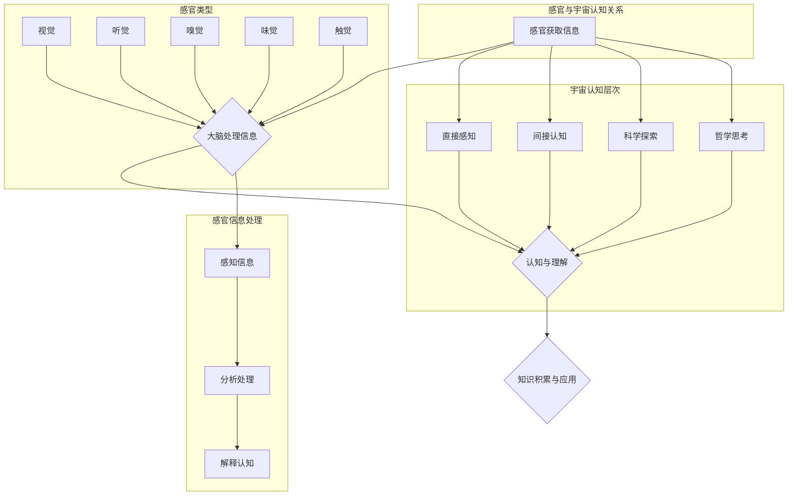

### 1.4 视觉对宇宙的认知

视觉是人类最重要的感官之一，对于我们的宇宙认知起到了至关重要的作用。视觉感知的基本原理如下：

#### 1.4.1 视觉感知的基本原理

当光线进入眼睛时，首先被角膜和晶状体聚焦到视网膜上。视网膜上的感光细胞（视锥细胞和视杆细胞）会将光信号转换为电信号，这些电信号随后通过视神经传递到大脑的视觉皮层。在视觉皮层中，电信号会被处理和分析，最终形成我们所看到的视觉图像。

**Mermaid流程图**：

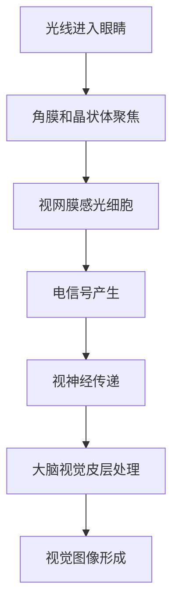

#### 1.4.2 视觉在宇宙认知中的应用

视觉在宇宙认知中的应用主要包括以下几个方面：

1. **天文学**：通过望远镜，我们可以观察到遥远的星体和宇宙现象，了解宇宙的结构和演化。

2. **地球观测**：通过卫星和无人机，我们可以获取地球的图像，监测环境变化，预测自然灾害。

3. **太空探索**：太空任务中的摄像头可以帮助我们了解其他星球和环境，从而推动太空探索的进展。

4. **虚拟现实**：虚拟现实技术利用视觉来创建三维虚拟环境，帮助我们体验和探索宇宙的不同场景。

**伪代码**：

```python
def visual_universe_cognition():
    # 观察星体
    observe_stars(through_telescope)

    # 地球观测
    monitor_earth_environment(satellite_images)

    # 太空探索
    explore_other_planets(spacecraft_cameras)

    # 虚拟现实
    experience_universe(virtual_reality_environments)
```

### 1.5 听觉对宇宙的认知

听觉是另一个重要的感官，它也对我们的宇宙认知有着不可忽视的作用。听觉感知的基本原理如下：

#### 1.5.1 听觉感知的基本原理

声波通过空气或其他介质传播到我们的耳朵，引起耳膜的振动。这些振动被传递到中耳的三个小骨（锤骨、砧骨和镫骨），然后通过耳蜗内的液体传导到内耳的毛细胞。毛细胞将机械振动转换为电信号，这些电信号通过听觉神经传递到大脑的听觉皮层，最终形成听觉感知。

**Mermaid流程图**：

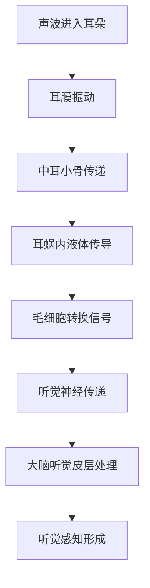

#### 1.5.2 听觉在宇宙认知中的应用

听觉在宇宙认知中的应用主要包括以下几个方面：

1. **天文学**：通过测量星体的声音波，我们可以了解星体的物理特性，如温度、密度和旋转速度。

2. **地球观测**：通过地震波和其他声波监测地球内部的活动，如地震、火山爆发和地质变化。

3. **太空探索**：太空任务中的麦克风可以记录太空环境中的声音，帮助我们了解太空的无声世界。

4. **导航与通信**：在太空中，声波无法传播，因此我们使用无线电波进行通信和导航。

**伪代码**：

```python
def auditory_universe_cognition():
    # 测量星体声波
    measure_stellar_sounds(waves)

    # 地震波监测
    monitor_earth_activity(seismic_waves)

    # 太空声音记录
    record_space_sounds(microphones)

    # 无线电波通信与导航
    communicate_and Navigate(radio_waves)
```

通过上述内容，我们可以看到人类感官在宇宙认知中的重要作用，视觉和听觉仅仅是其中的两个方面。接下来，我们将探讨其他感官，如嗅觉、味觉和触觉，它们在宇宙认知中的应用及其对人类理解宇宙的局限。

## 1.6 嗅觉、味觉和触觉对宇宙的认知

### 1.6.1 嗅觉感知的基本原理

嗅觉是通过嗅觉感受器检测气味分子并将其转化为电信号的过程。当空气中的气味分子进入鼻腔时，它们与嗅觉感受器结合，激活嗅觉受体细胞。这些细胞将气味信息转化为电信号，通过嗅神经传递到大脑的嗅觉皮层，最终形成嗅觉感知。

**Mermaid流程图**：

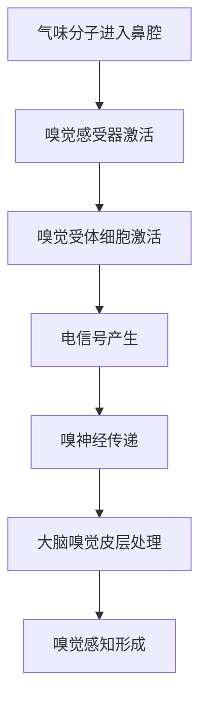

#### 1.6.2 嗅觉在宇宙认知中的应用

嗅觉在宇宙认知中的应用相对较少，但依然有其独特的作用：

1. **天文学**：通过分析星际尘埃和星云中的有机分子，我们可以推测星体的化学组成和形成历史。

2. **地球观测**：使用气相色谱法等化学分析技术，我们可以监测大气中的化学成分，了解地球环境的变化。

3. **太空探索**：在太空任务中，嗅觉可以用于检测环境中的有毒气体或生物指标，确保宇航员的安全。

**伪代码**：

```python
def olfactory_universe_cognition():
    # 分析星际尘埃
    analyze_interstellar_dust(organic_molecules)

    # 监测大气化学成分
    monitor_atmospheric_chemistry(gas_chromatography)

    # 检测太空环境
    detect_toxic_gases_and_biological_indicators(space_environment)
```

### 1.6.3 味觉感知的基本原理

味觉是通过味蕾上的感受器检测食物中的化学物质并将其转化为电信号的过程。当食物的化学物质与味蕾上的感受器结合时，这些感受器会激活并产生电信号。这些电信号通过味神经传递到大脑的味觉皮层，最终形成味觉感知。

**Mermaid流程图**：

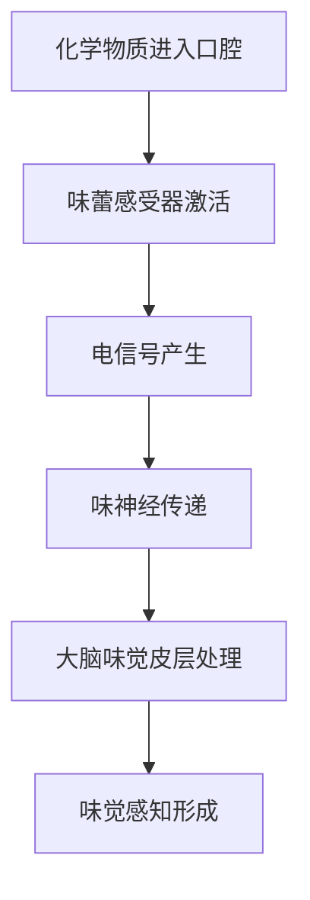

#### 1.6.4 味觉在宇宙认知中的应用

味觉在宇宙认知中的应用相对有限，但在特定的太空任务中仍有其作用：

1. **食物选择**：在太空中，宇航员需要选择营养均衡且口味多样的食物，以保证身心健康。

2. **环境监测**：通过检测食物中的化学成分，我们可以了解食品的质量和安全性，从而监测环境。

3. **医学研究**：研究食物中的化学成分可以帮助我们理解疾病的发生机制，从而开发新的治疗方法。

**伪代码**：

```python
def gustatory_universe_cognition():
    # 选择太空食物
    select_space_foods(nutritional_balance)

    # 检测食品质量与安全性
    monitor_food_quality_and_safety(chemical_analysis)

    # 研究食物与疾病关系
    research_food_disease_relationships
```

### 1.6.5 触觉感知的基本原理

触觉是通过皮肤上的感受器检测物体表面的物理特性（如温度、压力、振动等）并将其转化为电信号的过程。当物体与皮肤接触时，皮肤中的机械感受器会激活，产生电信号。这些电信号通过神经传递到大脑的触觉皮层，最终形成触觉感知。

**Mermaid流程图**：

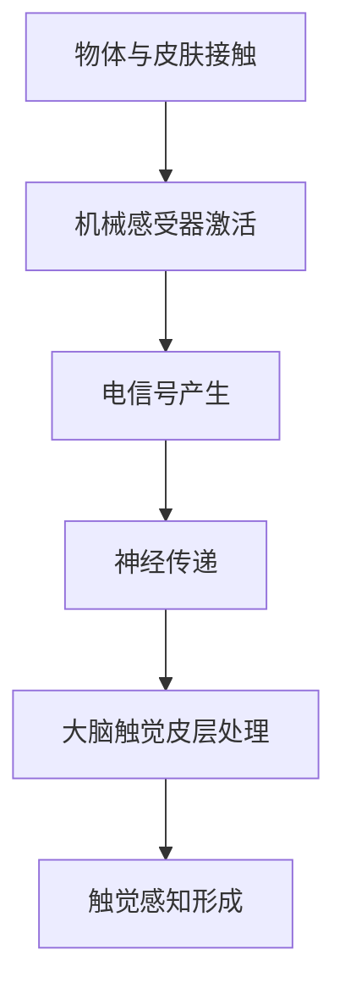

#### 1.6.6 触觉在宇宙认知中的应用

触觉在宇宙认知中的应用主要体现在以下几个方面：

1. **太空探索**：宇航员需要通过触觉来操作太空设备，如控制太空舱的门、机器人和工具。

2. **地质探测**：地质学家使用触觉来感知土壤、岩石和矿物质的物理特性，从而进行地质分析和勘探。

3. **虚拟现实**：虚拟现实技术利用触觉反馈来增强用户的沉浸感和互动性，从而实现更真实的宇宙探索体验。

**伪代码**：

```python
def tactile_universe_cognition():
    # 操作太空设备
    operate_space_equipment(tactile_sensing)

    # 地质探测
    geological_exploration(physical_characteristics)

    # 虚拟现实体验
    virtual_reality_experience(tactile_feedback)
```

综上所述，尽管嗅觉、味觉和触觉在宇宙认知中的应用相对较少，但它们在特定领域和任务中仍然发挥着重要作用。通过进一步研究和开发这些感官技术，我们有望在宇宙认知方面取得更大的突破。

## 1.7 感官信息的处理和解释

### 1.7.1 感官信息的处理过程

感官信息的处理是一个复杂而高度协调的过程，涉及到从感官接收信息到大脑解释和理解的全链条。以下是感官信息处理的详细流程：

#### 1.7.1.1 感官输入

感官接收器从外部环境中获取信息。例如，眼睛接收光线，耳朵接收声波，鼻子接收气味分子，舌头接收食物中的化学物质，皮肤接收物理刺激。

#### 1.7.1.2 信号转换

感官接收器将接收到的物理信号（如光线、声波、化学物质、物理刺激）转化为电信号。这些电信号是神经系统能够处理的格式。

#### 1.7.1.3 信号传递

电信号通过神经传递到大脑。不同感官的信号通过不同的神经路径传递到大脑的特定区域。例如，视觉信号通过视神经传递到视觉皮层，听觉信号通过听觉神经传递到听觉皮层。

#### 1.7.1.4 大脑处理

大脑对信号进行解码、分析和综合处理。大脑的不同区域负责不同的任务，如视觉处理区域负责识别物体和运动，听觉处理区域负责识别声音和语音。

#### 1.7.1.5 解释和认知

大脑将处理后的信息转化为我们能够理解和感知的形式。这种解释和认知过程涉及到记忆、学习、判断和情感等高级认知功能。

**Mermaid流程图**：

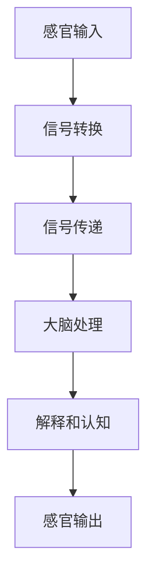

### 1.7.2 感官信息的解释方法

感官信息的解释涉及到多种方法和机制，以下是一些主要方法：

#### 1.7.2.1 解析

解析是将感官信息分解为基本元素（如颜色、声音、气味、味道和触觉）的过程。这种解析有助于我们理解和分类感官信息。

**伪代码**：

```python
def parse_sensory_info(info):
    # 分析颜色
    color = extract_color(info)

    # 分析声音
    sound = extract_sound(info)

    # 分析气味
    smell = extract_smell(info)

    # 分析味道
    taste = extract_taste(info)

    # 分析触觉
    touch = extract_touch(info)
```

#### 1.7.2.2 对比

对比是将当前感官信息与存储在记忆中的信息进行比较的过程。这种对比有助于识别和分类感官信息，以及检测变化和异常。

**伪代码**：

```python
def compare_sensory_info(current_info, memory_info):
    # 比较颜色
    color_difference = compare_color(current_info, memory_info)

    # 比较声音
    sound_difference = compare_sound(current_info, memory_info)

    # 比较气味
    smell_difference = compare_smell(current_info, memory_info)

    # 比较味道
    taste_difference = compare_taste(current_info, memory_info)

    # 比较触觉
    touch_difference = compare_touch(current_info, memory_info)
```

#### 1.7.2.3 综合分析

综合分析是将来自不同感官的信息结合起来，形成一个完整的感知体验。这种综合分析有助于我们更全面地理解和解释感官信息。

**伪代码**：

```python
def integrate_sensory_info(visual_info, auditory_info, olfactory_info, gustatory_info, tactile_info):
    # 综合分析
    integrated_info = combine信息均合信息

    # 形成感知体验
    perception_experience = create_perception_experience(integrated_info)
```

### 1.7.3 感官信息处理的局限性

尽管感官信息的处理和解释是高度复杂和有效的，但它们仍然存在一些局限性：

#### 1.7.3.1 噪声干扰

感官信息可能受到噪声和其他外部干扰的影响，导致信息的不准确或失真。

#### 1.7.3.2 缺乏细节

感官信息可能无法提供足够的细节，特别是当信息被快速传递或在大脑处理过程中丢失时。

#### 1.7.3.3 感官疲劳

长期使用某一感官可能导致感官疲劳，降低感官信息的处理能力。

**伪代码**：

```python
def sensory_limitations(info):
    # 检测噪声干扰
    noise_detection = detect_noise_interference(info)

    # 修复信息细节
    detail_restoration = restore_info_details(info)

    # 处理感官疲劳
    fatigue_management = manage_sensory_fatigue()
```

通过了解和解决这些局限性，我们可以进一步提高感官信息的处理和解释能力，从而更好地理解宇宙。

## 1.8 感官认知的局限性和误差

### 1.8.1 感官认知的局限性

尽管人类感官为我们提供了丰富的信息，但它们在宇宙认知中也存在一些局限性。以下是几种主要感官的局限性：

#### 1.8.1.1 视觉

- **光线限制**：视觉依赖于光线的存在。在黑暗中，视觉能力显著下降，无法进行有效的认知。
- **颜色感知限制**：人类只能感知有限的颜色。例如，色盲者无法区分某些颜色。
- **分辨率限制**：人类的视觉分辨率有限，难以看到微小的细节。

**Mermaid流程图**：

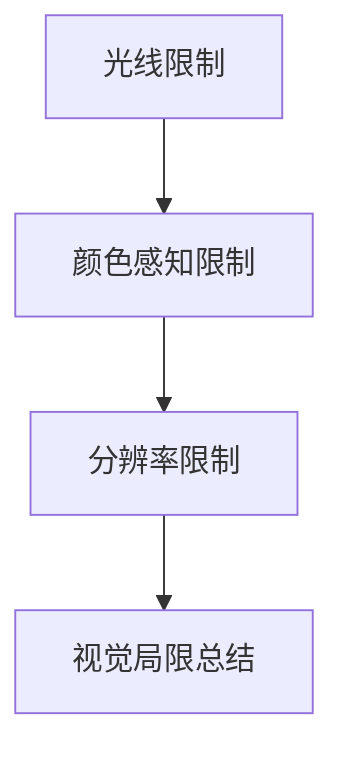

#### 1.8.1.2 听觉

- **声波频率范围限制**：人类的听觉范围有限，无法听到所有频率的声音。例如，婴儿和老年人可能无法听到高频声波。
- **声源识别限制**：在嘈杂的环境中，人类难以准确识别声源。
- **距离限制**：随着距离的增加，声波会衰减，导致听觉信息减少。

**Mermaid流程图**：

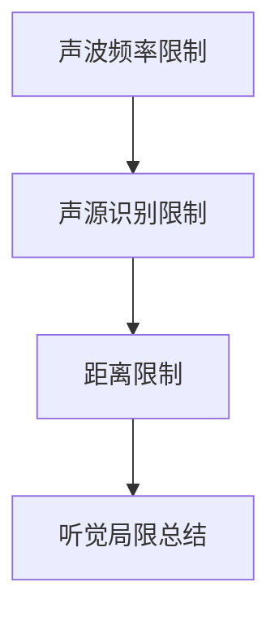

#### 1.8.1.3 嗅觉

- **气味分子浓度限制**：嗅觉对气味分子的浓度敏感。当浓度过低时，气味难以被感知。
- **适应性限制**：长时间暴露于某种气味中，人类可能会逐渐失去对该气味的感知能力（嗅觉适应性）。
- **个体差异**：不同人的嗅觉敏感度存在差异，某些气味可能对某些人而言不易察觉。

**Mermaid流程图**：

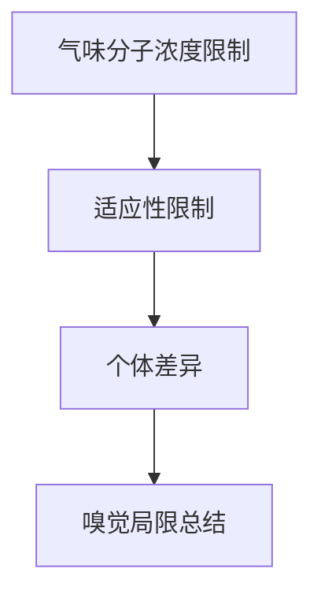

#### 1.8.1.4 味觉

- **化学物质种类限制**：味觉主要依赖于化学物质的种类和浓度。某些化学物质可能无法被味觉感知。
- **味觉疲劳**：长时间食用某种食物可能导致味觉疲劳，降低味觉的敏感度。
- **文化差异**：不同文化对食物的偏好不同，这可能导致味觉认知的差异。

**Mermaid流程图**：

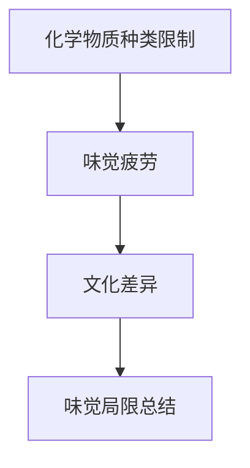

#### 1.8.1.5 触觉

- **物理刺激限制**：触觉对物理刺激（如温度、压力、振动等）敏感，但对一些刺激的感知能力有限。
- **触觉疲劳**：长期接触某种物理刺激可能导致触觉疲劳，降低触觉的敏感度。
- **个体差异**：不同人对触觉刺激的敏感度存在差异。

**Mermaid流程图**：

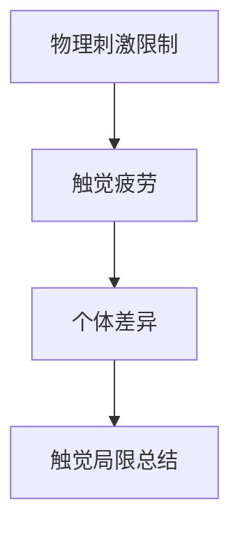

### 1.8.2 感官认知的误差来源

除了局限性，感官认知还可能受到以下误差来源的影响：

#### 1.8.2.1 主观偏差

主观偏差是指个人经验、情绪和期望等对感知结果的影响。例如，一个充满期待的人可能会对同一刺激产生不同的感知结果。

#### 1.8.2.2 外部噪声

外部噪声是指来自环境中的各种干扰信号，如背景噪音、电磁干扰等，这些噪声可能会干扰感官信息的准确接收和处理。

#### 1.8.2.3 内部偏差

内部偏差是指感官系统本身的问题，如疲劳、疾病、感官退化等，这些问题可能导致感知信息的误差。

**Mermaid流程图**：

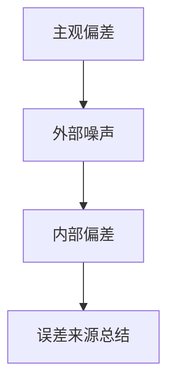

### 1.8.3 误差对宇宙认知的影响

这些局限性和误差对宇宙认知产生了深远的影响：

- **数据准确性问题**：感官误差可能导致宇宙观测数据的准确性下降，影响科学研究的进展。
- **理解偏差**：感官局限可能导致我们对宇宙现象的理解产生偏差，影响我们对宇宙的认知深度。
- **安全风险**：在某些情况下，感官误差可能导致安全问题的发生，如宇航员在太空中的操作失误。

**Mermaid流程图**：

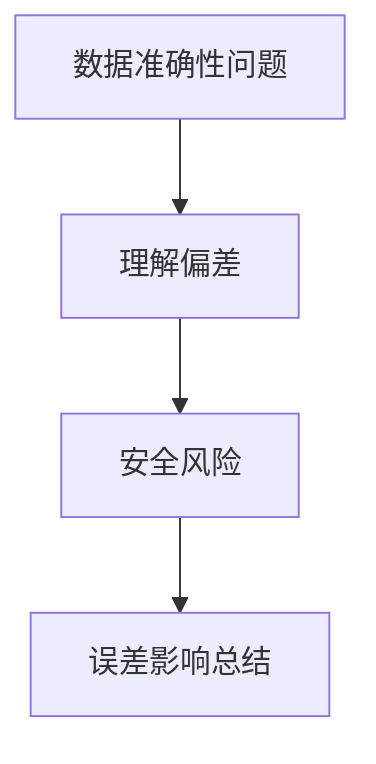

了解和解决这些局限性和误差，对于提高我们的宇宙认知至关重要。在接下来的章节中，我们将探讨改进感官认知的途径。

## 1.9 感官认知的改进途径

### 1.9.1 感官增强技术的应用

为了克服人类感官在宇宙认知中的局限性，科学家和工程师们开发了各种感官增强技术，这些技术能够显著提升我们的感知能力和认知效果。

#### 1.9.1.1 视觉增强技术

- **增强现实（AR）和虚拟现实（VR）**：通过头戴式显示器和传感器，AR和VR技术能够创建虚拟的视觉环境，增强用户的视觉体验。例如，NASA使用VR技术模拟太空任务，提高宇航员的适应能力和任务效率。

**Mermaid流程图**：

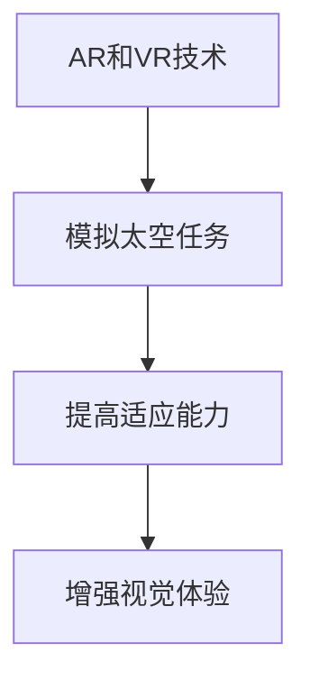

- **夜视设备**：夜视设备利用红外线和微光成像技术，在低光环境下提供清晰的图像。这对于太空探索和夜间地球观测具有重要意义。

**伪代码**：

```python
def night_vision_device():
    # 使用红外线传感器
    infrared_sensors = enable_infrared_sensing()

    # 微光成像
    low_light_imaging = activate_low_light_imaging()

    # 提供清晰图像
    provide_clear_images()
```

- **增强视觉分辨率**：通过增强光学系统，如更高分辨率的相机和光学放大器，我们可以获得更清晰的视觉信息。

**Mermaid流程图**：

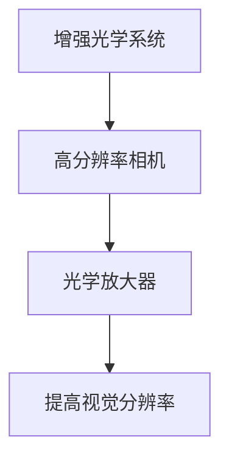

#### 1.9.1.2 听觉增强技术

- **听力辅助设备**：如助听器和人工耳蜗，这些设备能够帮助听力受损的人恢复或增强听觉能力。

**伪代码**：

```python
def hearing_aid():
    # 检测听力损失
    hearing_loss_detection = analyze_hearing_loss()

    # 提供声音放大
    sound_enhancement = amplify_sound()

    # 输出清晰声音
    output_clear_sounds()
```

- **噪声控制**：通过噪声抑制和背景音消除技术，我们可以提高听觉信息的清晰度，特别是在嘈杂的环境中。

**Mermaid流程图**：

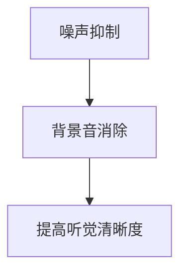

- **声波探测**：声波探测技术，如声纳和雷达，可以帮助我们探测和监测水下和空中环境。

**伪代码**：

```python
def acoustic_detection():
    # 发射声波
    emit_acoustic_waves()

    # 接收回波
    receive_echoes()

    # 分析声波数据
    analyze_acoustic_data()

    # 探测目标
    detect_targets()
```

#### 1.9.1.3 嗅觉增强技术

- **电子鼻**：电子鼻通过模拟嗅觉神经系统的传感器，可以检测和识别各种气味。这有助于环境保护、食品安全和医疗监测等领域。

**伪代码**：

```python
def electronic_nose():
    # 接收气味分子
    receive_odor_molecules()

    # 检测气味
    detect_odor()

    # 识别气味
    identify_odor()
```

- **气味增强设备**：通过分子传感器和气味释放装置，我们可以增强对特定气味的感知。

**Mermaid流程图**：

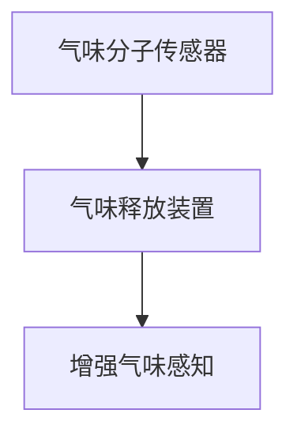

#### 1.9.1.4 味觉增强技术

- **电子舌头**：电子舌头通过传感器模拟味觉系统，可以检测和量化食物中的味道成分。

**伪代码**：

```python
def electronic_tongue():
    # 接触食物
    contact_food()

    # 检测味道
    detect_taste()

    # 分析味道成分
    analyze_taste_components()

    # 量化味道
    quantify_taste()
```

- **味觉增强剂**：通过添加特定化学物质，我们可以增强或改变食物的味道。

**Mermaid流程图**：

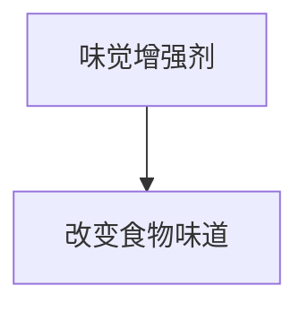

#### 1.9.1.5 触觉增强技术

- **触觉传感器**：触觉传感器可以模拟人类手指的触觉，用于机器人控制和虚拟现实交互。

**伪代码**：

```python
def tactile_sensors():
    # 接触物体
    contact_object()

    # 检测触觉
    detect_tactile_feeling()

    # 反馈触觉信息
    provide_tactile_feedback()
```

- **触觉增强手套**：触觉增强手套通过振动和压力传感器，可以增强用户对物体表面的触觉感知。

**Mermaid流程图**：

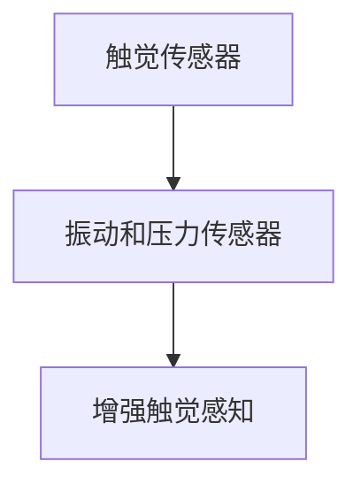

通过这些感官增强技术，我们可以显著提升人类对宇宙的认知能力，为探索宇宙的未知领域提供更多的可能性。

## 1.10 感官替代技术的应用

### 1.10.1 视觉替代技术的应用

在视觉受损或完全丧失视觉能力的情况下，视觉替代技术能够提供有效的视觉信息，帮助用户进行日常活动和环境感知。以下是几种常见的视觉替代技术：

#### 1.10.1.1 超声波定位仪

超声波定位仪利用超声波发射和接收技术，为盲人提供环境信息的听觉描述。这种设备可以发出声音信号，指示盲人前方物体的位置和距离。

**Mermaid流程图**：

```mermaid
graph TD
A[超声波发射器] --> B[接收反射信号]
B --> C[声音信号处理]
C --> D[声音描述环境信息]
D --> E[盲人导航]
```

#### 1.10.1.2 导盲犬

导盲犬是一种经过专业训练的动物，能够引导视障人士安全地行走。导盲犬通过嗅觉和听觉辅助，帮助主人避开障碍物，识别路线。

**伪代码**：

```python
def guide_dog():
    # 检测障碍物
    detect_obstacles()

    # 跟随主人步伐
    follow_master_steps()

    # 辅助主人行走
    assist_master_moving()
```

#### 1.10.1.3 视觉辅助设备

视觉辅助设备，如放大镜、电子放大器和屏幕阅读器，可以帮助视障人士阅读文本和识别物体。屏幕阅读器通过声音将文本内容转换为语音输出，方便盲人使用计算机和其他电子设备。

**伪代码**：

```python
def visual_assistance_device():
    # 放大文本
    zoom_in_text()

    # 电子放大器
    electronic_magnification()

    # 屏幕阅读器
    screen_reader()
```

### 1.10.2 听觉替代技术的应用

听觉受损或丧失听觉能力时，听觉替代技术可以提供有效的听觉信息，帮助用户进行沟通和定位。以下是几种常见的听觉替代技术：

#### 1.10.2.1 人工耳蜗

人工耳蜗是一种电子装置，能够替代或增强受损的内耳功能。它通过捕捉声波并将其转化为电信号，传递到大脑进行处理。

**Mermaid流程图**：

```mermaid
graph TD
A[声波捕捉] --> B[信号转换]
B --> C[电信号传输]
C --> D[大脑处理]
D --> E[听觉感知]
```

#### 1.10.2.2 噪声抑制器

噪声抑制器通过算法分析环境声音，识别并消除背景噪声，提高用户对目标声音的感知能力。这种设备在嘈杂环境中尤其有用。

**伪代码**：

```python
def noiseSuppressor():
    # 分析环境声音
    analyze_environment_sound()

    # 识别背景噪声
    identify_background_noise()

    # 消除噪声
    remove_noise()

    # 提高目标声音感知
    enhance_target_sound_perception()
```

#### 1.10.2.3 口语沟通辅助设备

口语沟通辅助设备，如语音合成器和语音识别系统，可以帮助听障人士进行交流。语音合成器将文本转换为语音，语音识别系统将语音转换为文本。

**伪代码**：

```python
def oral_communication_assistant():
    # 文本转语音
    text_to_speech()

    # 语音转文本
    speech_to_text()

    # 辅助交流
    assist_communication()
```

### 1.10.3 嗅觉和味觉替代技术的应用

嗅觉和味觉受损或丧失时，替代技术可以帮助用户感知气味和味道。以下是几种常见的嗅觉和味觉替代技术：

#### 1.10.3.1 电子鼻

电子鼻是一种传感器装置，能够模拟嗅觉功能，检测和识别各种气味。这种技术应用于食品安全监测、环境监测和医疗诊断等领域。

**伪代码**：

```python
def electronic_nose():
    # 检测气味
    detect_odor()

    # 识别气味
    identify_odor()

    # 提供气味信息
    provide_odor_info()
```

#### 1.10.3.2 味觉增强剂

味觉增强剂是一种化学物质，可以通过添加到食物中，增强或改变食物的味道。这种技术用于食品工业和医疗领域，帮助味觉受损者享受食物。

**伪代码**：

```python
def taste_enhancer():
    # 添加到食物中
    add_to_food()

    # 增强味道
    enhance_taste()

    # 提供更好的味觉体验
    provide_better_taste_experience()
```

### 1.10.4 触觉替代技术的应用

触觉替代技术能够在触觉受损或丧失时提供触觉信息，帮助用户感知物体的形状、质地和温度。以下是几种常见的触觉替代技术：

#### 1.10.4.1 触觉反馈手套

触觉反馈手套通过振动和压力传感器，模拟真实触觉体验。这种设备广泛应用于虚拟现实和机器人控制领域。

**伪代码**：

```python
def tactile_feedback_glove():
    # 接触物体
    contact_object()

    # 检测触觉
    detect_tactile_feeling()

    # 提供触觉反馈
    provide_tactile_feedback()
```

#### 1.10.4.2 温度传感设备

温度传感设备通过检测物体的温度变化，提供温度感知信息。这种技术用于医疗诊断、工业制造和科学研究等领域。

**伪代码**：

```python
def temperature_sensing_device():
    # 检测温度
    measure_temperature()

    # 提供温度信息
    provide_temperature_info()
```

通过这些感官替代技术，我们能够有效地克服感官局限性，为视障、听障、嗅觉和味觉受损者提供新的感知能力，从而改善他们的生活质量。

## 1.11 实例分析：盲人感知宇宙

### 1.11.1 盲人感官概述

盲人由于视觉受损或丧失，通常无法通过视觉来感知外部世界。然而，他们可以通过其他感官（如听觉、嗅觉、味觉和触觉）来获取信息和进行环境感知。盲人的感官系统往往更为敏感和发达，以补偿其视觉的不足。

### 1.11.2 盲人如何感知宇宙

尽管盲人无法通过视觉直接感知宇宙，但他们可以通过以下方式间接地感知宇宙：

#### 1.11.2.1 声音导航

盲人使用声音导航来识别周围环境和方向。例如，通过识别远处飞机的引擎声，盲人可以判断自己的位置和方向。此外，他们还可以使用声音来识别天气变化，如雷声可以提示即将到来的暴雨。

**伪代码**：

```python
def auditory_navigation():
    # 识别飞机引擎声
    detect_plane_sound()

    # 判断位置和方向
    determine_location_and_direction()

    # 识别天气变化
    detect_weather_changes(sounds)
```

#### 1.11.2.2 指南针和声音定位

盲人使用指南针和其他声音定位工具来确定方向。例如，他们可以通过听觉判断时钟摆动声的方向，从而确定北方的位置。

**伪代码**：

```python
def sound_based_compass():
    # 听时钟摆动声
    listen_to_clock_ticking()

    # 判断北方位置
    determine_north_direction()

    # 使用指南针辅助
    use_compass_for辅助导航
```

#### 1.11.2.3 嗅觉和味觉

盲人通过嗅觉和味觉来识别和享受食物。例如，他们可以通过气味和味道来区分不同的食物和食材。这种感官体验不仅有助于他们的日常生活，还能丰富他们对世界的感知。

**伪代码**：

```python
def olfactory_and_gustatory_perception():
    # 识别食物气味
    detect_food_smell()

    # 识别食物味道
    detect_food_taste()

    # 享受食物
    enjoy_food_experience()
```

#### 1.11.2.4 触觉

盲人通过触觉来感知物体的形状、质地和温度。例如，他们可以通过触摸来识别不同的物品，如硬币、纸张和瓶子。这种触觉感知对于他们进行日常活动和进行物理操作至关重要。

**伪代码**：

```python
def tactile_perception():
    # 检测物体形状
    detect_object_shape()

    # 检测物体质地
    detect_object_texture()

    # 检测物体温度
    detect_object_temperature()

    # 操作物体
    manipulate_objects()
```

### 1.11.3 盲人在太空任务中的应用

尽管盲人无法成为宇航员进行太空任务，但他们的感官替代技术可以应用于太空探索。以下是一些实际案例：

#### 1.11.3.1 太空行走辅助设备

太空行走辅助设备，如触觉反馈手套和听觉导航系统，可以帮助宇航员在太空中进行精确的操作和导航。这些设备利用盲人感官替代技术的原理，为宇航员提供额外的感知能力。

**伪代码**：

```python
def space_walking_assistive_devices():
    # 使用触觉反馈手套
    use_tactile_feedback_gloves()

    # 使用听觉导航系统
    use_auditory_navigation_system()

    # 完成太空任务
    complete_space_mission()
```

#### 1.11.3.2 太空生活辅助系统

盲人感官替代技术还可以用于太空站内的生活辅助系统。例如，通过使用电子鼻和电子舌头，宇航员可以检测食品和水源的质量，确保其安全和适宜。

**伪代码**：

```python
def space_station_life_support_system():
    # 使用电子鼻检测食品
    use_electronic_nose_toinspect_food()

    # 使用电子舌头检测水源
    use_electronic_tongue_toinspect_water()

    # 确保食品和水源安全
    ensure_food_and_water_safety()
```

### 1.11.4 盲人与宇宙认知

盲人通过其他感官来感知宇宙，虽然他们无法直接看到星空和星体，但他们可以通过声音、气味、触觉和其他替代技术来理解宇宙的本质。这种多感官的宇宙认知方式不仅丰富了他们的生活体验，也为科学家和工程师提供了新的思路和灵感。

## 1.12 实例分析：色盲者感知宇宙

### 1.12.1 色盲者感官概述

色盲是一种视觉障碍，主要表现为无法准确识别颜色或对某些颜色的感知异常。色盲者通常依赖其他感官（如听觉、嗅觉、味觉和触觉）来补偿视觉的不足。

### 1.12.2 色盲者如何感知宇宙

尽管色盲者无法通过视觉准确识别颜色，但他们可以通过以下方式感知宇宙：

#### 1.12.2.1 声音和视觉辅助

色盲者可以通过声音辅助来识别颜色。例如，使用声音标记或标签来区分不同的颜色。在某些应用中，如教育和设计，声音辅助工具可以帮助色盲者更好地理解和感知颜色。

**伪代码**：

```python
def auditory_assistance_for_color盲():
    # 使用声音标记
    use_sound_labels()

    # 识别颜色
    identify_colors()

    # 学习颜色知识
    learn_color_知识
```

#### 1.12.2.2 嗅觉和味觉

色盲者通过嗅觉和味觉来识别和区分不同的物体。例如，他们可以通过气味来识别不同的植物和食物，通过味道来区分不同的饮料和食物。

**伪代码**：

```python
def olfactory_and_gustatory_perception_for_color盲():
    # 识别物体气味
    detect_object_smell()

    # 识别食物味道
    detect_food_taste()

    # 区分物体和食物
    differentiate_objects_and_foods()
```

#### 1.12.2.3 触觉

色盲者通过触觉来识别物体的形状、质地和温度。例如，他们可以通过触摸来识别不同的材料和物体，通过温度来感知热或冷。

**伪代码**：

```python
def tactile_perception_for_color盲():
    # 检测物体形状
    detect_object_shape()

    # 检测物体质地
    detect_object_texture()

    # 检测物体温度
    detect_object_temperature()

    # 识别物体
    identify_objects()
```

### 1.12.3 色盲者在宇宙认知中的应用

#### 1.12.3.1 声学天文学

色盲者可以应用于声学天文学，通过分析声波来研究星体的物理特性。例如，他们可以通过声波探测技术来测量星体的温度、密度和旋转速度。

**伪代码**：

```python
def auditory_astronomy():
    # 接收声波
    receive_sounds()

    # 分析声波数据
    analyze_sonic_data()

    # 研究星体特性
    study_stellar_properties()
```

#### 1.12.3.2 气象监测

色盲者可以应用于气象监测，通过听觉和触觉来感知天气变化。例如，他们可以通过声学传感器来检测风暴和雷电，通过触觉感知温度和湿度变化。

**伪代码**：

```python
def meteorological_monitoring():
    # 检测声学信号
    detect_auditory_signals()

    # 检测温度和湿度
    measure_temperature_and_humidity()

    # 预测天气变化
    predict_weather_changes()
```

#### 1.12.3.3 地球观测

色盲者可以用于地球观测，通过嗅觉和味觉来检测环境中的化学物质和污染物。例如，他们可以通过气相色谱法来监测大气中的化学成分，从而了解环境变化。

**伪代码**：

```python
def earth_observations():
    # 检测气味
    detect_odor()

    # 分析化学成分
    analyze_chemical_components()

    # 监测环境变化
    monitor_environmental_changes()
```

### 1.12.4 色盲者与多感官宇宙认知

色盲者通过多感官协调来感知宇宙，虽然他们在颜色识别上存在困难，但通过其他感官的补偿，他们依然能够进行有效的宇宙认知。这种多感官的宇宙认知方式不仅丰富了他们的生活体验，也为科学研究提供了新的视角和方法。

## 1.13 总结与未来展望

### 1.13.1 文章总结

本文从多个角度探讨了人类感官对宇宙认知的影响与局限。首先，我们介绍了人类感官的基本原理和应用，包括视觉、听觉、嗅觉、味觉和触觉。接着，我们分析了感官信息的处理和解释过程，以及感官认知的局限性和误差来源。为了克服这些局限性，我们探讨了感官增强技术和感官替代技术的应用，并通过实例分析了盲人和色盲者在宇宙认知中的独特方式。

### 1.13.2 未来展望

未来，随着科技的不断发展，人类对感官的认知和利用将进一步提升。以下是一些可能的趋势和展望：

1. **感官增强技术的进步**：随着人工智能和机器学习的发展，感官增强技术将更加智能化和个性化。例如，通过深度学习算法，我们可以开发出更精准的视觉和听觉辅助设备，提高用户的感知能力。

2. **多模态感知系统**：多模态感知系统将整合多种感官信息，提供更全面和准确的认知体验。这种系统在医疗、教育、娱乐等领域具有巨大潜力。

3. **虚拟现实与增强现实**：随着虚拟现实和增强现实技术的成熟，我们可以通过虚拟环境更深入地探索宇宙。这些技术将使人们能够在虚拟世界中体验宇宙现象，从而提高对宇宙的认知。

4. **神经接口技术**：神经接口技术将实现人脑与外部设备的高效连接，进一步扩展人类的感知能力。例如，通过脑机接口，我们可以直接将宇宙信息传递到人脑，实现超感知体验。

5. **宇宙探索的深化**：随着宇宙探索技术的进步，我们将能够更深入地了解宇宙的奥秘。通过利用人类感官和替代技术，我们可以收集和分析更多的宇宙数据，推动科学研究的进步。

总之，人类感官对宇宙认知的影响与局限是一个复杂而深奥的话题。通过不断探索和创新，我们有望在未来克服这些局限，拓展我们的认知边界，实现更全面和深刻的宇宙认知。

## 1.14 最佳实践 tips、小结、注意事项、拓展阅读

### 1.14.1 最佳实践 tips

- **视觉训练**：定期进行眼部运动和训练，如眼球转动和远近距离切换，有助于提高视觉敏锐度。
- **听觉保养**：避免长时间处于噪声环境中，定期检查听力状况，确保听力健康。
- **嗅觉训练**：通过闻不同的气味进行嗅觉训练，提高嗅觉敏感度。
- **味觉保养**：多样化饮食，避免过度依赖单一口味，保持味觉敏感度。
- **触觉锻炼**：定期进行手指和手部活动，如捏捏沙子、玩握力球等，增强触觉感知。

### 1.14.2 小结

本文详细探讨了人类感官在宇宙认知中的作用与局限，介绍了视觉、听觉、嗅觉、味觉和触觉的基本原理及其在宇宙认知中的应用。同时，我们探讨了感官增强技术和替代技术的应用，并通过实例分析了盲人和色盲者在宇宙认知中的独特方式。最后，我们总结了未来感官认知发展的趋势和展望。

### 1.14.3 注意事项

- **避免感官过度疲劳**：长时间使用某一感官可能导致疲劳，降低感知能力。因此，要注意休息和调节。
- **安全使用感官增强技术**：在应用感官增强技术时，要确保其安全性和可靠性，避免不必要的风险。
- **个体差异**：每个人的感官敏感度和偏好不同，应根据个人情况选择合适的感官训练和辅助设备。

### 1.14.4 拓展阅读

- **《感官心理学》**：艾伦·吉布森，深入探讨感官心理学的基础理论和应用。
- **《神经科学原理》**：理查德·戈尔德斯密斯，介绍神经科学的基本原理，包括感官信息的处理和传递。
- **《视觉认知科学》**：唐纳德·赫布，探讨视觉认知的科学原理和方法。
- **《宇宙认知论》**：玛丽-若泽·马丁内斯，探讨人类感官对宇宙认知的影响和局限。

通过拓展阅读，您可以更深入地了解感官认知和宇宙认知的相关知识，进一步丰富您的视野和思考。

