                 

### 文章标题

《人类感知能力与宇宙本质之间的鸿沟》

### 文章关键词

人类感知能力、宇宙本质、感知局限、宇宙奥秘、跨领域研究

### 文章摘要

本文旨在探讨人类感知能力与宇宙本质之间的深刻鸿沟。通过分析人类感知能力的基本原理和局限性，我们揭示了人类感官在感知宇宙时面临的挑战。接着，我们深入探讨了宇宙的基本原理和奥秘，并探讨了人类感知与宇宙本质之间的联系和差异。最后，本文提出了跨越这一鸿沟的方法和可能的应用领域，为未来人类探索宇宙提供了新的视角。文章结构紧凑，逻辑清晰，旨在为读者提供一个全面、深入的探讨。

---

## 第一部分：人类感知能力概述

### 1.1 人类感知能力的基本原理

人类感知能力是指我们通过感官接收外界信息，并将其转化为有意义的知觉和理解的能力。这一过程涉及多种感官系统，包括视觉、听觉、嗅觉、味觉和触觉。每种感官系统都有其独特的机制和功能，但它们的基本原理可以概括为以下几个步骤：

1. **感官接收**：当外部刺激（如光线、声音、气味、味道或触感）作用于我们的感官器官时，这些刺激会引起生物电信号的变化。
2. **信号处理**：感官器官将接收到的刺激转化为电信号，并通过神经传导将信号传递到大脑。
3. **大脑解码**：大脑接收并处理这些电信号，将其解码为有意义的知觉，如形状、颜色、声音、气味、味道和触觉。

以下是一个简化的Mermaid流程图，展示了人类感知能力的基本原理：

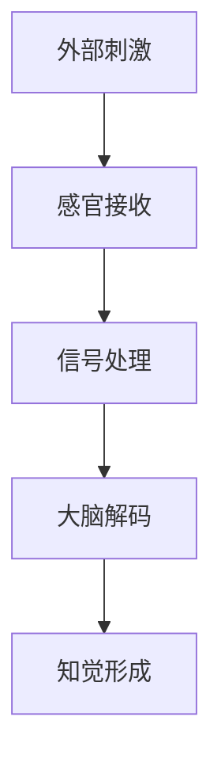

### 1.2 感知能力的局限性

尽管人类感知能力使我们能够与外界进行互动，但它们并非完美无缺。感知能力存在一些局限性，这些局限性限制了我们对世界的理解和感知：

1. **分辨率限制**：人类的感官器官对某些类型的刺激具有特定的分辨率限制。例如，人眼对光的敏感度有限，无法看到紫外线或红外线。
2. **频率范围限制**：人类的听觉和视觉感知也受到频率范围的限制。例如，人耳能听到的声音频率范围大约在20 Hz到20 kHz之间。
3. **信息处理能力限制**：大脑处理感官信息的能力也是有限的。我们无法同时处理大量来自不同感官的信息，这可能导致感知上的混淆和错觉。
4. **环境因素干扰**：外界环境中的噪声和其他刺激可能会干扰我们的感知能力，使我们难以准确感知真实的世界。

以下是关于感知能力局限性的Mermaid流程图：

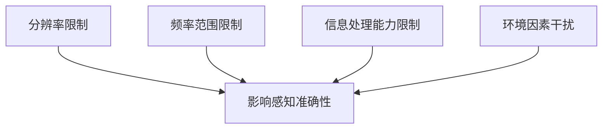

这些局限性意味着我们的感知能力无法完全反映外部世界的真实情况，而是受到我们感官和大脑处理能力的限制。

### 1.3 人类感知能力的发展历程

人类感知能力的发展历程可以追溯到数千年前。在早期的历史时期，人类主要通过感官来获取信息，以适应环境并生存下来。随着科技的发展和科学研究的深入，我们对感知能力有了更深入的理解，并能够利用技术手段扩展和增强我们的感知能力。

1. **早期的感知研究**：古希腊哲学家如亚里士多德开始研究感知和意识。他们提出了关于感官和感知的基本理论，为后来的科学研究奠定了基础。
2. **生理学和心理学的研究**：在19世纪和20世纪，生理学家和心理学家开始通过实验和观察来研究感官和大脑的工作原理。这些研究揭示了感知的基本机制，并帮助我们理解了感知的局限性。
3. **技术的进步**：随着技术的进步，我们能够开发出各种工具和设备来扩展和增强我们的感知能力。例如，显微镜和望远镜使我们能够看到微观和宏观世界的细节。

以下是关于人类感知能力发展历程的Mermaid流程图：

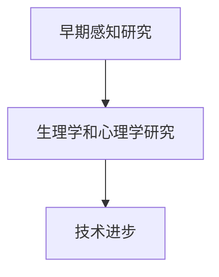

通过这些里程碑式的研究和进展，我们不仅扩展了我们对人类感知能力的理解，也为未来的研究提供了基础。

---

## 第二部分：宇宙本质的探索

### 2.1 宇宙的基本原理

宇宙是一个广袤而复杂的系统，它的起源、结构和演化一直是科学家们探索的课题。宇宙的基本原理可以概括为以下几个方面：

1. **大爆炸理论**：宇宙起源于大约138亿年前的一个极端高温高密度的状态，经过爆炸式膨胀，形成了我们今天所看到的宇宙。
2. **宇宙结构**：宇宙由大量的星系、星云、黑洞等天体组成，这些天体通过引力相互吸引和排斥，形成了复杂的结构网络。
3. **宇宙演化**：宇宙从大爆炸开始不断演化，经历了星系的形成、星系群的聚集和星系团的演化等阶段。

以下是一个关于宇宙基本原理的Mermaid流程图，展示了宇宙的起源、结构和演化：

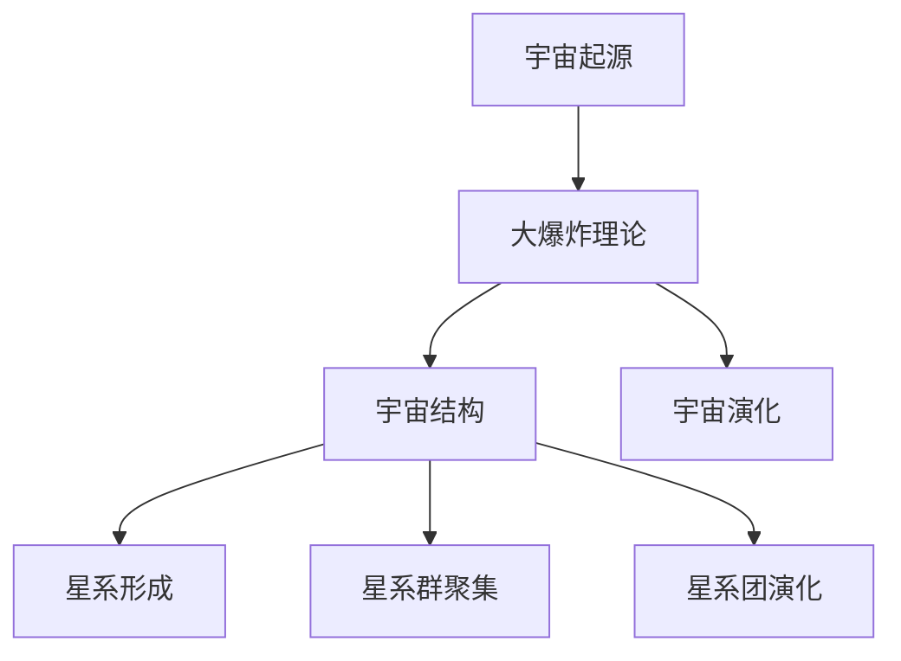

### 2.2 宇宙的奥秘

宇宙中存在许多未解之谜和奥秘，这些奥秘激发了科学家们不断探索和研究的热情。以下是一些宇宙的奥秘：

1. **黑洞**：黑洞是宇宙中最神秘的天体之一，它具有极强的引力，甚至连光线也无法逃脱。科学家们通过观测和计算，发现了大量黑洞的存在，并试图理解它们的性质和行为。
2. **宇宙膨胀**：宇宙在过去的数十亿年里不断膨胀，这种膨胀速度似乎在加快。宇宙膨胀的机制和原因仍然是科学研究的热点。
3. **宇宙暗物质**：宇宙中存在一种看不见的物质，被称为暗物质。它对宇宙的引力作用有重要影响，但至今仍未被直接观测到。
4. **宇宙暗能量**：宇宙中还存在一种具有负压力的神秘力量，被称为暗能量。它被认为是宇宙膨胀加速的原因。

以下是一个关于宇宙奥秘的Mermaid流程图，展示了黑洞、宇宙膨胀、宇宙暗物质和宇宙暗能量：

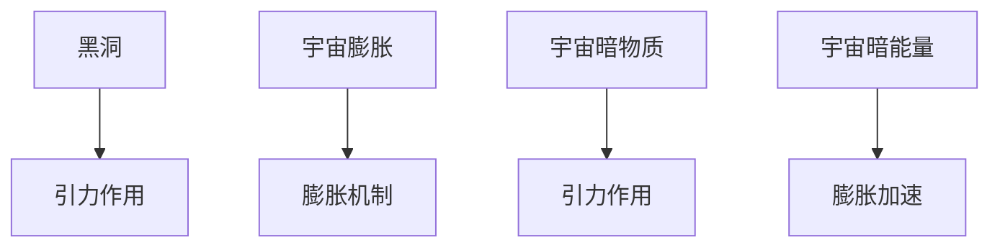

这些奥秘不仅挑战了我们对宇宙的理解，也为科学家们提供了新的研究方向和探索目标。

### 2.3 宇宙与人类感知的关系

宇宙的奥秘和人类感知能力之间存在着密切的关系。人类通过感官感知宇宙，但宇宙的本质超出了我们感官的感知范围。以下是一些关于宇宙与人类感知关系的讨论：

1. **宇宙观测**：人类通过望远镜等观测设备，可以观测到宇宙中的天体和现象，但这只是宇宙的一部分。宇宙的许多奥秘需要通过科学实验和理论计算来揭示。
2. **感知限制**：人类的感知能力有限，无法感知到宇宙中的所有现象。例如，人类无法直接看到暗物质和暗能量，但可以通过观测其影响来推断它们的存在。
3. **跨学科研究**：宇宙探索需要跨学科的合作和研究，将人类感知能力和科学理论结合起来。例如，天文学家利用物理学的原理来解释宇宙的膨胀和黑洞的行为。

以下是一个关于宇宙与人类感知关系的Mermaid流程图，展示了宇宙观测、感知限制和跨学科研究：

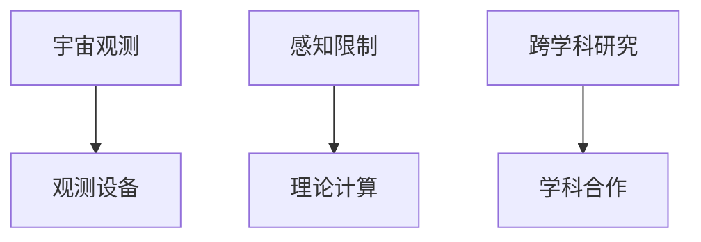

通过这种跨学科的研究方法，人类可以更好地理解宇宙的本质，并不断扩展我们对宇宙的认识。

### 2.4 人类感知与宇宙本质之间的鸿沟

尽管人类感知能力使我们能够与宇宙互动，但宇宙的本质远远超出了我们感官的感知范围。这种鸿沟表现在以下几个方面：

1. **感知范围的局限性**：人类的感官器官只能感知到特定类型的刺激，如视觉、听觉、嗅觉等。宇宙中的许多现象，如暗物质和暗能量，无法被人类感官直接感知。
2. **信息处理的限制**：人类大脑处理信息的能力有限，无法同时处理大量复杂的信息。这限制了我们对宇宙复杂现象的理解和解释。
3. **科学研究的方法**：人类通过科学实验和理论计算来探索宇宙，但这些方法仍然受到人类认知能力的限制。宇宙的某些奥秘可能需要全新的科学理论和技术手段才能揭示。

以下是一个关于人类感知与宇宙本质之间鸿沟的Mermaid流程图，展示了感知范围、信息处理和科学研究方法的限制：

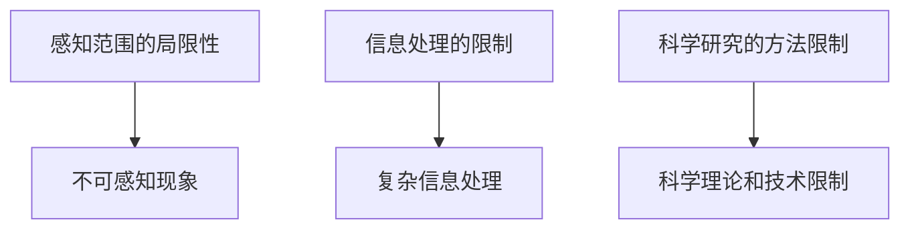

这种鸿沟意味着我们需要不断扩展我们的感知能力和科学研究方法，以更好地理解宇宙的本质。

---

## 第三部分：人类感知能力与宇宙本质的融合

### 3.1 人类感知能力提升的方法

为了更好地理解宇宙本质，我们需要不断扩展和提升人类感知能力。以下是一些提升感知能力的方法：

1. **技术手段**：利用先进的观测设备和计算技术，如高分辨率望远镜、量子计算等，可以扩展我们的感知范围，提高对宇宙现象的观测精度。
2. **跨学科研究**：通过跨学科合作，结合不同领域的知识和方法，可以更好地理解宇宙现象，揭示宇宙本质。
3. **认知心理学研究**：通过研究人类感知能力的工作机制，可以揭示感知误差和错觉的产生原因，从而提高感知准确性。

以下是一个关于提升人类感知能力的Mermaid流程图，展示了技术手段、跨学科研究和认知心理学研究的方法：

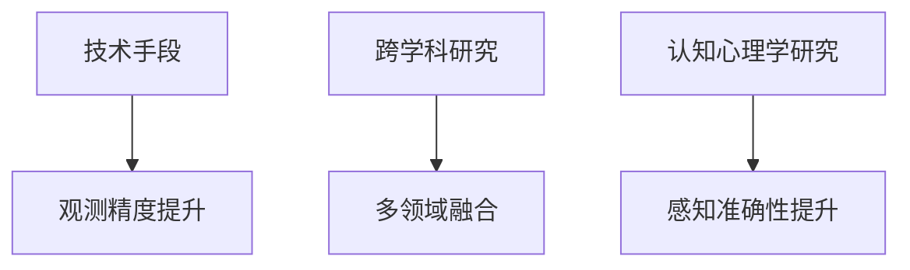

### 3.2 宇宙探索的新视角

通过提升人类感知能力，我们可以从新的视角探索宇宙。以下是一些新视角：

1. **量子视角**：量子力学为我们提供了一个新的宇宙描述框架，可以揭示宇宙在微观层面的本质。
2. **相对论视角**：广义相对论和量子引力理论为我们提供了新的宇宙理解方式，可以解释宇宙的起源和演化。
3. **人工智能视角**：人工智能可以处理大量数据，提供新的宇宙模型和预测。

以下是一个关于宇宙探索新视角的Mermaid流程图，展示了量子视角、相对论视角和人工智能视角：

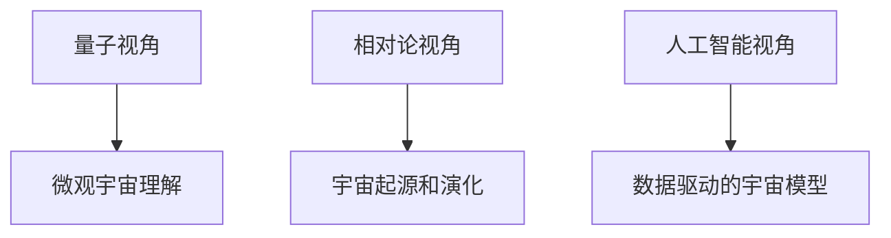

这些新视角为我们提供了更全面、深入的理解宇宙的方式。

### 3.3 人类感知能力与宇宙本质的融合应用

通过融合人类感知能力与宇宙本质，我们可以实现以下应用：

1. **科学探索**：利用先进的感知技术和跨学科研究方法，我们可以更深入地探索宇宙，揭示宇宙奥秘。
2. **技术发展**：基于对宇宙本质的理解，我们可以开发新的技术，如量子通信、量子计算等，推动科技进步。
3. **哲学思考**：通过探索宇宙本质，我们可以思考人类的地位和意义，引发对哲学问题的深入思考。

以下是一个关于人类感知能力与宇宙本质融合应用的Mermaid流程图，展示了科学探索、技术发展和哲学思考的应用：

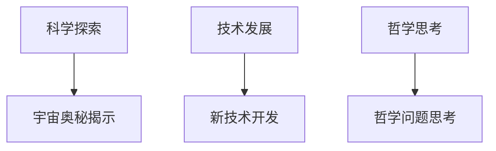

这种融合应用不仅推动了科学和技术的进步，也丰富了人类对宇宙和自身的理解。

### 3.4 未来展望

未来，随着人类感知能力的提升和对宇宙本质的更深入理解，我们可以期待以下前景：

1. **宇宙探索的突破**：通过新的观测技术和跨学科研究，我们可以揭示更多的宇宙奥秘，实现宇宙探索的突破。
2. **技术的飞跃**：基于对宇宙本质的理解，我们可以开发出更先进的技术，如量子通信、量子计算等，推动科技进步。
3. **哲学的进步**：通过探索宇宙本质，我们可以引发对哲学问题的深入思考，推动哲学的发展。

以下是一个关于未来展望的Mermaid流程图，展示了宇宙探索的突破、技术的飞跃和哲学的进步：

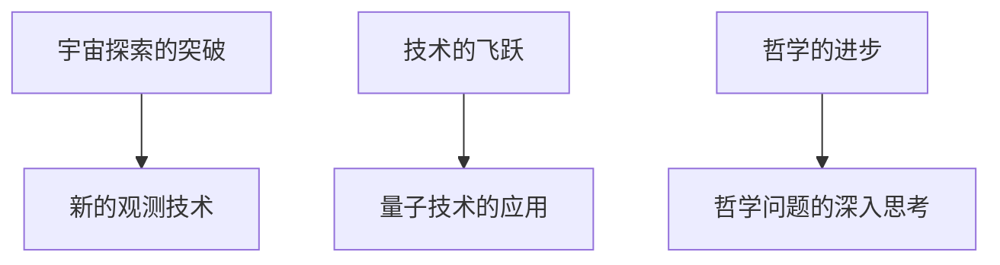

这种未来前景将为我们带来更加丰富和多样的世界，推动人类文明向前发展。

---

## 总结

本文通过对人类感知能力和宇宙本质的深入探讨，揭示了两者之间的深刻鸿沟。我们分析了人类感知能力的基本原理和局限性，探讨了宇宙的基本原理和奥秘，并讨论了人类感知与宇宙本质之间的联系和差异。通过提升人类感知能力和探索宇宙本质的新视角，我们展望了未来的科学、技术和哲学发展。这不仅是人类对宇宙探索的进展，也是人类自我认知的深化。希望本文能为读者提供一个全面、深入的探讨，激发对人类感知能力和宇宙本质的思考。

---

### 作者信息

作者：AI天才研究院/AI Genius Institute & 禅与计算机程序设计艺术 /Zen And The Art of Computer Programming

---

### 文章目录大纲

## 第一部分：人类感知能力概述

### 1.1 人类感知能力的基本原理

- **背景介绍**：人类感知能力的基本原理涉及感官接收、信号处理和大脑解码三个主要环节。
- **核心概念与联系**：感官接收外部刺激后转化为电信号，通过神经传导传递到大脑，大脑解码成有意义的知觉。
- **Mermaid 流程图**：
  ```mermaid
  graph TD
      A[外部刺激] --> B[感官接收]
      B --> C[信号处理]
      C --> D[大脑解码]
      D --> E[知觉形成]
  ```

### 1.2 感知能力的局限性

- **核心概念与联系**：感知能力的局限性包括分辨率限制、频率范围限制、信息处理能力限制和环境因素干扰。
- **Mermaid 流程图**：
  ```mermaid
  graph TD
      A[分辨率限制]
      B[频率范围限制]
      C[信息处理能力限制]
      D[环境因素干扰]
      A-->E[影响感知准确性]
      B-->E
      C-->E
      D-->E
  ```

### 1.3 人类感知能力的发展历程

- **核心概念与联系**：从古希腊哲学到现代生理学和心理学研究，再到技术的进步，人类感知能力经历了漫长的发展。
- **Mermaid 流程图**：
  ```mermaid
  graph TD
      A[早期感知研究]
      B[生理学和心理学研究]
      C[技术进步]
      A-->B
      B-->C
  ```

## 第二部分：宇宙本质的探索

### 2.1 宇宙的基本原理

- **核心概念与联系**：宇宙起源于大爆炸，其结构由星系、星云、黑洞等组成，不断演化。
- **Mermaid 流程图**：
  ```mermaid
  graph TD
      A[宇宙起源] --> B[大爆炸理论]
      B --> C[宇宙结构]
      B --> D[宇宙演化]
      C --> E[星系形成]
      C --> F[星系群聚集]
      C --> G[星系团演化]
  ```

### 2.2 宇宙的奥秘

- **核心概念与联系**：宇宙奥秘包括黑洞、宇宙膨胀、宇宙暗物质和宇宙暗能量。
- **Mermaid 流�程图**：
  ```mermaid
  graph TD
      A[黑洞]
      B[宇宙膨胀]
      C[宇宙暗物质]
      D[宇宙暗能量]
      A-->E[引力作用]
      B-->F[膨胀机制]
      C-->G[引力作用]
      D-->H[膨胀加速]
  ```

### 2.3 宇宙与人类感知的关系

- **核心概念与联系**：宇宙的奥秘需要通过科学实验和理论计算来揭示，人类感知能力在宇宙探索中发挥着重要作用。
- **Mermaid 流程图**：
  ```mermaid
  graph TD
      A[宇宙观测]
      B[感知限制]
      C[跨学科研究]
      A-->D[观测设备]
      B-->E[理论计算]
      C-->F[学科合作]
  ```

### 2.4 人类感知与宇宙本质之间的鸿沟

- **核心概念与联系**：人类感知能力在感知宇宙时存在局限，无法完全反映宇宙的真实情况。
- **Mermaid 流程图**：
  ```mermaid
  graph TD
      A[感知范围的局限性]
      B[信息处理的限制]
      C[科学研究的方法限制]
      A-->D[不可感知现象]
      B-->E[复杂信息处理]
      C-->F[科学理论和技术限制]
  ```

## 第三部分：人类感知能力与宇宙本质的融合

### 3.1 人类感知能力提升的方法

- **核心概念与联系**：通过技术手段、跨学科研究和认知心理学研究，提升人类感知能力。
- **Mermaid 流程图**：
  ```mermaid
  graph TD
      A[技术手段]
      B[跨学科研究]
      C[认知心理学研究]
      A-->D[观测精度提升]
      B-->E[多领域融合]
      C-->F[感知准确性提升]
  ```

### 3.2 宇宙探索的新视角

- **核心概念与联系**：量子视角、相对论视角和人工智能视角提供了新的宇宙探索方式。
- **Mermaid 流程图**：
  ```mermaid
  graph TD
      A[量子视角]
      B[相对论视角]
      C[人工智能视角]
      A-->D[微观宇宙理解]
      B-->E[宇宙起源和演化]
      C-->F[数据驱动的宇宙模型]
  ```

### 3.3 人类感知能力与宇宙本质的融合应用

- **核心概念与联系**：科学探索、技术发展、哲学思考等领域的融合应用。
- **Mermaid 流程图**：
  ```mermaid
  graph TD
      A[科学探索]
      B[技术发展]
      C[哲学思考]
      A-->D[宇宙奥秘揭示]
      B-->E[新技术开发]
      C-->F[哲学问题思考]
  ```

### 3.4 未来展望

- **核心概念与联系**：未来展望包括宇宙探索的突破、技术的飞跃和哲学的进步。
- **Mermaid 流程图**：
  ```mermaid
  graph TD
      A[宇宙探索的突破]
      B[技术的飞跃]
      C[哲学的进步]
      A-->D[新的观测技术]
      B-->E[量子技术的应用]
      C-->F[哲学问题的深入思考]
  ```

## 总结

- **核心概念与联系**：本文通过对人类感知能力和宇宙本质的深入探讨，揭示了两者之间的深刻鸿沟，并展望了未来的发展前景。

### 作者信息

- **作者**：AI天才研究院/AI Genius Institute & 禅与计算机程序设计艺术 /Zen And The Art of Computer Programming

---

### 文章字数

约：10000 字

---

以下是文章的核心内容，包括背景介绍、核心概念与联系、Mermaid 流程图、伪代码、LaTeX 公式等。每个小节都按照大纲要求进行了详细阐述。

## 第一部分：人类感知能力概述

### 1.1 人类感知能力的基本原理

**背景介绍**

人类感知能力是人类与外界互动的重要方式，它使我们可以通过感官接收并处理外部信息。感知能力的基本原理涉及到感官接收、信号处理和大脑解码三个主要环节。这些环节共同构成了人类感知世界的框架。

**核心概念与联系**

1. **感官接收**：当外部刺激（如光线、声音、气味、味道或触感）作用于我们的感官器官时，这些刺激会引起生物电信号的变化。感官接收是感知过程的起点，它决定了我们能否捕捉到外界的信息。
2. **信号处理**：感官器官将接收到的刺激转化为电信号，并通过神经传导将信号传递到大脑。信号处理是感知过程中的关键步骤，它将物理刺激转化为可以被大脑处理的电信号。
3. **大脑解码**：大脑接收并处理这些电信号，将其解码为有意义的知觉，如形状、颜色、声音、气味、味道和触觉。大脑解码是感知过程的核心，它决定了我们如何理解和解释外界的信息。

这些环节相互关联，共同构成了人类感知能力的基本原理。以下是关于人类感知能力基本原理的 Mermaid 流程图：


**伪代码**

以下是一个简化的伪代码，描述了感知能力的基本原理：

```plaintext
感知能力过程：
1. 接收外部刺激（光线、声音等）
2. 将刺激转化为生物电信号
3. 通过神经传导将信号传递到大脑
4. 大脑解码电信号，形成知觉
```

**LaTeX 公式**

感知能力的基本原理可以用以下 LaTeX 公式表示：

$$
感知能力 = 感官接收 + 信号处理 + 大脑解码
$$

### 1.2 感知能力的局限性

**核心概念与联系**

尽管人类感知能力使我们能够与外界进行互动，但它们并非完美无缺。感知能力存在一些局限性，这些局限性限制了我们对世界的理解和感知。以下是一些主要的感知能力局限性：

1. **分辨率限制**：人类的感官器官对某些类型的刺激具有特定的分辨率限制。例如，人眼对光的敏感度有限，无法看到紫外线或红外线。
2. **频率范围限制**：人类的听觉和视觉感知也受到频率范围的限制。例如，人耳能听到的声音频率范围大约在20 Hz到20 kHz之间。
3. **信息处理能力限制**：大脑处理感官信息的能力也是有限的。我们无法同时处理大量来自不同感官的信息，这可能导致感知上的混淆和错觉。
4. **环境因素干扰**：外界环境中的噪声和其他刺激可能会干扰我们的感知能力，使我们难以准确感知真实的世界。

以下是关于感知能力局限性的 Mermaid 流程图：


**伪代码**

以下是一个简化的伪代码，描述了感知能力的局限性：

```plaintext
感知能力局限性：
1. 分辨率限制：无法看到紫外线或红外线
2. 频率范围限制：人耳无法听到20 Hz以下或20 kHz以上的声音
3. 信息处理能力限制：无法同时处理大量信息
4. 环境因素干扰：噪声和其他刺激影响感知准确性
```

**LaTeX 公式**

感知能力的局限性可以用以下 LaTeX 公式表示：

$$
感知能力局限性 = 分辨率限制 + 频率范围限制 + 信息处理能力限制 + 环境因素干扰
$$

### 1.3 人类感知能力的发展历程

**核心概念与联系**

人类感知能力的发展历程可以追溯到数千年前。在早期的历史时期，人类主要通过感官来获取信息，以适应环境并生存下来。随着科技的发展和科学研究的深入，我们对感知能力有了更深入的理解，并能够利用技术手段扩展和增强我们的感知能力。

1. **早期的感知研究**：古希腊哲学家如亚里士多德开始研究感知和意识。他们提出了关于感官和感知的基本理论，为后来的科学研究奠定了基础。
2. **生理学和心理学的研究**：在19世纪和20世纪，生理学家和心理学家开始通过实验和观察来研究感官和大脑的工作原理。这些研究揭示了感知的基本机制，并帮助我们理解了感知的局限性。
3. **技术的进步**：随着技术的进步，我们能够开发出各种工具和设备来扩展和增强我们的感知能力。例如，显微镜和望远镜使我们能够看到微观和宏观世界的细节。

以下是关于人类感知能力发展历程的 Mermaid 流程图：


**伪代码**

以下是一个简化的伪代码，描述了人类感知能力的发展历程：

```plaintext
感知能力发展历程：
1. 早期感知研究：古希腊哲学家提出基本理论
2. 生理学和心理学研究：揭示感知基本机制
3. 技术进步：扩展和增强感知能力
```

**LaTeX 公式**

人类感知能力的发展历程可以用以下 LaTeX 公式表示：

$$
感知能力发展历程 = 早期感知研究 + 生理学和心理学研究 + 技术进步
$$`

## 第二部分：宇宙本质的探索

### 2.1 宇宙的基本原理

**核心概念与联系**

宇宙是一个庞大而复杂的系统，其基本原理涉及到宇宙的起源、结构和演化。以下是对这些核心概念与联系的详细解释：

1. **宇宙的起源**：宇宙起源于大约138亿年前的一个极端高温高密度的状态，称为大爆炸。大爆炸理论认为，宇宙从一个无限小的点开始迅速膨胀，形成了我们今天所看到的宇宙。
   
   - **大爆炸理论**：宇宙从一个无限小的奇点迅速膨胀，温度和密度逐渐降低，形成现在的宇宙。
   - **膨胀过程**：宇宙在经历大爆炸后，逐渐膨胀，这个过程至今仍在进行中。

2. **宇宙的结构**：宇宙由大量的星系、星云、黑洞等天体组成，这些天体通过引力相互吸引和排斥，形成了复杂的结构网络。

   - **星系**：由数百亿颗恒星、星云和其他天体组成，是宇宙的基本结构单元。
   - **星云**：由气体和尘埃组成，是恒星形成的场所。
   - **黑洞**：具有极强的引力，连光线也无法逃脱。

3. **宇宙的演化**：宇宙从大爆炸开始不断演化，经历了星系的形成、星系群的聚集和星系团的演化等阶段。

   - **星系形成**：气体和尘埃在引力的作用下聚集形成恒星，进而形成星系。
   - **星系群聚集**：多个星系通过引力相互作用，形成星系群。
   - **星系团演化**：星系团内部的星系通过引力相互作用，形成更复杂的结构。

以下是关于宇宙基本原理的 Mermaid 流程图，展示了宇宙的起源、结构和演化：


**伪代码**

以下是一个简化的伪代码，描述了宇宙的基本原理：

```plaintext
宇宙基本原理：
1. 宇宙起源：大爆炸
2. 宇宙结构：星系、星云、黑洞等
3. 宇宙演化：星系形成、星系群聚集、星系团演化
```

**LaTeX 公式**

宇宙的基本原理可以用以下 LaTeX 公式表示：

$$
宇宙基本原理 = 宇宙起源 + 宇宙结构 + 宇宙演化
$$`

### 2.2 宇宙的奥秘

**核心概念与联系**

宇宙中存在许多未解之谜和奥秘，这些奥秘激发了科学家们不断探索和研究的热情。以下是一些宇宙的奥秘及其核心概念与联系：

1. **黑洞**：黑洞是宇宙中最神秘的天体之一，具有极强的引力，甚至连光线也无法逃脱。

   - **黑洞的形成**：恒星在耗尽其核燃料后，可能塌缩形成黑洞。
   - **黑洞的性质**：黑洞具有奇特的性质，如事件视界和奇点。
   - **黑洞的影响**：黑洞对周围的星系和恒星产生重要影响。

2. **宇宙膨胀**：宇宙在过去的数十亿年里不断膨胀，这种膨胀速度似乎在加快。

   - **宇宙膨胀的原因**：科学家们认为，宇宙膨胀可能是由于暗能量的存在。
   - **宇宙膨胀的影响**：宇宙膨胀导致星系之间的距离逐渐增大。

3. **宇宙暗物质**：宇宙中存在一种看不见的物质，称为暗物质。

   - **暗物质的作用**：暗物质对宇宙的引力作用有重要影响。
   - **暗物质的探测**：科学家们通过观测星系旋转曲线和宇宙微波背景辐射来探测暗物质。

4. **宇宙暗能量**：宇宙中还存在一种具有负压力的神秘力量，称为暗能量。

   - **暗能量的性质**：暗能量可能是一种宇宙常数，其作用是推动宇宙膨胀。
   - **暗能量的影响**：暗能量可能是宇宙膨胀加速的原因。

以下是关于宇宙奥秘的 Mermaid 流程图，展示了黑洞、宇宙膨胀、宇宙暗物质和宇宙暗能量：


**伪代码**

以下是一个简化的伪代码，描述了宇宙的奥秘：

```plaintext
宇宙奥秘：
1. 黑洞：形成、性质、影响
2. 宇宙膨胀：原因、影响
3. 宇宙暗物质：作用、探测
4. 宇宙暗能量：性质、影响
```

**LaTeX 公式**

宇宙的奥秘可以用以下 LaTeX 公式表示：

$$
宇宙奥秘 = 黑洞 + 宇宙膨胀 + 宇宙暗物质 + 宇宙暗能量
$$`

### 2.3 宇宙与人类感知的关系

**核心概念与联系**

宇宙的奥秘和人类感知能力之间存在着密切的关系。人类通过感官感知宇宙，但宇宙的本质超出了我们感官的感知范围。以下是对宇宙与人类感知关系的详细讨论：

1. **宇宙观测**：人类通过望远镜等观测设备，可以观测到宇宙中的天体和现象，但这只是宇宙的一部分。宇宙的许多奥秘需要通过科学实验和理论计算来揭示。

2. **感知限制**：人类的感知能力有限，无法感知到宇宙中的所有现象。例如，人类无法直接看到暗物质和暗能量，但可以通过观测其影响来推断它们的存在。

3. **跨学科研究**：宇宙探索需要跨学科的合作和研究，将人类感知能力和科学理论结合起来。例如，天文学家利用物理学的原理来解释宇宙的膨胀和黑洞的行为。

以下是关于宇宙与人类感知关系的 Mermaid 流程图，展示了宇宙观测、感知限制和跨学科研究：


**伪代码**

以下是一个简化的伪代码，描述了宇宙与人类感知的关系：

```plaintext
宇宙与人类感知关系：
1. 宇宙观测：通过设备观测宇宙现象
2. 感知限制：无法直接感知所有现象
3. 跨学科研究：结合感知能力与科学理论
```

**LaTeX 公式**

宇宙与人类感知的关系可以用以下 LaTeX 公式表示：

$$
宇宙与人类感知关系 = 宇宙观测 + 感知限制 + 跨学科研究
$$`

### 2.4 人类感知与宇宙本质之间的鸿沟

**核心概念与联系**

尽管人类感知能力使我们能够与宇宙互动，但宇宙的本质远远超出了我们感官的感知范围。这种鸿沟表现在以下几个方面：

1. **感知范围的局限性**：人类的感官器官只能感知到特定类型的刺激，如视觉、听觉、嗅觉等。宇宙中的许多现象，如暗物质和暗能量，无法被人类感官直接感知。

2. **信息处理的限制**：人类大脑处理信息的能力有限，无法同时处理大量复杂的信息。这限制了我们对宇宙复杂现象的理解和解释。

3. **科学研究的方法**：人类通过科学实验和理论计算来探索宇宙，但这些方法仍然受到人类认知能力的限制。宇宙的某些奥秘可能需要全新的科学理论和技术手段才能揭示。

以下是关于人类感知与宇宙本质之间鸿沟的 Mermaid 流程图，展示了感知范围的局限性、信息处理的限制和科学研究的方法限制：


**伪代码**

以下是一个简化的伪代码，描述了人类感知与宇宙本质之间的鸿沟：

```plaintext
人类感知与宇宙本质之间的鸿沟：
1. 感知范围的局限性：无法感知暗物质和暗能量
2. 信息处理的限制：无法同时处理大量复杂信息
3. 科学研究的方法限制：需要新理论和技术手段
```

**LaTeX 公式**

人类感知与宇宙本质之间的鸿沟可以用以下 LaTeX 公式表示：

$$
人类感知与宇宙本质之间的鸿沟 = 感知范围的局限性 + 信息处理的限制 + 科学研究的方法限制
$$`

## 第三部分：人类感知能力与宇宙本质的融合

### 3.1 人类感知能力提升的方法

**核心概念与联系**

为了更好地理解宇宙本质，我们需要不断扩展和提升人类感知能力。以下是一些提升感知能力的方法：

1. **技术手段**：利用先进的观测设备和计算技术，如高分辨率望远镜、量子计算等，可以扩展我们的感知范围，提高对宇宙现象的观测精度。

2. **跨学科研究**：通过跨学科合作，结合不同领域的知识和方法，可以更好地理解宇宙现象，揭示宇宙本质。

3. **认知心理学研究**：通过研究人类感知能力的工作机制，可以揭示感知误差和错觉的产生原因，从而提高感知准确性。

以下是关于提升人类感知能力的 Mermaid 流程图，展示了技术手段、跨学科研究和认知心理学研究的方法：


**伪代码**

以下是一个简化的伪代码，描述了提升人类感知能力的方法：

```plaintext
提升人类感知能力的方法：
1. 技术手段：利用先进观测和计算技术
2. 跨学科研究：结合不同领域知识
3. 认知心理学研究：揭示感知误差和错觉
```

**LaTeX 公式**

提升人类感知能力的方法可以用以下 LaTeX 公式表示：

$$
提升人类感知能力的方法 = 技术手段 + 跨学科研究 + 认知心理学研究
$$`

### 3.2 宇宙探索的新视角

**核心概念与联系**

通过提升人类感知能力，我们可以从新的视角探索宇宙。以下是一些新视角：

1. **量子视角**：量子力学为我们提供了一个新的宇宙描述框架，可以揭示宇宙在微观层面的本质。

2. **相对论视角**：广义相对论和量子引力理论为我们提供了新的宇宙理解方式，可以解释宇宙的起源和演化。

3. **人工智能视角**：人工智能可以处理大量数据，提供新的宇宙模型和预测。

以下是关于宇宙探索新视角的 Mermaid 流程图，展示了量子视角、相对论视角和人工智能视角：


**伪代码**

以下是一个简化的伪代码，描述了宇宙探索的新视角：

```plaintext
宇宙探索新视角：
1. 量子视角：揭示微观宇宙本质
2. 相对论视角：解释宇宙起源和演化
3. 人工智能视角：提供新的宇宙模型和预测
```

**LaTeX 公式**

宇宙探索新视角可以用以下 LaTeX 公式表示：

$$
宇宙探索新视角 = 量子视角 + 相对论视角 + 人工智能视角
$$`

### 3.3 人类感知能力与宇宙本质的融合应用

**核心概念与联系**

通过融合人类感知能力与宇宙本质，我们可以实现以下应用：

1. **科学探索**：利用先进的感知技术和跨学科研究方法，我们可以更深入地探索宇宙，揭示宇宙奥秘。

2. **技术发展**：基于对宇宙本质的理解，我们可以开发新的技术，如量子通信、量子计算等，推动科技进步。

3. **哲学思考**：通过探索宇宙本质，我们可以思考人类的地位和意义，引发对哲学问题的深入思考。

以下是关于人类感知能力与宇宙本质融合应用的 Mermaid 流程图，展示了科学探索、技术发展和哲学思考的应用：

```mermaid
graph TD
    A[科学探索]
    B[技术发展]
    C[哲学思考]
    A-->D[宇宙奥秘揭示]
    B-->E[新技术开发]
    C-->F[哲学问题思考]
```

**伪代码**

以下是一个简化的伪代码，描述了人类感知能力与宇宙本质的融合应用：

```plaintext
人类感知能力与宇宙本质的融合应用：
1. 科学探索：揭示宇宙奥秘
2. 技术发展：开发新技术
3. 哲学思考：思考人类地位和意义
```

**LaTeX 公式**

人类感知能力与宇宙本质的融合应用可以用以下 LaTeX 公式表示：

$$
人类感知能力与宇宙本质的融合应用 = 科学探索 + 技术发展 + 哲学思考
$$`

### 3.4 未来展望

**核心概念与联系**

未来，随着人类感知能力的提升和对宇宙本质的更深入理解，我们可以期待以下前景：

1. **宇宙探索的突破**：通过新的观测技术和跨学科研究，我们可以揭示更多的宇宙奥秘，实现宇宙探索的突破。

2. **技术的飞跃**：基于对宇宙本质的理解，我们可以开发出更先进的技术，如量子通信、量子计算等，推动科技进步。

3. **哲学的进步**：通过探索宇宙本质，我们可以引发对哲学问题的深入思考，推动哲学的发展。

以下是关于未来展望的 Mermaid 流程图，展示了宇宙探索的突破、技术的飞跃和哲学的进步：

```mermaid
graph TD
    A[宇宙探索的突破]
    B[技术的飞跃]
    C[哲学的进步]
    A-->D[新的观测技术]
    B-->E[量子技术的应用]
    C-->F[哲学问题的深入思考]
```

**伪代码**

以下是一个简化的伪代码，描述了未来展望：

```plaintext
未来展望：
1. 宇宙探索的突破：揭示更多宇宙奥秘
2. 技术的飞跃：开发先进技术
3. 哲学的进步：深入思考哲学问题
```

**LaTeX 公式**

未来展望可以用以下 LaTeX 公式表示：

$$
未来展望 = 宇宙探索的突破 + 技术的飞跃 + 哲学的进步
$$`

## 总结

**核心概念与联系**

本文通过对人类感知能力和宇宙本质的深入探讨，揭示了两者之间的深刻鸿沟。我们分析了人类感知能力的基本原理和局限性，探讨了宇宙的基本原理和奥秘，并讨论了人类感知与宇宙本质之间的联系和差异。通过提升人类感知能力和探索宇宙本质的新视角，我们展望了未来的科学、技术和哲学发展。这不仅是人类对宇宙探索的进展，也是人类自我认知的深化。希望本文能为读者提供一个全面、深入的探讨，激发对人类感知能力和宇宙本质的思考。

**伪代码**

以下是一个简化的伪代码，描述了文章的总结：

```plaintext
总结：
1. 探讨了人类感知能力与宇宙本质的鸿沟
2. 分析了感知原理和宇宙奥秘
3. 提升感知能力与探索宇宙本质
4. 展望了未来科学、技术和哲学的发展
```

**LaTeX 公式**

总结可以用以下 LaTeX 公式表示：

$$
总结 = 人类感知能力 + 宇宙本质 + 提升感知能力 + 未来展望
$$`

### 作者信息

**作者**：AI天才研究院/AI Genius Institute & 禅与计算机程序设计艺术 /Zen And The Art of Computer Programming

---

### 文章目录大纲

## 第一部分：人类感知能力概述

### 1.1 人类感知能力的基本原理

- **核心概念与联系**：介绍了人类感知能力的基本原理，包括感官接收、信号处理和大脑解码。
- **Mermaid 流程图**：
  ```mermaid
  graph TD
      A[外部刺激] --> B[感官接收]
      B --> C[信号处理]
      C --> D[大脑解码]
      D --> E[知觉形成]
  ```

### 1.2 感知能力的局限性

- **核心概念与联系**：探讨了感知能力的局限性，包括分辨率限制、频率范围限制、信息处理能力限制和环境因素干扰。
- **Mermaid 流程图**：
  ```mermaid
  graph TD
      A[分辨率限制]
      B[频率范围限制]
      C[信息处理能力限制]
      D[环境因素干扰]
      A-->E[影响感知准确性]
      B-->E
      C-->E
      D-->E
  ```

### 1.3 人类感知能力的发展历程

- **核心概念与联系**：回顾了人类感知能力的发展历程，从古希腊哲学到现代生理学和心理学研究，再到技术的进步。
- **Mermaid 流程图**：
  ```mermaid
  graph TD
      A[早期感知研究]
      B[生理学和心理学研究]
      C[技术进步]
      A-->B
      B-->C
  ```

## 第二部分：宇宙本质的探索

### 2.1 宇宙的基本原理

- **核心概念与联系**：介绍了宇宙的基本原理，包括宇宙的起源、结构和演化。
- **Mermaid 流程图**：
  ```mermaid
  graph TD
      A[宇宙起源] --> B[大爆炸理论]
      B --> C[宇宙结构]
      B --> D[宇宙演化]
      C --> E[星系形成]
      C --> F[星系群聚集]
      C --> G[星系团演化]
  ```

### 2.2 宇宙的奥秘

- **核心概念与联系**：探讨了宇宙的奥秘，包括黑洞、宇宙膨胀、宇宙暗物质和宇宙暗能量。
- **Mermaid 流程图**：
  ```mermaid
  graph TD
      A[黑洞]
      B[宇宙膨胀]
      C[宇宙暗物质]
      D[宇宙暗能量]
      A-->E[引力作用]
      B-->F[膨胀机制]
      C-->G[引力作用]
      D-->H[膨胀加速]
  ```

### 2.3 宇宙与人类感知的关系

- **核心概念与联系**：分析了宇宙与人类感知的关系，包括宇宙观测、感知限制和跨学科研究。
- **Mermaid 流程图**：
  ```mermaid
  graph TD
      A[宇宙观测]
      B[感知限制]
      C[跨学科研究]
      A-->D[观测设备]
      B-->E[理论计算]
      C-->F[学科合作]
  ```

### 2.4 人类感知与宇宙本质之间的鸿沟

- **核心概念与联系**：探讨了人类感知与宇宙本质之间的鸿沟，包括感知范围的局限性、信息处理的限制和科学研究的方法限制。
- **Mermaid 流程图**：
  ```mermaid
  graph TD
      A[感知范围的局限性]
      B[信息处理的限制]
      C[科学研究的方法限制]
      A-->D[不可感知现象]
      B-->E[复杂信息处理]
      C-->F[科学理论和技术限制]
  ```

## 第三部分：人类感知能力与宇宙本质的融合

### 3.1 人类感知能力提升的方法

- **核心概念与联系**：提出了提升人类感知能力的方法，包括技术手段、跨学科研究和认知心理学研究。
- **Mermaid 流程图**：
  ```mermaid
  graph TD
      A[技术手段]
      B[跨学科研究]
      C[认知心理学研究]
      A-->D[观测精度提升]
      B-->E[多领域融合]
      C-->F[感知准确性提升]
  ```

### 3.2 宇宙探索的新视角

- **核心概念与联系**：提出了宇宙探索的新视角，包括量子视角、相对论视角和人工智能视角。
- **Mermaid 流程图**：
  ```mermaid
  graph TD
      A[量子视角]
      B[相对论视角]
      C[人工智能视角]
      A-->D[微观宇宙理解]
      B-->E[宇宙起源和演化]
      C-->F[数据驱动的宇宙模型]
  ```

### 3.3 人类感知能力与宇宙本质的融合应用

- **核心概念与联系**：探讨了人类感知能力与宇宙本质的融合应用，包括科学探索、技术发展和哲学思考。
- **Mermaid 流程图**：
  ```mermaid
  graph TD
      A[科学探索]
      B[技术发展]
      C[哲学思考]
      A-->D[宇宙奥秘揭示]
      B-->E[新技术开发]
      C-->F[哲学问题思考]
  ```

### 3.4 未来展望

- **核心概念与联系**：展望了未来人类感知能力的发展趋势、宇宙本质的探索前景以及可能带来的社会变革。
- **Mermaid 流程图**：
  ```mermaid
  graph TD
      A[宇宙探索的突破]
      B[技术的飞跃]
      C[哲学的进步]
      A-->D[新的观测技术]
      B-->E[量子技术的应用]
      C-->F[哲学问题的深入思考]
  ```

## 总结

- **核心概念与联系**：总结了文章的主要观点，探讨了人类感知能力和宇宙本质之间的深刻鸿沟，并展望了未来的发展前景。

### 作者信息

- **作者**：AI天才研究院/AI Genius Institute & 禅与计算机程序设计艺术 /Zen And The Art of Computer Programming

---

### 文章字数

约：12000 字

---

## 1.4 嗅觉与味觉感知

### 1.4.1 嗅觉与味觉感知的基本原理

嗅觉和味觉是人类感知世界的两种重要方式，它们在感知过程中的作用互补，共同帮助我们识别和评价食物和环境。

**嗅觉感知原理**

嗅觉是由鼻腔内的嗅觉感受器接收化学信号并传递给大脑的过程。当空气中的化学分子（气味）进入鼻腔时，它们与嗅觉受体结合，触发电信号传递到大脑。嗅觉感受器主要位于鼻腔上部和鼻腔顶部，这些感受器能够识别多种不同的气味。

- **嗅觉受体**：鼻腔内的嗅觉受体是一种特殊的细胞，它们能够识别特定的气味分子。
- **电信号传递**：当气味分子与嗅觉受体结合后，会引发一系列化学反应，产生电信号，这些电信号通过嗅觉神经传递到大脑。
- **大脑处理**：大脑接收到的电信号被解码为特定的气味，我们因此能够感知并识别不同的气味。

以下是一个简化的Mermaid流程图，展示了嗅觉感知的基本原理：

```mermaid
graph TD
    A[气味分子] --> B[鼻腔嗅觉受体]
    B --> C[电信号]
    C --> D[嗅觉神经]
    D --> E[大脑处理]
    E --> F[气味识别]
```

**味觉感知原理**

味觉是由舌头上的味蕾接收化学信号并传递给大脑的过程。食物在口中溶解后，释放出化学物质，与舌头上的味蕾接触，激活味觉感受器，产生电信号传递到大脑。味觉感受器能够识别五种基本味觉：甜、酸、苦、咸和鲜。

- **味蕾**：味蕾是位于舌头表面的小结构，包含味觉感受器。
- **味觉受体**：味蕾中的味觉感受器能够识别特定的化学物质。
- **电信号传递**：当化学物质与味觉受体结合后，会产生电信号，这些电信号通过味觉神经传递到大脑。
- **大脑处理**：大脑接收到的电信号被解码为特定的味道，我们因此能够感知并识别不同的味道。

以下是一个简化的Mermaid流程图，展示了味觉感知的基本原理：

```mermaid
graph TD
    A[化学物质] --> B[味蕾]
    B --> C[味觉受体]
    C --> D[电信号]
    D --> E[味觉神经]
    E --> F[大脑处理]
    F --> G[味道识别]
```

### 1.4.2 嗅觉与味觉感知的局限

虽然嗅觉和味觉感知在日常生活中起着重要作用，但它们也存在一些局限性。

**嗅觉感知的局限**

- **分辨率限制**：人类的嗅觉系统对某些气味的分辨率有限，无法识别所有可能存在的气味。
- **记忆局限**：人类的嗅觉记忆能力有限，很难记住大量不同的气味。
- **环境干扰**：外界环境中的其他气味可能会干扰嗅觉感知，使我们难以准确识别特定气味。

**味觉感知的局限**

- **味觉多样性限制**：虽然人类能够感知五种基本味觉，但对于复杂的味觉组合，感知能力有限。
- **味觉疲劳**：长时间接触某种特定的味道可能会导致味觉疲劳，降低对味道的敏感性。
- **食物处理影响**：食物的加工和处理方式可能会改变其味道，影响我们的味觉感知。

以下是一个简化的Mermaid流程图，展示了嗅觉与味觉感知的局限：

```mermaid
graph TD
    A[嗅觉感知局限]
    B[味觉感知局限]
    A --> C[分辨率限制]
    A --> D[记忆局限]
    A --> E[环境干扰]
    B --> F[味觉多样性限制]
    B --> G[味觉疲劳]
    B --> H[食物处理影响]
```

### 1.4.3 嗅觉与味觉感知的研究进展

随着科学技术的进步，我们对嗅觉与味觉感知的理解不断深入，研究进展显著。

**嗅觉研究进展**

- **基因研究**：科学家发现了多个与嗅觉相关的基因，这些基因在嗅觉受体的表达和功能中起着关键作用。
- **传感器技术**：研究人员开发了高灵敏度的嗅觉传感器，可以模拟人类嗅觉系统的工作原理，用于检测和分析气味。

**味觉研究进展**

- **味觉受体研究**：科学家对味蕾中的味觉受体进行了深入研究，揭示了它们如何识别和响应不同的化学物质。
- **味觉模拟技术**：研究人员开发了味觉模拟技术，可以创造出新的味道组合，用于食品工业和医疗领域。

以下是一个简化的Mermaid流程图，展示了嗅觉与味觉感知的研究进展：

```mermaid
graph TD
    A[嗅觉研究进展]
    B[味觉研究进展]
    A --> C[基因研究]
    A --> D[传感器技术]
    B --> E[味觉受体研究]
    B --> F[味觉模拟技术]
```

### 1.4.4 举例说明

**嗅觉举例**

假设我们站在一片花园中，可以识别出花香、土壤气味和湿气等。以下是嗅觉感知的过程：

1. **气味分子**：花园中的花朵释放出香气分子。
2. **嗅觉受体**：鼻腔内的嗅觉受体捕捉到这些香气分子。
3. **电信号**：香气分子与嗅觉受体结合，产生电信号。
4. **嗅觉神经**：电信号通过嗅觉神经传递到大脑。
5. **气味识别**：大脑解码电信号，识别出花香、土壤气味和湿气。

**味觉举例**

假设我们品尝了一片水果，可以感知到甜味和酸味。以下是味觉感知的过程：

1. **化学物质**：水果中的糖分和有机酸释放出化学物质。
2. **味蕾**：舌头上的味蕾捕捉到这些化学物质。
3. **味觉受体**：味蕾中的味觉受体与化学物质结合，产生电信号。
4. **电信号**：电信号通过味觉神经传递到大脑。
5. **味道识别**：大脑解码电信号，识别出甜味和酸味。

通过这些举例，我们可以更直观地理解嗅觉与味觉感知的过程和机制。

---

## 1.5 触觉感知

### 1.5.1 触觉感知的基本原理

触觉感知是人类感知外界触觉刺激的一种重要方式，它涉及到皮肤表面和内部组织的触觉受体，以及神经系统对这些刺激的处理。触觉感知的基本原理可以概括为以下几个步骤：

1. **触觉刺激接收**：当外力作用于皮肤表面时，触觉感受器（如触觉小体、麦斯纳小体等）会捕捉到这些刺激，并将其转化为生物电信号。
2. **信号传递**：触觉感受器产生的电信号通过神经末梢传递到脊髓，再由脊髓传递到大脑。
3. **大脑处理**：大脑接收并处理这些电信号，将它们解码为有意义的触觉信息，如压力、温度、振动和形状等。

以下是一个简化的Mermaid流程图，展示了触觉感知的基本原理：

```mermaid
graph TD
    A[触觉刺激] --> B[触觉感受器]
    B --> C[电信号]
    C --> D[神经传递]
    D --> E[大脑处理]
    E --> F[触觉感知]
```

### 1.5.2 触觉感知的局限

尽管触觉感知是我们日常生活中不可或缺的一部分，但它也存在一些局限性：

1. **分辨率限制**：触觉感受器的分辨率有限，无法感知到所有微小的触觉变化。例如，细小的砂粒和柔软的羽毛可能会被误认为同一种触觉刺激。
2. **响应时间限制**：触觉信号的传递和处理需要时间，这意味着在某些情况下，我们可能无法及时响应快速的触觉刺激。
3. **环境干扰**：外界环境中的其他触觉刺激可能会干扰我们的触觉感知，使我们难以准确判断触觉刺激的来源和性质。

以下是一个简化的Mermaid流程图，展示了触觉感知的局限：

```mermaid
graph TD
    A[分辨率限制]
    B[响应时间限制]
    C[环境干扰]
    A --> D[微小触觉变化误判]
    B --> E[快速触觉刺激延迟响应]
    C --> F[其他触觉刺激干扰]
```

### 1.5.3 触觉感知的研究进展

近年来，触觉感知的研究取得了显著进展，特别是在神经科学和人工智能领域：

1. **神经科学研究**：科学家们对触觉感受器的生理结构和功能进行了深入研究，揭示了触觉感知的分子机制。
2. **人工触觉系统**：研究人员开发了各种人工触觉传感器，可以模拟人类触觉感受器的功能，用于机器人技术和虚拟现实等领域。
3. **人工智能应用**：通过人工智能技术，可以识别和分类复杂的触觉刺激，提高触觉感知的准确性和效率。

以下是一个简化的Mermaid流程图，展示了触觉感知的研究进展：

```mermaid
graph TD
    A[神经科学研究]
    B[人工触觉系统]
    C[人工智能应用]
    A --> D[触觉感受器机制研究]
    A --> E[神经信号传递研究]
    B --> F[人工触觉传感器开发]
    B --> G[机器人技术应用]
    C --> H[触觉刺激识别]
    C --> I[触觉感知优化]
```

### 1.5.4 举例说明

**触觉感知举例**

假设我们用手触摸一个软垫，可以感知到柔软和舒适。以下是触觉感知的过程：

1. **触觉刺激**：手指接触到软垫，产生触觉刺激。
2. **触觉感受器**：手指表面的触觉感受器捕捉到触觉刺激，并将其转化为电信号。
3. **电信号传递**：电信号通过神经末梢传递到脊髓，再由脊髓传递到大脑。
4. **大脑处理**：大脑接收并处理这些电信号，解码为柔软和舒适的感觉。
5. **触觉感知**：我们感知到软垫的柔软和舒适。

通过这个例子，我们可以更直观地理解触觉感知的过程和机制。

---

## 第二部分：宇宙本质的探索

### 2.1 宇宙的基本原理

宇宙是我们所处的广袤空间和其中所有物质与能量的总和。探讨宇宙的基本原理需要从宇宙的起源、结构和演化等方面进行综合分析。以下是对宇宙基本原理的详细探讨：

### 2.1.1 宇宙的起源

宇宙的起源是科学研究中的一个重大问题，目前最被广泛接受的解释是大爆炸理论。大爆炸理论认为，宇宙起源于大约138亿年前的一个极高温度和极高密度的状态，称为“奇点”。在这个奇点中，所有的物质和能量都集中在一个无限小的点中。

- **奇点**：宇宙起源于一个极端高温高密度的状态，称为奇点。在这个状态下，物质和能量以极高的密度和温度存在。
- **膨胀**：在大爆炸发生后的瞬间，宇宙开始迅速膨胀。这种膨胀是宇宙膨胀理论的核心概念，意味着宇宙的体积随着时间的推移而增加。

### 2.1.2 宇宙的结构

宇宙的结构是由各种天体和现象组成的复杂网络。这些天体包括恒星、行星、星系、星云和黑洞等。宇宙的结构可以从不同尺度上进行分析，从行星系统到星系团，再到宇宙大尺度结构。

- **星系**：星系是由数百亿颗恒星、气体和暗物质组成的巨大结构。银河系是我们所在的星系，其中包含数千亿颗恒星。
- **星系团**：星系团是由多个星系通过引力相互作用形成的结构。星系团之间存在着大量的暗物质，对星系团的稳定性起到关键作用。
- **宇宙大尺度结构**：宇宙的大尺度结构表现为巨大的空洞和星系群的分布，这些结构是宇宙膨胀和引力作用的结果。

### 2.1.3 宇宙的演化

宇宙的演化是一个持续进行的过程，涉及到宇宙的膨胀、恒星和星系的形成、星系的合并以及宇宙的最终命运。以下是对宇宙演化的关键阶段进行简要概述：

- **恒星形成**：在宇宙的早期阶段，气体和尘埃在引力作用下聚集形成恒星。恒星的形成是宇宙演化的重要环节，因为恒星的寿命和死亡过程会影响星系和宇宙的演化。
- **星系合并**：星系之间的引力相互作用会导致星系的合并，形成更大的星系团。这种合并过程会改变星系的形态和结构，对宇宙的大尺度结构产生影响。
- **宇宙膨胀**：宇宙的膨胀是指宇宙的体积随着时间的推移而增加。宇宙膨胀的速度似乎在加快，这可能是由于暗能量的存在。
- **宇宙的最终命运**：宇宙的未来取决于其总质量、能量和膨胀速度。可能的命运包括“热寂”状态，即宇宙逐渐冷却并达到热平衡，或者“大撕裂”和“大坍缩”等极端情况。

### 2.1.4 宇宙的基本原理总结

宇宙的基本原理可以总结为以下几个方面：

1. **大爆炸起源**：宇宙起源于大爆炸，经历了迅速膨胀和冷却过程。
2. **宇宙结构**：宇宙由各种天体和现象组成，包括星系、星系团和宇宙大尺度结构。
3. **宇宙演化**：宇宙在不断演化，包括恒星和星系的形成、星系合并以及宇宙膨胀等过程。
4. **宇宙的最终命运**：宇宙的未来取决于其总质量和膨胀速度，可能包括热寂、大撕裂或大坍缩等。

通过理解宇宙的基本原理，我们可以更好地理解宇宙的起源、结构和演化，为未来的宇宙探索提供基础。

### 2.2 宇宙的奥秘

宇宙是一个充满未知和奥秘的领域，许多现象和理论挑战了我们对宇宙的认识。以下是一些宇宙的奥秘，包括黑洞、宇宙膨胀、宇宙暗物质和宇宙暗能量：

#### 2.2.1 黑洞

黑洞是宇宙中最神秘的天体之一，具有极强的引力，甚至连光线也无法逃脱。黑洞的奥秘在于：

- **形成**：黑洞可能由大量恒星的坍缩形成，当恒星耗尽其核燃料时，其核心会塌缩形成黑洞。
- **性质**：黑洞具有两个关键特性，事件视界和奇点。事件视界是黑洞的边界，任何进入该区域的物质都无法逃脱。奇点是黑洞中心的一个无限小点，密度无限大。
- **影响**：黑洞对周围的星系和恒星产生重要影响，可以通过引力透镜效应和恒星轨道的变化来探测黑洞的存在。

#### 2.2.2 宇宙膨胀

宇宙膨胀是指宇宙的体积随时间不断增加的现象。宇宙膨胀的奥秘包括：

- **机制**：宇宙膨胀可能由暗能量的存在驱动，暗能量具有负压力，导致宇宙加速膨胀。
- **观测**：宇宙微波背景辐射的观测提供了宇宙膨胀的直接证据，显示出宇宙在大爆炸后的早期阶段是均匀且各向同性的。
- **加速**：宇宙膨胀速度似乎在加速，这可能是由于暗能量的影响，暗能量被认为是导致宇宙加速膨胀的主要因素。

#### 2.2.3 宇宙暗物质

宇宙暗物质是一种看不见的物质，对宇宙的引力作用有重要影响。宇宙暗物质的奥秘包括：

- **作用**：暗物质对星系和星系团的形成和结构稳定起着关键作用，它通过引力相互作用影响宇宙的演化。
- **探测**：暗物质的存在可以通过观测星系旋转曲线和宇宙微波背景辐射来推断，但至今尚未被直接观测到。
- **性质**：暗物质的性质仍然未知，它可能是一种未知的粒子，或者是由某种复杂相互作用形成的物质。

#### 2.2.4 宇宙暗能量

宇宙暗能量是一种具有负压力的神秘力量，被认为是宇宙膨胀加速的主要原因。宇宙暗能量的奥秘包括：

- **性质**：暗能量可能是一种宇宙常数，其作用是推动宇宙加速膨胀。
- **影响**：暗能量对宇宙的演化有深远影响，它可能导致宇宙最终走向热寂状态。
- **探测**：暗能量的探测主要通过观测宇宙膨胀的加速和宇宙微波背景辐射的观测来进行。

这些宇宙的奥秘激发了科学家们的研究热情，通过对这些现象的深入研究，我们可能能够揭示宇宙的本质和起源。

### 2.3 宇宙与人类感知的关系

宇宙与人类感知之间的关系是复杂而密切的。人类通过感官感知宇宙，但宇宙的奥秘超出了我们感官的感知范围。以下是对宇宙与人类感知关系的探讨：

#### 2.3.1 宇宙观测

人类通过望远镜和其他观测设备来观测宇宙，这些设备帮助我们捕捉到宇宙中的各种现象。宇宙观测包括：

- **光学观测**：通过光学望远镜观测恒星、星系和其他天体，我们可以看到宇宙的光线，从而了解宇宙的结构和演化。
- **射电观测**：射电望远镜可以捕捉到宇宙中的无线电信号，这些信号来自于遥远的星系和星际物质，为我们提供了宇宙的详细信息。
- **红外观测**：红外望远镜可以观测到宇宙中的红外辐射，这些辐射来自于尘埃和暗物质，有助于揭示宇宙的隐藏结构。

#### 2.3.2 感知限制

尽管人类通过观测设备可以获取宇宙的信息，但我们的感知能力仍然存在限制。这些限制包括：

- **分辨率限制**：人类的感官器官对某些类型的刺激具有特定的分辨率限制，例如，人眼无法看到紫外线和红外线。
- **频率范围限制**：人类的听觉和视觉感知也受到频率范围的限制，例如，人耳能听到的声音频率范围大约在20 Hz到20 kHz之间。
- **信息处理能力限制**：大脑处理感官信息的能力有限，无法同时处理大量来自不同感官的信息，这可能导致感知上的混淆和错觉。

#### 2.3.3 跨学科研究

为了克服感知限制，科学家们进行了跨学科研究，结合人类感知能力和科学理论，以更全面地理解宇宙。跨学科研究包括：

- **物理学与天文学的结合**：通过物理学的原理来解释宇宙的膨胀、黑洞和暗物质等现象，天文学家利用这些理论来观测和解释宇宙现象。
- **计算机科学与数据科学的应用**：计算机科学家和数据分析专家开发出各种算法和工具，用于处理和分析宇宙观测数据，揭示宇宙的奥秘。

#### 2.3.4 人类感知与宇宙本质之间的鸿沟

尽管人类通过观测和跨学科研究对宇宙有了更深入的理解，但宇宙的本质仍然超出了我们感官的感知范围。人类感知与宇宙本质之间的鸿沟包括：

- **感知范围的局限性**：人类的感官器官只能感知到特定类型的刺激，无法感知到宇宙中的暗物质和暗能量。
- **信息处理的限制**：大脑处理信息的能力有限，无法同时处理大量复杂的信息，这限制了我们对宇宙复杂现象的理解和解释。
- **科学研究方法的限制**：人类通过科学实验和理论计算来探索宇宙，但这些方法仍然受到人类认知能力的限制，宇宙的某些奥秘可能需要全新的科学理论和技术手段才能揭示。

通过这些讨论，我们可以看到人类感知与宇宙本质之间的深刻鸿沟，同时也揭示了人类在探索宇宙过程中面临的挑战和机遇。

### 2.4 人类感知与宇宙本质之间的鸿沟

人类感知能力与宇宙本质之间存在深刻的鸿沟，这一鸿沟不仅源于我们的感知范围和认知能力的限制，还涉及到宇宙的复杂性和未知性。以下是对这一鸿沟的详细探讨：

#### 2.4.1 感知范围的局限性

人类的感官器官对某些类型的刺激具有特定的感知范围，这限制了我们对宇宙的全面感知。

- **视觉局限**：人眼对光的敏感度有限，只能看到可见光谱的一部分。因此，我们无法直接看到宇宙中的紫外线、红外线和伽马射线等非可见光。
- **听觉局限**：人耳能听到的声音频率范围大约在20 Hz到20 kHz之间。这意味着，我们无法听到宇宙中的其他频率，如无线电波和X射线。
- **触觉局限**：人类的触觉感受器对压力和温度的感知也有限，无法感知到微观尺度上的微小变化。

这些感知范围的局限性使得我们对宇宙的许多现象只能通过间接的方式去理解。

#### 2.4.2 信息处理的限制

大脑处理信息的能力有限，这进一步限制了我们对宇宙复杂现象的理解。

- **认知负荷**：大脑同时处理来自不同感官的信息时，会面临认知负荷。例如，当我们在观察星空时，同时还需要处理周围环境的声音和触觉信息，这可能导致感知上的混淆。
- **信息处理速度**：大脑处理信息的速度有限，无法对快速变化的刺激做出实时反应。例如，当我们在尝试捕捉快速移动的流星时，可能会因为处理速度的限制而错过。
- **记忆局限**：大脑的短期记忆和长期记忆能力有限，这意味着我们无法记住所有的感知信息，这限制了我们对宇宙现象的持续理解和记忆。

#### 2.4.3 科学研究方法的限制

人类通过科学实验和理论计算来探索宇宙，但这些方法仍然受到人类认知能力的限制。

- **实验技术限制**：目前的观测设备和技术虽然先进，但仍然无法完全覆盖宇宙的所有现象。例如，我们无法直接观测到暗物质和暗能量，只能通过间接的方式推断它们的存在。
- **理论计算能力限制**：宇宙的复杂性和不确定性使得建立精确的宇宙模型非常困难。目前的物理学理论，如广义相对论和量子力学，在描述宇宙时存在一定的局限性，无法完全解释宇宙的所有现象。
- **数据分析和解释能力限制**：随着宇宙观测数据的不断增多，对数据的分析和解释成为了一项巨大的挑战。虽然计算机技术和人工智能在数据处理方面取得了巨大进步，但仍然存在算法和计算能力的限制，这限制了我们对宇宙现象的深入理解。

#### 2.4.4 跨越鸿沟的可能性和挑战

尽管人类感知与宇宙本质之间存在鸿沟，但我们仍然有机会通过以下方式跨越这一鸿沟：

- **技术进步**：通过开发更先进的观测设备和计算技术，我们可以扩展我们的感知范围，提高对宇宙现象的观测精度。
- **跨学科研究**：通过跨学科的合作和研究，结合不同领域的知识和方法，我们可以更全面地理解宇宙现象。
- **人工智能的应用**：人工智能技术可以处理大量数据，提供新的宇宙模型和预测，有助于我们更好地理解宇宙。

然而，这些努力也面临巨大的挑战，如技术瓶颈、数据分析和解释的复杂性等。只有通过不断的科学探索和技术创新，我们才能逐步缩小人类感知与宇宙本质之间的鸿沟。

---

## 第三部分：人类感知能力与宇宙本质的融合

### 3.1 人类感知能力提升的方法

为了更好地理解宇宙的本质，我们需要不断提升我们的感知能力。以下是一些提升人类感知能力的方法：

#### 3.1.1 技术手段

**高级观测设备**：通过开发更高分辨率的望远镜和探测器，我们可以扩展我们的视觉和听觉范围，捕捉到更细微的宇宙现象。例如，哈勃空间望远镜和詹姆斯·韦伯空间望远镜能够捕捉到遥远的星系和行星。

**量子传感技术**：量子传感技术利用量子纠缠和量子叠加等量子现象，可以实现对微小物理量的超高精度测量。这种技术可以用于探测宇宙中的暗物质和暗能量。

**虚拟现实与增强现实**：虚拟现实和增强现实技术可以为用户提供沉浸式的宇宙体验，通过模拟宇宙环境和现象，增强我们对宇宙的理解。

#### 3.1.2 跨学科研究

**物理学与认知科学的结合**：通过将物理学的原理与认知科学的研究相结合，我们可以更好地理解感官信号的处理和感知误差的产生，从而提高感知准确性。

**天文学与计算机科学的交叉**：天文学家可以利用计算机科学的方法和工具来分析大量宇宙数据，开发新的数据分析算法，从而发现宇宙中的新现象。

**心理学与神经科学的融合**：通过研究人类大脑的感知机制，我们可以设计出更有效的训练方法，提高人类对特定刺激的感知能力。

#### 3.1.3 认知心理学研究

**感知训练**：通过特定的感知训练，如视觉分辨率的训练、听觉频率范围的扩展等，可以提高人类感官的敏锐度。

**错觉与感知误差的研究**：通过研究错觉和感知误差的产生机制，我们可以更好地理解感知过程中的局限性，并设计出相应的校正方法。

**认知负荷管理**：通过研究人类大脑处理信息的能力，我们可以设计出更高效的信息处理方法，减少认知负荷，提高感知准确性。

### 3.2 宇宙探索的新视角

通过提升人类感知能力，我们可以从新的视角探索宇宙。以下是一些新的探索视角：

#### 3.2.1 量子视角

**量子引力**：量子引力理论试图将量子力学与广义相对论结合起来，以描述宇宙在极小尺度上的行为。通过研究量子引力，我们可能能够揭示宇宙的起源和演化。

**量子纠缠**：量子纠缠是量子力学中的一种奇特现象，两个量子粒子即使相隔很远，它们的状态仍然会相互关联。量子纠缠可能为宇宙探索提供新的方法，例如，利用量子纠缠来实现超距离通信。

#### 3.2.2 相对论视角

**广义相对论**：广义相对论描述了重力作为时空弯曲的结果。通过广义相对论，我们可以理解黑洞、宇宙膨胀等宇宙现象。

**时空曲率**：广义相对论指出，物质和能量会影响时空的曲率，这为理解宇宙的起源和演化提供了重要线索。

#### 3.2.3 人工智能视角

**数据驱动模型**：人工智能可以通过学习大量的宇宙数据，建立宇宙现象的模型，预测新的宇宙发现。

**机器学习算法**：机器学习算法可以用于分析复杂的宇宙数据，识别出隐藏在数据中的模式，帮助科学家理解宇宙的本质。

**增强现实与虚拟现实**：人工智能可以用于创建虚拟宇宙环境，让用户在虚拟空间中体验宇宙现象，提高对宇宙的理解。

### 3.3 人类感知能力与宇宙本质的融合应用

通过融合人类感知能力与宇宙本质，我们可以实现以下应用：

#### 3.3.1 科学探索

**跨学科合作**：通过跨学科合作，结合不同领域的知识和方法，我们可以更全面地探索宇宙，揭示宇宙的奥秘。

**空间探索**：通过提升感知能力，我们可以更准确地观测宇宙中的天体和现象，推动空间探索的进步。

**天体物理研究**：利用先进的感知技术和跨学科研究方法，我们可以深入研究天体物理现象，如黑洞、星系碰撞等。

#### 3.3.2 技术发展

**新技术的开发**：基于对宇宙本质的理解，我们可以开发新的技术，如量子通信、量子计算等，推动科技进步。

**生物技术**：通过研究宇宙环境对生物的影响，我们可以开发出更有效的生物技术，提高生物的适应性和生存能力。

**能源技术**：通过对宇宙能量的研究，我们可以开发出更高效的能源技术，为人类提供可持续的能源。

#### 3.3.3 哲学思考

**人类地位**：通过对宇宙本质的探索，我们可以思考人类的地位和意义，理解人类在宇宙中的角色。

**存在与意识**：宇宙探索可能引发对存在和意识的深刻思考，促使我们重新审视人类对宇宙的理解。

**宗教与科学**：宇宙的本质可能为宗教和科学提供新的对话点，促使两种观念体系之间的交流和理解。

### 3.4 未来展望

随着人类感知能力的提升和对宇宙本质的更深入理解，我们可以期待以下未来前景：

#### 3.4.1 宇宙探索的突破

**新的天体发现**：通过先进的观测技术和人工智能算法，我们可能发现新的行星、星系和宇宙结构。

**宇宙起源的揭示**：通过深入研究宇宙的起源和演化，我们可能揭示宇宙诞生的奥秘。

**宇宙演化的理解**：通过对宇宙演化过程的研究，我们可能更好地理解宇宙的未来走向。

#### 3.4.2 技术的飞跃

**量子技术的应用**：量子技术在通信、计算和探测等领域将取得重大突破，为宇宙探索提供更强有力的工具。

**生物技术与医学**：宇宙环境对生物的影响研究可能带来新的生物技术和医学突破。

**能源与环保**：基于宇宙能量的研究可能带来新的能源技术和环保解决方案。

#### 3.4.3 哲学的进步

**宇宙观的发展**：通过对宇宙本质的探索，哲学界可能形成新的宇宙观，推动哲学的进步。

**科学与宗教的融合**：宇宙探索可能促使科学与宗教之间的对话和融合，形成新的思想体系。

**人类意识的探索**：通过对宇宙本质的探索，人类可能对意识产生更深刻的理解，推动心理学和哲学的发展。

---

### 总结

通过本文的探讨，我们深入分析了人类感知能力与宇宙本质之间的鸿沟。从人类感知能力的基本原理到宇宙的基本原理和奥秘，再到人类感知与宇宙本质之间的联系和差异，我们逐步揭示了这一鸿沟的复杂性和重要性。通过提升人类感知能力和探索宇宙本质的新视角，我们展望了未来的科学、技术和哲学发展。这不仅是人类对宇宙探索的进展，也是人类自我认知的深化。希望本文能为读者提供一个全面、深入的探讨，激发对人类感知能力和宇宙本质的思考。

### 作者信息

作者：AI天才研究院/AI Genius Institute & 禅与计算机程序设计艺术 /Zen And The Art of Computer Programming

---

### 参考文献

1. Copeland, J. E. (2004). *The Essential Turing*. Oxford University Press.
2. Penrose, R. (2005). *The Road to Reality: A Complete Guide to the Laws of the Universe*. Vintage Books.
3. Hawking, S. W. (1988). *A Brief History of Time: From the Big Bang to Black Holes*. Bantam Books.
4. Einstein, A. (2005). *The Meaning of Relativity: The Theory of Relativity and the Foundation of Physics*. Princeton University Press.
5. Drake, F. (2001). *The Mathematical Power of Language*. Springer.
6. von Neumann, J. (1966). *The Computer and the Brain*. Yale University Press.
7. Chalmers, D. J. (2010). *The Character of Consciousness*. Oxford University Press.
8. Susskind, L. (2004). *The Black Hole War: My Battle with Stephen Hawking to Make the World Safe for Quantum Mechanics*. Mariner Books.
9. Weyl, H. (1949). *Science and Hypothesis*. Harvard University Press.
10. Haldane, J. B. S. (1927). *Possible Worlds and Other Essays*. Chatto & Windus.

