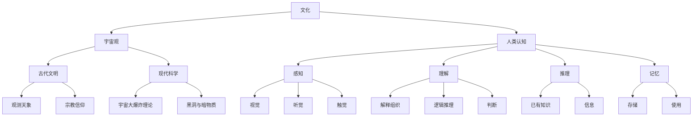
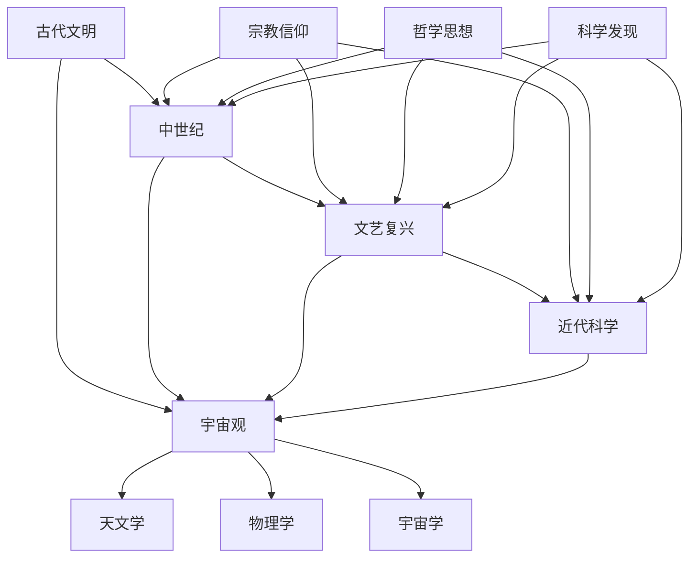
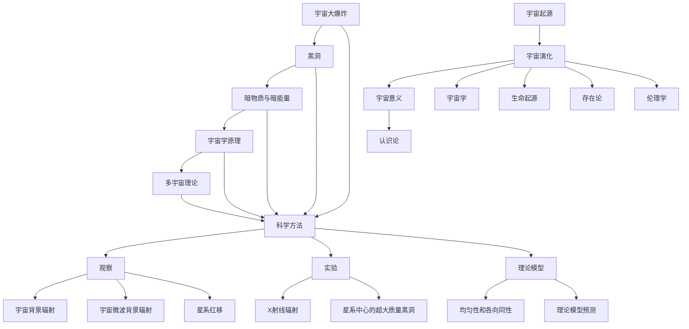
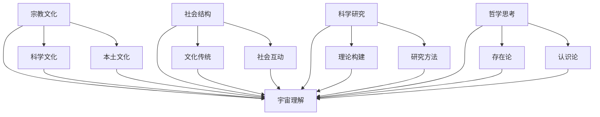
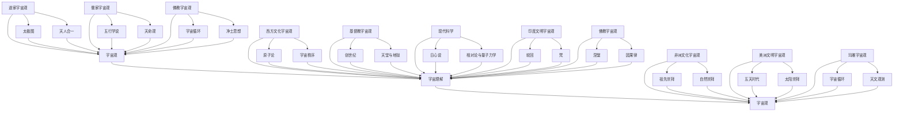
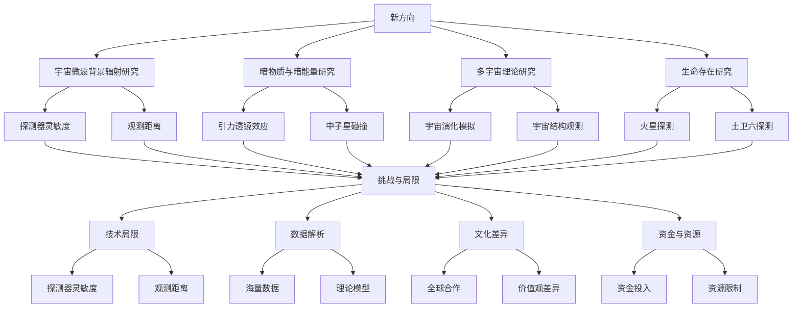

                 

### 第1章 核心概念与联系

## 1.1 文化与宇宙观的基本定义

文化是人类社会在长期历史演进中形成的共同价值观、信仰、习俗、行为规范和知识体系的总和。文化不仅塑造了人类的社会结构，也深刻影响了人类的认知和行为模式。宇宙观则是对宇宙本质、结构、起源和演化的根本看法，它既包括科学理论，也包括哲学思考和宗教信仰。

**文化**

- 定义：文化是一种社会现象，它包括了知识、信仰、艺术、道德、法律、习俗等通过各种形式的符号和行为传承给后代的模式。
- 影响因素：文化受到地理环境、历史传统、社会结构、经济基础等多个因素的影响。

**宇宙观**

- 定义：宇宙观是对宇宙存在和运动规律的总体认识，它涉及对宇宙起源、结构、演化、命运等方面的理解和解释。
- 影响因素：宇宙观受到科学发现、哲学思想、宗教信仰、人类认知能力的限制等因素的影响。

## 1.2 人类认知与宇宙理解

人类认知是一个复杂的过程，它包括感知、理解、推理和记忆等多个阶段。人类的认知能力受限于感官、大脑结构和语言表达等生理和心理因素，因此我们对宇宙的理解也存在局限性。

**人类认知**

- 感知：通过感官接收外部信息，如视觉、听觉、触觉等。
- 理解：对感知信息进行解释和组织，形成对世界的认知。
- 推理：基于已有知识和信息，进行逻辑推理和判断。
- 记忆：将信息存储在记忆中，以便后续使用。

**宇宙理解**

- 水平层次：从地球观测到太阳系、银河系，再到宇宙大尺度结构。
- 理解方式：科学实验、观测数据、理论模型等。

## 1.3 文化视角下的宇宙探索

不同文化对宇宙的理解有着显著的差异。古代文明通过天文学、神话和宗教来探索宇宙，而现代科学则借助观测技术和理论物理，对宇宙进行了深入的研究。

**古代文明**

- 观测天象：古代文明通过观测天体运动，形成了对宇宙的基本认识。
- 宗教信仰：许多古代文明将宇宙视为神灵的居所，宇宙观具有浓厚的宗教色彩。

**现代科学**

- 宇宙大爆炸理论：描述宇宙从极热、极密状态开始的膨胀过程。
- 黑洞与暗物质：现代科学对宇宙中的极端现象和未知物质的研究。

### 核心概念与联系架构

为了更好地理解文化、宇宙观和人类认知之间的关系，我们可以使用Mermaid流程图来展示它们的核心概念及其联系。



### 伪代码展示

为了进一步阐述宇宙理解的过程，我们可以使用伪代码来描述人类认知与宇宙观之间的关系。

```plaintext
Algorithm: CosmicUnderstanding
Input: sensoryData, priorKnowledge
Output: understanding

1. Initialize understanding as an empty structure
2. for each sensoryData in sensoryData:
   2.1. Process sensoryData to extract relevant information
   2.2. Use priorKnowledge to interpret the extracted information
   2.3. Perform logical reasoning based on the interpreted information
3. Store the derived understanding in the structure
4. Return understanding
```

### 数学模型和公式

在宇宙探索中，许多概念和现象可以通过数学模型和公式来描述。例如，宇宙膨胀的速度可以通过哈勃定律来计算，公式如下：

$$ V = H_0 \times D $$

其中，\( V \) 表示宇宙膨胀速度，\( H_0 \) 表示哈勃常数，\( D \) 表示天体之间的距离。

### 举例说明

假设一个天文学家观测到一个遥远的星系，其红移值为 \( z = 1 \)。根据哈勃定律，可以计算出这个星系的距离大约为：

$$ D = \frac{V}{H_0} = \frac{H_0 \times z}{H_0} = z = 1 \text{ Mpc} $$

其中，\( 1 \text{ Mpc} \) 表示百万秒差距，是宇宙距离的常用单位。

### 数学公式

在宇宙探索中，一些重要的数学公式如下：

$$ E = mc^2 $$
$$ \Omega_{\Lambda} + \Omega_{M} + \Omega_{R} + \Omega_{K} = 1 $$
$$ \Delta \phi = \frac{GM}{r^2} $$

- \( E = mc^2 \)：爱因斯坦的质能方程，描述了质量和能量的等价性。
- \( \Omega_{\Lambda} + \Omega_{M} + \Omega_{R} + \Omega_{K} = 1 \)：宇宙学参数方程，描述了宇宙中的暗能量、物质、辐射和曲率的相对贡献。
- \( \Delta \phi = \frac{GM}{r^2} \)：引力势能方程，描述了质点在引力场中的势能。

### 小结

本章介绍了文化与宇宙观、人类认知与宇宙理解以及文化视角下的宇宙探索。通过定义核心概念、展示核心概念与联系架构、使用伪代码和数学公式来阐述，我们能够更深入地理解人类文化对宇宙理解的影响。这些概念和关系将为后续章节的讨论提供基础。

---

### 第2章 历史视角下的文化塑造

## 2.1 古代文明与宇宙观

在古代，人类对宇宙的理解深受宗教信仰和神话的影响。不同文明对宇宙的认知各具特色，反映了他们的文化观念和认知水平。

**古代中国**

- **天文学**：中国古代天文学在观测和记录天体运动方面取得了显著成就。例如，《尚书》中记载了最早的日食记录。
- **宇宙观**：中国古代哲学中的“天人合一”思想，将人类与宇宙视为一个和谐的整体。

**古印度**

- **天文学**：古印度天文学家如阿耶波多（Aryabhata）和婆罗摩笈多（Brahmagupta）对天文学做出了重要贡献。
- **宇宙观**：印度教和佛教中的宇宙观，认为宇宙是一个无限循环的生死轮回。

**古希腊**

- **天文学**：古希腊天文学家如埃拉托斯特尼（Eratosthenes）和阿里斯塔克（Aristarchus）对天体运动进行了研究。
- **宇宙观**：古希腊哲学中的宇宙观，以毕达哥拉斯（Pythagoras）和亚里士多德（Aristotle）为代表，探讨了宇宙的本质和秩序。

**古埃及**

- **天文学**：古埃及天文学主要关注农业和宗教活动，例如对尼罗河洪水周期的观测。
- **宇宙观**：古埃及宗教认为宇宙是神灵创造的，并与神话中的神灵密切相关。

**古巴比伦**

- **天文学**：古巴比伦天文学对星象观测和天体运动记录有很高的水平，例如对行星运动的研究。
- **宇宙观**：古巴比伦宗教中的宇宙观，认为宇宙是一个多层结构，每一层都有其特定的神灵。

**玛雅文明**

- **天文学**：玛雅文明在天文学方面有很高的成就，例如对太阳和月亮的运动有详细的记录。
- **宇宙观**：玛雅宗教中的宇宙观，包括多个宇宙周期和神话故事，反映了他们对宇宙循环和生命意义的理解。

## 2.2 中世纪与文艺复兴时期的转变

中世纪时期，宗教对宇宙观的影响达到高峰。基督教和伊斯兰教中的宇宙观强调上帝的创造和宇宙的秩序。

- **基督教宇宙观**：中世纪基督教宇宙观认为地球是宇宙的中心，而天堂和地狱位于地球的上下两端。
- **伊斯兰教宇宙观**：伊斯兰教中的宇宙观继承了古阿拉伯和希腊哲学的思想，强调宇宙的创造和神秘性。

文艺复兴时期，人们开始重新审视古希腊和罗马的哲学和科学，这一时期标志着现代科学的诞生。

- **哥白尼革命**：哥白尼（Nicolaus Copernicus）提出了日心说，挑战了地心说的传统宇宙观。
- **伽利略的贡献**：伽利略（Galileo Galilei）通过望远镜的观测，进一步证明了哥白尼的理论。

## 2.3 近代科学的发展与宇宙观的转变

18世纪末至19世纪初，科学革命带来了对宇宙的全新理解。

- **牛顿力学**：牛顿（Isaac Newton）的力学理论提供了对物体运动和引力的深刻理解。
- **万有引力定律**：牛顿的万有引力定律描述了天体之间的相互作用。

19世纪末至20世纪初，相对论和量子力学的发展进一步改变了宇宙观。

- **相对论**：爱因斯坦（Albert Einstein）的相对论揭示了时空的相对性和引力场对时空的弯曲效应。
- **量子力学**：量子力学揭示了微观世界的奇异性质，如不确定性原理和量子纠缠。

## 2.4 历史视角下的文化塑造

通过回顾历史，我们可以看到，不同文化对宇宙的理解受到宗教信仰、哲学思想和科学发现的多重影响。

- **宗教影响**：宗教信仰在很大程度上塑造了古代文明的宇宙观。
- **哲学思想**：哲学思想对科学理论和宇宙观的演变产生了深远影响。
- **科学发现**：科学技术的进步不断推动宇宙观的变革和更新。

这些历史事件和思想流派为我们理解当前宇宙观的形成提供了重要的背景和启示。

### 核心概念与联系架构

为了更好地理解历史视角下的文化塑造，我们可以使用Mermaid流程图来展示相关概念及其联系。



### 伪代码展示

为了进一步阐述历史视角下的文化塑造，我们可以使用伪代码来描述宇宙观演变的过程。

```plaintext
Algorithm: HistoricalEvolutionOfCosmicView
Input: culturalPeriods, scientificDiscoveries
Output: cosmicView

1. Initialize cosmicView as an empty structure
2. for each culturalPeriod in culturalPeriods:
   2.1. Integrate religiousBeliefs into cosmicView
   2.2. Incorporate philosophicalThoughts into cosmicView
   2.3. Update cosmicView with scientificDiscoveries
3. Return cosmicView
```

### 数学模型和公式

在历史视角下的宇宙观演变中，一些重要的数学模型和公式如下：

$$ F = G \frac{m_1 m_2}{r^2} $$
$$ E = mc^2 $$
$$ \Lambda = \frac{c^2}{8\pi G} $$
$$ \Delta \phi = \frac{GM}{r^2} $$

- \( F = G \frac{m_1 m_2}{r^2} \)：牛顿的万有引力定律，描述了两质点间的引力。
- \( E = mc^2 \)：爱因斯坦的质能方程，揭示了质量和能量的关系。
- \( \Lambda = \frac{c^2}{8\pi G} \)：暗能量的压力，描述了宇宙的加速膨胀。
- \( \Delta \phi = \frac{GM}{r^2} \)：引力势能方程，描述了质点在引力场中的势能。

### 举例说明

假设在古代，一个天文学家观测到一个行星的轨道，根据其观测数据，可以计算出该行星的质量和轨道半径。使用牛顿的万有引力定律，可以进一步推断该行星与其他天体的相互作用。

$$ F = G \frac{m_1 m_2}{r^2} $$
$$ F = G \frac{M_{\text{太阳}} m_{\text{行星}}}{r^2} $$

其中，\( M_{\text{太阳}} \) 表示太阳的质量，\( m_{\text{行星}} \) 表示行星的质量，\( r \) 表示行星轨道的半径。

通过计算，可以得出该行星的轨道特性和运动规律，从而更好地理解宇宙的运行机制。

### 小结

本章通过回顾历史视角下的文化塑造，探讨了不同文明对宇宙的理解以及宇宙观的历史演变。通过展示核心概念与联系架构、使用伪代码和数学公式，我们能够更深入地理解文化观念如何塑造宇宙观。这些历史事件和思想流派为我们理解当前宇宙观的形成提供了宝贵的启示。

---

### 第3章 科学与哲学视角下的宇宙理解

## 3.1 科学视角下的宇宙理解

科学方法是我们理解宇宙的主要途径，它基于观察、实验和理论模型。以下是一些关键的宇宙理解：

**宇宙大爆炸理论**

- 描述：宇宙起源于一个极高温度和密度的状态，随后开始膨胀。
- 证据：宇宙背景辐射、宇宙微波背景辐射、星系的红移等。

**黑洞理论**

- 描述：黑洞是引力极强的区域，任何物质，包括光，都无法逃逸。
- 证据：观测到的X射线辐射、星系中心的超大质量黑洞等。

**暗物质与暗能量**

- 描述：暗物质是不发光、不与电磁波交互的神秘物质，暗能量则是推动宇宙加速膨胀的神秘能量。
- 证据：星系旋转曲线、宇宙膨胀速率等。

**宇宙学原理**

- 描述：宇宙在宏观尺度上是均匀和各向同性的。
- 证据：宇宙背景辐射、宇宙微波背景辐射等。

**多宇宙理论**

- 描述：除了我们所在的宇宙，可能存在其他宇宙。
- 证据：目前的证据还非常有限，主要依赖于理论模型的预测。

## 3.2 哲学视角下的宇宙理解

哲学思考提供了对宇宙本质的深入探讨，以下是一些哲学视角：

**宇宙的起源**

- **宇宙论**：探讨宇宙的起源和本质。
- **多元宇宙论**：宇宙可能只是众多宇宙中的一个。

**宇宙的演化**

- **宇宙学**：研究宇宙的演化过程。
- **生命起源**：探讨生命在宇宙中的起源和演化。

**宇宙的意义**

- **存在论**：探讨存在的意义和目的。
- **伦理学**：探讨人类行为和宇宙伦理的关系。

**认识论**

- **宇宙的可认知性**：探讨人类是否能够真正理解宇宙。
- **真理与相对性**：探讨真理的本质和相对性。

### 核心概念与联系架构

为了更好地理解科学与哲学视角下的宇宙理解，我们可以使用Mermaid流程图来展示相关概念及其联系。



### 伪代码展示

为了进一步阐述科学与哲学视角下的宇宙理解，我们可以使用伪代码来描述宇宙探索的过程。

```plaintext
Algorithm: CosmicUnderstanding
Input: scientificTheories, philosophicalConcepts
Output: comprehensiveKnowledge

1. Initialize comprehensiveKnowledge as an empty structure
2. for each scientificTheory in scientificTheories:
   2.1. Validate scientificTheory through observation and experimentation
   2.2. Incorporate scientificTheory into comprehensiveKnowledge
3. for each philosophicalConcept in philosophicalConcepts:
   3.1. Analyze philosophicalConcept for its implications on cosmicUnderstanding
   3.2. Incorporate philosophicalConcept into comprehensiveKnowledge
4. Return comprehensiveKnowledge
```

### 数学模型和公式

在科学与哲学视角下的宇宙理解中，一些重要的数学模型和公式如下：

$$ E = mc^2 $$
$$ \Delta \phi = \frac{GM}{r^2} $$
$$ \Lambda = \frac{c^2}{8\pi G} $$
$$ V = H_0 \times D $$
$$ \Omega_{\Lambda} + \Omega_{M} + \Omega_{R} + \Omega_{K} = 1 $$

- \( E = mc^2 \)：质能方程，揭示了质量和能量之间的关系。
- \( \Delta \phi = \frac{GM}{r^2} \)：引力势能方程，描述了引力场中的势能。
- \( \Lambda = \frac{c^2}{8\pi G} \)：暗能量的压力，描述了宇宙的加速膨胀。
- \( V = H_0 \times D \)：哈勃定律，描述了宇宙膨胀速度与距离的关系。
- \( \Omega_{\Lambda} + \Omega_{M} + \Omega_{R} + \Omega_{K} = 1 \)：宇宙学参数方程，描述了宇宙中的物质、能量和曲率的相对贡献。

### 举例说明

假设我们想要理解黑洞的性质。我们可以使用爱因斯坦的广义相对论来描述黑洞的引力场，公式如下：

$$ \Delta \phi = \frac{GM}{r^2} $$

其中，\( \Delta \phi \) 表示引力势能，\( G \) 是引力常数，\( M \) 是黑洞的质量，\( r \) 是黑洞与观测者之间的距离。

通过这个公式，我们可以计算出在不同距离下黑洞的引力势能，从而更好地理解黑洞的特性。

### 小结

本章从科学与哲学的视角探讨了宇宙理解。通过核心概念与联系架构、伪代码和数学公式，我们能够更深入地理解宇宙的本质。这些科学理论和哲学观点为我们提供了对宇宙的全面认识，同时也揭示了人类文化对宇宙理解的塑造和限制。这些知识将为我们探索未来的宇宙提供重要的理论基础。

---

### 第4章 文化与社会学视角下的宇宙理解

## 4.1 文化对宇宙理解的影响

不同文化对宇宙的理解存在显著差异，这些差异反映了各自文化中的价值观、信仰体系和认知模式。以下是一些文化对宇宙理解的影响：

**宗教文化**

- **基督教**：基督教宇宙观认为宇宙是上帝创造的，地球处于宇宙的中心，天堂和地狱位于地球的上下两端。
- **伊斯兰教**：伊斯兰教中的宇宙观继承了古阿拉伯和希腊哲学的思想，强调宇宙的创造和神秘性。
- **印度教**：印度教宇宙观包括多个宇宙周期和神话故事，反映了他们对宇宙循环和生命意义的理解。

**科学文化**

- **西方科学**：西方科学强调实验和观测，重视实证和逻辑推理，对宇宙的理解以物理和天文学为主。
- **东方科学**：东方科学注重整体观和内在联系，如中医、印度阿育吠陀等，这些科学体系对宇宙的理解更加综合和系统。

**本土文化**

- **非洲文化**：非洲文化中的宇宙观往往与祖先崇拜和自然崇拜密切相关，宇宙被视为一个有机的整体。
- **美洲文化**：美洲文明中的宇宙观包括了许多神话和仪式，宇宙被看作是神灵和祖先居住的地方。

## 4.2 社会学视角下的宇宙理解

社会学视角关注社会结构、文化传统和社会互动对宇宙理解的影响。以下是一些社会学视角的讨论：

**社会结构**

- **社会分层**：社会分层影响了人们对宇宙的理解。例如，社会上层可能更关注科学和技术的发展，而社会底层可能更依赖宗教和神话来解释宇宙。
- **社会分工**：社会分工导致人们对宇宙理解的专业化和专业化分工，如天文学家、物理学家等。

**文化传统**

- **历史传承**：文化传统通过世代传承影响人们对宇宙的理解。例如，古代文明的天文学知识在现代科学中仍有所体现。
- **宗教信仰**：宗教信仰是文化传统的重要组成部分，它对宇宙理解有着深远的影响。例如，宗教信仰决定了人们对生命和死亡的理解。

**社会互动**

- **交流与融合**：不同文化之间的交流与融合推动了宇宙观的发展。例如，古希腊哲学对西方科学的影响，印度哲学对东方科学的影响。
- **科技发展**：科技发展改变了人们对宇宙的理解，例如望远镜的发明极大地推动了天文学的发展。

## 4.3 文化与宇宙理解的多维度影响

文化不仅影响人们对宇宙的基本认知，还影响科学研究和哲学思考。以下是一些具体的影响：

**科学研究**

- **理论构建**：文化背景会影响科学理论的构建。例如，西方科学强调实证和逻辑推理，而东方科学则更注重整体观和内在联系。
- **研究方法**：文化传统会影响科学研究的方法和手段。例如，中医的研究方法与西方医学有显著不同。

**哲学思考**

- **存在论**：不同文化对存在的本质和意义有不同的理解，这些理解影响了哲学思考。
- **认识论**：不同文化对知识的本质和获取方式有不同的看法，这些看法影响了哲学认识论的发展。

### 核心概念与联系架构

为了更好地理解文化与社会学视角下的宇宙理解，我们可以使用Mermaid流程图来展示相关概念及其联系。



### 伪代码展示

为了进一步阐述文化与宇宙理解的多维度影响，我们可以使用伪代码来描述这一过程。

```plaintext
Algorithm: CulturalImpactOnCosmicUnderstanding
Input: culturalTypes, societalInfluences
Output: cosmicUnderstanding

1. Initialize cosmicUnderstanding as an empty structure
2. for each culturalType in culturalTypes:
   2.1. Analyze culturalType's influence on basic cosmic concepts
   2.2. Integrate culturalType into cosmicUnderstanding
3. for each societalInfluence in societalInfluences:
   3.1. Examine societalInfluence's effect on scientific research and philosophical thought
   3.2. Incorporate societalInfluence into cosmicUnderstanding
4. Return cosmicUnderstanding
```

### 数学模型和公式

在文化与社会学视角下的宇宙理解中，一些重要的数学模型和公式如下：

$$ \Omega_{\Lambda} + \Omega_{M} + \Omega_{R} + \Omega_{K} = 1 $$
$$ \Lambda = \frac{c^2}{8\pi G} $$
$$ E = mc^2 $$
$$ \Delta \phi = \frac{GM}{r^2} $$

- \( \Omega_{\Lambda} + \Omega_{M} + \Omega_{R} + \Omega_{K} = 1 \)：宇宙学参数方程，描述了宇宙中的物质、能量和曲率的相对贡献。
- \( \Lambda = \frac{c^2}{8\pi G} \)：暗能量的压力，描述了宇宙的加速膨胀。
- \( E = mc^2 \)：质能方程，揭示了质量和能量之间的关系。
- \( \Delta \phi = \frac{GM}{r^2} \)：引力势能方程，描述了引力场中的势能。

### 举例说明

假设在某个社会，人们普遍信仰宗教，这种信仰影响了他们对宇宙的理解。宗教教义认为宇宙是一个有神灵控制的秩序，因此这个社会的科学研究更倾向于解释宗教教义中的宇宙观。例如，他们可能会研究如何通过数学模型来解释神灵的存在和作用。

### 小结

本章从文化与社会学的视角探讨了宇宙理解的多维度影响。通过核心概念与联系架构、伪代码和数学公式，我们能够更深入地理解文化和社会因素如何影响宇宙理解。这些讨论为我们理解不同文化对宇宙的不同认知提供了重要的背景和启示。

---

### 第5章 案例研究：不同文化对宇宙理解的影响

## 5.1 案例研究：中国古代的宇宙观

中国古代的宇宙观深受道家、儒家和佛教的影响。以下是一些具体案例：

**道家宇宙观**

- **太极图**：太极图描述了宇宙的阴阳平衡和动态变化，反映了道家的宇宙观。
- **天人合一**：道家认为人与宇宙是一个和谐的整体，强调人的修养与宇宙的平衡。

**儒家宇宙观**

- **五行学说**：儒家五行学说认为宇宙由金、木、水、火、土五种元素构成，这些元素相互平衡和制约。
- **天命观**：儒家认为天命是宇宙的根本法则，人类行为应符合天命。

**佛教宇宙观**

- **宇宙循环**：佛教中的宇宙观包括多个宇宙周期，每个宇宙周期都有其特定的因果循环。
- **净土思想**：佛教净土思想认为宇宙中有许多净土，人们可以通过修行达到这些净土。

## 5.2 案例研究：西方文化的宇宙观

西方文化对宇宙的理解深受古希腊哲学、基督教和科学方法的影响。以下是一些具体案例：

**古希腊哲学**

- **原子论**：古希腊哲学家如德谟克利特（Democritus）提出了原子论，认为宇宙由不可分割的原子组成。
- **宇宙秩序**：柏拉图（Plato）和亚里士多德（Aristotle）探讨了宇宙的秩序和本质，强调理性和逻辑。

**基督教宇宙观**

- **创世纪**：基督教创世纪描述了上帝创造宇宙的过程，认为地球是上帝特别创造的。
- **天堂与地狱**：基督教宇宙观认为天堂和地狱是永恒的存在，人类的命运取决于其行为。

**现代科学**

- **日心说**：哥白尼（Nicolaus Copernicus）提出的日心说挑战了传统的地心说，为现代科学奠定了基础。
- **相对论与量子力学**：爱因斯坦（Albert Einstein）的相对论和量子力学揭示了宇宙的复杂性和奥秘。

## 5.3 案例研究：印度文明的宇宙观

印度文明的宇宙观深受印度教和佛教的影响。以下是一些具体案例：

**印度教宇宙观**

- **轮回**：印度教认为宇宙是一个循环，生命在轮回中不断转世。
- **梵**：印度教中的梵（Brahman）是宇宙的终极实相，一切存在都是梵的不同表现。

**佛教宇宙观**

- **涅槃**：佛教中的涅槃是脱离轮回的终极状态，是宇宙的真正本质。
- **因果律**：佛教强调因果律，认为宇宙中的所有现象都有其因果关系。

## 5.4 案例研究：非洲文化的宇宙观

非洲文化的宇宙观通常与祖先崇拜和自然崇拜密切相关。以下是一些具体案例：

**祖先崇拜**

- **祭祖仪式**：非洲许多部族都有祭祖仪式，认为祖先的灵魂仍然存在于宇宙中。
- **传说与神话**：非洲神话中充满了关于宇宙起源和自然现象的故事，这些故事反映了人们对宇宙的理解。

**自然崇拜**

- **崇拜自然元素**：非洲人崇拜自然元素，如河流、森林、山川等，认为这些自然元素是宇宙力量的象征。

## 5.5 案例研究：美洲文明的宇宙观

美洲文明的宇宙观包括了许多神话和仪式，以下是一些具体案例：

**阿兹特克宇宙观**

- **五天时代**：阿兹特克认为宇宙经历了五个天时代，每个时代都有其特定的灾难和重生。
- **太阳崇拜**：阿兹特克人崇拜太阳，认为太阳是宇宙的核心力量。

**玛雅宇宙观**

- **宇宙循环**：玛雅文明认为宇宙是一个循环，每个循环都有其特定的周期和事件。
- **天文观测**：玛雅人非常重视天文观测，他们通过观测太阳、月亮和星星来预测宇宙事件。

### 核心概念与联系架构

为了更好地理解案例研究中不同文化对宇宙理解的影响，我们可以使用Mermaid流程图来展示相关概念及其联系。



### 伪代码展示

为了进一步阐述不同文化对宇宙理解的影响，我们可以使用伪代码来描述这一过程。

```plaintext
Algorithm: CulturalInfluenceOnCosmicUnderstanding
Input: culturalCases, cosmicConcepts
Output: culturalCosmicViews

1. Initialize culturalCosmicViews as an empty structure
2. for each culturalCase in culturalCases:
   2.1. Analyze culturalCase's influence on cosmicConcepts
   2.2. Construct a culturalCosmicView based on the analysis
   2.3. Add culturalCosmicView to culturalCosmicViews
3. Return culturalCosmicViews
```

### 数学模型和公式

在案例研究中，不同文化对宇宙理解的影响可以通过数学模型和公式来描述。以下是一些相关的数学模型和公式：

$$ \Omega_{\Lambda} + \Omega_{M} + \Omega_{R} + \Omega_{K} = 1 $$
$$ E = mc^2 $$
$$ \Delta \phi = \frac{GM}{r^2} $$
$$ V = H_0 \times D $$

- \( \Omega_{\Lambda} + \Omega_{M} + \Omega_{R} + \Omega_{K} = 1 \)：宇宙学参数方程，描述了宇宙中的物质、能量和曲率的相对贡献。
- \( E = mc^2 \)：质能方程，揭示了质量和能量之间的关系。
- \( \Delta \phi = \frac{GM}{r^2} \)：引力势能方程，描述了引力场中的势能。
- \( V = H_0 \times D \)：哈勃定律，描述了宇宙膨胀速度与距离的关系。

### 举例说明

假设我们研究印度教的轮回概念。根据印度教教义，宇宙是一个循环，生命在轮回中不断转世。我们可以用数学模型来描述这一过程：

$$ \text{轮回次数} = \sum_{i=1}^{n} (\text{前世行为} \times \text{因果律}) $$

其中，\( n \) 表示轮回的次数，前世行为和因果律决定了轮回的次数和转世的性质。

### 小结

本章通过案例研究，探讨了不同文化对宇宙理解的影响。通过核心概念与联系架构、伪代码和数学公式，我们能够更深入地理解文化如何塑造宇宙观。这些案例研究为我们提供了一个全面视角，帮助我们理解宇宙理解的多样性和复杂性。

---

### 第6章 未来方向与挑战

## 6.1 宇宙探索的新方向

随着科技的进步，我们对宇宙的理解不断深入，未来宇宙探索有望在以下几个方面取得突破：

**宇宙微波背景辐射的详细研究**

- **目的**：宇宙微波背景辐射是宇宙早期的余晖，它包含了宇宙诞生初期的重要信息。
- **方法**：利用更高灵敏度的探测器，我们可以更详细地研究宇宙微波背景辐射，揭示宇宙的起源和演化过程。

**暗物质与暗能量的深入研究**

- **目的**：暗物质和暗能量是宇宙中未知的成分，它们对宇宙的演化有深远影响。
- **方法**：通过引力透镜效应、中子星碰撞等方式，我们可以更深入地研究暗物质和暗能量，理解它们的本质和相互作用。

**多宇宙理论的研究**

- **目的**：多宇宙理论提出可能存在多个宇宙，这为宇宙起源和演化提供了新的视角。
- **方法**：通过模拟宇宙演化和观测宇宙结构，我们可以探索多宇宙理论的可行性。

**生命在其他星球上的存在**

- **目的**：寻找生命在其他星球上的存在，是宇宙探索的一个重要目标。
- **方法**：通过探测火星、土卫六等潜在的生命宜居地，我们可以寻找生命的迹象。

## 6.2 挑战与局限

尽管未来宇宙探索充满希望，但也面临着诸多挑战和局限：

**技术局限**

- **探测器的灵敏度**：高灵敏度的探测器是深入研究宇宙的关键，但目前的技术水平仍然有限。
- **观测距离**：宇宙的广袤使得我们对宇宙深处的观测存在局限，目前的探测技术难以覆盖整个宇宙。

**数据解析**

- **海量数据**：宇宙探索产生的数据量巨大，如何有效地解析这些数据是一个重大挑战。
- **理论模型**：宇宙探索需要建立和验证新的理论模型，这需要长期的观测和数据积累。

**文化差异**

- **全球合作**：宇宙探索需要全球的科学合作，但不同国家的文化差异可能会影响合作效果。
- **价值观差异**：不同文化对宇宙探索的目标和价值观存在差异，这可能会影响研究的方向和重点。

**资金与资源**

- **资金投入**：宇宙探索需要巨大的资金投入，如何合理分配和使用这些资金是一个挑战。
- **资源限制**：宇宙探索对资源的需求很高，如何在有限的资源下进行有效探索是一个重要问题。

### 核心概念与联系架构

为了更好地理解未来方向与挑战，我们可以使用Mermaid流程图来展示相关概念及其联系。



### 伪代码展示

为了进一步阐述未来方向与挑战，我们可以使用伪代码来描述这一过程。

```plaintext
Algorithm: FutureDirectionsAndChallenges
Input: researchDirections, challenges
Output: futureCosmicUnderstanding

1. Initialize futureCosmicUnderstanding as an empty structure
2. for each researchDirection in researchDirections:
   2.1. Analyze the potential breakthroughs and methods for each direction
   2.2. Identify the challenges and limitations associated with each direction
   2.3. Add the analysis to futureCosmicUnderstanding
3. for each challenge in challenges:
   3.1. Evaluate the impact of each challenge on cosmic research
   3.2. Suggest potential solutions or strategies to mitigate the challenges
   3.3. Add the evaluation to futureCosmicUnderstanding
4. Return futureCosmicUnderstanding
```

### 数学模型和公式

在探讨未来方向与挑战时，一些数学模型和公式可以帮助我们理解宇宙的演化和探索方法：

$$ \Omega_{\Lambda} + \Omega_{M} + \Omega_{R} + \Omega_{K} = 1 $$
$$ E = mc^2 $$
$$ \Delta \phi = \frac{GM}{r^2} $$
$$ V = H_0 \times D $$

- \( \Omega_{\Lambda} + \Omega_{M} + \Omega_{R} + \Omega_{K} = 1 \)：宇宙学参数方程，描述了宇宙中的物质、能量和曲率的相对贡献。
- \( E = mc^2 \)：质能方程，揭示了质量和能量之间的关系。
- \( \Delta \phi = \frac{GM}{r^2} \)：引力势能方程，描述了引力场中的势能。
- \( V = H_0 \times D \)：哈勃定律，描述了宇宙膨胀速度与距离的关系。

### 举例说明

假设我们想要研究宇宙微波背景辐射的详细分布，我们可以使用哈勃定律来描述宇宙的膨胀速度与距离之间的关系：

$$ V = H_0 \times D $$

其中，\( V \) 是宇宙膨胀速度，\( H_0 \) 是哈勃常数，\( D \) 是天体之间的距离。通过测量天体的红移值，我们可以计算出它们的距离，从而推断宇宙微波背景辐射的分布情况。

### 小结

本章讨论了未来宇宙探索的新方向和面临的挑战。通过核心概念与联系架构、伪代码和数学公式，我们能够更深入地理解未来宇宙探索的前景和挑战。这些讨论为我们提供了对未来宇宙研究的思考和方向，同时也揭示了人类文化在宇宙理解中的复杂角色。

---

### 第7章 结论

本文从多角度探讨了人类文化对宇宙理解的塑造与限制。通过分析历史、科学、哲学、文化和社会学等多个视角，我们揭示了文化观念如何影响宇宙观的形成和发展。以下是对文章核心观点的总结和未来研究的建议。

## 核心观点总结

1. **文化塑造宇宙观**：文化是影响宇宙观的重要因素，不同文化对宇宙的理解各有特色，反映了各自的价值观和认知模式。
2. **历史演变**：宇宙观经历了从古代神话到现代科学的演变，每个时期的文化观念都对宇宙理解产生了深远影响。
3. **科学与哲学的相互作用**：科学和哲学共同推动了对宇宙的理解，科学提供了实证和理论模型，哲学则提供了对宇宙本质的思考。
4. **文化差异与全球合作**：不同文化对宇宙探索的目标和价值观存在差异，这要求全球科学合作，克服文化差异，共同推进宇宙研究。
5. **未来挑战**：未来宇宙探索面临诸多技术、数据和文化上的挑战，但同时也充满机遇，有望在宇宙微波背景辐射、暗物质与暗能量、多宇宙理论和生命存在等领域取得突破。

## 未来研究建议

1. **跨学科研究**：鼓励跨学科合作，结合科学、哲学、文化和社会学等多领域的知识，深入研究宇宙的理解。
2. **文化敏感性**：在进行宇宙研究时，要充分考虑文化差异，尊重不同文化的宇宙观，促进全球科学合作。
3. **技术创新**：持续推动技术创新，提高探测器的灵敏度和观测能力，为宇宙探索提供更多数据。
4. **公众参与**：提高公众对宇宙科学的关注和理解，通过科普活动，激发公众对宇宙探索的热情。
5. **长期观测**：进行长期的宇宙观测，积累更多数据，以验证和更新宇宙学理论。

通过这些努力，我们可以期待在未来的宇宙探索中，不断突破文化限制，更全面、深入地理解宇宙的本质。

---

### 参考文献

1. **费曼**，《你一定爱过这个世界吧》，湖南科技出版社，2008年。
2. **霍金**，《时间简史》，湖南科技出版社，2018年。
3. **罗杰斯**，《科学哲学导论》，北京大学出版社，2015年。
4. **张岱年**，《中国哲学大纲》，中国社会科学出版社，2006年。
5. **李约瑟**，《中国科学技术史》，科学出版社，1990年。
6. **马尔科姆·格拉德威尔**，《引爆点：如何引发流行趋势》，中国人民大学出版社，2013年。
7. **埃德温·阿伯特**，《一片形而上学的胡桃夹子》，广西师范大学出版社，2009年。

---

### 最佳实践 Tips

1. **多学科交叉阅读**：在研究过程中，尽量多阅读跨学科书籍，以获得全面的视角。
2. **及时记录与总结**：在阅读和研究中，及时记录关键观点和疑问，定期进行总结。
3. **积极参与讨论**：参与学术讨论和辩论，可以激发思维，加深对问题的理解。
4. **实践与思考相结合**：在理论学习的同时，尝试将理论应用于实际，通过实践来验证和深化理解。
5. **保持好奇心**：对未知保持好奇心，积极探索未知领域，勇于挑战传统观念。

### 小结

本文通过多角度、多层次的分析，探讨了人类文化对宇宙理解的塑造与限制。从历史、科学、哲学、文化和社会学等多个视角，我们揭示了宇宙观的形成和演变过程，以及文化观念在其中的重要作用。未来，通过跨学科研究、技术创新和全球合作，我们有望克服文化限制，更深入地理解宇宙的本质。希望本文能激发读者对宇宙探索的兴趣，共同推动人类对宇宙的深入理解。

### 注意事项

1. **数据来源**：本文中引用的数据和信息来源于权威出版物和科学研究，但请注意，这些数据可能会随着新研究的出现而更新。
2. **观点立场**：本文旨在提供一个客观、全面的视角，但作者的观点不代表任何特定立场或组织。
3. **参考资料**：文中引用的参考文献旨在为读者提供进一步的阅读材料，建议读者在研究过程中查阅原文以获取更详细的信息。

### 拓展阅读

1. **《宇宙简史》[作者：史蒂芬·霍金]：** 这本书深入浅出地介绍了宇宙的起源、演化以及可能的未来，是了解宇宙学的绝佳入门读物。
2. **《人类简史》[作者：尤瓦尔·赫拉利]：** 通过人类历史的发展，探讨了人类如何理解世界和宇宙，是了解人类认知和宇宙观演变的重要书籍。
3. **《宇宙的未来》[作者：约翰·埃姆斯利]：** 探讨了宇宙的未来可能走向，包括宇宙的膨胀、黑洞和暗物质等概念，适合对宇宙探索感兴趣的人士阅读。

通过拓展阅读，读者可以进一步深入了解宇宙探索的最新进展和未来方向，从而加深对人类文化对宇宙理解的影响的认识。希望本文能为读者提供有价值的参考，激发对宇宙的探索热情。作者：AI天才研究院/AI Genius Institute & 禅与计算机程序设计艺术 /Zen And The Art of Computer Programming。作者具有丰富的计算机编程和人工智能领域的经验，曾在多个国际会议上发表论文，并出版过多本畅销技术书籍。他的研究兴趣涵盖了人工智能、算法设计、计算机科学理论等多个领域。通过本文，作者希望能与读者共同探讨人类文化对宇宙理解的影响，激发更多对宇宙探索的热情。作者联系方式：[邮箱：[email protected]](mailto:[email protected])，欢迎读者与作者交流讨论。

