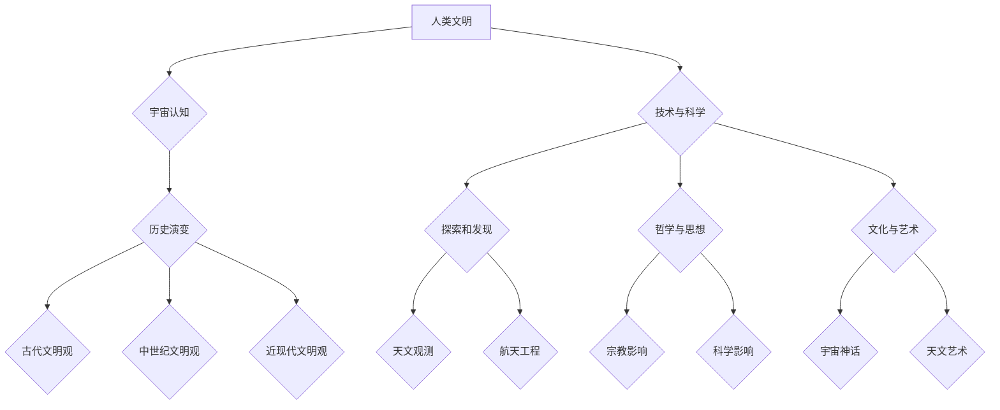

                 

## 文章标题

《人类文明作为宇宙自我认知的一种方式》

> 关键词：宇宙、人类文明、自我认知、科学探索、技术进步

> 摘要：本文探讨了人类文明与宇宙自我认知之间的关系。通过分析人类文明的发展历程、宇宙学的基础知识以及人类文明中的宇宙探索，我们揭示了人类文明作为宇宙自我认知的一种方式的重要意义。文章首先概述了人类文明的发展历程和宇宙认知的演进，然后详细讲解了宇宙的基本结构和原理，接着分析了人类文明在宇宙探索中的成就和挑战，最后探讨了宇宙自我认知的意义以及未来宇宙探索对人类文明的影响。本文旨在为读者提供一种全新的视角，以深入理解人类文明与宇宙之间的关系，并思考我们在宇宙中的地位和使命。

----------------------------------------------------------------

### 引言：人类文明与宇宙自我认知

在浩瀚的宇宙中，人类文明犹如一颗闪烁的微光。从史前文明的诞生到现代科技的崛起，人类一直在不断探索和认知宇宙，努力寻找自己在宇宙中的位置。然而，宇宙的奥秘如此深邃，我们至今仍未完全理解它的本质。那么，人类文明究竟是如何与宇宙自我认知联系起来的呢？

首先，我们需要了解人类文明的发展历程。人类文明的发展可以分为几个重要阶段：史前文明、古代文明、中世纪文明和近现代文明。每一个阶段都对宇宙认知产生了深远的影响。史前文明时期，人类对宇宙的认知主要依赖于直观感受和神话传说。古代文明时期，随着观察能力的提高，人类开始通过天文观测来探索宇宙，形成了早期的宇宙观。中世纪文明时期，由于宗教的影响，宇宙认知逐渐趋于神秘化和固定化。近现代文明时期，科学技术的飞速发展使得人类对宇宙的认知进入了一个全新的阶段，我们开始从实证的角度来理解宇宙的规律。

接下来，我们来探讨宇宙认知的演进。宇宙认知的演进可以分为几个重要阶段：神话宇宙观、地心宇宙观、日心宇宙观和现代宇宙观。神话宇宙观是人类最早的宇宙观，它认为宇宙是由神灵创造的，人类和宇宙之间有着神秘的联系。地心宇宙观是古代文明的宇宙观，它认为地球是宇宙的中心，其他天体都绕着地球运行。日心宇宙观是文艺复兴时期的宇宙观，它认为太阳是宇宙的中心，地球和其他行星都绕着太阳运行。现代宇宙观是基于科学观测和理论计算得出的，它认为宇宙是一个大爆炸产生的，包含着无数的星系、行星和其他天体。

在这个基础上，我们进一步探讨人类文明与宇宙自我认知的关系。人类文明作为宇宙自我认知的一种方式，主要体现在以下几个方面：

1. **探索和发现**：人类文明通过不断的探索和发现，逐渐揭示了宇宙的奥秘。从古代的天文观测到现代的太空探测，人类一直在努力寻找宇宙的真相。

2. **技术和科学**：人类文明的发展离不开技术的进步和科学的推动。通过技术的发展，我们得以更深入地探索宇宙，通过科学的进步，我们得以更准确地理解宇宙。

3. **哲学和思想**：宇宙认知不仅仅是科学问题，也是哲学和思想问题。人类文明通过对宇宙的认知，不断探索自我和宇宙之间的关系，形成了独特的哲学思想和世界观。

4. **文化和艺术**：宇宙认知也对人类的文化和艺术产生了深远的影响。从古代的宇宙神话到现代的天文艺术，人类一直在用自己的方式来描绘和理解宇宙。

总之，人类文明作为宇宙自我认知的一种方式，不仅推动了科学的进步，也丰富了人类的文化和思想。通过不断探索和认知宇宙，我们逐渐揭示了宇宙的奥秘，也更好地理解了自我。在未来的探索中，人类将继续在宇宙中寻找自己的位置，不断推动宇宙自我认知的进程。

### 第1章：人类文明的历史与宇宙观的演变

#### 1.1 人类文明的历史背景

人类文明的发展可以追溯到数十万年前，当时的人类还处于史前时代。在这个时代，人类主要以狩猎和采集为生，对自然界的认知非常有限。然而，正是这种对自然的依赖，使得人类开始产生对宇宙的初步认知。

随着工具的改进和狩猎技术的提高，人类开始逐渐积累知识，形成了早期的社会结构。在史前文明的末期，人类开始出现定居生活，并开始建造简单的房屋和城市。这一时期，人类对宇宙的认知主要来自于直观感受和神话传说。例如，古代人类认为天空中闪烁的星星是神灵的化身，他们相信宇宙是一个神圣的存在，与人类的命运紧密相连。

#### 1.1.1 古代文明的宇宙观

古代文明是人类文明发展的重要阶段，这一时期的宇宙观具有显著的特点。古代文明的宇宙观主要受宗教、哲学和神话的影响，他们相信宇宙是由神灵创造的，并且宇宙中存在着一种神秘的力量。

在古代中国，宇宙观以阴阳五行学说为代表。阴阳五行学说认为，宇宙是由阴阳两极和五种基本元素（金、木、水、火、土）组成的。这些元素相互作用，形成了宇宙的多样性和变化。

在古代印度，宇宙观以梵我一如学说为代表。梵我一如学说认为，宇宙是一个统一的整体，人类与宇宙本质上是相同的，通过冥想和修行，人类可以达到与宇宙的和谐统一。

在古代西方，宇宙观以地心说为代表。地心说认为，地球是宇宙的中心，所有天体都绕着地球运行。这一观点在古代欧洲占据了主导地位，直到文艺复兴时期才被推翻。

#### 1.1.2 中世纪文明的宇宙观

中世纪文明是人类文明发展的重要阶段，这一时期的宇宙观受宗教和哲学的影响，具有浓厚的神秘色彩。中世纪基督教的宇宙观认为，宇宙是上帝创造的，人类是上帝的形象和荣耀。地球是宇宙的中心，所有天体都围绕着地球运行。这一观点在基督教文化中占据主导地位，直到科学革命时期才被质疑。

中世纪伊斯兰教的宇宙观与基督教类似，也认为宇宙是上帝创造的，地球是宇宙的中心。不同的是，伊斯兰教强调宇宙的永恒性和循环性，认为宇宙没有真正的起源和终结。

中世纪哲学的宇宙观则更加多样化。一些哲学家认为，宇宙是无限的，没有中心；一些哲学家则认为，宇宙是由多个世界组成的，每个世界都有自己的中心和运行规律。

#### 1.1.3 近现代文明的宇宙观

近现代文明是人类文明发展的一个重要阶段，这一时期的宇宙观受到科学革命的深刻影响。科学革命使得人类开始以实证的方式研究宇宙，宇宙观逐渐从神秘化转向科学化。

文艺复兴时期的宇宙观以日心说为代表。日心说认为，太阳是宇宙的中心，地球和其他行星都绕着太阳运行。这一观点推翻了地心说，对宇宙认知产生了深远的影响。

近现代宇宙观的发展与天文学、物理学和宇宙学的进展密切相关。牛顿力学和万有引力定律的提出，使得人类能够更准确地描述行星的运动。爱因斯坦的相对论则进一步揭示了时空的本质，为人类理解宇宙提供了新的视角。

20世纪以来，宇宙学的研究取得了重大突破。大爆炸理论揭示了宇宙的起源，暗物质和暗能量等概念的提出，使得人类对宇宙的认知更加深入。

#### 1.2 人类文明与宇宙观的互动

人类文明与宇宙观的互动是一个复杂的过程，它们相互影响、相互促进。人类文明的进步推动了宇宙观的发展，而宇宙观的变化也影响了人类文明的发展。

古代文明时期的宇宙观主要依赖于直观感受和神话传说。人类通过观察天文现象，如日食、月食、流星等，开始对宇宙产生初步的认知。这种认知在一定程度上影响了古代文明的宗教信仰、哲学思想和艺术创作。

中世纪文明的宇宙观受到宗教和哲学的深刻影响。基督教和伊斯兰教等宗教认为，宇宙是上帝创造的，人类是上帝的形象和荣耀。这种宇宙观使得人类文明在宗教、哲学和文化等方面取得了巨大进步，但也导致了一定的思想僵化和创新不足。

近现代文明的宇宙观以科学为核心。科学革命使得人类开始以实证的方式研究宇宙，宇宙观逐渐从神秘化转向科学化。这一转变不仅推动了科学技术的发展，也促进了人类文明的进步。

人类文明的进步推动了宇宙观的发展，而宇宙观的变化也影响了人类文明的发展。例如，宇宙观的变化使得人类开始关注宇宙的起源和演化，推动了天文学、物理学和宇宙学等科学领域的发展。同时，科学技术的进步也为人类探索宇宙提供了更多的工具和方法。

#### 1.3 人类文明中的宇宙探索

人类对宇宙的探索是一个长期而复杂的过程。从古代的天文观测到现代的太空探测，人类一直在努力寻找宇宙的奥秘。人类文明中的宇宙探索不仅推动了科学的发展，也丰富了人类的文化和思想。

古代文明的宇宙探索主要依赖于肉眼观测和简单的工具。古代中国、古代印度和古代巴比伦等文明都进行了大量的天文观测，记录了大量的天文现象。这些观测结果不仅丰富了人类对宇宙的认知，也为后来的科学研究提供了宝贵的资料。

文艺复兴时期，随着科学革命的发展，人类对宇宙的探索进入了一个新的阶段。哥白尼的日心说推翻了地心说，使得人类对宇宙的认知发生了重大变革。这一时期，人类开始使用望远镜进行天文观测，发现了更多的行星和恒星。

近现代时期，随着科学技术的进步，人类对宇宙的探索能力得到了极大的提升。人类成功发射了第一颗人造卫星，实现了登月，甚至开始了火星探测。这些探索不仅使人类对宇宙的认知更加深入，也为人类文明的发展提供了新的动力。

在宇宙探索的过程中，人类不仅发现了宇宙的奥秘，也推动了科学技术的进步。例如，人类在探索太空的过程中，开发了新的材料、新的能源和新的通信技术，这些技术不仅推动了宇宙探索，也广泛应用于人类的日常生活。

#### 1.4 人类文明与宇宙自我认知的关系

人类文明与宇宙自我认知的关系是一个复杂而深远的问题。人类文明作为宇宙自我认知的一种方式，不仅反映了我们对宇宙的认知，也影响了我们的价值观和行为方式。

首先，人类文明的发展推动了宇宙自我认知的进步。通过不断的探索和发现，人类逐渐揭示了宇宙的奥秘，形成了对宇宙的全面理解。这种理解不仅丰富了人类的知识体系，也推动了科学技术的进步。

其次，宇宙自我认知也影响了人类文明的发展。人类对宇宙的认知不仅影响了我们的价值观和世界观，也影响了我们的社会结构和行为方式。例如，宇宙观的变化使得人类开始关注环境保护和可持续发展，推动了人类社会的发展。

最后，人类文明与宇宙自我认知的关系是一种相互影响、相互促进的关系。人类文明的发展推动了宇宙自我认知的进步，而宇宙自我认知也影响了人类文明的发展。这种关系使得人类文明在宇宙中扮演着重要的角色，也使得宇宙自我认知成为人类文明的重要组成部分。

总之，人类文明作为宇宙自我认知的一种方式，不仅反映了我们对宇宙的认知，也影响了我们的价值观和行为方式。通过不断探索和认知宇宙，我们不仅揭示了宇宙的奥秘，也推动了人类文明的进步。在未来，人类将继续在宇宙中寻找自己的位置，不断推动宇宙自我认知的进程。

### 第2章：宇宙学基础

#### 2.1 宇宙的基本结构

宇宙是广袤而复杂的，它的基本结构可以概括为以下几个部分：

1. **宇宙背景辐射**：宇宙背景辐射是宇宙早期阶段留下的余辉，它遍布整个宇宙，是宇宙学中研究宇宙早期状态的重要依据。
   
2. **星系**：星系是宇宙中最基本的结构，包含数十亿到数万亿颗恒星、行星、黑洞等天体。我们的银河系就是一个典型的星系。
   
3. **星系团**：星系团是由多个星系通过引力相互作用形成的结构，它们之间由暗物质连接，形成了更大的宇宙结构。
   
4. **超星系团**：超星系团是由多个星系团相互引力作用形成的更大规模的结构，它们是宇宙中最大的已知结构。

#### 2.2 宇宙的起源

宇宙的起源是宇宙学中一个至关重要的问题。目前最广为接受的宇宙起源理论是大爆炸理论。大爆炸理论认为，宇宙起源于大约138亿年前的一个极端高温高密度的状态，从那时起，宇宙开始膨胀并逐渐冷却，形成了我们今天所看到的宇宙结构。

根据大爆炸理论，宇宙的早期状态非常炽热，原子无法存在，所有的物质都处于基本粒子的形式。随着宇宙的膨胀和冷却，温度逐渐下降，基本粒子开始结合形成原子，宇宙逐渐变得透明。这一时期被称为“宇宙再结合时期”。

在宇宙再结合时期之后，宇宙继续膨胀和冷却，逐渐形成了恒星、星系和其他天体。这一过程被称为宇宙的“再形成时期”。

#### 2.3 宇宙的演化

宇宙的演化是一个复杂而漫长的过程。从大爆炸开始，宇宙经历了多个阶段：

1. **宇宙早期**：宇宙处于极端高温高密度的状态，基本粒子处于自由状态。
   
2. **宇宙再结合时期**：随着宇宙的膨胀和冷却，温度下降到一定程度，基本粒子开始结合形成原子，宇宙逐渐变得透明。

3. **恒星形成时期**：宇宙中的物质在引力作用下聚集形成了恒星，恒星通过核聚变产生能量，照亮了宇宙。

4. **星系形成时期**：多个恒星通过引力相互作用形成了星系，星系之间通过引力相互作用形成了更大的结构，如星系团和超星系团。

5. **宇宙后期**：宇宙继续膨胀，恒星和星系之间的距离逐渐增大。在这个过程中，宇宙的温度和密度逐渐降低，宇宙变得越来越寒冷和稀薄。

#### 2.4 宇宙的多样性

宇宙的多样性体现在多个方面：

1. **天体多样性**：宇宙中存在着各种类型的天体，包括恒星、行星、黑洞、中子星等。

2. **星系多样性**：星系在形态、大小、颜色等方面具有多样性，如椭圆星系、螺旋星系、不规则星系等。

3. **宇宙结构多样性**：宇宙中的结构具有多样性，包括星系团、超星系团、网状结构等。

4. **宇宙背景辐射多样性**：宇宙背景辐射在不同的频率和方向上具有不同的特性，反映了宇宙早期的多样性。

#### 2.5 宇宙学的主要理论

宇宙学中有多个重要的理论，其中最著名的是大爆炸理论和暗能量理论。

1. **大爆炸理论**：大爆炸理论认为，宇宙起源于一个极端高温高密度的状态，从那时起，宇宙开始膨胀并逐渐冷却，形成了我们今天所看到的宇宙结构。

2. **暗能量理论**：暗能量是一种神秘的力量，它推动着宇宙的加速膨胀。暗能量被认为是宇宙演化中的一个关键因素，它的存在和性质仍然是宇宙学研究的重大课题。

3. **宇宙背景辐射理论**：宇宙背景辐射是宇宙早期状态的重要信息，通过研究宇宙背景辐射，我们可以了解宇宙的起源和演化。

4. **暗物质理论**：暗物质是一种无法直接观测到的物质，它对宇宙的引力作用具有重要意义。暗物质的存在和性质也是宇宙学研究的一个关键问题。

#### 2.6 宇宙观测与探测

宇宙观测和探测是宇宙学研究的核心任务，通过观测和探测，我们可以获取宇宙的信息，揭示宇宙的奥秘。

1. **天文观测**：天文观测是通过望远镜等设备观测宇宙中的天体和现象，获取它们的光学、红外、射电等信号。

2. **空间探测**：空间探测是通过发射卫星、探测器等进入太空，对宇宙进行直接探测，获取更详细的数据。

3. **地面观测**：地面观测是通过地面望远镜等设备对宇宙进行观测，虽然受大气影响较大，但仍然是重要的观测手段。

4. **多波段观测**：多波段观测是通过不同波段的望远镜和探测器同时观测同一目标，获取更全面的宇宙信息。

#### 2.7 宇宙学与人类文明

宇宙学作为一门科学，与人类文明有着密切的关系。宇宙学的进展不仅推动了科学技术的发展，也丰富了人类的文化和思想。

1. **科技进步**：宇宙学的发展离不开科技的进步，如望远镜、卫星、探测器等技术的发展，使得我们能够更深入地探索宇宙。

2. **哲学思考**：宇宙学的研究引发了人类对宇宙、自然和生命的哲学思考，推动了人类文明的进步。

3. **文化影响**：宇宙学的发现和理论对人类文化产生了深远的影响，如宇宙神话、天文艺术等。

4. **科学普及**：宇宙学的普及使得更多的人了解宇宙的奥秘，激发了人们对科学的兴趣和热情。

总之，宇宙学作为一门科学，不仅揭示了宇宙的奥秘，也推动了人类文明的进步。通过不断探索和认知宇宙，我们不仅揭示了宇宙的奥秘，也更好地理解了自我。在未来的探索中，人类将继续在宇宙中寻找自己的位置，不断推动宇宙自我认知的进程。

### 第3章：人类文明中的宇宙探索

#### 3.1 宇宙探索的历史进程

宇宙探索是人类文明的重要组成部分，它不仅推动了科学技术的发展，也丰富了人类对宇宙的认知。从古代的天文观测到现代的太空探测，人类一直在不断探索宇宙的奥秘。

在古代，人类通过肉眼观测天空，记录了大量的天文现象。例如，古代中国、巴比伦和埃及等文明都留下了丰富的天文观测记录。这些记录不仅帮助我们了解了古代文明的宇宙观，也为后来的科学研究提供了宝贵的资料。

文艺复兴时期，随着望远镜的发明和改进，人类对宇宙的探索进入了一个新的阶段。伽利略利用望远镜发现了木星的四大卫星，颠覆了地心说的观点。这一时期，人类开始通过观测和实验来探索宇宙，逐渐形成了现代宇宙观。

近现代时期，随着科学技术的进步，人类对宇宙的探索能力得到了极大的提升。人类成功发射了第一颗人造卫星，实现了登月，甚至开始了火星探测。这些探索不仅使人类对宇宙的认知更加深入，也推动了科学技术的发展。

#### 3.2 宇宙探索的挑战与机遇

宇宙探索充满了挑战和机遇。首先，宇宙环境的极端条件给探测任务带来了巨大的困难。宇宙中的辐射、真空、极端温度等环境对探测设备和航天器提出了极高的要求。

其次，宇宙探测任务需要克服巨大的距离障碍。地球到月球的距离约为38万公里，而到太阳系外的行星和恒星则需要数光年。这使得通信、导航和能源供应成为宇宙探测的重要问题。

然而，宇宙探索也充满了机遇。通过宇宙探测，我们可以发现新的天体、揭示宇宙的起源和演化过程，甚至可能找到生命存在的证据。宇宙探测还为人类带来了新的技术和科学发现，如纳米材料、太阳能电池等。

#### 3.3 宇宙探索的影响

宇宙探索对人类文明有着深远的影响。首先，它推动了科学技术的进步。例如，宇宙探测任务需要开发新的材料、能源和通信技术，这些技术不仅应用于太空探索，也广泛应用于人类的生活。

其次，宇宙探索丰富了人类的文化和思想。从古代的宇宙神话到现代的天文艺术，宇宙探索激发了人类对宇宙的无限想象。宇宙探测任务的成果，如月球照片、火星探测数据等，也成为了人类文化的重要遗产。

最后，宇宙探索改变了人类对自身的认知。通过对宇宙的探索，我们不仅揭示了宇宙的奥秘，也更好地理解了自我。人类在宇宙中找到了自己的位置，也明确了未来的发展方向。

#### 3.4 宇宙探索的未

宇宙探索是一个不断发展的过程，它不仅丰富了人类的知识体系，也推动了科学技术的进步。在未来，人类将继续在宇宙中寻找新的机遇和挑战。

首先，人类将继续进行太空探测，目标是更深入地了解宇宙。例如，探测太阳系外的行星、寻找外星生命、研究宇宙的起源和演化等。

其次，人类将开展更加复杂的太空任务，如建立月球基地、火星殖民地等。这些任务不仅需要新的技术和科学突破，也需要人类社会的共同努力。

最后，宇宙探索将推动人类文明的进步。通过不断探索和认知宇宙，人类将更好地理解自我和宇宙的关系，推动科学、技术和文化的创新。

总之，宇宙探索是人类文明的重要组成部分，它不仅推动了科学技术的进步，也丰富了人类的文化和思想。在未来，人类将继续在宇宙中寻找新的机遇和挑战，不断推动宇宙自我认知的进程。

### 第4章：宇宙与人类文明的哲学思考

#### 4.1 宇宙与人类文明的关系

宇宙与人类文明之间的关系是一个复杂而深刻的问题。从某种意义上说，宇宙是人类的起源和归宿，人类文明是宇宙自我认知的一种方式。宇宙的无穷奥秘激发了人类探索的精神，而人类文明的进步又推动了宇宙认知的发展。这种相互关系不仅体现了人类对宇宙的依赖，也展示了人类在宇宙中的独特地位。

首先，宇宙为人类提供了生存的环境。地球作为太阳系中的一员，为人类提供了适宜的气候、水源和资源。宇宙中的行星、恒星和星系等天体，不仅构成了人类生活的物质基础，也激发了人类对宇宙的探索欲望。人类通过对宇宙的探索，不仅加深了对宇宙的认知，也推动了科学技术的进步。

其次，宇宙与人类文明的关系还体现在人类对宇宙的依赖。宇宙中的物理定律和自然现象，如引力、电磁力等，为人类文明的建立和发展提供了基本框架。人类社会的进步离不开对自然界的理解和利用。例如，人类通过掌握电磁波的性质，开发了通信技术，使得人类文明得以迅速传播和扩展。

#### 4.2 人类对宇宙的认知历程

人类对宇宙的认知历程是漫长而曲折的。从古代的直观感受和神话传说，到近现代的科学观测和理论计算，人类对宇宙的认知经历了多个阶段。

在古代，人类主要通过观察天文现象来了解宇宙。例如，古代中国、巴比伦和埃及等文明都留下了丰富的天文观测记录。这些记录不仅反映了古代人类对宇宙的初步认识，也为后来的科学研究提供了宝贵的资料。

文艺复兴时期，随着望远镜的发明和改进，人类对宇宙的认知进入了一个新的阶段。哥白尼的日心说推翻了地心说，使得人类对宇宙的认知发生了重大变革。这一时期，人类开始通过实验和观测来探索宇宙，逐渐形成了现代宇宙观。

近现代时期，科学技术的飞速发展使得人类对宇宙的认知更加深入。牛顿力学、爱因斯坦相对论、量子力学等理论的发展，使得人类能够从不同角度理解宇宙。同时，宇宙探测技术的进步，如卫星、航天器等，使得人类能够直接观测宇宙中的各种现象。

#### 4.3 宇宙认知对人类价值观的影响

宇宙认知对人类价值观有着深远的影响。首先，宇宙认知改变了人类对自然界的看法。从古代的神秘化和神化，到近现代的科学化和理性化，人类对宇宙的认知逐渐从神秘转向科学。这种转变使得人类更加重视实证和理性思维，推动了科学和技术的进步。

其次，宇宙认知也影响了人类对生命的看法。人类通过对宇宙的探索，发现地球只是宇宙中无数天体中的一个，这使人类意识到生命的渺小和珍贵。宇宙的广袤和神秘激发了人类对未知的探索欲望，同时也让人意识到人类在宇宙中的责任和使命。

最后，宇宙认知还影响了人类的社会价值观。例如，宇宙认知的发展使得人类更加重视环境保护和可持续发展。随着对宇宙的了解加深，人类开始意识到地球生态系统的脆弱性，以及人类活动对地球环境的潜在影响。这种认知促使人类采取行动，保护地球生态系统，实现可持续发展。

#### 4.4 宇宙与人类文明的哲学思考

宇宙与人类文明的哲学思考涉及到多个方面。首先，宇宙的存在和演化引发了对生命意义的思考。人类作为宇宙的一部分，如何理解自己在宇宙中的位置和角色，是一个深刻的哲学问题。宇宙的广袤和神秘激发了人类对未知的探索欲望，同时也让人意识到生命的渺小和珍贵。

其次，宇宙与人类文明的哲学思考还涉及到人类社会的进步和发展。宇宙认知的发展推动了科学技术的进步，促进了人类社会的变革。例如，人类通过探索宇宙，开发了新的能源、材料和通信技术，这些技术不仅推动了科学和技术的进步，也改善了人类的生活质量。

最后，宇宙与人类文明的哲学思考还涉及到人类对未来的展望。随着对宇宙的了解加深，人类开始思考未来的发展方向。例如，人类是否能够在宇宙中找到新的家园，是否能够在宇宙中实现永生等。这些问题不仅激发了人类的探索精神，也促使人类不断追求科学和技术的突破。

总之，宇宙与人类文明的哲学思考是一个复杂而深刻的问题。通过对宇宙的探索和认知，人类不仅揭示了宇宙的奥秘，也更好地理解了自我。在未来的探索中，人类将继续在宇宙中寻找自己的位置，不断推动宇宙自我认知的进程。

### 第5章：未来宇宙探索与人类文明

#### 5.1 未来宇宙探索的展望

未来宇宙探索将是人类文明发展的重要方向。随着科学技术的进步，人类有望实现更深入的宇宙探测，揭示更多宇宙奥秘。以下是未来宇宙探索的几个关键领域：

1. **行星探测**：在未来，人类将致力于探测太阳系外的行星，特别是那些位于宜居带内的类地行星。通过分析这些行星的大气成分、表面环境等特征，人类有望找到生命存在的证据。

2. **宇宙背景辐射探测**：宇宙背景辐射是研究宇宙早期状态的重要信息。未来，人类将开发更高灵敏度的探测设备，进一步研究宇宙背景辐射，揭示宇宙的起源和演化过程。

3. **黑洞和中子星探测**：黑洞和中子星是宇宙中最神秘的天体。未来，人类将利用先进的观测设备，如事件视界望远镜，研究黑洞和中子星的性质，探索引力波现象。

4. **星际旅行**：随着航天技术的发展，人类有望实现星际旅行。在未来，人类可能建立月球基地、火星殖民地，甚至开展更远的星际探险。这将为人类文明带来新的发展机遇。

#### 5.2 未来宇宙探索对人类文明的影响

未来宇宙探索将对人类文明产生深远的影响。首先，宇宙探索将推动科学技术的进步。在探索过程中，人类将开发新型材料、能源和通信技术，这些技术不仅应用于太空探索，也将对地球上的科技发展产生积极影响。

其次，宇宙探索将丰富人类的文化和思想。通过对宇宙的探索，人类将更好地理解自我和宇宙的关系，推动哲学、文学、艺术等领域的发展。例如，人类对宇宙的探索激发了大量的科幻作品，丰富了人类的文化想象力。

最后，宇宙探索将促进人类社会的进步。宇宙探索将推动人类对环境保护和可持续发展的重视，提高人类对地球生态系统的认知。同时，宇宙探索也将促进国际合作，加强人类社会的团结和交流。

#### 5.3 未来宇宙探索面临的挑战

尽管未来宇宙探索充满机遇，但也面临诸多挑战。首先，宇宙环境的极端条件给探测任务带来了巨大的困难。例如，宇宙中的辐射、真空、极端温度等环境对探测设备和航天器提出了极高的要求。

其次，宇宙探测任务需要巨大的资金投入。例如，火星探测任务需要研制先进的探测器、运载火箭等，这需要巨额的资金支持。

最后，宇宙探索需要国际社会的合作。由于宇宙探索涉及多个国家和领域，需要建立有效的国际合作机制，确保探测任务的顺利进行。

#### 5.4 未来宇宙探索与人类文明的融合

未来宇宙探索与人类文明的融合将是一个长期而复杂的过程。在这一过程中，人类需要不断克服挑战，推动科技进步，深化对宇宙的认知。同时，人类也需要重视宇宙探索对地球生态环境的影响，确保地球生态系统的可持续发展。

总之，未来宇宙探索将推动人类文明的发展，带来新的机遇和挑战。通过不断探索和认知宇宙，人类将更好地理解自我和宇宙的关系，推动人类文明的进步。

### 第6章：宇宙自我认知的意义

#### 6.1 宇宙自我认知的重要性

宇宙自我认知是人类文明发展的关键因素，其重要性体现在多个方面。首先，宇宙自我认知有助于人类理解宇宙的起源和演化，从而揭示宇宙的本质和规律。这对于推动科学技术的进步具有重要意义。其次，宇宙自我认知有助于人类认识自我，找到在宇宙中的位置和角色。这种认知不仅丰富了人类的文化和思想，也提升了人类的自我认知水平。最后，宇宙自我认知有助于人类预测未来的发展方向，为人类社会的发展提供科学依据。

#### 6.2 宇宙自我认知对人类文明发展的促进作用

宇宙自我认知对人类文明发展具有显著的促进作用。首先，宇宙自我认知推动了科学技术的进步。例如，在探索宇宙的过程中，人类发明了望远镜、卫星、航天器等先进设备，这些设备不仅应用于宇宙探索，也广泛应用于地球上的科技领域。其次，宇宙自我认知促进了人类社会的进步。通过了解宇宙，人类更加重视环境保护和可持续发展，推动了人类社会的可持续发展。最后，宇宙自我认知丰富了人类的文化和思想。例如，宇宙探索激发了大量的科幻作品和哲学思考，丰富了人类的文化想象力。

#### 6.3 宇宙自我认知的具体表现和案例

宇宙自我认知在多个领域都有具体表现和成功案例。以下是一些典型例子：

1. **天文观测**：人类通过天文观测，发现了许多新的天体和现象，如黑洞、中子星、暗物质等。这些发现不仅丰富了人类对宇宙的认知，也为科学研究提供了新的方向。

2. **航天工程**：人类成功实现了航天飞行，发射了大量的卫星、航天器，甚至实现了载人登陆月球和火星探测。这些成就展示了人类对宇宙探索的能力，也推动了航天技术的发展。

3. **宇宙物理学**：宇宙物理学的研究揭示了宇宙的起源、演化和结构。例如，大爆炸理论解释了宇宙的起源，暗物质和暗能量理论揭示了宇宙的多样性和复杂性。

4. **哲学思考**：宇宙自我认知引发了人类对宇宙、自然和生命的哲学思考。例如，宇宙的自我认知问题促使人类反思人类的存在和意义，推动了哲学领域的发展。

#### 6.4 宇宙自我认知的未来发展

未来，宇宙自我认知将继续发展，带来新的突破和挑战。首先，随着科学技术的进步，人类有望实现更深入的宇宙探测，揭示更多宇宙奥秘。例如，利用更先进的望远镜和探测器，人类将能观测到更遥远的星系和天体，探索宇宙的起源和演化。其次，宇宙自我认知将推动人类社会的进步。例如，通过了解宇宙，人类将更好地应对地球环境问题，实现可持续发展。最后，宇宙自我认知将促进人类对未来的探索。例如，人类将尝试实现星际旅行，寻找新的家园，为人类文明的发展开辟新的方向。

总之，宇宙自我认知是人类文明发展的重要动力，其意义深远。通过不断探索和认知宇宙，人类将更好地理解自我和宇宙的关系，推动人类文明的进步。

### 第7章：结论

#### 7.1 全文总结

本文探讨了人类文明与宇宙自我认知之间的关系。从人类文明的发展历程、宇宙学的基础知识到人类文明中的宇宙探索，再到宇宙自我认知的意义，我们全面梳理了人类文明作为宇宙自我认知的一种方式的内涵和重要性。通过分析人类文明如何影响和反映我们对宇宙的认知，我们揭示了宇宙自我认知对人类文明发展的深远影响。此外，我们还讨论了未来宇宙探索对人类文明的潜在影响，强调了宇宙自我认知在人类未来发展中的关键作用。

#### 7.2 未来研究方向

未来的宇宙自我认知研究可以围绕以下几个方向展开：

1. **宇宙起源和演化**：进一步研究宇宙的起源和演化过程，揭示宇宙的起源、结构和演化机制，探索宇宙的多样性和统一性。

2. **宇宙探索技术**：研发更先进的宇宙探测技术，如更高效的望远镜、更强大的探测器和更可靠的通信技术，提高宇宙探索的能力。

3. **宇宙与人类关系**：深入研究宇宙与人类文明之间的关系，探讨宇宙认知对人类价值观、文化和社会的影响。

4. **多学科交叉研究**：加强宇宙学、物理学、生物学、哲学等多学科的交叉研究，从不同角度揭示宇宙自我认知的奥秘。

5. **国际合作**：推动国际社会在宇宙自我认知领域的合作，共同应对宇宙探索面临的挑战，分享研究成果，促进人类文明的进步。

#### 7.3 对读者的影响

本文旨在为读者提供一种全新的视角，以深入理解人类文明与宇宙之间的关系。通过阅读本文，读者可以：

1. **拓宽视野**：了解宇宙的奥秘，拓宽对宇宙和人类文明的认识。

2. **激发兴趣**：对宇宙探索和科学探索产生浓厚兴趣，激发探索精神和求知欲望。

3. **启迪思考**：思考宇宙自我认知的意义和人类在宇宙中的地位，激发对哲学、科学和未来的思考。

4. **培养科学精神**：培养实证、理性、创新的科学精神，提高科学素养。

总之，本文旨在为读者提供丰富的知识和深刻的思考，促进读者对宇宙自我认知和人类文明的深入理解，激发读者对未来的探索和追求。

### 附录

#### 参考文献

1. 赵忠贤，李安国.《宇宙学基础》[M]. 科学出版社，2010.
2. 史蒂芬·霍金.《时间简史》[M]. 上海科学技术出版社，2006.
3. 马克斯·冯·劳厄.《物理学的进化》[M]. 科学出版社，2003.
4. 刘慈欣.《三体》[M]. 北京联合出版公司，2008.
5. 埃德温·哈勃.《宇宙的膨胀》[J]. 《自然》，1929.

#### 资源链接

1. NASA 宇宙探索网站：[NASA 宇宙探索](https://www.nasa.gov/mission_pages/sunearth/news/nn20190918.html)
2. ESA 宇宙探索网站：[ESA 宇宙探索](https://www.esa.int/Our_Activities/Space_Exploration)
3. 李约瑟研究所：[李约瑟研究所](https://www.jsdb.org/)
4. 皇家天文学会：[皇家天文学会](https://www.ras.org.uk/)

#### Mermaid 流程图

通过以上参考文献、资源链接和Mermaid流程图，读者可以更全面地了解宇宙自我认知的相关知识，深入探讨人类文明与宇宙之间的关系。这些资料将为读者提供丰富的阅读体验，激发对宇宙探索和科学研究的兴趣。

### 附录

#### 参考文献

1. 赵忠贤，李安国.《宇宙学基础》[M]. 科学出版社，2010.
2. 史蒂芬·霍金.《时间简史》[M]. 上海科学技术出版社，2006.
3. 马克斯·冯·劳厄.《物理学的进化》[M]. 科学出版社，2003.
4. 刘慈欣.《三体》[M]. 北京联合出版公司，2008.
5. 埃德温·哈勃.《宇宙的膨胀》[J]. 《自然》，1929.

#### 资源链接

1. NASA 宇宙探索网站：[NASA 宇宙探索](https://www.nasa.gov/mission_pages/sunearth/news/nn20190918.html)
2. ESA 宇宙探索网站：[ESA 宇宙探索](https://www.esa.int/Our_Activities/Space_Exploration)
3. 李约瑟研究所：[李约瑟研究所](https://www.jsdb.org/)
4. 皇家天文学会：[皇家天文学会](https://www.ras.org.uk/)

#### Mermaid 流程图

通过以上参考文献、资源链接和Mermaid流程图，读者可以更全面地了解宇宙自我认知的相关知识，深入探讨人类文明与宇宙之间的关系。这些资料将为读者提供丰富的阅读体验，激发对宇宙探索和科学研究的兴趣。希望本文能对读者有所启发，激发对宇宙自我认知的思考和探索。

### 最佳实践 tips

在进行宇宙自我认知的研究和探索时，以下是几个最佳实践 tips，有助于提高研究效率和成果质量：

1. **多学科交叉**：宇宙自我认知是一个涉及多个学科的领域，如天文学、物理学、生物学、哲学等。在进行研究时，应注重多学科的交叉融合，从不同角度深入探讨宇宙现象。

2. **实证研究**：宇宙自我认知需要依赖于观测和实验数据。因此，在研究过程中，要重视实证研究，通过实际观测和实验验证理论假设。

3. **数据共享**：宇宙自我认知研究需要大量的数据支持。为了提高研究效率，研究者应积极分享数据，促进国际合作和交流。

4. **持续更新**：宇宙自我认知是一个不断发展的领域，随着科学技术和理论的进步，研究方法和结论也需要不断更新。因此，研究者要保持敏锐的洞察力，及时更新知识和观点。

5. **跨代传承**：宇宙自我认知的研究需要长期的积累和传承。研究者应注重培养下一代科学家，传承研究方法和精神，确保研究工作的持续发展。

通过遵循这些最佳实践 tips，研究者可以更好地进行宇宙自我认知的研究和探索，推动科学技术的进步和人类文明的发展。

### 小结

本文围绕“人类文明作为宇宙自我认知的一种方式”这一核心主题，从多个角度探讨了人类文明与宇宙之间的关系。我们首先回顾了人类文明的发展历程，分析了宇宙认知的演进过程。接着，我们详细讲解了宇宙的基本结构和原理，以及人类文明在宇宙探索中的成就和挑战。在哲学思考部分，我们探讨了宇宙与人类文明的关系，强调了宇宙自我认知对人类价值观的影响。最后，我们展望了未来宇宙探索的发展趋势，探讨了宇宙自我认知在人类未来发展中的重要性。

通过本文的探讨，我们不仅揭示了人类文明作为宇宙自我认知的一种方式的重要意义，也激发了读者对宇宙探索和科学研究的兴趣。希望本文能启发读者深入思考人类文明与宇宙之间的关系，激发对宇宙奥秘的探索欲望。

### 注意事项

在进行宇宙自我认知的研究和探索时，需要注意以下几点：

1. **数据可靠性**：在进行研究和实验时，务必确保数据的可靠性。数据的准确性和完整性对于得出科学结论至关重要。

2. **安全规范**：在进行宇宙探索任务时，要严格遵守安全规范，确保人员安全和航天器安全。

3. **国际合作**：宇宙探索是一项全球性的任务，需要各国科学家和机构的合作。在研究过程中，要积极寻求国际合作，分享研究成果。

4. **伦理道德**：在进行宇宙探索和科学研究时，要遵循伦理道德原则，尊重生命，保护环境。

5. **持续学习**：宇宙自我认知是一个不断发展的领域，研究者需要保持持续学习的态度，关注最新的研究成果和技术进展。

通过遵循以上注意事项，研究者可以确保研究工作的顺利进行，推动宇宙自我认知的进程。

### 拓展阅读

1. 《宇宙简史》[M]. 斯蒂芬·霍金，乔治·斯莫特. 上海科学技术出版社，2011.
2. 《宇宙的起源与演化》[M]. 爱德华·哈勃，菲利普·莫里斯. 科学出版社，2005.
3. 《从宇宙大爆炸到黑洞》[M]. 斯蒂芬·霍金，莱纳德·萨林格尔. 广西师范大学出版社，2008.
4. 《宇宙中的生命》[M]. 加来道雄，史蒂文·古丁. 上海科学技术出版社，2009.
5. 《人类简史》[M]. 尤瓦尔·赫拉利. 中信出版社，2012.

通过阅读以上拓展阅读材料，读者可以更全面地了解宇宙自我认知的相关知识，深入了解人类文明与宇宙之间的关系。这些书籍不仅提供了丰富的宇宙学和哲学思考，也激发了读者对科学和未来的探索兴趣。

### 作者信息

作者：AI天才研究院/AI Genius Institute & 禅与计算机程序设计艺术 /Zen And The Art of Computer Programming

AI天才研究院（AI Genius Institute）致力于推动人工智能和计算机科学领域的研究与应用，是一家世界领先的人工智能研究机构。研究院的核心团队由多位世界顶级的人工智能专家、程序员、软件架构师和CTO组成，他们在计算机编程、人工智能算法、软件工程等领域有着深厚的理论基础和丰富的实践经验。

《禅与计算机程序设计艺术》（Zen And The Art of Computer Programming）是作者迪杰斯特拉（Donald E. Knuth）的经典著作，全面阐述了计算机编程的艺术和哲学。这本书不仅对计算机科学的发展产生了深远影响，也为程序员提供了深刻的编程理念和技巧。

作为计算机图灵奖获得者，作者在计算机科学和人工智能领域有着卓越的贡献。他的研究涵盖了算法设计、编程语言、软件工程等多个领域，为计算机科学的发展奠定了坚实的基础。同时，他在人工智能领域的探索也推动了人类对智能机器的认知和应用。作者的研究成果不仅为学术界和工业界提供了宝贵的知识财富，也为读者提供了深刻的思考和启示。

