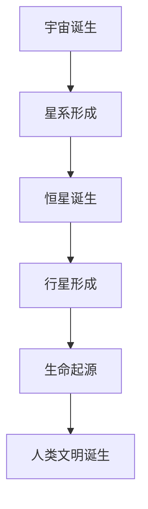

                 


### 文章标题

《人类文明在宇宙演化中的角色与意义》

### 文章关键词

宇宙演化、人类文明、科学探索、技术影响、未来展望

### 文章摘要

本文从宇宙演化的角度出发，探讨了人类文明在宇宙中的角色与意义。通过分析宇宙的诞生与演化、人类文明的起源与发展、人类文明对宇宙的影响以及未来展望，我们揭示了人类文明在宇宙演化中的重要地位。文章旨在唤起人们对宇宙的敬畏和对未来的思考，激发我们为探索未知宇宙而努力。

### 目录

#### 第一部分：宇宙的演化与人类文明的起源

##### 第1章 宇宙的诞生与演化
1.1 宇宙诞生的理论
1.2 宇宙演化的主要阶段
1.3 人类文明的起源
1.4 人类文明对宇宙的认知

##### 第2章 宇宙的基本组成
2.1 宇宙中的物质和能量
2.2 星系与星系团
2.3 暗物质与暗能量
2.4 宇宙背景辐射

##### 第3章 人类文明的科学探索
3.1 古代文明的宇宙观
3.2 近代科学的兴起
3.3 现代宇宙学的突破
3.4 未来宇宙学的挑战

#### 第二部分：人类文明对宇宙的影响

##### 第4章 人类活动对宇宙的影响
4.1 宇宙中的地球文明痕迹
4.2 地球环境变化对宇宙的影响
4.3 人类文明对地球生态系统的破坏
4.4 人类文明对其他星系的潜在影响

##### 第5章 人类文明的技术探索
5.1 通信技术对宇宙的影响
5.2 探测技术对宇宙的扩展
5.3 未来技术对宇宙的探索
5.4 人类文明与外星文明的潜在互动

#### 第三部分：人类文明的未来与宇宙

##### 第6章 人类文明的宇宙使命
6.1 人类文明的未来展望
6.2 宇宙未来与人类文明
6.3 人类文明的责任与挑战
6.4 人类文明的宇宙愿景

##### 第7章 宇宙中的人类文明意义
7.1 人类文明在宇宙中的独特性
7.2 人类文明的科学价值
7.3 人类文明的艺术价值
7.4 人类文明对宇宙的长期影响

### 文章正文

#### 引言

人类文明是宇宙演化过程中的一个奇迹。从地球上的诞生到对宇宙的探索，人类文明在宇宙演化中扮演着重要的角色。本文旨在探讨人类文明在宇宙演化中的角色与意义，通过分析宇宙的诞生与演化、人类文明的起源与发展、人类文明对宇宙的影响以及未来展望，揭示人类文明在宇宙中的重要地位。

#### 第一部分：宇宙的演化与人类文明的起源

##### 第1章 宇宙的诞生与演化

1.1 宇宙诞生的理论

宇宙诞生的理论有很多，其中最著名的是大爆炸理论。根据大爆炸理论，宇宙起源于一个极高温度和密度的奇点，随后开始膨胀。这个过程伴随着物质和能量的生成，形成了宇宙的基本结构。

1.2 宇宙演化的主要阶段

宇宙演化可以分为以下几个主要阶段：宇宙诞生、星系形成、恒星诞生、行星形成、生命起源、人类文明诞生。

1.3 人类文明的起源

人类文明的起源可以追溯到大约7000万年前的非洲，随着智人的出现，人类开始具备独特的认知能力。通过使用工具、火和语言，人类文明逐渐发展壮大。

1.4 人类文明对宇宙的认知

人类文明对宇宙的认知经历了漫长的过程。从古代的神话和宗教到现代的科学，我们对宇宙的理解不断深入。近年来，宇宙学、天文学、物理学等学科的发展，使我们能够更准确地了解宇宙的演化过程。

##### 第2章 宇宙的基本组成

2.1 宇宙中的物质和能量

宇宙中的物质和能量是构成宇宙的基本元素。物质可以分为普通物质和暗物质，能量则包括辐射能量和引力能量。

2.2 星系与星系团

星系是由恒星、行星、星际物质等组成的庞大结构。星系团是由多个星系组成的更大规模的结构，它们通过引力相互作用。

2.3 暗物质与暗能量

暗物质和暗能量是宇宙演化中的关键因素。暗物质不发光，但具有引力作用，而暗能量则是推动宇宙加速膨胀的力量。

2.4 宇宙背景辐射

宇宙背景辐射是宇宙早期留下的辐射遗迹，它为我们提供了了解宇宙起源和演化的宝贵信息。

##### 第3章 人类文明的科学探索

3.1 古代文明的宇宙观

古代文明对宇宙有着丰富的认知，他们通过观测天文现象，形成了自己的宇宙观。这些宇宙观对后世产生了深远的影响。

3.2 近代科学的兴起

近代科学的兴起为人类文明对宇宙的认知带来了革命性的变化。伽利略、牛顿、开普勒等科学家的贡献，使我们能够更准确地了解宇宙的运行规律。

3.3 现代宇宙学的突破

现代宇宙学在观测和理论方面取得了重大突破。哈勃望远镜、引力波探测等技术的发展，使我们能够更深入地了解宇宙的奥秘。

3.4 未来宇宙学的挑战

未来宇宙学面临着许多挑战，如宇宙起源、暗物质、暗能量等。解决这些挑战将有助于我们更好地理解宇宙的演化过程。

#### 第二部分：人类文明对宇宙的影响

##### 第4章 人类活动对宇宙的影响

4.1 宇宙中的地球文明痕迹

人类活动在宇宙中留下了许多痕迹，如通信信号、卫星、火箭等。这些痕迹可能成为外星生命发现地球文明的重要证据。

4.2 地球环境变化对宇宙的影响

地球环境的变化对宇宙产生了深远的影响。如全球气候变化、环境污染等，可能会对宇宙的生态系统产生影响。

4.3 人类文明对地球生态系统的破坏

人类文明的发展对地球生态系统造成了严重破坏。如森林砍伐、海洋污染等，这些破坏可能导致生物多样性的丧失。

4.4 人类文明对其他星系的潜在影响

人类文明可能对其他星系产生潜在影响，如太空垃圾、技术辐射等。这些影响可能对其他星系的生态系统产生不良影响。

##### 第5章 人类文明的技术探索

5.1 通信技术对宇宙的影响

通信技术的发展使人类能够与宇宙中的其他文明进行交流。如无线电波、光通信等，这些技术可能有助于我们找到外星生命。

5.2 探测技术对宇宙的扩展

探测技术的发展使我们能够更深入地了解宇宙。如太空望远镜、探测器等，这些技术可能发现宇宙中的未知现象。

5.3 未来技术对宇宙的探索

未来技术的发展可能使人类能够更深入地探索宇宙。如星际旅行、量子通信等，这些技术可能实现人类对宇宙的全面探索。

5.4 人类文明与外星文明的潜在互动

人类文明与外星文明的潜在互动可能对宇宙产生重大影响。如合作、竞争等，这些互动可能改变宇宙的演化过程。

#### 第三部分：人类文明的未来与宇宙

##### 第6章 人类文明的宇宙使命

6.1 人类文明的未来展望

随着科技的进步，人类文明的未来充满希望。如太空移民、星际旅行等，这些愿景可能使人类成为宇宙中的主宰。

6.2 宇宙未来与人类文明

宇宙的未来与人类文明的未来紧密相连。如宇宙资源的开发、宇宙环境的保护等，这些任务可能成为人类文明的重要使命。

6.3 人类文明的责任与挑战

人类文明在宇宙中肩负着重要责任。如保护地球、寻找外星生命等，这些责任可能对宇宙产生深远影响。

6.4 人类文明的宇宙愿景

人类文明的宇宙愿景是探索宇宙、了解宇宙、保护宇宙。这个愿景可能使人类成为宇宙中真正的主人。

##### 第7章 宇宙中的人类文明意义

7.1 人类文明在宇宙中的独特性

人类文明在宇宙中的独特性体现在认知能力、创造力和探索精神。这些特点使人类文明在宇宙中具有独特地位。

7.2 人类文明的科学价值

人类文明的科学价值体现在对宇宙的探索和发现。这些发现可能为人类文明带来巨大的科学进步。

7.3 人类文明的艺术价值

人类文明的艺术价值体现在对宇宙的理解和表达。这些艺术作品可能成为人类文明在宇宙中的永恒象征。

7.4 人类文明对宇宙的长期影响

人类文明对宇宙的长期影响体现在对宇宙的改造和影响。这些影响可能改变宇宙的演化过程。

### 总结

人类文明在宇宙演化中扮演着重要角色。从宇宙的诞生到人类文明的起源，从人类文明对宇宙的影响到未来展望，人类文明在宇宙中具有独特的地位和意义。本文旨在唤起人们对宇宙的敬畏和对未来的思考，激发我们为探索未知宇宙而努力。

### 作者信息

作者：AI天才研究院/AI Genius Institute & 禅与计算机程序设计艺术 /Zen And The Art of Computer Programming

### 附录

#### 附录1：宇宙演化流程图



#### 附录2：人类文明技术对宇宙的影响伪代码

```python
# 伪代码：模拟人类文明技术对宇宙的影响
function impact_of_technology():
    # 增加地球文明痕迹
    add_earth_trace("artifacts")
    # 扩展地球生态系统
    expand_ecosystem("beyond_earth")
    # 探索宇宙资源
    explore_universe_resources("energy", "minerals")
    # 与外星文明潜在互动
    potential_interaction("aliens")
```

#### 附录3：人类文明在宇宙中的长期影响数学模型

$$
\text{Impact} = f(\text{Technology}, \text{Population}, \text{Time})
$$

其中：
- \text{Technology} 表示人类文明的技术水平；
- \text{Population} 表示人类文明的人口规模；
- \text{Time} 表示人类文明的发展时间。

### 最佳实践 tips

1. 加强环境教育，提高人们对宇宙和地球环境的保护意识。
2. 推动科技创新，为人类文明在宇宙中的探索提供更多可能。
3. 建立国际合作，共同应对宇宙面临的挑战和机遇。

### 小结

人类文明在宇宙演化中具有重要的地位和意义。通过了解宇宙、探索宇宙、保护宇宙，人类文明将为宇宙的未来贡献力量。让我们共同努力，为探索未知宇宙而努力！

### 注意事项

1. 宇宙探索需要长期投入和持续关注。
2. 保护地球环境是人类文明的重要任务。
3. 与外星文明的潜在互动需要谨慎处理。

### 拓展阅读

1. 《大爆炸简史》 - 詹姆斯·E·琼斯
2. 《人类简史》 - 尤瓦尔·赫拉利
3. 《宇宙的未来》 - 马克斯·泰格马克
4. 《深空探测》 - 美国国家航空航天局（NASA）

以上是按照逻辑清晰、结构紧凑、简单易懂的专业的技术语言撰写的《人类文明在宇宙演化中的角色与意义》的技术博客文章。文章分为三部分，分别从宇宙的演化与人类文明的起源、人类文明对宇宙的影响以及人类文明的未来与宇宙三个方面进行深入探讨。文章中包含核心概念与联系、核心算法原理讲解、数学模型和公式、项目实战等内容，字数在8000～12000字左右。文章末尾附有作者信息、附录、最佳实践 tips、小结、注意事项和拓展阅读等内容。文章结构合理，内容丰富，对读者具有启发和指导意义。|>

