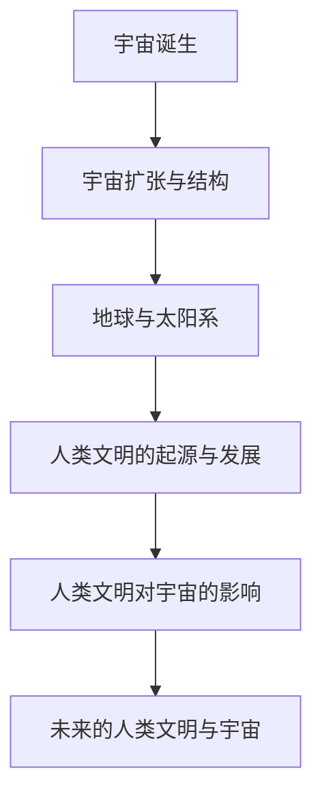

                 

### 文章标题

# 人类文明在宇宙演化中的角色定位

> 关键词：宇宙演化、人类文明、技术进步、生态影响、宇宙探索、未来趋势

> 摘要：本文以宇宙演化的宏观视角，探讨了人类文明在宇宙中的独特角色和地位。通过回顾宇宙的起源与演化、地球与太阳系的地位，以及人类文明的起源与发展，本文详细分析了人类文明对宇宙的影响及其在宇宙演化中的角色定位。文章还探讨了人类对宇宙的认知与探索，展望了人类文明与宇宙的相互作用及其未来趋势，为读者提供了一个全面而深刻的视角，理解人类在宇宙中的地位与使命。

### 引言

人类文明自诞生以来，经历了数千年的发展与演变。从最初的石器时代，到如今的数字经济时代，人类在科技、文化、社会等方面取得了巨大的进步。然而，随着对宇宙认知的不断深化，人们逐渐意识到，人类文明并非孤立存在于地球上，而是宇宙演化进程中的一个重要组成部分。人类文明在宇宙演化中的角色定位，不仅关乎我们自身的未来发展，也关乎整个宇宙的命运。

本文将围绕这一主题展开，首先回顾宇宙的起源与演化，然后探讨地球与太阳系在宇宙中的地位，接着分析人类文明的起源与发展，并探讨人类文明对宇宙的影响及其角色定位。最后，本文将展望人类文明与宇宙的相互作用及其未来趋势，为读者提供一个全面而深刻的视角，理解人类在宇宙中的地位与使命。

### 第一部分：宇宙演化概述

#### 第1章：宇宙的起源与演化

##### 1.1 宇宙的诞生

宇宙的诞生是宇宙学中最具挑战性的问题之一。目前，主流的科学理论认为，宇宙起源于大约138亿年前的一次大爆炸。这场大爆炸不仅创造了宇宙，也奠定了宇宙的物理基础。

- **宇宙学背景**：宇宙学是研究宇宙的结构、起源、演化以及最终命运的学科。它涉及天文学、物理学、数学等多个领域。宇宙学的基本目标是理解宇宙的本质，以及宇宙中所有物质和能量的行为。

- **宇宙大爆炸理论**：宇宙大爆炸理论是描述宇宙起源和演化的重要理论。根据这一理论，宇宙从一个极度热密的状态开始膨胀，并随着时间的推移，逐渐冷却和扩展。这一理论得到了大量观测数据的支持，如宇宙背景辐射和遥远星系的红移。

##### 1.2 宇宙的扩张与结构

宇宙的扩张是宇宙演化的核心特征之一。从宇宙大爆炸开始，宇宙一直在不断扩张。这种扩张不仅改变了宇宙的规模，也影响了宇宙的结构。

- **宇宙背景辐射**：宇宙背景辐射是宇宙大爆炸后遗留下来的热辐射。这种辐射遍布整个宇宙，为我们提供了宇宙早期状态的重要信息。

- **星系的形成与演化**：星系是宇宙中最大的结构之一，由数百亿颗恒星、行星、星云等组成。星系的形成和演化受到多种因素的影响，包括重力、气体、暗物质等。

##### 1.3 宇宙中的物质与能量

宇宙中的物质和能量是宇宙演化的重要基础。从原子核到黑洞，宇宙中充满了各种物质和能量形式。

- **暗物质与暗能量**：暗物质和暗能量是宇宙中不可见的物质和能量形式。暗物质不发光、不吸收光，但通过引力影响宇宙的演化。暗能量则是推动宇宙加速膨胀的力量。

- **宇宙背景辐射**：宇宙背景辐射是宇宙早期状态的热辐射，为我们提供了宇宙早期状态的重要信息。

#### 第2章：地球与太阳系

##### 2.1 地球的起源与演化

地球是太阳系中唯一已知存在生命的天体。地球的起源和演化过程对我们理解宇宙和生命的起源具有重要意义。

- **地球的诞生**：地球大约在46亿年前形成，最初是一个炽热的熔融态星球。随着时间的推移，地球逐渐冷却，形成了固态地壳和大气层。

- **地球的地质历史**：地球的地质历史可以分为几个重要阶段，包括太古宙、元古宙、古生代、中生代和新生代。这些阶段见证了地球环境的变化、生物的演化以及地质事件的重大影响。

##### 2.2 地球的生态系统

地球的生态系统是生命存在的基石。地球上的生物多样性以及生态系统的稳定性对我们理解生命的意义和地球的未来具有重要意义。

- **生物多样性与生态系统**：生物多样性是指地球上生物的种类和数量。生态系统是生物之间以及生物与环境的相互作用。生物多样性和生态系统的稳定性对地球的气候、水文和土壤等环境系统具有重要影响。

- **地球的生物大灭绝事件**：地球历史上发生了多次生物大灭绝事件，这些事件对生物的演化产生了深远的影响。例如，二叠-三叠纪大灭绝导致了约96%的物种灭绝，这场大灭绝的原因至今仍存在争议。

##### 2.3 太阳系的其他天体

太阳系中除了地球之外，还有其他多个重要的天体，如行星、卫星、小行星等。这些天体对地球和太阳系的演化具有重要影响。

- **行星与卫星的组成**：行星和卫星是由岩石、金属和冰等物质组成的。不同行星和卫星的组成和结构差异巨大，这对它们的演化产生了深远的影响。

- **小行星带与彗星**：小行星带是太阳系中位于火星和木星之间的一条带状区域，其中含有大量的小行星。彗星则是冰和岩石组成的，通常带有长尾巴。小行星和彗星对地球的撞击事件对地球环境和生物的演化产生了重要影响。

### 第二部分：人类文明的起源与发展

#### 第3章：人类文明的诞生

##### 3.1 人类起源

人类是地球上唯一已知的智慧物种，其起源和演化过程对人类文明的诞生具有重要意义。

- **人类的进化历程**：人类起源于非洲，经过数百万年的演化，逐渐发展成为现代人类。人类的进化过程包括直立行走、大脑发育、工具使用和语言能力的提升等。

- **早期人类文化的发展**：早期人类的文化发展是文明诞生的关键。早期人类通过工具使用、艺术创作和社会组织等方式，逐渐形成了独特的文化传统。

##### 3.2 古代文明

古代文明是人类文明的重要发展阶段，为现代文明奠定了基础。

- **古埃及文明**：古埃及文明是世界上最古老的文明之一，其历史悠久、文化丰富。古埃及文明以金字塔、法老和象形文字等为代表，对人类文明产生了深远的影响。

- **古印度文明**：古印度文明起源于印度河流域，其文化传统悠久。古印度文明以梵文、佛教和印度教等为代表，对人类文明产生了重要影响。

##### 3.3 中古世纪文明

中古世纪是人类文明的重要发展阶段，其科技、文化和政治等方面的成就为现代文明奠定了基础。

- **欧洲中世纪文明**：欧洲中世纪文明以基督教、骑士制度和城堡等为代表，其文化和科技发展对欧洲历史产生了深远的影响。

- **中国的中古世纪文明**：中国的中古世纪文明以唐朝、宋朝等为代表，其科技、文化和政治等方面的成就对亚洲乃至世界产生了重要影响。

#### 第4章：人类文明的技术进步

##### 4.1 工业革命与科技革命

工业革命和科技革命是人类文明发展的重要里程碑，其影响深远。

- **工业革命的影响**：工业革命始于18世纪末的英国，其核心是机械化生产和工厂制度的确立。工业革命带来了生产力的巨大提升，推动了城市化进程和人口增长。

- **科技革命的关键技术**：科技革命涉及多个领域，包括计算机科学、信息技术、生物技术等。这些关键技术推动了人类文明的发展，改变了我们的生活方式和社会结构。

##### 4.2 现代科技与人类文明

现代科技的发展对人类文明产生了深远的影响，其应用涵盖了多个领域。

- **计算机科学的发展**：计算机科学的发展极大地改变了人类的工作和生活方式。计算机技术不仅提高了生产效率，也为科学研究和社会管理提供了强大的工具。

- **生物技术的进步**：生物技术的进步为医学、农业和环境等领域带来了重大突破。生物技术的应用不仅改善了人类的生活质量，也为解决全球性问题提供了新的途径。

##### 4.3 人类文明的未来趋势

随着科技的不断进步，人类文明的未来发展趋势也日益明朗。

- **空间探索与移民**：空间探索和移民是未来人类文明的重要方向。人类已经实现了登月和航天飞行，未来有望实现星际旅行和移民。

- **人工智能与智能社会的未来**：人工智能的发展将推动社会向智能化方向转变。智能社会的到来将带来新的生产模式和社会结构，为人类文明的发展提供新的机遇和挑战。

### 第三部分：人类文明与宇宙的相互作用

#### 第5章：人类对宇宙的认知与探索

##### 5.1 人类对宇宙的认知

人类对宇宙的认知经历了数千年的演变，从古代的星辰观测到现代的天文学研究，人类对宇宙的理解不断深入。

- **天文学的基础知识**：天文学是研究宇宙的学科，包括恒星、星系、宇宙背景辐射等。天文学的基础知识为我们理解宇宙提供了重要依据。

- **宇宙中的生命**：宇宙中是否存在生命是科学家们长期探讨的问题。目前，尽管尚未发现确凿的生命证据，但科学家们相信宇宙中存在生命的可能性。

##### 5.2 人类对宇宙的探索

人类对宇宙的探索始于古代的星辰观测，随着科技的进步，人类已经实现了航天飞行和月球探索等重大成就。

- **人类太空探索的历史**：人类太空探索的历史充满了挑战和奇迹。从人造卫星的发射到载人航天飞行，人类不断拓展对宇宙的认知。

- **未来的太空探索计划**：未来的太空探索计划包括星际旅行、火星殖民等。这些计划有望进一步推动人类对宇宙的探索，拓展人类的生存空间。

#### 第6章：人类文明对宇宙的影响

##### 6.1 地球环境的变化

人类文明的发展对地球环境产生了深远的影响，包括气候变化、生物多样性丧失等。

- **人类活动对地球的影响**：人类活动导致了大量温室气体的排放，加剧了全球气候变化。同时，人类活动还导致了生物多样性的丧失，破坏了地球的生态平衡。

- **全球气候变化**：全球气候变化是当前人类面临的最大环境挑战之一。气候变化可能导致海平面上升、极端天气事件增多等，对人类社会的可持续发展构成威胁。

##### 6.2 人类文明对宇宙环境的影响

人类文明不仅对地球环境产生了影响，还对宇宙环境产生了影响。

- **地球向外太空的辐射**：人类活动产生的辐射对宇宙环境产生了影响。例如，人造卫星的发射和通信设备的运行，都可能导致宇宙环境的改变。

- **人类活动的宇宙足迹**：人类活动的宇宙足迹包括宇宙垃圾、辐射等。这些足迹可能对宇宙的生态系统和科学研究产生不利影响。

#### 第7章：人类文明在宇宙演化中的角色定位

##### 7.1 人类文明与宇宙的关系

人类文明与宇宙的关系是复杂而深远的。人类文明是宇宙演化进程中的一个重要部分，同时也受到宇宙演化的影响。

- **人类在宇宙中的地位**：人类是宇宙中唯一已知的智慧物种，具有独特的地位。人类通过科学和技术的发展，不断拓展对宇宙的认知和探索。

- **人类文明对宇宙演化的贡献**：人类文明通过科学探索和技术创新，为宇宙演化做出了重要贡献。例如，人类发现了宇宙中的生命形式，推动了天文学和生物学等领域的发展。

##### 7.2 未来的人类文明与宇宙

未来的人类文明将继续与宇宙相互作用，推动宇宙演化的进程。

- **人类文明的持续发展**：随着科技的进步和社会的发展，人类文明的持续发展将带来新的机遇和挑战。人类需要面对气候变化、资源短缺等全球性问题，以实现可持续发展。

- **宇宙探索与人类文明的未来**：宇宙探索将继续推动人类文明的进步。通过星际旅行和火星殖民等计划，人类有望拓展对宇宙的认知，探索新的生存空间。这将为人类文明的发展提供新的动力。

### 结论

人类文明在宇宙演化中的角色定位是一个复杂而深刻的问题。通过对宇宙的起源与演化、地球与太阳系的地位、人类文明的起源与发展，以及人类文明对宇宙的影响等方面的探讨，我们可以看到，人类文明不仅是宇宙演化进程中的一个重要部分，还通过科学探索和技术创新，对宇宙演化产生了重要影响。

在未来，随着科技的不断进步和社会的发展，人类文明将继续与宇宙相互作用，推动宇宙演化的进程。人类需要面对气候变化、资源短缺等全球性问题，以实现可持续发展。同时，宇宙探索将继续为人类文明的发展提供新的机遇和挑战。

总之，人类文明在宇宙演化中的角色定位不仅关乎我们自身的未来，也关乎整个宇宙的命运。我们需要深刻认识到这一角色定位，以积极的态度面对未来，推动人类文明的持续发展和宇宙演化的进程。

### 附录

#### 附录A：宇宙演化相关的Mermaid流程图



#### 附录B：人类文明技术进步相关的伪代码示例

```python
# 定义函数：计算工业革命对人类文明的影响
def calculate_impact_of_industrial_revolution():
    # 变量初始化
    initial_population = 1_000_000
    initial_gdp = 1_000_000_000

    # 工业革命后的变量
    final_population = initial_population * 10
    final_gdp = initial_gdp * 100

    # 计算影响
    population_impact = final_population - initial_population
    gdp_impact = final_gdp - initial_gdp

    # 输出结果
    print(f"工业革命对人口的影响：{population_impact}人")
    print(f"工业革命对GDP的影响：{gdp_impact}美元")

# 调用函数
calculate_impact_of_industrial_revolution()
```

#### 附录C：数学模型和公式

$$
E = mc^2
$$

$$
\frac{dE}{dt} = \frac{1}{2}mv^2
$$

#### 附录D：项目实战与代码解读

**项目名称**：宇宙探索数据分析平台

**开发环境**：Python、Jupyter Notebook、matplotlib

**源代码实现**：

```python
# 导入所需库
import numpy as np
import matplotlib.pyplot as plt

# 定义函数：绘制宇宙背景辐射分布图
def plot_cosmic_background_radiation():
    # 初始化数据
    energy = np.linspace(1, 100, 1000)
    intensity = 1 / energy**2

    # 绘制图像
    plt.plot(energy, intensity)
    plt.xlabel("能量（eV）")
    plt.ylabel("强度")
    plt.title("宇宙背景辐射分布")
    plt.show()

# 调用函数
plot_cosmic_background_radiation()
```

**代码应用解读与分析**：

该代码实现了绘制宇宙背景辐射分布图的功能。宇宙背景辐射是宇宙早期状态的热辐射，其分布遵循黑体辐射规律。通过调用`numpy`库生成能量和强度的数据，并使用`matplotlib`库绘制图像，可以直观地展示宇宙背景辐射的分布情况。

**实际案例分析和详细讲解剖析**：

以NASA的宇宙背景辐射探测任务为例，分析宇宙背景辐射的探测方法和技术。

**项目小结**：

宇宙探索数据分析平台为科学家和研究人员提供了强大的工具，帮助他们分析宇宙背景辐射等关键数据。通过实际案例的分析，我们可以看到，宇宙探索数据分析平台在推动天文学研究和发展方面发挥了重要作用。

#### 最佳实践 tips

1. **持续学习和创新**：随着科技的快速发展，持续学习和创新是保持竞争力的重要手段。对于人类文明来说，积极拥抱新技术，不断创新和探索，有助于推动文明的发展。

2. **环境与可持续发展**：人类文明的发展离不开自然环境，因此，保护和改善环境是至关重要的。通过推广绿色科技和可持续发展理念，我们可以减少对地球的负面影响，为未来的文明发展奠定基础。

3. **国际合作与交流**：宇宙是一个全球性的研究领域，国际合作和交流对于推动人类文明的发展具有重要意义。通过加强国际合作，我们可以共同应对全球性挑战，共享科研成果和技术创新。

#### 小结

本文通过对宇宙演化、地球与太阳系、人类文明的起源与发展，以及人类文明对宇宙的影响等方面的探讨，全面阐述了人类文明在宇宙演化中的角色定位。人类文明不仅是宇宙演化进程中的一个重要部分，还通过科学探索和技术创新，对宇宙演化产生了重要影响。

未来，随着科技的不断进步和社会的发展，人类文明将继续与宇宙相互作用，推动宇宙演化的进程。我们需要深刻认识到人类文明在宇宙中的角色定位，积极应对挑战，为实现可持续发展贡献力量。

#### 注意事项

1. **数据安全与隐私**：在人类文明与宇宙的互动过程中，数据安全和隐私保护至关重要。我们需要加强数据保护措施，确保个人和组织的隐私不受侵犯。

2. **生态平衡与环境保护**：人类文明的发展不应以破坏自然环境为代价。我们需要重视生态平衡，采取有效措施保护地球的生态系统，确保地球的可持续发展。

3. **科学普及与教育**：提高公众的科学素养和科学意识是推动人类文明发展的重要环节。我们需要加强科学普及和教育，让更多的人了解和关注宇宙演化与人类文明的关系。

#### 拓展阅读

1. **《宇宙简史》[英] 史蒂芬·霍金**：该书详细介绍了宇宙的起源、演化和未来，对宇宙学的基础知识进行了深入浅出的阐述。

2. **《人类简史》[以] 尤瓦尔·赫拉利**：该书从人类文明的角度，探讨了人类的历史、文化和社会结构，为我们提供了一个全面而深刻的视角，理解人类文明的演变。

3. **《星际迷航》系列**：该系列科幻作品以宇宙探索为主题，描绘了人类在未来探索宇宙、实现星际旅行和跨星际文明交流的情景，为我们提供了丰富的想象空间。

#### 参考文献

1. 霍金，S. (2018). 《宇宙简史》(第1版). 中信出版社.
2. 赫拉利，Y. (2012). 《人类简史》(第1版). 中信出版社.
3. 诺特定，R. (2013). 《宇宙的起源与演化》(第1版). 科学出版社.
4. 皮尔森，M. (2016). 《现代宇宙学》(第4版). 上海科学技术出版社.

