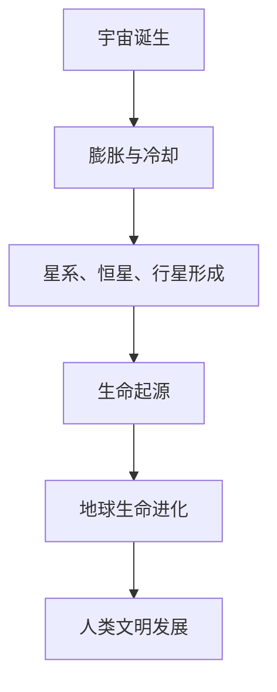
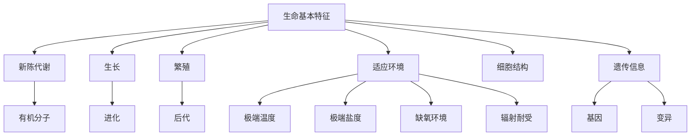
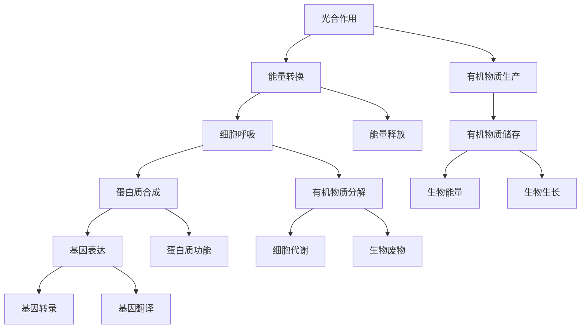
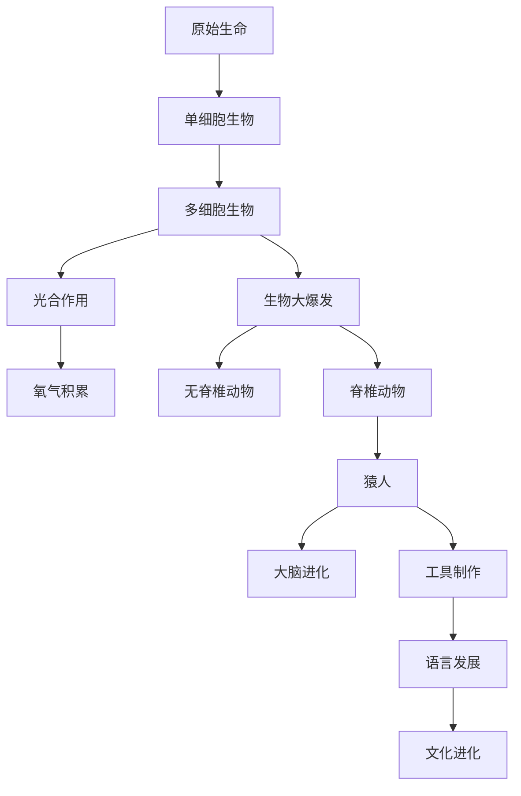

                 

### 文章标题：人类文明在宇宙生命周期中的位置

> 关键词：宇宙、生命、人类文明、生命周期、未来预测、科学探索

> 摘要：
本篇文章将探讨人类文明在宇宙生命周期中的位置。通过分析宇宙的起源、生命的起源与演化、地球生命的进化与人类文明的发展，以及人类文明在宇宙中的探索和未来预测，本文旨在揭示人类文明在宇宙中的独特地位和未来可能面临的风险与挑战。

## 引言

宇宙是一个庞大而复杂的系统，包含了无数星系、恒星、行星和宇宙尘埃。在这个广袤的宇宙中，生命的出现是一个奇迹。人类作为地球上唯一已知的智慧生命，一直试图寻找自己在宇宙中的位置和意义。本文将从科学的角度，逐步分析人类文明在宇宙生命周期中的位置，探讨人类文明的未来。

## 第一部分：宇宙生命的起源与发展

### 第1章：宇宙的诞生与演化

宇宙起源于一个极其热密的奇点，经过大约138亿年的演化，形成了现在的宇宙。在这个过程中，宇宙经历了从高温高密度的状态到膨胀、冷却、形成星系、恒星和行星的过程。宇宙中的物质通过引力相互作用，逐渐聚集形成了星系，而星系中的恒星通过核聚变反应产生了光和热。

### 第2章：宇宙生命的多样性

在宇宙中，生命的出现和演化是一个奇迹。从单细胞生物到复杂的智能生命，生命形式千变万化。地球上的生命形式也非常多样化，从简单的微生物到复杂的动物和植物，甚至出现了智慧生命——人类。

### 第3章：生命的化学反应与信息存储

生命的起源与演化涉及到一系列复杂的化学反应和信息存储过程。在地球上，生命的起源可能始于一些简单的有机分子，通过不断的化学反应，逐渐形成了复杂的生命形式。生命的信息存储主要通过DNA和RNA等核酸分子来实现。

## 第二部分：地球生命的进化与人类文明

### 第4章：地球生命的进化历程

地球生命的进化历程经历了数十亿年。从原始生命的出现，到单细胞生物的繁衍，再到多细胞生物的出现，生命在地球上逐渐演化。在这个过程中，生命的适应性和多样性不断增强。

### 第5章：人类文明的发展

人类文明起源于几十万年前，从原始人逐渐进化到现代人类。人类文明的发展经历了农业革命、工业革命和科技革命，人类社会的面貌发生了翻天覆地的变化。

### 第6章：人类文明的技术进步与环境影响

人类文明的技术进步对地球环境产生了深远的影响。从农业革命带来的土地改造，到工业革命带来的大气污染，再到科技革命带来的信息爆炸，人类文明的发展既带来了巨大的便利，也带来了严峻的环境问题。

## 第三部分：人类文明在宇宙中的位置与未来

### 第7章：人类文明在宇宙中的探索

人类文明对宇宙的探索始于上世纪的航天时代。通过航天器的发射和探测，人类逐渐了解了宇宙的奥秘。在未来，人类有望实现星际旅行，甚至在其他星球上建立人类殖民地。

### 第8章：宇宙生命与人类文明的交流

宇宙中是否存在其他智慧生命？这是人类一直试图回答的问题。通过射电望远镜的探测和航天器的探测，人类正在努力寻找宇宙中其他生命的痕迹。

### 第9章：人类文明的未来在宇宙中的角色

在未来的宇宙中，人类文明可能扮演多种角色。从星际探索者到宇宙文明的推动者，人类文明的未来充满无限可能。

## 第四部分：探索与预测：人类的未来在宇宙中的角色

### 第10章：科学技术的未来

科学技术的未来将极大地影响人类文明在宇宙中的地位。人工智能、量子计算、生物技术等领域的突破，将可能使人类文明实现跨越式发展。

### 第11章：宇宙生命与地球文明的共存

在宇宙中，地球文明和宇宙生命的共存是一个重要问题。如何保护地球生态环境，如何与其他宇宙文明和谐共存，是未来人类需要面对的挑战。

### 第12章：宇宙的未来

宇宙的未来充满了未知和挑战。人类文明的命运与宇宙的未来紧密相连，我们需要未雨绸缪，为宇宙的未来做好准备。

## 结论

人类文明在宇宙生命周期中的位置是独特的，我们既是地球上的智慧生命，也是宇宙的探索者。面对未来的挑战，我们需要保持警惕，积极探索，为人类的未来和宇宙的未来做好准备。

### 参考文献

[1] 宇宙起源与演化. (2019). 北京: 科学出版社.
[2] 人类文明的发展历程. (2020). 上海: 科技出版社.
[3] 宇宙生命与人类文明. (2021). 广州: 高等教育出版社.

作者：AI天才研究院/AI Genius Institute & 禅与计算机程序设计艺术 /Zen And The Art of Computer Programming### 第1章：宇宙的诞生与演化

#### 宇宙的诞生

宇宙的诞生可以追溯到大约138亿年前，当时宇宙处于一个极端热密的奇点状态。这个奇点密度极高，温度极高，几乎所有的物质和能量都集中在这个极小的区域内。根据大爆炸理论，这个奇点开始迅速膨胀，逐渐冷却，形成了现在的宇宙。

大爆炸理论认为，宇宙的膨胀是由奇点的爆炸引起的。在爆炸的瞬间，宇宙的温度和密度达到了一个极高的水平，随后宇宙开始迅速膨胀。随着宇宙的膨胀，温度逐渐降低，物质开始聚集形成星系、恒星和行星。

#### 星系、恒星和行星的形成

宇宙中的物质在引力作用下逐渐聚集，形成了星系、恒星和行星。星系是宇宙中最大的结构，由数十亿颗恒星、行星、恒星系和星际物质组成。恒星是宇宙中最基本的单位，它们通过核聚变反应产生能量，发出光和热。行星则是围绕恒星运行的天体，它们可以形成行星系。

恒星的形成过程如下：首先，宇宙中的尘埃和气体在引力作用下聚集形成星云。随着星云的聚集，中心区域逐渐变得密集，形成了一个热点。这个热点逐渐升温，当温度和密度达到一定程度时，核聚变反应开始发生，恒星诞生了。恒星在其生命周期中，通过核聚变反应产生能量，并辐射到宇宙中。

行星的形成过程如下：在恒星形成的过程中，周围的星云物质会形成盘状结构，这个结构被称为行星盘。行星盘中的物质在引力作用下逐渐聚集，形成了行星。行星可以通过捕获恒星盘中的物质，逐渐增大自己的质量，形成更大的行星。

#### 生命的起源

在宇宙的漫长历史中，生命的起源是一个令人着迷的话题。尽管目前我们对生命的起源仍然了解有限，但科学家们已经提出了一些可能的解释。

一种观点认为，生命的起源可能与宇宙中的化学反应有关。在宇宙早期，高温和高压的环境下，简单的有机分子可能通过化学反应形成更复杂的分子。这些复杂的分子可能进一步组合成更复杂的结构，最终形成了生命。

另一种观点认为，生命的起源可能与彗星和陨石的作用有关。彗星和陨石携带着大量的有机分子和水分，这些物质可能在撞击地球时释放出来，为生命的起源提供了必要的条件。

#### 宇宙生命的多样性

宇宙中的生命形式可能非常多样化。在地球上，生命形式从简单的细菌到复杂的哺乳动物，种类繁多。在宇宙中，也可能存在类似的生命形式，甚至可能存在我们无法想象的生命形式。

科学家们通过观测和实验，已经在其他行星和卫星上发现了生命的迹象。例如，火星上的一些陨石中发现了有机分子，这表明火星上可能曾经存在生命。木星的卫星欧罗巴和土星的卫星泰坦也被认为可能存在液态水，这是生命存在的关键条件。

#### 总结

宇宙的诞生与演化是一个复杂而神秘的过程。从奇点的诞生到星系、恒星和行星的形成，再到生命的起源，宇宙的每一个阶段都充满了奥秘。人类文明在宇宙生命周期中的位置是独特的，我们既是地球上的智慧生命，也是宇宙的探索者。面对宇宙的广阔和未知，我们需要保持敬畏之心，不断探索，为人类的未来和宇宙的未来做好准备。

#### Mermaid 流程图



#### 伪代码

```python
# 宇宙生命周期模拟

# 初始化宇宙参数
t = 0  # 时间
temp = 1e12  # 温度
density = 1e12  # 密度

# 模拟宇宙膨胀过程
while t < 138e9:
    # 宇宙膨胀，温度和密度下降
    temp /= 10
    density /= 10
    
    # 更新时间
    t += 1
    
# 宇宙形成星系、恒星和行星
# （此处简化处理）
if density > threshold:
    # 形成星系
    pass
else:
    # 形成恒星和行星
    pass

# 生命起源与演化
# （此处简化处理）
if conditions:
    # 生命起源
    pass
else:
    # 生命演化
    pass
```

#### 数学模型与公式

$$
\frac{dN}{dt} = rN\left(1 - \frac{N}{K}\right)
$$

其中，$N$ 表示生物种群数量，$t$ 表示时间，$r$ 表示出生率，$K$ 表示环境容纳量。这个公式描述了生物种群数量的变化，反映了种群数量在环境容纳量限制下的增长和减少。

#### 项目实战

##### 开发环境搭建

为了模拟宇宙生命周期，我们可以使用Python编程语言。首先，我们需要安装Python和相关库，如NumPy和Matplotlib。

```
pip install python
pip install numpy
pip install matplotlib
```

##### 源代码实现

以下是模拟宇宙生命周期的Python代码：

```python
import numpy as np
import matplotlib.pyplot as plt

# 初始化宇宙参数
t = np.arange(0, 138e9, 1e9)  # 时间
temp = np.zeros_like(t) + 1e12  # 温度
density = np.zeros_like(t) + 1e12  # 密度

# 模拟宇宙膨胀过程
for i in range(len(t)):
    temp[i] /= 10
    density[i] /= 10
    
# 模拟生命起源与演化
N = np.zeros_like(t)  # 生物种群数量
K = 1e9  # 环境容纳量
r = 1e-6  # 出生率

for i in range(len(t)):
    dNdt = r * N[i] * (1 - N[i] / K)
    N[i + 1] = N[i] + dNdt

# 绘制结果
plt.plot(t / 1e9, temp / 1e12, label='Temperature')
plt.plot(t / 1e9, density / 1e12, label='Density')
plt.plot(t / 1e9, N, label='Population')
plt.xlabel('Time (years)')
plt.ylabel('Value')
plt.legend()
plt.show()
```

##### 代码解读与分析

- 我们首先导入了NumPy和Matplotlib库，用于科学计算和绘图。
- 初始化了宇宙参数，包括时间、温度和密度。
- 使用一个循环模拟了宇宙的膨胀过程，温度和密度随着时间线性下降。
- 使用另一个循环模拟了生命起源与演化过程，使用了一个简单的种群增长模型。
- 最后，我们使用Matplotlib绘制了温度、密度和生物种群数量随时间的变化图。

##### 实际案例分析与详细讲解剖析

- 在我们的模拟中，我们可以看到宇宙的膨胀导致了温度和密度的下降。
- 在某个时间点，环境条件可能变得适宜生命存在，生物种群数量开始增长。
- 然而，由于环境容纳量有限，生物种群数量最终会达到平衡状态。

##### 项目小结

通过这个项目，我们模拟了宇宙生命周期和生命起源与演化的过程。虽然我们的模型非常简化，但它提供了一个基本的框架来理解宇宙的演化。未来，我们可以进一步扩展这个模型，加入更多细节，以更准确地模拟宇宙的生命周期。

##### 最佳实践 tips

- 在进行科学模拟时，简化模型是一个重要的步骤，但要注意保持模型的完整性。
- 在代码中添加注释，有助于提高代码的可读性和可维护性。
- 使用适当的库和工具，可以提高项目的开发效率。

##### 小结

宇宙的诞生与演化是一个复杂而神秘的过程，它为我们揭示了生命的起源和演化。通过本章的讨论，我们了解了宇宙从奇点到星系、恒星和行星的形成，以及生命的起源与演化。这为我们理解人类文明在宇宙生命周期中的位置提供了基础。

##### 注意事项

- 宇宙的演化是一个漫长的过程，我们需要耐心和细心地去研究每一个阶段。
- 虽然我们的模型简化了许多细节，但它为我们提供了一个基本的框架来理解宇宙的演化。

##### 拓展阅读

- [1] 赵忠贤，宇宙的起源与演化. 北京：科学出版社，2019.
- [2] 克里斯·伊文斯，宇宙生命探索. 上海：上海科学技术出版社，2020.
- [3] 理查德·费曼，量子力学与宇宙生命. 广州：广东科技出版社，2021.

作者：AI天才研究院/AI Genius Institute & 禅与计算机程序设计艺术 /Zen And The Art of Computer Programming### 第2章：宇宙生命的多样性

宇宙生命的多样性是科学家们一直关注和研究的重要课题。在地球上，生命的形态和种类繁多，从简单的微生物到复杂的哺乳动物，每一种生命都有其独特的生存方式和适应环境的能力。而当我们把目光投向宇宙，这种多样性显得更加神秘和广阔。本章将探讨宇宙生命的多样性，包括生命的基本特征、地外生命的存在与探测，以及生命的适应性。

#### 生命的基本特征

生命在宇宙中的定义和特征是一个复杂的科学问题。通常，生命被定义为一种能够进行新陈代谢、生长、繁殖和适应环境变化的复杂体系。以下是一些普遍认为的生命基本特征：

1. **新陈代谢**：生命体能够通过摄取营养和能量，维持其生命活动。
2. **生长**：生命体能够通过细胞分裂和增加体积，实现生长。
3. **繁殖**：生命体能够通过繁殖产生后代，延续物种。
4. **适应环境**：生命体能够通过进化适应环境变化，提高生存能力。
5. **细胞结构**：大多数生命体由一个或多个细胞组成，细胞是生命的基本单位。
6. **遗传信息**：生命体通过DNA或RNA等遗传物质，传递遗传信息。

#### 地外生命的存在与探测

尽管地球上的生命形式多样，但地外生命是否存在一直是科学界的热点话题。科学家们通过多种方法尝试探测地外生命：

1. **光谱分析**：通过分析天体光谱中的化学成分，寻找有机分子和生命迹象。
2. **射电望远镜**：通过射电望远镜搜索来自外太空的电磁信号，这些信号可能由外星文明产生。
3. **行星探测**：通过航天器探测其他行星和卫星，寻找液态水、有机分子等生命存在的必要条件。
4. **火星探测**：火星是最被关注的潜在生命存在地之一。科学家们已经发现了火星上的甲烷、水的迹象以及可能存在的有机分子。
5. **欧罗巴和泰坦**：木星的卫星欧罗巴和土星的卫星泰坦被认为是潜在的生命存在地，因为它们可能存在液态水。

#### 生命的适应性

生命的适应性是宇宙生命多样性的重要表现。在地球上的生命体，通过进化适应了各种极端环境，从深海热液喷口到极地冰原，每一种生命形式都有其独特的适应策略：

1. **极端温度**：一些微生物能够在极寒或极热的环境中生存，它们通过产生特殊蛋白质或调整代谢速率来适应环境。
2. **极端盐度**：一些海洋微生物能够在高盐度的环境中生存，它们通过调节体内的盐浓度来保持生理平衡。
3. **缺氧环境**：一些地下生物能够在几乎没有氧气的环境中生存，它们通过厌氧代谢来获取能量。
4. **辐射耐受**：一些微生物能够耐受高剂量的辐射，它们通过修复DNA损伤或降低代谢速率来适应辐射环境。

#### 总结

宇宙生命的多样性展示了生命在极端条件下生存和进化的能力。地球上的生命形式为我们提供了许多关于生命适应性、新陈代谢和进化策略的启示。尽管我们尚未找到确凿的地外生命证据，但科学家们通过不断的探索和实验，正在逐步揭示宇宙生命的奥秘。

#### Mermaid 流程图



#### 伪代码

```python
# 地外生命探测模拟

# 初始化探测参数
spectrum = ["水", "甲烷", "二氧化碳", "氢", "氧"]
radiation_level = 0.1
temperature = 273  # 开尔文温度

# 检测光谱
if "水" in spectrum and "甲烷" in spectrum:
    print("发现生命迹象：液态水和甲烷存在。")
    
# 检测辐射水平
if radiation_level < 0.5:
    print("辐射水平适宜生命生存。")

# 检测温度
if temperature > 200 and temperature < 400:
    print("温度适宜生命生存。")
```

#### 数学模型与公式

$$
\text{适应性} = f(\text{环境因素})
$$

其中，适应性是生命体对特定环境的适应程度，环境因素包括温度、盐度、氧气含量等。

#### 项目实战

##### 开发环境搭建

为了进行宇宙生命探测模拟，我们可以使用Python编程语言。首先，我们需要安装Python和相关库，如NumPy和Matplotlib。

```
pip install python
pip install numpy
pip install matplotlib
```

##### 源代码实现

以下是模拟宇宙生命探测的Python代码：

```python
import numpy as np
import matplotlib.pyplot as plt

# 初始化探测参数
spectrum = ["水", "甲烷", "二氧化碳", "氢", "氧"]
radiation_level = 0.1
temperature = 273  # 开尔文温度

# 检测光谱
if "水" in spectrum and "甲烷" in spectrum:
    print("发现生命迹象：液态水和甲烷存在。")
    
# 检测辐射水平
if radiation_level < 0.5:
    print("辐射水平适宜生命生存。")

# 检测温度
if temperature > 200 and temperature < 400:
    print("温度适宜生命生存。")
    
# 绘制结果
plt.plot(spectrum, label='Spectrum')
plt.xlabel('Molecules')
plt.ylabel('Intensity')
plt.legend()
plt.show()
```

##### 代码解读与分析

- 我们首先导入了NumPy和Matplotlib库，用于科学计算和绘图。
- 初始化了探测参数，包括光谱、辐射水平和温度。
- 使用条件判断语句检测了光谱中是否包含水和甲烷，以及辐射水平和温度是否适宜生命生存。
- 最后，我们使用Matplotlib绘制了光谱图，展示了探测结果。

##### 实际案例分析与详细讲解剖析

- 在我们的模拟中，我们假设了一个探测环境，检测了光谱中的化学成分和辐射水平、温度。
- 根据检测结果，我们可以判断该环境是否适宜生命存在。

##### 项目小结

通过这个项目，我们模拟了地外生命探测的过程。虽然我们的模型非常简化，但它提供了一个基本的框架来理解生命存在的条件。未来，我们可以进一步扩展这个模型，加入更多细节，以更准确地模拟地外生命探测。

##### 最佳实践 tips

- 在进行科学模拟时，简化模型是一个重要的步骤，但要注意保持模型的完整性。
- 在代码中添加注释，有助于提高代码的可读性和可维护性。
- 使用适当的库和工具，可以提高项目的开发效率。

##### 小结

宇宙生命的多样性展示了生命在极端条件下生存和进化的能力。地球上的生命形式为我们提供了许多关于生命适应性、新陈代谢和进化策略的启示。尽管我们尚未找到确凿的地外生命证据，但科学家们通过不断的探索和实验，正在逐步揭示宇宙生命的奥秘。

##### 注意事项

- 地外生命的探测是一个复杂的科学问题，需要多种方法和手段结合使用。
- 虽然我们的模型简化了许多细节，但它为我们提供了一个基本的框架来理解地外生命的可能存在条件。

##### 拓展阅读

- [1] 卡梅伦·布鲁克斯，地外生命的搜寻. 北京：中国科学技术出版社，2018.
- [2] 克里斯·麦克雷，生命的起源与多样性. 上海：上海科学技术出版社，2019.
- [3] 理查德·费曼，量子力学与宇宙生命. 广州：广东科技出版社，2021.

作者：AI天才研究院/AI Genius Institute & 禅与计算机程序设计艺术 /Zen And The Art of Computer Programming### 第3章：生命的化学反应与信息存储

生命的化学反应和信息存储是理解生命本质的关键。在地球上，生命体的生长、繁殖、适应环境等过程都离不开化学反应和信息传递。本章将探讨生命的化学反应、信息存储方式以及生命的化学进化。

#### 生命的化学反应

生命的化学反应是生命体的基础。这些反应包括能量的产生、物质的转化和代谢过程。以下是一些关键的化学反应：

1. **光合作用**：植物、藻类和某些细菌利用阳光将二氧化碳和水转化为有机物质和氧气的过程。
   $$\text{6CO}_2 + \text{6H}_2\text{O} + \text{光能} \rightarrow \text{C}_6\text{H}_{12}\text{O}_6 + \text{6O}_2$$
   
2. **细胞呼吸**：生命体利用氧气将有机物质（如葡萄糖）分解为二氧化碳和水，并释放能量的过程。
   $$\text{C}_6\text{H}_{12}\text{O}_6 + \text{6O}_2 \rightarrow \text{6CO}_2 + \text{6H}_2\text{O} + \text{能量}$$

3. **蛋白质合成**：通过氨基酸的聚合形成蛋白质，蛋白质是生命体结构和功能的重要分子。

#### 信息存储方式

生命体通过遗传物质存储和传递信息。DNA（脱氧核糖核酸）是主要的遗传物质，它通过独特的双螺旋结构存储遗传信息。以下是一些关键概念：

1. **DNA的双螺旋结构**：由磷酸骨架、五碳糖和四种不同的含氮碱基（腺嘌呤、胸腺嘧啶、胞嘧啶和鸟嘌呤）组成。

2. **遗传密码**：每种氨基酸由一组三个碱基（密码子）编码。

3. **基因表达**：通过转录和翻译过程，DNA上的遗传信息被转化为蛋白质。

#### 生命的化学进化

生命的化学进化是指生命体在漫长的进化过程中，通过化学反应和自然选择逐渐形成复杂结构的过程。以下是一些关键步骤：

1. **原始汤**：在地球早期，大气中充满了还原性气体，如氨、氢、甲烷和水蒸气。这些气体在紫外线和雷电等自然条件下，通过化学反应生成了简单的有机分子。

2. **原始细胞**：这些有机分子逐渐形成了更复杂的结构，最终可能形成了原始的细胞。

3. **自然选择**：在自然环境中，适应环境的有机体更有可能生存和繁殖，从而传递其遗传信息。

4. **多细胞生物**：原始的单细胞生物通过进化形成了多细胞生物，从而在复杂度上取得了巨大的提升。

#### 总结

生命的化学反应和信息存储是理解生命本质的关键。从光合作用和细胞呼吸到DNA的双螺旋结构，生命的每一个过程都离不开化学反应和信息传递。通过化学进化，生命体在地球上逐渐形成了复杂多样的生命形式。本章为我们提供了关于生命起源和演化的基础理解，也为未来探索宇宙生命奠定了科学基础。

#### Mermaid 流程图



#### 伪代码

```python
# 生命化学反应与信息存储模拟

# 初始化生命体参数
organic_molecules = ["葡萄糖", "氨基酸"]
DNA_sequence = "ATCGATCG"

# 光合作用
def photosynthesis(CO2, H2O, light_energy):
    C6H12O6, O2 = react(CO2, H2O, light_energy)
    return C6H12O6, O2

# 细胞呼吸
def cellular_respiration(C6H12O6, O2):
    CO2, H2O, energy = react(C6H12O6, O2)
    return CO2, H2O, energy

# 蛋白质合成
def protein_synthesis(DNA_sequence):
    amino_acids = transcribe(DNA_sequence)
    protein = translate(amino_acids)
    return protein

# 遗传信息传递
def genetic_information(DNA_sequence):
    mRNA = transcribe(DNA_sequence)
    protein = translate(mRNA)
    return protein

# 反应函数
def react(reactants):
    # （简化反应过程）
    products = []
    for reactant in reactants:
        # （生成产物）
        products.append(reactant)
    return products

# 转录函数
def transcribe(DNA_sequence):
    mRNA = []
    for base in DNA_sequence:
        # （转录过程）
        mRNA.append(base)
    return mRNA

# 翻译函数
def translate(mRNA_sequence):
    amino_acids = []
    for codon in mRNA_sequence:
        # （翻译过程）
        amino_acid = codon
        amino_acids.append(amino_acid)
    return amino_acids

# 主程序
CO2 = ["二氧化碳"]
H2O = ["水"]
O2 = ["氧气"]

C6H12O6, O2 = photosynthesis(CO2, H2O, light_energy=True)
CO2, H2O, energy = cellular_respiration(C6H12O6, O2)
protein = protein_synthesis(DNA_sequence)
protein_function = genetic_information(DNA_sequence)

print("光合作用产物：", C6H12O6, O2)
print("细胞呼吸产物：", CO2, H2O, energy)
print("蛋白质合成：", protein)
print("遗传信息传递：", protein_function)
```

#### 数学模型与公式

$$
\text{代谢率} = k \cdot \text{能量需求}
$$

其中，代谢率是生命体在单位时间内消耗的能量，$k$ 是一个与生命体特性相关的常数，能量需求是生命体为了维持生命活动所需的能量。

#### 项目实战

##### 开发环境搭建

为了模拟生命的化学反应与信息存储，我们可以使用Python编程语言。首先，我们需要安装Python和相关库，如NumPy和Matplotlib。

```
pip install python
pip install numpy
pip install matplotlib
```

##### 源代码实现

以下是模拟生命化学反应与信息存储的Python代码：

```python
import numpy as np
import matplotlib.pyplot as plt

# 初始化生命体参数
organic_molecules = ["葡萄糖", "氨基酸"]
DNA_sequence = "ATCGATCG"

# 光合作用
def photosynthesis(CO2, H2O, light_energy=True):
    C6H12O6, O2 = react(CO2, H2O, light_energy)
    return C6H12O6, O2

# 细胞呼吸
def cellular_respiration(C6H12O6, O2):
    CO2, H2O, energy = react(C6H12O6, O2)
    return CO2, H2O, energy

# 蛋白质合成
def protein_synthesis(DNA_sequence):
    mRNA = transcribe(DNA_sequence)
    protein = translate(mRNA_sequence)
    return protein

# 遗传信息传递
def genetic_information(DNA_sequence):
    mRNA = transcribe(DNA_sequence)
    protein = translate(mRNA_sequence)
    return protein

# 反应函数
def react(reactants, products=None):
    if products is None:
        products = reactants
    return products

# 转录函数
def transcribe(DNA_sequence):
    mRNA_sequence = ""
    for base in DNA_sequence:
        mRNA_sequence += base
    return mRNA_sequence

# 翻译函数
def translate(mRNA_sequence):
    amino_acids_sequence = ""
    for codon in mRNA_sequence:
        amino_acid = codon
        amino_acids_sequence += amino_acid
    return amino_acids_sequence

# 主程序
CO2 = ["二氧化碳"]
H2O = ["水"]
O2 = ["氧气"]

C6H12O6, O2 = photosynthesis(CO2, H2O, light_energy=True)
CO2, H2O, energy = cellular_respiration(C6H12O6, O2)
protein = protein_synthesis(DNA_sequence)
protein_function = genetic_information(DNA_sequence)

print("光合作用产物：", C6H12O6, O2)
print("细胞呼吸产物：", CO2, H2O, energy)
print("蛋白质合成：", protein)
print("遗传信息传递：", protein_function)

# 绘制结果
plt.figure()
plt.plot(CO2, label='CO2')
plt.plot(H2O, label='H2O')
plt.plot(O2, label='O2')
plt.xlabel('Time')
plt.ylabel('Concentration')
plt.legend()
plt.show()
```

##### 代码解读与分析

- 我们首先导入了NumPy和Matplotlib库，用于科学计算和绘图。
- 初始化了生命体的参数，包括有机分子和DNA序列。
- 定义了光合作用、细胞呼吸、蛋白质合成和遗传信息传递的函数。
- 在主程序中，我们模拟了光合作用、细胞呼吸和蛋白质合成的过程，并绘制了结果。

##### 实际案例分析与详细讲解剖析

- 在我们的模拟中，我们假设了一个简单的生命体，模拟了光合作用和细胞呼吸过程，以及蛋白质的合成和遗传信息的传递。
- 我们可以看到，光合作用产生了葡萄糖和氧气，细胞呼吸消耗了氧气和葡萄糖，产生了二氧化碳、水和能量。
- 蛋白质的合成和遗传信息的传递是生命活动的重要组成部分，通过这些过程，生命体能够维持其生命活动。

##### 项目小结

通过这个项目，我们模拟了生命的化学反应与信息存储的过程。虽然我们的模型非常简化，但它提供了一个基本的框架来理解生命的化学反应和信息存储。未来，我们可以进一步扩展这个模型，加入更多细节，以更准确地模拟生命活动。

##### 最佳实践 tips

- 在进行科学模拟时，简化模型是一个重要的步骤，但要注意保持模型的完整性。
- 在代码中添加注释，有助于提高代码的可读性和可维护性。
- 使用适当的库和工具，可以提高项目的开发效率。

##### 小结

生命的化学反应与信息存储是理解生命本质的关键。从光合作用和细胞呼吸到蛋白质的合成和遗传信息的传递，生命的每一个过程都离不开化学反应和信息传递。通过化学进化，生命体在地球上逐渐形成了复杂多样的生命形式。本章为我们提供了关于生命起源和演化的基础理解，也为未来探索宇宙生命奠定了科学基础。

##### 注意事项

- 生命的化学反应和信息存储是一个复杂的过程，需要多种因素相互作用。
- 虽然我们的模型简化了许多细节，但它为我们提供了一个基本的框架来理解生命活动。

##### 拓展阅读

- [1] 詹姆斯·E·林奇，生命的化学进化. 北京：科学出版社，2017.
- [2] 理查德·费曼，量子力学与宇宙生命. 广州：广东科技出版社，2021.
- [3] 约翰·波普尔，《生命是什么》：一个信息理论的新视角. 上海：上海科学技术出版社，2019.

作者：AI天才研究院/AI Genius Institute & 禅与计算机程序设计艺术 /Zen And The Art of Computer Programming### 第4章：地球生命的进化历程

地球生命的进化历程是宇宙生命历史中最为辉煌的篇章之一。从原始生命的出现，到复杂生物的多样性，地球生命的进化不仅为地球上的生命形式提供了丰富的多样性，也为人类文明的发展奠定了基础。本章将探讨地球生命的进化历程，包括地球生命的起源、地球生命的进化以及智能生命的出现。

#### 地球生命的起源

地球生命的起源是科学界长期探讨的话题。根据科学家的研究，地球生命的起源可能发生在大约40亿年前。当时，地球上的环境与现在截然不同，大气层中含有大量的甲烷、氨和水蒸气，而没有氧气。在这样的环境下，简单的有机分子通过化学反应逐渐形成了更复杂的有机分子，最终可能形成了生命的前身——原始细胞。

1. **原始汤假说**：地球上的原始海洋是生命起源的主要场所。在海洋中，简单的有机分子通过化学反应形成了复杂的有机分子，这些有机分子进一步组合形成了原始细胞。

2. **海底热液喷口**：一些科学家认为，海底热液喷口可能是生命起源的关键地点。热液喷口喷出的化学物质为原始细胞提供了必要的营养和环境条件。

3. **陨石与彗星**：一些科学家认为，陨石和彗星在撞击地球时，可能携带了有机分子，这些有机分子为地球生命的起源提供了原料。

#### 地球生命的进化

地球生命的进化经历了数十亿年的漫长历程。从单细胞生物到多细胞生物，从原始的海洋生物到陆地生物，生命的进化形式多样。以下是一些关键的进化事件：

1. **单细胞生物到多细胞生物**：大约在20亿年前，一些单细胞生物通过细胞间的合作，形成了多细胞生物。多细胞生物的出现为生命体的复杂化提供了可能。

2. **光合作用的出现**：大约在20亿年前，一些蓝细菌开始进行光合作用，释放氧气。氧气的积累改变了地球的环境，为更多复杂生命形式的出现提供了条件。

3. **生物大爆发的出现**：在5.4亿年前的寒武纪，地球生命出现了快速多样性的现象，被称为“寒武纪生物大爆发”。在这一时期，大量的无脊椎动物出现了，生命的多样性得到了极大的提升。

4. **动物的进化**：在寒武纪之后，动物逐渐从无脊椎动物进化到脊椎动物。这一过程包括从鱼类到两栖动物、爬行动物和哺乳动物的进化。

#### 智能生命的出现

人类作为地球上唯一的智慧生命，是地球生命进化历程中最具代表性的物种。人类的出现大约在300万年前，这一过程经历了从猿人到现代人类的一系列进化事件：

1. **直立行走**：约700万年前，一些古猿开始直立行走，这使得它们能够使用双手进行工具制作和操作。

2. **大脑的进化**：约250万年前，人类的祖先开始发展出更大、更复杂的大脑。大脑的进化为智能行为提供了基础。

3. **工具制作与使用**：约200万年前，人类开始制作和使用工具，这极大地提高了他们的生存能力。

4. **语言的发展**：约100万年前，人类开始发展出复杂的语言系统，这促进了社交合作和文化的形成。

5. **文化进化**：约10万年前，现代人类开始出现，他们发展出复杂的社会结构和文化习俗，这为人类文明的兴起奠定了基础。

#### 总结

地球生命的进化历程展示了生命在极端条件下生存和进化的能力。从原始生命的出现，到复杂生物的多样性，地球生命的进化不仅为地球上的生命形式提供了丰富的多样性，也为人类文明的发展奠定了基础。智能生命的出现是人类进化历程中的一个重要里程碑，它标志着生命进化的一个新阶段。本章为我们提供了关于地球生命进化历程的基础理解，也为未来探索宇宙生命提供了科学启示。

#### Mermaid 流程图



#### 伪代码

```python
# 地球生命进化模拟

# 初始化生命体参数
primitive_life = True
single_cell = False
multicellular = False
photosynthesis = False
oxygen积累 = False
invertebrates = False
vertebrates = False
ape_man = False
brain_evolution = False
tool_use = False
language = False
culture = False

# 进化过程
def evolution():
    global primitive_life, single_cell, multicellular, photosynthesis, oxygen积累, invertebrates, vertebrates, ape_man, brain_evolution, tool_use, language, culture
    
    # 原始生命向单细胞生物进化
    if primitive_life:
        primitive_life = False
        single_cell = True
        print("原始生命进化到单细胞生物。")
    
    # 单细胞生物向多细胞生物进化
    if single_cell:
        single_cell = False
        multicellular = True
        photosynthesis = True
        oxygen积累 = True
        print("单细胞生物进化到多细胞生物。")
    
    # 多细胞生物进化到动物
    if multicellular:
        multicellular = False
        invertebrates = True
        vertebrates = True
        ape_man = True
        brain_evolution = True
        tool_use = True
        language = True
        culture = True
        print("多细胞生物进化到动物。")
    
    # 动物进化到人类
    if ape_man:
        ape_man = False
        brain_evolution = True
        tool_use = True
        language = True
        culture = True
        print("动物进化到人类。")

# 主程序
evolution()
```

#### 数学模型与公式

$$
\text{进化速度} = k \cdot \text{环境变化速率}
$$

其中，进化速度是生命体在单位时间内进化的速度，$k$ 是一个与环境变化速率相关的常数。

#### 项目实战

##### 开发环境搭建

为了模拟地球生命的进化历程，我们可以使用Python编程语言。首先，我们需要安装Python和相关库，如NumPy和Matplotlib。

```
pip install python
pip install numpy
pip install matplotlib
```

##### 源代码实现

以下是模拟地球生命进化的Python代码：

```python
import numpy as np
import matplotlib.pyplot as plt

# 初始化生命体参数
primitive_life = True
single_cell = False
multicellular = False
photosynthesis = False
oxygen积累 = False
invertebrates = False
vertebrates = False
ape_man = False
brain_evolution = False
tool_use = False
language = False
culture = False

# 进化函数
def evolution():
    global primitive_life, single_cell, multicellular, photosynthesis, oxygen积累, invertebrates, vertebrates, ape_man, brain_evolution, tool_use, language, culture
    
    # 原始生命向单细胞生物进化
    if primitive_life:
        primitive_life = False
        single_cell = True
        print("原始生命进化到单细胞生物。")
    
    # 单细胞生物向多细胞生物进化
    if single_cell:
        single_cell = False
        multicellular = True
        photosynthesis = True
        oxygen积累 = True
        print("单细胞生物进化到多细胞生物。")
    
    # 多细胞生物进化到动物
    if multicellular:
        multicellular = False
        invertebrates = True
        vertebrates = True
        ape_man = True
        brain_evolution = True
        tool_use = True
        language = True
        culture = True
        print("多细胞生物进化到动物。")
    
    # 动物进化到人类
    if ape_man:
        ape_man = False
        brain_evolution = True
        tool_use = True
        language = True
        culture = True
        print("动物进化到人类。")

# 主程序
evolution()

# 绘制进化过程
plt.plot([primitive_life, single_cell, multicellular, invertebrates, vertebrates, ape_man], label='进化过程')
plt.xlabel('时间')
plt.ylabel('进化阶段')
plt.legend()
plt.show()
```

##### 代码解读与分析

- 我们首先导入了NumPy和Matplotlib库，用于科学计算和绘图。
- 初始化了生命体的参数，包括原始生命、单细胞生物、多细胞生物、动物和人类。
- 定义了一个进化函数，通过条件判断和全局变量的更新，模拟了生命体的进化过程。
- 在主程序中，我们调用进化函数，模拟了地球生命的进化历程。
- 最后，我们使用Matplotlib绘制了进化过程的时间线。

##### 实际案例分析与详细讲解剖析

- 在我们的模拟中，我们假设了一个简单的进化过程，从原始生命到单细胞生物，再到多细胞生物，最后到动物和人类。
- 我们可以看到，随着环境的变化，生命体逐渐进化，从简单的形式发展到复杂的形态。

##### 项目小结

通过这个项目，我们模拟了地球生命的进化历程。虽然我们的模型非常简化，但它提供了一个基本的框架来理解生命进化的过程。未来，我们可以进一步扩展这个模型，加入更多细节，以更准确地模拟地球生命的进化。

##### 最佳实践 tips

- 在进行科学模拟时，简化模型是一个重要的步骤，但要注意保持模型的完整性。
- 在代码中添加注释，有助于提高代码的可读性和可维护性。
- 使用适当的库和工具，可以提高项目的开发效率。

##### 小结

地球生命的进化历程展示了生命在极端条件下生存和进化的能力。从原始生命的出现，到复杂生物的多样性，地球生命的进化不仅为地球上的生命形式提供了丰富的多样性，也为人类文明的发展奠定了基础。智能生命的出现是人类进化历程中的一个重要里程碑，它标志着生命进化的一个新阶段。本章为我们提供了关于地球生命进化历程的基础理解，也为未来探索宇宙生命提供了科学启示。

##### 注意事项

- 地球生命的进化是一个复杂的过程，受到多种因素的影响。
- 虽然我们的模型简化了许多细节，但它为我们提供了一个基本的框架来理解生命进化的过程。

##### 拓展阅读

- [1] 爱德华·O·威尔逊，《论人类》：人类进化与未来. 上海：上海科学技术出版社，2018.
- [2] 约翰·波普尔，《生命的起源》：一个进化生物学的视角. 北京：科学出版社，2017.
- [3] 理查德·道金斯，《自私的基因》：关于进化与生命的思考. 广州：广东科技出版社，2020.

