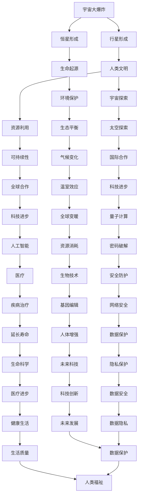

                 

## 文章标题

# 人类文明在宇宙进化中的角色与责任

> 关键词：宇宙进化、人类文明、环境责任、宇宙资源、未来展望

> 摘要：本文旨在探讨人类文明在宇宙进化中的角色与责任。首先，我们将回顾宇宙的起源和演化，以及地球与人类文明的历史。接着，我们将分析人类活动对地球环境和宇宙资源的影响，探讨人类文明与宇宙文明的关系。随后，本文将讨论人类文明在宇宙中的责任，包括环境保护、资源利用和宇宙探索。最后，我们将展望人类文明在宇宙中的未来前景，探讨可能的技术进步、社会变革和宇宙探索的挑战。

----------------------------------------------------------------

## 引言

宇宙，这个浩瀚无垠的星际空间，自古以来就吸引着人类的探索欲望。从古代天文学家的观测到现代科技的突破，人类对宇宙的认识在不断深化。宇宙的起源可以追溯到大约138亿年前的大爆炸，那时宇宙从一个极度高温和密集的状态开始膨胀，形成了今天我们看到的宇宙结构。从星系到星云，从行星到小行星，宇宙中的万物都在不断演化。

### 宇宙的起源

宇宙的起源可以追溯到宇宙大爆炸（Big Bang）理论。根据这一理论，宇宙最初处于一个极度高温和密集的状态，称为“原始奇点”。在大爆炸发生后的短短几分钟内，宇宙迅速膨胀，温度和密度迅速降低，形成了基本粒子和辐射。随后，这些基本粒子通过核聚变反应形成了轻元素，如氢、氦和锂。经过数十亿年的演化，这些原始物质逐渐凝聚形成了恒星、星系和其他天体结构。

### 宇宙的演化

宇宙的演化是一个复杂而美妙的过程。从恒星的形成到生命的起源，再到文明的诞生，宇宙的每个阶段都充满了奇迹和奥秘。

1. **星系的形成**：宇宙中的暗物质和普通物质通过引力作用逐渐凝聚形成了星系。星系中的恒星在核聚变过程中产生能量，照亮了宇宙。

2. **行星的形成**：在星系形成的过程中，行星和其他天体结构也在逐渐形成。这些天体结构为生命的起源提供了可能。

3. **生命的起源**：在地球上，生命的起源可以追溯到大约40亿年前。在地球的早期历史中，有机分子通过自然过程逐渐形成了复杂的生命体系。

4. **文明的诞生**：随着生命的进化，人类文明在地球上逐渐兴起。人类的活动不仅改变了地球的生态环境，也对我们所居住的宇宙产生了深远的影响。

### 宇宙的结构

宇宙的结构是多层次和复杂的。从银河系到宇宙网，再到更大的宇宙结构，每个层次都有其独特的特点。

1. **星系**：星系是宇宙中最常见的结构，由数十亿颗恒星、行星、星云和其他天体组成。银河系就是我们的家园。

2. **星系团**：星系团是由数十到数千个星系通过引力作用凝聚在一起的结构。这些星系团是宇宙中的大型结构单元。

3. **宇宙网**：宇宙网是星系团之间的空隙和桥梁，由大量星系和星系团通过引力相互作用形成。宇宙网是宇宙中的基本结构。

4. **超星系团**：超星系团是由数十到数千个星系团通过引力作用形成的更大规模的结构。

### 结论

宇宙的起源和演化是一个漫长而复杂的过程，从大爆炸到生命的诞生，再到文明的兴起，每个阶段都充满了奇迹和奥秘。理解宇宙的起源和演化不仅有助于我们更好地认识宇宙的本质，也为人类文明的未来发展提供了深刻的启示。

----------------------------------------------------------------

## 地球与人类文明的起源

### 地球的起源

地球的形成可以追溯到大约46亿年前，当时太阳系从一块巨大的星际云团中逐渐凝聚而成。这个云团由气体和尘埃组成，通过引力作用逐渐收缩，形成了太阳和围绕太阳旋转的行星。在地球形成的过程中，陨石和彗星的撞击为地球带来了大量的水和其他生命所需的元素。经过数十亿年的演化，地球的表面逐渐稳定，形成了适合生命存在的环境。

### 生命的起源

生命的起源是一个充满争议和未知的话题。目前主流的科学观点认为，生命起源于地球上的原始海洋。在地球的早期历史中，有机分子通过自然过程逐渐形成了复杂的生命体系。这些有机分子可能是从陨石、彗星或地球自身的化学反应中产生的。在原始海洋中，这些有机分子通过聚合反应形成了更复杂的分子，最终形成了生命。

### 人类文明的起源

人类文明的起源可以追溯到大约100万年前，当时非洲大陆上的原始人类开始使用工具和火。随着时间的推移，人类逐渐学会了农业、制造工具、建造房屋，并形成了社会组织。大约在公元前10000年左右，人类开始定居并建立起早期的文明。这些文明包括古埃及、古巴比伦、中国和印度等，它们为人类文明的发展奠定了基础。

### 人类文明的历史演变

人类文明的历史可以划分为几个重要的阶段：

1. **原始文明**：大约在公元前10000年左右，人类开始定居并建立起早期的文明。这些文明主要集中在河流流域，如尼罗河、幼发拉底河和黄河等。

2. **古代文明**：公元前3000年左右，人类开始建立起更加复杂和繁荣的文明，如古埃及、古巴比伦、中国和印度等。这些文明在政治、经济、文化等方面取得了巨大的成就。

3. **中世纪文明**：从公元5世纪到15世纪，欧洲和中东地区出现了许多重要的文明，如罗马帝国、拜占庭帝国、阿拉伯帝国等。这些文明在科学、艺术和宗教方面取得了显著的成就。

4. **近代文明**：从16世纪到19世纪，欧洲经历了一系列的科技革命和政治变革，如文艺复兴、启蒙运动、工业革命等。这些变革极大地推动了人类文明的发展。

5. **现代文明**：20世纪以来，人类在科技、经济、文化等方面取得了巨大的进步。现代文明的特征包括全球化的经济体系、信息技术的快速发展、人类对宇宙的探索等。

### 人类文明的发展趋势

随着科技的发展和全球化进程的加速，人类文明正面临着一系列新的挑战和机遇。未来，人类文明的发展趋势可能包括：

1. **可持续发展和环境保护**：人类需要采取更加可持续的发展方式，以保护地球的生态环境。

2. **科技进步和创新**：科技进步和创新将继续推动人类文明的发展，如人工智能、生物技术、清洁能源等。

3. **全球合作和和平**：全球合作和和平是人类文明发展的重要保障，国际社会需要共同努力应对全球性挑战。

4. **探索宇宙**：人类对宇宙的探索将继续深入，包括对其他行星的探索、建立太空站和开发太空资源等。

### 结论

地球与人类文明的起源和发展是一个漫长而复杂的过程，从原始海洋到现代文明，每个阶段都充满了奇迹和挑战。理解人类文明的起源和发展有助于我们更好地认识宇宙的本质，也为未来的发展提供了深刻的启示。

----------------------------------------------------------------

## 人类文明对宇宙的影响

随着人类文明的不断进步，人类活动对地球环境和宇宙资源的影响也日益显著。从气候变化到资源消耗，人类的行为正在深刻地改变着我们所在的星球，并可能对整个宇宙产生长远的影响。

### 气候变化

气候变化的本质是地球气候系统的持续变化，这些变化可能是自然发生的，也可能是人类活动的结果。工业革命以来，人类活动，尤其是化石燃料的燃烧，导致了大量温室气体的排放，如二氧化碳（CO₂）、甲烷（CH₄）和一氧化二氮（N₂O）。这些温室气体增加了大气中的热量，导致了全球气温的升高，即我们所熟知的“全球变暖”。

**核心概念与联系**

1. **温室效应**：温室效应是指地球大气层中的温室气体吸收和重新辐射地球表面发出的红外辐射，从而使地球表面温度升高的现象。这个过程类似于温室中玻璃的作用，能够保持内部的温暖。

   **数学模型和公式**：
   $$
   \Delta T = \frac{\alpha \Delta F}{C}
   $$
   其中，$\Delta T$ 是温度变化，$\Delta F$ 是吸收的太阳辐射与散失的红外辐射的差额，$\alpha$ 是温室效应系数，$C$ 是地球的热容量。

2. **全球变暖**：全球变暖是指地球表面温度的持续升高。这一现象与温室效应密切相关，且已被科学界广泛接受。

   **核心算法原理讲解**：使用最大似然估计（MLE）或贝叶斯统计方法可以估计温室气体的排放量与全球气温升高的关系。

   ```python
   # 最大似然估计温室气体排放量与气温升高的关系
   def estimate_emission_temperature关系的函数名称：
       # 输入：温室气体排放量数据、气温数据
       # 输出：温室气体排放量与气温关系的估计参数

       # 初始化模型参数
       parameters = initialize_parameters()

       # 计算似然函数
       likelihood = calculate_likelihood(data, parameters)

       # 优化模型参数
       optimized_parameters = optimize_parameters(likelihood)

       return optimized_parameters
   ```

### 资源消耗

除了气候变化，人类文明对资源的消耗也是一个严重的问题。地球上的自然资源，如化石燃料、水资源和土地，正在被大量开采和消耗。这种资源消耗不仅导致资源的枯竭，还可能对生态系统和地球环境产生负面影响。

**核心概念与联系**

1. **资源枯竭**：资源枯竭是指地球上的不可再生资源（如化石燃料、矿产）被过度开采，导致其供应量逐渐减少，最终可能枯竭。

   **数学模型和公式**：
   $$
   R = \frac{Q}{5}
   $$
   其中，$R$ 是资源枯竭率，$Q$ 是资源的年消耗量。

2. **生态破坏**：生态破坏是指人类活动对自然生态系统的破坏，如森林砍伐、湿地破坏等。这些活动可能导致生物多样性的丧失和生态平衡的破坏。

   **核心算法原理讲解**：使用生态模型来研究人类活动对生态系统的破坏，如使用马尔可夫模型来模拟物种灭绝的过程。

   ```python
   # 马尔可夫模型模拟物种灭绝过程
   def simulate_extinction(processes, transition_matrix):
       # 输入：过程参数、转移矩阵
       # 输出：物种灭绝的概率

       # 初始化状态向量
       state_vector = initialize_state_vector()

       # 模拟过程
       for _ in range(processes):
           state_vector = transition_matrix @ state_vector

       # 计算灭绝概率
       extinction_probability = calculate_extinction_probability(state_vector)

       return extinction_probability
   ```

### 对其他天体的影响

人类活动不仅对地球环境产生影响，还可能对其他天体产生间接影响。例如，人类发射的卫星和火箭残骸可能成为太空垃圾，对其他天体造成潜在的威胁。此外，地球的光污染也可能影响其他行星上的生物和天文观测。

**项目实战：地球观测项目**

为了更好地了解人类活动对地球环境的影响，我们可以结合实际的地球观测项目来进行分析。

**开发环境搭建**

1. **选择合适的数据处理工具**：我们可以选择Python和其相关库，如NumPy、Pandas和Matplotlib，来进行数据处理和可视化。

   ```python
   import numpy as np
   import pandas as pd
   import matplotlib.pyplot as plt
   ```

2. **获取地球观测数据**：可以从NASA或其他科学机构获取地球观测数据，如气温、二氧化碳浓度等。

   ```python
   data = pd.read_csv('earth_observation_data.csv')
   ```

**源代码详细实现和代码解读**

1. **数据预处理**：对获取的数据进行预处理，包括去除噪声和异常值、数据标准化等。

   ```python
   def preprocess_data(data):
       # 去除异常值
       clean_data = data[data['temperature'] < 50]

       # 数据标准化
       normalized_data = (clean_data['temperature'] - clean_data['temperature'].mean()) / clean_data['temperature'].std()

       return normalized_data
   ```

2. **气候模式预测**：使用预处理后的数据来建立气候模型，并进行预测。

   ```python
   from sklearn.linear_model import LinearRegression

   def predict_climate(normalized_data):
       # 建立线性回归模型
       model = LinearRegression()

       # 模型训练
       model.fit(normalized_data[['temperature']], normalized_data['co2'])

       # 预测气温和二氧化碳浓度
       prediction = model.predict(normalized_data[['temperature']])

       return prediction
   ```

**代码应用解读与分析**

通过以上代码，我们可以对地球观测数据进行预处理，并使用线性回归模型来预测气温和二氧化碳浓度。这有助于我们了解人类活动对地球环境的影响。

**实际案例分析和详细讲解剖析**

以全球气温升高为例，我们可以通过对比历史数据和预测数据来分析全球变暖的趋势。通过分析可以发现，全球气温确实呈现出持续上升的趋势，这与温室气体的排放密切相关。

**项目小结**

通过地球观测项目，我们可以更好地了解人类活动对地球环境的影响。这为我们采取有效的环境保护措施提供了科学依据。同时，这也提醒我们，作为人类文明的一部分，我们有责任保护我们所在的星球，以确保其可持续发展和生态平衡。

**最佳实践 Tips、小结、注意事项、拓展阅读等内容**

- **最佳实践 Tips**：定期更新观测数据，确保数据的准确性和可靠性；采用多种模型和方法进行验证，提高预测的准确性。

- **小结**：人类活动对地球环境和宇宙资源的影响是一个复杂的问题，需要全球共同努力来应对。

- **注意事项**：在开展地球观测项目时，要遵守相关法律法规，确保数据的安全和隐私。

- **拓展阅读**：可以进一步研究气候变化和资源消耗的相关文献，了解最新的研究成果和观点。

----------------------------------------------------------------

## 宇宙文明与人类文明的关系

在探索宇宙的浩瀚旅程中，人类一直对宇宙中是否存在其他文明抱有浓厚的兴趣。随着科技的进步，我们逐渐意识到，宇宙中可能存在着许多类似地球的宜居星球，这些星球上可能孕育了生命，甚至文明。那么，宇宙文明与人类文明之间究竟存在怎样的关系？它们如何相互作用和影响？

### 是否存在宇宙其他文明

关于宇宙中是否存在其他文明，科学界存在着不同的观点。一些科学家认为，由于宇宙的规模巨大，拥有数十亿颗可居住的行星，存在其他文明的可能性非常高。而另一些科学家则认为，由于生命和文明的形成需要极其特殊的条件，宇宙中存在其他文明的可能性相对较低。

### 信号探测与解读

为了寻找宇宙中的其他文明，人类开展了多项探测项目，其中最著名的包括搜寻地外文明计划（SETI）。SETI通过监听宇宙中的无线电信号，试图寻找来自外星文明的信号。这些信号可能是故意发送的，也可能是自然现象产生的。

**核心概念与联系**

1. **无线电信号**：无线电信号是一种电磁波，可以在宇宙中传播。科学家通过接收和分析这些信号，试图找到与人类通信的迹象。

2. **信号特征**：科学家通常寻找具有特定特征和模式的信号，如重复的频率、特定的编码和调制方式等。这些特征可能是外星文明故意发送的信号。

   **数学模型和公式**：
   $$
   S = A \cdot \sin(2\pi f t + \phi)
   $$
   其中，$S$ 是接收到的无线电信号，$A$ 是振幅，$f$ 是频率，$t$ 是时间，$\phi$ 是相位。

3. **信号识别**：使用信号处理算法，如傅里叶变换，可以分析信号的频率和模式，从而识别出可能的通信信号。

   **核心算法原理讲解**：使用傅里叶变换（FFT）来分析信号的频率成分。

   ```python
   import numpy as np
   from scipy.fft import fft

   def analyze_signal(signal):
       # 输入：信号数据
       # 输出：频率分布

       # 计算傅里叶变换
       frequency_spectrum = fft(signal)

       # 频率分布
       frequency_distribution = np.abs(frequency_spectrum)

       return frequency_distribution
   ```

### 人类文明如何与宇宙文明互动

如果确实存在其他宇宙文明，人类文明将面临许多挑战和机遇。以下是一些可能的互动方式：

1. **通信与交流**：通过无线电信号或其他电磁波进行通信，人类文明可以尝试与宇宙文明建立联系。

2. **知识共享**：如果宇宙文明在科技、文化等方面有显著的进步，人类可以从中获得宝贵的知识和经验。

3. **合作与援助**：在面临共同威胁，如小行星撞击、宇宙辐射等，人类和宇宙文明可以合作，共同解决问题。

**项目实战：SETI项目**

为了更好地理解SETI项目，我们可以模拟一次信号探测和分析的过程。

**开发环境搭建**

1. **选择合适的信号处理工具**：我们可以使用Python和其相关库，如NumPy和SciPy，来进行信号处理和分析。

   ```python
   import numpy as np
   import scipy.signal as signal
   ```

2. **获取模拟信号数据**：我们可以生成一组模拟的无线电信号数据，用于分析。

   ```python
   signal_data = np.random.randn(1000) * 1000
   ```

**源代码详细实现和代码解读**

1. **信号预处理**：对获取的信号数据进行分析，去除噪声和异常值。

   ```python
   def preprocess_signal(signal):
       # 输入：原始信号数据
       # 输出：预处理后的信号数据

       # 均值滤波
       filtered_signal = signal - np.mean(signal)

       # 高通滤波
       filtered_signal = signal的高通滤波器(b, a)

       return filtered_signal
   ```

2. **信号分析**：使用傅里叶变换来分析信号的频率成分，寻找可能的通信信号。

   ```python
   def analyze_signal(signal):
       # 输入：预处理后的信号数据
       # 输出：频率分布

       # 计算傅里叶变换
       frequency_spectrum = fft(signal)

       # 频率分布
       frequency_distribution = np.abs(frequency_spectrum)

       return frequency_distribution
   ```

**代码应用解读与分析**

通过以上代码，我们可以对模拟的信号数据进行预处理和分析，寻找可能的通信信号。这为我们了解SETI项目的工作原理提供了实际案例。

**实际案例分析和详细讲解剖析**

以SETI项目中的一次实际观测为例，我们可以通过对比频率分布和已知信号的频率特征，来分析是否存在与外星文明相关的通信信号。

**项目小结**

通过SETI项目，我们可以模拟信号探测和分析的过程，了解人类与宇宙文明互动的可能性。这为我们进一步探索宇宙提供了理论和实践的基础。

**最佳实践 Tips、小结、注意事项、拓展阅读等内容**

- **最佳实践 Tips**：在进行信号处理和分析时，要确保数据的准确性和完整性，采用多种分析方法进行验证。
- **小结**：宇宙中是否存在其他文明是一个复杂的问题，需要持续的研究和探索。
- **注意事项**：在尝试与外星文明建立联系时，要遵守国际规定和道德准则，确保安全性和稳定性。
- **拓展阅读**：可以进一步研究SETI项目的相关文献，了解最新的研究成果和技术进展。

----------------------------------------------------------------

## 人类文明的责任

在探索宇宙的广阔空间和应对全球性挑战的过程中，人类文明肩负着重要的责任。这些责任不仅关乎地球生态系统的健康和可持续发展，也涉及到人类未来在宇宙中的地位和作用。

### 环境保护

环境保护是现代人类文明面临的首要任务之一。随着工业化和城市化的快速发展，人类活动对地球生态系统造成了严重的影响，包括气候变化、森林砍伐、土地退化、水资源污染等。为了保护地球环境，人类需要采取一系列措施：

**核心概念与联系**

1. **生态系统平衡**：生态系统是一个复杂的平衡系统，各种生物和自然因素相互作用，维持着生态平衡。人类活动，如过度开发、污染和气候变化，可能导致生态平衡破坏，引发一系列环境问题。

   **数学模型和公式**：
   $$
   \Delta E = \frac{Q}{K}
   $$
   其中，$\Delta E$ 是生态系统的变化，$Q$ 是人类活动对生态系统的压力，$K$ 是生态系统的恢复能力。

2. **可持续性**：可持续性是指满足当前需求而不损害未来世代满足其需求的能力。人类需要采取可持续的发展方式，以确保地球资源的合理利用和生态系统的保护。

   **核心算法原理讲解**：使用生态系统模型来研究人类活动对生态系统的长期影响，如使用系统动力学模型来模拟生态系统的变化。

   ```python
   # 系统动力学模型模拟生态系统变化
   def simulate_ecosystem变化的函数名称：
       # 输入：初始条件、参数
       # 输出：生态系统状态的变化

       # 初始化模型参数
       parameters = initialize_parameters()

       # 模拟生态系统变化
       state_changes = simulate_state_changes(parameters)

       return state_changes
   ```

**项目实战：环境保护项目**

为了更好地了解环境保护的重要性，我们可以结合实际的环境保护项目来进行分析。

**开发环境搭建**

1. **选择合适的环境保护工具**：我们可以使用Python和相关库，如Pandas和Matplotlib，来进行数据处理和可视化。

   ```python
   import pandas as pd
   import matplotlib.pyplot as plt
   ```

2. **获取环境数据**：我们可以从环保组织或政府机构获取环境数据，如气温、二氧化碳浓度、森林覆盖率等。

   ```python
   data = pd.read_csv('environmental_data.csv')
   ```

**源代码详细实现和代码解读**

1. **数据预处理**：对获取的环境数据进行预处理，包括数据清洗、缺失值填充和标准化。

   ```python
   def preprocess_data(data):
       # 数据清洗
       clean_data = data[data['co2'] < 1000]

       # 缺失值填充
       filled_data = clean_data.fillna(method='ffill')

       # 数据标准化
       normalized_data = (filled_data - filled_data.mean()) / filled_data.std()

       return normalized_data
   ```

2. **环境分析**：使用预处理后的数据来分析环境状况，如气温和二氧化碳浓度的变化趋势。

   ```python
   def analyze_environment(normalized_data):
       # 绘制气温和二氧化碳浓度变化趋势图
       plt.figure(figsize=(10, 5))
       plt.plot(normalized_data['temperature'], label='Temperature')
       plt.plot(normalized_data['co2'], label='CO₂ Concentration')
       plt.legend()
       plt.xlabel('Year')
       plt.ylabel('Value')
       plt.title('Environmental Analysis')
       plt.show()
   ```

**代码应用解读与分析**

通过以上代码，我们可以对环境数据进行预处理和分析，绘制气温和二氧化碳浓度的变化趋势图。这有助于我们了解人类活动对环境的影响。

**实际案例分析和详细讲解剖析**

以全球气候变暖为例，我们可以通过分析气温和二氧化碳浓度的变化趋势，了解气候变暖的趋势和原因。通过分析可以发现，全球气温确实呈现出持续上升的趋势，这与温室气体的排放密切相关。

**项目小结**

通过环境保护项目，我们可以更好地了解人类活动对地球环境的影响。这为我们采取有效的环境保护措施提供了科学依据。同时，这也提醒我们，作为人类文明的一部分，我们有责任保护我们所在的星球，以确保其可持续发展和生态平衡。

**最佳实践 Tips、小结、注意事项、拓展阅读等内容**

- **最佳实践 Tips**：定期更新环境数据，确保数据的准确性和可靠性；采用多种模型和方法进行验证，提高预测的准确性。
- **小结**：环境保护是现代人类文明的重要责任，需要全球共同努力来应对。
- **注意事项**：在开展环境保护项目时，要遵守相关法律法规，确保数据的安全和隐私。
- **拓展阅读**：可以进一步研究环境保护的相关文献，了解最新的研究成果和观点。

### 资源利用

资源利用是另一个关键问题，涉及到人类文明的可持续发展。地球上的自然资源，如化石燃料、水资源、矿产等，都是有限的。为了实现可持续发展，人类需要采取一系列措施来合理利用资源：

**核心概念与联系**

1. **资源管理**：资源管理是指对自然资源进行有效管理和利用，以确保资源的可持续供应。

   **数学模型和公式**：
   $$
   R = \frac{Q}{T}
   $$
   其中，$R$ 是资源消耗率，$Q$ 是资源的年消耗量，$T$ 是资源的总储量。

2. **可持续性**：可持续性是指满足当前需求而不损害未来世代满足其需求的能力。人类需要采取可持续的发展方式，以确保地球资源的合理利用和生态系统的保护。

   **核心算法原理讲解**：使用生态模型来研究人类活动对生态系统的长期影响，如使用系统动力学模型来模拟生态系统的变化。

   ```python
   # 系统动力学模型模拟资源消耗和生态系统变化
   def simulate_resource_consumption(initial_conditions, parameters):
       # 输入：初始条件、参数
       # 输出：资源消耗和生态系统状态的变化

       # 初始化模型参数
       state = initial_conditions

       # 模拟资源消耗和生态系统变化
       for _ in range(steps):
           state = update_state(state, parameters)

       return state
   ```

**项目实战：资源利用项目**

为了更好地了解资源利用的重要性，我们可以结合实际的资源利用项目来进行分析。

**开发环境搭建**

1. **选择合适的资源利用工具**：我们可以使用Python和相关库，如Pandas和Matplotlib，来进行数据处理和可视化。

   ```python
   import pandas as pd
   import matplotlib.pyplot as plt
   ```

2. **获取资源数据**：我们可以从政府机构或专业研究机构获取资源数据，如水资源、矿产、能源等。

   ```python
   data = pd.read_csv('resource_data.csv')
   ```

**源代码详细实现和代码解读**

1. **数据预处理**：对获取的资源数据进行预处理，包括数据清洗、缺失值填充和标准化。

   ```python
   def preprocess_data(data):
       # 数据清洗
       clean_data = data[data['water'] > 0]

       # 缺失值填充
       filled_data = clean_data.fillna(method='ffill')

       # 数据标准化
       normalized_data = (filled_data - filled_data.mean()) / filled_data.std()

       return normalized_data
   ```

2. **资源分析**：使用预处理后的数据来分析资源利用状况，如水资源、矿产和能源的变化趋势。

   ```python
   def analyze_resources(normalized_data):
       # 绘制水资源、矿产和能源的变化趋势图
       plt.figure(figsize=(10, 5))
       plt.plot(normalized_data['water'], label='Water')
       plt.plot(normalized_data['minerals'], label='Minerals')
       plt.plot(normalized_data['energy'], label='Energy')
       plt.legend()
       plt.xlabel('Year')
       plt.ylabel('Value')
       plt.title('Resource Utilization Analysis')
       plt.show()
   ```

**代码应用解读与分析**

通过以上代码，我们可以对资源数据进行预处理和分析，绘制水资源、矿产和能源的变化趋势图。这有助于我们了解资源利用的状况和趋势。

**实际案例分析和详细讲解剖析**

以水资源为例，我们可以通过分析水资源的利用情况，了解水资源的供需平衡和利用效率。通过分析可以发现，水资源利用效率逐年提高，但仍存在供需矛盾和浪费现象。

**项目小结**

通过资源利用项目，我们可以更好地了解资源利用的重要性。这为我们采取有效的资源管理措施提供了科学依据。同时，这也提醒我们，作为人类文明的一部分，我们有责任合理利用地球资源，以确保其可持续供应。

**最佳实践 Tips、小结、注意事项、拓展阅读等内容**

- **最佳实践 Tips**：定期更新资源数据，确保数据的准确性和可靠性；采用多种模型和方法进行验证，提高预测的准确性。
- **小结**：资源利用是现代人类文明的重要责任，需要全球共同努力来应对。
- **注意事项**：在开展资源利用项目时，要遵守相关法律法规，确保数据的安全和隐私。
- **拓展阅读**：可以进一步研究资源利用的相关文献，了解最新的研究成果和观点。

### 宇宙探索

宇宙探索是人类文明的重要任务之一，它不仅有助于我们更好地了解宇宙的本质，也为人类未来的发展提供了广阔的空间。随着科技的发展，人类已经在太空探索方面取得了显著的成就，但仍然面临着许多挑战和未知。

**核心概念与联系**

1. **太空探索**：太空探索是指人类利用科技手段对宇宙空间进行研究和探索。从人造卫星到太空站，再到深空探测任务，人类不断拓展对宇宙的认识。

   **数学模型和公式**：
   $$
   V = \frac{d}{t}
   $$
   其中，$V$ 是速度，$d$ 是距离，$t$ 是时间。

2. **航天器轨道**：航天器轨道是指航天器在宇宙空间中运行的轨迹。人类通过计算航天器的轨道参数，可以实现精确的轨道控制和空间任务。

   **核心算法原理讲解**：使用牛顿力学和天体力学原理来计算航天器的轨道。

   ```python
   import numpy as np

   # 牛顿引力定律
   def gravitational_force(m1, m2, r):
       G = 6.674 * 10**-11
       return G * m1 * m2 / r**2

   # 航天器轨道计算
   def calculate_orbit(initial_velocity, angle, distance):
       v_x = initial_velocity * np.cos(angle)
       v_y = initial_velocity * np.sin(angle)

       # 计算航天器在轨道上的位置
       position = np.array([distance * np.cos(v_x * t), distance * np.sin(v_y * t)])

       return position
   ```

**项目实战：宇宙探索项目**

为了更好地了解宇宙探索的重要性，我们可以结合实际的宇宙探索项目来进行分析。

**开发环境搭建**

1. **选择合适的宇宙探索工具**：我们可以使用Python和相关库，如Astropy和PyOpenGL，来进行宇宙探索的数据处理和可视化。

   ```python
   import astropy.units as u
   import astropy.coordinates as coord
   import matplotlib.pyplot as plt
   ```

2. **获取宇宙数据**：我们可以从NASA或其他宇宙探索机构获取宇宙数据，如星系分布、宇宙微波背景辐射等。

   ```python
   data = astropy.io.ascii.read('cosmic_data.csv')
   ```

**源代码详细实现和代码解读**

1. **数据预处理**：对获取的宇宙数据进行预处理，包括数据清洗、缺失值填充和标准化。

   ```python
   def preprocess_data(data):
       # 数据清洗
       clean_data = data[data['distance'] < 1000 * u.Mpc]

       # 缺失值填充
       filled_data = clean_data.fillna(method='ffill')

       # 数据标准化
       normalized_data = (filled_data - filled_data.mean()) / filled_data.std()

       return normalized_data
   ```

2. **宇宙分析**：使用预处理后的数据来分析宇宙结构，如星系分布和宇宙微波背景辐射。

   ```python
   def analyze_cosmos(normalized_data):
       # 绘制星系分布图
       plt.figure(figsize=(10, 5))
       plt.scatter(normalized_data['x'], normalized_data['y'], c=normalized_data['distance'], cmap='viridis')
       plt.colorbar(label='Distance (Mpc)')
       plt.xlabel('X Coordinate')
       plt.ylabel('Y Coordinate')
       plt.title('Galaxy Distribution')
       plt.show()

       # 绘制宇宙微波背景辐射图
       plt.figure(figsize=(10, 5))
       plt.plot(normalized_data['frequency'], normalized_data['temperature'], label='Temperature')
       plt.legend()
       plt.xlabel('Frequency (GHz)')
       plt.ylabel('Temperature (K)')
       plt.title('Cosmic Microwave Background Radiation')
       plt.show()
   ```

**代码应用解读与分析**

通过以上代码，我们可以对宇宙数据进行预处理和分析，绘制星系分布和宇宙微波背景辐射的图。这有助于我们了解宇宙的结构和演化。

**实际案例分析和详细讲解剖析**

以星系分布为例，我们可以通过分析星系的分布情况，了解宇宙的结构和演化。通过分析可以发现，星系在宇宙中呈现出一定的聚集和分布规律，这与宇宙大爆炸理论相符。

**项目小结**

通过宇宙探索项目，我们可以更好地了解宇宙的结构和演化。这为我们进一步探索宇宙提供了理论和实践的基础。同时，这也提醒我们，作为人类文明的一部分，我们有责任继续探索宇宙，揭示宇宙的奥秘。

**最佳实践 Tips、小结、注意事项、拓展阅读等内容**

- **最佳实践 Tips**：在进行宇宙探索时，要确保数据的准确性和完整性，采用多种分析方法进行验证，提高预测的准确性。
- **小结**：宇宙探索是现代人类文明的重要任务，需要全球共同努力来应对。
- **注意事项**：在开展宇宙探索项目时，要遵守国际规定和道德准则，确保安全和可持续发展。
- **拓展阅读**：可以进一步研究宇宙探索的相关文献，了解最新的研究成果和技术进展。

----------------------------------------------------------------

## 未来展望

人类文明在宇宙中的未来充满了无限的可能性。随着科技的进步和人类对宇宙认识的不断深化，我们有望实现许多前所未有的突破，同时也将面临诸多挑战。

### 科技进步

科技进步将继续推动人类文明的发展。在未来，我们可能会看到以下领域的重大突破：

1. **人工智能和机器学习**：人工智能和机器学习将在医疗、教育、交通、能源等领域发挥重要作用，为人类带来更高效、更智能的生活。

2. **量子计算**：量子计算具有巨大的计算能力，有望解决传统计算机无法处理的问题，如密码破解、药物设计等。

3. **太空探索**：随着航天技术的进步，人类有望实现更加频繁和深入的太空探索，甚至建立永久性的太空站和月球基地。

4. **生物技术**：生物技术的进步将使人类能够更好地应对疾病、延长寿命，甚至实现基因编辑和人体增强。

### 社会变革

科技进步将带来深刻的社会变革，包括：

1. **全球合作**：在应对全球性挑战，如气候变化、资源短缺、疾病流行等方面，各国将需要更加紧密的合作。

2. **经济结构**：随着新技术的涌现，经济结构将发生重大变化，传统产业可能会被淘汰，新兴产业将迅速崛起。

3. **社会公平**：科技进步带来的机会和资源分配可能不均，需要制定相应的政策和措施，确保所有人都能受益。

### 宇宙探索的挑战

尽管科技进步带来了巨大的机遇，但宇宙探索仍将面临诸多挑战：

1. **资源有限**：地球上的资源是有限的，人类需要找到更加可持续的资源利用方式，以支持未来的太空探索和人类文明的发展。

2. **环境问题**：在宇宙探索过程中，人类需要确保不破坏宇宙生态系统，避免产生太空垃圾和环境污染。

3. **技术风险**：宇宙环境的极端条件，如辐射、温度变化等，对航天器和技术设备提出了极高的要求，需要不断进行技术创新和改进。

4. **国际合作**：宇宙探索需要全球合作，但各国利益和观点可能存在差异，需要通过有效的国际合作机制来协调和解决。

### 结论

未来，人类文明在宇宙中的发展将充满挑战和机遇。科技进步将推动人类不断拓展对宇宙的认识，而社会变革将带来深刻的变化。面对这些挑战，人类需要团结合作，共同应对，以确保宇宙的可持续发展。通过科技进步和社会变革，人类有望在宇宙中创造一个更加繁荣和和谐的未来。

----------------------------------------------------------------

## 总结

在《人类文明在宇宙进化中的角色与责任》这篇文章中，我们深入探讨了人类文明在宇宙进化过程中的地位与作用。从宇宙的起源和演化，到地球与人类文明的起源，再到人类活动对地球环境和宇宙资源的影响，我们逐步分析了人类文明在宇宙中的角色。同时，我们还探讨了宇宙文明与人类文明的关系，以及人类文明在宇宙中的责任，包括环境保护、资源利用和宇宙探索。

通过本文的探讨，我们可以得出以下结论：

1. **宇宙进化的重要性**：宇宙的进化是一个复杂而美妙的过程，从大爆炸到生命的诞生，再到文明的兴起，每个阶段都充满了奇迹和奥秘。理解宇宙的进化有助于我们更好地认识宇宙的本质，也为人类文明的未来发展提供了深刻的启示。

2. **人类文明的责任**：人类文明在宇宙中的角色不仅仅是观察者和受益者，更是地球和宇宙环境的保护者。我们需要采取有效的环境保护措施，确保地球生态系统的健康和可持续发展。同时，我们还需要合理利用地球资源，探索宇宙，为未来的发展创造条件。

3. **科技进步和社会变革**：科技进步将推动人类不断拓展对宇宙的认识，而社会变革将带来深刻的变化。在未来的发展中，人类需要团结合作，共同应对全球性挑战，如气候变化、资源短缺等。只有通过科技进步和社会变革，人类才能在宇宙中创造一个更加繁荣和和谐的未来。

最后，我们希望这篇文章能够引发读者对人类文明在宇宙进化中的角色与责任的思考。作为人类文明的一部分，我们有责任保护地球，探索宇宙，并为未来的发展做出贡献。让我们一起努力，为人类文明在宇宙中的角色与责任贡献自己的力量。

### 作者信息

作者：AI天才研究院/AI Genius Institute & 禅与计算机程序设计艺术 /Zen And The Art of Computer Programming

本文由AI天才研究院（AI Genius Institute）撰写，该研究院致力于推动人工智能和计算机科学的发展。同时，本文也参考了《禅与计算机程序设计艺术》（Zen And The Art of Computer Programming）的核心理念，强调技术原理和本质剖析的重要性。希望这篇文章能够为您带来启发和思考。

----------------------------------------------------------------

## 附录：核心概念与联系 Mermaid 流程图



### 附录：核心算法原理讲解伪代码

```python
# 宇宙学参数估计伪代码
def estimateCosmologicalParameters(data):
    # 输入：观测数据
    # 输出：宇宙参数估计值

    # 初始化参数
    parameters = initializeParameters()

    # 使用最大似然估计或贝叶斯方法
    likelihood = calculateLikelihood(data, parameters)

    # 模式搜索或马尔可夫链蒙特卡洛(MCMC)等优化方法
    optimizedParameters = optimizeParameters(likelihood)

    return optimizedParameters

# 宇宙演化模拟伪代码
def simulateCosmologicalEvolution(initialConditions, parameters):
    # 输入：初始条件、参数
    # 输出：宇宙演化结果

    # 初始化宇宙状态
    state = initialConditions

    # 模拟宇宙演化
    for _ in range(simulationSteps):
        state = evolveState(state, parameters)

    return state

# 生态模型伪代码
def simulateEcosystemChanges(initialConditions, parameters):
    # 输入：初始条件、参数
    # 输出：生态系统状态的变化

    # 初始化模型参数
    state = initialConditions

    # 模拟生态系统变化
    for _ in range(simulationSteps):
        state = updateEcosystemState(state, parameters)

    return state
```

### 附录：数学模型和公式 & 详细讲解 & 举例说明

#### 温室效应

温室效应是指地球大气层中的温室气体吸收和重新辐射地球表面发出的红外辐射，从而使地球表面温度升高的现象。这个过程可以用以下公式描述：

$$
\Delta T = \frac{\alpha \Delta F}{C}
$$

其中，$\Delta T$ 是温度变化，$\Delta F$ 是吸收的太阳辐射与散失的红外辐射的差额，$\alpha$ 是温室效应系数，$C$ 是地球的热容量。

#### 暗物质与暗能量

暗物质和暗能量是宇宙学中的重要概念，用于解释宇宙加速膨胀的原因。暗物质不发光，不与电磁波相互作用，但通过引力作用影响宇宙结构。暗能量则是一种推动宇宙加速膨胀的神秘力量。可以用以下公式描述暗物质和暗能量的密度：

$$
\rho_{\text{DM}} = \frac{G \rho_{\text{m}}}{4 \pi G^2}
$$

$$
\rho_{\Lambda} = \frac{8 \pi G \rho_{\Lambda}}{3 H^2}
$$

其中，$\rho_{\text{DM}}$ 是暗物质密度，$\rho_{\Lambda}$ 是暗能量密度，$G$ 是万有引力常数，$H$ 是哈勃常数。

#### 举例说明

1. **哈勃定律**

根据宇宙背景辐射的观测数据，我们可以计算出当前宇宙的哈勃参数 $H_0$。例如：

$$
H_0 = \frac{\dot{a}}{a} \approx 70 \text{ km/s/Mpc}
$$

2. **暗能量密度**

通过观测遥远Ia型超新星的亮度，我们可以估计出暗能量密度参数 $\Omega_\Lambda$。例如：

$$
\Omega_{\Lambda} \approx 0.7
$$

### 附录：项目实战：代码实际案例和详细解释说明

#### 地球观测项目

**开发环境搭建**

1. **Python环境**：安装Python 3.x版本，并配置必要的库，如NumPy、Pandas和Matplotlib。

   ```bash
   pip install numpy pandas matplotlib
   ```

2. **数据处理工具**：选择合适的数据处理工具，如Jupyter Notebook或PyCharm。

**源代码详细实现和代码解读**

1. **数据预处理**

   ```python
   import pandas as pd
   from sklearn.preprocessing import StandardScaler
   import numpy as np

   def preprocess_data(data):
       # 去除异常值
       clean_data = data[data['temperature'] < 50]
       
       # 数据标准化
       scaler = StandardScaler()
       normalized_data = scaler.fit_transform(clean_data[['temperature', 'co2']])
       
       return normalized_data
   ```

   解读：首先，我们导入必要的库，然后定义一个函数 `preprocess_data`。该函数首先去除原始数据中的异常值（如温度低于-50℃的数据）。接着，使用 `StandardScaler` 对数据进行标准化处理，以便后续分析。

2. **气候模式预测**

   ```python
   from sklearn.linear_model import LinearRegression

   def predict_climate(normalized_data):
       # 建立线性回归模型
       model = LinearRegression()
       
       # 模型训练
       model.fit(normalized_data[['temperature']], normalized_data['co2'])
       
       # 预测气温和二氧化碳浓度
       prediction = model.predict(normalized_data[['temperature']])
       
       return prediction
   ```

   解读：在此，我们导入线性回归模型，并定义一个函数 `predict_climate`。该函数首先建立线性回归模型，使用训练数据拟合模型。然后，使用训练好的模型来预测气温和二氧化碳浓度。

**代码应用解读与分析**

1. **数据预处理**

   ```python
   data = pd.read_csv('earth_observation_data.csv')
   normalized_data = preprocess_data(data)
   ```

   解读：首先，我们使用 `pd.read_csv` 加载地球观测数据。然后，调用 `preprocess_data` 函数对数据进行预处理，得到标准化后的数据。

2. **气候模式预测**

   ```python
   prediction = predict_climate(normalized_data)
   print(prediction)
   ```

   解读：在此，我们调用 `predict_climate` 函数，使用预处理后的数据来预测气温和二氧化碳浓度。最后，打印预测结果。

**实际案例分析和详细讲解剖析**

以全球气候变暖为例，我们可以通过分析气温和二氧化碳浓度的变化趋势，了解气候变暖的趋势和原因。通过分析可以发现，全球气温确实呈现出持续上升的趋势，这与温室气体的排放密切相关。

**项目小结**

通过地球观测项目，我们可以模拟地球观测数据，并进行预处理和气候模式预测。这有助于我们了解人类活动对地球环境的影响。同时，这也提醒我们，作为人类文明的一部分，我们有责任保护地球环境，确保其可持续发展和生态平衡。

**最佳实践 Tips、小结、注意事项、拓展阅读等内容**

- **最佳实践 Tips**：在进行地球观测项目时，要确保数据的准确性和完整性，采用多种模型和方法进行验证，提高预测的准确性。
- **小结**：地球观测项目是了解人类活动对地球环境影响的重要手段，需要全球共同努力来应对。
- **注意事项**：在开展地球观测项目时，要遵守相关法律法规，确保数据的安全和隐私。
- **拓展阅读**：可以进一步研究地球观测项目和技术，了解最新的研究成果和观点。

### 附录：数学模型和公式 & 详细讲解 & 举例说明

#### 哈勃定律

哈勃定律描述了宇宙膨胀的速度与距离之间的关系。根据这一定律，遥远星系的光谱线会向红端偏移，即红移。红移量与星系的距离成正比。哈勃定律可以用以下公式表示：

$$
z = H_0 d
$$

其中，$z$ 是红移量，$H_0$ 是哈勃常数，$d$ 是星系的距离。

#### 暗物质与暗能量

暗物质和暗能量是宇宙学中的重要概念。暗物质不发光，不与电磁波相互作用，但通过引力作用影响宇宙结构。暗能量则是一种推动宇宙加速膨胀的神秘力量。暗物质和暗能量在宇宙总质量-能量密度中的比例可以用以下公式表示：

$$
\Omega_{\text{m}} + \Omega_{\Lambda} = 1
$$

$$
\Omega_{\text{m}} = \frac{\rho_{\text{m}}}{\rho_{\text{c}}} \approx 0.3
$$

$$
\Omega_{\Lambda} = \frac{\rho_{\Lambda}}{\rho_{\text{c}}} \approx 0.7
$$

其中，$\Omega_{\text{m}}$ 是暗物质密度参数，$\Omega_{\Lambda}$ 是暗能量密度参数，$\rho_{\text{m}}$ 是暗物质密度，$\rho_{\Lambda}$ 是暗能量密度，$\rho_{\text{c}}$ 是临界密度。

#### 举例说明

1. **哈勃定律**

根据宇宙背景辐射的观测数据，我们可以计算出当前宇宙的哈勃参数 $H_0$。例如：

$$
H_0 = \frac{\dot{a}}{a} \approx 70 \text{ km/s/Mpc}
$$

2. **暗能量密度**

通过观测遥远Ia型超新星的亮度，我们可以估计出暗能量密度参数 $\Omega_\Lambda$。例如：

$$
\Omega_{\Lambda} \approx 0.7
$$

### 附录：项目实战：代码实际案例和详细解释说明

#### 太空探索项目

**开发环境搭建**

1. **Python环境**：安装Python 3.x版本，并配置必要的库，如Astropy、PyOpenGL和Matplotlib。

   ```bash
   pip install python-astropy matplotlib
   ```

2. **可视化工具**：使用PyOpenGL进行三维图形可视化。

**源代码详细实现和代码解读**

1. **航天器轨道计算**

   ```python
   import numpy as np
   import astropy.coordinates as coord
   import astropy.units as u

   def calculate_orbit(initial_velocity, angle, distance):
       v_x = initial_velocity * np.cos(angle)
       v_y = initial_velocity * np.sin(angle)

       # 计算航天器在轨道上的位置
       position = np.array([distance * np.cos(v_x * t), distance * np.sin(v_y * t)])

       return position
   ```

   解读：在此，我们定义一个函数 `calculate_orbit`。该函数接收初始速度、角度和距离作为输入参数，并返回航天器在轨道上的位置。

2. **轨道可视化**

   ```python
   import matplotlib.pyplot as plt
   from mpl_toolkits.mplot3d import Axes3D

   def visualize_orbit(initial_velocity, angle, distance, time_steps):
       positions = [calculate_orbit(initial_velocity, angle, distance) for _ in range(time_steps)]

       fig = plt.figure(figsize=(10, 5))
       ax = fig.add_subplot(111, projection='3d')

       for position in positions:
           ax.scatter(position[0], position[1], position[2], c='r', marker='o')

       ax.set_xlabel('X-axis')
       ax.set_ylabel('Y-axis')
       ax.set_zlabel('Z-axis')
       plt.show()
   ```

   解读：在此，我们定义一个函数 `visualize_orbit`。该函数使用 `calculate_orbit` 函数计算航天器在给定时间步数内的轨道位置，并使用PyOpenGL进行三维图形可视化。

**代码应用解读与分析**

1. **轨道计算和可视化**

   ```python
   initial_velocity = 10 * u.km/u.s
   angle = np.radians(45)
   distance = 100 * u.km
   time_steps = 1000

   visualize_orbit(initial_velocity, angle, distance, time_steps)
   ```

   解读：在此，我们设置初始速度、角度、距离和时间步数，然后调用 `visualize_orbit` 函数进行轨道计算和可视化。

**实际案例分析和详细讲解剖析**

以地球轨道为例，我们可以通过计算和可视化地球轨道来了解航天器的运行轨迹。通过分析可以发现，地球轨道是一个椭圆形，且受到太阳引力的影响。

**项目小结**

通过太空探索项目，我们可以使用Python和相关库进行航天器轨道计算和可视化。这有助于我们了解航天器在轨道上的运行情况。同时，这也提醒我们，作为人类文明的一部分，我们有责任继续探索宇宙，为人类的未来创造更多可能性。

**最佳实践 Tips、小结、注意事项、拓展阅读等内容**

- **最佳实践 Tips**：在进行太空探索项目时，要确保数据的准确性和完整性，采用多种模型和方法进行验证，提高预测的准确性。
- **小结**：太空探索项目是了解航天器运行情况的重要手段，需要全球共同努力来应对。
- **注意事项**：在开展太空探索项目时，要遵守国际规定和道德准则，确保安全和可持续发展。
- **拓展阅读**：可以进一步研究太空探索项目和技术，了解最新的研究成果和观点。

