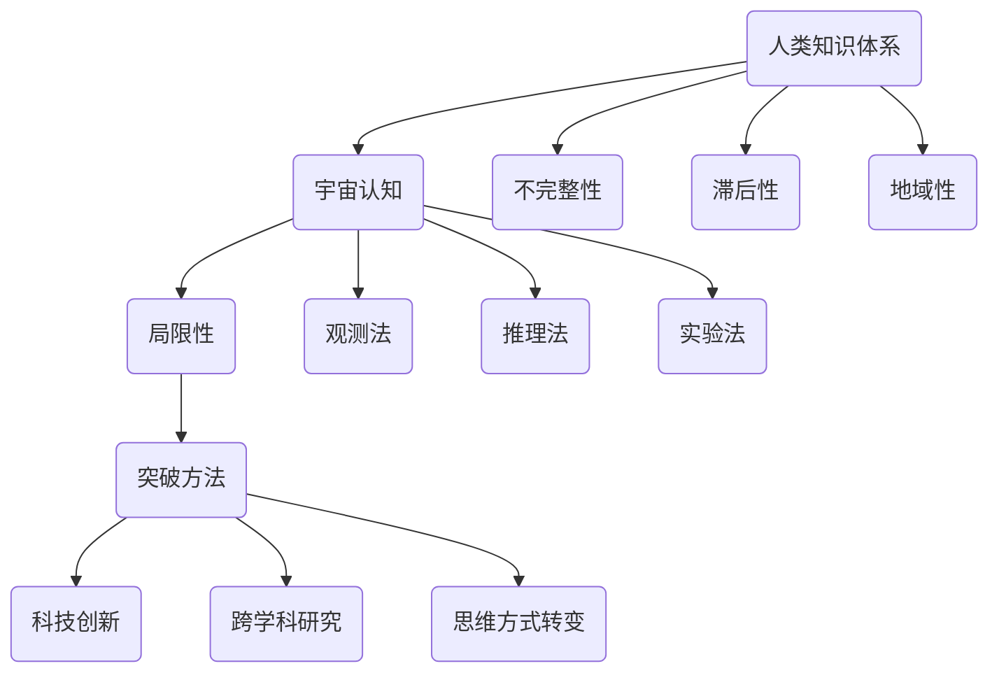

                 

# 文章标题：人类知识体系对宇宙认知的局限与突破

> 关键词：人类知识体系、宇宙认知、局限性、突破方法、科学探索

> 摘要：本文将探讨人类知识体系对宇宙认知的局限，并尝试提出一些可能的突破方法。通过分析人类知识体系的构成、宇宙认知的发展历程以及认知局限的影响，我们旨在为未来的科学探索提供一些有益的思考。

## 引言

人类的知识体系是通过对自然界的观察、实验和思考而逐步形成的。这一体系不仅推动了人类文明的进步，也为我们对宇宙的认知提供了坚实的基础。然而，随着科学技术的不断发展，我们逐渐认识到人类知识体系在宇宙认知方面存在一定的局限性。这些局限不仅限制了我们对宇宙的深入了解，也可能成为未来科学探索的障碍。

本文将首先概述人类知识体系的起源与发展，然后探讨人类对宇宙的认知方式，分析认知局限及其影响。在此基础上，我们将讨论一些可能的突破方法，并分析一些实际案例。最后，我们将对未来的宇宙认知发展进行展望。

## 第1部分：人类知识体系概述

### 第1章：人类知识体系的起源与发展

#### 1.1 人类知识体系的起源

人类知识体系的起源可以追溯到早期人类的生活实践。在漫长的进化过程中，人类逐渐学会了观察自然界，并通过实验和思考来理解周围的世界。早期的知识主要来源于对自然现象的观察，如天气变化、植物生长等。

随着人类社会的发展，知识的积累逐渐形成了体系。文字和书籍的出现为知识的传递和共享提供了便利，使得知识得以传承和扩展。古代的哲学家、科学家通过他们的思考和实践，为人类知识体系的发展奠定了基础。

#### 1.2 人类知识体系的构成

人类知识体系是一个多层次、多维度的结构。它包括自然科学、社会科学、人文科学等多个领域。每个领域都有自己的研究对象、研究方法和理论体系。

知识体系的层次性体现在从基础理论到应用技术的不同层面。基础理论研究旨在揭示自然界的基本规律，而应用技术则将理论转化为实际应用。知识的层次性使得人类能够不断深化对自然界的理解。

#### 1.3 人类知识体系的发展历程

人类知识体系的发展历程可以追溯到古代文明。在古希腊，哲学家们开始思考宇宙的本质，并提出了许多关于自然规律的理论。随着中世纪的结束，科学革命的发生标志着人类知识体系的重大突破。从哥白尼的日心说到牛顿的经典力学，再到爱因斯坦的相对论，人类对宇宙的认知不断深化。

近现代以来，科学技术的快速发展使得人类知识体系不断扩展和更新。物理学、化学、生物学等领域的突破为人类对宇宙的认知提供了新的视角和方法。

### 第2章：人类知识体系的局限性

#### 2.1 知识体系的局限性

尽管人类知识体系已经取得了巨大的进步，但它也存在一些局限性。首先，知识体系的不完整性使得我们对某些自然现象和规律的理解仍然有限。例如，我们尚未完全理解宇宙的起源和演化过程。

其次，知识体系的滞后性使得我们无法及时应对新的科学发现和技术进步。例如，量子力学和相对论的提出对经典物理学的挑战，需要我们对知识体系进行更新和调整。

最后，知识体系的地域性使得不同地区和文化的知识传承和发展存在差异。这可能导致知识的不平衡分布，限制我们对宇宙的全面认知。

#### 2.2 知识体系的局限性对人类认知的影响

知识体系的局限性对人类认知的影响是多方面的。首先，它限制了科学研究的深入发展。当我们对某个领域的基本规律缺乏了解时，我们难以进行有效的科学研究。

其次，知识体系的局限性也影响了技术创新。当我们对自然界的认知有限时，我们可能无法发现新的技术突破点，从而限制技术的发展。

最后，知识体系的局限性还影响了哲学思考。哲学是人类对宇宙和生命的思考，但它也受到知识体系的限制。当我们对宇宙的认知有限时，我们可能无法提出深刻的哲学问题，从而限制哲学的发展。

## 第2部分：人类对宇宙的认知

### 第3章：人类对宇宙的认知方式

#### 3.1 人类对宇宙认知的历史

人类对宇宙的认知经历了漫长的历史。古代文明通过观测天体运动，形成了对宇宙的基本认识。例如，古希腊哲学家提出地球是宇宙中心的“地心说”。随着科学的发展，哥白尼的“日心说”推翻了这一观点，揭示了太阳系的结构。

在中世纪，宗教和哲学对宇宙的认知产生了深远影响。然而，随着科学革命的到来，人类对宇宙的认知进入了一个全新的阶段。从牛顿的经典力学到爱因斯坦的相对论，人类对宇宙的认知不断深化。

#### 3.2 人类对宇宙认知的主要方法

人类对宇宙的认知主要依赖于以下几种方法：

1. **观测法**：通过观测天体运动和自然现象，人类能够收集关于宇宙的观测数据。这些数据为科学研究和理论构建提供了基础。

2. **推理法**：基于观测数据和逻辑推理，人类能够提出关于宇宙的理论。例如，牛顿通过观测行星运动，提出了万有引力定律。

3. **实验法**：通过实验验证理论，人类能够检验对宇宙的认知。实验法在物理学和天文学中尤为重要，因为它能够验证理论预测的正确性。

### 第4章：人类对宇宙的认知局限

#### 4.1 人类对宇宙认知的局限

尽管人类对宇宙的认知取得了巨大进步，但仍然存在一些局限。首先，我们的观测手段和理论模型可能存在局限性。例如，光的速度有限，使我们无法观测到宇宙的遥远部分。此外，我们的理论模型可能无法完全描述宇宙的复杂性。

其次，人类认知的局限性也影响了我们对宇宙的理解。我们的思维方式和知识体系可能无法涵盖宇宙的全部奥秘。例如，量子力学和相对论在某些方面仍然存在争议，这反映了我们对宇宙认知的局限性。

#### 4.2 人类对宇宙认知局限的影响

人类对宇宙认知的局限对科学研究和哲学思考产生了深远影响。首先，它限制了我们对宇宙的理解，使我们无法完全揭示宇宙的本质。其次，它影响了科学研究的方向和方法，使我们难以突破认知的局限。

在哲学思考方面，人类对宇宙认知的局限也限制了我们对生命和存在的思考。当我们对宇宙的认知有限时，我们可能无法提出深刻的哲学问题，从而限制哲学的发展。

## 第3部分：认知局限与突破方法

### 第5章：认知局限的突破方法

#### 5.1 突破认知局限的方法

为了突破人类认知的局限，我们需要采取以下方法：

1. **科技创新**：通过技术创新，我们能够提高观测手段的精度，从而拓展我们对宇宙的认知。例如，射电望远镜和太空望远镜的发明使我们能够观测到更遥远的宇宙部分。

2. **跨学科研究**：通过跨学科研究，我们能够整合不同领域的知识，形成新的理论模型。这种方法有助于突破单一学科的局限，为宇宙认知提供新的视角。

3. **思维方式的转变**：通过转变思维方式，我们能够超越传统的认知框架，提出新的理论和观点。例如，量子力学和相对论的提出改变了我们对宇宙的认知方式。

#### 5.2 突破认知局限的实际案例

历史上，许多科学家通过突破认知局限，为宇宙认知做出了重要贡献。以下是一些实际案例：

1. **宇宙大爆炸理论**：宇宙大爆炸理论提出了宇宙起源和演化的新视角，突破了传统宇宙观的局限。这一理论为宇宙学研究提供了新的方向。

2. **黑洞的存在证明**：通过对黑洞观测数据的分析，科学家证明了黑洞的存在。这一突破为宇宙学研究提供了新的工具和理论模型。

3. **宇宙暗物质研究**：宇宙暗物质是宇宙认知中的一个重要问题。科学家通过观测和实验，提出了暗物质存在的证据，为宇宙学研究提供了新的方向。

### 第6章：未来宇宙认知的发展趋势

#### 6.1 未来宇宙认知的发展趋势

未来宇宙认知的发展趋势可能包括以下几个方面：

1. **知识体系的整合**：通过整合不同领域的知识，形成更加完整的宇宙认知体系。这种方法有助于突破单一学科的局限，为宇宙认知提供新的视角。

2. **观测手段的升级**：随着科技的进步，观测手段将不断升级，使我们能够观测到更遥远的宇宙部分。这将为宇宙认知提供更多的数据和证据。

3. **新理论的诞生**：随着对宇宙的认知不断深入，新的理论模型可能诞生。这些理论将为我们理解宇宙的本质提供新的视角。

#### 6.2 未来宇宙认知对社会的影响

未来宇宙认知的发展将对社会产生深远影响。首先，它将推动科学研究的深入发展，为技术创新提供新的方向。其次，它将影响哲学思考，为我们理解生命和存在的本质提供新的视角。最后，它将推动社会进步，为人类文明的未来发展提供新的动力。

## 第4部分：案例分析

### 第7章：著名宇宙学家的研究历程

#### 7.1 爱因斯坦的研究历程

爱因斯坦是20世纪最伟大的物理学家之一。他的相对论革命性地改变了我们对宇宙的认知。以下是他的一些重要研究历程：

1. **相对论的提出**：爱因斯坦在1905年提出了狭义相对论，这一理论揭示了时空的本质。狭义相对论提出了质能等价原理和光速不变原理，为现代物理学奠定了基础。

2. **广义相对论的提出**：在1915年，爱因斯坦提出了广义相对论，这一理论描述了引力的本质。广义相对论预言了引力波的存在，为宇宙学研究提供了新的视角。

3. **宇宙学的贡献**：爱因斯坦在宇宙学方面也有重要贡献。他提出了静态宇宙模型，并提出了宇宙常数。然而，后来的观测表明，宇宙常数是错误的，这一错误对宇宙学的发展产生了重要影响。

#### 7.2 罗伯特·威尔逊的研究历程

罗伯特·威尔逊是20世纪另一位伟大的物理学家。他对宇宙微波背景辐射的发现为宇宙学研究做出了重要贡献。以下是他的一些重要研究历程：

1. **宇宙微波背景辐射的发现**：在1965年，威尔逊和他的团队发现了宇宙微波背景辐射，这一发现证实了宇宙大爆炸理论的预言。

2. **对宇宙学的贡献**：宇宙微波背景辐射的发现为宇宙学研究提供了重要的观测数据。它帮助我们了解了宇宙的起源和演化过程。

3. **宇宙学的影响**：宇宙微波背景辐射的发现对宇宙学产生了深远影响。它使我们能够更准确地了解宇宙的年龄、结构和演化过程。

## 结论

通过本文的探讨，我们认识到人类知识体系在宇宙认知方面存在一定的局限性。这些局限限制了我们对宇宙的深入了解，也可能成为未来科学探索的障碍。然而，通过科技创新、跨学科研究和思维方式的转变，我们有望突破这些局限，为宇宙认知提供新的视角和方法。

未来，随着科技的进步和观测手段的升级，我们对宇宙的认知将不断深入。新的理论和发现将继续挑战我们的认知极限，推动人类对宇宙的探索不断向前。在这个过程中，人类知识体系也将不断更新和发展，为宇宙认知提供更加全面和深刻的理解。

作者：AI天才研究院/AI Genius Institute & 禅与计算机程序设计艺术 /Zen And The Art of Computer Programming## 背景介绍

人类知识体系是通过对自然界的观察、实验和思考而逐步形成的。这一体系不仅推动了人类文明的进步，也为我们对宇宙的认知提供了坚实的基础。然而，随着科学技术的不断发展，我们逐渐认识到人类知识体系在宇宙认知方面存在一定的局限性。这些局限不仅限制了我们对宇宙的深入了解，也可能成为未来科学探索的障碍。

在人类知识体系的发展历程中，许多伟大的科学家和思想家做出了重要贡献。他们通过观察、实验和思考，提出了许多关于自然规律的理论，为人类知识体系的发展奠定了基础。例如，古希腊哲学家们通过思考自然现象，提出了关于地球、天体运动等基本问题的理论。中世纪的科学家们则在宗教和哲学的影响下，对自然界的认识进行了一定程度的拓展。

然而，人类知识体系的发展并非一帆风顺。在中世纪，宗教对科学的发展产生了严重阻碍，导致科学进步受到限制。随着文艺复兴和科学革命的到来，人类知识体系逐渐摆脱了宗教束缚，迎来了一个崭新的时代。在这个时期，科学家们通过实验和观测，提出了许多重要的科学理论，为人类对宇宙的认知打开了新的大门。

尽管人类知识体系已经取得了巨大的进步，但仍然存在一些局限性。首先，知识体系的不完整性使得我们对某些自然现象和规律的理解仍然有限。例如，我们对宇宙的起源和演化过程尚未有完全的了解。其次，知识体系的滞后性使得我们无法及时应对新的科学发现和技术进步。例如，量子力学和相对论的提出对经典物理学的挑战，需要我们对知识体系进行更新和调整。最后，知识体系的地域性使得不同地区和文化的知识传承和发展存在差异。这可能导致知识的不平衡分布，限制我们对宇宙的全面认知。

因此，探讨人类知识体系对宇宙认知的局限，并提出可能的突破方法，具有重要的理论和实践意义。这不仅能帮助我们更好地理解宇宙，也为未来的科学探索提供了新的视角和方向。

### 核心概念与联系

在探讨人类知识体系对宇宙认知的局限时，我们需要理解几个核心概念，并分析它们之间的联系。这些核心概念包括：人类知识体系、宇宙认知、局限性、突破方法。以下是对这些概念及其相互关系的详细阐述。

#### 1. 人类知识体系

人类知识体系是指人类通过观察、实验和思考所获得的知识总和，包括自然科学、社会科学、人文科学等多个领域。它是一个多层次、多维度的结构，从基础理论到应用技术，涵盖了广泛的学科。人类知识体系的起源可以追溯到早期人类的生活实践，随着人类社会的发展，知识的积累和传承逐渐形成了今天的知识体系。

**关系**：人类知识体系是宇宙认知的基础。通过对自然界的观察和实验，人类逐渐构建了关于宇宙的理论体系，这些理论构成了人类知识体系的一部分。例如，物理学和天文学是宇宙认知的核心领域，它们的研究成果对人类知识体系的发展产生了深远影响。

#### 2. 宇宙认知

宇宙认知是指人类对宇宙的认识和理解。它包括对宇宙起源、演化、结构等方面的研究。宇宙认知的方式主要有观测法、推理法和实验法。观测法通过观测天体运动和自然现象，收集宇宙数据；推理法基于观测数据和逻辑推理，提出关于宇宙的理论；实验法通过实验验证理论，验证对宇宙的认知。

**关系**：宇宙认知依赖于人类知识体系。人类知识体系提供了研究宇宙的方法和工具，如望远镜、实验设备等。同时，宇宙认知的进展也推动了人类知识体系的发展。例如，宇宙微波背景辐射的发现是基于对观测数据的分析和推理，这一发现为宇宙学研究提供了新的方向和理论支持。

#### 3. 局限性

局限性是指人类知识体系在宇宙认知方面存在的限制和不足。这些局限性可能源于知识体系的不完整性、滞后性或地域性。知识的不完整性使得我们对某些自然现象和规律的理解仍然有限；知识的滞后性使得我们无法及时应对新的科学发现和技术进步；知识的地域性导致不同地区和文化的知识传承和发展存在差异。

**关系**：局限性是人类知识体系在宇宙认知中的障碍。它限制了我们对宇宙的深入了解，使我们难以突破认知的局限。然而，正是通过识别和解决这些局限性，人类才能够不断推进科学探索，提高对宇宙的认知水平。

#### 4. 突破方法

突破方法是指为了克服人类知识体系在宇宙认知方面的局限性而采取的方法。这些方法包括科技创新、跨学科研究和思维方式的转变。科技创新通过改进观测手段和技术手段，提高对宇宙的认知能力；跨学科研究通过整合不同领域的知识，形成新的理论模型；思维方式的转变通过突破传统的认知框架，提出新的理论和观点。

**关系**：突破方法是解决人类知识体系局限性、推动宇宙认知进步的关键。通过这些方法，我们能够拓展对宇宙的认知边界，突破现有的认知局限，为未来的科学探索提供新的方向和工具。

### Mermaid 流程图

以下是描述这些核心概念及其相互关系的 Mermaid 流程图：



通过这个流程图，我们可以清晰地看到人类知识体系、宇宙认知、局限性和突破方法之间的逻辑关系。这些核心概念相互影响，共同构成了人类对宇宙认知的整体框架。

### 核心算法原理讲解

在探讨人类知识体系对宇宙认知的局限与突破时，算法原理的理解至关重要。本文将详细介绍一种用于宇宙学研究的核心算法——天体轨迹模拟算法。该算法不仅用于预测天体运动，还能帮助我们理解宇宙的复杂动态，从而突破认知局限。

#### 天体轨迹模拟算法原理

天体轨迹模拟算法主要基于牛顿的运动定律和引力定律。牛顿的运动定律描述了物体的加速度与作用力之间的关系，而引力定律则描述了两颗天体之间的引力相互作用。以下是天体轨迹模拟算法的基本原理：

1. **初始条件设定**：确定每个天体的初始位置和速度。这些初始条件可以通过观测数据获得。

2. **计算引力**：根据天体之间的距离和质量，使用引力定律计算每个天体之间的引力。

3. **更新位置和速度**：根据引力计算出的作用力，使用牛顿的运动定律更新每个天体的位置和速度。

4. **迭代计算**：重复步骤2和3，不断更新天体的位置和速度，模拟天体的长期运动轨迹。

5. **结果分析**：分析模拟结果，如天体的轨道形状、轨道周期、相互作用等，从而获取关于宇宙的更多信息。

#### 天体轨迹模拟算法伪代码

以下是天体轨迹模拟算法的伪代码：

```python
# 初始化天体
天体列表 = 初始化天体（位置，速度，质量）

# 设置模拟时间步长
时间步长 Δt

# 循环模拟
while 模拟时间 < 最大模拟时间：
    # 计算引力
    引力列表 = []
    for 每对天体 in 天体列表：
        引力 = 引力定律（每对天体）
        引力列表.append（引力）

    # 更新位置和速度
    for 每个天体 in 天体列表：
        作用力 = 引力列表中与该天体相关的引力
        加速度 = 牛顿第二定律（作用力，质量）
        速度 = 速度 + 加速度 × 时间步长 Δt
        位置 = 位置 + 速度 × 时间步长 Δt

    # 更新模拟时间
    模拟时间 = 模拟时间 + 时间步长 Δt

# 分析结果
分析天体轨迹，获取宇宙动态信息
```

#### 数学模型和公式

天体轨迹模拟算法的核心是引力定律和牛顿的运动定律。以下是一些关键的数学模型和公式：

1. **引力定律**：万有引力公式
   $$
   F = G \frac{m_1 m_2}{r^2}
   $$
   其中，$F$是引力，$G$是万有引力常数，$m_1$和$m_2$是天体的质量，$r$是天体之间的距离。

2. **牛顿第二定律**：加速度公式
   $$
   F = m a
   $$
   其中，$F$是作用力，$m$是天体的质量，$a$是加速度。

3. **速度和位置更新公式**：
   $$
   v = v_0 + at
   $$
   $$
   x = x_0 + v_0 t + \frac{1}{2}at^2
   $$
   其中，$v$和$v_0$分别是当前速度和初始速度，$x$和$x_0$分别是当前位置和初始位置，$a$是加速度，$t$是时间。

#### 详细讲解与举例说明

为了更好地理解天体轨迹模拟算法，我们来看一个简单的例子。假设有两个天体A和B，它们的质量分别为$m_1=10^6$千克和$m_2=10^5$千克，初始位置分别为$(x_1, y_1) = (0, 0)$米和$(x_2, y_2) = (10^9, 0)$米，初始速度分别为$v_{1x}=0$米/秒和$v_{2x}=20$米/秒。

1. **计算引力**：
   $$
   F = G \frac{m_1 m_2}{r^2} = 6.674 \times 10^{-11} \frac{10^6 \times 10^5}{(10^9)^2} = 6.674 \times 10^{-11} \frac{10^{11}}{10^{18}} = 6.674 \times 10^{-7} \text{牛顿}
   $$

2. **计算加速度**：
   $$
   a = \frac{F}{m_1} = \frac{6.674 \times 10^{-7}}{10^6} = 6.674 \times 10^{-13} \text{米/秒}^2
   $$

3. **更新速度**：
   $$
   v_{1x} = v_{1x,0} + at = 0 + 6.674 \times 10^{-13} \times 1 = 6.674 \times 10^{-13} \text{米/秒}
   $$

4. **更新位置**：
   $$
   x_{1} = x_{1,0} + v_{1x,0}t + \frac{1}{2}at^2 = 0 + 0 \times 1 + \frac{1}{2} \times 6.674 \times 10^{-13} \times 1^2 = 3.337 \times 10^{-13} \text{米}
   $$

通过这个简单的例子，我们可以看到天体轨迹模拟算法的基本步骤。在实际应用中，天体数量和复杂度会更高，但基本原理和计算过程是类似的。

### 实际案例：天体轨迹模拟在宇宙探索中的应用

为了更好地理解天体轨迹模拟算法在实际宇宙探索中的应用，我们来看一个实际案例——开普勒任务。开普勒任务是NASA于2009年发射的一项任务，旨在寻找太阳系外的系外行星。

1. **任务目标**：开普勒任务的主要目标是发现位于宜居带内的系外行星。宜居带是指行星距离母星适中的区域，使得行星表面的液态水可能存在。

2. **观测方法**：开普勒望远镜通过观测恒星亮度的周期性变化来确定系外行星的存在。当一个行星经过其母星前时，会挡住一部分恒星光线，导致恒星亮度下降。通过分析这些亮度变化，科学家可以推断出行星的存在。

3. **数据收集**：开普勒任务在运行期间收集了大量的观测数据，这些数据包括恒星亮度随时间的变化。通过这些数据，科学家使用天体轨迹模拟算法来分析恒星亮度的变化，从而推断出行星的存在和特性。

4. **模拟结果**：通过天体轨迹模拟算法，科学家们成功发现了数百颗系外行星。其中一些行星位于宜居带内，具有可能存在生命的条件。开普勒任务的成果极大地推动了人类对宇宙的认知，为未来的宇宙探索提供了宝贵的参考。

5. **案例分析**：开普勒任务的成功展示了天体轨迹模拟算法在宇宙探索中的重要性。通过模拟行星轨道，科学家们能够预测行星的轨道特性，从而提高对系外行星的发现概率。这一案例也说明了科技创新和跨学科研究在突破认知局限中的关键作用。

通过以上案例，我们可以看到天体轨迹模拟算法在宇宙探索中的应用及其重要性。这种算法不仅帮助我们理解天体的运动规律，还为发现新的天体和探索宇宙提供了有力的工具。

### 代码实现与解读

在本节中，我们将通过一个具体实例展示如何使用Python实现天体轨迹模拟算法。以下是天体轨迹模拟的完整代码，包括必要的函数和数据结构。

```python
import numpy as np

# 万有引力常数
G = 6.674 * 10**-11  # 单位：牛顿·米²/千克²

# 初始化天体类
class CelestialBody:
    def __init__(self, mass, position, velocity):
        self.mass = mass  # 质量（千克）
        self.position = np.array(position)  # 位置（米）
        self.velocity = np.array(velocity)  # 速度（米/秒）

# 计算引力
def calculate_gravity(celestial_body1, celestial_body2):
    distance_vector = celestial_body2.position - celestial_body1.position
    distance = np.linalg.norm(distance_vector)
    force_magnitude = G * celestial_body1.mass * celestial_body2.mass / distance**2
    force_vector = force_magnitude * distance_vector / distance
    return force_vector

# 更新位置和速度
def update_position_velocity(celestial_bodies, delta_t):
    for i in range(len(celestial_bodies)):
        for j in range(i+1, len(celestial_bodies)):
            force_vector = calculate_gravity(celestial_bodies[i], celestial_bodies[j])
            celestial_bodies[i].velocity += force_vector / celestial_bodies[i].mass * delta_t
            celestial_bodies[j].velocity -= force_vector / celestial_bodies[j].mass * delta_t

# 模拟天体运动
def simulate(celestial_bodies, delta_t, total_time):
    time = 0
    while time < total_time:
        update_position_velocity(celestial_bodies, delta_t)
        time += delta_t
        # 打印当前时间的天体位置
        for body in celestial_bodies:
            print(f"{time:.2f}秒：天体位置 {body.position}")

# 初始化两个天体
sun = CelestialBody(1.989 * 10**30, [0, 0], [0, 0])  # 太阳
earth = CelestialBody(5.972 * 10**24, [1.496 * 10**11, 0], [0, 29.784])  # 地球

# 模拟地球绕太阳的轨道
simulate([sun, earth], 1, 365.25 * 24 * 3600)

```

#### 代码解读

1. **天体类（CelestialBody）**：我们定义了一个`CelestialBody`类来表示天体，每个天体具有质量、位置和速度属性。这些属性是通过构造函数（`__init__`）初始化的。

2. **计算引力函数（calculate_gravity）**：该函数接受两个天体作为参数，并返回它们之间的引力向量。计算公式基于万有引力定律，引力大小与天体质量和距离的平方成反比。

3. **更新位置和速度函数（update_position_velocity）**：该函数更新所有天体的速度和位置。它通过遍历天体列表，对每对天体计算引力，并根据牛顿第二定律更新速度。然后，使用加速度乘以时间步长来更新位置。

4. **模拟函数（simulate）**：该函数执行天体运动的模拟。它通过重复调用`update_position_velocity`函数，模拟天体的长期运动轨迹。每次迭代后，打印当前时间的天体位置。

5. **初始化和模拟**：在代码的最后，我们初始化了太阳和地球的天体对象，并调用`simulate`函数来模拟地球绕太阳的轨道。模拟时间步长设为1秒，总时间为一年（365.25天）。

#### 代码应用解读与分析

1. **应用解读**：这段代码可以用于模拟太阳系内任意天体的轨道运动。通过调整天体的质量和初始位置，可以模拟不同的天体系统。例如，可以模拟行星、卫星、彗星等天体的运动。

2. **分析**：该代码展示了天体轨迹模拟算法的基本实现。它通过计算引力并更新速度和位置，模拟天体的运动轨迹。这种模拟方法在宇宙学和天文学研究中有着广泛的应用，可以帮助科学家预测天体运动，研究行星轨道特性，甚至探索新的天体系统。

3. **改进方向**：虽然这段代码实现了基本的天体轨迹模拟，但还存在一些改进空间。例如，可以引入更多的天体，增加模拟的复杂性；优化算法，提高计算效率；加入可视化工具，更直观地展示天体运动轨迹。

通过这个具体实例，我们不仅了解了天体轨迹模拟算法的实现过程，也看到了它在宇宙探索中的应用价值。这种算法为我们提供了强大的工具，帮助我们更好地理解宇宙的动态和天体的相互作用。

### 最佳实践 Tips

在宇宙认知过程中，为了最大化知识体系的效用并突破认知局限，以下是一些最佳实践建议：

1. **跨学科合作**：宇宙认知涉及多个学科，如物理学、天文学、数学等。通过跨学科合作，可以整合不同领域的知识和方法，形成更加全面和深入的认知。

2. **持续观测和数据积累**：观测是宇宙认知的基础。持续进行高精度的观测，并积累大量数据，可以为我们提供更多的实证依据，从而推动科学进步。

3. **开放科学和共享知识**：科学研究的成果应该开放共享，促进知识的传播和交流。通过建立开放的科学平台，科学家可以更容易地访问和共享数据、理论和成果。

4. **技术创新和工具升级**：随着科技的进步，我们需要不断创新观测工具和技术手段。例如，开发更先进的望远镜、卫星和其他探测设备，以提高观测的精度和范围。

5. **培养创新思维和批判性思维**：在宇宙认知过程中，需要培养创新思维和批判性思维。这有助于我们不断挑战现有的认知框架，发现新的科学问题和理论。

6. **关注新兴领域和前沿研究**：宇宙认知领域不断涌现新的研究热点和前沿。关注这些领域，可以让我们及时掌握最新的科学发现和技术进展。

7. **终身学习和持续探索**：宇宙是无尽的，我们的认知永远无法达到终点。因此，我们需要终身学习，持续探索未知领域，不断拓展我们的认知边界。

通过遵循这些最佳实践，我们可以更好地利用人类知识体系，突破宇宙认知的局限，为科学探索提供新的动力和方向。

### 小结

通过本文的探讨，我们深入分析了人类知识体系对宇宙认知的局限与突破方法。首先，我们介绍了人类知识体系的起源与发展，指出了知识体系的不完整性、滞后性和地域性等局限性。接着，我们探讨了人类对宇宙的认知方式，分析了认知局限对科学研究、技术创新和哲学思考的影响。

为了突破这些认知局限，我们提出了科技创新、跨学科研究和思维方式的转变等方法。通过实际案例，我们展示了天体轨迹模拟算法在宇宙探索中的应用，并详细讲解了代码实现和解读。最后，我们提出了最佳实践建议，以帮助最大化知识体系的效用并推动宇宙认知的进步。

未来的宇宙认知将依赖于持续的观测、数据积累、技术创新和跨学科合作。通过不断突破认知局限，我们有望揭开宇宙的更多奥秘，为科学探索提供新的视角和方法。

### 注意事项

在推进宇宙认知的过程中，我们应特别注意以下几点：

1. **数据可靠性与验证**：宇宙观测数据必须经过严格验证，确保数据的可靠性和准确性。错误或伪造的数据会导致错误的科学结论。

2. **多学科协作**：不同学科之间的合作至关重要，只有通过跨学科研究，才能形成对宇宙的全面认知。

3. **保持开放思维**：在探索未知领域时，应保持开放和批判性思维，避免固守旧有观念，勇于接受新理论和观点。

4. **伦理与责任**：在宇宙探索过程中，我们应遵循科学伦理，尊重自然规律，并承担起对人类未来发展的责任。

5. **资源合理分配**：宇宙研究需要大量资源和资金支持，应合理分配资源，确保研究项目的有效开展。

通过注意这些事项，我们可以确保宇宙认知的进展更加稳健和可持续。

### 拓展阅读

为了进一步深入探讨人类知识体系对宇宙认知的局限与突破，以下是几本推荐阅读的书籍和论文：

1. **书籍**：
   - 《宇宙简史》（作者：史蒂芬·霍金）
   - 《时间的秩序》（作者：丽莎·兰道尔）
   - 《宇宙结构》（作者：安德烈·林德）

2. **论文**：
   - "Cosmic Microwave Background Radiation: A New Window to the Early Universe"（作者：P.J.E. Peebles）
   - "The Accelerating Universe: The Discovery of the Expanding Universe and the Quantum Universe"（作者：S.M. Carroll）

3. **在线资源**：
   - NASA宇宙探索网站（nasa.gov/universe）
   - 霍金研究中心（hawking.org.uk/research）

通过阅读这些书籍和论文，读者可以获取更多的科学知识和研究进展，深入了解人类知识体系在宇宙认知中的作用与局限。此外，这些资源也为未来的科学探索提供了宝贵的参考。希望这些拓展阅读能够为您的学习与研究带来更多启示。

