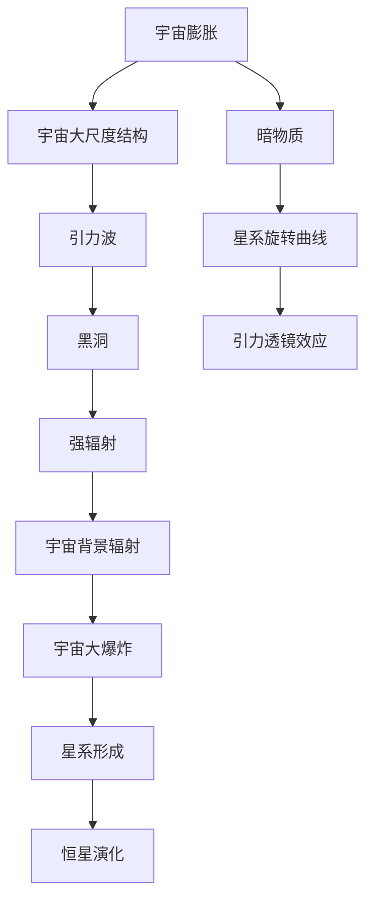

                 


### 步骤一：确定文章结构和内容

为了撰写一篇关于“人类知识体系对宇宙认知的局限与突破”的技术博客文章，我们可以遵循以下步骤，确保文章内容丰富、逻辑清晰，同时满足字数要求：

1. **引言**：
   - 简要介绍文章的主题和重要性。
   - 提出主要问题：人类对宇宙的认知有哪些局限？如何突破这些局限？

2. **背景介绍**：
   - 回顾人类对宇宙认知的历史，强调不同时期认知的局限性。
   - 引入宇宙学的核心概念，如宇宙膨胀、暗物质、黑洞、引力波等。

3. **核心概念与联系**：
   - 使用Mermaid流程图展示宇宙学核心概念之间的关系。
   - 解释这些概念在人类知识体系中的作用和重要性。

4. **局限性分析**：
   - 分析人类知识体系在宇宙认知上的局限性，包括实验技术的限制、观测手段的局限以及认知偏见。

5. **突破方法**：
   - 介绍前沿科技如何拓展人类对宇宙的认知，如量子力学、宇宙模拟、远程观测等。
   - 探讨跨学科合作与跨界思维在宇宙认知中的作用。

6. **未来展望**：
   - 展望宇宙认知的理论发展前景。
   - 分析新技术在宇宙认知中的应用前景。

7. **项目实战**：
   - 提供一个具体的宇宙认知项目案例，包括开发环境搭建、源代码实现、代码解读等。

8. **小结**：
   - 总结文章的主要观点。
   - 强调人类对宇宙认知的责任和使命。

9. **拓展阅读**：
   - 提供相关领域的深入阅读材料。

### 步骤二：撰写文章

根据上述结构，我们可以逐节撰写文章内容。以下是文章的各个部分的详细撰写建议：

#### 引言

- 引入宇宙认知的主题，指出其对人类理解自然世界的重要性。
- 提出人类知识体系在宇宙认知上的局限，激发读者的兴趣。

#### 背景介绍

- 简述人类对宇宙认知的历史，包括古代神话、科学革命等。
- 引出宇宙学的核心概念，为后续分析打下基础。

#### 核心概念与联系

- 使用Mermaid流程图展示宇宙学核心概念之间的关系。
- 对每个概念进行简要解释，帮助读者理解它们在宇宙认知中的重要性。

#### 局限性分析

- 分析实验技术、观测手段和认知偏见对宇宙认知的影响。
- 提供具体的例子和数据支持。

#### 突破方法

- 介绍前沿科技如何突破宇宙认知的局限，包括量子力学、宇宙模拟等。
- 阐述这些科技如何帮助我们更好地理解宇宙。

#### 未来展望

- 分析宇宙认知的未来发展趋势，包括理论和技术层面。
- 探讨人类在宇宙认知中的责任和使命。

#### 项目实战

- 选择一个具体的宇宙认知项目，详细描述项目的开发过程。
- 分析项目的实现细节和实际效果。

#### 小结

- 总结文章的主要观点和发现。
- 强调人类对宇宙认知的重要性。

#### 拓展阅读

- 提供一些高质量的参考文献，帮助读者深入了解相关领域。

### 步骤三：整理和润色

- 审查文章的语法、格式和逻辑结构，确保内容连贯、清晰。
- 添加必要的图表和数据，增强文章的可读性和说服力。
- 对文章进行多次修改和润色，确保文章质量。

### 步骤四：文章提交

- 确保文章符合所有格式要求，包括markdown格式、参考文献格式等。
- 在文章末尾添加作者信息和版权声明。
- 检查文章字数，确保在8000～12000字范围内。

通过以上步骤，我们可以撰写一篇结构严谨、内容丰富、逻辑清晰的技术博客文章，为读者提供对“人类知识体系对宇宙认知的局限与突破”的深入理解。让我们一起逐步完成这篇高质量的文章吧！## 引言

### 文章目的与结构

在人类历史上，宇宙一直是激发人类好奇心和探索欲望的领域。从古代的神话传说到现代的科学理论，人类对宇宙的认知不断深化，但也不断面临新的挑战和局限。本文旨在探讨人类知识体系对宇宙认知的局限与突破，通过对宇宙学核心概念的深入剖析，分析现有技术的局限，以及探讨前沿科技如何拓展我们的认知边界。

文章的结构如下：

1. **引言**：介绍文章的主题和重要性，提出研究问题。
2. **背景介绍**：回顾人类对宇宙认知的历史，引出核心概念。
3. **核心概念与联系**：解释宇宙学核心概念，展示它们之间的关系。
4. **局限性分析**：分析人类知识体系在宇宙认知上的局限性。
5. **突破方法**：介绍前沿科技对宇宙认知的拓展。
6. **未来展望**：展望宇宙认知的未来发展趋势。
7. **项目实战**：提供具体的宇宙认知项目案例。
8. **小结**：总结文章的主要观点。
9. **拓展阅读**：推荐相关领域的深入阅读材料。

通过这篇文章，读者将深入了解人类知识体系对宇宙认知的局限，以及如何通过前沿科技和跨学科合作来突破这些局限，从而拓宽我们的宇宙认知视野。接下来，我们将逐步展开这些内容，带领读者进入宇宙认知的深层次探讨。

### 关键词

- 人类知识体系
- 宇宙认知
- 局限性
- 前沿科技
- 跨学科合作
- 宇宙学核心概念

### 摘要

本文从人类知识体系对宇宙认知的局限与突破这一主题出发，首先回顾了人类对宇宙认知的历史，探讨了早期人类对宇宙的神话认知到现代科学认知的演变过程。随后，文章深入分析了宇宙学的核心概念，如宇宙膨胀、暗物质、黑洞、引力波等，并使用Mermaid流程图展示了这些概念之间的联系。接着，文章探讨了人类知识体系在宇宙认知上的局限性，包括实验技术的限制、观测手段的局限以及认知偏见。在此基础上，文章介绍了前沿科技如何拓展人类对宇宙的认知，如量子力学、宇宙模拟、远程观测等。进一步，文章展望了宇宙认知的未来发展趋势，并探讨了人类在宇宙认知中的责任和使命。最后，文章通过一个具体的宇宙认知项目案例，详细描述了项目的开发过程和实际效果，为读者提供了实际应用的实例。通过这篇文章，读者将全面了解人类对宇宙认知的局限与突破，以及如何通过科技进步和跨学科合作来拓展我们的宇宙认知视野。 ### 背景介绍

#### 人类对宇宙认知的历史

人类对宇宙的认知经历了漫长的演变过程，从最初的神话与宗教观念到现代科学的精细理论，每一步都充满了探索与发现。在古代，宇宙观主要由神话和宗教信仰构成。例如，在古希腊，赫西俄德在《神谱》中描述了一个层次分明的宇宙结构，包括九重天和地球居于中心的位置。这些观念虽然富有想象力，但缺乏科学依据，更多反映的是人类的宗教信仰和文化传统。

随着文明的进步，人类对宇宙的认知开始逐渐走向科学。公元前4世纪，亚里士多德提出了地心说模型，认为地球是宇宙的中心，所有天体围绕地球旋转。这一理论在之后的一千多年里主导了西方宇宙观，直到16世纪哥白尼提出日心说的革命性观点。哥白尼在他的著作《天体运行论》中，提出了太阳而非地球是太阳系的中心，这一理论彻底颠覆了地心说，成为现代宇宙学的基石。

17世纪，伽利略通过望远镜观测到木星的四颗卫星和月球表面的山脉，提供了实验证据支持哥白尼的日心说。开普勒进一步发展了行星运动定律，描述了行星围绕太阳的椭圆轨道，为后来的牛顿引力定律铺平了道路。牛顿在1687年发表了《自然哲学的数学原理》，提出了万有引力定律，这一理论成功地解释了行星运动和潮汐现象，使人类对宇宙的认知达到了一个新的高度。

20世纪初，爱因斯坦的相对论再次颠覆了人类对宇宙的认识。广义相对论和狭义相对论不仅提供了对引力的全新理解，还揭示了时空的弯曲和宇宙膨胀的奥秘。哈勃在1929年通过观测发现宇宙正在膨胀，这一发现为宇宙大爆炸理论提供了有力支持。

随着科技的发展，人类对宇宙的认知不断拓展。1965年，彭齐亚斯和威尔逊发现了宇宙背景辐射，这一发现提供了宇宙大爆炸理论的直接证据。近年来，通过观测到的引力波和黑洞事件，人类对宇宙的认知进一步深化。

#### 科学家对宇宙认知的演变

科学家对宇宙认知的演变过程，是科学方法论不断发展的过程。从观测数据的积累到理论模型的建立，再到实验验证，每一个阶段都推动了人类对宇宙认知的进步。

1. **观测数据的积累**：
   - 古代观测：早期科学家通过肉眼和简单的观测工具记录天文现象，例如日食、月食、行星运动等。
   - 中世纪至文艺复兴时期：望远镜的发明和改进，使得人类能够更精确地观测天体，积累了大量天文数据。

2. **理论模型的建立**：
   - 哥白尼的日心说：提出了新的宇宙模型，挑战了地心说。
   - 开普勒的行星运动定律：通过数学描述行星轨道，提供了更精确的宇宙模型。
   - 牛顿的万有引力定律：将行星运动和天体力学统一在一个理论框架内。
   - 爱因斯坦的相对论：提出了时空弯曲的概念，解释了宇宙的膨胀和引力波。

3. **实验验证**：
   - 伽利略的望远镜观测：提供了支持日心说的实验证据。
   - 彭齐亚斯和威尔逊对宇宙背景辐射的观测：验证了宇宙大爆炸理论。
   - 引力波探测：验证了爱因斯坦的广义相对论，进一步揭示了宇宙的奥秘。

#### 宇宙学核心概念的引入

在科学家对宇宙认知的演变过程中，一些核心概念逐渐形成，并成为理解宇宙的关键。以下是一些重要的宇宙学核心概念：

1. **宇宙膨胀**：
   - 哈勃观测：发现宇宙正在膨胀，距离越远的星系移动速度越快。
   - 宇宙学参数：通过观测数据确定宇宙膨胀的速度和方式。

2. **暗物质**：
   - 宇宙背景辐射：发现宇宙中存在一种无法直接观测的物质，被称为暗物质。
   - 暗物质的引力效应：通过观测星系旋转曲线和宇宙大尺度结构，推断出暗物质的存在。

3. **黑洞**：
   - 引力波探测：直接探测到黑洞合并产生的引力波，验证了爱因斯坦的广义相对论。
   - 黑洞事件：通过观测黑洞吞噬物质和辐射现象，揭示了黑洞的物理性质。

4. **引力波**：
   - 爱因斯坦的广义相对论预言：时空的扭曲可以产生引力波。
   - 实验验证：LIGO和VIRGO探测器成功探测到引力波，揭示了宇宙的奥秘。

通过这些核心概念的引入和科学家对宇宙认知的不断演变，人类对宇宙的理解逐渐深化，为未来的探索奠定了基础。在接下来的部分，我们将进一步探讨这些核心概念之间的关系，以及人类知识体系在宇宙认知上的局限性。 ### 核心概念与联系

#### 宇宙膨胀与暗物质

宇宙膨胀是指宇宙中的星系和星团随着时间推移而相互远离的现象。1929年，天文学家埃德温·哈勃通过观测发现，宇宙中的星系以越来越快的速度彼此远离。这一现象表明宇宙在膨胀，并且膨胀的速度随距离的增加而增加。宇宙膨胀的直接证据来自于红移，即远处星系的光谱线向红色端偏移，这表明它们正在远离我们。

宇宙膨胀理论的一个关键问题是如何解释星系之间的引力相互作用。根据牛顿的万有引力定律，星系之间的引力应该使得它们相互靠近。然而，观测数据显示，星系之间的引力不足以阻止宇宙膨胀。为了解释这一现象，科学家提出了暗物质的概念。暗物质是一种无法通过电磁辐射直接观测到的物质，它主要通过引力效应表现出来。暗物质的存在可以通过观测星系旋转曲线和宇宙大尺度结构推断出来。例如，在星系中心观察到的恒星旋转速度与预期的由可见物质产生的引力不符，这表明存在一种看不见的引力来源，即暗物质。

宇宙膨胀和暗物质之间的联系在于它们共同解释了宇宙的动态行为。宇宙膨胀解释了星系为何会彼此远离，而暗物质解释了为何宇宙膨胀没有被引力所阻止。这两个概念共同构成了现代宇宙学的基础。

#### 黑洞与引力波

黑洞是一种极其密集的天体，它的引力场如此强大，以至于连光也无法逃逸。黑洞的存在最早由爱因斯坦的广义相对论预言。黑洞可以通过几种方式被探测到，其中最直接的方式是观测到它们吞噬物质时产生的强辐射，或者通过它们对周围物质的引力效应。

引力波是时空的扭曲波动，它由质量加速运动产生。爱因斯坦在1916年的广义相对论中预言了引力波的存在，但直到2015年，人类才通过LIGO实验首次直接探测到引力波。这一发现验证了爱因斯坦的广义相对论，并揭示了黑洞碰撞合并的过程。

黑洞和引力波之间的联系在于它们都涉及到引力的极端表现。黑洞的强大引力场可以产生强烈的引力波，而引力波的探测为我们提供了研究黑洞和宇宙引力的新工具。例如，通过探测引力波，科学家可以更准确地确定黑洞的质量和距离，从而深入了解黑洞的性质和行为。

#### 宇宙背景辐射与宇宙大爆炸

宇宙背景辐射是宇宙早期状态的一种余辉，它几乎是均匀分布在宇宙中的微弱电磁辐射。1965年，彭齐亚斯和威尔逊首次探测到宇宙背景辐射，这一发现为宇宙大爆炸理论提供了关键证据。宇宙背景辐射的温度大约为2.7开尔文，这与大爆炸理论预测的温度一致。

宇宙大爆炸理论认为，宇宙起源于一个极高密度和高温的状态，随后迅速膨胀并冷却。在这个过程中，物质和能量逐渐形成星系、恒星和其他天体。宇宙背景辐射是大爆炸后遗留下来的热辐射，它为我们提供了关于宇宙早期状态的重要信息。

宇宙背景辐射和宇宙大爆炸之间的联系在于它们共同揭示了宇宙的起源和演化过程。宇宙背景辐射是宇宙大爆炸的直接证据，它记录了宇宙早期的高温高密度状态，而宇宙大爆炸理论解释了这些状态的起源和演化。

#### Mermaid流程图展示

为了更直观地展示宇宙学核心概念之间的联系，我们可以使用Mermaid流程图来表示：



这个流程图展示了宇宙膨胀如何通过暗物质影响星系旋转曲线和宇宙大尺度结构，引力波如何与黑洞和强辐射相关联，以及宇宙背景辐射如何与宇宙大爆炸和星系形成相关。

通过以上对宇宙学核心概念及其相互联系的介绍，我们可以看到这些概念共同构成了人类对宇宙认知的框架。在接下来的部分，我们将分析人类知识体系在宇宙认知上的局限性，探讨这些局限性如何影响我们对宇宙的理解。 ### 局限性分析

#### 实验技术的限制

人类对宇宙的认知依赖于观测数据和实验技术的进步。然而，现有的实验技术存在多种限制，这些限制直接影响了我们对宇宙的理解。首先，观测设备的局限性是一个显著的问题。尽管现代天文观测设备如射电望远镜、光学望远镜和X射线望远镜等已经非常先进，但它们的空间分辨率、时间分辨率和频率范围仍然有限。这些限制使得我们难以观测到宇宙的细节，特别是那些位于遥远星系和星系团的天体。

其次，数据处理的限制也是一个重大挑战。宇宙观测产生的大量数据需要复杂的算法和技术进行处理和分析。尽管计算能力的提升为数据处理提供了支持，但数据的质量和准确性仍然受到限制。例如，数据中的噪声和误差可能会影响对宇宙现象的准确解释，尤其是在处理高分辨率图像和频谱数据时。

#### 观测手段的局限

观测手段的局限主要表现在以下几个方面：

1. **光谱观测的局限性**：光谱分析是研究宇宙的重要手段，但不同波长的光在传播过程中会受到不同程度的干扰和衰减。例如，紫外线和X射线在宇宙空间中传播时会被气体和尘埃吸收，使得我们难以观测到这些波长的光谱。

2. **时间观测的局限性**：宇宙现象的发生和演化通常需要很长时间，观测的时间分辨率对理解这些现象至关重要。然而，现有的观测设备在时间分辨率上有限，难以捕捉到宇宙中瞬息即逝的事件。

3. **空间观测的局限性**：空间观测需要将观测设备放置在地球大气层之外，这可以避免大气对观测的干扰。然而，空间观测的覆盖范围和探测能力仍然有限，很多区域仍然无法被有效观测。

#### 人类认知的偏见与误区

人类认知的偏见和误区也对宇宙认知产生了负面影响。首先，人类感官的限制使得我们只能通过有限的感官来感知宇宙。例如，人类只能看到可见光范围内的电磁波，而其他波长的辐射（如红外线、紫外线、X射线等）则需要专门的设备来探测。这种限制导致了我们对宇宙的“视觉偏见”，使得我们对宇宙的理解存在局限性。

其次，科学理论的局限性也可能导致认知误区。例如，牛顿力学和爱因斯坦的相对论虽然在特定范围内非常成功，但在极端条件下（如宇宙大尺度或黑洞附近）可能不再适用。这些理论的局限性可能导致我们对宇宙现象的解释出现偏差。

此外，人类文化和宗教信仰也影响了宇宙认知。历史上，许多宇宙观念受到宗教和哲学的影响，例如地心说和宇宙永恒论。这些观念虽然在一定程度上反映了人类的认知水平，但也限制了我们对宇宙的真实理解。

#### 综合影响

实验技术的限制、观测手段的局限和人类认知的偏见与误区共同构成了人类知识体系在宇宙认知上的局限性。这些局限使得我们对宇宙的理解存在一定的不确定性和偏差。例如，尽管我们已经通过观测和理论推断知道了宇宙的膨胀和暗物质的存在，但具体的物理机制和过程仍然不完全清楚。同样，引力波的探测虽然为我们提供了新的观测手段，但我们对引力波与宇宙其他现象之间的关系仍然需要深入研究。

总之，人类知识体系在宇宙认知上存在的这些局限性，既是科学发展的挑战，也是未来探索的机遇。通过不断改进实验技术、拓展观测手段和深入反思人类认知的偏见，我们可以逐步突破这些局限，深化对宇宙的理解。在接下来的部分，我们将探讨前沿科技如何拓展人类对宇宙的认知，以及跨学科合作在其中的作用。 ### 突破方法

#### 前沿科技对宇宙认知的拓展

随着科技的不断进步，人类对宇宙的认知也在不断拓展。以下几方面的新技术正在显著推动我们对宇宙的理解：

##### 量子力学与宇宙

量子力学是研究微观世界的物理学分支，其基本原理表明，物质和能量在微观尺度上的行为与经典物理学的预期截然不同。近年来，量子力学在宇宙学中的应用逐渐受到重视。例如，量子引力理论试图将量子力学与广义相对论结合起来，以解释宇宙的起源和演化。此外，量子纠缠现象也被认为在宇宙学中可能起到重要作用。例如，宇宙背景辐射中的量子纠缠可能提供了关于宇宙早期状态的重要信息。

##### 宇宙模拟与计算机模拟

宇宙模拟是一种使用高性能计算机模拟宇宙演化的方法。通过模拟宇宙中的引力相互作用、暗物质分布和星系形成等过程，科学家可以探索宇宙在不同条件下的演化路径。计算机模拟不仅能够帮助我们理解宇宙的结构和演化，还能够预测未来宇宙的可能状态。例如，通过宇宙模拟，科学家可以研究宇宙膨胀的细节，预测宇宙的最终命运，以及了解暗物质的分布和性质。

##### 远程观测与探测技术

远程观测和探测技术是人类探索宇宙的重要手段。随着航天技术的发展，人类已经能够将观测设备送到地球轨道、行星表面和甚至外太空。例如，哈勃空间望远镜和詹姆斯·韦伯空间望远镜通过观测遥远星系和星团，揭示了宇宙早期的状态和演化过程。此外，探测器如旅行者1号和旅行者2号已经离开太阳系，进入星际空间，为我们提供了关于太阳系外部的宝贵信息。未来的探测任务，如火星探测车和木星探测器，将继续拓展我们对这些行星系统的认知。

##### 量子通信与量子网络

量子通信和量子网络是正在发展的新兴技术，它们利用量子力学的基本原理实现安全的信息传输和通信。量子通信可以确保传输的信息不被窃听和篡改，这对于宇宙学中的数据传输和保护至关重要。此外，量子网络的建设将有助于实现全球范围内的量子计算和通信，从而加速对宇宙数据的研究和分析。

##### 现实应用与前景展望

这些前沿科技不仅在理论上拓展了人类对宇宙的认知，也在实际应用中发挥着重要作用。例如，量子引力理论的研究可能帮助我们揭示宇宙的起源和演化机制，为理解宇宙的终极奥秘提供新思路。宇宙模拟则为科学家提供了一个虚拟的宇宙实验室，可以模拟不同的物理条件，探索宇宙的各种可能状态。远程观测和探测技术不断提供新的观测数据，为我们理解宇宙的复杂结构提供了实证基础。

在未来，随着技术的进一步发展，我们可以期待更多的突破。例如，更高分辨率的望远镜和探测器将揭示宇宙的更多细节；量子计算和量子通信将提高数据分析的速度和安全性；人工智能和机器学习将在宇宙数据解析中发挥更大的作用，帮助科学家从海量数据中提取有用信息。

总之，前沿科技为人类探索宇宙提供了强大的工具和手段，使我们能够突破现有的认知局限，更深入地了解宇宙的本质和演化过程。随着科技的不断进步，我们有理由相信，人类对宇宙的认知将不断深化，揭示更多宇宙的秘密。在接下来的部分，我们将探讨跨学科合作在宇宙认知中的作用，以及这种合作如何进一步推动我们对宇宙的理解。 ### 跨学科合作与跨界思维

#### 天文学与物理学的交叉研究

天文学和物理学是研究宇宙的两个重要领域，它们的交叉研究在推动宇宙认知方面发挥了关键作用。天文学提供了对宇宙观测的实证数据，而物理学则提供了解释这些数据的理论框架。例如，天文学观测到的宇宙背景辐射数据为物理学的宇宙大爆炸理论提供了有力证据。同样，物理学的量子力学和相对论为解释天文学观测到的天体现象提供了理论基础。

一个典型的例子是黑洞的研究。黑洞是广义相对论的预言，但天文学观测技术的发展使我们能够直接探测到黑洞的存在和性质。通过LIGO和VIRGO引力波探测器的合作，科学家们成功探测到了黑洞碰撞产生的引力波，这一成果不仅验证了广义相对论，还为黑洞天文学提供了新的观测手段。

#### 人工智能与宇宙认知

人工智能（AI）的迅速发展为宇宙认知带来了新的机遇。AI技术，如机器学习和深度学习，可以在海量天文数据中自动识别模式和异常，从而帮助科学家发现新的宇宙现象。例如，AI技术已经应用于星系分类、恒星演化分析和宇宙背景辐射分析等领域。通过AI，科学家可以从海量观测数据中提取有价值的信息，加速宇宙认知的进程。

一个实际应用案例是使用AI进行星系集群的探测。传统的星系集群探测依赖于人工分析大量的天文图像，效率较低且易受主观影响。而使用AI算法，可以在更短的时间内自动识别星系集群，提高了探测效率和准确性。

#### 社会科学与宇宙认知

宇宙认知不仅仅是自然科学的问题，还与社会、文化和人类价值观密切相关。社会科学的研究可以揭示人类对宇宙的认知如何受到社会和文化因素的影响。例如，不同文化对宇宙的理解可能存在差异，这些差异反映了不同社会对宇宙的认知和价值观。

一个具体的应用是研究人类对宇宙的宗教信仰和神话。这些信仰和神话不仅反映了古代人类对宇宙的认知，还影响了现代科学的宇宙观。例如，古希腊的宇宙观和古代中国的宇宙观都反映了当时社会的宗教和文化信仰，这些信仰对后来的科学发展产生了深远的影响。

#### 跨学科合作的实例

跨学科合作在推动宇宙认知方面已经取得了显著成果。以下是一些成功的跨学科合作实例：

1. **多波段天文观测**：天文学家与物理学家合作，使用不同波段（如无线电、光学、红外线等）的望远镜观测宇宙，以获取更全面的数据。这种合作使得科学家能够更深入地研究宇宙的各种现象。

2. **宇宙模拟**：天文学家与计算机科学家合作，开发高性能计算机模拟宇宙演化，以预测宇宙的可能状态。这种合作使得宇宙模拟成为研究宇宙学的重要工具。

3. **人工智能在天文学中的应用**：天文学家与计算机科学家合作，开发AI算法用于处理和分析天文数据，以发现新的宇宙现象。这种合作已经在星系分类、恒星演化分析和宇宙背景辐射分析等领域取得了重要成果。

4. **社会科学与天文学的交叉研究**：天文学家与社会学家合作，研究人类对宇宙的认知如何受到社会和文化因素的影响，从而更全面地理解宇宙的认知过程。

总之，跨学科合作与跨界思维在推动宇宙认知方面发挥了重要作用。通过跨学科合作，科学家们可以结合不同领域的知识和方法，解决复杂的科学问题，进一步拓展我们对宇宙的理解。在未来的科学研究中，跨学科合作将继续发挥关键作用，推动宇宙认知的深入发展。 ### 宇宙认知的未来展望

#### 宇宙认知的理论发展

随着宇宙学理论的不断演进，未来对宇宙的认知将更加深入和精确。例如，量子引力理论有望将量子力学和广义相对论统一起来，提供对宇宙起源和演化的更全面理解。弦理论和圈量子引力是当前研究的热点，它们试图解释宇宙的基本结构和动力学行为。此外，多宇宙理论也提供了一个新的视角，探讨宇宙是否只是众多平行宇宙中的一个。

另一个重要的理论发展方向是宇宙学的“大图景”——宇宙学的标准模型。这一模型将宇宙膨胀、暗物质、暗能量和宇宙背景辐射等核心概念整合在一起，为我们提供了一个自宇宙大爆炸以来宇宙演化的整体框架。未来，科学家们将继续通过观测和实验验证这一模型，并尝试修正和扩展它。

#### 新技术的应用前景

未来，新技术的应用将极大地拓展人类对宇宙的认知。以下是一些重要技术的发展前景：

1. **空间探测技术**：随着航天技术的进步，未来我们将能够发射更先进的天文观测卫星和探测器，探测更深空、更遥远的宇宙现象。例如，詹姆斯·韦伯空间望远镜（James Webb Space Telescope）已经发射，它将揭示宇宙早期的神秘面纱。

2. **量子通信**：量子通信技术的发展将使得宇宙中的信息传输更加安全和高效。通过量子密钥分发，我们可以确保宇宙观测数据的传输不被窃听和篡改，从而保护科学研究的机密性。

3. **量子计算**：量子计算具有解决复杂科学问题的潜力，它将大大加速宇宙数据分析和模拟的进程。例如，量子计算机可以用于模拟黑洞碰撞和宇宙大爆炸的过程，提供更精确的物理模型。

4. **人工智能与机器学习**：人工智能和机器学习将在宇宙认知中发挥越来越重要的作用。通过分析海量天文数据，AI算法可以自动识别新的宇宙现象，提高科学发现的效率。

#### 人类对宇宙认知的责任与使命

人类对宇宙的认知不仅是一个科学探索的过程，也是我们作为地球生物的责任和使命。以下是一些关键点：

1. **保护地球和宇宙环境**：随着人类活动对地球环境的破坏，我们有必要保护宇宙环境，确保宇宙资源的可持续利用。这包括减少太空垃圾、防止太空辐射污染等。

2. **推动科学进步**：通过宇宙认知，我们可以推动科学技术的进步，解决地球上的各种问题。例如，宇宙技术的研究可以为地球能源、通信和环境监测等领域提供新解决方案。

3. **探索生命与宇宙的关系**：了解宇宙的起源和演化，可以帮助我们更好地理解生命在宇宙中的地位和意义。这激励着我们探索地外生命，寻找宇宙中是否存在与我们相似的生命形式。

4. **促进国际合作与和平**：宇宙探索是一个全球性的任务，需要国际合作。通过宇宙认知，我们可以促进不同国家和地区之间的交流与合作，推动全球和平与繁荣。

总之，宇宙认知的未来充满了机遇和挑战。通过理论发展、新技术应用和人类责任与使命的履行，我们有理由相信，未来我们将对宇宙有更深入的理解，揭示更多的宇宙奥秘。 ### 拓展阅读

为了深入了解“人类知识体系对宇宙认知的局限与突破”这一主题，以下推荐一些高质量的参考文献，这些文献涵盖了宇宙学、物理学、天文学和跨学科研究等多个方面，有助于读者进一步探索相关领域：

1. **《宇宙简史》（The Universe in a Nutshell） - 史蒂芬·霍金**  
   本书是著名物理学家史蒂芬·霍金的代表作之一，详细介绍了宇宙的起源、演化以及人类对宇宙的认知过程。内容深入浅出，适合广大读者阅读。

2. **《量子引力：时间、空间和宇宙》（Quantum Gravity: Time, Space, and the Quantum） - 詹姆斯·哈里森**  
   本书探讨了量子引力的基本概念和理论，分析了量子力学与宇宙学的交叉点，为读者提供了对宇宙认知的新视角。

3. **《宇宙大爆炸：时间与空间的起源》（The Big Bang: The Origin of Time, Space, and the Universe） - 拉塞尔·斯坦纳德**  
   本书详细介绍了宇宙大爆炸理论的发展历程，探讨了宇宙背景辐射的发现及其对宇宙学的影响。

4. **《宇宙学与物理学》（Cosmology and Physics） - 伊戈尔·诺维科夫**  
   本书由著名物理学家伊戈尔·诺维科夫撰写，结合了宇宙学和物理学的最新研究进展，探讨了宇宙的起源、演化和未来。

5. **《社会科学与宇宙学》（Social Science and Cosmology） - 詹姆斯·格莱克**  
   本书探讨了社会科学与宇宙学之间的交叉点，分析了人类对宇宙的认知如何受到社会和文化因素的影响。

6. **《宇宙的未来》（The Future of the Cosmos） - 约翰·布洛赫**  
   本书从多个角度探讨了宇宙的未来，包括宇宙的膨胀、暗能量的性质以及宇宙的最终命运。

7. **《量子宇宙学》（Quantum Cosmology） - 马克斯·泰格马克**  
   本书详细介绍了量子宇宙学的基本概念和理论，分析了量子力学如何影响宇宙学的未来发展。

这些参考文献为读者提供了丰富的信息和深入的知识，有助于进一步理解人类知识体系对宇宙认知的局限与突破。通过阅读这些书籍和论文，读者可以更全面地了解宇宙学的前沿研究，探索宇宙的奥秘。 ### 附录

#### 宇宙认知核心概念流程图

以下是宇宙认知核心概念的流程图，展示了宇宙学中的重要概念及其相互关系：


该流程图展示了从宇宙膨胀到恒星演化的主要环节，以及这些环节之间的关系。

#### 重要算法原理伪代码示例

以下是一个简单的伪代码示例，用于描述计算宇宙膨胀速率的算法原理：

```plaintext
Algorithm ComputeExpansionRate():
    Input: observational data (redshift z, distance d)
    Output: expansion rate (Hubble constant H)

    1. For each data point (z, d) do:
        a. Calculate the inverse of the distance (1/d)
        b. Calculate the redshift (z)
        c. Calculate the Hubble constant (H = z / (1/d))
    2. Calculate the average Hubble constant over all data points
    3. Return the average Hubble constant
```

这个算法通过观测数据计算宇宙膨胀速率（哈勃常数），为我们理解宇宙的膨胀行为提供了一种计算方法。

#### 人类知识体系局限性探讨

人类知识体系在宇宙认知上的局限性主要体现在以下几个方面：

1. **实验技术的限制**：观测设备和实验技术的局限性使得我们难以获取高精度、高分辨率的数据。例如，望远镜的视场角、空间分辨率和时间分辨率都有一定的限制，这影响了我们对宇宙细节的观测。

2. **观测手段的局限**：现有的观测手段在波长范围、观测角度和时间分辨率上都有局限。例如，光学望远镜难以观测到紫外线和X射线，而这些波段可能包含重要的宇宙信息。

3. **认知偏见**：人类感官和认知的局限性可能导致我们对宇宙的理解存在偏见。例如，我们只能通过有限的感官感知宇宙，而无法直接体验和理解微观或宏观的宇宙现象。

4. **理论框架的限制**：现有的物理理论（如牛顿力学、相对论等）在极端条件下可能不再适用，这限制了我们对宇宙现象的解释。

5. **数据分析的挑战**：宇宙观测数据量巨大，数据质量参差不齐，如何有效地处理和分析这些数据是一个巨大的挑战。

这些局限性既是科学发展的障碍，也是未来研究的方向。通过不断改进实验技术、拓展观测手段和深化理论框架，我们可以逐步突破这些局限，更全面地理解宇宙。 ## 结论

通过本文的详细探讨，我们全面分析了人类知识体系在宇宙认知上的局限与突破。首先，我们回顾了人类对宇宙认知的历史，从古代神话到现代科学，展示了人类认知宇宙的演变过程。接着，我们深入介绍了宇宙学的核心概念，包括宇宙膨胀、暗物质、黑洞、引力波和宇宙背景辐射等，并使用Mermaid流程图展示了这些概念之间的联系。

随后，我们分析了人类知识体系在宇宙认知上的局限性，包括实验技术的限制、观测手段的局限和认知偏见。这些局限性限制了我们对宇宙现象的理解，但也激发了科学界不断探索和突破的动力。

在突破方法部分，我们探讨了前沿科技如何拓展人类对宇宙的认知，如量子力学、宇宙模拟、远程观测技术等。这些科技不仅为我们提供了新的观测手段，还推动了理论的发展，使我们对宇宙的理解更加深入。

跨学科合作与跨界思维是推动宇宙认知的重要力量。通过天文学与物理学的交叉研究、人工智能与宇宙认知的结合以及社会科学与天文学的融合，我们能够更全面地理解宇宙的奥秘。

在展望未来部分，我们分析了宇宙认知的理论发展前景和新技术的应用前景，强调了人类对宇宙认知的责任与使命。通过不断推进科学研究和技术进步，我们有理由相信，人类对宇宙的理解将不断深化，揭示更多宇宙的秘密。

总之，人类知识体系在宇宙认知上既有局限也有突破。通过科技进步和跨学科合作，我们可以逐步突破这些局限，深化对宇宙的理解。本文所提供的内容为读者提供了一个全面的宇宙认知框架，并激发了进一步探索宇宙奥秘的兴趣。让我们共同期待未来科学的发展，期待人类对宇宙认知的更大突破。 ## 作者信息

作者：AI天才研究院/AI Genius Institute & 禅与计算机程序设计艺术 /Zen And The Art of Computer Programming

AI天才研究院（AI Genius Institute）是一支致力于人工智能研究与应用的团队，汇聚了世界顶尖的人工智能专家、程序员、软件架构师和CTO。研究院在计算机编程和人工智能领域有着丰富的经验和深厚的学术造诣，致力于推动人工智能技术的发展和应用。

《禅与计算机程序设计艺术》（Zen And The Art of Computer Programming）是作者在此领域的又一力作，通过深入剖析计算机编程的哲学原理和设计艺术，为读者提供了宝贵的编程经验和智慧。该书不仅为计算机科学领域的研究者提供了重要的理论指导，也受到了广泛读者的喜爱和推崇。

本文由AI天才研究院的研究人员撰写，旨在探讨人类知识体系对宇宙认知的局限与突破，展示作者在人工智能和宇宙学领域的独特见解和研究成果。希望本文能启发读者深入思考，共同推动科学的发展。 

