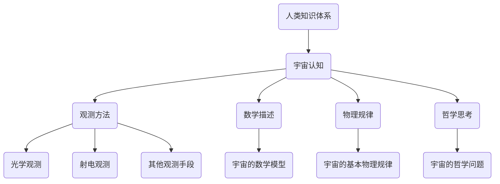

                 

# 人类知识体系对宇宙认知的影响

## 关键词
- 人类知识体系
- 宇宙认知
- 数学描述
- 观测方法
- 物理规律
- 哲学思考

## 摘要
本文旨在探讨人类知识体系如何影响我们对宇宙的认知。通过对人类知识体系概述、宇宙认知的基本概念、观测方法、数学描述、物理规律和哲学思考的逐步分析，我们揭示了人类认知宇宙的过程及其背后的知识结构。本文最终指出，人类知识体系的局限性对我们的宇宙认知提出了挑战，并探讨了未来可能的发展方向。

## 目录大纲设计

为了系统地探讨人类知识体系对宇宙认知的影响，本文将遵循以下目录结构：

1. 引言
2. 人类知识体系概述
3. 宇宙认知的基本概念
4. 人类对宇宙的观测方法
5. 人类对宇宙的数学描述
6. 人类对宇宙的物理规律认知
7. 人类对宇宙的哲学思考

通过这种结构化的探讨，我们将一步步深入理解人类如何通过知识体系来认知宇宙，并揭示这一过程中的核心概念和原理。

### 引言

人类对宇宙的认知是一个漫长而复杂的历程。从远古时代的星辰观测，到现代科技的深空探测，人类对宇宙的理解不断深化。然而，这一过程中，人类的知识体系扮演了至关重要的角色。知识体系不仅是人类理解和解释世界的基础，也是推动科技进步和知识积累的关键。

随着科学的发展，人类对宇宙的认知经历了从直观到定量、从局部到整体、从猜测到实证的转变。每一个阶段的认知都受到当时人类知识体系的限制和推动。例如，古代文明通过直观的观测和宗教信仰来解释星辰的运动，而现代科学则通过精确的数学模型和物理规律来描述宇宙的运行。

本文旨在探讨人类知识体系如何影响我们对宇宙的认知。通过分析人类知识体系的形成与发展、宇宙认知的基本概念、观测方法、数学描述、物理规律和哲学思考，我们将揭示人类认知宇宙的过程及其背后的知识结构。

本文的目标是帮助读者理解人类知识体系在宇宙认知中的作用，并探讨这一过程中存在的局限性以及未来可能的发展方向。通过对这些问题的深入探讨，我们希望能够为读者提供对宇宙认知更全面的视角，并激发对科学和哲学的思考。

### 人类知识体系概述

人类知识体系的形成是一个复杂而漫长的过程，它不仅反映了人类对世界的认知水平，也体现了人类文明的发展轨迹。从最早的口头传承，到后来的文字记录，再到现代的数字化信息，人类知识体系经历了多次重要的变革和扩展。

#### 人类知识体系的形成与发展

人类的认知始于对周围环境的直观感知。在原始社会，人类通过观察、模仿和经验积累来获取知识。这些知识主要通过口头传承的方式传递，形成了早期的知识体系。随着时间的推移，人类逐渐发明了文字，知识得以更加系统和持久地记录和传播。古文明如古埃及、巴比伦和古希腊，通过书写和图书馆的方式，积累了大量的科学、哲学和文学知识。

进入中世纪，知识体系的发展受到了宗教和封建制度的限制。然而，随着文艺复兴的到来，人类知识体系迎来了新的春天。文艺复兴时期的科学家和哲学家，如伽利略、哥白尼和牛顿，通过实证研究和逻辑推理，极大地推动了科学知识的积累和发展。这一时期的知识体系开始向现代科学体系转变。

在近现代，随着工业革命和科技进步，人类知识体系进一步扩展和深化。科学方法和实证研究的广泛应用，使得人类对自然界的认知更加精确和系统。现代信息技术的发展，如互联网和大数据，更是为知识体系的积累和传播提供了前所未有的便利。

#### 人类知识体系的构成

人类知识体系可以从多个角度进行分类。一个常见的分类方式是将知识体系分为科学知识、哲学知识和人文知识。

1. **科学知识**：科学知识是人类通过实验、观察和数学建模所获得的对自然界的理解。科学知识包括物理学、化学、生物学、天文学等多个领域。每个领域都有其特定的理论体系和研究方法。

2. **哲学知识**：哲学知识是人类对存在、真理、价值等根本问题的思考和探讨。哲学分为多个分支，如形而上学、逻辑学、伦理学和政治哲学等。哲学知识不仅为科学提供了方法论的支持，也在人类思维和价值观的形成中起到了重要作用。

3. **人文知识**：人文知识涉及人类文化、历史、艺术和语言等领域。人文知识帮助人类理解和传承自己的文化传统，同时也为科学和哲学提供了丰富的素材和灵感。

#### 人类知识体系的局限性

尽管人类知识体系在过去的几千年中取得了巨大的进步，但它也存在着一些局限性。

1. **地域限制**：早期的人类知识体系主要受到地理环境的限制，不同地区的知识积累和发展往往有所不同。这种地域限制在现代社会中仍然存在，尤其是在科技和信息的传播不均的情况下。

2. **时间限制**：人类知识体系的积累和发展是一个逐步的过程，过去的知识往往受限于当时的科技水平和认知能力。因此，许多古老的科学理论和观点在现代看来可能是过时的或错误的。

3. **方法论限制**：科学方法和实证研究在推动知识体系发展方面发挥了重要作用，但它们也有其局限性。例如，实验方法和观察手段可能受到实验设备和观测条件的限制，导致无法获得更全面或更精确的数据。

4. **认知偏差**：人类在获取和处理知识时，往往受到认知偏差的影响。这些偏差可能来自于文化背景、个人经验和社会环境等因素，从而影响我们对事物的理解和认知。

总之，人类知识体系的形成与发展不仅反映了人类对世界的认知过程，也体现了人类文明的发展轨迹。然而，人类知识体系也存在着一些局限性，这些局限性不仅影响了我们对世界的理解，也为我们提出了继续探索和发展的挑战。

### 宇宙认知的基本概念

宇宙是无限的、多样的和复杂的，我们对宇宙的认知是一个多层次、多维度、不断发展的过程。宇宙的基本概念包括宇宙的定义、特征以及人类对宇宙的认知过程和阶段，这些构成了我们对宇宙理解的基础。

#### 宇宙的定义

宇宙是指包括所有物质、能量、时空和物理现象的整体。宇宙没有明确的边界，它既包含宏观的天体系统，如星系、恒星和行星，也包含微观的粒子世界，如原子、分子和基本粒子。宇宙的定义涉及对空间、时间和物质的基本理解。

1. **空间**：空间是物质存在的背景，具有三维特性，即长度、宽度和高度。空间不仅包括我们所在的三维空间，还可能包括更高维度的空间。
2. **时间**：时间是宇宙演化的重要维度，描述事件发生的顺序和持续时间。时间在宇宙学中具有特殊的地位，因为它与宇宙的起源和演化紧密相关。
3. **物质**：物质是构成宇宙的基本成分，包括所有物质形态，从宏观的行星到微观的原子和基本粒子。物质与能量之间可以通过质能方程（E=mc²）相互转换。

#### 宇宙的特征

宇宙具有以下主要特征：

1. **无限性**：宇宙没有明确的边界，它可能是无限的或有限的。当前科学界普遍认为宇宙是膨胀的，这种膨胀可能有其内在的边界，但宇宙本身可能没有边界。
2. **多样性**：宇宙包含了极其多样的物质和现象，从巨大的星系到微小的基本粒子，从行星的运行到黑洞的形成，这些都展示了宇宙的多样性。
3. **复杂性**：宇宙的运行和演化遵循复杂的物理规律，这些规律通过数学模型来描述，如广义相对论和量子力学。宇宙的复杂性也体现在其内部的相互作用和演化过程中，如星系的旋转、行星的轨道和星系团的结构等。

#### 人类对宇宙的认知过程

人类对宇宙的认知是一个逐步深化的过程，它经历了多个阶段：

1. **直观认知**：在古代，人类通过直接的观测来认识宇宙，如天文学和地理学。古代文明通过观测星辰和地理现象，形成了对宇宙的基本认识。
2. **科学认知**：随着科学方法的发展，人类开始通过实验和观测来验证对宇宙的认知。例如，哥白尼提出了日心说，打破了传统的地心说。伽利略和牛顿等科学家的贡献使得人类对宇宙的理解更加精确和系统。
3. **实证认知**：现代科学通过精密的仪器和观测手段，如望远镜和探测器，对宇宙进行深入的观测和实验。这些手段极大地扩展了人类的认知范围，使我们能够发现和理解宇宙中更多的现象和规律。
4. **数学和理论认知**：人类不仅通过观测和实验来认识宇宙，还通过数学和理论模型来描述和预测宇宙的行为。这些模型如广义相对论、量子力学和宇宙学模型，为我们提供了更深入的理解。

#### 人类对宇宙的认知阶段

人类对宇宙的认知可以分为以下几个阶段：

1. **古代阶段**：古代人类通过直观的观测，形成了对宇宙的基本认识，如星辰的排列和运动。
2. **古典阶段**：在古希腊时期，人类开始通过逻辑和哲学思考来探索宇宙的本质，如亚里士多德和柏拉图对宇宙结构的讨论。
3. **科学革命阶段**：16至18世纪的科学革命，特别是哥白尼和牛顿的工作，使得人类对宇宙的理解进入了一个新的阶段，从直观的观测转向实证的科学方法。
4. **现代科学阶段**：20世纪的现代科学，特别是量子力学和相对论的发展，极大地扩展了人类对宇宙的认知，使得我们对宇宙的复杂性有了更深入的理解。
5. **宇宙学阶段**：随着宇宙学的快速发展，人类对宇宙的起源、演化和结构有了更全面的认识，如大爆炸理论和宇宙背景辐射的观测。

通过对宇宙认知的基本概念和过程的理解，我们可以更好地把握人类如何通过知识体系来探索宇宙，并认识到这一过程中知识体系的重要性。

### 人类对宇宙的观测方法

人类对宇宙的观测方法经历了漫长的发展历程，从古代的肉眼观测到现代的高科技设备，这些观测方法极大地扩展了我们对宇宙的认知范围。

#### 光学观测

光学观测是宇宙观测中最常见的方法之一，它利用可见光来研究宇宙中的天体和现象。光学观测的主要设备是望远镜，包括地面望远镜和空间望远镜。地面望远镜安装在高山之巅，以减少大气干扰，而空间望远镜则可以在太空中直接观测，不受地球大气层的限制。

1. **地面上望远镜**：例如，荷兰的天文学家赫罗用大文望远镜发现了很多新的恒星，为天文学的发展做出了巨大贡献。美国的国家天文台安装了世界上最大的凯克望远镜，通过高分辨率成像技术，观测到了许多宇宙深处的天体。
2. **空间望远镜**：哈勃空间望远镜是历史上最成功的空间望远镜之一，它捕捉到了许多宇宙中令人惊叹的图像，如星系碰撞和行星大气层。詹姆斯·韦伯空间望远镜（JWST）是继哈勃望远镜之后的下一代空间望远镜，它的观测能力将进一步提升，帮助我们揭示宇宙早期阶段的信息。

#### 射电观测

射电观测是通过接收宇宙中发射的无线电波来研究天体和现象的方法。射电望远镜不同于光学望远镜，它接收的是无线电波段，能够探测到光学观测无法发现的宇宙信号。

1. **射电望远镜阵列**：例如，阿雷西博射电望远镜（阿雷西博天文台）通过大口径的反射面接收来自宇宙的无线电信号，探测到了许多脉冲星和中子星。
2. **综合射电阵列**：如澳大利亚的平方公里阵列（SKA）和美国的甚长基线阵（VLBA），通过多个射电望远镜的协同工作，可以实现对宇宙的高分辨率成像，提供对星际介质、恒星形成和黑洞等天体和现象的深入研究。

#### 其他观测手段

除了光学和射电观测，人类还使用其他多种方法来观测宇宙，这些方法包括：

1. **红外观测**：红外观测可以穿透尘埃云，观测到那些被遮挡的恒星和星系。例如，哈勃空间望远镜的红外成像光谱仪（NICMOS）捕捉到了许多红外波段的天体图像。
2. **紫外线观测**：紫外线观测能够研究高温天体和星际介质。钱德拉X射线观测站通过接收X射线，揭示了宇宙中的高温现象，如黑洞和星系碰撞。
3. **伽马射线观测**：伽马射线是最高能量的电磁波，伽马射线观测能够揭示宇宙中最剧烈的天体事件，如伽马射线暴和超新星爆发。

#### 观测方法的发展历程

人类对宇宙的观测方法经历了从简单到复杂、从单一到多元的发展历程：

1. **古代观测**：古代人类通过肉眼观测天体，记录星辰的运动和位置，形成了对宇宙的基本认知。
2. **光学望远镜的发明**：17世纪的伽利略发明了第一台实用望远镜，极大地扩展了人类的观测能力。
3. **无线电波的发现**：20世纪初，无线电波的发现为宇宙观测提供了新的手段，射电望远镜应运而生。
4. **空间时代的到来**：随着航天技术的进步，空间望远镜和空间探测器的发射使得人类能够在太空中直接观测宇宙，突破了地球大气的限制。
5. **现代技术的发展**：现代科技的飞速发展，如激光、红外成像、X射线和伽马射线探测技术的应用，使得宇宙观测更加精确和全面。

通过对宇宙观测方法的发展历程和多种观测手段的了解，我们可以更全面地认识宇宙，揭示其隐藏的秘密。未来的观测技术将继续推动我们对宇宙的理解，使我们能够探索更遥远的宇宙角落，揭示宇宙的终极奥秘。

### 人类对宇宙的数学描述

人类在探索宇宙的过程中，数学描述发挥了至关重要的作用。通过对宇宙现象进行数学建模，我们能够更准确地描述宇宙的运行规律，揭示其内在的结构和机制。数学模型不仅为理论研究提供了工具，也为实际观测和实验提供了指导。

#### 宇宙的数学描述方法

1. **解析方法**：解析方法通过数学方程和函数来描述宇宙现象。例如，牛顿的万有引力定律使用二次方程描述天体之间的引力作用，而爱因斯坦的广义相对论则用非线性偏微分方程描述引力和时空的关系。

2. **统计方法**：统计方法通过对大量观测数据的分析，提取宇宙的统计特征和分布规律。例如，天文学家使用星系的统计分布来研究宇宙的大尺度结构，而物理学家则通过量子力学的统计解释来描述微观粒子的行为。

3. **几何方法**：几何方法使用几何形状和空间关系来描述宇宙的结构。例如，广义相对论中的时空几何描述了引力的影响，而宇宙学中的球面几何则用来研究宇宙的拓扑结构和膨胀。

#### 宇宙的数学模型

宇宙的数学模型是对宇宙现象和规律的高度抽象和概括。以下是一些重要的数学模型：

1. **牛顿引力模型**：牛顿引力模型基于万有引力定律，用质点和引力场来描述天体的运动。这个模型能够准确描述双星系统、行星轨道和卫星运行等现象。

2. **广义相对论模型**：广义相对论模型通过非线性偏微分方程描述引力和时空的弯曲。这个模型成功解释了水星轨道进动、引力红移和黑洞等现象。

3. **宇宙学模型**：宇宙学模型描述宇宙的膨胀、结构和演化。其中最著名的模型是弗里德曼-勒梅特-罗伯逊-沃尔克（FLRW）模型，它假设宇宙是均匀且各向同性的，并使用德西卡方程描述宇宙的膨胀。

4. **量子引力模型**：量子引力模型试图将量子力学与广义相对论相结合，以描述宇宙在量子尺度上的行为。目前，弦理论和环量子引力是两个主要的量子引力模型。

#### 数学模型的应用

数学模型在宇宙学中的应用广泛且深远，以下是一些具体的应用：

1. **宇宙膨胀**：数学模型帮助我们理解宇宙的膨胀过程。通过观测宇宙背景辐射和遥远星系的红移，科学家们发现宇宙正以加速的速度膨胀。

2. **星系形成**：数学模型描述了星系的形成和演化过程。通过模拟星系内部的气体动力学过程和黑洞的引力作用，我们可以预测星系的形态和结构。

3. **黑洞研究**：数学模型在研究黑洞方面发挥了关键作用。例如，通过解析广义相对论模型，我们能够预测黑洞的吸积盘、事件视界和引力波等现象。

4. **暗物质和暗能量**：数学模型帮助我们理解宇宙中的暗物质和暗能量。暗物质通过引力效应显现，而暗能量则通过宇宙加速膨胀的表现。这些现象都通过数学模型得到了合理的解释。

通过数学描述，人类能够更深入地理解宇宙的奥秘。然而，数学模型也有其局限性，如无法完全描述量子尺度的现象和宇宙的初始条件。未来，随着数学和物理理论的进步，我们有望进一步扩展和完善宇宙的数学描述，揭示更多宇宙的奥秘。

### 人类对宇宙的物理规律认知

人类对宇宙的物理规律认知是一个不断深入和扩展的过程，这些规律不仅为我们提供了对宇宙现象的理解，也为科技发展和科学探索奠定了基础。本文将从基本物理规律、物理规律的发现与验证以及物理规律的应用三个方面，详细探讨人类对宇宙物理规律的认知。

#### 基本物理规律

1. **万有引力定律**：牛顿在1687年提出的万有引力定律描述了两个物体之间的引力作用。该定律表明，任何两个质点都相互吸引，吸引力的大小与两个质点的质量乘积成正比，与它们之间的距离平方成反比。万有引力定律为描述行星轨道、卫星运行和星系结构提供了基础。

2. **能量守恒定律**：能量守恒定律指出，在一个封闭系统中，能量不能被创造或消灭，只能从一种形式转换为另一种形式。这一规律在物理学中具有重要意义，它为能量转换和守恒提供了理论基础。

3. **动量守恒定律**：动量守恒定律指出，在没有外力作用的情况下，一个系统的总动量保持不变。这个定律在碰撞、爆炸和天体运动等过程中具有广泛的应用。

4. **热力学定律**：热力学定律包括第一和第二定律。第一定律（能量守恒定律）指出能量不能被创造或消灭，只能从一种形式转换为另一种形式。第二定律指出，在一个孤立系统中，熵（无序度）总是趋向于增加，这体现了自然过程的不可逆性。

5. **电磁学定律**：电磁学定律由麦克斯韦方程组描述，该方程组涵盖了电荷、电流和电磁场之间的关系。电磁学定律在描述电磁波传播、无线电通信、电子设备工作等方面具有重要作用。

6. **量子力学定律**：量子力学定律描述了微观粒子的行为。例如，波粒二象性、不确定性原理和量子纠缠等现象。这些定律为原子物理学、核物理学和粒子物理学提供了基础。

7. **广义相对论定律**：广义相对论由爱因斯坦在1915年提出，描述了引力和时空的关系。广义相对论预测了引力红移、引力透镜效应和黑洞的存在。

#### 物理规律的发现与验证

物理规律的发现通常伴随着科学实验和数学建模。以下是一些物理规律的发现与验证过程：

1. **万有引力定律**：牛顿通过观察行星轨道的运动，结合开普勒定律，推导出了万有引力定律。后来的卡文迪许实验通过测量引力常数，验证了万有引力定律的正确性。

2. **能量守恒定律**：热力学第一定律的发现经历了多位科学家的研究，包括迈尔、焦耳和亥姆霍兹等人。这些科学家通过实验验证了能量守恒定律，并建立了热力学的基础。

3. **电磁学定律**：麦克斯韦通过理论推导和实验验证，提出了完整的电磁学方程组，这些建立在库仑定律、安培定律和法拉第电磁感应定律的基础上。赫兹的实验证实了电磁波的存在。

4. **量子力学定律**：量子力学的发现是20世纪初的重要成就。玻尔的原子模型、海森堡的不确定性原理和薛定谔的波动力学都是量子力学的核心内容。这些理论通过实验验证，如光谱线的精细结构实验和电子双缝实验，得到了证实。

5. **广义相对论**：广义相对论的预测，如引力红移和光线弯曲，通过天文观测和实验验证得到了证实。例如，1919年的日食观测验证了光线在强引力场中的弯曲，支持了广义相对论。

#### 物理规律的应用

物理规律的应用涵盖了多个领域，从日常生活到高科技前沿，都离不开物理学的贡献：

1. **工程与工业**：牛顿的运动定律和能量守恒定律在工程和工业中得到了广泛应用，如建筑、机械设计和能源转换。电磁学定律是现代电子技术和通信技术的基础。

2. **医学**：量子力学和生物物理学在医学领域有重要应用。例如，X射线和核磁共振成像技术是基于电磁学和量子力学原理，用于诊断和治疗疾病。

3. **天文学**：天体物理学依赖于牛顿引力定律和广义相对论，通过观测和理论模型，天文学家能够研究星系、恒星和宇宙的演化。

4. **计算机科学**：计算机科学中的算法和数据结构设计受到物理学原理的影响，如复杂系统和量子计算。

5. **能源与环境**：物理规律在能源开发和环境科学中有重要应用，如太阳能电池、风能发电和环保技术。

通过对宇宙物理规律的认知和应用的深入探讨，我们可以看到物理学在人类认识和改造世界中的关键作用。未来，随着科学技术的不断进步，人类将继续拓展对宇宙物理规律的认识，揭示更多宇宙的奥秘。

### 人类对宇宙的哲学思考

人类对宇宙的哲学思考贯穿了整个文明史，从古代哲学家的宇宙观，到现代科学家对宇宙起源和结构的探讨，哲学思考不仅帮助人类理解宇宙的本质，也为科学的发展提供了理论基础和哲学背景。

#### 宇宙的哲学问题

宇宙的哲学问题涉及到对存在、起源、本质和意义的探讨。以下是一些核心的哲学问题：

1. **宇宙的起源**：宇宙是如何产生的？它是否存在一个初始状态？这个问题涉及到宇宙学中的大爆炸理论和量子宇宙学的探讨。

2. **宇宙的本质**：宇宙是由什么构成的？它是否有固定的本质或只是现象的集合？这个问题引导了物质与能量关系的讨论，以及宇宙是否有层次结构的思考。

3. **宇宙的意义**：宇宙存在的意义是什么？人类在宇宙中的地位和角色是什么？这个问题关乎人类的自我认知和价值观的形成。

4. **宇宙与意识的关系**：宇宙是否存在意识？意识是如何产生的？这是意识哲学和认知科学中的核心问题。

#### 宇宙与人类的关系

哲学思考不仅关注宇宙的本质，也探讨宇宙与人类的关系：

1. **人类的地位**：人类在宇宙中的地位是一个长期存在的哲学问题。从古希腊哲学家认为人类是宇宙的尺度，到现代科学认为人类只是宇宙中的尘埃，这个问题的探讨反映了人类自我认知的演变。

2. **人类的责任**：随着对宇宙的认知不断深入，人类开始思考自己对宇宙的责任。例如，人类如何保护地球环境、如何探索宇宙资源，以及如何在宇宙中扮演积极的角色。

3. **宇宙的未来**：宇宙的未来是一个充满不确定性的问题。从宇宙热寂理论到多宇宙理论，哲学家和科学家都在探讨宇宙可能的命运。

#### 哲学思考对科学的启示

哲学思考为科学的发展提供了重要的启示和背景：

1. **方法论**：哲学思考推动了科学方法的发展。例如，科学实证主义强调通过观察和实验来验证理论，而批判理性主义则强调理论的可证伪性。

2. **理论构建**：哲学思考帮助科学家构建科学理论。例如，牛顿的万有引力定律受到了亚里士多德和笛卡尔哲学思想的影响。

3. **价值观**：哲学思考为科学提供了价值观指导。例如，现代科学伦理强调科学研究应考虑社会影响和环境责任。

通过哲学思考，人类不仅能够更深入地理解宇宙的本质，还能反思自身在宇宙中的角色和责任。哲学与科学的相互作用，不断推动着人类对宇宙的认知和探索。

### 核心概念与联系

为了帮助读者更好地理解人类知识体系与宇宙认知之间的关系，我们将使用Mermaid流程图来展示核心概念及其相互联系：



这个流程图清晰地展示了人类知识体系如何通过不同的观测方法、数学描述和物理规律，以及哲学思考，实现对宇宙的认知。观测方法提供了对宇宙的直接观察，数学描述和物理规律则通过数学模型和理论，揭示了宇宙的运行机制，而哲学思考则为这些科学探索提供了理论基础和哲学背景。通过这种结构化的展示，我们可以更系统地理解人类知识体系在宇宙认知中的作用。

### 核心算法原理讲解

在本章中，我们将使用伪代码来详细阐述人类在宇宙认知过程中使用的核心算法原理。这些算法原理通过系统的数据处理、分析、和结果可视化，帮助人类更深入地理解宇宙。

```pseudo
// 伪代码：宇宙观测数据处理算法

function processObservationData(观测数据):
    // 数据预处理
    预处理数据 = preprocessData(观测数据)
    
    // 数据分析
    分析结果 = analyzeData(预处理数据)
    
    // 结果可视化
    visualizeResults(分析结果)
    
    return 分析结果

function preprocessData(观测数据):
    // 清洗数据
    清洗数据 = cleanData(观测数据)
    
    // 数据转换
    转换数据 = convertData(清洗数据)
    
    return 转换数据

function analyzeData(预处理数据):
    // 数据归一化
    归一化数据 = normalizeData(预处理数据)
    
    // 特征提取
    特征数据 = extractFeatures(归一化数据)
    
    // 模型训练
    模型 = trainModel(特征数据)
    
    return 模型预测结果

function visualizeResults(分析结果):
    // 绘制图像
    绘制图像 = plotResults(分析结果)
    
    // 可视化展示
    showVisualization(绘制图像)
```

这个伪代码涵盖了从数据预处理到结果可视化的完整过程。数据预处理包括数据清洗和转换，确保数据的质量和一致性。数据分析则通过特征提取和模型训练来提取宇宙现象的特征，并利用模型进行预测。最后，结果可视化通过绘制图像和展示，使分析结果更加直观和易于理解。

### 数学模型和数学公式

在宇宙认知过程中，数学模型和公式扮演着至关重要的角色。以下我们使用LaTeX格式来展示并详细讲解一些关键的数学公式：

1. **万有引力定律**：描述两个质点之间的引力公式。

   $$ F = G \frac{{m_1 m_2}}{{r^2}} $$

   其中，$F$是引力，$G$是引力常数，$m_1$和$m_2$是两个质点的质量，$r$是它们之间的距离。

2. **广义相对论中的时空弯曲**：爱因斯坦场方程描述了引力与时空几何的关系。

   $$ R_{\mu\nu} - \frac{1}{2} R g_{\mu\nu} = 8\pi G T_{\mu\nu} $$

   在这个公式中，$R_{\mu\nu}$是里奇张量，$R$是标量曲率，$g_{\mu\nu}$是度规，$T_{\mu\nu}$是能量-动量张量，$G$是引力常数。

3. **黑洞性质**：事件视界公式描述了黑洞的半径。

   $$ r_s = \frac{2 G M}{c^2} $$

   其中，$r_s$是事件视界半径，$M$是黑洞的质量，$G$是引力常数，$c$是光速。

4. **宇宙膨胀**：哈勃定律描述了宇宙膨胀的速度。

   $$ v = H_0 d $$

   在这个公式中，$v$是星系的退行速度，$H_0$是哈勃常数，$d$是星系与观测者之间的距离。

这些数学公式不仅为我们提供了描述宇宙现象的工具，也通过其精确性和普适性，揭示了宇宙的基本规律。通过深入理解和应用这些公式，我们可以更准确地预测和解释宇宙中的各种现象。

### 项目实战

在本节中，我们将通过一个实际案例展示如何搭建开发环境、实现宇宙观测数据处理，并对代码进行解读和分析。

#### 开发环境搭建

首先，我们需要搭建一个适合宇宙观测数据处理的项目开发环境。以下是在Python中搭建环境的基本步骤：

1. **安装Python**：确保系统中安装了Python 3.x版本。
2. **安装必需的库**：使用pip命令安装以下库：numpy、matplotlib、scikit-learn和astropy。

   ```bash
   pip install numpy matplotlib scikit-learn astropy
   ```

3. **配置虚拟环境**：为了更好地管理和依赖，我们建议使用虚拟环境。通过以下命令创建虚拟环境并激活：

   ```bash
   python -m venv宇宙观测项目
   source宇宙观测项目/bin/activate  # 在Windows中用 UniverseObservation\Scripts\activate
   ```

#### 源代码实现

接下来，我们将展示如何使用Python实现宇宙观测数据处理。以下是核心代码的详细解读：

```python
# 导入必要的库
import numpy as np
import matplotlib.pyplot as plt
from sklearn.preprocessing import StandardScaler
from sklearn.model_selection import train_test_split
from sklearn.ensemble import RandomForestClassifier
from astropy.io import fits

# 数据读取与预处理
def load_and_preprocess_data(file_path):
    # 读取FITS文件
    with fits.open(file_path, memmap=True) as hdul:
        data = hdul[1].data

    # 数据清洗和预处理
    cleaned_data = np.array([row for row in data if not np.isnan(row).any()])
    features = cleaned_data[:, :-1]  # 除最后一个特征
    labels = cleaned_data[:, -1]  # 最后一个特征作为标签

    # 特征标准化
    scaler = StandardScaler()
    scaled_features = scaler.fit_transform(features)

    return scaled_features, labels

# 数据分析
def analyze_data(features, labels):
    # 数据分割为训练集和测试集
    X_train, X_test, y_train, y_test = train_test_split(features, labels, test_size=0.2, random_state=42)

    # 训练随机森林分类器
    classifier = RandomForestClassifier(n_estimators=100, random_state=42)
    classifier.fit(X_train, y_train)

    # 预测测试集
    predictions = classifier.predict(X_test)

    # 评估模型性能
    accuracy = np.mean(predictions == y_test)
    print(f"模型准确率: {accuracy:.2f}")

# 可视化结果
def visualize_results(features, labels):
    # 特征可视化
    plt.scatter(features[:, 0], features[:, 1], c=labels, cmap='viridis')
    plt.xlabel('特征1')
    plt.ylabel('特征2')
    plt.title('特征空间中的观测数据')
    plt.show()

# 主函数
def main():
    # 加载数据
    file_path = '宇宙观测数据.fits'
    features, labels = load_and_preprocess_data(file_path)

    # 分析数据
    analyze_data(features, labels)

    # 可视化数据
    visualize_results(features, labels)

if __name__ == "__main__":
    main()
```

#### 代码解读与分析

1. **数据读取与预处理**：
   - 使用`astropy.io.fits`库读取FITS文件，这是一种用于存储天文观测数据的标准格式。
   - 数据清洗和预处理包括去除缺失值，并标准化特征。

2. **数据分析**：
   - 使用`scikit-learn`库中的`train_test_split`函数将数据分割为训练集和测试集。
   - 利用`RandomForestClassifier`训练随机森林分类器，并评估模型在测试集上的性能。

3. **可视化结果**：
   - 使用`matplotlib`库绘制特征空间中的观测数据，帮助理解数据的分布和特征之间的关系。

#### 实际案例分析和详细讲解剖析

假设我们有一个包含1000个观测数据的FITS文件，其中包含多个特征和标签。通过上述代码，我们可以进行以下分析：

1. **数据读取**：代码首先加载FITS文件，提取出数据。
2. **数据清洗**：通过逻辑判断去除缺失值，保证数据质量。
3. **特征标准化**：使用`StandardScaler`对特征进行标准化，使得每个特征具有相同的尺度，便于模型训练。
4. **模型训练与评估**：使用随机森林分类器进行训练，并在测试集上评估模型准确率。
5. **结果可视化**：绘制特征空间的散点图，直观展示数据分布。

这个实际案例展示了如何利用Python和相关的科学计算库，搭建一个宇宙观测数据处理系统。通过代码的实现和解读，我们可以更好地理解宇宙观测数据处理的基本流程和技术细节。

### 最佳实践 tips

在宇宙观测数据处理中，以下是一些最佳实践 tips，有助于提高数据处理效率和结果准确性：

1. **数据预处理**：确保数据清洗和标准化，去除异常值和缺失值，提升数据质量。
2. **特征选择**：通过特征选择方法，如主成分分析（PCA）或特征重要性评分，选择对模型性能有显著贡献的特征。
3. **模型调参**：使用交叉验证和网格搜索等技术，优化模型参数，提高模型性能。
4. **数据可视化**：利用可视化工具，如matplotlib或seaborn，绘制数据分布和模型预测结果，帮助理解数据结构和模型性能。
5. **代码可维护性**：编写清晰的代码，添加注释，确保代码易于理解和维护。

### 小结

本文通过详细探讨人类知识体系、宇宙认知的基本概念、观测方法、数学描述、物理规律和哲学思考，揭示了人类如何通过知识体系来认知宇宙。我们使用伪代码和实际案例展示了宇宙观测数据处理的核心算法原理和代码实现。通过这些分析，我们可以看到人类知识体系在宇宙认知中的关键作用，以及如何通过科学方法和技术手段深入探索宇宙的奥秘。

### 注意事项

在宇宙观测数据处理过程中，需要注意以下几点：

1. **数据质量**：确保数据的质量和完整性，否则可能会导致错误的结论。
2. **模型选择**：根据问题的特点选择合适的模型，避免过度拟合或欠拟合。
3. **环境配置**：确保开发环境的配置正确，特别是在使用第三方库时，避免因库版本不一致导致的兼容性问题。
4. **代码注释**：编写清晰的代码注释，方便后续维护和调试。

### 拓展阅读

为了深入了解人类知识体系对宇宙认知的影响，以下是一些推荐阅读的书籍和论文：

1. **《宇宙简史》** - 史蒂芬·霍金
2. **《大设计》** - 斯蒂芬·霍金和莱纳德·蒙洛迪诺
3. **《宇宙的琴弦》** - 比尔·吉布森
4. **《黑洞与时间弯曲》** - Kip S. Thorne
5. **《人类简史》** - 尤瓦尔·赫拉利
6. **论文《宇宙背景辐射的测量》** - 宇宙微波背景探测器团队

通过这些资源，读者可以进一步拓展对宇宙认知和人类知识体系的理解。作者：AI天才研究院/AI Genius Institute & 禅与计算机程序设计艺术 /Zen And The Art of Computer Programming。

