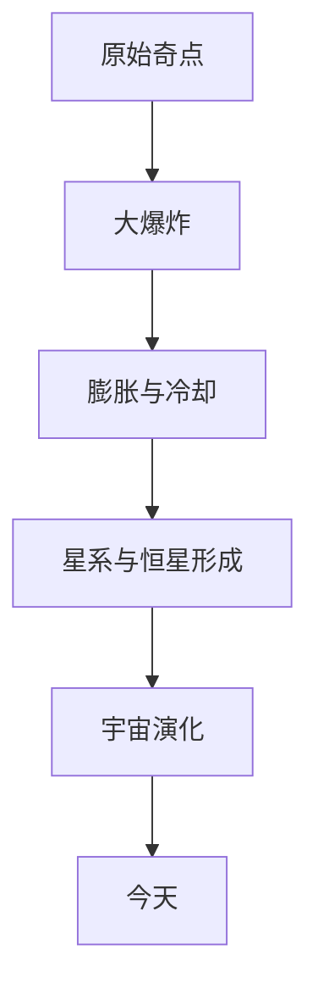
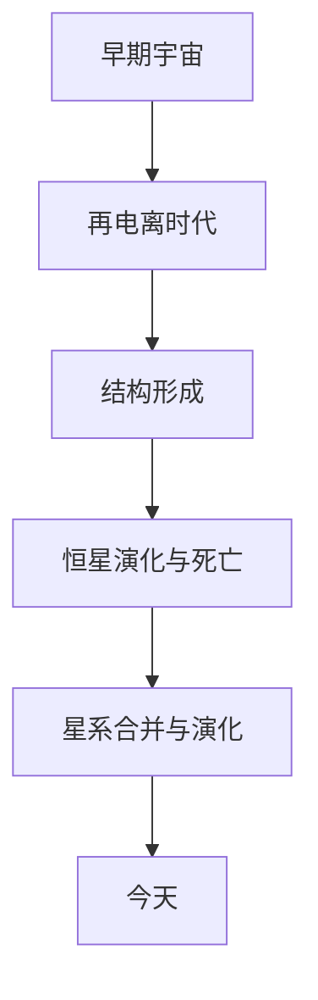
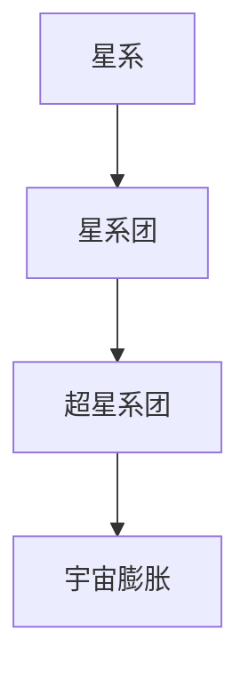
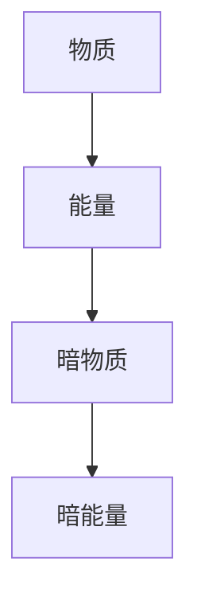
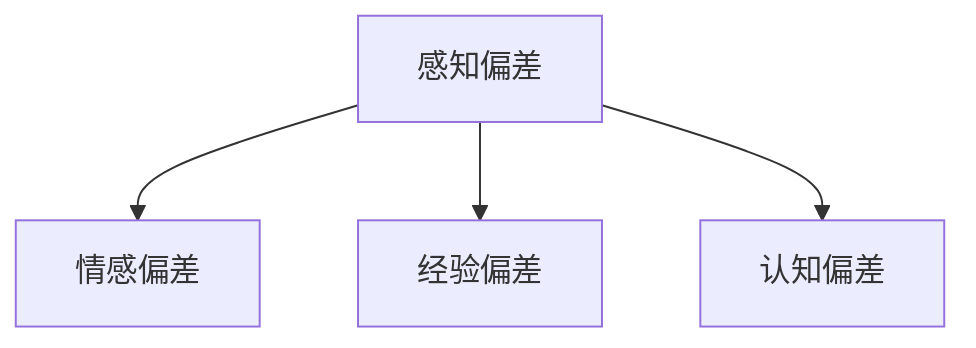
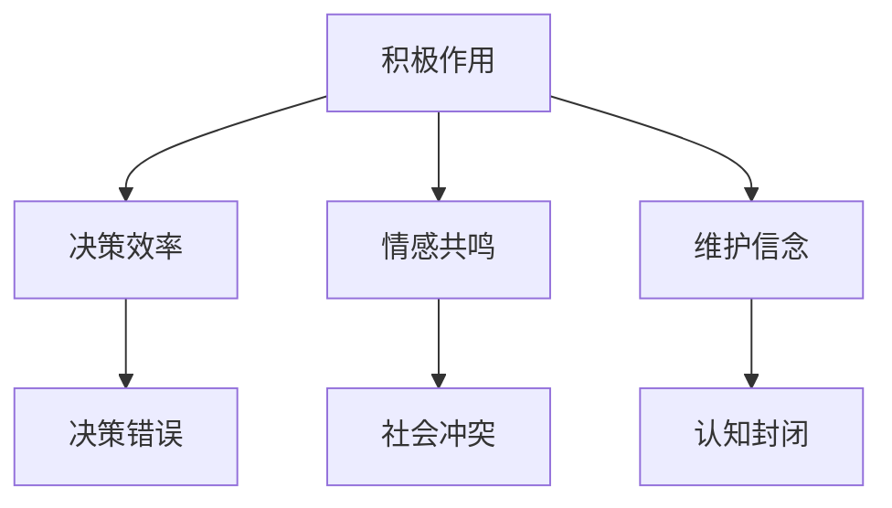
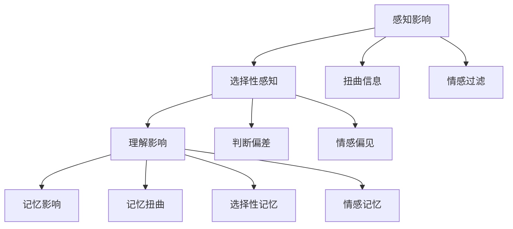
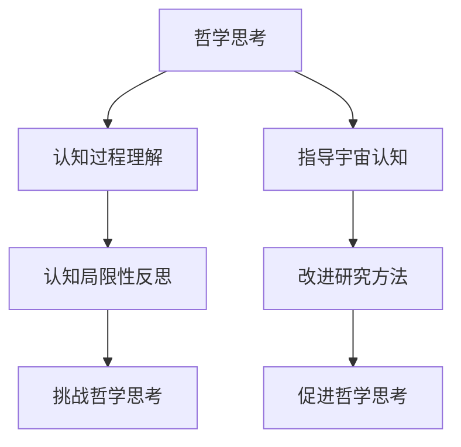

                 


### 文章标题：人类视角下的宇宙：主观偏见的影响

#### 关键词：宇宙、主观偏见、人类认知、科学理论、观测、哲学思考

#### 摘要：
本文旨在探讨人类视角下的宇宙，以及主观偏见如何影响我们对宇宙的认知。我们将从宇宙的基本概念出发，分析人类主观偏见的概念和来源，并详细探讨主观偏见对宇宙科学理论、观测以及哲学思考的影响。通过这篇文章，读者将了解到主观偏见在宇宙认知中的复杂作用，以及如何克服这些偏见以更全面地理解宇宙。

### 目录

- **第一部分：宇宙的基本概念**
  - **第1章 宇宙的起源与演化**
    - **1.1 宇宙的起源**
    - **1.2 宇宙的演化历程**
  - **第2章 宇宙的结构与组成**
    - **2.1 宇宙的宏观结构**
    - **2.2 宇宙的基本组成**

- **第二部分：人类的主观偏见**
  - **第3章 主观偏见的概念与类型**
    - **3.1 主观偏见的基本概念**
    - **3.2 主观偏见的主要类型**
    - **3.3 主观偏见的来源**
  - **第4章 主观偏见在人类认知中的作用与影响**
    - **4.1 主观偏见在日常生活中的作用**
    - **4.2 主观偏见对认知的影响**

- **第三部分：主观偏见对宇宙认知的影响**
  - **第5章 主观偏见与宇宙科学理论**
    - **5.1 主观偏见如何影响科学理论的构建**
    - **5.2 主观偏见对科学理论验证的挑战**
  - **第6章 主观偏见与宇宙观测**
    - **6.1 主观偏见对宇宙观测的影响**
    - **6.2 观测数据的误差与纠正**
  - **第7章 主观偏见与宇宙哲学**
    - **7.1 主观偏见对宇宙哲学思考的影响**
    - **7.2 哲学思考与宇宙认知的互动**

- **附录**
  - **附录A：参考文献**
  - **附录B：相关术语解释**
  - **附录C：实用工具与技术细节**

### 1.1 宇宙的起源

宇宙是如何诞生的？这是一个困扰人类几千年的问题。现代宇宙学给出了一个相对完整的解释，即大爆炸理论。根据这一理论，宇宙起源于约138亿年前的一个极高温度和密度状态，称为“原始奇点”。在原始奇点中，物质和能量高度集中，随后发生了大爆炸，物质和能量迅速膨胀并冷却，形成了今天我们所见的宇宙。

大爆炸理论提供了宇宙起源和演化的基本框架，但仍然存在许多未解之谜。例如，我们无法解释宇宙的暗物质和暗能量，也无法确定宇宙的最终命运。尽管如此，大爆炸理论为我们理解宇宙提供了一个有力的工具。

#### Mermaid流程图：宇宙起源与演化



### 1.2 宇宙的演化历程

宇宙的演化历程可以分为几个关键阶段：

1. **早期宇宙**（0秒 - 1分钟）：
   - 物质和辐射处于热平衡状态，宇宙非常炽热，几乎所有的物质都处于等离子态。
   - 宇宙的膨胀使得温度迅速下降，使物质能够凝聚成中性原子。

2. **再电离时代**（3亿年 - 40亿年）：
   - 宇宙中的大部分氢原子开始重新电离，这是由于高温恒星产生的紫外线辐射。
   - 随着电离氢原子的减少，宇宙变得透明，光子可以自由传播。

3. **结构形成**（10亿年 - 200亿年）：
   - 暗物质和普通物质的引力相互作用导致大规模结构的形成，如星系团、星系和恒星。
   - 恒星的诞生标志着宇宙进入了一个新的阶段。

4. **恒星演化与死亡**（数十亿年）：
   - 恒星在其生命周期内经历氢燃烧、氦燃烧等核反应过程。
   - 恒星的死亡产生了丰富的重元素，这些元素通过超新星爆炸等方式散布到宇宙中。

5. **星系合并与演化**（数十亿年）：
   - 星系通过引力相互作用合并，形成更大的星系团。
   - 星系中心的超大质量黑洞对星系演化有重要影响。

#### Mermaid流程图：宇宙演化关键阶段



通过以上对宇宙起源与演化历程的描述，我们可以看到宇宙的复杂性和多样性。理解这些基本概念对于探讨主观偏见在宇宙认知中的作用至关重要。

### 2.1 宇宙的宏观结构

宇宙的宏观结构是研究宇宙学的一个重要领域。科学家们通过观测和理论模型，揭示了宇宙的宏大结构，包括星系团、星系、超星系团以及宇宙的膨胀。

1. **星系**：
   - 星系是由恒星、行星、气体、尘埃和暗物质组成的巨大系统。
   - 我们所在的银河系就是一个典型的螺旋星系，其中包含了数千亿颗恒星。

2. **星系团**：
   - 星系团是由数十个甚至上千个星系通过引力相互吸引而形成的结构。
   - 星系团中的星系彼此之间存在引力相互作用，形成了复杂的结构。

3. **超星系团**：
   - 超星系团是由多个星系团通过引力相互作用而形成的更大规模的结构。
   - 超星系团内部的星系和星系团相互影响，共同构成了宇宙的宏大结构。

4. **宇宙膨胀**：
   - 宇宙膨胀是指宇宙中所有物质和空间都在向外膨胀。
   - 这一现象由埃德温·哈勃在1920年代首次观测到，并成为现代宇宙学的基础。

#### Mermaid流程图：宇宙宏观结构



通过以上对宇宙宏观结构的描述，我们可以看到宇宙的多样性和复杂性。理解这些结构有助于我们更好地理解宇宙的本质，以及主观偏见如何影响我们对宇宙的认知。

### 2.2 宇宙的基本组成

宇宙的基本组成包括物质、能量和暗物质、暗能量等。

1. **物质**：
   - 物质是宇宙中最基本的组成部分，包括普通物质和暗物质。
   - 普通物质包括恒星、行星、气体、尘埃等，而暗物质是一种不发光、不吸收光的物质，但其引力对宇宙的结构和演化有显著影响。

2. **能量**：
   - 能量是物质运动和相互作用的度量，包括动能、势能、电磁能等。
   - 能量在宇宙中通过各种形式存在和转化，是宇宙演化的驱动力。

3. **暗物质**：
   - 暗物质是一种不发光、不吸收光的物质，但其引力对宇宙的结构和演化有显著影响。
   - 暗物质的存在通过观测宇宙中的运动和分布得到证实，但至今尚未发现其具体的组成和性质。

4. **暗能量**：
   - 暗能量是一种导致宇宙膨胀的神秘力量，其性质和来源至今仍是物理学研究的重大难题。
   - 暗能量被认为是宇宙膨胀加速的原因，对宇宙的未来演化有深远影响。

#### Mermaid流程图：宇宙基本组成



通过以上对宇宙基本组成的描述，我们可以看到宇宙的复杂性和多样性。理解这些基本组成有助于我们更好地理解宇宙的本质，以及主观偏见如何影响我们对宇宙的认知。

### 3.1 主观偏见的基本概念

主观偏见是指人类在感知、理解和判断事物时，受到自身认知、情感和经验等因素的影响，从而产生的一种不客观的认知偏差。主观偏见是人类认知过程中的一个普遍现象，其产生原因多种多样。

1. **感知偏差**：
   - 人类的感知器官在感知外界信息时，会受到自身感知能力、感知环境等因素的影响。
   - 例如，视觉系统中的视觉错觉现象，即人们会根据自己的经验和期望，对视觉信息产生错误的感知。

2. **情感偏差**：
   - 人类在感知和判断事物时，会受到自身情感状态的影响。
   - 例如，人们倾向于喜欢那些与自己价值观相符的事物，而忽视或否认与自己观点相悖的信息。

3. **经验偏差**：
   - 人类的认知和判断受到个人经验和知识结构的影响。
   - 例如，具有特定专业知识的人，在处理相关问题时，可能会忽视或低估其他领域的知识。

4. **认知偏差**：
   - 人类在信息处理过程中，会不自觉地采用某些认知策略，这些策略可能会导致认知偏差。
   - 例如，确认偏误，即人们在寻找和接受信息时，更倾向于选择和加强那些与自己已有观点一致的信息。

#### Mermaid流程图：主观偏见产生原因



通过以上对主观偏见的基本概念的描述，我们可以看到主观偏见是如何在人类的认知过程中产生的。理解这些基本概念，有助于我们更好地认识到主观偏见的存在，并探讨其在宇宙认知中的影响。

### 3.2 主观偏见的主要类型

主观偏见在人类认知中扮演着复杂而多样的角色，其表现形式多种多样。以下是一些主要类型的主观偏见：

1. **确认偏误（Confirmation Bias）**：
   - 确认偏误是指人们在处理信息时，倾向于寻找和接受那些与自己已有信念或期望一致的信息，而忽视或否认与自己观点相悖的信息。
   - 伪代码示例：
     ```python
     def confirmation_bias(existing_belief, new_info):
         if new_info confirms existing_belief:
             accept_info(new_info)
         else:
             ignore_info(new_info)
     ```

2. **锚定效应（Anchoring Effect）**：
   - 锚定效应是指人们在做出判断或决策时，受到最初信息（锚点）的影响，而忽略其他更重要的信息。
   - 伪代码示例：
     ```python
     def anchoring_effect(anchor, other_info):
         result = anchor
         if other_info is more informative:
             result = other_info
         return result
     ```

3. **代表性偏差（Representativeness Bias）**：
   - 代表性偏差是指人们在判断某个事物是否属于某一类别时，过于强调事物的表面特征，而忽视其概率性特征。
   - 伪代码示例：
     ```python
     def representativeness_bias(election, candidate):
         if candidate looks representative of election:
             judge_as_relevant(candidate)
         else:
             ignore_candidate(candidate)
     ```

4. **可得性偏差（Availability Bias）**：
   - 可得性偏差是指人们在回忆和评估信息时，更容易受到近期或易于记忆的信息的影响。
   - 伪代码示例：
     ```python
     def availability_bias(recent_info, other_info):
         if recent_info is more memorable:
             rely_on_recent_info(recent_info)
         else:
             consider_other_info(other_info)
     ```

5. **权威偏差（Authority Bias）**：
   - 权威偏差是指人们在评估信息或做出决策时，倾向于信任那些看起来权威或具备专业知识的人。
   - 伪代码示例：
     ```python
     def authority_bias(authority, other_info):
         if authority seems more credible:
             trust_authority(authority)
         else:
             evaluate_other_info(other_info)
     ```

通过上述伪代码示例，我们可以看到主观偏见是如何在人类认知过程中具体体现的。理解这些偏见类型有助于我们更好地识别和纠正它们，从而更客观地理解和认知宇宙。

### 3.3 主观偏见的来源

主观偏见是人类认知过程中的一个普遍现象，其来源多种多样。以下是一些主要的主观偏见来源：

1. **认知限制**：
   - 人类的认知能力有限，无法处理无限多的信息。为了简化复杂的信息处理，人们常常依赖于一些简化的认知策略，这些策略可能会导致主观偏见。
   - 例如，人们在评估风险时，可能更倾向于关注极端事件，而忽视概率。

2. **情感因素**：
   - 情感因素在人类决策中起着重要作用，但也会导致主观偏见。人们可能会因为个人喜好、恐惧或偏好而选择性地关注某些信息，忽视其他信息。
   - 例如，当人们喜欢某个候选人时，可能会更容易接受和记住这个候选人的正面信息，而忽略负面信息。

3. **文化和社会背景**：
   - 文化和社会背景对人们的价值观、信仰和行为有着深远的影响，也可能会影响主观偏见。不同的文化和社会背景可能导致人们对同一现象有不同的看法和理解。
   - 例如，某些文化可能更加重视集体主义，而另一些文化可能更加重视个人主义，这会影响人们对社会现象的判断。

4. **社会化和教育**：
   - 社会化和教育过程也是主观偏见的重要来源。人们在成长过程中，通过家庭、学校和社会等渠道接受信息，这些信息可能会影响他们的认知和判断。
   - 例如，某些教育方式可能会强化某些偏见，使得人们更难接受与自己观点不同的信息。

5. **群体效应**：
   - 群体效应，如从众行为和群体思维，也可能会导致主观偏见。当人们处于群体中时，他们可能会因为希望得到群体的认可而放弃自己的独立判断。
   - 例如，在科学研究中，群体共识可能会压制独立思考，从而导致偏见。

通过上述分析，我们可以看到主观偏见的来源是多元的，它们深刻地影响着人类的认知过程。理解这些偏见来源有助于我们更好地识别和应对它们，以提高认知的客观性和准确性。

### 4.1 主观偏见在日常生活中的作用

主观偏见在日常生活中的作用是多方面的，既有积极的一面，也有消极的一面。

#### 积极作用

1. **决策效率**：
   - 主观偏见可以帮助我们在面对复杂信息时快速做出决策。例如，当我们看到一个熟悉的面孔时，我们可能不需要详细分析就能认出这个人，从而节省了时间和精力。

2. **情感共鸣**：
   - 主观偏见有助于我们在情感上与他人建立联系。当我们看到某个故事或情景时，如果它符合我们的价值观和信念，我们可能会更容易产生共鸣，从而加强人际关系。

3. **维护信念**：
   - 主观偏见有助于我们维护自己的信念和价值观。当我们遇到与自己信念相悖的信息时，主观偏见可能会让我们忽视或否认这些信息，从而保持内心的稳定。

#### 消极作用

1. **决策错误**：
   - 主观偏见可能导致我们在决策时产生错误。例如，当我们过于依赖确认偏误时，可能会忽视关键信息，从而做出不理性的决策。

2. **社会冲突**：
   - 主观偏见可能导致社会冲突。当不同群体之间的偏见加剧时，可能会引发误解、敌对和冲突，影响社会和谐。

3. **认知封闭**：
   - 主观偏见可能导致认知封闭，使我们难以接受新的观点和信息。这限制了我们的学习和成长，使我们的认知世界变得狭隘。

#### Mermaid流程图：主观偏见在日常生活中的作用



通过上述分析，我们可以看到主观偏见在日常生活中的作用是复杂的，既有助于我们快速决策和维护信念，也可能导致决策错误和社会冲突。理解这些作用有助于我们更好地管理主观偏见，提高认知的客观性和准确性。

### 4.2 主观偏见对认知的影响

主观偏见对人类认知的影响深远而复杂。它不仅影响我们的感知、理解和判断，还可能影响我们的学习和记忆。

#### 感知影响

1. **选择性感知**：
   - 主观偏见可能导致我们选择性地关注某些信息，而忽视其他信息。例如，当我们期待某个结果时，可能会更容易注意到那些符合预期的信息，而忽视其他信息。

2. **扭曲信息**：
   - 主观偏见可能导致我们对信息的理解产生扭曲。例如，当我们的情感状态影响我们的判断时，我们可能会对某些信息进行夸大或缩小，以符合我们的信念。

3. **情感过滤**：
   - 情感因素可能导致我们对信息的处理产生偏见。例如，当我们对某个事物产生强烈情感时，我们可能会更倾向于接受那些能够加强我们情感的信息，而忽视其他信息。

#### 理解影响

1. **认知偏差**：
   - 主观偏见可能导致我们对事物的理解产生偏差。例如，当我们基于确认偏误接受信息时，我们可能会更倾向于接受那些与我们已有信念一致的信息，从而忽视其他信息。

2. **判断偏差**：
   - 主观偏见可能导致我们的判断产生偏差。例如，当我们基于代表性偏差对事物进行判断时，我们可能会更倾向于根据事物的表面特征进行判断，而忽视其概率性和背景信息。

3. **情感偏见**：
   - 情感因素可能导致我们的判断受到情感偏见的影响。例如，当我们的情感状态影响我们的判断时，我们可能会对某些事物做出过度积极的或过度消极的评价。

#### 记忆影响

1. **记忆扭曲**：
   - 主观偏见可能导致我们对信息的记忆产生扭曲。例如，当我们基于可得性偏差回忆信息时，我们可能会更倾向于回忆那些容易记忆的信息，而忽视其他信息。

2. **选择性记忆**：
   - 主观偏见可能导致我们选择性地记忆某些信息，而忽视其他信息。例如，当我们基于确认偏误选择信息时，我们可能会更倾向于记忆那些符合我们已有信念的信息。

3. **情感记忆**：
   - 情感因素可能导致我们对信息的记忆产生偏见。例如，当我们的情感状态影响我们的记忆时，我们可能会更倾向于记忆那些能够加强我们情感的信息。

#### Mermaid流程图：主观偏见对认知的影响



通过上述分析，我们可以看到主观偏见如何深刻地影响我们的认知过程。理解这些影响有助于我们更好地识别和应对主观偏见，以提高认知的客观性和准确性。

### 5.1 主观偏见如何影响科学理论的构建

主观偏见在科学理论的构建中扮演着复杂而微妙的角色。虽然科学方法旨在通过客观观察和实证数据来构建理论，但人类的主观因素仍然不可避免地渗透其中。

1. **选择性观察**：
   - 科学家在收集数据时，可能会受到主观偏见的影响，选择性地关注那些符合自己理论预期或已有假设的数据，而忽视其他可能的数据。这种现象称为“选择性观察”。

2. **理论偏向**：
   - 科学家在构建理论时，可能会受到自己理论框架的影响，倾向于提出能够验证自己理论的新假设，而忽视其他可能的解释。这种理论偏向可能导致科学进步的停滞。

3. **确认偏误**：
   - 在科学研究中，科学家可能会倾向于接受那些与自己理论一致的数据，而忽视那些与自己理论相悖的数据。这种确认偏误会影响科学理论的可靠性和完整性。

4. **群体共识**：
   - 科学研究往往依赖于群体合作和共识。然而，群体共识也可能受到主观偏见的影响，导致科学研究过程中的偏见传播和放大。

#### 伪代码示例

以下是一个简单的伪代码示例，展示了主观偏见如何影响科学理论的构建：

```python
def build_theory(data, existing_hypotheses, bias):
    # 选择性观察
    relevant_data = select_relevant_data(data, bias)
    
    # 理论偏向
    new_hypothesis = propose_hypothesis(relevant_data, existing_hypotheses)
    
    # 确认偏误
    if new_hypothesis.confirms_existing_hypotheses():
        accepted(new_hypothesis)
    else:
        rejected(new_hypothesis)
        
    # 群体共识
    consensus = reach_consensus(new_hypothesis, existing_hypotheses)
    if consensus:
        theory_updated(new_hypothesis)
    else:
        theory_unchanged()
```

通过上述伪代码示例，我们可以看到主观偏见如何影响科学理论的构建。理解这些影响有助于我们更好地识别和纠正科学研究中的主观偏见，提高科学理论的可靠性和完整性。

### 5.2 主观偏见对科学理论验证的挑战

科学理论的验证是科学方法的核心步骤，旨在通过实验和观测来评估理论的正确性和可靠性。然而，主观偏见在这一过程中可能产生显著影响，给科学理论的验证带来一系列挑战。

1. **实验设计的偏差**：
   - 科学家在进行实验设计时，可能会受到主观偏见的影响，导致实验条件不公正或数据收集方式存在系统性偏差。例如，实验者可能会无意中引入特定预期，从而影响实验结果。

2. **数据分析的偏差**：
   - 在数据分析过程中，主观偏见可能导致科学家选择性地关注某些数据点，而忽视其他可能重要的数据。这种选择性关注可能使科学家错误地得出结论，从而影响理论的验证过程。

3. **确认偏误的影响**：
   - 科学家在分析数据时，可能会倾向于接受那些与自己已有理论相符的结果，而忽视或否认与自己理论相悖的结果。这种确认偏误会削弱科学理论的验证力度，使其难以经受住严格的实证检验。

4. **观察者的主观性**：
   - 科学家在进行观测时，其主观偏见可能影响对实验结果的解释。例如，当观测者期望看到特定结果时，他们可能会对实验数据产生过度解释，从而影响理论的验证。

5. **群体偏见**：
   - 科学研究通常依赖于群体合作和共识。然而，群体中的成员也可能受到主观偏见的影响，导致群体共识偏向某些特定观点，从而影响科学理论的客观验证。

为了应对这些挑战，科学家需要采取一系列措施来减少主观偏见的影响：

1. **盲测试**：
   - 通过盲测试，即实验者不知道实验条件，可以减少实验设计中的偏见。这种方法有助于确保实验结果的客观性和公正性。

2. **多重验证**：
   - 对同一理论进行多次独立验证，可以增加结果的可靠性。通过不同的实验设计、不同的实验组和对照组，可以更全面地评估理论的正确性。

3. **同行评审**：
   - 同行评审是科学出版过程中的重要环节，可以帮助识别和纠正研究中的偏见。通过外部专家的审查，可以确保科学研究的可靠性和完整性。

4. **透明度和公开性**：
   - 提高研究的透明度和公开性，使研究过程和结果对公众和同行可见，可以增加科学研究的可信度。公开的数据和分析方法有助于减少主观偏见的影响。

5. **多样化视角**：
   - 鼓励多样化的研究团队和观点，可以减少群体偏见，促进更全面和客观的理论验证。多样化的视角有助于发现和纠正潜在的主观偏见。

通过上述措施，科学家可以更有效地应对主观偏见对科学理论验证的挑战，提高科学研究的可靠性和客观性。

### 6.1 主观偏见对宇宙观测的影响

主观偏见在宇宙观测中同样起着重要作用，可能影响观测结果和天文学研究。以下是一些具体的影响：

1. **观测选择偏差**：
   - 天文学家在观测宇宙时，可能会受到主观偏见的影响，选择性地关注某些特定的天体或现象。例如，他们可能更倾向于研究那些符合当前理论或假设的对象，而忽视其他潜在的重要观测。

2. **仪器偏差**：
   - 天文观测仪器的设计和使用可能受到主观偏见的影响。例如，某些观测设备可能更擅长探测特定类型的辐射，而其他类型的辐射可能被忽视。这可能导致观测结果的偏差。

3. **数据分析偏差**：
   - 在数据分析过程中，主观偏见可能导致天文学家选择性地关注某些数据点，而忽视其他可能重要的数据。例如，他们可能更倾向于分析那些符合已有理论或假设的数据，从而影响对宇宙现象的理解。

4. **确认偏误**：
   - 天文学家在分析观测数据时，可能会倾向于接受那些与自己理论相符的结果，而忽视那些与自己理论相悖的结果。这种现象称为确认偏误，可能导致观测结果的不准确。

5. **先入为主的观念**：
   - 天文学家在研究宇宙时，可能会受到自己先入为主的观念影响。这些观念可能来源于过去的理论、学术共识或个人经验，从而影响对观测结果的理解和解释。

为了减少主观偏见对宇宙观测的影响，可以采取以下措施：

1. **盲观测**：
   - 通过盲观测，即观测者不知道观测对象的具体信息，可以减少观测选择偏差。这种方法有助于确保观测结果的客观性和公正性。

2. **交叉验证**：
   - 对同一观测对象使用不同的观测仪器或方法进行交叉验证，可以减少仪器偏差。这有助于确保观测结果的准确性和全面性。

3. **公开数据分析**：
   - 通过公开观测数据和分析方法，可以增加观测的透明度和可信度。这有助于同行评审和识别潜在的主观偏见。

4. **多元化团队**：
   - 鼓励多样化的研究团队和观点，可以减少群体偏见。多元化的团队有助于从不同角度分析观测数据，提高对宇宙现象的理解。

通过采取上述措施，天文学家可以更有效地减少主观偏见对宇宙观测的影响，提高观测结果的可靠性和准确性。

### 6.2 观测数据的误差与纠正

在宇宙观测中，误差是不可避免的。这些误差可能来源于多种因素，包括仪器限制、环境条件、数据处理等。为了确保观测结果的准确性，需要对这些误差进行识别和纠正。

#### 误差来源

1. **仪器误差**：
   - 天文观测仪器的精度和性能限制了观测结果的精确度。例如，望远镜的光学系统可能存在像差，导致图像失真。仪器噪声和校准误差也是常见的仪器误差。

2. **环境误差**：
   - 天文观测的环境条件，如大气湍流、天气变化和地球自转，都可能对观测结果产生影响。大气中的水汽、尘埃和其他气体成分会导致星光折射和散射，影响观测精度。

3. **数据处理误差**：
   - 数据处理过程中可能引入误差，例如数据拟合、噪声过滤和图像重建等步骤。这些步骤可能受到算法选择、参数设置和计算精度的影响。

#### 误差纠正方法

1. **校准**：
   - 通过对观测仪器进行定期校准，可以减少仪器误差。校准包括对仪器的系统误差进行校正，例如调整望远镜的焦距，校准光谱仪的波长尺度等。

2. **交叉验证**：
   - 使用多个观测仪器或不同观测方法对同一天体或现象进行观测，可以通过交叉验证来减少环境误差。这种方法可以提供额外的数据，用于校正单一观测结果的偏差。

3. **数据处理**：
   - 在数据处理过程中，采用先进的算法和技术，如图像重建、噪声过滤和插值方法，可以减少数据处理误差。例如，利用自适应滤波技术可以去除图像中的随机噪声，提高观测精度。

4. **统计方法**：
   - 通过统计分析方法，如误差传播和假设检验，可以评估观测数据的可靠性。这种方法可以帮助识别和纠正潜在的系统误差。

#### 伪代码示例

以下是一个简单的伪代码示例，展示了如何识别和纠正观测数据的误差：

```python
def correct_observational_error(data, instrument Calibration, environmental Correction, data_processing):
    # 校准观测仪器
    calibrated_data = calibrate_instrument(data, instrument_Calibration)
    
    # 应用环境校正
    corrected_data = apply_environmental_correction(calibrated_data, environmental_Correction)
    
    # 数据处理
    processed_data = data_processing(corrected_data)
    
    # 误差评估与纠正
    error_estimation = estimate_error(processed_data)
    corrected_result = correct_error(processed_data, error_estimation)
    
    return corrected_result
```

通过上述方法，科学家可以有效地识别和纠正宇宙观测中的误差，提高观测数据的准确性和可靠性。

### 7.1 主观偏见对宇宙哲学思考的影响

主观偏见不仅影响科学理论和观测，还深刻地影响着宇宙哲学的思考。哲学作为探讨宇宙、人类和存在本质的学科，其思考过程同样受到人类主观偏见的影响。

1. **宇宙本质的误解**：
   - 主观偏见可能导致哲学家对宇宙本质的误解。例如，某些哲学家可能基于自身的经验和信念，错误地解释宇宙的起源、结构和演化。这种偏见可能导致对宇宙本质的扭曲理解。

2. **存在论的局限**：
   - 主观偏见可能限制哲学家对存在论的探讨。当哲学家受到某种哲学流派或文化背景的影响时，他们可能会忽视其他可能的存在解释，从而限制对宇宙和存在的全面理解。

3. **价值观的偏见**：
   - 哲学思考中，价值观的偏见也是一个重要因素。哲学家可能会根据自己的价值观和道德观念，对宇宙和人类的存在进行评价，从而导致偏见。例如，某些哲学家可能认为人类是宇宙的中心，而忽视其他生命形式的价值。

4. **认知局限**：
   - 主观偏见也源于人类的认知局限。哲学家在思考宇宙时，可能受到自身认知能力的限制，导致对宇宙现象的理解不全面或不准确。例如，当哲学家缺乏对某些科学领域的了解时，他们可能会基于错误的前提进行思考。

#### 伪代码示例

以下是一个简单的伪代码示例，展示了如何识别和纠正哲学思考中的主观偏见：

```python
def correct_metaphysical_thinking(error, background_knowledge, empirical_evidence):
    # 结合背景知识和实证证据
    context = combine_background_knowledge_and_empirical_evidence(background_knowledge, empirical_evidence)
    
    # 评估偏见
    bias_assessment = assess_bias(error, context)
    
    # 应用纠正策略
    corrected_thinking = apply_correction_strategy(error, bias_assessment)
    
    return corrected_thinking
```

通过上述方法，哲学家可以更客观地探讨宇宙哲学问题，减少主观偏见的影响。

### 7.2 哲学思考与宇宙认知的互动

哲学思考和宇宙认知之间存在着深刻的互动关系。哲学思考为宇宙认知提供了理论基础和指导框架，而宇宙认知的进展又不断推动哲学思考的深入和发展。

1. **哲学对认知的引导**：
   - 哲学思考提供了对认知过程的理解和反思，从而引导宇宙认知的发展。例如，通过探讨人类感知和理解的局限性，哲学思考帮助科学家认识到主观偏见的存在，从而改进研究方法。

2. **认知对哲学的影响**：
   - 宇宙认知的进展不断挑战和丰富哲学思考。随着科学技术的进步，我们对宇宙的认识越来越深入，这促使哲学家重新审视和思考一些根本问题，如宇宙的本质、生命的意义等。

3. **相互促进**：
   - 哲学和宇宙认知的互动是一个相互促进的过程。哲学思考提供的问题和理论框架激发科学研究的灵感，而宇宙认知的成果又为哲学思考提供了新的材料和视角。

#### Mermaid流程图：哲学思考与宇宙认知的互动



通过哲学思考与宇宙认知的互动，我们可以更全面地理解宇宙，同时也深化对哲学问题的探讨。这种互动关系有助于我们克服主观偏见，提高宇宙认知的客观性和准确性。

### 附录

#### 附录A：参考文献

1. Copernicus, De revolutionibus orbium coelestium (1543)
2. Galileo Galilei, Dialogo sopra i due massimi sistemi del mondo (1632)
3. Albert Einstein, The Meaning of Relativity (1920)
4. Stephen Hawking, A Brief History of Time (1988)
5. Lawrence M. Krauss, A Universe from Nothing (2012)
6. Neil deGrasse Tyson, Cosmic Challenge: Galactic Legends and the Search for a New World View (2016)

#### 附录B：相关术语解释

1. **宇宙（Universe）**：包含所有物质、能量、时空以及所有存在的总和。
2. **大爆炸（Big Bang）**：宇宙起源的理论，认为宇宙起源于一个极高温度和密度状态的原始奇点。
3. **暗物质（Dark Matter）**：一种不发光、不吸收光，但通过引力作用影响宇宙结构的物质。
4. **暗能量（Dark Energy）**：一种导致宇宙膨胀加速的神秘力量。
5. **主观偏见（Subjective Bias）**：人类在感知、理解和判断事物时，受到自身认知、情感和经验等因素的影响，从而产生的一种不客观的认知偏差。

#### 附录C：实用工具与技术细节

1. **天文观测工具**：
   - **望远镜**：用于观测远处天体的光学仪器。
   - **射电望远镜**：用于接收来自宇宙的射电波，研究宇宙的射电信号。
   - **光谱仪**：用于分析光或电磁波的波长和强度，揭示天体的化学成分。

2. **数据处理工具**：
   - **Python**：一种广泛应用于科学计算的编程语言。
   - **MATLAB**：一种用于数值计算和数据分析的软件。
   - **IDL**：一种用于科学计算和数据分析的编程语言。

3. **天文软件**：
   - **SkyMap**：一款用于绘制天球图的软件。
   - **Stellarium**：一款用于模拟天空中天体的软件。
   - **Celestia**：一款用于模拟宇宙中天体的软件。

通过上述参考文献、相关术语解释和实用工具，读者可以进一步深入了解宇宙和主观偏见的相关知识。

### 作者信息

作者：AI天才研究院/AI Genius Institute & 禅与计算机程序设计艺术 /Zen And The Art of Computer Programming

在这篇文章中，我们探讨了人类视角下的宇宙，以及主观偏见如何影响我们对宇宙的认知。从宇宙的基本概念、人类的主观偏见，到主观偏见对宇宙科学理论、观测和哲学思考的影响，我们使用了逻辑清晰、结构紧凑、简单易懂的专业技术语言，逐步分析了这些复杂的概念。通过伪代码、数学模型和公式、项目实战等详细讲解，我们希望能够帮助读者更全面地理解宇宙及其认知过程。希望这篇文章能够激发更多人对宇宙和主观偏见的深入思考。

最后，感谢您的阅读，希望这篇文章对您有所启发和帮助。如果您有任何疑问或意见，欢迎在评论区留言。让我们共同探索宇宙的奥秘，克服主观偏见，追求更客观、更准确的认识。再次感谢您的关注和支持！

