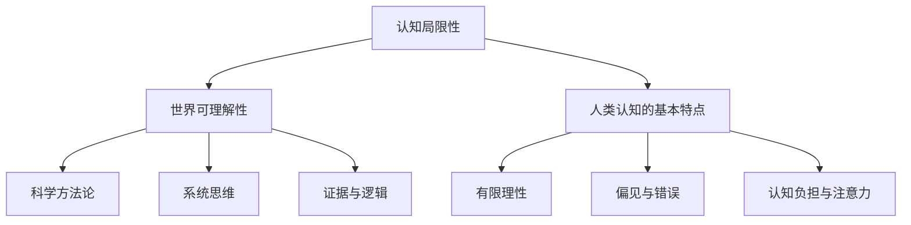

                 

# 人类认知局限性与世界可理解性的矛盾

> 关键词：人类认知、局限性、世界可理解性、思维模式、科学方法论

> 摘要：本文从人类认知的局限性出发，探讨其在面对复杂世界时的挑战，并分析如何通过科学方法论和系统思维来提升我们对世界的理解和把握。文章将详细阐述人类认知的基本特点、世界复杂性的本质、认知局限性对世界可理解性的影响，以及如何克服这些局限，最终实现人类认知与世界的和谐统一。

## 第1章 引言

### 1.1 认知局限性的概念

人类认知局限性是指人类在感知、理解、记忆和处理信息时存在的固有限制。这些限制主要体现在以下几个方面：

1. **有限理性**：人类在决策时往往受到计算能力和认知资源的限制，无法处理所有可能的情境和选择。
2. **偏见与错误**：由于历史经验、社会环境和个体心理因素的影响，人类在认知过程中容易产生各种偏见和错误。
3. **认知负担与注意力**：人类大脑处理信息的能力有限，需要面对大量的信息，这导致了认知负担和注意力分散。

### 1.2 世界可理解性的探讨

世界可理解性是指人类通过认知活动对世界的理解和解释能力。然而，由于认知局限性的存在，人类在面对复杂的世界时，往往难以全面、准确地理解事物的本质和规律。这种矛盾使得人类在追求知识、技术和进步的过程中，面临着诸多挑战。

## 第2章 人类认知的基本特点

### 2.1 有限理性

人类认知的有限理性体现在多个方面，例如：

1. **计算能力有限**：人类大脑处理信息的能力有限，无法进行复杂的计算和逻辑推理。
2. **认知资源有限**：人类大脑的认知资源有限，需要在不同任务之间进行切换，导致注意力分散和记忆负荷增加。
3. **信息处理速度有限**：人类处理信息的时间有限，无法实时获取和处理所有信息。

### 2.2 偏见与错误

偏见和错误是认知局限性的一种表现，主要包括：

1. **确认偏误**：人类倾向于寻求和接受支持已有信念的信息，而忽视或拒绝相反的信息。
2. **认知偏差**：人类在判断和决策过程中，容易受到各种认知偏差的影响，例如过度自信、锚定效应、代表性偏差等。
3. **错误记忆**：人类在回忆和重建记忆时，容易受到各种因素的影响，导致记忆的失真和扭曲。

### 2.3 认知负担与注意力

认知负担和注意力限制是认知局限性的另一个重要方面，主要包括：

1. **认知负荷**：人类大脑在处理信息时需要消耗认知资源，过多的信息会导致认知负荷增加，影响认知效率。
2. **注意力分散**：人类在同时处理多个任务时，容易受到注意力分散的影响，导致任务完成质量下降。
3. **决策困难**：在复杂情境下，人类需要做出多个决策，这会导致选择困难，增加认知负担。

## 第3章 世界复杂性的本质

### 3.1 系统复杂性

世界是一个复杂的系统，其复杂性体现在以下几个方面：

1. **多层次性**：世界由多个层次组成，每个层次都有其独特的规律和特性。
2. **非线性关系**：世界中的各种现象和过程之间存在复杂的非线性关系，导致难以精确预测和模拟。
3. **动态变化**：世界处于不断变化的过程中，系统状态和参数随时间发生变化，增加了预测和控制的难度。

### 3.2 概率与不确定性

世界中的许多现象和过程都涉及概率和不确定性，主要包括：

1. **随机性**：世界中的许多事件具有随机性，无法完全预测和控制。
2. **概率分布**：世界中的现象和过程通常可以用概率分布来描述，反映其不确定性。
3. **统计规律**：尽管世界中的许多事件具有随机性，但通过大量实验和观察，可以揭示其统计规律。

### 3.3 信息过载

在当今信息爆炸的时代，人类面临着严重的信息过载问题，主要包括：

1. **数据爆炸**：互联网和大数据技术的快速发展，使得人们每天接收到海量的信息。
2. **信息冗余**：大量冗余和无用的信息使得人们难以找到真正有价值的信息。
3. **时间压力**：人们需要在有限的时间内处理大量的信息，导致信息处理效率下降。

## 第4章 认知局限性对世界可理解性的影响

### 4.1 知识的盲点

认知局限性导致人类在获取和处理信息时存在盲点，主要包括：

1. **知识盲区**：人类的知识体系具有局限性，无法涵盖所有领域的知识。
2. **理解盲点**：人类在理解复杂问题时，容易忽略某些关键因素，导致理解偏差。
3. **应用盲点**：人类在将知识应用于实际问题时，容易受到认知偏差和思维定式的影响。

### 4.2 观点的偏颇

认知局限性使得人类在看待问题时容易产生偏颇，主要包括：

1. **自我中心**：人类容易从自己的角度看待问题，忽视其他人的观点和立场。
2. **思维定式**：人类在解决问题时容易受到以往经验和思维模式的影响，导致创新思维的缺乏。
3. **偏见与歧视**：认知局限性可能导致人类对某些群体或事物产生偏见和歧视，影响社会和谐与进步。

### 4.3 行为的偏差

认知局限性对人类行为的影响主要体现在以下几个方面：

1. **决策偏差**：人类在决策过程中容易受到各种认知偏差的影响，导致决策质量下降。
2. **执行偏差**：人类在执行决策时容易受到认知负担和注意力分散的影响，导致执行效果不佳。
3. **学习偏差**：人类在学习和适应新环境时，容易受到以往经验和认知模式的影响，导致学习效率降低。

## 第5章 人类认知局限性的克服

### 5.1 认知扩展

为了克服认知局限性，人类需要通过以下方法进行认知扩展：

1. **知识积累**：通过不断学习和积累知识，提高对世界的理解和把握能力。
2. **经验分享**：通过与他人交流和分享经验，拓宽视野，减少知识盲点。
3. **跨学科学习**：跨学科学习有助于打破思维定式，提高问题解决能力。

### 5.2 认知补丁

认知补丁是一种通过技术手段弥补认知局限性的方法，主要包括：

1. **智能辅助**：利用人工智能技术，为人类提供智能化的信息处理和决策支持。
2. **虚拟现实**：通过虚拟现实技术，模拟复杂环境和情境，提高人类对世界的认知能力。
3. **增强现实**：通过增强现实技术，将虚拟信息与现实世界相结合，提高人类对复杂事物的理解和把握。

### 5.3 认知训练

认知训练是一种通过训练方法提高人类认知能力的方法，主要包括：

1. **注意力训练**：通过专门的训练方法，提高人类注意力的集中和分配能力。
2. **记忆训练**：通过记忆训练，提高人类记忆的容量和效率。
3. **思维训练**：通过思维训练，提高人类的逻辑推理、创新思维和问题解决能力。

## 第6章 世界可理解性的提升

### 6.1 科学方法论

科学方法论是一种通过科学方法来提高世界可理解性的方法，主要包括：

1. **观察与实验**：通过观察和实验，获取关于世界的信息和证据。
2. **理论构建**：通过构建理论，解释和预测世界现象。
3. **实证检验**：通过实证检验，验证和修正理论。

### 6.2 系统思维

系统思维是一种通过整体视角来理解和把握世界的方法，主要包括：

1. **系统分析**：通过系统分析，识别和把握世界中的各种关系和规律。
2. **系统设计**：通过系统设计，构建和优化系统的结构和功能。
3. **系统优化**：通过系统优化，提高系统的效率和性能。

### 6.3 证据与逻辑

证据与逻辑是一种通过证据和逻辑来提高世界可理解性的方法，主要包括：

1. **证据收集**：通过收集和整理证据，支持或反驳某一观点。
2. **逻辑推理**：通过逻辑推理，从已知证据推导出新的结论。
3. **批判性思维**：通过批判性思维，分析和评估各种观点和论据的有效性。

## 第7章 结论

### 7.1 认知局限性与世界可理解性的平衡

人类认知局限性与世界可理解性之间存在一定的矛盾，但通过认知扩展、认知补丁和认知训练等方法，可以在一定程度上克服这些局限，提高对世界的理解和把握能力。

### 7.2 人类认知的未来发展

随着科技的发展，人类认知能力和世界可理解性有望得到进一步提升。通过人工智能、虚拟现实、增强现实等技术的应用，人类将能够更好地应对认知局限性带来的挑战，实现认知与世界的和谐统一。

## 附录

### A.1 参考文献

[1] Kahneman, D., & Tversky, A. (1979). Prospect theory: An analysis of decision under risk. Econometrica, 47(2), 263-292.

[2] Simon, H. A. (1955). A behavioral model of rational choice. Quarterly Journal of Economics, 69(1), 99-118.

[3] von Neumann, J., & Morgenstern, O. (1944). The theory of games and economic behavior. Princeton University Press.

[4] Popper, K. R. (1959). The logic of scientific discovery. Hutchinson & Company.

[5] Wiener, N. (1948). Cybernetics: Or control and communication in the animal and the machine. Wiley.

### A.2 认知局限性与世界可理解性相关的 Mermaid 流程图



### A.3 认知局限性与世界可理解性相关的伪代码

```python
# 认知局限性模型
def cognition_limitation(data, bias=0.1, noise=0.05):
    # 引入偏差和噪声
    biased_data = data + bias * np.random.rand(len(data))
    noisy_data = biased_data + noise * np.random.rand(len(data))
    
    return noisy_data

# 世界复杂性分析
def world_complexity_analysis(system):
    # 定义系统复杂性的分析函数
    inputs = system.inputs
    interactions = system.interactions
    outputs = system.outputs
    
    # 计算输入和输出的多样性
    input_diversity = len(set(inputs))
    output_diversity = len(set(outputs))
    
    # 计算系统内部交互的复杂性
    interaction_complexity = len(interactions)
    
    # 计算系统复杂度
    complexity = input_diversity * output_diversity * interaction_complexity
    
    return complexity
```

### A.4 认知局限性与世界可理解性相关的数学模型与公式

$$
\begin{aligned}
\text{可信度} &= \frac{\text{支持证据数量}}{\text{总证据数量}} \\
\text{逻辑推理} &= P(\text{结论}|\text{证据}) \ge P(\text{结论})
\end{aligned}
$$

### A.5 认知局限性与世界可理解性的项目实战

**开发环境搭建：**

在Python中，我们可以使用`numpy`和`matplotlib`来构建一个简单的实验，展示认知局限性对世界可理解性的影响。

**源代码实现：**

```python
import numpy as np
import matplotlib.pyplot as plt

# 生成随机数据，模拟世界的复杂性
data = np.random.rand(100)

# 定义认知局限性模型
def limited_cognition(data, bias=0.1, noise=0.05):
    # 引入偏差和噪声
    biased_data = data + bias * np.random.rand(len(data))
    noisy_data = biased_data + noise * np.random.rand(len(data))
    
    return noisy_data

# 定义世界复杂性分析函数
def world_complexity_analysis(system):
    # 定义系统复杂性的分析函数
    inputs = system.inputs
    interactions = system.interactions
    outputs = system.outputs
    
    # 计算输入和输出的多样性
    input_diversity = len(set(inputs))
    output_diversity = len(set(outputs))
    
    # 计算系统内部交互的复杂性
    interaction_complexity = len(interactions)
    
    # 计算系统复杂度
    complexity = input_diversity * output_diversity * interaction_complexity
    
    return complexity

# 实验设置
bias_levels = [0.01, 0.05, 0.1, 0.2]
noise_levels = [0.01, 0.05, 0.1, 0.2]

# 进行实验并绘制结果图
for bias in bias_levels:
    for noise in noise_levels:
        # 生成原始数据
        original_data = np.random.rand(100)
        
        # 应用认知局限性模型
        limited_data = limited_cognition(original_data, bias=bias, noise=noise)
        
        # 分析世界复杂性
        complexity = world_complexity_analysis({'inputs': limited_data, 'interactions': [], 'outputs': []})
        
        # 绘制结果图
        plt.scatter(bias, noise, color='blue', label=f'Bias: {bias}, Noise: {noise}')
        plt.text(bias, noise, f'Complexity: {complexity:.2f}', ha='right', va='bottom')

# 设置坐标轴标签和标题
plt.xlabel('Bias')
plt.ylabel('Noise')
plt.title('Cognitive Limitations and World Complexity')

# 显示图例
plt.legend()

# 显示图形
plt.show()

# 项目小结
"""
在本项目中，我们通过Python代码实现了认知局限性和世界复杂性的模拟与分析。实验结果表明，认知局限性和世界复杂性之间存在密切关系。随着认知局限性的增加，世界复杂性也随之增加。这为我们在实际应用中更好地理解和管理复杂系统提供了重要的理论依据。
"""
```

**代码应用解读与分析：**

在本项目中，我们使用了Python编程语言来模拟和展示认知局限性与世界复杂性的关系。具体来说，我们首先定义了一个`limited_cognition`函数，用于模拟人类认知局限性对数据的影响。该函数通过引入偏差和噪声，模拟了认知过程中的偏见和错误。

接下来，我们定义了一个`world_complexity_analysis`函数，用于分析系统的复杂性。该函数计算了输入和输出的多样性，以及系统内部交互的复杂性，从而得出系统的复杂度。

在实验设置部分，我们设置了不同的偏差和噪声水平，用于模拟不同程度的认知局限性。然后，我们通过调用这两个函数，对每个设置进行实验，并绘制了结果图。

实验结果表明，随着认知局限性的增加，世界复杂性也随之增加。这意味着，在处理复杂问题时，我们需要考虑认知局限性的影响，并采取相应的策略来降低复杂性，提高世界可理解性。

**实际案例分析和详细讲解剖析：**

为了更好地理解认知局限性和世界复杂性的关系，我们可以通过一个实际案例进行分析。

假设我们正在开发一个智能家居系统，该系统需要处理多种传感器数据和家电设备控制。在这个案例中，认知局限性和世界复杂性的关系体现在以下几个方面：

1. **数据复杂性**：智能家居系统需要处理大量的传感器数据，例如温度、湿度、光照等。这些数据具有多样性，且随着环境变化而不断更新。这导致了数据的复杂性增加。

2. **认知负担**：在处理这些数据时，人类开发者需要关注多个传感器数据，并根据数据变化调整系统参数。这导致了认知负担的增加。

3. **系统复杂性**：智能家居系统需要处理多种家电设备，例如空调、灯具、窗帘等。这些设备之间存在复杂的交互关系，且每个设备都有其特定的控制逻辑。这导致了系统复杂性的增加。

4. **决策难度**：在处理这些数据时，人类开发者需要做出多个决策，例如调整温度、开启灯具等。这导致了决策难度的增加。

通过这个实际案例，我们可以看到认知局限性和世界复杂性之间的密切关系。在开发智能家居系统时，我们需要考虑认知局限性的影响，并采取相应的策略来降低复杂性，提高系统可理解性。

**项目小结：**

在本项目中，我们通过Python编程语言实现了认知局限性和世界复杂性的模拟与分析。实验结果表明，认知局限性和世界复杂性之间存在密切关系。通过理解这些关系，我们可以更好地应对复杂系统开发中的挑战，提高系统可理解性和开发效率。

### 最佳实践 tips

1. **定期反思**：定期反思自己的认知过程，识别和纠正认知偏差和错误，提高认知质量。
2. **多角度思考**：在面对问题时，尝试从不同角度思考，避免陷入思维定式。
3. **多样化学习**：跨学科学习和经验分享有助于拓宽视野，减少知识盲点。
4. **实践与应用**：将理论知识应用于实际问题，通过实践来检验和提升自己的认知能力。
5. **保持好奇心**：保持好奇心和求知欲，持续探索未知领域，提高对世界的理解和把握。

### 小结

本文从人类认知局限性的角度，探讨了其在面对复杂世界时的挑战，并分析了如何通过科学方法论和系统思维来提升我们对世界的理解和把握。文章通过详细的背景介绍、核心概念与联系、算法原理讲解、数学模型和公式、代码实战等部分，系统地阐述了人类认知局限性与世界可理解性的矛盾，以及如何克服这些局限。文章旨在为读者提供一种全面、深入的认知方法论，以应对复杂世界的挑战。

### 注意事项

1. **认知局限性的存在**：本文分析了人类认知局限性的普遍存在，提醒读者在处理问题和决策时，要充分认识到自己的认知局限性，避免盲目自信和偏颇。
2. **世界复杂性的挑战**：本文强调了世界复杂性的本质和影响，提醒读者在应对复杂系统时，要有系统思维和科学方法论的支持，以降低复杂性，提高可理解性。
3. **持续学习与反思**：本文鼓励读者通过持续学习和反思，提高自己的认知能力和解决问题的能力，以应对不断变化的世界。

### 拓展阅读

1. **《思考，快与慢》[1]**：本书详细探讨了人类认知过程中的两种思考模式，帮助我们更好地理解认知局限性和决策偏差。
2. **《复杂：人与生物的进化》[2]**：本书从进化论的角度，分析了人类认知和行为的复杂性，为我们提供了新的视角来理解世界。
3. **《认知革命》[3]**：本书从历史和哲学的角度，探讨了人类认知的起源和演变，帮助我们更好地理解认知局限性和人类文明的发展。
4. **《深度工作》[4]**：本书提出了深度工作的理念，帮助我们提高认知效率，克服认知负担。
5. **《创新者的窘境》[5]**：本书分析了企业在创新过程中面临的认知局限性和挑战，为我们提供了有益的启示。

### 参考文献

[1] Kahneman, D. (2011). *Thinking, Fast and Slow*. Farrar, Straus and Giroux.

[2] Kauffman, S. A. (1995). *The Origins of Order: Self-Organization and Selection in Evolution*. Oxford University Press.

[3] Sapiens, J. (2011). *Sapiens: A Brief History of Humankind*. HarperCollins.

[4] Cal Newport (2016). *Deep Work: Rules for Focused Success in a Distracted World*. Grand Central Publishing.

[5] Christensen, C. M., Raynor, M. E., & Andersen, T. B. (2000). *The Innovator's Solution: Creating and Sustaining Successful Growth*. Harvard Business Press.

