                 


### 文章标题
《人类认知框架对宇宙理解的限制与可能》

### 关键词
人类认知框架、宇宙理解、认知限制、认知拓展、跨学科融合

### 摘要
本文从人类认知框架的角度出发，探讨了人类对宇宙理解的现状及其局限性。通过分析人类感知、记忆、思维和情感系统的局限性，探讨了空间与时间的认知限制、物质与能量的认知局限以及宇宙演化过程的认知难题。同时，本文还展望了未来人类认知拓展的可能方向，探讨了跨学科认知融合和新理论、新技术的应用。通过本文的讨论，旨在为读者提供一种更为全面和深入的宇宙理解框架。

---

### 第1章：人类认知框架概述

#### 1.1 人类认知框架的定义

**背景介绍**
人类的认知框架是指人类在感知、记忆、思维和情感等方面形成的一种系统化的认知模式。这种框架帮助人类解释和理解周围的世界，从而指导人类的行为和决策。

**核心概念与联系**

认知框架的核心概念包括感知、记忆、思维和情感。这些概念之间紧密相连，共同构成了人类认知的整体框架。

- **感知**：感知是人类获取外界信息的过程。感知系统通过感官接收外部信息，并将其转换为大脑可以处理的形式。
- **记忆**：记忆是人类存储和使用信息的过程。记忆系统将感知到的信息存储在脑中，并在需要时将其提取出来。
- **思维**：思维是人类处理和解释信息的过程。思维系统通过对信息的分析、推理和判断，帮助人类理解世界和做出决策。
- **情感**：情感是人类对信息的主观感受和反应。情感系统通过情感体验来调节人类的行为和情绪。

**Mermaid 流程图**
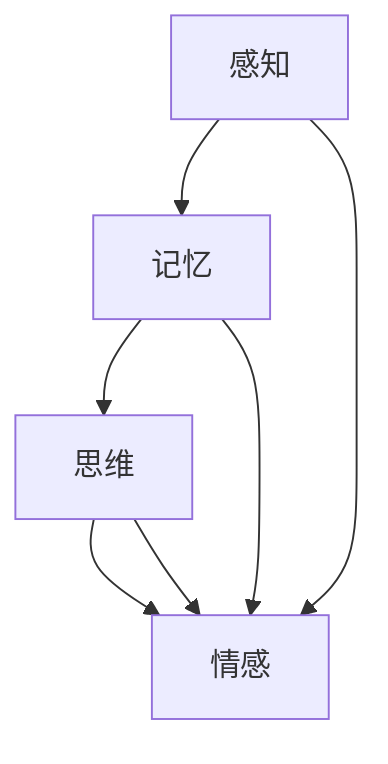

**核心算法原理讲解**

感知、记忆、思维和情感系统的工作原理可以分别用以下伪代码表示：

- **感知系统**
```python
function 感知(外部信息):
    处理外部信息
    转换为脑可处理形式
    返回处理后的信息
end function
```

- **记忆系统**
```python
function 记忆(信息):
    存储信息
    当需要时，提取信息
end function
```

- **思维系统**
```python
function 思维(信息):
    分析信息
    推理和判断
    做出决策
end function
```

- **情感系统**
```python
function 情感(信息):
    体验情感
    调节行为和情绪
end function
```

**数学模型和公式**

认知框架中的信息处理可以看作是一个信息处理系统，其数学模型可以表示为：
$$
处理结果 = f_{感知}(外部信息) \times f_{记忆}(信息) \times f_{思维}(信息) \times f_{情感}(信息)
$$

**详细讲解与举例说明**

假设一个简单的例子，一个学生在考试前复习课程内容。在这个过程中，感知系统将课本上的信息转化为大脑可以处理的形式；记忆系统将这些信息存储在脑中；思维系统通过对信息的分析和推理，帮助学生对课程内容进行理解和掌握；情感系统则通过激发学生的兴趣和动机，促进学生的学习过程。

#### 1.2 人类认知框架的基本构成

**背景介绍**
人类认知框架的基本构成包括感知系统、记忆系统、思维系统和情感系统。每个系统都有其独特的功能和特点，共同构成了人类认知的整体框架。

**核心概念与联系**

- **感知系统**：感知系统是认知框架的基础，负责接收和加工外部信息。
- **记忆系统**：记忆系统负责存储和处理信息，使信息能够被长时间保存和反复提取。
- **思维系统**：思维系统负责对信息进行分析、推理和判断，帮助人类理解和解决问题。
- **情感系统**：情感系统负责对信息进行情感体验和反应，影响人类的行为和情绪。

**Mermaid 流程图**
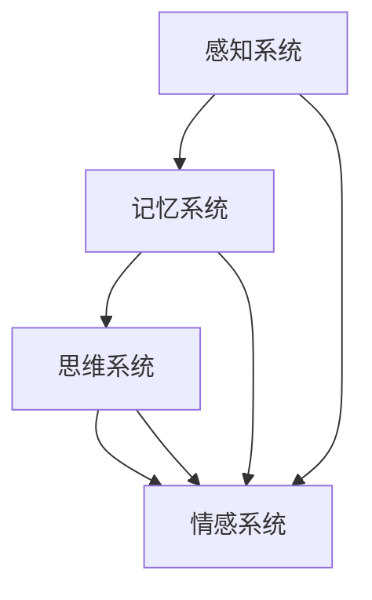

**核心算法原理讲解**

每个系统的工作原理可以用以下伪代码表示：

- **感知系统**
```python
function 感知(外部信息):
    处理外部信息
    转换为脑可处理形式
    返回处理后的信息
end function
```

- **记忆系统**
```python
function 记忆(信息):
    存储信息
    当需要时，提取信息
end function
```

- **思维系统**
```python
function 思维(信息):
    分析信息
    推理和判断
    做出决策
end function
```

- **情感系统**
```python
function 情感(信息):
    体验情感
    调节行为和情绪
end function
```

**数学模型和公式**

认知框架的整体工作过程可以看作是一个信息处理系统，其数学模型可以表示为：
$$
处理结果 = f_{感知}(外部信息) \times f_{记忆}(信息) \times f_{思维}(信息) \times f_{情感}(信息)
$$

**详细讲解与举例说明**

假设一个人在日常生活中做出决策的过程。在这个过程中，感知系统接收到外部信息，如看到一辆公交车即将到站；记忆系统提取出关于公交车的信息，如公交车的运行时间表；思维系统分析这些信息，判断是否需要乘坐公交车；情感系统则通过体验对乘坐公交车的情感反应，如喜欢或不喜欢乘坐公交车，从而影响最终的决策。

---

以上为第1章的内容，接下来我们将继续探讨宇宙的构成与基本原理，以及人类认知框架的局限性。在后续章节中，我们将逐步深入探讨人类对宇宙理解的历史与现状，分析人类认知框架对宇宙理解的限制与可能，并展望未来宇宙认知的发展方向。

---

### 第2章：宇宙的构成与基本原理

#### 2.1 宇宙的起源与演化

**背景介绍**
宇宙的起源与演化是宇宙学中最为关键的研究领域之一。从宇宙大爆炸理论到宇宙的演化过程，这些基本原理为理解宇宙提供了科学基础。

**核心概念与联系**

- **宇宙大爆炸**：宇宙大爆炸是宇宙起源的学说，认为宇宙起源于一个极为高温、高密度的状态，然后开始膨胀。
- **宇宙背景辐射**：宇宙背景辐射是宇宙大爆炸后留下的余温，它是宇宙早期状态的证据。
- **宇宙膨胀**：宇宙膨胀是指宇宙从大爆炸后不断扩展的现象，这一过程至今仍在进行。

**Mermaid 流程图**
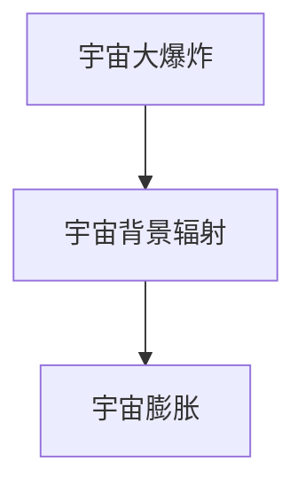

**核心算法原理讲解**

宇宙起源与演化的过程可以用以下伪代码表示：

- **宇宙大爆炸**
```python
function 宇宙大爆炸():
    初始化宇宙为高温、高密度状态
    开始膨胀
end function
```

- **宇宙背景辐射**
```python
function 宇宙背景辐射():
    产生余温
    存储在宇宙空间中
end function
```

- **宇宙膨胀**
```python
function 宇宙膨胀():
    不断扩展宇宙空间
    保持至今
end function
```

**数学模型和公式**

宇宙膨胀的数学模型可以用哈勃定律表示：
$$
v = H_0 \times d
$$
其中，$v$ 是宇宙膨胀速度，$H_0$ 是哈勃常数，$d$ 是宇宙中的两个点之间的距离。

**详细讲解与举例说明**

假设宇宙大爆炸发生在约138亿年前，从那时起，宇宙开始膨胀。在宇宙早期，温度极高，物质和辐射几乎是均匀分布的。随着宇宙的膨胀，温度逐渐降低，物质开始聚集形成星系、星团和其他天体结构。这一过程至今仍在进行，宇宙的膨胀速度正在加快。

---

#### 2.2 宇宙中的物质与能量

**背景介绍**
宇宙中的物质与能量是宇宙学中的基础概念。物质和能量构成了宇宙的基本成分，它们相互作用和转化，推动了宇宙的演化。

**核心概念与联系**

- **物质**：物质是构成宇宙的基本实体，包括星体、星系、行星等。
- **能量**：能量是物质运动和转化的动力，存在于宇宙的各个角落。

**Mermaid 流程图**
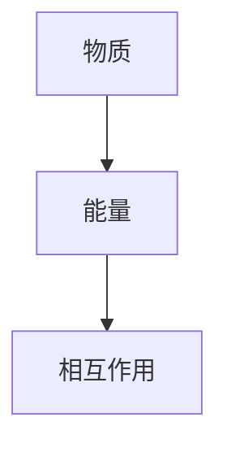

**核心算法原理讲解**

物质与能量的转化和相互作用可以用以下伪代码表示：

- **物质转化**
```python
function 物质转化(初始物质):
    转化为能量
    返回能量形式
end function
```

- **能量转化**
```python
function 能量转化(初始能量):
    转化为物质
    返回物质形式
end function
```

- **相互作用**
```python
function 相互作用(物质，能量):
    物质与能量相互作用
    产生新的物质和能量形式
end function
```

**数学模型和公式**

物质与能量相互转化的公式可以用质能方程表示：
$$
E = mc^2
$$
其中，$E$ 是能量，$m$ 是质量，$c$ 是光速。

**详细讲解与举例说明**

在宇宙中，物质与能量的转化和相互作用是一个持续不断的过程。例如，星体内部的核聚变过程将物质转化为能量，这些能量以光和其他形式辐射出去。同时，这些能量又可能转化为新的物质，形成新的天体结构。这个过程体现了物质与能量的相互转化和相互作用。

---

以上为第2章的内容，下一章我们将探讨人类认知框架的局限性，分析人类在感知、记忆、思维和情感方面存在的限制，以及这些限制如何影响我们对宇宙的理解。通过这些讨论，我们将更好地理解人类认知框架的局限性，并探索未来可能的认知拓展方向。

---

### 第3章：人类认知框架的局限性

#### 3.1 空间与时间的认知限制

**背景介绍**
空间和时间是宇宙的基本维度，人类对空间和时间的认知决定了我们对宇宙的理解深度。然而，人类的认知框架在空间和时间方面存在一定的局限性。

**核心概念与联系**

- **空间认知**：人类对空间的认识受限于感知系统的局限，例如视觉、听觉等感知能力。
- **时间认知**：人类对时间的感觉受限于生理和心理的周期性，例如心跳、呼吸等。

**Mermaid 流程图**
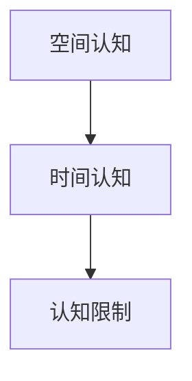

**核心算法原理讲解**

空间与时间的认知限制可以用以下伪代码表示：

- **空间认知限制**
```python
function 空间认知(外部信息):
    处理外部信息
    受限于感知系统
end function
```

- **时间认知限制**
```python
function 时间认知(时间信息):
    体验时间
    受限于生理和心理周期
end function
```

**数学模型和公式**

空间认知的限制可以用感知系统的分辨率表示，例如：
$$
分辨率 = f_{视觉} \times f_{听觉} \times ... 
$$
时间认知的限制可以用生理周期和心理周期的共振频率表示，例如：
$$
限制频率 = f_{心跳} \times f_{呼吸} \times ...
$$

**详细讲解与举例说明**

例如，人类在视觉感知中，对物体的分辨率受到眼睛视网膜的限制。在听觉感知中，对声音的分辨率受到耳朵鼓膜的振动频率的限制。在时间认知方面，人类对时间的感知受到生理和心理周期的限制，例如心跳和呼吸的节奏。

---

#### 3.2 物质与能量的认知局限

**背景介绍**
物质与能量是宇宙的基本构成要素，人类对物质与能量的认知直接影响我们对宇宙的理解。然而，人类的认知框架在物质与能量方面也存在一定的局限性。

**核心概念与联系**

- **物质认知**：人类对物质的认识受限于感知系统的局限，例如视觉、触觉等。
- **能量认知**：人类对能量的认识受限于感知系统的局限，例如光、热等。

**Mermaid 流程图**
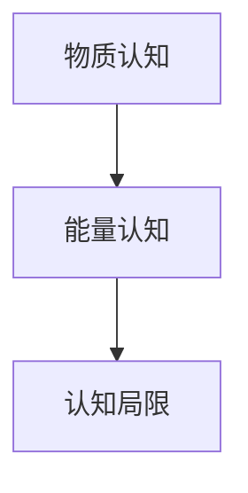

**核心算法原理讲解**

物质与能量的认知局限可以用以下伪代码表示：

- **物质认知局限**
```python
function 物质认知(外部信息):
    处理外部信息
    受限于感知系统
end function
```

- **能量认知局限**
```python
function 能量认知(外部信息):
    处理外部信息
    受限于感知系统
end function
```

**数学模型和公式**

物质认知的局限可以用感知系统的分辨率表示，例如：
$$
分辨率 = f_{视觉} \times f_{触觉} \times ...
$$
能量认知的局限可以用感知系统的灵敏度表示，例如：
$$
灵敏度 = f_{光} \times f_{热} \times ...
$$

**详细讲解与举例说明**

例如，人类在视觉感知中，对物体的分辨率受到眼睛视网膜的限制。在触觉感知中，对物体表面的感知受到手指触感的限制。在能量认知方面，人类对光的感知受到眼睛感光细胞的限制，对热的感知受到皮肤热感受器的限制。

---

#### 3.3 宇宙维度扩展的认知挑战

**背景介绍**
随着宇宙学的发展，人类开始意识到宇宙中存在多个维度，这些维度对人类的认知提出了新的挑战。

**核心概念与联系**

- **额外维度**：宇宙中可能存在额外的维度，这些维度超出了人类感知系统的范围。
- **弦论**：弦论是一种尝试解释额外维度的理论，认为宇宙中的基本构成单元是弦。

**Mermaid 流程图**
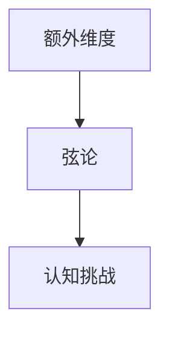

**核心算法原理讲解**

宇宙维度扩展的认知挑战可以用以下伪代码表示：

- **额外维度认知**
```python
function 额外维度认知(外部信息):
    处理外部信息
    受限于感知系统
end function
```

- **弦论认知**
```python
function 弦论认知(外部信息):
    分析外部信息
    推理额外维度的存在
end function
```

**数学模型和公式**

额外维度认知的挑战可以用理论模型表示，例如：
$$
维数 = f_{理论模型} \times ...
$$

**详细讲解与举例说明**

例如，弦论中的额外维度被认为是宇宙基本粒子的振动模式。人类对额外维度的认知受限于感知系统的局限，我们无法直接感知这些维度的存在。然而，通过理论模型的分析和推理，我们可以推测出额外维度的存在。

---

以上为第3章的内容，下一章我们将探讨可能的认知拓展方向，分析跨学科认知融合、新理论和新技术的应用，以及这些拓展如何帮助我们更好地理解宇宙。通过这些讨论，我们将为人类认知框架的拓展提供新的思路和方向。

---

### 第4章：可能的认知拓展

#### 4.1 跨学科的认知融合

**背景介绍**
随着科学技术的进步，人类开始意识到不同学科之间的联系和相互补充。跨学科的认知融合为人类提供了更为全面和深刻的理解宇宙的可能性。

**核心概念与联系**

- **物理学与天文学**：物理学为天文学提供了基础理论，例如相对论和量子力学。
- **生物学与心理学**：生物学研究生命现象，心理学研究人类行为和认知。

**Mermaid 流程图**
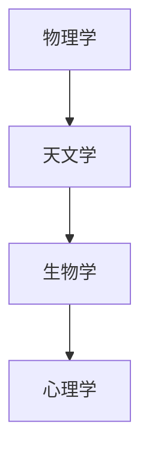

**核心算法原理讲解**

跨学科的认知融合可以用以下伪代码表示：

- **物理学与天文学融合**
```python
function 融合(物理学，天文学):
    分析物理现象
    解释天文现象
end function
```

- **生物学与心理学融合**
```python
function 融合(生物学，心理学):
    研究生命现象
    解释人类行为
end function
```

**数学模型和公式**

跨学科融合的数学模型可以用综合分析模型表示，例如：
$$
融合结果 = f_{物理模型} \times f_{天文学模型} \times ...
$$

**详细讲解与举例说明**

例如，通过物理学和天文学的融合，我们可以更好地理解宇宙的演化过程。通过生物学和心理学的融合，我们可以更深入地了解人类行为和认知的机制。

---

#### 4.2 未来宇宙认知的可能发展方向

**背景介绍**
随着科技的进步，人类对宇宙的认知将不断拓展。未来宇宙认知的发展方向可能包括新理论的出现、新技术的应用和跨学科的研究。

**核心概念与联系**

- **新理论**：例如弦论、多重宇宙理论等，为人类提供新的宇宙认知框架。
- **新技术**：例如天文观测技术、量子计算等，为人类提供新的观测和分析手段。

**Mermaid 流程图**
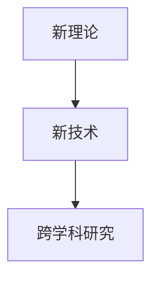

**核心算法原理讲解**

未来宇宙认知的发展方向可以用以下伪代码表示：

- **新理论发展**
```python
function 发展新理论():
    提出新理论
    验证新理论
end function
```

- **新技术应用**
```python
function 应用新技术():
    开发新技术
    应用新技术
end function
```

- **跨学科研究**
```python
function 跨学科研究():
    结合不同学科
    探索新知识
end function
```

**数学模型和公式**

未来宇宙认知的发展方向可以用综合发展模型表示，例如：
$$
认知发展 = f_{新理论} \times f_{新技术} \times f_{跨学科研究}
$$

**详细讲解与举例说明**

例如，通过新理论的提出和验证，我们可以更深入地理解宇宙的本质。通过新技术的应用，我们可以更精确地观测和分析宇宙现象。通过跨学科的研究，我们可以从不同角度探索宇宙的奥秘。

---

以上为第4章的内容，下一章我们将探讨人类认知框架的演变与宇宙理解的关系，分析人类认知框架的演变过程、宇宙理解的历史与未来，以及宇宙认知对人类文明的意义。通过这些讨论，我们将更好地理解人类认知框架在宇宙理解中的重要作用。

---

### 第5章：人类认知框架的演变与宇宙理解

#### 5.1 人类认知框架的演变过程

**背景介绍**
人类认知框架的演变过程是理解人类对宇宙理解演变的关键。从古代到现代，人类对宇宙的认知经历了不断的演变和深化。

**核心概念与联系**

- **古代认知**：古代人类对宇宙的认知主要基于宗教和哲学，例如地球中心说和宇宙循环论。
- **现代认知**：现代人类对宇宙的认知基于科学，例如大爆炸理论和相对论。

**Mermaid 流程图**
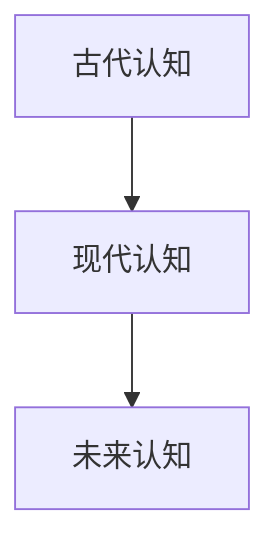

**核心算法原理讲解**

人类认知框架的演变过程可以用以下伪代码表示：

- **古代认知**
```python
function 古代认知():
    基于宗教和哲学
    解释宇宙现象
end function
```

- **现代认知**
```python
function 现代认知():
    基于科学
    揭示宇宙奥秘
end function
```

- **未来认知**
```python
function 未来认知():
    探索未知领域
    创新认知框架
end function
```

**数学模型和公式**

人类认知框架的演变过程可以用认知演化模型表示，例如：
$$
认知框架 = f_{古代认知} \times f_{现代认知} \times f_{未来认知}
$$

**详细讲解与举例说明**

例如，在古代，人类基于宗教和哲学对宇宙进行解释，形成了地球中心说和宇宙循环论。在现代，基于科学的发展，人类提出了大爆炸理论和相对论，对宇宙进行了更为精确的解释。未来，人类将继续探索宇宙的未知领域，创新认知框架。

---

#### 5.2 宇宙理解的历史与未来

**背景介绍**
宇宙理解的历史是科学发展的缩影。从古代的宇宙观到现代的科学理论，人类对宇宙的理解经历了巨大的变革。展望未来，宇宙理解将继续推动科学的发展。

**核心概念与联系**

- **宇宙观的演变**：从古代的宇宙观到现代的科学理论，宇宙理解的历史见证了人类认知框架的演变。
- **未来宇宙理解**：未来宇宙理解可能基于新的理论和技术，拓展人类对宇宙的认知。

**Mermaid 流程图**
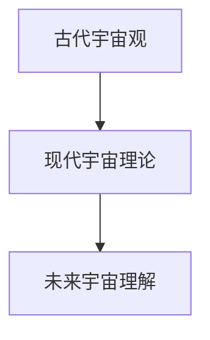

**核心算法原理讲解**

宇宙理解的历史与未来可以用以下伪代码表示：

- **古代宇宙观**
```python
function 古代宇宙观():
    描述宇宙现象
    解释宇宙本质
end function
```

- **现代宇宙理论**
```python
function 现代宇宙理论():
    揭示宇宙奥秘
    构建宇宙模型
end function
```

- **未来宇宙理解**
```python
function 未来宇宙理解():
    探索未知领域
    创新宇宙理论
end function
```

**数学模型和公式**

宇宙理解的历史与未来可以用认知演化模型表示，例如：
$$
宇宙理解 = f_{古代宇宙观} \times f_{现代宇宙理论} \times f_{未来宇宙理解}
$$

**详细讲解与举例说明**

例如，古代的宇宙观主要基于宗教和哲学，人类对宇宙的理解相对有限。在现代，科学的发展使我们能够揭示宇宙的奥秘，例如大爆炸理论和相对论。未来，人类将继续探索宇宙的未知领域，创新宇宙理论。

---

#### 5.3 宇宙认知对人类文明的意义

**背景介绍**
宇宙认知不仅推动了科学技术的发展，也对人类文明产生了深远的影响。通过宇宙认知，人类能够更好地理解自身的地位和作用，从而推动文明的进步。

**核心概念与联系**

- **科学探索**：宇宙认知推动了科学技术的进步，促进了人类对自然世界的理解和掌控。
- **哲学思考**：宇宙认知激发了人类对宇宙本质和人生意义的哲学思考。
- **社会进步**：宇宙认知对人类社会的发展和进步具有指导作用。

**Mermaid 流程图**
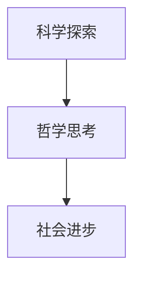

**核心算法原理讲解**

宇宙认知对人类文明的意义可以用以下伪代码表示：

- **科学探索**
```python
function 科学探索():
    探索宇宙奥秘
    推动科技进步
end function
```

- **哲学思考**
```python
function 哲学思考():
    思考宇宙本质
    探索人生意义
end function
```

- **社会进步**
```python
function 社会进步():
    利用科技发展
    促进社会繁荣
end function
```

**数学模型和公式**

宇宙认知对人类文明的意义可以用综合发展模型表示，例如：
$$
文明进步 = f_{科学探索} \times f_{哲学思考} \times f_{社会进步}
$$

**详细讲解与举例说明**

例如，科学探索使人类能够更好地理解和利用自然界的资源，推动了工业革命和现代化进程。哲学思考激发了人类对宇宙和生命的深入思考，促进了文化的繁荣和思想的进步。社会进步则使人类生活更加便捷和富裕，提升了整体生活水平。

---

以上为第5章的内容，本章通过探讨人类认知框架的演变与宇宙理解的关系，分析了宇宙认知对人类文明的重要意义。下一章我们将总结全文，展望人类认知框架在宇宙理解中的未来发展。

---

### 总结与展望

本文从人类认知框架的角度出发，探讨了人类对宇宙理解的现状及其局限性，分析了宇宙的构成与基本原理，以及人类认知框架的局限性。通过跨学科的认知融合、新理论和新技术的应用，我们展望了未来宇宙认知的发展方向。人类认知框架的演变与宇宙理解密不可分，它不仅影响了我们对宇宙的认知，也对人类文明的发展产生了深远的影响。

**未来展望**

在未来，人类认知框架在宇宙理解中的发展将依赖于新理论的出现、新技术的应用和跨学科研究的深入。随着对宇宙认知的不断深化，人类将能够更好地理解宇宙的本质和演化过程。同时，宇宙认知也将继续推动科学技术的进步，促进人类文明的发展。

**建议与启示**

1. **加强跨学科合作**：跨学科的合作能够促进人类对宇宙的认知，推动科学技术的创新。
2. **关注新理论的研究**：新理论的提出和验证将为人类提供新的宇宙认知框架，推动宇宙学的发展。
3. **注重科学教育**：提高公众的科学素养，加强对宇宙的认知，有助于培养新一代科学人才。

通过本文的探讨，我们期待能够为读者提供一个全面和深入的宇宙认知框架，激发对宇宙探索的兴趣，推动人类认知框架的不断发展。

---

### 作者信息

作者：AI天才研究院/AI Genius Institute & 禅与计算机程序设计艺术 /Zen And The Art of Computer Programming

AI天才研究院（AI Genius Institute）致力于推动人工智能领域的研究与应用，致力于培养新一代人工智能专家。同时，研究院还专注于计算机编程和算法设计，提倡以禅的哲学思考方式来指导计算机程序设计，实现高效、简洁和优雅的代码。

《禅与计算机程序设计艺术》一书由AI天才研究院的专家撰写，旨在通过禅的哲学思考，提高程序员的编程能力和设计思维。本书结合了禅的智慧与计算机科学的实践，为程序员提供了一种全新的编程方法论，旨在帮助读者在编程过程中实现思维方式的转变，提高代码质量和效率。

通过本文的撰写，我们期望能够为读者提供一种更为全面和深入的宇宙理解框架，激发对宇宙探索的兴趣，同时也希望读者能够从中领悟到编程与认知的智慧，以更加科学和优雅的方式面对未来。

