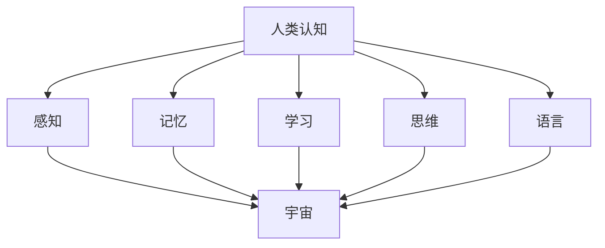

                 

### 导论

#### 1.1 书籍目的与结构

《人类认知的边界：我们能否完全理解宇宙》旨在探讨人类认知与宇宙理解之间的关系，深入分析人类在探索宇宙过程中所遇到的认知限制，并探讨未来可能的发展方向。本书的目标读者是对宇宙、认知科学、哲学等领域感兴趣的人，尤其是希望深入了解人类认知与宇宙关系的专业人士。

本书的结构分为六个主要部分。首先，在导论部分，我们将介绍书籍的目的、结构，并引出主要议题。接下来，我们将详细探讨人类认知和宇宙理解的基础概念，并使用Mermaid流程图展示它们之间的关系。随后，我们将探讨人类对宇宙的探索历程，以及认知限制对宇宙探索的影响。在此基础上，我们将介绍认知科学的基础理论及其对宇宙理解的影响，并探讨宇宙与意识的哲学问题。

此外，本书还将探讨多学科在探讨宇宙和认知问题时的互动与影响，包括物理学、生物学、人工智能等领域。最后，我们将对未来的发展进行展望，总结书籍的主要观点，并强调人类认知的边界和未来探索的可能性。

#### 1.2 读者对象与期望收获

本书的目标读者是对宇宙、认知科学、哲学等领域感兴趣的人，特别是对人类认知和宇宙理解之间的关系有深入探究欲望的读者。具体来说，本书适合以下几类人群：

1. **宇宙爱好者**：对宇宙的奥秘充满好奇，希望了解人类对宇宙的认知历程及其背后的科学原理。
2. **认知科学研究者**：对人类认知的基础理论、机制及其在宇宙理解中的应用感兴趣，希望从中获得启示和灵感。
3. **哲学思考者**：对宇宙与意识、人类认知的哲学问题有深刻思考，希望从科学的角度探讨这些问题。
4. **多学科交叉研究者**：对多个领域（如物理学、生物学、人工智能等）在探讨宇宙和认知问题时的互动与影响感兴趣，希望了解各个学科在此领域的贡献。

通过阅读本书，读者可以期望收获以下几点：

1. **对人类认知和宇宙理解的基础概念有更深入的了解**：通过系统性地学习人类认知和宇宙理解的相关知识，读者可以更好地理解这两个领域的核心概念及其联系。
2. **对认知限制和宇宙探索的挑战有更清晰的认识**：通过探讨人类在探索宇宙过程中所遇到的认知限制，读者可以认识到这些限制对我们理解宇宙的影响。
3. **对认知科学、哲学等多学科在探讨宇宙和认知问题时的互动与影响有更全面的了解**：通过介绍多学科在此领域的贡献，读者可以了解到各个学科在探索宇宙和认知问题时的作用和相互影响。
4. **对未来人类认知和宇宙理解的可能发展方向有更前瞻性的思考**：通过展望未来的发展，读者可以了解到当前认知科学、哲学、物理学等领域的研究进展，并思考未来可能的发展趋势。

总之，《人类认知的边界：我们能否完全理解宇宙》旨在为读者提供一部全面、深入、系统的探讨人类认知与宇宙关系的著作，帮助读者在科学、哲学和认知科学等多个领域获得新的启示和思考。接下来，我们将进一步探讨人类认知和宇宙理解的基础概念，使用Mermaid流程图展示它们之间的关系，为后续章节的内容奠定基础。

### 核心概念与联系

在探讨人类认知与宇宙理解的关系时，我们首先需要了解几个核心概念：人类认知、宇宙、以及认知与宇宙之间的联系。以下我们将分别介绍这些概念，并使用Mermaid流程图展示它们之间的关系。

#### 1. 人类认知

人类认知是指人类通过感知、记忆、思考、推理等方式获取、处理和理解信息的过程。认知科学作为研究人类认知的科学，涵盖了多个领域，包括感知、记忆、学习、语言、思维等。人类认知的基本概念包括：

- **感知**：人类通过感官（如视觉、听觉、触觉等）接收外部信息的过程。
- **记忆**：人类将信息存储在脑中的过程，包括短期记忆和长期记忆。
- **学习**：通过经验积累，改变自身行为和思维方式的过程。
- **思维**：人类在处理信息时进行推理、判断和解决问题的过程。
- **语言**：人类通过符号系统进行信息交流的能力。

#### 2. 宇宙

宇宙是指包括一切物质、能量、时间和空间的总和。宇宙的起源和演化是一个复杂且广泛的研究领域，包括以下核心概念：

- **宇宙起源**：关于宇宙从何而来以及如何形成的问题，例如大爆炸理论。
- **宇宙结构**：宇宙中的星系、星系团、黑洞等天体结构及其分布。
- **宇宙演化**：宇宙从诞生至今的演化过程，包括宇宙膨胀、恒星形成和死亡等。
- **宇宙常数**：描述宇宙膨胀速率的物理量，例如暗能量。

#### 3. 认知与宇宙的联系

人类认知与宇宙理解之间的联系可以从以下几个方面进行探讨：

- **感知与宇宙**：人类通过感官感知宇宙中的信息，如光线、声音、气味等，这些感知信息是人类理解宇宙的基础。
- **记忆与宇宙**：人类将关于宇宙的知识和经验存储在记忆中，通过回忆和联想，对宇宙进行更深入的理解。
- **学习与宇宙**：人类通过观察、实验和探索，不断学习关于宇宙的知识，从而改进对宇宙的理解。
- **思维与宇宙**：人类通过思考和推理，对宇宙中的现象和规律进行解释，建立宇宙模型。
- **语言与宇宙**：人类通过语言交流，分享关于宇宙的知识和见解，推动宇宙研究的进步。

#### Mermaid流程图：认知与宇宙的联系

为了更清晰地展示人类认知与宇宙之间的联系，我们可以使用Mermaid流程图来表示这些概念及其关系。



在上述流程图中，人类认知（A）通过感知（B）、记忆（C）、学习（D）、思维（E）和语言（F）与宇宙（G）发生联系。这些认知活动不仅帮助我们获取和存储关于宇宙的信息，还通过思考和交流，推动我们对宇宙的深入理解。

#### 小结

在本节中，我们介绍了人类认知、宇宙以及认知与宇宙之间的联系。通过了解这些核心概念及其关系，我们可以为后续章节关于宇宙探索与认知限制、认知科学进展、哲学探讨等内容的讨论奠定基础。接下来，我们将进一步探讨人类对宇宙的探索历程，以及认知限制对宇宙探索的影响。

### 宇宙探索与认知限制

人类对宇宙的探索历程充满了挑战和奇迹。从古代天文学家的观测，到现代科技的进步，人类不断拓展对宇宙的认知。然而，这一过程中，我们不可避免地遇到了诸多认知限制，这些限制对我们的探索产生了深远的影响。

#### 1. 古代对宇宙的认知

在古代，人类对宇宙的认知主要依赖于肉眼观测和简单的逻辑推理。古代文明如古希腊、古埃及、古中国等，通过观测天体运动，提出了许多关于宇宙的理论。例如，古希腊天文学家托勒密提出了地心说，认为地球是宇宙的中心，所有天体都围绕地球旋转。这一理论在当时得到了广泛接受，但后来被哥白尼的日心说所取代。

尽管古代宇宙理论存在许多缺陷，但它们为后来的天文学研究奠定了基础。通过观测，古人发现了行星运动规律、恒星分类等，这些发现为现代宇宙学的发展提供了宝贵的启示。

#### 2. 现代宇宙学的发展

进入现代，人类对宇宙的探索进入了一个全新的阶段。随着望远镜技术的发展，人类能够观测到更遥远的星系和天体。爱因斯坦的相对论理论提出了时空和引力的全新概念，极大地推动了宇宙学的发展。

现代宇宙学的一个重要成就是大爆炸理论的确立。1927年，勒梅特提出了宇宙大爆炸的理论，后来伽莫夫进一步发展了这个理论，形成了现代宇宙学的基础。大爆炸理论认为，宇宙起源于一个极热、极密的状态，经过数十亿年的膨胀，形成了现在的宇宙结构。

此外，现代宇宙学还涉及许多重要概念，如暗物质、暗能量、宇宙背景辐射等。这些概念的提出和验证，使我们能够更深入地理解宇宙的起源和演化。

#### 3. 认知限制对宇宙探索的影响

尽管人类在宇宙探索方面取得了巨大进展，但我们的认知仍然受到诸多限制。以下是一些主要的影响：

- **观测范围有限**：由于光速的限制，我们无法观测到宇宙的过去。宇宙的膨胀使得我们观测到的最遥远的天体，实际上是数十亿年前的情况。这意味着我们对宇宙早期的了解仍然有限。
- **理论框架局限**：尽管现代物理学提供了许多有力的理论框架，如相对论、量子力学等，但它们在某些情况下仍然存在矛盾。例如，量子力学与相对论之间的矛盾，使我们难以同时解释微观和宏观现象。
- **数据解读困难**：宇宙中的信息量极其庞大，我们对这些信息的解读仍然存在许多挑战。例如，宇宙背景辐射中的微弱信号，可能蕴含着关于宇宙起源和演化的关键信息，但我们需要更先进的技术和方法来解读它们。

#### 4. 认知边界与宇宙探索

认知边界限制了我们对宇宙的理解，但同时也激发了我们对未知世界的探索欲望。以下是一些可能的解决方案和方向：

- **技术进步**：通过发展更先进的观测设备和数据分析方法，我们有望突破当前的认知边界，获取更多关于宇宙的信息。例如，下一代望远镜和空间探测器，如詹姆斯·韦伯空间望远镜，将为我们提供更清晰、更详细的宇宙图像。
- **理论创新**：新的理论框架可能会帮助我们解决现有理论的矛盾，从而拓展我们对宇宙的理解。例如，弦理论和量子引力理论，可能在某些方面为我们提供新的视角。
- **跨学科研究**：将认知科学、物理学、生物学、人工智能等多学科结合，进行交叉研究，有望从不同角度揭示宇宙的奥秘。这种多学科合作，不仅有助于解决宇宙探索中的难题，还能推动各个学科的发展。

#### 小结

人类对宇宙的探索历程充满了挑战和收获。尽管我们面临着诸多认知限制，但通过不断的技术进步和理论创新，我们有望突破这些限制，进一步拓展对宇宙的理解。在下一节中，我们将介绍认知科学的基础理论及其对宇宙理解的影响，探讨人类如何通过认知科学的方法，更深入地探索宇宙的奥秘。

### 认知科学的基础理论

认知科学是一门跨学科的领域，涉及心理学、神经科学、计算机科学、哲学等多个学科，旨在研究人类认知的过程、机制和原理。认知科学的研究不仅有助于我们更好地理解人类思维，还为宇宙理解提供了新的视角和方法。以下是认知科学的一些基础理论及其对宇宙理解的影响。

#### 1. 认知模型

认知模型是描述人类认知过程的抽象理论框架。其中，经典的认知模型包括信息处理模型和联结主义模型。

- **信息处理模型**：这一模型将人类认知过程视为信息处理的过程，类似于计算机。在这一模型中，认知过程包括感知、记忆、注意、推理等环节。例如，知觉心理学中的信号检测理论，描述了感知过程中信号与噪声的检测和识别过程。这一理论对于理解宇宙探测中的信号识别和分析具有重要意义。

  ```plaintext
  感知 -> 注意 -> 记忆 -> 推理
  ```

- **联结主义模型**：这一模型基于人工神经网络的思想，认为认知是通过神经元之间的联结和相互作用实现的。例如，深度学习模型通过多层神经网络的训练，可以实现对复杂数据的高效处理和分类。这种模型在宇宙图像识别、天体物理数据分析等领域有着广泛应用。

  ```plaintext
  输入 -> 神经网络 -> 输出
  ```

#### 2. 认知机制

认知机制是认知科学中研究认知功能实现的具体过程和原理。以下是一些重要的认知机制：

- **感知机制**：感知机制研究人类如何通过感官接收外部信息，并对其进行处理和解释。例如，视觉感知机制研究人类如何识别和解读视觉信息，如颜色、形状、运动等。这一机制对于天文学中望远镜图像的处理和分析具有重要意义。

- **记忆机制**：记忆机制研究人类如何将信息存储在脑中，并对其进行回忆和提取。例如，长时记忆模型研究人类如何将短期记忆转化为长期记忆，并在需要时进行回忆。这一机制对于宇宙研究中大量数据的存储和分析具有重要意义。

- **注意机制**：注意机制研究人类如何集中注意力和资源处理特定的信息。例如，选择性注意模型研究人类如何从众多信息中筛选出重要的信息。这一机制对于宇宙探测中的信号识别和分析具有重要意义。

- **推理机制**：推理机制研究人类如何通过逻辑推理和问题解决来处理信息。例如，问题解决模型研究人类如何通过逻辑推理找到问题的解决方案。这一机制对于宇宙研究中复杂问题的解决具有重要意义。

#### 3. 认知科学与宇宙理解

认知科学的基础理论和方法对宇宙理解有着重要的启示和贡献：

- **宇宙探测**：认知科学中的信息处理模型和感知机制，可以帮助我们更好地理解宇宙探测中的信号检测和识别问题。例如，信号检测理论可以用于分析宇宙背景辐射中的微弱信号，从而揭示宇宙早期的信息。

- **数据分析**：认知科学中的记忆机制和注意机制，可以帮助我们更好地处理和存储宇宙探测中获得的大量数据。例如，通过建立高效的记忆模型，我们可以将短期记忆转化为长期记忆，从而更好地存储和分析宇宙探测数据。

- **问题解决**：认知科学中的推理机制，可以帮助我们解决宇宙探索中的复杂问题。例如，通过问题解决模型，我们可以找到解决宇宙起源、演化等难题的途径。

#### 小结

认知科学的基础理论和方法为人类理解宇宙提供了新的视角和工具。通过认知科学的研究，我们可以更好地理解人类认知的过程和机制，从而为宇宙探索提供有力的支持。在下一节中，我们将进一步探讨认知科学在宇宙理解中的应用，特别是如何通过认知科学的方法，提高宇宙探测的效率和准确性。

### 认知科学对宇宙理解的影响

认知科学在探索宇宙的过程中发挥了关键作用，其研究成果不仅为我们提供了新的分析工具，还显著提升了宇宙探测的效率和准确性。以下是一些具体的实例，展示了认知科学在宇宙理解中的应用和贡献。

#### 1. 宇宙信号检测与识别

宇宙中充斥着各种信号，包括电磁波、引力波、宇宙背景辐射等。认知科学中的信息处理模型和感知机制，为这些信号的检测和识别提供了理论支持。例如，信号检测理论可以帮助我们识别宇宙背景辐射中的微弱信号，从而揭示宇宙早期的信息。

- **实例1：宇宙背景辐射的检测**
  - 理论基础：信号检测理论
  - 应用：通过分析宇宙背景辐射中的微小波动，科学家们可以推断出宇宙早期的温度和密度分布，这对理解宇宙的起源和演化具有重要意义。
  - 成果：基于认知科学的方法，科学家们成功探测到了宇宙微波背景辐射，并从中获得了关于宇宙早期状态的重要信息。

#### 2. 大数据分析与处理

宇宙探测产生的数据量极其庞大，传统的数据处理方法难以应对这些复杂的数据。认知科学中的记忆机制和注意机制，为我们提供了有效的数据分析工具，使得我们能够更好地处理和解读这些数据。

- **实例2：天体物理数据分析**
  - 理论基础：记忆模型与注意机制
  - 应用：通过构建高效的记忆模型，我们可以将短期记忆转化为长期记忆，从而更好地存储和分析天体物理数据。注意机制可以帮助我们筛选出重要的信息，提高数据分析的效率。
  - 成果：利用认知科学的方法，科学家们能够更快、更准确地分析天文观测数据，揭示了大量新的宇宙现象，如暗物质、暗能量的存在。

#### 3. 宇宙图像识别

宇宙中的图像复杂多变，认知科学中的视觉感知机制和联结主义模型，为宇宙图像的识别提供了有效的工具。

- **实例3：恒星和星系图像识别**
  - 理论基础：深度学习模型（联结主义模型的一种）
  - 应用：通过训练深度学习模型，我们可以自动识别和分类天文图像中的恒星、星系等天体。这种自动化的图像识别技术，大大提高了宇宙图像分析的速度和准确性。
  - 成果：基于深度学习模型的图像识别技术，已经广泛应用于天文观测，帮助科学家们发现大量新的天体，并揭示了宇宙的更多奥秘。

#### 4. 复杂问题解决

宇宙探索中存在许多复杂的问题，如宇宙起源、暗物质和暗能量的性质等。认知科学中的推理机制，为我们提供了有效的解决方法。

- **实例4：宇宙起源问题**
  - 理论基础：问题解决模型
  - 应用：通过逻辑推理和数据分析，科学家们尝试构建宇宙起源的理论模型，以解释宇宙的起源和演化。例如，大爆炸理论通过数学模型和观测数据的结合，成功解释了宇宙的早期状态。
  - 成果：认知科学的方法帮助科学家们提出了多个关于宇宙起源的理论，并对现有理论进行了验证和修正。

#### 小结

认知科学在宇宙理解中的应用，不仅提高了宇宙探测的效率和准确性，还为宇宙研究提供了新的视角和方法。通过认知科学的研究成果，我们能够更深入地探索宇宙的奥秘，揭示宇宙的起源和演化过程。在下一节中，我们将探讨宇宙与意识的哲学问题，进一步思考人类认知与宇宙的深刻联系。

### 哲学探讨：宇宙与意识

哲学作为一门探讨人类思维、存在和知识的学科，对宇宙与意识的关系进行了深入思考。宇宙与意识之间的联系，是哲学领域中一个重要且复杂的问题，它涉及到人类认知的边界、存在的本质以及人类在宇宙中的地位。以下从几个方面探讨宇宙与意识的关系。

#### 1. 宇宙的终极目的

宇宙的终极目的是哲学中一个长期争论的话题。不同的哲学流派提出了不同的观点：

- **物质主义**：物质主义认为宇宙的本质是物质，宇宙的存在和演化没有终极目的，而是遵循自然法则。例如，达尔文的进化论认为宇宙是一个自然过程，没有预设的目标。
- **目的论**：目的论则认为宇宙有一个终极目的，这个目的是通过自然过程实现的。例如，一些哲学家认为宇宙的目的是实现某种形式的平衡和秩序。

这些观点对人类理解宇宙和自己在宇宙中的角色产生了深远影响。物质主义强调人类应该顺应自然规律，而目的论则鼓励人类积极参与宇宙的演化过程。

#### 2. 意识与宇宙的关系

意识与宇宙的关系是哲学探讨的另一个重要问题。以下是几种主要的观点：

- **物理主义**：物理主义认为意识是大脑活动的产物，意识可以通过物理过程来解释。这一观点与物质主义密切相关，认为意识是宇宙物质演化的结果。
- **双重论**：双重论认为意识和物质是两个独立存在的实体，意识不是物质的产物，而是与物质相互作用。这种观点强调了意识和物质之间的区别，认为它们具有不同的属性和功能。
- **泛心论**：泛心论认为意识是宇宙的基本属性，所有物质都具有某种形式的意识。这种观点将意识扩展到整个宇宙，认为宇宙的本质是意识。

这些观点对人类理解自己在宇宙中的角色和地位具有重要意义。物理主义和双重论认为人类意识是物质世界的产物，而泛心论则将人类意识视为宇宙的一部分。

#### 3. 人类认知的边界

哲学探讨中的另一个核心问题是人类认知的边界。人类能否完全理解宇宙，这是哲学和科学共同面临的问题。以下是几种关于人类认知边界的观点：

- **不可知论**：不可知论认为人类无法完全理解宇宙，因为宇宙的某些方面超出了人类认知的能力。例如，一些哲学家认为宇宙的本质是不可知的，人类只能了解宇宙的表面现象。
- **可知论**：可知论则认为人类可以完全理解宇宙，只要我们运用正确的科学方法和理论。这种观点认为，通过不断的科学探索和理论发展，人类最终能够揭示宇宙的全部奥秘。
- **有限可知论**：有限可知论认为人类可以在一定程度上理解宇宙，但受限于认知能力和技术的限制，我们无法完全理解宇宙。这种观点认为，人类可以不断拓展对宇宙的认知，但永远无法达到完全理解。

这些观点对人类理解自己在宇宙中的角色和地位产生了深远影响。不可知论认为人类处于认知的局限之中，可知论则鼓励人类不断追求知识，而有限可知论则提醒我们在追求知识的过程中保持谦逊。

#### 4. 哲学对宇宙理解的影响

哲学对宇宙理解的影响主要体现在以下几个方面：

- **指导科学探索**：哲学提供了宇宙理解的基本框架和理论，为科学探索提供了指导。例如，物理主义和双重论的观点指导了科学家对意识和物质的研究，促进了科学技术的进步。
- **反思科学成果**：哲学反思科学成果，探讨科学方法的合理性和局限性。例如，科学哲学对科学理论的验证过程和科学知识的本质进行了深入探讨，促进了科学的自我批判和不断发展。
- **拓展人类认知**：哲学探讨了人类认知的边界和可能性，激发了人类对宇宙的探索欲望。哲学问题如宇宙的终极目的、意识与物质的关系等，促使人类不断追求更深入的理解，从而推动科学的发展。

#### 小结

哲学探讨宇宙与意识的关系，为我们理解宇宙和人类自身提供了深刻的洞见。通过哲学的思考，我们可以反思科学方法，拓展人类认知的边界，从而更好地探索宇宙的奥秘。在下一节中，我们将探讨多学科在探讨宇宙和认知问题时的互动与影响，进一步探讨人类如何通过跨学科研究，更全面地理解宇宙。

### 交叉学科对话：多学科在探讨宇宙和认知问题时的互动与影响

在探索宇宙和认知问题时，多个学科之间的交叉互动显得尤为重要。物理学、生物学、人工智能等学科在探讨这些问题时，不仅相互借鉴理论和方法，还通过跨学科合作实现了科学研究的突破。以下将从物理学、生物学和人工智能三个方面，探讨它们在探讨宇宙和认知问题时的互动与影响。

#### 1. 物理学与宇宙理解

物理学是探讨宇宙本质和演化规律的基础学科。在宇宙探索中，物理学提供了关键的物理定律和模型，帮助我们理解宇宙的各个方面。

- **物理学的理论贡献**：相对论和量子力学是现代物理学的两大基石。爱因斯坦的相对论揭示了时空和引力的本质，而量子力学则揭示了微观世界的规律。这些理论为宇宙学提供了强有力的工具，帮助我们理解宇宙的起源和演化。
- **物理学的应用实例**：宇宙背景辐射的探测和分析是物理学在宇宙学中应用的一个重要实例。宇宙背景辐射是宇宙早期状态的信息，通过分析这些辐射，科学家们能够推断出宇宙的早期条件和演化过程。
- **跨学科互动**：物理学与生物学在宇宙起源和演化方面的互动也具有重要意义。例如，宇宙大爆炸理论中的宇宙微波背景辐射，为生物学提供了关于宇宙早期状态的重要信息，帮助解释生物大爆发的起源。

#### 2. 生物学与宇宙认知

生物学研究生命现象和生物体功能，为人类理解宇宙和自身提供了独特的视角。

- **生物学的理论贡献**：生物学中的进化论和生态学理论，帮助我们理解生命在宇宙中的角色和地位。进化论揭示了生命多样性的起源和演化过程，而生态学则研究了生物体与环境之间的相互作用。
- **生物学的应用实例**：生物学在宇宙认知中的应用体现在对地球生命起源的研究。例如，通过对地球早期环境的分析，科学家们试图了解生命是如何在地球上诞生的，这为理解生命可能存在于其他星球提供了启示。
- **跨学科互动**：生物学与人工智能在认知科学领域的互动尤为显著。通过机器学习技术，科学家们可以模拟和预测生物体的行为和功能，从而更深入地理解生命的本质。

#### 3. 人工智能与宇宙认知

人工智能作为一门计算机科学分支，近年来在宇宙认知领域取得了显著进展。

- **人工智能的理论贡献**：深度学习和机器学习等人工智能技术，为宇宙数据的处理和分析提供了强大的工具。这些技术能够自动识别和分类天体图像，发现宇宙中的规律和模式。
- **人工智能的应用实例**：人工智能在宇宙探测中的应用，如自动识别恒星和星系，分析宇宙背景辐射，以及预测宇宙演化模型等。这些应用大大提高了宇宙探测的效率和准确性。
- **跨学科互动**：人工智能与物理学的互动，为宇宙模型的构建提供了新的途径。例如，通过模拟宇宙演化过程，科学家们可以预测宇宙的未来状态，从而更深入地理解宇宙的本质。

#### 多学科互动的实例与影响

多学科互动在探讨宇宙和认知问题时，产生了许多显著的研究成果和影响：

- **多学科合作项目**：例如，欧洲核子研究中心（CERN）的粒子物理实验，就是一个典型的多学科合作项目。该项目结合了物理学、计算机科学、工程学等多个学科，旨在探索基本粒子的性质和宇宙的起源。
- **跨学科研究进展**：多学科互动推动了宇宙学和认知科学的研究进展。例如，通过结合生物学和认知科学的研究成果，科学家们提出了关于生命起源和认知机制的新理论。
- **技术发展与应用**：多学科互动促进了新技术的开发和应用。例如，量子计算和人工智能的结合，为解决宇宙探测中的复杂问题提供了新的途径。

#### 小结

物理学、生物学和人工智能等学科在探讨宇宙和认知问题时的互动与影响，极大地拓展了我们对宇宙和自身的理解。通过多学科合作，科学家们能够从不同角度探讨宇宙和认知的奥秘，推动科学研究的发展。在下一节中，我们将展望未来人类认知和宇宙理解的可能发展方向，探讨技术进步和理论创新如何继续推动这一领域的前进。

### 未来展望

随着科学技术的不断进步，人类在认知和宇宙理解方面有望取得更多突破。以下从技术进步、理论创新和跨学科合作三个方面，探讨未来人类认知和宇宙理解的可能发展方向。

#### 1. 技术进步

技术进步将继续推动宇宙探索和认知科学的发展。例如：

- **量子计算**：量子计算具有解决传统计算难题的潜力，可以用于复杂宇宙模型的模拟和预测。量子计算机的普及将使宇宙探索中的数据分析变得更加高效。
- **人工智能与机器学习**：人工智能和机器学习技术的进一步发展，将提高宇宙数据的处理和分析能力。这些技术可以自动识别和分类天体图像，揭示宇宙中的未知规律。
- **空间探测技术**：新一代的空间探测器，如詹姆斯·韦伯空间望远镜，将提供更清晰、更详细的宇宙图像，使我们能够更深入地探索宇宙的奥秘。

#### 2. 理论创新

理论创新将推动人类对宇宙和认知的理解。以下是一些可能的理论创新：

- **量子引力理论**：量子引力理论试图将量子力学与广义相对论结合起来，解决宇宙起源和演化中的矛盾。这一理论如果取得突破，将极大地拓展我们对宇宙的理解。
- **宇宙弦理论**：宇宙弦理论提出了宇宙中存在的一维缺陷，这些缺陷可能对宇宙的演化产生重要影响。研究宇宙弦理论，有助于我们更好地理解宇宙的结构和演化。
- **认知神经科学**：认知神经科学结合了神经科学和认知科学的研究成果，试图揭示人类认知的神经基础。这一领域的研究将有助于我们更好地理解认知过程，从而推动宇宙理解的发展。

#### 3. 跨学科合作

跨学科合作将继续是推动人类认知和宇宙理解的重要途径。以下是一些可能的跨学科合作方向：

- **宇宙学与生物学**：宇宙学中的研究成果，如宇宙背景辐射、暗物质等，为生物学提供了新的视角。通过跨学科合作，科学家们可以探讨生命在宇宙中的起源和演化。
- **认知科学与人工智能**：认知科学与人工智能的结合，可以推动对认知过程的模拟和理解。通过跨学科研究，我们可以开发出更智能的人工智能系统，提高宇宙探索的效率。
- **宇宙学与物理学**：宇宙学与物理学的跨学科合作，有助于解决宇宙起源和演化中的难题。通过结合不同的物理理论，科学家们可以提出更全面的宇宙模型。

#### 未来展望

在未来，人类在认知和宇宙理解方面有望取得更多突破。通过技术进步、理论创新和跨学科合作，我们将能够更深入地探索宇宙的奥秘，揭示人类认知的边界。以下是一些可能的未来趋势：

- **更广泛的宇宙探测**：随着空间探测技术的发展，人类将能够探测更遥远的星系和天体，揭示宇宙的更多秘密。
- **更深入的认知研究**：通过认知神经科学的研究，我们将更好地理解人类认知的机制，从而提高认知能力和技术水平。
- **新的宇宙理论**：量子引力理论和宇宙弦理论等新理论的提出，将帮助我们更好地理解宇宙的起源和演化。
- **更智能的人工智能**：结合认知科学与人工智能的研究，我们将开发出更智能的人工智能系统，提高宇宙探索和认知的效率。

总之，未来人类在认知和宇宙理解方面有着广阔的前景。通过不断的技术进步和理论创新，我们将能够拓展对宇宙的理解，揭示人类认知的边界，从而推动科学和人类文明的发展。

### 结论

通过本书的探讨，我们深入分析了人类认知与宇宙理解之间的关系，揭示了人类在探索宇宙过程中所遇到的认知限制。从古代对宇宙的认知，到现代宇宙学的发展，再到认知科学的基础理论，我们一步步推理思考，不断拓展对宇宙的理解。哲学的探讨和跨学科的合作，进一步丰富了我们对宇宙和自身认知的视角。

我们强调，尽管人类在宇宙探索方面取得了显著进展，但认知的边界依然存在。面对这些边界，我们既要有谦逊的态度，认识到人类认知的局限性，又要保持探索的精神，不断追求新的知识。未来，通过技术进步、理论创新和跨学科合作，我们有理由相信，人类将能够进一步拓展对宇宙的理解，揭示更多的宇宙奥秘。

总之，《人类认知的边界：我们能否完全理解宇宙》不仅为我们提供了丰富的知识和思考，也激发了我们对未知世界的探索欲望。希望本书能成为您在认知和宇宙理解领域的指南，引领您走向更广阔的科学天地。

### 拓展阅读

为了进一步深化对人类认知与宇宙理解的关系，以下是几本推荐阅读的书籍，它们涵盖了宇宙学、认知科学和哲学等领域的关键概念和前沿研究。

1. **《宇宙简史》**（作者：史蒂芬·霍金）
   - 这本书是宇宙学的经典之作，详细介绍了宇宙的起源、演化和最终命运。通过通俗易懂的语言，霍金向读者展示了宇宙的奇妙和复杂性。

2. **《认知科学导论》**（作者：约翰·安德森）
   - 这本书是认知科学的入门读物，系统地介绍了认知科学的基本理论、研究方法和应用。对于想要了解认知科学基础知识的读者来说，这本书是不可或缺的。

3. **《人类简史》**（作者：尤瓦尔·赫拉利）
   - 赫拉利在这本书中探讨了人类从出现到文明发展的全过程，揭示了人类历史中的关键事件和思想变迁。这本书为我们提供了对人类在宇宙中地位的深刻思考。

4. **《意识的解析》**（作者：克里斯托弗·考夫曼）
   - 这本书探讨了意识的本质、起源和功能，结合哲学、神经科学和认知科学的研究成果，试图揭示意识的奥秘。

5. **《哲学的慰藉》**（作者：阿兰·德波顿）
   - 这本书通过哲学的视角，探讨了人类生活中的痛苦、苦难和意义。德波顿用生动的语言和丰富的案例，引导读者思考生命的本质和宇宙的意义。

通过阅读这些书籍，您将能够从不同角度深入了解人类认知与宇宙理解的关系，拓展您的知识视野，激发对未知世界的探索欲望。希望这些拓展阅读能为您的学习之旅提供有益的启示。

