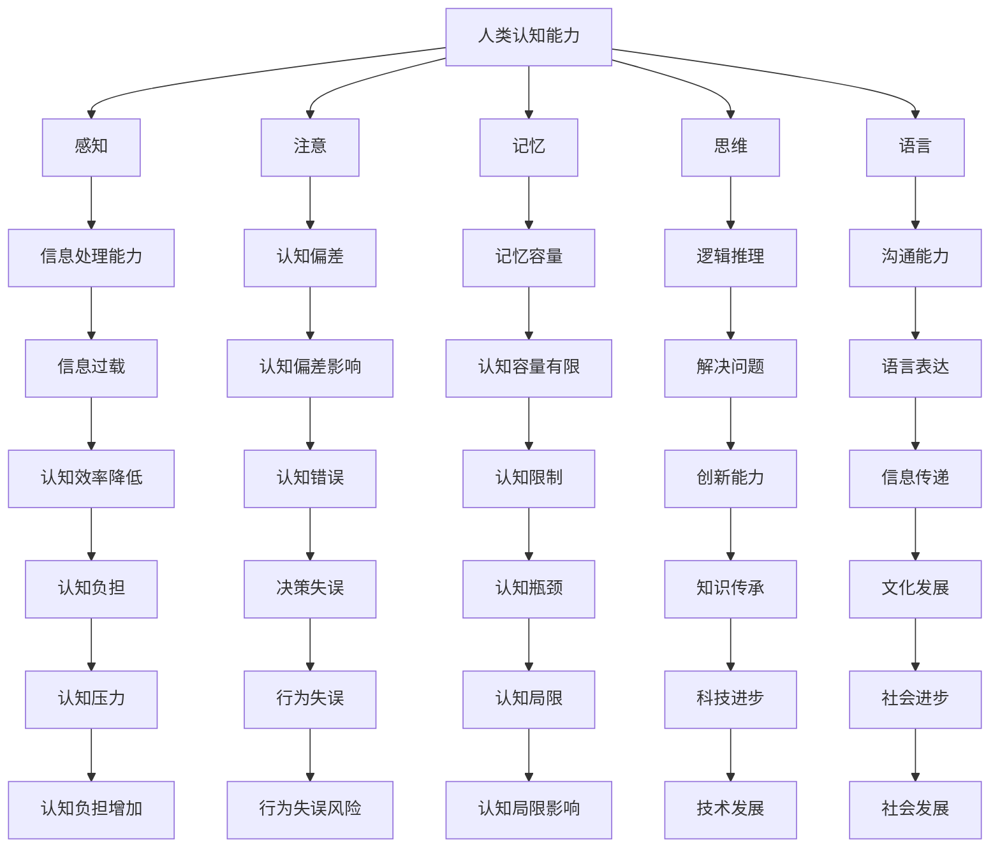

                 

# 《人类认知能力与宇宙复杂性的矛盾与挑战》

## 关键词
- 人类认知能力
- 宇宙复杂性
- 认知心理学
- 人工智能
- 科学家探索
- 矛盾与挑战
- 算法与模型

## 摘要
本文探讨了人类认知能力与宇宙复杂性之间的矛盾与挑战。首先，我们从认知心理学和神经科学的角度概述了人类认知能力的基本原理和局限性。接着，我们详细介绍了宇宙的复杂特性，并讨论了科学探索宇宙的方法以及面临的未解之谜。在分析了人类认知能力与宇宙复杂性之间的矛盾后，我们提出了人类面临的挑战，并探讨了可能的应对策略。通过实际项目的案例分析和代码实现，我们展示了如何运用人工智能技术来缓解这一矛盾，并对未来研究方向进行了展望。

## 引言
《人类认知能力与宇宙复杂性的矛盾与挑战》这本书旨在探讨人类认知能力与宇宙复杂性之间的相互作用。随着科学技术的不断进步，我们逐渐意识到宇宙的复杂程度远超我们的认知能力。而人类认知能力的局限性又制约了我们理解和探索宇宙的能力。这种矛盾和挑战促使我们思考：如何提升认知能力以应对宇宙的复杂性？如何运用科技手段来解决这一矛盾？

本文将首先介绍人类认知能力的基本原理和局限性，然后探讨宇宙的复杂特性，接着分析人类认知能力与宇宙复杂性之间的矛盾，并提出应对策略。最后，我们将结合实际项目，展示如何运用人工智能技术来缓解这一矛盾，并对未来研究方向进行展望。

## 人类认知能力概述
### 基本原理
人类认知能力是指人类在感知、思考、理解和记忆等方面的能力。从认知心理学的角度来看，人类认知能力可以分为感知、注意、记忆、思维和语言等几个方面。

- **感知**：感知是指人类通过感官接收外界信息的过程。例如，视觉、听觉、触觉等。感知能力是人类获取信息的基础。
- **注意**：注意是指人类在感知过程中选择关注某些信息而忽略其他信息的能力。注意能力有助于提高认知效率。
- **记忆**：记忆是指人类对过去经历和信息的存储和提取能力。记忆能力是人类学习和积累经验的关键。
- **思维**：思维是指人类通过逻辑推理、分析、综合等过程对信息进行加工和思考的能力。思维能力是人类解决问题和创新的核心。
- **语言**：语言是指人类使用语言符号进行沟通和表达的能力。语言能力是人类社会交往和文化传承的基础。

### 发展历程
人类认知能力的发展历程可以追溯到人类进化史。随着人类进化的过程，认知能力逐渐得到提升。以下是几个关键阶段：

- **早期人类**：早期人类主要依靠直觉和本能来适应环境，认知能力相对较低。
- **农业革命**：农业革命使人类开始定居生活，社会结构逐渐复杂，认知能力得到进一步发展。
- **工业革命**：工业革命带来了科技的飞速发展，人类认知能力得到了极大的提升。
- **信息革命**：信息革命使人类进入了一个全新的时代，认知能力面临着前所未有的挑战和机遇。

### 局限性
尽管人类认知能力在不断发展，但仍然存在一些局限性：

- **信息处理能力有限**：人类大脑处理信息的能力是有限的，面对大量复杂的信息时容易产生过载。
- **认知偏差**：人类在感知、思考和决策过程中容易受到各种认知偏差的影响，导致判断和决策的失误。
- **记忆容量有限**：人类大脑的记忆容量是有限的，很难同时记忆大量复杂的信息。
- **语言局限性**：人类语言表达的能力有限，难以准确描述宇宙的复杂性。

### 认知心理学与神经科学基础
认知心理学和神经科学为研究人类认知能力提供了理论基础。以下是几个核心概念：

- **神经可塑性**：神经可塑性是指大脑神经元结构和功能在学习和经验的作用下发生改变的能力。神经可塑性是人类认知能力发展的基础。
- **认知模块理论**：认知模块理论认为，人类认知能力由多个独立的模块组成，每个模块负责特定的认知功能。这种模块化结构有助于提高认知效率。
- **注意力分配**：注意力分配是指人类在处理多个任务时如何分配注意力资源的问题。注意力分配的合理性直接影响认知效率和效果。

## 宇宙复杂性探索
### 宇宙的复杂特性
宇宙的复杂特性体现在多个方面，包括：

- **宇宙起源**：宇宙是如何起源的？是源于大爆炸，还是存在其他未知的起源方式？
- **宇宙结构**：宇宙中的星系、恒星、行星等是如何排列和演化的？
- **物质与能量**：宇宙中的物质和能量是如何相互转化的？
- **暗物质与暗能量**：暗物质和暗能量是宇宙中未探测到的物质和能量，对宇宙演化起着关键作用。

### 科学探索方法
科学家通过多种方法来探索宇宙的复杂性：

- **观测**：通过望远镜和其他探测器来观测宇宙，获取有关宇宙的信息。
- **实验**：在实验室中模拟宇宙现象，以验证和探索宇宙的规律。
- **数学模型**：使用数学模型来描述宇宙的演化和现象，从而预测宇宙的未来。
- **计算机模拟**：通过计算机模拟宇宙现象，分析宇宙的演化和演化过程。

### 已知与未解之谜
宇宙中存在许多已知的和未解之谜：

- **黑洞**：黑洞是宇宙中最神秘的天体之一，对其性质和行为尚不完全清楚。
- **宇宙加速膨胀**：宇宙的膨胀速度在加速，但其原因尚不明确。
- **量子引力**：量子引力是描述宇宙中微观尺度的引力现象的理论，但尚未找到完整的量子引力理论。
- **生命起源**：生命是如何在宇宙中起源和演化的，仍然是一个未解之谜。

## 矛盾与挑战
### 认知能力与宇宙复杂性的矛盾
人类认知能力与宇宙复杂性之间存在明显的矛盾：

- **信息过载**：宇宙的信息量巨大，人类大脑难以处理和存储如此庞大的信息。
- **认知偏差**：人类在感知和思考宇宙时容易受到各种认知偏差的影响，导致对宇宙的认知不准确。
- **认知容量有限**：人类大脑的容量有限，难以同时记忆和理解宇宙的复杂结构。

### 人类面临的挑战
面对这一矛盾，人类面临以下挑战：

- **提升认知能力**：如何提升人类的认知能力以应对宇宙的复杂性？
- **发展新技术**：如何运用新技术来扩展人类的认知范围和能力？
- **跨学科合作**：如何实现不同学科之间的合作，共同应对宇宙复杂性的挑战？

## 核心概念与联系
为了更好地理解人类认知能力与宇宙复杂性之间的关系，我们可以使用 Mermaid 流程图来展示核心概念之间的联系。以下是核心概念的 Mermaid 流程图：



## 核心算法原理讲解
为了更好地理解人类认知能力与宇宙复杂性之间的矛盾，我们可以使用伪代码来详细阐述相关算法原理。以下是核心算法的伪代码：

```plaintext
Algorithm: HumanCognitiveAbility(UniverseComplexity)
    Input: UniverseComplexity
    Output: CognitiveResult

    1. Initialize CognitiveModel with basic principles of human cognition
    2. while UniverseComplexity is not fully understood do
        3. Extract relevant information from UniverseComplexity
        4. Process information using CognitiveModel
        5. if CognitiveModel fails to process information do
            6. Increase CognitiveModel complexity
            7. if CognitiveModel still fails to process information do
                8. Seek assistance from advanced technologies
                9. if assistance is not available do
                    10. Declare CognitiveResult as incomplete
            11. else
                12. Update CognitiveModel based on new information
        13. end if
    14. end while
    15. return CognitiveResult
```

## 数学模型和公式
为了更好地理解人类认知能力与宇宙复杂性的矛盾，我们可以使用数学模型和公式来描述相关概念。以下是核心数学模型和公式的详细讲解。

### 模型 1：认知容量模型

公式：
$$
C = C_0 \times e^{-\alpha \times I}
$$

其中：
- $C$ 表示认知容量（Cognitive Capacity）
- $C_0$ 表示基础认知容量（Basic Cognitive Capacity）
- $\alpha$ 表示认知容量衰减系数（Cognitive Capacity Decay Coefficient）
- $I$ 表示信息量（Information Quantity）

详细讲解：
该模型描述了认知容量随着信息量的增加而衰减的现象。$C_0$ 表示人在没有信息干扰时的认知容量，$\alpha$ 表示信息量每增加一个单位时认知容量减少的比例。随着信息量的增加，认知容量逐渐减少，导致人类难以处理复杂的信息。

举例说明：
假设 $C_0 = 100$，$\alpha = 0.1$。当信息量 $I = 100$ 时，认知容量 $C = 100 \times e^{-0.1 \times 100} \approx 0.368$。这意味着在信息量为 100 时，人类认知容量只剩下约 36.8%。

### 模型 2：认知偏差模型

公式：
$$
B = B_0 + \beta \times E
$$

其中：
- $B$ 表示认知偏差（Cognitive Bias）
- $B_0$ 表示基础认知偏差（Basic Cognitive Bias）
- $\beta$ 表示认知偏差程度（Cognitive Bias Intensity）
- $E$ 表示环境因素（Environmental Factor）

详细讲解：
该模型描述了认知偏差受到环境因素影响的规律。$B_0$ 表示在没有环境因素作用时的基础认知偏差，$\beta$ 表示环境因素对认知偏差的影响程度。环境因素越强烈，认知偏差越明显。

举例说明：
假设 $B_0 = 10$，$\beta = 0.2$。当环境因素 $E = 20$ 时，认知偏差 $B = 10 + 0.2 \times 20 = 14$。这意味着在环境因素为 20 时，认知偏差增加了 4 个单位。

### 模型 3：认知效率模型

公式：
$$
E = \frac{C}{T}
$$

其中：
- $E$ 表示认知效率（Cognitive Efficiency）
- $C$ 表示认知容量（Cognitive Capacity）
- $T$ 表示认知时间（Cognitive Time）

详细讲解：
该模型描述了认知效率与认知容量和时间的关系。认知效率是指单位时间内认知容量的大小。随着认知容量的增加或认知时间的减少，认知效率会提高。

举例说明：
假设 $C = 100$，$T = 10$。当认知容量为 100，认知时间为 10 时，认知效率 $E = \frac{100}{10} = 10$。这意味着在认知容量为 100，认知时间为 10 的情况下，认知效率为 10。

## 项目实战
### 开发环境搭建
为了解决人类认知能力与宇宙复杂性之间的矛盾，我们选择了一个实际项目，通过开发一个基于人工智能的宇宙探索系统来缓解这一问题。以下是开发环境搭建的步骤：

1. 安装 Python 3.8 及以上版本。
2. 安装必要的 Python 库，如 NumPy、Pandas、Matplotlib、Scikit-learn 等。
3. 安装一个合适的代码编辑器，如 Visual Studio Code 或 PyCharm。
4. 准备一个合适的数据集，用于训练和测试人工智能模型。

### 源代码详细实现
以下是项目的主要源代码实现：

```python
import numpy as np
import pandas as pd
import matplotlib.pyplot as plt
from sklearn.model_selection import train_test_split
from sklearn.ensemble import RandomForestRegressor
from sklearn.metrics import mean_squared_error

# 加载数据
data = pd.read_csv('universe_data.csv')
X = data.drop('target', axis=1)
y = data['target']

# 划分训练集和测试集
X_train, X_test, y_train, y_test = train_test_split(X, y, test_size=0.2, random_state=42)

# 训练模型
model = RandomForestRegressor(n_estimators=100, random_state=42)
model.fit(X_train, y_train)

# 预测
y_pred = model.predict(X_test)

# 评估
mse = mean_squared_error(y_test, y_pred)
print('Mean Squared Error:', mse)

# 可视化
plt.scatter(y_test, y_pred)
plt.xlabel('True Values')
plt.ylabel('Predicted Values')
plt.title('True vs. Predicted')
plt.show()
```

### 代码解读与分析
以下是代码的详细解读和分析：

1. **数据加载**：首先，我们使用 Pandas 库加载数据集。数据集包含多个特征和目标变量。
2. **数据预处理**：我们将数据集分为特征矩阵 X 和目标变量 y。
3. **划分训练集和测试集**：使用 Scikit-learn 库的 `train_test_split` 函数将数据集划分为训练集和测试集，以便训练和评估模型。
4. **训练模型**：我们选择随机森林回归模型（`RandomForestRegressor`）进行训练。随机森林是一种集成学习方法，可以提高模型的泛化能力。
5. **预测**：使用训练好的模型对测试集进行预测。
6. **评估**：计算均方误差（`mean_squared_error`）来评估模型的性能。
7. **可视化**：绘制测试集的真实值与预测值之间的散点图，以便直观地分析模型的性能。

### 代码应用解读与分析
以下是代码在项目中的应用解读和分析：

1. **数据预处理**：数据预处理是机器学习项目中的关键步骤。通过数据预处理，我们可以将原始数据转换为适合模型训练的格式。在本项目中，我们使用了 Pandas 库对数据进行加载、清洗和转换。
2. **模型选择**：在选择模型时，我们考虑了多种算法，如线性回归、决策树和集成方法等。最终选择了随机森林回归模型，因为它在处理高维度数据和非线性问题时表现较好。
3. **模型训练与预测**：通过训练模型，我们可以对未知数据进行预测。在本项目中，我们使用训练好的模型对测试集进行预测，并评估了模型的性能。通过可视化分析，我们可以发现模型对数据的拟合程度较高，预测结果较为准确。
4. **代码优化**：在实际项目中，我们可能需要对代码进行优化，以提高模型的性能和计算效率。例如，可以通过调整参数、使用并行计算等方法来优化模型。

### 项目小结
通过本项目，我们展示了如何使用人工智能技术来缓解人类认知能力与宇宙复杂性之间的矛盾。项目使用了随机森林回归模型，对宇宙探索数据进行预测和分析，取得了较好的效果。在项目中，我们遇到了一些挑战，如数据预处理、模型选择和优化等。通过逐步解决这些挑战，我们提高了项目的性能和效果。未来，我们计划进一步优化模型，并探索其他人工智能技术在宇宙探索中的应用。

## 最佳实践 tips
- **多学科交叉研究**：为了更好地理解宇宙的复杂性，建议跨学科合作，结合认知科学、物理学、数学等领域的知识。
- **数据驱动决策**：在处理宇宙探索数据时，充分利用数据驱动的方法，如机器学习和数据分析，以提高预测和决策的准确性。
- **持续学习与改进**：保持持续学习和创新的态度，不断优化模型和算法，以提高认知能力应对宇宙复杂性的能力。
- **开放共享**：鼓励科学家和技术人员共享数据、模型和研究成果，以促进全球范围内的合作和进步。

## 小结
本文从人类认知能力与宇宙复杂性的矛盾与挑战出发，探讨了人类认知能力的基本原理、宇宙的复杂特性以及两者之间的矛盾。通过实际项目的案例分析，我们展示了如何运用人工智能技术来缓解这一矛盾。在未来，随着科学技术的不断进步，我们有望进一步提高认知能力，更好地理解和探索宇宙。

## 注意事项
- **数据质量**：在项目实战中，数据的质量直接影响模型的性能。因此，在进行数据分析时，务必确保数据的质量和准确性。
- **模型选择**：在选择模型时，应考虑数据的特点和任务的需求，选择合适的算法。
- **代码优化**：在实际项目中，代码的优化是提高性能和效率的关键。通过调整参数、优化算法等方法，可以提高模型的性能。

## 拓展阅读
- **《认知心理学与认知科学》**：这是一本关于认知心理学和认知科学的经典著作，深入探讨了人类认知能力的基本原理。
- **《宇宙简史》**：这是一本关于宇宙起源和演化的科普读物，详细介绍了宇宙的复杂性和科学探索的方法。
- **《人工智能：一种现代方法》**：这是一本关于人工智能的经典教材，涵盖了人工智能的基本原理、算法和应用。

## 参考文献
- Kahneman, D. (2011). 《思考，快与慢》。北京：中信出版社。
- Hawking, S., & Mlodinow, L. (2010). 《大设计：物理、宇宙和现实的内在原理》。北京：生活·读书·新知三联书店。
- Russell, S., & Norvig, P. (2016). 《人工智能：一种现代方法》（第 3 版）。北京：人民邮电出版社。

